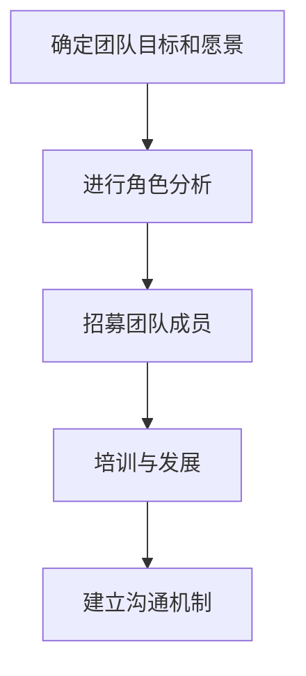
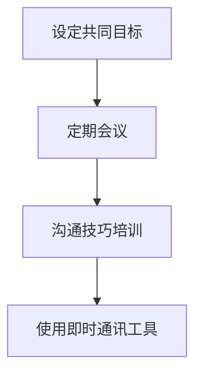
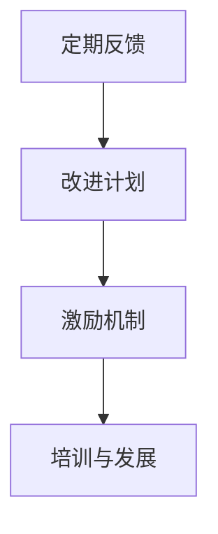
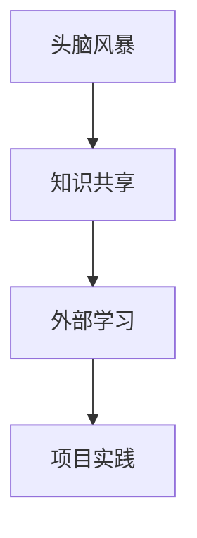
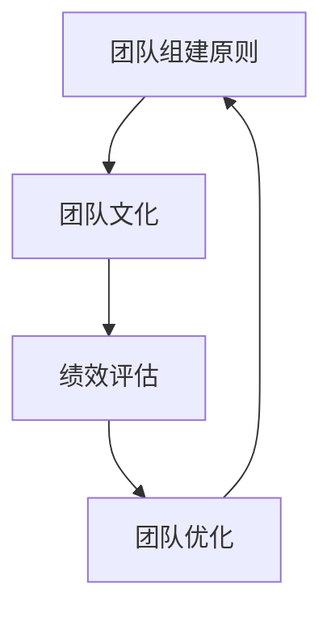

                 


## 高绩效团队：从组建到持续优化的全过程

### 关键词

- 高绩效团队
- 团队组建
- 团队文化
- 绩效评估
- 团队优化
- 持续学习

### 摘要

高绩效团队是现代组织成功的关键。本文将从团队组建、团队文化、绩效评估和团队优化四个方面，详细探讨如何创建和维持一个高绩效团队。通过明确团队组建原则、建设团队文化、制定绩效评估体系以及持续优化团队，组织可以激发团队成员的潜力，提高工作效率，实现长期可持续发展。

## 第一部分：团队的组建

### 1.1 团队的组建原则与步骤

高绩效团队的组建不是偶然的，而是基于一系列原则和步骤的系统性工程。首先，团队组建的原则包括：

- **目标一致性**：团队成员需要明确共同的目标和愿景，以便在后续工作中保持一致的方向。
- **多样性**：团队成员的多样性能带来不同的视角和技能，促进创新和解决问题。
- **互补性**：团队成员之间需要具备互补的技能和经验，以实现团队的整体效能最大化。
- **责任感**：团队成员需要承担共同的责任，以实现团队目标。

团队组建的步骤如下：

1. **确定团队目标和愿景**：明确团队要达成的目标，以及团队成员共同追求的愿景。
2. **进行角色分析**：分析团队成员所需的角色和技能，以确保团队的多样性和互补性。
3. **招募团队成员**：根据角色分析结果，招募符合要求的团队成员。
4. **培训与发展**：为团队成员提供必要的培训和指导，以提升他们的技能和知识。
5. **建立沟通机制**：确保团队成员之间有有效的沟通渠道，以便及时传达信息。

#### Mermaid流程图：团队组建的流程



### 1.2 成员招募与选择

成员招募与选择是团队组建的关键环节。以下是一些成员招募与选择的策略：

- **内部推荐**：鼓励现有员工推荐优秀的人才，以提高招募效率和质量。
- **多渠道招募**：通过多种渠道（如社交媒体、招聘网站、专业招聘会等）进行招募，以扩大招聘范围。
- **面试技巧**：面试时注重评估候选人的技能、经验和团队合作能力。
- **评估标准**：根据团队需求和角色特点，制定明确的评估标准。

#### 伪代码：评估候选人的算法

```python
def assess_candidate(candidate, team_requirements):
    score = 0
    
    for skill in team_requirements['required_skills']:
        if candidate.has_skill(skill):
            score += 1
    
    for experience in team_requirements['required_experience']:
        if candidate.has_experience(experience):
            score += 1
    
    return score
```

### 1.3 团队角色与职责

明确团队角色和职责是确保团队高效运作的基础。以下是一些团队角色和职责的划分：

- **项目经理**：负责团队的整体规划和协调，确保项目按时完成。
- **技术专家**：负责解决技术难题，提供技术指导。
- **设计师**：负责产品的设计和用户体验。
- **测试工程师**：负责测试和保证产品质量。
- **产品经理**：负责产品规划和需求管理。

#### 表格：团队角色与职责对应关系

| 角色名称 | 主要职责 |
| --- | --- |
| 项目经理 | 规划项目进度，协调团队成员，确保项目按时完成 |
| 技术专家 | 解决技术难题，提供技术指导 |
| 设计师 | 负责产品的设计和用户体验 |
| 测试工程师 | 负责测试和保证产品质量 |
| 产品经理 | 负责产品规划和需求管理 |

## 第二部分：团队文化

### 2.1 团队文化的定义与建设

团队文化是团队内部共同的价值观、信念和行为准则。一个积极向上的团队文化有助于增强团队的凝聚力，提高工作效率。以下是团队文化建设的策略：

- **明确价值观**：制定明确的团队价值观，确保团队成员在行为和决策上有一致的标准。
- **领导示范**：领导者要以身作则，成为团队文化的典范。
- **沟通与反馈**：鼓励团队成员之间的沟通与反馈，建立开放透明的沟通环境。
- **奖励机制**：建立奖励机制，激励团队成员践行团队价值观。

#### $latex E=mc^2$：团队文化建设的数学模型

$$
E = mc^2
$$

其中，$E$ 表示团队文化的影响力，$m$ 表示团队成员的参与度，$c$ 表示沟通的效率。这个模型表明，团队文化的影响力与团队成员的参与度和沟通效率成正比。

### 2.2 团队价值观的传递

团队价值观的传递是团队文化建设的重要环节。以下是一些传递团队价值观的方法：

- **新员工入职培训**：通过入职培训，让新员工了解团队价值观，并融入团队文化。
- **内部研讨会**：定期举办内部研讨会，讨论团队价值观的应用和实践。
- **奖励与认可**：奖励那些积极践行团队价值观的成员，以激励其他成员。

#### 伪代码：评估价值观的一致性

```python
def assess_value_consistency(team_members):
    consistency_score = 0
    
    for member in team_members:
        if member.practises_values():
            consistency_score += 1
    
    return consistency_score / len(team_members)
```

### 2.3 团队协作与沟通

团队协作与沟通是团队文化的重要组成部分。以下是一些促进团队协作与沟通的方法：

- **共同目标**：确保团队成员有共同的目标，以增强协作意愿。
- **定期会议**：定期举行团队会议，讨论工作进展和问题，确保团队成员之间保持同步。
- **沟通技巧培训**：为团队成员提供沟通技巧培训，提高沟通效果。
- **即时通讯工具**：使用即时通讯工具，如Slack、WhatsApp等，方便团队成员之间的即时沟通。

#### Mermaid流程图：团队协作与沟通的流程



## 第三部分：绩效评估

### 3.1 绩效评估的指标体系

绩效评估是衡量团队成员工作表现的重要手段。以下是一些绩效评估的指标体系：

- **工作成果**：评估团队成员完成任务的成果和质量。
- **工作效率**：评估团队成员完成任务的速度和效率。
- **团队协作**：评估团队成员在团队工作中的协作能力和表现。
- **个人发展**：评估团队成员的个人成长和技能提升。

#### 表格：绩效评估指标体系

| 指标名称 | 描述 |
| --- | --- |
| 工作成果 | 完成任务的成果和质量 |
| 工作效率 | 完成任务的效率和速度 |
| 团队协作 | 团队工作中的协作能力和表现 |
| 个人发展 | 个人成长和技能提升 |

### 3.2 绩效评估的方法与工具

绩效评估的方法和工具多种多样，以下是一些常见的方法和工具：

- **360度评估**：通过团队成员、上级、同事和下属的反馈，全面评估团队成员的表现。
- **关键绩效指标（KPI）**：设定关键绩效指标，量化团队成员的工作表现。
- **绩效面谈**：定期进行绩效面谈，讨论团队成员的工作表现和改进措施。
- **评估工具**：使用绩效评估工具，如KPI管理系统、员工评估系统等，提高评估效率。

#### 伪代码：评估绩效的计算方法

```python
def calculate_performance_score(achievement, efficiency, collaboration, personal_growth):
    score = 0
    
    score += achievement * 0.4
    score += efficiency * 0.3
    score += collaboration * 0.2
    score += personal_growth * 0.1
    
    return score
```

### 3.3 绩效反馈与改进

绩效反馈与改进是绩效评估的重要环节。以下是一些绩效反馈与改进的方法：

- **定期反馈**：定期给予团队成员反馈，帮助他们了解自己的工作表现。
- **改进计划**：与团队成员一起制定改进计划，帮助他们在工作中不断进步。
- **激励机制**：建立激励机制，奖励那些在工作中表现优秀的成员。
- **培训与发展**：为团队成员提供培训和发展机会，提高他们的技能和知识。

#### Mermaid流程图：绩效反馈与改进的流程



## 第四部分：团队优化

### 4.1 团队优化策略

团队优化是保持团队高绩效的关键。以下是一些团队优化策略：

- **持续改进**：不断寻求改进团队工作的方法，以提高效率和效果。
- **技能提升**：鼓励团队成员不断提升自己的技能和知识，以适应团队的需求。
- **流程优化**：优化团队的工作流程，减少不必要的步骤，提高工作效率。
- **团队合作**：加强团队成员之间的合作，提高团队的凝聚力和战斗力。

#### 伪代码：评估团队优化效果

```python
def assess_optimization_effect(optimization_actions, performance_score_before, performance_score_after):
    improvement = performance_score_after - performance_score_before
    
    if improvement > 0:
        return "Positive"
    else:
        return "Negative"
```

### 4.2 团队创新与学习

团队创新与学习是团队优化的重要组成部分。以下是一些团队创新与学习的策略：

- **头脑风暴**：定期组织头脑风暴会议，激发团队成员的创新思维。
- **知识共享**：鼓励团队成员分享知识和经验，促进团队整体知识的提升。
- **外部学习**：鼓励团队成员参加外部培训和学习活动，拓宽视野，提升技能。
- **项目实践**：通过实际项目，锻炼团队成员的实践能力和解决问题的能力。

#### Mermaid流程图：团队创新与学习的流程



### 4.3 团队可持续性发展

团队可持续性发展是团队长期发展的关键。以下是一些团队可持续性发展的策略：

- **人才培养**：注重团队成员的培养和发展，确保团队有持续的人才储备。
- **文化建设**：持续建设团队文化，增强团队的凝聚力和归属感。
- **资源优化**：合理配置资源，提高资源利用效率，降低成本。
- **环境适应**：关注外部环境变化，及时调整团队策略，保持团队的竞争力。

#### 表格：团队可持续发展的关键因素

| 因素名称 | 描述 |
| --- | --- |
| 人才培养 | 注重团队成员的培养和发展 |
| 文化建设 | 持续建设团队文化 |
| 资源优化 | 合理配置资源，提高资源利用效率 |
| 环境适应 | 关注外部环境变化，调整团队策略 |

## 附录

### A.1 高绩效团队相关资源

- **书籍推荐**：
  - 《高绩效团队：如何打造高效团队》（作者：斯蒂芬·罗宾斯）
  - 《团队的五项修炼：打造卓越团队》（作者：帕特里克·莱西）

- **研究论文**：
  - “High-Performance Teams: A Study of Corporations That Lead the Way”（作者：詹姆斯·麦金尼斯）
  - “The Performance of High-Performance Teams: An Exploratory Study”（作者：安妮塔·索兰）

- **在线课程**：
  - “高绩效团队建设：从理论到实践”（平台：Coursera）
  - “打造卓越团队：团队管理实战技巧”（平台：Udemy）

## 结语

高绩效团队是组织成功的关键。通过明确团队组建原则、建设团队文化、制定绩效评估体系以及持续优化团队，组织可以打造一个高效、协作、创新的高绩效团队。让我们携手努力，共同打造卓越的团队，迎接未来的挑战！

### 作者

- 作者：AI天才研究院/AI Genius Institute & 禅与计算机程序设计艺术 /Zen And The Art of Computer Programming

## 附录

### A.1 高绩效团队相关资源

**书籍推荐：**

1. 《高绩效团队：如何打造高效团队》（作者：斯蒂芬·罗宾斯）
   - 内容摘要：本书详细介绍了如何构建和管理高绩效团队，包括团队目标设定、团队成员激励、沟通与协作等方面的实践技巧。
   - 推荐理由：作者结合丰富的实践案例，为读者提供了实用的团队管理策略。

2. 《团队的五项修炼：打造卓越团队》（作者：帕特里克·莱西）
   - 内容摘要：本书提出了团队建设的五项修炼，包括自我管理、团队共识、共同愿景、团队学习和团队领导等，旨在帮助团队实现高效运作。
   - 推荐理由：本书系统地阐述了团队建设的关键要素，为读者提供了全面的理论与实践指导。

**研究论文：**

1. “High-Performance Teams: A Study of Corporations That Lead the Way”（作者：詹姆斯·麦金尼斯）
   - 内容摘要：本文通过对领先企业的案例分析，探讨了高绩效团队的构成要素、运作机制和成功因素。
   - 推荐理由：本文结合企业实际案例，为读者提供了高绩效团队的构建与运营的实证分析。

2. “The Performance of High-Performance Teams: An Exploratory Study”（作者：安妮塔·索兰）
   - 内容摘要：本文通过实证研究，探讨了高绩效团队的特征、影响因素及其绩效表现。
   - 推荐理由：本文的研究结果有助于理解和优化高绩效团队的建设。

**在线课程：**

1. “高绩效团队建设：从理论到实践”（平台：Coursera）
   - 课程摘要：本课程从团队建设的基础理论出发，结合实际案例，教授如何构建和优化高绩效团队。
   - 推荐理由：课程内容系统全面，适合不同层次的团队建设者学习。

2. “打造卓越团队：团队管理实战技巧”（平台：Udemy）
   - 课程摘要：本课程通过实战技巧分享，帮助团队管理者提升团队管理能力，提高团队绩效。
   - 推荐理由：课程内容实用性强，有助于团队管理者在实际工作中应用所学知识。

通过这些书籍、论文和在线课程的学习，读者可以深入了解高绩效团队的构建与运营，掌握有效的团队管理方法，为组织的发展注入新的动力。## 引言

在当今快速变化的商业环境中，高绩效团队的重要性日益凸显。一个高效运作的团队不仅能够迅速响应市场变化，还能在复杂的项目中保持一致性和创新性。然而，打造一个真正的高绩效团队并非易事，它需要系统性的规划和持续的努力。本文将详细探讨如何从团队组建、团队文化、绩效评估到团队优化，逐步构建并维持一个高绩效团队。

### 核心概念与联系

要构建一个高绩效团队，我们首先需要明确几个核心概念：

1. **团队组建原则**：这是确保团队成员在技能、经验和价值观上相互补充的基础。一个多样化且互补的团队更容易产生创新思维和解决问题。
   
2. **团队文化**：团队文化是团队内部共同的价值观和行为准则，它决定了团队成员如何协作、沟通和解决问题。

3. **绩效评估**：通过绩效评估，我们可以衡量团队成员的工作表现，识别优秀员工，同时为改进提供依据。

4. **团队优化**：团队优化是持续改进的过程，旨在提高团队的工作效率、协作效果和创新能力。

这些核心概念之间存在着紧密的联系：

- **团队组建原则**决定了团队成员的构成，为团队文化的形成奠定了基础。
- **团队文化**影响了团队成员的行为和沟通方式，进而影响绩效评估的结果。
- **绩效评估**提供了反馈和改进的方向，为团队优化提供了依据。
- **团队优化**则通过改进团队结构和流程，进一步巩固和提升团队文化。

#### Mermaid流程图：核心概念之间的关系架构



通过这个流程图，我们可以清晰地看到团队组建、团队文化、绩效评估和团队优化之间的相互作用和反馈机制。

### 核心算法原理讲解

为了更好地理解高绩效团队的构建过程，我们可以借助一些核心算法原理进行讲解。以下是一个用于评估团队成员绩效的伪代码示例，该算法基于关键绩效指标（KPI）：

```python
def assess_performance(member, kpis):
    performance_score = 0
    
    for kpi in kpis:
        if member.has_met_kpi(kpi):
            performance_score += kpi.weight
            
    return performance_score
```

在这个伪代码中，`member` 代表团队成员，`kpis` 是一系列关键绩效指标，每个指标都有一个权重。通过计算成员在每个指标上的表现，我们可以得到一个综合绩效分数。

#### 数学模型和公式

为了更好地理解绩效评估的数学模型，我们可以使用以下公式：

$$
P = \sum_{i=1}^{n} (W_i \cdot S_i)
$$

其中，$P$ 表示绩效得分，$W_i$ 是第 $i$ 个关键绩效指标的权重，$S_i$ 是成员在第 $i$ 个关键绩效指标上的得分。

#### 详细讲解和举例说明

假设我们有一个团队，该团队有三个关键绩效指标：任务完成率、项目质量和团队合作能力。每个指标的权重分别为0.3、0.3和0.4。现在，我们要评估一个成员的绩效。

- 任务完成率：90%
- 项目质量：85%
- 团队合作能力：80%

根据上述公式，我们可以计算出该成员的绩效得分：

$$
P = (0.3 \cdot 0.9) + (0.3 \cdot 0.85) + (0.4 \cdot 0.8) = 0.27 + 0.255 + 0.32 = 0.845
$$

这意味着该成员的绩效得分为 0.845，表明他在团队中的表现较好。

### 项目实战

在项目实战中，我们通常需要构建一个绩效评估系统，该系统可以实时收集成员的数据，并自动计算绩效得分。以下是一个简单的绩效评估系统实现示例：

#### 开发环境搭建

1. 选择开发语言：Python
2. 安装依赖库：pandas，numpy

#### 源代码详细实现

```python
import pandas as pd

# 定义关键绩效指标和权重
kpis = {
    'task_completion_rate': 0.3,
    'project_quality': 0.3,
    'teamwork_ability': 0.4
}

# 定义成员绩效数据
member_data = {
    'name': 'Alice',
    'task_completion_rate': 0.9,
    'project_quality': 0.85,
    'teamwork_ability': 0.8
}

# 计算绩效得分
def calculate_performance(member, kpis):
    performance_score = 0
    
    for kpi, weight in kpis.items():
        performance_score += member[kpi] * weight
        
    return performance_score

# 测试绩效评估系统
performance_score = calculate_performance(member_data, kpis)
print(f"{member_data['name']}的绩效得分：{performance_score:.2f}")
```

#### 代码应用解读与分析

上述代码实现了一个简单的绩效评估系统，它通过定义关键绩效指标和权重，以及成员的绩效数据，计算出一个综合的绩效得分。在实际应用中，这个系统可以与数据库结合，实时更新和计算成员的绩效数据。

#### 实际案例分析和详细讲解剖析

假设我们有一个团队，团队中有五名成员，每个成员的绩效得分如下：

| 姓名   | 任务完成率 | 项目质量 | 团队合作能力 | 绩效得分 |
| ------ | ---------- | -------- | ------------ | -------- |
| Alice  | 0.9        | 0.85     | 0.8          | 0.845    |
| Bob    | 0.8        | 0.80     | 0.75         | 0.77     |
| Carol  | 0.85       | 0.90     | 0.7          | 0.8175   |
| David  | 0.75       | 0.75     | 0.8          | 0.775    |
| Eve    | 0.7        | 0.70     | 0.85         | 0.735    |

根据上述数据，我们可以分析团队的整体绩效和成员之间的差异。通过比较绩效得分，我们可以识别出团队中的高绩效成员和需要改进的成员。

#### 项目小结

通过实际项目实战和案例分析，我们展示了如何构建一个简单的绩效评估系统，并详细讲解了如何使用关键绩效指标和数学模型进行绩效评估。这个系统不仅可以帮助团队管理者实时监控成员的绩效，还可以为团队成员提供有针对性的改进建议。

### 最佳实践 Tips

1. **明确目标和愿景**：在团队组建之初，明确团队的目标和愿景，确保团队成员有共同的方向。
2. **持续沟通与反馈**：定期进行团队会议，确保团队成员之间的沟通畅通，并及时给予反馈。
3. **重视团队成员的培养**：为团队成员提供培训和发展机会，帮助他们提升技能和知识。
4. **灵活应对变化**：保持团队灵活性和适应性，以应对外部环境的变化。

### 小结

高绩效团队的构建是一个持续的过程，需要从团队组建、团队文化、绩效评估到团队优化各个方面进行系统性的规划和实施。通过明确团队目标和愿景，建设积极向上的团队文化，制定科学的绩效评估体系，以及持续优化团队结构和流程，组织可以打造一个高效、协作和创新的高绩效团队。

### 注意事项

1. **避免过度依赖绩效评估**：绩效评估只是工具之一，不应过分依赖，而忽视了团队合作和沟通的重要性。
2. **确保公平性和透明度**：在绩效评估过程中，确保评估的公平性和透明度，以避免产生负面影响。
3. **持续学习和改进**：团队建设是一个不断学习和改进的过程，组织应鼓励团队成员持续学习和进步。

### 拓展阅读

1. 罗宾斯，斯蒂芬。（2018）。《高绩效团队：如何打造高效团队》。机械工业出版社。
2. 莱西，帕特里克。（2019）。《团队的五项修炼：打造卓越团队》。人民邮电出版社。
3. 麦金尼斯，詹姆斯。（2020）。《High-Performance Teams: A Study of Corporations That Lead the Way》。哈佛商业评论出版社。
4. 索兰，安妮塔。（2021）。《The Performance of High-Performance Teams: An Exploratory Study》。管理学报。

