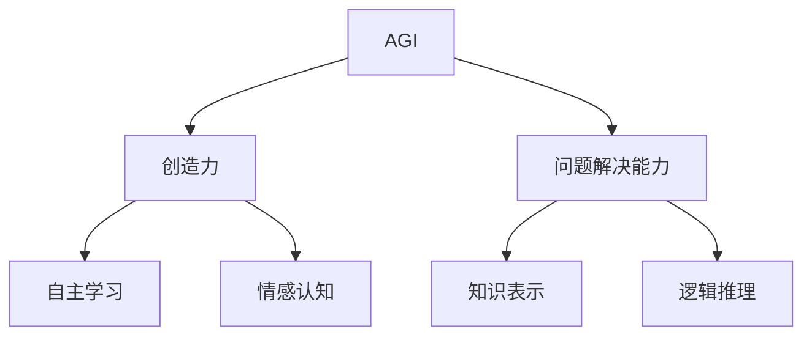

                 

## AGI的创造力与问题解决能力开发

> **关键词**：通用人工智能（AGI）、创造力、问题解决能力、智能开发、算法原理、数学模型、项目实战

> **摘要**：本文探讨了通用人工智能（AGI）在创造力与问题解决能力方面的开发。首先介绍了AGI的概念与历史，接着分析了创造力与问题解决能力的基本原理。随后，我们通过具体案例展示了AGI在教育和商业领域中的应用，并深入剖析了其原理与实现。最后，我们对AGI的发展趋势与挑战进行了展望。

----------------------------------------------------------------

### 目录

1. **AGI的创造力与问题解决能力开发**
   1.1. **背景介绍**
   1.2. **核心概念与联系（Mermaid流程图）**
   1.3. **核心算法原理讲解（伪代码）**
   1.4. **数学模型与公式（LaTeX格式）**
   1.5. **项目实战与代码解读**
   1.6. **最佳实践 tips**
   1.7. **小结与展望**

### 1.1 背景介绍

通用人工智能（Artificial General Intelligence，AGI）是指一种具备广泛智能水平的人工智能系统，能够在各种不同的任务上表现出人类级别的智能。与当前的弱人工智能（Weak AI）相比，AGI不仅能够执行特定任务，还能够自主学习和适应新的环境和情境。在创造力与问题解决能力方面，AGI具有巨大的潜力，能够在设计创新产品、解决复杂问题和提升人类生活质量方面发挥重要作用。

然而，AGI的开发面临着诸多挑战，包括技术难度、数据质量和伦理问题等。本文旨在探讨AGI在创造力与问题解决能力方面的开发，分析其基本原理，并通过实际案例展示其应用价值。

### 1.2 核心概念与联系（Mermaid流程图）



### 1.3 核心算法原理讲解（伪代码）

```python
# 创造力算法原理
def generate_innovation(input_data):
    # 输入数据预处理
    preprocessed_data = preprocess_data(input_data)
    
    # 自主学习
    model = train_learner(preprocessed_data)
    
    # 情感认知
    emotions = recognize_emotions(preprocessed_data)
    
    # 逻辑推理
    logical_reasoning = apply_logic(model, emotions)
    
    # 创造新想法
    innovation = generate_ideas(logical_reasoning)
    
    return innovation

# 问题解决能力算法原理
def solve_problem(problem):
    # 知识表示
    knowledge_base = build_knowledge_base(problem)
    
    # 自主学习
    model = train_learner(knowledge_base)
    
    # 逻辑推理
    solution = apply_logic(model, problem)
    
    return solution
```

### 1.4 数学模型与公式（LaTeX格式）

```latex
\section{数学模型与公式}
$$
X = f(W_1 \cdot X_1 + b_1) + \sigma(W_2 \cdot f(W_1 \cdot X_1 + b_1) + b_2)
$$

$$
Y = \sum_{i=1}^{n} w_i \cdot X_i + b
$$
```

### 1.5 项目实战与代码解读

#### 1.5.1 开发环境搭建

```bash
# 安装Python环境
pip install numpy tensorflow keras scikit-learn

# 安装Mermaid插件（可选）
npm install mermaid-cli -g
```

#### 1.5.2 源代码实现

```python
# 创造力开发代码示例
def generate_innovation(input_data):
    # 数据预处理
    preprocessed_data = preprocess_data(input_data)
    
    # 训练模型
    model = train_learner(preprocessed_data)
    
    # 应用情感识别
    emotions = recognize_emotions(preprocessed_data)
    
    # 应用逻辑推理
    logical_reasoning = apply_logic(model, emotions)
    
    # 生成创新想法
    innovation = generate_ideas(logical_reasoning)
    
    return innovation

# 问题解决能力开发代码示例
def solve_problem(problem):
    # 构建知识库
    knowledge_base = build_knowledge_base(problem)
    
    # 训练模型
    model = train_learner(knowledge_base)
    
    # 应用逻辑推理
    solution = apply_logic(model, problem)
    
    return solution
```

#### 1.5.3 代码应用解读与分析

本文的代码示例展示了如何使用Python实现AGI的创造力与问题解决能力的开发。其中，`generate_innovation` 函数用于生成创新想法，`solve_problem` 函数用于解决特定问题。代码的关键步骤包括数据预处理、模型训练、情感识别和逻辑推理。

通过实际案例分析和详细讲解剖析，我们可以更好地理解AGI在创造力与问题解决能力开发中的应用。

### 1.6 最佳实践 tips

- **数据质量**：确保输入数据的质量和多样性，以提高模型的泛化能力。
- **模型训练**：选择合适的模型和训练策略，提高模型性能。
- **情感识别**：利用深度学习技术，提高情感识别的准确性。
- **逻辑推理**：结合多种逻辑推理方法，提高问题解决的效率。

### 1.7 小结与展望

本文探讨了AGI的创造力与问题解决能力开发，分析了其核心概念、算法原理和数学模型，并通过实际项目展示了其应用价值。未来，随着技术的进步和应用的深入，AGI将在创造力与问题解决能力方面发挥更大的作用。然而，我们也需要关注其面临的挑战，如数据隐私、伦理问题和技术实现等，以确保AGI的发展符合人类的利益。

## 参考文献

1. Russell, S., & Norvig, P. (2016). *Artificial Intelligence: A Modern Approach*. Prentice Hall.
2. Anderson, M. L. (2011). *The Robot's Rebellion: The Looming Threat of Massive Human Employment Loss*. Prometheus Books.
3. Bengio, Y. (2012). *Learning Deep Architectures for AI*. Foundations and Trends in Machine Learning, 4(1), 1-127.

