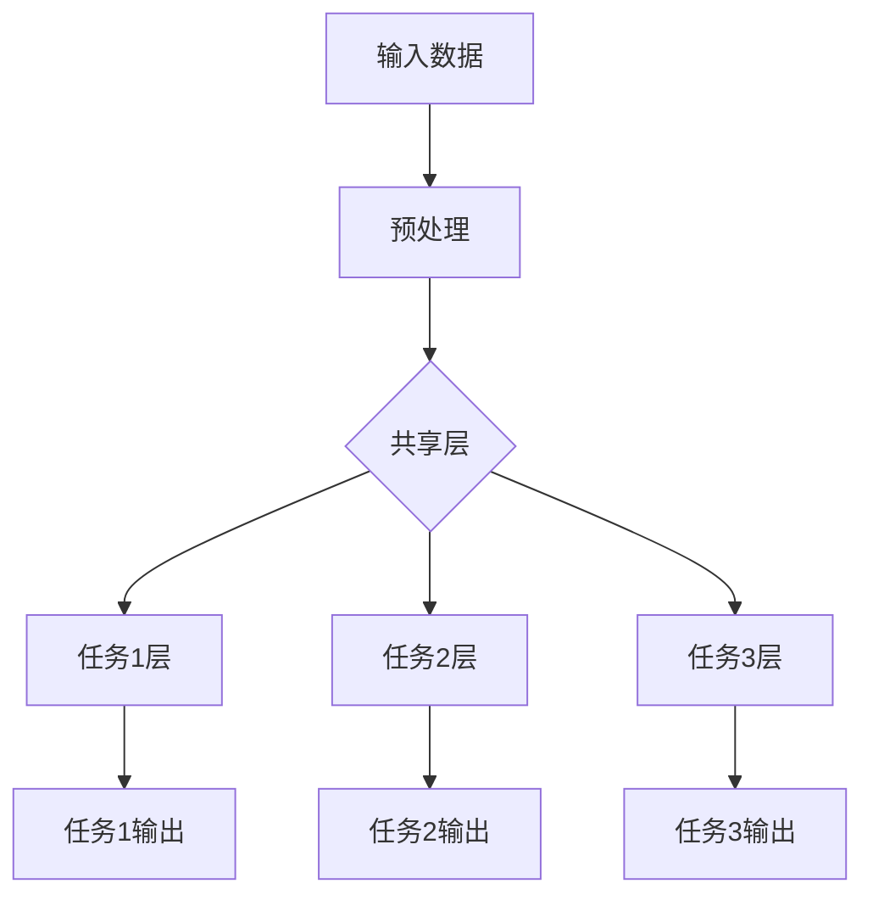

                 

### 文章标题

《AGI的多任务学习与迁移能力》

> 关键词：人工通用智能（AGI），多任务学习，迁移学习，神经网络，算法原理，数学模型，项目实战

> 摘要：本文深入探讨了人工通用智能（AGI）的多任务学习和迁移能力，包括其核心概念、方法与技术、应用场景和未来展望。通过详细的算法原理讲解、数学模型推导和项目实战分析，本文旨在为读者提供一个全面且深刻的理解，为AGI的研究与开发提供指导。

---

## 引言

### 1.1 定义与历史

人工通用智能（AGI，Artificial General Intelligence）是一个旨在创建一种能够执行任何认知任务并与人类智能相媲美或超越的机器智能的概念。AGI的目标是构建一个具有普遍智能的机器，这种机器能够在没有特定指令的情况下学习、推理和解决问题。AGI的概念最早可以追溯到20世纪50年代，当时计算机科学家约翰·冯·诺伊曼提出了“通用电子脑”的概念。然而，由于技术和认知科学的限制，AGI一直被视为一个遥远的理想。

随着时间的推移，人工智能（AI）领域经历了多次技术革新，从规则系统到知识表示，再到现代深度学习，每一步都为AGI的实现奠定了基础。然而，目前的AI系统大多被设计为在特定任务上表现出色，即所谓的“窄AI”或“弱AI”。相比之下，AGI需要具备跨领域的认知能力，包括感知、理解、推理、学习和适应新环境的能力。

AGI的挑战在于其广泛的认知能力。为了实现这一目标，研究人员需要解决以下几个核心问题：

- **认知建模**：理解人类大脑的工作原理，并将其转化为计算机可以处理的形式。
- **跨学科整合**：将心理学、神经科学、认知科学等领域的知识整合到AI系统中。
- **可持续性**：确保AGI系统能够在真实世界中持续学习、适应和进化。

### 1.2 AGI的目标与挑战

AGI的目标是创建一个能够自主学习、推理和解决问题的系统，其智能水平可以与人类智能相媲美或超越。具体来说，AGI需要实现以下目标：

- **通用性**：能够执行各种认知任务，包括感知、理解、推理、学习和解决问题。
- **自适应能力**：能够适应新环境和不同情境。
- **自主学习**：无需人工干预，能够从数据中学习并不断进化。
- **可靠性**：在复杂和不确定的环境中保持稳定和可预测的行为。

尽管AGI的目标宏伟，但要实现这一目标面临着诸多挑战。以下是其中一些主要挑战：

- **认知建模**：人类大脑是一个复杂的系统，目前对其工作机制的理解还非常有限。要实现AGI，需要深入理解大脑的神经机制，并将其转化为可操作的算法和模型。
- **跨学科整合**：AGI需要整合多个学科的知识，包括计算机科学、心理学、神经科学和认知科学等。这需要各学科之间的密切合作和知识共享。
- **计算资源**：实现AGI需要大量的计算资源和数据，这是目前许多研究机构和公司难以负担的。
- **安全与伦理**：AGI可能会带来巨大的社会变革，包括就业、隐私和安全等问题。如何确保AGI的发展是安全、可控和符合伦理标准的，是一个亟待解决的问题。

### 1.3 AGI的现状与发展趋势

尽管AGI的实现仍然面临着诸多挑战，但近年来，随着深度学习、强化学习和迁移学习等技术的快速发展，AGI的研究取得了显著进展。以下是一些关键进展：

- **深度学习**：深度学习模型，特别是神经网络，已经在各种AI任务中取得了突破性成果，这为AGI的实现提供了强有力的技术支持。
- **强化学习**：强化学习算法在游戏、机器人控制和自动驾驶等领域取得了显著成果，这为AGI的自主学习和决策能力提供了新的途径。
- **迁移学习**：迁移学习技术使得模型能够利用在不同任务上学习到的知识，提高了模型在不同任务上的泛化能力。

未来，AGI的发展趋势可能包括：

- **多任务学习**：通过实现能够同时处理多个任务的AI系统，提高系统的通用性和效率。
- **跨领域融合**：将不同领域的知识和技术融合到AGI系统中，提高系统的认知能力。
- **伦理与安全**：加强对AGI的伦理和安全研究，确保AGI的发展是可持续和可控的。

总的来说，尽管AGI的实现仍然面临诸多挑战，但随着技术的不断进步，AGI有望在未来实现，并为人类社会带来深远的影响。

## 多任务学习的核心概念

多任务学习（Multi-Task Learning, MTL）是一种机器学习范式，旨在通过共享信息来提高多个相关任务的学习效果。与单一任务学习相比，多任务学习通过同时训练多个任务，可以更有效地利用数据，提高模型的泛化能力和效率。在多任务学习中，模型需要学习如何从共享特征中提取任务间共有的信息，同时为每个任务提供特定的解决方案。

### 2.1 多任务学习的重要性

多任务学习在机器学习和人工智能领域具有重要意义。首先，多任务学习可以显著提高模型的泛化能力。通过同时学习多个任务，模型可以更好地捕捉到数据中的内在结构，从而在新的任务上表现出更好的性能。其次，多任务学习可以减少对大量独立训练数据的依赖。在很多实际应用中，获得大量独立的数据集是非常困难的，而多任务学习可以通过共享信息来有效地利用有限的数据。此外，多任务学习还可以提高模型的效率。通过共享计算资源和模型参数，多任务学习可以减少训练时间和计算成本。

### 2.2 多任务学习的类型

多任务学习可以分为以下几种类型：

- **独立任务**：在这种类型中，每个任务都是独立的，模型为每个任务分别训练。独立任务之间的信息共享非常有限，但可以提高每个任务的泛化能力。
- **相关任务**：在这种类型中，任务之间存在相关性，模型通过共享特征来学习多个相关任务。相关任务之间的信息共享可以显著提高模型的泛化能力。
- **层次化任务**：在这种类型中，任务之间存在层次关系，较低层次的任务为较高层次的任务提供支持。层次化任务可以有效地利用任务间的信息，提高整体性能。
- **异步任务**：在这种类型中，任务按照特定的顺序依次训练。异步任务可以更好地利用任务间的依赖关系，从而提高模型的学习效率。

### 2.3 多任务学习面临的挑战

尽管多任务学习具有许多优势，但在实践中仍然面临着一些挑战：

- **任务间的竞争与协作**：在多任务学习中，任务之间可能会出现竞争，即某些任务的性能可能会受到其他任务的影响。如何平衡任务间的竞争与协作，是多任务学习中的一个重要问题。
- **过拟合与泛化能力**：多任务学习需要平衡任务间的信息共享和特定任务的性能，这可能导致模型过拟合。如何提高模型的泛化能力，是一个亟待解决的问题。
- **计算资源消耗**：多任务学习需要更多的计算资源，尤其是在处理大量任务和大规模数据集时。如何优化计算资源的使用，是一个关键挑战。

### 2.3.1 任务间的竞争与协作

在多任务学习中，任务间的竞争与协作是一个关键问题。竞争可能导致某些任务的学习效果受到其他任务的干扰，而协作则可以提高整体性能。以下是一些应对任务间竞争与协作的策略：

- **共享权重策略**：通过共享模型参数，可以降低任务间的竞争。这种策略在多任务神经网络中得到了广泛应用，如共享底层特征或共享高级特征。
- **任务权重调节**：通过动态调节不同任务的权重，可以平衡任务间的竞争与协作。这种方法可以确保每个任务都能得到足够的关注，从而提高整体性能。
- **多任务学习算法**：设计专门的多任务学习算法，可以更好地处理任务间的竞争与协作。例如，基于梯度下降的多任务学习算法可以有效地优化任务权重，从而提高整体性能。

### 2.3.2 过拟合与泛化能力

多任务学习的一个关键挑战是如何平衡任务间的信息共享和特定任务的性能，从而避免过拟合。以下是一些应对过拟合和提高泛化能力的策略：

- **正则化技术**：使用正则化技术，如L1和L2正则化，可以减少模型复杂度，从而避免过拟合。正则化可以通过惩罚模型参数的大小来降低模型的训练误差。
- **交叉验证**：通过交叉验证，可以更好地评估模型在多个任务上的泛化能力。交叉验证可以确保模型在未见过的数据上也能表现出良好的性能。
- **任务特异性正则化**：针对不同任务的特点，设计特定的正则化策略。例如，对于需要高精度预测的任务，可以使用更强的正则化，而对于需要高鲁棒性的任务，可以使用较弱的正则化。

### 2.3.3 计算资源消耗

多任务学习需要更多的计算资源，尤其是在处理大量任务和大规模数据集时。以下是一些优化计算资源消耗的策略：

- **并行计算**：通过并行计算，可以显著提高多任务学习的训练效率。例如，可以使用GPU或TPU来加速计算过程。
- **模型压缩**：通过模型压缩技术，如权重剪枝和量化，可以减少模型的大小和计算复杂度，从而降低计算资源的需求。
- **数据预处理**：优化数据预处理过程，如数据增强和批量归一化，可以减少计算时间和资源消耗。

总的来说，多任务学习在机器学习和人工智能领域具有重要的应用价值。通过有效应对任务间的竞争与协作、过拟合与泛化能力以及计算资源消耗等挑战，多任务学习可以为实现人工通用智能（AGI）提供强有力的支持。

### 基于神经网络的多任务学习

多任务学习（Multi-Task Learning, MTL）在神经网络领域的应用日益广泛，通过共享信息来提高多个相关任务的性能。在神经网络框架下，多任务学习不仅可以利用任务间的共性特征，还能通过参数共享和联合优化来提高模型的泛化能力和计算效率。以下是多任务神经网络（Multi-Task Neural Network, MTNN）的基本架构、共享权重策略以及常见的优化算法。

#### 3.1 多任务神经网络的架构

多任务神经网络的架构可以分为两个主要部分：共享层和任务特定层。

- **共享层**：共享层负责提取所有任务共有的特征。这些特征通常是从输入数据中提取的底层特征，如图像中的边缘、纹理等。共享层可以是多个神经元的组合，每个神经元负责提取某一类型的特征。
  
- **任务特定层**：任务特定层负责针对每个特定任务进行特征变换和决策。这些层通常位于共享层之上，每个任务有自己独立的神经网络结构，用于处理特定任务的数据。例如，在图像分类任务中，任务特定层可以是分类器层，用于将图像分类到不同的类别。

以下是一个简单的MTNN架构示例，使用Mermaid流程图表示：



在这个架构中，输入数据经过预处理后进入共享层，共享层提取共性特征，然后这些特征被传递到不同的任务特定层，每个任务特定层分别处理特定的任务，并输出任务结果。

#### 3.2 多任务学习中的共享权重策略

多任务学习中的共享权重策略是关键，它可以减少模型参数的数量，从而降低计算复杂度和过拟合的风险。以下是几种常见的共享权重策略：

- **独立模型**：每个任务都有自己的模型参数，没有共享部分。这种策略简单直观，但可能导致模型无法利用任务间的共性特征。
  
- **共享底层特征**：共享底层特征层的参数，而任务特定层的参数独立。这种策略可以减少模型参数的数量，但需要确保底层特征能够适用于所有任务。
  
- **共享高级特征**：共享高级特征层的参数，而任务特定层的参数独立。这种策略可以更有效地利用任务间的共性特征，但需要更多的训练数据和计算资源。

以下是使用伪代码来表示共享底层特征的策略：

```python
# 定义共享权重策略
shared_weights = {
    'layer1_weights': None,
    'layer1_biases': None,
    'layer2_weights': None,
    'layer2_biases': None,
    # ...
}

# 定义任务特定权重
task1_weights = {
    'task1_layer3_weights': None,
    'task1_layer3_biases': None,
    'task1_output_weights': None,
    'task1_output_biases': None,
}

task2_weights = {
    'task2_layer3_weights': None,
    'task2_layer3_biases': None,
    'task2_output_weights': None,
    'task2_output_biases': None,
}

# 定义多任务神经网络
class MultiTaskNeuralNetwork:
    def __init__(self, shared_weights, task1_weights, task2_weights):
        self.shared_weights = shared_weights
        self.task1_weights = task1_weights
        self.task2_weights = task2_weights

    def forward_pass(self, inputs):
        # 输入数据经过预处理
        processed_inputs = preprocess(inputs)
        
        # 通过共享层
        hidden_layer = self.shared_weights['layer1_weights'].dot(processed_inputs) + self.shared_weights['layer1_biases']
        hidden_layer = activation_function(hidden_layer)
        
        # 通过任务特定层
        task1_output = self.task1_weights['task1_layer3_weights'].dot(hidden_layer) + self.task1_weights['task1_layer3_biases']
        task1_output = activation_function(task1_output)
        
        task2_output = self.task2_weights['task2_layer3_weights'].dot(hidden_layer) + self.task2_weights['task2_layer3_biases']
        task2_output = activation_function(task2_output)
        
        # 输出结果
        return task1_output, task2_output
```

在这个示例中，`shared_weights`包含了共享层的权重和偏差，而`task1_weights`和`task2_weights`包含了任务特定层的权重和偏差。`forward_pass`函数实现了前向传播过程，将输入数据经过预处理后传递到共享层和任务特定层，并输出每个任务的预测结果。

#### 3.3 多任务学习中的优化算法

优化算法在多任务学习中至关重要，用于调整模型参数以最小化损失函数。常见的优化算法包括梯度下降、随机梯度下降和Adam优化器等。以下是一个使用伪代码实现梯度下降优化算法的示例：

```python
# 初始化模型参数
theta = initialize_parameters()

# 定义学习率
learning_rate = 0.01

# 定义迭代次数
num_iterations = 1000

# 训练模型
for iteration in range(num_iterations):
    # 前向传播计算损失
    loss = compute_loss(inputs, labels, theta)
    
    # 计算梯度
    gradients = compute_gradients(inputs, labels, theta)
    
    # 更新模型参数
    theta -= learning_rate * gradients
    
    # 打印迭代信息
    if iteration % 100 == 0:
        print(f"Iteration {iteration}: Loss = {loss}")

# 评估模型
performance = evaluate_performance(inputs, labels, theta)
print(f"Final Performance: {performance}")
```

在这个示例中，`initialize_parameters`函数用于初始化模型参数，`compute_loss`函数用于计算损失函数，`compute_gradients`函数用于计算梯度，而`evaluate_performance`函数用于评估模型的性能。通过迭代优化模型参数，可以逐步减少损失函数的值，从而提高模型的性能。

总的来说，多任务学习在神经网络领域的应用提供了强大的工具，通过共享权重策略和优化算法，可以有效地提高模型的泛化能力和计算效率。这些技术为实现人工通用智能（AGI）提供了坚实的理论和实践基础。

### 迁移学习在多任务学习中的应用

迁移学习（Transfer Learning）是一种在机器学习中利用已知任务的知识来提高新任务性能的技术。在多任务学习的背景下，迁移学习可以显著提升模型的泛化能力和学习效率。迁移学习通过将一个任务（源任务）学习到的特征迁移到另一个任务（目标任务），减少了对新任务的训练需求，同时保留了源任务的泛化能力。以下是迁移学习在多任务学习中的基本概念、策略和具体实现方法。

#### 4.1 迁移学习的基本概念

迁移学习的基础在于模型参数在不同任务间的共享和适应。迁移学习可以分为以下几类：

- **基于特征的迁移**：这种策略关注的是如何将源任务中的特征提取器迁移到目标任务。特征提取器通常是一个多层神经网络的前几层，这些层能够在不同任务中提取通用的特征。

- **基于模型的迁移**：这种策略直接将源任务的完整模型迁移到目标任务。这种方法适用于目标任务和源任务有较高相似性且数据量充足的情况。

- **基于样本的迁移**：这种策略通过在目标任务上使用部分源任务的样本进行训练，间接地迁移源任务的模型知识到目标任务。这种方法适用于数据稀缺的目标任务。

#### 4.2 迁移学习在多任务学习中的策略

在多任务学习中，迁移学习可以采用以下几种策略：

- **静态迁移**：在训练过程中，源任务的模型参数是固定的，不会更新。目标任务的模型则从源任务的模型中初始化，并在训练过程中独立更新。这种策略简单但可能无法充分利用训练过程中的信息。

- **动态迁移**：在训练过程中，源任务的模型参数会根据目标任务的反馈进行更新。这种策略可以更好地利用源任务和目标任务之间的信息，提高迁移效果。

- **逐步迁移**：在训练初期，模型主要从源任务中学习，随着训练的进行，模型逐渐转向从目标任务中学习。这种策略可以逐步适应目标任务，同时保持源任务的泛化能力。

#### 4.3 迁移学习在多任务学习中的实现

以下是迁移学习在多任务学习中的实现步骤：

1. **选择源任务和目标任务**：首先，需要选择具有相似性或相关性的源任务和目标任务。源任务通常具有充足的训练数据，而目标任务数据较少或难以获取。

2. **特征提取器迁移**：从源任务中选择一个具有良好泛化能力的特征提取器，将其迁移到多任务神经网络中。通常，这个特征提取器是源任务的前几层神经网络。

3. **模型初始化**：使用源任务的模型参数初始化目标任务的模型。这可以减少目标任务模型的训练时间，并提高其性能。

4. **训练和优化**：在多任务神经网络中，共享的特征提取器为所有任务提供共同的底层特征。针对每个任务，进一步训练任务特定的层，以适应各自的任务需求。可以使用迁移学习策略，如静态迁移或动态迁移，来优化模型参数。

以下是迁移学习在多任务学习中的伪代码实现：

```python
# 初始化模型
source_model = SourceModel()
target_model = TargetModel()

# 从源模型中提取特征提取器
feature_extractor = source_model.feature_extractor

# 初始化目标模型
target_model.feature_extractor = feature_extractor

# 训练目标模型
for epoch in range(num_epochs):
    for batch in data_loader:
        # 前向传播
        inputs, labels = batch
        outputs = target_model(inputs)
        
        # 计算损失
        loss = compute_loss(outputs, labels)
        
        # 反向传播和梯度更新
        gradients = compute_gradients(loss, target_model)
        update_model(target_model, gradients)
        
    # 迁移策略：动态迁移
    if epoch % migration_interval == 0:
        # 从源模型中获取更新后的特征提取器
        feature_extractor = source_model.get_updated_feature_extractor()
        target_model.feature_extractor = feature_extractor

# 评估模型性能
performance = evaluate_performance(target_model)
print(f"Final Performance: {performance}")
```

在这个伪代码中，`SourceModel`和`TargetModel`分别表示源任务和目标任务的模型。`feature_extractor`是从源模型中提取的特征提取器，它在多任务神经网络中被共享。`data_loader`用于提供训练数据。在训练过程中，目标模型从源模型中获取特征提取器，并在迭代过程中逐步更新。通过迁移学习策略，目标模型能够更好地适应目标任务。

总的来说，迁移学习在多任务学习中的应用可以显著提升模型的泛化能力和效率。通过合理的迁移学习策略，可以有效地利用源任务的知识，减少目标任务的训练时间，从而实现更好的多任务学习效果。

### 强化学习在多任务学习中的应用

强化学习（Reinforcement Learning, RL）是一种通过试错法进行学习的过程，它通过奖励信号来指导学习者的行为，从而在特定环境中找到最优策略。强化学习在多任务学习（Multi-Task Learning, MTL）中的应用，使得智能体能够在执行多个任务时，通过共享经验和策略来提高整体性能。以下是强化学习在多任务学习中的基本概念、优势和实现方法。

#### 5.1 强化学习的基本概念

强化学习由四个核心元素组成：智能体（Agent）、环境（Environment）、行动（Action）和奖励（Reward）。

- **智能体**：执行任务并从环境中接收反馈的实体。
- **环境**：智能体所处的环境，可以是一个模拟环境或现实世界。
- **行动**：智能体可以执行的操作。
- **奖励**：环境对智能体行动的反馈，用于指导智能体的下一步行动。

在强化学习中，智能体通过不断地尝试和反馈来学习最优策略。策略是智能体在给定状态下执行特定行动的概率分布。强化学习的主要目标是最小化长期回报（Long-term Reward）或最大化累积奖励（Cumulative Reward）。

#### 5.2 强化学习在多任务学习中的优势

强化学习在多任务学习中的应用具有以下几个优势：

- **任务间共享经验**：强化学习通过试错法学习到的策略可以在多个任务间共享，从而避免在每个任务上独立学习，节省了时间和计算资源。
- **适应性**：强化学习能够适应动态变化的环境和任务需求，这使得智能体在多任务场景中能够快速适应新任务。
- **灵活性**：强化学习允许智能体在执行任务时进行探索（Exploration）和利用（Exploitation）的平衡，从而在学习过程中不断优化策略。

#### 5.3 强化学习在多任务学习中的实现

以下是强化学习在多任务学习中的实现步骤：

1. **环境建模**：首先需要定义多任务学习环境，包括每个任务的特性和目标。环境可以是模拟的，也可以是真实的。
2. **智能体设计**：设计智能体，使其能够在多任务环境中执行行动并接收奖励。智能体可以是基于值函数、策略或模型的方法。
3. **策略学习**：通过强化学习算法（如Q学习、SARSA或PPO等）训练智能体的策略。策略学习过程中，智能体会通过试错来寻找最优行动。
4. **多任务策略共享**：在策略学习中，可以通过共享部分网络结构或策略参数来实现任务间的共享。例如，使用共享的值函数网络或策略网络，来提高多任务学习的效果。
5. **评估和优化**：在策略训练完成后，评估智能体在多任务环境中的表现，并根据评估结果进行优化。

以下是强化学习在多任务学习中的伪代码实现：

```python
# 初始化智能体和环境
agent = Agent()
environment = MultiTaskEnvironment()

# 设置强化学习算法参数
algorithm = QLearning(alpha=0.1, gamma=0.9)

# 多任务学习循环
for episode in range(num_episodes):
    state = environment.initialize()
    done = False
    
    while not done:
        # 智能体选择行动
        action = agent.select_action(state)
        
        # 执行行动并获取奖励和下一个状态
        next_state, reward, done = environment.step(action)
        
        # 更新智能体的策略
        algorithm.update(state, action, reward, next_state, done)
        
        # 更新智能体的状态
        state = next_state
        
    # 评估智能体的表现
    performance = environment.evaluate_performance(agent)
    print(f"Episode {episode}: Performance = {performance}")

# 优化智能体策略
algorithm.optimize(agent)
```

在这个伪代码中，`Agent`是执行多任务学习的智能体，`MultiTaskEnvironment`是多任务学习环境。`QLearning`是用于训练智能体策略的强化学习算法。`episode`表示学习过程中的每一个回合，`state`是当前状态，`action`是智能体选择的行动，`reward`是环境对行动的奖励，`next_state`是下一个状态，`done`是任务是否完成的标志。通过不断地迭代和更新策略，智能体可以学习到在多任务环境中最优的行动策略。

总的来说，强化学习在多任务学习中的应用，通过共享经验和策略，提高了智能体在复杂任务环境中的学习效率和适应性，为多任务学习的研究和实现提供了新的思路和方法。

## 自然语言处理中的多任务学习

在自然语言处理（Natural Language Processing, NLP）领域，多任务学习（Multi-Task Learning, MTL）因其能够同时解决多个语言相关任务而受到广泛关注。NLP任务通常包括文本分类、实体识别、机器翻译和问答系统等，这些任务往往具有数据冗余和知识共享的特点。通过多任务学习，可以有效地利用有限的数据资源，提高模型的泛化能力和学习效率。

### 6.1 文本分类与实体识别的多任务学习

文本分类和实体识别是NLP中的两个重要任务。文本分类旨在将文本数据分类到预定义的类别中，而实体识别则旨在识别文本中的特定实体（如人名、地点、组织等）。多任务学习在这两个任务中的应用，可以通过共享特征提取器和模型参数来提高整体性能。

**实现方法**：

1. **共享特征提取器**：首先，使用一个共享的特征提取器来提取文本的通用特征，如词袋模型、词嵌入或BERT模型。这些特征可以用于所有任务，从而减少模型的参数数量。

2. **任务特定层**：在共享特征提取器的上层，为每个任务添加特定的层。对于文本分类，这可能是分类器层；对于实体识别，可能是实体分类器和位置回归器。

3. **联合优化**：通过联合优化所有任务的损失函数，可以确保每个任务都能从其他任务中学习到有用的信息，从而提高每个任务的性能。

**案例**：

一个实际案例是多任务学习在新闻数据集上的应用。假设新闻数据集需要同时进行主题分类（例如，体育、政治、娱乐等）和实体识别（例如，人名、地点、组织等）。通过多任务学习，可以共享词嵌入层和主题分类器层，同时为每个实体识别任务添加独立的实体分类器和位置回归器。

**代码示例**（使用Python和PyTorch）：

```python
import torch
import torch.nn as nn
import torch.optim as optim

# 定义多任务神经网络
class MultiTaskModel(nn.Module):
    def __init__(self, embedding_dim, num_classes, num_entities):
        super(MultiTaskModel, self).__init__()
        self.embedding = nn.Embedding(vocab_size, embedding_dim)
        self.fc1 = nn.Linear(embedding_dim, 512)
        self.fc2 = nn.Linear(512, num_classes)
        self.fc3 = nn.Linear(512, num_entities)
        
    def forward(self, x):
        x = self.embedding(x)
        x = torch.relu(self.fc1(x))
        x_class = self.fc2(x)
        x_entity = self.fc3(x)
        return x_class, x_entity

# 初始化模型、优化器和损失函数
model = MultiTaskModel(embedding_dim=100, num_classes=5, num_entities=10)
optimizer = optim.Adam(model.parameters(), lr=0.001)
criterion_class = nn.CrossEntropyLoss()
criterion_entity = nn.BCEWithLogitsLoss()

# 训练模型
for epoch in range(num_epochs):
    for inputs, labels_class, labels_entity in data_loader:
        optimizer.zero_grad()
        outputs_class, outputs_entity = model(inputs)
        loss_class = criterion_class(outputs_class, labels_class)
        loss_entity = criterion_entity(outputs_entity, labels_entity)
        loss = loss_class + loss_entity
        loss.backward()
        optimizer.step()
        
    print(f"Epoch {epoch}: Loss = {loss.item()}")

# 评估模型
with torch.no_grad():
    total_loss = 0
    for inputs, labels_class, labels_entity in validation_loader:
        outputs_class, outputs_entity = model(inputs)
        loss_class = criterion_class(outputs_class, labels_class)
        loss_entity = criterion_entity(outputs_entity, labels_entity)
        total_loss += (loss_class + loss_entity).item()
    avg_loss = total_loss / len(validation_loader)
    print(f"Validation Loss: {avg_loss}")
```

在这个案例中，`MultiTaskModel`定义了一个多任务神经网络，它包含共享的词嵌入层和分类器层，以及独立的实体识别层。通过联合优化分类和实体识别的损失函数，模型能够在训练过程中学习到两个任务之间的关联信息。

### 6.2 机器翻译与问答系统的多任务学习

机器翻译和问答系统是NLP中的两个复杂任务。机器翻译旨在将一种语言的文本翻译成另一种语言，而问答系统旨在从大量文本中找到与查询最相关的信息。多任务学习在这两个任务中的应用，可以通过共享编码器和解码器来提高整体性能。

**实现方法**：

1. **共享编码器和解码器**：使用一个共享的编码器和解码器来处理机器翻译任务和问答系统任务。编码器将输入文本编码成固定长度的向量，而解码器将这些向量解码成输出文本。

2. **任务特定模块**：在编码器和解码器的上下文上，添加任务特定的模块。例如，在机器翻译中，这可能是目标语言的词嵌入层；在问答系统中，这可能是用于匹配查询和文本的相似度模块。

3. **联合优化**：通过联合优化机器翻译和问答系统的损失函数，可以确保模型在解决一个任务时能够利用另一个任务的上下文信息。

**案例**：

一个实际案例是多任务学习在对话系统中的应用。假设对话系统需要同时进行机器翻译和回答用户的问题。通过多任务学习，可以共享编码器和解码器，同时在解码器的上下文上添加机器翻译和问答系统的特定模块。

**代码示例**（使用Python和TensorFlow）：

```python
import tensorflow as tf
from tensorflow.keras.layers import Embedding, LSTM, Dense, Bidirectional

# 定义多任务神经网络
model = tf.keras.Sequential([
    Embedding(vocab_size, embedding_dim),
    Bidirectional(LSTM(128, return_sequences=True)),
    Dense(128, activation='relu'),
    # 机器翻译模块
    Dense(vocab_target_size, activation='softmax'),
    # 问答系统模块
    Dense(128, activation='relu'),
    Dense(num_answers, activation='softmax')
])

# 编译模型
model.compile(optimizer='adam',
              loss={'machine_translation': 'categorical_crossentropy', 'question_answering': 'categorical_crossentropy'},
              metrics=['accuracy'])

# 训练模型
model.fit([inputs_src, inputs_tgt], {'machine_translation': targets_tgt, 'question_answering': targets_answers},
          batch_size=batch_size,
          epochs=num_epochs,
          validation_split=0.1)

# 评估模型
test_loss, test_acc = model.evaluate([test_inputs_src, test_inputs_tgt], {'machine_translation': test_targets_tgt, 'question_answering': test_targets_answers})
print(f"Test Loss: {test_loss}, Test Accuracy: {test_acc}")
```

在这个案例中，`model`定义了一个多任务神经网络，它包含共享的编码器（Bidirectional LSTM层）和解码器（softmax层），同时为机器翻译和问答系统添加了任务特定的输出层。通过联合优化这两个任务的损失函数，模型能够在训练过程中同时提高两个任务的性能。

总的来说，多任务学习在自然语言处理中的应用，通过共享特征提取器和模型参数，提高了模型的泛化能力和学习效率。在实际应用中，多任务学习可以有效利用有限的数据资源，解决复杂的NLP任务。

## 计算机视觉中的多任务学习

在计算机视觉（Computer Vision, CV）领域，多任务学习（Multi-Task Learning, MTL）已成为提升模型性能和效率的重要手段。计算机视觉任务通常涉及多个层面的目标检测、图像分类、图像分割等，通过多任务学习，可以充分利用不同任务之间的相关性，实现更好的模型表现。以下将详细介绍多任务学习在计算机视觉中的应用场景、具体方法以及其实际案例。

### 7.1 目标检测与图像分割的多任务学习

目标检测和图像分割是计算机视觉中的两个核心任务，分别关注图像中的对象定位和像素级别的标注。多任务学习通过共享特征提取器和优化策略，可以在同时解决这两个任务时提高模型性能。

**应用场景**：

- **自动驾驶**：在自动驾驶系统中，目标检测用于识别道路上的车辆、行人、交通标志等，而图像分割则用于理解道路、车道线和障碍物的具体形状和位置。
- **医疗图像分析**：在医学图像分析中，目标检测用于识别病变区域，而图像分割则用于精确标注病变的边界。

**具体方法**：

1. **共享特征提取器**：多任务学习的核心是共享特征提取器，如卷积神经网络（CNN）的前几层，这些层能够提取图像中的通用特征。

2. **任务特定层**：在特征提取器的上层，为每个任务添加特定的层。对于目标检测，这可能是区域建议网络（Region Proposal Network, RPN）和分类器；对于图像分割，这可能是上采样层和分割器。

3. **联合优化**：通过联合优化目标检测和图像分割的损失函数，可以确保模型在训练过程中同时学习这两个任务，从而提高整体性能。

**案例**：

一个实际案例是多任务学习在自动驾驶中的应用。假设自动驾驶系统需要同时进行车辆检测和车道线分割。通过多任务学习，可以共享卷积神经网络的前几层来提取图像特征，同时为车辆检测和车道线分割添加独立的任务特定层。

**代码示例**（使用Python和PyTorch）：

```python
import torch
import torch.nn as nn
from torchvision.models import resnet18

# 定义多任务神经网络
class MultiTaskCNN(nn.Module):
    def __init__(self, num_classes检测=10, num_classes分割=1):
        super(MultiTaskCNN, self).__init__()
        self.backbone = resnet18(pretrained=True)
        self.backbone.fc = nn.Identity()  # 移除原始的最后一个全连接层
        
        # 目标检测任务
        self.detector = nn.Sequential(
            nn.Linear(512, 256),
            nn.ReLU(),
            nn.Linear(256, num_classes检测)
        )
        
        # 图像分割任务
        self.segmentor = nn.Sequential(
            nn.Linear(512, 256),
            nn.ReLU(),
            nn.Linear(256, num_classes分割 * image_height * image_width)
        )
        
    def forward(self, x):
        x = self.backbone(x)
        x = x.view(x.size(0), -1)  # 展平特征图
        
        # 目标检测
        det_outputs = self.detector(x)
        
        # 图像分割
        seg_outputs = self.segmentor(x)
        seg_outputs = seg_outputs.view(x.size(0), num_classes分割, image_height, image_width)  # 展平像素级输出
        
        return det_outputs, seg_outputs

# 初始化模型、优化器和损失函数
model = MultiTaskCNN()
optimizer = optim.Adam(model.parameters(), lr=0.001)
det_loss_fn = nn.CrossEntropyLoss()
seg_loss_fn = nn.BCEWithLogitsLoss()

# 训练模型
for epoch in range(num_epochs):
    for inputs, det_targets, seg_targets in data_loader:
        optimizer.zero_grad()
        det_outputs, seg_outputs = model(inputs)
        det_loss = det_loss_fn(det_outputs, det_targets)
        seg_loss = seg_loss_fn(seg_outputs, seg_targets)
        loss = det_loss + seg_loss
        loss.backward()
        optimizer.step()
        
    print(f"Epoch {epoch}: Loss = {loss.item()}")

# 评估模型
with torch.no_grad():
    total_loss = 0
    for inputs, det_targets, seg_targets in validation_loader:
        det_outputs, seg_outputs = model(inputs)
        det_loss = det_loss_fn(det_outputs, det_targets)
        seg_loss = seg_loss_fn(seg_outputs, seg_targets)
        total_loss += (det_loss + seg_loss).item()
    avg_loss = total_loss / len(validation_loader)
    print(f"Validation Loss: {avg_loss}")
```

在这个案例中，`MultiTaskCNN`定义了一个多任务神经网络，它基于ResNet-18 backbone，共享卷积神经网络的前几层来提取图像特征，同时为目标检测和图像分割添加独立的任务特定层。通过联合优化目标检测和图像分割的损失函数，模型能够在训练过程中同时提高两个任务的性能。

### 7.2 图像生成与风格迁移的多任务学习

图像生成和风格迁移是计算机视觉中的另一类重要任务。图像生成旨在生成新的、合成的图像，而风格迁移则旨在将一种图像的样式应用到另一种图像上。多任务学习在这两个任务中的应用，可以通过共享生成器和判别器来提高整体性能。

**应用场景**：

- **艺术创作**：在艺术创作中，图像生成和风格迁移可以用于创建独特的艺术作品。
- **图像编辑**：在图像编辑中，图像生成和风格迁移可以用于修复图像缺陷和添加特定风格。

**具体方法**：

1. **共享生成器**：多任务学习的核心是共享生成器，这个生成器可以同时生成图像和进行风格迁移。

2. **任务特定判别器**：在生成器和判别器的上层，为每个任务添加独立的判别器。对于图像生成，这可能是用于检测生成图像的质量；对于风格迁移，这可能是用于检测图像风格的一致性。

3. **联合优化**：通过联合优化图像生成和风格迁移的损失函数，可以确保模型在训练过程中同时学习这两个任务，从而提高整体性能。

**案例**：

一个实际案例是多任务学习在艺术创作中的应用。假设艺术家需要同时进行图像生成和风格迁移，通过多任务学习，可以共享生成器和判别器，同时为图像生成和风格迁移添加独立的判别器。

**代码示例**（使用Python和TensorFlow）：

```python
import tensorflow as tf
from tensorflow.keras.models import Model
from tensorflow.keras.layers import Input, Conv2D, Flatten, Dense, Lambda

# 定义多任务神经网络
input_img = Input(shape=(height, width, channels))
style_img = Input(shape=(height, width, channels))

# 共享生成器
gen = tf.keras.Sequential([
    Conv2D(64, (3, 3), activation='relu', padding='same'),
    Conv2D(64, (3, 3), activation='relu', padding='same'),
    Conv2D(128, (3, 3), activation='relu', padding='same'),
    Conv2D(128, (3, 3), activation='relu', padding='same'),
    Conv2D(channels, (3, 3), activation='tanh', padding='same')
])

# 图像生成任务
gen_img = gen(input_img)

# 风格迁移任务
style_loss = tf.reduce_mean(tf.square(style_img - gen_img))

# 定义判别器
det_gen = Model([input_img, style_img], style_loss)
det_gen.compile(optimizer='adam', loss='mse')

# 训练模型
det_gen.fit([train_inputs, train_style_imgs], train_style_loss, batch_size=batch_size, epochs=num_epochs)

# 评估模型
test_style_loss = det_gen.evaluate([test_inputs, test_style_imgs], test_style_loss)
print(f"Test Style Loss: {test_style_loss}")
```

在这个案例中，`Model`定义了一个多任务神经网络，它包含共享的生成器（由多个卷积层组成）和独立的判别器（用于检测图像生成和风格迁移的质量）。通过联合优化图像生成和风格迁移的损失函数，模型能够在训练过程中同时提高两个任务的性能。

总的来说，多任务学习在计算机视觉中的应用，通过共享特征提取器和模型参数，实现了在同时解决多个视觉任务时更好的性能。在实际应用中，多任务学习可以显著提高模型的效率和泛化能力，为计算机视觉领域的进一步发展提供了强大的技术支持。

## 知识图谱与推荐系统中的多任务学习

知识图谱（Knowledge Graph, KG）和推荐系统（Recommendation System）是人工智能领域中两个重要的应用方向。知识图谱通过实体和关系的表示，提供了丰富的语义信息，而推荐系统则通过分析用户行为和历史数据，为用户提供个性化的推荐。多任务学习（Multi-Task Learning, MTL）在KG和推荐系统中发挥了重要作用，可以同时解决多个任务，提高模型的性能和效率。以下将详细介绍多任务学习在这两个领域的应用场景、方法和具体案例。

### 8.1 知识图谱构建中的多任务学习

知识图谱构建通常涉及实体识别、关系抽取、实体链接等任务。多任务学习可以通过共享特征提取器和联合优化，提高这些任务的性能。

**应用场景**：

- **搜索引擎**：在搜索引擎中，知识图谱用于增强搜索结果，提高用户的查询理解和结果相关性。
- **问答系统**：知识图谱为问答系统提供了语义丰富的背景信息，有助于提高问答的准确性和回答的智能性。

**方法**：

1. **共享嵌入层**：多任务学习的核心是共享嵌入层，如Word2Vec或TransE模型，这些模型可以同时为实体和关系生成低维向量表示。
2. **任务特定层**：在共享嵌入层之上，为每个任务添加独立的任务特定层。例如，实体识别任务可以添加分类器层，关系抽取任务可以添加判别器层。
3. **联合优化**：通过联合优化实体识别、关系抽取和实体链接的损失函数，模型可以在训练过程中同时学习这些任务，从而提高整体性能。

**案例**：

一个实际案例是利用多任务学习构建一个智能问答系统。该系统需要同时进行实体识别、关系抽取和问答生成。通过多任务学习，可以共享嵌入层，同时为每个任务添加独立的任务特定层。

**代码示例**（使用Python和PyTorch）：

```python
import torch
import torch.nn as nn
from torch_geometric.nn import GCNConv

# 定义多任务神经网络
class KGModel(nn.Module):
    def __init__(self, num_entities, num_relations, hidden_size):
        super(KGModel, self).__init__()
        self.embedding = nn.Embedding(num_entities, hidden_size)
        self.conv1 = GCNConv(hidden_size, hidden_size)
        self.conv2 = GCNConv(hidden_size, hidden_size)
        self.fc1 = nn.Linear(hidden_size, num_relations)
        self.fc2 = nn.Linear(hidden_size, 1)
        
    def forward(self, entities, relations, masks):
        x = self.embedding(entities)
        x = self.conv1(x, relations, masks)
        x = torch.relu(x)
        x = self.conv2(x, relations, masks)
        x = torch.relu(x)
        
        # 实体识别
        rel_logits = self.fc1(x)
        # 关系分类
        entity_logits = self.fc2(x)
        
        return rel_logits, entity_logits

# 初始化模型、优化器和损失函数
model = KGModel(num_entities=1000, num_relations=10, hidden_size=128)
optimizer = optim.Adam(model.parameters(), lr=0.001)
rel_loss_fn = nn.BCEWithLogitsLoss()
ent_loss_fn = nn.BCEWithLogitsLoss()

# 训练模型
for epoch in range(num_epochs):
    for batch in data_loader:
        entities, relations, rel_labels, ent_labels, masks = batch
        optimizer.zero_grad()
        rel_logits, ent_logits = model(entities, relations, masks)
        rel_loss = rel_loss_fn(rel_logits, rel_labels)
        ent_loss = ent_loss_fn(ent_logits, ent_labels)
        loss = rel_loss + ent_loss
        loss.backward()
        optimizer.step()
        
    print(f"Epoch {epoch}: Loss = {loss.item()}")

# 评估模型
with torch.no_grad():
    total_loss = 0
    for batch in validation_loader:
        entities, relations, rel_labels, ent_labels, masks = batch
        rel_logits, ent_logits = model(entities, relations, masks)
        rel_loss = rel_loss_fn(rel_logits, rel_labels)
        ent_loss = ent_loss_fn(ent_logits, ent_labels)
        total_loss += (rel_loss + ent_loss).item()
    avg_loss = total_loss / len(validation_loader)
    print(f"Validation Loss: {avg_loss}")
```

在这个案例中，`KGModel`定义了一个多任务神经网络，它包含共享的嵌入层和图卷积层，同时为实体识别和关系分类添加独立的任务特定层。通过联合优化实体识别和关系分类的损失函数，模型能够在训练过程中同时学习这些任务，从而提高整体性能。

### 8.2 推荐系统中的多任务学习

推荐系统通常涉及用户兴趣识别、商品分类、推荐排序等任务。多任务学习可以通过共享用户和商品的特征表示，提高推荐系统的性能。

**应用场景**：

- **电子商务平台**：在电子商务平台中，多任务学习可以同时进行用户行为分析和商品推荐，提高用户的购物体验。
- **社交媒体**：在社交媒体平台上，多任务学习可以同时进行内容推荐和社交网络分析，提高用户参与度和活跃度。

**方法**：

1. **共享嵌入层**：多任务学习的核心是共享嵌入层，如用户嵌入和商品嵌入，这些嵌入层可以同时为多个任务提供输入。
2. **任务特定层**：在共享嵌入层之上，为每个任务添加独立的任务特定层。例如，用户兴趣识别任务可以添加分类器层，商品分类任务可以添加分类器层。
3. **联合优化**：通过联合优化用户兴趣识别、商品分类和推荐排序的损失函数，模型可以在训练过程中同时学习这些任务，从而提高整体性能。

**案例**：

一个实际案例是利用多任务学习构建一个电子商务推荐系统。该系统需要同时进行用户兴趣识别、商品分类和推荐排序。通过多任务学习，可以共享用户和商品的嵌入层，同时为每个任务添加独立的任务特定层。

**代码示例**（使用Python和TensorFlow）：

```python
import tensorflow as tf
from tensorflow.keras.layers import Input, Embedding, Dot, Flatten, Dense, Lambda
from tensorflow.keras.models import Model

# 定义多任务神经网络
user_embedding = Input(shape=(1,))
item_embedding = Input(shape=(1,))

# 用户和商品嵌入层
user_embed = Embedding(num_users, embedding_size)(user_embedding)
item_embed = Embedding(num_items, embedding_size)(item_embedding)

# 计算用户和商品的交互
interaction = Dot(axes=1)([user_embed, item_embed])

# 用户兴趣识别任务
user_interest = Flatten()(interaction)
user_interest = Dense(num_interest_categories, activation='softmax')(user_interest)

# 商品分类任务
item_category = Flatten()(interaction)
item_category = Dense(num_item_categories, activation='softmax')(item_category)

# 推荐排序任务
rating = Lambda(lambda x: tf.reduce_sum(x, axis=1))(interaction)
rating = Dense(1, activation='sigmoid')(rating)

# 定义多任务模型
model = Model(inputs=[user_embedding, item_embedding], outputs=[user_interest, item_category, rating])

# 编译模型
model.compile(optimizer='adam',
              loss={'user_interest': 'categorical_crossentropy', 'item_category': 'categorical_crossentropy', 'rating': 'binary_crossentropy'},
              metrics=['accuracy'])

# 训练模型
model.fit([train_user_ids, train_item_ids], {'user_interest': train_user_interest_labels, 'item_category': train_item_category_labels, 'rating': train_ratings},
          batch_size=batch_size,
          epochs=num_epochs,
          validation_split=0.1)

# 评估模型
user_interest_loss, user_interest_acc = model.evaluate([test_user_ids, test_item_ids], {'user_interest': test_user_interest_labels})
item_category_loss, item_category_acc = model.evaluate([test_user_ids, test_item_ids], {'item_category': test_item_category_labels})
rating_loss, rating_acc = model.evaluate([test_user_ids, test_item_ids], {'rating': test_ratings})
print(f"User Interest Loss: {user_interest_loss}, User Interest Accuracy: {user_interest_acc}")
print(f"Item Category Loss: {item_category_loss}, Item Category Accuracy: {item_category_acc}")
print(f"Rating Loss: {rating_loss}, Rating Accuracy: {rating_acc}")
```

在这个案例中，`Model`定义了一个多任务神经网络，它包含共享的用户和商品嵌入层，同时为用户兴趣识别、商品分类和推荐排序添加独立的任务特定层。通过联合优化用户兴趣识别、商品分类和推荐排序的损失函数，模型能够在训练过程中同时学习这些任务，从而提高整体性能。

总的来说，多任务学习在知识图谱和推荐系统中的应用，通过共享特征提取器和联合优化，提高了模型的性能和效率。在实际应用中，多任务学习可以显著提升系统的智能性和用户体验，为人工智能领域的进一步发展提供了强大的技术支持。

### AGI的多任务学习与迁移能力综合案例

为了更好地展示人工通用智能（AGI）的多任务学习与迁移能力的实际应用，我们将探讨一个综合案例：智能客服系统。智能客服系统旨在同时处理多种客户请求，如商品咨询、售后服务和投诉处理，以提高客户满意度和服务效率。

#### 9.1 案例选择与设计

选择智能客服系统作为案例的原因如下：

1. **多样性任务**：智能客服系统需要处理多种类型的客户请求，包括商品咨询、售后服务和投诉处理，这为多任务学习和迁移学习提供了丰富的应用场景。
2. **数据丰富**：智能客服系统通常积累了大量的客户交互数据，这些数据可以用于训练和优化多任务学习模型，提高模型的泛化能力。
3. **业务价值**：智能客服系统在提升客户满意度、减少人工成本和优化业务流程方面具有显著价值，这对企业的长期发展具有重要意义。

案例设计主要包括以下几个步骤：

1. **数据收集与预处理**：收集智能客服系统在不同任务上的历史交互数据，包括文本和语音记录。对数据进行预处理，如文本清洗、去噪和分词，为后续训练做准备。
2. **任务定义**：明确智能客服系统的任务，包括商品咨询、售后服务和投诉处理。每个任务都有其特定的输入数据和输出结果。
3. **模型架构**：设计多任务学习模型，包括共享特征提取器和任务特定层。共享特征提取器用于提取通用特征，任务特定层用于处理特定任务的输入和输出。

#### 9.2 案例实现与评估

以下是智能客服系统案例的实现与评估步骤：

1. **数据收集与预处理**：

   假设智能客服系统已有数年的运行历史，积累了大量客户交互数据。数据包括客户请求的文本和语音记录，以及客服人员的回复。首先，对数据进行清洗和预处理，去除无关信息，并进行分词和词嵌入。

2. **任务定义**：

   - **商品咨询**：输入为客户的商品咨询问题，输出为对应的商品信息和建议。
   - **售后服务**：输入为客户的售后服务请求，输出为解决建议和后续服务提醒。
   - **投诉处理**：输入为客户的投诉信息，输出为投诉处理方案和客户反馈。

3. **模型架构**：

   设计一个基于Transformer的多任务学习模型，该模型包含共享的编码器和解码器，以及任务特定的输出层。具体架构如下：

   - **共享编码器**：使用BERT模型作为共享编码器，提取客户请求的文本特征。
   - **任务特定解码器**：为每个任务设计独立的解码器层，用于生成相应的输出。
   - **商品咨询解码器**：使用分类器层，将商品特征分类到不同的商品类别。
   - **售后服务解码器**：使用序列生成模型，生成解决建议和后续服务提醒。
   - **投诉处理解码器**：使用分类器层和生成器层，生成投诉处理方案和客户反馈。

4. **模型训练与优化**：

   使用迁移学习技术，首先在通用数据集上预训练BERT模型，然后将其应用于智能客服系统的特定任务。在训练过程中，使用交叉熵损失函数和序列生成损失函数，优化模型参数。

5. **模型评估**：

   在评估阶段，使用验证集和测试集对模型进行评估。主要评估指标包括准确率、召回率、F1分数和用户满意度。通过对模型在不同任务上的表现进行分析，可以确定模型的优缺点和改进方向。

   - **商品咨询**：评估模型在商品分类任务上的准确率和召回率。
   - **售后服务**：评估模型在生成建议和后续服务提醒任务上的准确性和连贯性。
   - **投诉处理**：评估模型在生成处理方案和客户反馈任务上的准确率和用户满意度。

#### 9.3 案例的启示与未来展望

智能客服系统案例展示了AGI的多任务学习与迁移能力的实际应用，并提供了以下启示：

1. **多任务学习与迁移学习相结合**：通过结合多任务学习和迁移学习技术，智能客服系统可以同时处理多种任务，提高模型的泛化能力和效率。
2. **数据质量和预处理**：数据质量和预处理是模型性能的关键因素。高质量的数据和有效的预处理方法可以显著提高模型的表现。
3. **任务特定优化**：在多任务学习中，为每个任务设计特定的输出层和优化策略，可以确保模型在特定任务上的性能。
4. **持续学习和改进**：智能客服系统需要不断学习和适应新的任务和数据，通过持续优化模型和算法，可以不断提高系统的性能和用户满意度。

未来展望：

1. **更复杂的任务**：随着技术的进步，智能客服系统可以逐渐处理更复杂的任务，如情感分析和多轮对话管理。
2. **跨领域应用**：多任务学习与迁移学习技术可以应用于更多领域，如医疗、金融和零售等，为各行业提供智能解决方案。
3. **人机协作**：未来智能客服系统可以与人类客服人员实现更紧密的协作，通过结合人类智慧和机器学习能力，提供更高效、个性化的服务。

总的来说，智能客服系统案例为AGI的多任务学习与迁移能力提供了生动的展示，并展示了其在实际应用中的巨大潜力。随着技术的不断进步，AGI的多任务学习与迁移能力将发挥越来越重要的作用，为人工智能领域带来更多创新和突破。

## AGI的多任务学习与迁移能力的未来展望

随着人工智能（AI）技术的不断进步，人工通用智能（AGI）的多任务学习与迁移能力将迎来更多的机遇和挑战。以下将探讨AGI的多任务学习与迁移能力的未来趋势、应用前景以及面临的挑战，并提出一些发展策略与建议。

### 10.1 技术趋势与前沿

#### 多任务学习技术的趋势

1. **自监督学习和无监督学习**：未来的多任务学习将更多依赖于自监督学习和无监督学习，这些方法可以在没有大量标注数据的情况下，通过利用数据中的内在结构进行学习。自监督学习和无监督学习的结合将极大地推动多任务学习的发展。

2. **生成对抗网络（GANs）**：GANs在多任务学习中的应用前景广阔。通过生成对抗机制，GANs可以在多任务学习过程中生成丰富的数据，提高模型的泛化能力和学习能力。

3. **多模态学习**：未来的多任务学习将更加关注多模态数据的处理，如文本、图像、语音和视频等。多模态学习将能够更好地整合不同类型的数据，实现更加智能和高效的决策。

#### 迁移学习技术的趋势

1. **迁移学习的优化**：未来的迁移学习将更加注重优化策略，如元学习（Meta-Learning）、模型压缩（Model Compression）和增量学习（Incremental Learning），以减少迁移学习的计算成本和时间消耗。

2. **跨域迁移学习**：跨域迁移学习将是一个重要的研究方向，旨在解决不同领域间的迁移问题。通过学习不同领域的共性特征，跨域迁移学习可以实现更广泛的泛化能力。

3. **迁移学习与生成模型的结合**：生成模型（如变分自编码器（VAEs）和生成对抗网络（GANs））与迁移学习的结合将提供新的研究视角，特别是在生成新的数据样本和增强模型性能方面。

### 10.2 应用前景与挑战

#### 应用前景

1. **医疗健康**：AGI的多任务学习与迁移能力在医疗健康领域具有巨大潜力。通过同时处理医学图像分析、电子病历处理和患者诊断等任务，AGI可以为医疗专业人员提供更全面、更准确的支持。

2. **自动驾驶**：自动驾驶系统需要处理多种任务，如感知、规划、控制和导航。AGI的多任务学习与迁移能力可以提高自动驾驶系统的智能化水平，实现更安全、更高效的自动驾驶。

3. **智能制造**：在智能制造领域，AGI的多任务学习与迁移能力可以帮助实现更智能的工厂自动化和设备维护。通过同时处理生产优化、质量检测和设备诊断等任务，AGI可以显著提升制造业的效率和灵活性。

#### 面临的挑战

1. **数据隐私与安全**：随着多任务学习和迁移学习技术的广泛应用，数据隐私和安全问题将日益突出。如何确保数据的安全性和隐私性，防止数据泄露和滥用，是一个重要挑战。

2. **计算资源消耗**：多任务学习和迁移学习通常需要大量的计算资源。如何在有限的计算资源下，实现高效的模型训练和推理，是一个关键问题。

3. **算法透明性与解释性**：随着AI系统的复杂度增加，如何确保算法的透明性和解释性，使其能够被用户理解，是一个重要的挑战。特别是在关键应用领域，如医疗和金融，算法的解释性至关重要。

### 10.3 发展策略与建议

1. **跨学科合作**：推动计算机科学、心理学、神经科学、认知科学等学科之间的合作，共同研究AGI的多任务学习与迁移能力，以实现更全面的认知建模和算法设计。

2. **数据共享与开放**：鼓励数据共享和开放，提供高质量、多样化的数据集，以支持多任务学习和迁移学习的研究。同时，建立数据安全和隐私保护机制，确保数据在共享过程中的安全性。

3. **优化算法与模型**：加大对优化算法和模型的研究力度，特别是在自监督学习、无监督学习和多模态学习方面，以提高多任务学习和迁移学习的效率和效果。

4. **伦理与法规**：建立健全的伦理和法规框架，确保AI技术的安全、可控和符合伦理标准。在AI系统的开发和部署过程中，充分考虑社会影响和用户权益。

5. **人才培养**：培养具有跨学科背景和创新能力的人才，推动AI技术的发展。通过教育和培训，提高社会对AI技术的理解和接受度，为AGI的多任务学习与迁移能力的发展提供人才支持。

总的来说，AGI的多任务学习与迁移能力在技术趋势、应用前景和面临的挑战方面具有广泛的研究和应用价值。通过跨学科合作、数据共享与开放、优化算法与模型、伦理与法规建设以及人才培养等策略，可以推动AGI的多任务学习与迁移能力的发展，实现其在各个领域的广泛应用和可持续发展。

