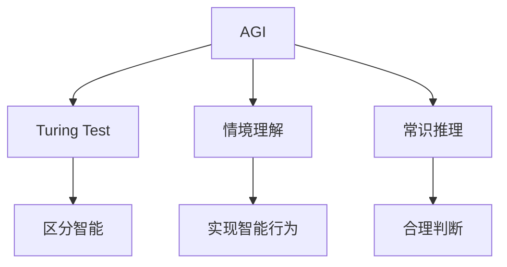

                 

# AGI的情景理解与常识推理能力

关键词：AGI、情景理解、常识推理、算法、数学模型、项目实战

摘要：本文深入探讨了AGI（通用人工智能）中的情景理解与常识推理能力。通过详细分析核心概念、算法原理、数学模型以及实际项目应用，揭示了AGI在现实世界中的广泛应用及其未来发展的可能性。

## 第一部分：AGI概述

### 1.1 什么是AGI

**核心概念与联系**：
AGI（通用人工智能）是指具有人类智能的各种能力的计算机系统。与传统AI相比，AGI不仅能够执行特定的任务，还能够理解、思考、学习、推理，具有普遍的智能。

- **图灵测试**：测试机器是否具有智能，即能否通过模仿人类行为来让人无法区分出机器与人类。
- **情境理解**：AGI必须能够理解其所在的环境和情境，这是实现智能行为的基础。
- **常识推理**：AGI需要具备常识推理能力，以便在面对新的情境时能够做出合理的判断和决策。

**Mermaid流程图**：

### 1.2 AGI的起源与发展

**核心概念与联系**：
AGI的概念最早可以追溯到20世纪50年代，随着计算机科学的快速发展，AGI逐渐成为人工智能研究的前沿领域。

- **阿兰·图灵**：提出了图灵测试，为AGI的发展奠定了基础。
- **深度学习**：近年来，深度学习算法的突破为AGI的实现提供了强大的技术支持。

**算法原理讲解**：
情景理解与常识推理在AGI中的应用主要依赖于神经网络和机器学习技术。

- **神经网络**：模拟人脑神经元的工作原理，用于处理复杂的输入信息。
- **机器学习**：通过训练模型来学习如何识别和预测情境。

**数学模型和数学公式**：
神经网络的数学模型包括激活函数、权重更新等，如：
$$
\text{output} = \sigma(\text{weighted\_sum})
$$
其中，$\sigma$为激活函数，$\text{weighted\_sum}$为输入信号的加权和。

**项目实战**：
早期AGI项目如IBM的Watson，通过深度学习和机器学习技术，成功地在医学诊断、金融分析等领域取得了显著成果。

## 第二部分：情景理解

### 2.1 情景理解的重要性

**核心概念与联系**：
情景理解是AGI的核心能力之一，它使得AGI能够适应复杂多变的现实世界。

- **情境感知**：AGI需要能够感知并理解其所在的环境。
- **情境适应**：AGI需要能够根据情境的变化做出相应的调整。

**算法原理讲解**：
情景理解依赖于多模态数据融合、情境建模和情境感知技术。

- **多模态数据融合**：将不同类型的数据（如视觉、语音、文本等）进行整合，以获得更全面的信息。
- **情境建模**：建立情境模型，用于描述和理解现实世界的情境。
- **情境感知**：通过传感器和数据采集技术，实时感知情境变化。

**数学模型和数学公式**：
情境理解的数学模型通常包括概率模型、图模型等，如：
$$
P(\text{情境}| \text{数据}) = \frac{P(\text{数据}|\text{情境})P(\text{情境})}{P(\text{数据})}
$$
其中，$P(\text{情境}| \text{数据})$表示在给定数据下，情境的概率。

**项目实战**：
在自动驾驶领域，情景理解用于车辆对道路、交通信号、行人等的识别和决策。

## 第三部分：常识推理能力

### 3.1 常识推理的定义与作用

**核心概念与联系**：
常识推理是指AGI利用其知识库和推理能力，对现实世界中的情境进行逻辑推理和判断。

- **知识库**：常识推理的基础，包含大量的事实和规则。
- **推理过程**：基于逻辑和概率的方法，对情境进行推理和判断。

**算法原理讲解**：
常识推理通常采用逻辑推理、概率推理和基于知识的推理等方法。

- **逻辑推理**：基于逻辑规则进行推理。
- **概率推理**：基于概率模型进行推理。
- **基于知识的推理**：基于知识库进行推理。

**数学模型和数学公式**：
常识推理的数学模型包括概率图模型、逻辑模型等，如：
$$
P(\text{结论}|\text{前提}) = \frac{P(\text{前提}|\text{结论})P(\text{结论})}{P(\text{前提})}
$$
其中，$P(\text{结论}|\text{前提})$表示在给定前提条件下，结论的概率。

**项目实战**：
常识推理在智能客服、智能推荐系统等领域具有广泛的应用。

## 第四部分：结合案例分析与展望

### 4.1 案例分析

**核心概念与联系**：
通过实际案例，分析情景理解与常识推理在现实世界中的应用效果。

- **案例1**：自动驾驶中的情境理解和常识推理。
- **案例2**：智能客服中的常识推理。

**算法原理讲解**：
分析案例中的算法原理，如神经网络、机器学习、多模态数据融合等。

**数学模型和数学公式**：
分析案例中的数学模型，如概率模型、逻辑模型等。

**项目实战**：
详细讲解案例中的项目开发过程，包括环境搭建、源代码实现、代码解读、实际应用分析和项目小结。

**最佳实践 tips**：
总结案例中的最佳实践经验，为其他项目的开发提供参考。

**小结**：
回顾文章的主要内容，强调情景理解与常识推理在AGI中的重要性。

**注意事项**：
提醒读者注意AGI在应用中的潜在挑战和风险。

**拓展阅读**：
推荐相关的文献和资料，供读者进一步学习。

---

**作者**：
AI天才研究院/AI Genius Institute & 禅与计算机程序设计艺术 /Zen And The Art of Computer Programming

---

通过以上内容，本文全面探讨了AGI的情景理解与常识推理能力。期望本文能帮助读者深入理解AGI的核心技术，为未来的AI研究提供参考。在未来的发展中，AGI的情景理解与常识推理能力将不断成熟，为人类社会带来更多福祉。

