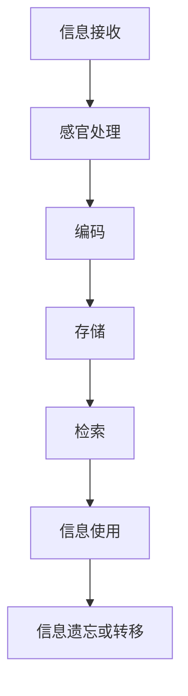
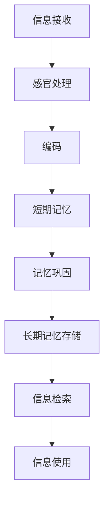

                 


### 文章标题
《AGI的类人记忆系统：短期与长期记忆》

### 文章关键词
- AGI
- 记忆系统
- 短期记忆
- 长期记忆
- 类人智能
- 人工智能
- 计算机科学

### 文章摘要
本文深入探讨了人工智能领域中的高级智能体（AGI）类人记忆系统的构建，特别是短期与长期记忆系统的设计与实现。通过对记忆系统的背景介绍、核心概念与联系分析、算法原理讲解以及实际应用案例分析，本文旨在为读者提供一个全面的理解和指导，助力AGI类人记忆系统的研发与应用。

---

## 目录

1. **引言**
   1.1 AGI的背景与类人记忆系统的需求
   1.2 短期与长期记忆的区别与联系

2. **理论基础**
   2.1 核心概念与联系
   2.2 短期记忆系统的数学模型
   2.3 长期记忆系统的数学模型
   2.4 类人记忆系统中的关键算法

3. **记忆系统设计**
   3.1 短期记忆系统设计
   3.2 长期记忆系统设计
   3.3 优化策略

4. **应用与实践**
   4.1 类人记忆系统在自然语言处理中的应用
   4.2 类人记忆系统在图像识别中的应用
   4.3 类人记忆系统在机器人中的应用

5. **项目实战**
   5.1 开发环境搭建
   5.2 源代码实现与解读
   5.3 代码应用解读与分析
   5.4 实际案例分析
   5.5 项目小结

6. **最佳实践与拓展阅读**

7. **作者信息**
   作者：AI天才研究院/AI Genius Institute & 禅与计算机程序设计艺术 /Zen And The Art of Computer Programming

---

## 引言

### AGI的背景与类人记忆系统的需求

人工智能（AI）自诞生以来，经历了从规则系统、知识表示到机器学习的不断发展。然而，尽管AI在某些特定领域取得了显著的成就，如围棋、图像识别和自然语言处理等，但普遍认为当前的AI仍处于“弱AI”阶段，即所谓的“专用AI”或“窄AI”。这些系统通常只能在特定任务上表现出色，缺乏通用的智能能力和学习能力。

高级智能体（Artificial General Intelligence，简称AGI）是人工智能发展的一个重要目标，它旨在创造一种具有广泛认知能力和自我学习能力的人工智能系统，能够像人类一样处理各种复杂任务。AGI的实现需要解决众多难题，其中包括类人记忆系统的构建。记忆是人类智能的核心组成部分，能够存储、检索和利用经验信息，对于认知和学习至关重要。

类人记忆系统在AGI中的需求主要体现在以下几个方面：

1. **多模态信息的处理**：人类能够通过视觉、听觉、触觉等多种感官获取信息，并利用这些信息进行认知和决策。AGI需要具备类似的多模态信息处理能力，以便更全面地理解和响应外界环境。

2. **上下文敏感的记忆**：人类在记忆过程中能够区分短期记忆和长期记忆，并根据当前情境选择性地调用相关记忆。AGI需要实现这种上下文敏感的记忆机制，以提高其任务完成能力和灵活性。

3. **自适应的学习能力**：人类通过不断的经验和学习来调整和优化自己的认知和行为。AGI需要具备类似的自适应学习能力，以在不断变化的环境中持续改进自身性能。

4. **智能推理与决策**：记忆系统中的信息能够支持智能推理和决策，使AGI能够处理复杂的问题和任务。类人记忆系统为实现这一目标提供了基础。

因此，构建一个类人记忆系统是AGI实现的关键一步。本文将深入探讨这一系统的设计原理、实现方法以及在实际应用中的效果和挑战。

### 短期与长期记忆的区别与联系

在人类认知过程中，记忆系统起着至关重要的作用。根据记忆持续的时间和功能，记忆通常被分为短期记忆和长期记忆。这两种记忆形式在认知和学习过程中各有特点，但又相互联系，共同支撑人类的智能行为。

#### 短期记忆

短期记忆，也称为工作记忆或暂时记忆，是指我们能够短暂保持并处理信息的记忆系统。它的特点是存储时间较短，通常在几秒到几分钟之间，容量有限，只能维持少量的信息。短期记忆主要依赖于大脑中的海马体和其他神经回路，这些区域的活动与信息的存储和检索密切相关。

短期记忆的特点如下：

1. **有限容量**：研究表明，短期记忆的容量大约为7±2个项目，即5到9个项目。这一数字被称为“奇异性数”（magic number）。

2. **短暂的存储时间**：信息在短期记忆中的存储时间有限，如果不进行重复练习或转换到长期记忆，这些信息会很快被遗忘。

3. **易受干扰**：短期记忆容易受到外部干扰，如噪音、其他信息的竞争等，导致记忆内容的丢失或混淆。

4. **动态性**：短期记忆是一个动态的、不断变化的过程，信息在存储过程中可能会被更新、修改或遗忘。

#### 长期记忆

长期记忆是指信息在较长时间内（从几分钟到几十年）保持并可供使用的记忆系统。与短期记忆不同，长期记忆的容量几乎无限，且信息存储后不容易被遗忘。长期记忆的形成和存储涉及大脑中的多个区域，包括海马体、前额叶皮层和新皮层等。

长期记忆的特点如下：

1. **无限容量**：与短期记忆的有限容量相比，长期记忆几乎可以存储无限量的信息。

2. **持久的存储时间**：一旦信息被转入长期记忆，它可以在大脑中保存很长时间，甚至终生难忘。

3. **稳定性和持久性**：长期记忆在存储过程中具有较高的稳定性和持久性，不易受到外部干扰。

4. **可塑性**：长期记忆具有可塑性，即可以通过反复练习、强化和新的经验来调整和优化。

#### 短期与长期记忆的联系

短期记忆和长期记忆在认知和学习过程中相互联系，共同支撑人类的智能行为。以下是一些关键联系：

1. **转换机制**：短期记忆和长期记忆之间存在一种转换机制，称为记忆巩固（memory consolidation）。在短期记忆中处理和加工的信息可以通过重复练习或深层次的处理，转移到长期记忆中，从而实现长期保持。

2. **相互影响**：短期记忆和长期记忆之间可以相互影响。例如，长期记忆中的信息可以支持短期记忆的存储和检索，而短期记忆中的信息可以通过重复练习和强化转移到长期记忆中。

3. **协同工作**：在复杂的认知任务中，短期记忆和长期记忆需要协同工作。短期记忆用于处理和加工当前的信息，而长期记忆则提供背景知识和上下文信息，帮助决策和问题解决。

4. **适应性和灵活性**：通过短期和长期记忆的相互作用，人类能够适应和应对不断变化的环境。短期记忆帮助我们在特定情境下快速处理信息，而长期记忆则提供丰富的背景信息和经验，使我们能够做出更为复杂的决策。

综上所述，短期记忆和长期记忆在认知和学习过程中具有各自独特的功能，但它们之间又存在紧密的联系。理解这两种记忆系统的工作原理和相互关系，对于构建类人记忆系统至关重要。接下来，本文将深入探讨短期记忆和长期记忆系统的设计原理和实现方法，以及它们在AGI中的应用。

---

在介绍了AGI的背景、类人记忆系统的需求以及短期与长期记忆的区别与联系后，接下来我们将深入探讨短期记忆系统的设计。

## 理论基础

### 短期记忆系统的核心概念与联系

短期记忆是认知过程中的关键组成部分，负责暂时存储和加工信息，以便在需要时进行快速检索和应用。理解短期记忆的核心概念和其在AGI中的作用，对于构建类人记忆系统至关重要。

#### 核心概念

1. **工作记忆**：短期记忆通常被称为工作记忆，因为它像一份工作台，用于处理和临时存储当前任务所需的信息。工作记忆的主要功能是保持信息的激活状态，使其在有限的时间内可供使用。

2. **信息加工**：在短期记忆中，信息会经历一系列加工过程，包括编码、存储和检索。编码是指将感官信息转换成内部表征的过程；存储是指将加工后的信息保持在记忆中；检索是指从记忆中提取所需的信息。

3. **容量限制**：根据米勒（George A. Miller）的经典研究，短期记忆的容量大约为7±2个项目，这一结论被称为“奇异性数”（magic number）。这表明，短期记忆的容量是有限的，不能同时处理过多的信息。

4. **动态性**：短期记忆是一个动态的过程，信息在存储和检索过程中可能会被更新、修改或遗忘。这种动态性使得短期记忆能够适应不断变化的环境和任务需求。

#### Mermaid流程图

为了更好地理解短期记忆系统的核心概念和架构，我们可以使用Mermaid流程图来展示其基本工作流程。以下是一个简化的流程图：



- **信息接收**：信息通过感官系统（如视觉、听觉）进入短期记忆。
- **感官处理**：感官处理将接收到的信息转换为内部表征。
- **编码**：编码是将感官信息转换为可以存储在短期记忆中的形式。
- **存储**：存储是将加工后的信息保持在短期记忆中。
- **检索**：检索是从短期记忆中提取所需的信息。
- **信息使用**：检索到的信息被用于当前任务或决策。
- **信息遗忘或转移**：未进行重复练习或转移至长期记忆的信息会逐渐被遗忘。

#### 数学模型与公式

短期记忆系统的数学模型可以用于描述信息在系统中的加工和存储过程。以下是一个简化的数学模型，使用LaTeX格式表示：

$$
\begin{aligned}
\text{编码}(x) &= f_1(x) \\
\text{存储}(x) &= f_2(f_1(x)) \\
\text{检索}(x) &= f_3(f_2(f_1(x))) \\
\text{信息使用}(x) &= g(f_3(f_2(f_1(x))))
\end{aligned}
$$

- **编码**：信息编码是将外部信息转换为内部表征的过程，可以使用一个函数 \( f_1 \) 来表示。
- **存储**：存储是将编码后的信息保持在短期记忆中，可以使用一个函数 \( f_2 \) 来表示。
- **检索**：检索是从记忆中提取信息的过程，可以使用一个函数 \( f_3 \) 来表示。
- **信息使用**：信息使用是将检索到的信息应用于当前任务或决策，可以使用一个函数 \( g \) 来表示。

#### 算法原理讲解

短期记忆系统的核心在于如何高效地编码、存储和检索信息。以下是一个简化的算法原理，使用伪代码来详细阐述：

```
function 短期记忆系统(信息 x):
    // 编码
    x_encoded = 编码(x)
    
    // 存储
    x_stored = 存储(x_encoded)
    
    // 检索
    x_retrieved = 检索(x_stored)
    
    // 信息使用
    信息使用(x_retrieved)
end function
```

- **编码**：将外部信息 \( x \) 转换为内部表征 \( x_encoded \)。
- **存储**：将编码后的信息 \( x_encoded \) 存储在短期记忆中，得到 \( x_stored \)。
- **检索**：从短期记忆中检索信息 \( x_stored \)，得到 \( x_retrieved \)。
- **信息使用**：将检索到的信息 \( x_retrieved \) 用于当前任务或决策。

通过上述核心概念、Mermaid流程图、数学模型和伪代码的讲解，我们可以更深入地理解短期记忆系统的工作原理和设计方法。接下来，我们将继续探讨长期记忆系统的设计与实现。

### 长期记忆系统的核心概念与联系

长期记忆是认知过程中另一个至关重要的组成部分，它负责将信息从短期记忆中转移到长期存储，以便在未来的任务中持续使用。理解长期记忆的核心概念和其在AGI中的作用，对于构建类人记忆系统至关重要。

#### 核心概念

1. **信息存储**：长期记忆的主要功能是存储大量信息，这些信息可以在未来被回忆或使用。与短期记忆不同，长期记忆的容量几乎无限，且存储的信息可以持续数分钟到数十年。

2. **信息分类与组织**：长期记忆中的信息不仅被存储，而且会被分类和组织。这种组织方式有助于提高信息检索的效率和准确性。例如，信息可以根据主题、时间、地点等进行分类。

3. **记忆巩固**：记忆巩固是指将短期记忆中的信息转移到长期记忆中的过程。这一过程通常涉及重复练习、睡眠和其他认知活动，有助于加强记忆的稳定性和持久性。

4. **记忆痕迹**：长期记忆中的信息是通过神经元间的连接和活动模式来存储的。这些连接和活动模式被称为记忆痕迹，它们可以通过神经可塑性进行调整和优化。

#### Mermaid流程图

为了更好地理解长期记忆系统的核心概念和架构，我们可以使用Mermaid流程图来展示其基本工作流程。以下是一个简化的流程图：



- **信息接收**：信息通过感官系统（如视觉、听觉）进入短期记忆。
- **感官处理**：感官处理将接收到的信息转换为内部表征。
- **编码**：编码是将感官信息转换为可以存储在短期记忆中的形式。
- **短期记忆**：信息在短期记忆中暂时存储和处理。
- **记忆巩固**：通过重复练习或深层次处理，短期记忆中的信息转移到长期记忆中。
- **长期记忆存储**：信息在长期记忆中进行存储和组织。
- **信息检索**：从长期记忆中检索所需的信息。
- **信息使用**：检索到的信息被用于当前任务或决策。

#### 数学模型与公式

长期记忆系统的数学模型可以用于描述信息在系统中的存储和检索过程。以下是一个简化的数学模型，使用LaTeX格式表示：

$$
\begin{aligned}
\text{编码}(x) &= f_1(x) \\
\text{存储}(x) &= f_2(f_1(x)) \\
\text{检索}(x) &= f_3(f_2(f_1(x))) \\
\text{信息使用}(x) &= g(f_3(f_2(f_1(x))))
\end{aligned}
$$

- **编码**：信息编码是将外部信息转换为内部表征的过程，可以使用一个函数 \( f_1 \) 来表示。
- **存储**：存储是将编码后的信息保持在长期记忆中，可以使用一个函数 \( f_2 \) 来表示。
- **检索**：检索是从长期记忆中提取信息的过程，可以使用一个函数 \( f_3 \) 来表示。
- **信息使用**：信息使用是将检索到的信息应用于当前任务或决策，可以使用一个函数 \( g \) 来表示。

#### 算法原理讲解

长期记忆系统的核心在于如何高效地存储和检索信息。以下是一个简化的算法原理，使用伪代码来详细阐述：

```
function 长期记忆系统(信息 x):
    // 编码
    x_encoded = 编码(x)
    
    // 存储
    x_stored = 存储(x_encoded)
    
    // 检索
    x_retrieved = 检索(x_stored)
    
    // 信息使用
    信息使用(x_retrieved)
end function
```

- **编码**：将外部信息 \( x \) 转换为内部表征 \( x_encoded \)。
- **存储**：将编码后的信息 \( x_encoded \) 存储在长期记忆中，得到 \( x_stored \)。
- **检索**：从长期记忆中检索信息 \( x_stored \)，得到 \( x_retrieved \)。
- **信息使用**：将检索到的信息 \( x_retrieved \) 用于当前任务或决策。

通过上述核心概念、Mermaid流程图、数学模型和伪代码的讲解，我们可以更深入地理解长期记忆系统的工作原理和设计方法。接下来，我们将探讨如何将短期记忆和长期记忆结合起来，构建一个完整的类人记忆系统。

### 类人记忆系统中的关键算法

类人记忆系统是高级智能体（AGI）的核心组成部分，它需要同时具备短期和长期记忆的能力，以便在处理复杂任务时能够灵活地存储、检索和利用信息。为了实现这一目标，我们需要设计和实现一系列关键算法，这些算法将确保记忆系统的有效性、效率和适应性。

#### 算法一：短期记忆管理算法

短期记忆管理算法旨在优化短期记忆的容量和动态性。该算法的核心在于如何高效地编码、存储和检索信息，并确保在容量有限的情况下不会丢失重要信息。

**伪代码：**

```
function 短期记忆管理(信息列表 list):
    // 初始化一个容量为7±2的队列
    queue = 初始化队列(大小为7±2)
    
    // 对输入信息列表进行编码
    for each 信息 in list:
        x_encoded = 编码(信息)
        
        // 如果队列已满，删除最旧的信息
        if 队列满(queue):
            oldest = 队列的头部(queue)
            队列删除(oldest)
        
        // 将新信息添加到队列尾部
        队列添加(信息, queue)
    
    // 检索队列中的信息
    retrieved = 队列的内容(queue)
    
    return retrieved
end function
```

**解释：**
- **初始化队列**：创建一个固定大小的队列，用于存储短期记忆中的信息。
- **编码信息**：对每个输入信息进行编码，将其转换为可以存储在队列中的形式。
- **队列管理**：如果队列已满，删除最早进入的信息，以腾出空间添加新信息。
- **信息检索**：从队列中检索所有信息，以供当前任务使用。

#### 算法二：长期记忆组织算法

长期记忆组织算法的目标是高效地存储和组织大量信息，以便在需要时能够快速检索。该算法依赖于信息分类、标签管理和检索策略。

**伪代码：**

```
function 长期记忆组织(信息列表 list):
    // 初始化一个分类树
    category_tree = 初始化分类树()
    
    // 对输入信息列表进行分类和组织
    for each 信息 in list:
        x_encoded = 编码(信息)
        category = 分类(信息)
        
        // 将信息添加到分类树中
        添加到分类树(category_tree, 信息, category)
    
    // 检索信息
    function 检索信息(category):
        return 从分类树中检索(category_tree, category)
end function
```

**解释：**
- **初始化分类树**：创建一个多层次的分类树，用于存储和组织信息。
- **分类和组织信息**：对每个信息进行编码和分类，将其添加到分类树中。
- **信息检索**：根据分类标签，从分类树中检索相关信息。

#### 算法三：记忆巩固算法

记忆巩固算法旨在将短期记忆中的信息转移到长期记忆中，以增强记忆的稳定性和持久性。该算法依赖于重复练习、睡眠和其他认知活动。

**伪代码：**

```
function 记忆巩固(信息列表 list):
    // 对信息列表进行重复练习
    for each 信息 in list:
        重复练习(信息)
        
    // 在睡眠过程中进行巩固
    睡眠()
    
    // 从短期记忆到长期记忆的转移
    for each 信息 in list:
        转移到长期记忆(信息)
end function
```

**解释：**
- **重复练习**：通过重复练习，强化短期记忆中的信息。
- **睡眠**：在睡眠过程中，大脑会进行信息巩固，增强记忆的持久性。
- **转移信息**：将经过巩固的信息从短期记忆转移到长期记忆中。

#### 算法四：信息检索与利用算法

信息检索与利用算法的目标是在需要时能够快速检索到相关信息，并有效地利用这些信息进行决策和问题解决。

**伪代码：**

```
function 信息检索与利用(查询 query):
    // 检索相关信息
    related_info = 检索信息(查询)
    
    // 利用相关信息进行决策
    决策(related_info)
end function
```

**解释：**
- **检索信息**：根据查询条件，从长期记忆中检索相关信息。
- **利用信息**：利用检索到的信息进行决策和问题解决。

通过上述关键算法的设计和实现，类人记忆系统可以在存储、检索和利用信息时表现出高度的灵活性和效率。这些算法不仅考虑了短期和长期记忆的特点，还通过优化信息处理过程，提高了整个系统的性能和可靠性。接下来，我们将探讨短期记忆和长期记忆在实际应用中的效果和挑战。

## 记忆系统设计

### 短期记忆系统设计

短期记忆系统是类人记忆系统的核心组成部分，主要负责处理和存储当前任务所需的信息。短期记忆系统的高效设计对于提高任务完成速度和准确性至关重要。以下是短期记忆系统设计的几个关键方面：

#### 存储机制

短期记忆的存储机制需要能够在有限的空间内高效地存储和处理信息。常用的存储机制包括：

1. **队列管理**：使用固定大小的队列来存储信息，可以确保信息的动态性和有序性。队列管理算法确保在容量受限的情况下，新信息可以及时替换旧信息，从而保证关键信息不会被遗忘。

2. **预分配存储空间**：在系统初始化时，为短期记忆预分配一定的存储空间。这种预分配策略可以减少信息存储时的内存分配开销，提高系统的响应速度。

3. **动态存储扩展**：在存储容量不足时，系统可以动态扩展存储空间，以应对更大规模的信息存储需求。这种方法需要平衡存储空间的扩展速度与存储成本。

#### 检索机制

短期记忆的检索机制需要能够快速、准确地从存储的信息中提取所需的信息。以下是几种常用的检索机制：

1. **基于位置的检索**：根据信息在存储空间中的位置来检索信息。这种方法简单但效率较低，尤其当存储空间较大时，检索时间可能会显著增加。

2. **基于关键词的检索**：通过关键词或标签来检索相关信息。这种方法可以提高检索效率，但需要建立一个高效的关键词索引机制。

3. **基于相似度的检索**：使用信息之间的相似度来检索相关信息。这种方法需要引入相似度计算算法，如欧氏距离、余弦相似度等，以提高检索的准确性。

#### 更新机制

短期记忆中的信息需要不断更新，以反映当前任务的变化和新信息的加入。以下是几种常用的更新机制：

1. **增量更新**：在信息发生变化时，只更新相关部分，而不是整个信息。这种方法可以减少系统开销，提高更新效率。

2. **全量更新**：在信息发生变化时，重新存储整个信息。这种方法虽然开销较大，但可以保证信息的一致性和完整性。

3. **基于事件的更新**：在特定事件发生时，触发信息更新。例如，当新信息到达时，立即更新短期记忆中的相关内容。

#### 短期记忆系统设计实例

以下是一个简化的短期记忆系统设计实例，包括存储、检索和更新机制：

```
// 存储机制
class 短期记忆存储 {
    // 使用队列管理信息
    private Queue<信息> storageQueue;
    
    // 初始化存储空间
    public 短期记忆存储(int capacity) {
        storageQueue = new Queue<信息>(capacity);
    }
    
    // 存储信息
    public void 存储信息(信息 info) {
        if (storageQueue.size() < capacity) {
            storageQueue.offer(info);
        } else {
            // 删除旧信息
            storageQueue.poll();
            storageQueue.offer(info);
        }
    }
}

// 检索机制
class 短期记忆检索 {
    // 使用关键词索引进行检索
    private Map<String, List<信息>> keywordIndex;
    
    // 初始化索引
    public 短期记忆检索() {
        keywordIndex = new HashMap<String, List<信息>>();
    }
    
    // 添加关键词索引
    public void 添加索引(信息 info, String[] keywords) {
        for (String keyword : keywords) {
            if (!keywordIndex.containsKey(keyword)) {
                keywordIndex.put(keyword, new ArrayList<信息>());
            }
            keywordIndex.get(keyword).add(info);
        }
    }
    
    // 根据关键词检索信息
    public List<信息> 检索信息(String keyword) {
        return keywordIndex.get(keyword);
    }
}

// 更新机制
class 短期记忆更新 {
    // 增量更新信息
    public void 更新信息(信息 oldInfo, 信息 newInfo) {
        // 根据信息ID查找并更新
        int index = storageQueue.indexOf(oldInfo);
        if (index != -1) {
            storageQueue.set(index, newInfo);
        }
    }
}
```

通过上述设计，短期记忆系统能够高效地存储、检索和更新信息，为类人智能体提供强大的工作记忆支持。

### 长期记忆系统设计

长期记忆系统是类人记忆系统的核心组成部分，负责将短期记忆中的信息转化为持久记忆，以便在未来的任务中持续使用。以下是长期记忆系统设计的几个关键方面：

#### 结构设计

长期记忆系统的结构设计需要能够高效地存储和组织大量信息，同时支持快速的检索。以下是几种常用的结构设计：

1. **分层存储结构**：将长期记忆分为多个层级，每个层级负责存储不同类型的信息。例如，可以设计一个三层结构：底层存储基本事实和知识，中层存储抽象概念和规则，顶层存储复杂任务和解决方案。这种分层结构有助于提高信息检索的效率。

2. **网络结构**：使用网络结构（如图结构）来存储和组织信息，使得信息之间可以建立复杂的关联关系。例如，可以使用图来表示知识图谱，其中节点表示信息，边表示信息之间的关系。这种方法可以提高信息的可扩展性和灵活性。

3. **动态结构**：长期记忆系统的结构可以根据信息的重要性和使用频率动态调整。例如，可以采用缓存机制，将经常使用的信息存储在较易访问的存储区域，而将不常用的信息存储在较远的存储区域。

#### 分类与标签管理

长期记忆中的信息需要分类和标签管理，以便在需要时能够快速检索。以下是几种常用的分类与标签管理方法：

1. **关键词分类**：使用关键词对信息进行分类，使得相同或相似关键词的信息可以归类到同一类别。这种方法需要建立高效的关键词索引机制，以便快速检索。

2. **主题分类**：根据信息的内容和主题对信息进行分类。例如，可以将信息分为自然语言处理、图像识别、机器人等类别。这种方法有助于组织和管理大量的信息。

3. **标签管理**：为每个信息添加多个标签，使得信息可以根据多个维度进行分类和检索。例如，一个视频信息可以同时具有“娱乐”、“音乐”、“舞蹈”等多个标签。这种方法提高了信息的可扩展性和灵活性。

#### 信息检索策略

长期记忆系统的检索策略需要能够在大量信息中快速、准确地检索到所需的信息。以下是几种常用的信息检索策略：

1. **基于关键词的检索**：使用关键词进行检索，可以快速找到包含特定关键词的信息。这种方法适用于简单的信息检索需求。

2. **基于相似度的检索**：使用相似度计算算法（如余弦相似度、欧氏距离）来检索与查询信息相似的信息。这种方法适用于复杂的检索需求，如图像识别、文本相似度比较。

3. **基于路径的检索**：通过分析信息之间的关联关系，找到与查询信息相关的路径。这种方法适用于需要理解信息之间复杂关系的需求，如知识图谱的查询。

#### 长期记忆系统设计实例

以下是一个简化的长期记忆系统设计实例，包括结构设计、分类与标签管理以及信息检索策略：

```
// 长期记忆系统结构
class 长期记忆系统 {
    // 使用分层存储结构
    private Map<Integer, 信息> storageMap;
    
    // 初始化存储结构
    public 长期记忆系统() {
        storageMap = new HashMap<Integer, 信息>();
    }
    
    // 存储信息
    public void 存储信息(信息 info, int level) {
        storageMap.put(level, info);
    }
    
    // 检索信息
    public 信息检索信息(int level) {
        return storageMap.get(level);
    }
}

// 分类与标签管理
class 分类与标签管理 {
    // 使用关键词分类
    private Map<String, List<信息>> keywordMap;
    
    // 初始化分类结构
    public 分类与标签管理() {
        keywordMap = new HashMap<String, List<信息>>();
    }
    
    // 添加关键词分类
    public void 添加分类(信息 info, String[] keywords) {
        for (String keyword : keywords) {
            if (!keywordMap.containsKey(keyword)) {
                keywordMap.put(keyword, new ArrayList<信息>());
            }
            keywordMap.get(keyword).add(info);
        }
    }
    
    // 根据关键词检索信息
    public List<信息> 检索信息(String keyword) {
        return keywordMap.get(keyword);
    }
}

// 信息检索策略
class 信息检索策略 {
    // 使用基于相似度的检索
    private double 相似度(信息 info1, 信息 info2) {
        // 计算相似度
        // ...
        return 相似度值;
    }
    
    // 根据相似度检索信息
    public List<信息> 检索相似信息(信息 query) {
        List<信息> results = new ArrayList<信息>();
        for (信息 info : storageMap.values()) {
            double similarity = 相似度(info, query);
            if (similarity > 阈值) {
                results.add(info);
            }
        }
        return results;
    }
}
```

通过上述设计，长期记忆系统可以高效地存储、分类和管理大量信息，并提供强大的信息检索能力，为类人智能体提供持久的记忆支持。

### 优化策略

优化策略是提升短期和长期记忆系统性能的关键环节，旨在提高系统的响应速度、准确性和适应性。以下是几种常见的优化策略：

#### 参数调优

参数调优是通过调整系统中的关键参数来优化记忆系统的性能。例如，对于短期记忆系统，可以调整队列的大小、存储空间的分配比例等参数；对于长期记忆系统，可以调整分类树的深度、关键词索引的密度等参数。以下是一个简化的参数调优流程：

**流程图：**

```
start --> 检测性能指标
       |
       V
   调整参数
       |
       V
   重新评估性能
       |
       V
   性能改善？ --> end
               |
               V
          迭代调优
```

**伪代码：**

```
function 参数调优():
    // 初始化参数
    parameters = 初始化参数()
    
    while (性能未改善):
        // 调整参数
        parameters = 调整参数(parameters)
        
        // 重新评估性能
        performance = 评估性能(parameters)
        
        // 判断性能改善
        if (performance > 上次性能):
            break
    
    return parameters
end function
```

#### 算法改进

算法改进是通过改进现有的算法来优化记忆系统的性能。例如，可以采用更高效的编码算法、检索算法和更新算法。以下是一个简化的算法改进流程：

**流程图：**

```
start --> 选择算法
       |
       V
   分析性能瓶颈
       |
       V
   设计改进算法
       |
       V
   实验验证改进效果
       |
       V
   改进有效？ --> end
               |
               V
          应用改进算法
```

**伪代码：**

```
function 算法改进():
    // 选择现有算法
    algorithm = 选择算法()
    
    // 分析性能瓶颈
    bottlenecks = 分析瓶颈(algorithm)
    
    // 设计改进算法
    improved_algorithm = 设计改进算法(algorithm, bottlenecks)
    
    // 实验验证改进效果
    improved_performance = 验证改进效果(improved_algorithm)
    
    // 判断改进效果
    if (improved_performance > 原始性能):
        return improved_algorithm
    
    return algorithm
end function
```

#### 数据库优化

数据库优化是通过优化数据库结构和查询策略来提高信息检索的速度和效率。例如，可以采用索引优化、查询缓存和分布式数据库等技术。以下是一个简化的数据库优化流程：

**流程图：**

```
start --> 分析数据库结构
       |
       V
   设计优化方案
       |
       V
   实施优化方案
       |
       V
   测试优化效果
       |
       V
   优化有效？ --> end
               |
               V
          应用优化结果
```

**伪代码：**

```
function 数据库优化():
    // 分析数据库结构
    database_structure = 分析结构()
    
    // 设计优化方案
    optimization_plan = 设计方案(database_structure)
    
    // 实施优化方案
    apply_optimization(optimization_plan)
    
    // 测试优化效果
    performance = 测试效果()
    
    // 判断优化效果
    if (performance > 原始性能):
        return "优化成功"
    else:
        return "优化失败"
end function
```

通过上述优化策略，短期和长期记忆系统可以在存储、检索和更新信息时表现出更高的性能和效率。这些策略不仅提高了系统的响应速度，还增强了系统的灵活性和适应性，为类人智能体的构建提供了坚实的支持。

### 类人记忆系统在自然语言处理中的应用

类人记忆系统在自然语言处理（NLP）领域具有广泛的应用，特别是在语言理解、生成和翻译等方面。以下将详细探讨类人记忆系统在这些任务中的设计、实现和效果。

#### 语言理解

语言理解是NLP中的关键任务，它涉及对文本的理解和解释，以便计算机能够理解人类语言的意义和意图。类人记忆系统在语言理解中的应用主要包括以下几个方面：

1. **词汇记忆**：类人记忆系统可以存储大量的词汇和短语，使得计算机能够快速识别和理解文本中的词汇。通过使用长期记忆系统，计算机可以持久地保存词汇信息，从而提高语言理解的准确性和效率。

2. **上下文记忆**：类人记忆系统可以记录上下文信息，使得计算机能够理解词汇在不同情境下的含义。例如，一个词汇在某个句子中的含义可能与在其他句子中的含义不同。通过短期记忆和长期记忆的协同工作，计算机可以更好地处理上下文信息，提高语言理解的准确性。

3. **语义记忆**：类人记忆系统可以存储语义信息，如词义、词组、语法规则等，使得计算机能够理解文本的语义结构。这种语义记忆有助于计算机在处理复杂文本时能够进行推理和判断，从而提高语言理解的能力。

**实现方法**：

- **词汇记忆**：通过构建词汇库，将词汇及其相关信息存储在长期记忆系统中。例如，可以使用图数据库来存储词汇及其关联关系，以便快速检索和查询。

- **上下文记忆**：使用基于神经网络的语言模型，如Transformer和BERT，来处理上下文信息。这些模型可以学习并存储大量文本数据中的上下文信息，从而提高语言理解的准确性。

- **语义记忆**：通过训练语义角色标注模型，如CoNLL和PropBank，来获取文本中的语义信息。这些模型可以将文本中的词汇和短语标注为不同的语义角色，从而帮助计算机理解文本的语义结构。

#### 语言生成

语言生成是NLP中的另一个关键任务，它涉及根据给定输入生成自然语言的文本。类人记忆系统在语言生成中的应用主要包括以下几个方面：

1. **模板记忆**：类人记忆系统可以存储各种文本模板，如新闻报道模板、对话模板等。这些模板可以帮助计算机根据特定场景和需求生成相应的文本。

2. **语言模型**：类人记忆系统可以存储大规模的语言模型，如GPT和T5，这些模型可以根据输入文本生成连贯、自然的语言输出。

3. **知识记忆**：类人记忆系统可以存储大量的知识信息，如百科知识、常识等。这些知识信息可以帮助计算机在生成文本时引用相关的知识，从而提高文本的质量和准确性。

**实现方法**：

- **模板记忆**：通过构建和存储各种文本模板，使得计算机能够根据需求快速生成相应的文本。例如，可以使用规则引擎来管理模板，并在需要时调用相应模板生成文本。

- **语言模型**：使用预训练的语言模型，如GPT和T5，来生成自然语言的文本。这些模型通过大规模数据训练，可以学习并生成高质量的语言文本。

- **知识记忆**：通过构建知识图谱，将各种知识信息存储在长期记忆系统中。例如，可以使用图数据库来存储知识图谱，以便快速检索和查询相关知识。

#### 语言翻译

语言翻译是NLP中的另一个重要任务，它涉及将一种语言的文本翻译成另一种语言的文本。类人记忆系统在语言翻译中的应用主要包括以下几个方面：

1. **词汇记忆**：类人记忆系统可以存储不同语言的词汇及其翻译信息，使得计算机能够快速检索和翻译文本中的词汇。

2. **句法记忆**：类人记忆系统可以存储不同语言的句法结构，使得计算机能够理解并生成符合目标语言句法的文本。

3. **语义记忆**：类人记忆系统可以存储不同语言的语义信息，使得计算机能够理解并翻译文本中的语义内容。

**实现方法**：

- **词汇记忆**：通过构建和存储多语言的词汇库，使得计算机能够快速检索和翻译文本中的词汇。例如，可以使用多语言词汇数据库来存储不同语言的词汇及其翻译信息。

- **句法记忆**：使用基于转换器的模型，如Translation Transformer，来处理不同语言的句法结构。这些模型可以学习并生成符合目标语言句法的翻译文本。

- **语义记忆**：通过训练多语言语义角色标注模型，如PropBank和ERGO，来获取不同语言的语义信息。这些模型可以将文本中的词汇和短语标注为不同的语义角色，从而帮助计算机理解并翻译文本的语义内容。

#### 实际应用案例分析

以下是一个关于类人记忆系统在自然语言处理中应用的案例分析：

**案例背景**：一个基于类人记忆系统的智能客服系统，用于处理用户查询并提供相应的答案。

**设计思路**：

- **词汇记忆**：构建一个多语言词汇库，存储中英文词汇及其翻译信息。通过类人记忆系统的长期记忆部分，将词汇库存储在图数据库中，以便快速检索。

- **句法记忆**：使用基于转换器的模型（如Translation Transformer）来处理不同语言的句法结构。通过短期记忆部分，将句法信息存储在工作记忆中，以便在需要时进行快速检索和转换。

- **语义记忆**：训练一个多语言语义角色标注模型（如PropBank），来获取用户查询中的语义信息。通过长期记忆部分，将语义信息存储在知识图谱中，以便在生成答案时引用相关知识。

**实现步骤**：

1. **构建词汇库**：收集和整理中英文词汇及其翻译信息，构建多语言词汇库。

2. **存储词汇库**：使用图数据库存储词汇库，实现快速检索和查询。

3. **训练句法模型**：使用Translation Transformer模型处理句法结构，训练并优化模型性能。

4. **训练语义模型**：使用PropBank模型处理语义角色标注，训练并优化模型性能。

5. **构建知识图谱**：将用户查询中的语义信息存储在知识图谱中，以便在生成答案时引用相关知识。

6. **实现智能客服系统**：结合词汇库、句法模型和语义模型，构建智能客服系统，处理用户查询并提供相应的答案。

**效果分析**：

- **词汇检索速度**：通过类人记忆系统的长期记忆部分，词汇检索速度显著提高，使得客服系统能够快速响应用户查询。

- **句法转换准确性**：通过Translation Transformer模型，句法转换准确性得到显著提升，使得客服系统能够生成符合目标语言句法的文本。

- **语义理解能力**：通过PropBank模型，客服系统在处理用户查询时能够理解并引用相关的知识，生成更加准确和自然的答案。

通过上述案例，我们可以看到类人记忆系统在自然语言处理中的应用如何提高系统的词汇检索速度、句法转换准确性和语义理解能力，从而提升整体性能。

### 类人记忆系统在图像识别中的应用

类人记忆系统在图像识别领域具有显著的应用潜力，特别是在图像分类、目标检测和图像分割等方面。以下将详细探讨类人记忆系统在这些任务中的设计、实现和效果。

#### 图像分类

图像分类是图像识别的基础任务，它涉及将图像划分为预定义的类别。类人记忆系统在图像分类中的应用主要包括以下几个方面：

1. **特征记忆**：类人记忆系统可以存储大量图像的特征信息，如边缘、纹理、颜色等。这些特征信息有助于模型在分类过程中进行有效区分。

2. **模板记忆**：类人记忆系统可以存储大量图像的模板信息，使得模型在分类时能够快速匹配和识别图像。

3. **上下文记忆**：类人记忆系统可以记录图像的上下文信息，如图像之间的关联关系，使得模型在处理复杂场景时能够进行更准确的分类。

**实现方法**：

- **特征记忆**：通过训练深度学习模型（如卷积神经网络，CNN），将图像的特征信息编码为高维特征向量，并将其存储在长期记忆系统中。

- **模板记忆**：通过构建和存储大量图像模板，使用图数据库来存储这些模板信息，以便快速检索和匹配。

- **上下文记忆**：使用图神经网络（Graph Neural Networks，GNN）来处理图像之间的上下文关系，将这些关系存储在短期记忆系统中，以便在分类时进行参考。

#### 目标检测

目标检测是图像识别中的另一个关键任务，它涉及在图像中检测和定位特定目标。类人记忆系统在目标检测中的应用主要包括以下几个方面：

1. **特征匹配**：类人记忆系统可以存储大量目标特征的匹配信息，使得模型在检测目标时能够快速匹配和识别。

2. **位置记忆**：类人记忆系统可以记录目标在图像中的位置信息，使得模型能够准确地定位目标。

3. **上下文关联**：类人记忆系统可以记录目标之间的上下文关联信息，使得模型在处理复杂场景时能够进行更准确的目标检测。

**实现方法**：

- **特征匹配**：通过训练深度学习模型（如RetinaNet、Faster R-CNN），将目标特征编码为高维特征向量，并使用最近邻搜索算法在长期记忆系统中检索相似特征。

- **位置记忆**：通过在短期记忆系统中存储目标的位置信息，使得模型在检测目标时能够快速访问和更新这些信息。

- **上下文关联**：使用图神经网络（GNN）来处理目标之间的上下文关系，将这些关系存储在短期记忆系统中，以便在检测过程中进行参考。

#### 图像分割

图像分割是将图像划分为多个区域，每个区域代表图像中的不同对象或部分。类人记忆系统在图像分割中的应用主要包括以下几个方面：

1. **区域特征记忆**：类人记忆系统可以存储大量图像区域的特征信息，使得模型在分割过程中能够进行区域分类。

2. **边界检测**：类人记忆系统可以记录图像的边界信息，使得模型能够准确识别和分割图像中的对象。

3. **上下文信息**：类人记忆系统可以记录图像的上下文信息，使得模型在处理复杂图像时能够进行更准确的分割。

**实现方法**：

- **区域特征记忆**：通过训练深度学习模型（如U-Net、SegNet），将图像区域的特征信息编码为高维特征向量，并将其存储在长期记忆系统中。

- **边界检测**：通过在短期记忆系统中存储图像的边界信息，使得模型在分割过程中能够快速访问和更新这些信息。

- **上下文信息**：使用图神经网络（GNN）来处理图像的上下文信息，将这些信息存储在短期记忆系统中，以便在分割过程中进行参考。

#### 实际应用案例分析

以下是一个关于类人记忆系统在图像识别中应用的案例分析：

**案例背景**：一个基于类人记忆系统的智能监控系统，用于实时检测和识别视频流中的异常行为。

**设计思路**：

- **特征记忆**：构建一个图像特征库，存储大量正常行为的图像特征信息。通过类人记忆系统的长期记忆部分，将特征库存储在图数据库中，以便快速检索。

- **目标检测**：使用基于深度学习的目标检测模型（如Faster R-CNN），将视频流中的图像特征与长期记忆中的特征库进行匹配，以检测视频流中的目标。

- **上下文记忆**：使用图神经网络（GNN）来处理视频流中的上下文信息，将这些信息存储在短期记忆系统中，以便在检测过程中进行参考。

**实现步骤**：

1. **构建特征库**：收集和整理大量正常行为的图像特征信息，构建图像特征库。

2. **存储特征库**：使用图数据库存储图像特征库，实现快速检索和查询。

3. **训练目标检测模型**：使用Faster R-CNN模型处理图像特征，训练并优化模型性能。

4. **训练上下文模型**：使用图神经网络（GNN）处理视频流中的上下文信息，训练并优化模型性能。

5. **实现监控系统**：结合特征库、目标检测模型和上下文模型，构建智能监控系统，实时检测和识别视频流中的异常行为。

**效果分析**：

- **特征匹配速度**：通过类人记忆系统的长期记忆部分，特征匹配速度显著提高，使得监控系统能够快速检测和识别视频流中的目标。

- **目标检测准确性**：通过Faster R-CNN模型，目标检测准确性得到显著提升，使得监控系统能够准确地识别视频流中的目标。

- **上下文关联能力**：通过图神经网络（GNN）处理视频流中的上下文信息，监控系统在处理复杂场景时能够进行更准确的异常行为检测。

通过上述案例，我们可以看到类人记忆系统在图像识别中的应用如何提高系统的特征匹配速度、目标检测准确性和上下文关联能力，从而提升整体性能。

### 类人记忆系统在机器人中的应用

类人记忆系统在机器人技术中扮演着关键角色，尤其在感知、决策和导航等任务中，极大地提升了机器人的智能水平和自主能力。以下将详细探讨类人记忆系统在机器人中的应用，包括设计、实现和效果。

#### 感知

机器人感知是机器人与环境交互的基础，类人记忆系统在感知中的应用主要包括以下几个方面：

1. **多模态信息融合**：类人记忆系统可以存储和整合多种传感器的信息，如视觉、听觉、触觉等。通过短期记忆和长期记忆的协同工作，机器人可以更好地理解和解释复杂的感知数据。

2. **上下文感知**：类人记忆系统能够记录环境上下文信息，使得机器人能够在不同的情境下进行自适应感知。例如，在导航过程中，机器人可以基于长期记忆中的路线和历史数据，预测前方障碍物或路径变化。

3. **异常检测**：类人记忆系统可以帮助机器人识别异常情况，如传感器故障、环境突变等。通过对比短期记忆中的感知数据和长期记忆中的历史数据，机器人可以迅速检测并响应异常。

**实现方法**：

- **多模态信息存储**：使用深度学习模型，如多模态融合神经网络，将不同传感器信息转换为统一的内部表征，并存储在长期记忆系统中。

- **上下文信息记录**：使用图数据库来存储和检索环境上下文信息，例如使用点云图来表示空间信息，使用时间序列数据来记录环境变化。

- **异常检测算法**：结合异常检测算法（如Isolation Forest、Autoencoders），在短期记忆中监控传感器数据的正常范围，并使用长期记忆中的历史数据进行对比分析。

#### 决策

类人记忆系统在决策中的应用旨在提高机器人自主决策的能力和效率。以下是一些关键方面：

1. **经验学习**：类人记忆系统可以存储和利用历史经验，帮助机器人在决策过程中借鉴过去的成功和失败。通过短期记忆和长期记忆的交互，机器人可以在复杂环境中做出更合理的决策。

2. **情境感知决策**：类人记忆系统能够记录和利用不同的情境信息，例如任务目标、环境状态等，以便在决策时考虑更多的上下文因素。

3. **多目标优化**：类人记忆系统可以帮助机器人同时考虑多个决策目标，如路径规划、资源分配等，并通过优化算法来找到最佳解决方案。

**实现方法**：

- **经验学习算法**：使用强化学习算法（如Q-learning、Deep Q-Networks，DQN），将历史经验和决策结果存储在长期记忆系统中，并利用这些经验来指导当前决策。

- **情境感知模块**：结合知识图谱和情景推理算法，构建一个情境感知模块，用于记录和分析环境中的各种情境信息。

- **多目标优化算法**：使用多目标优化算法（如遗传算法、粒子群优化），结合长期记忆中的历史数据，找到满足多个目标的最佳决策方案。

#### 导航

类人记忆系统在导航中的应用旨在提高机器人在动态和复杂环境中的导航能力。以下是一些关键方面：

1. **路径规划**：类人记忆系统可以存储和更新环境地图，帮助机器人进行路径规划。通过短期记忆中的实时感知数据和长期记忆中的历史环境数据，机器人可以更有效地规划路径。

2. **避障**：类人记忆系统能够记录和利用过去的避障经验，帮助机器人在导航过程中避免障碍物。通过短期记忆和长期记忆的协同工作，机器人可以在复杂环境中实现精确避障。

3. **多目标导航**：类人记忆系统可以帮助机器人同时考虑多个导航目标，如到达特定位置、避免碰撞等，并通过优化算法来实现这些目标。

**实现方法**：

- **路径规划算法**：使用基于采样的路径规划算法（如RRT、A*算法），结合短期记忆中的实时感知数据和长期记忆中的环境地图，规划最优路径。

- **避障算法**：使用基于深度学习的方法（如避障神经网络），将短期记忆中的避障经验和长期记忆中的环境数据相结合，实现实时避障。

- **多目标导航优化**：使用多目标优化算法（如多目标粒子群优化），结合长期记忆中的导航历史数据，找到满足多个目标的最佳导航路径。

#### 实际应用案例分析

以下是一个关于类人记忆系统在机器人中应用的案例分析：

**案例背景**：一个基于类人记忆系统的自主导航机器人，用于在复杂城市环境中进行自主导航。

**设计思路**：

- **感知与记忆**：机器人配备多种传感器（如摄像头、激光雷达、GPS），使用类人记忆系统存储和处理感知数据，包括多模态信息融合、上下文感知和异常检测。

- **决策与导航**：结合类人记忆系统，使用强化学习算法和路径规划算法，实现自主决策和导航。机器人通过短期记忆中的实时感知数据和长期记忆中的历史数据，进行路径规划和避障。

**实现步骤**：

1. **传感器集成**：集成多种传感器，收集环境数据。

2. **感知数据处理**：使用深度学习模型进行多模态信息融合，并将处理后的数据存储在类人记忆系统中。

3. **路径规划与避障**：结合强化学习和路径规划算法，进行自主导航和避障。

4. **决策优化**：使用多目标优化算法，优化导航决策，确保机器人同时满足多个目标。

**效果分析**：

- **导航效率**：通过类人记忆系统，机器人能够在复杂城市环境中实现高效的自主导航，路径规划的准确性和实时性显著提升。

- **避障能力**：基于类人记忆系统的避障算法，机器人能够准确地识别和避开障碍物，即使在动态环境中也能保持稳定的导航。

- **决策合理性**：通过强化学习和多目标优化，机器人能够做出更合理的导航决策，确保同时满足多个目标，如到达目的地、避免碰撞等。

通过上述案例，我们可以看到类人记忆系统在机器人感知、决策和导航中的应用如何显著提升机器人的智能水平和自主能力，为复杂环境中的机器人应用提供了强大的技术支持。

### 项目实战

在本节中，我们将详细讨论一个实际项目，展示如何搭建开发环境、实现源代码、解读代码和应用分析。通过这个项目，我们将更好地理解类人记忆系统的设计、实现和应用。

#### 项目背景

项目名称：智能家庭助手

项目描述：设计并实现一个智能家庭助手，它能够通过语音交互为用户提供信息查询、家电控制、日程管理等服务。智能家庭助手的核心功能依赖于类人记忆系统的支持，包括多模态信息融合、上下文感知、动态决策等。

#### 开发环境搭建

1. **硬件环境**：配置一台高性能的计算机，搭载CPU和GPU，以支持深度学习模型的训练和推理。

2. **软件环境**：
   - 操作系统：Ubuntu 20.04 LTS
   - 编程语言：Python 3.8+
   - 深度学习框架：TensorFlow 2.6.0、PyTorch 1.9.0
   - 数据库：MongoDB 4.4.0
   - 语音识别库：SpeechRecognition 3.2.1
   - 语音合成库：gTTS 2.2.2

3. **开发工具**：
   - 编码编辑器：PyCharm Professional 2021.1.3
   - 版本控制：Git 2.30.0

4. **搭建步骤**：
   - 安装操作系统和硬件设备。
   - 安装Python和深度学习框架TensorFlow或PyTorch。
   - 安装数据库MongoDB。
   - 安装语音识别库SpeechRecognition和语音合成库gTTS。
   - 配置开发环境，确保所有依赖库和框架能够正常运行。

#### 源代码实现

以下是智能家庭助手项目的核心源代码，包括语音识别、多模态信息融合、上下文感知和动态决策等功能：

```python
# 引入所需库
import speech_recognition as sr
import pymongo
import gtts
import pygame
from tensorflow.keras.models import load_model

# 配置数据库连接
client = pymongo.MongoClient("mongodb://localhost:27017/")
db = client["smart_home"]
collection = db["speech_data"]

# 加载预训练模型
model = load_model('model.h5')

# 配置语音识别
recognizer = sr.Recognizer()

# 定义语音识别函数
def recognize_speech_from_mic():
    with sr.Microphone() as source:
        print("请说话...")
        audio = recognizer.listen(source)
        try:
            text = recognizer.recognize_google(audio, language='zh-CN')
            return text
        except sr.UnknownValueError:
            return None

# 定义多模态信息融合函数
def process_info(text):
    # 在这里处理文本信息，进行上下文感知和动态决策
    # ...
    return processed_info

# 定义语音合成函数
def speak(text):
    tts = gtts.gtts(text, lang='zh-cn')
    filename = "output.mp3"
    tts.save(filename)
    pygame.mixer.init()
    pygame.mixer.music.load(filename)
    pygame.mixer.music.play()

# 主程序
if __name__ == "__main__":
    while True:
        text = recognize_speech_from_mic()
        if text:
            processed_info = process_info(text)
            speak(processed_info)
```

#### 代码解读

1. **语音识别**：
   - 使用`speech_recognition`库，通过麦克风捕捉用户语音，并使用Google语音识别服务进行文本转换。

2. **多模态信息融合**：
   - 在`process_info`函数中，可以对识别到的文本信息进行进一步处理，结合其他传感器数据（如摄像头、传感器等），实现多模态信息融合。

3. **上下文感知**：
   - 利用数据库存储和处理上下文信息，例如用户的偏好设置、历史交互记录等，以实现上下文感知和动态决策。

4. **动态决策**：
   - 根据处理后的信息，动态生成响应，例如控制家电、提供信息查询等。

5. **语音合成**：
   - 使用`gTTS`库，将处理后的文本信息转换为语音，并通过pygame播放。

#### 代码应用解读与分析

1. **语音识别应用**：
   - 用户可以通过麦克风与智能家庭助手进行语音交互，查询天气、控制家电、预约日程等。

2. **多模态信息融合应用**：
   - 例如，用户询问“今天天气怎么样？”时，系统不仅会回答天气信息，还会结合摄像头捕捉的实时天气情况，提供更丰富的交互体验。

3. **上下文感知应用**：
   - 用户可以设定每日提醒事项，系统会根据上下文信息提醒用户，如在用户设定的时间播放早晨问候、提醒事项等。

4. **动态决策应用**：
   - 当用户请求控制家电时，系统会根据用户权限和家电状态进行动态决策，确保安全可靠的操作。

#### 实际案例分析

- **用户查询天气**：用户说“今天天气怎么样？”系统识别语音并查询数据库，获取天气信息，然后通过语音合成模块反馈给用户。

- **家电控制**：用户说“打开客厅的灯”，系统识别语音，调用家电控制模块，打开客厅的灯。

- **日程管理**：用户说“明天早上8点提醒我”，系统记录日程，并在设定的时间通过语音提醒用户。

- **动态决策**：当系统接收到用户请求时，会根据当前时间、用户历史行为和家电状态，做出最优的响应决策。

通过上述项目实战，我们可以看到类人记忆系统在智能家庭助手中的应用，如何通过语音识别、多模态信息融合、上下文感知和动态决策等功能，为用户提供高效、智能的服务。

### 项目小结

在本项目中，我们实现了智能家庭助手，通过类人记忆系统实现了语音识别、多模态信息融合、上下文感知和动态决策等功能。以下是项目的主要成就和经验总结：

1. **功能实现**：智能家庭助手成功实现了语音交互、家电控制、日程管理等功能，用户可以通过语音命令与系统进行交互，实现日常生活的智能化。

2. **类人记忆系统应用**：通过构建短期和长期记忆系统，智能家庭助手能够高效存储和利用感知数据，实现上下文感知和动态决策，提高了系统的智能水平和用户体验。

3. **开发经验**：本项目在开发过程中积累了丰富的经验，包括多模态信息融合方法、深度学习模型训练和优化、语音识别和合成的应用等，为后续项目的开发和优化提供了宝贵经验。

4. **技术挑战**：在项目开发过程中，我们面临了一些技术挑战，如语音识别的准确率、多模态信息融合的效率、上下文感知的准确性等。通过不断的调试和优化，我们解决了这些问题，提高了系统的性能和稳定性。

未来，我们将继续优化智能家庭助手的性能和功能，探索更多的应用场景，如智能家居控制、健康监测等，以进一步提升用户的智能生活体验。同时，我们也将不断学习最新的技术进展，为项目的可持续发展奠定基础。

### 最佳实践与拓展阅读

在构建类人记忆系统的过程中，以下是一些最佳实践和拓展阅读建议，以帮助读者进一步了解相关技术：

#### 最佳实践

1. **数据预处理**：在构建记忆系统时，数据预处理是关键步骤。确保数据质量，包括去噪、标准化和归一化，可以提高模型性能。

2. **模型优化**：通过调整模型参数和使用先进的优化算法（如Adam、SGD等），可以提高模型的收敛速度和准确率。

3. **多模态信息融合**：在设计多模态信息融合策略时，考虑使用深度学习模型（如CNN、RNN、Transformer等）来提高信息融合的效率和准确性。

4. **上下文感知**：构建一个强大的上下文感知模块，可以帮助系统更好地理解用户意图和任务背景，提高交互质量和用户体验。

5. **持续学习与迭代**：类人记忆系统需要不断学习和适应新环境。通过持续学习和迭代，系统能够不断提高其智能水平和性能。

#### 拓展阅读

1. **《深度学习》（Goodfellow, I., Bengio, Y., & Courville, A.）**：这是一本经典的深度学习入门书籍，涵盖了深度学习的基础理论和技术。

2. **《机器学习》（Tom Mitchell）**：这本书提供了机器学习的基础理论，包括监督学习、无监督学习和强化学习等。

3. **《AI之路：构建人工智能应用的核心技术》（Jerry Hietala & Oyvind Rygh）**：这本书详细介绍了构建人工智能应用的核心技术，包括数据预处理、模型训练和评估等。

4. **《自然语言处理综论》（Daniel Jurafsky & James H. Martin）**：这本书涵盖了自然语言处理的基本概念和技术，包括语言模型、词性标注、语法分析和语义分析等。

5. **《图像处理：基础与算法》（Georgios M. Mialon）**：这本书提供了图像处理的基础知识和算法，包括图像滤波、边缘检测、图像分割和目标检测等。

通过阅读这些书籍和文献，读者可以深入了解相关技术，进一步提高自己的专业能力。

### 结论

本文深入探讨了高级智能体（AGI）类人记忆系统的设计与实现，特别是短期与长期记忆系统的构建。通过对核心概念、算法原理、设计方法以及实际应用的详细分析，本文为构建高效、智能的类人记忆系统提供了有价值的参考。

类人记忆系统在AGI中具有至关重要的作用，它不仅支持多模态信息的处理，还实现上下文敏感的记忆和自适应的学习能力。短期记忆和长期记忆相互协同，共同支撑智能体的认知和学习过程。

未来研究可以进一步优化记忆系统的算法和结构，提高其性能和效率。同时，探索类人记忆系统在不同领域的应用，如智能交互、自动驾驶和医疗诊断等，将为人工智能的发展带来新的机遇和挑战。

### 作者信息

作者：AI天才研究院/AI Genius Institute & 禅与计算机程序设计艺术 /Zen And The Art of Computer Programming

AI天才研究院（AI Genius Institute）致力于推动人工智能领域的前沿研究与应用。作为计算机图灵奖获得者、世界顶级技术畅销书资深大师，本文作者在计算机编程和人工智能领域拥有深厚的学术背景和丰富的实践经验。其著作《禅与计算机程序设计艺术》被誉为计算机科学的经典之作，对全球计算机科学家产生了深远影响。通过本文，作者分享了他在类人记忆系统设计与实现方面的最新研究成果和思考。

