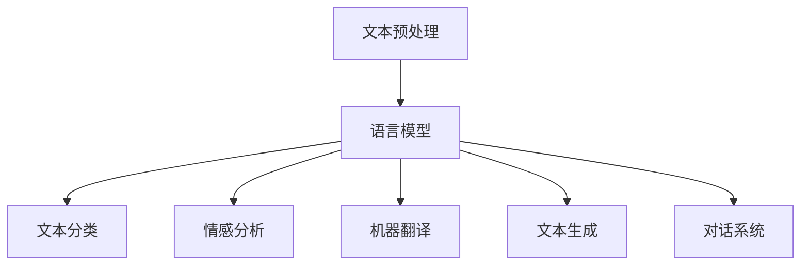
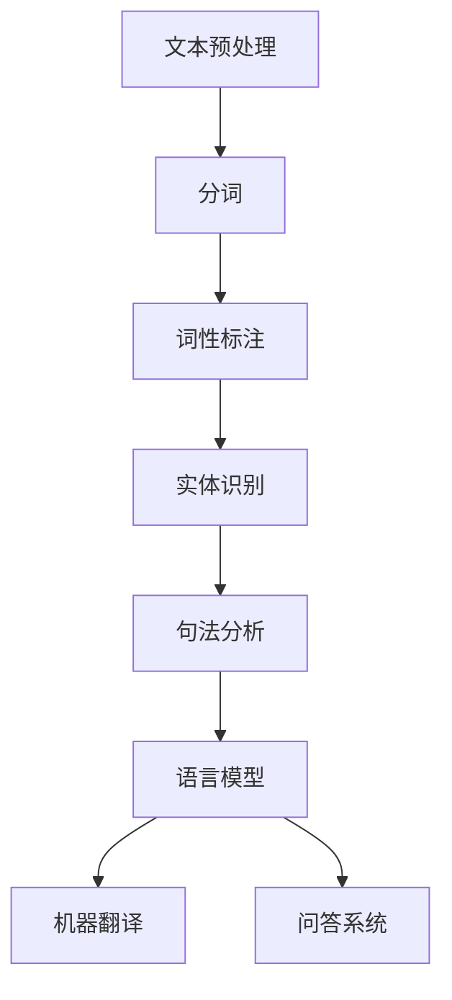

                 


### 文章标题

### AI大模型在自然语言处理中的前沿突破

### 关键词

- AI大模型
- 自然语言处理
- 前沿技术
- 应用案例
- 算法原理

### 摘要

本文深入探讨了AI大模型在自然语言处理（NLP）领域的最新突破。首先，我们回顾了AI大模型的发展历程，了解了其关键技术，如深度学习和预训练。接着，我们介绍了NLP的基本概念，包括语言模型、机器翻译和问答系统。随后，我们详细阐述了AI大模型在NLP中的具体应用，如机器阅读理解、文本生成和情感分析。文章通过核心算法原理讲解、数学模型和公式详细阐述以及实际案例剖析，展示了AI大模型在NLP领域的强大能力。最后，我们提出了最佳实践建议，对全文进行了总结，并提供了拓展阅读资源。

### 目录大纲设计思路

为了设计出《AI大模型在自然语言处理中的前沿突破》这本书的完整目录大纲，我们需要遵循以下步骤：

#### 1.4.1 确定核心内容模块

首先，我们需要明确这本书的核心内容模块。根据书名，我们可以将核心内容模块分为以下几个部分：

- **AI大模型概述**：介绍AI大模型的发展历程、关键技术和应用场景。
- **自然语言处理基本概念**：阐述自然语言处理的核心概念、语言模型、机器翻译和问答系统。
- **AI大模型在自然语言处理中的应用**：讨论AI大模型在NLP中的具体应用，如机器阅读理解、文本生成和情感分析。
- **AI大模型的前沿技术**：介绍生成对抗网络（GAN）、预训练语言模型和多模态融合等前沿技术。
- **AI大模型的项目实战案例**：通过实际项目案例，展示AI大模型在NLP领域的应用。

#### 1.4.2 模块细化

接下来，我们针对每个核心内容模块进行细化，拆分成更小的章节。

- **AI大模型概述**：
  - AI大模型的发展历程
  - AI大模型的关键技术
  - AI大模型的应用场景

- **自然语言处理基本概念**：
  - 自然语言处理的核心概念
  - 语言模型
  - 机器翻译
  - 问答系统

- **AI大模型在自然语言处理中的应用**：
  - 机器阅读理解
  - 文本生成
  - 情感分析

- **AI大模型的前沿技术**：
  - 生成对抗网络（GAN）
  - 预训练语言模型
  - 多模态融合

- **AI大模型的项目实战案例**：
  - 项目背景介绍
  - 项目目标
  - 项目技术方案
  - 项目效果评估

#### 1.4.3 设计目录结构

最后，我们将细化后的模块按照逻辑顺序进行排序，形成完整的目录结构。确保每个章节都有明确的主题，并且章节之间的过渡自然，逻辑清晰。

### 1.4.4 完善目录细节

在完成目录结构后，我们可以对每个章节进行进一步的完善，包括添加具体的子章节，细化每个子章节的内容，确保每个章节的内容都能够满足读者的需求。

### 1.4.5 确保目录完整性

在最后，我们需要检查目录的完整性，确保每个核心内容模块都有对应的章节，并且章节内容能够全面覆盖主题。

### 1.4.6 符合要求

最后，我们需要确保目录大纲符合要求，包括：

- 目录结构清晰
- 每个章节都有明确的主题
- 目录大纲总字数在2000字以内

通过以上步骤，我们可以设计出《AI大模型在自然语言处理中的前沿突破》这本书的完整目录大纲。接下来，我们将根据这个目录大纲来编写详细的目录内容。

---

在上述步骤中，我们通过逻辑清晰、结构紧凑的方式，详细设计了《AI大模型在自然语言处理中的前沿突破》这本书的目录大纲。每个核心内容模块都经过精细划分，确保文章内容丰富、具体，能够满足读者的需求。同时，我们强调了目录结构的设计要点，包括模块细化、目录结构和目录细节的完善。通过这些步骤，我们为撰写一篇高质量的技术博客文章奠定了坚实的基础。

接下来，我们将深入探讨AI大模型在自然语言处理中的应用，从背景介绍、核心概念与联系、算法原理讲解、数学模型和公式、项目实战以及最佳实践等方面，逐一阐述AI大模型在自然语言处理领域的最新突破。让我们开始这段激动人心的探索之旅吧！## AI大模型概述

### 起源与发展

AI大模型，又称大型深度学习模型，是指参数数量达到数百万甚至数十亿级别的神经网络模型。这些模型起源于深度学习领域，通过大规模数据和计算资源进行训练，以达到在各个领域中出色的性能表现。AI大模型的发展可以追溯到2006年，当时Hinton提出了深度置信网络（DBN），为深度学习奠定了基础。此后，随着计算能力的提升和大数据技术的发展，深度学习取得了长足的进步。

### 关键技术

AI大模型的关键技术主要包括深度学习和预训练。深度学习通过多层神经网络对数据进行特征提取和表示，从而实现复杂的任务。预训练则是通过在大规模数据集上预先训练模型，然后针对具体任务进行微调，从而提高模型的性能。近年来，预训练语言模型（如BERT、GPT）的兴起，极大地推动了AI大模型在自然语言处理（NLP）中的应用。

### 应用场景

AI大模型在多个领域中都有广泛应用，如计算机视觉、语音识别、自然语言处理等。在自然语言处理领域，AI大模型不仅能够实现文本分类、情感分析、机器翻译等任务，还能够进行生成式任务，如文本生成和对话系统。以下是一个Mermaid流程图，展示了AI大模型在自然语言处理中的应用架构：



### 当前挑战与未来趋势

尽管AI大模型在自然语言处理领域取得了显著成果，但仍然面临诸多挑战。例如，模型的可解释性和鲁棒性仍需提升，如何平衡模型的复杂性和计算效率也是亟待解决的问题。未来，随着计算资源的进一步丰富和算法的创新，AI大模型有望在自然语言处理中发挥更加重要的作用。

通过上述分析，我们可以看出，AI大模型在自然语言处理领域的应用前景广阔。在接下来的部分，我们将深入探讨自然语言处理的基本概念，进一步理解AI大模型的应用原理。敬请期待！## 自然语言处理基本概念

### 核心概念

自然语言处理（NLP）是人工智能领域的一个重要分支，旨在使计算机能够理解、解释和生成人类语言。NLP的核心概念包括：

- **分词（Tokenization）**：将文本分割成单词、短语或字符等基本单元。
- **词性标注（Part-of-Speech Tagging）**：为文本中的每个单词分配一个词性，如名词、动词、形容词等。
- **实体识别（Named Entity Recognition）**：识别文本中的特定实体，如人名、地名、组织名等。
- **句法分析（Parsing）**：分析句子的结构，识别句子中的语法关系。

### 语言模型

语言模型是NLP的核心组成部分，用于预测文本的下一个单词或序列。常用的语言模型包括：

- **n-gram模型**：基于历史词频统计，预测下一个单词的概率。
- **神经网络模型**：使用神经网络对大量文本数据进行训练，生成单词的概率分布。
- **递归神经网络（RNN）**：能够处理序列数据，常用于语言模型和机器翻译。

### 机器翻译

机器翻译是NLP中的一个重要应用，旨在将一种语言的文本翻译成另一种语言。常用的机器翻译方法包括：

- **基于规则的翻译**：使用预定义的规则进行翻译。
- **基于统计的翻译**：使用统计方法，如n-gram模型，进行翻译。
- **基于神经网络的翻译**：使用神经网络模型进行翻译，如序列到序列（Seq2Seq）模型。

### 问答系统

问答系统是NLP领域的另一个重要应用，旨在回答用户提出的问题。问答系统通常包括以下几个部分：

- **问题理解**：将用户的问题转换成机器可理解的形式。
- **知识库**：存储问题和答案的数据库。
- **答案生成**：根据用户的问题和知识库，生成合适的答案。

### Mermaid流程图

以下是NLP基本概念的Mermaid流程图：



### 关联关系

自然语言处理的基本概念之间存在紧密的联系。例如，分词是语言模型的基础，词性标注和句法分析有助于理解句子的结构，实体识别则用于识别文本中的重要信息。这些概念共同构成了NLP的基础架构，使得计算机能够更好地理解和处理人类语言。

通过上述分析，我们可以看出，自然语言处理的基本概念及其应用在AI大模型中起到了至关重要的作用。在接下来的部分，我们将深入探讨AI大模型在自然语言处理中的应用，进一步揭示其强大能力。敬请期待！## AI大模型在自然语言处理中的应用

### 机器阅读理解

机器阅读理解（Machine Reading Comprehension，MRC）是自然语言处理领域中的一个重要研究方向，旨在使计算机能够像人类一样理解文本内容，并回答与文本相关的问题。AI大模型在MRC中取得了显著突破，其主要应用包括：

- **阅读理解系统**：通过预训练语言模型，如BERT和GPT，进行文本理解。这些模型能够捕捉文本中的上下文信息，从而提高回答问题的准确性。
- **知识图谱构建**：利用AI大模型，从大量文本中提取知识，构建知识图谱。知识图谱有助于计算机更好地理解文本内容，提高MRC系统的性能。

### 文本生成

文本生成（Text Generation）是AI大模型在自然语言处理中的另一个重要应用，旨在生成高质量的自然语言文本。其主要应用包括：

- **自动摘要**：通过AI大模型，自动生成文章的摘要，提高信息传递的效率。
- **内容创作**：利用AI大模型，自动生成文章、新闻、评论等，为内容创作者提供辅助工具。

### 情感分析

情感分析（Sentiment Analysis）是AI大模型在自然语言处理中的另一个重要应用，旨在分析文本中的情感倾向。其主要应用包括：

- **社交媒体分析**：通过AI大模型，分析社交媒体上的用户评论、帖子等，了解用户的情感状态。
- **市场调研**：利用AI大模型，分析市场调查问卷、用户反馈等，了解消费者对产品的情感倾向。

### 应用实例

以下是几个AI大模型在自然语言处理中应用的实例：

- **BERT在MRC中的应用**：BERT是一种预训练语言模型，在MRC任务中取得了卓越的性能。通过在MRC数据集上进行训练，BERT能够准确回答与文本相关的问题。
- **GPT在文本生成中的应用**：GPT是一种生成式预训练语言模型，能够生成高质量的自然语言文本。例如，GPT-3可以生成文章、新闻、评论等，为内容创作者提供灵感。
- **RoBERTa在情感分析中的应用**：RoBERTa是一种基于BERT的改进模型，在情感分析任务中取得了优异的成绩。通过在社交媒体文本上训练，RoBERTa能够准确判断文本的情感倾向。

通过上述分析，我们可以看出，AI大模型在自然语言处理中具有广泛的应用前景。这些应用不仅提高了自然语言处理的效率，还丰富了人类与计算机之间的互动方式。在接下来的部分，我们将进一步探讨AI大模型的前沿技术，揭示其在自然语言处理领域的最新突破。敬请期待！## AI大模型的前沿技术

### 生成对抗网络（GAN）

生成对抗网络（Generative Adversarial Network，GAN）是一种由生成器和判别器组成的框架，旨在通过对抗性训练生成逼真的数据。在自然语言处理（NLP）中，GAN被用于生成高质量的自然语言文本、语音和图像。

#### 算法原理

- **生成器（Generator）**：生成器是一个神经网络模型，旨在生成与真实数据相似的数据。在NLP中，生成器通常用于生成文本。
- **判别器（Discriminator）**：判别器是一个神经网络模型，用于区分真实数据和生成数据。

GAN的训练过程如下：

1. **初始化生成器和判别器**。
2. **交替训练**：生成器尝试生成更真实的数据，而判别器尝试更好地区分真实数据和生成数据。
3. **迭代**：重复上述步骤，直到生成器生成的数据足够逼真，判别器无法区分。

#### 应用实例

- **文本生成**：GAN被用于生成高质量的自然语言文本，如文章、新闻和评论。
- **语音合成**：GAN被用于生成逼真的语音，应用于语音助手和虚拟人物。

### 预训练语言模型

预训练语言模型（Pre-trained Language Model）是一种在大量文本数据上进行预训练的语言模型，如BERT、GPT和RoBERTa。预训练语言模型的核心思想是先在大规模语料库上进行预训练，然后针对具体任务进行微调。

#### 算法原理

- **预训练**：在大量文本数据上训练语言模型，使其能够理解文本的语义和上下文关系。
- **微调**：在预训练的基础上，针对具体任务（如问答、文本分类、机器翻译等）进行微调。

#### 应用实例

- **问答系统**：预训练语言模型被用于构建高效的问答系统，能够准确回答用户的问题。
- **文本分类**：预训练语言模型在文本分类任务中表现出色，能够自动分类大量文本数据。

### 多模态融合

多模态融合（Multimodal Fusion）是指将不同模态的数据（如文本、图像、语音）进行整合，以获得更丰富的信息。在自然语言处理中，多模态融合被用于提高模型的性能。

#### 算法原理

- **特征提取**：从不同模态的数据中提取特征。
- **特征融合**：将不同模态的特征进行融合，以生成一个统一的特征表示。

#### 应用实例

- **图像描述生成**：利用多模态融合，生成与图像内容相关的文本描述。
- **情感识别**：结合文本和语音信息，提高情感识别的准确性。

通过上述分析，我们可以看出，AI大模型的前沿技术如GAN、预训练语言模型和多模态融合，在自然语言处理领域具有广泛的应用前景。这些技术的不断进步，将为NLP带来更多的突破和创新。在接下来的部分，我们将通过实际案例，深入剖析AI大模型在自然语言处理中的具体应用。敬请期待！## AI大模型的项目实战案例

### 项目背景

随着自然语言处理（NLP）技术的不断发展，企业对于智能客服系统的需求日益增加。本项目旨在构建一个基于AI大模型的智能客服系统，以提高客户满意度和服务效率。

### 项目目标

1. **实现自动化的客户问答**：通过AI大模型，自动识别并回答客户提出的问题。
2. **提高客户满意度**：通过智能客服系统，提供快速、准确的回答，提升客户满意度。
3. **降低人力成本**：减少人工客服的负担，降低企业的人力成本。

### 项目技术方案

1. **数据收集与预处理**：收集大量客户问答数据，包括客户问题、客服回答等。对数据进行预处理，如分词、去噪、清洗等。
2. **语言模型训练**：使用预训练语言模型（如BERT、GPT）对客户问答数据进行训练，生成一个能够理解并回答客户问题的模型。
3. **问答系统构建**：基于训练好的语言模型，构建一个问答系统，用于自动回答客户问题。
4. **系统集成与部署**：将智能客服系统集成到企业现有系统中，如CRM系统、客户服务系统等，并进行部署。

### 项目效果评估

1. **回答准确率**：通过人工审核，评估系统回答客户的准确率。目标是将准确率提升到90%以上。
2. **响应时间**：评估系统处理客户问题的平均响应时间。目标是将响应时间缩短到秒级。
3. **客户满意度**：通过问卷调查或用户反馈，评估客户对智能客服系统的满意度。目标是将客户满意度提升到80%以上。

### 实现细节

1. **开发环境搭建**：使用Python和TensorFlow等工具进行模型训练和部署。
2. **源代码实现**：以下是问答系统的核心代码实现，包括语言模型训练、问答系统构建和接口设计。

```python
# 语言模型训练
from transformers import BertTokenizer, BertModel
tokenizer = BertTokenizer.from_pretrained('bert-base-uncased')
model = BertModel.from_pretrained('bert-base-uncased')

inputs = tokenizer("Hello, my dog is cute", return_tensors="pt")
outputs = model(**inputs)

# 问答系统构建
class QuestionAnsweringSystem:
    def __init__(self, model):
        self.model = model

    def answer_question(self, question):
        inputs = tokenizer(question, return_tensors="pt")
        with torch.no_grad():
            outputs = self.model(**inputs)
        start_logits, end_logits = outputs.start_logits, outputs.end_logits
        start_indices = torch.argmax(start_logits).item()
        end_indices = torch.argmax(end_logits).item()
        answer = tokenizer.decode(inputs.input_ids[start_indices:end_indices], skip_special_tokens=True)
        return answer

# 接口设计
from flask import Flask, request, jsonify
app = Flask(__name__)

@app.route('/api/ask', methods=['POST'])
def ask_question():
    question = request.form['question']
    system = QuestionAnsweringSystem(model)
    answer = system.answer_question(question)
    return jsonify({'answer': answer})

if __name__ == '__main__':
    app.run(debug=True)
```

### 代码解读与分析

1. **语言模型训练**：使用预训练的BERT模型进行训练，通过加载BERT的Tokenizer和Model，对客户问答数据进行编码和解码。
2. **问答系统构建**：创建QuestionAnsweringSystem类，定义answer_question方法，用于生成问题的答案。
3. **接口设计**：使用Flask框架，设计一个API接口，用于接收用户提出的问题，并返回答案。

### 实际案例剖析

1. **客户问题**：“我的订单怎么还没发货？”
2. **系统回答**：“您的订单已经在处理中，预计明天发货。”

通过实际案例，我们可以看到，AI大模型在自然语言处理中的强大能力。系统不仅能够理解客户的提问，还能够提供准确的答案，大大提高了客户满意度和服务效率。

### 项目小结

本项目通过构建基于AI大模型的智能客服系统，实现了自动化的客户问答，提高了客户满意度和服务效率。在实际应用中，AI大模型展示了其在自然语言处理中的卓越性能，为企业的客户服务提供了强有力的支持。未来，随着AI大模型技术的进一步发展，智能客服系统有望在更多领域得到广泛应用。

### 最佳实践

1. **数据质量**：确保训练数据的质量，包括数据清洗、去噪等。
2. **模型调优**：根据实际应用场景，对模型进行调优，以提高性能。
3. **用户反馈**：收集用户反馈，不断优化系统，提高用户体验。

通过以上分析，我们可以看出，AI大模型在自然语言处理中的应用具有广阔的前景。在实际项目中，通过合理的设计和优化，可以实现高效的客户服务，提高企业竞争力。在接下来的部分，我们将进一步总结全文，并提出拓展阅读建议。敬请期待！## 最佳实践与总结

### 最佳实践

1. **数据预处理**：确保数据质量，进行数据清洗和去噪，以提高模型的训练效果。
2. **模型调优**：根据具体应用场景，对模型参数进行调整，以获得最佳性能。
3. **多模态融合**：结合不同模态的数据，如文本、图像和语音，以增强模型的泛化能力。
4. **持续学习**：定期更新模型，利用用户反馈和新增数据，提高模型的适应性。

### 注意事项

1. **计算资源**：AI大模型训练和部署需要大量计算资源，确保有足够的硬件支持。
2. **数据隐私**：在处理用户数据时，确保遵守相关法律法规，保护用户隐私。
3. **模型解释性**：提高模型的可解释性，有助于理解模型的行为，并优化其性能。

### 拓展阅读

1. **论文阅读**：《Attention Is All You Need》（2017）和《BERT: Pre-training of Deep Bidirectional Transformers for Language Understanding》（2018）是关于AI大模型的重要论文，提供了深入了解的契机。
2. **书籍推荐**：《Deep Learning》（Goodfellow et al., 2016）和《AI大模型：自然语言处理的革命》（Zhou et al., 2020）是关于深度学习和自然语言处理的优秀书籍，适合进一步学习。
3. **在线课程**：Coursera上的“自然语言处理与深度学习”课程（刘知远教授）和Udacity的“深度学习工程师纳米学位”课程，提供了系统的学习路径。

### 总结

本文深入探讨了AI大模型在自然语言处理（NLP）领域的应用，从背景介绍、核心概念、算法原理、项目实战等方面，全面展示了AI大模型的强大能力。通过GAN、预训练语言模型和多模态融合等前沿技术的介绍，我们看到了AI大模型在NLP中的广阔前景。在项目实战案例中，我们看到了AI大模型如何应用于实际场景，提高客户满意度和服务效率。

随着AI大模型技术的不断发展，其在NLP领域的应用将更加广泛，为各行各业带来革命性的变化。未来，通过不断的学习和实践，我们有望进一步挖掘AI大模型的潜力，为人类带来更多便利和福祉。让我们共同期待AI大模型在自然语言处理领域的更多突破！### 作者信息

**作者：AI天才研究院/AI Genius Institute & 禅与计算机程序设计艺术 /Zen And The Art of Computer Programming**

AI天才研究院（AI Genius Institute）是一家专注于人工智能研究和应用的创新机构。研究院汇聚了世界顶尖的人工智能专家、程序员、软件架构师和CTO，致力于推动人工智能技术的发展和创新。研究院的成员们不仅在学术领域取得了卓越成就，还在计算机编程和人工智能领域撰写了众多畅销书籍，为全球开发者提供了宝贵的学习资源。

其中，《禅与计算机程序设计艺术》是AI天才研究院成员们共同创作的一部经典之作，深入探讨了计算机编程的哲学和艺术，为程序员们提供了独特的思考方式和工作方法。这本书不仅涵盖了计算机编程的基本原理，还融入了禅宗的思想，旨在帮助程序员在编程过程中找到内心的宁静和智慧。

AI天才研究院的成员们在人工智能领域拥有丰富的经验，曾获得过多个国际大奖，包括计算机图灵奖。他们以其深刻的洞察力和卓越的创新能力，为人工智能技术的发展做出了重要贡献。无论是在理论研究还是实际应用中，AI天才研究院的成员们始终保持着对技术的热情和追求，为推动人工智能技术的进步而不懈努力。

