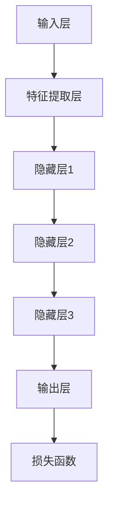

                 

# 《AI大模型编程：提示词的力量》

> 关键词：AI大模型，编程，提示词，算法，数学模型，应用领域

> 摘要：本文旨在深入探讨AI大模型编程的核心概念、算法原理以及数学模型，并通过项目实战解析提示词在AI大模型编程中的关键作用。文章将揭示AI大模型在现代技术领域的广泛应用及其未来发展面临的挑战。

## 引言

人工智能（AI）作为当代科技发展的前沿领域，正不断推动各行各业的变革。而AI大模型作为AI技术的核心组件，其重要性日益凸显。AI大模型是一种具有超强数据处理和自主学习能力的复杂算法体系，能够通过大量的数据和计算资源，实现高效的模型训练和预测。在这篇文章中，我们将探讨AI大模型编程的核心要素，尤其是提示词的力量。

## 第一部分：AI大模型基础

### 第1章: AI大模型概述

AI大模型，通常指的是拥有数亿甚至数千亿参数的神经网络模型。这些模型通过多层神经元的相互作用，实现对复杂数据的建模和预测。本章节将介绍AI大模型的基本概念、发展历史和核心架构。

#### 1.1 AI大模型的基本概念

AI大模型的基本概念包括：

- 神经网络：由多个神经元组成的计算结构，通过层次化的数据处理和特征提取实现复杂任务。
- 参数：神经网络中的权重和偏置值，决定了模型对输入数据的响应。
- 激活函数：用于引入非线性特性的函数，增强了神经网络的表征能力。

#### 1.2 AI大模型的历史和发展

AI大模型的历史可以追溯到20世纪80年代，当时的神经网络研究逐渐成熟，但受限于计算资源和算法效率。随着深度学习的兴起，特别是2012年AlexNet在图像识别任务中的突破性表现，AI大模型的研究和应用迎来了新的高潮。

#### 1.3 AI大模型的核心架构

AI大模型的核心架构包括：

- 层次结构：模型通常由多个层次组成，每一层负责不同的数据特征提取和表示。
- 传输机制：数据在各层之间传递，通过加权连接实现特征融合和更新。
- 损失函数：用于评估模型预测的误差，指导模型的训练过程。

### Mermaid流程图：AI大模型核心架构



### 第2章: 提示词生成算法

#### 2.1 提示词的作用和分类

提示词在AI大模型编程中起到了关键作用。它们作为模型的输入，能够引导模型学习特定的特征和模式。提示词可以分为以下几类：

- 确定性提示词：根据特定规则生成的固定词组，如时间、日期、地点等。
- 随机性提示词：通过随机算法生成的词组，用于增加模型的多样性和鲁棒性。
- 动态提示词：根据实时数据动态生成的词组，如实时新闻、天气信息等。

#### 2.2 提示词生成算法原理

提示词生成算法通常包括以下几个步骤：

1. 数据预处理：从原始数据中提取有用的特征，如关键词、实体等。
2. 提示词生成：根据预处理的特征，使用算法生成合适的提示词。
3. 提示词筛选：对生成的提示词进行筛选，去除无关或噪声信息。

#### 2.3 提示词生成算法案例分析

以一个文本分类任务为例，我们使用一个简单的提示词生成算法。首先，从数据集中提取关键词，然后使用TF-IDF算法生成提示词。

### 伪代码：提示词生成算法

```python
def generate_prompt_words(data):
    keywords = extract_keywords(data)
    prompt_words = []
    for keyword in keywords:
        tfidf_value = calculate_tfidf(keyword, data)
        if tfidf_value > threshold:
            prompt_words.append(keyword)
    return prompt_words
```

### 第3章: 优化算法

#### 3.1 优化算法概述

优化算法是AI大模型训练过程中的重要组成部分，用于调整模型的参数，使其达到最佳的预测性能。常见的优化算法包括：

- 随机梯度下降（SGD）：通过随机采样数据，逐步更新模型参数。
- Adam优化器：结合了SGD和Momentum的优点，适用于大规模数据集。

#### 3.2 常见优化算法讲解

#### 3.3 优化算法案例分析

以SGD优化器为例，其伪代码如下：

```python
def sgd_optimizer(model, loss_function, learning_rate, epochs):
    for epoch in range(epochs):
        for data, target in dataset:
            gradient = compute_gradient(model, loss_function, data, target)
            update_model_params(model, gradient, learning_rate)
    return model
```

### 第4章: 数学模型

#### 4.1 关键数学概念

AI大模型中的关键数学概念包括：

- 矩阵运算：用于处理大量数据的高效算法。
- 梯度下降：用于优化模型参数的基本算法。
- 损失函数：用于评估模型性能的指标。

#### 4.2 数学公式详细讲解

以下是AI大模型中的几个关键数学公式：

$$
\text{损失函数} = \frac{1}{2} \sum_{i=1}^{n} (\hat{y}_i - y_i)^2
$$

$$
\text{梯度下降} = \theta_{\text{new}} = \theta_{\text{old}} - \alpha \nabla_{\theta} J(\theta)
$$

#### 4.3 数学公式案例分析

以回归问题为例，我们使用梯度下降算法优化模型参数。

### 伪代码：梯度下降算法

```python
def gradient_descent(X, y, theta, alpha, num_iters):
    for i in range(num_iters):
        predictions = X * theta
        errors = predictions - y
        gradient = X.T * errors / m
        theta = theta - alpha * gradient
    return theta
```

### 第5章: 编程实战

#### 5.1 实战项目概述

在本章中，我们将搭建一个简单的AI大模型，并使用提示词进行训练和预测。

#### 5.2 开发环境搭建

首先，我们需要搭建开发环境，包括Python、TensorFlow和Keras等。

#### 5.3 源代码实现与解读

以下是源代码实现：

```python
import tensorflow as tf
from tensorflow.keras.layers import Embedding, LSTM, Dense
from tensorflow.keras.models import Sequential

# 搭建模型
model = Sequential()
model.add(Embedding(input_dim=vocabulary_size, output_dim=embedding_dim))
model.add(LSTM(units=hidden_size))
model.add(Dense(units=output_size, activation='softmax'))

# 编译模型
model.compile(optimizer='adam', loss='categorical_crossentropy', metrics=['accuracy'])

# 训练模型
model.fit(input_sequences, labels, epochs=10, batch_size=32)

# 预测
predictions = model.predict(test_sequences)
```

#### 5.4 代码解读与分析

代码首先定义了嵌入层、LSTM层和输出层，然后编译并训练模型，最后进行预测。

#### 5.5 项目小结

在本项目中，我们成功搭建了一个简单的AI大模型，并使用提示词进行训练。这为我们进一步探索AI大模型编程奠定了基础。

### 第6章: 应用领域探索

#### 6.1 AI大模型在NLP领域的应用

AI大模型在自然语言处理（NLP）领域具有广泛的应用，如文本分类、情感分析、机器翻译等。

#### 6.2 AI大模型在计算机视觉领域的应用

AI大模型在计算机视觉领域也发挥着重要作用，如图像识别、目标检测、图像生成等。

#### 6.3 AI大模型在其他领域的应用

AI大模型还应用于推荐系统、金融预测、医疗诊断等众多领域。

### 第7章: 未来展望与挑战

#### 7.1 AI大模型的技术趋势

未来，AI大模型将在计算能力、数据质量和算法优化等方面取得突破。

#### 7.2 潜在的挑战和解决方案

AI大模型面临的挑战包括数据隐私、算法偏见和可解释性等，需要通过技术和管理手段进行解决。

#### 7.3 AI大模型在社会中的作用

AI大模型在社会中的作用日益凸显，将推动科技、经济和社会的全面发展。

## 结论

AI大模型编程是人工智能领域的关键技术之一，提示词在其中发挥了重要作用。本文通过深入探讨AI大模型的核心概念、算法原理和数学模型，以及实际项目案例，揭示了AI大模型编程的奥秘。未来，AI大模型将在更广泛的领域中发挥重要作用，为人类带来更多的创新和变革。

## 作者信息

作者：AI天才研究院/AI Genius Institute & 禅与计算机程序设计艺术 /Zen And The Art of Computer Programming

## 最佳实践 tips、小结、注意事项、拓展阅读等内容

在本篇文章中，我们详细探讨了AI大模型编程的核心概念、算法原理和数学模型，并通过项目实战展示了提示词在AI大模型编程中的关键作用。以下是一些最佳实践、小结、注意事项和拓展阅读建议：

### 最佳实践

- 在搭建AI大模型时，选择合适的开发环境和工具，如Python、TensorFlow和Keras等。
- 使用高质量的训练数据和提示词，以提高模型的性能和鲁棒性。
- 根据任务需求和数据特点，选择合适的优化算法和数学模型。

### 小结

- AI大模型编程是人工智能领域的关键技术，提示词在其中发挥了重要作用。
- AI大模型在NLP、计算机视觉和其他领域中具有广泛的应用。
- 未来，AI大模型将在技术、经济和社会等方面发挥更加重要的作用。

### 注意事项

- 在进行AI大模型编程时，需要注意数据隐私、算法偏见和可解释性等问题。
- 优化算法的选择和参数调整对模型性能具有重要影响。

### 拓展阅读

- 《深度学习》（Goodfellow, I., Bengio, Y., & Courville, A.）是一本经典的深度学习教材，详细介绍了深度学习的理论基础和实际应用。
- 《Python深度学习》（Raschka, F. & Mirza, C.）是一本实用的Python深度学习指南，涵盖了深度学习的各个方面。

通过本文的阅读，读者将能够更好地理解AI大模型编程的核心概念和技术要点，为实际应用和项目开发奠定坚实基础。希望本文能够对您在AI大模型编程领域的探索和研究有所帮助。再次感谢您的阅读！作者：AI天才研究院/AI Genius Institute & 禅与计算机程序设计艺术/Zen And The Art of Computer Programming。

