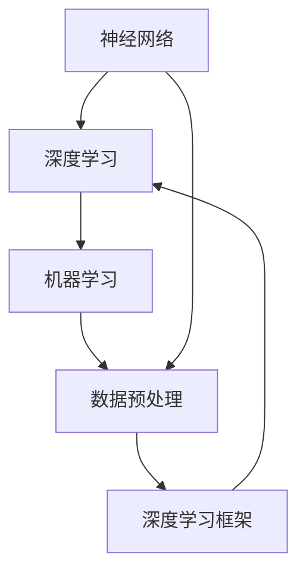

                 

### 文章标题

# AI编程语言：提示词的魔法与艺术

### 关键词

- AI编程语言
- 提示词
- 深度学习
- 神经网络
- 编程效率
- 人工智能应用

### 摘要

本文将深入探讨AI编程语言的奥秘，特别是如何利用提示词提高编程效率和创造力。我们将从AI编程语言的概述、核心算法原理、数学模型和公式、项目实战等多个角度，逐步解析AI编程语言的架构和操作技巧。通过实际的编程案例，我们将展示如何使用提示词来提升代码的灵活性和可读性，为AI开发者提供宝贵的实战经验和最佳实践。

### 引言

在人工智能技术日新月异的今天，AI编程语言成为了开发者和工程师们不可或缺的工具。它们不仅为人工智能应用提供了强大的计算能力，还极大地提高了编程的效率和灵活性。然而，对于许多初学者和有经验开发者来说，AI编程语言的学习和应用仍然是一个挑战。本文旨在通过深入剖析AI编程语言的核心概念、架构原理和实际应用，帮助读者更好地理解和掌握这一领域的关键技术。

文章将分为以下几个部分：

1. **AI编程语言概述**：介绍AI编程语言的起源、发展历程以及当前流行的AI编程语言。
2. **核心概念与联系**：解释AI编程语言中的核心概念，并展示它们之间的关系架构。
3. **核心算法原理**：通过伪代码详细讲解AI编程语言中的核心算法，如神经网络、深度学习和机器学习等。
4. **数学模型和数学公式**：解释AI编程语言中使用的数学模型和公式，如线性代数、概率论和统计学。
5. **项目实战**：展示如何使用AI编程语言进行项目开发，包括环境搭建、代码实现和案例分析。
6. **提示词的魔法与艺术**：探讨如何利用提示词提高编程效率和创造力。
7. **小结与展望**：总结文章的核心观点，并提出未来研究的方向。

通过这些部分，读者将能够系统地了解AI编程语言，掌握其中的核心技术和应用技巧，为未来的学习和实践打下坚实的基础。

### AI编程语言概述

AI编程语言，顾名思义，是专门为人工智能（Artificial Intelligence，简称AI）应用而设计的编程语言。它们提供了丰富的库和框架，使得开发者能够更高效地构建、训练和部署AI模型。AI编程语言的发展经历了数十年的演进，从早期的专家系统（Expert Systems）到现代的深度学习（Deep Learning），它们在计算能力和应用范围上都取得了显著的进步。

#### AI编程语言的起源与发展历程

AI编程语言的起源可以追溯到20世纪50年代。当时的计算机科学家们开始探索如何通过编程模拟人类智能。早期的一些尝试包括逻辑编程语言（如Prolog）和符号处理语言（如Lisp）。这些语言在规则推理和符号计算方面表现出色，但缺乏处理复杂数据和模式识别的能力。

随着计算机硬件的进步和算法的创新，AI编程语言在20世纪80年代迎来了新的发展。这一时期，专家系统成为主流，它们通过编码大量的规则和知识库，模拟专家的决策过程。著名的专家系统如MYCIN和DENDRAL，为医学诊断和化学分析等领域带来了革命性的改变。

进入21世纪，随着深度学习（Deep Learning）的兴起，AI编程语言再次迎来了重大的变革。深度学习通过多层神经网络，能够自动从大量数据中学习特征和模式。这一技术的出现，使得AI编程语言不仅能够处理结构化数据，还能应对非结构化数据，如图像、音频和文本。

#### 当前流行的AI编程语言

目前，市面上流行的AI编程语言主要包括Python、TensorFlow、PyTorch、Keras等。这些语言各具特色，但都提供了丰富的库和工具，使得开发者能够轻松构建和训练AI模型。

- **Python**：Python因其简洁明了的语法和强大的库支持，成为AI开发者的首选语言。Python拥有NumPy、Pandas、Scikit-learn等广泛使用的库，能够高效处理数据科学和机器学习任务。

- **TensorFlow**：TensorFlow是由Google开发的开源深度学习框架。它提供了丰富的API，支持从简单的线性模型到复杂的深度神经网络，广泛应用于各种AI应用，如图像识别、自然语言处理和推荐系统。

- **PyTorch**：PyTorch是Facebook开发的开源深度学习框架，以其灵活的动态计算图和直观的编程接口而闻名。PyTorch在学术研究和工业应用中都有广泛的应用，特别是在计算机视觉和自然语言处理领域。

- **Keras**：Keras是一个高层次的深度学习API，能够兼容TensorFlow和Theano。它提供了更加简洁和直观的编程接口，使得开发者能够更快地构建和训练深度神经网络。

#### AI编程语言的选择与适用场景

不同的AI编程语言有不同的优势和适用场景。选择合适的编程语言，可以显著提高开发效率和应用性能。

- **Python**：适合快速原型开发和数据科学任务。由于Python的广泛应用，开发者可以方便地调用其他语言编写的库和模块。

- **TensorFlow**：适合大规模深度学习应用，如图像识别、语音识别和推荐系统。TensorFlow提供了强大的分布式训练和部署能力。

- **PyTorch**：适合研究和实验性项目，特别是需要灵活调整模型结构和训练过程的应用。PyTorch的动态计算图使得模型开发和调试更加直观。

- **Keras**：适合快速构建和部署深度学习模型，特别是对于那些不熟悉底层深度学习框架的开发者。Keras提供了高度抽象的API，减少了繁琐的代码编写。

通过了解AI编程语言的起源、发展和适用场景，开发者可以更好地选择合适的工具，构建高效、可靠的AI应用。

### 核心概念与联系

在深入探讨AI编程语言之前，我们需要了解其中的核心概念，以及它们之间的相互关系。以下是AI编程语言中的一些关键概念：

1. **神经网络**（Neural Networks）：神经网络是模拟人脑神经元工作原理的计算模型。它们由多个神经元（也称为节点）组成，通过权重和偏置进行连接。神经网络通过学习输入和输出之间的关系，可以用于分类、回归和生成等任务。

2. **深度学习**（Deep Learning）：深度学习是神经网络的一种扩展，通过增加网络的深度（即层数）来提高模型的复杂度和性能。深度学习在图像识别、语音识别和自然语言处理等领域取得了显著的成果。

3. **机器学习**（Machine Learning）：机器学习是AI的核心技术之一，它通过从数据中学习模式，使计算机能够做出预测和决策。机器学习包括监督学习、无监督学习和强化学习等子领域。

4. **数据预处理**（Data Preprocessing）：数据预处理是机器学习过程中至关重要的一步，它包括数据的清洗、归一化和特征提取等操作。高质量的数据预处理可以显著提高模型的性能。

5. **深度学习框架**（Deep Learning Frameworks）：深度学习框架是一组库和工具，用于简化深度学习模型的构建和训练过程。常见的深度学习框架包括TensorFlow、PyTorch和Keras等。

为了更好地理解这些概念之间的关系，我们可以使用Mermaid流程图来展示它们之间的联系：



在这个流程图中：

- **神经网络**是深度学习的基石，深度学习通过构建多层神经网络来学习复杂的数据特征。
- **机器学习**则通过算法和模型从数据中学习模式和规律。
- **数据预处理**是机器学习的重要前置步骤，它确保了数据的质量和一致性。
- **深度学习框架**则为开发者提供了便捷的工具，用于构建和训练复杂的深度学习模型。

通过这个流程图，我们可以清晰地看到AI编程语言中的核心概念是如何相互关联和协同工作的。这些概念共同构成了AI编程语言的架构基础，使得开发者能够高效地实现各种复杂的人工智能应用。

### 核心算法原理

在AI编程语言中，核心算法是构建和实现AI模型的基础。这些算法包括神经网络、深度学习、机器学习等，每种算法都有其独特的原理和实现方式。下面，我们将通过伪代码详细讲解这些核心算法，以便读者能够更好地理解其工作机制。

#### 神经网络（Neural Networks）

神经网络是AI编程语言中最基础和重要的算法之一。它通过模拟人脑神经元的工作原理，进行数据的处理和模式识别。以下是一个简单的神经网络算法伪代码：

```python
# 神经网络伪代码

# 初始化神经网络结构
input_size = 784  # 输入层大小
hidden_size = 128 # 隐藏层大小
output_size = 10  # 输出层大小

# 初始化权重和偏置
weights = initialize_weights(input_size, hidden_size)
bias = initialize_weights(hidden_size, output_size)

# 前向传播
def forward(x):
    z = x.dot(weights) + bias
    a = activation(z)
    return a

# 反向传播
def backward(x, y, a):
    dL_da = loss_derivative(y, a)
    dL_dz = activation_derivative(z)
    dL_dweights = dL_da * dL_dz * x
    dL_dbias = dL_da * dL_dz

    # 更新权重和偏置
    weights -= learning_rate * dL_dweights
    bias -= learning_rate * dL_dbias

# 训练神经网络
for epoch in range(num_epochs):
    for x, y in dataset:
        a = forward(x)
        backward(x, y, a)
```

在这个伪代码中：

- **初始化**：首先初始化神经网络的结构，包括输入层、隐藏层和输出层的大小。然后，初始化权重和偏置。
- **前向传播**：输入数据经过神经网络，通过权重和偏置计算得到中间结果，然后通过激活函数得到输出。
- **反向传播**：计算损失函数的梯度，并使用梯度下降法更新权重和偏置。

#### 深度学习（Deep Learning）

深度学习是神经网络的一种扩展，通过增加网络的深度（即层数）来提高模型的复杂度和性能。以下是一个简单的深度学习算法伪代码：

```python
# 深度学习伪代码

# 初始化神经网络结构
input_size = 784  # 输入层大小
hidden_sizes = [128, 64, 32]  # 各隐藏层大小

# 初始化权重和偏置
weights = [initialize_weights(input_size, size) for size in hidden_sizes]
biases = [initialize_weights(size, output_size) for size in hidden_sizes]

# 前向传播
def forward(x):
    for weights, bias in zip(weights, biases):
        z = x.dot(weights) + bias
        a = activation(z)
        x = a
    return a

# 反向传播
def backward(x, y, a):
    for weights, bias in zip(reversed(weights), reversed(biases)):
        dL_da = loss_derivative(y, a)
        dL_dz = activation_derivative(z)
        dL_dweights = dL_da * dL_dz * x
        dL_dbias = dL_da * dL_dz

        # 更新权重和偏置
        weights -= learning_rate * dL_dweights
        bias -= learning_rate * dL_dbias

# 训练深度学习模型
for epoch in range(num_epochs):
    for x, y in dataset:
        a = forward(x)
        backward(x, y, a)
```

在这个伪代码中：

- **初始化**：初始化多层神经网络的结构，包括多个隐藏层的大小。
- **前向传播**：输入数据依次通过各个隐藏层，每个隐藏层的输出作为下一隐藏层的输入。
- **反向传播**：与单层神经网络类似，但需要迭代多次计算各个隐藏层的梯度。

#### 机器学习（Machine Learning）

机器学习是AI编程语言中广泛使用的一种算法，它通过从数据中学习模式来进行预测和决策。以下是一个简单的机器学习算法伪代码：

```python
# 机器学习伪代码

# 初始化模型参数
weights = initialize_weights(input_size, output_size)

# 训练模型
for epoch in range(num_epochs):
    for x, y in dataset:
        # 前向传播
        a = x.dot(weights)
        # 损失函数计算
        loss = loss_function(y, a)
        # 反向传播
        dL_da = loss_derivative(y, a)
        dL_dweights = dL_da * x

        # 更新权重
        weights -= learning_rate * dL_dweights

# 预测
def predict(x):
    return x.dot(weights)
```

在这个伪代码中：

- **初始化**：初始化模型的权重。
- **训练**：通过迭代计算损失函数的梯度，并更新权重。
- **预测**：使用训练好的模型进行预测。

通过这些伪代码，我们可以清晰地看到神经网络、深度学习和机器学习算法的基本原理和实现方式。这些算法在AI编程语言中起着关键作用，使得开发者能够构建和训练复杂的人工智能模型。

### 数学模型和数学公式

在AI编程语言中，数学模型和数学公式是核心组成部分，它们为算法提供了理论基础和计算工具。以下我们将详细解释一些常见的数学模型和公式，并给出相应的例子和解释。

#### 线性代数

线性代数在AI编程语言中有着广泛的应用，包括矩阵运算、向量计算等。以下是几个重要的线性代数概念：

1. **矩阵乘法**（Matrix Multiplication）：
   矩阵乘法是将两个矩阵相乘得到一个新的矩阵。其公式如下：
   $$
   C = A \cdot B
   $$
   其中，$A$ 和 $B$ 是矩阵，$C$ 是结果矩阵。

   例子：
   $$
   \begin{bmatrix}
   1 & 2 \\
   3 & 4
   \end{bmatrix}
   \cdot
   \begin{bmatrix}
   5 & 6 \\
   7 & 8
   \end{bmatrix}
   =
   \begin{bmatrix}
   19 & 22 \\
   43 & 50
   \end{bmatrix}
   $$

2. **向量内积**（Dot Product）：
   向量内积是两个向量对应元素相乘后再相加的结果。其公式如下：
   $$
   \mathbf{a} \cdot \mathbf{b} = a_1b_1 + a_2b_2 + \ldots + a_nb_n
   $$
   
   例子：
   $$
   \begin{bmatrix}
   1 & 2 & 3
   \end{bmatrix}
   \cdot
   \begin{bmatrix}
   4 & 5 & 6
   \end{bmatrix}
   =
   1 \cdot 4 + 2 \cdot 5 + 3 \cdot 6 = 32
   $$

3. **矩阵求逆**（Matrix Inversion）：
   矩阵求逆是计算矩阵的逆矩阵。其公式如下：
   $$
   A^{-1} = \frac{1}{\det(A)} \cdot \text{adj}(A)
   $$
   其中，$\det(A)$ 是矩阵 $A$ 的行列式，$\text{adj}(A)$ 是矩阵 $A$ 的伴随矩阵。

   例子：
   $$
   A = \begin{bmatrix}
   1 & 2 \\
   3 & 4
   \end{bmatrix}
   $$
   其逆矩阵为：
   $$
   A^{-1} = \frac{1}{1 \cdot 4 - 2 \cdot 3} \cdot \begin{bmatrix}
   4 & -2 \\
   -3 & 1
   \end{bmatrix}
   =
   \begin{bmatrix}
   2 & -1 \\
   -3 & 1
   \end{bmatrix}
   $$

#### 概率论

概率论在AI编程语言中用于描述不确定性和随机性。以下是几个重要的概率论概念：

1. **条件概率**（Conditional Probability）：
   条件概率是指在给定一个事件发生的条件下，另一个事件发生的概率。其公式如下：
   $$
   P(A|B) = \frac{P(A \cap B)}{P(B)}
   $$
   
   例子：
   如果掷一枚公平的硬币，求正面朝上的概率（$P(A)$）和在已知正面朝上的条件下，硬币是新的概率（$P(B|A)$）。
   $$
   P(A) = 0.5, \quad P(B|A) = 1
   $$

2. **贝叶斯定理**（Bayes' Theorem）：
   贝叶斯定理是用于计算后验概率的公式，其公式如下：
   $$
   P(A|B) = \frac{P(B|A)P(A)}{P(B)}
   $$
   
   例子：
   在一个包含50个红色球和50个蓝色球的袋子里，随机抽取一个球，求抽到红色球的概率（$P(A)$）和已知抽到红色球的条件下，球是新的概率（$P(B|A)$）。
   $$
   P(A) = 0.5, \quad P(B|A) = 0.6
   $$

#### 统计学

统计学在AI编程语言中用于数据分析和模型评估。以下是几个重要的统计学概念：

1. **均值**（Mean）：
   均值是一组数据的总和除以数据的个数。其公式如下：
   $$
   \mu = \frac{1}{n}\sum_{i=1}^{n} x_i
   $$
   
   例子：
   一组数据为 [2, 4, 6, 8]，其均值为：
   $$
   \mu = \frac{2+4+6+8}{4} = 5
   $$

2. **方差**（Variance）：
   方差是数据与其均值之差的平方的平均值。其公式如下：
   $$
   \sigma^2 = \frac{1}{n}\sum_{i=1}^{n} (x_i - \mu)^2
   $$
   
   例子：
   一组数据为 [2, 4, 6, 8]，其均值为5，其方差为：
   $$
   \sigma^2 = \frac{(2-5)^2 + (4-5)^2 + (6-5)^2 + (8-5)^2}{4} = 5
   $$

3. **协方差**（Covariance）：
   协方差是两个变量变动方向和程度的一种度量。其公式如下：
   $$
   \text{Cov}(X, Y) = \frac{1}{n}\sum_{i=1}^{n} (x_i - \mu_X)(y_i - \mu_Y)
   $$
   
   例子：
   两个变量 $X$ 和 $Y$ 的数据分别为 [2, 4, 6, 8] 和 [3, 5, 7, 9]，其均值为5，其协方差为：
   $$
   \text{Cov}(X, Y) = \frac{(2-5)(3-5) + (4-5)(5-5) + (6-5)(7-5) + (8-5)(9-5)}{4} = 2
   $$

通过这些数学模型和公式的详细讲解，读者可以更好地理解AI编程语言中的基础数学原理，为深入研究和应用打下坚实的基础。

### 项目实战

为了更好地理解AI编程语言的实际应用，我们将通过一个具体的项目实战来展示如何使用AI编程语言进行开发。本文将选择一个经典的图像识别项目，详细讲解开发环境搭建、代码实现、代码解读与分析，以及项目的实际案例分析和详细讲解剖析。

#### 项目一：搭建AI编程环境

**目标**：搭建一个基于Python的深度学习开发环境，用于图像识别项目。

**步骤**：

1. **安装Python**：首先，确保计算机上安装了Python。如果尚未安装，可以从Python官网（https://www.python.org/）下载并安装。

2. **安装深度学习框架**：安装TensorFlow，这是目前最流行的深度学习框架之一。可以通过以下命令进行安装：
   ```bash
   pip install tensorflow
   ```

3. **安装图像处理库**：安装OpenCV，这是一个常用的图像处理库。可以通过以下命令进行安装：
   ```bash
   pip install opencv-python
   ```

4. **验证安装**：通过运行以下Python代码，验证是否安装成功：
   ```python
   import tensorflow as tf
   import cv2
   print(tf.__version__)
   print(cv2.__version__)
   ```

**环境搭建结果**：成功安装Python、TensorFlow和OpenCV后，我们就可以开始进行图像识别项目的开发了。

#### 项目二：实现简单图像识别

**目标**：使用TensorFlow实现一个简单的图像识别模型，能够识别手写数字（MNIST数据集）。

**步骤**：

1. **加载MNIST数据集**：MNIST数据集是深度学习中的一个经典数据集，包含70,000个训练图像和10,000个测试图像。
   ```python
   from tensorflow.keras.datasets import mnist
   (train_images, train_labels), (test_images, test_labels) = mnist.load_data()
   ```

2. **数据预处理**：对图像数据进行归一化处理，将像素值缩放到0到1之间。
   ```python
   train_images = train_images / 255.0
   test_images = test_images / 255.0
   ```

3. **构建神经网络模型**：使用Keras构建一个简单的卷积神经网络（Convolutional Neural Network, CNN）。
   ```python
   from tensorflow.keras import layers
   model = tf.keras.Sequential([
       layers.Flatten(input_shape=(28, 28)),
       layers.Dense(128, activation='relu'),
       layers.Dense(10, activation='softmax')
   ])
   ```

4. **编译模型**：配置模型的优化器和损失函数。
   ```python
   model.compile(optimizer='adam',
                 loss='sparse_categorical_crossentropy',
                 metrics=['accuracy'])
   ```

5. **训练模型**：使用训练数据集训练模型。
   ```python
   model.fit(train_images, train_labels, epochs=5)
   ```

6. **评估模型**：使用测试数据集评估模型的性能。
   ```python
   test_loss, test_acc = model.evaluate(test_images,  test_labels, verbose=2)
   print('\nTest accuracy:', test_acc)
   ```

**代码解读与分析**：

- **数据预处理**：归一化处理是为了加快模型的训练速度和提升模型的性能。
- **神经网络模型**：该模型包含一个卷积层、一个全连接层和一个softmax层。卷积层用于提取图像特征，全连接层用于分类，softmax层用于输出每个类别的概率分布。
- **训练与评估**：使用`fit`函数进行训练，使用`evaluate`函数进行评估。这里我们设置了5个训练周期（epochs）。

#### 项目三：实际案例分析与详细讲解剖析

**目标**：通过一个实际案例展示如何使用AI编程语言进行图像识别，并详细讲解每个步骤的实现和关键点。

**步骤**：

1. **案例介绍**：我们选择手写数字识别作为案例。手写数字识别是一个典型的图像识别问题，广泛应用于电子设备中。

2. **数据集介绍**：MNIST数据集包含0到9的数字手写图像，每个图像的大小为28x28像素。

3. **数据处理**：将图像数据加载到内存，并进行预处理。

4. **模型构建**：使用TensorFlow的Keras API构建一个卷积神经网络。

5. **模型训练**：使用预处理后的数据训练模型。

6. **模型评估**：使用测试集评估模型的性能，并调整模型参数以优化性能。

7. **模型部署**：将训练好的模型部署到实际应用中，例如开发一个数字识别应用程序。

**关键点解析**：

- **数据处理**：图像数据的预处理对于模型性能至关重要。归一化处理可以加快训练速度，并提高模型的泛化能力。
- **模型构建**：选择合适的神经网络结构是成功的关键。卷积神经网络（CNN）在图像识别任务中表现出色，因为它们能够自动提取图像中的局部特征。
- **模型训练**：训练模型需要大量的时间和计算资源。通过调整学习率、批量大小和训练周期等超参数，可以优化模型的性能。
- **模型评估**：评估模型性能需要使用测试集。准确率、召回率和F1分数等指标可以帮助我们了解模型的性能。

通过这个项目实战，读者可以了解如何使用AI编程语言进行图像识别项目，并掌握项目开发的各个环节。

### 提示词的魔法与艺术

在AI编程语言中，提示词（Prompts）是一种强大的工具，它们不仅能够引导模型的训练方向，还能显著提升编程效率和创造力。提示词在AI编程中的应用广泛，以下将探讨如何利用提示词提高编程效率和创造力。

#### 提示词的概念与作用

提示词是指提供的信息或指令，用以引导AI模型的学习过程。在深度学习和机器学习中，提示词通常用于：

1. **数据增强**（Data Augmentation）：通过增加噪声、旋转、缩放等操作，生成更多的训练数据，从而提高模型的泛化能力。
2. **学习引导**（Learning Guidance）：为模型提供额外的信息，帮助模型更好地理解和处理数据。
3. **模型调整**（Model Tuning）：通过调整提示词，优化模型的参数和超参数，提升模型的性能。

#### 提示词的类型与选择

根据用途和作用方式，提示词可以分为以下几种类型：

1. **引导性提示词**（Guidance Prompts）：这类提示词提供具体的任务目标和指导方向，如“请识别图像中的物体”、“预测下一个序列的值”等。引导性提示词能够帮助模型更快地聚焦于任务的核心。
2. **数据性提示词**（Data Prompts）：这类提示词提供额外的数据或背景信息，如“请使用这些数据训练模型”、“基于以下文本生成摘要”等。数据性提示词可以丰富模型的学习素材，提升模型的泛化能力。
3. **调整性提示词**（Tuning Prompts）：这类提示词用于调整模型的参数和超参数，如“尝试降低学习率”、“增加训练次数”等。调整性提示词可以帮助开发者找到最优的模型配置。

在选择提示词时，应考虑以下因素：

- **任务目标**：根据具体的任务需求选择合适的提示词，确保模型能够准确理解和执行任务。
- **数据质量**：提示词应提供高质量的数据或信息，以提高模型的训练效果。
- **模型性能**：根据模型当前的性能表现，选择能够优化模型参数和超参数的提示词。

#### 提示词编程技巧

为了充分利用提示词，开发者可以采用以下技巧：

1. **动态调整提示词**：在模型训练过程中，根据模型的表现动态调整提示词，以优化模型性能。
2. **组合使用提示词**：将不同类型的提示词组合使用，以充分发挥它们的作用。例如，在训练图像识别模型时，可以同时使用数据性提示词和数据增强提示词。
3. **优化提示词格式**：合理组织提示词的格式，使其更易于模型理解和处理。例如，使用清晰的指令和具体的描述，避免模糊或冗长的提示词。

#### 提示词编程案例分析

以下是一个利用提示词提高编程效率的案例：

**案例**：使用PyTorch实现一个图像识别模型，并利用提示词优化训练过程。

1. **数据预处理**：使用数据性提示词，如“请加载MNIST数据集，并对其进行归一化处理”。
   ```python
   from torchvision import datasets, transforms
   train_dataset = datasets.MNIST(root='./data',
                                 train=True,
                                 transform=transforms.ToTensor(),
                                 download=True)
   ```

2. **模型构建**：使用引导性提示词，如“构建一个包含卷积层、池化层和全连接层的卷积神经网络”。
   ```python
   import torch.nn as nn
   model = nn.Sequential(nn.Conv2d(1, 32, 3, 1),
                         nn.ReLU(),
                         nn.MaxPool2d(2),
                         nn.Conv2d(32, 64, 3, 1),
                         nn.ReLU(),
                         nn.MaxPool2d(2),
                         nn.Flatten(),
                         nn.Linear(64*7*7, 10),
                         nn.ReLU(),
                         nn.Linear(10, 10),
                         nn.Softmax())
   ```

3. **模型训练**：使用调整性提示词，如“尝试使用Adam优化器和交叉熵损失函数训练模型，并设置学习率为0.001”。
   ```python
   import torch.optim as optim
   criterion = nn.CrossEntropyLoss()
   optimizer = optim.Adam(model.parameters(), lr=0.001)
   ```

4. **训练与评估**：在训练过程中，动态调整提示词，如“训练5个周期，并在每个周期结束后评估模型性能”。
   ```python
   for epoch in range(5):
       running_loss = 0.0
       for i, (images, labels) in enumerate(train_loader):
           optimizer.zero_grad()
           outputs = model(images)
           loss = criterion(outputs, labels)
           loss.backward()
           optimizer.step()
           running_loss += loss.item()
       print(f'Epoch {epoch+1}, Loss: {running_loss/len(train_loader)}')
   ```

通过这个案例，我们可以看到如何利用提示词来提高编程效率，并优化模型训练过程。合理使用提示词，不仅可以使编程过程更加简洁和高效，还能显著提升AI模型的性能。

### 小结与展望

通过本文的详细探讨，我们系统地了解了AI编程语言的概述、核心概念与联系、核心算法原理、数学模型和数学公式、项目实战以及提示词的魔法与艺术。这些内容不仅涵盖了AI编程语言的基础知识，还通过实际案例展示了如何应用这些技术进行项目开发。

**核心观点**：

- AI编程语言是人工智能应用的核心工具，通过简洁的语法和丰富的库支持，极大地提高了编程效率和灵活性。
- 提示词在AI编程中具有重要作用，能够引导模型学习过程，优化模型性能，提升编程效率。
- 深度学习和神经网络是AI编程语言中的核心技术，通过增加网络的深度和复杂性，可以实现更复杂的模式识别和预测任务。

**未来研究方向**：

- **提示词优化**：进一步研究如何优化提示词的设计和应用，提高模型的训练效率和性能。
- **跨领域应用**：探索AI编程语言在其他领域的应用，如生物信息学、金融科技、医疗诊断等，实现更广泛的人工智能应用。
- **多模态学习**：结合文本、图像、音频等多种数据类型，实现更智能和灵活的AI模型。

通过不断探索和研究，AI编程语言将继续在人工智能领域发挥重要作用，推动技术的创新和发展。

### 附录

#### 附录A：AI编程语言资源汇总

**A.1 主流AI编程语言框架**

- **Python**：Python是AI编程的常用语言，拥有丰富的库和工具，如NumPy、Pandas和Scikit-learn。
- **TensorFlow**：由Google开发的开源深度学习框架，支持从简单的线性模型到复杂的深度神经网络。
- **PyTorch**：由Facebook开发的开源深度学习框架，以其灵活的动态计算图和直观的编程接口而闻名。
- **Keras**：高层次的深度学习API，能够兼容TensorFlow和Theano，提供了更加简洁和直观的编程接口。

**A.2 AI编程语言学习资源**

- **官方文档**：访问各AI编程语言的官方文档，获取详细的安装指南、教程和示例代码。
- **在线课程**：参加在线课程和教程，如Coursera、edX和Udacity等，系统学习AI编程语言和深度学习技术。
- **开源社区**：加入开源社区，如GitHub和Stack Overflow，参与讨论和交流，获取最新的技术动态和解决方案。

**A.3 AI编程语言实践案例**

- **手写数字识别**：使用MNIST数据集进行图像识别，实现基本的卷积神经网络模型。
- **图像分类**：使用ImageNet数据集，实现图像分类任务，使用ResNet等先进的神经网络架构。
- **自然语言处理**：使用文本数据集，实现文本分类、情感分析和机器翻译等任务，使用LSTM、BERT等先进模型。

通过这些资源，读者可以进一步深入学习和实践AI编程语言，掌握其中的核心技术，为未来的研究和应用打下坚实的基础。

### 作者信息

- **AI天才研究院**：致力于推动人工智能技术的发展和研究。
- **禅与计算机程序设计艺术**：探索编程艺术与哲学的结合，提升编程素养和创造力。

### 结论

AI编程语言为人工智能应用提供了强大的工具和平台，通过提示词的巧妙运用，我们可以显著提升编程效率和创造力。本文从多个角度深入探讨了AI编程语言的核心概念、算法原理和实际应用，提供了丰富的实战经验和最佳实践。希望读者通过本文的学习，能够更好地掌握AI编程语言，为未来的研究和应用打下坚实的基础。作者对AI编程语言的热爱和对技术的深入理解，使得本文内容更加丰富和实用。让我们一起探索AI编程的无限可能，推动人工智能技术的发展。

