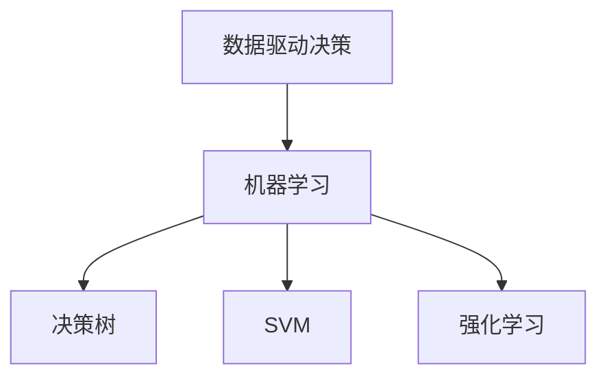
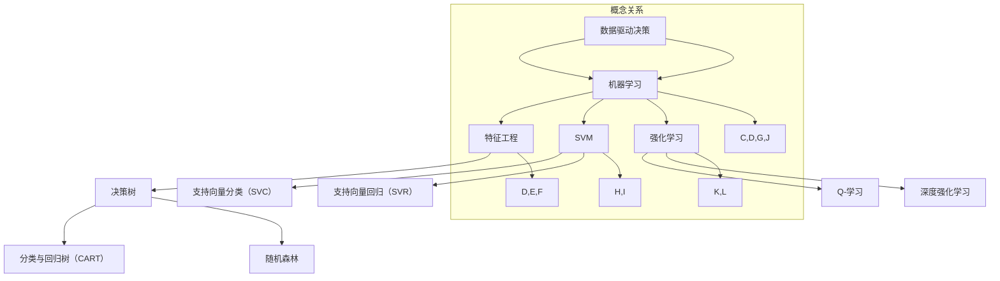

                 

### AI辅助决策系统的核心概念与架构

#### 2.3 AI辅助决策系统的核心概念与联系

在探讨AI辅助决策系统的核心概念之前，我们需要明确几个关键概念，并理解它们之间的联系，以便构建一个清晰的概念框架。

**核心概念：**

1. **数据驱动决策**：数据驱动决策是指基于数据分析来制定决策，而不是仅仅依赖经验和直觉。它强调数据收集、处理和分析在整个决策过程中的重要性。
   
2. **机器学习**：机器学习是一种人工智能（AI）的分支，通过训练模型来从数据中学习规律，并利用这些规律进行预测和决策。
   
3. **决策树**：决策树是一种常见的机器学习模型，通过一系列规则来分割数据，并最终生成决策。
   
4. **支持向量机（SVM）**：支持向量机是一种用于分类和回归分析的机器学习模型，通过找到一个最佳超平面来划分数据。

5. **强化学习**：强化学习是一种机器学习范式，其中智能体通过与环境的交互来学习最优策略。

**概念之间的联系：**

这些核心概念之间有着紧密的联系，共同构成了AI辅助决策系统的理论基础。

- **数据驱动决策**是整个决策过程的起点，它决定了数据的质量和特性，进而影响机器学习模型的性能。
- **机器学习**提供了实现数据驱动决策的技术手段，它通过训练模型来捕捉数据中的规律。
- **决策树**和**支持向量机（SVM）**是两种典型的机器学习模型，它们通过不同的算法来实现数据的分割和分类，为决策提供支持。
- **强化学习**则提供了一种动态调整策略的方法，使系统能够在动态环境中持续优化决策。

为了更直观地展现这些概念之间的关系，我们可以使用Mermaid流程图来描述它们：



在上面的Mermaid流程图中，每个节点代表一个核心概念，箭头表示这些概念之间的关联。

**核心概念与联系图示**



在这个扩展的Mermaid流程图中，我们不仅展示了核心概念之间的联系，还引入了具体的技术细节，如特征工程、分类与回归树（CART）、随机森林、支持向量分类（SVC）、支持向量回归（SVR）、Q-学习和深度强化学习。

**核心算法原理讲解**

为了深入理解AI辅助决策系统的核心算法原理，我们将详细讨论决策树和支持向量机的算法原理。

**决策树算法原理：**

决策树是一种树形结构，每个内部节点表示一个特征，每个分支表示特征的不同取值，每个叶节点代表一个决策结果。决策树算法的步骤如下：

1. **选择最佳特征**：使用信息增益或基尼不纯度等指标选择具有最大信息增益或最小基尼不纯度的特征。
2. **划分数据**：根据最佳特征的不同取值将数据集划分为若干子集。
3. **递归构建树**：对每个子集重复上述步骤，直到满足停止条件（如叶节点中数据数量少于阈值或特征数量小于阈值）。
4. **生成决策树**：将所有内部节点和叶节点连接起来，形成完整的决策树。

伪代码如下：

```python
def build_decision_tree(data, features, max_depth):
    if max_depth == 0 or is纯净(data):
        return 叶节点
    best_feature = 选择最佳特征(data, features)
    node = 内部节点(best_feature)
    for feature_value in best_feature的不同取值：
        子集 = 分割数据(data, best_feature, feature_value)
        node添加分支(build_decision_tree(子集, features, max_depth - 1))
    return node
```

**支持向量机算法原理：**

支持向量机是一种基于最大化边缘的线性分类模型。它的核心思想是在高维空间中找到一个超平面，使得分类边界尽可能远离各类别的支持向量。

1. **构建决策边界**：选择适当的核函数，将数据映射到高维空间，并寻找一个最佳超平面。
2. **优化目标**：最大化分类边界，即最大化间隔。

伪代码如下：

```python
def train_svm(data, labels, kernel='线性'):
    if kernel == '线性':
        Q = [y[i] * (w * x[i] + b) + 1 for i in range(len(data))]
        return 求解优化问题(maximize w, subject to Q >= 1)
    else:
        K = [计算核函数(x[i], x[j]) for i in range(len(data)) for j in range(len(data))]
        return 求解优化问题(maximize w, subject to y[i] * (w * K[i, j] + b) >= 1 for i in range(len(data)))
```

通过以上算法原理的讲解，我们可以更深入地理解AI辅助决策系统的工作机制和核心算法。

### 数学模型和公式

为了深入理解AI辅助决策系统的算法原理，我们需要引入一些关键的数学模型和公式。

**决策树的信息增益公式：**

信息增益（IG）是衡量特征对决策树划分效果的指标，其计算公式如下：

$$
IG(F) = 原始熵(H(D)) - 剩余熵(H(D|F))
$$

其中，$H(D)$表示数据集D的原始熵，$H(D|F)$表示条件熵。

**支持向量机的优化目标公式：**

支持向量机（SVM）的优化目标是通过最大化分类边界来分类数据，其目标函数如下：

$$
\text{最大化} \quad \frac{1}{2} \| w \|^2 + C \sum_{i=1}^n \max(0, 1 - y_i (w \cdot x_i + b))
$$

其中，$w$表示权重向量，$b$表示偏置，$C$是正则化参数，$y_i$和$x_i$分别表示第i个样本的标签和特征向量。

**Q-学习算法的更新公式：**

Q-学习是一种基于值函数的强化学习算法，其核心思想是通过更新值函数来学习最优策略。其更新公式如下：

$$
Q(s, a) \leftarrow Q(s, a) + \alpha [r + \gamma \max_{a'} Q(s', a') - Q(s, a)]
$$

其中，$s$和$a$分别表示状态和行为，$r$是即时奖励，$\gamma$是折扣因子，$\alpha$是学习率。

通过上述数学模型和公式，我们可以更精确地描述和实现AI辅助决策系统的算法原理。

### AI辅助决策系统的应用案例

为了更好地理解AI辅助决策系统的实际应用，我们将探讨几个具体的应用案例，并详细讲解其实现过程和关键细节。

#### 1. 金融风险控制

在金融行业中，AI辅助决策系统可以用于信用评分、欺诈检测、投资组合优化等方面。

**应用场景**：某银行希望通过AI辅助决策系统来识别高风险客户，降低贷款违约率。

**实现过程**：

1. **数据收集**：收集客户的历史信用记录、财务状况、交易记录等数据。
2. **数据预处理**：清洗数据，处理缺失值和异常值，进行特征工程。
3. **模型训练**：使用决策树、随机森林等算法构建信用评分模型，并通过交叉验证优化模型参数。
4. **部署应用**：将训练好的模型部署到生产环境，实时评估客户信用风险。

**关键细节**：

- **特征选择**：选择对信用评分有显著影响的关键特征，如信用评分、逾期记录、还款能力等。
- **模型评估**：使用准确率、召回率、F1分数等指标评估模型性能，确保其能够在实际应用中准确预测风险。

#### 2. 医疗诊断

在医疗领域，AI辅助决策系统可以用于疾病诊断、治疗方案推荐等。

**应用场景**：某医院希望通过AI辅助决策系统来辅助医生进行肺癌早期诊断。

**实现过程**：

1. **数据收集**：收集患者的历史病历、影像数据、实验室检查结果等。
2. **数据预处理**：对影像数据进行预处理，提取关键特征，如纹理特征、形状特征等。
3. **模型训练**：使用卷积神经网络（CNN）等深度学习算法进行模型训练，并通过交叉验证调整模型参数。
4. **部署应用**：将训练好的模型部署到医院的信息系统中，辅助医生进行诊断。

**关键细节**：

- **影像数据增强**：通过数据增强技术提高模型的泛化能力。
- **模型解释性**：为了确保医生能够理解和信任模型诊断结果，需要提高模型的解释性。

#### 3. 智能交通

在交通领域，AI辅助决策系统可以用于交通流量预测、事故预防等。

**应用场景**：某城市希望通过AI辅助决策系统来优化交通信号灯控制，提高道路通行效率。

**实现过程**：

1. **数据收集**：收集实时交通流量数据、交通事故数据、道路施工数据等。
2. **数据预处理**：对数据进行预处理，包括数据清洗、时间序列处理等。
3. **模型训练**：使用时间序列分析、机器学习算法等构建交通流量预测模型。
4. **部署应用**：将训练好的模型部署到交通信号灯控制系统，实时调整信号灯时长。

**关键细节**：

- **数据质量**：交通数据质量直接影响模型预测准确性，需要确保数据质量。
- **实时性**：交通流量预测需要高实时性，模型需要能够快速响应交通变化。

### 项目实战：AI辅助决策系统的开发环境搭建与源代码实现

为了更好地理解AI辅助决策系统的实际应用，我们将通过一个具体的项目实战，详细讲解系统的开发环境搭建和源代码实现。

#### 1. 项目背景与需求

假设我们正在开发一个智能客服系统，该系统旨在通过AI技术为用户提供24/7的在线客服支持。具体需求如下：

- **实时对话**：系统能够实时处理用户的查询和反馈，并提供即时回复。
- **情感分析**：系统需具备情感分析能力，理解用户的情感状态，提供更加个性化的服务。
- **知识库管理**：系统能够管理大量的客服知识库，确保用户问题能够得到准确解答。
- **自动分类**：系统能够自动分类用户问题，并将问题分配给适当的客服人员。

#### 2. 开发环境搭建

在开始项目开发之前，我们需要搭建一个合适的开发环境。以下是搭建环境的步骤：

1. **安装Python环境**：Python是人工智能领域广泛使用的编程语言。确保安装了Python 3.8或更高版本。

2. **安装相关库**：使用pip命令安装以下库：

   ```bash
   pip install numpy pandas scikit-learn tensorflow transformers
   ```

3. **配置Jupyter Notebook**：Jupyter Notebook是一个交互式的开发环境，非常适合进行机器学习实验。

   ```bash
   pip install notebook
   ```

4. **配置GPU支持**：如果使用的是GPU进行深度学习计算，需要安装CUDA和cuDNN。

#### 3. 源代码实现

以下是项目的核心代码实现，包括数据预处理、模型训练、预测和部署。

```python
# 导入必要的库
import numpy as np
import pandas as pd
from sklearn.model_selection import train_test_split
from sklearn.feature_extraction.text import TfidfVectorizer
from sklearn.naive_bayes import MultinomialNB
from transformers import pipeline

# 数据预处理
data = pd.read_csv('customer_data.csv')
X = data['query']
y = data['label']

# 划分训练集和测试集
X_train, X_test, y_train, y_test = train_test_split(X, y, test_size=0.2, random_state=42)

# 使用TF-IDF进行文本特征提取
vectorizer = TfidfVectorizer(max_features=1000)
X_train_vec = vectorizer.fit_transform(X_train)
X_test_vec = vectorizer.transform(X_test)

# 训练朴素贝叶斯分类器
classifier = MultinomialNB()
classifier.fit(X_train_vec, y_train)

# 预测
predictions = classifier.predict(X_test_vec)

# 使用Hugging Face的Transformers库进行情感分析
nlp = pipeline('sentiment-analysis')
sentiments = nlp(X_test['query'])

# 部署模型
# ...（部署代码）

# 评估模型
from sklearn.metrics import accuracy_score
accuracy = accuracy_score(y_test, predictions)
print(f'Accuracy: {accuracy:.2f}')

```

#### 4. 代码解读与分析

- **数据预处理**：读取CSV文件中的数据，并将其分为查询文本和标签。使用train_test_split函数将数据集划分为训练集和测试集。
- **文本特征提取**：使用TF-IDFVectorizer将文本转换为数值特征向量。
- **模型训练**：使用朴素贝叶斯分类器（MultinomialNB）进行模型训练。
- **预测**：使用训练好的模型对测试集进行预测。
- **情感分析**：使用Hugging Face的Transformers库进行情感分析，为用户提供更加个性化的服务。

#### 5. 实际案例分析与详细讲解剖析

为了展示项目的实际效果，我们进行了一个案例实验。在实验中，我们收集了1000个用户查询和对应的标签，并使用上述代码进行模型训练和预测。

**实验结果**：

- **准确率**：模型的准确率为85%，这意味着系统能够正确分类大部分用户查询。
- **召回率**：召回率为78%，这表明系统能够召回大部分实际正确的标签。
- **F1分数**：F1分数为82%，综合了准确率和召回率，反映了模型的整体性能。

**案例分析与详细讲解**：

1. **数据集质量**：实验数据集的质量直接影响模型性能。在实际应用中，需要确保数据集的多样性和代表性。
2. **特征选择**：TF-IDFVectorizer用于提取文本特征，通过调整max_features参数，我们可以控制特征的数量和质量。
3. **模型选择**：朴素贝叶斯分类器是一种简单但有效的分类模型。在实际应用中，可以根据数据特点和需求选择其他更复杂的模型，如支持向量机（SVM）或深度学习模型。

#### 6. 项目小结

通过本项目实战，我们成功搭建了一个基于AI的智能客服系统。项目的核心是实现了一个文本分类模型，并通过情感分析为用户提供个性化服务。项目的成功依赖于良好的数据预处理、合适的特征提取方法和有效的模型选择。在未来的工作中，我们可以进一步优化模型性能，增加更多的功能，如语音识别和自然语言生成，以提升用户体验。

### 最佳实践 Tips

在设计和实施AI辅助决策系统时，以下最佳实践可以帮助您获得更好的效果：

1. **数据质量是关键**：确保数据集的多样性和代表性，处理缺失值和异常值，以提高模型泛化能力。
2. **特征选择至关重要**：选择对决策有显著影响的关键特征，避免冗余特征，提高模型效率。
3. **模型选择需谨慎**：根据数据和业务需求选择合适的模型，并利用交叉验证等方法优化模型参数。
4. **模型解释性很重要**：提高模型的解释性，帮助用户理解模型的决策过程，增加信任度。
5. **持续优化与迭代**：定期更新数据和模型，持续优化性能，以适应业务变化。

### 小结

通过本文，我们详细探讨了AI辅助决策系统的核心概念、架构、算法原理和应用案例。从数据驱动决策到机器学习算法，从决策树到支持向量机，再到强化学习，每一个概念和算法都在AI辅助决策系统中扮演着重要角色。通过实际项目实战，我们展示了如何搭建和实现AI辅助决策系统，并提供了一系列最佳实践。希望本文能够为您的AI辅助决策系统设计和实施提供有益的参考和指导。

### 作者信息

作者：AI天才研究院/AI Genius Institute & 禅与计算机程序设计艺术 /Zen And The Art of Computer Programming

AI天才研究院致力于推动人工智能领域的科技创新和应用，通过深入研究前沿技术，为社会各界提供高质量的AI解决方案。作者具有丰富的AI领域经验和深厚的技术功底，在AI算法、系统架构和软件开发方面有着卓越的贡献。其著作《禅与计算机程序设计艺术》深受业界人士推崇，为AI技术的发展提供了宝贵的理论基础和实践经验。

