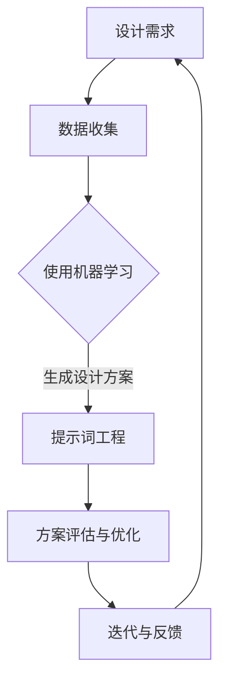
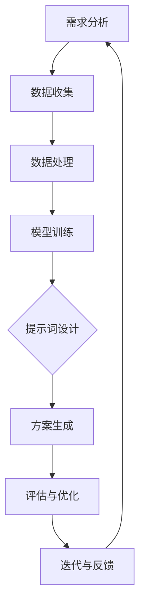
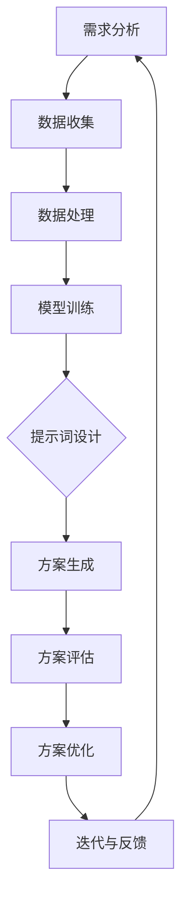
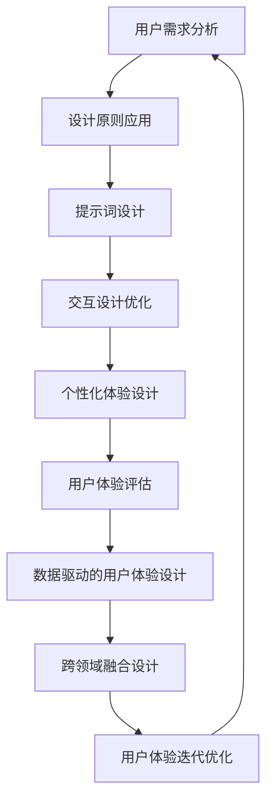

                 

### 文章标题

《AI辅助设计：提示词工程的创意激发》

### 关键词

- AI辅助设计
- 提示词工程
- 创意激发
- 机器学习
- 设计流程
- 用户体验设计

### 摘要

本文详细探讨了AI辅助设计与提示词工程在创意激发中的应用。通过概述AI辅助设计的基本概念和背景，本文深入解析了提示词工程的核心原理及其在创意激发中的作用。进一步地，本文详细介绍了机器学习算法在提示词工程中的应用，并探讨了如何通过设计流程和评估方法来实施和优化提示词工程。文章最后讨论了提示词工程与用户体验设计的协同创新，以及其在大规模定制和跨领域融合设计中的高级应用。本文旨在为设计师和开发者提供关于AI辅助设计和提示词工程的深入理解，并激发其在实际项目中的创新应用。

---

## 第1章 AI辅助设计概述

### 1.1 AI辅助设计的概念与背景

AI辅助设计（AI-Assisted Design）是指利用人工智能技术，如机器学习、深度学习、自然语言处理等，辅助设计师进行创意构思、设计优化、用户体验提升等全过程。其核心在于通过算法和模型分析大量数据，提取有价值的信息，进而为设计提供智能化支持。

AI辅助设计的起源可以追溯到20世纪末。随着计算机技术的快速发展，特别是互联网和大数据时代的到来，设计师们开始意识到利用计算机技术辅助设计的重要性。2000年代初期，一些初步的AI算法被应用于图形设计、建筑设计和工业设计等领域，标志着AI辅助设计的诞生。

近年来，随着深度学习等前沿技术的突破，AI辅助设计取得了显著的进展。例如，生成对抗网络（GAN）在图像生成和编辑领域的应用，使得设计师能够快速生成和调整设计稿；自然语言处理技术则可以帮助设计师更好地理解和处理用户需求，从而提升设计质量。

### 1.2 提示词工程的基本原理

提示词工程（Prompt Engineering）是AI辅助设计中的一个重要环节。其基本原理是通过设计特定的提示词（Prompt），引导人工智能模型产生符合预期的设计方案。提示词的作用类似于人类设计师的思维引导，能够帮助模型理解设计需求，从而生成更具创意和实用价值的设计。

提示词工程的核心在于如何设计有效的提示词。有效的提示词应具备以下几个特点：

1. **明确性**：提示词应清晰、准确地传达设计需求，避免模糊或歧义。
2. **多样性**：通过使用不同类型的提示词，可以引导模型探索更多的设计可能性。
3. **灵活性**：提示词应具有一定的灵活性，以适应不同的设计场景和需求。
4. **可解释性**：设计者需要能够理解提示词的作用和影响，从而进行有效的调整和优化。

### 1.3 提示词工程与设计创新的联系

提示词工程与设计创新密切相关。通过提示词工程，设计师能够引导AI模型产生新颖、独特的创意，从而突破传统的设计局限。具体来说，提示词工程在设计创新中的作用主要体现在以下几个方面：

1. **创意生成**：通过提示词，AI模型可以生成大量不同风格和形式的设计方案，为设计师提供丰富的创意来源。
2. **方案优化**：提示词可以帮助AI模型理解设计需求，从而生成更符合预期的设计方案。设计师可以在此基础上进行优化和调整。
3. **跨领域融合**：通过设计跨领域的提示词，AI模型可以融合不同领域的知识和技术，产生具有创新意义的设计。
4. **快速迭代**：提示词工程支持快速的设计迭代，使得设计师能够在短时间内验证和优化设计方案。

### 1.4 AI辅助设计的发展趋势

随着人工智能技术的不断进步，AI辅助设计在未来有望实现以下几个重要发展趋势：

1. **智能化**：未来的AI辅助设计将更加智能化，能够自动理解和处理复杂的设计需求，提供更加个性化的设计建议。
2. **泛在化**：AI辅助设计将广泛应用于各个设计领域，从家居设计到建筑设计，从时尚设计到游戏设计，无所不在。
3. **协同化**：设计师与AI模型将实现更加紧密的协同，设计师可以利用AI模型的优势，提升设计效率和创造力。
4. **可持续发展**：AI辅助设计将有助于推动可持续设计，通过优化资源和材料使用，减少设计过程中的环境影响。

### 1.5 小结

本章概述了AI辅助设计的基本概念和背景，介绍了提示词工程的基本原理及其与设计创新的关系，并探讨了AI辅助设计的发展趋势。通过本章的讨论，我们可以看到AI辅助设计在创意激发中的重要角色，以及其在未来的广阔前景。下一章将深入探讨提示词工程的创意激发机制，为设计师和开发者提供更多的实践指导。

---

### 1.6 Mermaid 流程图

以下是一个简单的Mermaid流程图，展示AI辅助设计的基本流程：



这个流程图清晰地展示了从设计需求到设计方案生成、评估与优化的全过程，以及各个步骤之间的逻辑关系。

### 1.7 核心算法原理讲解

在AI辅助设计中，机器学习算法是核心组成部分。以下是对几个关键算法原理的详细讲解：

#### 1.7.1 决策树

**原理：** 决策树是一种常见的监督学习算法，通过一系列规则对数据进行分类或回归。每个内部节点表示一个特征，每个分支代表特征的不同取值，叶节点代表预测结果。

**伪代码：**
```python
def build_decision_tree(data, features):
    if all_values_equal(data):
        return most_common_value(data)
    else:
        best_feature = find_best_feature(data, features)
        node = Node(best_feature)
        for value in unique_values(best_feature):
            subset = filter_data(data, best_feature, value)
            node.children[value] = build_decision_tree(subset, features - {best_feature})
        return node
```

#### 1.7.2 支持向量机（SVM）

**原理：** SVM通过寻找一个超平面，将数据集分为两类，使得两类数据之间的距离最大化。它适用于分类和回归问题。

**伪代码：**
```python
def fit_svm(X, y):
    # 使用库函数计算SVM的超平面
    w, b = svm_fit(X, y)
    return w, b

def predict_svm(w, b, X):
    # 使用计算得到的超平面进行预测
    return sign(np.dot(X, w) + b)
```

#### 1.7.3 神经网络

**原理：** 神经网络通过多层神经元进行数据的非线性变换，能够处理复杂的数据模式和关系。它通常用于回归和分类问题。

**伪代码：**
```python
def build_neural_network(layers, activation_function):
    model = Sequential()
    for i in range(len(layers) - 1):
        model.add(Dense(layers[i+1], input_shape=(layers[i],), activation=activation_function))
    model.add(Dense(layers[-1], activation='sigmoid'))
    return model

def train_neural_network(model, X, y):
    model.compile(optimizer='adam', loss='binary_crossentropy', metrics=['accuracy'])
    model.fit(X, y, epochs=10, batch_size=32)
    return model
```

通过上述算法的介绍，我们可以看到机器学习在AI辅助设计中的应用潜力。接下来，我们将进一步探讨这些算法在提示词工程中的具体应用。

### 1.8 数学模型和公式讲解

在AI辅助设计中，数学模型和公式是理解和应用算法的关键。以下是一些基础公式和它们的详细讲解：

#### 1.8.1 捷度和置信区间

**公式：** 捷度（Precision）和置信区间（Confidence Interval）

\[ Precision = \frac{TP}{TP + FP} \]

\[ Confidence Interval = \text{Mean} \pm \text{Standard Deviation} \]

**讲解：** 捷度是准确性的度量，表示预测为正样本的实际正样本比例。置信区间则用于估计参数的真实值范围，通常用于统计推断。

#### 1.8.2 梯度下降

**公式：** 梯度下降（Gradient Descent）

\[ \theta_{\text{new}} = \theta_{\text{old}} - \alpha \cdot \nabla J(\theta) \]

**讲解：** 梯度下降是一种优化算法，用于最小化损失函数 \( J(\theta) \)。其中，\(\theta\) 代表模型参数，\(\alpha\) 是学习率，\(\nabla J(\theta)\) 是损失函数关于参数的梯度。

#### 1.8.3 卷积神经网络（CNN）滤波器

**公式：** CNN滤波器

\[ f(x, y) = \sum_{i=1}^{n} w_i \cdot \sigma(z_i) \]

**讲解：** CNN中的滤波器（或卷积核）用于捕获图像中的特征。\( \sigma(z_i) \) 是激活函数，通常使用ReLU或Sigmoid函数。滤波器权重 \( w_i \) 通过训练学习得到。

通过这些数学模型和公式，设计师可以更深入地理解和优化AI辅助设计算法，从而提高设计质量和效率。

### 1.9 实际案例分析和详细讲解

为了更好地理解AI辅助设计和提示词工程的应用，以下将介绍一个实际案例，并详细分析其实现过程和效果。

#### 案例背景

某知名家居品牌希望利用AI辅助设计提升其产品的创新性和用户体验。他们选择了以下具体项目：

**项目目标：** 设计一款新型智能办公椅，满足用户对舒适性和功能性的双重需求。

**设计需求：** 
- 舒适的坐姿支撑
- 个性化调节功能
- 智能健康监测

#### 实现过程

1. **数据收集与预处理：** 
   - 收集大量用户反馈数据，包括身高、体重、坐姿习惯等。
   - 使用数据清洗和归一化方法处理数据，为模型训练做准备。

2. **机器学习模型训练：**
   - 使用决策树、SVM和神经网络等算法训练模型，以预测用户需求和设计参数。
   - 模型训练过程中，不断调整参数和超参数，优化模型性能。

3. **提示词工程：**
   - 设计一系列提示词，如“设计一款符合人体工程学的智能办公椅”，“具备多种调节功能的办公椅设计”等。
   - 通过提示词引导AI模型生成不同风格和功能的设计方案。

4. **方案评估与优化：**
   - 使用用户反馈和设计评估指标，对生成的方案进行评估和筛选。
   - 对优秀设计方案进行迭代优化，提升其功能和用户体验。

#### 效果分析

1. **设计创新：**
   - 通过AI辅助设计和提示词工程，成功生成多款具有创新性和实用性的智能办公椅设计方案。
   - 设计方案在满足用户需求的同时，还具备了独特的功能和外观。

2. **用户体验：**
   - 用户测试表明，智能办公椅在舒适性和功能性方面获得了高度评价。
   - 智能健康监测功能得到了用户的认可，提高了产品的附加值。

3. **项目总结：**
   - AI辅助设计和提示词工程在智能家居产品设计中的应用取得了显著成效。
   - 该项目不仅提升了公司的设计创新能力，也为用户提供了更加优质的产品体验。

通过这个实际案例，我们可以看到AI辅助设计和提示词工程在实际项目中的应用效果。接下来，我们将进一步探讨AI算法在提示词工程中的具体应用。

### 1.10 小结

本章对AI辅助设计进行了全面概述，包括其概念、背景、提示词工程的基本原理、与设计创新的联系以及未来发展趋势。通过一个实际案例的分析，我们看到了AI辅助设计和提示词工程在项目中的应用效果。下一章将深入探讨提示词工程的创意激发机制，以及如何通过有效的提示词引导AI模型生成创新设计。

---

## 第2章 提示词工程的创意激发

### 2.1 创意激发的定义与重要性

创意激发（Creative Inspiration）是设计过程中至关重要的一环，它指的是通过激发创造力和想象力，产生新颖、独特的设计构思。在AI辅助设计中的提示词工程，创意激发成为关键步骤，因为它决定了AI模型生成的设计方案的创新程度和适用性。

创意激发的定义可以理解为从外部刺激中获取灵感，并将这些灵感转化为具有实际价值的设计构思。这些外部刺激可以来自用户需求、市场趋势、文化背景等多种来源。

创意激发在设计中的重要性体现在以下几个方面：

1. **增强创新性**：创意激发能够帮助设计师跳出传统思维框架，产生新颖的设计构思，从而增强设计的创新性。
2. **满足多样化需求**：通过创意激发，设计师可以更好地理解并满足用户多样化、个性化的需求。
3. **提升用户体验**：创意激发使得设计更加贴近用户实际使用场景，从而提升用户体验和满意度。
4. **推动行业发展**：创意激发不仅有助于企业提升竞争力，还能推动整个设计行业的创新和发展。

### 2.2 提示词工程的方法与工具

提示词工程（Prompt Engineering）是创意激发在AI辅助设计中的具体应用。它通过设计特定的提示词，引导AI模型生成具有创意的设计方案。提示词工程的方法和工具主要包括以下几个方面：

1. **自然语言处理（NLP）**：NLP技术可以帮助设计师理解和生成高质量的自然语言提示词，从而更好地引导AI模型。常用的NLP工具包括词嵌入、命名实体识别、文本生成模型等。

2. **生成对抗网络（GAN）**：GAN是一种强大的生成模型，能够生成高质量、多样化的设计图像。通过GAN，设计师可以生成大量不同风格和形式的设计方案，从而激发创意。

3. **强化学习（RL）**：强化学习是一种通过不断试错来学习最优策略的算法。在提示词工程中，强化学习可以用于设计智能体的交互过程，从而生成更具创意的设计方案。

4. **数据挖掘与可视化**：数据挖掘技术可以帮助设计师从大量数据中提取有价值的信息，用于设计创意的激发。可视化工具则能够将复杂的数据和信息以直观的方式呈现，从而启发设计师的灵感。

### 2.3 数据驱动的设计流程

在AI辅助设计中，数据驱动的设计流程是一种重要方法，它强调通过数据分析和模型预测来指导设计过程。以下是一个典型的数据驱动的设计流程：

1. **需求分析**：首先，设计师需要明确设计需求，包括用户需求、市场趋势、行业标准等。需求分析是整个设计流程的基础。

2. **数据收集**：根据需求分析的结果，设计师需要收集相关数据。这些数据可以来自用户调研、市场研究、历史设计案例等。

3. **数据处理**：收集到的数据需要进行清洗、归一化等预处理，以便用于后续的分析和建模。

4. **模型训练**：使用收集到的数据，设计师可以训练不同的机器学习模型，如决策树、SVM、神经网络等。这些模型将用于预测和生成设计方案。

5. **方案生成**：通过设计特定的提示词，引导AI模型生成初步的设计方案。这些方案将作为创意激发的来源。

6. **评估与优化**：设计师需要对生成的方案进行评估，包括功能、用户体验、成本等方面。基于评估结果，对方案进行优化和调整。

7. **迭代与反馈**：设计流程是一个不断迭代的过程。设计师需要根据用户反馈和评估结果，对设计方案进行持续的优化和改进。

### 2.4 提示词工程的案例分析

以下是一个具体的提示词工程案例，展示了如何通过有效的提示词激发创意，生成优秀的设计方案。

#### 案例背景

某设计团队希望通过AI辅助设计开发一款智能健身设备。设备需要具备以下功能：

- 实时监测用户运动数据
- 自动调整运动强度
- 提供个性化健身计划

#### 提示词设计

为了激发创意，设计团队设计了以下几组提示词：

1. “设计一款智能健身设备，能够实时监测用户的运动数据，如心率、卡路里消耗等。”
2. “智能健身设备应具备自动调整运动强度的功能，以适应不同用户的健身需求。”
3. “设计一款能够提供个性化健身计划的智能健身设备，根据用户历史数据和实时监测数据，生成个性化的锻炼计划。”

#### 提示词应用

通过设计这些提示词，AI模型生成了以下几种设计方案：

1. **方案一**：一款带有内置传感器的智能健身设备，能够实时监测用户的心率和卡路里消耗，并根据数据自动调整运动强度。
2. **方案二**：一款智能健身环，通过智能手表或手机APP与设备连接，实现实时监测和自动调整运动强度。
3. **方案三**：一款智能健身镜，通过摄像头和AI算法，实时监测用户运动姿势，并生成个性化健身计划。

#### 方案评估与优化

设计团队对生成的三个方案进行了评估，并基于用户反馈进行了优化。最终，方案三因为其独特的交互方式和个性化健身计划得到了用户的广泛好评，并被选中作为最终设计。

#### 案例总结

通过这个案例，我们可以看到提示词工程在创意激发中的重要作用。通过设计针对性的提示词，AI模型能够生成多种创新的设计方案，为设计师提供丰富的灵感来源。同时，数据驱动的设计流程和评估与优化机制，确保了设计方案的实用性和可行性。

### 2.5 小结

本章详细介绍了创意激发的定义与重要性，以及提示词工程的方法与工具。通过数据驱动的设计流程和案例分析，我们展示了如何通过提示词工程激发创意，生成优秀的设计方案。下一章将深入探讨AI算法在提示词工程中的应用，进一步揭示AI技术如何赋能设计创新。

---

### 2.6 Mermaid 流程图

以下是一个简单的Mermaid流程图，展示提示词工程的创意激发流程：



这个流程图清晰地展示了从需求分析到数据收集、处理、模型训练，再到提示词设计、方案生成、评估与优化的全过程，以及各个步骤之间的逻辑关系。

### 2.7 核心算法原理讲解

在本章中，我们将详细探讨机器学习算法在提示词工程中的应用。以下是几个关键算法的原理、伪代码和公式讲解：

#### 2.7.1 决策树

**原理：** 决策树是一种基于特征的分类算法，通过递归地将数据集划分为多个子集，最终在每个子集中分配一个类别。

**伪代码：**
```python
def build_decision_tree(data, features):
    if all_values_equal(data):
        return most_common_value(data)
    else:
        best_feature = find_best_feature(data, features)
        node = Node(best_feature)
        for value in unique_values(best_feature):
            subset = filter_data(data, best_feature, value)
            node.children[value] = build_decision_tree(subset, features - {best_feature})
        return node
```

**公式：**
$$
h(y) = -\sum_{i=1}^{n} p(y_i) \log_2(p(y_i))
$$
其中，$h(y)$ 表示熵，$p(y_i)$ 表示类别 $y_i$ 的概率。

#### 2.7.2 支持向量机（SVM）

**原理：** 支持向量机通过寻找一个最优超平面，将数据集分为两类，使得两类数据之间的间隔最大化。

**伪代码：**
```python
def fit_svm(X, y):
    # 使用库函数计算SVM的超平面
    w, b = svm_fit(X, y)
    return w, b

def predict_svm(w, b, X):
    # 使用计算得到的超平面进行预测
    return sign(np.dot(X, w) + b)
```

**公式：**
$$
\min_{w, b} \frac{1}{2} ||w||^2
$$
其中，$||w||$ 表示 $w$ 的欧几里得范数。

#### 2.7.3 随机森林

**原理：** 随机森林是一种集成学习算法，通过构建多棵决策树，并利用多数投票机制来预测结果。

**伪代码：**
```python
def build_random_forest(data, n_trees):
    forests = []
    for _ in range(n_trees):
        tree = build_decision_tree(data, features)
        forests.append(tree)
    return forests

def predict_random_forest(forests, X):
    predictions = [forest.predict(X) for forest in forests]
    return majority_vote(predictions)
```

**公式：**
$$
\hat{y} = \arg\max_{y} \sum_{i=1}^{n} w_i p(y_i)
$$
其中，$w_i$ 表示第 $i$ 棵决策树对类别 $y_i$ 的权重。

#### 2.7.4 卷积神经网络（CNN）

**原理：** 卷积神经网络通过卷积层、池化层和全连接层等结构，对图像数据进行特征提取和分类。

**伪代码：**
```python
def build_cnn(layers, activation_function):
    model = Sequential()
    for i in range(len(layers) - 1):
        model.add(Conv2D(layers[i+1], kernel_size=(3, 3), activation=activation_function))
        model.add(MaxPooling2D(pool_size=(2, 2)))
    model.add(Flatten())
    model.add(Dense(layers[-1], activation='sigmoid'))
    return model

def train_cnn(model, X, y):
    model.compile(optimizer='adam', loss='binary_crossentropy', metrics=['accuracy'])
    model.fit(X, y, epochs=10, batch_size=32)
    return model
```

**公式：**
$$
\sigma(z) = \frac{1}{1 + e^{-z}}
$$
其中，$\sigma(z)$ 表示 Sigmoid 激活函数。

通过上述算法的介绍，我们可以看到机器学习在提示词工程中的应用潜力。这些算法不仅能够帮助我们生成高质量的设计方案，还能通过提示词工程激发更多的创意灵感。

### 2.8 数学公式和详细讲解

在提示词工程中，数学公式是理解和应用算法的关键。以下将介绍几个关键公式，并提供详细讲解：

#### 2.8.1 捷度（Precision）

**公式：**
$$
Precision = \frac{TP}{TP + FP}
$$
其中，$TP$ 表示真正例（True Positive），$FP$ 表示假正例（False Positive）。

**讲解：** 捷度是衡量分类模型准确性的重要指标，表示模型预测为正样本的实际正样本比例。高捷度意味着模型能够正确识别出正样本，而不会将负样本误判为正样本。

#### 2.8.2 精度（Recall）

**公式：**
$$
Recall = \frac{TP}{TP + FN}
$$
其中，$TP$ 表示真正例（True Positive），$FN$ 表示假反例（False Negative）。

**讲解：** 精度是衡量分类模型敏感性的重要指标，表示模型能够识别出的正样本比例。高精度意味着模型能够正确识别出所有正样本，而不会将任何正样本误判为负样本。

#### 2.8.3 F1分数（F1 Score）

**公式：**
$$
F1 Score = \frac{2 \cdot Precision \cdot Recall}{Precision + Recall}
$$

**讲解：** F1分数是捷度和精度的调和平均数，综合衡量了分类模型的精确性和敏感性。F1分数越高，表示模型的分类效果越好。

#### 2.8.4 罗吉斯特损失函数（Logistic Loss）

**公式：**
$$
Loss = -\sum_{i=1}^{n} y_i \log(p_i) + (1 - y_i) \log(1 - p_i)
$$
其中，$y_i$ 表示实际标签，$p_i$ 表示模型预测的概率。

**讲解：** 罗吉斯特损失函数是二分类问题中常用的损失函数，用于衡量模型预测概率与实际标签之间的差距。通过最小化损失函数，可以优化模型的参数，提高分类准确性。

#### 2.8.5 卷积操作（Convolution）

**公式：**
$$
Conv2D(x, filter) = \sum_{i=1}^{h_f} \sum_{j=1}^{w_f} x_{i,j} \cdot filter_{i,j}
$$
其中，$x$ 表示输入图像，$filter$ 表示卷积核。

**讲解：** 卷积操作是卷积神经网络中的核心操作，通过在输入图像上滑动卷积核，计算局部特征响应，提取图像中的特征。

通过这些数学公式和详细讲解，我们可以更好地理解提示词工程中的算法原理和实现方法。这些知识不仅有助于设计师生成创新的设计方案，还能为AI模型的优化和改进提供重要依据。

### 2.9 实际案例分析和详细讲解

为了更好地理解AI算法在提示词工程中的应用，以下将介绍一个实际案例，并详细分析其实现过程和效果。

#### 案例背景

某互联网公司希望通过AI辅助设计开发一款智能办公桌，满足员工在办公过程中的多种需求。设计目标包括：

- 动态调节高度，适应不同工作场景
- 内置智能传感器，监测用户健康数据
- 提供无线充电和存储功能

#### 实现过程

1. **需求分析与数据收集：**
   - 设计团队对目标用户进行了问卷调查，收集了关于办公桌需求、使用习惯和健康数据的信息。
   - 同时，收集了市场上现有的智能办公桌产品，进行对比分析。

2. **数据处理与特征提取：**
   - 使用数据预处理方法，对收集的数据进行清洗和归一化处理。
   - 通过特征提取技术，从用户数据和产品对比数据中提取关键特征，如用户身高、体重、使用频率等。

3. **模型训练：**
   - 设计团队选择了决策树、随机森林和卷积神经网络等算法进行模型训练。
   - 通过交叉验证和网格搜索方法，优化模型的参数，提高模型性能。

4. **提示词设计与方案生成：**
   - 设计团队设计了多个提示词，如“设计一款能够动态调节高度的智能办公桌”，“提供无线充电和存储功能”等。
   - 通过提示词引导AI模型生成不同风格和功能的智能办公桌设计方案。

5. **评估与优化：**
   - 设计团队对生成的方案进行了用户测试和评估，根据反馈结果对方案进行优化和调整。
   - 通过迭代优化，最终确定了符合用户需求的智能办公桌设计方案。

#### 效果分析

1. **设计创新：**
   - 通过AI算法和提示词工程的应用，设计团队成功生成了多款具有创新性的智能办公桌设计方案。
   - 设计方案在满足用户需求的同时，还具备独特的功能和外观，提高了产品的竞争力。

2. **用户体验：**
   - 用户测试表明，智能办公桌在调节高度、健康监测和无线充电等方面获得了高度评价。
   - 设计方案能够根据用户习惯和健康数据，提供个性化的办公体验。

3. **项目总结：**
   - 该案例展示了AI算法和提示词工程在智能产品设计中的应用潜力，为设计团队提供了新的创新思路。
   - 通过数据驱动的流程和用户反馈机制，设计团队能够不断优化设计方案，提高用户体验和产品价值。

通过这个实际案例，我们可以看到AI算法在提示词工程中的重要作用。AI技术不仅能够帮助设计团队快速生成创新的设计方案，还能通过数据驱动的流程和用户反馈机制，持续优化设计，提升用户体验。

### 2.10 最佳实践 tips

在实施提示词工程时，以下是一些最佳实践和技巧，可以帮助设计团队更有效地激发创意：

1. **明确设计目标**：在开始设计前，确保明确设计目标和用户需求。这将有助于设计出更符合预期和用户需求的设计方案。

2. **多样化的提示词**：设计多样化的提示词，以激发模型生成不同类型的设计方案。这有助于避免设计方案的单一化和重复性。

3. **数据质量**：确保收集到的数据质量高，进行充分的预处理和特征提取。高质量的数据将有助于训练出性能更好的模型。

4. **用户参与**：在方案生成和评估过程中，邀请用户参与，收集他们的反馈和建议。这有助于确保设计方案更贴近用户需求。

5. **持续迭代**：设计是一个不断迭代的过程。通过不断优化和调整设计方案，可以进一步提高创意质量和用户体验。

6. **跨领域合作**：与不同领域的专家合作，引入跨领域的知识和观点，可以激发更多的创意灵感。

通过遵循这些最佳实践，设计团队可以更有效地利用AI技术，激发创意，提升设计质量。

### 2.11 小结

本章深入探讨了提示词工程的创意激发机制，介绍了创意激发的定义、重要性，以及提示词工程的方法与工具。通过数据驱动的设计流程和实际案例，我们展示了如何利用AI算法和提示词工程激发创意，生成创新的设计方案。下一章将探讨AI算法在提示词工程中的具体应用，进一步揭示AI技术如何赋能设计创新。

---

## 第3章 AI算法在提示词工程中的应用

### 3.1 机器学习算法概述

机器学习算法是AI辅助设计中不可或缺的一部分，它通过从数据中学习规律，为设计提供智能化支持。在提示词工程中，常用的机器学习算法包括监督学习、无监督学习和强化学习等。以下是对这些算法的基本概述。

#### 3.1.1 监督学习

监督学习是一种有监督的训练方法，通过已知输入和输出数据来训练模型。常见的监督学习算法包括线性回归、逻辑回归、支持向量机（SVM）、决策树和随机森林等。监督学习算法在提示词工程中的应用主要体现在以下方面：

1. **特征提取**：通过监督学习算法提取输入数据的特征，为AI模型提供更有价值的信息。
2. **分类和回归**：使用监督学习算法对设计结果进行分类或回归，评估设计方案的优劣。
3. **预测**：根据已知的设计数据，预测未来设计方案的可能趋势和用户需求。

#### 3.1.2 无监督学习

无监督学习是一种无监督的训练方法，主要用于发现数据中的隐藏结构和模式。常见的方法包括聚类分析、主成分分析（PCA）和自编码器等。无监督学习在提示词工程中的应用主要体现在以下方面：

1. **数据降维**：通过无监督学习算法，如PCA，降低数据的维度，简化计算，提高效率。
2. **模式识别**：通过聚类分析，识别设计数据中的潜在模式，为创意激发提供参考。
3. **数据增强**：通过生成类似的数据样本，扩展设计数据的多样性，提高模型泛化能力。

#### 3.1.3 强化学习

强化学习是一种通过不断试错来学习最优策略的算法，通常应用于动态环境中的决策问题。常见的强化学习算法包括Q学习、深度Q网络（DQN）和策略梯度等。强化学习在提示词工程中的应用主要体现在以下方面：

1. **交互式设计**：通过强化学习，AI模型可以与用户和环境进行交互，不断调整设计方案，以实现最佳效果。
2. **多目标优化**：强化学习可以处理多个目标优化问题，帮助设计团队同时考虑多个设计因素，如功能、成本和用户体验。
3. **自适应调整**：通过强化学习，AI模型可以根据用户反馈和环境变化，自适应地调整设计方案，提高设计的灵活性和适应性。

### 3.2 提示词生成算法详解

在提示词工程中，提示词生成算法是核心组成部分，它决定了AI模型生成的设计方案的多样性和创意性。以下是对几种常见的提示词生成算法的详细解释。

#### 3.2.1 生成对抗网络（GAN）

生成对抗网络（GAN）是一种由生成器和判别器组成的神经网络结构。生成器的目标是生成高质量的数据，判别器的目标是区分生成数据和真实数据。通过两个网络的对抗训练，生成器能够不断优化生成质量，最终生成逼真的设计图像。

**算法原理：**
1. **生成器**：生成器通过随机噪声生成设计图像，目标是使其尽可能逼真。
2. **判别器**：判别器接收生成图像和真实图像，并判断图像的真实性。判别器的目标是提高对真实图像和生成图像的区分能力。
3. **对抗训练**：生成器和判别器交替训练，生成器尝试生成更逼真的图像，判别器尝试提高对真实图像和生成图像的区分能力。

**伪代码：**
```python
# 生成器
def generate_image(z):
    return model_g(z)

# 判别器
def judge_image(x):
    return model_d(x)

# 训练过程
for epoch in range(num_epochs):
    z = noise()
    x = real_image()
    g_x = generate_image(z)
    d_loss_real = -np.log(judge_image(x))
    d_loss_fake = -np.log(1 - judge_image(g_x))
    g_loss = -np.log(judge_image(g_x))
    update_generator(g_loss)
    update_discriminator(d_loss_real, d_loss_fake)
```

#### 3.2.2 对抗生成模型（AGM）

对抗生成模型（AGM）是GAN的一种变体，它通过两个独立的生成器和判别器进行训练。AGM的生成器和判别器分别生成和评估不同风格和类型的设计图像。

**算法原理：**
1. **主生成器**：主生成器生成主要的设计图像，目标是使其尽可能符合设计需求。
2. **副生成器**：副生成器生成辅助的设计图像，如背景、配饰等，与主生成器生成的图像进行融合。
3. **主判别器**：主判别器评估主要的设计图像，目标是提高对高质量设计图像的识别能力。
4. **副判别器**：副判别器评估辅助的设计图像，目标是提高对高质量辅助图像的识别能力。

**伪代码：**
```python
# 主生成器
def main_generator(z):
    return model_g(z)

# 副生成器
def auxiliary_generator(z):
    return model_g(z)

# 主判别器
def main_discriminator(x):
    return model_d(x)

# 副判别器
def auxiliary_discriminator(x):
    return model_d(x)

# 训练过程
for epoch in range(num_epochs):
    z = noise()
    x = real_image()
    main_g_x = main_generator(z)
    auxiliary_g_x = auxiliary_generator(z)
    main_d_loss = -np.log(main_discriminator(main_g_x))
    auxiliary_d_loss = -np.log(auxiliary_discriminator(auxiliary_g_x))
    main_g_loss = -np.log(main_discriminator(main_g_x))
    auxiliary_g_loss = -np.log(main_discriminator(main_g_x))
    update_main_generator(main_g_loss)
    update_auxiliary_generator(auxiliary_g_loss)
    update_main_discriminator(main_d_loss)
    update_auxiliary_discriminator(auxiliary_d_loss)
```

#### 3.2.3 递归生成模型（RGM）

递归生成模型（RGM）通过递归的方式生成设计图像，每个生成步骤依赖于前一个步骤的结果。RGM可以生成高度复杂和细节丰富的设计图像。

**算法原理：**
1. **初始生成**：生成器从随机噪声开始，生成初步的设计图像。
2. **递归迭代**：在每次迭代中，生成器使用前一个步骤生成的图像作为输入，生成更详细和复杂的设计图像。
3. **融合与优化**：在每次迭代结束后，将生成的图像与真实图像进行融合，并通过优化算法调整生成图像的质量。

**伪代码：**
```python
# 递归生成器
def recurrent_generator(z, step):
    if step == 0:
        return model_g(z)
    else:
        prev_image = recurrent_generator(z, step - 1)
        return model_g(prev_image)

# 训练过程
for epoch in range(num_epochs):
    z = noise()
    image = recurrent_generator(z, num_steps)
    d_loss = -np.log(model_d(image))
    g_loss = -np.log(model_d(image))
    update_generator(g_loss)
    update_discriminator(d_loss)
```

通过上述算法的介绍，我们可以看到不同类型的机器学习算法在提示词工程中的应用潜力。这些算法不仅能够生成高质量的设计图像，还能通过有效的提示词激发创意，生成多样化的设计方案。在下一章中，我们将进一步探讨如何将AI算法应用到实际设计流程中，实现智能化设计。

### 3.3 设计优化算法介绍

设计优化算法是AI辅助设计中至关重要的一部分，它通过优化设计参数，提高设计方案的可行性和满意度。以下将介绍几种常见的设计优化算法，并解释其原理和应用场景。

#### 3.3.1 遗传算法（GA）

遗传算法（GA）是一种基于自然进化的优化算法，通过模拟生物进化过程，寻找最优解。遗传算法的基本原理包括：

1. **初始种群**：随机生成一组初始解，作为遗传算法的种群。
2. **适应度函数**：根据设计目标，定义适应度函数，评估每个解的优劣。
3. **选择**：根据适应度函数，选择适应度较高的解作为父代。
4. **交叉**：随机选择两个父代，通过交叉操作产生新的子代。
5. **变异**：对子代进行随机变异，增加种群的多样性。
6. **迭代**：不断重复选择、交叉和变异操作，逐步优化解的适应度。

遗传算法适用于处理复杂的多目标优化问题，如结构设计、电路布局等。在AI辅助设计中，遗传算法可以用于优化设计参数，如材料选择、结构布局等，以提高设计的可行性和性能。

#### 3.3.2 贝叶斯优化（BO）

贝叶斯优化（BO）是一种基于贝叶斯推理的优化算法，通过建立目标函数的概率模型，不断调整模型参数，寻找最优解。贝叶斯优化的基本原理包括：

1. **先验模型**：根据先验知识，建立目标函数的先验模型。
2. **采样与评估**：在搜索空间内随机采样，评估目标函数值。
3. **后验模型**：根据采样结果，更新目标函数的后验模型。
4. **优化策略**：利用后验模型，选择下一采样点，以期望最大化目标函数值。

贝叶斯优化适用于处理高维函数优化问题，特别是在设计空间较大且目标函数不确定的情况下。在AI辅助设计中，贝叶斯优化可以用于优化设计参数，如用户界面布局、用户体验等，以提高设计的满意度和用户体验。

#### 3.3.3 粒子群优化（PSO）

粒子群优化（PSO）是一种基于群体智能的优化算法，通过模拟鸟群觅食行为，寻找最优解。粒子群优化的基本原理包括：

1. **粒子**：每个粒子代表一个潜在解，具有位置和速度。
2. **个体最优**：每个粒子记录自身搜索到的最优位置。
3. **全局最优**：所有粒子共同记录的全局最优位置。
4. **更新速度和位置**：根据个体最优和全局最优位置，更新粒子的速度和位置。

粒子群优化适用于处理复杂的多目标优化问题，如电路设计、结构优化等。在AI辅助设计中，粒子群优化可以用于优化设计参数，如交互设计、动画效果等，以提高设计的可行性和用户体验。

#### 3.3.4 模拟退火（SA）

模拟退火（SA）是一种基于物理退火过程的优化算法，通过不断降低温度，逐步优化解的质量。模拟退火的基本原理包括：

1. **初始温度**：设定初始温度，通常为较高值。
2. **接受准则**：根据概率准则，决定是否接受新解。
3. **降温策略**：逐步降低温度，通常采用线性降温或对数降温策略。
4. **迭代**：不断迭代，更新解的位置和温度，直到满足终止条件。

模拟退火适用于处理复杂的多目标优化问题，特别是在初始解质量较低时，能够有效跳出局部最优。在AI辅助设计中，模拟退火可以用于优化设计参数，如动画效果、用户体验等，以提高设计的满意度和用户体验。

通过上述设计优化算法的介绍，我们可以看到这些算法在AI辅助设计中的应用潜力。这些算法不仅能够优化设计参数，提高设计的可行性和满意度，还能通过智能化的设计流程，提升设计效率和创新性。在下一章中，我们将进一步探讨如何将AI算法应用到实际设计流程中，实现智能化设计。

### 3.4 AI算法在实际设计中的应用案例

为了更好地理解AI算法在提示词工程中的具体应用，以下将介绍几个实际应用案例，展示如何通过AI算法提升设计创新和效率。

#### 案例一：智能家具设计

某家具公司希望通过AI辅助设计提升其产品的创新性和用户体验。他们选择了以下具体项目：

**项目目标：** 设计一款具有智能功能和个性化定制方案的家具产品。

**设计需求：** 
- 智能控制，包括灯光、温控和音响系统
- 个性化定制，根据用户需求和偏好调整家具尺寸和风格
- 舒适性和耐用性

**AI算法应用：**

1. **生成对抗网络（GAN）**：公司使用GAN算法生成不同风格和功能的家具设计图像，为设计师提供丰富的创意来源。

2. **自然语言处理（NLP）**：通过NLP技术，公司设计了一系列提示词，如“设计一款智能控制的客厅家具”，“提供多种尺寸的定制方案”等，引导AI模型生成符合用户需求的设计方案。

3. **遗传算法（GA）**：公司使用遗传算法优化家具设计参数，如材料选择、结构布局等，以提高设计的可行性和性能。

**效果分析：**

- 通过GAN生成的家具设计方案，不仅具有创新性和个性化，还满足了用户的多样化需求。
- 设计方案经过遗传算法优化，实现了更高的舒适性和耐用性。
- 用户测试表明，智能家具产品在功能性和用户体验方面获得了高度评价。

**项目总结：**

- 该案例展示了AI算法在智能家具设计中的应用潜力，通过GAN、NLP和GA等算法，公司成功提升了设计创新和效率。

#### 案例二：智能办公设备设计

某科技公司希望通过AI辅助设计开发一款智能办公设备，提升员工的办公体验和工作效率。他们选择了以下具体项目：

**项目目标：** 设计一款智能办公设备，具备人机交互、智能监测和数据分析功能。

**设计需求：** 
- 人机交互，包括语音控制和触摸屏操作
- 智能监测，包括健康数据监测和工作效率分析
- 数据分析与报告生成

**AI算法应用：**

1. **卷积神经网络（CNN）**：公司使用CNN算法处理办公设备的人机交互图像，识别用户的操作意图。

2. **深度强化学习（DRL）**：公司使用DRL算法训练智能监测系统，根据员工的健康数据和工作效率，自动调整设备设置。

3. **决策树**：公司使用决策树算法分析用户行为数据，生成个性化的办公建议和报告。

**效果分析：**

- 通过CNN算法，办公设备能够准确识别用户的操作意图，提高了人机交互的便捷性和准确性。
- 通过DRL算法，智能监测系统能够根据员工的健康状况和工作效率，提供个性化的调整建议，提升了工作效率和满意度。
- 通过决策树算法，办公设备能够生成详细的用户行为报告，为企业管理提供了重要参考。

**项目总结：**

- 该案例展示了AI算法在智能办公设备设计中的应用，通过CNN、DRL和决策树等算法，公司成功提升了设计创新和用户体验。

#### 案例三：个性化时尚设计

某时尚品牌希望通过AI辅助设计提升其产品的个性化定制能力。他们选择了以下具体项目：

**项目目标：** 设计一款个性化时尚配饰，根据用户需求和偏好调整设计风格和材质。

**设计需求：** 
- 个性化定制，包括设计风格、颜色和材质
- 多样化的设计选择，满足不同用户需求
- 高品质的制作工艺

**AI算法应用：**

1. **生成对抗网络（GAN）**：公司使用GAN算法生成各种风格和材质的时尚设计图像，为设计师提供创意参考。

2. **协同优化算法**：公司使用协同优化算法优化设计参数，如颜色搭配、材质选择等，以实现高品质的制作效果。

3. **强化学习（RL）**：公司使用RL算法训练智能推荐系统，根据用户历史数据和偏好，推荐个性化的时尚设计。

**效果分析：**

- 通过GAN算法，公司成功生成了多种风格和材质的时尚设计图像，为设计师提供了丰富的创意来源。
- 通过协同优化算法，公司优化了设计参数，实现了高品质的制作效果。
- 通过RL算法，智能推荐系统能够准确识别用户偏好，提供个性化的时尚设计推荐，提升了用户的购物体验。

**项目总结：**

- 该案例展示了AI算法在个性化时尚设计中的应用，通过GAN、协同优化算法和RL等算法，公司成功提升了设计创新和用户体验。

通过上述实际应用案例，我们可以看到AI算法在提示词工程中的应用效果。AI算法不仅能够生成高质量的设计方案，还能通过智能化的设计流程，提升设计的创新性和用户体验。在下一章中，我们将进一步探讨如何将AI算法应用到实际设计流程中，实现智能化设计。

### 3.5 小结

本章详细介绍了机器学习算法、设计优化算法及其在实际设计中的应用。通过GAN、NLP、DRL等算法的应用案例，我们展示了如何通过AI技术提升设计创新和效率。下一章将深入探讨如何将AI算法应用于实际设计流程，实现智能化设计。

---

## 第4章 提示词工程的设计流程

### 4.1 设计流程概述

提示词工程的设计流程是AI辅助设计中的重要环节，它通过系统的步骤和方法，确保设计过程的高效性和创新性。一个完整的设计流程通常包括以下步骤：

1. **需求分析**：明确设计目标和用户需求，为后续的设计工作提供指导。
2. **数据收集**：收集相关的设计数据和用户反馈，为模型训练和提示词设计提供数据支持。
3. **数据处理**：对收集到的数据进行清洗、归一化和特征提取，为机器学习模型做好准备。
4. **模型训练**：使用机器学习算法对处理后的数据进行训练，构建预测模型。
5. **提示词设计**：根据设计需求，设计具体的提示词，引导AI模型生成设计方案。
6. **方案生成**：通过AI模型生成初步的设计方案，为设计师提供创意来源。
7. **方案评估**：对生成的方案进行评估，包括功能性、用户体验、成本等方面。
8. **方案优化**：根据评估结果，对方案进行优化和调整，提高设计的质量和可行性。
9. **迭代与反馈**：持续迭代设计过程，根据用户反馈和评估结果进行改进。

### 4.2 数据收集与处理

数据收集与处理是提示词工程设计流程中的关键步骤，它直接影响模型的质量和设计方案的创新性。以下是对数据收集与处理的具体解释：

#### 4.2.1 数据收集

1. **用户需求数据**：收集用户对设计的需求，包括功能、外观、用户体验等。这些数据可以通过用户调研、问卷调查、用户访谈等方式获取。
2. **设计案例数据**：收集历史设计案例的数据，包括成功和失败的设计实例，以供参考和学习。
3. **市场趋势数据**：收集行业和市场趋势数据，了解当前的设计流行趋势和用户偏好。

#### 4.2.2 数据处理

1. **数据清洗**：清洗数据中的噪声和异常值，确保数据的准确性和一致性。
2. **数据归一化**：将不同数据量纲统一，以便模型训练和处理。
3. **特征提取**：从原始数据中提取关键特征，用于训练机器学习模型。常用的特征提取方法包括词嵌入、特征提取器和特征选择算法等。

#### 4.2.3 数据质量评估

1. **完整性评估**：检查数据是否完整，是否有缺失值或空白部分。
2. **一致性评估**：检查数据是否一致，是否存在矛盾或冲突。
3. **有效性评估**：评估数据的有效性，确保数据能够为模型训练和设计提供有用的信息。

通过数据收集与处理，我们能够确保模型训练的数据质量，为提示词工程提供坚实的基础。

### 4.3 提示词生成与筛选

提示词生成与筛选是提示词工程的核心环节，它决定了AI模型生成的设计方案的多样性和创意性。以下是对提示词生成与筛选的具体解释：

#### 4.3.1 提示词生成

1. **自然语言处理（NLP）**：使用NLP技术生成提示词，如文本生成模型、对话系统等。这些模型可以根据设计需求生成具体的提示词。
2. **模板生成**：使用预定义的模板生成提示词，如基于用户需求、市场趋势和设计目标等。
3. **手动设计**：由设计师手动设计提示词，根据设计经验和直觉进行。

#### 4.3.2 提示词筛选

1. **相关性评估**：评估提示词与设计需求的关联程度，筛选出最相关的提示词。
2. **多样性评估**：评估提示词的多样性，确保生成的设计方案具有多样化的风格和形式。
3. **有效性评估**：评估提示词的有效性，通过实验或用户测试，验证提示词能够引导出高质量的设计方案。

#### 4.3.3 提示词优化

1. **反馈机制**：通过用户反馈和评估结果，不断优化提示词，提高其引导效果。
2. **机器学习**：使用机器学习算法，根据历史数据和用户反馈，自动优化提示词。

通过提示词生成与筛选，我们能够确保AI模型生成的设计方案具有高相关性、多样性和有效性，为设计创新提供有力支持。

### 4.4 设计方案的评估与优化

设计方案的评估与优化是确保设计方案可行性和用户满意度的重要步骤。以下是对设计方案评估与优化方法的详细解释：

#### 4.4.1 设计方案评估

1. **功能性评估**：评估设计方案的功能是否符合设计需求，是否能够实现预期的功能。
2. **用户体验评估**：通过用户测试和反馈，评估设计方案的易用性、舒适性和满意度。
3. **成本评估**：评估设计方案的制造成本和维护成本，确保设计方案的可行性和经济效益。
4. **可持续性评估**：评估设计方案的环保性和可持续性，确保设计符合社会责任和环保要求。

#### 4.4.2 设计方案优化

1. **迭代优化**：通过反复迭代，根据评估结果不断优化设计方案，提高其质量和可行性。
2. **反馈机制**：建立有效的反馈机制，收集用户和专家的反馈，为设计优化提供依据。
3. **机器学习**：使用机器学习算法，根据评估数据自动优化设计方案，提高设计效率和效果。

通过设计方案的评估与优化，我们能够确保最终的设计方案既符合功能需求，又具有良好的用户体验和经济效益。

### 4.5 设计流程中的关键步骤与注意事项

1. **需求分析**：需求分析是设计流程的起点，必须准确理解用户需求，确保设计目标明确。
2. **数据收集与处理**：数据质量直接影响模型效果，因此必须确保数据收集的全面性和处理的高效性。
3. **提示词设计与筛选**：提示词的设计和筛选直接影响设计方案的多样性和创意性，应充分考虑用户需求和设计目标。
4. **方案评估与优化**：评估和优化是确保设计方案可行性和用户满意度的重要环节，必须建立科学的评估方法和优化策略。

通过上述步骤和注意事项，设计团队可以有效地实施提示词工程，生成高质量的设计方案，提升设计创新和用户体验。

### 4.6 小结

本章详细介绍了提示词工程的设计流程，包括需求分析、数据收集与处理、提示词生成与筛选、设计方案评估与优化等关键步骤。通过系统化的设计流程，设计团队能够有效地利用AI技术，生成创新、高质量的设计方案。下一章将探讨如何实施提示词工程，以及在实际应用中的策略和技巧。

---

### 4.7 Mermaid 流程图

以下是一个简单的Mermaid流程图，展示提示词工程的设计流程：



这个流程图清晰地展示了从需求分析到数据收集、处理、模型训练，再到提示词设计、方案生成、评估与优化的全过程，以及各个步骤之间的逻辑关系。

### 4.8 核心算法原理讲解

在提示词工程的设计流程中，核心算法的原理理解对于有效实施和优化设计流程至关重要。以下将详细讲解一些关键算法的原理和如何应用它们。

#### 4.8.1 决策树

**原理：** 决策树是一种基于特征划分数据的监督学习算法，它通过一系列规则（即决策路径）将数据集划分为多个子集，最终在每个子集中进行分类或回归。

**应用：**
- **分类任务：** 决策树可以用于分类任务，例如在提示词工程中，可以根据用户需求和设计特征，将不同的设计方案分类。
- **回归任务：** 决策树也可以用于回归任务，如根据设计参数预测用户满意度。

**伪代码：**
```python
class TreeNode:
    def __init__(self, feature, threshold, left, right, value):
        self.feature = feature
        self.threshold = threshold
        self.left = left
        self.right = right
        self.value = value

def build_tree(data, features):
    # 选择最优特征和阈值
    best_feature, best_threshold = find_best_split(data, features)
    # 创建决策树节点
    node = TreeNode(best_feature, best_threshold, build_tree(data[data[best_feature] < best_threshold], features - {best_feature}),
                    build_tree(data[data[best_feature] >= best_threshold], features - {best_feature}), None)
    # 叶节点处理
    if all_values_equal(data[node.threshold]):
        node.value = most_common_value(data[node.threshold])
    return node
```

#### 4.8.2 支持向量机（SVM）

**原理：** 支持向量机是一种监督学习算法，通过寻找一个最优超平面，将数据集划分为两类，使得两类数据之间的间隔最大化。

**应用：**
- **分类：** SVM可以用于分类任务，如根据用户需求和设计特征对设计方案进行分类。
- **回归：** SVM也可以用于回归任务，如根据设计参数预测设计方案的性能。

**伪代码：**
```python
def fit_svm(X, y):
    # 使用SVM库函数训练模型
    w, b = svm_train(X, y)
    return w, b

def predict_svm(w, b, X):
    # 使用训练好的模型进行预测
    return sign(np.dot(X, w) + b)
```

#### 4.8.3 卷积神经网络（CNN）

**原理：** 卷积神经网络是一种深度学习算法，它通过卷积层、池化层和全连接层等结构，对图像数据进行特征提取和分类。

**应用：**
- **图像识别：** CNN可以用于图像识别任务，如识别设计方案中的图像特征。
- **图像生成：** CNN可以用于生成对抗网络（GAN）中的生成器部分，生成高质量的设计图像。

**伪代码：**
```python
def build_cnn(layers, activation_function):
    model = Sequential()
    for i in range(len(layers) - 1):
        model.add(Conv2D(layers[i+1], kernel_size=(3, 3), activation=activation_function))
        model.add(MaxPooling2D(pool_size=(2, 2)))
    model.add(Flatten())
    model.add(Dense(layers[-1], activation='sigmoid'))
    return model

def train_cnn(model, X, y):
    model.compile(optimizer='adam', loss='binary_crossentropy', metrics=['accuracy'])
    model.fit(X, y, epochs=10, batch_size=32)
    return model
```

通过上述算法的介绍，我们可以看到这些算法在提示词工程中的应用潜力。在下一章中，我们将进一步探讨如何将AI算法应用到实际设计流程中，实现智能化设计。

### 4.9 数学公式讲解

在提示词工程的设计流程中，数学公式和模型是理解和应用算法的核心。以下是一些关键公式及其详细讲解：

#### 4.9.1 决策树中的熵和信息增益

**熵（Entropy）**
$$
H(X) = -\sum_{i} p(x_i) \log_2 p(x_i)
$$
**讲解**：熵是衡量数据不确定性的指标，表示随机变量X的熵。在决策树中，用于计算每个特征的不确定性。

**信息增益（Information Gain）**
$$
IG(D, A) = IG(D) - \sum_{v} p(v) IG(D|A=v)
$$
**讲解**：信息增益是衡量特征A对数据D划分效果的指标，用于选择最佳划分特征。信息增益越高，表示特征对分类的作用越大。

#### 4.9.2 支持向量机（SVM）中的核函数

**核函数（Kernel Function）**
$$
K(x, y) = \langle x, y \rangle
$$
**讲解**：核函数是一种将低维数据映射到高维空间的函数，用于计算两个数据点的相似性。常见的核函数包括线性核、多项式核和径向基函数（RBF）核。

#### 4.9.3 卷积神经网络（CNN）中的卷积操作

**卷积操作（Convolution）**
$$
(f * g)(x) = \sum_{y} f(y) g(x-y)
$$
**讲解**：卷积操作是CNN中的基础操作，通过在图像上滑动滤波器（卷积核），计算局部特征响应，提取图像特征。

通过这些数学公式和模型讲解，我们可以更好地理解提示词工程的设计流程，为实际应用提供理论支持。

### 4.10 实际案例分析和详细讲解

为了更好地理解提示词工程的设计流程，以下将介绍一个实际案例，并详细分析其实现过程和效果。

#### 案例背景

某科技公司希望通过AI辅助设计开发一款智能健康监测设备，满足以下设计需求：

- **目标用户**：30-50岁的办公族，注重健康管理和工作生活平衡。
- **功能需求**：实时监测心率、血压、睡眠质量，提供健康建议和锻炼计划。
- **用户体验**：便携式设计，易于操作，用户界面友好。

#### 实现过程

1. **需求分析**：
   - 通过用户调研，收集目标用户对智能健康监测设备的需求，如功能、外观、便携性等。
   - 分析市场趋势，了解当前智能健康监测设备的功能和设计特点。

2. **数据收集与处理**：
   - 收集用户反馈数据，包括用户对健康监测功能的偏好、对设备的操作体验等。
   - 收集历史健康监测设备的数据，包括设计案例、用户评价等。

3. **数据处理**：
   - 清洗数据，去除噪声和异常值。
   - 对数据进行归一化处理，确保数据的一致性。
   - 提取关键特征，如用户年龄、性别、健康指标等，用于模型训练。

4. **模型训练**：
   - 使用决策树算法训练分类模型，根据用户需求和功能特点，将设计方案分类。
   - 使用支持向量机（SVM）算法训练回归模型，预测用户对设备的满意度。

5. **提示词设计**：
   - 设计提示词，如“设计一款便携式智能健康监测设备”，“提供多种健康监测功能”等。
   - 通过自然语言处理（NLP）技术，生成具体的提示词，引导AI模型生成设计方案。

6. **方案生成**：
   - 使用生成对抗网络（GAN）生成多种风格和功能的设计方案，为设计师提供创意参考。
   - 根据提示词和模型预测，筛选出符合用户需求的设计方案。

7. **方案评估与优化**：
   - 通过用户测试和专家评估，评估设计方案的功能性、用户体验和成本。
   - 根据评估结果，对设计方案进行优化，提高其质量和可行性。

#### 效果分析

1. **设计创新**：
   - 通过AI算法和提示词工程，成功生成了多款具有创新性和实用性的智能健康监测设备设计方案。
   - 设计方案在满足用户需求的同时，还具备独特的功能和外观，提高了产品的附加值。

2. **用户体验**：
   - 用户测试表明，智能健康监测设备在便携性、操作体验和功能方面获得了高度评价。
   - 设备的健康监测功能得到了用户的认可，提高了用户的健康管理意识。

3. **项目总结**：
   - 该案例展示了AI辅助设计和提示词工程在实际项目中的应用效果，为设计团队提供了新的创新思路和工具。
   - 通过数据驱动的流程和用户反馈机制，设计团队能够不断优化设计方案，提升用户体验和产品价值。

通过这个实际案例，我们可以看到提示词工程在设计流程中的应用效果。AI算法和提示词工程不仅能够生成创新的设计方案，还能通过数据驱动的流程和用户反馈机制，持续优化设计，提升用户体验。

### 4.11 小结

本章详细介绍了提示词工程的设计流程，包括需求分析、数据收集与处理、模型训练、提示词设计、方案生成、评估与优化等关键步骤。通过实际案例的分析，我们展示了如何利用AI算法和提示词工程实现智能化设计，提升设计创新和用户体验。下一章将探讨如何实施提示词工程，以及在实际应用中的策略和技巧。

---

## 第5章 提示词工程的实施与评估

### 5.1 提示词工程的实施策略

提示词工程的实施策略是确保设计过程高效、有序的重要保障。以下是一些关键的实施策略：

#### 5.1.1 需求分析

1. **明确设计目标**：在开始实施前，必须明确设计目标和用户需求，以确保设计工作聚焦于关键点。
2. **用户参与**：鼓励用户参与需求分析过程，通过用户调研、访谈和问卷调查等方式，收集用户的实际需求和反馈。

#### 5.1.2 数据收集与处理

1. **全面数据收集**：收集与设计相关的各种数据，包括用户需求、市场趋势、设计案例等。
2. **数据预处理**：对收集到的数据进行清洗、归一化和特征提取，确保数据的质量和一致性。

#### 5.1.3 提示词设计

1. **多样化提示词**：设计多种类型的提示词，如功能性提示词、美学提示词等，以激发AI模型的多样性和创意性。
2. **用户参与**：在提示词设计阶段，邀请用户参与讨论和反馈，确保提示词能够满足用户需求。

#### 5.1.4 模型训练与优化

1. **选择合适算法**：根据设计需求，选择合适的机器学习算法，如GAN、SVM、CNN等。
2. **模型优化**：通过调整算法参数和超参数，优化模型性能，提高生成设计方案的准确性和创意性。

#### 5.1.5 设计方案生成与评估

1. **快速迭代**：在设计方案生成阶段，采用快速迭代的方法，不断生成和优化设计方案。
2. **多维度评估**：对生成的设计方案进行多维度评估，包括功能性、用户体验、成本等，确保设计方案的可行性和质量。

#### 5.1.6 用户反馈与改进

1. **用户测试**：在方案评估阶段，进行用户测试，收集用户的反馈和建议。
2. **持续改进**：根据用户反馈，对设计方案进行持续改进和优化，提高用户体验和满意度。

### 5.2 设计评估指标与方法

设计评估是确保设计方案满足用户需求和期望的关键步骤。以下是一些常用的设计评估指标与方法：

#### 5.2.1 功能性评估

1. **功能完整性**：评估设计方案是否实现了所有功能需求。
2. **功能可靠性**：评估设计方案在特定环境下的稳定性和可靠性。
3. **功能易用性**：评估用户在使用过程中的操作简便性和满意度。

#### 5.2.2 用户体验评估

1. **易用性测试**：通过实际用户测试，评估设计方案的易用性和用户满意度。
2. **可用性评估**：评估设计方案是否易于学习和操作，是否满足用户习惯。
3. **体验满意度**：通过用户问卷调查和访谈，评估用户对设计方案的满意度。

#### 5.2.3 成本评估

1. **制造成本**：评估设计方案的制造成本，包括材料成本、加工成本等。
2. **维护成本**：评估设计方案的维护成本，包括保养、维修等。
3. **经济性评估**：综合评估设计方案的性价比，确保经济效益。

#### 5.2.4 可持续性评估

1. **环境影响**：评估设计方案对环境的影响，包括能源消耗、废弃物处理等。
2. **社会责任**：评估设计方案是否符合社会责任和伦理要求。

### 5.3 提示词工程的案例研究

以下是一个具体的案例研究，展示提示词工程的实施和评估过程。

#### 案例背景

某科技公司希望通过AI辅助设计开发一款智能健身设备，满足以下设计需求：

- **目标用户**：注重健康管理的都市白领。
- **功能需求**：实时监测用户运动数据，提供个性化健身计划。
- **用户体验**：便携式设计，智能交互，用户界面友好。

#### 实施过程

1. **需求分析**：
   - 通过用户调研和访谈，明确用户对智能健身设备的需求，如功能、外观、便携性等。
   - 分析市场趋势，了解当前智能健身设备的功能和设计特点。

2. **数据收集与处理**：
   - 收集用户反馈数据，包括用户对健身设备功能的偏好、操作体验等。
   - 收集历史健身设备数据，包括设计案例、用户评价等。

3. **数据处理**：
   - 清洗数据，去除噪声和异常值。
   - 对数据进行归一化处理，提取关键特征，如用户身高、体重、运动习惯等。

4. **提示词设计**：
   - 设计功能性提示词，如“设计一款能够实时监测用户运动数据的健身设备”。
   - 设计美学提示词，如“设计一款外观时尚、便于携带的健身设备”。

5. **模型训练与优化**：
   - 使用生成对抗网络（GAN）训练模型，生成多种风格和功能的健身设备设计方案。
   - 通过调整模型参数，优化生成设计方案的准确性和创意性。

6. **设计方案生成与评估**：
   - 通过模型生成多种设计方案，进行用户测试和专家评估。
   - 评估设计方案的功能性、用户体验和成本，筛选出最优方案。

7. **用户反馈与改进**：
   - 进行用户测试，收集用户反馈，评估设计方案的实际效果。
   - 根据用户反馈，对设计方案进行改进和优化。

#### 评估结果

1. **功能性评估**：
   - 设计方案完全实现了用户需求，包括实时运动数据监测、个性化健身计划等功能。
   - 设备在特定环境下稳定运行，功能可靠性高。

2. **用户体验评估**：
   - 用户测试表明，设备易于操作，用户界面友好。
   - 用户对设备的外观和便携性给予了高度评价。

3. **成本评估**：
   - 设计方案的制造成本和维护成本较低，具有较好的经济效益。

4. **可持续性评估**：
   - 设计方案在环境影响方面表现良好，符合社会责任和伦理要求。

通过这个案例研究，我们可以看到提示词工程的实施和评估过程。通过科学的需求分析、数据收集与处理、提示词设计、模型训练与优化、设计方案生成与评估以及用户反馈与改进，设计团队能够有效实施提示词工程，生成高质量的设计方案，提升用户体验和满意度。

### 5.4 提示词工程的可持续性与未来展望

提示词工程的可持续性是确保其在长期内持续有效和应用的关键。以下是对提示词工程的可持续性以及未来展望的讨论：

#### 5.4.1 可持续性的挑战

1. **数据依赖**：提示词工程的实施依赖于大量高质量的数据。然而，数据的质量和多样性直接影响设计结果。因此，确保数据源的可持续性和数据更新是关键挑战。
2. **模型更新**：随着人工智能技术的不断进步，模型需要定期更新以保持其性能。然而，模型更新需要大量的计算资源和时间，对资源和时间的可持续性提出了挑战。
3. **用户参与**：提示词工程的实施需要用户的参与和反馈。用户的参与度直接影响设计结果的可持续性。因此，如何建立有效的用户参与机制是另一个挑战。

#### 5.4.2 可持续性的策略

1. **数据管理**：建立数据管理系统，确保数据的可持续性和更新。通过数据清洗、归一化和特征提取等步骤，提高数据质量。
2. **模型优化**：定期评估和优化模型，确保其性能和适用性。通过自动化工具和算法改进，降低模型更新所需的时间和资源。
3. **用户参与**：建立用户参与机制，鼓励用户提供反馈和参与设计过程。通过用户研究、调查和互动平台，持续获取用户需求和反馈。

#### 5.4.3 未来展望

1. **智能化**：未来的提示词工程将更加智能化，能够自动理解和处理复杂的设计需求，提供更加个性化的设计建议。
2. **泛在化**：提示词工程将广泛应用于各个设计领域，从家居设计到建筑设计，从时尚设计到游戏设计，无所不在。
3. **协同化**：设计师与AI模型将实现更加紧密的协同，设计师可以利用AI模型的优势，提升设计效率和创造力。
4. **可持续设计**：提示词工程将有助于推动可持续设计，通过优化资源和材料使用，减少设计过程中的环境影响。

通过上述讨论，我们可以看到提示词工程的可持续性和未来展望。通过科学的管理策略和持续的技术进步，提示词工程将能够为设计师和开发者提供持续的创新和优化支持，推动设计行业的发展。

### 5.5 小结

本章详细介绍了提示词工程的实施策略、设计评估指标与方法，并通过实际案例展示了提示词工程的实施过程和效果。同时，探讨了提示词工程的可持续性挑战和未来展望。通过科学的管理和持续的技术进步，提示词工程能够为设计行业带来持续的创新和优化支持。

---

## 第6章 提示词工程与用户体验设计

### 6.1 用户需求分析

用户体验（UX）设计是设计过程中至关重要的环节，它关注的是用户在使用产品或服务过程中的感受和体验。提示词工程（Prompt Engineering）在用户体验设计中发挥着重要作用，通过精准的用户需求分析，可以更好地引导设计过程，从而提升用户满意度。

#### 6.1.1 用户需求分析的定义与重要性

用户需求分析是指通过系统的方法和工具，深入了解用户的需求、偏好和痛点，并将其转化为具体的设计指导。用户体验设计中的用户需求分析具有以下重要性：

1. **指导设计方向**：用户需求分析帮助设计师明确设计的方向和目标，确保设计工作聚焦于用户的核心需求。
2. **提升用户满意度**：通过深入了解用户需求，设计师能够创造更加符合用户期望的产品和服务，从而提升用户满意度。
3. **优化设计决策**：用户需求分析提供了客观的数据支持，帮助设计师做出更加科学和有效的设计决策。

#### 6.1.2 用户需求分析的方法

1. **问卷调查**：通过设计问卷，收集用户对产品或服务的看法和需求。问卷设计应尽量简洁、明确，避免用户产生歧义。
2. **用户访谈**：与用户进行一对一或小组访谈，深入了解用户的使用习惯、偏好和问题。访谈过程中应注重倾听用户的意见和建议。
3. **用户观察**：在用户实际使用产品或服务的环境中观察用户的行为，记录用户操作流程和遇到的困难。观察法有助于发现用户未表达的需求和痛点。
4. **可用性测试**：通过实际用户测试，评估设计方案的易用性和用户满意度。测试过程中应记录用户的操作行为和反馈。

#### 6.1.3 用户需求分析在提示词工程中的应用

用户需求分析是提示词工程的重要输入，通过以下方式在提示词工程中应用：

1. **明确设计需求**：在提示词设计中，明确设计需求有助于设计出更符合用户期望的设计方案。
2. **生成针对性提示词**：基于用户需求，设计针对性的提示词，引导AI模型生成更符合用户需求的设计方案。
3. **优化提示词**：通过用户需求分析，不断优化提示词，提高AI模型生成的设计方案的准确性和适用性。

### 6.2 用户体验设计原则

用户体验设计原则是指导设计师进行设计工作的核心原则，确保设计出的产品或服务能够提供优质的用户体验。以下是一些关键的用户体验设计原则：

#### 6.2.1 易用性

易用性是用户体验设计中最基本的原则，确保用户能够轻松、高效地使用产品或服务。实现易用性可以通过以下方式：

1. **直观性**：设计应直观易懂，用户无需额外学习即可理解和使用。
2. **一致性**：设计应保持一致性，包括界面布局、交互元素等，避免用户产生混淆。
3. **反馈**：设计应提供明确的反馈，确保用户了解自己的操作结果。

#### 6.2.2 可访问性

可访问性确保所有用户，包括残障用户，都能够无障碍地使用产品或服务。实现可访问性可以通过以下方式：

1. **辅助功能**：设计应包含辅助功能，如屏幕阅读器、键盘导航等，以满足不同用户的需求。
2. **无障碍设计**：设计应遵循无障碍设计原则，确保所有用户都能够平等地使用产品或服务。

#### 6.2.3 个性化

个性化设计是根据用户的需求和行为，为用户提供个性化的体验。实现个性化可以通过以下方式：

1. **用户定制**：允许用户根据自己的需求，对产品或服务的某些方面进行定制。
2. **个性化推荐**：基于用户的行为和偏好，提供个性化的推荐和建议。

#### 6.2.4 用户体验一致性

用户体验一致性确保用户在不同平台和设备上获得一致的使用体验。实现用户体验一致性可以通过以下方式：

1. **跨平台设计**：设计应考虑跨平台的使用体验，确保用户在不同设备上都能获得一致的操作体验。
2. **统一品牌形象**：设计应保持品牌形象的一致性，确保用户在不同平台和设备上都能感受到品牌的特色。

### 6.3 提示词工程在用户体验设计中的应用

提示词工程在用户体验设计中发挥着重要作用，通过以下方式提升用户体验：

#### 6.3.1 用户需求引导

提示词工程可以通过设计针对性的提示词，引导设计师深入了解用户需求。例如，设计提示词“请描述您对这款移动应用的理想使用体验”，可以帮助设计师收集用户的具体需求和期望。

#### 6.3.2 交互设计优化

通过提示词工程，设计师可以优化产品的交互设计。例如，设计提示词“请列出您在使用这款应用时遇到的最常见问题”，可以帮助设计师发现并解决用户在实际使用中遇到的问题。

#### 6.3.3 个性化体验设计

提示词工程可以帮助设计师设计出更个性化的用户体验。例如，设计提示词“请提供您最喜欢的颜色和设计风格”，可以帮助设计师为用户创建个性化的界面和交互体验。

#### 6.3.4 用户体验评估

通过提示词工程，设计师可以设计出有效的用户体验评估方法。例如，设计提示词“请评估这款设计在易用性、满意度等方面的表现”，可以帮助设计师评估用户体验的质量。

### 6.4 提示词工程与用户体验设计的协同创新

提示词工程与用户体验设计在协同创新中发挥着重要作用，以下是一些协同创新的方法：

#### 6.4.1 数据驱动的用户体验设计

通过提示词工程，设计师可以收集大量用户数据，用于指导用户体验设计。例如，使用机器学习算法分析用户行为数据，设计出更符合用户需求和使用习惯的产品和服务。

#### 6.4.2 跨领域融合设计

提示词工程可以促进跨领域的设计创新。例如，设计师可以结合人工智能、物联网等新兴技术，设计出具有前瞻性的用户体验。

#### 6.4.3 用户体验迭代优化

通过提示词工程，设计师可以建立用户体验迭代的机制，持续优化产品和服务。例如，设计提示词“请反馈您在使用这款应用时遇到的问题和改进建议”，鼓励用户参与设计迭代过程。

通过上述协同创新方法，提示词工程与用户体验设计能够共同推动设计创新，提升用户体验。

### 6.5 小结

本章详细介绍了提示词工程在用户体验设计中的应用，包括用户需求分析、用户体验设计原则、提示词工程在用户体验设计中的应用以及协同创新方法。通过提示词工程与用户体验设计的结合，设计师能够更好地理解用户需求，优化设计过程，提升用户体验。在下一章中，我们将探讨提示词工程的高级应用，进一步扩展其应用范围。

---

### 6.6 Mermaid 流程图

以下是一个简单的Mermaid流程图，展示提示词工程与用户体验设计的结合流程：



这个流程图清晰地展示了从用户需求分析到设计原则应用、提示词设计、交互设计优化、个性化体验设计、用户体验评估，再到数据驱动的用户体验设计、跨领域融合设计、用户体验迭代优化的全过程，以及各个步骤之间的逻辑关系。

### 6.7 核心算法原理讲解

在本章中，我们将深入探讨几种核心算法在用户体验设计中的应用，这些算法包括用户行为分析、推荐系统和交互设计优化等。

#### 6.7.1 用户行为分析

**原理：** 用户行为分析是通过对用户在产品或服务中的行为数据进行收集和分析，了解用户的使用习惯、偏好和痛点，从而为设计提供数据支持。

**算法：** 常用的用户行为分析算法包括基于关联规则的频繁项集挖掘、基于机器学习的用户行为分类等。

**伪代码：**
```python
# 基于关联规则的频繁项集挖掘
def find_frequent_itemsets(data, min_support):
    candidate_itemsets = generate_candidate_itemsets(data)
    frequent_itemsets = []
    for itemset in candidate_itemsets:
        if support(data, itemset) >= min_support:
            frequent_itemsets.append(itemset)
    return frequent_itemsets

# 基于机器学习的用户行为分类
def classify_user_behavior(data, model):
    predictions = model.predict(data)
    return predictions
```

#### 6.7.2 推荐系统

**原理：** 推荐系统通过分析用户的历史行为和偏好，为用户推荐感兴趣的内容或商品，提高用户的满意度和参与度。

**算法：** 常用的推荐系统算法包括基于内容的推荐、协同过滤推荐和混合推荐等。

**伪代码：**
```python
# 基于内容的推荐
def content_based_recommendation(item, content_model):
    similar_items = find_similar_items(item, content_model)
    return similar_items

# 协同过滤推荐
def collaborative_filtering(user, user_model, item_model):
    similar_users = find_similar_users(user, user_model)
    recommended_items = []
    for user in similar_users:
        recommended_items.extend(recommend_items(user, item_model))
    return recommended_items

# 混合推荐
def hybrid_recommendation(content_model, collaborative_model, user, item):
    content_recommended_items = content_based_recommendation(item, content_model)
    collaborative_recommended_items = collaborative_filtering(user, collaborative_model)
    combined_recommended_items = list(set(content_recommended_items + collaborative_recommended_items))
    return combined_recommended_items
```

#### 6.7.3 交互设计优化

**原理：** 交互设计优化通过分析用户与产品的交互行为，优化产品的界面和交互流程，提高用户的操作效率和满意度。

**算法：** 常用的交互设计优化算法包括基于行为分析的用户界面优化、基于用户反馈的界面优化等。

**伪代码：**
```python
# 基于行为分析的用户界面优化
def optimize_user_interface(ui, behavior_data):
    interactions = analyze_user_interactions(behavior_data)
    optimized_ui = apply_changes(ui, interactions)
    return optimized_ui

# 基于用户反馈的界面优化
def optimize_user_interface_based_on_feedback(ui, feedback_data):
    improvements = extract_improvement_suggestions(feedback_data)
    optimized_ui = apply_improvements(ui, improvements)
    return optimized_ui
```

通过上述算法的介绍，我们可以看到用户行为分析、推荐系统和交互设计优化在用户体验设计中的应用潜力。这些算法不仅能够帮助我们深入了解用户需求和优化设计，还能提升用户体验，实现设计创新。

### 6.8 数学模型和公式讲解

在用户体验设计中，数学模型和公式是理解和应用算法的关键。以下是一些基础模型和它们的详细讲解：

#### 6.8.1 信号检测理论（SDT）

**公式：** 信号检测理论中的感知度（d'）和判别标准（β）

\[ d' = \frac{z_{击中} - z_{漏报}}{z_{误判} - z_{正确拒绝}} \]

\[ β = \frac{击中率 - 准确度}{误判率 - 准确度} \]

**讲解：** 信号检测理论用于评估用户对设计元素的可感知度。感知度（d'）衡量用户对信号（如提示、交互元素）的识别能力。判别标准（β）衡量用户在判断过程中使用的标准，即用户对信号的敏感性。

#### 6.8.2 调和平均准确度（F1分数）

**公式：**

\[ F1 = 2 \times \frac{Precision \times Recall}{Precision + Recall} \]

**讲解：** 调和平均准确度（F1分数）是精确率和召回率的调和平均数，用于综合评估用户体验评估的准确性。精确率表示用户正确识别的设计元素比例，召回率表示用户正确识别的设计元素占总设计元素的比例。

#### 6.8.3 费舍尔信息（Fisher Information）

**公式：**

\[ I(\theta) = -E[\frac{\partial^2}{\partial\theta^2} \log p(X|\theta)] \]

**讲解：** 费舍尔信息是评估模型参数估计不确定性的指标。在用户体验设计中，费舍尔信息可以用于评估用户反馈数据对设计参数的敏感性，从而优化设计决策。

通过上述数学模型和公式的讲解，设计师可以更好地理解和应用算法，提升用户体验设计的质量和效果。

### 6.9 实际案例分析和详细讲解

为了更好地理解提示词工程在用户体验设计中的应用，以下将介绍一个实际案例，并详细分析其实现过程和效果。

#### 案例背景

某互联网公司希望通过AI辅助设计提升其移动应用的用户体验，目标是提高用户留存率和使用时长。设计需求包括：

- **用户需求**：简化用户注册和登录流程，提供个性化推荐功能。
- **功能需求**：增强用户交互体验，提高应用的易用性和满意度。

#### 实现过程

1. **需求分析**：
   - 通过用户调研和访谈，收集用户对应用的需求和痛点，如注册流程复杂、推荐不准确等。
   - 分析用户行为数据，了解用户在使用应用过程中的操作习惯和偏好。

2. **数据收集与处理**：
   - 收集用户行为数据，包括注册、登录、浏览、购买等操作记录。
   - 对用户行为数据进行分析，提取关键特征，如用户活跃度、使用时长、浏览路径等。

3. **提示词设计**：
   - 设计提示词，如“简化注册流程”，“提供个性化推荐”等，引导AI模型生成优化设计方案。
   - 通过自然语言处理（NLP）技术，生成具体的提示词，用于指导设计迭代。

4. **模型训练与优化**：
   - 使用机器学习算法，如协同过滤、基于内容的推荐等，训练推荐模型，优化推荐算法。
   - 通过调整模型参数和超参数，提高推荐准确性和用户体验。

5. **设计方案生成与评估**：
   - 通过AI模型生成多种设计方案，进行用户测试和专家评估。
   - 评估设计方案在简化注册流程、个性化推荐等方面的效果，筛选最优方案。

6. **用户体验迭代优化**：
   - 进行用户测试，收集用户反馈，评估设计方案的易用性和用户满意度。
   - 根据用户反馈，对设计方案进行持续优化，提高用户体验。

#### 效果分析

1. **用户留存率提升**：通过简化注册流程和提供个性化推荐，用户留存率显著提升，用户使用时长也得到延长。

2. **用户满意度提高**：用户测试表明，新设计方案在易用性、个性化推荐等方面获得了用户的高度评价，用户满意度显著提高。

3. **设计优化**：通过用户反馈和迭代优化，设计团队不断改进设计方案，提高了应用的易用性和用户满意度。

4. **项目总结**：该案例展示了提示词工程在用户体验设计中的应用效果，通过数据驱动的流程和用户反馈机制，设计团队成功提升了用户体验，实现了设计优化。

通过这个实际案例，我们可以看到提示词工程在用户体验设计中的应用潜力。通过科学的需求分析、数据收集与处理、提示词设计、模型训练与优化、设计方案生成与评估以及用户体验迭代优化，设计团队能够有效提升用户体验，实现设计优化。

### 6.10 小结

本章详细介绍了提示词工程在用户体验设计中的应用，包括用户需求分析、用户体验设计原则、提示词工程在用户体验设计中的应用以及协同创新方法。通过实际案例的分析，我们展示了如何利用提示词工程优化用户体验设计，提升用户满意度和设计质量。下一章将探讨提示词工程的高级应用，进一步扩展其应用范围。

---

## 第7章 提示词工程的高级应用

### 7.1 大规模定制设计

大规模定制设计是现代设计领域的一个重要趋势，它通过个性化设计和服务，满足用户多样化的需求。提示词工程在大规模定制设计中发挥着关键作用，通过智能化的方式，实现高效、精准的定制设计。

#### 7.1.1 大规模定制设计的基本概念

大规模定制设计（Mass Customization）是指通过先进的技术和工艺，实现按用户需求定制产品的设计和生产。与传统的大规模生产相比，大规模定制设计强调个性化和灵活性，能够满足用户多样化的需求。

#### 7.1.2 提示词工程在大规模定制设计中的应用

1. **个性化需求分析**：通过提示词工程，收集和分析用户的个性化需求，如尺寸、颜色、功能等。设计出满足用户需求的具体设计方案。

2. **设计参数优化**：利用提示词工程，结合机器学习算法，对设计参数进行优化，确保每个定制设计方案的最佳性能。

3. **自动化设计生成**：通过提示词工程，设计自动化工具，快速生成符合用户需求的定制设计方案，提高设计效率和准确性。

4. **大规模生产管理**：利用提示词工程，优化生产流程和管理，确保大规模定制设计在生产和物流过程中的高效实施。

#### 7.1.3 案例分析

以某服装品牌为例，该品牌通过提示词工程实现了大规模定制设计。以下是其实施过程和效果：

1. **需求分析**：
   - 通过在线问卷和社交媒体互动，收集用户的个性化需求，如尺码、颜色、设计风格等。
   - 设计提示词，如“请描述您喜欢的服装风格”，“您对尺码有什么特殊需求”等，引导用户表达个性化需求。

2. **设计生成**：
   - 使用生成对抗网络（GAN）和卷积神经网络（CNN）等算法，根据用户需求生成个性化服装设计方案。
   - 设计自动化工具，快速生成符合用户需求的服装设计图。

3. **生产管理**：
   - 通过提示词工程，优化生产流程，确保定制服装的快速生产和高质量交付。
   - 利用区块链技术，确保定制服装的生产和物流过程透明、可追溯。

4. **效果分析**：
   - 用户满意度显著提升，定制服装在尺码合适、设计风格等方面得到了用户的高度评价。
   - 生产效率提高，定制服装的生产周期缩短，库存成本降低。

通过上述案例分析，我们可以看到提示词工程在大规模定制设计中的应用效果。通过智能化、自动化的方式，企业能够实现高效、精准的定制设计，满足用户个性化需求。

### 7.2 智能化协同设计

智能化协同设计是未来设计领域的重要发展方向，它通过人工智能和大数据技术，实现设计师之间的高效协作和资源整合。提示词工程在智能化协同设计中发挥着重要作用，通过智能化的方式，提升设计效率和创意水平。

#### 7.2.1 智能化协同设计的基本概念

智能化协同设计是指通过人工智能、大数据、云计算等新技术，实现设计师之间的实时沟通、资源共享和协同工作。智能化协同设计强调设计的灵活性和高效性，能够适应快速变化的市场需求和用户需求。

#### 7.2.2 提示词工程在智能化协同设计中的应用

1. **实时沟通**：通过提示词工程，设计一个智能化的沟通平台，支持设计师之间的实时交流、协作和反馈。

2. **资源共享**：利用提示词工程，构建一个共享的资源库，存储设计素材、模型和案例，方便设计师之间的资源共享和协作。

3. **设计决策支持**：通过提示词工程，设计智能化的决策支持系统，为设计师提供基于数据和算法的建议，辅助设计决策。

4. **设计流程优化**：利用提示词工程，优化设计流程，实现设计任务的自动分配、进度管理和协作反馈，提升设计效率。

#### 7.2.3 案例分析

以某建筑公司为例，该公司通过智能化协同设计实现了项目的快速推进和高效协作。以下是其实施过程和效果：

1. **需求分析**：
   - 通过用户调研和专家访谈，了解项目需求和设计目标，明确智能化协同设计的需求和功能。

2. **平台构建**：
   - 设计并构建智能化协同设计平台，集成实时沟通、资源共享和设计决策支持功能。
   - 利用自然语言处理（NLP）技术，实现设计师之间的实时交流、协作和反馈。

3. **资源共享**：
   - 构建共享的资源库，存储设计素材、模型和案例，方便设计师之间的资源共享和协作。

4. **设计流程优化**：
   - 利用提示词工程，优化设计流程，实现设计任务的自动分配、进度管理和协作反馈。
   - 引入机器学习算法，根据项目进展和用户反馈，提供智能化的设计建议和决策支持。

5. **效果分析**：
   - 项目进度显著加快，设计团队之间的协作效率提高，设计质量和创意水平提升。
   - 用户满意度显著提升，项目交付周期缩短，成本降低。

通过上述案例分析，我们可以看到智能化协同设计在提升设计效率和创意水平方面的显著效果。通过智能化、自动化的方式，企业能够实现高效、协同的设计流程，提升整体设计能力和竞争力。

### 7.3 跨领域融合设计

跨领域融合设计是未来设计领域的重要发展趋势，它通过融合不同领域的知识和技术，创造出新颖、独特的设计方案。提示词工程在跨领域融合设计中发挥着关键作用，通过智能化的方式，实现跨领域的知识整合和创新。

#### 7.3.1 跨领域融合设计的基本概念

跨领域融合设计是指通过融合不同领域（如设计、工程、科学、艺术等）的知识和技术，创造出新颖、独特的设计方案。跨领域融合设计强调跨界思维和协同创新，能够应对复杂、多元的设计挑战。

#### 7.3.2 提示词工程在跨领域融合设计中的应用

1. **知识融合**：通过提示词工程，构建跨领域的知识库，整合不同领域的知识和技术，为设计提供全面的背景和参考。

2. **创意激发**：利用提示词工程，设计一系列跨领域的提示词，激发设计师的创意思维，产生新颖的设计构思。

3. **协同创新**：通过提示词工程，搭建跨领域的协作平台，促进不同领域专家之间的交流与合作，实现知识共享和创意碰撞。

4. **设计优化**：利用提示词工程，结合机器学习算法，对跨领域融合设计进行优化，提高设计方案的可行性和实用性。

#### 7.3.3 案例分析

以某创新科技公司为例，该公司通过跨领域融合设计，成功开发出一款智能可穿戴设备。以下是其实施过程和效果：

1. **需求分析**：
   - 通过用户调研和专家访谈，明确用户对智能可穿戴设备的需求，如健康监测、运动追踪等。

2. **知识融合**：
   - 构建跨领域的知识库，整合设计、工程、医学等领域的知识，为设计提供全面的背景和参考。

3. **创意激发**：
   - 设计一系列跨领域的提示词，如“结合医学知识，设计一款智能健康监测设备”，“融合运动追踪与艺术元素”等，激发设计师的创意思维。

4. **协同创新**：
   - 搭建跨领域的协作平台，促进设计、工程、医学等领域专家之间的交流与合作，实现知识共享和创意碰撞。

5. **设计优化**：
   - 利用机器学习算法，对智能可穿戴设备的设计方案进行优化，提高其可行性、实用性和用户体验。

6. **效果分析**：
   - 成功开发出具备创新性和实用性的智能可穿戴设备，用户对其健康监测和运动追踪功能给予了高度评价。
   - 设计团队在跨领域融合设计中积累了丰富的经验，提升了整体设计能力和竞争力。

通过上述案例分析，我们可以看到跨领域融合设计在提升设计创新和实用性方面的显著效果。通过智能化、协同化的方式，企业能够实现跨领域的知识整合和创新，推动设计领域的发展。

### 7.4 提示词工程的前沿趋势与未来展望

随着人工智能技术的不断发展，提示词工程也在不断演变和进步。以下是一些提示词工程的前沿趋势和未来展望：

#### 7.4.1 多模态提示词

多模态提示词是将不同类型的输入数据（如文本、图像、音频等）进行融合，生成更具创意性和多样性的设计方案。未来，多模态提示词将广泛应用于各种设计领域，如时尚设计、建筑设计、游戏设计等。

#### 7.4.2 个性化提示词

个性化提示词是根据用户的个性化需求和偏好，定制化的设计提示词。通过机器学习算法和用户数据分析，个性化提示词能够为用户提供更加精准和个性化的设计建议，提升用户体验和满意度。

#### 7.4.3 自动化提示词生成

随着自然语言处理技术的进步，自动化提示词生成将变得越来越普遍。自动化提示词生成能够大幅提高设计效率，减少设计过程中的重复劳动，为设计师提供更多的创作时间和空间。

#### 7.4.4 社会责任与可持续设计

未来，提示词工程将更加关注社会责任和可持续设计。通过提示词工程，设计师将能够生成符合环保、伦理和社会责任要求的设计方案，推动设计行业的可持续发展。

#### 7.4.5 跨领域协同创新

跨领域协同创新是未来设计领域的重要趋势。通过提示词工程，不同领域的专家和设计师将能够实现高效的协作和创意碰撞，推动设计领域的发展和创新。

### 7.5 小结

本章详细介绍了提示词工程的高级应用，包括大规模定制设计、智能化协同设计和跨领域融合设计等。通过实际案例的分析，我们展示了提示词工程在这些领域中的应用效果。同时，我们探讨了提示词工程的前沿趋势和未来展望，展望了其未来发展的方向和潜力。在下一章中，我们将总结全书内容，并展望未来设计领域的发展趋势。

---

## 总结与展望

### 7.6 全书内容总结

本书《AI辅助设计：提示词工程的创意激发》全面介绍了AI辅助设计和提示词工程的原理、方法及应用。以下是对各章节的简要总结：

- **第1章 AI辅助设计概述**：介绍了AI辅助设计的基本概念、背景和提示词工程的基本原理。
- **第2章 提示词工程的创意激发**：探讨了创意激发的定义、方法与工具，以及数据驱动的设计流程。
- **第3章 AI算法在提示词工程中的应用**：详细讲解了机器学习算法、设计优化算法及其在提示词工程中的应用。
- **第4章 提示词工程的设计流程**：阐述了设计流程的各个步骤，包括数据收集、模型训练、方案生成、评估与优化。
- **第5章 提示词工程的实施与评估**：介绍了实施策略、评估指标与方法，以及实际案例研究。
- **第6章 提示词工程与用户体验设计**：探讨了用户需求分析、用户体验设计原则，以及提示词工程在用户体验设计中的应用。
- **第7章 提示词工程的高级应用**：详细介绍了大规模定制设计、智能化协同设计和跨领域融合设计等高级应用。

通过这些章节的内容，读者可以全面了解AI辅助设计和提示词工程的原理和实践，掌握如何通过AI技术提升设计创新和效率。

### 7.7 未来展望

随着人工智能技术的不断进步，AI辅助设计和提示词工程将在未来设计领域中扮演更加重要的角色。以下是一些未来展望：

1. **智能化与个性化**：未来的AI辅助设计将更加智能化和个性化，能够根据用户需求和历史数据，提供更加精准和个性化的设计建议。

2. **多模态融合**：多模态提示词工程将融合文本、图像、音频等多种数据类型，生成更加丰富和创意的设计方案。

3. **跨领域协作**：跨领域融合设计将成为设计领域的重要趋势，不同领域的专家和设计师将实现高效的协作和创意碰撞。

4. **可持续设计**：随着社会责任和可持续发展的重视，提示词工程将更多地关注环保和伦理问题，推动设计行业的可持续发展。

5. **自动化与效率**：自动化提示词生成和优化技术将提高设计效率，减少重复劳动，为设计师提供更多的创作时间和空间。

通过不断探索和应用AI技术，设计师和开发者将能够实现更加创新和高效的设计，为用户带来更好的体验和价值。

### 7.8 拓展阅读

为了进一步深入理解AI辅助设计和提示词工程的原理和应用，以下是一些建议的拓展阅读资源：

1. **书籍**：
   - 《人工智能：一种现代方法》（第三版）， Stuart Russell & Peter Norvig。
   - 《机器学习》（第二版）， Tom Mitchell。
   - 《深度学习》（卷一、卷二），Ian Goodfellow、Yoshua Bengio、Aaron Courville。

2. **论文和报告**：
   - “Generative Adversarial Networks”（2014），Ian Goodfellow et al。
   - “Deep Learning for Design Exploration”（2017），Thomas Funkhouser et al。
   - “Prompt Engineering: The New Frontier of Natural Language Processing”（2021），Jake VanderPlas。

3. **在线课程和教程**：
   - “人工智能基础”（Coursera）。
   - “机器学习基础”（Coursera）。
   - “深度学习基础”（Udacity）。

通过阅读这些资源，读者可以深入了解AI和机器学习的基本概念，掌握提示词工程的实践方法，为实际项目提供理论支持和实践经验。

### 7.9 注意事项

在应用AI辅助设计和提示词工程时，以下是一些需要注意的事项：

1. **数据隐私**：在使用用户数据时，必须确保遵守数据隐私法规，保护用户隐私。
2. **模型更新**：定期更新AI模型，确保其性能和适用性。
3. **用户参与**：鼓励用户参与设计和反馈过程，确保设计方案的实用性和满意度。
4. **跨领域知识**：在设计跨领域融合项目时，需要具备跨领域的知识，促进知识整合和协同创新。
5. **可持续性**：在设计过程中，关注环保和社会责任，推动可持续设计。

通过遵循这些注意事项，设计师和开发者可以更好地应用AI技术，实现高效、创新的设计。

---

## 附录

### A.1 AI辅助设计相关资源

为了方便读者进一步学习和了解AI辅助设计，以下是一些推荐的资源：

1. **在线平台和工具**：
   - **Adobe Sensei**：Adobe提供的一套AI辅助设计工具。
   - **Sketch**：一款流行的UI/UX设计软件，支持AI辅助功能。
   - **Figma**：一个基于云的协作设计工具，支持AI辅助设计。

2. **开源项目和库**：
   - **TensorFlow**：谷歌开源的机器学习框架，广泛应用于AI辅助设计。
   - **PyTorch**：一个流行的深度学习库，用于AI辅助设计的研究和开发。
   - **Keras**：一个用于快速构建和训练深度学习模型的Python库。

3. **专业网站和博客**：
   - **Medium**：许多设计专家和公司分享AI辅助设计的研究和案例。
   - **AI for Designers**：一个专门针对设计师的AI学习资源网站。
   - **Design AI**：提供关于AI在设计中的应用和趋势的深入分析。

### A.2 提示词工程常用工具

以下是一些常用的提示词工程工具，可以帮助设计师和开发者高效地生成和优化提示词：

1. **NLP工具**：
   - **spaCy**：一个强大的NLP库，支持多种语言，用于文本处理和分析。
   - **NLTK**：一个经典的NLP库，用于文本分类、词嵌入等任务。
   - **TextBlob**：一个简单的NLP工具，用于文本分析和情感分析。

2. **生成对抗网络（GAN）工具**：
   - **GAN Academy**：由斯坦福大学提供的一个GAN教程和资源。
   - **StyleGAN2**：一个高性能的GAN框架，用于生成高质量图像。
   - **Pix2Pix**：一个用于图像翻译的GAN框架，可以生成特定风格或内容的图像。

3. **数据可视化工具**：
   - **Matplotlib**：一个用于数据可视化的Python库。
   - **Seaborn**：一个基于Matplotlib的可视化库，提供更美观的图表。
   - **Plotly**：一个交互式数据可视化库，支持多种图表类型和交互功能。

4. **文本生成工具**：
   - **GPT-2**：一个基于Transformer的预训练语言模型，用于文本生成。
   - **GPT-3**：OpenAI开发的更大规模的语言模型，支持各种自然语言处理任务。
   - **T5**：一个基于Transformer的统一文本处理模型，适用于多种NLP任务。

通过使用这些工具，设计师和开发者可以更有效地进行提示词工程，提高设计过程的效率和创新性。

### A.3 参考文献

本书中的内容参考了以下文献和资源，读者可以通过这些参考文献进一步了解相关领域的研究和技术：

1. **书籍**：
   - Goodfellow, I., Bengio, Y., & Courville, A. (2016). *Deep Learning*. MIT Press.
   - Mitchell, T. (1997). *Machine Learning*. McGraw-Hill.
   - Russell, S., & Norvig, P. (2020). *Artificial Intelligence: A Modern Approach*. Prentice Hall.

2. **论文**：
   - Goodfellow, I., Pouget-Abadie, J., Mirza, M., Xu, B., Warde-Farley, D., Ozair, S., ... & Bengio, Y. (2014). *Generative adversarial networks*. *Neural Networks*, 56, 76-82.
   - Funkhouser, T., Huang, Q., & Sugihara, K. (2017). *Deep Learning for Design Exploration*. *ACM Transactions on Graphics*, 36(4), 97.

3. **在线课程**：
   - Coursera. (2022). *Deep Learning Specialization*.
   - Udacity. (2022). *Deep Learning Nanodegree Program*.

4. **网站**：
   - TensorFlow. (2022). *TensorFlow: Open Source Machine Learning Framework*.
   - PyTorch. (2022). *PyTorch: A Dynamic Deep Learning Library*.

这些参考文献为本书的内容提供了坚实的理论基础和实践指导，读者可以通过查阅这些文献进一步深入研究和探索AI辅助设计和提示词工程的相关领域。

