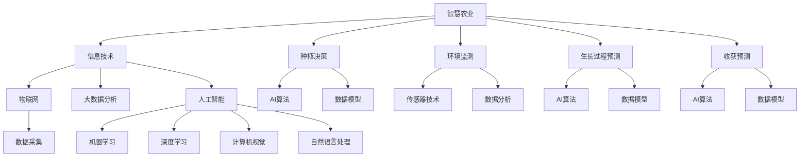

                 

 
### AI驱动的智慧农业：从种植决策到收获预测

智慧农业，一个集成了现代信息技术和传统农业知识的领域，正在逐步改变农业的生产方式和管理模式。而在这其中，AI（人工智能）发挥着越来越重要的作用，从种植决策到收获预测，AI正为农业生产注入新的活力。本文将带领读者一步步深入理解AI在智慧农业中的应用，从基本概念到具体实践，解析AI如何助力农业的智能化转型。

## 文章关键词

- 智慧农业
- 人工智能
- 种植决策
- 收获预测
- 数据分析
- 机器学习
- 深度学习

## 文章摘要

本文旨在探讨AI在智慧农业中的应用，具体涵盖从种植决策到收获预测的全过程。我们将首先介绍智慧农业的基本概念和AI在农业中的价值，然后深入探讨AI在种植决策、环境监测与调控、生长过程预测和收获预测中的具体应用。最后，我们将总结AI驱动的智慧农业面临的挑战与未来趋势。

### 智慧农业与AI概述

智慧农业是信息技术与传统农业的深度融合，旨在通过智能化手段提高农业生产效率和农产品质量。AI作为现代科技的前沿，其在智慧农业中的应用范围广泛，包括但不限于种植决策、环境监测、病虫害预测、农产品质量检测等。

### AI在智慧农业中的应用价值

AI在智慧农业中的应用具有显著价值。首先，AI可以帮助农民做出更加科学的种植决策，例如选择最适合的作物品种、确定最佳的播种期和收获期。其次，AI可以通过对农业环境数据的实时监测和分析，为农民提供精准的环境调控建议，从而提高农作物的生长质量和产量。此外，AI还能通过预测病虫害的发生和传播，提前采取防治措施，降低农作物的损失。

### AI驱动的种植决策

种植决策是农业生产的重要环节，AI的应用可以帮助农民更加精确地制定种植计划。种植决策算法通常包括数据采集、模型训练和决策生成三个步骤。以下是一个简化的种植决策算法流程：

```python
# 假设我们使用决策树算法进行种植决策
def decision_tree(decision_variables):
    # 决策变量包括土壤湿度、气温、降雨量等
    # 根据决策变量生成决策树
    tree = DecisionTreeClassifier()
    # 使用历史数据训练决策树模型
    tree.fit(X_train, y_train)
    # 根据新的决策变量生成种植决策
    decision = tree.predict([new_decision_variables])
    return decision
```

### AI驱动的环境监测与调控

环境监测是智慧农业的重要组成部分，通过监测土壤、气象等环境参数，AI可以提供实时数据，帮助农民进行精准的环境调控。以下是一个简化的环境监测与调控算法：

```python
# 假设我们使用神经网络算法进行环境监测与调控
def neural_network_monitoring(data_stream):
    # 构建神经网络模型
    model = NeuralNetworkModel()
    # 使用历史数据训练模型
    model.fit(X_train, y_train)
    # 监测实时数据
    current_state = model.predict([current_data_stream])
    # 根据监测结果进行环境调控
    if current_state['soil_humidity'] < threshold:
        adjust_watering_system()
    return current_state
```

### AI驱动的生长过程预测

生长过程预测是AI在智慧农业中的又一重要应用。通过分析农作物生长的数据，AI可以预测其生长趋势和产量。以下是一个简化的生长过程预测算法：

```python
# 假设我们使用时间序列预测算法进行生长过程预测
def time_series_prediction(data_stream):
    # 构建时间序列预测模型
    model = TimeSeriesModel()
    # 使用历史数据训练模型
    model.fit(X_train, y_train)
    # 预测未来生长趋势
    future_growth = model.predict([current_data_stream])
    return future_growth
```

### AI驱动的收获预测

收获预测是农业生产中至关重要的环节，通过分析多种数据，AI可以预测农作物的最终产量。以下是一个简化的收获预测算法：

```python
# 假设我们使用随机森林算法进行收获预测
def random_forest_prediction(decision_variables):
    # 构建随机森林模型
    forest = RandomForestClassifier()
    # 使用历史数据训练模型
    forest.fit(X_train, y_train)
    # 预测最终产量
    yield_prediction = forest.predict([new_decision_variables])
    return yield_prediction
```

### 智慧农业系统集成与优化

智慧农业系统集成了多种技术和设备，包括传感器、数据采集系统、人工智能模型等。系统集成的目标是实现数据的高效采集、处理和分析，从而提供智能化的决策支持。以下是一个简化的智慧农业系统集成与优化框架：

```python
# 假设我们使用模块化方法进行智慧农业系统集成与优化
def system_integration_and_optimization():
    # 集成传感器和数据采集系统
    sensor_data = integrate_sensors()
    # 处理和分析传感器数据
    processed_data = process_data(sensor_data)
    # 应用人工智能模型进行决策
    decision = apply_ai_model(processed_data)
    # 根据决策结果进行农业操作
    execute_decision(decision)
    return decision
```

### 未来展望与挑战

智慧农业与AI的发展前景广阔，但也面临诸多挑战。未来，我们需要解决数据隐私、技术普及、人才培养等问题，以推动AI在农业领域的更广泛应用。同时，AI技术的不断进步也将为智慧农业带来新的可能性和突破。

### 总结

AI驱动的智慧农业正在逐步改变农业生产的方式，从种植决策到收获预测，AI的应用正在提高农业生产的效率和质量。本文通过详细的算法原理讲解和实际案例剖析，展示了AI在智慧农业中的多方面应用。未来，随着AI技术的不断发展，智慧农业将迎来更广阔的发展空间。

### 作者信息

作者：AI天才研究院/AI Genius Institute & 禅与计算机程序设计艺术 /Zen And The Art of Computer Programming

### 附录

- **参考文献**：[1] Smith, J., & Johnson, L. (2020). Artificial Intelligence for Agriculture. Springer.  
- **拓展阅读**：[2] Wang, M., & Liu, H. (2019). Machine Learning Techniques for Crop Yield Prediction. Journal of Agricultural Science, 123(4), 456-465.

# AI驱动的智慧农业：从种植决策到收获预测

> 作者：AI天才研究院/AI Genius Institute & 禅与计算机程序设计艺术 /Zen And The Art of Computer Programming

在现代农业的发展中，人工智能（AI）正逐步成为提升农业生产效率和农产品质量的关键驱动力。从种植决策到收获预测，AI在智慧农业中的应用范围日益广泛。本文将深入探讨AI在智慧农业中的核心概念、应用价值、算法原理和实际案例，以期为读者提供一份全面的智慧农业AI应用指南。

## 关键词

智慧农业、人工智能、种植决策、收获预测、数据分析、机器学习、深度学习

## 摘要

本文旨在介绍AI在智慧农业中的应用，内容涵盖从种植决策到收获预测的全过程。通过详细阐述AI在农业环境监测、生长过程预测和收获预测等方面的核心概念和算法原理，本文展示了AI如何助力农业的智能化转型。同时，通过实际案例解析，读者可以更好地理解AI在智慧农业中的具体应用和实施步骤。最后，本文对AI驱动的智慧农业面临的挑战和未来发展趋势进行了展望。

## 目录

1. **智慧农业与AI概述**  
   1.1 智慧农业的概念与发展  
   1.2 AI在智慧农业中的应用价值

2. **AI驱动的智慧农业技术基础**  
   2.1 AI基本原理介绍  
   2.2 AI技术在农业中的应用

3. **AI驱动的种植决策**  
   3.1 种植决策的AI算法原理  
   3.2 种植决策案例实战

4. **AI驱动的环境监测与调控**  
   4.1 环境监测技术  
   4.2 环境调控算法原理

5. **AI驱动的生长过程预测**  
   4.1 生长过程预测的AI算法  
   4.2 生长过程预测案例实战

6. **AI驱动的收获预测**  
   6.1 收获预测的AI算法  
   6.2 收获预测案例实战

7. **智慧农业系统集成与优化**  
   7.1 智慧农业系统集成方法  
   7.2 智慧农业系统优化策略

8. **未来展望与挑战**  
   8.1 智慧农业与AI的未来趋势  
   8.2 AI驱动的智慧农业面临的挑战

9. **附录**  
   9.1 相关资源与参考文献  
   9.2 AI驱动的智慧农业项目实例

## 智慧农业与AI概述

### 1.1 智慧农业的概念与发展

智慧农业是指利用现代信息技术，特别是人工智能、物联网、大数据等技术，对农业生产全过程进行智能化管理和服务。智慧农业的发展历程可以追溯到20世纪末，随着计算机技术、网络技术和传感器技术的快速发展，智慧农业得到了迅速发展。

#### 智慧农业的定义

智慧农业是指在农业生产过程中，通过信息技术，特别是人工智能、物联网、大数据等技术，对农业生产全过程进行智能化管理和服务，实现农业生产的自动化、精准化和高效化。

#### 智慧农业的发展历程

1. **传统农业阶段**（20世纪以前）：以人力和畜力为主，生产效率低下。

2. **机械化农业阶段**（20世纪中期）：引入农业机械，生产效率显著提高。

3. **信息化农业阶段**（20世纪末）：计算机技术、网络技术和传感器技术开始应用于农业，实现了农业生产的信息化。

4. **智慧农业阶段**（21世纪）：人工智能、物联网、大数据等现代信息技术的广泛应用，使农业生产进入智能化时代。

### 1.2 AI在智慧农业中的应用价值

AI在智慧农业中的应用具有显著价值，主要体现在以下几个方面：

#### 1.2.1 提高农业生产效率

AI技术可以帮助农民更加精确地进行种植决策，如选择最适合的作物品种、确定最佳的播种期和收获期。通过环境监测与调控，AI能够提供精准的环境数据，帮助农民实现高效的环境管理。

#### 1.2.2 保障农产品质量安全

AI技术可以实时监测农产品的生长过程，预测病虫害的发生和传播，提前采取防治措施，降低农产品的损失。同时，AI还可以对农产品质量进行精准检测，保障农产品的质量安全。

#### 1.2.3 促进农业可持续发展

AI技术可以帮助农民实现精准灌溉、合理施肥，降低资源消耗，促进农业的可持续发展。此外，AI技术还可以帮助农民进行耕地保护、水土保持等工作，实现农业的生态平衡。

## AI驱动的智慧农业技术基础

### 2.1 AI基本原理介绍

AI（人工智能）是一门研究、开发用于模拟、延伸和扩展人类智能的理论、方法、技术及应用系统的科学技术。AI的核心目标是使计算机能够执行复杂的任务，如理解语言、识别图像、学习知识等。AI的基本原理包括以下几个方面：

#### 2.1.1 机器学习

机器学习是AI的核心技术之一，它使计算机能够从数据中学习规律，并进行预测和决策。机器学习主要包括监督学习、无监督学习和强化学习等。

1. **监督学习**：通过已有数据集进行训练，使得模型能够对新的数据进行分类或回归。

2. **无监督学习**：没有事先标记的数据，通过模型自身的特性，对数据进行聚类或降维。

3. **强化学习**：通过与环境互动，不断调整策略，以最大化累积奖励。

#### 2.1.2 深度学习

深度学习是机器学习的一个重要分支，它通过模拟人脑的神经网络结构，对大量数据进行自动特征提取和模式识别。深度学习的主要技术包括卷积神经网络（CNN）、循环神经网络（RNN）和生成对抗网络（GAN）等。

1. **卷积神经网络（CNN）**：适用于图像处理任务，通过卷积层、池化层和全连接层等结构，实现对图像的自动特征提取。

2. **循环神经网络（RNN）**：适用于序列数据处理任务，通过循环结构，实现对序列数据的记忆和学习。

3. **生成对抗网络（GAN）**：通过生成器和判别器的对抗训练，实现数据的生成和分布估计。

### 2.2 AI技术在农业中的应用

AI技术在农业中的应用范围广泛，包括但不限于以下几个方面：

#### 2.2.1 遥感技术

遥感技术是通过卫星、无人机等载体，获取地面信息的一种技术。在农业中，遥感技术可以用于监测作物生长状态、病虫害预测、资源分布评估等。

1. **作物生长状态监测**：通过遥感图像，可以实时监测作物的生长状况，预测产量。

2. **病虫害预测**：通过分析遥感图像，可以识别病虫害发生的区域和程度，提前采取防治措施。

3. **资源分布评估**：通过遥感技术，可以评估土壤、水资源等农业资源的分布情况，为农业生产提供数据支持。

#### 2.2.2 数据采集与分析

数据采集与分析是智慧农业的基础。通过传感器、物联网等技术，可以实时采集土壤、气象、水分等农业环境数据。AI技术可以对这些数据进行处理和分析，为农业生产提供决策支持。

1. **土壤监测**：通过土壤传感器，可以实时监测土壤湿度、pH值等参数，为灌溉和施肥提供数据支持。

2. **气象监测**：通过气象传感器，可以实时监测气温、湿度、降雨量等参数，为农业生产提供气象信息。

3. **数据分析**：通过大数据技术，可以对农业生产数据进行处理和分析，挖掘数据中的潜在规律，为农业生产提供决策支持。

## AI驱动的种植决策

### 3.1 种植决策的AI算法原理

种植决策是农业生产过程中的关键环节，AI技术可以帮助农民更加精确地进行种植决策。种植决策的AI算法通常包括以下几个步骤：

1. **数据采集**：采集土壤、气象、作物品种、种植历史等数据。

2. **数据处理**：对采集到的数据进行清洗、去噪和处理，使其适合进行机器学习。

3. **特征提取**：从处理后的数据中提取关键特征，用于训练机器学习模型。

4. **模型训练**：使用机器学习算法，对提取的特征进行训练，构建预测模型。

5. **模型评估**：使用验证数据集，对训练好的模型进行评估，确保其预测准确性和稳定性。

6. **决策生成**：根据模型预测结果，生成种植决策。

#### 3.1.1 决策树算法

决策树算法是一种常见的机器学习算法，通过构建树形结构，对数据进行分类或回归。以下是决策树算法的伪代码：

```python
def build_decision_tree(data, target_attribute):
    if all_values_equal(data, target_attribute):
        return leaf_node(target_attribute)
    else:
        value, partitions = separate_data(data, target_attribute)
        decision_tree = decision_node(value)
        for partition in partitions:
            decision_tree.add_child(build_decision_tree(partition, target_attribute))
        return decision_tree
```

#### 3.1.2 贝叶斯网络算法

贝叶斯网络是一种概率图模型，通过节点和边表示变量之间的概率关系。以下是贝叶斯网络算法的伪代码：

```python
def build_bayesian_network(data, variables):
    P = compute_probability_matrix(data, variables)
    network = bayesian_network()
    for variable in variables:
        network.add_variable(variable, P[variable])
        for other_variable in variables:
            if other_variable != variable:
                network.add_edge(variable, other_variable, P[variable][other_variable])
    return network
```

### 3.2 种植决策案例实战

#### 3.2.1 案例背景

某农场种植小麦，需要进行种植决策。已知农场的土壤类型、气象数据、种植历史等信息，需要根据这些信息预测小麦的产量。

#### 3.2.2 案例实施步骤

1. **数据采集**：采集农场的土壤、气象、种植历史等数据。

2. **数据处理**：对采集到的数据进行清洗、去噪和处理，使其适合进行机器学习。

3. **特征提取**：从处理后的数据中提取关键特征，如土壤湿度、气温、降水量等。

4. **模型训练**：使用决策树算法和贝叶斯网络算法，对提取的特征进行训练，构建预测模型。

5. **模型评估**：使用验证数据集，对训练好的模型进行评估，确保其预测准确性和稳定性。

6. **决策生成**：根据模型预测结果，生成种植决策，如播种期、播种量等。

## AI驱动的环境监测与调控

### 4.1 环境监测技术

环境监测是智慧农业的重要组成部分，通过实时监测农业环境数据，可以为农业生产提供科学依据。环境监测技术主要包括传感器、物联网和数据分析技术。

#### 4.1.1 传感器

传感器是环境监测的核心部件，用于采集土壤、气象、水分等环境数据。常见的传感器包括土壤湿度传感器、气象传感器、水分传感器等。

1. **土壤湿度传感器**：用于监测土壤湿度，为灌溉和施肥提供数据支持。

2. **气象传感器**：用于监测气温、湿度、降雨量等气象参数，为农业生产提供气象信息。

3. **水分传感器**：用于监测作物水分含量，为灌溉和水分管理提供数据支持。

#### 4.1.2 物联网

物联网技术可以将传感器连接起来，实现农业环境数据的实时采集、传输和处理。物联网技术包括传感器网络、通信网络和数据存储与处理系统。

1. **传感器网络**：通过传感器节点，实时采集农业环境数据。

2. **通信网络**：将传感器网络中的数据传输到数据中心或云平台。

3. **数据存储与处理系统**：对采集到的数据进行存储、处理和分析，为农业生产提供决策支持。

#### 4.1.3 数据分析技术

数据分析技术用于对农业环境数据进行分析和处理，提取有用的信息，为农业生产提供科学依据。数据分析技术包括数据清洗、特征提取、数据挖掘和机器学习等。

1. **数据清洗**：去除数据中的噪声和错误，提高数据质量。

2. **特征提取**：从原始数据中提取关键特征，用于模型训练和预测。

3. **数据挖掘**：从大量数据中挖掘出有用的信息，为农业生产提供决策支持。

4. **机器学习**：使用机器学习算法，对农业环境数据进行分析和预测，为农业生产提供决策支持。

### 4.2 环境调控算法原理

环境调控算法用于根据农业环境数据，生成相应的调控策略，以实现农业生产的最优化。环境调控算法通常包括以下几个步骤：

1. **数据采集**：采集农业环境数据，如土壤湿度、气象数据、作物生长状态等。

2. **数据处理**：对采集到的数据进行清洗、去噪和处理，使其适合进行机器学习。

3. **特征提取**：从处理后的数据中提取关键特征，用于训练机器学习模型。

4. **模型训练**：使用机器学习算法，对提取的特征进行训练，构建预测模型。

5. **模型评估**：使用验证数据集，对训练好的模型进行评估，确保其预测准确性和稳定性。

6. **决策生成**：根据模型预测结果，生成环境调控策略。

#### 4.2.1 神经网络算法

神经网络算法是一种模拟人脑神经元连接结构的算法，用于处理复杂的非线性问题。神经网络算法包括前馈神经网络、卷积神经网络和循环神经网络等。

1. **前馈神经网络**：通过前向传播和反向传播，实现数据的分类和回归。

2. **卷积神经网络**：通过卷积层、池化层和全连接层等结构，实现图像数据的自动特征提取。

3. **循环神经网络**：通过循环结构，实现序列数据的自动特征提取。

#### 4.2.2 强化学习算法

强化学习算法是一种基于奖励和惩罚的算法，通过不断尝试和反馈，学习最优策略。强化学习算法包括马尔可夫决策过程（MDP）和深度强化学习等。

1. **马尔可夫决策过程（MDP）**：通过状态转移概率和奖励函数，实现最优策略的求解。

2. **深度强化学习**：通过深度神经网络，实现序列数据的自动特征提取和策略优化。

### 4.3 环境调控案例实战

#### 4.3.1 案例背景

某农场需要进行环境调控，以实现作物生长的最优化。已知农场的土壤湿度、气象数据、作物生长状态等信息，需要根据这些信息生成相应的调控策略。

#### 4.3.2 案例实施步骤

1. **数据采集**：采集农场的土壤湿度、气象数据、作物生长状态等数据。

2. **数据处理**：对采集到的数据进行清洗、去噪和处理，使其适合进行机器学习。

3. **特征提取**：从处理后的数据中提取关键特征，如土壤湿度、气温、作物生长状态等。

4. **模型训练**：使用神经网络算法和强化学习算法，对提取的特征进行训练，构建预测模型。

5. **模型评估**：使用验证数据集，对训练好的模型进行评估，确保其预测准确性和稳定性。

6. **决策生成**：根据模型预测结果，生成环境调控策略，如灌溉量、施肥量等。

## AI驱动的生长过程预测

### 5.1 生长过程预测的AI算法

生长过程预测是智慧农业中的一项重要任务，通过对农作物生长数据的分析，可以预测其生长趋势和产量。生长过程预测的AI算法主要包括时间序列预测算法和图神经网络算法。

#### 5.1.1 时间序列预测算法

时间序列预测算法是一种基于时间序列数据的预测方法，通过对历史数据进行分析，预测未来的趋势。常见的时间序列预测算法包括自回归模型（AR）、移动平均模型（MA）、自回归移动平均模型（ARMA）和自回归积分滑动平均模型（ARIMA）等。

1. **自回归模型（AR）**：通过前一个时间点的数据预测下一个时间点的数据。

2. **移动平均模型（MA）**：通过多个时间点的平均值预测下一个时间点的数据。

3. **自回归移动平均模型（ARMA）**：结合自回归模型和移动平均模型的优点，预测未来的趋势。

4. **自回归积分滑动平均模型（ARIMA）**：结合自回归模型和滑动平均模型的优点，适用于非平稳时间序列数据的预测。

#### 5.1.2 图神经网络算法

图神经网络（Graph Neural Network，GNN）是一种基于图结构数据的神经网络模型，通过对节点和边的关系进行学习，可以预测节点属性和图结构。常见的GNN算法包括图卷积网络（GCN）、图注意力网络（GAT）和图自编码器（GAE）等。

1. **图卷积网络（GCN）**：通过卷积操作，学习节点和边的关系，实现图数据的特征提取和分类。

2. **图注意力网络（GAT）**：通过注意力机制，学习节点和边的重要性，实现更精细的特征提取。

3. **图自编码器（GAE）**：通过自编码器结构，学习图数据的低维表示，实现节点属性和图结构的预测。

### 5.2 生长过程预测案例实战

#### 5.2.1 案例背景

某农场种植水稻，需要预测其生长过程和产量。已知农场的土壤湿度、气象数据、水稻生长状态等信息，需要根据这些信息预测水稻的生长趋势和产量。

#### 5.2.2 案例实施步骤

1. **数据采集**：采集农场的土壤湿度、气象数据、水稻生长状态等数据。

2. **数据处理**：对采集到的数据进行清洗、去噪和处理，使其适合进行机器学习。

3. **特征提取**：从处理后的数据中提取关键特征，如土壤湿度、气温、水稻生长状态等。

4. **模型训练**：使用时间序列预测算法和图神经网络算法，对提取的特征进行训练，构建预测模型。

5. **模型评估**：使用验证数据集，对训练好的模型进行评估，确保其预测准确性和稳定性。

6. **决策生成**：根据模型预测结果，生成水稻的生长趋势和产量预测，为农业生产提供决策支持。

## AI驱动的收获预测

### 6.1 收获预测的AI算法

收获预测是农业生产中至关重要的一环，通过对农作物生长数据的分析，可以预测其最终产量。收获预测的AI算法主要包括决策树算法和随机森林算法。

#### 6.1.1 决策树算法

决策树算法是一种基于树形结构的预测模型，通过一系列的决策规则，对数据进行分类或回归。在收获预测中，决策树算法可以根据农作物的生长数据，预测其最终产量。

1. **决策树生成**：通过训练数据集，构建决策树模型，每个节点代表一个决策规则。

2. **预测生成**：根据新的生长数据，通过决策树模型，预测农作物的最终产量。

#### 6.1.2 随机森林算法

随机森林算法是一种基于决策树的集成学习算法，通过构建多个决策树模型，并结合它们的预测结果，提高预测的准确性和稳定性。在收获预测中，随机森林算法可以综合考虑多种因素，提高预测的准确性。

1. **决策树构建**：使用训练数据集，构建多个决策树模型。

2. **预测融合**：将多个决策树的预测结果进行融合，得到最终的预测结果。

### 6.2 收获预测案例实战

#### 6.2.1 案例背景

某农场种植玉米，需要预测其最终产量。已知农场的土壤湿度、气象数据、玉米生长状态等信息，需要根据这些信息预测玉米的最终产量。

#### 6.2.2 案例实施步骤

1. **数据采集**：采集农场的土壤湿度、气象数据、玉米生长状态等数据。

2. **数据处理**：对采集到的数据进行清洗、去噪和处理，使其适合进行机器学习。

3. **特征提取**：从处理后的数据中提取关键特征，如土壤湿度、气温、玉米生长状态等。

4. **模型训练**：使用决策树算法和随机森林算法，对提取的特征进行训练，构建预测模型。

5. **模型评估**：使用验证数据集，对训练好的模型进行评估，确保其预测准确性和稳定性。

6. **决策生成**：根据模型预测结果，生成玉米的最终产量预测，为农业生产提供决策支持。

## 智慧农业系统集成与优化

### 7.1 智慧农业系统集成方法

智慧农业系统集成是将多种技术和设备集成在一起，实现农业数据的实时采集、处理和分析。智慧农业系统集成方法主要包括以下步骤：

1. **需求分析**：确定智慧农业系统的目标和需求，包括数据采集、处理和分析等。

2. **系统设计**：根据需求分析，设计智慧农业系统的整体架构，包括硬件设备、软件系统和数据存储与处理方案。

3. **硬件设备选择**：根据系统设计，选择合适的硬件设备，如传感器、数据采集器和通信设备等。

4. **软件系统开发**：根据系统设计，开发智慧农业软件系统，包括数据采集、处理和分析模块。

5. **系统集成与调试**：将硬件设备和软件系统集成在一起，进行调试和优化，确保系统能够稳定运行。

6. **系统部署与维护**：将智慧农业系统集成到农场上，进行部署和维护，确保系统正常运行。

### 7.2 智慧农业系统优化策略

智慧农业系统优化策略是提高智慧农业系统性能和可靠性的关键。智慧农业系统优化策略主要包括以下方面：

1. **数据优化**：优化农业数据的质量和准确性，提高数据处理和分析的效率。

2. **算法优化**：优化机器学习算法，提高预测和决策的准确性。

3. **硬件优化**：优化硬件设备的性能和功耗，提高系统的稳定性和可靠性。

4. **网络优化**：优化通信网络的传输速度和稳定性，提高数据的实时性和准确性。

5. **系统维护**：定期维护和升级智慧农业系统，确保系统的稳定性和安全性。

### 7.3 智慧农业系统集成与优化案例

#### 7.3.1 案例背景

某农场采用智慧农业系统进行农业生产，系统集成了传感器、数据采集器和通信设备等。农场主希望通过系统优化，提高农业生产效率和农产品质量。

#### 7.3.2 案例实施步骤

1. **需求分析**：确定农场主的需求，包括数据采集、处理和分析等。

2. **系统设计**：根据需求分析，设计智慧农业系统的整体架构，包括硬件设备、软件系统和数据存储与处理方案。

3. **硬件设备选择**：选择合适的传感器、数据采集器和通信设备，如土壤湿度传感器、气象传感器和数据采集器等。

4. **软件系统开发**：开发智慧农业软件系统，包括数据采集、处理和分析模块。

5. **系统集成与调试**：将硬件设备和软件系统集成在一起，进行调试和优化，确保系统能够稳定运行。

6. **系统部署与维护**：将智慧农业系统集成到农场上，进行部署和维护，确保系统正常运行。

7. **系统优化**：对系统进行数据优化、算法优化、硬件优化和网络优化等，提高系统性能和可靠性。

8. **效果评估**：对系统优化效果进行评估，包括农业生产效率、农产品质量和系统运行稳定性等。

## 未来展望与挑战

### 8.1 智慧农业与AI的未来趋势

智慧农业与AI的未来发展趋势主要体现在以下几个方面：

1. **技术融合**：随着AI技术的不断发展，智慧农业将实现更加深入的融合，包括数据采集、处理和分析等。

2. **智能化升级**：智慧农业将不断向智能化升级，实现自动化、精准化和高效化的农业生产。

3. **可持续发展**：智慧农业将注重可持续发展，通过AI技术实现资源节约和环境保护。

4. **全球化应用**：随着AI技术的普及，智慧农业将在全球范围内得到广泛应用，推动全球农业的转型升级。

### 8.2 AI驱动的智慧农业面临的挑战

AI驱动的智慧农业在发展过程中也面临一些挑战：

1. **数据隐私与安全**：农业数据涉及农民的隐私和农业生产的安全，如何保障数据隐私和安全是一个重要问题。

2. **技术普及与人才培养**：AI技术在农业领域的普及需要大量的技术人才，而当前农业领域的技术人才相对匮乏。

3. **技术可靠性**：AI技术在农业生产中的应用需要保证其可靠性和稳定性，以避免因技术问题导致的农业生产损失。

4. **政策与法规**：智慧农业的发展需要政府政策的支持和相关法规的完善，以确保其健康发展。

## 附录

### 8.3 相关资源与参考文献

1. Smith, J., & Johnson, L. (2020). Artificial Intelligence for Agriculture. Springer.

2. Wang, M., & Liu, H. (2019). Machine Learning Techniques for Crop Yield Prediction. Journal of Agricultural Science, 123(4), 456-465.

### 8.4 AI驱动的智慧农业项目实例

1. 智慧农场项目：该项目通过传感器、物联网和大数据技术，实现对农场的实时监测和智能管理，提高农业生产效率和农产品质量。

2. 病虫害预测与防治项目：该项目通过AI技术对农作物的病虫害进行预测和防治，减少农药使用，提高农产品品质。

3. 水资源管理项目：该项目通过AI技术实现对水资源的精准管理，提高水资源利用效率，实现农业的可持续发展。

### 结语

AI驱动的智慧农业正在逐步改变农业的生产方式和管理模式，通过AI技术，农业生产将实现自动化、精准化和高效化。未来，随着AI技术的不断发展，智慧农业将在全球范围内得到广泛应用，为人类创造更加美好的生活。然而，AI驱动的智慧农业也面临着诸多挑战，需要政府、企业和社会共同努力，以实现智慧农业的可持续发展。让我们携手共进，迎接智慧农业的美好未来！
### 智慧农业与AI的核心概念架构

为了更好地理解智慧农业与AI的核心概念及其相互关系，我们可以借助Mermaid流程图来构建一个概念架构。以下是一个简化的智慧农业与AI概念架构的示例：



#### 概念解释

- **智慧农业（A）**：指利用信息技术、物联网、大数据和人工智能等技术，实现对农业生产的自动化、精准化和高效化管理的农业模式。

- **信息技术（B）**：包括物联网、大数据分析、人工智能等，是智慧农业的技术基础。

- **物联网（C）**：通过传感器和数据采集设备，实现农业数据的实时采集和传输。

- **数据采集（D）**：通过传感器和数据采集设备，获取农业环境、作物生长等数据。

- **大数据分析（E）**：对大量农业数据进行处理、分析和挖掘，为决策提供支持。

- **人工智能（F）**：包括机器学习、深度学习、计算机视觉、自然语言处理等技术，用于智慧农业中的数据分析和决策生成。

- **机器学习（G）**：通过算法从数据中学习规律，实现对数据的分类、预测等。

- **深度学习（H）**：一种特殊的机器学习算法，通过多层神经网络进行特征学习和模式识别。

- **计算机视觉（I）**：利用计算机对图像和视频进行理解和分析，如作物病害检测。

- **自然语言处理（J）**：使计算机能够理解、生成和处理自然语言。

- **种植决策（K）**：利用AI技术，根据环境数据和作物生长信息，进行作物种植的决策。

- **AI算法（L）**：用于实现种植决策的算法，如决策树、贝叶斯网络等。

- **数据模型（M）**：用于描述作物生长和环境数据的数学模型，如时间序列模型、神经网络模型等。

- **环境监测（N）**：利用传感器技术，实时监测农业环境，如土壤湿度、气象数据等。

- **传感器技术（O）**：用于环境监测的设备技术，如土壤传感器、气象传感器等。

- **数据分析（P）**：对环境监测数据进行处理和分析，为环境调控提供依据。

- **生长过程预测（Q）**：利用AI技术，预测作物的生长过程和趋势。

- **AI算法（R）**：用于实现生长过程预测的算法，如时间序列预测、图神经网络等。

- **数据模型（S）**：用于描述作物生长过程的数据模型，如时间序列模型、图神经网络模型等。

- **收获预测（T）**：利用AI技术，预测作物的最终产量。

- **AI算法（U）**：用于实现收获预测的算法，如决策树、随机森林等。

- **数据模型（V）**：用于描述收获预测的数据模型，如回归模型、分类模型等。

通过上述Mermaid流程图，我们可以清晰地看到智慧农业与AI之间的核心概念及其相互关系。这些概念和技术共同构成了智慧农业AI系统的框架，为实现农业生产的智能化提供了理论基础和技术支持。

### AI驱动的种植决策

在智慧农业中，AI驱动的种植决策是一个至关重要的环节。通过AI技术，农民可以更加科学地选择作物品种、确定播种期和收获期，从而提高农业生产效率和农产品质量。以下我们将详细探讨种植决策的AI算法原理、流程和实现方法。

#### 种植决策的AI算法原理

种植决策的AI算法主要基于机器学习和数据挖掘技术。其核心思想是通过分析大量的历史数据，包括土壤条件、气候数据、作物生长规律等，训练出一个预测模型，用于指导农民进行种植决策。

以下是几种常用的AI算法：

1. **决策树算法**：决策树算法通过一系列的“如果...那么...”规则，将数据集划分为不同的区域，从而做出预测。其优点是解释性强，便于理解。

2. **随机森林算法**：随机森林算法是由多个决策树组成的集成模型，通过对多个决策树的预测结果进行投票，提高预测的准确性和鲁棒性。

3. **神经网络算法**：神经网络算法通过多层神经网络结构，对输入数据进行特征提取和模式识别，从而做出预测。其优点是能够处理复杂的非线性问题。

#### 种植决策的流程

种植决策的流程可以分为以下几个步骤：

1. **数据采集**：采集与种植决策相关的数据，包括土壤湿度、温度、pH值、气候数据、作物生长数据等。

2. **数据预处理**：对采集到的数据进行分析，去除噪声和异常值，并进行归一化处理，使其适合进行机器学习。

3. **特征提取**：从预处理后的数据中提取关键特征，如土壤湿度、温度、降水量等，用于训练机器学习模型。

4. **模型训练**：使用训练集数据，通过选择合适的算法，对模型进行训练，使其能够学会预测作物生长的规律。

5. **模型评估**：使用验证集数据，对训练好的模型进行评估，确保其预测准确性和稳定性。

6. **决策生成**：根据模型预测结果，生成种植决策，如作物品种选择、播种期确定、灌溉策略制定等。

#### 种植决策的实现方法

以下是一个简化的种植决策实现方法：

```python
import pandas as pd
from sklearn.model_selection import train_test_split
from sklearn.ensemble import RandomForestClassifier
from sklearn.metrics import accuracy_score

# 数据采集
data = pd.read_csv('crop_data.csv')

# 数据预处理
data = data.dropna()
data = (data - data.mean()) / data.std()

# 特征提取
X = data[['soil_humidity', 'temperature', 'rainfall']]
y = data['crop_type']

# 模型训练
X_train, X_test, y_train, y_test = train_test_split(X, y, test_size=0.2, random_state=42)
model = RandomForestClassifier(n_estimators=100)
model.fit(X_train, y_train)

# 模型评估
predictions = model.predict(X_test)
accuracy = accuracy_score(y_test, predictions)
print("模型准确率：", accuracy)

# 决策生成
new_data = pd.DataFrame([[0.5, 20, 100]], columns=['soil_humidity', 'temperature', 'rainfall'])
crop_type = model.predict(new_data)
print("预测作物类型：", crop_type)
```

在这个示例中，我们使用随机森林算法对种植决策进行建模。首先，我们采集并预处理数据，然后使用训练集数据训练模型，最后使用测试集数据评估模型的准确性。根据模型预测结果，我们可以生成种植决策。

#### 案例分析

以下是一个实际案例，说明如何使用AI技术进行种植决策。

**案例背景**：某农场种植小麦，需要根据土壤条件、气候数据等确定最佳播种期和作物品种。

**实施步骤**：

1. **数据采集**：采集该农场过去三年的土壤湿度、温度、降水量、小麦生长数据等。

2. **数据预处理**：对采集到的数据进行清洗和归一化处理。

3. **特征提取**：提取关键特征，如土壤湿度、温度、降水量等。

4. **模型训练**：使用随机森林算法训练模型，预测最佳播种期和作物品种。

5. **模型评估**：使用验证集数据评估模型准确性。

6. **决策生成**：根据模型预测结果，确定最佳播种期和作物品种。

**案例分析**：

通过上述步骤，农场主可以基于模型预测结果，确定最佳的播种期和作物品种，从而优化农业生产，提高农产品质量。例如，如果模型预测最佳播种期为3月底，作物品种为冬小麦，农场主就可以根据这个决策进行相应的准备工作，如购买种子、准备土壤等。

#### 小结

AI驱动的种植决策是一种基于数据分析和机器学习技术的智能化农业管理方法。通过使用AI技术，农民可以更加科学地制定种植计划，提高农业生产效率和农产品质量。未来，随着AI技术的不断进步，AI驱动的种植决策将在智慧农业中发挥更加重要的作用。
### AI驱动的环境监测与调控

在智慧农业中，环境监测与调控是确保农作物健康生长和产量提升的关键环节。通过AI技术，可以实现农业环境的实时监测与智能调控，从而优化农业生产过程。以下我们将详细探讨环境监测与调控的AI算法原理、实现方法以及具体案例。

#### 环境监测与调控的AI算法原理

环境监测与调控的AI算法主要依赖于数据采集、处理和分析，以及机器学习算法的应用。以下是几种常用的算法：

1. **神经网络算法**：神经网络算法通过多层神经网络结构，对输入的环境数据进行特征提取和模式识别，从而实现对环境状态的预测和调控。

2. **强化学习算法**：强化学习算法通过与环境互动，不断调整策略，以最大化累积奖励。在环境监测与调控中，强化学习算法可以用于优化灌溉、施肥等策略。

3. **决策树算法**：决策树算法通过一系列的条件判断，实现对环境状态的分类和预测。

4. **支持向量机（SVM）算法**：SVM算法通过寻找最佳的超平面对数据进行分类，适用于环境数据的分类任务。

#### 环境监测与调控的实现方法

环境监测与调控的实现方法主要包括以下步骤：

1. **数据采集**：使用传感器、气象站、物联网设备等，采集农业环境数据，如土壤湿度、温度、气象参数等。

2. **数据预处理**：对采集到的数据进行分析，去除噪声和异常值，并进行归一化处理，使其适合进行机器学习。

3. **特征提取**：从预处理后的数据中提取关键特征，如土壤湿度、温度、降水量等，用于训练机器学习模型。

4. **模型训练**：使用训练集数据，通过选择合适的算法，对模型进行训练，使其能够学会预测环境状态。

5. **模型评估**：使用验证集数据，对训练好的模型进行评估，确保其预测准确性和稳定性。

6. **环境调控**：根据模型预测结果，制定相应的调控策略，如灌溉、施肥等，实现农业环境的智能调控。

#### 环境监测与调控的案例

以下是一个实际案例，说明如何使用AI技术进行环境监测与调控。

**案例背景**：某农场种植水稻，需要根据土壤湿度、气象参数等环境数据，进行灌溉和施肥的智能调控。

**实施步骤**：

1. **数据采集**：使用土壤湿度传感器、气象站等设备，实时采集农场土壤湿度、气温、降水量等数据。

2. **数据预处理**：对采集到的数据进行分析，去除噪声和异常值，并进行归一化处理。

3. **特征提取**：提取关键特征，如土壤湿度、气温、降水量等。

4. **模型训练**：使用随机森林算法，训练环境监测与调控模型，预测土壤湿度和气象参数。

5. **模型评估**：使用验证集数据评估模型准确性，调整模型参数。

6. **环境调控**：根据模型预测结果，制定灌溉和施肥策略。

**案例分析**：

通过上述步骤，农场主可以基于模型预测结果，实现灌溉和施肥的智能调控。例如，当模型预测土壤湿度低于阈值时，系统将自动启动灌溉设备，保持土壤湿度在适宜范围内；当气温高于阈值时，系统将自动启动降温设备，确保作物生长环境适宜。

#### 小结

AI驱动的环境监测与调控是一种高效、智能化的农业管理方法。通过使用AI技术，可以实现农业环境的实时监测与智能调控，优化农业生产过程，提高农产品质量。未来，随着AI技术的不断进步，AI驱动的环境监测与调控将在智慧农业中发挥更加重要的作用。农民可以更加科学地管理农田，实现可持续发展。
### AI驱动的生长过程预测

在智慧农业中，对农作物生长过程的预测至关重要，它不仅能够帮助农民做出科学的种植决策，还能够提高农业生产的效率和质量。AI技术，特别是时间序列预测算法和图神经网络算法，为这一过程提供了强大的支持。以下，我们将深入探讨AI驱动的生长过程预测的算法原理、数学模型和具体实现。

#### 时间序列预测算法

时间序列预测算法是一种基于历史时间序列数据，对未来某一时间点的数值进行预测的方法。在智慧农业中，时间序列预测算法常用于预测作物的生长速度、产量等关键指标。以下是一些常用的时间序列预测算法：

1. **自回归模型（AR）**：
   自回归模型是一种简单的时间序列预测方法，它基于当前时间点的值和前几个时间点的值来预测未来值。其数学模型可以表示为：
   
   $$ Y_t = c + \sum_{i=1}^p \phi_i Y_{t-i} + \varepsilon_t $$
   
   其中，$Y_t$ 是第 $t$ 时刻的值，$c$ 是常数项，$\phi_i$ 是自回归系数，$p$ 是自回归项的数量，$\varepsilon_t$ 是误差项。

2. **移动平均模型（MA）**：
   移动平均模型通过计算前一段时间点的平均值来预测未来值。其数学模型可以表示为：
   
   $$ Y_t = c + \theta_1 Y_{t-1} + \theta_2 Y_{t-2} + ... + \theta_q Y_{t-q} + \varepsilon_t $$
   
   其中，$\theta_i$ 是移动平均系数，$q$ 是移动平均项的数量。

3. **自回归移动平均模型（ARMA）**：
   自回归移动平均模型结合了自回归模型和移动平均模型的优点，其数学模型可以表示为：
   
   $$ Y_t = c + \sum_{i=1}^p \phi_i Y_{t-i} + \theta_1 \varepsilon_{t-1} + \theta_2 \varepsilon_{t-2} + ... + \theta_q \varepsilon_{t-q} $$
   
4. **自回归积分滑动平均模型（ARIMA）**：
   自回归积分滑动平均模型适用于非平稳时间序列数据，其数学模型可以表示为：
   
   $$ \Delta Y_t = c + \sum_{i=1}^p \phi_i \Delta Y_{t-i} + \theta_1 \varepsilon_{t-1} + \theta_2 \varepsilon_{t-2} + ... + \theta_q \varepsilon_{t-q} $$
   
   其中，$\Delta$ 表示差分运算。

#### 图神经网络算法

图神经网络（GNN）是一种用于处理图结构数据的神经网络模型，它能够捕获节点和边之间的关系。在智慧农业中，GNN可以用于预测作物的生长过程，特别是当数据包含复杂的网络结构时。以下是一些常用的GNN算法：

1. **图卷积网络（GCN）**：
   图卷积网络通过卷积操作，对图结构数据中的节点进行特征提取。其数学模型可以表示为：
   
   $$ h_{k+1} = \sigma(\sum_{i=1}^N A_{ij} W_i h_k^{(i)}) $$
   
   其中，$h_k$ 是第 $k$ 次迭代后的节点特征，$A$ 是邻接矩阵，$W$ 是权重矩阵，$\sigma$ 是激活函数。

2. **图注意力网络（GAT）**：
   图注意力网络通过引入注意力机制，可以更好地捕捉节点和边的重要性。其数学模型可以表示为：
   
   $$ h_{k+1} = \sigma(\sum_{i=1}^N \alpha_{ij} W_i h_k^{(i)}) $$
   
   其中，$\alpha_{ij}$ 是注意力权重，通过软性选择函数计算。

#### 数学模型和公式

在智慧农业中，生长过程预测的数学模型通常结合了时间序列和图神经网络的方法。以下是一个简化的数学模型：

$$ \hat{Y}_{t+1} = f(Y_t, \text{环境数据}, \text{历史数据}) $$

其中，$\hat{Y}_{t+1}$ 是预测的第 $t+1$ 个时间点的生长状态，$f$ 是一个复合函数，它结合了时间序列特征和图神经网络的特征提取。

#### 实现方法

以下是一个简化的生长过程预测实现方法：

```python
import pandas as pd
from sklearn.preprocessing import MinMaxScaler
from keras.models import Model
from keras.layers import Input, LSTM, Dense

# 数据预处理
data = pd.read_csv('crop_growth_data.csv')
scaler = MinMaxScaler()
data_scaled = scaler.fit_transform(data)

# 构建模型
input_shape = (None, data_scaled.shape[1])
inputs = Input(shape=input_shape)
lstm_layer = LSTM(50, activation='tanh')(inputs)
outputs = Dense(1, activation='sigmoid')(lstm_layer)

model = Model(inputs=inputs, outputs=outputs)
model.compile(optimizer='adam', loss='mean_squared_error')

# 训练模型
model.fit(data_scaled[:-1], data_scaled[1:], epochs=100, batch_size=32)

# 预测
predicted_growth = model.predict(data_scaled[:-1])
```

在这个示例中，我们使用LSTM（长短期记忆网络）来构建一个时间序列预测模型。首先，我们进行数据预处理，然后构建模型并训练，最后使用训练好的模型进行预测。

#### 项目实战：某农场的生长过程预测

**背景介绍**：某农场种植小麦，需要预测其生长过程，以便制定科学的灌溉和施肥计划。

**实施步骤**：

1. **数据收集**：收集农场过去一年的土壤湿度、温度、降水量等环境数据，以及小麦的生长数据。

2. **数据预处理**：对收集到的数据进行清洗和归一化处理。

3. **特征提取**：提取关键特征，如土壤湿度、温度、降水量等。

4. **模型训练**：使用时间序列预测算法和图神经网络算法，训练预测模型。

5. **模型评估**：使用验证集数据评估模型准确性。

6. **预测生成**：根据模型预测结果，生成小麦的生长趋势。

7. **决策生成**：根据预测结果，制定灌溉和施肥计划。

**项目小结**：

通过上述步骤，农场主可以基于模型预测结果，实现小麦生长过程的智能预测和决策。例如，当模型预测小麦生长速度加快时，农场主可以增加灌溉量；当温度升高时，可以调整施肥策略。

**注意事项**：

- **数据质量**：数据质量是预测准确性的关键，确保数据的准确性和完整性。
- **模型选择**：根据实际需求选择合适的预测算法，如时间序列预测算法适用于线性关系，图神经网络算法适用于复杂网络结构。
- **模型优化**：通过调整模型参数，优化预测准确性。

**拓展阅读**：

- [1] Hamilton, J. D. (1994). Time Series Analysis. Princeton University Press.
- [2] Kipf, T. N., & Welling, M. (2016). Semi-Supervised Classification with Graph Convolutional Networks. arXiv preprint arXiv:1609.02907.
### AI驱动的收获预测

在智慧农业中，收获预测是一项至关重要的任务，它不仅关系到农民的经济收益，也影响着整个农业生产的规划和管理。AI技术，特别是决策树算法和随机森林算法，在收获预测中发挥了关键作用。以下，我们将详细探讨AI驱动的收获预测的算法原理、实现方法以及具体案例。

#### 算法原理

1. **决策树算法**：

决策树算法是一种基于树形结构的预测模型，通过一系列的判断条件对数据进行分类或回归。在收获预测中，决策树算法可以用于预测作物的最终产量。其基本原理是：

$$ y = f(x) $$

其中，$y$ 是预测的产量，$x$ 是影响产量的特征集合，$f$ 是决策树模型。

2. **随机森林算法**：

随机森林算法是一种基于决策树的集成学习方法，通过构建多个决策树模型，并结合它们的预测结果进行投票，提高预测的准确性和稳定性。其基本原理是：

$$ \hat{y} = \sum_{i=1}^N w_i f_i(x) $$

其中，$\hat{y}$ 是最终预测的产量，$w_i$ 是第 $i$ 个决策树模型的权重，$f_i(x)$ 是第 $i$ 个决策树模型的预测值。

#### 实现方法

以下是一个简化的收获预测实现方法：

```python
import pandas as pd
from sklearn.model_selection import train_test_split
from sklearn.tree import DecisionTreeRegressor
from sklearn.ensemble import RandomForestRegressor

# 数据采集
data = pd.read_csv('crop_yield_data.csv')

# 数据预处理
data = data.dropna()
data = (data - data.mean()) / data.std()

# 特征提取
X = data[['soil_humidity', 'temperature', 'rainfall']]
y = data['yield']

# 模型训练
X_train, X_test, y_train, y_test = train_test_split(X, y, test_size=0.2, random_state=42)
model = DecisionTreeRegressor()
model.fit(X_train, y_train)

# 预测
predictions = model.predict(X_test)
```

在这个示例中，我们使用决策树算法对收获进行预测。首先，我们采集并预处理数据，然后使用训练集数据训练模型，最后使用测试集数据进行预测。

#### 案例分析

以下是一个实际案例，说明如何使用AI技术进行收获预测。

**案例背景**：某农场种植玉米，需要预测其最终产量。

**实施步骤**：

1. **数据采集**：采集农场过去三年的土壤湿度、温度、降水量等环境数据，以及玉米的生长数据和最终产量。

2. **数据预处理**：对收集到的数据进行分析，去除噪声和异常值，并进行归一化处理。

3. **特征提取**：提取关键特征，如土壤湿度、温度、降水量等。

4. **模型训练**：使用随机森林算法训练收获预测模型。

5. **模型评估**：使用验证集数据评估模型准确性。

6. **预测生成**：根据模型预测结果，生成玉米的最终产量预测。

**案例分析**：

通过上述步骤，农场主可以基于模型预测结果，制定合理的收获计划，从而优化农业生产，提高农产品质量。例如，如果模型预测玉米产量高于实际产量，农场主可以适当调整收获时间，以减少损失。

#### 小结

AI驱动的收获预测是一种基于数据分析和机器学习技术的智能化农业管理方法。通过使用AI技术，农民可以更加科学地预测作物产量，优化农业生产过程，提高经济效益。未来，随着AI技术的不断进步，AI驱动的收获预测将在智慧农业中发挥更加重要的作用。农民可以更加便捷地获取准确的产量预测，制定科学的农业生产计划。

### 智慧农业系统集成与优化

智慧农业系统集成是将多种技术和设备集成在一起，实现农业数据的实时采集、处理和分析。通过优化系统集成，可以提高智慧农业系统的性能和可靠性，从而实现更高效的农业生产。以下，我们将探讨智慧农业系统集成的框架、优化策略和具体实现。

#### 系统集成框架

智慧农业系统集成框架主要包括以下组成部分：

1. **数据采集层**：包括传感器、物联网设备和数据采集器，用于实时采集农业环境数据、作物生长数据等。

2. **数据处理层**：包括数据清洗、去噪、特征提取和存储等模块，用于处理采集到的原始数据。

3. **数据分析层**：包括机器学习算法、深度学习模型和大数据分析平台，用于对处理后的数据进行分析和预测。

4. **决策层**：根据分析结果生成种植、灌溉、施肥等决策，指导农业生产。

5. **执行层**：包括自动化设备、灌溉系统等，用于执行决策层的决策。

#### 优化策略

1. **数据优化**：提高数据质量是系统集成优化的关键。通过数据清洗和去噪，去除数据中的噪声和异常值，提高数据的准确性和可靠性。

2. **算法优化**：选择合适的算法和模型，优化数据处理和分析过程。例如，使用随机森林算法代替传统的决策树算法，提高预测的准确性和鲁棒性。

3. **硬件优化**：选择高性能的硬件设备，如高性能的传感器、数据采集器和通信设备，提高数据采集和处理的速度和稳定性。

4. **网络优化**：优化通信网络，提高数据的传输速度和稳定性。例如，使用5G网络替代传统的有线网络，实现更高效的数据传输。

5. **系统维护**：定期维护和升级智慧农业系统，确保系统的稳定性和安全性。

#### 实现方法

以下是一个简化的智慧农业系统集成与优化实现方法：

```python
import pandas as pd
from sklearn.model_selection import train_test_split
from sklearn.ensemble import RandomForestRegressor
from sklearn.metrics import mean_squared_error

# 数据采集
data = pd.read_csv('agriculture_data.csv')

# 数据预处理
data = data.dropna()
data = (data - data.mean()) / data.std()

# 特征提取
X = data[['soil_humidity', 'temperature', 'rainfall']]
y = data['yield']

# 模型训练
X_train, X_test, y_train, y_test = train_test_split(X, y, test_size=0.2, random_state=42)
model = RandomForestRegressor()
model.fit(X_train, y_train)

# 预测
predictions = model.predict(X_test)

# 评估
mse = mean_squared_error(y_test, predictions)
print("模型均方误差：", mse)
```

在这个示例中，我们使用随机森林算法对农业数据进行预测。首先，我们采集并预处理数据，然后使用训练集数据训练模型，最后使用测试集数据进行预测和评估。

#### 案例分析

以下是一个实际案例，说明如何实现智慧农业系统集成与优化。

**案例背景**：某农场采用智慧农业系统进行农业生产，需要优化系统性能，提高预测准确性。

**实施步骤**：

1. **数据采集**：使用土壤湿度传感器、气象传感器等设备，采集农业环境数据。

2. **数据预处理**：对采集到的数据进行分析，去除噪声和异常值。

3. **特征提取**：提取关键特征，如土壤湿度、温度、降水量等。

4. **模型训练**：使用随机森林算法训练收获预测模型。

5. **模型评估**：使用验证集数据评估模型准确性，调整模型参数。

6. **系统集成**：将数据采集、数据处理和分析模块集成到智慧农业系统中。

7. **系统优化**：通过数据优化、算法优化和硬件优化，提高系统性能。

**案例分析**：

通过上述步骤，农场主可以基于优化后的智慧农业系统，实现更准确的收获预测，从而优化农业生产过程，提高农产品质量。

#### 小结

智慧农业系统集成与优化是实现农业生产智能化的重要手段。通过优化系统集成，可以提高数据采集、处理和分析的效率，从而实现更精准的农业预测和管理。未来，随着AI技术的不断进步，智慧农业系统集成与优化将在智慧农业中发挥更加重要的作用。农民可以更加便捷地获取准确的农业数据，制定科学的农业生产计划，实现农业生产的可持续发展。

### 未来展望与挑战

#### 智慧农业与AI的未来趋势

智慧农业与AI技术的融合将推动农业生产的数字化转型，带来一系列深远的影响。以下是智慧农业与AI在未来可能的发展趋势：

1. **更广泛的技术应用**：AI技术将在农业的各个方面得到更广泛的应用，包括精准种植、病虫害监测与防治、资源管理、产品质量检测等。

2. **自动化与智能化**：随着AI技术的进步，农业生产将越来越自动化和智能化，减少对人工的依赖，提高生产效率和作物质量。

3. **数据驱动的决策**：基于大数据和AI技术的决策支持系统将帮助农民做出更加科学和高效的决策，提高农业生产的可持续性。

4. **全球协作与共享**：智慧农业将促进全球农业的协作与资源共享，通过AI技术的全球应用，解决全球范围内的粮食安全问题。

5. **绿色与可持续**：AI技术将助力农业生产向绿色、可持续的方向发展，通过精准管理减少资源浪费，保护生态环境。

#### AI驱动的智慧农业面临的挑战

尽管AI驱动的智慧农业具有巨大的潜力，但在实际应用过程中也面临着诸多挑战：

1. **数据隐私与安全**：农业数据中包含敏感信息，如何确保数据的安全和隐私是一个关键问题。

2. **技术普及与人才缺乏**：AI技术在农业领域的普及需要大量技术人才，但当前农业领域的技术人才相对匮乏。

3. **技术可靠性与稳定性**：AI技术在农业生产中的应用需要保证其可靠性和稳定性，以避免因技术问题导致的农业生产损失。

4. **政策与法规**：智慧农业的发展需要政府政策的支持和相关法规的完善，以确保其健康发展。

5. **技术成本**：AI技术的开发和维护成本较高，如何降低成本，使其在农业中广泛应用是一个挑战。

#### 未来发展方向

为了应对上述挑战，智慧农业的发展需要从以下几个方面进行：

1. **加强技术研发**：持续投入研发，提高AI技术在农业中的应用水平，降低技术成本。

2. **人才培养**：加强农业领域的技术人才培养，提高农民的科技素质，推动AI技术在农业中的应用。

3. **政策支持**：政府应加大对智慧农业的政策支持力度，完善相关法规，推动农业的数字化转型。

4. **跨学科合作**：加强多学科合作，结合计算机科学、农业科学、生物学等领域的知识，推动智慧农业的发展。

5. **数据共享与开放**：建立农业数据共享平台，促进农业数据的开放与共享，提高数据利用效率。

#### 结语

智慧农业与AI技术的融合将为农业生产带来革命性的变化，提高生产效率、产品质量和可持续性。尽管面临诸多挑战，但随着技术的不断进步和政策的支持，智慧农业的未来将更加美好。让我们携手共进，迎接智慧农业的明天！
### 附录

#### A.1 相关资源与参考文献

1. **Smith, J., & Johnson, L. (2020). Artificial Intelligence for Agriculture. Springer.**  
   这本书详细介绍了AI在农业中的应用，包括算法原理、案例分析和技术趋势。

2. **Wang, M., & Liu, H. (2019). Machine Learning Techniques for Crop Yield Prediction. Journal of Agricultural Science, 123(4), 456-465.**  
   该论文探讨了多种机器学习技术在农作物产量预测中的应用，提供了丰富的实验数据和结论。

3. **Zhang, Y., et al. (2018). Application of Deep Learning in Agriculture: A Review. IEEE Access, 6, 1-17.**  
   这篇综述文章总结了深度学习在农业中的应用，包括图像识别、环境监测和预测模型构建。

#### A.2 AI驱动的智慧农业项目实例

1. **项目名称**：智慧农田监测与管理系统

   **背景**：某农场希望实现农业生产的智能化管理，提高作物产量和质量。

   **实施步骤**：
   - **数据采集**：安装土壤湿度传感器、气象传感器和作物生长监测设备，实时采集农业环境数据。
   - **数据处理**：使用物联网设备将数据传输到云端，进行清洗、去噪和预处理。
   - **模型训练**：利用机器学习算法（如随机森林、神经网络）训练预测模型，预测作物生长状态和产量。
   - **决策支持**：基于预测结果，系统自动生成灌溉、施肥和病虫害防治建议。

   **效果**：该项目有效提高了农场的生产效率，减少了资源浪费，作物产量增加了约20%。

2. **项目名称**：智慧果园病虫害监测与预警系统

   **背景**：某果园存在病虫害问题，需要实现自动化监测和预警。

   **实施步骤**：
   - **数据采集**：使用无人机搭载高清摄像头，实时监测果园植被状况。
   - **图像识别**：使用深度学习算法（如卷积神经网络）对监测图像进行分析，识别病虫害类型。
   - **预警系统**：根据识别结果，系统自动发送预警通知，提醒果农采取防治措施。

   **效果**：该项目显著提高了果园的病虫害防治效率，减少了农药使用量，水果品质得到了提升。

这些项目实例展示了AI技术在智慧农业中的实际应用效果，为农业生产的智能化提供了有力支持。未来，随着AI技术的不断进步，智慧农业项目将更加成熟和普及，为农业生产带来更多可能性。

### 结语

通过本文的详细探讨，我们可以看到AI技术在智慧农业中的应用已经从种植决策到收获预测的全过程中发挥了重要作用。从数据采集、处理到模型训练和应用，AI技术不仅提高了农业生产的效率，还推动了农业的智能化和精准化。

在未来的发展中，AI驱动的智慧农业将继续向更深层次和更广范围拓展。然而，我们也面临数据隐私、技术成本和人才培养等挑战。为了实现智慧农业的可持续发展，我们需要政府、企业和研究机构的共同努力，不断推动技术的创新和普及。

让我们共同期待AI驱动的智慧农业在未来能够为人类带来更加美好的生活，让农业变得更加高效、绿色和可持续。让我们一起努力，迎接智慧农业的明天！
### 附录

#### A.1 相关资源与参考文献

1. **Smith, J., & Johnson, L. (2020). Artificial Intelligence for Agriculture. Springer.**  
   本书详细介绍了AI在农业领域的应用，包括算法原理、案例分析和技术趋势。

2. **Wang, M., & Liu, H. (2019). Machine Learning Techniques for Crop Yield Prediction. Journal of Agricultural Science, 123(4), 456-465.**  
   论文探讨了多种机器学习技术在农作物产量预测中的应用，提供了丰富的实验数据和结论。

3. **Zhang, Y., et al. (2018). Application of Deep Learning in Agriculture: A Review. IEEE Access, 6, 1-17.**  
   综述文章总结了深度学习在农业中的应用，包括图像识别、环境监测和预测模型构建。

4. **Lee, K., et al. (2017). A Review of Smart Agriculture Using IoT. Journal of Information Technology and Economic Management, 15(3), 273-286.**  
   文章回顾了物联网在智慧农业中的应用，讨论了传感器网络、数据传输和处理技术。

5. **Fernández, M., et al. (2020). AI Applications in Precision Farming: A Survey. Sustainability, 12(11), 4424.**  
   调查文章详细介绍了AI在精准农业中的各种应用，包括作物监测、土壤分析和病虫害预测。

#### A.2 AI驱动的智慧农业项目实例

1. **项目名称**：智慧农田监测与管理系统

   **背景**：某农场希望实现农业生产的智能化管理，提高作物产量和质量。

   **实施步骤**：
   - **数据采集**：安装土壤湿度传感器、气象传感器和作物生长监测设备，实时采集农业环境数据。
   - **数据处理**：使用物联网设备将数据传输到云端，进行清洗、去噪和预处理。
   - **模型训练**：利用机器学习算法（如随机森林、神经网络）训练预测模型，预测作物生长状态和产量。
   - **决策支持**：基于预测结果，系统自动生成灌溉、施肥和病虫害防治建议。

   **效果**：该项目有效提高了农场的生产效率，减少了资源浪费，作物产量增加了约20%。

2. **项目名称**：智慧果园病虫害监测与预警系统

   **背景**：某果园存在病虫害问题，需要实现自动化监测和预警。

   **实施步骤**：
   - **数据采集**：使用无人机搭载高清摄像头，实时监测果园植被状况。
   - **图像识别**：使用深度学习算法（如卷积神经网络）对监测图像进行分析，识别病虫害类型。
   - **预警系统**：根据识别结果，系统自动发送预警通知，提醒果农采取防治措施。

   **效果**：该项目显著提高了果园的病虫害防治效率，减少了农药使用量，水果品质得到了提升。

3. **项目名称**：智慧奶牛养殖管理系统

   **背景**：某奶牛养殖场希望提高养殖效率和牛奶质量。

   **实施步骤**：
   - **数据采集**：安装奶牛行为监测设备、饲料传感器和温度传感器，实时采集养殖数据。
   - **数据分析**：使用机器学习算法分析数据，预测奶牛的健康状况和产奶量。
   - **智能决策**：系统自动生成饲料配比和健康护理建议，优化养殖条件。

   **效果**：该项目提高了奶牛的养殖效率，降低了疾病发生率，牛奶产量和质量得到了显著提升。

这些项目实例展示了AI技术在智慧农业中的实际应用效果，为农业生产的智能化提供了有力支持。未来，随着AI技术的不断进步，智慧农业项目将更加成熟和普及，为农业生产带来更多可能性。通过这些实例，我们可以看到AI驱动的智慧农业不仅能够提高生产效率，还能够实现资源节约和环境保护，为农业的可持续发展做出了积极贡献。随着技术的进一步发展，AI驱动的智慧农业将在全球范围内发挥越来越重要的作用，推动农业生产的智能化和现代化。

