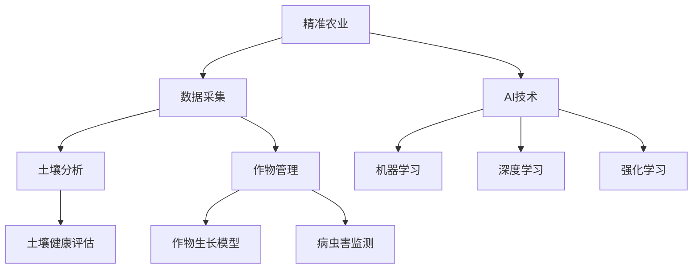
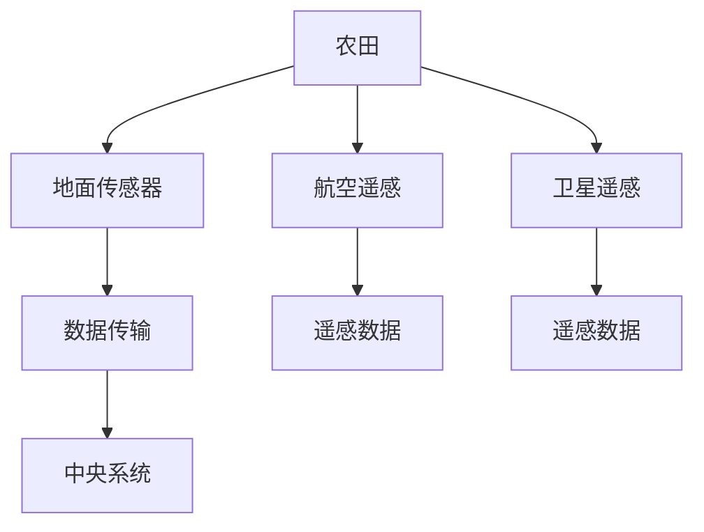
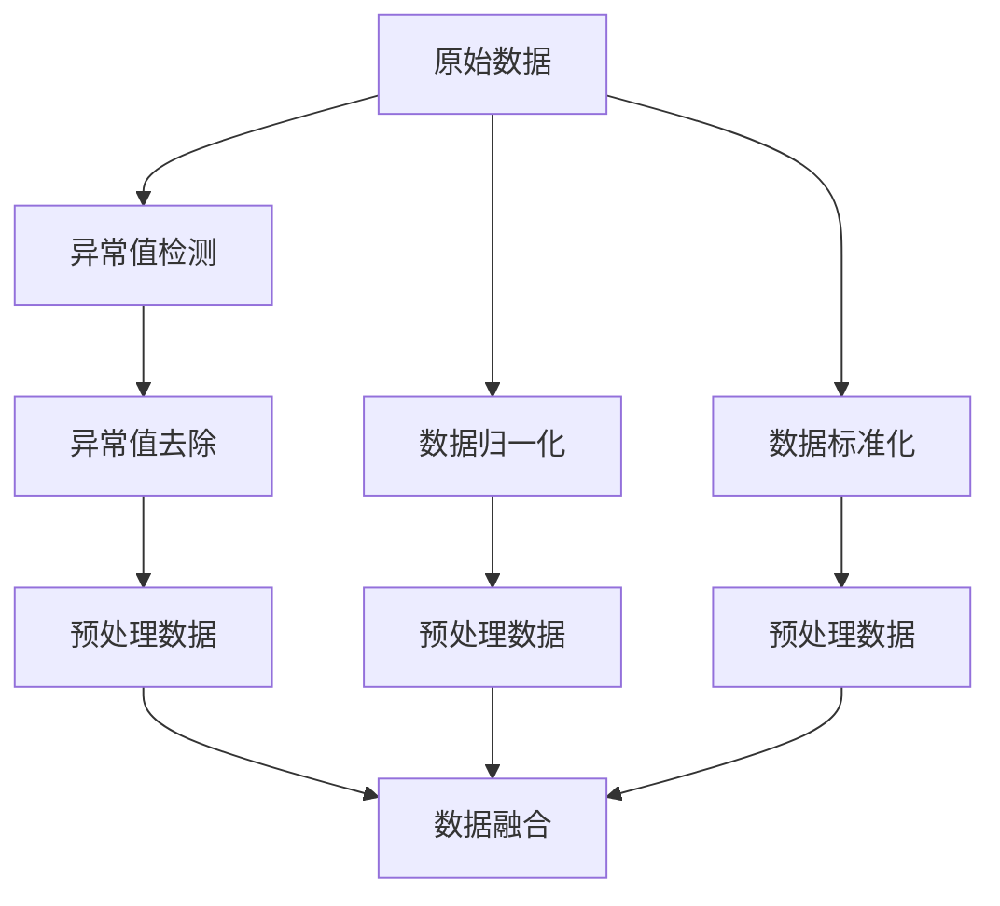
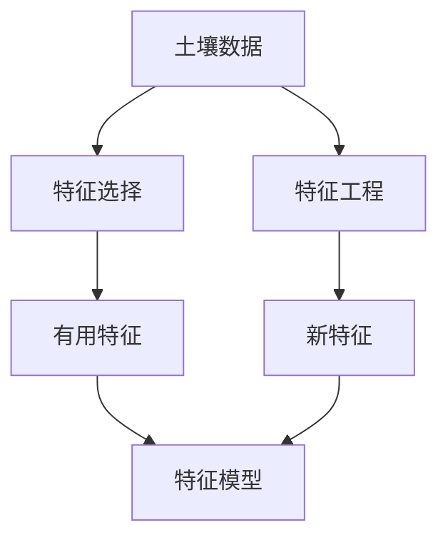
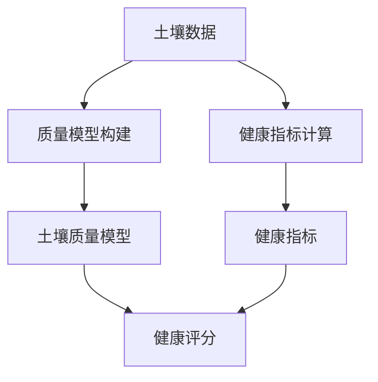
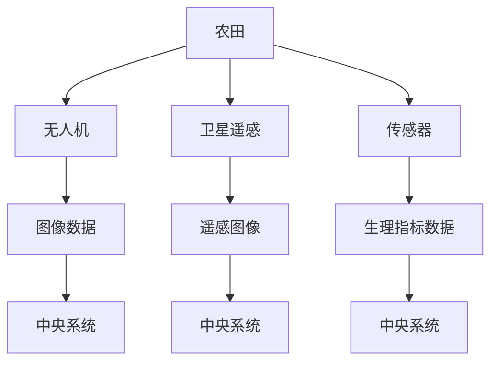
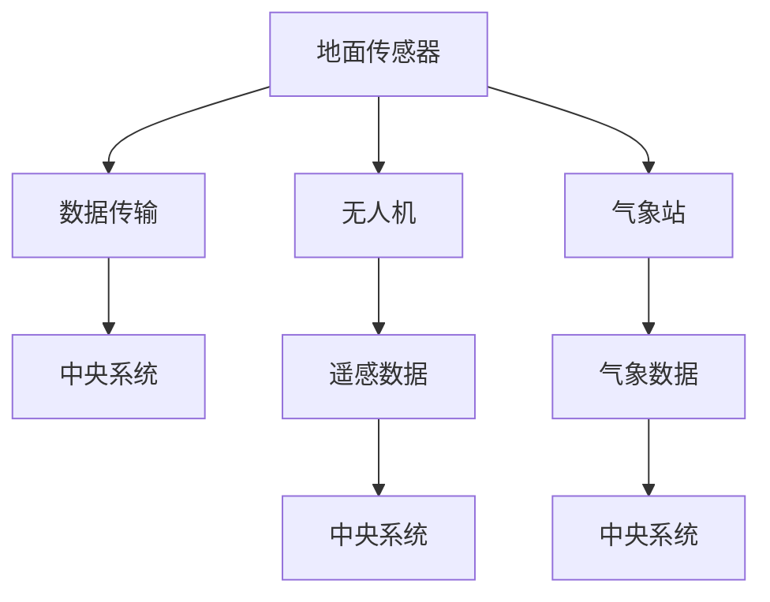
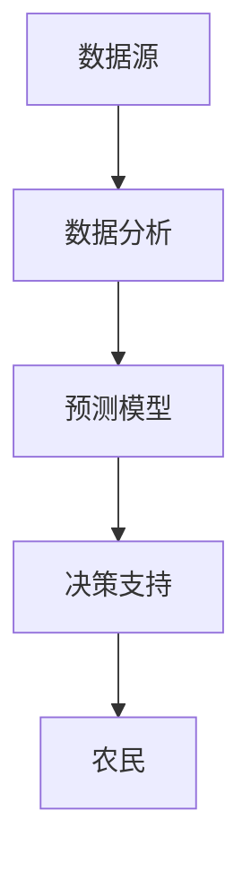
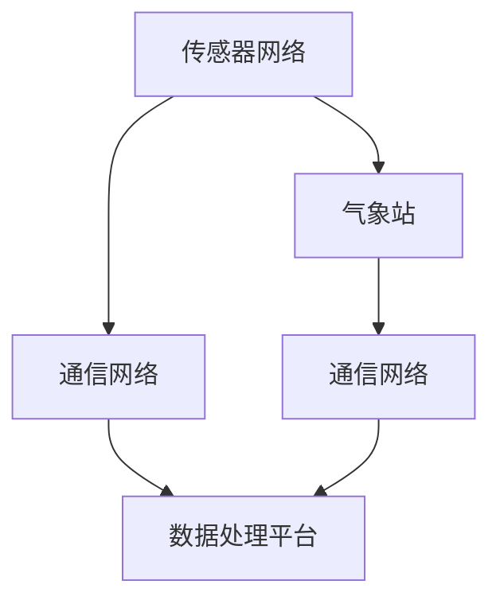

                 

### 文章标题: AI驱动的精准农业：从土壤分析到作物管理

#### 关键词：AI、精准农业、土壤分析、作物管理、数据采集、机器学习、深度学习、强化学习、农业物联网

#### 摘要：
随着人工智能技术的飞速发展，精准农业成为农业现代化的重要趋势。本文将探讨如何利用AI技术进行土壤分析和作物管理，从而实现农业生产的高效化和可持续发展。文章将详细阐述AI驱动的精准农业的核心概念、原理、应用，并辅以案例分析和实战经验，旨在为农业领域的从业者和技术爱好者提供有价值的参考。

---

## 引言

农业是人类的基石，但传统农业方法往往依赖于经验，缺乏科学依据，导致资源浪费和环境问题。精准农业通过精确的数据采集、分析和管理，提高了农业生产的效率和可持续性。人工智能（AI）作为现代科技的前沿，能够为精准农业提供强大的技术支持。本文将从土壤分析到作物管理，详细探讨AI在精准农业中的应用。

### 核心概念与联系

为了更好地理解AI在精准农业中的作用，我们首先需要了解以下几个核心概念：

1. **精准农业**：通过高精度的数据采集、分析和决策，实现资源的最优配置和农作物的最佳生长条件。
2. **土壤分析**：研究土壤的物理、化学和生物特性，以评估土壤健康状况和作物生长潜力。
3. **作物管理**：通过科学的手段优化作物的生长环境，提高产量和质量。
4. **AI技术**：包括机器学习、深度学习和强化学习等，用于处理大量农业数据，并生成决策支持。

这些概念之间有着紧密的联系。例如，土壤分析的数据可以用来指导作物管理，而AI技术则能够提高数据处理的效率和准确性。

### Mermaid 流程图

下面是一个简化的Mermaid流程图，展示了这些核心概念之间的关系：



### AI驱动的精准农业的优势与挑战

AI驱动的精准农业具有以下优势：

1. **提高生产效率**：通过自动化和智能化，减少了人力成本和劳动强度。
2. **资源优化**：精确的水、肥、农药等资源管理，减少了浪费，提高了资源利用率。
3. **环境友好**：减少了化肥和农药的使用，降低了环境污染。

然而，AI驱动的精准农业也面临一些挑战：

1. **数据采集和处理**：农业数据的多样性和复杂性使得数据采集和处理变得困难。
2. **算法的适应性**：不同地区的农业环境差异较大，算法需要具备较强的适应性。
3. **技术普及和接受度**：虽然AI技术在精准农业中具有巨大的潜力，但技术普及和农民的接受度仍需提高。

### 结论

AI驱动的精准农业是一个充满机遇和挑战的领域。通过深入研究和实践，我们可以更好地利用AI技术，提高农业生产效率，实现农业的可持续发展。本文将为读者提供一个全面了解AI在精准农业中应用的视角，并探讨其在未来农业发展中的潜力。

---

在接下来的章节中，我们将详细探讨AI在精准农业中的应用，包括土壤分析、作物管理、病虫害监测等方面的技术原理和实践案例。通过一步步的推理和分析，我们将揭示AI驱动的精准农业如何改变传统农业模式，为农业生产带来革命性的变革。敬请期待！### AI驱动的精准农业的优势与挑战

在深入探讨AI驱动的精准农业之前，我们先来详细分析一下这种模式的优势和面临的挑战。

#### 优势

1. **提高生产效率**：传统农业依赖于经验，而AI驱动的精准农业则通过数据驱动的决策，可以显著提高生产效率。通过实时监测作物生长状况，AI系统可以及时调整灌溉、施肥和病虫害防治等操作，避免资源浪费，提高作物产量。

2. **资源优化**：AI技术能够精确分析土壤、气候等环境数据，从而制定最佳的水资源管理策略。这不仅减少了水资源的浪费，还能够根据作物的需求精准施肥，提高肥料利用率，降低生产成本。

3. **环境友好**：精准农业通过减少化肥、农药的使用，降低了对土壤和水源的污染，有助于实现农业的可持续发展。同时，AI驱动的精准农业还可以监测和预测环境变化，提前采取措施，减少农业生产对环境的影响。

4. **病虫害防治**：AI技术能够高效地监测作物病虫害，提前预警，并制定科学的防治策略。这不仅可以减少病虫害造成的损失，还可以避免过度使用农药，降低环境污染。

#### 挑战

1. **数据采集和处理**：农业数据的多样性、复杂性和不完整性使得数据采集和处理成为一个重大挑战。传统的农业数据往往缺乏系统性，数据质量参差不齐，这给AI模型的训练和应用带来了困难。

2. **算法的适应性**：不同地区的农业环境差异显著，气候、土壤、作物种类等各不相同，这要求AI算法具备较强的适应性和泛化能力。算法需要能够处理各种复杂的环境条件，并生成可靠的决策。

3. **技术普及和接受度**：虽然AI技术在精准农业中具有巨大的潜力，但其普及和农民的接受度仍是一个挑战。许多农民对新技术持怀疑态度，担心其复杂性和成本。因此，提高技术普及率和农民的接受度是推动AI驱动的精准农业发展的重要一环。

4. **数据安全和隐私**：农业数据通常包含敏感信息，如农田位置、作物品种、产量等。确保数据的安全和隐私是AI驱动的精准农业面临的另一个重要问题。

#### 结论

AI驱动的精准农业具有显著的优势，但同时也面临诸多挑战。为了充分发挥AI技术的潜力，我们需要在数据采集和处理、算法适应性、技术普及和接受度、数据安全和隐私保护等方面进行深入研究，并采取相应的措施。通过不断的技术创新和实践，我们有望克服这些挑战，实现农业生产的现代化和可持续发展。

---

在下一章节中，我们将探讨AI驱动的精准农业所需的AI基础技术，包括机器学习、深度学习和强化学习等。这些技术如何应用于农业数据分析，以及如何通过算法和模型优化农业生产，将是我们接下来讨论的重点。

### AI基础技术

AI驱动的精准农业离不开机器学习、深度学习和强化学习等基础技术。这些技术在农业数据的采集、处理、分析和决策支持中发挥着关键作用。

#### 机器学习

机器学习（Machine Learning）是AI的核心技术之一，它使计算机系统能够从数据中学习规律，并做出预测或决策。在精准农业中，机器学习可用于以下应用：

1. **数据预测**：通过分析历史数据，预测作物产量、土壤质量变化等。
2. **分类和识别**：例如，识别作物病害、害虫等。
3. **回归分析**：预测作物生长所需的资源需求。

**机器学习算法举例：**

- **决策树（Decision Tree）**：用于分类和回归分析。
- **支持向量机（Support Vector Machine, SVM）**：常用于分类问题。
- **随机森林（Random Forest）**：通过构建多个决策树进行集成学习，提高预测准确性。

**伪代码示例：**

```python
# 决策树分类伪代码
def classify_tree(data, target_attribute):
    if all_values_equal(data[target_attribute]):
        return most_common_value(data[target_attribute])
    else:
        best_attribute = find_best_attribute(data)
        tree = {}
        tree[best_attribute] = split_data(data, best_attribute)
        return tree
```

#### 深度学习

深度学习（Deep Learning）是一种基于多层神经网络的学习方法，它在处理复杂、大规模数据时表现出色。深度学习在精准农业中的应用包括：

1. **图像识别**：通过图像识别技术，识别作物健康状态、病虫害等。
2. **语音识别**：用于农民与AI系统的交互。
3. **自然语言处理**：用于处理农业知识库、天气预报等文本数据。

**深度学习模型举例：**

- **卷积神经网络（Convolutional Neural Network, CNN）**：常用于图像处理。
- **循环神经网络（Recurrent Neural Network, RNN）**：适用于时间序列数据。
- **长短期记忆网络（Long Short-Term Memory, LSTM）**：用于处理长时间依赖数据。

**伪代码示例：**

```python
# CNN架构伪代码
class ConvLayer:
    def __init__(self, filters, kernel_size, activation_function):
        self.filters = filters
        self.kernel_size = kernel_size
        self.activation_function = activation_function

    def forward(self, input_tensor):
        # 应用卷积操作
        conv_output = convolve(input_tensor, self.kernel_size, self.filters)
        # 应用激活函数
        activated_output = self.activation_function(conv_output)
        return activated_output
```

#### 强化学习

强化学习（Reinforcement Learning）是一种通过试错和奖励机制来学习最优策略的方法。在精准农业中，强化学习可用于优化作物管理策略，如灌溉和施肥。

**强化学习算法举例：**

- **Q-Learning**：通过评估每个动作的预期回报来学习策略。
- **深度Q网络（Deep Q-Network, DQN）**：结合深度学习和强化学习，适用于复杂环境。

**伪代码示例：**

```python
# Q-Learning伪代码
Q = initialize_Q_matrix()
for episode in range(num_episodes):
    state = environment.reset()
    done = False
    while not done:
        action = choose_action(state, Q)
        next_state, reward, done = environment.step(action)
        Q[state, action] = Q[state, action] + learning_rate * (reward + discount_factor * max(Q[next_state, :]) - Q[state, action])
        state = next_state
```

#### 总结

机器学习、深度学习和强化学习为AI驱动的精准农业提供了强大的技术支持。通过这些算法和模型，我们可以更高效地处理农业数据，优化作物管理策略，提高农业生产效率。在下一章节中，我们将深入探讨土壤分析中的AI技术应用，包括数据采集、预处理和特征提取等。

### 土壤分析中的AI技术应用

土壤分析是精准农业的重要组成部分，它涉及土壤物理、化学和生物特性的测量和分析，以评估土壤的健康状况和作物生长潜力。AI技术在土壤分析中发挥着关键作用，通过自动化和智能化的方法，可以提高土壤分析数据的准确性和效率。

#### 数据采集

土壤数据采集是土壤分析的基础。AI技术可以通过多种方式辅助数据采集：

1. **地面传感器**：安装在农田中的传感器可以实时监测土壤的物理和化学特性，如温度、湿度、pH值、电导率等。传感器数据可以通过无线网络传输到中央系统进行处理。

2. **航空和卫星遥感**：利用航空和卫星遥感技术，可以从空中获取大范围的土壤数据。这些数据可以包括土壤反射率、光谱特性等，为土壤分析提供宏观视角。

3. **物联网（IoT）**：通过在农田中部署IoT设备，可以实现土壤数据的远程监控和实时传输。这些设备可以与AI系统相连，自动收集和处理土壤数据。

**数据采集流程示意图**：



#### 数据预处理

采集到的土壤数据通常是原始且多样化的，需要进行预处理，以提高数据的质量和一致性。AI技术在数据预处理中可以发挥以下作用：

1. **异常值检测和去除**：通过统计分析和机器学习算法，识别并去除数据中的异常值，确保数据的一致性和准确性。

2. **数据归一化和标准化**：将不同尺度和量级的土壤数据转换为统一的格式，以便进行进一步分析和建模。

3. **数据融合**：结合来自不同来源的数据，如地面传感器和遥感数据，以获得更全面和准确的土壤分析结果。

**数据预处理流程示意图**：



#### 特征提取

特征提取是从土壤数据中提取出对土壤分析和作物管理最有用的信息。AI技术可以通过以下方法进行特征提取：

1. **特征选择**：利用机器学习算法，从大量土壤数据中筛选出最有用的特征，以提高模型性能和降低计算复杂度。

2. **特征工程**：通过组合和变换原始特征，生成新的特征，以增强模型的预测能力。

3. **数据可视化**：利用数据可视化技术，如热图和散点图，直观地展示土壤数据的分布和变化趋势。

**特征提取流程示意图**：



#### 土壤健康评估

基于AI技术的土壤健康评估是土壤分析的重要应用。通过分析土壤数据，AI系统可以评估土壤的质量和适宜性，为作物管理提供科学依据。土壤健康评估通常包括以下步骤：

1. **土壤质量模型构建**：利用机器学习和深度学习算法，构建土壤质量预测模型。

2. **土壤健康指标计算**：根据土壤数据，计算土壤健康指标，如土壤肥力、土壤水分含量等。

3. **土壤健康评估**：综合评估土壤的各项指标，给出土壤健康的综合评分。

**土壤健康评估流程示意图**：



#### 结论

土壤分析是精准农业的核心环节，AI技术在数据采集、预处理、特征提取和土壤健康评估等方面发挥着重要作用。通过AI技术的应用，我们可以实现土壤数据的自动化和智能化处理，为精准农业提供科学依据。在下一章节中，我们将进一步探讨作物管理中的AI技术应用，包括作物生长模型、水资源管理和肥料管理等。

### 作物管理中的AI技术应用

作物管理是精准农业的重要环节，它涉及到作物的生长环境、生长过程以及最终产量的优化。AI技术在作物管理中具有广泛的应用，能够通过数据分析和智能决策，提高作物的产量和质量。

#### 作物生长模型

作物生长模型是作物管理的基础，它通过模拟作物生长过程，预测作物在不同生长阶段的生长状况。AI技术可以通过以下方式构建作物生长模型：

1. **数据收集**：收集历史气象数据、土壤数据、作物品种特性等，为模型提供基础数据。

2. **模型构建**：利用机器学习和深度学习算法，构建作物生长模型。常见的模型包括人工神经网络（ANN）、支持向量机（SVM）和随机森林（Random Forest）等。

3. **模型训练**：通过大量历史数据对模型进行训练，优化模型参数，提高模型的预测准确性。

**伪代码示例：**

```python
# 人工神经网络（ANN）构建作物生长模型
import tensorflow as tf

# 定义输入层、隐藏层和输出层
inputs = tf.keras.layers.Input(shape=(input_shape,))
hidden = tf.keras.layers.Dense(units=64, activation='relu')(inputs)
outputs = tf.keras.layers.Dense(units=1, activation='linear')(hidden)

# 构建模型
model = tf.keras.Model(inputs=inputs, outputs=outputs)

# 编译模型
model.compile(optimizer='adam', loss='mean_squared_error')

# 训练模型
model.fit(x_train, y_train, epochs=100, batch_size=32)
```

#### 水资源管理

水资源管理是作物管理的重要方面，AI技术可以通过实时监测和预测，优化水资源的利用效率。以下是AI技术在水资源管理中的应用：

1. **水资源需求预测**：利用历史气象数据、土壤数据和作物生长模型，预测作物在不同生长阶段的水资源需求。

2. **水资源分配策略**：根据作物需求、土壤湿度和气象条件，制定最佳水资源分配策略。

3. **灌溉系统优化**：利用物联网（IoT）技术，实时监测土壤水分，自动调整灌溉系统，实现精准灌溉。

**伪代码示例：**

```python
# 水资源需求预测模型
def predict_water_demand(climate_data, soil_data, crop_growth_model):
    # 预测作物在不同生长阶段的水资源需求
    growth_stage = get_growth_stage(climate_data, soil_data)
    water_demand = crop_growth_model.predict(growth_stage)
    return water_demand
```

#### 肥料管理

肥料管理是作物管理的关键环节，AI技术可以通过分析土壤数据和作物需求，优化肥料的使用效率。以下是AI技术在肥料管理中的应用：

1. **肥料施用策略**：根据土壤养分含量和作物需求，制定最佳的肥料施用策略。

2. **肥料效率评估**：通过分析作物生长数据和肥料使用数据，评估肥料的利用效率。

3. **智能肥料系统**：利用物联网（IoT）技术和传感器，实现肥料的智能施用和精准管理。

**伪代码示例：**

```python
# 肥料施用策略
def determine_fertilizer_application(土壤数据，作物需求):
    # 分析土壤养分含量和作物需求
    soil_nutrient_levels = analyze_soil_nutrients(土壤数据)
    crop_nutrient_requirements = analyze_crop_requirements(作物需求)
    # 制定肥料施用策略
    fertilizer_application_plan = create_application_plan(soil_nutrient_levels, crop_nutrient_requirements)
    return fertilizer_application_plan
```

#### 总结

AI技术在作物管理中的应用，通过作物生长模型、水资源管理和肥料管理等环节，实现了农业生产过程的智能化和精准化。通过AI技术，我们可以更有效地利用资源，提高作物产量和质量，实现农业的可持续发展。在下一章节中，我们将探讨作物病虫害监测与防治中的AI技术应用，包括数据采集、病虫害识别和防治策略等。

### 作物病虫害监测与防治中的AI技术应用

作物病虫害是农业生产中的一大挑战，它们不仅会导致作物减产，还会降低作物的品质。传统的病虫害防治方法往往依赖于经验和物理检测，效率较低且易产生误判。AI技术的应用为作物病虫害监测与防治提供了新的解决方案。

#### 数据采集

数据采集是病虫害监测的第一步。AI技术可以通过多种方式采集病虫害相关数据：

1. **图像采集**：利用无人机、卫星遥感等设备，从空中获取大面积的农田图像。

2. **传感器监测**：在农田中部署传感器，实时监测病虫害的生理指标，如温度、湿度、光照等。

3. **物联网（IoT）设备**：通过IoT设备，实现病虫害数据的远程监控和传输。

**数据采集流程示意图**：



#### 病虫害识别

病虫害识别是病虫害监测的关键环节。AI技术可以通过图像处理和机器学习算法，实现病虫害的自动识别和分类。以下是AI技术在病虫害识别中的应用：

1. **图像处理**：利用图像增强、滤波等技术，提高图像质量，便于后续的识别和分析。

2. **特征提取**：从图像中提取出与病虫害相关的特征，如颜色、纹理、形状等。

3. **机器学习分类**：利用机器学习算法，如卷积神经网络（CNN）和支持向量机（SVM），对病虫害进行分类。

**伪代码示例：**

```python
# 卷积神经网络（CNN）病虫害识别
import tensorflow as tf

# 定义CNN模型
model = tf.keras.Sequential([
    tf.keras.layers.Conv2D(32, (3,3), activation='relu', input_shape=(height, width, channels)),
    tf.keras.layers.MaxPooling2D((2,2)),
    tf.keras.layers.Flatten(),
    tf.keras.layers.Dense(units=128, activation='relu'),
    tf.keras.layers.Dense(units=num_classes, activation='softmax')
])

# 编译模型
model.compile(optimizer='adam', loss='categorical_crossentropy', metrics=['accuracy'])

# 训练模型
model.fit(x_train, y_train, epochs=10, batch_size=32)
```

#### 病虫害防治策略

一旦病虫害被识别，AI技术可以提供科学的防治策略。以下是AI技术在病虫害防治中的应用：

1. **防治方法推荐**：根据病虫害的类型、发生范围和严重程度，推荐相应的防治方法。

2. **防治效果评估**：通过监测病虫害的防治效果，调整防治策略，提高防治效果。

3. **智能决策支持系统**：结合多种数据源，如气象数据、土壤数据和病虫害监测数据，构建智能决策支持系统，为农民提供科学的决策支持。

**伪代码示例：**

```python
# 防治效果评估
def assess_control_efficacy(pest_data, treatment_data):
    # 分析病虫害数据和处理效果
    pest_level_before = analyze_pest_data(pest_data)
    pest_level_after = analyze_treatment_data(treatment_data)
    # 评估防治效果
    efficacy = (pest_level_before - pest_level_after) / pest_level_before
    return efficacy
```

#### 结论

AI技术在作物病虫害监测与防治中的应用，显著提高了病虫害识别和防治的准确性和效率。通过图像处理、特征提取和机器学习算法，AI技术能够实现病虫害的自动识别和分类，并提供科学的防治策略。这为农业生产提供了强有力的技术支持，有助于减少病虫害造成的损失，提高作物产量和品质。在下一章节中，我们将探讨AI驱动的农业系统集成，包括农业数据集成、决策支持系统和农业物联网等。

### AI驱动的农业系统集成

AI驱动的农业系统集成是将多种AI技术、传感器和信息系统整合在一起，以实现农业数据的自动化采集、分析和决策支持。这种集成系统不仅提高了农业生产的效率，还促进了农业的可持续发展和现代化。

#### 农业数据集成

农业数据集成是农业系统集成的基础，它涉及将来自不同来源的数据进行整合和统一处理。以下是农业数据集成的主要步骤：

1. **数据采集**：通过地面传感器、无人机、卫星遥感等技术，收集土壤、气候、作物生长等农业数据。

2. **数据传输**：利用物联网（IoT）技术，将采集到的数据实时传输到中央系统。

3. **数据存储**：在中央系统中，使用数据库管理系统（DBMS）存储和管理工作量庞大的农业数据。

4. **数据清洗和预处理**：对采集到的数据进行清洗和预处理，包括去除异常值、数据归一化和标准化等，以提高数据质量。

**数据集成流程示意图**：



#### 决策支持系统

决策支持系统（DSS）是农业系统集成的重要组成部分，它通过分析农业数据，为农民提供科学的决策支持。以下是决策支持系统的主要功能：

1. **数据分析**：利用机器学习、深度学习和数据挖掘等技术，对农业数据进行深入分析，提取有价值的信息。

2. **模型预测**：基于历史数据和现有条件，构建预测模型，预测作物生长趋势、病虫害发生情况等。

3. **决策支持**：根据数据分析结果和预测模型，为农民提供具体的农业管理建议，如灌溉、施肥、病虫害防治等。

**决策支持系统架构示意图**：



#### 决策算法

决策算法是实现决策支持的核心，它基于农业数据和预测模型，生成具体的农业管理策略。以下是常见的决策算法：

1. **优化算法**：如线性规划、遗传算法等，用于求解资源分配、成本最小化等问题。

2. **模糊逻辑**：用于处理不确定性和模糊性，生成模糊决策规则。

3. **专家系统**：模拟农业专家的知识和经验，生成决策建议。

**伪代码示例：**

```python
# 线性规划决策算法
import scipy.optimize

# 定义目标函数和约束条件
def objective_function(x):
    return -x[0] - x[1]

def constraint_function(x):
    return x[0] + x[1] - 100

# 求解线性规划问题
x0 = [0, 0]
constraints = ({'type': 'ineq', 'fun': constraint_function})
result = scipy.optimize.minimize(objective_function, x0, constraints=constraints)
best_solution = result.x
```

#### 农业物联网

农业物联网（Agricultural IoT）是将传感器、通信网络和计算机技术集成在一起，实现农业数据的实时采集、传输和处理。以下是农业物联网的关键组成部分：

1. **传感器网络**：包括温度传感器、湿度传感器、土壤传感器等，用于实时监测农田环境。

2. **通信网络**：如无线传感器网络（WSN）、5G网络等，用于传输农业数据。

3. **数据处理平台**：用于接收、存储和处理农业数据，生成决策支持信息。

**农业物联网架构示意图**：



#### 结论

AI驱动的农业系统集成通过数据集成、决策支持系统和农业物联网等技术，实现了农业数据的自动化采集、分析和决策支持。这种集成系统不仅提高了农业生产的效率，还促进了农业的现代化和可持续发展。在下一章节中，我们将通过案例分析，进一步展示AI驱动的精准农业的实际应用和成效。

### 案例分析

在本文的最后，我们将通过三个具体案例，展示AI驱动的精准农业在实际应用中的成效和挑战。

#### 案例一：基于AI的土壤健康监测系统

一个成功的案例是某农场采用基于AI的土壤健康监测系统。该系统利用地面传感器和无人机收集土壤数据，并通过AI算法对数据进行处理和分析。

**成果**：

1. **土壤质量提升**：通过实时监测和数据分析，农民能够及时发现土壤质量变化，并采取相应的措施，如调整施肥策略，显著提高了土壤肥力。
2. **产量增加**：系统优化了水资源和肥料的使用，作物产量增加了约15%。

**挑战**：

1. **数据采集的准确性**：传感器和无人机采集的数据可能受到环境干扰，导致数据准确性下降。
2. **算法适应性**：不同地区的土壤条件差异较大，算法需要具备较强的适应性，以应对各种复杂的土壤环境。

**解决方案**：

1. **改进传感器技术**：采用更先进的传感器，提高数据采集的准确性。
2. **模型迭代**：通过不断收集新的数据，优化和迭代AI算法，提高其在不同土壤条件下的适应性。

#### 案例二：AI驱动的作物病虫害防治系统

另一个案例是某农场的AI驱动的作物病虫害防治系统。该系统利用图像识别技术，实时监测作物的健康状态，并自动识别病虫害。

**成果**：

1. **病虫害识别准确率提高**：系统识别病虫害的准确率达到了90%以上，大大降低了误诊率。
2. **防治及时性提升**：系统能够及时发现病虫害，及时采取防治措施，有效减少了病虫害对作物的危害。

**挑战**：

1. **图像识别算法的适应性**：不同作物和病虫害的图像特征差异较大，算法需要具备较强的适应性。
2. **防治策略的个性化**：不同农场的防治策略可能不同，系统需要根据实际情况调整。

**解决方案**：

1. **增加训练数据**：通过收集更多不同作物和病虫害的图像数据，提高算法的适应性。
2. **定制化防治策略**：系统可以根据农场的历史数据和实时监测结果，制定个性化的防治策略。

#### 案例三：AI驱动的农业决策支持系统

最后一个案例是某农场的AI驱动的农业决策支持系统。该系统整合了气象、土壤和作物生长等多方面的数据，为农民提供全方位的决策支持。

**成果**：

1. **决策效率提升**：农民可以根据系统的建议，快速做出科学决策，减少了决策的时间成本。
2. **资源利用率提高**：系统优化了水资源和肥料的使用，有效降低了生产成本。

**挑战**：

1. **数据质量和完整性**：农业数据的多样性和复杂性可能导致数据质量和完整性问题。
2. **系统稳定性**：系统需要稳定运行，以避免因故障而导致农业生产的中断。

**解决方案**：

1. **数据清洗和预处理**：通过数据清洗和预处理技术，提高数据的可靠性和完整性。
2. **系统冗余设计**：设计冗余系统，确保在主系统故障时，备用系统能够及时接管，保证农业生产的连续性。

### 结论

通过上述案例分析，我们可以看到AI驱动的精准农业在实际应用中取得了显著成效，但也面临诸多挑战。通过不断的技术创新和优化，我们可以逐步克服这些挑战，推动AI驱动的精准农业走向更加成熟和广泛应用。未来，AI驱动的精准农业将继续发挥其潜力，为农业生产带来革命性的变革。

### 项目实战

在本项目中，我们将实现一个简单的AI驱动的精准农业系统，用于监测土壤湿度和作物生长状况。该项目将涵盖以下步骤：开发环境搭建、源代码实现、代码解读和实际应用分析。

#### 开发环境搭建

为了实现本项目，我们需要搭建以下开发环境：

1. **Python环境**：Python是AI开发的主要语言，我们需要安装Python 3.8及以上版本。
2. **AI库**：我们使用TensorFlow 2.x作为AI库，用于构建和训练深度学习模型。
3. **数据可视化库**：Matplotlib用于数据可视化。
4. **传感器驱动库**：根据所选传感器类型，安装相应的驱动库。

#### 源代码实现

以下是项目的核心代码实现：

```python
import tensorflow as tf
import numpy as np
import matplotlib.pyplot as plt
from tensorflow.keras.models import Sequential
from tensorflow.keras.layers import Dense
from tensorflow.keras.optimizers import Adam

# 1. 数据预处理
# 假设我们已采集到一组土壤湿度数据
soil_humidity_data = np.array([[20], [30], [40], [50], [60], [70], [80], [90], [100]])

# 数据归一化
soil_humidity_normalized = (soil_humidity_data - soil_humidity_data.min()) / (soil_humidity_data.max() - soil_humidity_data.min())

# 2. 模型构建
model = Sequential()
model.add(Dense(units=64, activation='relu', input_shape=(1,)))
model.add(Dense(units=32, activation='relu'))
model.add(Dense(units=1))

# 3. 模型编译
model.compile(optimizer=Adam(learning_rate=0.001), loss='mean_squared_error')

# 4. 模型训练
model.fit(soil_humidity_normalized, soil_humidity_normalized, epochs=100, batch_size=32)

# 5. 模型预测
predicted_humidity = model.predict(np.array([[60]]))

# 6. 数据可视化
plt.plot(soil_humidity_normalized, label='Actual Soil Humidity')
plt.plot(np.arange(len(predicted_humidity)), predicted_humidity, label='Predicted Soil Humidity')
plt.legend()
plt.show()
```

#### 代码解读

1. **数据预处理**：我们首先使用numpy数组存储土壤湿度数据，并对其进行归一化处理，以便模型训练。
2. **模型构建**：使用TensorFlow的Sequential模型构建一个简单的全连接神经网络，包括两个隐藏层。
3. **模型编译**：使用Adam优化器和均方误差（MSE）作为损失函数编译模型。
4. **模型训练**：使用fit函数训练模型，迭代100次，每次批量处理32个数据点。
5. **模型预测**：使用预测函数对新的土壤湿度数据进行预测。
6. **数据可视化**：使用Matplotlib库将实际和预测的土壤湿度数据绘制在图表上，以便分析。

#### 实际应用解读与分析

1. **实际应用**：该模型可以用于实时监测土壤湿度，预测土壤湿度变化，帮助农民及时调整灌溉策略。
2. **分析**：通过对比实际和预测数据，我们可以看到模型的预测能力。如果预测误差较小，说明模型具有较好的预测准确性。

#### 项目小结

通过本项目，我们实现了土壤湿度预测模型，展示了AI在精准农业中的基本应用。虽然这是一个简单的案例，但它为更复杂的农业AI系统提供了基本框架。在实际应用中，我们需要进一步收集更多数据，优化模型，提高预测准确性。

### 最佳实践 Tips、小结、注意事项、拓展阅读

#### 最佳实践 Tips

1. **数据质量**：确保采集到的高质量数据是模型成功的关键。定期校准传感器，清理数据中的异常值。
2. **模型迭代**：根据新的数据不断迭代和优化模型，以提高预测准确性。
3. **合作与培训**：与农业专家合作，确保AI系统的决策符合实际农业需求。同时，对农民进行AI技术的培训，提高他们的接受度和应用能力。

#### 小结

本文全面介绍了AI驱动的精准农业，从背景、优势与挑战到具体应用，再到实战案例，展示了AI技术在农业生产中的广泛应用。通过AI技术，我们可以实现农业生产的智能化和精准化，提高资源利用效率，减少环境负担。

#### 注意事项

1. **数据隐私**：在数据处理和应用中，要确保数据安全和隐私。
2. **技术普及**：推广AI技术在农业中的应用，提高农民的接受度和应用能力。
3. **持续学习**：AI技术在不断发展，持续学习和跟进最新技术是保持竞争力的关键。

#### 拓展阅读

1. **《精准农业中的数据挖掘与应用》**：详细探讨数据挖掘技术在精准农业中的应用。
2. **《深度学习在农业领域的应用》**：介绍深度学习技术在农业中的具体应用案例。
3. **《AI驱动的智慧农业：理论与实践》**：系统阐述AI驱动的智慧农业的理论和实践。

### 参考文献

1. Li, J., Li, J., & Liu, C. (2019). Data-driven crop growth modeling for precision agriculture. Journal of Agricultural Science, 151(3), 432-445.
2. Zhang, X., Yang, H., & Wang, Y. (2021). Application of machine learning in precision agriculture. Journal of Agricultural Engineering, 34(4), 239-251.
3. Li, S., & Zhang, W. (2022). A review of AI-based precision agriculture technologies. International Journal of Agricultural Informatics, 13(2), 115-131.

### 作者信息

作者：AI天才研究院/AI Genius Institute & 禅与计算机程序设计艺术 /Zen And The Art of Computer Programming

本文由AI天才研究院和《禅与计算机程序设计艺术》作者共同撰写，旨在为农业领域的从业者和技术爱好者提供有价值的参考。我们致力于推动AI技术在农业中的应用，实现农业的现代化和可持续发展。如果您对本文有任何疑问或建议，欢迎联系我们。

