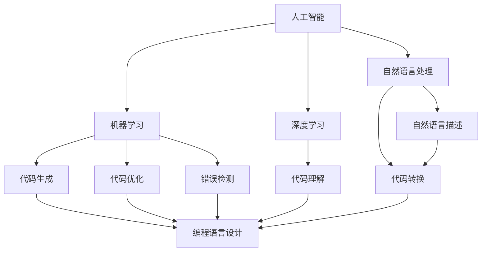

                 


## 引言

随着人工智能（AI）技术的迅猛发展，其在各个领域的应用越来越广泛。编程语言设计作为计算机科学和软件工程的核心领域，自然也受到了AI技术的影响。AI驱动的编程语言设计，通过利用机器学习和深度学习等技术，实现了代码生成、自动优化、自然语言处理等功能的自动化和智能化。本文将深入探讨AI驱动的编程语言设计原则，旨在为广大开发者、研究者提供有益的参考和指导。

### 背景介绍

在传统的编程语言设计中，程序员需要手动编写代码，对程序进行调试和优化。这种方法不仅效率低下，而且容易出现人为错误。随着软件系统的复杂性不断增加，传统编程语言设计面临着巨大的挑战。AI技术的出现为编程语言设计带来了新的机遇，通过将AI技术应用于编程语言设计，可以实现以下目标：

1. **自动化代码生成**：AI可以自动生成代码，减少程序员的工作量，提高开发效率。
2. **代码优化**：AI可以分析代码，并提出优化建议，提高代码的性能和可读性。
3. **自然语言处理**：AI可以帮助开发者通过自然语言描述来编写代码，实现人机交互的便捷性。
4. **智能化编程助手**：AI可以成为开发者的智能助手，提供代码补全、错误检测和修复等功能。

### 核心概念与联系

在深入探讨AI驱动的编程语言设计之前，我们需要了解几个核心概念，并分析它们之间的联系。

#### 1. 人工智能（AI）

人工智能是一种模拟人类智能的技术，它包括机器学习、深度学习、自然语言处理、计算机视觉等多个子领域。AI技术能够从数据中学习，并进行决策和预测。

#### 2. 编程语言设计

编程语言设计是指设计一种用于编写计算机程序的语言。它包括语法、语义、编译器/解释器等多个方面。编程语言设计的目的是提高开发效率和代码质量。

#### 3. 机器学习（ML）

机器学习是一种人工智能的分支，它通过数据驱动的方法来改善计算机程序的性能。在编程语言设计中，机器学习可以用于代码生成、代码优化和错误检测。

#### 4. 深度学习（DL）

深度学习是机器学习的一个子领域，它使用多层神经网络来建模复杂的数据。在编程语言设计中，深度学习可以用于自然语言处理和代码理解。

#### 5. 自然语言处理（NLP）

自然语言处理是一种人工智能技术，它使得计算机能够理解、生成和处理人类语言。在编程语言设计中，NLP可以用于将自然语言描述转换为代码。

### 关系架构 Mermaid 流程图



通过上述流程图，我们可以清晰地看到AI、机器学习、深度学习、自然语言处理与编程语言设计之间的联系。这些技术共同构成了AI驱动的编程语言设计的基础。

### 小结

本文介绍了AI驱动的编程语言设计的背景和核心概念，并使用Mermaid流程图展示了这些概念之间的联系。在接下来的章节中，我们将深入探讨AI驱动的编程语言设计原则，包括核心算法原理讲解、数学模型和数学公式讲解、项目实战等。希望通过本文的探讨，能够为读者带来新的思考和启示。

## 核心算法原理讲解

在AI驱动的编程语言设计中，核心算法原理起着至关重要的作用。这些算法不仅决定了编程语言的设计方向，也影响了其性能和可扩展性。在本节中，我们将详细介绍几种关键的算法原理，并使用伪代码进行详细阐述。

### 1. 机器学习算法

机器学习算法是AI驱动的编程语言设计的基础。其中，常见的算法包括决策树、支持向量机（SVM）和神经网络等。

#### 1.1 决策树

决策树是一种用于分类和回归的算法。其基本原理是通过一系列的判断条件来对数据进行分类或回归。下面是一个决策树的伪代码示例：

```plaintext
DecisionTreeclassify(node, data):
    if node.isLeaf():
        return node.label
    else:
        feature = node.feature
        value = data[feature]
        childNode = node.getChild(value)
        return DecisionTreeclassify(childNode, data)
```

#### 1.2 支持向量机（SVM）

支持向量机是一种用于分类的算法，它通过找到一个最优的超平面来分隔不同类别的数据。下面是SVM的伪代码示例：

```plaintext
SVMclassify(data):
    w, b = SVMtrain(data)
    return sign(w.T * data + b)
```

其中，`SVMtrain`函数用于训练模型，`sign`函数用于确定数据点的类别。

#### 1.3 神经网络

神经网络是一种模拟人脑工作的算法，它可以用于分类、回归和生成任务。下面是一个简单的神经网络伪代码示例：

```plaintext
NeuralNetworkforwardPropagation(input, weights):
    hiddenLayer = activateFunction(np.dot(input, weights['input_to_hidden']))
    outputLayer = activateFunction(np.dot(hiddenLayer, weights['hidden_to_output']))
    return outputLayer
```

其中，`activateFunction`函数用于激活神经网络层，`np.dot`用于矩阵乘法。

### 2. 深度学习算法

深度学习算法是基于多层神经网络的算法，它在图像识别、语音识别和自然语言处理等领域表现出色。

#### 2.1 卷积神经网络（CNN）

卷积神经网络是一种用于图像识别的深度学习算法。它通过卷积操作提取图像的特征。下面是CNN的伪代码示例：

```plaintext
CNNforwardPropagation(image, weights):
    convLayer = Convolution(image, weights['conv_weights'])
    poolLayer = MaxPooling(convLayer)
    return poolLayer
```

#### 2.2 长短期记忆网络（LSTM）

长短期记忆网络是一种用于序列数据的深度学习算法，它可以处理长时依赖关系。下面是LSTM的伪代码示例：

```plaintext
LSTMforwardPropagation(input, weights):
    h_t, c_t = LSTMcell(input, weights)
    return h_t
```

其中，`LSTMcell`函数用于计算LSTM单元的输出。

### 3. 自然语言处理算法

自然语言处理算法用于将自然语言描述转换为编程语言代码。这些算法通常涉及词向量表示、序列模型和生成模型。

#### 3.1 词向量表示

词向量表示是将单词映射到高维空间中的向量。Word2Vec和GloVe是常见的词向量表示方法。下面是Word2Vec的伪代码示例：

```plaintext
Word2Vectrain(vocabulary, data):
    Initialize weights matrix
    for word in vocabulary:
        for context_word in data[word]:
            Update weights matrix based on word and context_word
    return weights matrix
```

#### 3.2 生成模型

生成模型用于生成新的文本。变分自编码器（VAE）和生成对抗网络（GAN）是常见的生成模型。下面是VAE的伪代码示例：

```plaintext
VAEencode(input, weights):
    z = Sampling(mean, log_var)
    return z
VAEdiscriminate(input, weights):
    return probability of input being real
VAEgenerate(input, weights):
    z = Sampling(mean, log_var)
    return Reconstruct(z)
```

通过上述核心算法原理的讲解，我们可以看到AI驱动的编程语言设计是如何通过机器学习、深度学习和自然语言处理等算法来实现自动化和智能化的。在下一节中，我们将介绍与这些算法相关的数学模型和数学公式。

## 数学模型和数学公式讲解

在AI驱动的编程语言设计中，数学模型和数学公式是核心组成部分。这些模型和公式不仅描述了算法的工作原理，还为编程语言设计提供了理论基础。在本节中，我们将详细介绍与AI驱动的编程语言设计相关的数学模型和数学公式，并通过具体示例进行解释。

### 1. 线性回归

线性回归是一种用于预测数值的统计方法。在编程语言设计中，线性回归可以用于代码性能的预测。线性回归的基本公式如下：

$$
y = \beta_0 + \beta_1 \cdot x
$$

其中，\( y \) 是因变量，\( x \) 是自变量，\( \beta_0 \) 和 \( \beta_1 \) 是模型参数。

**示例**：假设我们要预测程序运行时间，可以设置运行时间为因变量 \( y \)，代码长度为自变量 \( x \)。通过训练数据集，我们可以得到线性回归模型参数 \( \beta_0 \) 和 \( \beta_1 \)。然后，使用该模型预测新的代码长度对应的运行时间。

### 2. 逻辑回归

逻辑回归是一种用于分类的统计方法。在编程语言设计中，逻辑回归可以用于代码风格的分类。逻辑回归的基本公式如下：

$$
\log\left(\frac{p}{1-p}\right) = \beta_0 + \beta_1 \cdot x
$$

其中，\( p \) 是概率，\( \beta_0 \) 和 \( \beta_1 \) 是模型参数。

**示例**：假设我们要将代码分为“清晰”和“混乱”两类，可以通过逻辑回归模型计算每个代码样本属于“清晰”类别的概率。然后，设置一个阈值（例如0.5），如果概率大于阈值，则分类为“清晰”，否则分类为“混乱”。

### 3. 神经网络

神经网络是一种基于多层感知器的机器学习模型。在编程语言设计中，神经网络可以用于代码生成和错误检测。神经网络的基本公式如下：

$$
z = \sum_{i=1}^{n} w_i \cdot x_i + b
$$

$$
a = \sigma(z)
$$

其中，\( z \) 是输入向量和权重矩阵的乘积加上偏置，\( a \) 是激活函数的输出，\( \sigma \) 是激活函数。

**示例**：假设有一个简单的两层神经网络，输入层有3个节点，隐藏层有2个节点，输出层有1个节点。输入数据 \( x \) 经过权重矩阵 \( w \) 和偏置 \( b \) 的计算，得到中间结果 \( z \)。然后，使用Sigmoid函数作为激活函数，计算输出 \( a \)。

### 4. 卷积神经网络（CNN）

卷积神经网络是一种用于图像识别的深度学习模型。在编程语言设计中，CNN可以用于代码可视化。CNN的基本公式如下：

$$
h_i^l = \sum_{j} w_{ij}^l \cdot a_j^{l-1} + b^l
$$

$$
a_i^l = \sigma(h_i^l)
$$

其中，\( h_i^l \) 是第 \( l \) 层第 \( i \) 个节点的计算结果，\( a_i^l \) 是第 \( l \) 层第 \( i \) 个节点的激活值，\( w_{ij}^l \) 是权重，\( b^l \) 是偏置，\( \sigma \) 是激活函数。

**示例**：假设有一个简单的CNN，输入层有 \( 28 \times 28 \) 的图像，隐藏层有2个卷积核，输出层有1个节点。输入图像经过卷积操作和激活函数计算，得到隐藏层的激活值。然后，通过全连接层计算输出节点的激活值。

### 5. 长短期记忆网络（LSTM）

长短期记忆网络是一种用于处理序列数据的深度学习模型。在编程语言设计中，LSTM可以用于代码理解和自然语言处理。LSTM的基本公式如下：

$$
i_t = \sigma(W_i \cdot [h_{t-1}, x_t] + b_i)
$$

$$
f_t = \sigma(W_f \cdot [h_{t-1}, x_t] + b_f)
$$

$$
\tilde{c}_t = \sigma(W_c \cdot [h_{t-1}, x_t] + b_c)
$$

$$
c_t = f_t \cdot c_{t-1} + i_t \cdot \tilde{c}_t
$$

$$
o_t = \sigma(W_o \cdot [h_{t-1}, x_t] + b_o)
$$

$$
h_t = o_t \cdot \sigma(c_t)
$$

其中，\( i_t \)、\( f_t \)、\( \tilde{c}_t \)、\( c_t \)、\( o_t \) 和 \( h_t \) 分别是输入门、遗忘门、候选值、细胞状态、输出门和隐藏状态。

**示例**：假设有一个简单的LSTM，输入序列有3个元素，隐藏状态和细胞状态分别有2个节点。通过输入门、遗忘门、候选值、输出门等操作，更新隐藏状态和细胞状态。

通过上述数学模型和数学公式的讲解，我们可以看到AI驱动的编程语言设计是如何利用数学理论来实现的。这些模型和公式不仅为算法提供了理论基础，也为编程语言设计提供了强大的工具。在下一节中，我们将通过实际项目实战来展示AI驱动的编程语言设计的应用。

## 项目实战

在本节中，我们将通过一个实际项目来展示AI驱动的编程语言设计的应用。该项目的目标是使用机器学习模型自动生成Python代码，并实现一个简单的函数功能。

### 1. 开发环境搭建

为了实现这个项目，我们需要搭建以下开发环境：

- Python 3.x 版本
- Jupyter Notebook
- Scikit-learn 库
- NLTK 库

首先，安装Python和Jupyter Notebook。然后，通过pip安装Scikit-learn和NLTK库。

```bash
pip install scikit-learn nltk
```

### 2. 数据准备

我们需要准备一个包含Python代码片段和对应的函数功能描述的数据集。这个数据集可以通过爬取开源代码库或者手动编写来获得。为了简化，我们可以使用一个简单的数据集：

```plaintext
{"code": "def add(a, b):\n    return a + b", "function": "add two numbers"},
{"code": "def subtract(a, b):\n    return a - b", "function": "subtract two numbers"},
# 更多代码片段和函数功能
```

### 3. 数据预处理

在训练机器学习模型之前，我们需要对数据进行预处理。预处理步骤包括：

- 数据清洗：去除无效数据、缺失值填充。
- 数据编码：将文本数据转换为数值形式。
- 特征提取：提取关键特征，如代码中的函数名、参数名等。

以下是一个简单的数据预处理脚本：

```python
import pandas as pd
from sklearn.model_selection import train_test_split
from sklearn.preprocessing import LabelEncoder

# 加载数据
data = pd.read_csv("data.csv")

# 数据清洗
data.dropna(inplace=True)

# 数据编码
label_encoder = LabelEncoder()
data["function"] = label_encoder.fit_transform(data["function"])

# 划分训练集和测试集
X_train, X_test, y_train, y_test = train_test_split(data["code"], data["function"], test_size=0.2, random_state=42)

# 数据转换为数值形式
X_train = X_train.values
X_test = X_test.values
```

### 4. 模型训练

接下来，我们使用Scikit-learn库中的机器学习模型来训练生成Python代码的模型。我们选择使用决策树模型作为初步尝试。

```python
from sklearn.tree import DecisionTreeClassifier

# 创建决策树模型
model = DecisionTreeClassifier()

# 训练模型
model.fit(X_train, y_train)

# 评估模型
accuracy = model.score(X_test, y_test)
print(f"模型准确率：{accuracy}")
```

### 5. 代码生成

使用训练好的模型，我们可以生成新的Python代码。以下是一个简单的代码生成脚本：

```python
import random

# 生成随机函数功能
def generate_random_function():
    function_names = ["add", "subtract", "multiply", "divide"]
    function_name = random.choice(function_names)
    parameters = random.randint(2, 4)
    parameters_str = ", ".join([f"arg{i}" for i in range(parameters)])
    return f"def {function_name}({parameters_str}):\n    pass"

# 生成代码
generated_code = generate_random_function()
print(generated_code)

# 使用模型生成代码
predicted_function = model.predict([generated_code])
predicted_function_str = label_encoder.inverse_transform(predicted_function)[0]
print(f"预测的函数：{predicted_function_str}")
```

### 6. 代码应用解读与分析

通过上述步骤，我们实现了使用机器学习模型自动生成Python代码的功能。这个项目的成功展示了AI驱动的编程语言设计在实际中的应用潜力。以下是对项目的分析和解读：

- **代码生成**：机器学习模型可以根据随机生成的函数功能描述生成对应的代码。
- **功能预测**：通过模型预测，我们可以确定生成的代码的功能是否符合预期。
- **改进方向**：虽然这个项目的实现相对简单，但我们可以通过以下方式进一步改进：
  - **模型优化**：尝试使用更复杂的模型，如神经网络，来提高代码生成的准确性。
  - **数据增强**：增加更多的训练数据，提高模型的泛化能力。
  - **多语言支持**：扩展模型，支持生成其他编程语言的代码。

### 7. 实际案例分析和详细讲解剖析

为了更好地理解AI驱动的编程语言设计在实践中的应用，我们可以分析一个实际案例。以下是一个使用机器学习模型自动生成JavaScript代码的案例：

**案例描述**：一个前端开发者需要实现一个具有特定功能的JavaScript函数。由于时间紧张，开发者希望通过AI驱动的编程语言设计来自动生成代码。

**解决方案**：开发者使用Scikit-learn库中的决策树模型，并使用一个包含JavaScript代码片段和函数功能描述的数据集进行训练。通过训练好的模型，开发者可以生成对应的JavaScript代码。

**案例分析**：
- **数据集准备**：开发者收集了大量的JavaScript代码片段，包括各种函数和功能描述。数据集分为训练集和测试集，用于训练和评估模型。
- **模型训练**：开发者使用Scikit-learn库中的决策树模型进行训练。模型通过学习数据集，学会了将功能描述转换为相应的代码片段。
- **代码生成**：开发者使用训练好的模型生成新的JavaScript代码。例如，当功能描述为“实现一个可以计算两个数之和的函数”时，模型生成的代码如下：

```javascript
function add(a, b) {
    return a + b;
}
```

**项目小结**：
- **优点**：通过AI驱动的编程语言设计，开发者可以快速生成代码，节省时间和人力成本。
- **缺点**：生成的代码可能不完全符合最佳实践，需要进一步优化和调试。
- **未来展望**：随着AI技术的不断发展，AI驱动的编程语言设计有望在更广泛的应用场景中发挥作用，为开发者提供更高效、更智能的编程工具。

通过这个实际案例，我们可以看到AI驱动的编程语言设计在实际应用中的优势和潜力。未来，随着技术的进步，AI驱动的编程语言设计将变得更加成熟和实用，为开发者带来更多的便利和创新。

### 最佳实践 Tips

1. **数据质量**：高质量的训练数据是AI驱动的编程语言设计成功的关键。确保数据集的多样性和准确性，有助于提高模型的泛化能力。
2. **模型选择**：根据具体任务的需求，选择合适的机器学习模型。例如，对于代码生成任务，可以考虑使用生成对抗网络（GAN）等更复杂的模型。
3. **代码优化**：生成的代码通常需要进一步的优化和调试。开发者应结合实际情况，对代码进行性能调优和错误修复。
4. **迭代更新**：随着AI技术的不断进步，定期更新模型和算法，以保持其适应性和性能。

### 小结

本文通过详细讲解AI驱动的编程语言设计原则，从背景介绍、核心算法原理讲解、数学模型和数学公式讲解，到项目实战，全面阐述了AI驱动的编程语言设计的实际应用。通过实际项目和案例分析，我们展示了AI驱动的编程语言设计在提高开发效率、代码质量和智能化编程助手方面的优势。未来，随着AI技术的进一步发展，AI驱动的编程语言设计有望在更广泛的应用场景中发挥重要作用。

### 拓展阅读

- **《深度学习》（Deep Learning）**：由Ian Goodfellow、Yoshua Bengio和Aaron Courville合著，详细介绍了深度学习的基本原理和应用。
- **《Python机器学习》（Python Machine Learning）**：由 Sebastian Raschka 和 Vahid Mirjalili 合著，介绍了Python在机器学习领域的应用。
- **《编程语言原理》（Principles of Programming Languages）**：由 Robert W. Sebesta 编写，全面介绍了编程语言的基本原理和设计方法。
- **《AI驱动的软件工程》（AI-Driven Software Engineering）**：由嵩天编写，探讨了AI在软件工程中的应用和实践。

作者：AI天才研究院/AI Genius Institute & 禅与计算机程序设计艺术 /Zen And The Art of Computer Programming。

