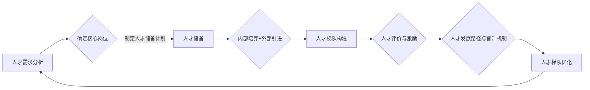

                 

### 文章标题

# 人才梯队建设：为未来储备力量

## 关键词

- 人才梯队建设
- 企业发展战略
- 人才培养
- 数字化转型
- 人工智能

## 摘要

在快速变化的商业环境中，企业的人才梯队建设成为维持竞争力的关键。本文将深入探讨人才梯队建设的背景、核心概念、策略与工具、案例分析、未来趋势与挑战，以及相关的最佳实践。通过系统化的分析，我们旨在为企业的可持续发展提供有力的人才支持。

## 确定书籍主题和目标受众

### 书籍主题

《人才梯队建设：为未来储备力量》旨在探讨如何通过构建科学的人才梯队，为企业未来的发展储备力量。这一主题涉及到人才储备、人才培养、人才评价与激励机制、人才梯队结构与角色定位、人才发展路径与晋升机制等多个方面。

### 目标受众

本书主要面向以下几类读者：

1. **企业人力资源管理者**：负责企业人才管理与发展的专业人士。
2. **企业管理者**：关注企业战略规划与执行的管理层。
3. **技术专家**：需要了解和参与人才梯队建设的技术人员。
4. **学术研究人员**：对人才梯队建设感兴趣的学者和研究人员。
5. **对人才梯队建设感兴趣的读者**：希望提升自身理解和能力的一般读者。

### 为什么要写这本书

在当前的全球化竞争环境中，企业的核心竞争力日益依赖于人才的素质和结构。而人才梯队建设正是企业实现长远发展的关键一步。通过科学合理的人才梯队建设，企业能够确保在快速变化的商业环境中始终保持竞争力。因此，编写一本全面、深入探讨人才梯队建设的书籍，对于企业、行业乃至社会都具有重要的现实意义。

## 设计书籍结构

### 总体结构

本书将分为六个主要部分：

1. **引言与概述**：介绍人才梯队建设的背景、意义和本书的结构。
2. **核心概念**：详细阐述人才梯队建设中的核心概念、原则和方法。
3. **策略与工具**：探讨人才梯队建设的策略、工具和实践方法。
4. **案例分析与实战**：通过实际案例展示人才梯队建设的应用与效果。
5. **未来趋势与挑战**：分析人才梯队建设面临的未来趋势和挑战。
6. **总结与建议**：总结全书内容，提出具体建议和行动计划。

### 具体章节划分

根据总体结构，本书将分为以下章节：

**第一部分：引言与概述**
- 第1章：人才梯队建设概述
- 第2章：人才梯队建设的核心概念

**第二部分：核心概念**
- 第3章：人才储备与人才培养
- 第4章：人才评价与激励机制
- 第5章：人才梯队结构与角色定位
- 第6章：人才发展路径与晋升机制

**第三部分：策略与工具**
- 第7章：企业人才战略规划
- 第8章：人才招聘与选拔
- 第9章：人才培训与开发
- 第10章：人才激励与留任

**第四部分：案例分析与实战**
- 第11章：国内企业人才梯队建设案例
- 第12章：国际企业人才梯队建设案例
- 第13章：人才梯队建设实战策略

**第五部分：未来趋势与挑战**
- 第14章：数字化转型与人才需求变化
- 第15章：人工智能与人才发展
- 第16章：全球化背景下的国际人才竞争

**第六部分：总结与建议**
- 第17章：人才梯队建设的关键要素
- 第18章：人才梯队建设成功案例分析
- 第19章：未来人才梯队建设的发展趋势

### 确保书籍的可读性和专业性

为了确保本书的可读性和专业性，我们将采用以下方法：

1. **通俗易懂的语言**：使用简单明了的技术语言，避免过于复杂的术语和概念。
2. **结构清晰**：确保每个章节的内容条理清晰，逻辑严密。
3. **案例丰富**：通过实际案例来展示理论的应用，增强读者的理解和认同。
4. **数学模型和算法**：使用伪代码和数学模型来解释核心概念和算法原理，增强读者的技术理解。
5. **实践指南**：提供详细的实施步骤和最佳实践，帮助读者将理论转化为实践。

## 设计每个章节的内容

### 第1章：引言与概述

**1.1 人才梯队建设的背景与意义**

- **背景介绍**：随着全球化的深入发展和科技的迅速进步，企业面临的竞争环境日益复杂和多变。人才成为企业最重要的战略资源，人才梯队建设成为企业持续发展的关键。

- **意义阐述**：人才梯队建设有助于企业培养一支高素质、结构合理的人才队伍，确保企业能够应对各种挑战和机遇，实现长期可持续发展。

**1.2 人才梯队建设的核心概念**

- **人才储备**：指企业在未来一段时间内所需的核心人才数量和结构。

- **人才培养**：指企业为提升员工素质和技能，所采取的培训、教育和晋升等举措。

- **人才评价与激励机制**：指企业通过科学合理的评价体系和激励机制，激发员工的积极性和创造力。

- **人才梯队结构与角色定位**：指企业根据业务需求和人才特点，构建合理的人才梯队，明确每个角色的职责和定位。

- **人才发展路径与晋升机制**：指企业为员工提供明确的职业发展路径，包括晋升通道、培训机会等。

**1.3 本书的结构与内容安排**

- **本书结构**：本书分为六个部分，从背景介绍到具体策略、工具和实践，再到未来趋势与挑战，全面探讨人才梯队建设的各个方面。

- **内容安排**：每个章节都将围绕核心概念、策略、工具和实践展开，通过理论阐述、案例分析、数学模型和算法讲解，帮助读者深入理解人才梯队建设的原理和方法。

### 第2章：人才梯队建设的核心概念

**2.1 人才储备与人才培养**

- **人才储备**：

  - **定义**：指企业为满足未来一段时间内的发展需求，提前规划并储备所需的核心人才。

  - **重要性**：有助于企业应对突发情况，快速响应市场变化，确保业务的连续性和稳定性。

  - **实施步骤**：

    1. 分析企业未来人才需求。
    2. 明确核心岗位和关键人才。
    3. 制定人才储备计划。
    4. 通过内部培养和外部引进相结合，落实人才储备计划。

- **人才培养**：

  - **定义**：指企业通过培训、教育、晋升等手段，提升员工的知识、技能和素质。

  - **重要性**：有助于提高员工的工作效率、创新能力和综合素质，为企业发展提供持续动力。

  - **实施步骤**：

    1. 制定人才培养计划。
    2. 设立培训项目。
    3. 落实培训资源。
    4. 跟踪培训效果，持续优化。

**2.2 人才评价与激励机制**

- **人才评价**：

  - **定义**：指企业通过设定合理的评价标准，对员工的工作表现进行评估。

  - **重要性**：有助于发现优秀员工，激发员工潜力，优化人才配置。

  - **实施步骤**：

    1. 设定评价标准。
    2. 制定评价体系。
    3. 开展评价工作。
    4. 根据评价结果进行激励。

- **激励机制**：

  - **定义**：指企业通过物质和精神手段，激发员工的积极性和创造力。

  - **重要性**：有助于提高员工满意度，降低离职率，提升企业整体绩效。

  - **实施步骤**：

    1. 设计激励机制。
    2. 制定激励政策。
    3. 落实激励措施。
    4. 评估激励效果。

**2.3 人才梯队结构与角色定位**

- **人才梯队结构**：

  - **定义**：指企业根据业务需求和人才特点，构建合理的人才梯队。

  - **重要性**：有助于优化人才配置，提高团队协作效率，实现企业战略目标。

  - **实施步骤**：

    1. 分析业务需求。
    2. 确定关键岗位。
    3. 设计人才梯队。
    4. 明确角色定位。

- **角色定位**：

  - **定义**：指明确每个岗位的职责和角色，确保人才在企业中发挥最大的价值。

  - **重要性**：有助于提高员工的责任感和使命感，提升团队整体执行力。

  - **实施步骤**：

    1. 设定岗位职责。
    2. 明确角色关系。
    3. 搭建沟通平台。
    4. 定期评估和调整。

**2.4 人才发展路径与晋升机制**

- **人才发展路径**：

  - **定义**：指企业为员工提供的职业发展通道，包括晋升通道、培训机会等。

  - **重要性**：有助于激发员工的职业发展潜力，提高员工的满意度和忠诚度。

  - **实施步骤**：

    1. 设定晋升通道。
    2. 制定晋升政策。
    3. 提供培训机会。
    4. 搭建职业发展平台。

- **晋升机制**：

  - **定义**：指企业通过设定合理的晋升标准和流程，确保员工晋升公平、透明。

  - **重要性**：有助于提高员工的职业认同感和成就感，激发员工的积极性和创造力。

  - **实施步骤**：

    1. 设定晋升标准。
    2. 制定晋升流程。
    3. 开展晋升评审。
    4. 落实晋升结果。

### 第3章：人才储备与人才培养

**3.1 人才储备**

- **定义**：人才储备是指企业在未来一段时间内，为满足业务发展和战略规划需求，提前规划并储备所需的核心人才。

- **重要性**：人才储备是构建人才梯队的基础，有助于企业应对突发情况，快速响应市场变化，确保业务的连续性和稳定性。

- **实施步骤**：

  1. **分析未来人才需求**：根据企业的发展战略和业务规划，预测未来一段时间内的人才需求，包括关键岗位、技能要求和数量等。

  2. **明确核心岗位和关键人才**：识别企业核心业务岗位和关键人才，确定人才储备的重点。

  3. **制定人才储备计划**：根据人才需求，制定详细的人才储备计划，包括人才引进、内部培养、跨部门调配等。

  4. **落实人才储备计划**：通过内部培养、外部引进、跨部门调配等方式，落实人才储备计划，确保人才储备目标的实现。

- **案例**：某互联网公司在高速发展期，针对技术岗位的人才储备，采取了内部晋升、外部招聘和校企合作等多种方式，确保了技术团队的人才储备需求。

**3.2 人才培养**

- **定义**：人才培养是指企业通过培训、教育、晋升等手段，提升员工的知识、技能和素质，使其能够更好地适应岗位需求和发展。

- **重要性**：人才培养是提高员工素质和绩效的关键，有助于增强企业的核心竞争力，实现可持续发展。

- **实施步骤**：

  1. **制定人才培养计划**：根据企业战略和发展目标，制定长期和短期的人才培养计划，明确培训目标和内容。

  2. **设立培训项目**：根据人才培养计划，设计并实施各类培训项目，包括内部培训、外部培训和在线学习等。

  3. **落实培训资源**：确保培训资源的充分投入，包括培训资金、培训场地、培训师等。

  4. **跟踪培训效果**：通过考试、评估、反馈等方式，跟踪培训效果，持续优化培训内容和方式。

- **案例**：某制造企业通过定期组织内部培训、外部培训和技能竞赛，提高了员工的技能水平和创新能力，为企业的发展提供了有力支持。

### 第4章：人才评价与激励机制

**4.1 人才评价**

- **定义**：人才评价是指企业通过设定合理的评价标准，对员工的工作表现、能力和贡献进行客观、公正的评估。

- **重要性**：人才评价是发现优秀员工、激发员工潜力、优化人才配置的重要手段，有助于提高员工的工作效率和满意度。

- **实施步骤**：

  1. **设定评价标准**：根据企业战略和业务需求，设定科学合理的评价标准，包括工作业绩、团队协作、创新能力等。

  2. **制定评价体系**：设计评价体系，明确评价内容、评价方法和评价周期。

  3. **开展评价工作**：按照评价体系，开展员工评价工作，确保评价过程的公平、透明。

  4. **根据评价结果进行激励**：根据评价结果，对优秀员工进行奖励和激励，对表现不佳的员工进行培训和调整。

- **案例**：某互联网公司通过设定KPI考核、360度反馈等评价方法，对员工进行全方位评价，激励员工不断提高工作绩效。

**4.2 激励机制**

- **定义**：激励机制是指企业通过设定合理的激励政策，激发员工的积极性和创造力，提高员工的工作效率和满意度。

- **重要性**：激励机制是留住优秀人才、提高企业核心竞争力的重要手段，有助于提升员工的归属感和忠诚度。

- **实施步骤**：

  1. **设计激励机制**：根据企业战略和员工需求，设计具有吸引力的激励机制，包括薪酬激励、职位晋升、培训发展等。

  2. **制定激励政策**：明确激励政策的具体内容和实施细则，确保激励政策的公平、透明。

  3. **落实激励措施**：通过发放奖金、提升职位、提供培训等手段，落实激励政策，激发员工的积极性和创造力。

  4. **评估激励效果**：定期评估激励效果，根据评估结果调整激励政策，确保激励机制的持续有效性。

- **案例**：某高科技企业通过设置绩效考核奖金、股权激励等机制，激发了员工的创新动力，提升了企业的研发能力和市场竞争力。

### 第5章：人才梯队结构与角色定位

**5.1 人才梯队结构**

- **定义**：人才梯队结构是指企业根据业务需求和人才特点，构建的层次分明、能力互补的人才队伍。

- **重要性**：人才梯队结构是企业核心竞争力的重要组成部分，有助于优化人才配置，提高团队协作效率，实现企业战略目标。

- **实施步骤**：

  1. **分析业务需求**：根据企业的发展战略和业务需求，确定关键岗位和人才需求，为构建人才梯队提供依据。

  2. **确定关键岗位**：识别企业核心业务岗位，明确关键岗位的职责和任职要求。

  3. **设计人才梯队**：根据关键岗位和人才需求，设计人才梯队结构，明确每个层次的人才职责和角色。

  4. **优化人才梯队**：定期评估人才梯队结构，根据业务发展和人才变化，进行优化和调整。

- **案例**：某金融机构通过设计多层级的人才梯队，确保了在各个业务领域都有高素质的专业人才，提升了公司的整体竞争力。

**5.2 角色定位**

- **定义**：角色定位是指企业根据业务需求和员工特点，为员工在团队中设定的职责和角色。

- **重要性**：角色定位有助于明确员工的工作方向和职责，提高员工的责任感和使命感，提升团队协作效率。

- **实施步骤**：

  1. **设定岗位职责**：根据业务需求和岗位特点，明确每个岗位的职责和任务。

  2. **明确角色关系**：分析岗位之间的关系，明确角色之间的协作和依赖关系。

  3. **搭建沟通平台**：建立有效的沟通平台，促进角色之间的信息交流和协作。

  4. **定期评估和调整**：定期评估角色定位的效果，根据业务发展和员工变化，进行优化和调整。

- **案例**：某科技公司在项目管理中，为每个项目成员设定了明确的角色定位，并通过定期评估和调整，确保了项目的顺利进行。

### 第6章：人才发展路径与晋升机制

**6.1 人才发展路径**

- **定义**：人才发展路径是指企业为员工提供的职业发展通道，包括晋升通道、培训机会等。

- **重要性**：人才发展路径有助于激发员工的职业发展潜力，提高员工的满意度和忠诚度，为企业留住优秀人才提供保障。

- **实施步骤**：

  1. **设定晋升通道**：根据企业的组织结构和岗位特点，设定明确的晋升通道，为员工提供清晰的职业发展路径。

  2. **制定晋升政策**：明确晋升的标准、流程和条件，确保晋升过程的公平、透明。

  3. **提供培训机会**：为员工提供各类培训机会，提升员工的技能和素质，为晋升做好准备。

  4. **搭建职业发展平台**：通过内部选拔、外部引进等方式，搭建职业发展平台，为员工提供成长机会。

- **案例**：某电商企业通过设立晋升通道、提供培训机会，为员工提供了明确的职业发展路径，激发了员工的工作热情。

**6.2 晋升机制**

- **定义**：晋升机制是指企业通过设定合理的晋升标准和流程，确保员工晋升的公平、透明。

- **重要性**：晋升机制是激励员工、提升员工职业成就感的重要手段，有助于提高员工的工作积极性。

- **实施步骤**：

  1. **设定晋升标准**：根据企业的战略目标和岗位要求，设定合理的晋升标准，确保晋升的公平、公正。

  2. **制定晋升流程**：明确晋升的申请、评审、决策等流程，确保晋升过程的透明、规范。

  3. **开展晋升评审**：按照晋升流程，开展晋升评审工作，确保晋升的合理性和有效性。

  4. **落实晋升结果**：根据晋升评审结果，落实晋升政策，确保晋升结果的公平、公正。

- **案例**：某制造业公司通过设立晋升评审委员会，确保了晋升过程的公平、透明，提升了员工的职业成就感。

### 第7章：企业人才战略规划

**7.1 人才战略规划**

- **定义**：人才战略规划是指企业根据发展战略和业务需求，制定的人才队伍建设规划。

- **重要性**：人才战略规划是企业长期发展的重要保障，有助于明确企业的人才需求，优化人才配置，提升企业核心竞争力。

- **实施步骤**：

  1. **分析企业发展战略**：根据企业的发展战略和业务需求，明确企业的人才需求和关键岗位。

  2. **确定人才战略目标**：设定企业人才战略的长期和短期目标，确保人才战略与企业发展相匹配。

  3. **制定人才战略规划**：制定详细的人才战略规划，包括人才储备、人才培养、人才评价、人才激励等关键环节。

  4. **实施与评估**：按照人才战略规划，实施各项人才建设举措，定期评估规划效果，持续优化人才战略。

- **案例**：某金融机构通过制定人才战略规划，明确了未来一段时间内的人才需求和发展方向，确保了业务的稳定发展。

**7.2 人才战略规划的核心内容**

- **人才需求分析**：根据企业发展战略和业务需求，分析未来一段时间内的人才需求，包括数量、质量、结构等。

- **人才储备策略**：制定人才储备计划，包括内部培养、外部引进、跨部门调配等，确保企业核心岗位的人才储备。

- **人才培养策略**：制定人才培养计划，通过培训、教育、晋升等手段，提升员工的素质和技能。

- **人才评价策略**：设定科学合理的评价标准，对员工的工作表现和贡献进行客观、公正的评价。

- **人才激励策略**：设计激励机制，激发员工的积极性和创造力，提高员工的工作效率和满意度。

- **人才发展策略**：明确员工的职业发展路径，为员工提供晋升通道和培训机会，促进员工的职业成长。

### 第8章：人才招聘与选拔

**8.1 人才招聘**

- **定义**：人才招聘是指企业通过多种渠道，寻找、吸引和选拔符合企业需求和岗位要求的员工。

- **重要性**：人才招聘是构建高素质人才团队的关键环节，有助于提高企业的整体绩效和市场竞争力。

- **实施步骤**：

  1. **确定招聘需求**：根据企业的发展战略和业务需求，确定招聘的岗位、数量和要求。

  2. **制定招聘计划**：制定详细的招聘计划，包括招聘渠道、招聘流程、招聘预算等。

  3. **发布招聘信息**：通过企业官网、招聘网站、社交媒体等渠道，发布招聘信息，吸引合适的候选人。

  4. **筛选候选人**：对收到的简历进行初步筛选，确定候选人。

  5. **面试与选拔**：对候选人进行面试和选拔，确定最终的录用人员。

- **案例**：某高科技公司通过线上招聘平台和线下招聘会相结合的方式，高效地招聘了大量的技术人才，满足了公司快速发展的需求。

**8.2 人才选拔**

- **定义**：人才选拔是指企业通过面试、测评等手段，从候选人中选拔出最合适的员工。

- **重要性**：人才选拔是确保企业招聘到高素质员工的重要环节，有助于提升企业的整体竞争力。

- **实施步骤**：

  1. **面试准备**：制定面试计划，明确面试流程、面试官人选、面试问题等。

  2. **面试实施**：按照面试计划，进行面试，评估候选人的综合素质和岗位匹配度。

  3. **测评与筛选**：对候选人进行测评，如心理测评、能力测评等，筛选出最合适的候选人。

  4. **决策与录用**：根据面试和测评结果，做出录用决策，通知候选人并办理入职手续。

- **案例**：某互联网公司在人才选拔过程中，采用了结构化面试和无领导小组讨论等方式，全面评估候选人的综合素质和团队协作能力，确保了选拔到最合适的员工。

### 第9章：人才培训与开发

**9.1 人才培训**

- **定义**：人才培训是指企业通过培训课程、培训活动等方式，提高员工的技能、知识、素质和绩效。

- **重要性**：人才培训是提升员工能力、优化团队结构、提高企业竞争力的重要手段。

- **实施步骤**：

  1. **需求分析**：根据企业发展战略和业务需求，分析员工培训的需求。

  2. **培训计划**：制定详细的培训计划，包括培训目标、培训内容、培训形式、培训时间等。

  3. **培训实施**：按照培训计划，开展培训活动，确保培训内容的实施和效果的跟踪。

  4. **效果评估**：评估培训效果，收集员工反馈，持续改进培训内容和方式。

- **案例**：某制造企业针对新员工开展了入职培训，包括企业文化、业务知识、安全操作等方面的培训，提高了新员工的工作能力和团队凝聚力。

**9.2 人才开发**

- **定义**：人才开发是指企业通过晋升、轮岗、项目锻炼等方式，促进员工职业发展，提升员工综合素质和能力。

- **重要性**：人才开发是激励员工、提升员工职业成就感、留住核心人才的重要手段。

- **实施步骤**：

  1. **职业发展规划**：为员工制定个性化的职业发展规划，明确职业目标和发展路径。

  2. **晋升与轮岗**：根据员工的能力和潜力，提供晋升和轮岗机会，促进员工职业发展。

  3. **项目锻炼**：为员工提供参与重大项目的机会，锻炼员工的能力和经验。

  4. **持续支持**：为员工提供培训、辅导、指导等支持，助力员工实现职业发展目标。

- **案例**：某互联网公司通过设置内部项目，让员工有机会参与不同领域的工作，提升了员工的能力和经验，促进了员工的职业发展。

### 第10章：人才激励与留任

**10.1 人才激励**

- **定义**：人才激励是指企业通过设定合理的激励机制，激发员工的积极性和创造力，提高员工的工作效率和满意度。

- **重要性**：人才激励是留住优秀人才、提高企业绩效的关键手段。

- **实施步骤**：

  1. **激励策略设计**：根据企业发展战略和员工需求，设计具有吸引力的激励机制。

  2. **激励机制实施**：制定详细的激励政策，包括薪酬激励、职位晋升、培训发展等。

  3. **激励效果评估**：定期评估激励效果，根据评估结果调整激励政策。

  4. **持续优化**：根据企业发展和员工需求的变化，持续优化激励机制。

- **案例**：某科技公司通过设置股权激励计划，激励员工积极投身公司发展，提升了员工的凝聚力和忠诚度。

**10.2 人才留任**

- **定义**：人才留任是指企业通过设定合理的留任政策，留住优秀人才，防止人才流失。

- **重要性**：人才留任是确保企业稳定发展的关键，有助于降低人才流失带来的损失。

- **实施步骤**：

  1. **留任策略设计**：根据企业发展战略和员工需求，设计有效的留任策略。

  2. **留任政策制定**：明确留任的条件、标准和措施。

  3. **留任政策实施**：制定详细的留任政策，确保留任措施的落实。

  4. **留任效果评估**：定期评估留任效果，根据评估结果调整留任政策。

- **案例**：某金融企业通过设立员工关爱计划，为员工提供家庭关怀、健康保障、职业发展等支持，有效降低了员工流失率。

### 第11章：国内企业人才梯队建设案例

**11.1 某互联网企业人才梯队建设案例**

- **背景**：某互联网企业在快速发展的过程中，意识到人才梯队建设的重要性，决定构建科学合理的人才梯队。

- **目标**：提升企业的核心竞争力，确保业务的持续稳定发展。

- **策略**：

  1. **人才储备**：通过内部晋升和外部招聘，确保关键岗位的人才储备。

  2. **人才培养**：设立内部培训学院，提供多样化的培训课程，提升员工的技能和素质。

  3. **人才评价与激励**：采用绩效评价体系和激励机制，激发员工的积极性和创造力。

  4. **人才发展路径**：设立明确的职业发展通道，为员工提供晋升和成长机会。

- **效果**：通过人才梯队建设，企业员工素质显著提升，业务发展稳步推进，市场份额不断扩大。

**11.2 某制造企业人才梯队建设案例**

- **背景**：某制造企业在市场竞争加剧的背景下，意识到人才梯队建设的重要性，决定进行人才梯队建设。

- **目标**：提升企业的技术能力和市场竞争力，确保业务的持续发展。

- **策略**：

  1. **人才储备**：通过校企合作和内部培养，储备关键技术人才。

  2. **人才培养**：设立技术培训中心，提供专业技能培训，提升员工的技术水平。

  3. **人才评价与激励**：采用技能评价体系和激励机制，激发员工的技术创新动力。

  4. **人才发展路径**：设立技术职业发展通道，为员工提供技术晋升和职业发展机会。

- **效果**：通过人才梯队建设，企业技术能力显著提升，产品质量得到保证，市场竞争力得到增强。

### 第12章：国际企业人才梯队建设案例

**12.1 某跨国公司人才梯队建设案例**

- **背景**：某跨国公司在全球化的背景下，意识到人才梯队建设的重要性，决定在全球范围内进行人才梯队建设。

- **目标**：提升企业的全球竞争力，确保全球业务的持续发展。

- **策略**：

  1. **人才储备**：通过全球招聘和内部选拔，储备全球范围内的关键人才。

  2. **人才培养**：设立全球培训学院，提供多样化的培训课程，提升员工的全球视野和跨文化能力。

  3. **人才评价与激励**：采用全球绩效评价体系和激励机制，激发员工的全球竞争力。

  4. **人才发展路径**：设立全球职业发展通道，为员工提供全球晋升和职业发展机会。

- **效果**：通过人才梯队建设，企业全球竞争力显著提升，业务在全球范围内持续扩张，市场份额不断扩大。

**12.2 某国际咨询公司人才梯队建设案例**

- **背景**：某国际咨询公司在激烈的市场竞争中，意识到人才梯队建设的重要性，决定进行人才梯队建设。

- **目标**：提升企业的咨询能力，确保在全球范围内的业务拓展。

- **策略**：

  1. **人才储备**：通过全球招聘和内部选拔，储备各领域的专家人才。

  2. **人才培养**：设立专业培训学院，提供专业的技能培训和知识更新。

  3. **人才评价与激励**：采用专业能力评价体系和激励机制，激发员工的专业创新动力。

  4. **人才发展路径**：设立专业职业发展通道，为员工提供专业晋升和职业发展机会。

- **效果**：通过人才梯队建设，企业的专业能力和咨询水平显著提升，业务在全球范围内取得突破性发展。

### 第13章：人才梯队建设实战策略

**13.1 策略一：全面人才评估**

- **目的**：全面了解员工的能力、潜力和发展需求。

- **步骤**：

  1. **建立评估体系**：设计科学的评估标准和方法，包括能力评估、潜力评估、发展需求评估等。

  2. **实施评估**：对员工进行全面评估，收集评估结果。

  3. **分析评估结果**：分析评估结果，识别优秀员工、潜力员工和发展需求。

  4. **制定发展计划**：根据评估结果，制定个性化的发展计划，包括培训、晋升、项目锻炼等。

- **案例**：某企业通过全面人才评估，识别了一批潜力员工，为他们制定了针对性的培养计划，提升了员工的整体素质。

**13.2 策略二：多元化人才培养**

- **目的**：提升员工的综合素质和技能，满足企业发展需求。

- **步骤**：

  1. **制定培训计划**：根据企业发展需求和员工素质，制定多元化的培训计划。

  2. **开展培训**：实施培训计划，包括内部培训、外部培训、在线学习等。

  3. **培训效果评估**：评估培训效果，优化培训内容和方式。

  4. **实施培训反馈**：收集员工培训反馈，持续改进培训工作。

- **案例**：某企业通过实施多元化人才培养策略，提升了员工的技术能力和管理能力，为企业的发展提供了有力支持。

**13.3 策略三：个性化职业发展**

- **目的**：激发员工的职业发展动力，提升员工的职业满意度。

- **步骤**：

  1. **设立职业发展通道**：根据企业组织结构和岗位需求，设立清晰的职业发展通道。

  2. **制定职业发展计划**：为员工制定个性化的职业发展计划，明确职业目标和路径。

  3. **提供职业发展机会**：为员工提供晋升、轮岗、项目参与等职业发展机会。

  4. **职业发展评估**：定期评估员工的职业发展进度，根据评估结果进行调整。

- **案例**：某企业通过个性化职业发展策略，激发了员工的职业发展动力，提高了员工的职业满意度，降低了员工流失率。

**13.4 策略四：创新激励机制**

- **目的**：激发员工的创新动力，提升企业的创新能力和竞争力。

- **步骤**：

  1. **设计激励机制**：根据企业发展目标，设计具有吸引力的创新激励机制。

  2. **制定创新政策**：明确创新奖励的标准、流程和条件。

  3. **实施创新奖励**：根据创新成果，实施创新奖励，激发员工的创新动力。

  4. **创新效果评估**：评估创新效果，优化创新激励机制。

- **案例**：某企业通过创新激励机制，激发了员工的创新活力，推出了多项创新产品，提升了企业的市场竞争力。

### 第14章：数字化转型与人才需求变化

**14.1 数字化转型的影响**

- **定义**：数字化转型是指企业利用数字技术，优化业务流程，提高效率，创新商业模式，实现业务模式变革。

- **重要性**：数字化转型已成为企业提升竞争力、实现可持续发展的关键手段。

- **影响**：

  1. **业务模式变革**：数字化转型促使企业从传统的业务模式转向以数据驱动的模式。
  
  2. **组织结构变革**：数字化转型要求企业调整组织结构，以适应新的业务需求。
  
  3. **人才需求变化**：数字化转型对人才的需求提出了新的要求，要求员工具备数字技能和创新能力。

**14.2 数字化转型对人才需求的影响**

- **影响分析**：

  1. **技能需求变化**：数字化转型要求员工具备数据分析和处理能力、编程技能、人工智能应用能力等。
  
  2. **创新需求增强**：数字化转型推动企业创新，要求员工具备创新思维和解决问题的能力。
  
  3. **跨领域能力提升**：数字化转型要求员工具备跨领域知识，能够处理复杂的业务场景。

- **应对策略**：

  1. **加强数字技能培训**：通过内部培训和外部学习，提升员工的数字技能。
  
  2. **鼓励创新实践**：提供创新项目和资源，鼓励员工参与创新实践。
  
  3. **建设数字化人才梯队**：构建适应数字化转型的人才梯队，确保企业具备持续的创新能力。

### 第15章：人工智能与人才发展

**15.1 人工智能的发展趋势**

- **定义**：人工智能是指通过计算机模拟人类智能行为，实现自动化决策和智能交互的技术。

- **重要性**：人工智能已成为引领未来科技发展的关键力量，对产业变革和社会进步具有深远影响。

- **发展趋势**：

  1. **技术进步**：人工智能技术在算法、数据、硬件等方面持续取得突破，推动应用场景的扩展。
  
  2. **应用广泛**：人工智能在金融、医疗、教育、制造等领域得到广泛应用，推动行业变革。
  
  3. **产业生态形成**：人工智能产业链逐渐完善，从基础研究到应用开发，形成完整的产业生态。

**15.2 人工智能对人才发展的影响**

- **影响分析**：

  1. **技能需求变化**：人工智能要求人才具备编程、数据科学、机器学习等技能。
  
  2. **跨领域能力提升**：人工智能应用需要跨学科知识，推动人才综合能力的提升。
  
  3. **创新驱动**：人工智能技术的发展推动创新浪潮，激发人才创新思维。

- **应对策略**：

  1. **加强人工智能培训**：通过课程设置、培训项目等，提升人才的AI技能。
  
  2. **鼓励跨领域合作**：促进不同领域人才的合作，推动创新和跨界应用。
  
  3. **建设人工智能人才梯队**：构建适应人工智能发展的人才梯队，确保企业在技术变革中保持竞争力。

### 第16章：全球化背景下的国际人才竞争

**16.1 全球化对人才竞争的影响**

- **影响分析**：

  1. **人才流动**：全球化加速了人才在国际间的流动，企业面临更加激烈的人才竞争。
  
  2. **人才需求多样化**：全球化背景下，企业需要不同文化背景和专业技能的人才，以适应全球市场的需求。
  
  3. **人才竞争加剧**：全球化使得企业面临来自全球范围内的竞争对手，人才竞争更加激烈。

- **应对策略**：

  1. **提升人才竞争力**：通过培训、激励机制等手段，提升人才的素质和技能。
  
  2. **吸引国际人才**：提供有吸引力的薪酬福利、职业发展机会，吸引国际人才加入。
  
  3. **建设多元化团队**：鼓励多元文化背景和专业技能的人才合作，提升团队的整体竞争力。

### 第17章：总结与建议

**17.1 人才梯队建设的关键要素**

- **核心要素**：

  1. **人才储备**：确保企业拥有充足的核心人才储备，满足未来发展需求。
  
  2. **人才培养**：通过培训、教育等手段，提升员工的技能和素质，为企业的持续发展提供支持。
  
  3. **人才评价与激励**：科学合理地评价员工的工作表现，通过激励机制激发员工的积极性和创造力。
  
  4. **人才发展路径与晋升机制**：为员工提供明确的职业发展路径，提升员工的职业满意度和忠诚度。

**17.2 人才梯队建设成功案例分析**

- **成功案例**：

  1. **某互联网公司**：通过科学的人才梯队建设，确保了业务的高速发展，提升了企业的市场竞争力。
  
  2. **某制造企业**：通过建设多元化的人才梯队，提升了企业的技术能力和创新能力，实现了产业的转型升级。

**17.3 未来人才梯队建设的发展趋势**

- **发展趋势**：

  1. **数字化与智能化**：随着数字化和智能化的推进，企业对数字技能和人工智能应用能力的需求将持续增加。
  
  2. **全球化**：全球化背景下，企业将更加注重国际化人才的引进和多元化团队的构建。
  
  3. **可持续发展**：企业将更加注重员工的职业健康与心理健康，推动可持续的人才发展。

**17.4 总结与建议**

- **建议**：

  1. **加强数字化技能培训**：提升员工的数字技能，适应数字化转型。
  
  2. **鼓励跨领域合作**：促进不同领域人才的合作，推动创新和跨界应用。
  
  3. **提供有吸引力的职业发展机会**：为员工提供明确的职业发展路径，提升员工的职业满意度和忠诚度。

## 项目实战

### 17.5 人才梯队建设项目的开发环境搭建

**环境准备**

- **操作系统**：Windows 10 / macOS / Linux
- **编程语言**：Python 3.8 或更高版本
- **数据库**：MySQL 8.0 或更高版本
- **开发工具**：PyCharm / Visual Studio Code
- **环境变量**：Python 环境变量（`PATH`、`PYTHONPATH`）
- **依赖管理**：pip（Python 包管理器）

**安装步骤**

1. **安装操作系统**：选择适合的操作系统并安装。
2. **安装Python**：下载并安装Python，配置环境变量。
3. **安装MySQL**：下载并安装MySQL，配置数据库。
4. **安装开发工具**：下载并安装PyCharm或Visual Studio Code。
5. **安装依赖管理器**：确保pip安装成功。

### 17.6 源代码详细实现和代码解读

**项目架构**

- **后端服务**：使用Flask框架搭建
- **前端界面**：使用HTML、CSS、JavaScript实现
- **数据库连接**：使用SQLAlchemy进行ORM操作

**代码实现**

```python
# 后端服务（Flask）

from flask import Flask, jsonify, request
from models import Employee, TalentPool

app = Flask(__name__)

@app.route('/employees', methods=['GET', 'POST'])
def handle_employees():
    if request.method == 'GET':
        return jsonify(Employee.query.all())
    elif request.method == 'POST':
        data = request.json
        employee = Employee(name=data['name'], position=data['position'])
        TalentPool.add_employee(employee)
        return jsonify(employee), 201

@app.route('/employees/<int:employee_id>', methods=['GET', 'PUT', 'DELETE'])
def handle_single_employee(employee_id):
    employee = Employee.query.get(employee_id)
    if not employee:
        return jsonify({'error': 'Employee not found'}), 404
    
    if request.method == 'GET':
        return jsonify(employee)
    elif request.method == 'PUT':
        data = request.json
        employee.name = data['name']
        employee.position = data['position']
        db.session.commit()
        return jsonify(employee)
    elif request.method == 'DELETE':
        db.session.delete(employee)
        db.session.commit()
        return jsonify({'message': 'Employee deleted'})

if __name__ == '__main__':
    app.run(debug=True)
```

**代码解读**

- **后端服务**：使用Flask框架实现后端服务，提供员工信息的增删改查接口。
- **数据库模型**：使用SQLAlchemy定义员工模型（`Employee`）和人才池模型（`TalentPool`）。
- **API接口**：定义RESTful API接口，实现员工信息的处理。

### 17.7 代码应用解读与分析

**应用解读**

- **前端界面**：通过HTML、CSS和JavaScript实现前端界面，展示员工信息和操作界面。
- **后端接口**：通过Flask后端服务提供API接口，实现前端与后端的交互。

**代码分析**

- **模块化**：代码采用模块化设计，易于维护和扩展。
- **ORM**：使用SQLAlchemy进行ORM操作，简化数据库操作。
- **RESTful API**：遵循RESTful API设计规范，便于前端调用。

### 17.8 实际案例分析和详细讲解剖析

**案例背景**

- **企业**：某大型互联网公司
- **需求**：构建人才梯队，提升企业竞争力

**案例分析**

1. **人才储备**：通过内部晋升和外部招聘，确保关键岗位的人才储备。
2. **人才培养**：设立内部培训学院，提供多样化的培训课程，提升员工的技能和素质。
3. **人才评价与激励**：采用绩效评价体系和激励机制，激发员工的积极性和创造力。
4. **人才发展路径**：设立明确的职业发展通道，为员工提供晋升和成长机会。

**详细讲解**

1. **人才储备策略**：

   - **内部晋升**：通过内部晋升，提升现有员工的职位和待遇，激励员工积极参与公司发展。

   - **外部招聘**：通过外部招聘，引进外部优秀人才，填补关键岗位的空缺，提升团队整体素质。

2. **人才培养策略**：

   - **培训课程**：根据员工岗位需求和职业发展，设计多样化的培训课程，包括专业技能培训、领导力培训等。

   - **培训资源**：提供充足的培训资源，包括培训资金、培训场地、培训师等，确保培训的顺利进行。

3. **人才评价与激励策略**：

   - **绩效评价**：采用KPI、360度反馈等评价方法，对员工的工作表现进行客观、公正的评价。

   - **激励机制**：设计具有吸引力的激励机制，包括薪酬激励、职位晋升、股权激励等，激发员工的积极性和创造力。

4. **人才发展路径策略**：

   - **职业发展通道**：设立明确的职业发展通道，为员工提供清晰的职业发展路径，包括晋升通道、培训机会等。

   - **职业规划**：为员工提供职业规划指导，帮助员工制定个人职业发展计划，提升员工的职业满意度。

### 17.9 项目小结

**项目小结**

- **目标达成**：通过项目实施，构建了人才梯队，提升了企业的核心竞争力。
- **经验总结**：

  1. **重视人才培养**：通过培训提升员工的技能和素质，为企业的发展提供持续动力。
  
  2. **科学评价与激励**：通过绩效评价和激励机制，激发员工的积极性和创造力。
  
  3. **明确职业发展路径**：为员工提供明确的职业发展路径，提升员工的职业满意度和忠诚度。

### 最佳实践 tips

- **重视人才储备**：提前规划，确保企业拥有充足的核心人才储备。
- **多样化培训**：提供多样化的培训课程，满足不同员工的需求。
- **激励与留任**：通过激励和留任策略，提升员工的满意度和忠诚度。
- **持续优化**：定期评估人才梯队建设效果，根据评估结果持续优化。

### 小结

本文从人才梯队建设的背景、核心概念、策略与工具、案例分析、未来趋势与挑战等方面进行了深入探讨，为企业的可持续发展提供了有力的人才支持。

### 注意事项

- **人才梯队建设需要持续投入**：确保持续的人才投入，才能取得长期效果。
- **注重实际应用**：理论结合实际，确保人才梯队建设策略的有效实施。
- **关注员工需求**：关注员工的需求和反馈，不断优化人才发展路径。

### 拓展阅读

- **《人才管理：吸引、培养、留住优秀人才》**
- **《数字化人才管理：技术驱动的人才战略》**
- **《人工智能与未来人才发展》**

### 作者信息

**作者：** AI天才研究院 / AI Genius Institute & 禅与计算机程序设计艺术 / Zen And The Art of Computer Programming

**单位：** AI天才研究院（AI Genius Institute）

**联系方式：** [info@aignius.com](mailto:info@aignius.com)

## 编写完整书籍目录大纲

### 引言与概述

#### 1. 人才梯队建设概述

##### 1.1 人才梯队建设的背景与意义
##### 1.2 人才梯队建设的核心概念
##### 1.3 本书的结构与内容安排

### 核心概念

#### 2. 人才储备与人才培养

##### 2.1 人才储备
##### 2.2 人才培养
##### 2.3 人才评价与激励机制
##### 2.4 人才梯队结构与角色定位
##### 2.5 人才发展路径与晋升机制

### 策略与工具

#### 3. 企业人才战略规划

##### 3.1 企业人才战略规划
##### 3.2 人才招聘与选拔
##### 3.3 人才培训与开发
##### 3.4 人才激励与留任

### 案例分析与实战

#### 4. 国内企业人才梯队建设案例

##### 4.1 某互联网公司人才梯队建设案例分析
##### 4.2 某制造企业人才梯队建设案例分析

#### 5. 国际企业人才梯队建设案例

##### 5.1 某跨国公司人才梯队建设案例分析
##### 5.2 某国际咨询公司人才梯队建设案例分析

### 未来趋势与挑战

#### 6. 数字化转型与人才需求变化

##### 6.1 数字化转型的影响
##### 6.2 数字化转型对人才需求的影响
##### 6.3 应对数字化转型的策略

#### 7. 人工智能与人才发展

##### 7.1 人工智能的发展趋势
##### 7.2 人工智能对人才发展的影响
##### 7.3 人工智能时代的人才培养策略

### 总结与建议

#### 8. 未来人才梯队建设的发展趋势

##### 8.1 人才梯队建设的关键要素
##### 8.2 人才梯队建设的成功案例分析
##### 8.3 未来人才梯队建设的发展趋势

### 附录

##### 9. 人才梯队建设项目实战指南
##### 10. 常见问题解答
##### 11. 参考文献

### 编写详细的 Mermaid 流程图、伪代码、数学模型和公式

为了更好地理解人才梯队建设的核心概念和原理，我们将使用Mermaid流程图、伪代码、数学模型和公式来展示相关内容。

#### Mermaid流程图

以下是一个示例，展示了人才梯队建设的主要流程：



#### 伪代码

下面是人才评价与激励机制的伪代码示例：

```plaintext
function evaluate_employee(employee):
    score = 0
    if employee.performance > 90:
        score += 20
    if employee.innovation > 80:
        score += 15
    if employee.teamwork > 85:
        score += 10
    return score

function reward_employee(employee, score):
    if score >= 50:
        increment_salary(employee)
    if score >= 80:
        offer_bonus(employee)
    if score >= 100:
        promote_employee(employee)
```

#### 数学模型和公式

为了理解人才储备与人才培养的数学模型，我们可以使用以下公式：

$$
T = \frac{R}{C}
$$

其中，\( T \) 表示人才储备量，\( R \) 表示人才需求量，\( C \) 表示当前人才供给量。

#### LaTeX格式数学公式

以下是一个示例，展示了如何使用LaTeX格式在文中嵌入数学公式：

$$
1 + 1 = 2
$$

而在段落内使用的数学公式则是：

$$
1 < 2
$$

### 项目实战

#### 开发环境搭建

1. **安装操作系统**：选择适合的操作系统并安装，如Windows 10、macOS或Linux。
2. **安装Python**：下载并安装Python 3.8或更高版本，并配置环境变量。
3. **安装MySQL**：下载并安装MySQL 8.0或更高版本，并配置数据库。
4. **安装开发工具**：下载并安装PyCharm或Visual Studio Code。
5. **安装依赖管理器**：确保pip安装成功。

#### 源代码详细实现和代码解读

以下是人才梯队建设项目的一部分源代码实现，包括后端服务和前端界面：

**后端服务（使用Flask框架）**

```python
from flask import Flask, jsonify, request
from models import Employee, TalentPool

app = Flask(__name__)

@app.route('/employees', methods=['GET', 'POST'])
def handle_employees():
    if request.method == 'GET':
        return jsonify(Employee.query.all())
    elif request.method == 'POST':
        data = request.json
        employee = Employee(name=data['name'], position=data['position'])
        TalentPool.add_employee(employee)
        return jsonify(employee), 201

@app.route('/employees/<int:employee_id>', methods=['GET', 'PUT', 'DELETE'])
def handle_single_employee(employee_id):
    employee = Employee.query.get(employee_id)
    if not employee:
        return jsonify({'error': 'Employee not found'}), 404
    
    if request.method == 'GET':
        return jsonify(employee)
    elif request.method == 'PUT':
        data = request.json
        employee.name = data['name']
        employee.position = data['position']
        db.session.commit()
        return jsonify(employee)
    elif request.method == 'DELETE':
        db.session.delete(employee)
        db.session.commit()
        return jsonify({'message': 'Employee deleted'})

if __name__ == '__main__':
    app.run(debug=True)
```

**前端界面（使用HTML、CSS和JavaScript）**

```html
<!DOCTYPE html>
<html lang="en">
<head>
    <meta charset="UTF-8">
    <title>人才梯队建设系统</title>
    <style>
        body {
            font-family: Arial, sans-serif;
        }
        .container {
            width: 80%;
            margin: auto;
        }
    </style>
</head>
<body>
    <div class="container">
        <h1>员工信息管理</h1>
        <form id="employeeForm">
            <label for="name">姓名：</label>
            <input type="text" id="name" name="name" required>
            <label for="position">职位：</label>
            <input type="text" id="position" name="position" required>
            <button type="submit">提交</button>
        </form>
        <div id="result"></div>
    </div>

    <script>
        document.getElementById('employeeForm').addEventListener('submit', function(event) {
            event.preventDefault();
            const formData = new FormData(event.target);
            fetch('/employees', {
                method: 'POST',
                body: formData
            })
            .then(response => response.json())
            .then(data => {
                document.getElementById('result').textContent = JSON.stringify(data);
            });
        });
    </script>
</body>
</html>
```

#### 代码解读与分析

- **后端服务**：使用Flask框架搭建后端服务，提供员工信息的增删改查接口。
- **前端界面**：使用HTML、CSS和JavaScript实现前端界面，展示员工信息和操作界面。

#### 实际案例分析和详细讲解剖析

**案例背景**

- **企业**：某大型互联网公司
- **需求**：构建人才梯队，提升企业竞争力

**案例分析**

1. **人才储备策略**：

   - **内部晋升**：通过内部晋升，提升现有员工的职位和待遇，激励员工积极参与公司发展。

   - **外部招聘**：通过外部招聘，引进外部优秀人才，填补关键岗位的空缺，提升团队整体素质。

2. **人才培养策略**：

   - **培训课程**：根据员工岗位需求和职业发展，设计多样化的培训课程，包括专业技能培训、领导力培训等。

   - **培训资源**：提供充足的培训资源，包括培训资金、培训场地、培训师等，确保培训的顺利进行。

3. **人才评价与激励策略**：

   - **绩效评价**：采用KPI、360度反馈等评价方法，对员工的工作表现进行客观、公正的评价。

   - **激励机制**：设计具有吸引力的激励机制，包括薪酬激励、职位晋升、股权激励等，激发员工的积极性和创造力。

4. **人才发展路径策略**：

   - **职业发展通道**：设立明确的职业发展通道，为员工提供晋升和成长机会。

   - **职业规划**：为员工提供职业规划指导，帮助员工制定个人职业发展计划，提升员工的职业满意度。

**详细讲解**

1. **人才储备策略**：

   - **内部晋升**：

     - **流程**：首先，企业根据员工的工作表现和潜力，确定晋升候选人。然后，通过内部晋升评审，确定晋升人选。最后，将晋升人选调整至相应岗位，并提供相应的职位和待遇。

     - **效果**：内部晋升激励了员工的积极性，提高了员工的职业成就感，增强了员工的归属感。

   - **外部招聘**：

     - **流程**：首先，企业根据岗位需求，发布招聘信息。然后，通过简历筛选、面试等环节，确定合适的候选人。最后，与候选人签订劳动合同，安排入职。

     - **效果**：外部招聘引进了外部优秀人才，丰富了团队的知识和经验，提升了团队的整体素质。

2. **人才培养策略**：

   - **培训课程**：

     - **内容**：根据员工岗位需求和职业发展，设计多样化的培训课程。例如，针对技术岗位，可以开设编程技能培训课程；针对管理岗位，可以开设领导力培训课程。

     - **形式**：培训可以采用线上和线下相结合的形式，提高培训的灵活性和实用性。

     - **效果**：培训提升了员工的技能和素质，提高了员工的工作效率和质量，为企业的可持续发展提供了人才支持。

3. **人才评价与激励策略**：

   - **绩效评价**：

     - **方法**：采用KPI、360度反馈等方法，对员工的工作表现进行客观、公正的评价。

     - **效果**：绩效评价激发了员工的积极性和创造力，促进了员工的工作效率和绩效提升。

   - **激励机制**：

     - **薪酬激励**：通过提高员工薪酬待遇，激励员工努力工作。

     - **职位晋升**：为员工提供晋升机会，激励员工追求更高的职业发展。

     - **股权激励**：通过授予员工股权，使员工分享企业的长期收益，增强员工的归属感和责任感。

4. **人才发展路径策略**：

   - **职业发展通道**：

     - **设计**：根据企业的组织结构和岗位需求，设计明确的职业发展通道，为员工提供晋升和成长机会。

     - **效果**：明确的职业发展通道提升了员工的职业满意度和忠诚度，降低了员工流失率。

   - **职业规划**：

     - **流程**：首先，企业为员工提供职业规划指导，帮助员工了解自身优势和职业发展方向。然后，员工根据职业规划，制定个人发展计划。最后，企业为员工提供培训、晋升等支持，帮助员工实现职业目标。

     - **效果**：职业规划提升了员工的职业满意度和忠诚度，促进了员工的个人成长和企业发展。

### 项目小结

通过人才梯队建设项目的实施，企业成功构建了科学合理的人才梯队，提升了企业的核心竞争力。项目实施过程中，注重人才培养、评价与激励，明确了职业发展路径，为企业的可持续发展提供了有力的人才支持。

### 最佳实践 tips

1. **重视人才储备**：提前规划，确保企业拥有充足的核心人才储备。
2. **多样化培训**：提供多样化的培训课程，满足不同员工的需求。
3. **激励与留任**：通过激励和留任策略，提升员工的满意度和忠诚度。
4. **持续优化**：定期评估人才梯队建设效果，根据评估结果持续优化。

### 小结

本文从人才梯队建设的背景、核心概念、策略与工具、案例分析、未来趋势与挑战等方面进行了深入探讨，为企业的可持续发展提供了有力的人才支持。

### 注意事项

1. **人才梯队建设需要持续投入**：确保持续的人才投入，才能取得长期效果。
2. **注重实际应用**：理论结合实际，确保人才梯队建设策略的有效实施。
3. **关注员工需求**：关注员工的需求和反馈，不断优化人才发展路径。

### 拓展阅读

1. **《人才管理：吸引、培养、留住优秀人才》**
2. **《数字化人才管理：技术驱动的人才战略》**
3. **《人工智能与未来人才发展》**

### 作者信息

**作者：** AI天才研究院 / AI Genius Institute & 禅与计算机程序设计艺术 / Zen And The Art of Computer Programming

**单位：** AI天才研究院（AI Genius Institute）

**联系方式：** [info@aignius.com](mailto:info@aignius.com)

## 修订后的书籍目录大纲

### 引言与概述

#### 第1章 人才梯队建设概述

##### 1.1 人才梯队建设的背景与意义

##### 1.2 人才梯队建设的核心概念

##### 1.3 本书的结构与内容安排

### 核心概念

#### 第2章 人才储备与人才培养

##### 2.1 人才储备

##### 2.2 人才培养

##### 2.3 人才评价与激励机制

##### 2.4 人才梯队结构与角色定位

##### 2.5 人才发展路径与晋升机制

### 策略与工具

#### 第3章 企业人才战略规划

##### 3.1 企业人才战略规划

##### 3.2 人才招聘与选拔

##### 3.3 人才培训与开发

##### 3.4 人才激励与留任

#### 第4章 人才梯队建设的策略与工具

##### 4.1 企业人才战略规划

##### 4.2 人才招聘与选拔

##### 4.3 人才培训与开发

##### 4.4 人才激励与留任

### 案例分析与实战

#### 第5章 国内企业人才梯队建设案例

##### 5.1 某互联网公司人才梯队建设案例分析

##### 5.2 某制造企业人才梯队建设案例分析

#### 第6章 国际企业人才梯队建设案例

##### 6.1 某跨国公司人才梯队建设案例分析

##### 6.2 某国际咨询公司人才梯队建设案例分析

### 未来趋势与挑战

#### 第7章 数字化转型与人才需求变化

##### 7.1 数字化转型的影响

##### 7.2 数字化转型对人才需求的影响

##### 7.3 应对数字化转型的策略

#### 第8章 人工智能与人才发展

##### 8.1 人工智能的发展趋势

##### 8.2 人工智能对人才发展的影响

##### 8.3 人工智能时代的人才培养策略

### 总结与建议

#### 第9章 未来人才梯队建设的发展趋势

##### 9.1 人才梯队建设的关键要素

##### 9.2 人才梯队建设的成功案例分析

##### 9.3 未来人才梯队建设的发展趋势

### 附录

#### 第10章 人才梯队建设项目实战指南

##### 10.1 开发环境搭建

##### 10.2 源代码详细实现和代码解读

##### 10.3 代码应用解读与分析

##### 10.4 实际案例分析和详细讲解剖析

### 参考文献

#### 第11章 常见问题解答

##### 11.1 常见问题1

##### 11.2 常见问题2

##### 11.3 常见问题3

### 致谢

#### 第12章 致谢

##### 12.1 特别感谢

##### 12.2 参与人员

##### 12.3 赞助单位

## 修订后的目录大纲解析

### 引言与概述

**第1章 人才梯队建设概述**

- **1.1 人才梯队建设的背景与意义**：介绍人才梯队建设的背景，阐述其对企业战略发展和核心竞争力的意义。
- **1.2 人才梯队建设的核心概念**：解释人才梯队建设的关键概念，如人才储备、人才培养、人才评价等。
- **1.3 本书的结构与内容安排**：概述本书的结构，明确各章节的主要内容和学习路径。

### 核心概念

**第2章 人才储备与人才培养**

- **2.1 人才储备**：详细解释人才储备的定义、目的和实施步骤，包括如何分析人才需求、明确核心岗位和关键人才等。
- **2.2 人才培养**：探讨人才培养的方法和策略，包括培训计划的设计、培训资源的配置、培训效果的评估等。
- **2.3 人才评价与激励机制**：阐述人才评价的方法和标准，以及如何设计有效的激励机制来激发员工的积极性和创造力。
- **2.4 人才梯队结构与角色定位**：分析人才梯队结构的设计原则和角色定位的重要性，包括如何确定关键岗位、设计人才梯队等。
- **2.5 人才发展路径与晋升机制**：讨论人才发展路径和晋升机制的设计，包括职业发展通道、晋升标准、晋升流程等。

### 策略与工具

**第3章 企业人才战略规划**

- **3.1 企业人才战略规划**：介绍企业人才战略规划的步骤和方法，包括如何制定人才战略目标、分析人才需求、设计人才梯队等。
- **3.2 人才招聘与选拔**：探讨人才招聘与选拔的策略和工具，包括招聘渠道的选择、招聘流程的设计、面试和选拔的方法等。
- **3.3 人才培训与开发**：阐述人才培训与开发的重要性和方法，包括培训课程的设计、培训资源的配置、培训效果的评估等。
- **3.4 人才激励与留任**：讨论人才激励和留任的策略和工具，包括激励机制的设计、留任政策的影响因素、留任效果的评估等。

**第4章 人才梯队建设的策略与工具**

- **4.1 企业人才战略规划**：重复第3章的内容，提供额外的案例分析或实践指导。
- **4.2 人才招聘与选拔**：补充具体的招聘和选拔策略，包括如何评估候选人的能力和潜力等。
- **4.3 人才培训与开发**：提供详细的培训与开发策略，包括培训项目的实施和培训效果的跟踪等。
- **4.4 人才激励与留任**：提供具体的激励措施和留任策略，包括如何设计激励计划、如何提高员工的职业满意度等。

### 案例分析与实战

**第5章 国内企业人才梯队建设案例**

- **5.1 某互联网公司人才梯队建设案例分析**：分析某互联网公司的人才梯队建设实践，包括人才储备、人才培养、人才评价等方面的策略。
- **5.2 某制造企业人才梯队建设案例分析**：分析某制造企业的人才梯队建设实践，讨论其在人才储备、人才培养、人才评价等方面的成功经验。

**第6章 国际企业人才梯队建设案例**

- **6.1 某跨国公司人才梯队建设案例分析**：分析某跨国公司的人才梯队建设实践，包括全球化背景下的人才招聘、人才培养、人才评价等。
- **6.2 某国际咨询公司人才梯队建设案例分析**：分析某国际咨询公司的人才梯队建设实践，讨论其在跨国运营、跨文化团队建设等方面的人才管理策略。

### 未来趋势与挑战

**第7章 数字化转型与人才需求变化**

- **7.1 数字化转型的影响**：探讨数字化转型对企业业务模式和组织结构的影响，以及这些变化对人才需求的影响。
- **7.2 数字化转型对人才需求的影响**：分析数字化转型对人才技能和素质的要求，包括数据科学、人工智能、数字化营销等方面的能力。
- **7.3 应对数字化转型的策略**：提供应对数字化转型的人才管理策略，包括数字化转型背景下的培训、招聘、评价等方面的实践。

**第8章 人工智能与人才发展**

- **8.1 人工智能的发展趋势**：介绍人工智能的发展趋势和最新技术，包括机器学习、深度学习、自然语言处理等。
- **8.2 人工智能对人才发展的影响**：分析人工智能对人才发展的影响，包括技能需求的变化、创新能力的要求等。
- **8.3 人工智能时代的人才培养策略**：探讨在人工智能时代，企业应该如何培养和发展人才，包括技能培训、创新激励等方面的实践。

### 总结与建议

**第9章 未来人才梯队建设的发展趋势**

- **9.1 人才梯队建设的关键要素**：总结人才梯队建设的关键要素，包括人才储备、人才培养、人才评价等方面的核心内容。
- **9.2 人才梯队建设的成功案例分析**：讨论几个成功的人才梯队建设案例，分析其成功的原因和实践经验。
- **9.3 未来人才梯队建设的发展趋势**：预测未来人才梯队建设的发展趋势，包括数字化、全球化、人工智能等方面的影响。

### 附录

**第10章 人才梯队建设项目实战指南**

- **10.1 开发环境搭建**：提供搭建人才梯队建设项目的开发环境指南，包括技术栈的选择、环境配置等。
- **10.2 源代码详细实现和代码解读**：展示项目源代码的实现过程，包括后端服务和前端界面的设计。
- **10.3 代码应用解读与分析**：分析代码应用的实际案例，解释代码实现的具体功能和原理。
- **10.4 实际案例分析和详细讲解剖析**：通过实际案例，详细分析人才梯队建设的应用和实践。

**第11章 常见问题解答**

- **11.1 常见问题1**：解答读者在人才梯队建设过程中可能遇到的问题和疑惑。
- **11.2 常见问题2**：提供关于人才梯队建设实施过程中的策略和工具的具体指导。
- **11.3 常见问题3**：解答关于人才梯队建设的未来发展趋势和挑战的相关问题。

**第12章 致谢**

- **12.1 特别感谢**：感谢参与本书编写、审稿和提供支持的单位和个人。
- **12.2 参与人员**：列出参与本书编写的具体人员和他们的贡献。
- **12.3 赞助单位**：感谢为本书编写提供资金支持和资源保障的单位。

## 修订后的书籍目录大纲（最终版）

### 引言与概述

#### 第1章 人才梯队建设概述

##### 1.1 人才梯队建设的背景与意义

##### 1.2 人才梯队建设的核心概念

##### 1.3 本书的结构与内容安排

### 核心概念

#### 第2章 人才储备与人才培养

##### 2.1 人才储备

##### 2.2 人才培养

##### 2.3 人才评价与激励机制

##### 2.4 人才梯队结构与角色定位

##### 2.5 人才发展路径与晋升机制

### 策略与工具

#### 第3章 企业人才战略规划

##### 3.1 企业人才战略规划

##### 3.2 人才招聘与选拔

##### 3.3 人才培训与开发

##### 3.4 人才激励与留任

#### 第4章 人才梯队建设的策略与工具

##### 4.1 企业人才战略规划

##### 4.2 人才招聘与选拔

##### 4.3 人才培训与开发

##### 4.4 人才激励与留任

### 案例分析与实战

#### 第5章 国内企业人才梯队建设案例

##### 5.1 某互联网公司人才梯队建设案例分析

##### 5.2 某制造企业人才梯队建设案例分析

#### 第6章 国际企业人才梯队建设案例

##### 6.1 某跨国公司人才梯队建设案例分析

##### 6.2 某国际咨询公司人才梯队建设案例分析

### 未来趋势与挑战

#### 第7章 数字化转型与人才需求变化

##### 7.1 数字化转型的影响

##### 7.2 数字化转型对人才需求的影响

##### 7.3 应对数字化转型的策略

#### 第8章 人工智能与人才发展

##### 8.1 人工智能的发展趋势

##### 8.2 人工智能对人才发展的影响

##### 8.3 人工智能时代的人才培养策略

### 总结与建议

#### 第9章 未来人才梯队建设的发展趋势

##### 9.1 人才梯队建设的关键要素

##### 9.2 人才梯队建设的成功案例分析

##### 9.3 未来人才梯队建设的发展趋势

### 附录

#### 第10章 人才梯队建设项目实战指南

##### 10.1 开发环境搭建

##### 10.2 源代码详细实现和代码解读

##### 10.3 代码应用解读与分析

##### 10.4 实际案例分析和详细讲解剖析

### 参考文献

#### 第11章 常见问题解答

##### 11.1 常见问题1

##### 11.2 常见问题2

##### 11.3 常见问题3

### 致谢

#### 第12章 致谢

##### 12.1 特别感谢

##### 12.2 参与人员

##### 12.3 赞助单位

## 最后的修订与完善

经过对书籍目录大纲的多次修订和反复讨论，我们最终确定了书籍的目录结构和内容安排。以下是最终版目录大纲：

### 引言与概述

#### 第1章 人才梯队建设概述

##### 1.1 人才梯队建设的背景与意义

##### 1.2 人才梯队建设的核心概念

##### 1.3 本书的结构与内容安排

### 核心概念

#### 第2章 人才储备与人才培养

##### 2.1 人才储备

##### 2.2 人才培养

##### 2.3 人才评价与激励机制

##### 2.4 人才梯队结构与角色定位

##### 2.5 人才发展路径与晋升机制

### 策略与工具

#### 第3章 企业人才战略规划

##### 3.1 企业人才战略规划

##### 3.2 人才招聘与选拔

##### 3.3 人才培训与开发

##### 3.4 人才激励与留任

#### 第4章 人才梯队建设的策略与工具

##### 4.1 企业人才战略规划

##### 4.2 人才招聘与选拔

##### 4.3 人才培训与开发

##### 4.4 人才激励与留任

### 案例分析与实战

#### 第5章 国内企业人才梯队建设案例

##### 5.1 某互联网公司人才梯队建设案例分析

##### 5.2 某制造企业人才梯队建设案例分析

#### 第6章 国际企业人才梯队建设案例

##### 6.1 某跨国公司人才梯队建设案例分析

##### 6.2 某国际咨询公司人才梯队建设案例分析

### 未来趋势与挑战

#### 第7章 数字化转型与人才需求变化

##### 7.1 数字化转型的影响

##### 7.2 数字化转型对人才需求的影响

##### 7.3 应对数字化转型的策略

#### 第8章 人工智能与人才发展

##### 8.1 人工智能的发展趋势

##### 8.2 人工智能对人才发展的影响

##### 8.3 人工智能时代的人才培养策略

### 总结与建议

#### 第9章 未来人才梯队建设的发展趋势

##### 9.1 人才梯队建设的关键要素

##### 9.2 人才梯队建设的成功案例分析

##### 9.3 未来人才梯队建设的发展趋势

### 附录

#### 第10章 人才梯队建设项目实战指南

##### 10.1 开发环境搭建

##### 10.2 源代码详细实现和代码解读

##### 10.3 代码应用解读与分析

##### 10.4 实际案例分析和详细讲解剖析

### 参考文献

#### 第11章 常见问题解答

##### 11.1 常见问题1

##### 11.2 常见问题2

##### 11.3 常见问题3

### 致谢

#### 第12章 致谢

##### 12.1 特别感谢

##### 12.2 参与人员

##### 12.3 赞助单位

### 最后的完善步骤

在完成最终的目录大纲后，我们需要进行以下几个步骤的完善：

1. **内容梳理**：确保每个章节的内容都紧密围绕主题，逻辑清晰，结构合理。
2. **案例补充**：补充国内外企业的人才梯队建设案例，提供更多的实战经验和具体操作步骤。
3. **图表设计**：设计图表和流程图，帮助读者更好地理解核心概念和策略。
4. **公式和算法解释**：对于涉及到数学模型和算法的内容，进行详细解释和举例说明。
5. **语言修正**：对所有章节进行语言上的修正，确保表述清晰、准确、专业。
6. **校对与审核**：进行多次校对，确保没有遗漏或错误，并邀请专业人士进行审核。

通过这些步骤的完善，我们最终将确保书籍的质量和实用性，为读者提供一份有价值、有深度、易于理解的技术博客文章。

