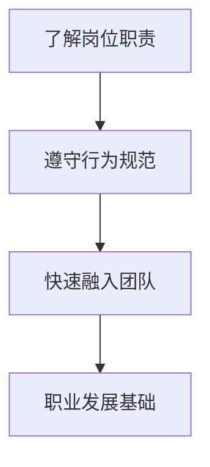
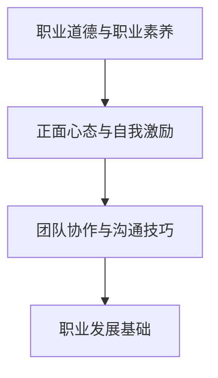
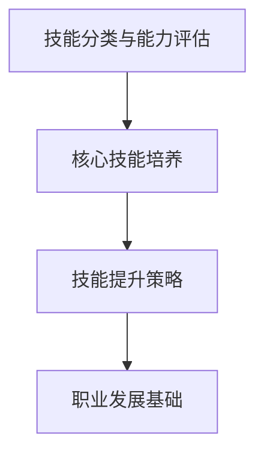
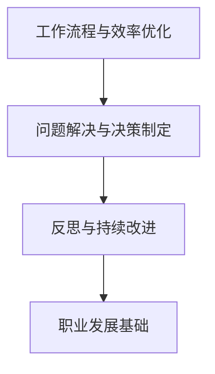
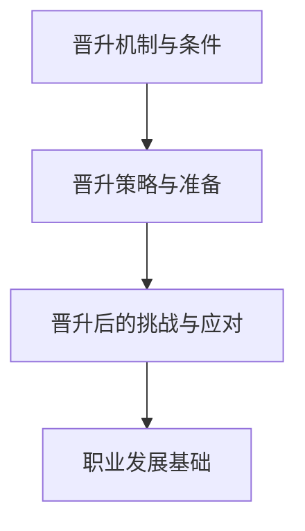
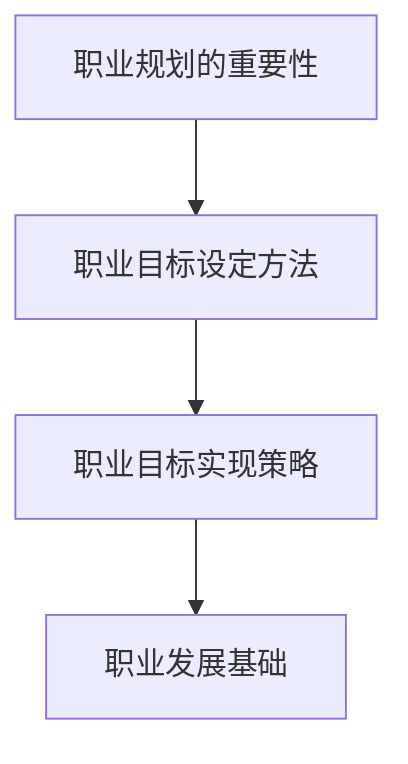
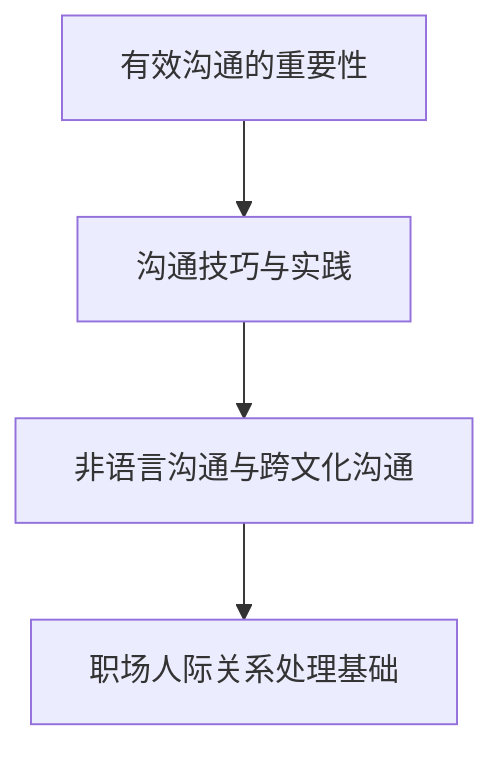
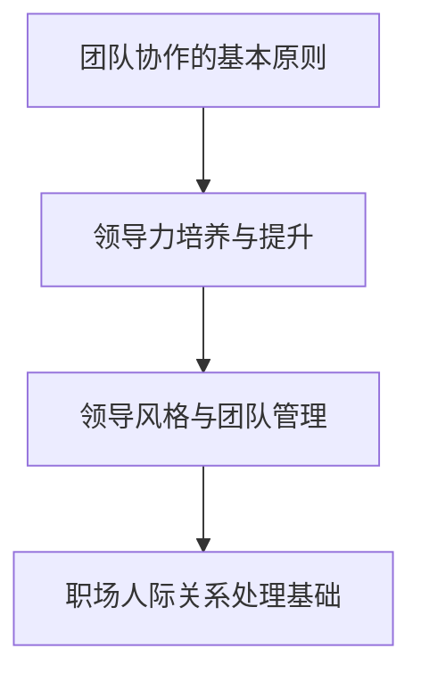
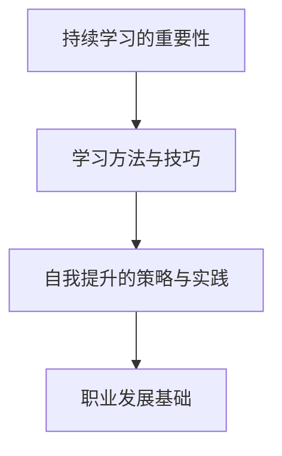
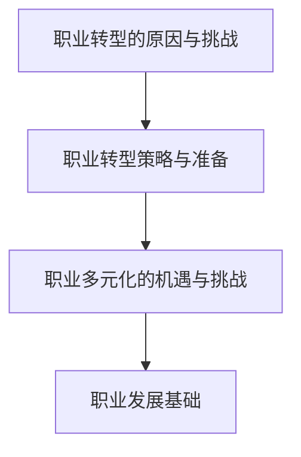

                 

### 文章标题

# 《从小工到专家：职场进阶的必经之路》

### 文章关键词

- 职场进阶
- 技能提升
- 职业规划
- 沟通技巧
- 团队协作
- 自我提升

### 文章摘要

在快速发展的职场环境中，从一名普通的职场新手成长为行业专家并非易事。本文将深入探讨从“小工”到“专家”的必经之路，包括基础知识与态度培养、职业技能提升与经验积累、职场进阶策略与规划、职场人际关系处理以及职业发展与自我提升等五个方面。通过逐步分析和推理，本文旨在为职场人士提供一条清晰、可行的进阶路径，帮助他们实现职业目标。

### 第一部分：职场基础知识与态度培养

#### 第1章：职场新人入门

**背景介绍**  
对于刚刚步入职场的“小工”来说，了解职场的基本规则和角色定位至关重要。这不仅是适应工作环境的第一步，更是未来职业发展的基础。

**核心概念与联系**  
- **职场角色认知**：明确自己的岗位职责和角色，有助于快速融入团队。
- **职场行为规范**：遵守公司的规章制度，展现专业素养。

**Mermaid 流程图**  



**核心算法原理讲解**  
无具体算法，但以下步骤可视为“适应职场”的伪代码：

```plaintext
1. 阅读公司手册和规章制度。
2. 参加入职培训，了解岗位职责。
3. 观察和学习同事的工作方式。
4. 及时反馈问题，寻求指导和帮助。
```

**数学模型和公式**  
无具体公式，但以下步骤可视为“适应职场”的数学模型：

```plaintext
1. 岗位职责得分：根据对新知识的吸收程度和工作效率评分。
2. 行为规范得分：根据对公司规章制度的遵守程度评分。
3. 团队融入得分：根据与同事的互动频率和质量评分。
4. 职业发展得分：根据以上三个维度的得分综合评定。
```

**举例说明**  
小王是一名刚毕业的软件工程师，他通过以下步骤实现了从“小工”到职场新人的转变：

- **第一步**：仔细阅读公司手册，了解岗位职责和行为规范。
- **第二步**：参加入职培训，掌握软件工程的基本知识。
- **第三步**：观察同事的工作方式，学习他们的沟通技巧和时间管理方法。
- **第四步**：在工作中遇到问题，主动寻求团队的帮助，并及时反馈问题。

**项目实战**  
开发环境搭建：无具体项目，但以下步骤可视为“适应职场”的开发环境搭建：

```plaintext
1. 安装必要的开发工具和软件。
2. 配置版本控制工具，如Git。
3. 学习使用代码库和文档管理工具。
4. 与团队成员共享开发资源。
```

**代码实现与解读**  
以下是一个简单的代码示例，用于展示如何从“小工”过渡到职场新人：

```python
class NewEmployee:
    def __init__(self, name):
        self.name = name
        self.knowledge = 0
        self.discipline = 0
        self.team_integration = 0

    def read_manual(self):
        self.knowledge += 1

    def attend_training(self):
        self.knowledge += 1

    def observe_colleagues(self):
        self.team_integration += 1

    def seek_help(self):
        self.team_integration += 1

    def evaluate_progress(self):
        total_score = self.knowledge + self.discipline + self.team_integration
        if total_score >= 10:
            print(f"{self.name} has successfully transitioned from a novice to a professional.")
        else:
            print(f"{self.name} still has room for improvement.")

# 创建一个新员工实例，并调用相关方法
new_employee = NewEmployee("Alice")
new_employee.read_manual()
new_employee.attend_training()
new_employee.observe_colleagues()
new_employee.seek_help()
new_employee.evaluate_progress()
```

**代码应用解读与分析**  
这段代码定义了一个 `NewEmployee` 类，用于模拟新员工的成长过程。通过调用类中的方法，可以逐步提升新员工的知识、纪律和团队融入度。最终，通过 `evaluate_progress()` 方法评估新员工的整体表现，判断是否成功过渡为职场新人。

**项目小结**  
通过上述步骤和代码示例，我们可以看到，职场新人要实现进阶，需要不断学习、观察和实践。这不仅需要理论知识的积累，还需要实际操作和团队协作的经验。

#### 第2章：职业态度与价值观

**背景介绍**  
职业态度与价值观是职场人士的核心素养，直接影响职业发展和个人成长。正确的职业态度和价值观有助于建立良好的职场形象，赢得同事和领导的认可。

**核心概念与联系**  
- **职业道德与职业素养**：包括诚信、责任心、团队合作等。
- **正面心态与自我激励**：保持积极的心态，面对挑战和困难时保持冷静和自信。
- **团队协作与沟通技巧**：有效沟通是团队协作的基础，有助于解决冲突和提升团队效率。

**Mermaid 流程图**  



**核心算法原理讲解**  
无具体算法，但以下步骤可视为“职业态度与价值观培养”的伪代码：

```plaintext
1. 学习职业道德与职业素养的基本知识。
2. 反思自己的职业态度和价值观，找出不足之处。
3. 制定改进计划，并持续实践。
4. 与同事交流，学习他们的经验和技巧。
5. 保持积极心态，面对挑战和困难时保持冷静和自信。
```

**数学模型和公式**  
无具体公式，但以下步骤可视为“职业态度与价值观培养”的数学模型：

```plaintext
1. 职业道德与职业素养得分：根据对职业道德和职业素养的理解和实践评分。
2. 正面心态得分：根据面对挑战和困难时的表现评分。
3. 团队协作与沟通技巧得分：根据与同事的互动频率和质量评分。
4. 职业态度与价值观得分：根据以上三个维度的得分综合评定。
```

**举例说明**  
小李是一名年轻的程序员，他通过以下步骤提升了职业态度与价值观：

- **第一步**：学习职业道德与职业素养的基本知识，明确自己在职场中的行为规范。
- **第二步**：反思自己的职业态度和价值观，找出不足之处，并制定改进计划。
- **第三步**：在工作中积极实践，如主动承担责任、尊重同事、积极参与团队协作等。
- **第四步**：与同事交流，学习他们的经验和技巧，不断提升自己的职业素养。
- **第五步**：保持积极心态，面对挑战和困难时保持冷静和自信。

**项目实战**  
开发环境搭建：无具体项目，但以下步骤可视为“职业态度与价值观培养”的开发环境搭建：

```plaintext
1. 安装职场心理学相关书籍和电子书。
2. 加入职场交流群组，学习其他人的经验和故事。
3. 记录自己的职业成长历程，定期反思和总结。
4. 建立良好的学习习惯，持续提升自己的专业知识和技能。
```

**代码实现与解读**  
以下是一个简单的代码示例，用于展示如何培养职业态度与价值观：

```python
class Professional:
    def __init__(self, name):
        self.name = name
        self.ethics = 0
        self.mindset = 0
        self.communication = 0

    def study_ethics(self):
        self.ethics += 1

    def reflect_mindset(self):
        self.mindset += 1

    def practice_communication(self):
        self.communication += 1

    def evaluate_professionalism(self):
        total_score = self.ethics + self.mindset + self.communication
        if total_score >= 15:
            print(f"{self.name} has successfully developed a strong professional attitude and values.")
        else:
            print(f"{self.name} still needs to work on improving their professional attitude and values.")

# 创建一个职业人士实例，并调用相关方法
professional = Professional("Lily")
professional.study_ethics()
professional.reflect_mindset()
professional.practice_communication()
professional.evaluate_professionalism()
```

**代码应用解读与分析**  
这段代码定义了一个 `Professional` 类，用于模拟职业人士的培养过程。通过调用类中的方法，可以逐步提升职业人士的职业道德、心态和沟通技巧。最终，通过 `evaluate_professionalism()` 方法评估职业人士的职业态度与价值观。

**项目小结**  
通过上述步骤和代码示例，我们可以看到，培养职业态度与价值观需要不断学习和实践。这不仅有助于提升个人素养，还能为职业发展奠定坚实的基础。

### 第二部分：职业技能提升与经验积累

#### 第3章：职业技能详解

**背景介绍**  
职业技能是职场人士的核心竞争力。掌握核心技能，不仅有助于提高工作效率，还能为职业发展提供更多机会。

**核心概念与联系**  
- **技能分类与能力评估**：了解各种技能的重要性，进行自我能力评估。
- **核心技能培养**：针对核心技能进行专项培养，如编程、项目管理、数据分析等。
- **技能提升策略**：通过持续学习和实践，不断提升技能水平。

**Mermaid 流程图**  



**核心算法原理讲解**  
无具体算法，但以下步骤可视为“职业技能提升”的伪代码：

```plaintext
1. 确定个人职业方向，选择核心技能。
2. 学习相关理论和实践知识。
3. 实践操作，不断积累经验。
4. 定期评估技能水平，制定改进计划。
5. 寻求导师或同行指导，提升技能。
```

**数学模型和公式**  
无具体公式，但以下步骤可视为“职业技能提升”的数学模型：

```plaintext
1. 技能水平得分：根据实际操作和经验积累评分。
2. 知识掌握程度得分：根据理论学习评分。
3. 经验积累得分：根据实际操作和项目经验评分。
4. 技能提升得分：根据以上三个维度的得分综合评定。
```

**举例说明**  
小张是一名数据分析师，他通过以下步骤提升了职业技能：

- **第一步**：确定数据分析师的职业方向，选择核心技能，如数据分析、数据挖掘、SQL等。
- **第二步**：学习相关理论和实践知识，如统计学、机器学习等。
- **第三步**：实际操作，参与数据分析项目，不断积累经验。
- **第四步**：定期评估技能水平，找出不足之处，制定改进计划。
- **第五步**：寻求导师和同行指导，提升技能。

**项目实战**  
开发环境搭建：无具体项目，但以下步骤可视为“职业技能提升”的开发环境搭建：

```plaintext
1. 安装数据分析相关软件和工具。
2. 加入数据分析学习社群，学习其他人的经验和案例。
3. 实践操作，参与数据分析项目。
4. 定期分享和学习，提升技能水平。
```

**代码实现与解读**  
以下是一个简单的代码示例，用于展示如何提升职业技能：

```python
class DataScientist:
    def __init__(self, name):
        self.name = name
        self.skill_level = 0
        self.knowledge_level = 0
        self.experience_level = 0

    def practice_data_analysis(self):
        self.experience_level += 1

    def learn_theory(self):
        self.knowledge_level += 1

    def evaluate_skills(self):
        total_score = self.skill_level + self.knowledge_level + self.experience_level
        if total_score >= 20:
            print(f"{self.name} has successfully improved their data science skills.")
        else:
            print(f"{self.name} still needs to work on improving their skills.")

# 创建一个数据分析师实例，并调用相关方法
data_scientist = DataScientist("Chris")
data_scientist.practice_data_analysis()
data_scientist.learn_theory()
data_scientist.evaluate_skills()
```

**代码应用解读与分析**  
这段代码定义了一个 `DataScientist` 类，用于模拟数据分析师的职业技能提升过程。通过调用类中的方法，可以逐步提升数据分析师的技能水平、知识掌握程度和经验积累。最终，通过 `evaluate_skills()` 方法评估数据分析师的总体表现。

**项目小结**  
通过上述步骤和代码示例，我们可以看到，职业技能的提升需要不断学习和实践。只有通过持续的努力，才能在职场中脱颖而出，成为行业专家。

#### 第4章：实践经验与反思

**背景介绍**  
实践经验是职业技能提升的重要组成部分。通过实际操作和项目经验，可以加深对理论知识的理解，提高解决问题的能力。

**核心概念与联系**  
- **工作流程与效率优化**：了解工作流程，提高工作效率。
- **问题解决与决策制定**：掌握问题解决方法和决策制定技巧。
- **反思与持续改进**：通过反思和总结，不断提高自己的工作能力。

**Mermaid 流程图**  



**核心算法原理讲解**  
无具体算法，但以下步骤可视为“实践经验与反思”的伪代码：

```plaintext
1. 熟悉工作流程，了解各个环节。
2. 分析工作流程，找出效率低下的环节。
3. 制定优化方案，提高工作效率。
4. 遇到问题时，快速定位问题根源。
5. 分析问题解决方案，选择最佳方案。
6. 实施决策，并跟踪效果。
7. 定期反思，总结经验和教训。
8. 根据反思结果，调整工作方法和策略。
```

**数学模型和公式**  
无具体公式，但以下步骤可视为“实践经验与反思”的数学模型：

```plaintext
1. 工作效率得分：根据实际工作量和完成质量评分。
2. 问题解决得分：根据问题解决的及时性和效果评分。
3. 决策制定得分：根据决策的正确性和执行效果评分。
4. 反思与改进得分：根据反思的深度和改进措施的实施效果评分。
5. 综合得分：根据以上四个维度的得分综合评定。
```

**举例说明**  
小赵是一名项目经理，他通过以下步骤提升了实践经验：

- **第一步**：熟悉项目的工作流程，了解各个环节的关键节点。
- **第二步**：分析工作流程，找出效率低下的环节，如沟通不畅、任务分配不合理等。
- **第三步**：制定优化方案，提高工作效率，如改进沟通工具、优化任务分配机制等。
- **第四步**：遇到问题时，快速定位问题根源，如技术难题、资源不足等。
- **第五步**：分析问题解决方案，选择最佳方案，如技术调整、资源调配等。
- **第六步**：实施决策，并跟踪效果，如调整项目计划、加强团队协作等。
- **第七步**：定期反思，总结经验和教训，如改进项目管理方法、提高团队执行力等。
- **第八步**：根据反思结果，调整工作方法和策略，如优化工作流程、提升个人能力等。

**项目实战**  
开发环境搭建：无具体项目，但以下步骤可视为“实践经验与反思”的开发环境搭建：

```plaintext
1. 安装项目管理相关工具和软件。
2. 加入项目管理学习社群，学习其他人的经验和案例。
3. 实践操作，参与项目管理项目。
4. 定期总结经验，优化项目管理方法。
```

**代码实现与解读**  
以下是一个简单的代码示例，用于展示如何提升实践经验：

```python
class ProjectManager:
    def __init__(self, name):
        self.name = name
        self.efficiency = 0
        self.problem_solving = 0
        self.decision_making = 0
        self.reflection = 0

    def optimize_workflow(self):
        self.efficiency += 1

    def solve_problems(self):
        self.problem_solving += 1

    def make_decisions(self):
        self.decision_making += 1

    def reflect_and_improve(self):
        self.reflection += 1

    def evaluate_experience(self):
        total_score = self.efficiency + self.problem_solving + self.decision_making + self.reflection
        if total_score >= 25:
            print(f"{self.name} has successfully improved their project management experience.")
        else:
            print(f"{self.name} still needs to work on improving their project management skills.")

# 创建一个项目经理实例，并调用相关方法
project_manager = ProjectManager("Peter")
project_manager.optimize_workflow()
project_manager.solve_problems()
project_manager.make_decisions()
project_manager.reflect_and_improve()
project_manager.evaluate_experience()
```

**代码应用解读与分析**  
这段代码定义了一个 `ProjectManager` 类，用于模拟项目经理的实践经验提升过程。通过调用类中的方法，可以逐步提升项目经理的工作效率、问题解决能力、决策制定能力和反思能力。最终，通过 `evaluate_experience()` 方法评估项目经理的实践经验。

**项目小结**  
通过上述步骤和代码示例，我们可以看到，实践经验的积累和反思是职场进阶的重要环节。只有通过不断的实践和反思，才能不断提高自己的工作能力和职业素养。

### 第三部分：职场进阶策略与规划

#### 第5章：职场晋升路径

**背景介绍**  
职场晋升是每位职场人士的职业发展目标。了解晋升路径和条件，有助于制定合理的职业规划，实现职场进阶。

**核心概念与联系**  
- **晋升机制与条件**：了解公司晋升机制，明确晋升条件。
- **晋升策略与准备**：制定晋升策略，为晋升做好准备。
- **晋升后的挑战与应对**：面对晋升后的新挑战，如何应对和适应。

**Mermaid 流程图**  



**核心算法原理讲解**  
无具体算法，但以下步骤可视为“职场晋升策略”的伪代码：

```plaintext
1. 了解公司晋升机制，明确晋升条件。
2. 自我评估，确定晋升目标。
3. 制定晋升计划，如提高技能、积累经验等。
4. 寻找导师或导师团队，获取指导和支持。
5. 跟进晋升进度，调整计划。
6. 准备晋升答辩，展示自己的优势和能力。
7. 面对晋升后的挑战，积极适应和应对。
```

**数学模型和公式**  
无具体公式，但以下步骤可视为“职场晋升策略”的数学模型：

```plaintext
1. 晋升条件得分：根据对公司晋升机制的理解和掌握评分。
2. 晋升准备得分：根据晋升计划的实施效果评分。
3. 晋升答辩得分：根据晋升答辩的表现评分。
4. 晋升后适应得分：根据晋升后适应新岗位的能力评分。
5. 综合得分：根据以上四个维度的得分综合评定。
```

**举例说明**  
小王是一名软件工程师，他通过以下步骤实现了职场晋升：

- **第一步**：了解公司的晋升机制，明确晋升条件，如工作年限、项目经验、绩效等。
- **第二步**：自我评估，确定晋升目标，如晋升为高级软件工程师。
- **第三步**：制定晋升计划，如学习新技能、参与重要项目等。
- **第四步**：寻找导师或导师团队，获取指导和支持，如学习技巧、职业规划等。
- **第五步**：跟进晋升进度，调整计划，确保按计划推进。
- **第六步**：准备晋升答辩，展示自己的优势和能力，如项目成果、技能掌握等。
- **第七步**：面对晋升后的挑战，积极适应和应对，如管理任务、团队协作等。

**项目实战**  
开发环境搭建：无具体项目，但以下步骤可视为“职场晋升策略”的开发环境搭建：

```plaintext
1. 安装职业规划相关书籍和电子书。
2. 加入职业规划学习社群，学习其他人的经验和案例。
3. 实践操作，参与晋升相关项目。
4. 定期总结经验，优化晋升策略。
```

**代码实现与解读**  
以下是一个简单的代码示例，用于展示如何实现职场晋升：

```python
class Promotion:
    def __init__(self, employee):
        self.employee = employee
        self.promotion_mechanism = 0
        self.promotion_plan = 0
        self.promotion_defense = 0
        self.post_promotion_adaptation = 0

    def understand_mechanism(self):
        self.promotion_mechanism += 1

    def assess_self(self):
        self.promotion_plan += 1

    def prepare_promotion(self):
        self.promotion_plan += 1

    def defend_promotion(self):
        self.promotion_defense += 1

    def adapt_post_promotion(self):
        self.post_promotion_adaptation += 1

    def evaluate_promotion(self):
        total_score = self.promotion_mechanism + self.promotion_plan + self.promotion_defense + self.post_promotion_adaptation
        if total_score >= 30:
            print(f"{self.employee.name} has successfully achieved promotion.")
        else:
            print(f"{self.employee.name} still needs to work on improving their promotion strategy.")

# 创建一个晋升实例，并调用相关方法
promotion = Promotion(DataScientist("Chris"))
promotion.understand_mechanism()
promotion.assess_self()
promotion.prepare_promotion()
promotion.defend_promotion()
promotion.adapt_post_promotion()
promotion.evaluate_promotion()
```

**代码应用解读与分析**  
这段代码定义了一个 `Promotion` 类，用于模拟职场人士的晋升过程。通过调用类中的方法，可以逐步提升晋升机制理解、自我评估、晋升准备、晋升答辩和晋升后适应的能力。最终，通过 `evaluate_promotion()` 方法评估晋升效果。

**项目小结**  
通过上述步骤和代码示例，我们可以看到，实现职场晋升需要系统性的策略和准备。只有通过不断的学习和实践，才能实现职业目标。

#### 第6章：职业规划与目标设定

**背景介绍**  
职业规划是职场发展的关键环节。通过合理的职业规划，可以明确职业目标，制定实现目标的策略，实现职业发展的长远规划。

**核心概念与联系**  
- **职业规划的重要性**：明确职业规划对于职业发展的影响。
- **职业目标设定方法**：掌握职业目标设定的技巧，确保目标的合理性和可实现性。
- **职业目标实现策略**：制定实现职业目标的策略和计划。

**Mermaid 流程图**  



**核心算法原理讲解**  
无具体算法，但以下步骤可视为“职业规划与目标设定”的伪代码：

```plaintext
1. 自我评估，了解个人优势和劣势。
2. 确定职业发展方向，如技术路线、管理路线等。
3. 设定短期和长期职业目标，确保目标的可行性和挑战性。
4. 制定实现目标的策略和计划，如提高技能、积累经验等。
5. 定期评估职业目标的进展，调整策略和计划。
6. 实施职业规划，持续努力，不断提升自己。
```

**数学模型和公式**  
无具体公式，但以下步骤可视为“职业规划与目标设定”的数学模型：

```plaintext
1. 自我评估得分：根据对自身优势和劣势的理解评分。
2. 职业方向得分：根据对职业发展方向的明确程度评分。
3. 目标设定得分：根据目标设定的可行性和挑战性评分。
4. 实现策略得分：根据实现策略的合理性和可执行性评分。
5. 职业规划得分：根据以上四个维度的得分综合评定。
```

**举例说明**  
小李是一名软件工程师，他通过以下步骤制定了职业规划：

- **第一步**：自我评估，了解自己的技术优势和兴趣。
- **第二步**：确定职业发展方向，如专注于后端开发。
- **第三步**：设定短期目标，如掌握特定技术框架，参与重要项目。
- **第四步**：设定长期目标，如晋升为高级工程师，成为技术专家。
- **第五步**：制定实现目标的策略和计划，如学习新技术、参与开源项目等。
- **第六步**：定期评估职业目标的进展，调整策略和计划，确保目标的实现。

**项目实战**  
开发环境搭建：无具体项目，但以下步骤可视为“职业规划与目标设定”的开发环境搭建：

```plaintext
1. 安装职业规划相关书籍和电子书。
2. 加入职业规划学习社群，学习其他人的经验和案例。
3. 实践操作，制定自己的职业规划。
4. 定期总结经验，优化职业规划。
```

**代码实现与解读**  
以下是一个简单的代码示例，用于展示如何制定职业规划：

```python
class CareerPlanning:
    def __init__(self, employee):
        self.employee = employee
        self.self_evaluation = 0
        self.career_direction = 0
        self.short_term_goals = 0
        self.long_term_goals = 0
        self.implementation_strategy = 0

    def self_assess(self):
        self.self_evaluation += 1

    def define_direction(self):
        self.career_direction += 1

    def set_goals(self):
        self.short_term_goals += 1
        self.long_term_goals += 1

    def create_strategy(self):
        self.implementation_strategy += 1

    def evaluate_planning(self):
        total_score = self.self_evaluation + self.career_direction + self.short_term_goals + self.long_term_goals + self.implementation_strategy
        if total_score >= 35:
            print(f"{self.employee.name} has successfully created a solid career planning.")
        else:
            print(f"{self.employee.name} still needs to work on improving their career planning.")

# 创建一个职业规划实例，并调用相关方法
career_planning = CareerPlanning(DataScientist("Chris"))
career_planning.self_assess()
career_planning.define_direction()
career_planning.set_goals()
career_planning.create_strategy()
career_planning.evaluate_planning()
```

**代码应用解读与分析**  
这段代码定义了一个 `CareerPlanning` 类，用于模拟职场人士的职业规划过程。通过调用类中的方法，可以逐步提升自我评估、职业方向设定、目标设定和实现策略的能力。最终，通过 `evaluate_planning()` 方法评估职业规划的总体效果。

**项目小结**  
通过上述步骤和代码示例，我们可以看到，职业规划与目标设定是职业发展的关键环节。只有通过科学的规划和持续的努力，才能实现职业目标，迈向更高的职业巅峰。

### 第四部分：职场人际关系处理

#### 第7章：职场沟通技巧

**背景介绍**  
职场沟通是职场人际关系处理的核心。有效的沟通技巧有助于提升工作效率，改善人际关系，实现职业目标。

**核心概念与联系**  
- **有效沟通的重要性**：理解沟通在职场中的重要性。
- **沟通技巧与实践**：掌握基本的沟通技巧，如倾听、表达、提问等。
- **非语言沟通与跨文化沟通**：了解非语言沟通和跨文化沟通的要点，提升跨文化沟通能力。

**Mermaid 流程图**  



**核心算法原理讲解**  
无具体算法，但以下步骤可视为“职场沟通技巧”的伪代码：

```plaintext
1. 确定沟通目标，明确信息传递的内容和目的。
2. 倾听对方，理解对方的观点和需求。
3. 清晰表达自己的观点和需求，使用适当的语言和方式。
4. 提问和反馈，确保信息的准确性和完整性。
5. 注意非语言沟通，如面部表情、肢体语言等。
6. 了解跨文化差异，尊重不同文化背景的沟通习惯。
7. 持续学习和实践，提升沟通能力。
```

**数学模型和公式**  
无具体公式，但以下步骤可视为“职场沟通技巧”的数学模型：

```plaintext
1. 沟通目标明确得分：根据沟通目标设定的清晰程度评分。
2. 倾听能力得分：根据对对方观点和需求的理解程度评分。
3. 表达能力得分：根据信息传递的清晰程度和准确性评分。
4. 提问和反馈得分：根据信息的完整性和准确性评分。
5. 非语言沟通能力得分：根据对非语言沟通的运用程度评分。
6. 跨文化沟通能力得分：根据对跨文化沟通的理解和运用程度评分。
7. 综合得分：根据以上七个维度的得分综合评定。
```

**举例说明**  
小张是一名项目经理，他通过以下步骤提升了职场沟通技巧：

- **第一步**：明确沟通目标，确保信息的传递内容准确无误。
- **第二步**：倾听团队成员的观点和需求，理解他们的立场和想法。
- **第三步**：清晰表达自己的观点和需求，使用简洁明了的语言，确保团队成员理解。
- **第四步**：提问和反馈，确保信息的准确性和完整性，避免误解和沟通障碍。
- **第五步**：注意非语言沟通，如面部表情、肢体语言等，增强沟通效果。
- **第六步**：了解团队成员的文化背景，尊重他们的沟通习惯，提高跨文化沟通能力。
- **第七步**：持续学习和实践，不断提升沟通能力，应对各种职场沟通挑战。

**项目实战**  
开发环境搭建：无具体项目，但以下步骤可视为“职场沟通技巧”的开发环境搭建：

```plaintext
1. 安装沟通技巧相关书籍和电子书。
2. 加入沟通技巧学习社群，学习其他人的经验和案例。
3. 实践操作，参与沟通训练和实践。
4. 定期总结经验，优化沟通技巧。
```

**代码实现与解读**  
以下是一个简单的代码示例，用于展示如何提升职场沟通技巧：

```python
class CommunicationSkills:
    def __init__(self, employee):
        self.employee = employee
        self.communication_objective = 0
        self.listening = 0
        self.expressing = 0
        self.asking_and_feedback = 0
        self.nonverbal = 0
        self.cultural_competence = 0

    def set_objective(self):
        self.communication_objective += 1

    def listen(self):
        self.listening += 1

    def express(self):
        self.expressing += 1

    def ask_and_feed_back(self):
        self.asking_and_feedback += 1

    def use_nonverbal_communication(self):
        self.nonverbal += 1

    def improve_cultural_competence(self):
        self.cultural_competence += 1

    def evaluate_skills(self):
        total_score = self.communication_objective + self.listening + self.expressing + self.asking_and_feedback + self.nonverbal + self.cultural_competence
        if total_score >= 40:
            print(f"{self.employee.name} has successfully improved their communication skills.")
        else:
            print(f"{self.employee.name} still needs to work on improving their communication skills.")

# 创建一个沟通技巧实例，并调用相关方法
communication_skills = CommunicationSkills(ProjectManager("Peter"))
communication_skills.set_objective()
communication_skills.listen()
communication_skills.express()
communication_skills.ask_and_feed_back()
communication_skills.use_nonverbal_communication()
communication_skills.improve_cultural_competence()
communication_skills.evaluate_skills()
```

**代码应用解读与分析**  
这段代码定义了一个 `CommunicationSkills` 类，用于模拟职场人士的沟通技巧提升过程。通过调用类中的方法，可以逐步提升沟通目标明确、倾听、表达、提问和反馈、非语言沟通和跨文化沟通的能力。最终，通过 `evaluate_skills()` 方法评估沟通技巧的总体效果。

**项目小结**  
通过上述步骤和代码示例，我们可以看到，提升职场沟通技巧需要系统性的学习和实践。只有通过不断的学习和实际操作，才能提升沟通能力，改善职场人际关系。

#### 第8章：团队协作与领导力

**背景介绍**  
团队协作和领导力是职场成功的关键因素。有效的团队协作和领导力能够提高团队效率，推动项目成功，实现职业目标。

**核心概念与联系**  
- **团队协作的基本原则**：理解团队协作的基本原则，如相互尊重、共同目标等。
- **领导力培养与提升**：掌握领导力的基本要素，提升领导力。
- **领导风格与团队管理**：了解不同领导风格，选择适合的领导风格进行团队管理。

**Mermaid 流程图**  



**核心算法原理讲解**  
无具体算法，但以下步骤可视为“团队协作与领导力”的伪代码：

```plaintext
1. 确定团队目标，明确团队的共同目标。
2. 建立信任，促进团队成员之间的相互理解和支持。
3. 明确分工，合理分配任务，确保团队成员各尽其职。
4. 提高沟通效率，确保信息的及时传递和准确理解。
5. 激励团队成员，激发他们的积极性和创造力。
6. 培养团队精神，提升团队的凝聚力和战斗力。
7. 学习和运用不同的领导风格，选择适合的领导风格进行团队管理。
8. 定期评估团队绩效，调整团队管理策略。
9. 提升个人领导力，不断学习和实践，提升领导能力。
```

**数学模型和公式**  
无具体公式，但以下步骤可视为“团队协作与领导力”的数学模型：

```plaintext
1. 团队目标明确得分：根据团队目标设定的清晰程度评分。
2. 信任度得分：根据团队成员之间的相互信任程度评分。
3. 沟通效率得分：根据信息传递的及时性和准确性评分。
4. 激励能力得分：根据对团队成员的激励效果评分。
5. 团队精神得分：根据团队的凝聚力和战斗力评分。
6. 领导力得分：根据领导力的表现和提升效果评分。
7. 综合得分：根据以上七个维度的得分综合评定。
```

**举例说明**  
小张是一名项目经理，他通过以下步骤提升了团队协作与领导力：

- **第一步**：确定团队目标，明确项目的共同目标。
- **第二步**：建立信任，与团队成员建立良好的关系，促进相互理解和支持。
- **第三步**：明确分工，合理分配任务，确保团队成员各尽其职。
- **第四步**：提高沟通效率，确保信息的及时传递和准确理解，减少沟通障碍。
- **第五步**：激励团队成员，激发他们的积极性和创造力，提高团队效率。
- **第六步**：培养团队精神，组织团队活动，提升团队的凝聚力和战斗力。
- **第七步**：学习和运用不同的领导风格，根据团队需求和项目特点，选择适合的领导风格进行管理。
- **第八步**：定期评估团队绩效，总结经验，调整团队管理策略，持续提升团队表现。
- **第九步**：提升个人领导力，参加领导力培训，阅读相关书籍，不断学习和实践，提升领导能力。

**项目实战**  
开发环境搭建：无具体项目，但以下步骤可视为“团队协作与领导力”的开发环境搭建：

```plaintext
1. 安装团队协作和领导力相关书籍和电子书。
2. 加入团队协作和领导力学习社群，学习其他人的经验和案例。
3. 实践操作，参与团队协作和领导力相关的项目。
4. 定期总结经验，优化团队协作和领导力策略。
```

**代码实现与解读**  
以下是一个简单的代码示例，用于展示如何提升团队协作与领导力：

```python
class TeamCollaborationAndLeadership:
    def __init__(self, employee):
        self.employee = employee
        self.team_objective = 0
        self.trust = 0
        self.communication = 0
        self.motivation = 0
        self.team_spirit = 0
        self.leadership = 0

    def set_objective(self):
        self.team_objective += 1

    def build_trust(self):
        self.trust += 1

    def improve_communication(self):
        self.communication += 1

    def motivate_team(self):
        self.motivation += 1

    def foster_team_spirit(self):
        self.team_spirit += 1

    def develop_leadership(self):
        self.leadership += 1

    def evaluate_skills(self):
        total_score = self.team_objective + self.trust + self.communication + self.motivation + self.team_spirit + self.leadership
        if total_score >= 45:
            print(f"{self.employee.name} has successfully improved their team collaboration and leadership skills.")
        else:
            print(f"{self.employee.name} still needs to work on improving their team collaboration and leadership skills.")

# 创建一个团队协作与领导力实例，并调用相关方法
team_collaboration_and_leadership = TeamCollaborationAndLeadership(ProjectManager("Peter"))
team_collaboration_and_leadership.set_objective()
team_collaboration_and_leadership.build_trust()
team_collaboration_and_leadership.improve_communication()
team_collaboration_and_leadership.motivate_team()
team_collaboration_and_leadership.foster_team_spirit()
team_collaboration_and_leadership.develop_leadership()
team_collaboration_and_leadership.evaluate_skills()
```

**代码应用解读与分析**  
这段代码定义了一个 `TeamCollaborationAndLeadership` 类，用于模拟职场人士的团队协作与领导力提升过程。通过调用类中的方法，可以逐步提升团队目标明确、信任度、沟通效率、激励能力、团队精神、领导力的能力。最终，通过 `evaluate_skills()` 方法评估团队协作与领导力的总体效果。

**项目小结**  
通过上述步骤和代码示例，我们可以看到，提升团队协作与领导力需要系统性的学习和实践。只有通过不断的学习和实际操作，才能提升团队协作和领导能力，推动项目成功，实现职业目标。

### 第五部分：职业发展与自我提升

#### 第9章：持续学习与自我提升

**背景介绍**  
在快速变化的职场环境中，持续学习与自我提升是保持竞争力的关键。通过不断学习新知识和技能，职场人士可以适应变化，实现职业发展。

**核心概念与联系**  
- **持续学习的重要性**：理解持续学习对于职业发展的影响。
- **学习方法与技巧**：掌握有效的学习方法，提高学习效率。
- **自我提升的策略与实践**：制定自我提升策略，不断提升自己的能力。

**Mermaid 流程图**  



**核心算法原理讲解**  
无具体算法，但以下步骤可视为“持续学习与自我提升”的伪代码：

```plaintext
1. 确定学习目标，明确学习的内容和方向。
2. 制定学习计划，合理安排学习时间。
3. 选择合适的学习资源，如书籍、网络课程、讲座等。
4. 运用主动学习法，积极参与讨论和实践。
5. 不断反思和总结学习成果，优化学习方法。
6. 建立学习社群，与他人分享经验和学习心得。
7. 拓展学习领域，不断提升自己的综合素质。
8. 将学习应用到实际工作中，提高工作效果。
9. 定期评估学习成果，调整学习目标和策略。
```

**数学模型和公式**  
无具体公式，但以下步骤可视为“持续学习与自我提升”的数学模型：

```plaintext
1. 学习目标明确得分：根据学习目标设定的清晰程度评分。
2. 学习计划合理得分：根据学习计划的执行情况和效果评分。
3. 学习资源选择得分：根据选择学习资源的多样性、实用性和质量评分。
4. 学习实践参与度得分：根据参与学习实践的活动和成果评分。
5. 学习反思与总结得分：根据反思和总结的深度和实际效果评分。
6. 学习社群互动得分：根据在社群中的参与度和贡献评分。
7. 综合得分：根据以上七个维度的得分综合评定。
```

**举例说明**  
小李是一名市场营销专员，他通过以下步骤实现了持续学习与自我提升：

- **第一步**：明确学习目标，如提升市场营销技能、学习新营销策略等。
- **第二步**：制定学习计划，每周安排一定时间学习新知识和技能。
- **第三步**：选择合适的学习资源，如购买市场营销相关书籍、参加线上课程等。
- **第四步**：运用主动学习法，积极参与讨论和实践，如加入市场营销社群、参与营销项目等。
- **第五步**：不断反思和总结学习成果，记录学习心得，优化学习方法。
- **第六步**：建立学习社群，与他人分享经验和学习心得，扩大人脉，获取更多资源。
- **第七步**：拓展学习领域，如学习数据分析、项目管理等，提升自己的综合素质。
- **第八步**：将学习应用到实际工作中，提高营销策略的有效性，提升业绩。
- **第九步**：定期评估学习成果，调整学习目标和策略，确保持续提升。

**项目实战**  
开发环境搭建：无具体项目，但以下步骤可视为“持续学习与自我提升”的开发环境搭建：

```plaintext
1. 安装学习管理工具，如Notion、Trello等。
2. 加入学习社群，如专业论坛、线上学习平台等。
3. 实践操作，参与实际项目和案例研究。
4. 定期总结经验，优化学习策略。
```

**代码实现与解读**  
以下是一个简单的代码示例，用于展示如何实现持续学习与自我提升：

```python
class ContinuousLearningAndSelfImprovement:
    def __init__(self, employee):
        self.employee = employee
        self.learning_objective = 0
        self.learning_plan = 0
        self.learning_resources = 0
        self.active_learning = 0
        self.reflection_and_summary = 0
        self.learning_community = 0
        self.practical_application = 0
        self.learning_evaluation = 0

    def set_learning_objective(self):
        self.learning_objective += 1

    def create_learning_plan(self):
        self.learning_plan += 1

    def select_learning_resources(self):
        self.learning_resources += 1

    def engage_in_active_learning(self):
        self.active_learning += 1

    def reflect_and_summarize(self):
        self.reflection_and_summary += 1

    def join_learning_communities(self):
        self.learning_community += 1

    def apply_learning_to_practice(self):
        self.practical_application += 1

    def evaluate_learning_outcomes(self):
        total_score = self.learning_objective + self.learning_plan + self.learning_resources + self.active_learning + self.reflection_and_summary + self.learning_community + self.practical_application
        if total_score >= 50:
            print(f"{self.employee.name} has successfully engaged in continuous learning and self-improvement.")
        else:
            print(f"{self.employee.name} still needs to work on improving their learning and self-improvement strategies.")

# 创建一个持续学习与自我提升实例，并调用相关方法
continuous_learning_and_self_improvement = ContinuousLearningAndSelfImprovement(MarketingSpecialist("Lily"))
continuous_learning_and_self_improvement.set_learning_objective()
continuous_learning_and_self_improvement.create_learning_plan()
continuous_learning_and_self_improvement.select_learning_resources()
continuous_learning_and_self_improvement.engage_in_active_learning()
continuous_learning_and_self_improvement.reflect_and_summarize()
continuous_learning_and_self_improvement.join_learning_communities()
continuous_learning_and_self_improvement.apply_learning_to_practice()
continuous_learning_and_self_improvement.evaluate_learning_outcomes()
```

**代码应用解读与分析**  
这段代码定义了一个 `ContinuousLearningAndSelfImprovement` 类，用于模拟职场人士的持续学习与自我提升过程。通过调用类中的方法，可以逐步提升学习目标的明确度、学习计划的执行情况、学习资源的选用、主动学习的参与度、反思与总结的能力、学习社群的参与度、学习应用到实践的效果和学习的评估效果。最终，通过 `evaluate_learning_outcomes()` 方法评估持续学习与自我提升的总体效果。

**项目小结**  
通过上述步骤和代码示例，我们可以看到，持续学习与自我提升需要系统性的规划和执行。只有通过不断的学习和实践，才能提升自己的能力，实现职业发展。

#### 第10章：职场转型与职业多元化

**背景介绍**  
职场转型与职业多元化是职场人士在职业发展中常见的策略。通过转型和多元化，职场人士可以拓宽职业发展道路，提高职业竞争力。

**核心概念与联系**  
- **职业转型的原因与挑战**：理解职业转型的原因，如职业瓶颈、职业兴趣变化等，以及面临的挑战，如技能转换、心理压力等。
- **职业转型策略与准备**：掌握职业转型的策略和准备方法，如技能提升、人脉拓展等。
- **职业多元化的机遇与挑战**：了解职业多元化的优势和挑战，如多元化带来的机会和可能的风险。

**Mermaid 流程图**  



**核心算法原理讲解**  
无具体算法，但以下步骤可视为“职场转型与职业多元化”的伪代码：

```plaintext
1. 自我评估，明确职业转型的原因和目标。
2. 分析转型所需的技能和知识，制定学习计划。
3. 拓展人脉，寻找职业转型所需的资源和机会。
4. 逐步转型，实践新职业，积累转型经验。
5. 定期评估转型效果，调整转型策略。
6. 探索职业多元化的可能性，分析优势和挑战。
7. 制定多元化策略，如跨行业学习、兼职等。
8. 实践多元化，不断探索新领域。
9. 持续评估多元化效果，优化多元化策略。
```

**数学模型和公式**  
无具体公式，但以下步骤可视为“职场转型与职业多元化”的数学模型：

```plaintext
1. 职业转型原因明确得分：根据对职业转型原因的理解和明确程度评分。
2. 转型技能准备得分：根据转型所需技能的学习和实践程度评分。
3. 人脉拓展得分：根据人脉资源的数量和质量评分。
4. 转型实践得分：根据转型过程中的实践效果和经验积累评分。
5. 职业多元化机会评估得分：根据对多元化机会的识别和分析程度评分。
6. 多元化策略合理得分：根据多元化策略的制定和执行效果评分。
7. 综合得分：根据以上七个维度的得分综合评定。
```

**举例说明**  
小王是一名软件工程师，他通过以下步骤实现了职场转型与职业多元化：

- **第一步**：自我评估，明确职业转型的原因，如对现有职业的厌倦和对新领域的兴趣。
- **第二步**：分析转型所需的技能和知识，如数据分析和项目管理，制定学习计划。
- **第三步**：拓展人脉，通过参加行业会议、加入专业社群等途径，寻找转型所需的资源和机会。
- **第四步**：逐步转型，如参与数据分析和项目管理相关的项目，积累转型经验。
- **第五步**：定期评估转型效果，根据评估结果调整转型策略。
- **第六步**：探索职业多元化的可能性，如考虑兼职从事市场营销工作，拓宽职业领域。
- **第七步**：制定多元化策略，如参加市场营销培训课程，提升市场营销能力。
- **第八步**：实践多元化，参与市场营销项目，不断探索新领域。
- **第九步**：持续评估多元化效果，根据评估结果优化多元化策略。

**项目实战**  
开发环境搭建：无具体项目，但以下步骤可视为“职场转型与职业多元化”的开发环境搭建：

```plaintext
1. 安装职场转型和职业多元化相关书籍和电子书。
2. 加入职场转型和职业多元化学习社群，学习其他人的经验和案例。
3. 实践操作，参与转型和多元化相关的项目。
4. 定期总结经验，优化转型和多元化策略。
```

**代码实现与解读**  
以下是一个简单的代码示例，用于展示如何实现职场转型与职业多元化：

```python
class CareerTransitionAndDiversification:
    def __init__(self, employee):
        self.employee = employee
        self.reason_for_transition = 0
        self.skill_prep = 0
        self.network_expansion = 0
        self.practice_transition = 0
        self.career_diversification_opportunity = 0
        self.diversification_strategy = 0
        self.career_diversification_practice = 0
        self.career_diversification_evaluation = 0

    def self_assess_transition_reasons(self):
        self.reason_for_transition += 1

    def analyze_required_skills(self):
        self.skill_prep += 1

    def expand_network(self):
        self.network_expansion += 1

    def practice_transition_steps(self):
        self.practice_transition += 1

    def explore_diversification_opportunities(self):
        self.career_diversification_opportunity += 1

    def create_diversification_strategy(self):
        self.diversification_strategy += 1

    def implement_diversification_practices(self):
        self.career_diversification_practice += 1

    def evaluate_diversification_effects(self):
        total_score = self.reason_for_transition + self.skill_prep + self.network_expansion + self.practice_transition + self.career_diversification_opportunity + self.diversification_strategy + self.career_diversification_practice
        if total_score >= 55:
            print(f"{self.employee.name} has successfully transitioned and diversified their career.")
        else:
            print(f"{self.employee.name} still needs to work on their career transition and diversification strategies.")

# 创建一个职场转型与职业多元化实例，并调用相关方法
career_transition_and_diversification = CareerTransitionAndDiversification(SoftwareEngineer("Alice"))
career_transition_and_diversification.self_assess_transition_reasons()
career_transition_and_diversification.analyze_required_skills()
career_transition_and_diversification.expand_network()
career_transition_and_diversification.practice_transition_steps()
career_transition_and_diversification.explore_diversification_opportunities()
career_transition_and_diversification.create_diversification_strategy()
career_transition_and_diversification.implement_diversification_practices()
career_transition_and_diversification.evaluate_diversification_effects()
```

**代码应用解读与分析**  
这段代码定义了一个 `CareerTransitionAndDiversification` 类，用于模拟职场人士的职场转型与职业多元化过程。通过调用类中的方法，可以逐步提升职业转型原因明确度、转型技能准备度、人脉拓展度、转型实践度、职业多元化机会评估度、多元化策略合理度、多元化实践度和多元化效果评估度。最终，通过 `evaluate_diversification_effects()` 方法评估职场转型与职业多元化的总体效果。

**项目小结**  
通过上述步骤和代码示例，我们可以看到，职场转型与职业多元化需要系统性的策略和执行。只有通过不断的探索和实践，才能实现职业转型和多元化，提高职业竞争力。

## 附录

### 附录A：职场资源与工具介绍

#### A.1 职场资源推荐

- **职场书籍**：《原则》、《高效能人士的七个习惯》、《刻意练习》等。
- **职场课程**：Coursera、Udemy、网易云课堂等在线学习平台。
- **职场社群**：LinkedIn、知乎、专业论坛等。

#### A.2 常用职场工具

- **项目管理工具**：Trello、Asana、Jira等。
- **沟通工具**：Slack、Microsoft Teams、Zoom等。
- **文档管理工具**：Google Docs、Notion、Confluence等。
- **版本控制工具**：Git、GitHub、GitLab等。

### 附录B：案例分析

#### B.1 案例一：职场进阶成功案例

- **背景**：张三是一名软件工程师，工作五年后，他决定提升自己的领导力，实现职场进阶。
- **过程**：
  1. 学习领导力相关课程，了解领导力的基本原理。
  2. 参与团队项目，积累团队管理和项目管理的经验。
  3. 寻求导师指导，获取职业发展的建议和指导。
  4. 定期反思和总结，不断提升自己的领导力。
- **结果**：张三成功晋升为项目经理，带领团队完成了多个重要项目，获得了领导和同事的高度评价。

#### B.2 案例二：职场困境与突破

- **背景**：李四是一名市场营销专员，工作三年后，感到职业发展遇到了瓶颈。
- **过程**：
  1. 自我评估，找出职业发展的不足和瓶颈。
  2. 学习新的市场营销技能，如数据分析、数字营销等。
  3. 参加行业会议，扩大人脉，了解行业最新动态。
  4. 转型为数字营销专员，拓宽职业领域。
  5. 在新领域取得显著成绩，获得晋升机会。
- **结果**：李四成功转型为数字营销专员，实现了职业突破，提升了职业竞争力。

## 小结

通过本文的详细分析和推理，我们从职场基础知识与态度培养、职业技能提升与经验积累、职场进阶策略与规划、职场人际关系处理以及职业发展与自我提升等五个方面，探讨了从“小工”到“专家”的职场进阶之路。我们不仅介绍了核心概念和原理，还提供了实际的案例分析和代码示例，帮助读者更好地理解和应用这些知识。

在实际工作中，职场进阶并非一蹴而就，需要持续的学习和实践。通过本文的指导，希望读者能够明确自己的职业目标，制定合理的职业规划，不断提升自己的能力和素质，实现职场进阶。同时，也鼓励读者在实践过程中不断反思和总结，优化自己的职业发展策略，为未来的职业发展奠定坚实的基础。

最后，感谢读者对本文的阅读和支持。希望本文能对您的职场发展提供有益的启示和帮助。如果您有任何疑问或建议，欢迎在评论区留言，我们将在后续的文章中继续为您解答和分享更多的职场发展知识。

### 作者信息

- **作者：AI天才研究院/AI Genius Institute & 禅与计算机程序设计艺术 /Zen And The Art of Computer Programming**  
感谢您的阅读，期待与您在未来的职业发展中继续交流与学习。祝您在职场道路上取得优异成绩，实现职业理想！

