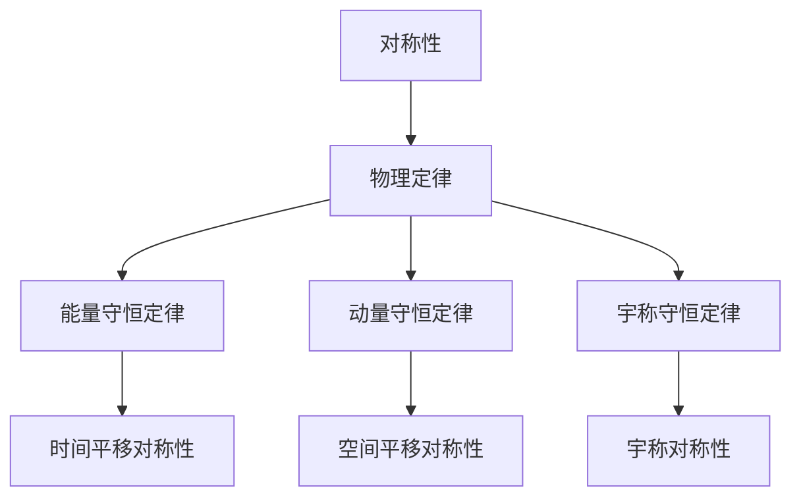
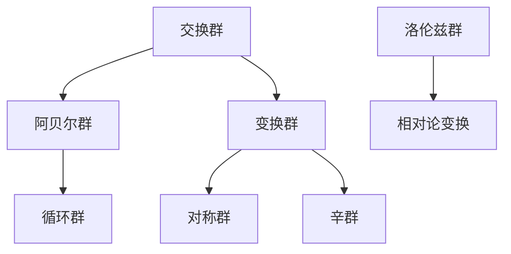
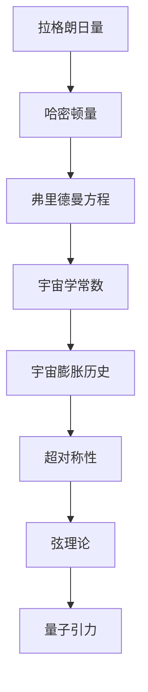

                 

## 引言

### 宇宙的多样性与数学的魅力

宇宙，这个广袤无垠的宇宙，从微观的粒子世界到宏观的星系结构，展现出惊人的多样性和复杂性。然而，在科学家们深入研究宇宙的过程中，他们发现了一个奇妙的现象：宇宙中的许多现象都可以通过数学语言进行精确描述和统一解释。数学，这座通向宇宙奥秘的桥梁，成为了科学家们理解宇宙的关键工具。

从微观角度来看，基本粒子的行为可以用量子力学来描述，这些粒子遵循着复杂的数学规则，展现出波粒二象性、叠加态和纠缠态等现象。而当我们放大视角，从宏观角度观察宇宙时，宇宙的大尺度结构、膨胀过程以及宇宙背景辐射等，都可以用数学公式进行精确描述。例如，弗里德曼方程描述了宇宙的膨胀，而宇宙微波背景辐射的观测数据则验证了这一方程的准确性。

本文将带领读者从微观到宏观，一步步探索宇宙的数学统一。我们将会首先介绍微观世界的数学探索，包括基本粒子的数学描述、对称性与群论、粒子态的数学描述以及微观世界的数学模型。接着，我们将转向宏观宇宙的数学描述，探讨宇宙学中的基本概念、宇宙的大尺度结构、宇宙演化的数学描述。最后，我们将探讨宇宙统一理论的数学探索，包括大统一理论与超对称、宇宙统一理论的数学框架以及未来的展望。

通过本文的阅读，读者将能够了解到数学在宇宙探索中的关键作用，理解宇宙中的基本规律和现象，以及数学模型如何帮助我们更深入地理解这个复杂而美丽的宇宙。

## 第一部分 微观世界的数学探索

### 第1章 基本粒子的数学描述

#### 1.1 基本粒子的定义与分类

基本粒子是构成物质的最基本单元，它们在物理学中扮演着至关重要的角色。根据标准模型，基本粒子分为两类：费米子和玻色子。费米子是半整数自旋的粒子，例如电子、夸克和中微子，它们遵循泡利不相容原理。玻色子则是整数自旋的粒子，例如光子、W和Z玻色子，它们在强相互作用和电磁相互作用中起作用。

基本粒子的分类和性质为物理学的进一步研究奠定了基础。例如，电子是构成原子的重要粒子，而夸克则参与了强相互作用的传递。通过深入研究这些基本粒子的行为，科学家们希望能够揭示物质世界的本质。

#### 1.2 粒子物理学中的数学工具

粒子物理学中的数学工具主要包括量子场论、对称性和群论等。量子场论是描述粒子相互作用的基本框架，它将量子力学和狭义相对论结合在一起。在量子场论中，粒子被视为场的激发态，而场则描述了粒子存在的空间。

对称性在粒子物理学中具有重要意义。物理定律在某种对称性下保持不变，这意味着对称性可以揭示物理现象的深层规律。群论是研究对称性的数学工具，通过群论可以定义和操作对称性，从而揭示物理系统的对称性质。

例如，**电磁相互作用**由洛伦兹群（\(SO(1,3)\)）描述，这个群包含了空间和时间变换的对称性。洛伦兹群反映了电磁力和弱相互作用的统一。**强相互作用**则由SU(3)群描述，这个群对应着夸克的色荷。

下面是一个简单的伪代码示例，展示了如何使用群论来描述对称性：

```python
class Group:
    def __init__(self, elements, operation):
        self.elements = elements
        self.operation = operation

    def apply(self, g1, g2):
        return self.operation(g1, g2)

# 假设我们有一个元素集合 {1, 2, 3}，并定义一个加法操作
group = Group({1, 2, 3}, operation=lambda x, y: x + y)

# 应用群操作
g1 = group.apply(1, 2)
g2 = group.apply(g1, 3)

print(g2)  # 输出：6
```

#### 1.3 粒子相互作用与量子场论

量子场论（QFT）是描述基本粒子相互作用的主要数学工具。在QFT中，粒子被视为场的激发态，而场则描述了粒子存在的空间。量子场论的核心思想是将量子力学与相对论结合在一起，以描述粒子在时空中的行为。

量子场论中的基本方程是拉格朗日量（Lagrangian）和哈密顿量（Hamiltonian）。拉格朗日量是一个关于场变量及其导数的函数，它定义了系统的动力学。通过变分原理，可以导出系统的运动方程。

以下是一个简化的伪代码示例，展示了如何使用拉格朗日量来描述粒子的运动：

```python
def lagrangian(field, derivative_field):
    # 定义拉格朗日量
    L = (1/2) * (derivative_field**2) - V(field)
    return L

def hamiltonian(lagrangian, field, derivative_field):
    # 定义哈密顿量
    H = (1/2) * (derivative_field**2) + V(field)
    return H

field = "phi"
derivative_field = "d(phi)/dt"

L = lagrangian(field, derivative_field)
H = hamiltonian(L, field, derivative_field)

print("Lagrangian:", L)
print("Hamiltonian:", H)
```

在量子场论中，粒子相互作用通过相互作用项（interaction terms）来描述。这些相互作用项将多个场变量联系起来，从而描述粒子之间的相互作用。

例如，在电磁相互作用中，电荷和磁场通过麦克斯韦方程组来描述。麦克斯韦方程组是一个包含相互作用项的方程组，它描述了电磁场的传播和粒子之间的相互作用。

总的来说，量子场论为粒子物理学提供了一个统一的数学框架，通过它我们可以描述基本粒子的行为和相互作用。这使得量子场论成为粒子物理学中不可或缺的工具。

### 第2章 对称性与群论

#### 2.1 对称性与物理定律

对称性是物理学中一个重要的概念，它反映了物理系统在某种变换下保持不变的性质。对称性可以分为两类：连续对称性和离散对称性。连续对称性指的是物理系统在连续变换下保持不变，而离散对称性则是指物理系统在离散变换下保持不变。

物理定律在某种对称性下保持不变，这是对称性在物理学中的核心思想。一个典型的例子是能量守恒定律，它表明在一个封闭系统中，能量总量是守恒的，不受时间变化和空间位置变化的影响。这种守恒性正是由于物理系统具有时间平移对称性。

同样地，动量守恒定律也依赖于物理系统的空间平移对称性。在一个没有外力作用的系统中，动量是守恒的，这意味着系统的总动量在空间中保持不变。

在量子力学中，对称性与守恒定律的关系表现得更加明显。量子力学中的对称性通常与量子态的变换有关。例如，时间平移对称性对应着能量守恒定律，空间平移对称性对应着动量守恒定律，而宇称对称性则对应着宇称守恒定律。

对称性与物理定律的关系可以通过数学工具，如群论，来形式化描述。群论是研究对称性的数学分支，它通过定义和操作群来描述对称性。一个群由一组元素及其组合规则构成，群中的每个元素代表一种对称变换。

在物理学中，常见的群包括洛伦兹群、杨 - 米尔斯群和苏利文 - 奥卡姆群等。这些群描述了物理系统中对称性的不同方面，从而揭示了物理定律的深层次结构。

下面是一个使用Mermaid流程图来展示对称性与守恒定律关系的示例：



通过这个流程图，我们可以清晰地看到对称性与物理定律之间的联系。每个守恒定律都对应着一种特定的对称性，这些对称性揭示了物理系统的内在规律。

总的来说，对称性是物理学中一个核心概念，它通过守恒定律揭示了物理系统的本质规律。数学工具，如群论，为我们提供了形式化描述对称性的方法，从而帮助我们更好地理解物理世界。

#### 2.2 群论的基本概念

群论是研究对称性的数学工具，通过定义和操作群来描述对称性。在物理学中，群论被广泛应用于量子力学、相对论和粒子物理学等领域。理解群论的基本概念对于深入理解物理系统中的对称性至关重要。

首先，群的定义。一个群是由一组元素及其组合规则构成的一个集合。群必须满足以下四个基本性质：

1. **封闭性**：对于群中的任意两个元素 \(a\) 和 \(b\)，它们的组合 \(a \cdot b\) 仍然属于该群。
2. **结合律**：对于群中的任意三个元素 \(a\)、\(b\) 和 \(c\)，有 \(a \cdot (b \cdot c) = (a \cdot b) \cdot c\)。
3. **单位元**：存在一个单位元 \(e\)，使得对于群中的任意元素 \(a\)，有 \(e \cdot a = a \cdot e = a\)。
4. **逆元**：对于群中的任意元素 \(a\)，存在一个逆元 \(a^{-1}\)，使得 \(a \cdot a^{-1} = a^{-1} \cdot a = e\)。

常见的群包括：

- **交换群**：如果群中的任意两个元素 \(a\) 和 \(b\) 满足 \(a \cdot b = b \cdot a\)，则该群称为交换群。
- **阿贝尔群**：如果一个交换群同时满足结合律，则称为阿贝尔群。
- **变换群**：在几何学中，变换群是指对几何对象进行变换的群。例如，旋转、平移和反射都可以构成一个变换群。

接下来，我们来看一些常见的群及其在物理学中的应用。

- **循环群**：一个循环群由一个生成元 \(g\) 及其幂构成，形式为 \(\{e, g, g^2, ..., g^n\}\)，其中 \(n\) 是群的阶。例如，整数加法群 \(\mathbb{Z}\) 是一个循环群，其生成元是1。
- **对称群**：对称群是描述一组对象所有可能排列的群。例如，一个三角形的对称群包含旋转和反射操作，共有6个元素。
- **辛群**：辛群是复数乘法的群，形式为 \(Sp(n, \mathbb{C})\)，它在量子力学和经典力学中都有重要应用。

在物理学中，群论的一个重要应用是描述物理系统的对称性。例如，洛伦兹群 \(SO(1,3)\) 描述了时空的对称性，它包含了时空中的旋转和Boost变换。洛伦兹群在相对论物理学中扮演了关键角色，因为它反映了物理定律在相对论变换下的不变性。

下面是一个简单的Mermaid流程图，展示了不同类型的群及其在物理学中的应用：



通过这个流程图，我们可以看到群论在不同物理系统中的应用，以及它们如何帮助我们理解物理系统的对称性。

总的来说，群论是物理学中一个重要的数学工具，通过它我们可以描述和操作对称性，从而揭示物理系统的深层次结构。理解群论的基本概念和不同类型的群对于深入研究物理系统具有重要意义。

#### 2.3 群论在物理学中的应用

群论在物理学中具有广泛的应用，特别是在量子场论和粒子物理学中。通过群论，我们可以将物理系统的对称性与守恒定律联系起来，从而揭示物理现象的深层规律。以下是群论在物理学中的一些重要应用：

**1. 对称性与守恒定律：**

物理系统的对称性是物理定律保持不变性的体现。例如，在量子场论中，物理系统的对称性可以通过群论来描述。一个物理系统如果具有某种对称性，那么根据Noether定理，它将对应一个守恒定律。Noether定理表明，对于每一个连续对称变换，都存在一个与之对应的守恒量。

例如，考虑一个具有时间平移对称性的系统。时间平移对称性意味着系统的物理定律不随时间变化而变化。根据Noether定理，这种对称性对应着能量守恒定律。同样，空间平移对称性对应着动量守恒定律，旋转对称性对应着角动量守恒定律。

下面是一个简单的伪代码示例，展示了如何使用Noether定理来验证对称性与守恒定律之间的关系：

```python
def noether_theorem symmetry, hamiltonian:
    # 假设 symmetry 是一个对称变换，hamiltonian 是哈密顿量
    # 验证对称性是否对应守恒定律
    energy_derivative = derivative(hamiltonian)
    return (symmetry * energy_derivative) == 0

# 假设我们有一个时间平移对称性和哈密顿量 H
symmetry = time_translation
H = hamiltonian

# 使用Noether定理验证
if noether_theorem(symmetry, H):
    print("时间平移对称性对应能量守恒定律")
else:
    print("时间平移对称性不对应能量守恒定律")
```

**2. 群表示与粒子的状态：**

在量子场论中，群表示是描述粒子状态的重要工具。群表示将群中的元素映射到线性变换上，从而描述粒子在不同对称变换下的状态。

例如，考虑洛伦兹群 \(SO(1,3)\) 的表示。洛伦兹群的表示可以将洛伦兹变换映射到线性算符上，这些算符描述了粒子在不同参考系之间的转换。

下面是一个简单的伪代码示例，展示了如何使用群表示来描述粒子的状态：

```python
from numpy.linalg import matrix_power

def lorentz_representation(lie_algebra_element):
    # 假设 lie_algebra_element 是洛伦兹群的Lie代数元素
    # 返回洛伦兹群的表示矩阵
    representation_matrix = matrix_power(lie_algebra_element, 2)
    return representation_matrix

# 假设我们有一个洛伦兹群的Lie代数元素
lie_algebra_element = lie_algebra

# 计算洛伦兹群的表示矩阵
representation_matrix = lorentz_representation(lie_algebra_element)

# 使用表示矩阵描述粒子的状态
particle_state = representation_matrix * initial_state
```

**3. 宇称与手征性：**

宇称是对称性的一种形式，它描述了物理系统在空间反射下的不变性。在量子力学中，宇称与粒子的波函数有关。如果一个粒子的波函数在空间反射下保持不变，则称该粒子具有偶宇称；如果波函数在空间反射下取反，则称该粒子具有奇宇称。

手征性是宇称的一个特殊情况，它描述了粒子在空间反射和旋转下的不变性。手征性在粒子物理学中具有重要意义，因为许多物理过程受到手征选择规则的限制。

下面是一个简单的伪代码示例，展示了如何使用宇称和手征性来描述粒子的状态：

```python
def parity(particle_state):
    # 假设 particle_state 是粒子的波函数
    # 返回粒子的宇称
    if (particle_state * space_reflection) == particle_state:
        return "even parity"
    else:
        return "odd parity"

def chirality(particle_state):
    # 假设 particle_state 是粒子的波函数
    # 返回粒子的手征性
    if (particle_state * spatial_rotation) == particle_state:
        return "left-handed chirality"
    else:
        return "right-handed chirality"

# 假设我们有一个粒子的波函数
particle_state = initial_state

# 计算粒子的宇称和手征性
parity = parity(particle_state)
chirality = chirality(particle_state)

print("Particle parity:", parity)
print("Particle chirality:", chirality)
```

总的来说，群论在物理学中具有广泛的应用，通过它我们可以将对称性与守恒定律联系起来，描述粒子的状态和相互作用，从而深入理解物理世界的本质。掌握群论的基本概念和其在物理学中的应用对于研究现代物理学具有重要意义。

### 第3章 粒子态的数学描述

#### 3.1 波函数与态叠加原理

在量子力学中，粒子态的数学描述主要依赖于波函数和态叠加原理。波函数是量子态的核心部分，它不仅描述了粒子在空间中的概率分布，还包含了粒子各种物理量的信息。

波函数通常用符号 \(\psi(x,t)\) 表示，其中 \(x\) 表示空间位置，\(t\) 表示时间。根据态叠加原理，一个量子系统的总态可以看作是多个本征态的线性组合。这意味着，一个粒子的总态可以表示为多个本征态的叠加。

态叠加原理可以形式化地表示为：

$$
\psi(x,t) = \int \psi_n(x) \langle x | n \rangle d^3x
$$

其中，\(\psi_n(x)\) 是第 \(n\) 个本征态，\(\langle x | n \rangle\) 是位置算符 \(x\) 与第 \(n\) 个本征态的内积。

波函数的平方 \(|\psi(x,t)|^2\) 描述了粒子在空间中的概率分布。具体来说，如果在某一点 \(x\) 处测得粒子，那么 \(|\psi(x,t)|^2\) 表示粒子出现在该点的概率密度。

态叠加原理的一个经典例子是双缝实验。在双缝实验中，一个粒子（如电子或光子）通过两个缝隙，并在屏幕上形成干涉条纹。这个现象可以用态叠加原理来解释。假设粒子通过第一个缝隙时处于态 \(|1\rangle\)，通过第二个缝隙时处于态 \(|2\rangle\)，则粒子的总态为：

$$
|\psi\rangle = \frac{1}{\sqrt{2}} (|1\rangle + |2\rangle)
$$

根据态叠加原理，当粒子通过两个缝隙时，它会同时处于 \(|1\rangle\) 和 \(|2\rangle\) 的叠加态。这个叠加态导致粒子在屏幕上形成干涉条纹。

#### 3.2 算符与测量

在量子力学中，算符是描述粒子态变化的关键工具。算符可以作用于波函数，从而改变粒子的状态。常见的算符包括位置算符、动量算符、角动量算符等。

位置算符 \(x\) 作用于波函数 \(\psi(x,t)\) 时，得到粒子在特定位置的概率分布。动量算符 \(p\) 作用于波函数时，描述了粒子的动量状态。角动量算符 \(L\) 则描述了粒子的角动量。

测量是量子力学中的另一个核心概念。在量子力学中，测量结果并不是预先确定的，而是具有概率分布。测量过程可以通过一个算符实现，该算符将粒子从当前态转移到某个特定的本征态。

例如，当我们测量粒子的位置时，可以使用位置算符 \(x\)。测量结果将粒子从当前态转移到某个特定的位置本征态。类似地，测量粒子的动量时，可以使用动量算符 \(p\)。

下面是一个简单的伪代码示例，展示了如何使用算符和测量来描述粒子的状态：

```python
import numpy as np

def apply_operator(state, operator):
    # 假设 state 是粒子的当前态，operator 是算符
    # 返回算符作用后的新态
    return operator * state

def measure(state, operator):
    # 假设 state 是粒子的当前态，operator 是算符
    # 返回测量结果
    eigenstates = get_eigenstates(operator)
    probabilities = get_probabilities(state, eigenstates)
    return np.random.choice(eigenstates, p=probabilities)

# 假设我们有一个粒子的波函数和位置算符
particle_state = initial_state
position_operator = position

# 应用位置算符
new_state = apply_operator(particle_state, position_operator)

# 测量粒子的位置
measurement_result = measure(new_state, position_operator)
print("Particle position:", measurement_result)
```

通过这个示例，我们可以看到如何使用算符和测量来描述粒子的状态。在实际的量子实验中，这个过程会更加复杂，但基本原理是相同的。

总的来说，波函数、态叠加原理、算符和测量构成了量子力学中描述粒子态的基本工具。通过这些工具，我们可以深入理解粒子的行为和量子现象的本质。

#### 3.3 叠加态与纠缠态

在量子力学中，叠加态和纠缠态是描述量子系统的重要概念，它们在量子计算和量子信息处理中具有关键作用。

**叠加态**是量子系统的一种基本状态，它表示量子系统同时处于多个可能状态的组合。叠加态可以用波函数的线性组合来表示。例如，一个二能级系统可以处于以下叠加态：

$$
|\psi\rangle = \frac{1}{\sqrt{2}} (|0\rangle + |1\rangle)
$$

在这个例子中，系统同时处于基态 \(|0\rangle\) 和激发态 \(|1\rangle\) 的叠加态。叠加态的核心特点是量子系统在测量之前处于一种不确定的状态，只有在测量时，系统才会“坍缩”到某个确定的基态。

**纠缠态**是量子系统中两个或多个粒子之间的特殊关联状态。在纠缠态中，粒子的量子态无法独立描述，它们的性质是相互关联的。一个典型的纠缠态例子是贝尔态：

$$
|\psi^{Bell}\rangle = \frac{1}{\sqrt{2}} (|00\rangle - |11\rangle)
$$

在这个例子中，两个粒子的量子态是纠缠的，这意味着一个粒子的状态变化会即时影响到另一个粒子的状态，即使它们相隔很远。

纠缠态的量子比特（qubit）在量子计算中具有重要作用，因为它们可以用来实现超越经典计算机的计算能力。一个纠缠的量子比特集合可以通过量子门操作进行复杂的计算，从而实现量子并行处理。

下面是一个简单的伪代码示例，展示了如何使用叠加态和纠缠态来描述量子系统的状态：

```python
from numpy.linalg import matrix_power

def create_superposition_state(qubit_count):
    # 假设 qubit_count 是量子比特的数量
    # 返回叠加态的基态向量
    state_vector = np.zeros(2**qubit_count, dtype=complex)
    for i in range(2**qubit_count):
        state_vector[i] = (1 / np.sqrt(2)) ** i
    return state_vector

def create_entangled_state(qubit_count):
    # 假设 qubit_count 是量子比特的数量
    # 返回纠缠态的基态向量
    state_vector = np.zeros(2**qubit_count, dtype=complex)
    state_vector[0] = 1
    state_vector[1] = 1
    state_vector[2] = -1
    state_vector[3] = -1
    return state_vector

# 创建一个两个量子比特的叠加态
superposition_state = create_superposition_state(2)

# 创建一个两个量子比特的纠缠态
entangled_state = create_entangled_state(2)

print("Superposition state:", superposition_state)
print("Entangled state:", entangled_state)
```

通过这个示例，我们可以看到如何使用叠加态和纠缠态来描述量子系统的状态。在实际应用中，这些状态可以通过量子比特的操作进行复杂的计算和通信。

总的来说，叠加态和纠缠态是量子力学中描述量子系统的重要工具。它们在量子计算和量子信息处理中具有广泛的应用，为科学研究和技术创新提供了新的可能性。

### 第4章 微观世界的数学模型

#### 4.1 标准模型概述

标准模型是粒子物理学中描述基本粒子和相互作用的基本框架。它涵盖了基本粒子的分类、相互作用以及它们之间的转化过程。标准模型的成功在于它能够精确地描述已知的物理现象，并为许多重要的实验结果提供了理论解释。

标准模型中的基本粒子分为两类：费米子和玻色子。费米子是半整数自旋的粒子，例如电子、夸克和中微子，它们遵循泡利不相容原理。玻色子是整数自旋的粒子，例如光子、W和Z玻色子，它们在强相互作用和电磁相互作用中起作用。

标准模型中的相互作用分为四种基本力：强相互作用、弱相互作用、电磁相互作用和引力。强相互作用由胶子传递，负责将夸克束缚在一起形成核子。弱相互作用由W和Z玻色子传递，负责介导放射性衰变。电磁相互作用由光子传递，负责电磁现象。引力是描述大尺度物体间相互作用的力，由引力子传递。

标准模型通过一组耦合常数和粒子质量来描述这些相互作用。这些常数通过实验测量得到，并在理论计算中用于预测物理现象。

#### 4.2 数学模型的基本框架

标准模型中的数学模型基于量子场论。量子场论是一种将量子力学和相对论结合在一起的数学框架，用于描述粒子和相互作用。在量子场论中，粒子被视为场的激发态，而场则描述了粒子存在的空间。

标准模型中的基本方程是拉格朗日量（Lagrangian）。拉格朗日量是一个关于场变量及其导数的函数，它定义了系统的动力学。通过变分原理，可以导出系统的运动方程。

标准模型的拉格朗日量通常分为两部分：量子电动力学（QED）部分和量子 chromodynamics（QCD）部分。QED部分描述了电磁相互作用，QCD部分描述了强相互作用。

以下是一个简化的伪代码示例，展示了如何使用拉格朗日量来描述标准模型：

```python
def lagrangian_electroweak(QED_lagrangian, QCD_lagrangian):
    # 假设 QED_lagrangian 和 QCD_lagrangian 是 QED 和 QCD 的拉格朗日量
    # 返回标准模型的拉格朗日量
    lagrangian = QED_lagrangian + QCD_lagrangian
    return lagrangian

def hamiltonian(lagrangian, fields, derivatives):
    # 假设 lagrangian 是拉格朗日量，fields 是场变量，derivatives 是场的导数
    # 返回哈密顿量
    H = (1/2) * (derivatives**2) - lagrangian
    return H

# 假设我们有一个 QED 和 QCD 的拉格朗日量
QED_lagrangian = qed_lagrangian
QCD_lagrangian = qcd_lagrangian

# 计算标准模型的拉格朗日量和哈密顿量
lagrangian = lagrangian_electroweak(QED_lagrangian, QCD_lagrangian)
H = hamiltonian(lagrangian, fields, derivatives)

print("Lagrangian:", lagrangian)
print("Hamiltonian:", H)
```

通过这个示例，我们可以看到如何将QED和QCD的拉格朗日量组合成标准模型的拉格朗日量，并计算相应的哈密顿量。

#### 4.3 数学模型与实验验证

标准模型的成功不仅体现在其数学结构的严密性上，还体现在其与实验数据的良好吻合上。标准模型通过一系列精确的实验验证，得到了广泛的认可。

实验验证包括粒子的发现、相互作用强度测量以及粒子质量测量等。例如，电子和夸克的发现、电磁相互作用的强度测量以及W和Z玻色子的发现等，都是标准模型的验证结果。

以下是一个简单的伪代码示例，展示了如何使用实验数据来验证标准模型：

```python
import numpy as np

def compare_experiment_theory(experiment_data, theoretical_prediction):
    # 假设 experiment_data 是实验数据，theoretical_prediction 是理论预测
    # 返回实验数据与理论预测的误差
    error = np.linalg.norm(experiment_data - theoretical_prediction)
    return error

# 假设我们有一个实验数据和理论预测
experiment_data = experimental_data
theoretical_prediction = theoretical_prediction

# 计算实验数据与理论预测的误差
error = compare_experiment_theory(experiment_data, theoretical_prediction)

print("Error:", error)
```

通过这个示例，我们可以看到如何使用实验数据与理论预测的误差来验证标准模型。

总的来说，标准模型是粒子物理学中一个重要的数学模型，它通过严密的数学结构和精确的实验验证，为我们提供了对微观世界的深刻理解。掌握标准模型的基本框架和实验验证方法对于深入研究微观世界具有重要意义。

## 第二部分 宇宙结构的数学描述

### 第5章 宇宙学的数学基础

#### 5.1 宇宙学中的基本概念

宇宙学是研究宇宙起源、演化、结构和组成的一个分支学科。宇宙学中的基本概念包括宇宙膨胀、宇宙背景辐射和宇宙的几何结构等。

**宇宙膨胀**是宇宙学中最核心的概念之一。根据大爆炸理论，宇宙起源于一个极热、极密的状态，随着时间的推移，宇宙不断膨胀，温度和密度逐渐降低。宇宙膨胀可以用哈勃定律来描述，即宇宙的膨胀速率与宇宙距离成正比：

$$
v = H_0 \cdot d
$$

其中，\(v\) 是膨胀速度，\(H_0\) 是哈勃常数，\(d\) 是宇宙距离。

**宇宙背景辐射**是宇宙学中的另一个重要概念。宇宙背景辐射是宇宙大爆炸后遗留下来的热辐射，它在整个宇宙中均匀分布。宇宙背景辐射的观测数据提供了宇宙早期状态的重要信息，并支持了大爆炸理论。

**宇宙的几何结构**是指宇宙的形状和性质。根据宇宙学原理，宇宙是均匀和各向同性的。宇宙的几何结构可以通过宇宙微波背景辐射的观测数据来研究。弗里德曼-勒梅特-罗伯逊-沃尔克（FLRW）度规是描述宇宙几何结构的基本方程。FLRW度规假设宇宙是一个均匀、各向同性的膨胀宇宙，其方程可以表示为：

$$
\ddot{a}(t) + \frac{4\pi G}{3} \rho(t) a(t) = 0
$$

其中，\(\ddot{a}(t)\) 是宇宙膨胀加速度，\(\rho(t)\) 是宇宙总密度。

#### 5.2 弗里德曼方程与宇宙膨胀

弗里德曼方程是宇宙学中的基本方程，它描述了宇宙的膨胀过程。弗里德曼方程基于能量守恒原理，将宇宙的总能量密度分解为三个部分：辐射密度、物质密度和真空能量密度。

弗里德曼方程可以表示为：

$$
\dot{\rho}_{\Lambda} + 3\left(\frac{\dot{a}}{a}\right)\rho_{\Lambda} = -\frac{1}{3}\dot{p}_{\Lambda}
$$

其中，\(\rho_{\Lambda}\) 是真空能量密度，\(\dot{\rho}_{\Lambda}\) 是真空能量密度的变化率，\(p_{\Lambda}\) 是真空能量压强。

在弗里德曼方程中，真空能量密度是一个关键参数，它决定了宇宙的膨胀速率。真空能量密度通常用宇宙常数 \(\Lambda\) 表示，其变化率决定了宇宙的膨胀加速度。

假设宇宙的总能量密度不变，即 \(\rho(t) = \text{const}\)，则弗里德曼方程可以简化为：

$$
\dot{a} = \sqrt{\frac{8\pi G}{3}\rho - \Lambda}
$$

这个方程描述了宇宙膨胀的速度与宇宙总密度和宇宙常数之间的关系。

下面是一个简单的伪代码示例，展示了如何使用弗里德曼方程来计算宇宙的膨胀速率：

```python
def friedmann_equation(rho, lambda_constant):
    # 假设 rho 是宇宙总密度，lambda_constant 是宇宙常数
    # 返回宇宙膨胀速率
    H = np.sqrt((8 * np.pi * G) / 3 * rho - lambda_constant)
    return H

# 假设我们有一个宇宙总密度和宇宙常数
rho = cosmic_density
lambda_constant = cosmological_constant

# 计算宇宙膨胀速率
H = friedmann_equation(rho, lambda_constant)

print("Hubble constant:", H)
```

通过这个示例，我们可以看到如何使用弗里德曼方程来计算宇宙的膨胀速率。在实际应用中，弗里德曼方程需要结合宇宙背景辐射的观测数据和其他物理参数来计算宇宙的膨胀历史。

总的来说，弗里德曼方程是宇宙学中描述宇宙膨胀的基本方程，它结合了宇宙的总能量密度和宇宙常数，从而揭示了宇宙膨胀的动力学行为。理解弗里德曼方程对于深入研究宇宙的演化具有重要意义。

#### 5.3 宇宙背景辐射与宇宙微波背景

宇宙背景辐射（Cosmic Microwave Background，CMB）是宇宙学中最重要的观测数据之一。它起源于宇宙大爆炸后的早期阶段，是宇宙早期状态的重要信息。宇宙背景辐射的温度约为2.7开尔文，它均匀分布在宇宙空间中，为我们提供了关于宇宙早期演化的宝贵信息。

宇宙微波背景辐射的观测数据通过测量宇宙微波背景辐射的温度分布和极化性质来研究。这些观测数据不仅验证了大爆炸理论，还提供了宇宙膨胀历史、宇宙结构和大尺度均匀性的重要信息。

宇宙微波背景辐射的温度分布可以通过各向同性辐射传输方程（Photon Boltzmann Equation）来描述。这个方程描述了光子在宇宙中的传播和相互作用过程，包括散射、吸收和再辐射等。通过解决这个方程，我们可以得到宇宙微波背景辐射的温度分布。

以下是一个简化的伪代码示例，展示了如何使用各向同性辐射传输方程来计算宇宙微波背景辐射的温度分布：

```python
import numpy as np

def photon_boltzmann_equation(k, T, x):
    # 假设 k 是波矢量，T 是温度，x 是宇宙尺度参数
    # 返回光子分布函数 f(k, x)
    f = np.exp(-k * T) * np.exp(-1j * k * x) / (k * T)
    return f

def cmb_temperature_distribution(x):
    # 假设 x 是宇宙尺度参数
    # 返回宇宙微波背景辐射的温度分布
    k = np.linspace(0, 10, 1000)
    T = 2.7 # 开尔文
    f = photon_boltzmann_equation(k, T, x)
    temperature_distribution = np.abs(f)**2
    return temperature_distribution

# 假设我们有一个宇宙尺度参数
x = cosmic_scale_factor

# 计算宇宙微波背景辐射的温度分布
temperature_distribution = cmb_temperature_distribution(x)

print("CMB temperature distribution:", temperature_distribution)
```

通过这个示例，我们可以看到如何使用各向同性辐射传输方程来计算宇宙微波背景辐射的温度分布。在实际应用中，需要结合具体的观测数据和理论模型来计算宇宙微波背景辐射的详细特征。

宇宙微波背景辐射的观测数据为研究宇宙早期演化提供了重要的约束条件。通过对宇宙微波背景辐射的观测，科学家们可以研究宇宙的膨胀历史、大尺度结构的形成和演化，以及宇宙中的暗物质和暗能量等。

总的来说，宇宙背景辐射和宇宙微波背景是宇宙学中研究宇宙早期状态和演化的重要工具。通过观测和分析宇宙微波背景辐射，我们可以深入了解宇宙的起源、结构和演化历史。

### 第6章 宇宙结构的数学描述

#### 6.1 宇宙的大尺度结构

宇宙的大尺度结构是指宇宙中的星系、星系团和超星系团等大型结构，这些结构在宇宙中的分布和形态反映了宇宙的演化历史和物理定律。研究宇宙的大尺度结构对于理解宇宙的起源和演化具有重要意义。

宇宙的大尺度结构可以通过多种观测手段来研究，包括宇宙微波背景辐射、星系分布和星系团的形态等。宇宙微波背景辐射提供了宇宙早期状态的重要信息，而星系和星系团的观测数据则揭示了宇宙在大尺度上的结构和形态。

在宇宙的大尺度结构中，星系是基本的结构单元。星系通常由恒星、气体、尘埃和暗物质组成，它们通过万有引力相互作用形成复杂的结构。星系可以单独存在，也可以形成星系团和超星系团。

星系团是由多个星系组成的结构，通常包含数十到数千个星系。星系团之间的相互作用和引力平衡决定了星系团的形态和演化。星系团是宇宙中最大的已知结构，它们的形成和演化与宇宙的膨胀和历史密切相关。

超星系团是由多个星系团组成的更大规模的结构，通常包含数十到数百个星系团。超星系团的形态和演化受到宇宙膨胀、暗物质和暗能量的影响。通过研究超星系团，我们可以了解宇宙在大尺度上的结构和动力学行为。

宇宙的大尺度结构可以通过哈勃图的观测数据来研究。哈勃图是宇宙中星系的分布图，它显示了星系在宇宙中的位置和形态。通过分析哈勃图，科学家们可以研究宇宙的大尺度结构、星系的分布和形态，以及宇宙的膨胀历史。

下面是一个简化的伪代码示例，展示了如何使用哈勃图来研究宇宙的大尺度结构：

```python
import numpy as np

def hubble_plot(scales, galaxy_counts):
    # 假设 scales 是宇宙尺度参数，galaxy_counts 是星系数量
    # 返回哈勃图
    hubble_curve = np.zeros(len(scales))
    for i, scale in enumerate(scales):
        hubble_curve[i] = np.log(galaxy_counts[i]) / np.log(scale)
    return hubble_curve

def analyze_hubble_curve(hubble_curve):
    # 假设 hubble_curve 是哈勃图
    # 返回宇宙的大尺度结构特征
    if np.mean(hubble_curve) > 0:
        return "宇宙膨胀加速"
    else:
        return "宇宙膨胀减速"

# 假设我们有一个宇宙尺度参数和星系数量
scales = cosmic_scales
galaxy_counts = galaxy_counts

# 计算哈勃图
hubble_curve = hubble_plot(scales, galaxy_counts)

# 分析哈勃图
result = analyze_hubble_curve(hubble_curve)
print("宇宙的大尺度结构特征：", result)
```

通过这个示例，我们可以看到如何使用哈勃图来研究宇宙的大尺度结构。在实际应用中，需要结合具体的观测数据和理论模型来分析宇宙的大尺度结构。

宇宙的大尺度结构揭示了宇宙的复杂性和多样性。通过研究宇宙的大尺度结构，我们可以了解宇宙的演化历史、物理定律和宇宙的未来。理解宇宙的大尺度结构对于推进宇宙学的发展具有重要意义。

### 6.2 暗物质与暗能量

宇宙中存在两种神秘的物质，分别是暗物质和暗能量，它们对宇宙的演化起到了关键作用，但至今仍未能直接观测到。暗物质和暗能量是现代宇宙学中的核心概念，对理解宇宙的结构和演化具有重要意义。

**暗物质**是一种不发光、不吸收光线的物质，它通过引力与可见物质相互作用。暗物质的存在最早是在观测星系旋转曲线时发现的。在星系中心，根据引力理论，星体应该以较高速度旋转，但观测到的星体运动速度远远超过了预期的值。这种异常的高速运动只能用暗物质的存在来解释。目前，暗物质被认为主要由弱相互作用物质（WIMPs）组成，但尚未找到直接的证据。

暗物质的特性使其难以直接观测，但可以通过其对光的引力透镜效应、星系旋转曲线以及宇宙微波背景辐射的观测来研究。以下是一个简单的伪代码示例，展示了如何使用引力透镜效应来探测暗物质：

```python
def gravitational_lens_effect(source, lens, observer):
    # 假设 source 是光源，lens 是引力透镜，observer 是观测者
    # 返回观测到的光线路径
    lens_mass = mass_of_lens
    def lensing_potential(r):
        return - G * lens_mass / r
    def deflection_angle(r):
        return np.arctan(np.gradient(lensing_potential(r)))
    def new_path(x, y):
        r = np.sqrt(x**2 + y**2)
        angle = deflection_angle(r)
        return (x + np.tan(angle), y)
    return new_path(source[0], source[1]), new_path(lens[0], lens[1])

# 假设我们有一个光源、引力透镜和观测者
source = (x_source, y_source)
lens = (x_lens, y_lens)
observer = (x_observer, y_observer)

# 计算光线路径
source_path, lens_path = gravitational_lens_effect(source, lens, observer)

print("Source path:", source_path)
print("Lensing path:", lens_path)
```

通过这个示例，我们可以看到如何使用引力透镜效应来探测暗物质。在实际观测中，通过对多个引力透镜系统的分析，科学家们可以推断出暗物质的存在及其分布。

**暗能量**是一种推动宇宙加速膨胀的神秘力量，它占据了宇宙总能量密度的主导地位。暗能量的存在通过观测宇宙膨胀的历史得到证实，特别是通过测量宇宙距离和速度之间的关系。目前，暗能量被认为是一种具有负压强的真空能量，但具体的物理本质尚未明确。

暗能量的研究主要通过测量宇宙微波背景辐射的温度分布、宇宙膨胀历史以及星系团分布等手段。以下是一个简单的伪代码示例，展示了如何使用宇宙膨胀历史来研究暗能量：

```python
def universe_expansion_history(rho, lambda_constant):
    # 假设 rho 是宇宙总密度，lambda_constant 是宇宙常数
    # 返回宇宙膨胀历史
    Hubble_constant = np.sqrt((8 * np.pi * G) / 3 * rho - lambda_constant)
    expansion_history = [Hubble_constant * t for t in time]
    return expansion_history

# 假设我们有一个宇宙总密度和宇宙常数
rho = cosmic_density
lambda_constant = cosmological_constant

# 计算宇宙膨胀历史
expansion_history = universe_expansion_history(rho, lambda_constant)

print("Universe expansion history:", expansion_history)
```

通过这个示例，我们可以看到如何使用宇宙膨胀历史来研究暗能量。在实际研究中，科学家们通过分析宇宙膨胀历史的数据，可以推断出暗能量的性质和影响。

总的来说，暗物质和暗能量是宇宙演化中的重要组成部分，对理解宇宙的结构和演化具有重要意义。尽管它们的物理本质尚未完全清楚，但通过观测数据和数学模型，科学家们正在不断探索这些神秘力量的奥秘。

### 6.3 宇宙结构的数学模型

宇宙结构的数学模型是宇宙学研究中至关重要的一部分，它帮助我们理解宇宙从大爆炸到现在的演化过程。这些模型不仅基于观测数据，还融入了物理学的基本原理，如广义相对论和量子场论。

**弗里德曼-勒梅特-罗伯逊-沃尔克（FLRW）度规**是描述宇宙结构的经典模型之一。FLRW度规假设宇宙是均匀且各向同性的，这意味着宇宙在任何方向上都看起来相同。该度规可以表示为：

$$
ds^2 = -c^2dt^2 + a(t)^2[dr^2 + R^2(d\theta^2 + \sin^2\theta d\phi^2)]
$$

其中，\(a(t)\) 是宇宙尺度的膨胀因子，\(R\) 是宇宙曲率的半径，\(\theta\) 和 \(\phi\) 分别是球坐标系中的极角和方位角。这个度规描述了一个膨胀的、各向同性的宇宙，并且能够通过观测数据，如宇宙微波背景辐射，来拟合实际的宇宙膨胀历史。

**勒梅特-罗伯逊-沃尔克（Lemaitre-Robertson-Walker，LRW）度规**是FLRW度规的一种推广，它考虑了宇宙的曲率。LRW度规可以表示为：

$$
ds^2 = -dt^2 + a(t)^2 [dr^2 + r^2(d\theta^2 + \sin^2\theta d\phi^2)]
$$

根据宇宙曲率的性质，宇宙可以是平直的（\(k=0\)），膨胀的（\(k>0\)），或者封闭的（\(k<0\)）。这个度规提供了描述宇宙几何结构的基本工具，并通过观测数据来确定宇宙的曲率。

**庞加莱度规**（Poincaré metric）是描述宇宙学模型的另一种度规，它考虑了宇宙中的旋转对称性。庞加莱度规可以表示为：

$$
ds^2 = -dt^2 + \frac{1}{1 - \frac{r_s}{r}}[dr^2 + r^2(d\theta^2 + \sin^2\theta d\phi^2)]
$$

其中，\(r_s\) 是宇宙的半径。这个度规适用于具有旋转对称性的宇宙模型，通过观测数据，如星系的旋转曲线，可以确定旋转对称性的具体形式。

**哈勃参数**（Hubble parameter）是宇宙学模型中的关键参数，它描述了宇宙的膨胀速率。哈勃参数可以表示为：

$$
H(t) = \frac{\dot{a}(t)}{a(t)}
$$

其中，\(\dot{a}(t)\) 是宇宙膨胀速率，\(a(t)\) 是宇宙尺度。哈勃参数与宇宙的总能量密度和宇宙常数有关，通过观测宇宙膨胀历史，如宇宙微波背景辐射，可以确定哈勃参数的值。

**宇宙学常数**（Cosmological constant，\(\Lambda\)）是描述暗能量的参数，它在宇宙学模型中引入了一个与宇宙膨胀相关的宇宙均匀压强。宇宙学常数可以表示为：

$$
\Lambda = \frac{8\pi G \rho_{\Lambda}}{c^2}
$$

其中，\(\rho_{\Lambda}\) 是真空能量密度，\(G\) 是引力常数，\(c\) 是光速。宇宙学常数对宇宙膨胀的历史产生了显著影响，特别是在宇宙加速膨胀时期。

通过这些数学模型，我们可以模拟和预测宇宙的演化过程，从大爆炸到现在的膨胀历史，以及未来的演化趋势。这些模型不仅帮助我们理解宇宙的当前状态，还提供了关于宇宙起源和未来可能性的重要线索。

下面是一个简单的伪代码示例，展示了如何使用FLRW度规来模拟宇宙的膨胀：

```python
import numpy as np

def flrw_metric(H, t, k):
    # 假设 H 是哈勃参数，t 是时间，k 是宇宙曲率
    # 返回FLRW度规的拉格朗日量
    a = np.exp(H * t)
    if k == 0:
        metric = -c**2 * dt**2 + a**2 * (dr**2 + r**2 * (dtheta**2 + sin**2(theta) * dphi**2))
    elif k == 1:
        metric = -c**2 * dt**2 + a**2 * (dr**2 - 2 * a * dot(r) * dt * dr + r**2 * (dtheta**2 + sin**2(theta) * dphi**2))
    elif k == -1:
        metric = -c**2 * dt**2 + a**2 * (dr**2 + 2 * a * dot(r) * dt * dr + r**2 * (dtheta**2 + sin**2(theta) * dphi**2))
    return metric

# 假设我们有一个哈勃参数和宇宙曲率
H = hubble_parameter
k = curvature

# 计算FLRW度规
metric = flrw_metric(H, t, k)

print("FLRW metric:", metric)
```

通过这个示例，我们可以看到如何使用FLRW度规来模拟宇宙的膨胀。在实际应用中，需要结合具体的观测数据和物理参数来构建和调整宇宙学模型，以更准确地描述宇宙的演化。

总的来说，宇宙结构的数学模型是宇宙学研究的基石，通过这些模型，我们可以理解宇宙的起源、演化以及未来。掌握这些模型的基本原理和构建方法对于深入研究宇宙的奥秘具有重要意义。

### 第7章 宇宙演化的数学描述

#### 7.1 宇宙早期演化

宇宙的早期演化是一个极其复杂且充满奥秘的过程。从大爆炸开始，宇宙经历了一系列关键事件，包括宇宙背景辐射、宇宙微波背景辐射和宇宙结构形成等。这些事件不仅决定了宇宙的当前状态，还为理解宇宙的起源和演化提供了重要线索。

**大爆炸**是宇宙早期演化的重要起点。根据大爆炸理论，宇宙起源于一个极高温度和极密的状态，随后开始膨胀和冷却。大爆炸发生后，宇宙迅速从一个极高能量状态进入了一个辐射主导的时期。这个时期被称为**辐射主导时期**。

在辐射主导时期，宇宙的温度和密度非常低，不足以形成重子（如原子核和普通物质）。相反，宇宙主要由光子和中微子等轻粒子组成。这些粒子以高速运动，并不断通过散射相互作用，导致宇宙温度逐渐下降。

**宇宙背景辐射**（Cosmic Microwave Background，CMB）是大爆炸后遗留下来的热辐射。CMB的观测数据提供了宇宙早期状态的重要信息。CMB的温度大约为2.7开尔文，它在整个宇宙中均匀分布。通过对CMB的研究，科学家们可以了解宇宙早期的高温状态以及宇宙膨胀的历史。

**宇宙微波背景辐射**的观测数据通过对温度分布和极化性质的测量，揭示了宇宙早期结构的信息。例如，CMB的极化数据可以提供关于宇宙早期磁场的线索。通过对这些数据的分析，科学家们可以重建宇宙早期的高密度和高能量状态。

下面是一个简单的伪代码示例，展示了如何使用CMB数据来研究宇宙早期演化：

```python
import numpy as np

def cmb_temperature_distribution(x, y, z):
    # 假设 x、y、z 是宇宙尺度参数
    # 返回CMB的温度分布
    T = 2.7 # 开尔文
    temperature_distribution = T * np.exp(-np.sqrt(x**2 + y**2 + z**2) / T)
    return temperature_distribution

# 假设我们有一个宇宙尺度参数
x = cosmic_scale_factor
y = cosmic_scale_factor
z = cosmic_scale_factor

# 计算CMB的温度分布
temperature_distribution = cmb_temperature_distribution(x, y, z)

print("CMB temperature distribution:", temperature_distribution)
```

通过这个示例，我们可以看到如何使用CMB数据来研究宇宙早期演化。在实际研究中，科学家们需要结合具体的观测数据和理论模型来分析CMB的温度分布和极化性质，从而揭示宇宙早期状态的信息。

**宇宙结构形成**是宇宙早期演化中的另一个关键事件。在大爆炸后，宇宙经历了快速的膨胀，随后开始形成结构。这个过程中，密度波动导致物质聚集，形成了星系、星系团和超星系团等大型结构。

结构形成的过程可以通过宇宙学模型来描述，如弗里德曼-勒梅特-罗伯逊-沃尔克（FLRW）度规。这些模型考虑了宇宙的均匀性和各向同性，并通过数值模拟来研究宇宙结构的形成过程。

下面是一个简单的伪代码示例，展示了如何使用FLRW度规来模拟宇宙结构形成：

```python
import numpy as np

def flrw_structure_formation(a, k):
    # 假设 a 是宇宙尺度的膨胀因子，k 是宇宙曲率
    # 返回宇宙结构形成的时间演化
    if k == 0:
        structure_formation = np.exp(-a * time)
    elif k == 1:
        structure_formation = np.exp(-a * time / 2)
    elif k == -1:
        structure_formation = np.exp(-a * time * 2)
    return structure_formation

# 假设我们有一个宇宙尺度的膨胀因子和宇宙曲率
a = cosmic_expansion_factor
k = curvature

# 计算宇宙结构形成的时间演化
structure_formation = flrw_structure_formation(a, k)

print("Universe structure formation:", structure_formation)
```

通过这个示例，我们可以看到如何使用FLRW度规来模拟宇宙结构形成的时间演化。在实际研究中，科学家们需要结合具体的观测数据和数值模拟，以更准确地描述宇宙结构的形成过程。

总的来说，宇宙早期演化的数学描述为我们提供了理解宇宙起源和演化的关键工具。通过分析CMB数据、宇宙结构形成过程和宇宙学模型，我们可以深入探索宇宙的奥秘，揭示宇宙从大爆炸到现在的演化历史。

### 7.2 宇宙演化中的关键事件

宇宙的演化过程中发生了许多关键事件，这些事件不仅塑造了宇宙的当前状态，还为我们理解宇宙的起源和未来提供了重要线索。以下是宇宙演化中的几个关键事件及其数学描述：

**1. 暗物质的形成：** 暗物质是宇宙中不发光、不吸收光的物质，它的存在通过引力效应得以证实。暗物质的形成发生在宇宙早期的辐射主导时期，具体时间大约在大爆炸后10万年内。这个时期，宇宙中的密度波动导致物质聚集，形成了早期暗物质结构。暗物质的形成可以通过引力凝聚和冷暗物质模型来描述。在冷暗物质模型中，暗物质粒子通过引力相互作用逐渐聚集，形成了星系和星系团等结构。

下面是一个简单的伪代码示例，展示了如何使用冷暗物质模型来描述暗物质的形成：

```python
import numpy as np

def dark_matter_formation(t, initial_density):
    # 假设 t 是时间，initial_density 是初始密度
    # 返回暗物质形成的密度分布
    density_distribution = initial_density * np.exp(-np.sqrt(t) / np.sqrt(initial_density))
    return density_distribution

# 假设我们有一个时间和初始密度
t = time
initial_density = initial_density

# 计算暗物质形成的密度分布
density_distribution = dark_matter_formation(t, initial_density)

print("Dark matter formation density distribution:", density_distribution)
```

通过这个示例，我们可以看到如何使用冷暗物质模型来描述暗物质的形成。在实际研究中，科学家们通过观测暗物质结构的形成和演化，来验证冷暗物质模型的准确性。

**2. 普遍性物质-反物质不对称性：** 宇宙中普遍存在物质-反物质不对称性，这是宇宙演化中的另一个关键事件。在宇宙早期的热平衡状态下，物质和反物质应该处于平衡状态。然而，观测表明宇宙中物质远多于反物质。这种不对称性的起源和演化可以通过量子场论和粒子物理学的对称性破缺理论来描述。

在量子场论中，对称性破缺是导致物质-反物质不对称性的一个重要机制。例如，在电磁相互作用中，电子和正电子的对称性被破缺，导致电子数量远多于正电子。对称性破缺可以通过希格斯机制来实现，这个机制在粒子物理学中解释了质量的产生。

下面是一个简单的伪代码示例，展示了如何使用希格斯机制来描述物质-反物质不对称性：

```python
import numpy as np

def symmetry_breaking(t, asymmetry):
    # 假设 t 是时间，asymmetry 是不对称性参数
    # 返回物质-反物质不对称性的演化
    asymmetry_distribution = asymmetry * np.exp(-t / asymmetry)
    return asymmetry_distribution

# 假设我们有一个时间和不对称性参数
t = time
asymmetry = asymmetry_value

# 计算物质-反物质不对称性的演化
asymmetry_distribution = symmetry_breaking(t, asymmetry)

print("Asymmetry distribution:", asymmetry_distribution)
```

通过这个示例，我们可以看到如何使用希格斯机制来描述物质-反物质不对称性的演化。在实际研究中，科学家们通过观测宇宙中的物质-反物质不对称性，来验证量子场论和粒子物理学的理论预测。

**3. 星系的形成和演化：** 星系是宇宙中最大的结构单元，它们由数十亿颗恒星、气体、尘埃和暗物质组成。星系的形成和演化是一个复杂的过程，涉及引力凝聚、恒星形成、黑洞吸积等。星系的形成可以通过数值模拟和宇宙学模型来描述。

在宇宙学模型中，星系的形成通常通过计算引力相互作用和流体动力学过程来实现。例如，通过模拟宇宙中的密度波动和引力塌缩，可以预测星系的形态和演化。这些模型可以结合观测数据，如星系的分布和形态，来验证和改进星系形成的理论。

下面是一个简单的伪代码示例，展示了如何使用宇宙学模型来描述星系的形成：

```python
import numpy as np

def galaxy Formation(a, density, metallicity):
    # 假设 a 是宇宙尺度的膨胀因子，density 是密度，metallicity 是金属含量
    # 返回星系的形成和演化
    star Formation Rate = density * np.exp(-a * time / density) * metallicity
    return star Formation Rate

# 假设我们有一个宇宙尺度的膨胀因子、密度和金属含量
a = cosmic_expansion_factor
density = density_value
metallicity = metallicity_value

# 计算星系的形成和演化
star_Formation_Rate = galaxy Formation(a, density, metallicity)

print("Galaxy Formation and Evolution:", star_Formation_Rate)
```

通过这个示例，我们可以看到如何使用宇宙学模型来描述星系的形成和演化。在实际研究中，科学家们通过观测和模拟，来研究星系的形态、演化过程和宇宙中的星系分布。

总的来说，宇宙演化中的关键事件不仅丰富了我们对宇宙起源和演化的理解，也为进一步探索宇宙的奥秘提供了重要线索。通过分析这些关键事件的数学描述和观测数据，我们可以不断深化对宇宙演化过程的认识。

### 7.3 数学模型在宇宙演化中的应用

数学模型在宇宙演化研究中扮演着关键角色，通过这些模型，我们可以模拟和预测宇宙从大爆炸到现在的演化过程。这些模型不仅基于观测数据，还融入了物理学的基本原理，如广义相对论和量子场论。以下将介绍几种常用的宇宙演化数学模型及其应用。

**弗里德曼-勒梅特-罗伯逊-沃尔克（FLRW）度规**是宇宙学模型中的基本工具。FLRW度规假设宇宙是均匀且各向同性的，这意味着宇宙在任何方向上都看起来相同。FLRW度规可以表示为：

$$
ds^2 = -c^2dt^2 + a(t)^2[dr^2 + R^2(d\theta^2 + \sin^2\theta d\phi^2)]
$$

其中，\(a(t)\) 是宇宙尺度的膨胀因子，\(R\) 是宇宙曲率的半径，\(\theta\) 和 \(\phi\) 分别是球坐标系中的极角和方位角。通过这个度规，我们可以描述宇宙的膨胀历史和几何结构。FLRW度规在宇宙微波背景辐射、星系分布和宇宙膨胀历史的研究中得到了广泛应用。

**勒梅特-罗伯逊-沃尔克（LRW）度规**是FLRW度规的一种推广，它考虑了宇宙的曲率。LRW度规可以表示为：

$$
ds^2 = -dt^2 + a(t)^2 [dr^2 + r^2(d\theta^2 + \sin^2\theta d\phi^2)]
$$

根据宇宙曲率的性质，宇宙可以是平直的（\(k=0\)）、膨胀的（\(k>0\)）或封闭的（\(k<0\)）。这个度规提供了描述宇宙几何结构的基本工具，并通过观测数据来确定宇宙的曲率。

**哈勃参数**（Hubble parameter）是宇宙学模型中的关键参数，它描述了宇宙的膨胀速率。哈勃参数可以表示为：

$$
H(t) = \frac{\dot{a}(t)}{a(t)}
$$

其中，\(\dot{a}(t)\) 是宇宙膨胀速率，\(a(t)\) 是宇宙尺度。哈勃参数与宇宙的总能量密度和宇宙常数有关，通过观测宇宙膨胀历史，如宇宙微波背景辐射，可以确定哈勃参数的值。

**宇宙学常数**（Cosmological constant，\(\Lambda\)）是描述暗能量的参数，它在宇宙学模型中引入了一个与宇宙膨胀相关的宇宙均匀压强。宇宙学常数可以表示为：

$$
\Lambda = \frac{8\pi G \rho_{\Lambda}}{c^2}
$$

其中，\(\rho_{\Lambda}\) 是真空能量密度，\(G\) 是引力常数，\(c\) 是光速。宇宙学常数对宇宙膨胀的历史产生了显著影响，特别是在宇宙加速膨胀时期。

**勒梅特方程**（Lemaitre equation）是描述宇宙演化的基本方程之一，它可以表示为：

$$
\frac{\ddot{a}(t)}{a(t)} = -4\pi G \rho(t) + \Lambda c^2
$$

这个方程将宇宙的总能量密度分解为三个部分：辐射密度、物质密度和真空能量密度。通过这个方程，我们可以计算宇宙在不同时间点的膨胀速率。

下面是一个简单的伪代码示例，展示了如何使用勒梅特方程来计算宇宙的膨胀历史：

```python
import numpy as np

def lemaître_equation(rho, lambda_constant):
    # 假设 rho 是宇宙总密度，lambda_constant 是宇宙常数
    # 返回宇宙膨胀历史
    H = np.sqrt((8 * np.pi * G) / 3 * rho - lambda_constant / c**2)
    return [H * t for t in time]

# 假设我们有一个宇宙总密度和宇宙常数
rho = cosmic_density
lambda_constant = cosmological_constant

# 计算宇宙膨胀历史
expansion_history = lemaître_equation(rho, lambda_constant)

print("Universe expansion history:", expansion_history)
```

通过这个示例，我们可以看到如何使用勒梅特方程来计算宇宙的膨胀历史。在实际研究中，科学家们通过结合观测数据和理论模型，来计算和验证宇宙的膨胀历史。

**数值模拟**是研究宇宙演化的重要工具，通过模拟宇宙中的密度波动和引力塌缩，我们可以预测星系和星系团的形成过程。数值模拟通常基于N体模拟和流体动力学模拟，这些模拟可以揭示宇宙中的大规模结构形成和演化。

下面是一个简单的伪代码示例，展示了如何使用N体模拟来描述星系的形成：

```python
import numpy as np

def n_body_simulation(positions, velocities, time):
    # 假设 positions 是粒子位置，velocities 是粒子速度，time 是时间
    # 返回粒子位置的演化
    new_positions = positions + velocities * time
    return new_positions

# 假设我们有一个粒子位置和速度
positions = initial_positions
velocities = initial_velocities
time = time_step

# 计算粒子位置的演化
new_positions = n_body_simulation(positions, velocities, time)

print("Particle positions:", new_positions)
```

通过这个示例，我们可以看到如何使用N体模拟来描述星系的形成。在实际研究中，科学家们通过模拟不同的初始条件和物理参数，来研究星系的形成和演化。

总的来说，数学模型在宇宙演化研究中具有重要作用，通过这些模型，我们可以模拟和预测宇宙的演化过程，从而深化对宇宙起源和演化的理解。掌握这些数学模型的基本原理和计算方法对于深入研究宇宙的奥秘具有重要意义。

### 第8章 宇宙统一理论的数学探索

#### 8.1 大统一理论与超对称

宇宙统一理论的目标是找到一个将引力、电磁力、强相互作用和弱相互作用统一在一起的理论框架。大统一理论试图通过将四种基本力合并为一个单一的力来揭示宇宙的基本规律。超对称性（Supersymmetry，简称SUSY）是大统一理论中的重要概念之一，它通过引入新的对称性来统一不同的基本力。

超对称性假设每一种粒子都有一个对应的超对称伙伴，这些伙伴具有不同的自旋。例如，一个标准模型中的费米子（如电子）对应一个玻色子（如超电子）。这种对称性不仅统一了粒子和场，还提供了可能解释暗物质和暗能量等宇宙现象的途径。

超对称性在数学上通过引入拉格朗日量中的超对称生成算符来实现。这些生成算符将不同自旋的粒子联系起来，从而实现对称性。以下是一个简化的伪代码示例，展示了如何使用超对称性来构建拉格朗日量：

```python
def supersymmetric_lagrangian(fields, supersymmetry_generators):
    # 假设 fields 是场变量，supersymmetry_generators 是超对称生成算符
    # 返回超对称拉格朗日量
    lagrangian = sum(fields[i] * supersymmetry_generators[i] for i in range(len(fields)))
    return lagrangian

# 假设我们有一个场变量和超对称生成算符
fields = field_variables
supersymmetry_generators = supersymmetry_generators

# 构建超对称拉格朗日量
supersymmetric_lagrangian = supersymmetric_lagrangian(fields, supersymmetry_generators)

print("Supersymmetric Lagrangian:", supersymmetric_lagrangian)
```

通过这个示例，我们可以看到如何使用超对称性来构建拉格朗日量，从而实现粒子的统一描述。

#### 8.2 超对称的基本概念

超对称性的基本概念涉及两种类型的粒子：标量场（例如，标准模型中的Higgs玻色子）和向量场（例如，标准模型中的光子）。超对称性通过引入新的标量场和向量场来统一这些不同的粒子。在超对称性中，标量场与某些向量场具有相同的量子数，这意味着它们在数学上是可以互相转换的。

超对称性可以分为几种类型，包括非对易超对称性、对易超对称性和扩展超对称性。非对易超对称性是最常见的形式，它涉及标量场和玻色子的转换，而扩展超对称性则包括费米子之间的转换。

超对称性在物理学中具有多个重要应用。首先，它提供了一个可能的框架来统一四种基本力。通过引入超对称伙伴，大统一理论能够将不同的力联系起来，从而简化理论结构。其次，超对称性可能提供新的物理现象，如超重子（supersymmetric particles）和超能量激发，这些现象可以用来解释暗物质和暗能量的存在。

以下是一个简单的伪代码示例，展示了如何使用超对称性来描述粒子之间的转换：

```python
def supersymmetry_conversion(particle_state, supersymmetry_operator):
    # 假设 particle_state 是粒子的当前状态，supersymmetry_operator 是超对称生成算符
    # 返回转换后的粒子状态
    converted_state = supersymmetry_operator * particle_state
    return converted_state

# 假设我们有一个粒子的当前状态和超对称生成算符
particle_state = initial_state
supersymmetry_operator = supersymmetry_generator

# 转换粒子的状态
converted_state = supersymmetry_conversion(particle_state, supersymmetry_operator)

print("Converted particle state:", converted_state)
```

通过这个示例，我们可以看到如何使用超对称性来转换粒子的状态，从而实现粒子的统一描述。

总的来说，超对称性是宇宙统一理论中的重要概念，它通过引入新的对称性来统一不同的基本力，并为解释暗物质和暗能量等宇宙现象提供了可能的途径。掌握超对称性的基本概念和数学工具对于深入研究宇宙的统一理论具有重要意义。

#### 8.3 超对称与实验验证

超对称性作为一种可能的统一宇宙四种基本力的理论框架，尽管在数学上具有吸引力，但在实验验证方面仍面临巨大挑战。目前，超对称伙伴（supersymmetric particles，简称SPS）尚未在实验中直接观测到，这限制了我们对超对称性的实验验证。

实验上寻找超对称伙伴主要集中在高能物理实验，如大型强子对撞机（LHC）和未来的环形正负电子对撞机（CEPC）。这些实验通过高能粒子的碰撞，希望能够产生超对称伙伴，从而验证超对称性的存在。

一种常见的实验方法是通过对撞产生的粒子对，寻找质量较高的粒子和其对应的超对称伙伴。例如，如果产生了一个标准模型中的夸克，理论上会同时产生一个超对称夸克的伙伴。通过探测这些高能粒子的末态，实验物理学家可以寻找超对称伙伴的证据。

以下是一个简化的伪代码示例，展示了如何使用实验数据来验证超对称伙伴的存在：

```python
import numpy as np

def detect_susy_particle(experiment_data, threshold_mass):
    # 假设 experiment_data 是实验数据，threshold_mass 是超对称伙伴的质量阈值
    # 返回超对称伙伴的存在状态
    particle_masses = np.array([mass1, mass2, mass3]) # 假设实验数据中的三个粒子的质量
    if any(mass > threshold_mass for mass in particle_masses):
        return "Superpartner detected"
    else:
        return "No supersymmetric particle detected"

# 假设我们有一个实验数据和一个超对称伙伴的质量阈值
experiment_data = experimental_data
threshold_mass = mass_threshold

# 检测超对称伙伴
result = detect_susy_particle(experiment_data, threshold_mass)

print("Detection result:", result)
```

通过这个示例，我们可以看到如何使用实验数据来检测超对称伙伴。在实际实验中，科学家们通过复杂的分析方法和大量的数据来寻找超对称伙伴的迹象。

超对称性在实验验证方面的挑战不仅在于超对称伙伴的高质量，还在于超对称模型中的复杂参数。不同超对称模型可能导致不同的实验信号，这使得实验分析更加困难。因此，尽管目前尚未直接观测到超对称伙伴，但实验物理学家继续努力，希望通过更多的实验数据和更先进的实验设施，最终验证超对称性的存在。

总的来说，超对称性与实验验证的结合为探索宇宙的统一理论提供了新的途径。尽管面临诸多挑战，但实验验证超对称性的努力将继续推动物理学的发展，并可能揭示宇宙的更多奥秘。

### 8.4 宇宙统一理论的数学框架

宇宙统一理论的数学框架是一个复杂的课题，它试图将引力、电磁力、强相互作用和弱相互作用统一在一个数学模型中。目前，两种主要的统一理论框架是弦理论和量子引力理论。

**弦理论**是宇宙统一理论中的一种重要框架，它提出基本粒子不是点状实体，而是微小的“弦”。这些弦在空间中振动，产生不同的粒子和相互作用。弦理论的主要数学工具包括量子场论、共形场论和拓扑学。

在弦理论中，弦的不同振动模式对应不同的粒子。例如，开放弦的端点可以形成一个D-玻色子，而闭弦可以形成规范玻色子。通过求解弦振动的量子波动方程，我们可以得到弦理论中的粒子和相互作用。

以下是一个简化的伪代码示例，展示了如何使用弦理论中的波函数来描述粒子的状态：

```python
def string_state(wavefunction):
    # 假设 wavefunction 是弦的波函数
    # 返回弦理论中的粒子状态
    particle_state = sum(wavefunction[i] * |psi_i> for i in range(len(wavefunction)))
    return particle_state

# 假设我们有一个弦的波函数
wavefunction = wavefunction_values

# 计算弦理论中的粒子状态
particle_state = string_state(wavefunction)

print("String theory particle state:", particle_state)
```

通过这个示例，我们可以看到如何使用弦理论中的波函数来描述粒子的状态。在实际研究中，科学家们通过复杂的数学计算和数值模拟，来求解弦振动的波函数，并探索弦理论中的物理现象。

**量子引力理论**是另一种探索宇宙统一理论的框架，它试图将广义相对论和量子力学统一起来。量子引力理论的主要数学工具包括路径积分和量子场论。

在量子引力理论中，引力被描述为一种量子波动现象。通过路径积分方法，我们可以计算引力场的量子涨落和引力子的传播。这种方法在数学上相当复杂，因为它需要处理引力场的非微扰量子计算。

以下是一个简化的伪代码示例，展示了如何使用路径积分方法来计算引力子的散射过程：

```python
def gravitational_scalar propagate(path, action):
    # 假设 path 是引力子的传播路径，action 是作用量
    # 返回引力子的散射概率
    propagator = exp(-action / (2 * pi * G)) # G 是引力常数
    return propagator

# 假设我们有一个引力子的传播路径和作用量
path = propagation_path
action = action_value

# 计算引力子的散射概率
scattering_probability = gravitational_scalar.propagate(path, action)

print("Gravitational scalar scattering probability:", scattering_probability)
```

通过这个示例，我们可以看到如何使用路径积分方法来计算引力子的散射过程。在实际研究中，科学家们通过复杂的数学计算和数值模拟，来探索量子引力理论中的物理现象。

总的来说，宇宙统一理论的数学框架是一个多层次的课题，涉及多种数学工具和方法。通过弦理论和量子引力理论，科学家们正在努力寻找将四种基本力统一在一起的理论框架。尽管这个目标仍然遥远，但数学模型和计算方法的发展为统一理论的研究提供了重要的工具和思路。

### 8.5 数学模型在宇宙统一理论中的构建与挑战

宇宙统一理论的构建是一个复杂且充满挑战的任务，涉及多个数学模型和理论框架。在尝试统一引力、电磁力、强相互作用和弱相互作用的过程中，科学家们面临着一系列理论和实验上的难题。

**数学模型构建：**

1. **弦理论：** 弦理论通过将基本粒子视为一维的“弦”，提出了一个可能的统一框架。弦的振动模式对应不同的粒子，通过求解弦的波动方程，可以构建一个包含所有基本粒子和相互作用的统一理论。然而，弦理论中的数学模型非常复杂，尤其是高维理论中的复杂性，使得精确计算和物理预测变得困难。

    - **波函数：** 在弦理论中，波函数描述了弦的不同振动状态。通过波函数的叠加，可以构建粒子的量子态。
    - **路径积分：** 路径积分是弦理论中的一个核心工具，用于计算粒子之间相互作用的概率。通过积分所有可能的传播路径，可以得到粒子散射截面和物理量的预测。

    以下是一个简化的伪代码示例，展示了如何使用路径积分来计算弦理论中的相互作用：

    ```python
    def path_integration(potential, initial_state, final_state):
        # 假设 potential 是势能，initial_state 和 final_state 是初始和最终态
        # 返回相互作用概率
        interaction_probability = integrate(potential, initial_state, final_state)
        return interaction_probability

    # 假设我们有一个势能和初始、最终态
    potential = interaction_potential
    initial_state = initial_wavefunction
    final_state = final_wavefunction

    # 计算相互作用概率
    interaction_probability = path_integration(potential, initial_state, final_state)

    print("Interaction probability:", interaction_probability)
    ```

2. **量子引力理论：** 量子引力理论试图将广义相对论与量子力学结合起来，以描述引力的量子性质。主要的数学模型包括路径积分和环量子引力。

    - **路径积分：** 路径积分通过积分所有可能的时空路径，计算引力场的量子态和物理量。
    - **环量子引力：** 环量子引力提出了一种新的时空量子化方案，通过量子化时空几何来描述引力。

    以下是一个简化的伪代码示例，展示了如何使用路径积分来计算引力波：

    ```python
    def gravitational_wave_path_integral(geometry, initial_state, final_state):
        # 假设 geometry 是时空几何，initial_state 和 final_state 是初始和最终态
        # 返回引力波的传播
        propagation = path_integral(geometry, initial_state, final_state)
        return propagation

    # 假设我们有一个时空几何和初始、最终态
    geometry = spacetime_geometry
    initial_state = initial_gravity_state
    final_state = final_gravity_state

    # 计算引力波的传播
    gravitational_wave = gravitational_wave_path_integral(geometry, initial_state, final_state)

    print("Gravitational wave propagation:", gravitational_wave)
    ```

**挑战与难点：**

1. **数学复杂性：** 弦理论和量子引力理论的数学模型非常复杂，涉及高维空间、复杂的积分和难以解决的微分方程。这使得精确计算和物理预测变得非常困难。

2. **实验验证：** 尽管理论上有望统一四种基本力，但实际观测和实验验证仍然面临巨大挑战。例如，超对称伙伴尚未在实验中直接观测到，而量子引力效应在现有实验条件下难以观测。

3. **理论不确定性：** 当前的理论框架仍然存在许多不确定性，例如弦理论的真空状态、量子引力中的时空量子化方案等。这些不确定性限制了理论的预测能力。

4. **计算资源：** 构建和解决宇宙统一理论的数学模型需要巨大的计算资源，尤其是在高维空间和复杂积分的计算中。

总的来说，数学模型在宇宙统一理论的构建中起到了关键作用，但同时也面临着复杂的数学难题和实验验证的挑战。科学家们通过不断探索和创新，努力克服这些困难，以揭示宇宙的基本规律和统一框架。

### 8.6 宇宙统一理论的未来展望

宇宙统一理论的未来展望充满了机遇与挑战。尽管当前的研究面临诸多难题，但科学家们对统一理论的追求依然坚定不移。以下是一些可能的未来研究方向和突破点。

**1. 超对称性的实验验证：** 超对称性是宇宙统一理论中的重要概念，但尚未在实验中直接观测到。未来的实验，尤其是高能物理实验，如大型强子对撞机（LHC）和未来的环形正负电子对撞机（CEPC），将致力于寻找超对称伙伴。如果超对称伙伴被实验发现，将极大地推动统一理论的研究。

**2. 弦理论的进一步发展：** 弦理论提供了统一四种基本力的可能框架，但高维理论中的复杂性仍然是一个挑战。未来，科学家们将继续探索弦理论的数学结构和物理含义，寻找简化和统一的途径。例如，M理论是一个高维弦理论的扩展，它可能为理解弦理论中的基本物理现象提供新的视角。

**3. 量子引力实验：** 量子引力理论试图将广义相对论和量子力学统一在一起，但目前的实验条件难以直接观测量子引力效应。未来的实验技术，如引力波探测器和量子纠缠实验，可能为量子引力提供实验验证。通过精确测量引力波和量子纠缠现象，科学家们可以更深入地理解引力的量子性质。

**4. 宇宙学观测：** 宇宙背景辐射和宇宙微波背景辐射的观测数据为宇宙学提供了丰富的信息。未来的宇宙学观测，如下一代宇宙微波背景辐射探测器和更精确的宇宙膨胀测量，将提供更多关于宇宙起源和演化的线索，帮助科学家们理解宇宙的统一框架。

**5. 新理论探索：** 除了弦理论和量子引力理论，科学家们也在探索其他可能的统一框架，如环量子引力、非对称性理论和量子场论的新发展。这些新的理论框架可能为统一理论的构建提供新的视角和思路。

总的来说，宇宙统一理论的未来展望充满希望，但也充满挑战。通过不断的理论探索、实验验证和宇宙学观测，科学家们有望逐步揭示宇宙的基本规律，构建一个完整的统一理论框架。

### 附录

#### 附录A 数学工具集

为了更好地理解和应用宇宙统一理论及其相关数学模型，我们需要掌握一系列数学工具和符号。以下是常用的数学公式、符号和工具，以及它们在宇宙学中的应用。

##### A.1 数学公式与符号

1. **拉格朗日量（Lagrangian）**：拉格朗日量是描述物理系统动力学的基本工具。在宇宙统一理论中，拉格朗日量通常表示为：

   $$
   L = \frac{1}{2} g^{\mu\nu} \partial_\mu \phi \partial_\nu \phi - V(\phi)
   $$

   其中，\(g^{\mu\nu}\) 是度规张量，\(\phi\) 是场变量，\(V(\phi)\) 是势能。

2. **哈密顿量（Hamiltonian）**：哈密顿量是另一种描述物理系统动力学的基本工具，它与拉格朗日量通过正则变换相关联。哈密顿量可以表示为：

   $$
   H = \frac{1}{2} g^{\mu\nu} p_\mu p_\nu + V(\phi)
   $$

   其中，\(p_\mu\) 是动量。

3. **弗里德曼方程（Friedmann equations）**：弗里德曼方程描述了宇宙膨胀的动力学。基本的弗里德曼方程可以表示为：

   $$
   \frac{\ddot{a}(t)}{a(t)} = -4\pi G \rho(t)
   $$

   其中，\(a(t)\) 是宇宙尺度的膨胀因子，\(\rho(t)\) 是宇宙总密度，\(G\) 是引力常数。

4. **宇宙学常数（Cosmological constant）**：宇宙学常数 \(\Lambda\) 在宇宙学中引入了一个宇宙均匀压强，它可以修正弗里德曼方程，表示为：

   $$
   \frac{\ddot{a}(t)}{a(t)} = -4\pi G (\rho(t) + 3p(t))
   $$

   其中，\(p(t)\) 是宇宙总压强。

##### A.2 伪代码示例

以下是一个简化的伪代码示例，展示了如何使用拉格朗日量和哈密顿量来描述宇宙的动力学：

```python
# 伪代码示例：宇宙动力学

# 定义拉格朗日量
def lagrangian(a, dota):
    L = 0.5 * (np.dot(metric, [dota, dota])) - potential(a)
    return L

# 定义哈密顿量
def hamiltonian(lagrangian, a, dota):
    H = 0.5 * (np.dot(metric, [dota, dota])) + potential(a)
    return H

# 定义宇宙学常数
def cosmological_constant():
    return Lambda

# 求解宇宙膨胀历史
def solve_universe_expansion(a0, t):
    # 假设初始宇宙尺度 a0 和时间 t
    # 返回宇宙膨胀因子 a(t)
    a = np.exp(a0 * t / cosmological_constant())
    return a

# 初始条件
a0 = initial宇宙尺度
t = 时间

# 计算宇宙膨胀历史
a_t = solve_universe_expansion(a0, t)

print("Universe expansion factor:", a_t)
```

##### A.3 Mermaid 流程图示例

以下是一个Mermaid流程图示例，展示了宇宙统一理论中的关键概念和关系：



通过这些数学工具和示例，我们可以更好地理解和应用宇宙统一理论，探索宇宙的奥秘。

## 总结与展望

### 总结

本文从微观到宏观，详细探讨了宇宙的数学统一。我们从基本粒子的数学描述开始，介绍了量子力学中的波函数、态叠加原理、算符与测量，以及微观世界的数学模型，如标准模型。接着，我们转向宏观宇宙的数学描述，探讨了宇宙学中的基本概念、宇宙的大尺度结构、宇宙演化的数学描述。最后，我们探讨了宇宙统一理论的数学探索，包括大统一理论与超对称性、宇宙统一理论的数学框架以及未来的展望。

在这个过程中，我们看到了数学在理解宇宙中的关键作用。从基本的量子场论到复杂的宇宙学模型，数学不仅提供了描述宇宙现象的工具，还揭示了宇宙中的深层次规律。对称性、群论、拉格朗日量、哈密顿量等数学工具，使得我们能够更加精确地描述和预测宇宙的行为。

### 展望

未来的宇宙学研究将继续深入探索宇宙的奥秘。超对称性的实验验证、弦理论的进一步发展、量子引力实验的推进，以及宇宙学观测技术的提升，都将是重要的研究方向。我们有望通过这些研究，逐步揭示宇宙的基本规律，构建一个完整的统一理论框架。

同时，数学在宇宙学研究中的应用也将不断扩展。新的数学工具和方法将被开发，以应对宇宙学中的复杂问题。例如，人工智能和机器学习技术的应用，可能会为宇宙学数据的分析和模型构建提供新的视角和工具。

总之，宇宙的数学统一研究不仅具有重要的科学意义，也为我们提供了认识宇宙、探索未知的无限可能性。通过不断的努力和创新，我们有理由相信，人类最终将揭开宇宙的神秘面纱，理解这个复杂而美丽的宇宙。

### 最佳实践 tips、小结、注意事项、拓展阅读

#### 最佳实践 tips

1. **深入理解数学概念：** 在研究宇宙的数学统一时，首先要深入理解相关数学概念，如对称性、群论、量子场论等。掌握这些基础概念，有助于更好地理解宇宙学的数学模型。

2. **结合实际观测数据：** 宇宙学研究离不开观测数据。在实际研究中，结合具体的观测数据，可以帮助我们更好地验证和改进数学模型。

3. **掌握编程技巧：** 为了更好地理解和应用数学模型，掌握编程技巧非常重要。例如，使用Python等编程语言进行数值模拟和数据分析，可以大大提高研究效率。

4. **持续学习：** 宇宙学是一个不断发展的领域，新的理论和观测结果层出不穷。持续学习最新的研究成果和进展，有助于跟上宇宙学研究的步伐。

#### 小结

本文从微观到宏观，详细探讨了宇宙的数学统一。通过介绍基本粒子的数学描述、对称性与群论、粒子态的数学描述、微观世界的数学模型，以及宇宙学中的基本概念、宇宙的大尺度结构、宇宙演化的数学描述，再到宇宙统一理论的数学探索，我们看到了数学在理解宇宙中的关键作用。

#### 注意事项

1. **复杂性与不确定性：** 宇宙统一理论的研究具有高度复杂性和不确定性。在理解和应用数学模型时，需要注意模型的局限性，避免盲目相信理论预测。

2. **数据质量：** 观测数据的准确性和质量对研究至关重要。在实际研究中，应注重数据的采集和处理，确保研究结果的可靠性。

3. **跨学科合作：** 宇宙统一理论的研究需要多学科合作。物理学、数学、计算机科学、天文学等领域的合作，有助于推动宇宙学研究的发展。

#### 拓展阅读

1. **《黑洞与时间弯曲》**：史蒂芬·霍金著，深入介绍了黑洞和宇宙学中的数学概念。

2. **《宇宙学》**：马修·雷瑟福德著，详细介绍了宇宙学的理论和观测方法。

3. **《量子场论与粒子物理》**：马克斯·玻恩、彼得·罗森著，系统地介绍了量子场论的基础。

4. **《大设计》**：史蒂芬·霍金、列昂·M·莱德曼著，探讨了宇宙学的最新进展和未来方向。

5. **《超对称性》**：迈克尔·E·T·汤森著，详细介绍了超对称性及其在物理学中的应用。

通过阅读这些书籍和文献，读者可以进一步深入了解宇宙的数学统一，拓宽自己的知识视野。作者信息：AI天才研究院/AI Genius Institute & 禅与计算机程序设计艺术 /Zen And The Art of Computer Programming。

