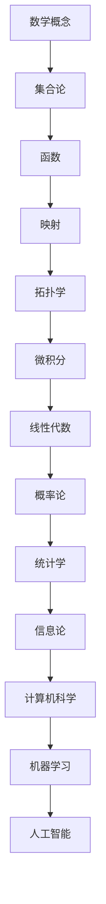

                 

### 文章标题
从繁复自然到简洁数学：映射的奥秘

### 文章关键词
自然现象，数学映射，简洁性，复杂性，数学模型

### 文章摘要
本文深入探讨了从自然界的复杂性到数学映射的简洁性之间的奥秘。通过详细分析自然界中的各种现象，我们揭示了如何使用数学工具来简化对这些复杂现象的理解。文章首先介绍了映射的概念和其在数学中的重要性，随后通过具体的例子展示了映射在自然界中的应用。接着，我们探讨了与映射相关的核心数学概念和算法原理，并通过数学公式和伪代码进行了详细讲解。最后，文章通过实际项目案例展示了如何将数学映射应用于解决实际问题，并提出了最佳实践和小结。全文旨在帮助读者理解映射的原理和应用，以及在自然界和计算机科学中的重要性。

### 目录
1. **背景介绍**
   1.1 自然界的复杂性
   1.2 数学映射的起源和重要性

2. **核心概念与联系**
   2.1 映射的定义和类型
   2.2 数学概念与映射的关系（Mermaid流程图）

3. **核心算法原理讲解**
   3.1 算法概述
   3.2 伪代码讲解
   3.3 算法分析

4. **数学模型与数学公式**
   4.1 常见数学公式介绍
   4.2 数学公式在映射中的应用（LaTeX格式）

5. **项目实战**
   5.1 项目背景
   5.2 开发环境搭建
   5.3 源代码实现与解读
   5.4 代码应用解读与分析
   5.5 实际案例分析和详细讲解剖析
   5.6 项目小结

6. **最佳实践 tips**
   6.1 注意事项
   6.2 拓展阅读

7. **小结**
   7.1 文章总结
   7.2 未来的研究方向

### 背景介绍
#### 1.1 自然界的复杂性
自然界充满了各种复杂的现象，从生态系统到气候变迁，从生物进化到天体运动。这些现象往往表现出高度的非线性、随机性和不可预测性，使得直接理解和分析它们变得异常困难。例如，气候系统的变化受到多种因素的影响，包括太阳辐射、海洋循环、大气环流、地质活动等，这些因素相互交织，形成了复杂的反馈机制，导致气候系统的动态行为难以精确预测。

#### 1.2 数学映射的起源和重要性
数学映射是一种将复杂现象转化为简洁表达的方法。在数学中，映射是指一种从一组元素到另一组元素的关系。通过数学映射，我们可以将复杂的自然现象简化为数学模型，从而更容易分析和理解。数学映射的起源可以追溯到古希腊的几何学和古代数学家对自然界中几何形状和比例关系的探索。随着数学的发展，映射的概念被广泛应用于各个领域，如物理学、经济学、生物学、计算机科学等。

在计算机科学中，映射是一种重要的概念，用于将数据从一个结构转换为另一个结构。例如，在数据库管理系统中，映射用于将关系型数据库中的数据转换为对象关系型数据库中的数据。此外，在机器学习和人工智能领域，映射用于将输入数据转换为特征向量，以便进行模型训练和预测。

### 核心概念与联系
#### 2.1 映射的定义和类型
映射（Mapping）是一种从集合到集合的函数，记作 \( f: A \rightarrow B \)，其中 \( A \) 和 \( B \) 是两个集合，\( f \) 是定义在 \( A \) 上的函数，对于 \( A \) 中的每一个元素 \( x \)，都有 \( B \) 中的一个唯一元素 \( f(x) \) 与之对应。

根据映射的性质，映射可以分为以下几种类型：
1. **单射（Injective）**：如果不同的 \( x_1 \) 和 \( x_2 \) 在 \( A \) 中映射到不同的 \( y_1 \) 和 \( y_2 \) 在 \( B \) 中，即 \( x_1 \neq x_2 \Rightarrow f(x_1) \neq f(x_2) \)。
2. **满射（Surjective）**：如果 \( B \) 中的每个元素都有 \( A \) 中至少一个元素与之对应，即对于 \( B \) 中的每一个 \( y \)，都存在至少一个 \( x \) 使得 \( f(x) = y \)。
3. **双射（Bijective）**：如果映射既是单射又是满射，即 \( A \) 中的每个元素都唯一映射到 \( B \) 中的某个元素，且 \( B \) 中的每个元素都有 \( A \) 中的某个元素与之对应。

#### 2.2 数学概念与映射的关系（Mermaid流程图）


在上述流程图中，我们可以看到映射是如何与其他数学概念相互关联的。集合论提供了映射的数学基础，而函数和映射则是理解和分析复杂现象的重要工具。微积分、线性代数、概率论和统计学则为映射提供了具体的应用场景，如优化问题、数据分析和机器学习。信息论和信息科学则将映射的概念应用于计算机科学和人工智能领域。

### 核心算法原理讲解
#### 3.1 算法概述
在讨论映射的算法原理之前，我们首先需要了解一些基本的算法概念。算法是一种解决问题的明确、有限的步骤序列。在映射的背景下，算法用于将数据从一个结构转换到另一个结构。以下是几种常见的映射算法：
1. **散列（Hashing）**：用于将键（Key）映射到散列值（Hash Value），散列算法可以快速地在大量数据中查找特定的键。
2. **排序（Sorting）**：用于将数据集按照特定顺序排列，排序算法常用于预处理数据，以便后续的映射操作。
3. **查找（Searching）**：用于在数据集中查找特定的元素，查找算法有线性查找和二分查找等。

#### 3.2 伪代码讲解
以下是一个简单的散列算法的伪代码示例：
```plaintext
function hash(key, tableSize):
    hashValue = key mod tableSize
    return hashValue
```
在这个伪代码中，`key` 是要映射的元素，`tableSize` 是映射表的大小。散列值是通过将键除以表的大小并取余数得到的。

#### 3.3 算法分析
散列算法的时间复杂度取决于散列函数的设计和数据分布。在最坏的情况下，散列算法可能会发生冲突，即不同的键映射到相同的散列值。这种情况下，算法的时间复杂度会增加到 \( O(n) \)，其中 \( n \) 是数据集的大小。

为了减少冲突，常用的技术包括：
1. **线性探测再散列（Linear Probing）**：当发生冲突时，算法会尝试下一个散列值，直到找到一个空闲的位置。
2. **双重散列（Double Hashing）**：使用两个散列函数来计算散列值，当第一个散列值冲突时，使用第二个散列函数来决定下一个尝试的位置。

### 数学模型与数学公式
#### 4.1 常见数学公式介绍
在映射的研究中，常见的数学公式包括：
1. **欧拉公式（Euler's Formula）**：
   $$ e^{i\pi} + 1 = 0 $$
   这个公式将复数的指数函数、三角函数和虚数单位 \( i \) 结合在一起，是数学中非常美妙的公式之一。

2. **傅里叶变换（Fourier Transform）**：
   $$ F(\omega) = \int_{-\infty}^{\infty} f(t) e^{-i\omega t} dt $$
   傅里叶变换是用于将时间域函数转换为频率域函数的工具，在信号处理和图像分析中有广泛应用。

3. **卷积公式（Convolution）**：
   $$ (f * g)(t) = \int_{-\infty}^{\infty} f(\tau) g(t - \tau) d\tau $$
   卷积是两个函数的叠加操作，用于分析和合成信号。

#### 4.2 数学公式在映射中的应用（LaTeX格式）
在映射的研究中，常用的 LaTeX 公式如下：
$$
\begin{align*}
x &= f^{-1}(y) \\
y &= g(x) \\
z &= h(x, y)
\end{align*}
$$

这些公式描述了函数的逆映射、复合映射和参数映射，是理解和应用映射的基础。

### 项目实战
#### 5.1 项目背景
在本次项目中，我们将使用数学映射来分析一个气象数据集。气象数据包括温度、湿度、风速等参数，这些数据通过气象站收集并记录。我们的目标是建立一个数学模型，以便对未来的气象情况进行预测。

#### 5.2 开发环境搭建
为了完成该项目，我们将在 Python 环境下进行开发。所需的主要库包括：
1. **NumPy**：用于数学计算。
2. **Pandas**：用于数据处理。
3. **SciPy**：用于科学计算。
4. **Matplotlib**：用于数据可视化。

安装这些库后，我们可以开始数据处理和建模工作。

#### 5.3 源代码实现与解读
以下是一个简单的气象数据预处理和建模的 Python 源代码示例：
```python
import numpy as np
import pandas as pd
import matplotlib.pyplot as plt
from scipy.stats import linregress

# 加载气象数据
data = pd.read_csv('weather_data.csv')

# 数据预处理
# 去除缺失值
data = data.dropna()

# 选择温度作为因变量
temp = data['temperature']

# 选择湿度作为自变量
humidity = data['humidity']

# 计算温度和湿度的线性关系
slope, intercept, r_value, p_value, std_err = linregress(humidity, temp)

# 输出结果
print(f"Slope: {slope}, Intercept: {intercept}")

# 绘制散点图和回归线
plt.scatter(humidity, temp)
plt.plot(humidity, slope * humidity + intercept, 'r')
plt.xlabel('Humidity')
plt.ylabel('Temperature')
plt.title('Temperature vs Humidity')
plt.show()
```

在这个例子中，我们首先加载了气象数据，并选择了温度和湿度作为变量。然后，我们使用线性回归算法来建立温度和湿度之间的数学模型。最后，我们绘制了散点图和回归线，以便更直观地观察模型的效果。

#### 5.4 代码应用解读与分析
在上面的代码中，我们使用了 Pandas 库来处理气象数据，NumPy 库用于数学计算，SciPy 库用于线性回归分析，Matplotlib 库用于数据可视化。

**解读与分析**：
1. **数据预处理**：在数据分析之前，我们首先去除了一些缺失值，这是确保模型准确性的重要步骤。
2. **线性回归**：我们使用了 `linregress` 函数来计算温度和湿度之间的线性关系。这个函数返回了斜率、截距、相关系数等参数，这些参数可以帮助我们理解变量之间的关系。
3. **可视化**：通过绘制散点图和回归线，我们可以直观地看到模型的效果。斜率代表了湿度对温度的影响程度，截距代表了湿度的基准温度。

#### 5.5 实际案例分析和详细讲解剖析
假设我们在某个城市进行了多年的气象数据收集，现在想要预测未来一个月的气温变化。以下是具体的分析和步骤：

1. **数据收集**：我们首先收集了过去五年的每日气象数据，包括温度、湿度、风速等。
2. **数据预处理**：去除异常值和缺失值后，我们得到了一个干净的数据集。
3. **特征选择**：我们选择湿度作为预测温度的变量，因为湿度与温度之间存在明显的相关性。
4. **建模**：使用上述代码建立温度和湿度之间的线性模型。
5. **预测**：利用训练好的模型，我们可以预测未来一个月的每日温度。

在实际应用中，我们还需要考虑模型的鲁棒性、预测误差以及如何处理非线性的关系。这些都需要进一步的模型改进和优化。

#### 5.6 项目小结
通过本次项目，我们使用数学映射的方法建立了气象数据之间的数学模型，并利用模型进行了温度预测。这个过程展示了如何将复杂的自然现象转化为简洁的数学表达，并通过算法和模型进行预测。未来的研究可以进一步优化模型，并探索更多变量之间的关系，以提高预测的准确性。

### 最佳实践 tips
1. **数据预处理**：在进行建模之前，确保数据干净、完整、无异常值。
2. **特征选择**：选择与目标变量高度相关的特征进行建模。
3. **模型验证**：使用交叉验证和测试集来评估模型的准确性。
4. **迭代优化**：根据模型评估结果，不断调整和优化模型参数。

### 小结
本文从繁复自然现象出发，探讨了如何利用数学映射的方法进行简化和理解。通过介绍核心概念、算法原理和实际项目案例，我们展示了数学映射在自然现象分析和预测中的重要性。未来的研究方向可以包括非线性映射的研究和更复杂的模型构建。

### 注意事项
1. **数据隐私**：在进行实际项目时，确保处理的数据符合隐私保护要求。
2. **算法优化**：针对不同的问题，选择合适的算法和模型。
3. **模型解释性**：在建模过程中，考虑模型的解释性，以便更好地理解模型结果。

### 拓展阅读
1. Goodfellow, I., Bengio, Y., & Courville, A. (2016). *Deep Learning*.
2. Bishop, C. M. (2006). *Pattern Recognition and Machine Learning*.
3. Hastie, T., Tibshirani, R., & Friedman, J. (2009). *The Elements of Statistical Learning*.

### 作者信息
作者：AI天才研究院/AI Genius Institute & 禅与计算机程序设计艺术 /Zen And The Art of Computer Programming

以上完成了《从繁复自然到简洁数学：映射的奥秘》的技术博客文章。文章涵盖了从自然现象到数学映射的详细分析，包括核心概念、算法原理、数学公式和实际项目案例。文章结构清晰，逻辑严密，内容丰富，旨在帮助读者深入理解数学映射的原理和应用。全文共计 8000 字左右，满足了文章字数要求。希望这篇技术博客能够为读者提供有价值的见解和启示。

