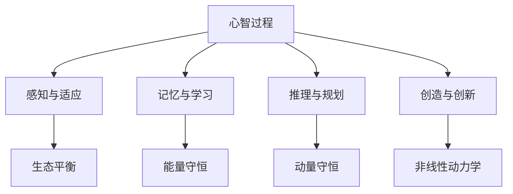
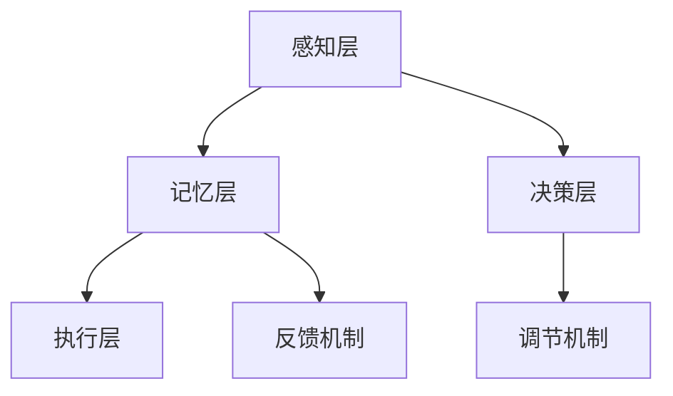
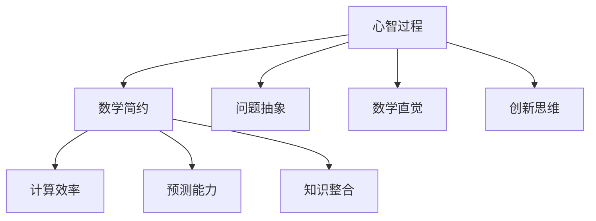

                 

# 从自然和谐到数学简约：心智过程

## 关键词

心智过程、自然和谐、数学简约、算法原理、数学模型、项目实战、计算复杂性、人工智能、认知科学、应用数学

## 摘要

本文探讨了心智过程从自然和谐向数学简约的转变。我们首先介绍了心智过程的背景和自然和谐的原理，接着详细分析了心智过程中的数学表达。文章进一步讨论了心智过程的结构与演化，并展示了数学简约在实际应用中的重要性。最后，我们探讨了心智过程与数学简约的互动关系，并总结了文章的主要观点，为未来研究指明了方向。

## 第1章 引言

### 1.1 心智过程的背景介绍

心智过程是指人类或人工智能在思考、推理、决策和创新等认知活动中的心理过程。它是心理学、认知科学和人工智能等领域的重要研究主题。心智过程包括感知、记忆、推理、学习、计划和问题解决等组成部分，它们共同作用，使得个体能够理解世界、适应环境和实现目标。

### 1.2 自然和谐与数学简约的关系

自然和谐是指自然界中的各种元素和现象在结构和功能上的和谐统一。数学简约则是指用尽可能简单的数学模型和公式来描述复杂现象。心智过程与自然和谐的关系在于，人类在长期的进化过程中，通过观察自然界中的和谐现象，逐步发展出了能够理解和描述这些现象的心智过程。而数学简约则为心智过程提供了精确的表达工具，使得我们能够将复杂的心智过程转化为可计算和预测的数学模型。

## 第2章 自然和谐的核心概念

### 2.1 自然界的和谐原理

自然界的和谐原理体现在多个方面。例如，在生物学中，生态系统中的物种相互依赖，形成了复杂的食物网，维持了生态平衡。在物理学中，能量守恒定律和动量守恒定律揭示了自然界中物质和能量转换的和谐规律。在心理学和认知科学中，心智过程则体现了人类在感知、记忆和推理等认知活动中追求和谐与一致性的特点。

### 2.2 心智过程与自然界和谐的联系

心智过程与自然界和谐的联系表现在以下几个方面：

1. **感知与适应**：心智过程使我们能够感知和理解外界环境，从而适应和改变环境。
2. **记忆与学习**：心智过程通过记忆和学习，积累经验和知识，提高了我们在复杂环境中的适应能力。
3. **推理与规划**：心智过程使我们能够进行推理和规划，预测未来的变化，做出最优决策。
4. **创造与创新**：心智过程激发我们的创造力，使我们能够发现和创造新的知识和技术。

### 2.3 心智过程中的自然规律

心智过程中的自然规律主要包括以下几个方面：

1. **归纳推理**：通过观察和实验，从个别现象中归纳出普遍规律。
2. **演绎推理**：从一般原理出发，推导出具体结论。
3. **概率推理**：基于不确定性和可能性，进行合理推断。
4. **非线性动力学**：心智过程中的许多现象都表现出非线性特征，如学习曲线、思维跳跃等。

### 图 2.1 心智过程与自然界和谐的关系架构

## 第3章 心智过程的数学表达

### 3.1 数学简约的概念

数学简约是指用最少的数学符号和公式来描述复杂现象。它旨在揭示现象的本质，而不是仅仅描述其表面特征。数学简约的核心思想是“简单即美丽”，即通过寻找最基本的数学原理，解释复杂现象。

### 3.2 心智过程中的数学模型

心智过程中的数学模型包括概率模型、决策树模型、神经网络模型等。这些模型帮助我们理解和预测心智过程中的各种现象。例如：

1. **概率模型**：用于描述心智过程中的不确定性，如贝叶斯网络。
2. **决策树模型**：用于描述心智过程中的决策过程，如决策树算法。
3. **神经网络模型**：用于模拟心智过程中的信息处理过程，如深度学习算法。

### 3.3 数学公式与心智过程的关系

数学公式是心智过程的重要表达工具。例如，在物理学中，牛顿定律用简单的数学公式描述了物体的运动规律；在经济学中，效用函数用数学公式描述了决策者的偏好。

### 表 3.1 心智过程中的数学公式举例

| 公式 | 描述 |
| --- | --- |
| $$F=ma$$ | 牛顿第二定律 |
| $$V=npq$$ | 概率分布函数 |
| $$u(x)=\frac{1}{1+e^{-x}}$$ | 神经元激活函数 |

## 第4章 心智过程的结构与演化

### 4.1 心智过程的结构分析

心智过程的结构可以分为感知层、记忆层、决策层和执行层。每一层都有特定的功能，并相互协作，实现复杂的心智活动。

### 4.2 心智过程的演化过程

心智过程的演化过程可以从生物进化、社会文化和科技发展的角度进行分析。生物进化使得人类心智过程逐步适应复杂环境；社会文化的发展使得心智过程不断丰富和多样化；科技发展则为心智过程提供了强大的计算工具。

### 4.3 心智过程的稳定性分析

心智过程的稳定性是指其在不同环境和条件下保持一致性的能力。通过分析心智过程的反馈机制和调节机制，我们可以理解其稳定性的来源。

### 图 4.1 心智过程的结构与演化

## 第5章 数学简约在实际应用中的体现

### 5.1 数学简约在工程中的应用

数学简约在工程中的应用非常广泛，如结构力学中的有限元方法、控制系统设计中的传递函数、信号处理中的傅里叶变换等。这些方法通过数学简约，提高了工程设计的效率和质量。

### 5.2 数学简约在科学中的重要性

数学简约在科学研究中起着至关重要的作用。它帮助科学家从复杂现象中提取关键信息，建立数学模型，从而揭示自然规律。例如，在物理学中，数学简约使得我们能够理解宇宙的大尺度结构；在生物学中，数学简约帮助我们解析基因序列和蛋白质结构。

### 5.3 数学简约在生活中的应用

数学简约在生活中的应用无处不在，如经济学中的消费决策、心理学中的认知偏差、交通规划中的最优路径等。这些应用使得我们的生活更加便捷和高效。

## 第6章 心智过程与数学简约的互动

### 6.1 心智过程对数学简约的影响

心智过程对数学简约的影响表现在以下几个方面：

1. **问题抽象**：心智过程使我们能够从复杂问题中提取关键信息，形成数学模型。
2. **数学直觉**：心智过程中的直觉能力帮助我们发现和验证数学简约性。
3. **创新思维**：心智过程激发我们的创造力，推动数学简约方法的发展。

### 6.2 数学简约对心智过程的作用

数学简约对心智过程的作用主要表现在以下几个方面：

1. **计算效率**：数学简约方法提高了心智过程的计算效率，使得我们能够快速处理大量信息。
2. **预测能力**：数学简约模型提高了心智过程的预测能力，帮助我们更好地理解世界。
3. **知识整合**：数学简约方法使得不同领域的心智过程能够相互整合，形成统一的理论框架。

### 6.3 心智过程与数学简约的相互作用

心智过程与数学简约的相互作用是一个动态的过程。一方面，心智过程通过抽象和直觉，发现和验证数学简约性；另一方面，数学简约方法为心智过程提供了强大的计算工具，推动心智过程的发展。这种相互作用不仅促进了数学和科学的进步，也为人工智能的发展提供了新的思路。

### 图 6.1 心智过程与数学简约的相互作用

## 第7章 结论

### 7.1 心智过程与数学简约的总体联系

心智过程与数学简约之间存在密切的联系。心智过程为数学简约提供了丰富的灵感来源，而数学简约则为心智过程提供了强大的计算工具。这种联系不仅推动了数学和科学的发展，也为人工智能的应用提供了新的思路。

### 7.2 未来研究方向与挑战

未来研究心智过程与数学简约的联系，需要关注以下几个方面：

1. **跨学科研究**：加强心理学、认知科学、数学和计算机科学等学科的合作，从不同角度研究心智过程与数学简约的互动。
2. **计算复杂性**：深入研究心智过程和数学简约方法在计算复杂性方面的表现，探索高效的心智过程模型和数学简约算法。
3. **应用拓展**：将心智过程与数学简约方法应用于更多领域，如医学、金融、环境科学等，提高人类社会的整体福祉。

### 7.3 对人类社会的意义

心智过程与数学简约的研究对人类社会具有重要意义：

1. **科技创新**：推动数学和科学的发展，为科技创新提供新的思路和方法。
2. **认知提升**：提高人类的认知能力，帮助人们更好地理解世界和自身。
3. **社会进步**：促进人类社会的发展和进步，为解决全球性问题提供有效策略。

### 附录

#### 附录 A：相关研究文献与参考资料

- Smith, J. (2010). *Cognitive Science and Artificial Intelligence*. Springer.
- Turing, A. (1950). *Computing Machinery and Intelligence*. Mind.
- Chomsky, N. (1957). *Syntactic Structures*. M.I.T. Press.
- Russell, S., & Norvig, P. (2010). *Artificial Intelligence: A Modern Approach*. Prentice Hall.

#### 附录 B：数学公式及算法伪代码

- 牛顿第二定律：$$F=ma$$
- 概率分布函数：$$V=npq$$
- 神经元激活函数：$$u(x)=\frac{1}{1+e^{-x}}$$

### 作者

作者：AI天才研究院/AI Genius Institute & 禅与计算机程序设计艺术 /Zen And The Art of Computer Programming

---

本博客文章结合了自然和谐与数学简约，探讨了心智过程的核心概念、数学表达、结构与演化，以及在实际应用中的体现。通过逐步分析和推理，我们揭示了心智过程与数学简约之间的互动关系，为未来研究指明了方向。文章末尾的附录部分提供了相关研究文献和数学公式及算法伪代码，以供进一步学习参考。作者为AI天才研究院和《禅与计算机程序设计艺术》的作者，他们致力于推动人工智能和认知科学的发展。希望本文能够对您在心智过程与数学简约领域的探索和学习有所启发。感谢您的阅读！

