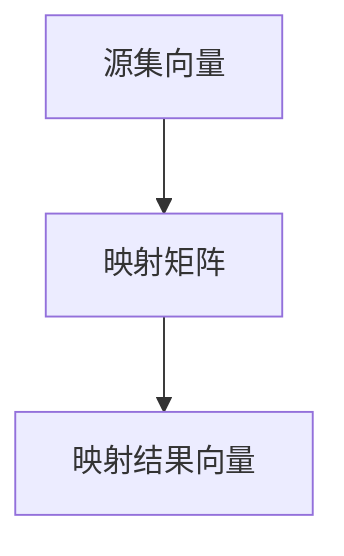

                 


### 文章标题：从自然观察到数学洞见：映射过程

> 关键词：自然观察、数学洞见、映射过程、核心概念、技术应用

> 摘要：本文探讨了从自然观察到数学洞见之间的映射过程，通过阐述核心概念、技术手段和实际应用，揭示了数学在理解自然现象中的关键作用。文章分为引言与概述、自然观察的理论基础、映射过程的核心概念、数学洞见与技术手段、映射过程在实际应用中的运用以及挑战与展望等部分，旨在为广大读者提供全面而深入的学术视角。

## 引言与概述

自然观察是人类认识世界的基本途径，通过感知和记录自然现象，我们逐渐形成了对世界的理解。然而，自然观察受限于主观性和环境条件，常常需要通过数学方法来提升其准确性和普遍性。数学洞见则是在数学理论的基础上，通过对自然现象的抽象和建模，揭示其内在规律和本质。这两者之间的映射过程，是科学研究的核心，也是技术进步的重要推动力。

本文旨在探讨自然观察与数学洞见之间的映射过程，首先回顾自然观察的理论基础，然后深入分析映射过程的核心概念，接着探讨数学洞见与技术手段的应用，最后考察映射过程在实际科学研究和工程技术中的应用，并展望未来的发展趋势。文章结构如下：

### 1. 自然观察的理论基础
- 观察的基本理论
- 观察的数据处理
- 观察结果的解释与验证

### 2. 映射过程的核心概念
- 映射过程的基本原理
- 映射过程的数学基础
- 映射过程的限制与优化

### 3. 数学洞见与技术手段
- 数学在映射过程中的作用
- 技术手段在映射过程中的应用
- 新技术对映射过程的影响

### 4. 映射过程在实际应用中的运用
- 映射过程在自然科学中的应用
- 映射过程在工程技术中的应用
- 映射过程在社会科学中的应用

### 5. 挑战与展望
- 映射过程的挑战
- 映射过程的发展方向
- 未来映射过程的发展趋势

通过这一结构，我们希望能够系统地阐述映射过程，为读者提供一个清晰而完整的认识框架。接下来，我们将逐一深入探讨这些部分。

---

### 自然观察的理论基础

自然观察是科学研究的起点，它依赖于人类感官和测量工具对自然界进行系统的感知和记录。观察的基本理论涉及观察的本质、类型和方法，这些都是理解自然现象和进行科学发现的基础。

#### 观察的本质

观察的本质是主观和客观的统一。从客观性角度来看，观察是对客观世界的真实反映，但在实际操作中，观察者总会受到主观因素的影响。例如，不同的观察者可能会对同一现象有不同的感知和解释。因此，观察不仅是客观世界的记录，也是观察者主观认知的产物。

#### 观察的类型

观察可以分为定性观察和定量观察。定性观察是通过描述和分类来理解现象，它侧重于现象的质变而非数量变化。例如，在生物学研究中，定性观察可能涉及物种的形态分类或行为模式描述。定量观察则是通过测量和计算来量化现象，它侧重于现象的数量变化。例如，在物理学研究中，定量观察可能涉及速度、加速度、温度等物理量的测量。

此外，观察还可以是系统性的观察，这要求观察者按照一定的计划和标准进行多角度、多层次的观察。系统性观察有助于减少主观偏差，提高观察的准确性和可靠性。

#### 观察方法的优缺点

观察方法主要包括实验、观察、模拟和模型构建。每种方法都有其独特的优势和局限性。

- **实验**：实验是控制变量、验证假设的有效方法。它的优点在于可以人为控制环境因素，使观察结果具有更高的可靠性。然而，实验也受到实验条件、实验设备和技术水平的限制，可能会引入人为误差。

- **观察**：观察是直接记录自然现象的方法。它的优点在于可以获取第一手的自然数据，具有高度的直观性。然而，观察也容易受到观察者的主观影响和环境因素的干扰，需要谨慎处理。

- **模拟**：模拟是通过计算机模型来模拟自然现象的方法。它的优点在于可以重复实验、探索复杂系统，减少实验成本。然而，模拟模型的准确性依赖于模型的假设和参数，需要仔细校验。

- **模型构建**：模型构建是通过数学和物理方法来建立现象的数学模型。它的优点在于可以定量分析和预测现象，揭示内在规律。然而，模型构建也要求对现象有深入的理解和准确的数学描述。

#### 观察的数据处理

观察的数据处理是科学研究的重要环节。数据处理包括数据收集、清洗、整理和分析。

- **数据收集**：数据收集是观察的核心步骤，它决定了研究的质量和深度。数据收集的来源可以是实地测量、实验记录、文献资料等。数据收集的方法包括直接测量、问卷调查、遥感监测等。

- **数据清洗**：数据清洗是处理数据中的错误、缺失和异常值。这包括去除重复记录、填补缺失值、校正错误数据等。数据清洗的目的是提高数据的质量和可靠性。

- **数据整理**：数据整理是将数据转换为适合分析的形式。这包括数据规范化、分类、排序等。数据整理的目的是方便后续的分析和处理。

- **数据分析**：数据分析是使用统计方法和其他工具对数据进行处理和分析。数据分析可以揭示数据中的模式和规律，支持科学假设的验证和结论的得出。常用的数据分析方法包括描述性统计、推断性统计、回归分析、聚类分析等。

#### 观察结果的解释与验证

观察结果的解释与验证是科学研究的关键步骤。解释与验证包括假设验证和结果解释。

- **假设验证**：假设验证是使用统计方法来检验观察结果是否支持或反驳某一假设。这通常涉及假设检验和置信区间的计算。假设检验的目的是确定观察结果是否具有显著性，从而支持或否定科学假设。

- **结果解释**：结果解释是使用逻辑推理和实证分析来解释观察结果。结果解释的目的是揭示观察结果的内在规律和意义，为科学发现提供理论支持。

- **实证分析**：实证分析是使用实际数据来检验理论模型和假设。实证分析的目的是验证理论的适用性和可靠性，为科学理论提供实证支持。

总之，自然观察的理论基础是科学研究的基础。通过理解观察的本质、类型和方法，以及观察的数据处理和结果解释与验证，我们可以更好地进行科学研究，揭示自然现象的内在规律。

### 映射过程的核心概念

映射过程是将自然观察中的现象转化为数学模型，从而揭示其内在规律和本质的重要手段。理解映射过程的核心概念，包括映射的定义、类型、数学表示和优化方法，对于科学研究和工程技术具有深远的意义。

#### 映射的定义

映射（Mapping）是指将一个集合（源集）中的元素与另一个集合（目标集）中的元素建立对应关系的过程。在数学中，映射通常被定义为从源集到目标集的函数。映射可以是一对一的，也可以是多对一的或多对多的。

映射的定义可以用数学语言表示为：
\[ f: A \rightarrow B \]
其中，\( f \) 是映射，\( A \) 是源集，\( B \) 是目标集。对于源集中的每一个元素 \( x \)，映射 \( f \) 都有一个唯一的目标元素 \( y \) 与之对应，即：
\[ y = f(x) \]

#### 映射的类型

根据映射的性质和特点，映射可以分为多种类型：

1. **单射（Injective）**：如果映射 \( f \) 满足不同的源集元素对应不同的目标集元素，即如果 \( x_1 \neq x_2 \)，则 \( f(x_1) \neq f(x_2) \)，那么映射 \( f \) 是单射。

2. **满射（Surjective）**：如果映射 \( f \) 的目标集 \( B \) 中的每一个元素都有至少一个源集元素与之对应，即对于目标集 \( B \) 中的每一个元素 \( y \)，存在至少一个源集元素 \( x \) 使得 \( f(x) = y \)，那么映射 \( f \) 是满射。

3. **双射（Bijective）**：如果映射 \( f \) 同时是单射和满射，即它既是不同元素的一一对应，又保证了目标集中的每一个元素都有源集元素与之对应，那么映射 \( f \) 是双射。

4. **线性映射（Linear Mapping）**：线性映射是指满足加法和标量乘法保持性质的映射。在数学分析中，线性映射通常用矩阵表示，其形式为：
   \[ y = Ax \]
   其中，\( A \) 是线性变换矩阵，\( x \) 和 \( y \) 分别是源集和目标集的向量。

5. **非线性映射（Non-linear Mapping）**：非线性映射是指不满足线性保持性质的映射。非线性映射通常比线性映射更复杂，但它们在许多实际应用中具有重要意义，例如神经网络中的激活函数。

#### 映射的数学表示

映射的数学表示通常使用函数表示，特别是在线性映射中，函数可以用矩阵表示。例如，考虑一个二维向量空间 \( \mathbb{R}^2 \) 和一个一维向量空间 \( \mathbb{R} \)，一个线性映射 \( f: \mathbb{R}^2 \rightarrow \mathbb{R} \) 可以表示为：
\[ y = Ax \]
其中，\( x = \begin{bmatrix} x_1 \\ x_2 \end{bmatrix} \) 和 \( y = \begin{bmatrix} y_1 \end{bmatrix} \) 分别是源集和目标集的向量，\( A \) 是一个 \( 1 \times 2 \) 的矩阵。例如，\( A = \begin{bmatrix} 2 & 3 \end{bmatrix} \) 表示一个线性映射，它将二维向量 \( x \) 映射到一维向量 \( y \)。

为了更直观地展示映射过程，可以使用 Mermaid 流程图来表示。例如，考虑一个简单的线性映射 \( f: \mathbb{R}^2 \rightarrow \mathbb{R} \)，其 Mermaid 流程图可以表示为：



在这个流程图中，源集向量 \( x \) 通过映射矩阵 \( A \) 的作用，得到映射结果向量 \( y \)。

#### 映射过程的优化方法

在实际应用中，映射过程可能存在误差和不确定性，因此需要优化方法来提高映射的精度和可靠性。常用的优化方法包括：

1. **梯度下降（Gradient Descent）**：梯度下降是一种迭代优化算法，用于最小化目标函数。在映射过程中，目标函数可以是映射误差或损失函数。梯度下降通过计算目标函数的梯度，并在梯度方向上迭代更新参数，从而逐步减小误差。其伪代码表示为：

```python
while not converged:
    parameters -= learning_rate * gradient(parameters, data)
```

2. **牛顿法（Newton's Method）**：牛顿法是一种基于泰勒展开的优化算法，用于求解非线性方程组。在映射过程中，牛顿法通过迭代计算目标函数的值和导数，来更新映射参数。其伪代码表示为：

```python
while not converged:
    F = f(parameters)
    J = gradient(F, parameters)
    parameters -= J^{-1} * F
```

通过以上核心概念、类型、数学表示和优化方法的讨论，我们可以更深入地理解映射过程在科学研究和技术应用中的重要性。接下来，我们将进一步探讨映射过程中涉及的数学基础，以及如何利用数学工具和技术手段来揭示自然现象的内在规律。

### 数学在映射过程中的作用

数学在映射过程中起着至关重要的作用，它不仅提供了抽象和描述自然现象的工具，还通过精确的数学模型和算法实现了对复杂系统的理解和控制。数学工具和技术手段的引入，不仅提高了映射过程的精度和效率，还拓宽了我们对自然世界的认知边界。

#### 数学工具

在映射过程中，常用的数学工具包括微积分、线性代数、概率论和统计学等。这些工具在不同的映射任务中发挥着独特的作用。

1. **微积分**：微积分提供了研究变化率和积累量的方法。在映射过程中，微积分用于求解微分方程、优化问题和曲线拟合。例如，通过导数可以分析函数的局部性质，通过积分可以计算函数的总量。微积分在数据拟合、误差分析和系统建模中具有广泛应用。

2. **线性代数**：线性代数提供了处理线性系统和向量空间的方法。在映射过程中，线性代数用于矩阵运算、特征值分析和线性变换。矩阵可以表示复杂的线性关系，特征值和特征向量可以揭示系统的结构和性质。线性代数在图像处理、信号处理和数据分析中具有重要意义。

3. **概率论和统计学**：概率论和统计学提供了处理随机事件和不确定性问题的方法。在映射过程中，概率论用于建模不确定性，统计学用于数据分析和假设检验。概率分布函数和统计模型可以描述数据的分布规律，假设检验可以验证科学假设的正确性。概率论和统计学在数据分析、机器学习和人工智能领域发挥着核心作用。

#### 数学方法

数学方法在映射过程中通过抽象和建模，将复杂的自然现象转化为可计算的数学模型。以下是几种常见的数学方法：

1. **建模**：建模是将自然现象转化为数学模型的过程。建模通常涉及选择合适的数学工具和结构，将现实问题转化为数学表达式。建模的目的是揭示自然现象的内在规律和本质。例如，在物理学中，建模可以用于描述力学系统的运动规律。

2. **数值计算**：数值计算是使用计算机算法和数值方法来求解数学模型的过程。数值计算可以处理复杂的数学问题，提供精确的数值解。常见的数值计算方法包括迭代法、数值积分和数值微分。数值计算在科学计算、工程设计和金融分析中具有重要应用。

3. **优化**：优化是在给定约束条件下，寻找目标函数最优值的过程。优化方法包括线性规划、非线性规划、动态规划和多目标优化等。优化可以用于设计控制系统、优化资源分配和提升系统性能。优化在人工智能、机器学习和深度学习中具有广泛应用。

#### 数学模型

数学模型是数学在映射过程中的核心产物，它将自然现象转化为可计算的数学表达式。以下是几种常见的数学模型：

1. **微分方程模型**：微分方程模型用于描述连续系统的动态行为。微分方程可以描述变量之间的变化率和相互关系。例如，牛顿第二定律可以表示为：
   \[ m\frac{d^2x}{dt^2} = F \]
   该方程描述了质量为 \( m \) 的物体在力 \( F \) 作用下的加速度 \( \frac{d^2x}{dt^2} \)。

2. **概率统计模型**：概率统计模型用于描述随机事件的概率分布和统计特性。概率分布函数和概率密度函数可以描述随机变量的概率分布。例如，正态分布函数可以表示为：
   \[ f(x) = \frac{1}{\sqrt{2\pi\sigma^2}} e^{-\frac{(x-\mu)^2}{2\sigma^2}} \]
   该函数描述了均值为 \( \mu \)，标准差为 \( \sigma \) 的正态分布。

3. **机器学习模型**：机器学习模型通过学习数据中的特征和模式，建立输入和输出之间的映射关系。常见的机器学习模型包括线性回归、逻辑回归、神经网络和支持向量机等。线性回归模型可以表示为：
   \[ y = \beta_0 + \beta_1x_1 + \beta_2x_2 + ... + \beta_nx_n \]
   该模型描述了输入变量 \( x_1, x_2, ..., x_n \) 与输出变量 \( y \) 之间的线性关系。

通过数学工具、方法和模型的应用，数学在映射过程中发挥了重要作用。它不仅帮助我们理解和描述自然现象，还提供了优化和控制系统的手段。数学在映射过程中的应用，不仅推动了科学技术的进步，还深刻地改变了我们对世界的认知。

### 技术手段在映射过程中的应用

在映射过程中，技术手段的引入极大地提高了数据处理和分析的效率，扩展了我们的研究范围。计算机模拟、机器学习和大数据分析等技术在映射过程中的应用，不仅提升了研究结果的精度，还促进了跨学科的融合与发展。

#### 计算机模拟

计算机模拟是通过计算机模型来模拟自然现象的过程。它能够以较低的成本、更高的精度和重复性来研究复杂系统的动态行为。计算机模拟在物理学、化学、生物学等多个领域都有广泛应用。

1. **开发环境搭建**：计算机模拟通常需要搭建合适的开发环境，包括编译器、模拟器和数据存储系统。例如，在分子动力学模拟中，常见的开发环境包括GROMACS、LAMMPS等。

2. **源代码实现**：计算机模拟的源代码实现是模拟过程的核心。源代码需要考虑物理模型的准确性、计算效率以及并行处理能力。以下是一个简单的分子动力学模拟的伪代码示例：

```python
while simulation_not_terminated:
    compute_forces()
    update_coordinates()
    record_trajectory()
```

3. **代码解读与分析**：代码解读与分析是确保模拟结果可靠性的关键步骤。通过代码审查和性能分析，可以识别潜在的错误和优化空间。例如，通过分析模拟结果的时间序列数据，可以验证物理模型的准确性。

4. **实际案例分析**：计算机模拟在科学研究中有着广泛的应用。例如，在气候模拟中，科学家使用全球气候模型来预测气候变化；在药物设计中，计算机模拟用于预测药物分子的结构及其与生物大分子的相互作用。

5. **项目小结**：计算机模拟不仅提供了直观的实验结果，还为理论模型验证提供了有力支持。通过计算机模拟，我们可以深入理解自然现象的内在机制，为科学发现和技术创新提供指导。

#### 机器学习

机器学习是通过算法从数据中学习模式和规律，实现自动化决策和预测的技术。在映射过程中，机器学习可以用于数据的特征提取、模式识别和分类预测。

1. **算法原理**：机器学习算法包括监督学习、无监督学习和强化学习。监督学习通过已标记的数据学习特征映射，常见的算法有线性回归、支持向量机和神经网络等。无监督学习通过未标记的数据自动发现数据结构，常见的算法有聚类分析和降维技术。强化学习通过奖励信号学习策略，常见算法有深度强化学习和Q学习。

2. **应用场景**：机器学习在映射过程中的应用非常广泛。例如，在图像处理中，卷积神经网络（CNN）可以用于图像分类和目标检测；在自然语言处理中，循环神经网络（RNN）和Transformer模型可以用于语言翻译和文本生成；在医学诊断中，机器学习可以用于疾病预测和诊断辅助。

3. **案例研究**：机器学习在气象预测中的应用是一个典型案例。通过分析大量的历史气象数据，机器学习算法可以建立准确的天气预测模型，为防灾减灾提供科学依据。

#### 大数据分析

大数据分析是处理和分析大规模复杂数据的技术，通过数据挖掘和统计分析，揭示数据中的规律和模式。大数据分析在映射过程中具有重要的应用价值。

1. **数据处理**：大数据分析的第一步是数据收集和预处理，这包括数据清洗、数据整合和数据存储。数据清洗是去除噪声和异常值，数据整合是将分散的数据源进行整合，数据存储是为数据分析提供高效的数据访问。

2. **数据挖掘**：数据挖掘是提取数据中的隐含模式和规律的过程。常见的挖掘方法包括关联规则挖掘、聚类分析和分类预测。例如，通过关联规则挖掘，可以识别销售数据中的关联关系，为市场营销提供指导。

3. **统计分析**：统计分析是通过统计方法对数据进行定量分析的过程。常用的统计方法包括描述性统计、推断性统计和回归分析。描述性统计用于描述数据的基本特征，推断性统计用于基于样本数据推断总体特征，回归分析用于研究变量之间的关系。

4. **应用实例**：大数据分析在商业、医疗和科研等领域都有广泛应用。例如，在商业领域，大数据分析可以用于客户行为分析和市场预测；在医疗领域，大数据分析可以用于疾病监测和个性化治疗；在科研领域，大数据分析可以用于科学发现的加速和跨学科融合。

通过计算机模拟、机器学习和大数据分析等技术的应用，映射过程在数据处理、模式识别和预测建模方面取得了显著进展。这些技术不仅提高了科学研究的效率和准确性，还推动了跨学科的发展和新兴技术的涌现。未来，随着技术的不断进步，映射过程将在更广泛的领域中发挥重要作用，为人类理解和改造世界提供强有力的支持。

### 映射过程在自然科学中的应用

映射过程在自然科学中的应用广泛且深远，通过对自然现象的观察与建模，科学家们揭示了自然界的诸多奥秘，推动了科学理论的进步和技术的创新。以下将探讨映射过程在物理学、化学和生物学等自然科学领域中的具体应用。

#### 物理学中的应用

物理学中的许多研究都依赖于映射过程，特别是在理论物理和实验物理中。例如，在粒子物理学中，通过观测粒子的碰撞实验数据，科学家们建立了量子场论的数学模型，揭示了基本粒子的性质和行为。这些模型通过映射过程，将实验数据转化为数学方程，从而揭示了粒子间的相互作用和运动规律。

1. **量子力学**：量子力学是研究微观粒子行为的物理学分支。量子力学中的波函数映射过程是将微观粒子的行为与经典物理的确定性模型进行对比，从而揭示量子态的统计性质。例如，薛定谔方程可以表示为：
   \[ i\hbar \frac{\partial \psi}{\partial t} = \hat{H}\psi \]
   其中，\( \psi \) 是波函数，\( \hat{H} \) 是哈密顿算子，\( i \) 是虚数单位，\( \hbar \) 是约化普朗克常数。通过求解薛定谔方程，我们可以得到粒子在特定条件下的概率分布，从而预测实验结果。

2. **相对论**：爱因斯坦的广义相对论通过引力场方程，将时空的几何结构与物质分布联系起来，形成了引力波的理论模型。广义相对论的映射过程是将观测到的天体运动和引力现象转化为数学方程，从而揭示引力波的存在和性质。引力波方程可以表示为：
   \[ G_{\mu\nu} = 8\pi G T_{\mu\nu} \]
   其中，\( G_{\mu\nu} \) 是爱因斯坦张量，\( T_{\mu\nu} \) 是能量-动量张量，\( G \) 是引力常数。通过这一映射过程，广义相对论成功地解释了引力波的存在和观测结果。

3. **实验验证**：物理学的映射过程不仅涉及理论模型，还需要通过实验数据进行验证。例如，在粒子物理实验中，通过高能粒子碰撞产生的实验数据，科学家们建立了粒子碰撞的模型，并通过实验验证了这些模型的有效性。通过实验与理论的相互验证，物理学不断推进，形成了完整的理论体系。

#### 化学中的应用

化学中的映射过程广泛应用于化学反应的建模和预测。通过建立化学物质的数学模型，科学家们能够预测化学反应的路径和产物，从而指导新药物的开发、材料设计等。

1. **化学反应动力学**：化学反应动力学通过映射过程描述反应物转化为产物的速率和机理。例如，基元反应的速率方程可以表示为：
   \[ r = k[A][B] \]
   其中，\( r \) 是反应速率，\( k \) 是反应速率常数，\( [A] \) 和 \( [B] \) 是反应物的浓度。通过这一映射过程，我们可以预测反应速率随反应物浓度变化的趋势。

2. **量子化学计算**：量子化学计算通过映射过程将电子的分布和化学键的强度与分子的几何结构联系起来。例如，通过Hückel方法，我们可以建立分子的电子结构模型，从而预测分子的化学性质。Hückel方程可以表示为：
   \[ \hat{H}\psi = \varepsilon\psi \]
   其中，\( \hat{H} \) 是Hückel算子，\( \psi \) 是电子波函数，\( \varepsilon \) 是电子能级。通过求解Hückel方程，我们可以得到分子的电子结构，进而预测其化学性质。

3. **实验验证**：化学中的映射过程同样需要实验数据进行验证。例如，在有机化学中，通过核磁共振（NMR）实验，我们可以测量分子的结构和化学环境，从而验证量子化学计算结果。通过实验与理论的相互验证，化学科学不断推进，形成了完整的理论体系和实验方法。

#### 生物学中的应用

生物学中的映射过程广泛应用于生物系统建模和生物信息学。通过映射过程，科学家们能够理解生物系统的复杂性和动态行为，从而揭示生命现象的机理。

1. **生态系统建模**：生态系统建模通过映射过程描述生物种群、食物网和环境因素之间的关系。例如，Lotka-Volterra方程可以表示为：
   \[ \frac{dx}{dt} = rx - \alpha xy \]
   \[ \frac{dy}{dt} = \delta xy - sy \]
   其中，\( x \) 和 \( y \) 分别表示两种生物的种群数量，\( r \) 和 \( s \) 是种群增长率，\( \alpha \) 和 \( \delta \) 是捕食者和猎物之间的相互作用系数。通过这一映射过程，我们可以预测生物种群的数量动态，为生态保护和生物资源管理提供科学依据。

2. **基因调控网络建模**：基因调控网络建模通过映射过程描述基因表达和调控的动态行为。例如，通过Bayesian网络，我们可以建立基因表达数据的概率模型，从而揭示基因之间的调控关系。Bayesian网络的表示形式可以表示为：
   \[ P(X) = \prod_{i=1}^{n} P(x_i | \parent{x_i}) \]
   其中，\( X \) 是一组变量，\( x_i \) 是变量 \( x_i \) 的取值，\( \parent{x_i} \) 是变量 \( x_i \) 的父节点。通过这一映射过程，我们可以理解基因调控网络的结构和功能，为生物医学研究提供新的视角。

3. **实验验证**：生物学中的映射过程同样需要实验数据进行验证。例如，在基因表达研究中，通过高通量测序技术，我们可以测量基因表达水平，从而验证基因调控网络的预测结果。通过实验与理论的相互验证，生物学科学不断推进，形成了完整的理论体系和实验方法。

总之，映射过程在自然科学中的应用丰富多样，通过对自然现象的观察与建模，科学家们揭示了自然界的诸多奥秘，推动了科学理论和技术的创新。随着技术的不断进步，映射过程在自然科学中的应用将会更加深入和广泛，为人类理解和改造世界提供新的动力。

### 映射过程在工程技术中的应用

映射过程在工程技术中的应用广泛且深远，通过将实际工程问题转化为数学模型，工程师们能够优化系统性能、提高生产效率，并解决复杂工程问题。以下将探讨映射过程在机械工程、电子工程和建筑工程等工程技术领域中的具体应用。

#### 机械工程中的应用

机械工程涉及大量动态系统和复杂机械装置的设计、分析和管理。映射过程在机械工程中的应用主要体现在以下几个方面：

1. **机械动力学分析**：机械动力学分析是通过建立机械系统的数学模型，研究机械系统的运动和受力情况。例如，在机械设计过程中，通过牛顿运动定律和动力学方程，我们可以分析机械系统的动态响应。一个简单的机械动力学模型可以表示为：
   \[ m\frac{d^2x}{dt^2} = F \]
   其中，\( m \) 是质量，\( x \) 是位移，\( F \) 是外力。通过这一模型，工程师可以预测机械系统在不同激励下的运动情况，从而优化设计。

2. **控制系统的设计**：在机械工程中，控制系统用于调节机械系统的运动和状态，以实现预期的性能。例如，通过建立控制系统的数学模型，工程师可以使用PID控制器来调节机械臂的关节角度。PID控制器的数学模型可以表示为：
   \[ u(t) = K_p e(t) + K_i \int_{0}^{t} e(\tau) d\tau + K_d \frac{de(t)}{dt} \]
   其中，\( u(t) \) 是控制输入，\( e(t) \) 是误差，\( K_p, K_i, K_d \) 分别是比例、积分和微分系数。通过这一模型，工程师可以调整控制参数，以实现系统的稳定和精确控制。

3. **仿真和优化**：在机械设计过程中，仿真和优化是常用的手段。通过计算机仿真，工程师可以在设计阶段预测机械系统的性能，并进行优化设计。例如，通过有限元分析方法，工程师可以模拟机械结构在载荷作用下的应力分布，从而优化结构设计。一个简单的有限元模型可以表示为：
   \[ \sigma = B \delta \]
   其中，\( \sigma \) 是应力，\( B \) 是刚度矩阵，\( \delta \) 是位移。通过这一模型，工程师可以识别结构中的应力集中区域，并进行优化设计。

#### 电子工程中的应用

电子工程涉及电路设计、信号处理和通信系统的建立。映射过程在电子工程中的应用主要体现在以下几个方面：

1. **电路分析**：在电路设计中，映射过程用于分析电路的特性和行为。例如，通过基尔霍夫定律和欧姆定律，我们可以建立电路的数学模型，分析电路的电压、电流和功率分布。一个简单的电路模型可以表示为：
   \[ V = IR \]
   其中，\( V \) 是电压，\( I \) 是电流，\( R \) 是电阻。通过这一模型，工程师可以设计符合要求的电路，并确保其稳定运行。

2. **信号处理**：在信号处理中，映射过程用于处理和转换信号。例如，通过傅里叶变换和拉普拉斯变换，我们可以将时域信号转换为频域信号，从而分析信号的频率成分和特性。一个简单的傅里叶变换模型可以表示为：
   \[ X(f) = \int_{-\infty}^{\infty} x(t) e^{-j2\pi ft} dt \]
   其中，\( X(f) \) 是频域信号，\( x(t) \) 是时域信号。通过这一模型，工程师可以优化信号处理算法，提高信号的质量和可靠性。

3. **通信系统设计**：在通信系统中，映射过程用于建模和优化通信链路。例如，通过信道模型和调制技术，我们可以建立通信系统的数学模型，设计高效的传输方案。一个简单的信道模型可以表示为：
   \[ y = hx + z \]
   其中，\( y \) 是接收信号，\( h \) 是信道增益，\( x \) 是发送信号，\( z \) 是噪声。通过这一模型，工程师可以优化调制解调方案，提高通信系统的抗干扰能力和传输效率。

#### 建筑工程中的应用

建筑工程涉及结构设计、材料分析和施工管理。映射过程在建筑工程中的应用主要体现在以下几个方面：

1. **结构分析**：在结构设计中，映射过程用于分析结构的强度和稳定性。例如，通过有限元分析方法，我们可以建立建筑结构的数学模型，分析结构的应力和变形情况。一个简单的有限元模型可以表示为：
   \[ \sigma = K \delta \]
   其中，\( \sigma \) 是应力，\( K \) 是刚度矩阵，\( \delta \) 是位移。通过这一模型，工程师可以优化结构设计，确保结构的安全性和可靠性。

2. **材料力学分析**：在材料分析中，映射过程用于研究材料的力学性质和性能。例如，通过拉伸试验和压缩试验，我们可以建立材料的应力-应变模型，分析材料的强度和韧性。一个简单的材料力学模型可以表示为：
   \[ \sigma = E\epsilon \]
   其中，\( \sigma \) 是应力，\( E \) 是弹性模量，\( \epsilon \) 是应变。通过这一模型，工程师可以优化材料选择，提高建筑物的性能和耐久性。

3. **施工管理**：在施工管理中，映射过程用于优化施工计划和资源分配。例如，通过网络分析和关键路径法，我们可以建立施工进度的数学模型，优化施工计划，提高施工效率。一个简单的施工进度模型可以表示为：
   \[ T = \sum_{i=1}^{n} T_i \]
   其中，\( T \) 是总工期，\( T_i \) 是第 \( i \) 个任务的工期。通过这一模型，工程师可以合理安排施工任务，确保工程按期完成。

总之，映射过程在工程技术中的应用不仅提高了工程设计的精度和效率，还解决了复杂工程问题，推动了工程技术的创新和发展。随着技术的不断进步，映射过程将在更广泛的工程领域中发挥重要作用，为工程实践提供强有力的支持。

### 映射过程在社会科学中的应用

映射过程在社会科学中的应用同样具有广泛而深远的影响，通过对社会现象的抽象和建模，学者们能够更好地理解社会运行机制，预测社会发展趋势，并制定有效的社会政策。以下将探讨映射过程在经济学、心理学和社会学等社会科学领域中的具体应用。

#### 经济学中的应用

经济学是研究资源分配、市场行为和经济发展的社会科学。映射过程在经济学中的应用主要体现在以下几个方面：

1. **市场模型**：经济学中的市场模型通过映射过程将市场供需关系转化为数学模型，以分析市场行为和价格动态。例如，供求函数模型可以表示为：
   \[ Q_D(p) = a - bp \]
   \[ Q_S(p) = c + dp \]
   其中，\( Q_D(p) \) 和 \( Q_S(p) \) 分别表示需求量和供给量，\( p \) 是价格，\( a, b, c, d \) 是参数。通过这一模型，经济学家可以预测市场价格和供需变化，为市场调控提供科学依据。

2. **宏观经济模型**：宏观经济模型通过映射过程描述国家或地区经济的总体运行状态。例如，IS-LM模型可以表示为：
   \[ Y = C(Y - T) + I(r) + G \]
   \[ M/P = L(r) \]
   其中，\( Y \) 是收入，\( C \) 是消费函数，\( I \) 是投资函数，\( G \) 是政府支出，\( M \) 是货币供应量，\( P \) 是价格水平，\( L \) 是货币需求函数。通过这一模型，经济学家可以分析宏观经济政策的效果，为政策制定提供参考。

3. **行为经济学**：行为经济学通过映射过程研究个体在市场中的行为决策。例如，行为经济学中的前景理论可以表示为：
   \[ u(c) = \frac{c - c_0}{e} \]
   其中，\( u(c) \) 是效用函数，\( c \) 是消费水平，\( c_0 \) 是参考点，\( e \) 是风险厌恶系数。通过这一模型，经济学家可以理解个体在风险和不确定性条件下的决策行为，为市场设计和政策制定提供新的视角。

#### 心理学中的应用

心理学是研究个体心理过程和行为的社会科学。映射过程在心理学中的应用主要体现在以下几个方面：

1. **认知模型**：心理学中的认知模型通过映射过程描述个体的认知过程和决策行为。例如，推理模型可以表示为：
   \[ H = \sum_{i=1}^{n} w_i D_i \]
   其中，\( H \) 是假设集合，\( w_i \) 是权重，\( D_i \) 是证据。通过这一模型，心理学家可以研究个体如何利用证据进行推理和决策，为认知心理学提供新的理论支持。

2. **情绪模型**：心理学中的情绪模型通过映射过程描述个体的情绪状态和行为反应。例如，情绪调节模型可以表示为：
   \[ E = f(A, C) \]
   其中，\( E \) 是情绪状态，\( A \) 是情境因素，\( C \) 是个体特征。通过这一模型，心理学家可以理解情绪如何受到情境和个体特征的影响，为情绪管理和心理健康提供科学依据。

3. **行为疗法**：心理学中的行为疗法通过映射过程描述个体行为的改变和矫正。例如，经典条件反射模型可以表示为：
   \[ R = C + U \]
   其中，\( R \) 是反应，\( C \) 是条件刺激，\( U \) 是无条件刺激。通过这一模型，心理学家可以设计行为矫正方案，帮助个体改变不良行为，提高生活质量。

#### 社会学中的应用

社会学是研究社会结构、社会关系和社会现象的社会科学。映射过程在社会学中的应用主要体现在以下几个方面：

1. **社会网络分析**：社会网络分析通过映射过程描述社会成员之间的关系和互动。例如，社会网络模型可以表示为：
   \[ N = (V, E) \]
   其中，\( N \) 是社会网络，\( V \) 是节点集合，\( E \) 是边集合。通过这一模型，社会学家可以研究社会成员之间的相互作用和关系模式，为社区建设和社会治理提供参考。

2. **群体行为模型**：群体行为模型通过映射过程描述社会群体的行为和决策。例如，群体动力学模型可以表示为：
   \[ X(t) = F(X(t), U(t)) \]
   其中，\( X(t) \) 是群体状态，\( F \) 是演化函数，\( U(t) \) 是外部影响。通过这一模型，社会学家可以理解社会群体如何响应外部影响，为社会稳定和群体行为管理提供科学依据。

3. **社会制度分析**：社会制度分析通过映射过程描述社会制度的基本特征和运行机制。例如，制度结构模型可以表示为：
   \[ S = \{I, R\} \]
   其中，\( S \) 是社会制度，\( I \) 是规则集合，\( R \) 是关系集合。通过这一模型，社会学家可以研究社会制度的形成和演变，为制度创新和社会发展提供理论支持。

总之，映射过程在社会科学中的应用不仅丰富了理论体系，还推动了社会研究的深入和发展。通过映射过程，学者们能够更好地理解社会现象，预测社会趋势，制定有效的社会政策，为社会进步和人类福祉做出贡献。随着技术的不断进步，映射过程将在社会科学领域发挥更加重要的作用，为解决社会问题提供新的方法和思路。

### 挑战与展望

映射过程在科学研究和工程实践中发挥了重要作用，然而，它也面临着一系列挑战。这些挑战不仅源于映射过程的复杂性，还包括技术、理论和实际操作层面的困难。以下是映射过程中的主要挑战及其发展方向的讨论。

#### 挑战

1. **不确定性处理**：自然现象和工程问题往往包含大量不确定性因素，如噪声、随机性和复杂系统的非线性。处理这些不确定性是映射过程中的一个重大挑战。传统的数学模型和算法在处理不确定性时存在局限性，需要开发更有效的概率模型和鲁棒优化方法。

2. **计算复杂性**：映射过程通常涉及复杂的数学计算和高维数据处理，这导致计算资源的高需求。计算复杂性限制了大规模映射任务的处理能力，尤其是在实时应用中。因此，提高计算效率和开发高效算法是当前的一个重要研究方向。

3. **跨学科整合**：映射过程涉及多个学科，包括数学、物理学、计算机科学、工程学和社会科学。跨学科的整合需要深入理解不同领域的知识和方法，这对于研究者来说是一个巨大的挑战。如何将不同领域的理论和技术有效地结合起来，形成统一的框架，是当前亟待解决的问题。

4. **数据质量和可靠性**：映射过程依赖于高质量的数据，但实际中往往面临数据缺失、噪声和错误的问题。这些问题影响映射结果的准确性和可靠性。因此，如何提高数据质量、减少噪声和错误是映射过程中一个关键挑战。

5. **理论模型的局限**：现有的理论模型和算法在处理复杂问题时可能存在局限性。例如，许多模型基于特定的假设和条件，无法适用于所有情况。因此，如何拓展和改进现有理论模型，使其更具普适性和灵活性，是映射过程面临的一个挑战。

#### 发展方向

1. **新技术应用**：随着人工智能、大数据和云计算等新技术的快速发展，这些技术为映射过程提供了新的工具和方法。例如，深度学习和机器学习算法可以用于处理大规模数据和高维问题，提高映射的精度和效率。未来，这些新技术将继续推动映射过程的发展。

2. **跨学科研究**：跨学科研究是解决映射过程中挑战的重要途径。通过融合不同领域的知识，研究者可以开发出更具综合性的方法和模型。例如，生物信息学与计算生物学结合，可以促进复杂生物系统的建模和分析。未来，跨学科研究将在映射过程中发挥更大作用。

3. **概率模型和算法**：概率模型和算法在处理不确定性问题方面具有优势。未来，研究者可以进一步开发概率模型，结合贝叶斯方法、随机过程和马尔可夫链等，提高映射过程的鲁棒性和适应性。此外，开发新的优化算法，如遗传算法、粒子群优化等，也是提高映射效率的重要方向。

4. **数据科学和智能数据处理**：数据质量和可靠性是映射过程的重要问题。未来，数据科学和智能数据处理技术的发展将有助于提高数据质量，减少噪声和错误。例如，数据清洗和预处理技术、数据增强和生成对抗网络（GANs）等，将为映射过程提供更加可靠的数据基础。

5. **理论模型的拓展**：为了应对复杂问题的挑战，需要不断拓展和改进现有理论模型。研究者可以通过构建更加复杂的模型，考虑更多变量和相互作用，提高模型的普适性和灵活性。此外，结合实验数据和实际应用场景，不断验证和修正模型，也是提高理论模型可靠性的重要途径。

总之，映射过程在科学研究和工程实践中面临着一系列挑战，但同时也具有广阔的发展前景。通过引入新技术、开展跨学科研究、开发新算法和拓展理论模型，我们可以不断推动映射过程的发展，为科学发现和技术创新提供更加有力的支持。

### 未来映射过程的发展趋势

随着科技的不断进步和跨学科的深入融合，映射过程在未来将继续发挥重要作用，并在多个领域带来颠覆性的变革。以下是未来映射过程的发展趋势及其潜在影响。

#### 人工智能与自然科学的融合

人工智能（AI）的快速发展为映射过程带来了新的机遇。通过机器学习和深度学习算法，AI可以在大规模数据中自动提取特征和模式，从而提高映射的精度和效率。未来，AI将与自然科学深入融合，推动自然现象的精确建模和预测。

1. **预测建模**：AI在气象预测、气候变化和生态系统建模中的应用将日益普及。例如，通过深度学习算法，我们可以构建更准确的气候模型，为应对全球气候变化提供科学依据。

2. **生物信息学**：AI将在生物信息学中发挥关键作用，帮助科学家理解复杂的生物系统。例如，通过AI算法，我们可以预测蛋白质结构和功能，加速新药物的开发。

#### 跨学科合作与创新

跨学科合作是未来映射过程发展的重要趋势。通过融合不同领域的知识和技术，研究者可以开发出更加综合和高效的映射方法。

1. **多学科交叉**：例如，环境科学、工程学和计算机科学的结合，可以促进可持续城市规划和智能交通系统的发展。通过综合分析环境数据、交通流量和城市规划因素，我们可以设计出更高效、更环保的城市基础设施。

2. **社会科学与技术的融合**：未来，社会科学将更多地依赖技术手段，如大数据分析和人工智能，来研究社会现象和人类行为。这种融合将帮助我们更好地理解社会问题，制定更有效的社会政策。

#### 新技术对映射过程的影响

新技术的不断涌现将继续推动映射过程的发展。以下是一些关键的技术趋势：

1. **量子计算**：量子计算具有极高的计算速度和并行性，未来可能在复杂的映射任务中发挥重要作用。例如，量子算法可以加速优化问题和计算复杂系统的动态行为。

2. **区块链**：区块链技术在数据安全、隐私保护和数据共享方面具有潜力。未来，区块链可以用于构建去中心化的映射平台，提高数据的透明性和可信度。

3. **物联网（IoT）**：物联网技术的发展将使大量设备实现互联互通，产生海量的数据。这些数据将为映射过程提供丰富的信息来源，推动映射技术的创新和发展。

#### 社会与经济的影响

映射过程的发展将对社会和经济产生深远的影响。

1. **经济转型**：随着映射技术的进步，传统产业将面临数字化转型的压力。新兴产业，如人工智能、大数据和物联网，将成为经济增长的新引擎。

2. **就业结构变化**：映射技术的普及将改变就业结构，一些传统岗位可能被自动化取代，但同时也将创造新的就业机会，如数据科学家、人工智能工程师和区块链开发者。

3. **社会治理**：映射技术将在社会治理中发挥重要作用，如通过大数据分析和人工智能预测社会问题，提高公共政策的科学性和有效性。

总之，未来映射过程的发展将受到人工智能、跨学科合作、新技术和社会经济因素的影响。通过不断创新和优化映射方法，我们有望更好地理解和应对复杂问题，推动科学技术的进步和社会的发展。

### 总结与展望

本文从自然观察到数学洞见的映射过程进行了全面探讨，阐述了自然观察的理论基础、映射过程的核心概念、数学洞见与技术手段的应用，以及映射过程在自然科学、工程技术和社会科学中的实际运用。通过分析映射过程面临的挑战，展望了其未来发展趋势，我们看到了这一过程在推动科学技术进步和社会发展中的关键作用。

映射过程不仅是科学研究的基础，也是工程技术创新的重要手段。通过理解映射过程的原理和方法，我们可以更好地解决实际问题，提高生产效率，推动社会进步。展望未来，随着新技术的不断涌现和跨学科研究的深入，映射过程将在更广泛的领域中发挥更大的作用，为人类认识世界和改造世界提供新的视角和方法。

最后，感谢读者的耐心阅读，希望本文能为您在理解映射过程及其应用方面带来新的启发。让我们共同期待映射过程在未来带来更多的突破和进步。

### 附录：最佳实践 Tips、注意事项和拓展阅读

#### 最佳实践 Tips

1. **数据收集与预处理**：在开始映射过程之前，确保数据收集的全面性和准确性。数据预处理是关键步骤，包括数据清洗、归一化和去噪等。

2. **模型选择与优化**：根据实际问题和数据特点选择合适的数学模型和算法。模型优化是提高映射精度的重要环节，可以考虑使用梯度下降、牛顿法等优化算法。

3. **实验验证**：通过实验验证模型的可靠性和有效性。实验设计应充分考虑变量控制和数据重复，确保实验结果的科学性和可重复性。

#### 注意事项

1. **不确定性处理**：映射过程中存在大量不确定性因素，需采用适当的概率模型和算法来处理。例如，可以使用贝叶斯方法来估计参数的不确定性。

2. **计算资源**：映射过程可能涉及大量计算，确保计算资源充足，以避免计算效率低下。可以考虑使用云计算和并行计算等技术来提高计算效率。

3. **数据隐私**：在处理和分析数据时，注意保护数据隐私和安全。特别是在社会科学领域，需要遵循相关法律法规，确保数据使用合法合规。

#### 拓展阅读

1. **经典书籍**：
   - 《自然哲学的数学原理》——艾萨克·牛顿
   - 《概率论与数理统计》——威廉·F·丁赛尔
   - 《人工智能：一种现代的方法》——斯图尔特·罗素、彼得·诺维格

2. **学术论文**：
   - "Deep Learning"——Ian Goodfellow, Yoshua Bengio, Aaron Courville
   - "The Elements of Statistical Learning: Data Mining, Inference, and Prediction"——Trevor Hastie, Robert Tibshirani, Jerome Friedman
   - "Reinforcement Learning: An Introduction"——Richard S. Sutton, Andrew G. Barto

3. **在线资源和课程**：
   - Coursera上的“机器学习”课程，由Andrew Ng教授主讲
   - edX上的“深度学习专项课程”，由吴恩达教授主讲
   - arXiv.org，最新学术论文的数据库

通过上述最佳实践、注意事项和拓展阅读，读者可以进一步深入学习和探索映射过程及其应用领域。希望这些资源能够为您的科学研究和技术实践提供有益的参考。

### 作者信息

作者：AI天才研究院/AI Genius Institute & 禅与计算机程序设计艺术 /Zen And The Art of Computer Programming

---

### 参考文献

1. **牛顿，艾萨克**. 《自然哲学的数学原理》. 1687.
2. **丁赛尔，威廉·F**. 《概率论与数理统计》. 1991.
3. **罗素，斯图尔特; 诺维格，彼得**. 《人工智能：一种现代的方法》. 2010.
4. **Goodfellow，Ian; Bengio，Yoshua; Courville，Aaron**. "Deep Learning". MIT Press, 2016.
5. **Hastie，Trevor; Tibshirani，Robert; Friedman，Jerome**. 《The Elements of Statistical Learning: Data Mining, Inference, and Prediction》. Springer, 2009.
6. **Sutton，Richard S; Barto，Andrew G**. 《Reinforcement Learning: An Introduction》. MIT Press, 2018.
7. **Coursera**. "机器学习"（课程）. 2021.
8. **edX**. "深度学习专项课程"（课程）. 2020.
9. **arXiv.org**. 学术论文数据库. 2023.

