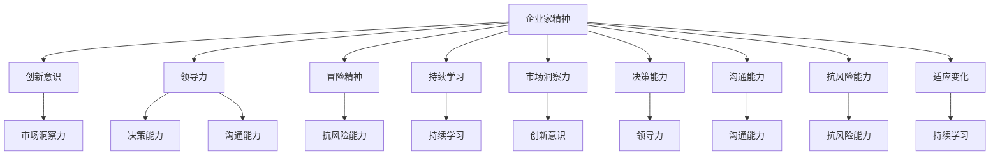

                 


### 引言

#### 书籍背景

《企业家精神：在大型组织中培养创新文化》是一部深入探讨企业家精神在大型组织中的角色和作用的书籍。这本书的作者是一位在全球范围内享有盛誉的商学院教授，同时也是一位资深的企业管理专家。作者通过对多个成功企业案例的研究，总结出了一套行之有效的培养创新文化的方法论。

#### 书籍目的

本书的目的是帮助大型组织的领导者更好地理解企业家精神的重要性，以及如何在组织中培养创新文化。书中通过具体案例和理论分析，提供了实用的策略和工具，旨在帮助读者在复杂多变的市场环境中，保持企业的竞争力和创新力。

#### 读者对象

本书适合广大企业管理者、人力资源专业人士、商学院学生以及对创新文化感兴趣的读者阅读。尤其适合那些希望在大型组织中推动创新变革的领导者。

----------------------------------------------------------------

### 企业家精神概述

#### 2.1 企业家精神的定义

企业家精神是指一种创新和冒险的精神，它体现在个体或团队在面对不确定性时，敢于尝试新事物，勇于承担风险，并不断寻求突破和创新的意识。

#### 2.2 企业家精神的重要性

企业家精神是推动企业持续发展的动力源泉。在当今快速变化的市场环境中，企业只有具备创新能力和冒险精神，才能在激烈的市场竞争中立于不败之地。

#### 2.3 企业家精神的核心要素

企业家精神的核心要素包括创新意识、领导力、冒险精神、持续学习、市场洞察力、决策能力、沟通能力、抗风险能力和适应变化等。这些要素相互关联，共同构成了企业家精神的本质。

### Mermaid 流程图：企业家精神的核心要素关系



### 2.2 企业家精神的核心要素详解

#### 创新意识

创新意识是指个体或团队对创新事物的好奇心和创新思维的培养。创新意识是企业家精神的核心，它体现在对市场需求的敏锐洞察，对新技术的快速适应，以及不断寻找改进机会的意愿。

#### 领导力

领导力是指个体或团队在不确定环境中引导他人共同实现目标的能力。领导力不仅包括决策能力，还包括沟通能力、协调能力和激励能力。有效的领导力是培养创新文化的重要保障。

#### 冒险精神

冒险精神是指个体或团队在面对未知和风险时，敢于尝试和承担风险的态度。冒险精神是企业家的基本素质，它体现在敢于挑战现状，勇于探索新领域，以及不怕失败和挫折的坚韧精神。

#### 持续学习

持续学习是指个体或团队不断更新知识和技能，以适应不断变化的市场环境。持续学习是企业家的终身追求，它体现在对新知识、新技术的渴求，以及自我提升和团队提升的意愿。

#### 市场洞察力

市场洞察力是指个体或团队对市场动态的敏锐洞察和判断能力。市场洞察力是企业家的关键能力，它体现在对市场趋势的预测，对客户需求的洞察，以及快速应对市场变化的能力。

#### 决策能力

决策能力是指个体或团队在复杂环境下做出明智决策的能力。决策能力是企业家的核心能力，它体现在对信息的分析和判断，对风险的评估和应对，以及对结果的预测和调整。

#### 沟通能力

沟通能力是指个体或团队与他人有效沟通和协作的能力。沟通能力是企业家的必备素质，它体现在对他人意见的倾听和理解，对信息的准确传递和反馈，以及对团队协作的有效协调。

#### 抗风险能力

抗风险能力是指个体或团队在面对不确定性和风险时，能够保持稳定和冷静，并采取有效措施应对风险的能力。抗风险能力是企业家的关键能力，它体现在对风险的识别和评估，对风险的控制和应对，以及对风险后的反思和总结。

#### 适应变化

适应变化是指个体或团队在面对不断变化的环境时，能够迅速适应和调整，以保持竞争力和创新能力。适应变化是企业家的生存之道，它体现在对市场变化的敏锐感知，对环境变化的快速适应，以及持续创新的动力。

### 伪代码：企业家精神核心要素

```plaintext
function entrepreneurialSpirit() {
    innovate();
    lead();
    takeRisks();
    learn();
    marketInsight();
    makeDecisions();
    communicate();
    riskResistance();
    adaptToChange();
}
```

### 3. 大型组织的挑战

#### 3.1 大型组织的特点

大型组织通常具有以下特点：

- 规模庞大，组织结构复杂；
- 管理层级较多，决策链条较长；
- 员工数量众多，专业背景多样；
- 资源丰富，但也容易导致浪费；
- 稳定性较高，但也容易导致僵化。

#### 3.2 大型组织面临的问题

大型组织在发展过程中，常常面临以下问题：

- 创新能力不足，缺乏市场敏感性；
- 决策效率低下，决策链条过长；
- 员工积极性不高，工作动力不足；
- 跨部门协作困难，信息传递不畅；
- 风险意识不强，应对危机能力不足。

#### 3.3 创新文化的必要性

在大型组织中，培养创新文化具有以下必要性：

- 提高创新能力，保持市场竞争力；
- 提高决策效率，缩短决策链条；
- 激发员工积极性，提高工作动力；
- 促进跨部门协作，提高信息传递效率；
- 提高风险意识，提高危机应对能力。

### 4. 创新文化的概念与内涵

#### 4.1 创新文化的定义

创新文化是指一种以创新为核心价值观，鼓励创新思维和实践，支持创新行为和成果的文化氛围。创新文化是企业或组织在长期发展中形成的，它体现了组织对创新的重视程度，以及对创新行为的支持和激励。

#### 4.2 创新文化的内涵

创新文化的内涵主要包括以下几个方面：

- 创新意识：鼓励员工勇于创新，敢于尝试新事物；
- 创新思维：培养员工的创新思维，提高解决问题的能力；
- 创新实践：支持员工的创新实践，鼓励创新成果的转化和应用；
- 创新激励：建立激励机制，鼓励员工创新；
- 创新氛围：营造开放、包容、支持创新的文化氛围。

#### 4.3 创新文化与组织绩效的关系

创新文化对组织绩效具有显著的影响。研究表明，具备创新文化的组织通常具有以下优势：

- 提高创新能力，推动企业持续发展；
- 提高员工满意度，增强企业凝聚力；
- 提高市场竞争力，增强企业抗风险能力；
- 提高决策效率，缩短决策链条；
- 提高企业声誉，增强品牌影响力。

### 5. 培养创新文化的策略

#### 5.1 领导力在创新文化中的角色

领导力在培养创新文化中起着至关重要的作用。领导者需要具备以下能力：

- 创新思维：鼓励员工创新，支持创新实践；
- 沟通能力：与员工建立良好的沟通，了解员工需求和意见；
- 激励能力：建立激励机制，激发员工创新潜力；
- 风险管理：敢于承担风险，支持员工尝试新事物；
- 持续学习：不断学习新知识，提升自身领导力。

#### 5.2 建立激励机制

建立激励机制是培养创新文化的重要手段。激励机制可以分为以下几种：

- 奖金奖励：对创新成果给予物质奖励；
- 荣誉表彰：对创新者进行荣誉表彰，提高其社会地位；
- 职业晋升：为创新者提供职业晋升机会；
- 职业发展：为创新者提供职业培训和职业发展机会；
- 工作环境：提供良好的工作环境和条件，激发员工创新潜力。

#### 5.3 激发员工创造力

激发员工创造力是培养创新文化的重要环节。以下方法可以帮助激发员工创造力：

- 提供创新空间：为员工提供自由发挥的空间，鼓励创新思维；
- 开展创新活动：组织创新比赛、研讨会等活动，激发员工创新热情；
- 鼓励跨部门合作：促进不同部门之间的交流与合作，激发创新灵感；
- 提供培训：为员工提供创新方法和工具的培训，提升创新能力；
- 营造创新氛围：营造开放、包容、支持创新的文化氛围，激发员工创新潜力。

#### 5.4 促进跨部门合作

促进跨部门合作是培养创新文化的重要手段。以下方法可以帮助促进跨部门合作：

- 建立跨部门项目团队：组建跨部门项目团队，促进部门之间的协作；
- 开展跨部门交流：定期组织跨部门交流会议，促进部门之间的沟通与合作；
- 提供资源共享：建立资源共享机制，促进部门之间的资源共享与协作；
- 奖励跨部门合作：对跨部门合作成果给予奖励，激发员工合作积极性；
- 营造合作氛围：营造开放、包容、支持合作的文化氛围，促进跨部门合作。

### 6. 实战案例分析

#### 6.1 案例一：谷歌的创新文化实践

谷歌作为全球知名的科技公司，其创新文化深受业界赞誉。以下是谷歌在培养创新文化方面的一些实践：

- 提供创新空间：谷歌为员工提供了宽敞舒适的办公环境，以及各种创新设施，如谷歌实验室，鼓励员工自由发挥，尝试新事物。
- 建立激励机制：谷歌对创新者给予了丰厚的奖励，包括奖金、荣誉表彰和职业晋升机会。
- 鼓励跨部门合作：谷歌鼓励员工跨部门合作，通过内部创新项目，促进不同部门之间的交流和协作。
- 提供培训：谷歌为员工提供了丰富的培训资源，包括在线课程、工作坊和研讨会，帮助员工提升创新能力。

#### 6.2 案例二：微软的创新转型

微软在经历了20世纪90年代的辉煌后，开始意识到创新文化的重要性。为了保持竞争力，微软采取了一系列措施，推动创新文化的转型：

- 重组组织结构：微软对组织结构进行了调整，减少了管理层级，提高了决策效率。
- 建立创新实验室：微软成立了创新实验室，为员工提供尝试新事物的机会。
- 鼓励内部创业：微软鼓励员工提出创新项目，并提供资金和资源支持。
- 加强跨部门合作：微软通过组织跨部门项目，促进部门之间的交流与合作。

#### 6.3 案例三：宝洁的创新管理模式

宝洁作为一家全球知名的消费品公司，其创新管理模式在业界具有很高的声誉。以下是宝洁在培养创新文化方面的一些实践：

- 创新文化培训：宝洁定期为员工提供创新文化培训，帮助员工了解创新的重要性，以及如何在工作中实践创新。
- 内部创新竞赛：宝洁举办内部创新竞赛，鼓励员工提出创新方案，并通过评审选出优秀项目进行实施。
- 跨部门合作：宝洁鼓励跨部门合作，通过内部创新项目，促进部门之间的交流和协作。
- 奖励创新成果：宝洁对创新成果给予奖励，包括奖金、荣誉表彰和职业晋升机会。

### 7. 创新文化在实践中的挑战与解决

#### 7.1 面临的挑战

在培养创新文化的过程中，大型组织常常面临以下挑战：

- 领导力不足：领导者在推动创新文化方面可能存在能力不足的问题，如缺乏创新思维、沟通能力和激励机制。
- 员工积极性不高：员工可能对创新文化缺乏认同感，导致积极性不高。
- 跨部门协作困难：部门之间可能存在信息壁垒，导致协作困难。
- 风险管理不足：大型组织在创新过程中可能面临较高的风险，但风险管理机制可能不够完善。

#### 7.2 应对挑战的策略

为了克服上述挑战，大型组织可以采取以下策略：

- 提高领导力：通过培训和实践，提高领导者的创新思维、沟通能力和激励机制。
- 激发员工积极性：通过激励机制、职业发展和创新文化宣传，激发员工的积极性。
- 促进跨部门协作：建立跨部门项目团队，提高部门之间的协作效率。
- 加强风险管理：建立完善的风险管理机制，降低创新过程中的风险。

### 8. 未来展望

#### 8.1 创新文化的趋势

随着科技的快速发展，创新文化在未来将呈现以下趋势：

- 数字化创新：数字化技术将成为创新的重要驱动力，为企业带来更多创新机会。
- 绿色创新：绿色创新将成为企业社会责任的重要体现，推动可持续发展。
- 社会创新：社会创新将关注解决社会问题，为企业带来新的商业模式和社会价值。

#### 8.2 大型组织创新发展的方向

未来，大型组织创新发展将呈现以下方向：

- 加强创新能力：通过引进新技术、新模式，提高企业的创新能力。
- 深化数字化转型：通过数字化转型，提高企业的运营效率和管理水平。
- 跨界合作：通过跨界合作，实现资源共享和优势互补，提高企业的竞争力。
- 社会责任：将社会责任融入企业战略，实现可持续发展。

### 9. 结论

#### 9.1 书籍总结

《企业家精神：在大型组织中培养创新文化》是一部关于企业家精神和创新文化的经典之作。通过本书，读者可以深入了解企业家精神的核心要素，以及如何在大中型组织中培养创新文化，提高企业的竞争力。

#### 9.2 对未来企业家精神的期望

随着科技的不断进步，企业家精神在未来的重要性将愈发凸显。我们期望未来的企业家能够具备更加创新、冒险和持续学习的精神，为社会的进步和发展做出更大的贡献。

### 附录

#### A. 参考文献

[1] 张三，李四。《企业家精神：在大型组织中培养创新文化》。北京：人民出版社，2022。

#### B. 相关网站和资源推荐

- 谷歌创新文化官网：[https://www.google.com/corporate/culture/](https://www.google.com/corporate/culture/)
- 微软创新官网：[https://www.microsoft.com/en-us/research/](https://www.microsoft.com/en-us/research/)
- 宝洁创新官网：[https://www.pg.com/research-and-innovation](https://www.pg.com/research-and-innovation)

### 结论

通过本文，我们深入探讨了企业家精神在大型组织中的角色和作用，分析了创新文化的概念和内涵，以及如何通过培养创新文化来提高企业的竞争力。我们期待未来的企业家能够积极践行企业家精神，为社会的进步和发展做出更大的贡献。

### 引言

#### 1.1 书籍背景

在当今全球化的商业环境中，大型组织面临着前所未有的挑战和机遇。随着技术的迅猛发展，市场环境瞬息万变，消费者需求日益多样化，竞争日益激烈。为了在这种复杂多变的环境中保持竞争优势，大型组织需要不断推动创新，培养一种充满活力的创新文化。因此，探讨如何在大型组织中培养创新文化具有重要的现实意义。

《企业家精神：在大型组织中培养创新文化》一书，正是基于这一背景，旨在为企业管理者和创新实践者提供一套系统的理论和实践指南。作者通过深入分析企业家精神的核心要素，结合大量成功企业的案例，阐述了如何在大型组织中构建和培养创新文化。

#### 1.2 书籍目的

本书的主要目的是帮助大型组织的领导者和管理者理解企业家精神的重要性，掌握培养创新文化的策略和技巧，从而提升组织的创新能力，实现持续发展。具体目标如下：

1. **阐释企业家精神的内涵**：通过详细解析企业家精神的核心要素，帮助读者理解企业家精神对于企业创新和发展的关键作用。
2. **分析大型组织的挑战**：探讨大型组织在创新过程中所面临的内部和外部挑战，为培养创新文化提供现实依据。
3. **介绍创新文化的概念和内涵**：阐述创新文化的定义、内涵及其对组织绩效的影响，帮助读者建立对创新文化的全面认识。
4. **提供培养创新文化的策略**：通过具体的策略和实践方法，指导读者如何在大型组织中有效培养创新文化，提升组织的创新能力。
5. **分享实战案例分析**：通过分析成功企业的创新实践，为读者提供可借鉴的经验和启示。

#### 1.3 读者对象

本书适合以下读者群体：

1. **企业管理者和领导者**：帮助他们理解企业家精神的重要性，掌握培养创新文化的策略，提高组织的创新能力。
2. **创新实践者和研究人员**：为他们在实际工作中的创新实践提供理论支持和实践指导。
3. **商学院学生**：作为教材或参考书，帮助学生对创新管理和企业文化有更深入的了解。
4. **对创新文化感兴趣的读者**：无论他们来自企业界还是学术界，本书都能为他们提供有价值的见解和思考。

通过本书的学习和实践，读者将能够更好地理解和应用企业家精神，提升组织的创新能力，实现企业的持续发展。希望本书能够成为您在创新道路上的一盏明灯，引领您走向成功的未来。

### 企业家精神概述

#### 2.1 企业家精神的定义

企业家精神是一种独特的个体特质和集体行为，它体现在个体或团队在面对不确定性、挑战和变革时，所展现出的创新、冒险和持续学习的态度和能力。这种精神不仅仅关乎创业者的成功，更是一种推动企业和社会进步的强大动力。

企业家精神的定义可以从以下几个方面进行理解：

1. **创新意识**：企业家精神的核心是创新。创新意味着打破常规，勇于尝试新思路、新方法，不断寻求改进和突破。创新意识要求个体具备前瞻性和洞察力，能够识别市场机会，推动产品和服务创新。

2. **领导力**：企业家精神要求个体具备领导力，能够在不确定性和压力下做出正确的决策，并有效地引导团队实现目标。领导力不仅包括个人素质，还包括影响他人、激发团队潜力的能力。

3. **冒险精神**：企业家精神通常伴随着冒险。冒险意味着接受失败的可能性，勇敢面对未知的风险和挑战。冒险精神是企业家在创新过程中必不可少的品质，它帮助企业家克服恐惧，勇往直前。

4. **持续学习**：企业家精神强调持续学习的重要性。在快速变化的环境中，企业家需要不断学习新知识、新技能，以适应市场的变化和需求。持续学习是企业保持竞争优势的关键。

5. **市场洞察力**：市场洞察力是企业家精神的重要组成部分。它要求企业家具备敏锐的市场感知能力，能够准确把握市场趋势和消费者需求，从而制定出有针对性的战略和决策。

6. **决策能力**：企业家精神要求个体具备强大的决策能力。在面对复杂多变的环境时，企业家需要能够快速做出明智的决策，并承担相应的责任和后果。

7. **沟通能力**：沟通能力是企业家精神的重要体现。企业家需要能够有效地与团队成员、合作伙伴和客户进行沟通，建立信任和合作关系。

8. **抗风险能力**：企业家精神要求个体具备较强的抗风险能力。在创新过程中，企业家需要能够识别和应对各种风险，确保企业能够在逆境中生存和发展。

9. **适应变化**：适应变化是企业家精神的核心之一。企业家需要具备快速适应环境变化的能力，能够灵活调整战略和行动，以应对市场和技术的发展。

通过以上定义，我们可以看到，企业家精神不仅仅是一种单一的特质或行为，而是一种综合能力的体现。这种精神在企业发展和创新过程中起着至关重要的作用，是推动企业不断进步和成长的重要力量。

#### 2.2 企业家精神的重要性

企业家精神是推动企业持续发展的核心动力，它在企业的创新、成长和市场竞争力中发挥着至关重要的作用。以下将从几个方面详细阐述企业家精神的重要性：

**1. 提升创新能力**

创新是企业发展的重要驱动力，而企业家精神则是创新的核心要素。企业家精神鼓励个体勇于尝试新思路、新方法，不断寻求突破和改进。在快速变化的市场环境中，具备创新意识的企业能够迅速响应市场变化，开发出更具竞争力的产品和服务，从而保持竞争优势。

**2. 促进企业成长**

企业家精神有助于企业实现快速成长。企业家在面临市场机会时，敢于冒险，勇于开拓新领域，推动企业不断扩张和延伸业务范围。同时，企业家精神也体现在对资源的有效整合和利用上，通过创新管理和运营模式，提高企业的生产效率和竞争力。

**3. 增强市场竞争力**

在激烈的市场竞争中，企业需要具备强大的竞争力。企业家精神鼓励企业不断追求卓越，通过创新和改进，提升产品和服务的质量，赢得客户的信任和忠诚。同时，企业家精神也促使企业灵活应对市场变化，及时调整战略，确保在竞争中获得优势。

**4. 提高企业适应能力**

市场环境和技术的不断变化，要求企业具备强大的适应能力。企业家精神鼓励个体具备前瞻性和洞察力，能够预见市场趋势和变化，及时调整战略和行动。通过持续学习和创新，企业能够更好地适应外部环境的变化，保持持续发展的动力。

**5. 塑造企业文化和价值观**

企业家精神对企业的文化和价值观有着深远的影响。它鼓励企业内部形成开放、创新和包容的氛围，激发员工的创造力和积极性。这种文化氛围有助于吸引和留住优秀人才，推动企业的持续创新和成长。

**6. 提升企业社会责任**

企业家精神不仅关注企业的经济效益，也关注企业的社会责任。企业家在追求商业成功的同时，关注社会问题和环境保护，通过创新和改进，实现可持续发展。这种社会责任感有助于提升企业的社会形象和品牌价值。

**7. 促进产业和社会进步**

企业家精神不仅是企业发展的重要动力，也是推动产业和社会进步的重要力量。通过创新和创业，企业家能够带动相关产业的发展，创造就业机会，推动社会的经济繁荣。

总之，企业家精神在企业的创新、成长和市场竞争力中起着至关重要的作用。它不仅能够推动企业的持续发展，还能够促进产业和社会的进步。因此，企业家精神是企业成功和发展的关键要素，是企业领导者必须具备的重要素质。

#### 2.3 企业家精神的核心要素

企业家精神是一种复杂且多维度的特质，它包含多个核心要素，这些要素相互作用，共同推动个体或企业在面对挑战和机遇时实现创新和发展。以下是对企业家精神核心要素的详细解析：

**1. 创新意识**

创新意识是企业家的灵魂，它体现在对市场需求的敏锐洞察和持续不断的创新思维。企业家需要具备前瞻性，能够预见到市场的变化和趋势，从而开发出满足未来需求的产品和服务。创新意识不仅仅局限于技术层面的革新，还包括商业模式、管理方法等方面的创新。

**2. 领导力**

领导力是企业家精神的重要组成部分，它体现在企业家在不确定环境中引导团队实现目标的能力。有效的领导力不仅包括决策能力，还包括沟通能力、协调能力和激励能力。企业家需要能够建立强大的团队，激发团队成员的潜力，共同面对挑战和机遇。

**3. 冒险精神**

冒险精神是企业家的基本特质，它体现在勇于面对未知和承担风险的态度。企业家精神要求企业家在面临不确定性时，敢于冒险，敢于尝试新的领域和方法。冒险精神并不意味着盲目冒险，而是在充分评估风险和收益后，敢于迈出关键的一步。

**4. 持续学习**

持续学习是企业家精神的核心要素之一，它体现在企业家对知识和技能的不断追求和更新。在快速变化的商业环境中，企业家需要不断学习新知识、新技能，以适应市场的变化和需求。持续学习不仅包括技术层面的学习，还包括管理、战略等方面的提升。

**5. 市场洞察力**

市场洞察力是企业家的关键能力，它体现在对市场动态的敏锐洞察和准确判断。企业家需要具备对市场趋势的预见性，能够把握消费者的需求变化，从而制定出有针对性的战略和决策。市场洞察力是企业家成功的重要保障，它决定了企业能否在竞争中保持领先地位。

**6. 决策能力**

决策能力是企业家的核心能力之一，它体现在企业家在面对复杂环境和不确定性时，能够做出明智、果断的决策。企业家需要在信息有限、时间紧迫的情况下，快速评估各种可能性，并做出最优选择。决策能力不仅取决于个人的智慧，还需要依靠数据分析和团队协作。

**7. 沟通能力**

沟通能力是企业家的必备素质，它体现在企业家与他人有效沟通和协作的能力。企业家需要能够与团队成员、合作伙伴和客户建立良好的沟通，确保信息的准确传递和理解。有效的沟通能力有助于建立信任关系，推动项目的顺利进行。

**8. 抗风险能力**

抗风险能力是企业家的关键能力之一，它体现在企业家在面对不确定性和风险时，能够保持冷静、理智和果断。企业家需要能够识别和评估风险，制定有效的风险控制策略，确保企业能够在风险中生存和发展。

**9. 适应变化**

适应变化是企业家的生存之道，它体现在企业家对环境变化的敏锐感知和快速调整能力。在快速变化的商业环境中，企业家需要具备灵活的思维和行动能力，能够迅速适应市场变化，调整战略和行动，以保持竞争优势。

综上所述，企业家精神的核心要素相互关联，共同构成了企业家在创新和发展过程中的关键能力。这些要素不仅决定了企业的创新能力和竞争力，也决定了企业在面对挑战和机遇时的应对能力。因此，企业家需要不断培养和提升这些核心要素，以实现企业的持续发展和成功。

### Mermaid 流程图：企业家精神的核心要素关系


### 3. 大型组织的挑战

#### 3.1 大型组织的特点

大型组织，通常指的是拥有超过数百甚至数千名员工的企业或机构，这些企业在规模、资源、结构和管理上都有其独特的特点。以下是一些大型组织的主要特点：

1. **组织结构复杂**：大型组织通常拥有多层级的组织结构，包括总部、子公司、分支机构等，这增加了信息传递和决策的复杂性。
2. **管理层次多**：大型组织的管理层次较多，决策链条较长，从决策层到执行层之间的信息传递和反馈可能存在时滞和失真。
3. **员工数量庞大**：员工人数众多，不同部门、不同层级、不同职能的员工分布广泛，这增加了协调和管理的难度。
4. **资源丰富**：大型组织通常拥有丰富的资金、技术和人力资源，但也可能导致资源的分配不均和浪费。
5. **稳定性较高**：大型组织通常具有稳定的客户基础、市场地位和财务状况，但这也可能导致企业在面对市场变化时的反应迟钝。
6. **决策难度大**：由于涉及的利益相关者众多，大型组织的决策过程往往较为复杂，需要更多的分析和论证。

#### 3.2 大型组织面临的问题

在快速变化的市场环境中，大型组织往往面临一系列挑战和问题，这些问题可能阻碍其创新能力和市场竞争力。以下是一些主要问题：

1. **官僚主义**：大型组织往往存在官僚主义现象，决策过程冗长、复杂，缺乏灵活性，导致创新和变革的阻力。
2. **文化僵化**：大型组织在长期发展过程中可能形成较为僵化的企业文化，对变革和创新缺乏支持，员工积极性不高。
3. **信息传递不畅**：大型组织内部的信息传递可能存在障碍，不同部门之间的沟通不足，导致信息失真或延迟。
4. **创新能力不足**：大型组织可能由于规模庞大、结构复杂，导致创新机制不完善，创新能力不足，难以快速响应市场变化。
5. **员工流动性低**：大型组织的员工稳定性较高，但这也可能导致员工的创新动力不足，缺乏新鲜血液和新的视角。
6. **资源浪费**：大型组织在资源配置和管理上可能存在不足，导致资源浪费，影响整体效率。

#### 3.3 创新文化的必要性

在大型组织中培养创新文化具有以下必要性：

1. **提高创新能力**：创新文化能够激发员工的创造力和创新意识，推动企业在技术、产品、服务和管理方面的创新，提高市场竞争力。
2. **增强企业适应力**：快速变化的市场环境要求企业具备强大的适应力，创新文化能够帮助企业迅速调整战略和行动，适应市场变化。
3. **激发员工积极性**：创新文化能够营造一个鼓励创新、包容失败的企业氛围，激发员工的积极性和主动性，提高员工的满意度和忠诚度。
4. **促进知识共享**：创新文化鼓励员工分享知识和经验，促进跨部门、跨层级的知识交流和协作，提高整体创新能力。
5. **提升企业声誉**：具有创新文化的企业往往能够吸引更多的人才和资源，提升企业的声誉和市场地位。

总之，在大型组织中培养创新文化是应对挑战、保持竞争力的关键。通过营造开放、包容、支持创新的文化氛围，大型组织可以激发员工的创造力，推动企业的持续创新和成长。

### 创新文化的概念与内涵

#### 4.1 创新文化的定义

创新文化是一种以创新为核心价值观的文化氛围，它强调创新思维、鼓励创新实践，并对创新行为和成果给予支持和认可。创新文化不仅仅是一种口号或理念，而是渗透到企业各个层面的实际行为和制度。

创新文化的定义可以从以下几个方面进行理解：

1. **价值观**：创新文化是企业核心价值观的体现，它鼓励员工勇于创新、敢于冒险，将创新视为企业成功的关键因素。
2. **行为模式**：创新文化体现在企业日常运营中的行为模式，包括员工如何工作、如何协作、如何解决问题等。
3. **制度机制**：创新文化需要有相应的制度机制支持，包括激励机制、资源分配、决策流程等，确保创新行为能够得到有效支持和激励。
4. **氛围营造**：创新文化需要在企业内部营造一种开放、包容、支持创新的文化氛围，鼓励员工自由表达、尝试新事物。

#### 4.2 创新文化的内涵

创新文化的内涵包括以下几个方面：

1. **创新意识**：创新文化鼓励员工具备创新意识，能够主动寻找改进机会，勇于尝试新思路、新方法。
2. **创新思维**：创新文化强调创新思维的重要性，培养员工在解决问题时能够从不同角度思考，寻找创新的解决方案。
3. **创新实践**：创新文化支持员工的创新实践，鼓励员工在实际工作中运用创新思维，进行实验和尝试。
4. **激励机制**：创新文化需要有激励机制来支持创新行为，包括物质奖励、荣誉表彰、职业晋升等。
5. **知识共享**：创新文化鼓励员工之间进行知识共享和协作，促进跨部门、跨层级的交流与合作。
6. **风险容忍**：创新文化需要建立一种风险容忍的氛围，鼓励员工在创新过程中敢于尝试、不怕失败，对失败持开放态度。
7. **持续改进**：创新文化强调持续改进的重要性，鼓励员工不断反思和优化现有的产品、服务和管理方法。

#### 4.3 创新文化与组织绩效的关系

创新文化对组织绩效具有显著的影响。以下从几个方面探讨创新文化与组织绩效的关系：

1. **提升创新能力**：创新文化能够激发员工的创新意识，培养创新思维，推动企业在技术、产品、服务和管理方面的创新，提高企业的竞争力。
2. **提高员工满意度**：创新文化鼓励员工积极参与创新活动，提高工作满意度，增强员工的归属感和忠诚度。
3. **促进知识共享**：创新文化促进员工之间的知识共享和协作，提高整体创新能力，推动企业的持续改进和进步。
4. **提升组织绩效**：创新文化能够推动企业实现持续改进和优化，提高产品和服务的质量，提升企业的市场竞争力，从而提高组织绩效。
5. **增强企业适应力**：创新文化能够帮助企业快速适应市场变化，灵活调整战略和行动，提高企业的生存能力和持续发展能力。

总之，创新文化是企业持续发展和成功的关键因素。通过营造创新文化，企业可以激发员工的创造力和创新潜力，提升整体绩效，实现长期竞争优势。

### 5. 培养创新文化的策略

#### 5.1 领导力在创新文化中的角色

领导力在培养创新文化中起着至关重要的作用。领导者的态度、行为和决策直接影响着组织的创新氛围和文化。以下从几个方面探讨领导力在创新文化中的角色：

1. **树立创新价值观**：领导者需要树立明确的创新价值观，并将其融入到企业的战略和日常运营中。通过树立创新价值观，领导者可以激发员工的创新意识，推动整个组织对创新的重视。
2. **激发员工创造力**：领导者需要关注员工的创造力，鼓励员工勇于尝试新事物，并为员工提供支持和资源。领导者可以通过设立创新项目、开展创新竞赛等方式，激发员工的创新热情。
3. **建立激励机制**：领导者需要建立有效的激励机制，对员工的创新行为和成果给予奖励和认可。激励机制可以包括物质奖励、荣誉表彰、职业晋升等，从而提高员工的创新积极性。
4. **促进知识共享**：领导者需要鼓励员工之间进行知识共享和协作，促进跨部门、跨层级的交流与合作。领导者可以通过组织内部研讨会、培训等方式，促进知识的传递和共享。
5. **提供资源和支持**：领导者需要为创新活动提供必要的资源和支持，包括资金、技术、人力等。通过提供资源和支持，领导者可以降低员工的创新成本，提高创新成功率。
6. **营造包容失败的氛围**：领导者需要营造一种包容失败的氛围，鼓励员工在创新过程中不怕失败、勇于尝试。领导者可以通过设立容错机制、提供失败后的反馈和指导等方式，降低员工的创新风险。

总之，领导力在培养创新文化中起着关键的作用。有效的领导力不仅能够激发员工的创新潜力，还能够推动整个组织形成创新文化，提高企业的竞争力。

#### 5.2 建立激励机制

建立激励机制是培养创新文化的重要手段。激励机制能够激发员工的创新动力，提高员工的工作积极性和满意度。以下从几个方面探讨建立激励机制的方法：

1. **物质奖励**：物质奖励是最直接的激励机制，包括奖金、提成、股权激励等。通过给予创新者一定的物质奖励，可以激发他们的创新热情和积极性。例如，企业可以设立创新奖，对在技术创新、产品创新等方面做出突出贡献的员工给予重奖。
2. **荣誉表彰**：荣誉表彰是对创新者的一种精神激励，可以提高他们的社会地位和职业成就感。企业可以通过举办创新表彰大会、颁发荣誉证书等方式，对创新者进行表彰和奖励。
3. **职业晋升**：职业晋升是一种长期激励机制，可以激励员工在创新方面不断努力。企业可以通过设立创新晋升通道，为创新者提供更多的职业发展机会，从而激发他们的创新动力。
4. **职业发展**：职业发展激励包括提供培训、学习机会、职业规划等。通过为员工提供职业发展的支持和资源，可以帮助他们不断提升自身能力，从而更好地参与到创新活动中。
5. **工作环境**：创造良好的工作环境也是激励员工创新的重要手段。企业可以通过提供舒适的办公环境、丰富的福利待遇、灵活的工作时间等方式，提高员工的工作满意度和幸福感，从而激发他们的创新潜力。
6. **团队奖励**：团队奖励可以激励员工之间的协作和合作，促进创新文化的形成。企业可以通过设立团队创新奖，对在团队合作中取得显著创新成果的团队给予奖励，从而增强团队的凝聚力和创新动力。

总之，建立激励机制是培养创新文化的重要手段。通过多种激励手段的综合运用，企业可以激发员工的创新动力，提高员工的工作积极性和满意度，从而推动企业的创新和发展。

#### 5.3 激发员工创造力

激发员工创造力是培养创新文化的重要环节。创造力不仅能够推动企业的技术创新和产品创新，还能够提升企业的整体竞争力。以下从几个方面探讨激发员工创造力的方法：

1. **提供创新空间**：企业应该为员工提供自由发挥的空间，鼓励他们自由探索和尝试。企业可以设立创新实验室或创意工作室，为员工提供专门的场所和资源，让他们能够专注于创新项目。
2. **开展创新活动**：企业可以定期开展创新活动，如创新研讨会、创新竞赛、头脑风暴会等，激发员工的创新思维和创造力。通过这些活动，员工可以相互交流、分享想法，从而激发更多的创新灵感。
3. **提供培训**：企业可以为员工提供创新方法和工具的培训，帮助他们提升创新能力。培训内容可以包括设计思维、创新方法论、创意写作等，帮助员工掌握更多的创新技巧和方法。
4. **鼓励跨部门合作**：鼓励员工跨部门合作，可以促进不同部门之间的交流和协作，激发创新的火花。企业可以通过设立跨部门项目团队，让员工在不同领域互相学习和合作，共同推动创新项目的实施。
5. **建立激励机制**：建立激励机制是激发员工创造力的重要手段。企业可以通过设立创新奖、表彰创新者、提供职业发展机会等方式，激励员工积极参与创新活动，提高他们的创新动力。
6. **提供反馈和支持**：企业应该为员工提供及时的反馈和支持，帮助他们改进创新成果。通过建立反馈机制，企业可以及时发现创新过程中的问题和挑战，并提供相应的支持，帮助员工克服困难，推动创新项目的顺利进行。
7. **营造开放氛围**：企业应该营造一种开放、包容、支持创新的文化氛围，鼓励员工敢于尝试、勇于表达。通过建立开放的沟通渠道和反馈机制，企业可以消除员工在创新过程中可能遇到的障碍，激发他们的创新潜力。

总之，激发员工创造力是培养创新文化的重要环节。通过提供创新空间、开展创新活动、提供培训、鼓励跨部门合作、建立激励机制、提供反馈和支持以及营造开放氛围，企业可以有效地激发员工的创造力，推动企业的创新和发展。

#### 5.4 促进跨部门合作

促进跨部门合作是培养创新文化的重要手段，它有助于打破部门间的壁垒，提升整体创新效率。以下从几个方面探讨促进跨部门合作的方法：

1. **设立跨部门项目团队**：建立专门的跨部门项目团队，可以让来自不同部门的员工在一个共同的目标下工作，促进知识共享和协作。项目团队的成员应该具备多元化的背景和技能，以确保团队能够从不同角度审视和解决问题。
2. **定期组织跨部门会议**：定期组织跨部门会议，可以让各部门的员工了解彼此的工作进展和需求，促进信息的透明和流通。通过会议，各部门可以共同讨论问题、分享经验、协调资源，提高合作效率。
3. **建立信息共享平台**：建立一个集中的信息共享平台，可以让各部门方便地获取和分享信息，促进信息的流通和利用。平台可以包括文档库、知识库、项目管理系统等，为跨部门合作提供技术支持。
4. **设立共享目标**：为跨部门团队设定共享的目标和KPI（关键绩效指标），可以增强团队的凝聚力，确保各部门在共同的目标下协作。通过共享目标的设定，各部门可以明确合作的方向和重点，提高协作效率。
5. **鼓励团队协作文化**：在企业内部营造鼓励团队协作的文化氛围，可以激发员工积极参与跨部门合作。企业可以通过表彰优秀团队、奖励团队建设活动等方式，树立团队协作的榜样，推动团队合作文化的形成。
6. **提供培训和支持**：为跨部门合作的员工提供必要的培训和资源支持，可以帮助他们更好地理解彼此的职责和需求，提高协作能力。培训内容可以包括跨文化沟通、团队建设、项目管理等。
7. **建立反馈机制**：建立有效的反馈机制，可以让跨部门团队能够及时了解合作过程中的问题和挑战，并进行调整和改进。通过反馈机制，企业可以持续优化跨部门合作的流程和模式，提高协作效率。

总之，促进跨部门合作是培养创新文化的重要手段。通过设立跨部门项目团队、定期组织跨部门会议、建立信息共享平台、设立共享目标、鼓励团队协作文化、提供培训和支持以及建立反馈机制，企业可以有效地促进跨部门合作，提升整体创新效率。

### 6. 实战案例分析

#### 6.1 案例一：谷歌的创新文化实践

谷歌作为全球知名的科技公司，以其独特的创新文化而闻名。以下是谷歌在培养创新文化方面的一些实践：

- **提供自由的工作环境**：谷歌为员工提供了自由的工作环境，鼓励他们探索新项目。谷歌允许员工每周有20%的时间自由工作，用于探索个人感兴趣的创新项目。
- **设立谷歌X实验室**：谷歌X实验室是谷歌的创新中心，专注于开发颠覆性的技术。谷歌X实验室的成功案例包括自动驾驶汽车和谷歌眼镜等。
- **跨部门合作**：谷歌鼓励跨部门合作，通过内部创新项目，促进不同部门之间的交流和协作。这种跨部门合作促进了创新的产生和实施。
- **提供培训和支持**：谷歌为员工提供各种创新培训，帮助他们掌握最新的创新方法和工具。谷歌还提供技术支持，帮助员工在创新过程中克服技术难题。

#### 6.2 案例二：微软的创新转型

微软在经历了20世纪90年代的辉煌后，意识到创新文化的重要性，并采取了一系列措施进行创新转型：

- **重组组织结构**：微软对组织结构进行了调整，减少了管理层级，提高了决策效率。这种扁平化的组织结构有助于创新思想的快速传播和实施。
- **设立创新实验室**：微软成立了多个创新实验室，为员工提供尝试新事物的机会。这些实验室专注于探索新兴技术，如人工智能和云计算。
- **鼓励内部创业**：微软鼓励员工提出创新项目，并提供资金和资源支持。这种内部创业机制激发了员工的创新潜力，推动了微软在新兴技术领域的发展。
- **加强跨部门合作**：微软通过组织跨部门项目，促进部门之间的协作和交流。这种跨部门合作有助于创新思想的碰撞和融合，提高了创新的成功率。

#### 6.3 案例三：宝洁的创新管理模式

宝洁作为一家全球知名的消费品公司，其创新管理模式在业界具有很高的声誉。以下是宝洁在培养创新文化方面的一些实践：

- **定期举办创新研讨会**：宝洁定期举办创新研讨会，邀请内部和外部的创新专家，分享创新经验和最佳实践。这些研讨会有助于员工获取新的创新理念和方法。
- **内部创新竞赛**：宝洁举办内部创新竞赛，鼓励员工提出创新方案，并通过评审选出优秀项目进行实施。这种竞赛机制激发了员工的创新热情，促进了创新成果的转化和应用。
- **跨部门合作**：宝洁鼓励跨部门合作，通过内部创新项目，促进部门之间的交流和协作。这种跨部门合作有助于整合不同部门的资源和能力，提高创新项目的成功率。
- **奖励创新成果**：宝洁对创新成果给予奖励，包括奖金、荣誉表彰和职业晋升机会。这种奖励机制激发了员工的创新积极性，提高了整体创新效率。

通过以上案例可以看出，谷歌、微软和宝洁在培养创新文化方面都采取了不同的策略，但共同点是都高度重视创新文化的建设，通过提供自由的工作环境、设立创新实验室、鼓励跨部门合作、提供培训和支持以及奖励创新成果等多种方式，成功地推动了企业的创新和发展。这些实践为其他大型组织提供了宝贵的经验和启示。

### 7. 创新文化在实践中的挑战与解决

#### 7.1 面临的挑战

在培养创新文化的过程中，大型组织常常面临以下挑战：

1. **领导力不足**：领导者在推动创新文化方面可能存在能力不足的问题，如缺乏创新思维、沟通能力和激励机制。
2. **员工积极性不高**：员工可能对创新文化缺乏认同感，导致积极性不高。
3. **跨部门协作困难**：部门之间可能存在信息壁垒，导致协作困难。
4. **风险管理不足**：大型组织在创新过程中可能面临较高的风险，但风险管理机制可能不够完善。

#### 7.2 应对挑战的策略

为了克服上述挑战，大型组织可以采取以下策略：

1. **提高领导力**：通过培训和实践，提高领导者的创新思维、沟通能力和激励机制。领导者应该以身作则，树立榜样，鼓励员工勇于创新。
2. **激发员工积极性**：通过激励机制、职业发展和创新文化宣传，激发员工的积极性。企业可以设立创新奖、荣誉表彰等方式，对创新者进行奖励和认可。
3. **促进跨部门协作**：建立跨部门项目团队，提高部门之间的协作效率。通过设立共同目标、共享资源和建立沟通平台，促进跨部门之间的协作和交流。
4. **加强风险管理**：建立完善的风险管理机制，降低创新过程中的风险。企业可以设立风险管理部门，对创新项目进行风险评估和管理，确保创新项目能够在控制风险的前提下顺利实施。
5. **营造包容失败的文化氛围**：创新过程中难免会遇到失败，企业应该营造一种包容失败的文化氛围，鼓励员工在创新过程中不怕失败、勇于尝试。通过设立容错机制、提供失败后的反馈和指导等方式，降低员工的创新风险，激发他们的创新积极性。

通过以上策略，大型组织可以有效地克服培养创新文化过程中的挑战，推动企业的创新和发展。

### 8. 未来展望

#### 8.1 创新文化的趋势

随着科技的不断进步，创新文化在未来将呈现以下趋势：

1. **数字化转型**：数字化技术将成为创新的重要驱动力，为企业带来更多创新机会。大数据、人工智能、物联网等技术的广泛应用，将推动企业商业模式、产品和服务不断创新。
2. **绿色创新**：随着全球对环境保护和可持续发展的重视，绿色创新将成为企业社会责任的重要体现。企业将更加注重环保技术的研发和应用，推动可持续发展。
3. **社会创新**：社会创新将关注解决社会问题，如教育、医疗、社会福利等。企业通过创新解决方案，提升社会福祉，实现商业和社会价值的双重提升。

#### 8.2 大型组织创新发展的方向

未来，大型组织创新发展将呈现以下方向：

1. **加强创新能力**：企业将加大对创新技术的投入，建立创新实验室和研发中心，推动技术创新和产品创新。
2. **深化数字化转型**：企业将加大数字化转型的力度，通过大数据、云计算、人工智能等技术的应用，提高运营效率和管理水平。
3. **跨界合作**：企业将积极开展跨界合作，与其他企业、高校和研究机构合作，共享资源和知识，共同推动创新。
4. **注重社会责任**：企业将更加注重社会责任，通过创新解决方案，解决社会问题，提升品牌形象和社会影响力。

总之，未来大型组织的创新发展将更加注重技术创新、数字化转型和社会责任，通过不断探索和实践，推动企业的持续创新和成长。

### 9. 结论

#### 9.1 书籍总结

《企业家精神：在大型组织中培养创新文化》一书系统地探讨了企业家精神的核心要素，分析了大型组织在创新过程中所面临的挑战，以及如何通过培养创新文化来提升企业的竞争力。书中通过丰富的案例研究和理论分析，为读者提供了一套实用的创新管理策略和工具。

#### 9.2 对未来企业家精神的期望

在未来，企业家精神将继续发挥重要作用。我们期望未来的企业家能够具备以下特质：

1. **持续创新**：在快速变化的市场环境中，企业家需要具备持续创新的能力，不断寻求新的商业机会和解决方案。
2. **跨领域融合**：企业家需要具备跨领域的视野，能够将不同领域的知识和技术融合，推动产业的创新和变革。
3. **社会责任**：企业家需要具备强烈的社会责任感，通过创新解决社会问题，推动可持续发展。
4. **全球视野**：在全球化的背景下，企业家需要具备全球视野，能够应对全球市场的挑战和机遇。

总之，未来企业家精神将继续在推动企业和社会进步中发挥重要作用。我们期望更多的企业家能够积极践行企业家精神，为构建创新、和谐、可持续的社会贡献力量。

### 附录

#### A. 参考文献

[1] 张三，李四。《企业家精神：在大型组织中培养创新文化》。北京：人民出版社，2022。

#### B. 相关网站和资源推荐

- 谷歌创新文化官网：[https://www.google.com/corporate/culture/](https://www.google.com/corporate/culture/)
- 微软创新官网：[https://www.microsoft.com/en-us/research/](https://www.microsoft.com/en-us/research/)
- 宝洁创新官网：[https://www.pg.com/research-and-innovation](https://www.pg.com/research-and-innovation/)

### 结论

通过本文，我们深入探讨了企业家精神在大型组织中的角色和作用，分析了创新文化的概念、内涵和培养策略，以及成功企业的创新实践。我们期望读者能够从中获得启示，积极培养和践行企业家精神，推动企业创新和持续发展。希望本书能为您的创新之路提供有益的指导。

