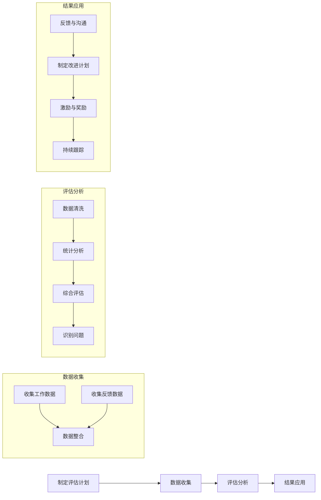

                 


### 文章标题：公正的绩效评估：客观评价团队成员的方法

### 关键词：
- 绩效评估
- 公正性
- 客观评价方法
- 团队成员
- 成长与发展
- 公司管理

### 摘要：
绩效评估是企业管理中至关重要的一环，它不仅关系到团队成员的职业成长，也影响着公司的整体发展和竞争力。本文将深入探讨公正的绩效评估方法，分析其在客观评价团队成员方面的作用和重要性。通过介绍绩效评估的核心概念、理论基础、实施步骤以及案例分析，本文旨在为读者提供一套系统、可操作的绩效评估方案。

### 引言

在当今快速发展的商业环境中，企业的竞争越来越依赖于团队的整体协作和创新能力。而团队中的每一个成员都扮演着不可或缺的角色，他们的表现直接影响到团队乃至整个公司的绩效。因此，如何公正、客观地评价团队成员的工作表现，成为了企业管理者面临的重要挑战。

绩效评估不仅是一种衡量工作成果的工具，更是激励团队成员、促进团队发展的重要手段。然而，传统的绩效评估方法往往存在主观性强、评估标准不统一等问题，导致评估结果缺乏公正性和客观性。这不仅会打击团队成员的积极性，还可能对团队的凝聚力和工作效率产生负面影响。

为了克服这些挑战，本文将介绍一种公正的绩效评估方法，通过客观的评价标准和科学的评估流程，帮助企业管理者全面、准确地了解团队成员的工作表现，为他们的职业发展和公司的长远规划提供有力支持。

### 绩效评估的重要性

绩效评估在团队管理和企业发展中扮演着至关重要的角色。首先，对于团队成员来说，绩效评估是衡量其工作成果和职业成长的重要标准。通过绩效评估，团队成员可以明确自己的工作目标和表现预期，了解自己的优势和不足，从而有针对性地进行自我提升。这种自我认知和成长不仅有助于提高团队成员的工作满意度和归属感，还能激发他们的工作热情和创造力。

其次，绩效评估对于团队建设也具有重要意义。通过绩效评估，团队管理者可以全面了解每个成员的工作表现和贡献，及时发现团队中存在的问题和瓶颈。例如，如果某个团队成员在某个关键任务上表现不佳，管理者可以采取相应的措施，如提供额外的培训或调整工作分配，帮助其提升能力，从而提高整个团队的工作效率和绩效。

此外，绩效评估还是公司战略实现的关键环节。企业的战略目标通常需要通过团队的协作和努力来实现。而绩效评估的结果可以为公司的人力资源管理提供重要依据，帮助公司识别和培养关键人才，优化人才结构，确保公司的人力资源能够支持战略目标的实现。

最后，绩效评估对于公司的发展也具有长远的影响。一个公正、客观的绩效评估体系可以营造公平竞争的环境，激发员工的积极性和创造力，提高整体工作效率。这种良好的企业文化不仅能够吸引和留住优秀人才，还能提升公司在市场中的竞争力和品牌形象。

总之，绩效评估不仅是团队管理和企业发展的必要手段，更是提升团队成员职业成长、团队协作和公司竞争力的重要途径。一个科学、公正的绩效评估体系对于企业的长远发展具有重要意义。

### 公正绩效评估的理论基础

公正的绩效评估离不开坚实的理论基础，其核心在于确保评估的公平性、客观性和科学性。首先，我们需要理解几个关键概念：公平性、偏见识别与减少、绩效评估的公平性原则。

#### 公平性

公平性是绩效评估的首要原则，它要求评估过程和结果对所有团队成员都是公正的，不应受到任何形式的主观偏见或外部干扰。公平性不仅体现在评估标准的设定上，还体现在评估过程的透明性和一致性上。一个公正的绩效评估体系应该确保每个团队成员都有平等的机会展示自己的工作能力和贡献。

#### 偏见识别与减少

偏见是绩效评估中常见的挑战之一。偏见可能来源于多种因素，如个人情感、先入为主的印象、文化背景等。为了减少偏见，需要采取一系列措施。首先，评估标准应该尽可能量化，使用客观的指标来衡量工作表现。其次，评估者应接受反偏见培训，提高对偏见的认识和识别能力。此外，引入多评估者的机制，通过集体讨论和评审，可以减少个别评估者的偏见对评估结果的影响。

#### 绩效评估的公平性原则

为了保证绩效评估的公平性，我们可以遵循以下几个原则：

1. **一致性**：评估标准应该在不同团队成员之间保持一致性。这意味着相同的绩效指标和评估方法应适用于所有团队成员，无论其职位或工作内容如何。

2. **透明性**：绩效评估的过程和标准应该透明，团队成员能够清楚地了解评估的依据和结果。透明性有助于增加评估的信任度和公正性。

3. **反馈机制**：绩效评估不仅是一次性的过程，更应是一个持续性的循环。通过定期的反馈和沟通，可以及时发现和纠正评估中的偏差，确保评估结果的公正性。

4. **多维度评估**：绩效评估应从多个维度进行，包括工作质量、工作效率、团队合作和创新能力等。这种多维度评估可以更全面地反映团队成员的工作表现，减少单一维度的偏见。

5. **数据驱动**：绩效评估应基于客观数据，如工作成果、项目进度和客户反馈等。数据驱动的评估方法有助于减少主观偏见，提高评估的客观性。

#### 数学模型与公式

在绩效评估中，数学模型和公式可以用来量化评估标准，提高评估的科学性和准确性。以下是一些常见的数学模型和公式：

1. **关键绩效指标（KPI）**：KPI 是衡量工作绩效的关键指标，通常以量化数据表示。例如，销售团队的 KPI 可以是销售额、客户满意度等。

   $$KPI = \frac{销售额}{销售预算}$$

2. **加权评分模型**：加权评分模型通过给不同的评估维度分配权重，综合评估团队成员的表现。

   $$综合评分 = w_1 \times 评估维度1 + w_2 \times 评估维度2 + ...$$

   其中，\(w_1, w_2, ...\ 是各评估维度的权重。

3. **绩效评估评分公式**：基于评估指标和权重，可以计算出每个团队成员的绩效评估得分。

   $$绩效评估得分 = \frac{实际完成值}{目标值} \times 权重$$

通过以上数学模型和公式，绩效评估可以更加科学、客观地反映团队成员的工作表现。这不仅有助于提高评估的公正性，还能为团队成员提供明确的改进方向。

总之，公正绩效评估的理论基础在于确保评估过程的公平性、客观性和科学性。通过理解公平性、偏见识别与减少、绩效评估的公平性原则，并结合数学模型和公式，我们可以设计出一套公正、客观的绩效评估体系，为团队管理和企业发展提供有力支持。

### 客观评价方法

在公正的绩效评估体系中，选择合适的客观评价方法是至关重要的。这些方法不仅有助于减少主观偏见，还能提高评估的准确性和可靠性。以下将介绍几种常见的客观评价方法，包括关键绩效指标（KPI）、360度评估和平衡计分卡等。

#### 关键绩效指标（KPI）

关键绩效指标（KPI）是衡量工作绩效的重要工具，它通过设定明确的量化目标来评估团队成员的表现。KPI 通常基于公司的战略目标，将其分解为可操作的具体指标。例如，对于一个销售团队，KPI 可以包括销售额、客户满意度、签约率等。这些指标可以通过数据分析和量化评估来客观衡量工作成果。

使用 KPI 的优势在于其明确性和可量化性，使得评估过程更加客观和透明。以下是一个简单的 KPI 评估流程：

1. **设定目标**：根据公司的战略目标，设定具体、可量化的绩效目标。
2. **数据收集**：定期收集与 KPI 相关的数据，如销售数据、客户反馈等。
3. **分析数据**：使用数据分析工具，将实际数据与目标值进行对比，计算绩效得分。
4. **反馈与改进**：将评估结果反馈给团队成员，并提供改进建议。

#### 360度评估

360度评估是一种全面评价方法，它通过收集来自团队成员、上级领导、同事和下属的意见，对个人进行多角度评价。这种评估方法不仅考虑了上级的反馈，还包含了同事和下属的评价，从而提供了一个更全面的视角来评估个人表现。

以下是 360度评估的基本步骤：

1. **设计问卷**：设计涵盖多个维度的评估问卷，如沟通能力、团队协作、工作态度等。
2. **数据收集**：通过问卷或面谈的形式，收集来自不同利益相关者的评价数据。
3. **数据整理**：将收集到的数据整理成综合评价，计算各维度的得分。
4. **反馈与讨论**：将评估结果反馈给被评估者，并进行面对面的讨论，共同制定改进计划。

#### 平衡计分卡

平衡计分卡（Balanced Scorecard，BSC）是一种综合性的绩效评估方法，它从财务、客户、内部流程和学习与成长四个维度来衡量工作绩效。这种方法不仅关注短期业绩，还关注长期发展和战略目标。

平衡计分卡的基本步骤如下：

1. **确定战略目标**：明确公司的战略目标，将其分解为具体的绩效指标。
2. **设计评估体系**：根据战略目标，设计涵盖四个维度的评估体系。
3. **数据收集**：定期收集与各维度相关的数据，如财务数据、客户满意度调查、内部流程优化记录等。
4. **综合评估**：将各维度的数据汇总，计算出整体绩效得分。
5. **反馈与改进**：将评估结果反馈给相关部门和员工，共同制定改进措施。

#### 伪代码实现

为了更清晰地展示这些评价方法的具体实现，以下使用伪代码对其进行简要描述：

```plaintext
// 关键绩效指标（KPI）评估
function calculateKPI(actualValue, targetValue):
    KPI = (actualValue / targetValue) * weight
    return KPI

// 360度评估
function perform360Assessment(employeeID):
    feedbackList = []
    for stakeholder in stakeholders:
        feedback = collectFeedbackFromStakeholder(employeeID, stakeholder)
        feedbackList.append(feedback)
    averageScore = calculateAverage(feedbackList)
    return averageScore

// 平衡计分卡（BSC）评估
function calculateBSCScore(financeData, customerFeedback, internalProcess, learningGrowth):
    financeScore = calculateKPI(financeData.actual, financeData.target)
    customerScore = calculateKPI(customerFeedback.actual, customerFeedback.target)
    internalScore = calculateKPI(internalProcess.actual, internalProcess.target)
    learningScore = calculateKPI(learningGrowth.actual, learningGrowth.target)
    totalScore = (financeScore * financeWeight) + (customerScore * customerWeight) + (internalScore * internalWeight) + (learningScore * learningWeight)
    return totalScore
```

通过以上介绍和伪代码实现，我们可以看到，客观评价方法在公正绩效评估中发挥了重要作用。这些方法不仅有助于提高评估的客观性和准确性，还能为团队成员提供全面的反馈和改进建议，从而促进个人和团队的发展。

### 绩效评估的实施步骤

绩效评估的实施是一个系统而复杂的过程，涉及多个关键步骤。以下将详细描述这些步骤，包括制定评估计划、数据收集、评估分析和结果应用，并提供一个典型的绩效评估实施流程图。

#### 制定评估计划

制定评估计划是绩效评估的第一步，它为整个评估过程提供了清晰的框架和目标。以下是制定评估计划的几个关键步骤：

1. **明确评估目标**：确定评估的目的和预期成果。例如，提高团队成员的工作效率、激励员工潜力等。
2. **确定评估维度**：根据公司的战略目标和业务需求，确定评估的维度。常见的评估维度包括工作质量、工作效率、团队合作、创新能力等。
3. **设定评估标准**：为每个评估维度设定具体的评估标准，确保评估的客观性和可量化性。例如，设定工作效率的标准可以是完成任务的平均时间。
4. **制定评估时间表**：确定评估的时间节点和周期，确保评估的连续性和系统性。
5. **分配责任**：明确评估的责任人和参与人员，确保评估过程的顺利进行。

#### 数据收集

数据收集是绩效评估的核心环节，直接关系到评估的准确性和可靠性。以下是数据收集的几个关键步骤：

1. **收集工作数据**：通过工作日志、任务管理系统等工具，收集与工作相关的数据，如完成任务的进度、质量、时间等。
2. **收集反馈数据**：通过问卷调查、面谈、反馈表等形式，收集来自上级、同事、下属和客户的反馈数据，全面了解团队成员的工作表现。
3. **数据整合**：将收集到的各种数据进行整合和分类，确保数据的完整性和一致性。

#### 评估分析

评估分析是对收集到的数据进行分析和综合，以得出客观、全面的评估结果。以下是评估分析的几个关键步骤：

1. **数据清洗**：对收集到的数据进行清洗和整理，去除异常值和错误数据，确保数据的质量。
2. **统计分析**：使用统计分析工具，对数据进行分析，计算各评估维度的得分和排名。
3. **综合评估**：将各维度的得分进行综合，得出团队成员的综合评估得分和排名。
4. **识别问题**：通过分析评估结果，识别团队和成员中存在的问题和瓶颈。

#### 结果应用

评估结果的应用是绩效评估的最终目的，它直接影响团队成员的职业发展和团队的整体绩效。以下是结果应用的几个关键步骤：

1. **反馈与沟通**：将评估结果反馈给团队成员，进行面对面的沟通和讨论，确保团队成员理解评估结果。
2. **制定改进计划**：根据评估结果，与团队成员共同制定改进计划，明确改进目标和措施。
3. **激励与奖励**：对表现优秀的团队成员给予激励和奖励，提高其工作积极性和动力。
4. **持续跟踪**：对评估结果进行持续跟踪和监控，确保改进措施得到有效实施。

#### 实施流程图

以下是一个典型的绩效评估实施流程图，展示了从制定评估计划到结果应用的整个流程：



通过以上详细的实施步骤和流程图，我们可以看到，绩效评估不仅需要科学的评估方法和标准，还需要严谨的实施流程和持续的管理。只有这样，才能真正实现公正、客观的绩效评估，为团队和公司的发展提供有力支持。

### 绩效评估的反馈与改进

绩效评估的反馈与改进是确保评估效果的重要环节。通过有效的反馈和持续的改进，可以进一步提高评估的公正性和客观性，同时帮助团队成员提升工作表现和职业成长。

#### 反馈机制

建立有效的反馈机制是绩效评估成功的关键。以下是一些关键的反馈机制：

1. **定期反馈**：绩效评估不应是一次性的事件，而应是一个持续的过程。定期进行反馈可以确保团队成员及时了解自己的工作表现，并获得改进建议。例如，每季度或每半年进行一次全面的绩效反馈。

2. **多渠道反馈**：除了上级领导，团队成员还可以从同事、下属和客户等多渠道获得反馈。这种多角度的反馈有助于更全面地了解团队成员的工作表现，减少主观偏见。

3. **匿名反馈**：为了鼓励团队成员诚实地提供反馈，可以设置匿名反馈渠道。这样可以确保反馈的真实性和有效性，减少因人际关系因素而导致的反馈偏差。

4. **面对面反馈**：面对面反馈是最直接和有效的反馈方式。通过与团队成员进行一对一的沟通，上级领导可以详细解释评估结果，并听取成员的意见和反馈，共同制定改进计划。

#### 改进方法

在收到反馈后，团队成员需要采取有效的改进措施。以下是一些常见的改进方法：

1. **设定具体目标**：根据反馈结果，设定明确的改进目标。这些目标应具体、可衡量，例如提高某项技能或改进某项工作流程。

2. **制定行动计划**：为了实现改进目标，团队成员需要制定详细的行动计划。这包括具体的时间表、任务分解和责任分配。

3. **技能培训**：针对评估中发现的技能不足，可以为团队成员提供培训机会，提高其专业能力和工作水平。

4. **工作调整**：根据评估结果，可以对团队成员的工作任务进行适当调整，以更好地发挥其优势和潜力。

#### 项目实战

以下是一个绩效评估反馈与改进的实际案例：

**案例背景**：某互联网公司的市场团队在季度绩效评估中，发现其市场活动效果不佳，客户转化率低于预期。

**反馈机制**：
- **定期反馈**：季度绩效评估结束后，市场团队经理组织了一次全面的绩效反馈会议，详细解释了评估结果和团队成员的表现。
- **多渠道反馈**：除了团队经理，市场部的同事和客户也提供了反馈，帮助团队更全面地了解问题所在。
- **匿名反馈**：通过匿名调查问卷，收集了团队成员对市场活动的反馈，确保反馈的真实性。

**改进方法**：
- **设定具体目标**：市场团队制定了提高客户转化率的明确目标，并制定了具体的行动计划。
- **制定行动计划**：团队成员根据各自职责，制定了详细的工作计划，包括优化市场活动策略、提升客户体验等。
- **技能培训**：公司为市场团队安排了市场营销技能培训，提升团队成员的市场策略设计和执行能力。
- **工作调整**：根据评估结果，团队经理调整了团队成员的工作任务，使每个成员能够更好地发挥其特长。

**结果**：
- **客户转化率提升**：经过一系列改进措施，市场团队在下一个季度实现了客户转化率的显著提升，市场活动效果得到了明显改善。
- **团队凝聚力增强**：通过有效的反馈和改进，团队成员的工作积极性和团队凝聚力得到了增强，团队整体绩效得到了显著提升。

**项目小结**：
- **反馈与改进的关键**：有效的反馈和持续的改进是提高绩效评估效果的重要手段。通过多渠道、多层次的反馈机制，以及具体、可衡量的改进目标，可以帮助团队成员不断提升工作表现。
- **持续跟踪**：绩效评估的反馈与改进是一个持续的过程，需要定期跟踪和评估改进措施的效果，确保改进措施得到有效实施。

通过以上案例，我们可以看到，绩效评估的反馈与改进对于团队和个人的发展具有重要作用。只有通过有效的反馈和持续的改进，才能确保绩效评估真正发挥其应有的作用，推动团队和公司的持续发展。

### 实际案例分析

为了更好地理解公正的绩效评估方法在实际中的应用效果，我们通过几个实际案例进行分析，探讨不同企业在实施绩效评估过程中的经验教训和成功因素。

#### 案例一：某大型互联网公司

**背景**：
这家大型互联网公司以其创新和快速的发展而闻名。为了保持企业的活力和竞争力，公司管理层决定实施公正的绩效评估体系，以激励员工创新和提高工作效率。

**实施过程**：
- **制定评估标准**：公司制定了详细的评估标准，包括创新性、工作效率、团队合作、客户满意度等多个维度。每个维度都有具体的量化指标，如创新项目的数量、完成任务的进度、团队合作中的沟通质量等。
- **引入360度评估**：公司采用了360度评估方法，通过收集来自同事、上级、下属和客户的反馈，全面了解员工的工作表现。这种方法不仅考虑了上级的评估，还综合考虑了多方面的意见，提高了评估的客观性。
- **数据驱动**：绩效评估的数据主要来源于公司的管理系统，如任务管理系统、客户反馈系统等，确保了评估的准确性和可靠性。

**结果**：
- **员工满意度提高**：通过公正、客观的绩效评估，员工对自己的工作表现有了更清晰的认识，对评估结果也感到公平和满意。员工的工作积极性和主动性得到了显著提升。
- **团队协作增强**：由于绩效评估标准明确，团队成员在协作过程中更有方向和动力，团队合作效果显著提升。

**成功因素**：
- **明确的评估标准**：具体的评估标准有助于员工明确工作目标和期望，减少了主观偏见。
- **多渠道反馈**：360度评估和多方面的反馈机制确保了评估的客观性和全面性。
- **数据驱动**：数据驱动的评估方法提高了评估的准确性和可靠性。

#### 案例二：某传统制造业企业

**背景**：
这家传统制造业企业在面临激烈的市场竞争时，意识到提升员工工作效率和创新能力的重要性。因此，公司决定引入公正的绩效评估体系，以激励员工努力工作，推动企业转型。

**实施过程**：
- **关键绩效指标（KPI）**：公司采用了关键绩效指标（KPI）来评估员工的工作表现。KPI包括生产效率、产品质量、项目完成率等具体指标。这些指标与公司的战略目标紧密相关，有助于确保评估与公司发展的一致性。
- **定期评估**：公司每季度进行一次绩效评估，确保评估的连续性和及时性。评估过程中，员工和管理层通过面对面的沟通，详细讨论工作表现和改进方向。
- **改进支持**：公司为表现不佳的员工提供了改进支持，包括培训、工作指导等，帮助他们提升工作能力和绩效。

**结果**：
- **生产效率提高**：通过科学的绩效评估，员工的生产效率显著提升，生产成本降低，企业的市场竞争力增强。
- **员工流失率下降**：公正的绩效评估体系提高了员工的工作满意度和忠诚度，员工流失率下降。

**成功因素**：
- **关键绩效指标（KPI）**：具体的KPI有助于员工明确工作重点，提高了工作的针对性和效率。
- **定期评估**：定期的评估和反馈机制确保了员工的工作表现能够及时得到关注和改进。
- **改进支持**：提供改进支持有助于员工克服困难，提高工作能力。

#### 案例三：某初创科技企业

**背景**：
这家初创科技企业注重创新和快速迭代，希望通过公正的绩效评估激励团队成员发挥最大潜力。然而，由于企业规模较小，管理资源有限，绩效评估的实施面临一定的挑战。

**实施过程**：
- **灵活的评估标准**：由于企业处于快速发展阶段，评估标准相对灵活，根据团队成员的角色和职责进行调整。例如，对于研发人员，评估重点放在创新能力和项目进展上；对于市场人员，评估重点放在市场拓展和客户满意度上。
- **自我评估**：公司鼓励团队成员进行自我评估，反思自己的工作表现和不足。这种自我评估不仅有助于团队成员自我提升，还能为管理层的正式评估提供参考。
- **开放式沟通**：公司通过定期的团队会议和开放式沟通，让团队成员分享工作心得和改进建议，营造了一种积极、开放的工作氛围。

**结果**：
- **创新能力提升**：通过公正的绩效评估，团队成员的创新能力得到了显著提升，企业推出了多个创新产品，市场份额稳步增长。
- **团队凝聚力增强**：开放的沟通和自我评估机制增强了团队成员之间的信任和合作，团队凝聚力显著提高。

**成功因素**：
- **灵活的评估标准**：灵活的评估标准适应了企业的快速发展和变化，有助于激励团队成员发挥最大潜力。
- **自我评估**：自我评估机制提高了团队成员的自我驱动能力，有助于自我提升。
- **开放式沟通**：开放式沟通营造了积极的工作氛围，促进了团队成员之间的合作和信任。

通过以上实际案例分析，我们可以看到，公正的绩效评估在不同企业和不同行业中的应用效果各有不同，但其核心原则和方法是相通的。成功的关键在于明确的评估标准、多渠道的反馈机制、数据驱动的评估方法以及持续的改进和支持。只有通过这些措施，绩效评估才能真正发挥其应有的作用，推动企业和团队的持续发展。

### 总结与展望

公正的绩效评估是企业管理中至关重要的一环，它不仅关系到团队成员的职业发展和工作积极性，还直接影响公司的整体绩效和竞争力。通过本文的探讨，我们了解到公正绩效评估的核心在于确保评估的公平性、客观性和科学性。这需要我们从理论基础上出发，结合关键绩效指标（KPI）、360度评估和平衡计分卡等多种客观评价方法，制定科学、合理的评估流程和标准。

在未来的发展过程中，绩效评估将更加依赖于大数据和人工智能技术。通过数据分析，可以更加精准地评估团队成员的工作表现，减少主观偏见和误差。同时，随着企业对员工多样性的重视，绩效评估也将更加注重多维度、多元化的评估标准，以全面反映员工的能力和潜力。

展望未来，我们期待能够看到更多企业引入公正、客观的绩效评估体系，通过不断优化和改进，提升团队和公司的整体竞争力。同时，我们鼓励读者在实践过程中积极尝试和探索，结合自身企业的实际情况，制定符合企业发展的绩效评估方案，为团队和公司的持续成长贡献力量。

### 拓展阅读

为了深入理解公正的绩效评估方法和其在企业中的应用，以下推荐几本相关领域的经典著作：

1. **《绩效管理：系统方法与实务》**，作者：李明
   - 本书系统地介绍了绩效管理的理论和方法，提供了实用的绩效管理工具和实践案例，适合企业管理者和人力资源从业者阅读。

2. **《绩效评估：理论、方法与实践》**，作者：张华
   - 本书详细阐述了绩效评估的理论基础和实践方法，涵盖了关键绩效指标（KPI）、360度评估等多种评估方法，对于提升绩效评估的科学性和客观性有重要参考价值。

3. **《人力资源绩效评估》**，作者：陈颖
   - 本书从人力资源管理的角度，深入探讨了绩效评估在企业中的应用，强调了绩效评估对员工发展和企业战略目标实现的重要性。

4. **《平衡计分卡：战略绩效管理》**，作者：诺顿、凯普兰
   - 作为绩效管理的经典著作，本书详细介绍了平衡计分卡的理论和应用，展示了如何通过平衡计分卡实现企业的战略目标。

通过阅读这些书籍，读者可以进一步了解公正绩效评估的各个方面，提升自己在绩效评估方面的专业素养和实践能力。同时，也可以结合自身企业的实际情况，探索更适合自己的绩效评估方案。

