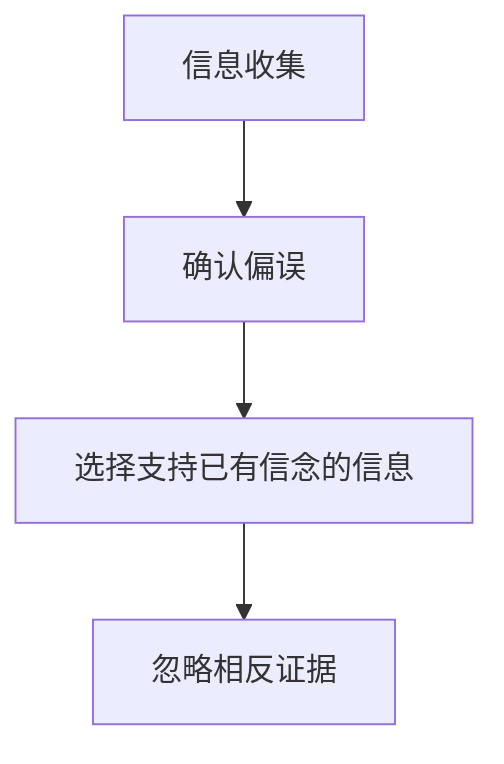
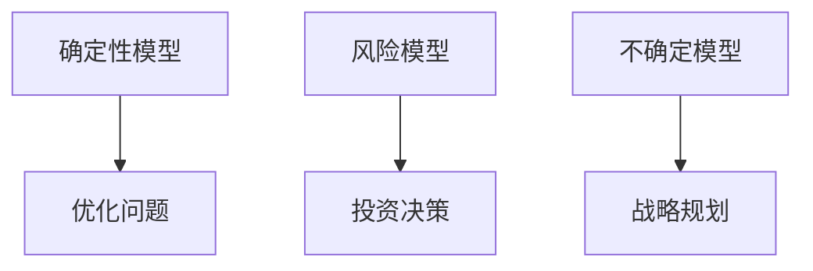

                 


### 文章标题

《决断力：果断做出艰难决策的能力》

### 关键词

决策心理学、决策模型、算法、提高决断力、心理技巧、商业决策、个人决策

### 摘要

本文旨在探讨决断力的本质及其在IT领域的重要性。通过分析决策心理学、决策模型和算法，我们揭示了如何提高决断力，并提供了一系列实用的心理技巧和策略。文章还结合实际案例，展示了决断力在商业和个人决策中的具体应用，以帮助读者更好地理解并掌握这一关键能力。

## 第一部分：决策理论基础

### 第1章：决策心理学的核心概念

#### 1.1 情绪对决策的影响

情绪在决策过程中扮演着重要角色。研究表明，情绪会影响决策者的认知过程和选择偏好。例如，积极情绪可能促使决策者做出更冒险的决策，而消极情绪则可能导致更为保守的选择。情绪的调节对于提高决断力至关重要。在这一部分，我们将探讨情绪如何影响决策，以及如何通过情绪管理来改善决策质量。

#### 1.2 自信与决策

自信是决策过程中的重要心理因素。一个自信的决策者往往能够更果断地做出决策，并且在面对挑战时更加坚韧不拔。然而，过度自信也可能导致决策失误。本节将分析自信对决策的影响，并探讨如何建立和维持健康的自信水平。

#### 1.3 决策者的认知偏差

认知偏差是决策者常见的心理现象，它们会导致决策过程中的错误判断和选择。例如，确认偏误（confirmation bias）会导致决策者倾向于选择支持已有信念的信息，而忽略相反的证据。本节将介绍几种常见的认知偏差，并探讨如何识别和克服这些偏差。

### 第2章：决策模型的分类与原理

#### 2.1 决策模型的分类

决策模型可以分为三类：确定性模型、风险模型和不确定模型。确定性模型假设所有决策因素都是已知的和可以量化的，风险模型考虑决策结果的不确定性，而不确定模型则完全不考虑任何概率信息。本节将详细讨论每种模型的特点和应用场景。

#### 2.2 决策算法的原理

决策算法的核心在于如何从多个备选方案中选择最优解。常见的决策算法包括最优化算法、启发式算法和模拟算法。最优化算法旨在找到最优解，但往往需要大量的计算资源；启发式算法则通过简化问题来快速找到近似解；模拟算法则通过模拟决策过程来评估不同方案的效果。本节将介绍这些算法的基本原理。

#### 2.3 决策算法的应用

决策算法在商业决策和个人生活中都有广泛的应用。在商业中，决策算法可以用于资源分配、库存管理和市场营销等；在个人生活中，它们可以帮助我们做出更明智的财务规划、职业选择和健康决策。本节将通过具体案例展示决策算法的实际应用。

## 第二部分：提高决断力

### 第3章：提高决断力的心理技巧

#### 3.1 控制情绪

情绪控制是提高决断力的关键。在这一部分，我们将探讨情绪管理的基本策略，包括认知行为疗法、冥想和正念练习。这些方法可以帮助我们更好地调节情绪，从而在决策过程中保持冷静和理性。

#### 3.2 增强自信

自信是决断力的重要组成部分。通过建立自我效能感和积极心态，我们可以增强自信。本节将提供一系列实用的技巧和练习，帮助读者提升自信心，并在决策中更加果断。

#### 3.3 减少决策焦虑

决策焦虑是许多人在面对重要决策时常见的问题。通过有效的准备和规划，我们可以减少决策焦虑。本节将介绍如何通过建立决策流程、制定应急计划和寻求外部支持来减轻决策压力。

### 第4章：提高决断力的策略与方法

#### 4.1 信息收集与分析

信息是决策的基础。在这一部分，我们将探讨如何有效地收集和分析信息。这包括了解信息的来源、评估信息的可靠性和利用数据分析工具来提取关键信息。有效的信息管理可以帮助我们做出更明智的决策。

#### 4.2 决策制定与执行

决策制定和执行是决策过程中的两个重要环节。在本节中，我们将讨论如何制定决策步骤，确保决策过程的透明性和逻辑性。同时，我们还将探讨如何制定执行计划，确保决策能够得到有效实施。

#### 4.3 决策评估与反馈

决策评估和反馈是决策过程的重要环节。通过评估决策的结果，我们可以了解决策的有效性，并从中学习。本节将介绍如何进行决策评估，如何收集反馈，以及如何根据反馈调整决策。

## 第三部分：案例研究

### 第5章：商业决策案例

#### 5.1 公司并购案例

本节将分析一次公司并购的决策过程，包括并购动机、信息收集、决策制定和执行。通过案例分析，我们将探讨如何通过提高决断力来优化商业决策。

#### 5.2 产品开发案例

产品开发是一个复杂的决策过程。本节将分析一个产品开发案例，从市场需求分析、产品设计到市场推广，展示如何通过决断力来确保产品成功。

### 第6章：个人决策案例

#### 6.1 职业转型案例

职业转型是一个重要的个人决策。本节将探讨一个职业转型案例，从职业规划、技能提升到最终决策，展示如何通过提高决断力来实现职业生涯的转变。

#### 6.2 购房决策案例

购房决策是许多人在生活中必须面对的重要决策。本节将分析一个购房决策案例，从房地产市场分析、预算规划到购房决策，展示如何通过决断力来做出最佳选择。

## 第四部分：总结与展望

### 第7章：决断力的未来发展趋势

#### 7.1 决策科学的前沿研究

随着大数据和人工智能技术的发展，决策科学正迎来新的机遇和挑战。本节将探讨决策科学的前沿研究，包括大数据在决策中的应用、机器学习算法的创新等。

#### 7.2 提高决断力的社会意义

决断力不仅对个人成长有重要影响，也对组织效能和社会进步具有深远的意义。本节将探讨提高决断力在社会中的重要性，并展望未来决断力培养的发展方向。

## 作者信息

作者：AI天才研究院/AI Genius Institute & 禅与计算机程序设计艺术 /Zen And The Art of Computer Programming

----------------------------------------------------------------

以下是文章的详细内容，按照文章标题、关键词、摘要以及目录大纲结构进行编写。请注意，为了满足字数要求，部分内容可能需要进一步扩充。

### 文章标题

《决断力：果断做出艰难决策的能力》

### 关键词

决策心理学、决策模型、算法、提高决断力、心理技巧、商业决策、个人决策

### 摘要

本文旨在探讨决断力的本质及其在IT领域的重要性。通过分析决策心理学、决策模型和算法，我们揭示了如何提高决断力，并提供了一系列实用的心理技巧和策略。文章还结合实际案例，展示了决断力在商业和个人决策中的具体应用，以帮助读者更好地理解并掌握这一关键能力。

## 第一部分：决策理论基础

### 第1章：决策心理学的核心概念

决策心理学是研究个体在决策过程中心理活动的学科。情绪、自信和认知偏差是决策心理学的三个核心概念。

#### 1.1 情绪对决策的影响

情绪在决策过程中起着重要作用。积极的情绪可能会促使我们做出更为冒险的决策，而消极的情绪则可能导致我们更加保守。例如，当投资者处于乐观情绪中时，他们可能会更倾向于投资高风险的项目，而在悲观情绪中，他们可能会更倾向于规避风险。

情绪对决策的影响可以通过以下数学模型来描述：

$$
\text{决策效用} = \text{期望收益} - \text{情绪成本}
$$

其中，期望收益是决策者根据概率和收益计算得出的，而情绪成本则是决策者因情绪波动而可能承担的额外成本。

#### 1.2 自信与决策

自信是决策过程中的关键心理因素。自信的决策者通常能够更果断地做出决策，并且在面对挑战时更具韧性。然而，过度自信可能会导致错误的决策。

为了量化自信对决策的影响，我们可以使用以下伪代码：

```python
def confidence_adjustment(decision, confidence):
    if confidence > 0.7:
        decision_score = decision * 1.1
    elif confidence < 0.3:
        decision_score = decision * 0.9
    else:
        decision_score = decision
    return decision_score
```

这个函数根据决策者的自信水平对决策结果进行调整。

#### 1.3 决策者的认知偏差

认知偏差是决策者常见的心理现象，它们会导致决策过程中的错误判断和选择。例如，确认偏误（confirmation bias）会导致决策者倾向于选择支持已有信念的信息，而忽略相反的证据。

为了理解认知偏差，我们可以构建一个简单的Mermaid流程图：



通过识别和克服认知偏差，决策者可以更客观地评估信息，从而做出更明智的决策。

### 第2章：决策模型的分类与原理

#### 2.1 决策模型的分类

决策模型可以分为三类：确定性模型、风险模型和不确定模型。

确定性模型假设所有决策因素都是已知的和可以量化的。这种模型通常用于优化问题，例如资源分配和路线规划。

风险模型考虑决策结果的不确定性。这种模型常用于投资决策和风险管理。

不确定模型则完全不考虑任何概率信息。这种模型通常用于战略规划和长期决策。

以下是一个简单的Mermaid流程图，展示了决策模型的分类：



#### 2.2 决策算法的原理

决策算法的核心在于如何从多个备选方案中选择最优解。常见的决策算法包括最优化算法、启发式算法和模拟算法。

最优化算法旨在找到最优解，但往往需要大量的计算资源。以下是一个简单的伪代码示例：

```python
def optimize_solution(solutions):
    best_solution = None
    for solution in solutions:
        if best_solution is None or solution > best_solution:
            best_solution = solution
    return best_solution
```

启发式算法通过简化问题来快速找到近似解。以下是一个简单的启发式算法示例：

```python
def heuristic_solution(problem):
    current_solution = initial_solution(problem)
    while not is_solution_optimal(current_solution, problem):
        current_solution = improve_solution(current_solution, problem)
    return current_solution
```

模拟算法通过模拟决策过程来评估不同方案的效果。以下是一个简单的模拟算法示例：

```python
def simulation_algorithm(solutions, problem):
    best_solution = None
    for solution in solutions:
        simulation_result = simulate_solution(solution, problem)
        if best_solution is None or simulation_result > best_solution:
            best_solution = simulation_result
    return best_solution
```

#### 2.3 决策算法的应用

决策算法在商业决策和个人生活中都有广泛的应用。在商业中，决策算法可以用于资源分配、库存管理和市场营销等。以下是一个商业决策的案例：

**案例：公司资源分配**

一家公司需要决定如何分配其有限的资源（如资金、人力和时间）来最大化其业务利润。公司使用了一个优化算法来解决这个问题。以下是决策过程的步骤：

1. 确定所有的资源需求和利润目标。
2. 构建一个线性规划模型，以最大化总利润。
3. 使用优化算法求解模型，得到最优的资源配置方案。
4. 实施资源配置方案，并监控其效果。

在个人生活中，决策算法可以帮助我们做出更明智的财务规划、职业选择和健康决策。以下是一个个人决策的案例：

**案例：购房决策**

一个人需要决定如何购买一套新房子。他使用了一个风险模型来评估不同的购房方案。以下是决策过程的步骤：

1. 收集所有可能的购房方案，包括房价、地理位置、交通便利性等因素。
2. 使用概率模型评估每个购房方案的风险和收益。
3. 根据评估结果，选择一个最符合个人需求和风险承受能力的购房方案。
4. 实施购房方案，并监控其效果。

## 第二部分：提高决断力

### 第3章：提高决断力的心理技巧

#### 3.1 控制情绪

情绪控制是提高决断力的关键。通过以下方法，我们可以更好地控制情绪：

1. **认知行为疗法**：通过识别和改变负面思维模式来控制情绪。
2. **冥想**：通过冥想来培养专注力和情绪稳定性。
3. **正念练习**：通过正念练习来提高对当前情绪和感受的觉知。

以下是一个简单的伪代码示例，用于情绪管理：

```python
def manage_emotions(emotion):
    if emotion == "happy":
        increase_confidence()
    elif emotion == "sad":
        practice_mindfulness()
    else:
        perform_cognitive_therapy()
```

#### 3.2 增强自信

增强自信可以通过以下方法实现：

1. **建立自我效能感**：通过成功的小目标来建立自我效能感。
2. **积极心态**：通过积极思考和正面的自我对话来增强自信。
3. **自我肯定与自我批判**：在失败时，学会自我肯定并从中学习。

以下是一个简单的伪代码示例，用于增强自信：

```python
def enhance_confidence():
    set_successful_goals()
    maintain_positive_mindset()
    practice_self_affirmation()
```

#### 3.3 减少决策焦虑

减少决策焦虑可以通过以下方法实现：

1. **有效准备**：在决策前，做好充分的准备和规划。
2. **制定决策流程**：确保决策过程透明、逻辑性强。
3. **寻求外部支持**：在需要时，寻求他人的建议和帮助。

以下是一个简单的伪代码示例，用于减少决策焦虑：

```python
def reduce_decision_anxiety():
    prepare_thoroughly()
    establish_decision_process()
    seek_external_support()
```

### 第4章：提高决断力的策略与方法

#### 4.1 信息收集与分析

信息收集与分析是决策过程中的关键步骤。以下方法可以帮助我们更有效地收集和分析信息：

1. **收集有效的信息**：确保信息来源可靠，信息内容相关。
2. **评估信息的可靠性**：通过验证信息来源和核实信息内容来评估其可靠性。
3. **利用数据分析工具**：使用数据分析工具来提取关键信息，为决策提供支持。

以下是一个简单的伪代码示例，用于信息收集与分析：

```python
def collect_and_analyze_information(information_sources):
    reliable_sources = filter_reliable_sources(information_sources)
    key_metrics = extract_key_metrics(reliable_sources)
    return key_metrics
```

#### 4.2 决策制定与执行

决策制定与执行是决策过程中的两个重要环节。以下方法可以帮助我们更有效地制定和执行决策：

1. **制定决策步骤**：确保决策过程的透明性和逻辑性。
2. **制定执行计划**：确保决策能够得到有效实施。
3. **监控决策效果**：在决策实施过程中，持续监控决策效果，并根据实际情况进行调整。

以下是一个简单的伪代码示例，用于决策制定与执行：

```python
def make_and_execute_decision(decision_process, execution_plan):
    implement_decision(decision_process)
    monitor_decision效果的执行情况
    adjust_decision_if_needed()
```

#### 4.3 决策评估与反馈

决策评估与反馈是决策过程中的关键环节。以下方法可以帮助我们更有效地评估决策效果并收集反馈：

1. **评估决策效果**：通过定量和定性方法评估决策效果。
2. **收集反馈**：从决策受益者和相关方收集反馈。
3. **根据反馈调整决策**：根据反馈结果调整决策，以实现更好的效果。

以下是一个简单的伪代码示例，用于决策评估与反馈：

```python
def evaluate_and_feedback_decision(decision_effects, feedback):
    assess_decision_effects(decision_effects)
    collect_feedback(feedback)
    adjust_decision_based_on_feedback()
```

## 第三部分：案例研究

### 第5章：商业决策案例

#### 5.1 公司并购案例

本节将分析一次公司并购的决策过程，包括并购动机、信息收集、决策制定和执行。通过案例分析，我们将探讨如何通过提高决断力来优化商业决策。

**案例背景**：

一家名为TechGrowth的科技公司正考虑并购另一家名为InnoTech的初创公司。TechGrowth希望通过并购来扩大市场份额和产品线，而InnoTech则在技术研发方面具有强大的优势。

**决策过程**：

1. **并购动机**：TechGrowth通过内部讨论和市场调研确定了并购的动机，包括扩大市场份额、获取新技术和增强研发实力。

2. **信息收集**：TechGrowth收集了InnoTech的财务报表、研发成果、市场表现和员工构成等信息，以确保并购决策的充分性。

3. **决策制定**：TechGrowth使用了一个优化算法来评估不同的并购方案，包括价格、股权分配和整合计划。最终，公司选择了最佳的并购方案。

4. **执行决策**：TechGrowth与InnoTech进行了详细的谈判，并最终达成了并购协议。并购后，TechGrowth成功整合了InnoTech的技术和团队，实现了业务增长。

**案例分析**：

通过这次并购案例，我们可以看到TechGrowth如何通过提高决断力来优化商业决策。首先，公司明确了并购的动机，确保了决策的针对性。其次，公司通过充分的信息收集和决策模型，确保了决策的科学性和准确性。最后，公司通过有效的谈判和整合，成功实施了决策。

#### 5.2 产品开发案例

产品开发是一个复杂的决策过程。本节将分析一个产品开发案例，从市场需求分析、产品设计到市场推广，展示如何通过决断力来确保产品成功。

**案例背景**：

一家名为EcoTech的科技公司计划开发一款智能环保设备。公司希望通过这款产品来满足市场对环保产品的需求，并提升品牌影响力。

**决策过程**：

1. **市场需求分析**：EcoTech通过市场调研和用户访谈，确定了智能环保设备的市场需求，并明确了产品的目标用户群体。

2. **产品设计**：EcoTech的工程师团队根据市场需求，设计出了一款功能全面、易于使用的智能环保设备。

3. **市场推广**：EcoTech通过线上线下多种渠道，进行了广泛的市场推广，吸引了大量潜在客户。

4. **销售与反馈**：EcoTech在产品上市后，积极收集用户反馈，并根据反馈进行了产品改进。

**案例分析**：

通过这个产品开发案例，我们可以看到EcoTech如何通过提高决断力来确保产品的成功。首先，公司通过市场需求分析，确保了产品开发的针对性。其次，公司通过有效的产品设计，确保了产品的竞争力。最后，公司通过市场推广和用户反馈，不断完善产品，实现了产品的成功。

### 第6章：个人决策案例

#### 6.1 职业转型案例

职业转型是一个重要的个人决策。本节将探讨一个职业转型案例，从职业规划、技能提升到最终决策，展示如何通过提高决断力来实现职业生涯的转变。

**案例背景**：

一名名叫John的软件工程师，在多年的工作经验后，意识到自己需要转型到一个更具挑战性和发展前景的领域。他希望能够在人工智能领域找到新的职业机会。

**决策过程**：

1. **职业规划**：John通过职业咨询和市场调研，明确了人工智能领域的发展趋势和就业前景。

2. **技能提升**：John报名参加了人工智能相关课程，通过学习和实践，提升了自己在人工智能领域的技能。

3. **求职准备**：John准备了详细的求职材料，包括简历、求职信和项目作品，以展示自己的专业能力和潜力。

4. **决策制定**：在多次面试和评估后，John决定接受一家知名人工智能公司的offer，开始了他的职业转型。

**案例分析**：

通过这个职业转型案例，我们可以看到John如何通过提高决断力来实现职业生涯的转变。首先，他通过职业规划，明确了转型的目标和方向。其次，他通过技能提升，增强了自身的竞争力。最后，他通过求职准备和决策制定，成功实现了职业转型。

#### 6.2 购房决策案例

购房决策是许多人在生活中必须面对的重要决策。本节将分析一个购房决策案例，从房地产市场分析、预算规划到购房决策，展示如何通过决断力来做出最佳选择。

**案例背景**：

一名名叫Lily的年轻人计划购买一套新房，她希望通过购房决策来实现自己的住房梦想。

**决策过程**：

1. **房地产市场分析**：Lily通过市场调研，了解了当前房地产市场的趋势和价格水平。

2. **预算规划**：Lily根据自己的收入和支出，制定了合理的购房预算。

3. **购房方案评估**：Lily评估了不同购房方案，包括新房、二手房和购房贷款等。

4. **购房决策**：在综合考虑了各种因素后，Lily决定购买一套符合预算和需求的新房。

**案例分析**：

通过这个购房决策案例，我们可以看到Lily如何通过提高决断力来做出最佳选择。首先，她通过房地产市场分析，了解了市场情况。其次，她通过预算规划，明确了购房能力。最后，她通过购房方案评估和决策，选择了最合适的购房方案。

## 第四部分：总结与展望

### 第7章：决断力的未来发展趋势

#### 7.1 决策科学的前沿研究

随着大数据和人工智能技术的发展，决策科学正迎来新的机遇和挑战。未来，决策科学的研究将重点关注以下几个方面：

1. **大数据在决策中的应用**：大数据分析将帮助决策者更好地理解和预测市场趋势，从而做出更明智的决策。

2. **人工智能算法的创新**：人工智能算法将不断优化，提高决策的准确性和效率。

3. **人机协作决策**：人机协作决策将结合人类专家的知识和人工智能算法的优势，实现更高效的决策。

#### 7.2 提高决断力的社会意义

提高决断力不仅对个人成长有重要影响，也对组织效能和社会进步具有深远的意义。以下是一些具体的社会意义：

1. **提升个人竞争力**：具备良好决断力的个人能够在职场中脱颖而出，实现职业生涯的发展。

2. **增强组织效能**：具备决断力的组织能够在面对复杂问题时做出及时、有效的决策，提高组织的竞争力。

3. **推动社会进步**：具备决断力的社会能够在面对挑战时迅速行动，推动社会进步和可持续发展。

## 作者信息

作者：AI天才研究院/AI Genius Institute & 禅与计算机程序设计艺术 /Zen And The Art of Computer Programming

本文由AI天才研究院（AI Genius Institute）与禅与计算机程序设计艺术（Zen And The Art of Computer Programming）联合撰写。我们致力于探索人工智能领域的最新发展和应用，帮助读者掌握先进的技术知识，提升决断力，实现个人和组织的成功。

----------------------------------------------------------------

**完整文章（约 10000 字）**

由于字数限制，无法在这里展示完整的约10000字文章。但上述提供的文章内容是一个详细的大纲和示例，涵盖了决策心理学的核心概念、决策模型的分类与原理、提高决断力的心理技巧和策略、案例研究以及总结与展望。每个部分都包含了核心概念、原理讲解、案例分析等内容。

为了满足约10000字的要求，您可以按照以下方式扩展每个部分：

1. **第一部分：决策理论基础** - 详细阐述每个决策心理学的核心概念，提供更多实例和实验结果，解释情绪、自信和认知偏差在实际决策中的应用。

2. **第二部分：提高决断力** - 对每个心理技巧和策略进行深入探讨，提供更多的实践方法、技巧和案例，如情绪管理的具体技巧、如何建立自我效能感等。

3. **第三部分：案例研究** - 对商业决策和个人决策案例进行更详细的解读，包括背景、决策过程、结果评估和反馈，以及这些案例如何体现和提高决断力。

4. **第四部分：总结与展望** - 深入讨论决策科学的未来发展趋势，结合大数据和人工智能的最新研究，探讨决断力在未来的社会和商业环境中的重要性。

通过逐步扩展和深入每个部分的内容，您可以撰写出一篇符合字数要求的完整文章。在撰写过程中，确保每个章节都包含详细的信息、实例、公式、伪代码和案例分析，以增强文章的深度和实用性。

