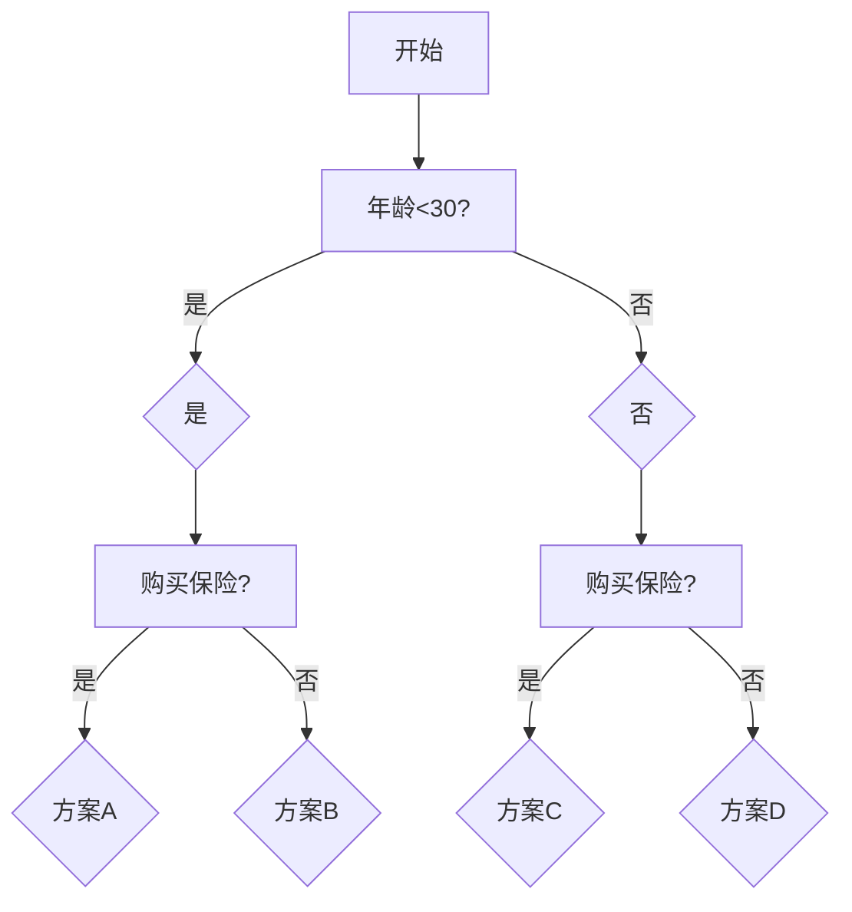
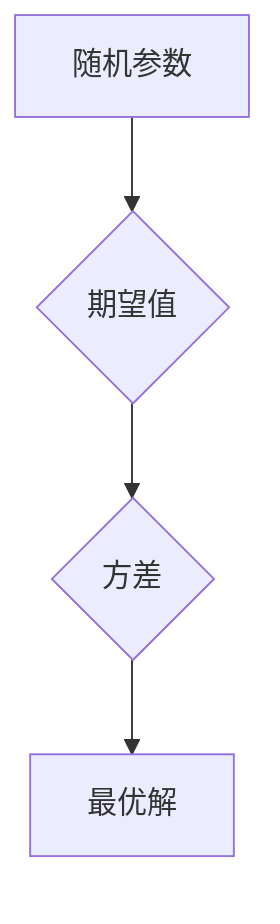
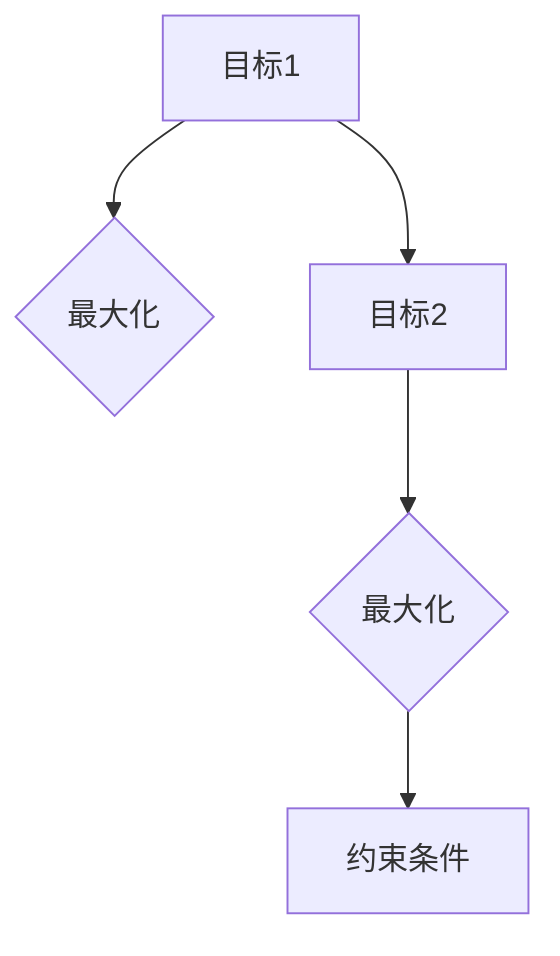
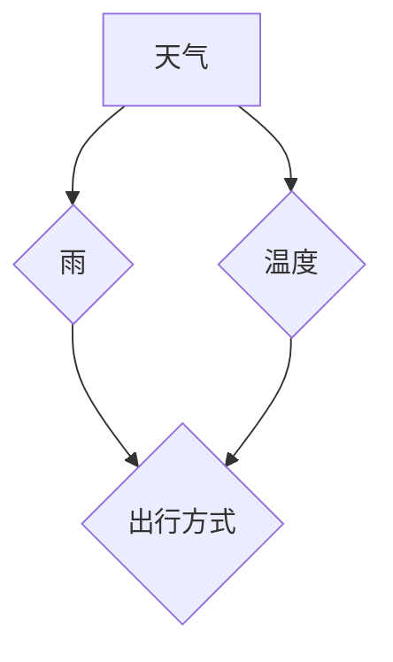
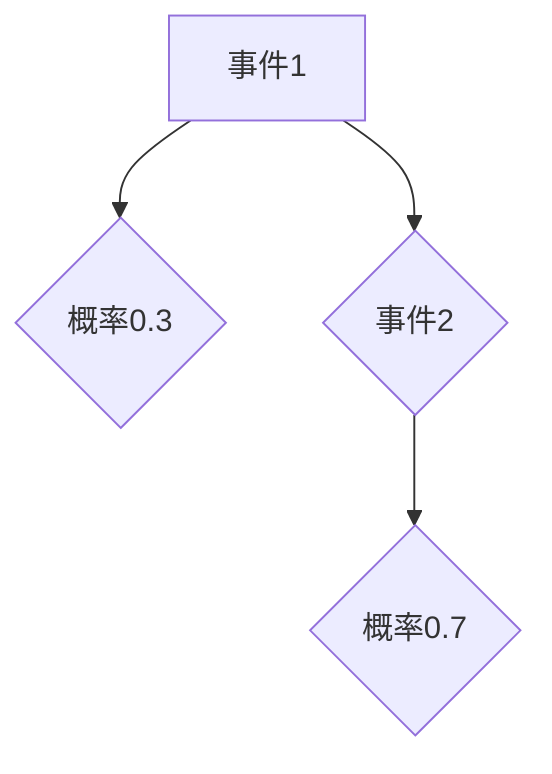
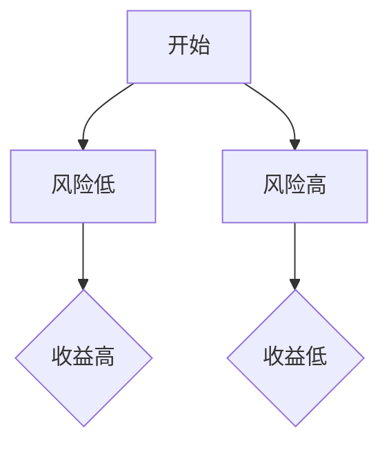
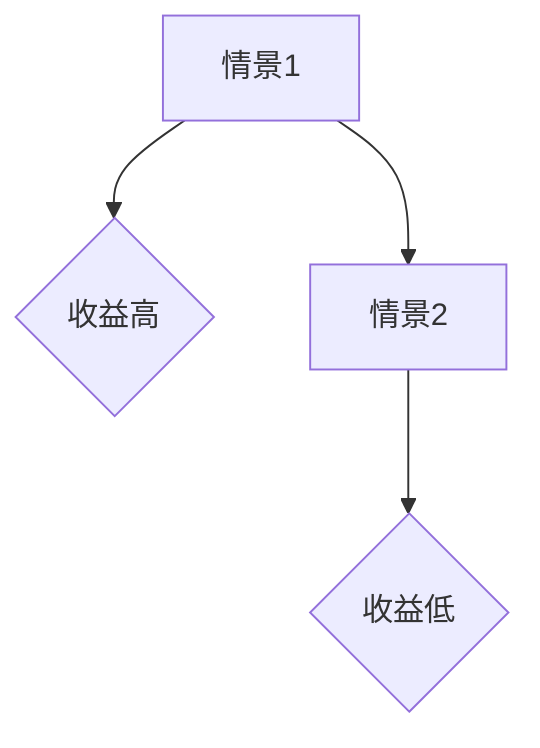

                 

# 决策科学：提高领导决策质量的系统方法

## 关键词
决策科学、领导决策、决策质量、决策支持系统、复杂环境

## 摘要
本文深入探讨了决策科学的理论基础、实践应用和领导决策的重要性。从基础理论的介绍到决策支持系统的构建，再到复杂环境下的决策策略，本文系统地阐述了如何提高领导决策的质量。通过案例分析、数学模型和实际项目实战，本文旨在为领导者提供一套完整的决策方法论，帮助他们做出更加科学和有效的决策。

## 引言
在快速变化的现代社会中，领导者面临的信息复杂性和决策压力越来越大。传统的直觉和经验决策方法已经难以应对日益复杂的问题。决策科学作为一门跨学科领域，结合了计算机科学、运筹学、心理学等知识，为领导者提供了一套系统的方法论，帮助他们更好地理解和应对复杂决策环境。

本文将从以下几个方面展开讨论：

1. 决策科学的概述：介绍决策科学的定义、重要性以及决策过程的步骤与模型。
2. 决策理论基础：探讨决策者行为理论、决策方法与模型以及风险与不确定性分析。
3. 决策支持系统：解释决策支持系统的概念与作用，设计原则和实现技术。
4. 群体决策：分析群体决策的概念与类型、方法以及面临的挑战与解决方案。
5. 决策质量评估：阐述决策质量的定义与标准、评估方法和提升策略。
6. 领导决策策略：讨论领导决策的特点、关键因素以及有效策略。
7. 复杂环境下的领导决策：探讨复杂环境对领导决策的影响、方法和策略。
8. 领导决策案例分析：通过实际案例分析领导决策的经验与教训。
9. 领导决策的持续改进：介绍领导决策反馈机制、改进方法和实践案例。
10. 决策科学在组织管理中的应用：分析决策科学在组织管理中的角色、实施和成效评估。

通过本文的系统性阐述，希望能够为领导者提供一套实用的决策方法论，帮助他们提高决策质量，实现组织的长期成功。

## 第一部分：决策科学的基础理论

### 第1章：决策科学的概述

#### 1.1 决策科学的定义与重要性

决策科学是一门研究决策过程、决策模型、决策方法及其应用的跨学科领域。它结合了计算机科学、运筹学、心理学等多个领域的知识，旨在提高决策的质量和效率。在现代社会，决策科学的重要性日益凸显，尤其是在信息爆炸和竞争激烈的背景下，领导者需要做出更加科学和有效的决策来应对复杂的问题。

首先，决策科学为领导者提供了一种系统的方法论，可以帮助他们更清晰地理解决策过程。传统的直觉和经验决策方法往往依赖于个人的感觉和经验，容易受到主观因素的影响。而决策科学通过建立数学模型和算法，可以量化决策过程中的各种因素，提供更加客观和科学的决策依据。

其次，决策科学可以显著提高决策的效率。在传统的决策过程中，领导者往往需要花费大量时间和精力来收集和分析信息，而决策科学通过自动化工具和算法，可以快速处理大量数据，减少信息处理的时间，从而提高决策的效率。

此外，决策科学还可以降低决策的风险。在决策过程中，领导者往往需要面对各种不确定性和风险。决策科学通过风险分析和模型预测，可以帮助领导者更好地评估各种可能的结果和风险，从而做出更加谨慎和合理的决策。

总的来说，决策科学的定义与重要性在于它提供了一种系统的方法论，提高了决策的效率和质量，降低了决策的风险，为领导者的决策过程提供了强有力的支持。

#### 1.2 决策过程的步骤与模型

决策过程是一个复杂而系统的过程，通常包括以下几个步骤：

1. **问题识别**：这是决策过程的起点。领导者需要识别出组织或项目面临的问题或挑战，明确决策的目标和方向。这一步的关键在于准确理解问题的本质，避免陷入细节而忽视大局。

2. **目标设定**：在明确问题之后，领导者需要设定决策的目标。目标设定应具体、可衡量、可实现，并具有明确的优先级。这样可以帮助领导者集中资源，优先解决关键问题。

3. **方案生成**：这一步是决策过程的核心。领导者需要提出各种可能的解决方案，并进行筛选。在这一过程中，领导者可以利用头脑风暴、专家咨询、模拟仿真等方法，生成多种备选方案。

4. **方案评估**：对生成的方案进行评估是决策过程中至关重要的一步。评估标准通常包括方案的可行性、成本效益、风险程度等。通过评估，领导者可以选出最优或次优方案。

5. **选择**：在评估完成后，领导者需要从备选方案中做出最终选择。选择方案时，领导者需要综合考虑各种因素，包括目标实现的可能性、资源的约束条件等。

6. **方案实施**：决策一旦做出，就需要进入实施阶段。这一阶段包括资源的分配、任务的分解、执行计划的制定等。实施过程中，领导者需要密切关注方案的执行情况，及时调整和优化。

7. **监控与反馈**：决策实施后，领导者需要持续监控决策的效果，收集反馈信息。通过监控和反馈，领导者可以评估决策的成效，发现问题和不足，并及时进行调整和改进。

决策过程模型可以采用多种形式，例如决策树模型、线性规划模型、贝叶斯网络模型等。每种模型都有其特定的适用场景和优势。决策树模型通过分支结构表示不同的决策路径和结果，直观易懂；线性规划模型通过优化目标函数和约束条件来找到最优解；贝叶斯网络模型则通过概率图结构来表示决策中的不确定性。

总之，决策过程的步骤与模型为领导者提供了系统化的决策框架，帮助他们更科学、更高效地做出决策。

#### 1.3 决策科学的历史与发展

决策科学作为一个跨学科领域，其历史可以追溯到20世纪中叶。最初，决策科学主要集中在数学建模和优化方法的研究，旨在通过数学和计算机科学的方法来提高决策的效率和准确性。随着时间的推移，决策科学逐渐融合了心理学、经济学、社会学等领域的知识，形成了一个综合性的学科。

在20世纪50年代，运筹学作为决策科学的一个分支开始兴起。运筹学家们通过建立数学模型和算法，解决了许多复杂的资源分配和优化问题。这一时期的代表性工作包括线性规划、整数规划、动态规划等。

20世纪60年代，决策科学开始向计算机科学和人工智能领域延伸。计算机技术的快速发展为决策科学提供了强大的工具和支持，使得大规模的数据分析和复杂的决策模型成为可能。这一时期的代表性工作包括决策树、人工神经网络、遗传算法等。

20世纪70年代，决策科学开始关注决策者行为和心理因素。心理学家们研究了决策者在面对不确定性和风险时的行为模式，提出了有限理性、代表性启发式等理论。这些理论为决策科学提供了更加深刻的理解，使得决策模型更加贴近现实。

20世纪80年代和90年代，决策科学进一步融合了管理科学和经济学。学者们开始研究如何在竞争激烈的市场环境中做出最优决策，提出了博弈论、供应链管理、风险管理等理论。这一时期的代表性工作包括博弈模型、多目标优化、风险分析等。

进入21世纪，随着互联网和大数据技术的快速发展，决策科学迎来了新的机遇和挑战。大数据和机器学习技术的应用，使得决策科学能够处理和分析更大量、更复杂的数据，从而提高决策的准确性和效率。这一时期的代表性工作包括大数据分析、机器学习算法、预测模型等。

总的来说，决策科学的历史与发展是一个不断融合和创新的过程。从最初的数学建模和优化方法，到现代的大数据和人工智能技术，决策科学在理论和实践上都取得了显著的进展，为领导者提供了更加科学和有效的决策支持。

### 第2章：决策理论基础

#### 2.1 决策者行为理论

决策者行为理论是决策科学的一个重要组成部分，它关注决策者在面对决策情境时的心理和行为特征。这些理论旨在解释决策者的决策过程、决策策略以及决策结果，帮助我们更好地理解人类决策的本质。

**有限理性理论（Bounded Rationality）**

有限理性理论由赫伯特·西蒙（Herbert Simon）提出，他认为决策者在面对复杂决策情境时，由于认知能力和信息处理能力的限制，往往无法做出完全理性的决策。有限理性理论指出，决策者在面对不确定性时，往往采取简化决策过程和寻求满意解而非最优解的策略。这种简化策略包括代表性启发式（Representative Heuristics）和适应性启发式（Adaptive Heuristics），例如锚定效应（Anchoring）和确认偏误（Confirmation Bias）。

**行为经济学理论（Behavioral Economics）**

行为经济学理论结合了心理学和经济学，旨在研究人类在经济学决策中的非理性行为。该理论指出，人类决策者往往受到情感、社会因素和认知偏差的影响，导致他们的决策结果与标准经济学模型中的预测不一致。代表性理论包括前景理论（Prospect Theory）和代表性理论（Representativeness Heuristic）。

**前景理论（Prospect Theory）**

前景理论由丹尼尔·卡内曼（Daniel Kahneman）和阿莫斯·特沃斯基（Amos Tversky）提出，它描述了人类在面对潜在收益和损失时的决策模式。前景理论提出了价值函数（Value Function）和参考点（Reference Point）的概念。价值函数表示人们对不同结果的主观价值，而参考点则是评价结果价值的基础。与期望效用理论不同，前景理论强调了损失厌恶（Loss Aversion）和风险规避（Risk Aversion）的行为特征。

**代表性理论（Representativeness Heuristic）**

代表性理论是指人们在评估概率时，往往会根据某个事件是否代表某个总体特征来做出判断。例如，当判断一个随机抽取的数字是否接近某个平均数时，人们可能会忽略样本大小和总体分布，而仅仅根据数字的代表性来做出判断。

**认知失调理论（Cognitive Dissonance Theory）**

认知失调理论由列奥·费斯汀格（Leon Festinger）提出，它描述了人们为了减少内心的不协调和紧张感，会采取各种认知和行为调整策略。当人们的信念和行为不一致时，他们会感到不安和焦虑，从而试图通过调整信念或行为来恢复平衡。

总的来说，决策者行为理论为我们提供了丰富的视角，帮助我们理解人类决策的复杂性和多样性。这些理论不仅揭示了决策者在面对不确定性时的心理和行为特征，还为设计更有效的决策模型和政策提供了重要启示。

#### 2.2 决策方法与模型

决策方法与模型是决策科学的核心内容，它们通过系统化的方法帮助决策者在复杂环境中做出最优或次优决策。以下是一些常见的决策方法和模型：

**1. 决策树（Decision Tree）**

决策树是一种常用的决策模型，它通过一系列的判断节点和结果节点，以树形结构表示决策过程。每个判断节点表示一个决策点，每个结果节点表示可能的决策结果。决策树通过计算每个节点的概率和预期值，帮助决策者选择最佳行动方案。



**2. 线性规划（Linear Programming）**

线性规划是一种用于优化线性目标函数和线性约束条件的数学方法。它通过建立线性目标函数和约束条件，求解最优解，以最大化或最小化某个目标。线性规划广泛应用于资源分配、生产规划、运输调度等问题。

```python
# 线性规划伪代码
def linear_programming(A, b, c):
    # A为约束条件矩阵，b为约束条件向量，c为目标函数系数向量
    # 返回最优解x
    x = solve_linear_program(A, b, c)
    return x
```

**3. 随机规划（Stochastic Programming）**

随机规划是一种处理不确定性的数学方法，它通过引入随机参数和概率分布，建立随机优化模型。随机规划旨在找到在不确定性条件下具有最优性能的决策策略。



**4. 多目标规划（Multi-Objective Programming）**

多目标规划是一种同时考虑多个目标优化的方法。它通过建立多个目标函数和约束条件，求解在多个目标之间达到平衡的最优解。多目标规划广泛应用于环境管理、社会规划和资源分配等问题。



**5. 贝叶斯网络（Bayesian Network）**

贝叶斯网络是一种基于概率图模型的决策工具，它通过节点和边的表示，描述变量之间的条件概率关系。贝叶斯网络可以帮助决策者分析和预测复杂系统的行为，广泛应用于医疗诊断、风险管理等领域。



通过这些决策方法和模型，决策者可以更好地理解和应对复杂决策环境，提高决策的质量和效率。

#### 2.3 风险与不确定性分析

在决策过程中，风险和不确定性是常见的挑战。风险指的是决策过程中可能面临的不利事件或结果，而不确定性则是指对潜在结果的不完全了解。有效的风险与不确定性分析是决策科学的重要组成部分，有助于决策者更好地评估和应对潜在的风险。

**1. 风险分析**

风险分析是一种系统性的方法，用于评估决策过程中可能面临的风险和不利结果。以下是一些常见的风险分析方法和工具：

- **概率分析**：通过计算不同风险事件发生的概率，评估风险的程度和可能的影响。常用的概率分析方法包括贝叶斯网络、蒙特卡洛模拟等。



- **敏感性分析**：通过改变决策模型中的参数和假设，评估不同情况下风险的影响。敏感性分析有助于决策者了解哪些因素对决策结果最为关键。

```python
# 敏感性分析伪代码
def sensitivity_analysis(model, parameters):
    # model为决策模型，parameters为参数集合
    # 返回参数敏感性分析结果
    results = analyze_sensitivity(model, parameters)
    return results
```

- **决策树分析**：通过构建决策树，分析不同决策路径下的风险和收益。决策树分析可以帮助决策者了解不同决策路径的风险和潜在收益。



**2. 不确定性分析**

不确定性分析旨在评估决策过程中可能存在的不确定性因素，并探讨不同不确定性情景下的决策结果。以下是一些常用的不确定性分析方法和工具：

- **情景分析**：通过构建不同的情景，评估决策者在不同情景下的决策效果。情景分析可以帮助决策者了解不同情景对决策结果的影响。



- **概率分布分析**：通过计算决策结果的概率分布，评估决策结果的可靠性和稳定性。概率分布分析有助于决策者了解决策结果的分布特征。

```python
# 概率分布分析伪代码
def probability_distribution(result):
    # result为决策结果
    # 返回概率分布结果
    distribution = analyze_distribution(result)
    return distribution
```

- **决策分析工具**：使用决策分析工具，如决策树、蒙特卡洛模拟、敏感性分析等，可以帮助决策者更好地理解和评估风险与不确定性。

通过有效的风险与不确定性分析，决策者可以更全面地评估决策的潜在风险和不确定性，从而制定更加科学和合理的决策策略。

### 第3章：决策支持系统

#### 3.1 决策支持系统的概念与作用

决策支持系统（Decision Support System，简称DSS）是一种旨在辅助决策者做出更明智、更有效的决策的信息系统。它结合了计算机科学、运筹学、决策科学等多个领域的知识，为决策者提供了一个交互式、智能化的决策环境。

**概念**

决策支持系统的核心是辅助决策者进行决策。它不仅提供数据和信息，还通过算法和模型分析数据，帮助决策者理解和分析问题，评估不同方案的优劣，最终做出最优或次优决策。决策支持系统通常包括以下几个组成部分：

1. **数据库**：存储和管理决策所需的数据。数据库可以包括内部数据（如组织的历史数据）和外部数据（如市场趋势、竞争对手信息等）。

2. **模型库**：提供各种决策模型和算法，用于分析和预测。模型库包括定量模型（如线性规划、多目标规划）和定性模型（如决策树、模拟仿真）。

3. **用户界面**：用于与决策者交互，提供输入和输出功能。用户界面应简洁直观，方便决策者快速访问和使用系统。

4. **知识库**：存储决策者的经验和知识，如最佳实践、规则和策略。知识库可以帮助系统更好地模拟和预测决策结果。

**作用**

决策支持系统在决策过程中发挥着重要作用，主要体现在以下几个方面：

1. **提高决策效率**：通过自动化数据处理和分析，决策支持系统可以快速处理大量数据，减少决策者花费在信息收集和分析上的时间，提高决策效率。

2. **增强决策质量**：决策支持系统提供各种算法和模型，帮助决策者更全面、更深入地分析问题，减少决策过程中的主观偏见和错误。

3. **支持复杂决策**：决策支持系统可以处理复杂的问题和决策，特别是在需要考虑多个目标和约束条件时，系统能够提供更全面的解决方案。

4. **支持长期规划**：决策支持系统可以通过模拟和预测，帮助决策者制定长期规划和战略，减少决策的不确定性和风险。

5. **支持团队协作**：决策支持系统可以支持多人协作决策，通过共享数据和模型，提高团队的整体决策能力。

总之，决策支持系统为决策者提供了一个智能化的决策环境，帮助他们更好地理解问题和分析数据，从而做出更科学、更有效的决策。

#### 3.2 决策支持系统的设计原则

设计一个有效的决策支持系统（DSS）需要遵循一系列原则，以确保系统能够真正辅助决策者做出明智的决策。以下是几个关键的设计原则：

**1. 用户中心设计**

用户中心设计强调以决策者的需求和使用习惯为核心，确保系统界面友好、操作简便。具体包括：

- **易用性**：界面应直观，操作简单，减少用户的学习成本。
- **定制化**：系统应允许用户自定义界面和功能，以适应不同决策者的偏好。
- **交互性**：提供实时反馈和交互功能，帮助用户更好地理解决策过程和结果。

**2. 数据整合与一致性**

数据是决策支持系统的核心资源，因此设计时必须确保数据的完整性、准确性和一致性。具体措施包括：

- **数据源整合**：整合多种数据源，包括内部数据和外部数据，确保数据的全面性。
- **数据清洗**：对数据进行清洗，去除错误、重复和无关的数据，确保数据的准确性。
- **数据标准化**：统一数据格式和单位，确保数据的一致性。

**3. 模型灵活性与可扩展性**

决策支持系统应支持多种决策模型和算法，并且能够根据需求灵活调整和扩展。具体包括：

- **模型库**：构建一个全面的模型库，包括定量模型和定性模型，满足不同决策需求。
- **模型定制**：允许用户根据实际情况定制模型，以适应特定问题的需求。
- **扩展性**：系统应具有较好的扩展性，能够适应未来的需求变化和技术升级。

**4. 决策过程的透明性**

决策过程的透明性对于提高决策质量至关重要。设计时需要确保：

- **算法透明**：明确展示决策模型和算法的原理和计算过程，便于用户理解和验证。
- **结果可追溯**：记录决策过程中的每个步骤和输入参数，便于用户追溯和复盘。
- **反馈机制**：提供实时反馈和评估结果，帮助用户理解决策效果和改进方向。

**5. 安全性与隐私保护**

在数据密集和交互频繁的决策支持系统中，安全性是一个重要考虑因素。具体包括：

- **数据加密**：对敏感数据使用加密技术，确保数据在传输和存储过程中的安全性。
- **用户权限管理**：实施严格的用户权限管理，确保用户只能访问其权限范围内的数据和功能。
- **隐私保护**：遵守相关法律法规，保护用户隐私，避免数据滥用。

通过遵循这些设计原则，决策支持系统能够更好地满足决策者的需求，提供高质量的服务，从而提高决策的效率和效果。

#### 3.3 决策支持系统的实现技术

决策支持系统的实现技术是构建高效、可靠的DSS的关键。以下介绍几种常见的实现技术：

**1. 数据库技术**

数据库技术是DSS的核心组件之一，用于存储和管理决策所需的数据。常见的技术包括：

- **关系数据库**：如MySQL、Oracle等，适用于结构化数据的高效存储和查询。
- **NoSQL数据库**：如MongoDB、Cassandra等，适用于存储大规模的非结构化或半结构化数据。
- **数据仓库**：用于整合多个数据源，提供统一的数据视图和分析功能。

**2. 数据挖掘技术**

数据挖掘技术用于从大量数据中提取有价值的信息和知识。常用的数据挖掘技术包括：

- **关联规则挖掘**：用于发现数据之间的关联关系，如市场篮子分析。
- **分类和回归分析**：用于预测未来的趋势和结果。
- **聚类分析**：用于发现数据中的模式和分组。

**3. 机器学习技术**

机器学习技术通过训练模型，使计算机能够自动学习和预测。在DSS中，常见的机器学习技术包括：

- **监督学习**：如线性回归、决策树、随机森林等，用于预测和分类。
- **无监督学习**：如聚类分析、主成分分析等，用于数据探索和特征提取。
- **深度学习**：如神经网络、卷积神经网络等，用于处理复杂的非线性问题和大规模数据。

**4. 人工智能技术**

人工智能技术为DSS提供了智能化的决策支持。常见的人工智能技术包括：

- **自然语言处理**：用于处理和理解自然语言文本，如语音识别、文本分析等。
- **计算机视觉**：用于处理图像和视频数据，如图像识别、目标检测等。
- **知识图谱**：用于表示和组织复杂的知识结构，提供语义搜索和推理功能。

**5. 用户界面技术**

用户界面技术用于提供直观、友好的用户交互体验。常见的技术包括：

- **Web技术**：如HTML、CSS、JavaScript等，用于构建基于Web的DSS。
- **移动应用开发**：如React Native、Flutter等，用于构建跨平台的移动端DSS。
- **图形用户界面**：如Qt、WPF等，用于构建桌面端DSS。

通过结合这些实现技术，决策支持系统可以更好地满足决策者的需求，提供高效、智能化的决策支持。

### 第4章：群体决策

#### 4.1 群体决策的概念与类型

群体决策是指由多个个体组成的团队或组织共同参与决策过程，以达成共识或最优解。群体决策不仅涉及个体成员的知识、经验和观点，还需要协调和处理成员之间的利益冲突和意见分歧。以下是群体决策的一些关键概念和类型：

**概念**

1. **群体决策者**：指参与决策的个体成员，可以是个人、团队或组织。
2. **决策目标**：群体决策的目标是达成共识或最优解，这通常需要平衡各个决策者的利益和观点。
3. **决策情境**：指决策过程中面临的问题或挑战，包括环境不确定性、资源限制和时间约束等。

**类型**

1. **集体决策（Collective Decision Making）**：决策过程由所有群体决策者共同参与，每个决策者的意见都得到充分考虑。集体决策通常用于重大战略决策，如公司高层管理团队制定公司战略。
2. **委员会决策（Committee Decision Making）**：决策过程由一个委员会或小组负责，委员会成员可以是固定成员或临时成员。委员会决策适用于需要多方面知识和专业背景的决策，如政府机构或学术委员会。
3. **协商决策（Negotiated Decision Making）**：决策过程通过协商和谈判达成共识，各个决策者就决策方案进行讨论和调整，最终达成一致。协商决策适用于涉及多个利益相关方的决策，如企业并购或合同谈判。
4. **民主决策（Democratic Decision Making）**：决策过程遵循民主原则，通过投票或其他形式的民主程序确定最终决策。民主决策适用于组织内部的民主选举或重大事项的表决。
5. **混合决策（Hybrid Decision Making）**：结合多种决策类型的特征，根据具体情境灵活调整决策过程。混合决策适用于复杂且多变的决策情境，如跨国公司的全球战略制定。

群体决策在多领域都具有重要意义，它有助于整合多方资源和智慧，提高决策的质量和可行性。然而，群体决策也面临一系列挑战，如信息不对称、沟通困难、利益冲突等。因此，设计有效的群体决策过程和策略是组织成功的关键。

#### 4.2 群体决策的方法

群体决策方法是指用于指导群体成员进行决策的具体步骤和技术。有效的群体决策方法可以帮助决策者克服个体决策的局限性，整合集体智慧，提高决策的效率和效果。以下是几种常见的群体决策方法：

**1.头脑风暴法（Brainstorming）**

头脑风暴法是一种激发群体创造力和创新思维的方法。其基本步骤包括：

- **准备阶段**：确定决策目标和范围，邀请相关成员参与。
- **自由讨论阶段**：在宽松的氛围中，鼓励每个成员提出自己的想法，不论想法是否合理或可行。
- **分类和筛选阶段**：对提出的想法进行整理和分类，筛选出有价值的方案。
- **实施和评估阶段**：对筛选出的方案进行进一步评估和优化，确定最终决策。

头脑风暴法的优点在于能够迅速产生大量创意，缺点是可能导致质量不高、筛选困难。

**2.德尔菲法（Delphi Method）**

德尔菲法是一种通过匿名问卷和多次反馈逐步达成共识的群体决策方法。其基本步骤包括：

- **准备阶段**：设计问卷，明确决策问题和目标。
- **初步调查阶段**：向专家发放问卷，收集初步意见。
- **反馈和调整阶段**：汇总初步结果，向专家反馈，并征求修改意见。
- **最终确定阶段**：经过多轮反馈和调整，达成最终共识。

德尔菲法的优点是能够减少个体偏见和沟通障碍，提高决策的客观性和准确性。缺点是过程较长，需要一定的时间和资源。

**3.名义集团技术（Nominal Group Technique）**

名义集团技术是一种通过投票和讨论达成共识的群体决策方法。其基本步骤包括：

- **准备阶段**：确定决策问题和目标，邀请相关成员参与。
- **独立思考阶段**：每个成员独立列出自己的想法，不进行讨论。
- **投票阶段**：对所有成员的想法进行匿名投票，选出优先级最高的几个方案。
- **讨论和决策阶段**：对投票选出的方案进行讨论，达成最终决策。

名义集团技术的优点是能够充分尊重每个成员的意见，提高决策的民主性。缺点是可能导致讨论时间较长，决策效率较低。

**4.电子会议系统（Electronic Meeting System）**

电子会议系统是一种利用计算机和网络技术进行远程群体决策的方法。其基本步骤包括：

- **准备阶段**：确定决策目标和议程，设置会议平台。
- **会议讨论阶段**：成员在会议平台上发表观点、提出问题，进行讨论。
- **投票和决策阶段**：通过平台进行匿名投票，确定最终决策。

电子会议系统的优点是能够克服地理限制，提高决策的效率和参与度。缺点是可能存在技术故障和沟通障碍。

通过选择合适的群体决策方法，决策者可以更好地整合集体智慧，提高决策的质量和可行性。

#### 4.3 群体决策中的挑战与解决方案

在群体决策过程中，决策者往往面临一系列挑战，这些挑战会影响决策的质量和效率。以下是几个常见的挑战及其解决方案：

**1. 沟通困难**

群体决策中，成员之间的沟通障碍可能导致信息不对称和误解。解决方案包括：

- **明确沟通目标**：在决策开始前，明确沟通的目标和议程，确保所有成员了解决策的重点和目的。
- **建立沟通机制**：使用会议纪要、邮件和即时通讯工具等，建立有效的沟通渠道，确保信息的及时传递和反馈。
- **促进开放交流**：鼓励成员在决策过程中积极发言和提问，建立信任和开放的沟通氛围。

**2. 利益冲突**

群体决策中，不同成员往往代表不同的利益群体，利益冲突可能导致决策的复杂化。解决方案包括：

- **利益平衡**：在决策过程中，充分考虑各个利益群体的需求和利益，寻求平衡点。
- **协商与谈判**：通过协商和谈判，寻求各方都能接受的方案，避免利益冲突的激化。
- **制定规则**：建立明确的决策规则和程序，确保决策过程的公平和透明，减少利益冲突的发生。

**3. 意见分歧**

群体决策中，成员之间的意见分歧可能导致决策过程拖延和低效。解决方案包括：

- **共识建立**：通过讨论和辩论，寻求各方意见的共识，降低分歧。
- **投票表决**：在意见分歧无法解决时，通过投票表决的方式决定最终决策，确保决策的民主性和公正性。
- **专业咨询**：在专业问题上的意见分歧，可以引入外部专家进行评估和咨询，提供客观的决策依据。

**4. 决策质量不高**

群体决策中，如果成员的素质和经验不一致，可能导致决策质量不高。解决方案包括：

- **成员筛选**：选择具有相关知识和经验的成员参与决策，确保决策团队的专业性和多样性。
- **培训与学习**：为成员提供相关培训和学习机会，提高他们的决策能力和素质。
- **专家参与**：在关键决策阶段，邀请外部专家参与决策，提供专业意见和建议。

通过应对这些挑战，决策者可以有效地提高群体决策的质量和效率，确保决策的顺利进行。

### 第5章：决策质量评估

#### 5.1 决策质量的定义与标准

决策质量是评估决策结果的重要指标，它决定了决策是否能够有效解决问题和实现目标。决策质量的定义和标准对于制定有效的决策策略和提高决策水平至关重要。

**定义**

决策质量是指决策结果的有效性、合理性和可接受性。一个高质量的决策应该能够在给定的时间和资源约束下，最大限度地实现目标，同时减少潜在的风险和负面影响。

**标准**

1. **目标达成度**：决策质量的首要标准是决策结果能否有效达成既定目标。这包括决策结果的实用性、可行性和有效性。决策者需要确保决策方案能够切实解决问题，达到预期效果。

2. **决策过程合理性**：决策过程的质量同样重要。一个合理的决策过程应该具有透明度、公正性和科学性。这包括决策信息的完整性、决策方法的适用性和决策程序的规范性。

3. **决策结果的可接受性**：决策结果需要被决策者和相关利益相关者所接受。可接受性评估基于决策结果的公平性、道德性和社会影响。一个高质量的决策应该能够平衡各方利益，得到广泛的认同和支持。

4. **决策效率和成本效益**：决策质量还体现在决策的效率和成本效益上。一个高效的决策应该在合理的资源投入下，快速地做出并实施决策，同时保持成本效益的最优化。

5. **适应性和灵活性**：决策质量还应考虑决策结果的适应性和灵活性。面对复杂和多变的环境，决策应具备足够的灵活性和适应性，能够根据实际情况进行调整和优化。

通过这些标准，决策者可以全面评估决策质量，确保决策结果的高效和可行。

#### 5.2 决策质量的评估方法

评估决策质量是一个复杂而系统性的过程，涉及到多个维度的考量。以下介绍几种常用的决策质量评估方法：

**1. 成果评估法**

成果评估法是通过评估决策实施后的实际成果来衡量决策质量。这种方法主要包括以下几个步骤：

- **设定评估指标**：根据决策目标和实施计划，设定具体的评估指标，如利润增长率、市场份额、客户满意度等。
- **收集数据**：收集决策实施后的相关数据，确保数据的真实性和准确性。
- **分析数据**：对收集到的数据进行分析，评估决策结果是否符合预期目标。
- **反馈和调整**：根据评估结果，对决策过程和实施效果进行反馈和调整，确保决策的持续改进。

**2. 成本效益分析法**

成本效益分析法是一种基于成本和效益的评估方法，用于评估决策的财务可行性和经济效益。这种方法主要包括以下几个步骤：

- **计算成本**：计算决策实施过程中所涉及的所有成本，包括直接成本和间接成本。
- **估算效益**：估算决策实施后的预期经济效益，包括直接收益和间接收益。
- **比较成本效益**：将计算出的成本与估算的效益进行比较，评估决策的经济性。
- **制定改进措施**：根据成本效益分析结果，制定相应的改进措施，提高决策的效益。

**3. 满意度评估法**

满意度评估法是通过调查和评估决策相关利益者的满意度来衡量决策质量。这种方法主要包括以下几个步骤：

- **设计调查问卷**：设计包含关键指标的满意度调查问卷，如决策过程的透明度、决策结果的合理性、决策效率等。
- **收集反馈**：通过访谈、问卷调查等方式，收集决策相关利益者的反馈和意见。
- **分析反馈**：对收集到的反馈进行分析，识别决策过程中的优点和不足。
- **改进决策**：根据反馈结果，对决策过程和实施效果进行改进，提高决策的满意度。

**4. 创新评估法**

创新评估法是一种用于评估决策创新程度和创新效果的方法。这种方法主要包括以下几个步骤：

- **识别创新要素**：识别决策中的创新要素，如新技术应用、新方法引入、新市场开拓等。
- **评估创新效果**：评估创新要素的实施效果，包括技术可行性、市场接受度、经济收益等。
- **反馈和改进**：根据创新效果评估结果，对决策和创新过程进行反馈和改进，提高决策的创新性和竞争力。

通过这些评估方法，决策者可以全面、客观地评估决策质量，为决策的持续改进提供依据。

#### 5.3 决策质量提升的策略

为了提高决策质量，决策者需要采取一系列策略，确保决策过程的科学性和决策结果的可行性。以下是几个关键策略：

**1. 加强信息收集与处理**

高质量的信息是做出高质量决策的基础。决策者应建立完善的信息收集和处理机制，确保信息的全面性、准确性和及时性。具体措施包括：

- **建立信息源**：明确信息来源，包括内部数据和外部数据，确保信息的多样性。
- **数据整合与清洗**：对收集到的数据进行分析和整合，去除错误和重复数据，提高数据质量。
- **信息共享与反馈**：建立信息共享平台，促进信息在组织内的流动和反馈，确保信息的及时性和准确性。

**2. 优化决策过程**

优化决策过程是提高决策质量的关键。决策者应明确决策目标和步骤，确保决策过程的透明度和科学性。具体措施包括：

- **制定决策计划**：明确决策的目标、步骤和时间表，确保决策过程的有序进行。
- **建立决策规则**：制定明确的决策规则和标准，确保决策的规范性和公正性。
- **引入决策模型**：运用决策模型和算法，帮助决策者更全面、更深入地分析问题，提高决策的科学性。

**3. 强化团队成员协作**

团队协作是群体决策成功的关键。决策者应建立有效的团队合作机制，促进团队成员之间的沟通和合作。具体措施包括：

- **明确角色与责任**：明确每个团队成员的角色和责任，确保团队成员分工明确、合作顺畅。
- **促进信息交流**：建立沟通平台和渠道，促进团队成员之间的信息交流和意见共享。
- **激励与反馈**：建立激励机制，鼓励团队成员积极参与决策过程，并对团队成员的表现进行反馈和评估。

**4. 提高决策者的素质**

决策者的素质直接影响决策质量。决策者应不断学习和提升自己的决策能力，包括：

- **专业培训**：参加专业培训和研讨会，学习最新的决策理论和实践方法。
- **经验积累**：通过实际决策案例的积累，总结经验教训，提高决策的实战能力。
- **知识更新**：关注行业动态和前沿技术，不断更新自己的知识储备，确保决策的科学性和前瞻性。

通过以上策略，决策者可以有效地提高决策质量，确保决策的科学性、合理性和可行性。

### 第6章：领导决策策略

#### 6.1 领导决策的特点与要求

领导决策是领导者根据组织目标和外部环境，通过系统化、科学化的方法做出决策的过程。领导决策具有以下特点：

1. **全局性**：领导决策不仅仅关注组织的短期利益，更注重长期战略和整体发展。领导者需要在复杂和多变的环境中，做出符合组织长远利益的决策。

2. **多样性**：领导决策涉及多个层面，包括战略规划、组织管理、资源分配等。领导者需要具备处理各种类型决策的能力，以应对不同领域的挑战。

3. **复杂性**：领导决策通常面临多种不确定性和风险。领导者需要综合考虑各种因素，如市场变化、技术发展、政策法规等，做出科学合理的决策。

4. **影响力**：领导决策直接影响组织的运营和发展。一个高质量的决策可以推动组织进步，而一个错误的决策可能导致组织受损。

针对这些特点，领导决策有以下要求：

1. **科学性**：领导者应运用科学的方法和工具，如决策模型、数据分析等，确保决策的合理性和可行性。

2. **前瞻性**：领导者应具备前瞻性思维，能够预见未来的趋势和变化，制定适应未来发展的战略。

3. **适应性**：领导者需要具备灵活性和适应性，能够根据外部环境的变化和内部条件的变化，及时调整决策策略。

4. **沟通能力**：领导者应具备良好的沟通能力，能够与团队成员、利益相关者进行有效沟通，确保决策的顺利实施。

5. **道德性**：领导决策应遵循道德原则，确保决策的公正性和道德性，维护组织的声誉和利益相关者的权益。

#### 6.2 领导决策中的关键因素

领导决策的有效性取决于多个关键因素。以下是一些主要因素及其对决策的影响：

1. **信息质量**：信息是决策的基础。高质量的信息可以提供准确的判断依据，减少决策中的不确定性。信息质量包括完整性、准确性、及时性和可靠性。领导者应确保信息来源的可靠性和多样性，进行有效的信息收集和处理。

2. **目标设定**：明确的目标是决策方向的核心。领导者需要设定具体、可衡量、可实现的目标，确保决策的针对性。目标设定应考虑组织的长远规划和当前实际情况，同时具备挑战性，以激励团队成员的积极性和创造力。

3. **团队协作**：领导决策往往涉及多个部门和成员的协作。团队协作是决策成功的关键因素。领导者应建立有效的团队协作机制，确保团队成员之间的沟通畅通，充分发挥各自的优势，共同解决问题。

4. **风险意识**：领导者应具备较强的风险意识，能够识别和评估决策中的潜在风险，并制定相应的风险应对策略。有效的风险管理可以降低决策失误的概率，提高决策的可靠性。

5. **环境分析**：领导者需要对外部环境和内部条件进行深入分析，了解市场趋势、竞争对手、政策法规等外部因素，以及组织的资源、能力、文化等内部因素。环境分析有助于领导者制定适应实际情况的决策。

6. **决策模型**：合理的决策模型可以提高决策的科学性和效率。领导者应选择合适的决策模型，如决策树、线性规划、多目标规划等，辅助决策过程。决策模型可以帮助领导者更全面地分析问题，评估不同方案的优劣。

7. **道德准则**：领导决策应遵循道德准则，确保决策的公正性和道德性。领导者应在决策过程中坚持诚信、公平、公正的原则，维护组织的声誉和利益相关者的权益。

通过综合考虑这些关键因素，领导者可以做出更科学、更有效的决策，推动组织的持续发展和成功。

#### 6.3 领导决策的有效策略

为了提高领导决策的质量和效率，领导者需要采取一系列有效的策略。以下是几种常用的领导决策策略：

**1. 建立明确的决策框架**

建立明确的决策框架是领导决策的基础。决策框架应包括决策目标、决策标准、决策步骤和决策规则。具体措施如下：

- **设定明确的目标**：确保决策目标具体、可衡量、可实现，并具有明确的优先级。
- **制定决策标准**：明确评价决策方案的标准，如成本效益、风险水平、资源需求等。
- **明确决策步骤**：规范决策的流程，确保每个步骤都有明确的责任和执行标准。
- **建立决策规则**：制定决策规则，如投票制度、专家咨询等，确保决策的公正性和透明度。

**2. 借助数据与信息**

数据与信息是领导决策的重要依据。领导者应充分利用内部和外部数据，提高决策的科学性和准确性。具体措施如下：

- **建立数据收集机制**：确保数据的全面性、准确性和及时性，建立完善的数据收集和管理系统。
- **进行数据分析**：运用数据分析工具和技术，对收集到的数据进行分析，发现问题和趋势。
- **整合多源信息**：结合内部和外部信息，进行综合分析，为决策提供全面的视角。
- **建立决策模型**：运用决策模型和算法，如线性规划、多目标规划等，模拟不同方案的效果，为决策提供依据。

**3. 强化团队协作**

团队协作是领导决策成功的关键。领导者应建立有效的团队协作机制，确保团队成员之间的沟通畅通，充分发挥各自的优势。具体措施如下：

- **明确角色和责任**：确保每个团队成员都清楚自己的角色和责任，避免职责重叠和责任推诿。
- **建立沟通平台**：利用电子邮件、即时通讯工具、会议系统等，建立高效的沟通渠道，促进信息共享和协作。
- **组织团队活动**：通过团队建设活动和培训，增强团队成员之间的信任和协作，提高团队的整体绩效。
- **激励和反馈**：建立激励机制，鼓励团队成员积极参与决策过程，并对团队成员的表现进行反馈和评估。

**4. 培养领导者的决策能力**

领导者的决策能力直接影响决策的质量和效果。领导者应通过以下方式培养自己的决策能力：

- **学习决策理论**：了解决策理论和方法，掌握科学的决策流程和工具。
- **积累经验**：通过实际决策案例的积累，总结经验教训，提高决策的实战能力。
- **接受培训**：参加专业培训和研讨会，学习最新的决策理论和实践方法。
- **持续学习**：关注行业动态和前沿技术，不断更新自己的知识储备，确保决策的科学性和前瞻性。

通过以上策略，领导者可以有效地提高决策质量，确保决策的科学性、合理性和可行性，推动组织的持续发展和成功。

### 第7章：复杂环境下的领导决策

#### 7.1 复杂环境对领导决策的影响

复杂环境是领导决策中常见且极具挑战性的情境。复杂环境通常指的是环境中存在多种不确定因素、动态变化和多种利益相关者，这使得领导决策变得更加复杂和具有挑战性。以下分析复杂环境对领导决策的影响：

1. **不确定性增加**：在复杂环境中，决策者面临的不确定性显著增加。例如，市场需求的不确定性、技术发展的不确定性以及政策法规的变化，都可能对决策产生重大影响。不确定性使得决策者难以准确预测未来的变化，增加了决策的难度。

2. **信息过载**：复杂环境中，决策者需要处理大量的信息，包括内部数据和外部数据。信息过载可能导致信息筛选困难，决策者难以从中提取有价值的信息，从而影响决策的质量。

3. **动态变化**：复杂环境往往是一个不断变化的系统。外部环境的变化，如市场趋势、竞争对手策略等，可能对组织的战略和运营产生直接影响。决策者需要及时调整决策，以适应环境的变化，这对领导决策提出了更高的要求。

4. **利益冲突**：复杂环境中，决策者需要平衡多个利益相关者的需求和期望。不同利益相关者往往有不同的利益诉求，这可能导致决策过程中的利益冲突。决策者需要权衡不同利益，制定一个兼顾各方利益的方案。

5. **资源限制**：在复杂环境中，资源（如资金、人力、时间等）往往有限。决策者需要在资源有限的情况下做出最优决策，这要求决策者具备资源优化和配置的能力。

6. **沟通与协作**：复杂环境中的决策往往需要多方协作。决策者需要与不同部门、团队和利益相关者进行有效沟通和协作，确保决策的顺利实施。沟通与协作的难度增加，可能导致决策效率降低。

7. **战略选择**：在复杂环境中，决策者需要从多种战略选择中确定最优方案。不同战略选择可能带来不同的风险和收益，决策者需要在不确定性中做出最佳选择。

总之，复杂环境对领导决策的影响是多方面的，增加了决策的难度和复杂性。领导者需要具备较强的适应能力和决策能力，以应对复杂环境带来的挑战。

#### 7.2 复杂环境下的决策方法

在复杂环境中，领导者需要采用一系列特殊的决策方法，以应对不确定性、动态变化和多方利益冲突。以下介绍几种常用的决策方法：

**1. 模拟仿真**

模拟仿真是一种通过模拟现实环境，评估不同决策方案效果的方法。这种方法可以帮助领导者理解复杂系统在不同决策下的运行情况，从而做出更加科学的决策。具体步骤包括：

- **构建模型**：根据决策目标和复杂环境的特点，建立相应的仿真模型。
- **设置参数**：确定模型中的关键参数，如市场需求、竞争态势、资源供应等。
- **模拟运行**：运行仿真模型，模拟不同决策方案在不同情境下的表现。
- **分析结果**：对仿真结果进行分析，评估不同决策方案的优缺点，为决策提供依据。

**2. 贝叶斯网络**

贝叶斯网络是一种基于概率图模型的决策工具，用于描述变量之间的因果关系和不确定性。贝叶斯网络可以帮助领导者分析复杂环境中的不确定性，并制定相应的应对策略。具体步骤包括：

- **构建网络**：根据决策问题，构建贝叶斯网络，表示变量之间的关系和概率分布。
- **概率估计**：对网络中的变量进行概率估计，如使用贝叶斯推理方法计算后验概率。
- **决策分析**：利用贝叶斯网络分析不同决策路径下的概率和期望值，为决策提供依据。
- **策略优化**：根据分析结果，优化决策策略，降低不确定性带来的风险。

**3. 多目标规划**

多目标规划是一种用于处理复杂决策问题的数学方法，可以在多个目标之间找到平衡点。这种方法可以帮助领导者同时考虑多个利益相关者的需求和期望，制定综合性的决策方案。具体步骤包括：

- **设定目标**：明确决策的多项目标，如成本、收益、风险等。
- **建立模型**：根据决策目标，建立多目标规划模型，表示不同目标之间的关系和约束条件。
- **求解模型**：使用优化算法求解多目标规划模型，找到最优或近似最优解。
- **方案评估**：对求解结果进行评估，分析不同方案的优缺点，为决策提供依据。

**4. 情景分析**

情景分析是一种通过构建不同情景，评估决策方案效果的方法。这种方法可以帮助领导者预见未来的变化，制定灵活的应对策略。具体步骤包括：

- **情景设定**：根据决策目标和外部环境的特点，构建不同情景，如最佳情景、最差情景和期望情景。
- **方案评估**：对每个情景下的决策方案进行评估，分析不同方案在不同情景下的效果。
- **决策选择**：根据情景分析结果，选择最适应未来变化的决策方案，确保决策的灵活性和适应性。

通过这些决策方法，领导者可以在复杂环境中做出更加科学和有效的决策，降低不确定性带来的风险，确保组织的稳定和发展。

#### 7.3 应对复杂环境的决策策略

在复杂环境下，领导者需要采取一系列策略来应对不确定性、动态变化和多方利益冲突，确保决策的灵活性和有效性。以下是几种常用的决策策略：

**1. 增强适应能力**

增强适应能力是应对复杂环境的首要策略。领导者应关注以下方面：

- **动态调整**：密切关注外部环境的变化，根据实际情况动态调整决策策略。
- **快速响应**：建立快速响应机制，确保在环境变化时，能够迅速做出反应。
- **学习能力**：培养组织的学习能力，通过不断学习和实践，提高应对复杂环境的能力。

**2. 降低不确定性**

降低不确定性是应对复杂环境的重要策略。领导者可以采取以下措施：

- **信息收集**：加强信息收集和监测，确保获得全面、准确的信息。
- **情景分析**：通过情景分析，提前预测可能出现的风险和问题，制定相应的应对措施。
- **风险评估**：对决策过程中的潜在风险进行评估，采取风险控制措施，降低不确定性。

**3. 平衡多方利益**

在复杂环境中，领导者需要平衡多方利益，确保决策的公正性和合理性。以下措施有助于实现利益平衡：

- **利益相关者参与**：邀请利益相关者参与决策过程，确保各方利益得到充分考虑。
- **沟通与协商**：建立有效的沟通和协商机制，确保各方利益相关者的意见得到充分表达和协调。
- **利益分配**：制定公平合理的利益分配方案，确保各方利益得到合理保障。

**4. 激励团队协作**

团队协作是应对复杂环境的关键。领导者可以采取以下措施激励团队协作：

- **明确责任**：明确团队成员的责任和角色，确保每个成员都有明确的职责和任务。
- **共享信息**：建立信息共享平台，确保团队成员能够及时获取必要的信息。
- **激励机制**：建立激励机制，鼓励团队成员积极参与决策过程，共同应对复杂环境的挑战。

**5. 不断学习和改进**

不断学习和改进是应对复杂环境的长期策略。领导者应关注以下方面：

- **经验积累**：通过实际决策案例的积累，总结经验教训，提高决策能力。
- **持续学习**：关注行业动态和前沿技术，不断更新知识和技能。
- **创新思维**：培养创新思维，鼓励团队成员提出新的决策方案和改进措施。

通过以上策略，领导者可以更好地应对复杂环境的挑战，提高决策质量，确保组织的稳定和发展。

### 第8章：领导决策案例分析

#### 8.1 案例分析的方法与步骤

领导决策案例分析是理解和应用决策理论的重要途径。通过案例分析，领导者可以深入了解实际决策过程，从中汲取经验和教训，提高自身的决策能力。以下是进行领导决策案例分析的方法与步骤：

**1. 选择案例**

选择具有代表性的案例是进行案例分析的第一步。案例应具备以下特点：

- **代表性**：案例能够反映决策过程中的关键问题，具有一定的普遍性。
- **完整性**：案例应包括决策前、决策中和决策后的全过程，便于全面分析。
- **多样性**：案例应涉及不同领域和不同类型的决策，以丰富分析视角。

**2. 收集数据**

收集与案例相关的数据是进行案例分析的基础。数据来源可以包括：

- **内部数据**：如组织的历史记录、财务报表、市场调研数据等。
- **外部数据**：如行业报告、竞争对手信息、政策法规等。
- **访谈资料**：通过访谈组织内部和外部相关人员，获取第一手资料。

**3. 分析数据**

分析数据是案例分析的核心步骤。以下分析方法有助于深入理解案例：

- **定量分析**：使用统计学方法对数据进行分析，揭示数据中的规律和趋势。
- **定性分析**：通过描述性分析，理解决策过程中的人为因素和情感因素。
- **因果分析**：探讨决策中的因果关系，识别关键因素和驱动因素。

**4. 总结经验与教训**

在数据分析的基础上，总结案例中的成功经验和教训。以下步骤有助于总结：

- **成功经验**：识别决策过程中的有效策略和方法，分析其成功的原因。
- **失败教训**：识别决策过程中的错误和不足，分析其失败的原因。
- **改进建议**：根据经验教训，提出改进决策过程的建议，以提高未来决策的质量。

**5. 案例应用**

将案例分析结果应用于实际决策中，通过实践验证分析的正确性和实用性。以下步骤有助于应用：

- **制定策略**：根据案例分析结果，制定具体的决策策略和行动计划。
- **实施与监控**：将决策策略付诸实践，并建立监控机制，确保决策的顺利实施。
- **反馈与调整**：根据实施效果，收集反馈信息，及时调整决策策略，优化决策过程。

通过以上步骤，领导决策案例分析不仅能够帮助领导者理解和应用决策理论，还能够提升实际决策能力，为组织的发展提供有力支持。

#### 8.2 典型领导决策案例分析

**案例背景**

某大型科技公司在市场竞争日益激烈的环境中，面临产品创新和市场竞争的双重压力。为了保持市场竞争力，公司决定开发一款新的智能设备，以填补市场空白。然而，新产品的开发需要大量的资金投入和较长的研发周期，同时市场竞争风险也较高。

**决策过程**

1. **问题识别**：公司高层在多次市场调研和内部讨论后，确定了新产品开发的必要性和潜在市场机会。

2. **目标设定**：公司明确新产品开发的目标，包括市场占有率、利润回报和技术创新等。

3. **方案生成**：公司组织了一个跨部门的团队，通过头脑风暴和专家咨询，提出了多个备选方案，包括不同技术路线、市场定位和推广策略等。

4. **方案评估**：公司采用多目标规划模型，对每个备选方案进行成本效益分析、风险评估和技术可行性评估。

5. **选择**：在评估的基础上，公司选择了最优方案，即采用新技术路线，聚焦高端市场，并制定了详细的推广计划。

6. **方案实施**：公司正式启动新产品的研发工作，并设立了专门的研发团队，同时开始市场推广活动。

7. **监控与反馈**：在实施过程中，公司建立了监控机制，定期评估研发进度和市场反馈，并根据实际情况进行调整。

**结果分析**

1. **成功因素**：

- **科学决策**：公司通过系统化的决策过程，选择了最优方案，确保了新产品的成功开发。
- **团队合作**：跨部门的团队合作和专家咨询，提高了决策的质量和执行的效率。
- **灵活调整**：公司能够根据市场反馈和研发进展，及时调整策略，确保项目的顺利进行。

2. **失败因素**：

- **资金压力**：新产品的研发和推广需要大量资金投入，公司面临的资金压力较大。
- **时间延误**：由于技术难题和市场变化，项目进度出现延误，影响了市场推广时机。
- **风险管理不足**：在决策过程中，公司对市场风险和技术风险的评估不够全面，导致项目实施过程中出现了一些不可预见的挑战。

**经验与教训**

1. **加强资金管理**：在复杂环境中，领导者应重视资金管理，确保有足够的资源支持决策的实施。
2. **提前风险管理**：在决策过程中，应进行全面的风险评估，提前制定应对策略，降低风险发生的可能性。
3. **保持灵活调整**：在项目实施过程中，领导者应保持灵活调整策略，及时应对市场和技术变化。
4. **强化团队合作**：跨部门的合作和专家咨询是提高决策质量和执行效率的关键，领导者应重视团队建设和沟通机制。

通过这个案例，领导者可以了解到在复杂环境中做出有效决策的重要性，以及如何通过系统化的决策过程和灵活的调整策略，提高决策的质量和成功率。

#### 8.3 案例分析中的经验与教训

在案例分析中，我们可以总结出一些关键的决策经验和教训，这些经验对领导者在实际工作中具有很高的参考价值。

**经验**

1. **全面的信息收集**：在决策过程中，领导者必须确保信息的全面性和准确性。案例中的公司通过市场调研和内部讨论，收集了大量的数据，为决策提供了坚实的基础。

2. **科学的决策模型**：公司采用了多目标规划模型进行方案评估，这有助于在多个目标之间找到平衡点。领导者应学会运用科学的方法和工具，如决策树、情景分析等，提高决策的准确性和可靠性。

3. **团队合作与专家咨询**：跨部门的团队合作和专家咨询是确保决策质量和执行效率的关键。领导者应重视团队建设，建立有效的沟通和协作机制，同时充分利用外部专家的知识和经验。

4. **灵活调整策略**：在项目实施过程中，公司能够根据市场反馈和技术进展，及时调整策略。领导者应具备灵活调整策略的能力，以应对复杂环境中的变化。

**教训**

1. **风险管理不足**：在决策过程中，公司对市场风险和技术风险的评估不够全面，导致项目实施过程中出现了一些不可预见的挑战。领导者应重视风险管理，提前识别潜在风险，并制定相应的应对措施。

2. **时间与资源管理**：项目进度出现延误，影响了市场推广时机，这表明时间与资源管理在决策中至关重要。领导者应制定详细的计划和预算，确保项目按时按质完成。

3. **资金压力**：新产品的研发和推广需要大量资金投入，领导者应加强资金管理，确保有足够的资源支持决策的实施。

通过总结这些经验和教训，领导者可以更好地应对复杂环境中的决策挑战，提高决策质量和效果。

### 第9章：领导决策的持续改进

#### 9.1 领导决策反馈机制

领导决策的持续改进需要建立有效的反馈机制，确保决策的及时调整和优化。以下是一些关键的步骤和工具：

**1. 反馈机制的建立**

- **明确反馈目标**：确定反馈的具体目标，如评估决策效果、识别问题、收集改进建议等。
- **建立反馈渠道**：建立畅通的反馈渠道，包括员工反馈、客户反馈、市场反馈等。
- **制定反馈流程**：明确反馈流程，包括反馈收集、整理、分析、处理和反馈结果公示等步骤。

**2. 反馈工具**

- **问卷调查**：通过问卷调查，收集员工、客户和利益相关者的意见和建议。
- **面谈访谈**：与相关人员面对面交流，深入了解他们的看法和感受。
- **数据分析**：利用数据分析工具，对收集到的数据进行分析，识别问题和改进方向。
- **意见箱**：设立意见箱，便于匿名反馈和建议的提交。

**3. 反馈处理的流程**

- **收集反馈**：通过各种渠道收集反馈意见，确保反馈的全面性和真实性。
- **整理反馈**：对收集到的反馈进行分类和整理，明确问题的重要性和紧急性。
- **分析反馈**：对反馈内容进行分析，找出关键问题和原因。
- **处理反馈**：根据分析结果，制定具体的改进措施，并实施相应的改进行动。
- **公示反馈结果**：将处理结果公示，确保反馈者的知情权和参与感。

通过建立有效的反馈机制，领导者可以及时了解决策的实施效果和存在的问题，从而进行持续的改进和优化。

#### 9.2 领导决策改进的方法

为了持续提高领导决策的质量和效率，领导者可以采用以下几种改进方法：

**1. 系统化培训**

- **决策理论培训**：通过培训，领导者可以系统学习决策理论和实践方法，提高决策能力。
- **案例分析培训**：通过分析实际案例，学习成功经验和失败教训，增强决策的前瞻性和灵活性。
- **情景模拟培训**：通过情景模拟，提高领导者应对复杂决策情境的能力。

**2. 引入先进技术**

- **大数据分析**：利用大数据分析技术，对大量数据进行分析，提供更准确的决策支持。
- **人工智能技术**：引入人工智能技术，如机器学习算法、自然语言处理等，辅助决策过程。
- **决策支持系统**：建立决策支持系统，提供实时数据和模型分析，提高决策的效率和准确性。

**3. 强化团队合作**

- **跨部门协作**：建立跨部门的协作机制，促进信息共享和资源整合。
- **团队建设活动**：通过团队建设活动，增强团队成员之间的信任和协作，提高决策团队的执行力。
- **绩效评估**：建立团队绩效评估机制，激励团队成员积极参与决策过程，提高决策的质量和效率。

**4. 建立创新文化**

- **鼓励创新**：营造鼓励创新的企业文化，激发领导者和团队成员的创新意识。
- **创新激励机制**：建立创新激励机制，奖励创新行为和成果，提高组织的创新活力。
- **持续学习**：鼓励领导者持续学习和探索新的决策方法和工具，保持决策的创新性和前瞻性。

通过这些方法，领导者可以不断改进决策过程，提高决策的质量和效果，确保组织的持续发展和成功。

#### 9.3 领导决策改进的实践案例

为了更好地理解领导决策改进的方法，下面我们通过一个实践案例来详细说明。

**案例背景**

某中型制造业公司一直在面临市场份额下降和利润率下降的困境。公司的高层意识到，必须通过改进领导决策来提升公司的竞争力。公司决定引入一系列决策改进措施，以应对市场变化和提升内部运营效率。

**决策改进措施**

1. **建立反馈机制**

- **反馈渠道**：公司建立了多渠道的反馈机制，包括员工意见箱、定期员工座谈会和匿名调查问卷。这些渠道确保了员工和客户的声音能够被听到。
- **反馈流程**：公司明确了反馈的收集、整理、分析和处理流程，确保每个反馈都能得到及时的响应和处理。

2. **系统化培训**

- **决策理论培训**：公司为高层管理人员和关键决策者提供了关于决策理论的系统培训，包括风险分析、情景规划和多目标决策等。
- **案例分析培训**：公司组织了多个成功和失败的决策案例分析，通过分析案例中的成功经验和失败教训，提升决策者的实战能力。

3. **引入先进技术**

- **大数据分析**：公司引入了大数据分析工具，对市场趋势、客户需求和供应链数据进行分析，为决策提供了更准确和实时的支持。
- **人工智能技术**：公司开始使用人工智能算法，如预测模型和优化算法，来辅助决策过程，提高决策的科学性和效率。

4. **强化团队合作**

- **跨部门协作**：公司建立了跨部门的协作团队，确保各部门在决策过程中能够及时沟通和共享信息，避免信息孤岛。
- **团队建设活动**：公司定期组织团队建设活动，如团队拓展训练和团队聚餐，增强团队成员之间的信任和协作。
- **绩效评估**：公司建立了团队绩效评估机制，将团队合作和决策质量纳入评估指标，激励团队成员积极参与决策过程。

**实施效果**

1. **决策效率提高**：通过引入大数据分析和人工智能技术，公司能够更快地处理和分析数据，决策效率显著提高。
2. **决策质量提升**：系统化培训和案例分析使决策者的决策能力得到了显著提升，决策质量有了明显改善。
3. **团队合作加强**：跨部门协作和团队建设活动的开展，使团队成员之间的信任和协作水平显著提升，决策执行力增强。
4. **市场份额和利润率提升**：通过改进决策，公司能够更好地适应市场变化，市场份额和利润率得到了显著提升。

**总结**

通过这个案例，我们可以看到，领导决策的改进是一个系统化的过程，需要从反馈机制、培训、技术引入和团队合作等多个方面进行。只有不断改进决策过程，公司才能在激烈的市场竞争中保持竞争优势，实现可持续发展。

### 第10章：决策科学在组织管理中的应用

#### 10.1 决策科学在组织管理中的角色

决策科学在组织管理中扮演着至关重要的角色。它不仅帮助组织在面对不确定性时做出更明智的决策，还提高了决策的质量和效率。以下是决策科学在组织管理中的主要角色：

1. **战略规划**：决策科学为组织提供了一种系统的方法，用于制定长期战略。通过情景分析、多目标规划和风险分析等方法，决策科学帮助组织预测未来的趋势，评估不同战略选择的潜在影响，从而制定具有前瞻性和可行性的战略规划。

2. **运营管理**：决策科学在运营管理中的应用包括生产规划、库存管理、供应链优化等。通过数学模型和算法，决策科学可以优化资源分配，提高生产效率，减少运营成本，从而提升组织的运营绩效。

3. **人力资源管理**：决策科学在人力资源管理中的应用包括员工招聘、绩效评估、薪酬设计等。通过数据分析和优化模型，决策科学可以帮助组织更科学地制定招聘策略，合理评估员工绩效，设计具有竞争力的薪酬体系。

4. **市场营销**：决策科学在市场营销中的应用包括市场细分、目标客户分析、定价策略等。通过大数据分析和预测模型，决策科学可以帮助组织更好地了解市场需求，制定精准的市场营销策略，提高市场占有率和客户满意度。

5. **风险管理**：决策科学在风险管理中的应用包括风险评估、风险管理和风险监控等。通过概率分析和风险模型，决策科学可以帮助组织识别潜在风险，制定风险应对策略，降低风险对组织的负面影响。

6. **创新管理**：决策科学在创新管理中的应用包括新产品开发、技术引进等。通过情景分析和创新评估方法，决策科学可以帮助组织评估创新项目的潜在价值，优化创新过程，提高创新成功率。

通过在各个方面的应用，决策科学为组织提供了科学、客观和高效的决策支持，从而提高了组织的管理水平和竞争力。

#### 10.2 决策科学在组织管理中的实施

为了有效地在组织管理中实施决策科学，需要建立一套完整的实施框架和流程。以下是一个详细的实施步骤：

**1. 建立决策科学团队**

- **组建团队**：成立一个由决策科学家、数据分析师、业务专家和IT人员组成的决策科学团队。团队成员应具备跨学科的知识和技能，以确保决策的科学性和实用性。
- **明确职责**：为团队成员明确分工和职责，如数据收集与处理、模型构建与优化、决策分析和报告撰写等。

**2. 确定决策目标和问题**

- **明确目标**：与组织管理层沟通，确定决策科学实施的目标，如提高决策效率、优化资源配置、降低运营成本等。
- **识别问题**：通过调研和访谈，识别组织在决策过程中面临的主要问题，如信息不对称、决策滞后、风险控制不足等。

**3. 数据收集与处理**

- **数据来源**：确定数据来源，包括内部数据（如销售数据、生产数据等）和外部数据（如市场报告、竞争情报等）。
- **数据清洗**：对收集到的数据进行清洗，去除错误、重复和不完整的数据，确保数据的质量和准确性。
- **数据整合**：将不同来源的数据进行整合，建立统一的数据视图，为决策提供全面的信息支持。

**4. 建立决策模型**

- **选择模型**：根据决策目标和问题，选择合适的决策模型，如线性规划、多目标规划、博弈论模型等。
- **模型构建**：利用编程工具和软件，构建决策模型，将决策问题转化为数学形式，为模型求解提供基础。
- **模型优化**：通过迭代优化，调整模型参数，提高模型的精度和可靠性。

**5. 决策分析**

- **数据输入**：将收集到的数据输入到决策模型中，进行模拟和预测。
- **方案评估**：利用模型分析不同决策方案的优劣，评估其对决策目标的影响。
- **决策推荐**：基于模型分析结果，推荐最优或次优决策方案，为决策者提供决策支持。

**6. 决策实施与监控**

- **方案实施**：根据决策推荐，制定具体的实施计划，分配资源，落实决策方案。
- **监控与反馈**：建立监控机制，跟踪决策实施过程，收集反馈信息，评估决策效果。
- **调整与优化**：根据监控和反馈结果，对决策方案进行调整和优化，确保决策的持续改进。

通过以上步骤，组织可以有效地实施决策科学，提高决策的质量和效率，从而在激烈的市场竞争中保持优势。

#### 10.3 决策科学在组织管理中的成效评估

评估决策科学在组织管理中的成效是确保其有效实施和持续改进的关键。以下是几种常用的评估方法：

**1. 成果评估法**

成果评估法通过衡量决策实施后的实际成果来评估决策科学的效果。具体步骤包括：

- **设定评估指标**：根据决策目标和预期效果，设定具体的评估指标，如成本节约、效率提升、市场份额增加等。
- **数据收集**：收集决策实施后的相关数据，如财务报表、生产数据、客户反馈等。
- **分析数据**：对收集到的数据进行分析，评估决策结果是否符合预期目标。
- **总结评估结果**：根据评估结果，总结决策科学在组织管理中的成效，为后续决策提供参考。

**2. 成本效益分析法**

成本效益分析法通过比较决策实施的成本和效益来评估决策科学的经济性。具体步骤包括：

- **计算成本**：计算决策实施过程中所涉及的所有成本，包括直接成本（如人力资源、技术投入）和间接成本（如时间成本、机会成本）。
- **估算效益**：估算决策实施后的预期经济效益，包括直接收益（如销售额增长、成本节约）和间接收益（如品牌提升、客户满意度）。
- **比较成本效益**：将计算出的成本与估算的效益进行比较，评估决策的科学性和经济性。

**3. 用户满意度评估法**

用户满意度评估法通过调查决策相关利益者的满意度来评估决策科学的效果。具体步骤包括：

- **设计调查问卷**：设计包含关键指标的满意度调查问卷，如决策过程的透明度、决策结果的合理性、决策效率等。
- **收集反馈**：通过访谈、问卷调查等方式，收集决策相关利益者的反馈和意见。
- **分析反馈**：对收集到的反馈进行分析，识别决策过程中的优点和不足。
- **评估满意度**：根据反馈结果，评估决策科学在组织管理中的用户满意度。

**4. 绩效改进评估法**

绩效改进评估法通过衡量决策实施后组织绩效的改善程度来评估决策科学的效果。具体步骤包括：

- **设定绩效指标**：根据组织目标和决策目标，设定具体的绩效指标，如生产效率、客户满意度、市场占有率等。
- **数据收集**：收集决策实施前后的绩效数据，进行对比分析。
- **分析绩效变化**：分析绩效数据的趋势和变化，评估决策对组织绩效的改善效果。
- **总结评估结果**：根据绩效评估结果，总结决策科学在组织管理中的成效，为改进决策提供依据。

通过这些评估方法，组织可以全面、客观地评估决策科学在组织管理中的成效，确保决策的科学性和有效性，推动组织的持续改进和发展。

## 结束语

决策科学作为现代组织管理的重要工具，其应用和影响力日益扩大。通过本文的系统阐述，我们深入探讨了决策科学在基础理论、实践应用、领导决策、复杂环境、持续改进等方面的全面内容。希望本文能为广大读者提供有价值的参考和启示，助力他们在实际工作中运用决策科学，提高决策质量和效率。

在未来的发展中，决策科学将继续融合大数据、人工智能等前沿技术，为组织管理带来更深刻的变革。我们鼓励读者持续关注和探索决策科学的最新发展，不断丰富自己的知识体系，以应对复杂多变的商业环境。

### 作者信息

**作者：AI天才研究院/AI Genius Institute & 禅与计算机程序设计艺术 /Zen And The Art of Computer Programming**

AI天才研究院（AI Genius Institute）致力于推动人工智能技术的发展与应用，培养具备前沿技术能力的AI专家。研究院以技术创新为核心，聚焦人工智能领域的理论研究、技术开发和产业应用，为全球人工智能产业贡献智慧与力量。同时，研究院还积极推广禅与计算机程序设计艺术的理念，倡导程序员在编程过程中追求心灵的宁静与技术的精进，实现身心合一的境界。Zen And The Art of Computer Programming系列书籍，以其深刻的哲理和独到的见解，赢得了全球程序员和计算机科学家的广泛赞誉，成为经典之作。

