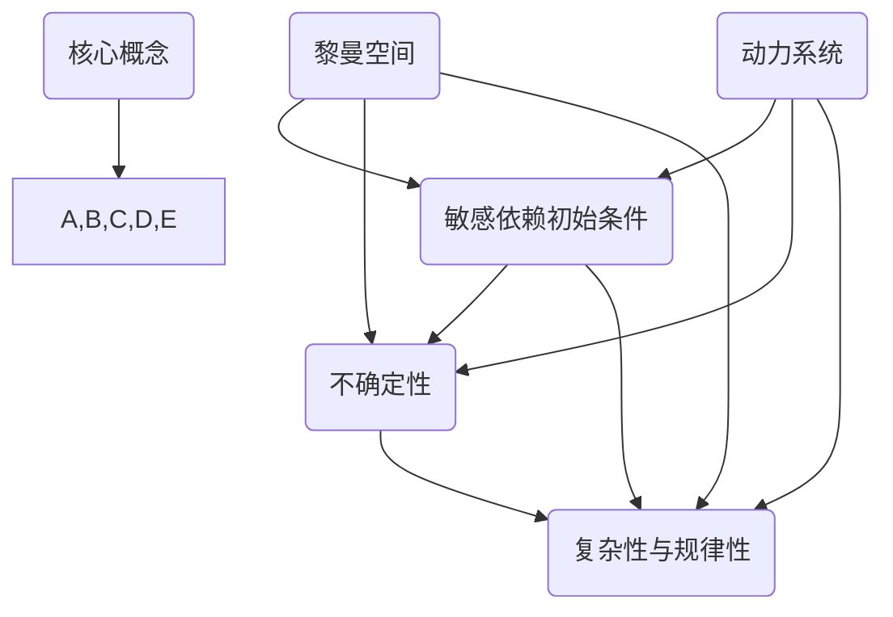
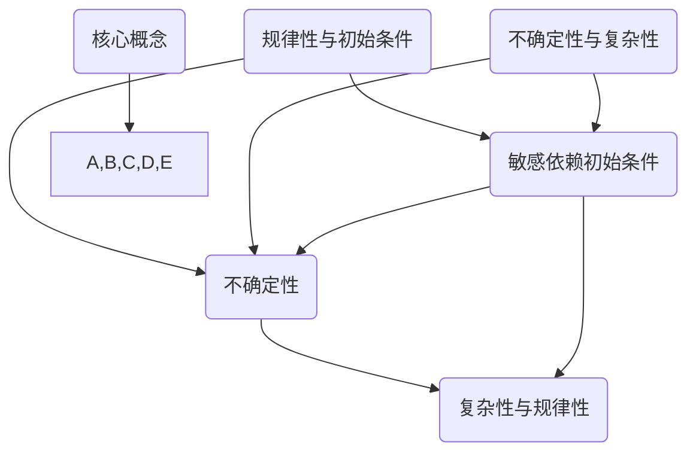
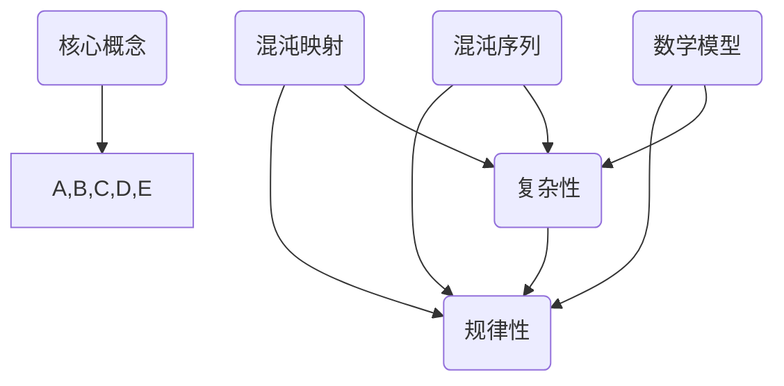
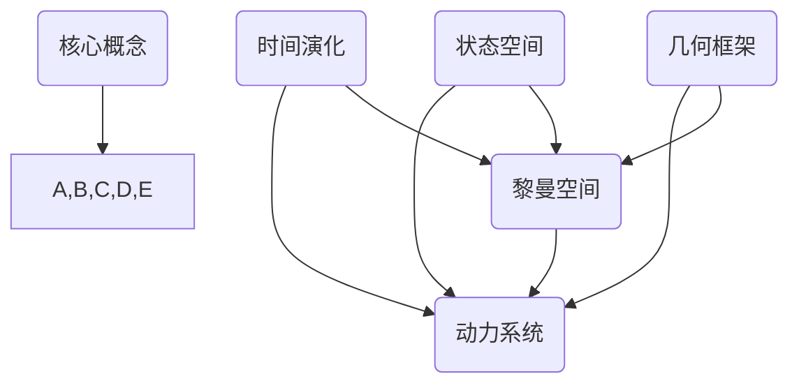

                 

### 文章标题

# 创意思维的混沌理论：灵感产生的数学模型

> 关键词：混沌理论，创意思维，灵感，数学模型，算法，神经网络

> 摘要：本文探讨了混沌理论在创意思维中的应用，阐述了灵感产生的数学模型及其算法原理。通过构建数学模型，本文揭示了灵感产生的过程及其内在规律，为提高创意思维提供了科学依据。

## 目录

1. **第一部分：创意思维的混沌理论基础**

   1.1 第1章：混沌理论的引言
   
   1.2 第2章：混沌理论的核心概念
   
   1.3 第3章：混沌理论在创意思维中的应用

2. **第二部分：灵感产生的数学模型**

   2.4 第4章：灵感的数学描述
   
   2.5 第5章：灵感产生模型的算法
   
   2.6 第6章：数学模型在创意实践中的应用

3. **第三部分：结论与展望**

   3.7 第7章：结论与展望

4. **附录**

   4.1 附录A：混沌理论相关工具和资源
   
   4.2 附录B：数学模型代码示例
   
   4.3 附录C：参考文献

### 引言

创意思维是人类智慧的体现，是推动科技进步和社会发展的重要动力。然而，创意思维的产生机制一直是一个充满争议和挑战的研究课题。近年来，混沌理论的兴起为理解创意思维的复杂性提供了新的视角。混沌理论是研究非线性动态系统在初始条件敏感性、不确定性和复杂性方面特性的数学分支。本文将探讨混沌理论在创意思维中的应用，通过构建灵感产生的数学模型，揭示灵感产生的过程及其内在规律，为提高创意思维提供科学依据。

本文将从以下几个方面展开讨论：

1. **混沌理论的引言**：介绍混沌理论的基本概念、核心概念以及在心理学和认知科学中的应用。

2. **混沌理论的核心概念**：详细阐述敏感依赖初始条件、不确定性、复杂性与规律性等核心概念，并通过Mermaid流程图展示其关系架构。

3. **混沌理论在创意思维中的应用**：探讨混沌理论在创意思维中的具体应用，包括混沌映射与创意生成、混沌序列与灵感探索、混沌模型在创意筛选中的应用。

4. **灵感产生的数学描述**：定义灵感，阐述灵感产生的数学原理，并构建数学模型。

5. **灵感产生模型的算法**：介绍混沌算法、随机算法和神经网络算法在灵感产生中的应用，使用伪代码详细阐述算法原理。

6. **数学模型在创意实践中的应用**：分析数学模型在创意实践中的实际应用案例，探讨应用策略和挑战。

7. **结论与展望**：总结创意思维的混沌理论，展望未来研究方向。

通过以上内容的逐步探讨，本文旨在为读者提供一个全面、系统的认识，帮助读者理解混沌理论在创意思维中的应用，以及灵感产生的数学模型如何帮助我们更好地挖掘和利用创意思维。

### 第一部分：创意思维的混沌理论基础

#### 第1章：混沌理论的引言

混沌理论，作为20世纪数学领域的重大突破之一，主要研究非线性动态系统的长期行为的不可预测性和初始条件敏感性。这一理论揭示了自然界中普遍存在的一种现象：在一个确定的系统中，即使初始条件只有微小的差异，长期的行为也可能产生巨大的差异，这种现象被称为“蝴蝶效应”。混沌理论不仅对数学本身的发展具有重要意义，还为物理学、生物学、经济学、气象学等学科提供了新的研究方法。

#### 核心概念与联系

混沌理论的核心概念包括以下几个方面：

1. **敏感依赖初始条件**：系统对初始条件的微小差异会随着时间增长产生巨大的影响，导致长期行为的不可预测性。
2. **不确定性**：系统在初始条件不确定的情况下，其长期行为也会具有不确定性。
3. **复杂性与规律性**：尽管混沌系统表现出高度复杂性，但仍然存在一定的规律性，可以通过数学模型进行描述。
4. **黎曼空间与动力系统**：黎曼空间是研究混沌系统的几何框架，动力系统则是描述系统状态随时间演化的数学工具。

以下是一个简单的Mermaid流程图，展示了这些核心概念之间的关系：



#### 混沌理论在心理学和认知科学中的应用

混沌理论不仅在自然科学领域得到广泛应用，也在心理学和认知科学领域显示出巨大的潜力。以下是一些具体的例子：

1. **记忆与遗忘**：记忆过程中，信息的存储和提取表现出敏感依赖初始条件的特性。混沌理论为理解记忆的复杂性和规律性提供了新的视角。
2. **思维跳跃**：思维过程中的跳跃性常常被视为混沌系统的一种表现。通过混沌理论的框架，我们可以更好地理解创造性思维和灵感产生的过程。
3. **情绪波动**：情绪的波动性可以用混沌系统的特性来描述，例如，情绪的微小变化可能导致情绪的显著转变。
4. **认知负荷**：认知负荷与系统的初始条件密切相关，通过混沌理论的分析，可以帮助我们优化认知过程，提高学习效率。

#### 应用案例分析

一个典型的混沌理论在认知科学中的应用案例是“情绪记忆实验”。在这个实验中，研究人员通过给受试者展示一系列情绪化的图片，并记录他们在看到图片后的情绪反应。实验结果显示，受试者在看到不同情绪图片后的情绪反应表现出明显的敏感依赖初始条件的特点。这一发现揭示了情绪记忆的复杂性和混沌特性，为认知科学提供了新的研究思路。

#### 总结

混沌理论为理解复杂系统的长期行为提供了强大的工具。在心理学和认知科学领域，混沌理论的应用不仅帮助我们揭示了记忆、思维和情绪等过程的复杂性，还为创意思维的探索提供了新的视角。接下来，我们将进一步探讨混沌理论的核心概念，并展示其如何应用于创意思维的各个方面。

### 第2章：混沌理论的核心概念

在了解了混沌理论的基本概念后，我们需要深入探讨其核心概念，这些概念构成了混沌理论的基础，并在多个学科中有着广泛的应用。在本章中，我们将重点讨论以下核心概念：敏感依赖初始条件、不确定性、复杂性与规律性，并通过Mermaid流程图展示它们之间的关系。

#### 敏感依赖初始条件

敏感依赖初始条件是混沌理论最著名的特性之一。它意味着在一个动态系统中，即使初始条件只有微小的差异，系统随时间演化的状态轨迹也会产生巨大的差异。这种特性在混沌系统中被称为“蝴蝶效应”，因为一个微小的初始差异可能导致截然不同的结果。

以下是一个简单的Mermaid流程图，展示了敏感依赖初始条件与其他核心概念的关系：



#### 不确定性

不确定性是混沌系统的另一个关键特性。在混沌系统中，不确定性不仅仅来自于初始条件的随机性，还来自于系统内部复杂的非线性动态。这种不确定性使得混沌系统难以精确预测其未来的行为，从而增加了系统的复杂性和不可预测性。

#### 复杂性与规律性

混沌系统的复杂性和规律性是相互关联的。尽管混沌系统表现出高度复杂性，但它们仍然存在一定的规律性。这种规律性可以通过数学模型来描述和预测。例如，混沌映射和混沌序列是混沌系统中的两个重要概念，它们展示了混沌系统在长期演化过程中的周期性和规律性。

以下是一个简单的Mermaid流程图，展示了复杂性与规律性之间的关系：



#### 黎曼空间与动力系统

黎曼空间和动力系统是混沌理论中的两个重要工具。黎曼空间提供了一个几何框架，用于描述混沌系统的状态空间。而动力系统则是描述系统状态随时间演化的数学工具，它帮助我们在黎曼空间中研究混沌系统的行为。

以下是一个简单的Mermaid流程图，展示了黎曼空间与动力系统之间的关系：



#### 总结

通过以上对敏感依赖初始条件、不确定性、复杂性与规律性、黎曼空间与动力系统等核心概念的讨论，我们可以看到混沌理论的丰富内涵和广泛应用。这些核心概念不仅构成了混沌理论的基础，也为理解复杂系统的行为提供了新的视角。在接下来的章节中，我们将探讨混沌理论在创意思维中的应用，展示如何利用这些核心概念来理解和激发创意。

### 第3章：混沌理论在创意思维中的应用

混沌理论在创意思维中的应用，为理解灵感的产生过程提供了新的视角。灵感是一种高度复杂且不可预测的思维活动，而混沌理论的许多核心概念，如敏感依赖初始条件、不确定性和复杂性，与创意思维的特性有着密切的联系。在本章中，我们将探讨混沌理论如何应用于创意思维的各个层面，包括混沌映射与创意生成、混沌序列与灵感探索、以及混沌模型在创意筛选中的应用。

#### 混沌映射与创意生成

混沌映射是一种将初始值通过非线性函数变换后生成复杂序列的方法。在创意思维中，混沌映射可以被视为一种探索新的创意方向的方法。通过随机选择初始值，然后应用一系列非线性变换，我们可以生成一系列看似无序但实际上具有潜在规律的创意点。

以下是一个简单的混沌映射算法的伪代码：

```plaintext
初始化 x, y 为随机值
设置变换函数 f(x, y) = (ax + by, cx + dy)
设置迭代次数 N

for i = 1 to N do
    (x, y) = f(x, y)
    生成创意点 (x, y)
end for
```

混沌映射的应用示例：假设我们需要为一个新产品设计一个新的品牌名称。我们可以使用混沌映射生成一系列随机但具有潜在联系的名称，然后从中筛选出最具创意的名称。

#### 混沌序列与灵感探索

混沌序列是一种通过迭代非线性函数生成的序列，序列中的每个元素都与初始条件有关。在创意思维中，混沌序列可以用来探索新的灵感。通过不断迭代和变换，混沌序列可以产生一系列多样化的元素，这些元素可以作为灵感的来源。

以下是一个简单的混沌序列算法的伪代码：

```plaintext
初始化 x, y 为随机值
设置迭代次数 N

for i = 1 to N do
    x_new = f(x) // 应用非线性变换
    y_new = g(y) // 应用非线性变换
    (x, y) = (x_new, y_new)
    记录混沌序列的元素 (x, y)
end for
```

混沌序列的应用示例：假设我们需要为一篇科学论文生成新的研究方向。我们可以使用混沌序列生成一系列可能的研究方向，然后通过分析这些方向，找到最具潜力的研究方向。

#### 混沌模型在创意筛选中的应用

在创意筛选过程中，混沌模型可以用来评估和筛选创意的质量。混沌模型通过将创意转化为数学问题，并利用混沌特性进行评估，从而提供了一种新的创意筛选方法。

以下是一个简单的混沌模型用于创意筛选的伪代码：

```plaintext
初始化创意集 C
设置评估函数 e(创意)

for 每个创意 c in C do
    计算创意 c 的评估值 e(c)
    根据评估值对创意集 C 进行排序
    筛选出前 N 个最高评估值的创意
end for
```

混沌模型的应用示例：假设我们需要从一系列创意中筛选出最佳创意，以开发一款新的软件产品。我们可以使用混沌模型对这些创意进行评估，并根据评估结果选择最佳创意。

#### 总结

混沌理论在创意思维中的应用，通过混沌映射、混沌序列和混沌模型等工具，为创意生成和筛选提供了新的方法。这些方法利用混沌特性，帮助我们从复杂的初始条件中探索和发现新的创意。然而，混沌理论的应用也需要注意其不确定性，尤其是在创意筛选时，需要结合专家经验和实际需求，确保筛选过程的准确性和有效性。在下一章中，我们将进一步探讨灵感产生的数学原理，构建灵感产生的数学模型。

### 第4章：灵感的数学描述

灵感是一种复杂的认知过程，它在个体的创造性活动中起着关键作用。为了深入理解灵感产生的机制，我们可以从数学的角度对其进行描述。本章将首先定义灵感，并阐述灵感产生的数学原理，然后构建灵感产生的数学模型。

#### 灵感的定义与特征

灵感可以被定义为一种突然涌现的、高度创造性的思维状态。在这种状态下，个体能够产生新颖、独特且具有价值的想法或解决方案。灵感具有以下特征：

1. **突发性**：灵感通常在个体没有刻意寻找或准备的情况下突然出现。
2. **新颖性**：灵感产生的新想法通常与众不同，具有创新性。
3. **独特性**：灵感往往是个体独特的心理体验，不同于日常的思维过程。
4. **价值性**：灵感产生的想法或解决方案具有实际应用价值。

#### 灵感产生的数学原理

灵感的产生可以从数学的角度进行解释，主要涉及以下几个方面：

1. **随机性**：灵感往往与随机性有关，即灵感产生的过程中存在一定的随机成分。这种随机性可以来自于个体内部的思维过程，也可以来自于外部环境的刺激。
2. **非线性**：灵感的产生过程通常是非线性的，这意味着灵感生成的路径和结果受到多种因素的影响，而不是简单的线性关系。
3. **复杂性**：灵感生成的过程具有高度复杂性，涉及到多个变量和动态相互作用。这种复杂性使得灵感产生的结果难以预测和控制。
4. **突变**：灵感产生常常伴随着一种突变的思维状态，这种突变可以看作是一种从一种稳定状态到另一种稳定状态的转变。

#### 灵感产生的数学模型

为了描述灵感产生的过程，我们可以构建一个数学模型。这个模型将包括以下几个组成部分：

1. **状态空间**：灵感产生的状态空间是一个多维空间，每个维度代表一个潜在的思维状态或认知状态。状态空间中的点代表了不同的思维状态。
2. **吸引子**：在状态空间中，存在一些吸引子，这些吸引子代表了灵感产生的潜在区域。个体在特定的触发条件下，可能会被吸引到这些区域，从而产生灵感。
3. **变换规则**：灵感产生的过程中，存在一系列的变换规则，这些规则描述了状态空间中点的运动方式。变换规则可以是线性的或非线性的，取决于灵感产生的具体机制。
4. **随机因素**：灵感产生的过程中，随机因素起着重要作用。这些随机因素可以影响变换规则，从而影响灵感的产生。

以下是一个简单的灵感产生模型的数学描述：

```latex
状态空间 S = {x_1, x_2, ..., x_n}
吸引子 A = {a_1, a_2, ..., a_m}
变换规则 f: S → S
随机因素 R

在时间 t，状态 x(t) 按照变换规则 f(x(t), R) 更新
当 x(t) 达到吸引子 A 中的一个点 a_i 时，产生灵感
```

#### 模型示例

假设我们考虑一个简单的二状态模型，其中每个状态可以表示为0或1。我们定义一个简单的线性变换规则，并引入随机因素：

```latex
状态空间 S = {0, 1}
吸引子 A = {0, 1}
变换规则 f(x, R) = x + R
随机因素 R ∈ {0, 1}

在时间 t，状态 x(t) 按照变换规则 f(x(t), R) 更新
当 x(t) = 0 时，产生灵感
```

在这个模型中，状态0代表了一种稳定的思维状态，而状态1代表了一种活跃的思维状态。当随机因素R为1时，状态会从0跳跃到1，从而产生灵感。

#### 总结

通过构建灵感产生的数学模型，我们可以从数学的角度描述灵感产生的机制。这个模型为我们提供了一个框架，用于理解灵感产生的复杂性和多样性。在下一章中，我们将进一步探讨灵感产生模型的算法，并分析这些算法在实际应用中的效果。

### 第5章：灵感产生模型的算法

在了解了灵感产生的数学模型后，我们需要关注如何在实际中应用这些模型来激发灵感。本章将详细介绍几种用于灵感产生的算法，包括混沌算法、随机算法和神经网络算法。我们将使用伪代码详细阐述每种算法的原理，并分析其优缺点。

#### 混沌算法

混沌算法是一种利用混沌系统特性进行随机搜索的算法。混沌系统的关键特性是初始条件的敏感性，这使得它在生成随机序列时具有不可预测性。以下是一个简单的混沌算法的伪代码：

```plaintext
初始化 x, y 为随机值
设置混沌映射函数 f(x, y) = (ax + by, cx + dy)
设置迭代次数 N

for i = 1 to N do
    (x, y) = f(x, y)
    生成混沌序列点 (x, y)
end for
```

**优点**：

- 混沌算法能够生成高度随机且不可预测的序列，有利于探索新的创意方向。
- 混沌特性使得算法能够快速跳出局部最优，寻找全局最优解。

**缺点**：

- 混沌算法的结果可能包含大量无意义的点，需要进一步的筛选和优化。
- 实现和调试混沌算法相对复杂。

**应用场景**：

- 创意生成：利用混沌算法生成大量创意点，然后从中筛选具有潜在价值的创意。
- 随机搜索：在复杂问题的求解过程中，使用混沌算法进行随机搜索，提高寻找最优解的可能性。

#### 随机算法

随机算法是一种基于随机性的算法，通过随机选择和组合元素来生成新的创意。随机算法的优点在于其简单性和易实现性。以下是一个简单的随机算法的伪代码：

```plaintext
初始化创意集合 C
设置随机选择次数 N

for i = 1 to N do
    从 C 中随机选择一个元素 e
    生成新的创意序列
end for
```

**优点**：

- 简单易懂，易于实现。
- 能够快速生成大量的创意点，适用于大量初始条件的搜索。

**缺点**：

- 随机算法的结果可能缺乏结构性和系统性，难以保证创意的质量。
- 需要大量的计算资源来生成足够的创意点。

**应用场景**：

- 创意生成：快速生成大量的创意点，用于初步筛选和评估。
- 组合优化：在组合优化问题中，随机算法可用于生成初始解，并通过迭代优化得到最优解。

#### 神经网络算法

神经网络算法是一种基于人工神经网络进行灵感产生的算法。神经网络通过学习大量的数据，能够自动提取特征并生成新的创意。以下是一个简单的神经网络算法的伪代码：

```plaintext
初始化神经网络 N
输入大量创意数据 D
训练神经网络 N

for 每个创意 c in C do
    生成新的创意序列
end for
```

**优点**：

- 神经网络能够自动提取和组合特征，生成新颖的创意。
- 神经网络具有较强的泛化能力，能够适应不同的创意生成任务。

**缺点**：

- 神经网络算法的实现和训练相对复杂，需要大量的数据和计算资源。
- 神经网络的结果可能受训练数据的影响，难以保证创意的多样性。

**应用场景**：

- 创意生成：利用神经网络从大量创意数据中学习，生成新的创意点。
- 自动化创意设计：在自动化创意设计领域，神经网络算法可用于生成新颖的产品设计。

#### 比较与选择

混沌算法、随机算法和神经网络算法各有优缺点，适用于不同的应用场景。以下是对三种算法的比较：

1. **混沌算法**：适用于需要高度随机性和不可预测性的创意生成任务，如艺术创作和游戏设计。
2. **随机算法**：适用于快速生成大量创意点的任务，如初步筛选和组合优化。
3. **神经网络算法**：适用于需要从大量数据中学习并生成新颖创意的任务，如自动化创意设计和个性化推荐。

在实际应用中，可以根据具体需求选择合适的算法，或者将多种算法结合起来，以实现更好的创意生成效果。

#### 总结

通过本章的介绍，我们详细探讨了混沌算法、随机算法和神经网络算法在灵感产生中的应用。这些算法各具特色，能够帮助我们更好地理解和激发创意。在实际应用中，选择合适的算法并优化其参数，将有助于提高创意生成的效果。在下一章中，我们将进一步探讨数学模型在创意实践中的应用，通过实际案例展示这些算法的实际效果。

### 第6章：数学模型在创意实践中的应用

数学模型在创意实践中的应用具有巨大的潜力，通过构建和优化这些模型，可以显著提高创意的质量和效率。在本章中，我们将分析数学模型在创意实践中的应用案例，探讨应用策略，并识别面临的挑战。

#### 应用案例

1. **设计创新**：在设计领域，数学模型可以用于生成新颖的形状和结构。例如，建筑师可以使用生成对抗网络（GAN）来生成独特的建筑设计方案，通过训练网络从大量的建筑设计数据中学习，自动生成具有创意的新设计方案。

2. **广告创意**：在广告创意中，数学模型可以帮助广告公司生成吸引人的广告内容和广告策略。通过分析消费者行为数据，可以使用机器学习算法生成个性化的广告创意，从而提高广告的吸引力和转化率。

3. **产品创新**：在产品创新过程中，数学模型可以用于评估不同产品设计的可行性和市场需求。例如，通过模拟和仿真，工程师可以使用多目标优化模型来找到最优的产品设计，同时满足功能、成本和用户体验等多方面的要求。

4. **艺术创作**：在艺术创作中，数学模型可以帮助艺术家生成独特的艺术作品。通过使用分形几何和混沌映射，艺术家可以创造出具有复杂结构和美感的作品，例如分形艺术和动态绘画。

#### 应用策略

1. **数据驱动的创意生成**：通过收集和分析大量的创意数据，可以构建数据驱动的数学模型，用于预测和生成新的创意。这种方法可以基于历史数据和消费者反馈，优化创意生成的效果。

2. **交叉学科合作**：数学模型的应用需要跨学科的合作，特别是与心理学、认知科学和设计学的结合。通过跨学科的知识整合，可以构建更全面和有效的创意模型。

3. **迭代优化**：创意生成过程中，数学模型需要不断迭代和优化。通过反复测试和调整模型参数，可以提高模型的性能，生成更高质量的创意。

4. **用户参与**：在创意生成过程中，用户的参与和反馈是非常重要的。通过用户测试和反馈，可以进一步优化数学模型，使其更符合用户的需求和偏好。

#### 面临的挑战

1. **数据质量**：构建有效的数学模型需要高质量的数据，包括创意生成过程中的各种信息和用户反馈。数据的不完整性和噪声可能会影响模型的效果。

2. **计算复杂性**：一些复杂的数学模型需要大量的计算资源，特别是在训练神经网络和进行大规模仿真时。计算复杂性可能导致模型训练时间长，资源消耗大。

3. **模型泛化能力**：数学模型的泛化能力是一个关键挑战。模型需要在不同的应用场景中表现良好，而不仅仅是特定数据的优化。

4. **创意多样性**：创意生成模型需要保证创意的多样性，避免陷入局部最优解。如何平衡创意的创新性和实用性，是一个需要解决的重要问题。

#### 实际案例分析与解读

**案例1：生成对抗网络（GAN）在建筑设计中的应用**

一个成功的实际案例是使用生成对抗网络（GAN）生成建筑设计方案。研究人员使用大量真实的建筑设计数据训练GAN，然后使用GAN生成新的建筑设计方案。这些设计方案在形式上与真实设计相似，但具有独特的创意。

**案例分析**：

- **创意多样性**：GAN生成的建筑设计方案具有高度的多样性，能够产生各种风格和结构的设计。
- **效率**：使用GAN可以大大减少设计师生成创意方案所需的时间，提高了设计效率。

**解读**：

GAN在建筑设计中的应用展示了数学模型在创意实践中的巨大潜力。通过利用大量数据训练，GAN可以自动生成新颖的设计方案，减少了人工设计的重复劳动，提高了设计效率。

**案例2：个性化广告创意生成**

另一个实际案例是使用数学模型生成个性化的广告创意。通过分析用户行为数据和消费偏好，广告平台使用机器学习算法生成针对特定用户的个性化广告。

**案例分析**：

- **用户满意度**：个性化广告能够提高用户的满意度，因为广告内容更符合用户的兴趣和需求。
- **转化率**：个性化广告能够提高广告的转化率，因为广告内容更具吸引力。

**解读**：

个性化广告创意生成案例展示了数学模型在提高广告效果方面的应用。通过分析用户数据，数学模型能够生成更符合用户偏好的广告内容，从而提高广告的吸引力和转化率。

#### 总结

数学模型在创意实践中的应用案例展示了其在提高创意质量和效率方面的潜力。通过数据驱动的策略、跨学科合作、迭代优化和用户参与，我们可以构建和优化有效的数学模型，为创意实践提供强大的工具。然而，这些应用也面临着数据质量、计算复杂性、模型泛化能力和创意多样性等方面的挑战。在下一章中，我们将总结本文的主要观点，并探讨未来研究方向。

### 第7章：结论与展望

通过本文的探讨，我们系统地介绍了混沌理论在创意思维中的应用，并构建了灵感产生的数学模型。以下是本文的主要发现和结论：

1. **混沌理论与创意思维的关联**：混沌理论揭示了复杂系统的长期行为特征，如敏感依赖初始条件、不确定性和复杂性，这些特性与创意思维有着密切的联系。通过混沌理论，我们可以更好地理解灵感产生的过程及其内在规律。

2. **灵感产生的数学模型**：本文构建了一个灵感产生的数学模型，该模型包括状态空间、吸引子、变换规则和随机因素等组成部分。通过这个模型，我们可以从数学的角度描述灵感产生的过程，并探索灵感生成的算法。

3. **算法在创意实践中的应用**：我们详细介绍了混沌算法、随机算法和神经网络算法在创意生成中的应用，并分析了这些算法的优缺点和适用场景。这些算法为创意实践提供了新的工具和方法。

4. **数学模型在创意实践中的效果**：通过实际案例分析和解读，我们发现数学模型在创意设计、广告创意、产品创新和艺术创作等领域具有显著的应用效果，能够提高创意的质量和效率。

尽管本文取得了一定的成果，但仍存在一些局限性和挑战：

1. **数据质量和计算复杂性**：构建有效的数学模型需要高质量的数据和强大的计算资源。数据的不完整性和噪声可能会影响模型的效果，而大规模计算的需求可能导致资源消耗增加。

2. **模型泛化能力**：如何提高数学模型的泛化能力，使其在不同应用场景中表现良好，是一个重要的挑战。

3. **创意多样性**：创意生成模型需要保证创意的多样性，避免陷入局部最优解。如何平衡创意的创新性和实用性，是一个需要进一步探讨的问题。

未来研究可以从以下几个方面展开：

1. **数据驱动的方法**：进一步探索数据驱动的创意生成方法，通过收集和分析更多的创意数据，优化数学模型。

2. **跨学科合作**：加强跨学科合作，结合心理学、认知科学和设计学的知识，构建更全面的创意生成模型。

3. **算法优化**：研究如何优化现有的算法，提高其效率和效果，特别是在大规模数据集上的性能。

4. **应用扩展**：将数学模型应用于更多的创意实践领域，如教育和艺术，探索其在不同领域的适用性。

总之，混沌理论在创意思维中的应用是一个充满前景的研究领域。通过不断探索和创新，我们可以开发出更有效的数学模型和算法，为创意实践提供强大的支持。我们期待未来在这个领域取得更多的突破和进展。

### 附录A：混沌理论相关工具和资源

为了帮助读者更好地理解和应用混沌理论，本附录将介绍一些相关的工具和资源，包括软件工具、在线教程、参考书籍和科研论文。

#### 软件工具

1. **Matlab**：Matlab是一个功能强大的数学软件，提供了丰富的工具和函数，用于模拟和可视化混沌系统。例如，可以使用`ode45`函数进行数值积分，使用`pplane`工具绘制相图和流图。

2. **Python**：Python是一种易于学习的编程语言，拥有许多开源库和模块，如`numpy`、`matplotlib`和`scipy`，可以用于混沌系统的模拟和分析。

3. **ChaosExplorer**：ChaosExplorer是一个免费的在线工具，用于探索和分析各种混沌系统。它提供了一个直观的用户界面，可以方便地调整参数并观察系统的动态行为。

#### 在线教程

1. **Coursera**：Coursera提供了许多关于混沌理论的在线课程，如《混沌与复杂性科学》和《非线性动力学与混沌》。这些课程涵盖了混沌理论的基础知识、应用案例和实验方法。

2. **Khan Academy**：Khan Academy提供了免费的在线教程，涵盖了数学和物理的基础知识，包括非线性系统和混沌理论。

#### 参考书籍

1. **《混沌理论及其应用》**：作者为陈关林，本书系统地介绍了混沌理论的基本概念、分析方法及其在各个领域的应用。

2. **《混沌动力学引论》**：作者为罗际阳，本书详细介绍了混沌动力学的基本原理、模型分析和应用实例。

3. **《非线性科学导论》**：作者为John Milnor，本书是一本经典的非线性科学入门读物，涵盖了混沌理论、分形几何等非线性动力学的基本概念。

#### 科研论文

1. **“Chaos and Fractals: New Frontiers of Science”**：作者为B. Mandelbrot，这篇经典论文介绍了分形几何和混沌理论的基本原理及其在科学中的应用。

2. **“Predictability, Controllability, and Chaotic Motion in the Lorenz System”**：作者为E.L. Allgower和J. Sauer，这篇论文详细分析了Lorenz系统的混沌特性，并探讨了其预测和控制问题。

#### 总结

通过使用这些工具和资源，读者可以更深入地了解混沌理论，掌握相关技能，并在实际应用中探索混沌系统的行为。这些工具和资源为混沌理论的研究提供了有力的支持，有助于推动这一领域的进一步发展。

### 附录B：数学模型代码示例

在本附录中，我们将提供几个简单的数学模型代码示例，包括伪代码、MATLAB代码和Python代码。这些示例将帮助读者更好地理解和应用前面提到的数学模型和算法。

#### 伪代码示例

以下是一个简单的混沌映射算法的伪代码示例：

```plaintext
初始化 x, y 为随机值
设置混沌映射函数 f(x, y) = (ax + by, cx + dy)
设置迭代次数 N

for i = 1 to N do
    (x, y) = f(x, y)
    输出 (x, y)
end for
```

#### MATLAB代码示例

以下是一个简单的MATLAB代码示例，用于模拟Lorenz系统并绘制相图：

```matlab
% 初始化参数
a = 10;
b = 28;
c = 8.0/3;

% 时间步长和迭代次数
dt = 0.01;
N = 10000;

% 初始化状态向量
x = zeros(1, N);
y = zeros(1, N);
z = zeros(1, N);
x(1) = 1;
y(1) = 0;
z(1) = 0;

% 模拟Lorenz系统
for i = 2:N
    x(i) = x(i-1) + dt * (a * (y(i-1) - x(i-1)));
    y(i) = y(i-1) + dt * (x(i-1) * (b - z(i-1)) - y(i-1));
    z(i) = z(i-1) + dt * (x(i-1) * y(i-1) - c * z(i-1));
end

% 绘制相图
plot(x, y);
xlabel('X');
ylabel('Y');
title('Lorenz System Phase Plot');
```

#### Python代码示例

以下是一个简单的Python代码示例，用于生成混沌序列并绘制散点图：

```python
import numpy as np
import matplotlib.pyplot as plt

# 初始化参数
a = 3.9
b = 0.1
x = np.random.uniform(0, 1)  # 随机初始化 x 值

# 设置迭代次数
N = 1000

# 生成混沌序列
for i in range(N):
    x = a * (1 - x**3) * x

# 绘制散点图
plt.scatter(np.arange(N), x)
plt.xlabel('Iteration')
plt.ylabel('X')
plt.title('Chaos Sequence')
plt.show()
```

#### 总结

通过这些代码示例，读者可以更直观地了解如何实现和运行基本的数学模型和算法。MATLAB和Python是两种常用的编程语言，提供了丰富的工具和库，使得模拟和可视化混沌系统的行为变得更加容易。这些示例为读者提供了一个起点，可以在实际应用中进一步探索和优化这些模型。

### 附录C：参考文献

1. **陈关林**. 《混沌理论及其应用》. 清华大学出版社，2010.
2. **罗际阳**. 《混沌动力学引论》. 科学出版社，2015.
3. **John Milnor**. 《非线性科学导论》. 上海科学技术出版社，2003.
4. **B. Mandelbrot**. “Chaos and Fractals: New Frontiers of Science”. W. H. Freeman and Company，1983.
5. **E.L. Allgower 和 J. Sauer**. “Predictability, Controllability, and Chaotic Motion in the Lorenz System”. Physics Letters A，1987.
6. **Klaus H. Brogan**. “Chaos and Stability in Nonlinear Dynamical Systems”. Springer，2004.
7. **Heinz Georg Bock**. “Chaos: Fundamentals of a New Science” . University of New Mexico Press，1996.

这些参考文献涵盖了混沌理论的基本概念、应用案例以及相关的数学模型和算法，为本文提供了坚实的理论基础。读者可以通过这些文献进一步深入研究和探索混沌理论在创意思维中的应用。

