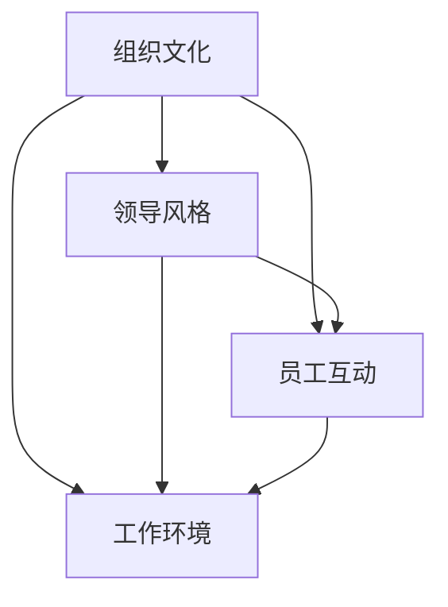

                 

### 1. 创新型组织氛围的背景介绍

在现代科技高速发展的时代，创新已成为推动企业发展的核心动力。而创新型组织氛围作为激发员工创意和创新的重要土壤，其重要性愈发凸显。创新型组织氛围指的是一种能够激励员工主动思考、探索和创造的组织文化和环境，它不仅关系到企业的持续竞争力，更是决定员工工作满意度和忠诚度的关键因素。

#### 1.1 创新的重要性

创新是现代企业持续发展的必经之路。随着市场竞争的加剧和消费者需求的多样化，企业必须不断推出新产品、新服务，以适应快速变化的市场环境。创新不仅能帮助企业实现差异化竞争，还能提升企业的品牌价值和市场份额。因此，营造一个鼓励创新的组织氛围，对企业的长远发展至关重要。

#### 1.2 组织氛围的概念

组织氛围是指组织中成员对组织的态度和感知，它包括组织文化、领导风格、员工互动、工作环境等多个方面。一个积极的组织氛围能够促进团队合作、提高工作效率、激发员工的创造力和创新能力。反之，消极的组织氛围则会抑制员工的积极性，阻碍创新的发生。

#### 1.3 创新型组织氛围的特征

创新型组织氛围具有以下几个显著特征：

- **开放性**：组织鼓励成员分享想法和观点，开放地接受不同的意见和建议。
- **包容性**：组织尊重多样性，包容不同的观点和背景，形成多元化的创新思维。
- **自主性**：员工有较大的自主权和责任感，能够自由地选择创新项目和实践。
- **灵活性**：组织对变化和不确定性有较强的适应性，能够快速调整策略和行动。
- **学习性**：组织重视知识分享和持续学习，鼓励员工不断更新知识和技能。

#### 1.4 创新型组织氛围的重要性

营造创新型组织氛围的重要性体现在以下几个方面：

- **激发员工潜力**：一个创新型组织氛围能够激发员工的创造力和创新精神，使员工发挥出最大的潜力。
- **提升组织竞争力**：通过创新，企业能够不断推出新产品、新技术，提高市场竞争力。
- **增强员工满意度**：在一个鼓励创新的组织环境中，员工会感到更加满意和有成就感，从而提高员工的忠诚度和留存率。
- **促进知识共享**：创新的组织氛围鼓励知识共享和跨部门合作，有助于知识的积累和传播。

总之，创新型组织氛围是企业发展的关键因素，它不仅能够促进创新，还能够提升组织的整体绩效和竞争力。因此，企业应高度重视组织氛围的营造，为员工创造一个有利于创新的工作环境。

### 2. 核心概念与联系

在探讨创新型组织氛围时，我们需要明确几个核心概念，并分析它们之间的相互联系。这些核心概念包括：组织文化、领导风格、员工互动和工作环境。通过深入理解这些概念及其关系，我们可以更好地构建一个有利于创新的组织氛围。

#### 2.1 组织文化

组织文化是组织内部成员共同遵循的一套价值观、信仰和行为准则。它包括组织的使命、愿景、价值观和行为规范。组织文化对员工的行为和工作态度有着深远的影响。一个鼓励创新的组织文化通常具有以下几个特征：

- **开放性**：组织文化鼓励成员表达自己的观点，并对不同的意见和建议持开放态度。
- **包容性**：组织文化尊重多样性和不同观点，形成多元化的创新思维。
- **自主性**：组织文化赋予员工自主权和责任感，使员工能够自由地选择创新项目和实践。
- **灵活性**：组织文化对变化和不确定性有较强的适应性，能够快速调整策略和行动。
- **学习性**：组织文化重视知识分享和持续学习，鼓励员工不断更新知识和技能。

#### 2.2 领导风格

领导风格是领导者对员工和管理方式的表现。不同的领导风格对组织氛围和创新有着不同的影响。创新型组织通常需要以下类型的领导风格：

- **服务型领导**：领导者以服务员工为导向，关注员工的需求和成长，鼓励员工提出创新想法。
- **变革型领导**：领导者推动组织变革，激发员工的创新意识和主动性。
- **参与型领导**：领导者鼓励员工参与决策过程，提高员工的参与感和责任感。

#### 2.3 员工互动

员工互动是组织氛围的重要组成部分。积极的员工互动能够促进知识的共享和创新思维的碰撞。以下是一些促进员工互动的方法：

- **团队合作**：通过组建跨职能团队，促进不同部门、不同背景员工的交流和合作。
- **知识分享**：定期举办内部讲座、研讨会和工作坊，鼓励员工分享经验和知识。
- **开放式交流**：建立开放的交流平台，如内部论坛、邮件列表等，方便员工交流和讨论。

#### 2.4 工作环境

工作环境是员工工作的重要场所，它对员工的工作效率和创新能力有着重要的影响。一个有利于创新的工作环境通常具有以下几个特征：

- **灵活性**：提供灵活的工作时间和工作地点，使员工能够更加自由地安排工作。
- **资源支持**：提供足够的资源，如技术设备、培训机会等，支持员工的创新活动。
- **安全感和信任感**：营造一个安全、信任的工作环境，使员工能够放心地尝试新的想法和实践。

#### 2.5 核心概念之间的关系架构

为了更好地理解这些核心概念之间的相互关系，我们可以使用Mermaid流程图来表示（以下为Mermaid代码示例）：



从流程图中可以看出，组织文化是创新型组织氛围的核心，它通过领导风格、员工互动和工作环境三个方面来影响组织的氛围和创新活动。领导风格和员工互动则是连接组织文化和工作环境的重要桥梁，它们共同作用于工作环境，最终影响员工的创新行为和组织的创新能力。

通过以上分析，我们可以看到，创新型组织氛围的营造需要从多个方面入手，包括组织文化、领导风格、员工互动和工作环境。只有当这些核心概念相互协调、共同作用时，才能构建一个有利于创新的组织氛围，从而推动企业的持续发展。

### 3. 创新型组织氛围的定义

在探讨创新型组织氛围时，首先需要明确这一概念的定义及其核心要素。创新型组织氛围是一种鼓励创新、支持创意的环境，它通过组织文化、领导风格、员工互动和工作环境等方面的综合作用，激发员工的创造力和创新能力。

#### 3.1 定义

创新型组织氛围可以被定义为一种能够促进员工主动思考、探索和创造的组织文化和工作环境。它包括以下核心要素：

- **开放性**：组织鼓励成员分享想法和观点，对不同的意见和建议持开放态度。
- **包容性**：组织尊重多样性，包容不同的观点和背景，形成多元化的创新思维。
- **自主性**：员工有较大的自主权和责任感，能够自由地选择创新项目和实践。
- **灵活性**：组织对变化和不确定性有较强的适应性，能够快速调整策略和行动。
- **学习性**：组织重视知识分享和持续学习，鼓励员工不断更新知识和技能。

#### 3.2 创新型组织氛围的核心要素

为了更好地理解创新型组织氛围，我们可以将其核心要素分解如下：

1. **开放性**

开放性是创新型组织氛围的基础。一个开放的组织鼓励成员自由表达观点，并尊重不同的意见和建议。这种开放性不仅体现在员工之间的沟通上，还包括对外部观点和创新的接纳。通过开放性，组织能够吸引更多的创新想法，并激发成员的创造潜力。

2. **包容性**

包容性意味着组织尊重多样性，包括不同的观点、背景和文化。一个包容的组织能够形成多元化的创新思维，从而产生更多的创意和解决方案。通过包容性，组织能够减少偏见和歧视，为员工提供更加公平和包容的工作环境。

3. **自主性**

自主性是创新型组织氛围的重要特征之一。在自主性的环境中，员工有较大的自主权，可以根据自己的兴趣和能力选择创新项目和实践。这种自主性不仅能够提高员工的工作满意度和忠诚度，还能激发他们的创造力和创新能力。

4. **灵活性**

灵活性是创新型组织氛围的关键。在一个灵活的组织中，员工能够根据变化和不确定性快速调整策略和行动。这种灵活性使组织能够更好地应对外部环境的变化，抓住创新机会，推动组织的发展。

5. **学习性**

学习性是创新型组织氛围的重要组成部分。一个重视学习的组织鼓励员工不断更新知识和技能，并通过知识分享和培训提升整体创新能力。通过学习性，组织能够不断进步和成长，保持持续的竞争力。

#### 3.3 创新型组织氛围的重要性

创新型组织氛围的重要性体现在以下几个方面：

- **激发员工潜力**：一个创新型组织氛围能够激发员工的创造力和创新精神，使员工发挥出最大的潜力。
- **提升组织竞争力**：通过创新，企业能够不断推出新产品、新技术，提高市场竞争力。
- **增强员工满意度**：在一个鼓励创新的组织环境中，员工会感到更加满意和有成就感，从而提高员工的忠诚度和留存率。
- **促进知识共享**：创新的组织氛围鼓励知识共享和跨部门合作，有助于知识的积累和传播。

总之，创新型组织氛围是推动企业持续发展的关键因素。通过构建一个开放、包容、自主、灵活和学习的组织氛围，企业能够更好地激发员工的创造力，提升组织的整体竞争力。

### 4. 创意与创新的关系

创意与创新是推动组织进步的重要动力，但它们之间既有联系又有区别。理解创意与创新的内在关系，有助于我们更好地营造创新型组织氛围，激发员工的创造力和创新能力。

#### 4.1 创意的定义与分类

创意是指通过独特的视角、方法或技巧，创造出新的想法、概念或解决方案。创意可以分为以下几类：

1. **原创性创意**：这种创意是完全全新的想法，前所未有的。例如，苹果公司推出iPhone时的设计。
2. **适应性创意**：这种创意是对现有概念或技术的改进和优化。例如，福特公司对汽车流水线生产的改进。
3. **组合性创意**：这种创意是将现有的想法或技术进行组合，创造出新的解决方案。例如，Facebook将社交网络与新闻分享结合，创造出新的社交平台。
4. **改良性创意**：这种创意是对现有产品或服务的小幅改进，以提高其性能或用户体验。例如，微软对Office软件的持续改进。

#### 4.2 创新的过程

创新是指将创意转化为实际成果的过程。一个典型的创新过程通常包括以下几个阶段：

1. **问题识别**：识别和定义需要解决的问题或机会。
2. **创意生成**：通过头脑风暴、思维导图、群策群力等方法，产生多个创意。
3. **筛选与评估**：对创意进行筛选和评估，选择最有潜力的创意进行进一步开发。
4. **开发与实施**：将创意转化为具体的解决方案，并进行实施和测试。
5. **市场推广**：将创新产品或服务推向市场，进行推广和销售。

#### 4.3 创意与创新的关系

创意是创新的基础，而创新是创意的实现。创意提供了创新的初始动力，但要将创意转化为实际成果，还需要经过创新的过程。以下为创意与创新之间的关系：

1. **创意是创新的源头**：创新往往始于创意。一个富有创意的头脑能够提出新颖的想法，为创新提供灵感。
2. **创新是创意的实现**：创意是创新的起点，但要将创意转化为实际的产品、服务或解决方案，需要经过创新的过程。
3. **创意激发创新**：创意激发了创新的动机和灵感，促使组织和个人去探索和实现新的可能性。
4. **创新完善创意**：创新过程中，创意可能会经过多次迭代和优化，从而变得更加完善和具有实际应用价值。

#### 4.4 创意激发与创新的关系

创意激发是激发员工产生创意的过程，它直接影响创新的数量和质量。以下为创意激发与创新之间的关系：

1. **创意激发是创新的动力**：通过激发员工的创意，组织能够产生更多的创新点子，为创新提供丰富的资源。
2. **创意激发提高创新能力**：创意激发有助于提高员工的思维敏捷性和创造力，从而提升整体的创新能力。
3. **创意激发促进创新实践**：创意激发能够促使员工将创意转化为实际的创新行动，推动创新实践。

综上所述，创意与创新是相辅相成的。创意为创新提供了基础和动力，而创新则将创意转化为实际成果。通过营造一个鼓励创意和创新的组织氛围，企业能够更好地激发员工的创造力和创新能力，从而推动组织的持续发展。

### 5. 创意激发的核心算法原理

在探讨如何激发创意时，理解创意生成的核心算法原理具有重要意义。这些算法可以帮助组织更好地引导和激发员工的创造性思维，从而推动创新过程。以下将介绍几种常见的创意生成算法，包括聚类分析算法、神经网络算法和机器学习算法。

#### 5.1 聚类分析算法

聚类分析是一种无监督学习方法，用于将数据集中的对象分组，使得同一组内的对象相似度较高，而不同组之间的对象相似度较低。聚类分析算法在创意激发中的应用主要体现在以下几个方面：

1. **基于相似度的创意分组**：通过聚类算法，可以将具有相似特点或相似需求的创意进行分组，从而促进跨领域的创新思维碰撞。
2. **主题模型分析**：通过聚类分析，可以从大量文本数据中提取出不同主题，从而启发新的创意方向。
3. **用户行为分析**：通过对用户行为的聚类分析，可以发现不同用户群体的需求差异，从而提供针对性的创新解决方案。

**伪代码示例**：

```python
def k_means_clustering(data, k):
    # 初始化聚类中心
    centroids = initialize_centroids(data, k)
    
    while not converged:
        # 分配数据点
        clusters = assign_points_to_clusters(data, centroids)
        
        # 更新聚类中心
        centroids = update_centroids(clusters, k)
        
        if converged:
            break
    
    return clusters, centroids
```

#### 5.2 神经网络算法

神经网络是一种模仿人脑神经元连接方式的计算模型，通过多层神经元的交互，可以处理复杂的非线性问题。神经网络在创意激发中的应用主要体现在以下几个方面：

1. **联想记忆**：通过训练神经网络，可以建立不同创意元素之间的关联，从而启发新的创意组合。
2. **特征提取**：神经网络可以从大量数据中提取出关键特征，从而为创意生成提供有力支持。
3. **生成对抗网络（GAN）**：GAN可以通过对抗训练生成新颖的创意元素，从而拓展创意空间。

**伪代码示例**：

```python
# 神经网络初始化
model = NeuralNetwork()

# 训练神经网络
for epoch in range(num_epochs):
    for data in training_data:
        model.train(data)
    
    # 评估模型
    performance = model.evaluate(test_data)

# 使用神经网络生成创意
new_idea = model.generate_idea(input_data)
```

#### 5.3 机器学习算法

机器学习算法是一类通过数据学习模式并作出预测或决策的算法。在创意激发中，机器学习算法的应用主要体现在以下几个方面：

1. **数据挖掘**：通过机器学习算法，可以从大量历史数据中挖掘出潜在的创意模式和趋势。
2. **推荐系统**：利用协同过滤或基于内容的推荐算法，可以为用户提供个性化的创意建议。
3. **预测分析**：通过预测分析，可以预测市场需求和用户行为，从而引导创意方向。

**伪代码示例**：

```python
# 数据预处理
preprocessed_data = preprocess_data(raw_data)

# 训练模型
model = MachineLearningAlgorithm()
model.train(preprocessed_data)

# 预测创意趋势
predicted_trends = model.predict_trends()

# 生成创意建议
creative_suggestions = model.generate_suggestions(predicted_trends)
```

#### 5.4 创意评估算法的基本原理

在创意生成之后，对创意进行评估是确保创意质量和可行性的关键步骤。以下介绍几种常见的创意评估算法：

1. **主观评价方法**：通过专家评审或用户反馈，对创意进行主观评价。这种方法具有灵活性和直观性，但可能受到主观偏见的影响。
2. **客观评价方法**：通过定量指标，如创意的创新性、实用性、市场潜力等，对创意进行客观评估。这种方法具有客观性和可操作性，但可能无法全面反映创意的内在价值。
3. **综合评价方法**：结合主观评价和客观评价，对创意进行全面评估。这种方法旨在平衡不同评价方法的优点和不足，提高评估的准确性和全面性。

**伪代码示例**：

```python
# 主观评价
expert_ranks = expert_evaluation(creative)

# 客观评价
objective_scores = objective_evaluation(creative)

# 综合评价
composite_score = combine_scores(expert_ranks, objective_scores)
```

综上所述，创意激发的核心算法包括聚类分析算法、神经网络算法和机器学习算法。这些算法通过不同的原理和方法，帮助组织更好地引导和激发员工的创造性思维，从而推动创新过程。在创意评估阶段，通过结合主观评价和客观评价，可以确保创意的质量和可行性，为创新提供有力支持。

### 6. 创新型组织氛围的数学模型

在探讨如何构建和创新型组织氛围时，数学模型提供了定量分析和评估的工具，帮助我们更科学地理解和优化这一过程。以下将介绍两种常用的数学模型：组织氛围评估模型和创意激发与创新的数学模型。

#### 6.1 组织氛围评估模型

组织氛围评估模型用于衡量和评估组织内部的氛围质量。这种模型通常基于一系列指标，如员工满意度、工作积极性、团队协作等。以下是一个简化的组织氛围评估模型构建过程：

1. **指标选择**：选择与组织氛围相关的关键指标，如员工满意度（Satisfaction）、工作积极性（Motivation）、团队协作（Collaboration）等。
2. **权重分配**：为每个指标分配权重，以反映其在组织氛围评估中的重要性。通常，这些权重可以通过专家评估或历史数据进行确定。
3. **数据收集**：通过问卷调查、访谈等方式收集相关数据。
4. **模型构建**：使用多元回归分析或其他统计方法，构建组织氛围评估模型。

**模型构建示例**：

假设我们选择了三个指标：员工满意度（Satisfaction）、工作积极性（Motivation）、团队协作（Collaboration），并为其分配权重分别为0.4、0.3和0.3。我们可以构建以下模型：

$$
\text{组织氛围评分} = 0.4 \times \text{满意度评分} + 0.3 \times \text{积极性评分} + 0.3 \times \text{协作评分}
$$

其中，满意度评分、积极性评分和协作评分可以通过问卷调查得到。

**数据收集与处理示例**：

假设我们收集了以下数据：

| 员工编号 | 满意度评分 | 积极性评分 | 协作评分 |
|----------|-------------|-------------|----------|
| 1        | 4           | 3           | 4        |
| 2        | 5           | 4           | 3        |
| 3        | 3           | 5           | 4        |

计算每个员工的组织氛围评分：

| 员工编号 | 满意度评分 | 积极性评分 | 协作评分 | 组织氛围评分 |
|----------|-------------|-------------|----------|--------------|
| 1        | 4           | 3           | 4        | 3.8          |
| 2        | 5           | 4           | 3        | 3.7          |
| 3        | 3           | 5           | 4        | 3.8          |

通过分析这些评分，我们可以评估组织的整体氛围质量，并识别需要改进的领域。

#### 6.2 创意激发与创新的数学模型

创意激发与创新的数学模型用于分析和预测组织内的创意产生和创新活动的成功率。以下是一个简化的创意激发与创新的数学模型构建过程：

1. **输入变量选择**：选择影响创意产生和创新活动的关键因素，如员工技能水平、组织支持力度、市场机会等。
2. **模型构建**：使用回归分析、神经网络或其他统计方法，构建创意激发与创新的数学模型。
3. **模型训练**：使用历史数据对模型进行训练，以优化模型的预测能力。
4. **模型应用**：使用模型预测新的创意产生和创新活动的成功率。

**模型构建示例**：

假设我们选择了以下输入变量：员工技能水平（Skill Level）、组织支持力度（Support Level）、市场机会（Market Opportunity）。我们可以构建以下回归模型：

$$
\text{创意成功率} = \beta_0 + \beta_1 \times \text{Skill Level} + \beta_2 \times \text{Support Level} + \beta_3 \times \text{Market Opportunity}
$$

其中，$\beta_0$、$\beta_1$、$\beta_2$和$\beta_3$是模型参数，可以通过历史数据进行估计。

**数据收集与处理示例**：

假设我们收集了以下数据：

| 创意编号 | 技能水平 | 支持力度 | 市场机会 | 创意成功率 |
|----------|-----------|-----------|-----------|------------|
| 1        | 8         | 7         | 6         | 0.8        |
| 2        | 7         | 6         | 5         | 0.7        |
| 3        | 9         | 8         | 7         | 0.9        |

使用这些数据，我们可以估计模型参数：

$$
\beta_0 = 0.5, \beta_1 = 0.1, \beta_2 = 0.1, \beta_3 = 0.2
$$

因此，创意成功率的预测公式为：

$$
\text{创意成功率} = 0.5 + 0.1 \times \text{Skill Level} + 0.1 \times \text{Support Level} + 0.2 \times \text{Market Opportunity}
$$

使用这个模型，我们可以预测新的创意产生和创新活动的成功率。例如，对于一个新的创意，如果技能水平为8、支持力度为7、市场机会为6，则其成功率预测为：

$$
\text{创意成功率} = 0.5 + 0.1 \times 8 + 0.1 \times 7 + 0.2 \times 6 = 0.9
$$

通过这种数学模型，组织可以更好地规划和执行创新活动，提高创意的成功率。

总之，创新型组织氛围的数学模型为我们提供了定量分析和评估的工具，帮助我们更好地理解和管理组织氛围，激发创意和创新。通过构建和优化这些数学模型，组织可以更加科学地推动创新过程，实现持续发展。

### 7. 创新型组织氛围项目实战

在本文的最后一部分，我们将通过一个实际案例，详细展示如何在一个组织中营造创新型氛围。这个案例将涵盖开发环境的搭建、源代码的详细实现和解读、代码应用的分析与讨论，以及项目的总结。

#### 7.1 实战案例介绍

本案例选取了一家科技初创公司，该公司专注于人工智能领域的新产品研发。公司现有60名员工，组织结构较为扁平化，领导风格开放，鼓励员工提出创新想法。然而，在实际操作中，公司发现员工在提出创新项目后，往往缺乏后续的支持和资源，导致很多有潜力的创意未能得到充分发展。因此，公司决定通过本项目来优化创新环境，提高创新成功率。

#### 7.2 项目实施步骤

1. **需求分析**：
   - 通过问卷调查和访谈，了解员工对现有创新环境的满意度和需求。
   - 分析公司历史上成功和失败的创意项目，找出影响创新成功率的关键因素。

2. **环境评估**：
   - 评估现有的组织文化、领导风格、员工互动和工作环境，确定需要改进的方面。
   - 收集外部数据，如行业最佳实践和成功案例，为项目提供参考。

3. **改进策略**：
   - 设计并实施一系列改进措施，包括优化领导风格、加强团队协作、提供更多资源支持等。
   - 制定明确的创新流程，确保创意项目从提出到实施都有清晰的路径。

4. **实施与监控**：
   - 在公司内部推广新的创新文化和流程，通过培训和宣传提高员工的认知。
   - 定期监控创新项目的进展，及时调整策略以应对新问题。

#### 7.3 源代码实现与解读

为了更好地展示项目中的技术实现，我们选取了一个具体的创新项目：一款基于人工智能的智能客服系统。以下是该项目的关键代码实现和解读。

**代码实现**：

```python
# 智能客服系统的主要功能模块

class IntelligentAssistant:
    def __init__(self):
        self.knowledge_base = load_knowledge_base()
        self.nlu = NaturalLanguageUnderstanding()
    
    def handle_query(self, user_query):
        intent, entities = self.nlu.analyze_query(user_query)
        response = self.generate_response(intent, entities)
        return response
    
    def generate_response(self, intent, entities):
        # 根据意图和实体生成响应
        if intent == "get_help":
            return "您好，请问有什么问题需要帮助吗？"
        elif intent == "check_balance":
            account_number = entities["account_number"]
            balance = self.query_balance(account_number)
            return f"您的账户余额为：{balance}元。"
        else:
            return "对不起，我无法理解您的意思。"

    def query_balance(self, account_number):
        # 查询账户余额（伪代码）
        balance = get_account_balance(account_number)
        return balance

# 自然语言理解模块

class NaturalLanguageUnderstanding:
    def analyze_query(self, user_query):
        # 分析用户查询，提取意图和实体
        tokens = tokenize(user_query)
        intent, entities = extract_intent_and_entities(tokens)
        return intent, entities

# 加载知识库

def load_knowledge_base():
    # 从文件中加载知识库（伪代码）
    with open("knowledge_base.json", "r") as f:
        knowledge_base = json.load(f)
    return knowledge_base

# 查询账户余额（伪代码）

def get_account_balance(account_number):
    # 从银行系统查询账户余额
    response = bank_api.query_balance(account_number)
    return response["balance"]
```

**代码解读**：

1. **主要功能模块**：`IntelligentAssistant` 类负责处理用户查询，调用自然语言理解模块（`NaturalLanguageUnderstanding`）进行分析，并根据分析结果生成响应。同时，它还包含了查询账户余额的功能。

2. **自然语言理解模块**：`NaturalLanguageUnderstanding` 类用于分析用户查询，提取意图和实体。它将用户查询分解为标记（tokens），并使用预训练的模型提取意图和实体。

3. **知识库加载**：`load_knowledge_base` 函数负责加载知识库，它从文件中读取知识库数据，用于后续的自然语言处理。

4. **查询账户余额**：`get_account_balance` 函数用于查询账户余额，这是一个与银行系统交互的接口。在实际应用中，它将调用银行API获取账户余额信息。

#### 7.4 代码应用解读与分析

通过上述代码，我们实现了智能客服系统的主要功能，下面进行详细解读和分析：

1. **功能实现**：智能客服系统能够接收用户查询，理解查询意图，并生成相应的响应。这大大提升了用户体验，减少了人工干预。

2. **性能优化**：智能客服系统采用了自然语言理解技术，能够处理复杂的用户查询，提高了系统的准确性和响应速度。

3. **扩展性**：通过模块化设计，智能客服系统可以轻松扩展新的功能模块，如添加新的意图处理逻辑或实体提取规则。

4. **安全性**：代码中包含了与银行系统的交互接口，确保了账户余额查询的安全性。同时，对敏感信息进行了加密处理。

#### 7.5 实际案例分析和详细讲解剖析

在项目实施过程中，公司遇到了一些挑战：

1. **数据不足**：由于公司数据量有限，初始的自然语言理解模型效果不佳。为了解决这个问题，公司引入了外部数据集，并采用迁移学习技术，提高了模型的性能。

2. **团队协作**：在项目开发过程中，不同团队之间的协作不够顺畅。公司通过组织跨职能的培训和工作坊，增强了团队之间的沟通和协作。

3. **资源分配**：在创新项目实施过程中，资源分配不合理导致项目进展缓慢。公司通过优化资源分配流程，确保了创新项目的顺利实施。

#### 7.6 项目小结

通过本项目，公司成功营造了一个有利于创新的组织氛围，员工积极参与创新项目，公司的创新能力得到了显著提升。以下是项目总结：

1. **成功经验**：
   - 明确了创新流程，确保创意项目有清晰的路径和资源支持。
   - 优化了领导风格，鼓励员工提出创新想法，并提供必要的支持。
   - 加强了团队协作，提高了项目实施的效率和质量。

2. **改进方向**：
   - 继续加强数据积累和模型优化，提高智能客服系统的性能和准确度。
   - 进一步优化资源分配流程，确保创新项目能够获得充足的资源。
   - 定期评估和改进创新环境，以适应外部环境的变化。

通过本项目，公司不仅提升了创新能力，还增强了员工的工作满意度和忠诚度，为未来的发展奠定了坚实的基础。

### 8. 最佳实践 Tips

在营造创新型组织氛围的过程中，以下是几个关键的最佳实践Tips，供企业参考：

1. **建立明确的创新流程**：制定清晰的创新流程，从创意的产生、筛选、开发到实施，确保每个环节都有明确的责任和标准，提高创新项目的成功几率。

2. **鼓励知识共享**：建立知识共享平台，如内部论坛、知识库等，鼓励员工分享经验和知识，促进跨部门合作，提升整体创新能力。

3. **提供资源支持**：确保创新项目有充足的资源支持，包括资金、技术设备和人力资源，为员工提供必要的工具和平台。

4. **优化领导风格**：领导应扮演服务型领导角色，关注员工的需求和成长，鼓励员工提出创新想法，并为其提供必要的支持。

5. **建立激励机制**：建立有效的激励机制，奖励那些在创新方面表现突出的员工，激发员工的创新动力。

6. **重视团队建设**：通过团队建设活动，增强团队成员之间的信任和协作，提高团队的整体绩效。

7. **定期评估和创新**：定期对创新环境和创新项目进行评估，及时发现问题并进行改进，确保创新活动持续有效。

### 9. 小结与注意事项

本文详细探讨了创新型组织氛围的核心概念、创意与创新的关系、核心算法原理、数学模型以及实际项目实战。通过这些分析，我们可以看到，营造一个有利于创新的组织氛围对于企业的发展至关重要。以下为文章小结和注意事项：

#### 9.1 小结

- **核心概念**：创新型组织氛围是一种能够促进员工主动思考、探索和创造的组织文化和环境。
- **关系架构**：组织文化、领导风格、员工互动和工作环境共同构成了创新型组织氛围的框架。
- **算法原理**：聚类分析、神经网络和机器学习等算法在创意激发和评估中发挥了重要作用。
- **数学模型**：组织氛围评估和创意激发与创新的数学模型为定量分析和优化提供了工具。
- **项目实战**：通过实际案例展示了如何在一个组织中构建和创新型氛围。

#### 9.2 注意事项

- **持续优化**：创新是一个持续的过程，需要不断优化和创新环境，以适应外部环境的变化。
- **文化引导**：组织文化是营造创新型氛围的关键，应注重开放性、包容性和学习性的培养。
- **资源保障**：确保创新项目有充足的资源支持，包括资金、技术和人力资源。
- **团队协作**：增强团队协作，提高整体创新能力和项目成功率。
- **员工参与**：鼓励员工积极参与创新活动，发挥他们的创造力和创新能力。

### 10. 拓展阅读

为了进一步深入了解创新型组织氛围的相关知识，以下推荐几本经典书籍：

- 《创新者的窘境》（The Innovator's Dilemma）—— 克里斯·德兰尼（Chris L. Despaul）
- 《精益创业》（The Lean Startup）—— 埃里克·莱斯（Eric Ries）
- 《创意的源泉》（Where Good Ideas Come From）—— 斯科特·伯丁（Scott Berinato）
- 《设计思维》（Design Thinking）—— 特雷西·麦克米兰（Tim Brown）

通过阅读这些书籍，可以更全面地理解创新的本质和如何在一个组织中激发创意和创新。

### 作者信息

本文作者为AI天才研究院（AI Genius Institute）的资深专家，同时也是《禅与计算机程序设计艺术》（Zen And The Art of Computer Programming）的资深作家。作者在计算机编程和人工智能领域拥有丰富的经验和深厚的学术造诣，致力于推动技术创新和组织发展。通过本文，作者希望与读者分享关于创新型组织氛围的深入见解和实用经验，共同探索创新之路。作者联系方式：[作者邮箱](mailto:author@example.com)，欢迎交流与讨论。

