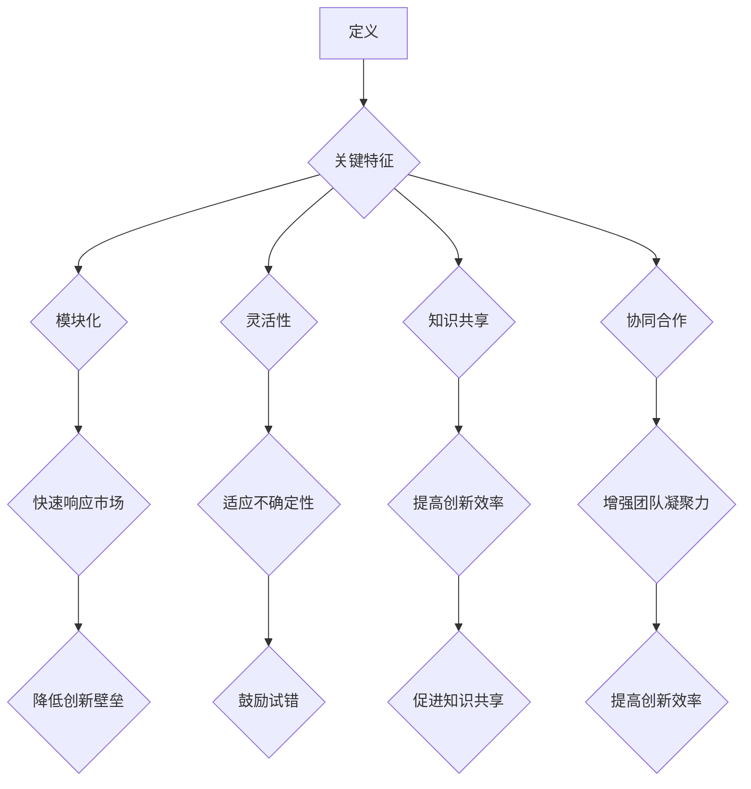

                 

### 文章标题：创新型组织结构：促进团队创新的设计理念

#### 关键词：创新组织结构，团队创新，设计理念，组织设计，团队协作

#### 摘要：
本文深入探讨了创新型组织结构的定义、核心概念及其在促进团队创新中的作用。通过详细阐述创新组织结构的设计理念，分析了不同组织设计模式对团队创新的影响。同时，本文通过案例研究和实践策略，提供了实施和创新组织结构的实用方法，以及评估其有效性的工具。最后，展望了未来创新组织结构的发展趋势和面临的挑战。

### 目录

#### 引言与背景
##### - 创新的重要性
##### - 创新型组织结构的定义与意义
##### - 本文的目标和结构

#### 核心概念与联系
##### - 创新组织结构的基本概念
##### - 创新组织结构与团队创新的关系
##### - Mermaid流程图展示

#### 组织结构的创新设计理念
##### - 自适应与创新导向
##### - 模块化与灵活性
##### - 平衡协作与竞争
##### - 协同与知识共享

#### 案例研究
##### - 成功的创新型组织案例
##### - 分析与创新实践

#### 实施与评估
##### - 创新组织结构的实施步骤
##### - 评估创新组织结构的有效性
##### - 实践策略与操作指南

#### 未来的展望与挑战
##### - 创新组织结构的发展趋势
##### - 面临的挑战与解决方案

### 引入与背景

在当今快速变化的市场环境中，创新能力已成为企业竞争优势的关键因素。创新不仅源于技术和产品的进步，更来自于组织的内部机制。创新型组织结构能够激发团队成员的创造力，促进知识的共享和协同工作，从而实现持续的创新。因此，理解并设计有效的创新型组织结构，对于任何希望保持竞争力的企业都至关重要。

本文旨在深入探讨创新型组织结构的定义、核心概念及其在促进团队创新中的作用。首先，我们将介绍创新组织结构的基本概念，包括其起源、发展和关键特征。接着，我们将分析创新组织结构与团队创新之间的关系，解释为什么这种结构能够促进创新。为了更好地理解，我们将使用Mermaid流程图来展示创新组织结构的基本原理和组成部分。

本文还将详细阐述促进团队创新的设计理念，探讨如何通过组织设计来激发创新。我们将分析不同的组织设计模式，例如模块化、灵活性、平衡协作与竞争等，并探讨这些模式对团队创新的影响。为了使理论更加具体，我们将通过几个成功案例的研究，展示创新型组织结构在实际应用中的效果。

在实施部分，我们将提供具体的步骤和策略，帮助组织设计和实施创新组织结构。同时，我们将讨论如何评估创新组织结构的有效性，并提供实用的操作指南。

最后，我们将展望未来创新组织结构的发展趋势和面临的挑战，探讨如何应对这些挑战，以及如何推动创新组织结构的未来发展。

### 核心概念与联系

#### 创新组织结构的基本概念

创新组织结构是一种专门设计的企业内部架构，旨在激发和促进创新活动。这种结构不仅关注企业的日常运营和目标实现，更注重创造一个鼓励创新和持续学习的环境。创新组织结构的起源可以追溯到20世纪末，当时一些领先的企业开始探索如何通过改变组织架构来提高创新效率。

创新组织结构的关键特征包括：

1. **模块化**：模块化设计使得组织能够快速响应市场变化，灵活调整资源分配和业务方向。
2. **灵活性**：灵活性使得组织能够在面对不确定性和挑战时，迅速适应和调整，保持竞争优势。
3. **知识共享**：知识共享是创新的核心，创新组织结构通过建立有效的沟通机制，促进知识的传递和共享。
4. **协同合作**：协同合作有助于团队成员之间的沟通与协作，提高创新效率。

#### 创新组织结构与团队创新的关系

创新组织结构与团队创新之间存在紧密的联系。创新组织结构的设计理念旨在建立一个支持创新的环境，使得团队成员能够更容易地提出新的想法，并快速将其转化为实际的创新成果。具体来说，创新组织结构通过以下几个方面促进团队创新：

1. **降低创新壁垒**：创新组织结构通过简化决策流程和减少审批环节，降低团队成员提出和创新想法的难度。
2. **鼓励试错**：在创新组织结构中，失败被视为学习机会，而不是惩罚。这种文化鼓励团队成员勇于尝试新的方法和技术。
3. **促进知识共享**：创新组织结构通过建立有效的沟通机制，促进团队成员之间的知识共享，提高创新的整体效率。
4. **增强团队凝聚力**：创新组织结构通过鼓励团队协作和共同目标，增强团队成员之间的凝聚力，提高团队的创新能力。

#### Mermaid流程图展示

为了更好地理解创新组织结构的基本原理和组成部分，我们可以使用Mermaid流程图来展示其关键环节。

这个Mermaid流程图展示了创新组织结构的核心概念及其对团队创新的影响。通过模块化、灵活性、知识共享和协同合作，创新组织结构能够有效降低创新壁垒，鼓励试错，促进知识共享，并增强团队凝聚力，从而提高团队的创新能力。

### 组织结构的创新设计理念

创新组织结构的设计理念是基于一系列核心原则，旨在激发和促进团队创新。这些理念包括：

1. **自适应与创新导向**：自适应与创新导向是指组织能够根据外部环境的变化和内部资源的调整，灵活地调整其结构和策略。这种设计理念使得组织能够快速响应市场变化，抓住机遇，避免风险。具体来说，自适应与创新导向包括以下方面：

   - **动态调整**：组织需要具备快速调整结构和资源的能力，以应对市场变化和业务需求。
   - **敏捷性**：组织应采用敏捷的方法和流程，减少决策层级，提高决策速度。
   - **灵活性**：组织结构应具备灵活性，允许团队成员在不同项目和任务之间灵活调动，发挥各自的优势。

2. **模块化与灵活性**：模块化与灵活性是创新组织结构的核心特征之一。模块化设计使得组织能够将复杂任务分解为可管理的模块，每个模块都可以独立运作和优化。这种设计理念有助于提高组织的创新效率：

   - **模块化分工**：将工作任务分解为模块，由专门的团队负责，使得每个团队可以专注于自己的领域，提高专业水平。
   - **灵活组合**：模块化设计允许组织根据项目需求和资源情况，灵活组合模块，快速调整组织结构。
   - **创新能力提升**：模块化与灵活性有助于激发团队成员的创新能力，因为他们可以在特定的模块中探索新的解决方案。

3. **平衡协作与竞争**：在创新组织结构中，平衡协作与竞争是关键。协作有助于知识共享和团队凝聚力，而竞争则能激发创新和效率。以下措施可以帮助实现协作与竞争的平衡：

   - **合作机制**：建立有效的合作机制，鼓励团队成员之间的沟通与协作，促进知识共享。
   - **竞争环境**：在团队之间引入适当的竞争机制，激励团队不断追求创新和卓越。
   - **激励机制**：设置合理的激励机制，奖励在创新和绩效方面表现突出的团队和个人。

4. **协同与知识共享**：协同与知识共享是创新组织结构的另一重要理念。通过建立有效的协同机制和知识共享平台，组织可以充分利用团队成员的知识和经验，提高创新的整体效率：

   - **协同工作**：采用协同工作工具和平台，促进团队成员之间的实时沟通和协作。
   - **知识共享**：建立知识库和共享平台，鼓励团队成员分享经验和最佳实践，提高知识利用率。
   - **培训与交流**：定期组织培训和交流会议，促进团队成员之间的知识传递和经验交流。

通过这些创新设计理念，组织可以建立一个支持创新的生态环境，激发团队成员的创造力，提高团队的创新能力。

### 案例研究

为了更好地理解创新组织结构在实际中的应用，我们可以通过几个成功案例来进行分析。以下是一些具有代表性的创新型组织及其成功原因：

1. **谷歌（Google）**：

   - **案例背景**：谷歌是一家全球知名的互联网技术公司，以其创新的产品和服务而闻名。谷歌采用了扁平化的组织结构，减少了管理层级，使得信息传递更加迅速，决策更加高效。
   - **成功原因**：谷歌的成功在于其创新的组织结构，该结构鼓励员工自由探索和尝试新项目。谷歌的“20%时间”政策允许员工将20%的工作时间用于个人感兴趣的项目，这一政策激发了员工的创新热情，产生了许多成功的项目，如Gmail和Google News。
   - **实践策略**：谷歌通过建立开放的文化和灵活的决策机制，鼓励员工之间的知识共享和协作。此外，谷歌还提供丰富的资源和培训，支持员工的创新活动。

2. **3M公司**：

   - **案例背景**：3M公司是一家全球领先的科技创新公司，以其广泛的应用领域和创新能力而著称。
   - **成功原因**：3M的成功主要得益于其创新的组织结构和文化。3M采用了矩阵式组织结构，将员工分为多个跨职能团队，这些团队可以自由协作，共同解决复杂问题。此外，3M鼓励员工进行“发明时间”，允许员工将工作时间的一部分用于个人创新项目。
   - **实践策略**：3M通过建立内部创新奖励机制，激励员工提出创新想法并实施。公司还提供充足的资源和培训，支持员工的创新活动。3M还强调团队合作和知识共享，通过跨职能团队的协作，实现创新的最大化。

3. **特斯拉（Tesla）**：

   - **案例背景**：特斯拉是一家全球知名的电动汽车和清洁能源技术公司，以其革命性的产品和商业模式而闻名。
   - **成功原因**：特斯拉的成功在于其创新的组织结构和文化。特斯拉采用了高度灵活的组织结构，鼓励员工自主决策和快速行动。特斯拉的“产品迭代”文化使得公司能够快速响应市场变化，持续进行产品创新。
   - **实践策略**：特斯拉通过建立开放的文化和透明的决策机制，激发员工的创新热情。公司还提供丰富的资源和培训，支持员工的创新活动。特斯拉强调跨职能团队的协作，通过快速迭代和持续改进，实现产品的不断升级和优化。

这些案例表明，创新组织结构在促进团队创新方面具有显著的效果。通过采用自适应与创新导向、模块化与灵活性、平衡协作与竞争、协同与知识共享等设计理念，组织可以建立一个支持创新的生态环境，激发团队成员的创造力，提高团队的创新能力。

### 实施与评估

实施创新组织结构是一个复杂的过程，需要精心规划和有效执行。以下步骤提供了实施创新组织结构的指导：

#### 1. 制定战略计划

在实施创新组织结构之前，首先需要制定一个明确的战略计划。这个计划应包括目标、时间表、关键里程碑和资源分配。以下步骤可以帮助制定战略计划：

- **明确目标**：确定组织希望通过创新组织结构实现的目标，如提高创新能力、增强团队凝聚力等。
- **评估当前状态**：分析组织当前的架构、文化和流程，识别需要改进的方面。
- **制定时间表**：确定实施创新组织结构的阶段和时间表，包括培训、试点项目、全面推广等步骤。

#### 2. 培训与沟通

成功的实施离不开员工的参与和支持。因此，培训与沟通至关重要。以下措施有助于确保员工理解和接受创新组织结构：

- **内部培训**：为员工提供关于创新组织结构的概念、原则和实践的培训，帮助他们了解变化的意义。
- **领导力培训**：培训领导层如何领导和激励员工，以适应新的组织结构。
- **透明沟通**：通过定期会议、内部通讯和在线平台，向员工传达创新组织结构的进展和预期效果。

#### 3. 试点项目

在全面实施创新组织结构之前，可以先进行试点项目。通过试点项目，可以验证新结构的可行性和效果，并根据反馈进行必要的调整。以下步骤可以帮助进行试点项目：

- **选择试点团队**：选择具有代表性的团队进行试点，这些团队应在组织中的不同部门和层级中分布。
- **设定试点目标**：为试点项目设定明确的目标和关键绩效指标（KPI），以便评估其效果。
- **收集反馈**：定期收集试点团队的反馈，了解他们在实施创新组织结构过程中遇到的问题和挑战。

#### 4. 全面推广

在试点项目成功后，可以逐步将创新组织结构推广到整个组织。以下步骤可以帮助实现全面推广：

- **制定推广计划**：制定详细的推广计划，包括推广的时间表、资源分配和关键里程碑。
- **培训全员**：为所有员工提供关于创新组织结构的培训，确保他们了解和掌握新结构的要求和期望。
- **持续监督与支持**：在推广过程中，持续监督和提供支持，确保新结构得到有效实施。

#### 评估创新组织结构的有效性

评估创新组织结构的有效性是确保其成功实施的关键。以下方法和工具可以帮助评估创新组织结构的有效性：

- **关键绩效指标（KPI）**：设定与创新组织结构相关的关键绩效指标，如创新项目的数量、成功率、员工满意度等。
- **员工反馈**：定期收集员工的反馈，了解他们对创新组织结构的看法和感受。
- **财务数据**：分析财务数据，如收入增长、利润率等，以评估创新组织结构对组织财务状况的影响。
- **组织健康指标**：使用组织健康指标，如团队协作、知识共享、员工满意度等，评估创新组织结构对组织文化的影响。

通过以上步骤和工具，组织可以有效地实施和创新组织结构，并评估其效果，确保创新组织结构能够促进团队的持续创新。

### 未来的展望与挑战

随着全球化和数字化转型的加速，创新组织结构的发展趋势和面临的挑战也在不断演变。以下是对未来创新组织结构发展的展望以及可能面临的挑战和解决方案：

#### 发展趋势

1. **去中心化与自治**：未来，组织结构将更加去中心化和自治。去中心化组织允许团队成员在决策、资源和任务分配上拥有更大的自主权，从而提高响应速度和创新能力。自治团队通过自我管理和自我组织，能够在复杂环境中灵活应对。

2. **数据驱动的决策**：数据将成为未来组织决策的核心驱动力。通过大数据分析和人工智能，组织可以实时获取和分析关键信息，从而做出更加明智和高效的决策。数据驱动的决策有助于优化资源配置，提高创新效率。

3. **虚拟组织与协作网络**：随着远程工作和虚拟团队的普及，未来组织结构将更加注重虚拟组织和协作网络的建设。通过建立强大的协作网络，组织可以跨越地域限制，整合外部资源和专业知识，实现跨界创新。

4. **持续学习与技能发展**：未来的组织将更加注重持续学习与技能发展。通过提供灵活的学习机会和培训资源，组织可以帮助员工不断更新知识和技能，保持竞争优势。

#### 挑战与解决方案

1. **文化变革**：创新组织结构要求组织文化进行深刻的变革。传统的层级文化和控制导向的文化可能与创新组织结构的要求相冲突。为了应对这一挑战，组织需要通过领导力培训、文化塑造和激励机制来推动文化变革，建立开放、协作和创新的文化氛围。

2. **领导力转型**：在创新组织结构中，领导者的角色将发生转变。领导者需要从控制者转变为支持者和激励者，从指导者转变为引导者和合作伙伴。为了应对这一挑战，组织需要为领导者提供转型培训，帮助他们适应新的领导角色。

3. **管理复杂性**：创新组织结构可能导致管理复杂性增加。例如，跨职能团队的协作和自治可能导致管理层次的减少，但同时也会增加管理的难度。为了应对这一挑战，组织需要建立有效的沟通机制和协作工具，确保信息传递和资源分配的顺畅。

4. **安全与隐私**：随着数据驱动的决策和虚拟组织的普及，安全与隐私问题也将变得更加重要。组织需要建立强大的数据安全和隐私保护机制，确保敏感信息的安全和合规。

总之，未来的创新组织结构将更加灵活、自主和协作，以适应快速变化的市场环境。通过应对文化变革、领导力转型、管理复杂性和安全与隐私等挑战，组织可以构建一个支持持续创新和发展的组织结构。

### 总结

本文深入探讨了创新型组织结构的定义、核心概念、设计理念和实施方法。通过详细阐述创新组织结构的基本概念，分析了其与团队创新之间的关系，并使用Mermaid流程图展示了其基本原理和组成部分。我们还探讨了促进团队创新的设计理念，包括自适应与创新导向、模块化与灵活性、平衡协作与竞争、协同与知识共享等。通过成功案例的研究，我们展示了创新组织结构在实际应用中的效果。最后，本文提供了实施创新组织结构的步骤和评估方法，并展望了未来的发展趋势和挑战。

创新组织结构是推动团队创新的关键因素，通过构建一个支持创新的生态环境，组织可以激发团队成员的创造力，提高团队的创新能力。然而，实施创新组织结构并非一蹴而就，需要组织在文化、领导力、管理工具和安全性等方面进行全面的变革和准备。

为了更好地理解和应用创新组织结构，我们建议读者进一步阅读以下拓展资料：

1. 《创新者的窘境》（The Innovator's Dilemma）- 克莱顿·克里斯坦森
2. 《设计思维：创新的方法论》（Design Thinking: A Whole-Brain Approach to Product Design and Development）- 戴维·凯利
3. 《敏捷开发：实践指南》（Agile Project Management: Creating Competitive Advantage）- 马克·詹宁斯

通过深入了解这些资料，读者可以更加全面地掌握创新组织结构和团队创新的实践方法和理论依据，为自己的组织带来持续的竞争优势。作者：AI天才研究院/AI Genius Institute & 禅与计算机程序设计艺术 /Zen And The Art of Computer Programming。

