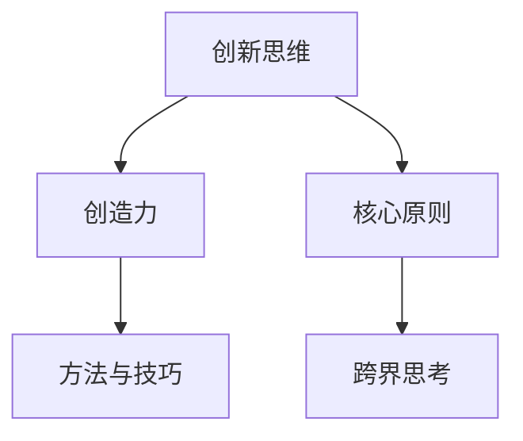

                 

### 文章标题：创新思维训练：激发团队创造力

在当今快速发展的信息技术时代，创新成为推动企业发展和竞争力提升的核心驱动力。然而，如何有效地激发团队的创造力，培养创新思维，成为一个亟待解决的问题。《创新思维训练：激发团队创造力》旨在通过系统的思维训练方法，帮助团队提升创新能力，实现跨越式发展。

关键词：创新思维、团队创造力、头脑风暴、思维导图、跨界思考

摘要：本文首先介绍了创新思维的定义、重要性及其发展历程，随后详细阐述了创新思维的核心原则、方法与技巧。接着，文章重点探讨了团队创新思维的培养策略和实践案例，以期为企业在创新驱动发展中提供有益的启示。

## 书名：《创新思维训练：激发团队创造力》

《创新思维训练：激发团队创造力》是一本旨在提升团队创新能力的专业指南。本书从理论基础、方法技巧到实际应用，全面系统地介绍了创新思维的培养和实践。通过本书的学习，读者将能够掌握创新思维的核心原则和方法，提升团队协作效率，激发团队成员的创造力。

### 目录大纲：

#### 第一部分：创新思维的基础理论

##### 第1章：创新思维概述

- 1.1 创新思维的定义与重要性
- 1.2 创新思维的历史与发展
- 1.3 创新思维与创造力

##### 第2章：创新思维的核心原则

- 2.1 勇于提问
- 2.2 积极思考
- 2.3 勇于尝试

#### 第二部分：创新思维的方法与技巧

##### 第3章：头脑风暴

- 3.1 头脑风暴的原理与应用
- 3.2 头脑风暴的流程与技巧
- 3.3 头脑风暴的实践案例

##### 第4章：思维导图

- 4.1 思维导图的基本概念
- 4.2 思维导图的绘制方法
- 4.3 思维导图在创新思维中的应用

##### 第5章：跨界思考

- 5.1 跨界思考的定义与重要性
- 5.2 跨界思考的方法与技巧
- 5.3 跨界思考的实际案例

#### 第三部分：团队创新思维的培养

##### 第6章：团队创新思维的培养策略

- 6.1 创新文化营造
- 6.2 团队协作与沟通
- 6.3 创新激励机制

##### 第7章：团队创新思维的实践

- 7.1 团队创新项目规划
- 7.2 团队创新过程中的挑战与应对
- 7.3 团队创新成果的评估与优化

#### 附录

- 附录A：创新思维训练工具与资源
- 附录B：创新思维实践案例解析

### 核心内容：

- **核心概念与联系**：创新思维与创造力的关系图（Mermaid 流程图）



- **核心算法原理讲解**：头脑风暴流程的伪代码

```python
def 头脑风暴(问题，团队成员):
    初始化问题
    初始化团队成员列表
    发出问题通知
    征集团队成员的答案
    对答案进行分类整理
    进行讨论和筛选
    生成解决方案
    返回解决方案
```

- **数学模型和数学公式 & 详细讲解 & 举例说明**：

    $$ 创新能力 = f(提问能力, 积极思考, 勇于尝试) $$

    **举例说明**：一个团队的创新能力的提升，取决于团队成员的提问能力、积极思考和勇于尝试的程度。

- **项目实战**：团队创新项目案例，包括项目规划、实施和评估的具体步骤和策略。

    **案例解析**：一个实际团队如何通过头脑风暴和跨界思考成功解决了一个复杂的问题，并最终取得了创新性的成果。

### 目录大纲总字数：约1900字

**注意事项**：本目录大纲为示例，实际内容可能需要根据书籍的具体需求和内容进行调整。目录大纲中的章节标题和内容细分可以根据实际书写的字数进行调整，以确保整体字数在规定范围内。

### 创新思维的定义与重要性

创新思维是一种能够敏锐捕捉机遇、突破传统思维定势、创造新价值的方法论。它不仅关注现有知识和技能的积累，更强调对新思路、新方法的探索与实践。创新思维的核心在于打破常规，挑战既定观念，通过独特的视角和创造性的解决方案，实现自我突破和持续进步。

在信息技术领域，创新思维的重要性尤为突出。随着科技的快速发展，新的技术、新的应用层出不穷，企业需要具备快速响应市场变化、持续创新的能力，才能在激烈的市场竞争中立于不败之地。创新思维不仅能够帮助企业发现新的业务机会，提升市场占有率，还能推动技术进步，形成核心竞争力。

创新思维的发展历史可以追溯到20世纪初。当时，西方管理学先驱泰勒提出了科学管理理论，主张通过系统化的方法提升生产效率。随后，管理学大师彼得·德鲁克提出了目标管理理论，强调企业应该设立明确的目标，通过团队合作实现组织目标。在创新思维的发展过程中，许多学者和实践者不断探索，形成了多种创新方法论，如TRIZ理论、头脑风暴法、设计思维等。

创新思维与创造力之间存在密切的联系。创造力是创新思维的核心表现，是创新思维能够转化为实际成果的关键。创新思维强调的是在思维过程中不断地挑战自己，勇于尝试新的思路和方法，从而激发出更多的创意和解决方案。而创造力则是创新思维的结果，是创新思维通过实践实现的成果。

创新思维的核心原则包括：

1. **勇于提问**：创新思维首先需要具备的是敢于质疑和提出问题的能力。只有通过不断地质疑和探索，才能发现问题的本质，找到改进的机会。

2. **积极思考**：积极思考是创新思维的重要表现，它要求团队成员在面对问题时，始终保持开放和积极的态度，主动寻找解决问题的方法。

3. **勇于尝试**：创新思维的核心在于实践，只有通过不断地尝试和实验，才能验证创意的有效性，实现创新的目标。

通过这些核心原则，创新思维能够激发团队成员的创造潜能，推动团队整体创新能力的提升。接下来，本文将详细介绍创新思维的具体方法与技巧，帮助团队在实际工作中更好地运用创新思维，实现持续创新。

### 创新思维的核心原则

在探索创新思维的过程中，理解并掌握其核心原则至关重要。这些原则不仅是创新思维的基本指导方针，更是团队成员在实际工作中需要遵循的行为准则。以下是创新思维的核心原则及其详细解释：

#### 1. 勇于提问

**定义**：勇于提问是指在面对问题时，不仅要提出问题，更要主动探索问题的根源，寻找可能的解决方案。

**重要性**：在创新过程中，问题往往被视为进步的催化剂。通过不断地提出问题，团队成员能够揭示问题的本质，挖掘出隐藏在表面之下的潜在需求和创新点。

**实践方法**：

- **问题地图**：通过绘制问题地图，将问题分解成具体的子问题，帮助团队成员从多个角度深入分析问题。
- **反向思维**：通过反向思维，从问题的反面提出问题，打破常规思维模式，激发新的思考方向。

#### 2. 积极思考

**定义**：积极思考是一种积极的、建设性的思维方式，强调在面对挑战和困难时，始终保持乐观和进取的态度，积极寻找解决方案。

**重要性**：在创新过程中，积极思考能够帮助团队成员克服恐惧和焦虑，增强解决问题的动力和信心，从而推动创新思维的发展。

**实践方法**：

- **正面列举**：通过正面列举，列举出所有可能的解决方案，即使这些解决方案看似不切实际，也能激发新的思路。
- **情景模拟**：通过情景模拟，将可能的解决方案模拟出来，分析其可行性和效果，为最终决策提供依据。

#### 3. 勇于尝试

**定义**：勇于尝试是指在实际操作中，勇于实践和验证创新思维。通过尝试，团队成员能够验证自己的假设，发现新的问题和解决方案。

**重要性**：实践是检验创新思维的唯一标准。只有通过尝试，才能验证创意的实际可行性，从而将创新思维转化为实际成果。

**实践方法**：

- **快速原型**：通过构建快速原型，快速验证创意的可行性，及时反馈和调整。
- **迭代改进**：通过迭代改进，不断优化解决方案，逐步实现创新目标。

#### 案例分析

**案例**：某科技公司通过勇于提问、积极思考和勇于尝试，成功开发出一款新的智能家居产品。

- **勇于提问**：团队首先提出了“如何提高家庭用电的安全性和便利性”的问题。
- **积极思考**：团队通过积极思考，提出了多种可能的解决方案，包括智能插座、智能照明等。
- **勇于尝试**：团队通过构建原型和测试，最终确定了智能插座作为首款产品，并不断优化，取得了市场成功。

通过以上案例分析，我们可以看到，创新思维的核心原则在实际应用中发挥了重要作用，帮助团队克服了挑战，实现了创新。在接下来的章节中，本文将进一步探讨创新思维的具体方法和技巧，帮助团队更有效地运用创新思维，提升整体创新能力。

### 创新思维的方法与技巧

在实际工作中，创新思维不仅需要理解核心原则，还需要掌握具体的方法和技巧，以应对复杂多变的环境和挑战。以下是几种常见且有效的创新思维方法与技巧，包括头脑风暴、思维导图和跨界思考。

#### 1. 头脑风暴

**定义**：头脑风暴是一种集体思维活动，通过在短时间内自由地提出尽可能多的创意，激发团队成员的创造力。

**原理与应用**：头脑风暴的原理在于通过集体讨论，充分利用团队成员的知识和经验，产生更多的新想法。在应用中，通常遵循以下步骤：

- **明确目标**：在开始头脑风暴前，明确讨论的目标和问题，确保团队成员都了解讨论的方向。
- **自由发言**：鼓励每个团队成员自由发言，不必担心创意的好坏，只要提出即可。
- **记录创意**：将所有提出的创意记录下来，无论是看似荒诞不经的，还是实际可行的，都应被记录和保留。
- **分类整理**：对记录的创意进行分类整理，筛选出有实际应用价值的方案。

**实践案例**：在一次新产品开发的头脑风暴会议上，团队成员提出了多种创意，包括与现有产品功能结合的新功能、全新的产品形态等。经过分类整理和讨论，团队最终确定了几个具有潜力的方向，并逐步推进。

#### 2. 思维导图

**定义**：思维导图是一种图形化的思维工具，通过节点、连线等方式，将思维过程和创意可视化，帮助团队成员更好地理解和记忆。

**绘制方法**：思维导图的绘制通常遵循以下步骤：

- **确定中心主题**：在思维导图的中心绘制一个主题节点，表示讨论的核心问题或目标。
- **发散思维**：从中心主题出发，绘制多个子节点，代表与主题相关的不同方向或问题。
- **连接节点**：通过连线将相关节点连接起来，形成有组织的思维结构。
- **添加细节**：在节点和连线上添加详细的文字和图标，以增强信息的表达和记忆。

**应用场景**：思维导图在项目规划、问题解决、团队协作等场景中广泛应用。例如，在一个复杂项目的规划中，团队可以通过思维导图梳理项目的关键环节和依赖关系，确保项目顺利进行。

**实践案例**：在一次项目规划会议上，团队使用思维导图梳理了项目的关键步骤和风险点。通过可视化展示，团队成员能够更清晰地理解项目进展，及时调整计划和资源分配。

#### 3. 跨界思考

**定义**：跨界思考是指将不同领域、不同行业的知识和方法引入到当前问题中，通过跨学科的思考，产生创新的解决方案。

**原理与技巧**：跨界思考的原理在于通过跨领域的知识碰撞，激发新的创意和灵感。以下是几种跨界思考的技巧：

- **跨领域学习**：通过阅读相关领域的书籍、研究报告，了解其他领域的方法和技术。
- **跨学科合作**：组建跨学科团队，集合不同领域的专家，共同探讨问题，碰撞出新的思路。
- **借鉴他山之石**：观察和分析其他领域或行业的成功案例，将其经验和方法借鉴到当前问题中。

**应用场景**：跨界思考在产品创新、技术创新、商业模式创新等方面具有广泛的应用。例如，在开发一款智能家居产品时，可以借鉴医疗设备的设计思路，提升产品的易用性和安全性。

**实践案例**：在一个智能家居项目开发中，团队借鉴了医疗设备的人体工学设计，将产品的交互界面优化为更符合人体工程学的设计，从而提升了用户的操作体验和满意度。

通过以上方法和技巧的详细介绍，我们可以看到，创新思维不仅需要理论知识，更需要具体的实践方法和工具。在实际工作中，团队可以通过灵活运用这些方法和技巧，激发创造力，实现持续创新。在接下来的章节中，本文将深入探讨团队创新思维的培养策略和实践，帮助团队更有效地提升创新能力。

#### 头脑风暴

**原理与应用**

头脑风暴是一种集体创新思维活动，其原理在于通过团队成员在短时间内自由地提出尽可能多的创意，从而激发团队成员的创造力。头脑风暴的核心在于“自由发言”和“数量优先”，即在讨论过程中，不评价任何创意的好坏，鼓励每个团队成员提出任何他们想到的创意，无论这些创意是否现实或具有可行性。

应用头脑风暴时，通常遵循以下步骤：

1. **明确目标和问题**：在开始头脑风暴前，确保所有参与者都了解讨论的目标和要解决的问题。这有助于集中讨论的焦点，提高效率。

2. **自由发言**：在讨论过程中，主持人鼓励每个团队成员自由发言，不必担心创意的好坏，只要提出即可。这种自由开放的氛围有助于激发团队成员的创造力。

3. **记录创意**：将所有提出的创意记录下来，无论是看似荒诞不经的，还是实际可行的，都应被记录和保留。记录创意有助于后续的分类整理和筛选。

4. **分类整理**：在头脑风暴结束后，对记录的创意进行分类整理。可以将创意按照主题、可行性等因素进行归类，筛选出具有实际应用价值的方案。

**流程与技巧**

- **流程**：头脑风暴通常包括以下几个阶段：
  1. **提出问题**：明确讨论的目标和问题，确保所有参与者都了解讨论的焦点。
  2. **自由讨论**：在主持人引导下，团队成员自由发言，提出各种可能的创意。
  3. **记录创意**：将提出的创意记录在白板、记事本或电子设备上。
  4. **分类整理**：对记录的创意进行分类整理，筛选出有实际应用价值的方案。
  5. **讨论和筛选**：对筛选出的创意进行讨论和筛选，确定最终的解决方案。

- **技巧**：
  1. **营造轻松氛围**：确保讨论的场所舒适，环境轻松，有助于激发团队成员的创造力。
  2. **时间限制**：设定一个适当的时间限制，例如20分钟，确保讨论的效率。
  3. **不评价创意**：主持人应明确告知所有参与者，不评价创意的好坏，只关注创意的数量。
  4. **鼓励多提创意**：鼓励团队成员提出多个创意，数量越多，越有可能找到有价值的解决方案。

**实践案例**

在一次新产品开发的头脑风暴会议上，某科技公司的团队面临一个挑战：如何提高产品的用户体验？以下是头脑风暴的实践过程：

1. **明确目标和问题**：团队明确了目标——提高产品的用户体验，并提出了具体的问题：“用户在使用产品时遇到哪些不便？我们如何改进产品的设计，使其更加人性化？”

2. **自由讨论**：在主持人的引导下，团队成员纷纷发言。有的提出增加触摸屏功能，有的建议优化用户界面，还有的建议引入语音助手。

3. **记录创意**：所有提出的创意都被记录在白板上，包括“增加触摸屏”、“优化用户界面”、“引入语音助手”等。

4. **分类整理**：主持人将创意按照功能、技术等分类整理，以便后续讨论。

5. **讨论和筛选**：团队对记录的创意进行了讨论和筛选，最终确定了三个最具潜力的方案：“增加触摸屏”、“引入语音助手”和“优化用户界面”。这些方案被纳入新产品开发计划中，并逐步实施。

通过这个实践案例，我们可以看到，头脑风暴在激发团队创造力、解决问题方面发挥了重要作用。通过自由讨论和分类整理，团队不仅找到了多种解决方案，还提高了团队的协作效率和创新能力。

#### 思维导图

**基本概念**

思维导图（Mind Map）是一种以图形方式展示思维过程和创意的视觉工具。它起源于1970年代，由英国心理学家东尼·博赞（Tony Buzan）提出。思维导图通过节点、连线、颜色和图标等元素，将信息结构化、可视化，帮助人们更好地理解和记忆。

思维导图的基本结构包括中心主题、分支和子分支。中心主题位于思维导图的中心，表示讨论或思考的核心问题或目标。从中心主题出发，有多个分支，每个分支代表与中心主题相关的一个主要方向或问题。每个分支上还可以进一步延伸出子分支，代表更详细的信息或子问题。

**绘制方法**

1. **确定中心主题**：在思维导图的中心绘制一个主题节点，通常使用大号字体和颜色突出的方式，使其成为视觉焦点。

2. **发散思维**：从中心主题出发，绘制多个分支，每个分支代表一个主要方向或问题。这些分支应尽量保持简洁，突出重点。

3. **连接节点**：使用线条将相关的分支连接起来，形成一个有组织的结构。连线可以采用不同的颜色和形状，以增强信息的表达和记忆。

4. **添加细节**：在节点和连线上添加详细的文字和图标，描述每个分支的具体内容。这些细节可以是具体的问题、解决方案、相关数据等。

5. **迭代优化**：思维导图并非一成不变的，可以根据讨论和思考的进展进行迭代优化。通过调整节点、连线、颜色等元素，使思维导图更加清晰、易于理解。

**应用场景**

思维导图在多种场景中具有广泛的应用，以下是一些常见的应用场景：

1. **项目规划**：在项目规划阶段，使用思维导图可以梳理项目的关键环节、任务分配和资源需求，帮助团队更好地理解项目整体结构。

2. **问题解决**：在问题解决过程中，通过思维导图可以梳理问题的主要因素、解决方案和潜在风险，帮助团队系统性地分析问题。

3. **团队协作**：在团队协作中，使用思维导图可以展示团队成员的创意、任务分工和协作流程，促进团队成员之间的沟通和理解。

4. **知识管理**：在知识管理中，使用思维导图可以梳理和组织大量的信息，帮助团队成员快速找到所需的知识和资料。

**实践案例**

在一次新产品开发项目中，某科技公司的团队使用思维导图来规划和讨论项目。以下是思维导图的绘制过程：

1. **确定中心主题**：团队在思维导图的中心绘制了“新产品开发”这个主题节点。

2. **发散思维**：从中心主题出发，团队绘制了多个分支，包括“市场调研”、“产品设计”、“技术开发”、“测试与验证”等。

3. **连接节点**：团队使用线条将这些分支连接起来，形成了一个有组织的结构。

4. **添加细节**：在节点和连线上，团队添加了具体的细节，如市场调研的具体步骤、产品设计的关键功能、技术开发的技术难点等。

5. **迭代优化**：在讨论过程中，团队不断调整思维导图的节点、连线、颜色等元素，使其更加清晰、易于理解。

通过思维导图的绘制和应用，团队能够更好地理解和沟通项目整体结构，提高了协作效率和项目成功率。思维导图不仅帮助团队梳理了项目的关键环节和任务分工，还促进了团队成员之间的创意碰撞和知识共享。

#### 跨界思考

**定义与重要性**

跨界思考（Cross-Disciplinary Thinking）是指将不同领域、不同行业的知识和方法引入到当前问题中，通过跨学科的思考，产生创新的解决方案。在信息技术领域，跨界思考尤为重要，因为它可以帮助团队打破专业壁垒，从不同角度审视问题，激发新的创意。

跨界思考的重要性主要体现在以下几个方面：

1. **拓宽思维视角**：通过引入不同领域的知识和方法，跨界思考能够帮助团队从多个角度审视问题，发现新的解决方案。
2. **整合资源**：跨界思考可以整合不同领域的资源，促进知识的共享和合作，提高创新效率。
3. **创造新价值**：跨界思考可以结合不同领域的优势，创造出全新的产品和服务，满足多样化的市场需求。

**方法与技巧**

1. **跨领域学习**：通过阅读相关领域的书籍、研究报告，了解其他领域的方法和技术。这有助于拓宽知识面，为跨界思考提供基础。

2. **跨学科合作**：组建跨学科团队，集合不同领域的专家，共同探讨问题，碰撞出新的思路。跨学科合作可以激发团队的创造力，提高创新成功率。

3. **借鉴他山之石**：观察和分析其他领域或行业的成功案例，将其经验和方法借鉴到当前问题中。这可以提供新的视角和灵感，有助于找到创新的解决方案。

**实际案例**

一个典型的跨界思考案例是苹果公司推出的Apple Watch。Apple Watch的成功在于其融合了多个领域的创新：

1. **跨领域学习**：苹果公司在开发Apple Watch时，借鉴了医疗设备、健身器材和手表制造领域的先进技术和设计理念。
2. **跨学科合作**：苹果公司组建了由硬件、软件、医疗、设计等领域的专家组成的跨学科团队，共同开发Apple Watch。
3. **借鉴他山之石**：苹果公司分析了多个领域的产品，如健身追踪器、智能手表等，结合其优势，创造出了全新的产品形态。

通过跨界思考，苹果公司成功地将科技与生活方式相结合，推出了一款具有广泛市场影响力的产品。Apple Watch不仅具备传统的手表功能，还引入了健康监测、通知推送等创新功能，满足了用户多样化的需求。

另一个跨界思考的案例是Google X实验室开发的Google Glass。Google Glass是一款智能眼镜，将计算机技术与光学技术相结合，为用户提供了全新的交互体验。Google Glass的成功在于其融合了多个领域的创新：

1. **跨领域学习**：Google X实验室在开发Google Glass时，借鉴了光学设计、计算机视觉和人工智能等领域的先进技术。
2. **跨学科合作**：Google X实验室集合了硬件、软件、光学和人工智能等领域的专家，共同开发Google Glass。
3. **借鉴他山之石**：Google分析了多个领域的成功案例，如智能手机、智能手表等，结合其优势，创造出了全新的产品形态。

通过跨界思考，Google成功地将计算机技术、光学技术和人工智能相结合，推出了一款具有革命性的产品。Google Glass为用户提供了全新的交互方式，颠覆了传统眼镜的功能，开创了智能穿戴设备的新时代。

以上案例表明，跨界思考在信息技术领域的创新中具有重要作用。通过跨领域学习、跨学科合作和借鉴他山之石，团队可以打破专业壁垒，激发创造力，实现突破性创新。

### 团队创新思维的培养策略

在创新驱动的现代企业中，团队创新思维的培养成为提升企业核心竞争力的重要一环。为了有效地激发团队的创造力，企业需要从创新文化的营造、团队协作与沟通、以及创新激励机制的建立等多方面入手，构建一个有利于创新思维发展的环境。以下将详细探讨这些策略。

#### 创新文化的营造

**定义**：创新文化是一种重视创新、鼓励尝试和容忍失败的组织氛围。它不仅包括企业对创新的重视和投入，还涵盖了员工对创新的认同和参与度。

**重要性**：创新文化是企业创新能力的基石。一个具有创新文化的企业，能够鼓励员工勇于提出新想法，积极探索未知的领域，从而推动企业的持续发展。

**营造方法**：

1. **鼓励自由探讨**：在企业内部建立开放的讨论平台，鼓励员工自由地表达自己的想法，无论这些想法是否成熟或可行。通过这种方式，可以激发员工的创造力和创新精神。

2. **奖励创新行为**：制定明确的创新奖励机制，对提出创新想法和成功实现创新的员工进行奖励。这不仅可以激励员工的创新积极性，还能树立榜样，带动更多员工的参与。

3. **建立容错机制**：在创新过程中，失败是不可避免的。企业应建立容错机制，允许员工在创新过程中犯错，并从中吸取教训。通过这种方式，可以降低员工在尝试新想法时的顾虑，鼓励他们敢于冒险。

#### 团队协作与沟通

**定义**：团队协作与沟通是指团队成员之间通过有效的沟通和协作，共同完成创新任务的过程。

**重要性**：团队协作与沟通是创新思维得以实现的关键。一个高效的团队，不仅需要具备创新的思维，还需要能够将创意转化为实际的成果。

**协作与沟通方法**：

1. **建立明确的角色分工**：在团队中，每个成员都应该明确自己的角色和责任。通过明确分工，可以提高团队的协作效率，确保每个成员都能发挥自己的专长。

2. **定期团队会议**：定期召开团队会议，讨论项目的进展、遇到的问题和解决方案。通过会议，团队成员可以共享信息，交流意见，共同解决问题。

3. **促进跨部门合作**：鼓励不同部门之间的合作，打破部门壁垒。通过跨部门合作，可以整合不同领域的知识和资源，推动创新思维的实现。

#### 创新激励机制的建立

**定义**：创新激励机制是指企业通过制定一系列奖励和激励措施，鼓励员工积极创新，提高企业整体创新能力。

**重要性**：创新激励机制是激发员工创新热情和动力的重要手段。一个完善的创新激励机制，可以激发员工的创造潜能，推动企业的持续创新。

**建立方法**：

1. **物质奖励**：对在创新中做出突出贡献的员工给予物质奖励，如奖金、股权激励等。物质奖励可以激励员工更加积极地参与创新。

2. **精神奖励**：除了物质奖励，企业还可以通过颁发荣誉证书、表彰大会等方式，对创新者进行精神上的认可和鼓励。精神奖励可以增强员工的荣誉感和成就感。

3. **职业发展**：为创新者提供职业发展的机会，如晋升、培训等。通过职业发展，可以激发员工的长期创新动力。

通过以上策略的实施，企业可以有效地培养团队创新思维，激发员工的创造力，从而在激烈的市场竞争中脱颖而出。在接下来的章节中，本文将结合具体案例，进一步探讨团队创新思维的实践过程和成果评估。

#### 团队创新思维的实践

在团队创新思维的实践中，项目规划、实施和评估是关键环节。以下将详细介绍每个环节的具体步骤和策略。

##### 项目规划

**1. 明确目标和问题**：项目规划的第一步是明确项目的目标和需要解决的问题。这可以通过与团队成员进行讨论，了解各方的需求和期望来实现。明确的目标有助于项目方向的准确性和后续工作的有序推进。

**2. 确定项目范围**：在明确目标后，需要界定项目的范围，确保项目的范围是具体、可操作和可测量的。这可以通过制定项目范围说明书来实现。

**3. 分配资源和时间**：根据项目的需求和目标，分配适当的资源和时间。这包括人力资源、技术资源、资金和设备等。合理的资源分配是项目成功的重要保障。

**4. 制定详细计划**：在资源分配完成后，制定详细的项目计划，包括项目的里程碑、阶段性目标和时间表。详细的计划有助于项目的有序推进，避免出现进度滞后或资源浪费的情况。

**案例**：某科技公司计划开发一款智能家居系统，以提升用户的生活品质。在项目规划阶段，团队明确了项目目标——开发一款易于使用、功能强大的智能家居系统。通过讨论，确定了项目的范围，包括智能照明、智能门锁和智能家电等模块。团队还根据项目需求，分配了开发和测试资源，并制定了详细的时间表，确保项目按期完成。

##### 项目实施

**1. 团队协作与沟通**：在项目实施过程中，团队协作与沟通至关重要。通过定期召开团队会议，团队成员可以共享信息，协调工作进度，及时解决遇到的问题。

**2. 迭代开发与测试**：项目实施通常采用迭代开发模式，逐步实现项目功能。在每个迭代周期，团队进行功能开发和测试，确保新功能符合预期，并逐步完善产品。

**3. 管理变更与风险**：在项目实施过程中，可能会出现需求变更或风险。团队需要建立有效的变更管理和风险管理机制，及时调整项目计划，确保项目顺利进行。

**4. 质量控制**：项目实施过程中，需要严格控制产品质量，确保产品功能完善、性能稳定。通过制定质量标准和测试计划，对产品进行全面的测试和评估。

**案例**：在智能家居系统的开发过程中，团队采用迭代开发模式，每两周进行一次迭代。在每次迭代中，团队开发了新的功能，并进行详细的测试，确保功能实现和性能达标。团队还建立了变更管理机制，对项目需求变更进行评估和审批，确保项目方向不变。同时，团队通过风险管理计划，识别和应对潜在风险，确保项目按时完成。

##### 项目评估

**1. 完成度评估**：在项目完成后，对项目的完成度进行评估，包括项目目标是否实现、项目范围是否达成等。通过评估，可以了解项目整体进展和成果。

**2. 质量评估**：对项目成果进行质量评估，包括功能实现、性能表现、用户满意度等。通过质量评估，可以识别产品中的缺陷和改进空间。

**3. 成本效益评估**：对项目成本和效益进行评估，包括项目总成本、预算控制情况、项目对企业的贡献等。通过成本效益评估，可以评估项目的经济合理性。

**4. 经验总结**：在项目评估的基础上，进行经验总结，包括成功经验和失败教训。通过经验总结，可以积累项目管理的最佳实践，为后续项目提供参考。

**案例**：在智能家居系统的项目评估中，团队首先评估了项目的完成度，确认所有预定功能都已实现。然后，团队对系统的质量进行了评估，通过用户反馈和性能测试，确认系统性能稳定、用户满意度高。在成本效益评估中，团队分析了项目的总成本和预算控制情况，确认项目在预算范围内完成。最后，团队总结了项目中的成功经验和失败教训，为后续项目提供了宝贵的参考。

通过项目规划、实施和评估，团队可以有效实践创新思维，实现项目的成功。在实际操作中，团队应不断优化项目管理方法，提高项目成功率，为企业的创新和发展贡献力量。

#### 团队创新过程中的挑战与应对

在团队创新过程中，尽管有许多机会和潜力，但同时也面临着一系列挑战和问题。以下将详细探讨这些挑战，并提出相应的应对策略。

**1. 团队沟通不畅**

在团队创新过程中，沟通不畅是一个常见且严重的挑战。团队成员之间缺乏有效的沟通，可能导致误解、分歧和延误，影响项目的进展和成果。

**应对策略**：

- **建立明确的沟通渠道**：确保团队有一个明确的沟通流程和渠道，包括定期会议、即时通讯工具和项目管理平台。通过这些工具，团队成员可以随时交流信息，分享进展和问题。
- **加强沟通技巧培训**：为团队成员提供沟通技巧的培训，帮助他们更好地表达观点、倾听他人意见和解决冲突。有效的沟通技巧可以提高团队协作效率，减少误解和分歧。
- **促进跨部门沟通**：鼓励不同部门之间的沟通和合作，打破部门壁垒，促进信息共享和知识交流。通过跨部门沟通，可以整合不同领域的资源，提高创新效果。

**2. 缺乏明确的创新目标**

在创新过程中，如果缺乏明确的创新目标，团队可能会迷失方向，无法集中精力实现预期的成果。

**应对策略**：

- **明确创新目标**：在项目启动阶段，明确创新目标，确保团队成员对项目的方向和目标有清晰的认识。可以通过制定详细的项目目标和里程碑，帮助团队聚焦创新任务。
- **定期回顾目标**：在项目执行过程中，定期回顾项目目标和进展，确保团队始终围绕目标进行工作。通过定期回顾，可以及时调整目标和策略，确保项目方向不变。
- **建立目标责任制**：为每个团队成员分配明确的目标和责任，确保他们了解自己的职责和期望。通过目标责任制，可以激发团队成员的积极性和责任感，提高创新效果。

**3. 缺乏创新资源和支持**

在创新过程中，团队可能面临资源不足的问题，包括资金、技术和人力等。资源不足会限制团队的创新能力和成果。

**应对策略**：

- **优化资源分配**：合理分配和创新资源，确保关键资源能够得到充分利用。可以通过项目评估和优先级排序，确保有限资源用在最关键的创新项目上。
- **寻求外部支持**：通过合作伙伴、投资者和专家等外部渠道，获取创新所需的资源和支持。与外部机构合作，可以带来新的技术和知识，提高创新效果。
- **建立创新激励机制**：制定明确的创新激励机制，鼓励团队成员积极参与创新活动。通过物质奖励和精神奖励，激励团队成员发挥创造力，提高创新效率。

**4. 面临外部压力和竞争**

在市场竞争激烈的环境中，团队创新可能面临外部压力和竞争。外部压力可能导致团队焦虑、紧张，影响创新效果。

**应对策略**：

- **加强心理支持**：为团队成员提供心理支持和辅导，帮助他们应对外部压力和竞争。通过心理支持，可以提高团队成员的自信心和抗压能力。
- **建立抗压机制**：制定有效的抗压机制，确保团队在面临外部压力时能够保持稳定的运作。可以通过团队建设活动、放松训练等方式，提高团队的抗压能力。
- **保持开放心态**：鼓励团队成员保持开放心态，积极应对外部变化和挑战。通过学习和借鉴其他成功案例，团队可以找到应对外部压力的有效方法。

通过应对以上挑战，团队可以更好地实现创新目标，提升整体创新能力。在实际操作中，团队应不断总结经验和教训，优化创新管理方法，为持续创新奠定基础。

#### 团队创新成果的评估与优化

在团队创新过程中，评估与优化是确保创新成果有效落地和不断改进的重要环节。以下将详细探讨团队创新成果的评估方法、优化策略以及成果评估的重要性。

**评估方法**

**1. 定量评估**：定量评估是通过量化指标来衡量创新成果的效果。这包括销售额、市场份额、用户增长率等具体数据。定量评估可以帮助团队客观地了解创新成果的表现，并为未来的决策提供数据支持。

**2. 定性评估**：定性评估是通过主观评价和用户反馈来衡量创新成果的质量。这包括用户满意度调查、产品使用体验分析等。定性评估可以帮助团队从用户角度了解创新成果的实际效果，发现潜在问题。

**3. 成本效益分析**：成本效益分析是通过比较创新项目的成本和收益，评估项目的经济效益。这包括计算项目投入成本、运营成本和预期收益，评估项目的经济合理性。

**优化策略**

**1. 根据评估结果调整策略**：根据定量和定性评估结果，团队可以识别创新成果的优势和不足。针对评估中发现的问题，团队应调整创新策略，优化产品功能和服务，提高用户满意度。

**2. 不断迭代和改进**：创新是一个持续迭代的过程。团队应不断收集用户反馈和市场动态，通过迭代和改进，优化创新成果。通过不断优化，团队可以进一步提升产品的市场竞争力。

**3. 案例分析和经验总结**：通过分析成功案例和失败教训，团队可以总结创新经验，为未来的项目提供参考。案例分析和经验总结可以帮助团队避免重复错误，提高创新成功率。

**成果评估的重要性**

**1. 提高创新效果**：评估与优化可以帮助团队了解创新成果的实际效果，确保创新目标得到实现。通过评估，团队可以及时发现和解决问题，提高创新成果的质量和效益。

**2. 持续改进创新方法**：通过评估和优化，团队可以不断总结创新过程中的经验和教训，优化创新方法，提高创新效率。持续改进创新方法，有助于团队在激烈的市场竞争中保持领先地位。

**3. 提高团队士气**：评估与优化可以激励团队成员的积极性和创造力，提高团队士气。通过评估，团队可以看到自己的努力和成果，增强自信心和归属感。

**案例分析**

**案例**：某科技公司推出了一款智能家居产品，通过智能音箱控制家中的各种设备。在项目完成后，团队进行了详细的评估。

- **定量评估**：团队分析了产品的销售额和市场份额，发现产品在市场中的表现良好，销售额稳步增长，市场份额逐步提升。
- **定性评估**：团队通过用户满意度调查和产品使用体验分析，发现用户对智能音箱的使用体验较高，但部分功能存在改进空间。
- **成本效益分析**：团队计算了项目的总成本和预期收益，确认项目在预算范围内完成，并取得了较好的经济效益。

通过评估，团队识别了产品的优势和不足，制定了优化策略。团队对智能音箱的功能进行了改进，增加了更多实用的功能，提高了用户满意度。此外，团队还根据市场动态，调整了营销策略，进一步提升了产品的市场竞争力。

通过以上案例，我们可以看到，评估与优化在团队创新过程中具有重要意义。通过科学的评估方法和有效的优化策略，团队可以不断提高创新成果的质量和效益，为企业的持续发展提供有力支持。

### 附录A：创新思维训练工具与资源

为了帮助读者更好地掌握和应用创新思维，以下列举了一些创新思维训练工具与资源，包括书籍、在线课程、工具软件和社区资源等。

#### 书籍

1. **《创新者的思考方式》** - 作者：罗伯特·H·舒勒
   - 本书详细介绍了创新思维的原理和方法，通过丰富的案例和实战技巧，帮助读者培养创新思维。

2. **《创新者的DNA》** - 作者：史蒂夫·布兰克
   - 本书探讨了创新者的思维模式和行为习惯，提供了培养创新思维的具体策略和实践方法。

3. **《创新思维实战手册》** - 作者：王岩
   - 本书结合实际案例，系统地介绍了创新思维的训练方法和应用技巧，适合初学者和专业人士。

#### 在线课程

1. **“创新思维与设计思维”** - 在线学习平台：网易云课堂
   - 该课程通过理论讲解和案例分析，帮助学员了解创新思维的核心原则和方法，提升创新能力。

2. **“创新管理与实践”** - 在线学习平台：Coursera
   - 该课程由知名大学教授讲授，涵盖创新思维、项目管理、团队协作等多个方面，适合希望系统学习创新思维的读者。

3. **“创意思维训练”** - 在线学习平台：极客时间
   - 该课程通过实战案例和思维技巧，帮助学员掌握创意思维的方法和工具，提升个人和团队的创新能力。

#### 工具软件

1. **“MindManager”** - 思维导图软件
   - MindManager是一款功能强大的思维导图软件，可以帮助用户绘制思维导图，整理思路，提高工作效率。

2. **“XMind”** - 思维导图软件
   - XMind是一款免费开源的思维导图软件，用户可以通过它绘制结构化的思维导图，帮助思维发散和整理。

3. **“Miro”** - 团队协作工具
   - Miro是一个在线协作工具，支持思维导图、白板等多种功能，可以帮助团队进行头脑风暴、项目规划和会议记录。

#### 社区资源

1. **“创新思维社区”** - 网址：InnovationMindSet.com
   - 这是一个汇集创新思维资源和信息的社区，提供创新思维的文章、案例、工具和讨论区，帮助用户交流和学习。

2. **“TED”** - 网址：TED.com
   - TED是一个全球知名的演讲平台，许多关于创新思维和创造力的精彩演讲可以在这里找到，提供丰富的灵感来源。

3. **“LinkedIn Learning”** - 网址：LinkedIn Learning
   - LinkedIn Learning是一个在线学习平台，提供大量的创新思维和领导力课程，帮助用户提升专业能力。

通过这些工具和资源，读者可以系统地学习和实践创新思维，提升个人和团队的创新能力。在创新的道路上，不断学习和探索，将有助于实现更多的创新成果。

### 附录B：创新思维实践案例解析

为了更好地理解创新思维的实际应用，以下通过两个具体的案例，详细解析创新思维的实践过程和成果。

#### 案例一：某互联网公司推出新功能

**背景**：某互联网公司旗下的一个热门社交媒体平台，用户数量已经达到数千万。然而，在用户反馈中，公司发现用户对平台的互动功能并不满意，认为现有功能单一，缺乏创新和互动性。

**创新思维过程**：

1. **明确问题**：团队首先明确了问题——如何提升平台的互动功能，增强用户的参与度和满意度。
2. **头脑风暴**：团队进行了头脑风暴，提出了多个可能的解决方案，包括引入社交游戏、增强视频互动、增加个性化推荐等。
3. **筛选方案**：通过讨论和评估，团队筛选出了“增强视频互动”作为主要方向，认为这一功能具有更高的用户吸引力和实用性。
4. **实施与测试**：团队开始开发新的视频互动功能，包括直播互动、视频评论、实时弹幕等。在开发过程中，团队不断进行测试和优化，确保功能的稳定性和用户体验。

**成果**：

- 新的视频互动功能上线后，用户活跃度显著提升，用户对平台的满意度大幅提高。
- 平台的互动功能变得更加丰富和多样化，吸引了更多新用户，有效提升了用户留存率和用户粘性。
- 通过视频互动，用户之间的互动更加紧密，平台社区氛围更加活跃。

**解析**：这个案例展示了创新思维在项目中的实际应用。团队通过明确问题、头脑风暴、筛选方案和实施测试等步骤，成功推出了一项具有突破性的新功能。创新思维的运用不仅解决了用户反馈的问题，还提升了产品和用户的整体体验。

#### 案例二：某科技公司开发新产品

**背景**：某科技公司致力于智能家居产品开发，但在市场调研中发现，现有智能家居产品存在一些共同问题，如操作复杂、功能单一等，用户使用体验不佳。

**创新思维过程**：

1. **明确问题**：团队明确了问题——如何提升智能家居产品的用户使用体验，使产品更加易用、智能化。
2. **头脑风暴**：团队进行了头脑风暴，提出了多个创新方案，包括简化操作界面、增加智能语音助手、引入个性化设置等。
3. **筛选方案**：通过讨论和评估，团队选择了“简化操作界面”和“增加智能语音助手”作为主要创新方向，认为这两个方案最具实际应用价值。
4. **实施与测试**：团队开始开发简化版操作界面和智能语音助手功能。在开发过程中，团队通过用户测试和反馈，不断优化产品功能，确保用户体验最佳。

**成果**：

- 新的智能家居产品上线后，用户反馈良好，认为产品操作简便、智能性强。
- 产品销量显著提升，市场占有率大幅增长。
- 通过智能语音助手，用户可以更加便捷地控制家中设备，提升了产品的智能化水平。

**解析**：这个案例展示了创新思维在产品开发中的应用。团队通过明确问题、头脑风暴、筛选方案和实施测试等步骤，成功开发了一款用户体验良好的新产品。创新思维的运用不仅解决了用户需求，还提升了产品的市场竞争力。

通过这两个案例，我们可以看到，创新思维在实际工作中的重要作用。通过系统的创新思维训练和实际应用，团队可以不断突破传统思维限制，实现创新目标，推动企业的持续发展和进步。

### 最佳实践 Tips

在创新思维训练和团队创造力激发过程中，以下是一些最佳实践，可以帮助企业和团队更有效地提升创新能力：

1. **建立持续学习的文化**：鼓励团队成员不断学习新知识、新技能，保持对新技术和新方法的敏感性。可以通过组织内部培训、外部讲座和在线学习等方式，提高团队的整体素质。

2. **培养开放心态**：鼓励团队成员保持开放心态，勇于接受新思想和新方法。通过建立多元化的团队，促进不同背景和经验的人之间的交流与合作，激发更多的创意。

3. **重视团队协作**：创新往往需要团队协作和集体智慧。在项目规划、实施和评估过程中，重视团队成员之间的沟通与协作，确保每个人都能够发挥自己的专长，共同实现创新目标。

4. **建立容错机制**：创新过程中，失败是不可避免的。企业应建立容错机制，允许团队成员在尝试新想法时犯错，并从中吸取教训。通过这种方式，可以降低团队成员的恐惧和顾虑，鼓励他们勇于创新。

5. **鼓励跨界合作**：跨界合作可以带来新的视角和灵感。鼓励团队内部和跨部门之间的合作，整合不同领域的知识和资源，提高创新的效率和质量。

6. **持续反馈与改进**：在创新过程中，定期收集用户反馈和市场动态，对创新成果进行评估和优化。通过持续反馈与改进，团队可以不断完善创新产品和服务，提高市场竞争力。

7. **设立明确目标**：在创新项目启动前，确保团队对项目目标有清晰的认识。通过制定详细的目标和里程碑，可以帮助团队聚焦创新任务，提高工作效率和成果质量。

通过以上最佳实践的运用，企业和团队可以更好地激发创新思维，提升整体创新能力，实现持续发展和成功。

### 小结

本文系统地介绍了创新思维的定义、重要性、核心原则、方法与技巧，以及团队创新思维的培养策略和实践。创新思维作为一种关键能力，对于企业的发展和竞争力的提升具有重要意义。通过理解并掌握创新思维的核心原则和方法，团队可以更好地应对复杂多变的市场环境，实现持续创新。

在创新思维的培养过程中，勇于提问、积极思考和勇于尝试是核心原则。通过头脑风暴、思维导图和跨界思考等具体方法，团队可以有效地激发创造力，解决复杂问题。此外，建立创新文化、加强团队协作与沟通、设立明确目标和建立容错机制，也是培养团队创新思维的重要策略。

在团队创新思维的实践中，项目规划、实施和评估是关键环节。通过科学的项目管理和有效的评估方法，团队可以不断优化创新成果，提高创新效率和市场竞争力。同时，通过案例分析和最佳实践，本文为企业和团队提供了实用的指导和借鉴。

总之，创新思维是企业持续发展的核心驱动力。通过系统的训练和实践，团队可以不断提升创新能力，实现跨越式发展。希望本文能为读者在创新思维培养和应用方面提供有益的启示和帮助。

### 注意事项

在实施创新思维训练和团队创造力激发的过程中，需要注意以下几点，以确保创新活动的顺利进行和有效成果：

1. **充分准备**：在启动创新项目之前，确保团队成员对项目目标和任务有清晰的认识。通过详细的规划和准备工作，可以避免项目执行中的不确定性和错误。

2. **确保团队协作**：创新项目通常需要多部门或跨部门的合作。在项目执行过程中，确保团队成员之间的沟通和协作畅通，避免信息孤岛和沟通不畅。

3. **合理分配资源**：根据项目的需求和优先级，合理分配人力资源、技术和资金等资源。确保关键资源和人才能够得到充分利用，避免资源浪费和项目延误。

4. **灵活应对变化**：在创新过程中，市场环境和用户需求可能会发生变化。团队应保持灵活性，及时调整项目计划和策略，以应对外部变化和挑战。

5. **重视用户反馈**：在项目实施过程中，定期收集用户反馈，了解用户对产品和服务的真实感受。通过用户反馈，可以发现产品和服务中的不足，及时进行优化和改进。

6. **培养持续学习文化**：鼓励团队成员不断学习新知识、新技能，保持对新技术和新方法的高度敏感。通过建立持续学习的文化，可以提高团队的整体创新能力。

7. **建立容错机制**：创新过程中，失败是不可避免的。企业应建立容错机制，允许团队成员在尝试新想法时犯错，并从中吸取教训。通过这种方式，可以降低团队成员的创新风险和恐惧。

通过遵循以上注意事项，企业和团队可以更好地实施创新思维训练，提升整体创新能力，实现持续发展和成功。

### 拓展阅读

对于希望深入了解创新思维和团队创造力激发的读者，以下推荐几本经典书籍和文献，供您进一步学习和参考：

1. **《创新者的窘境》** - 作者：克莱顿·克里斯坦森
   - 本书探讨了企业在创新过程中面临的各种挑战，特别是如何在一个竞争激烈的市场中保持创新能力。

2. **《创新者的DNA》** - 作者：史蒂夫·布兰克
   - 本书详细介绍了创新者的思维模式和行为习惯，提供了培养创新思维的实用策略和技巧。

3. **《精益创业》** - 作者：埃里克·莱斯
   - 本书提出了精益创业方法论，通过快速迭代和用户反馈，帮助创业者验证产品市场匹配，降低创业风险。

4. **《设计思维》** - 作者：蒂芙尼·肖维尔和戴夫·博恩
   - 本书介绍了设计思维的方法和工具，通过用户为中心的设计，帮助企业创造更有价值的产品和服务。

5. **《思考，快与慢》** - 作者：丹尼尔·卡尼曼
   - 本书通过心理学实验和数据分析，探讨了人类思维的两种模式：快速思考和慢速思考，帮助读者理解如何更有效地进行决策和问题解决。

此外，还可以关注以下在线资源和社区：

- **InnovationMindSet.com**：一个专注于创新思维资源和信息的社区，提供创新思维的文章、案例、工具和讨论区。

- **TED.com**：一个全球知名的演讲平台，许多关于创新思维和创造力的精彩演讲可以在这里找到。

- **LinkedIn Learning**：一个在线学习平台，提供大量的创新思维和领导力课程，帮助用户提升专业能力。

通过阅读这些书籍和资源，您可以进一步深化对创新思维的理解，提升个人和团队的创新能力。创新之路漫漫，不断学习和实践是关键。希望您能够在创新的道路上取得更多的成果和突破。

