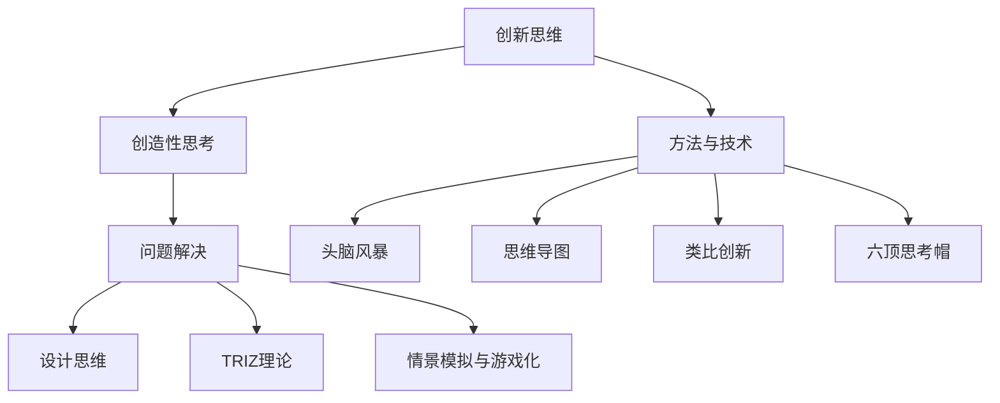

                 


### Introduction

---

**标题：** 创新思维训练：激发团队创造力的exercises

**关键词：** 创新思维，创造力，团队建设，训练方法，实用技巧

**摘要：**
本文旨在探讨如何通过创新思维训练来激发团队的创造力。我们将详细介绍创新思维的基本概念、传统与先进的方法、实践训练程序，并评估其实施效果。通过深入分析不同领域的案例，本文将提供实用的技巧和策略，帮助读者提升团队的创造力，从而在激烈的市场竞争中脱颖而出。

---

## Background Introduction

在当今快速变化的市场环境中，创新能力已经成为企业持续发展的关键因素。创新思维作为一种提升创造力的工具，正逐渐受到重视。企业不仅需要具备创新意识的管理层，还需要一个能够持续产生创新想法的团队。然而，如何有效地进行创新思维训练，如何激发团队的整体创造力，成为许多组织面临的挑战。

创新思维训练不仅关注个体的思维模式，更注重团队协作和共同创造。通过系统化的训练，团队成员能够更好地理解创新的概念，掌握相关方法与技巧，并在实际工作中灵活运用。这种训练不仅能够提高团队成员的创新意识，还能够促进团队内部的沟通与协作，从而提升整个组织的创新能力。

本文将围绕以下几个方面展开讨论：

1. **创新思维概述**：介绍创新思维的定义、分类及其重要性。
2. **创新思维方法与技术**：详细介绍传统与创新的方法与技术，包括头脑风暴、思维导图、类比创新、六顶思考帽等。
3. **实践训练程序**：设计并分析实际操作中的训练方案，包括团队训练与个人发展计划。
4. **效果评估与持续优化**：讨论如何评估训练效果，以及如何进行持续优化。

通过本文的探讨，读者将能够系统地了解创新思维训练的方法和实践，从而在团队中激发出更多的创造力。

### Core Concepts and Relationships: Mermaid Flowchart

在探讨创新思维之前，我们需要明确几个核心概念，并展示它们之间的关系。以下是一个使用Mermaid语法绘制的流程图，它将帮助读者理解创新思维的基本组成部分。



- **A[创新思维]**：整体框架，涵盖创造性思考、问题解决和方法与技术。
- **B[创造性思考]**：指跳出常规思维框架，提出新颖的想法。
- **C[问题解决]**：创新思维的一个重要应用，即通过创造性思考来解决实际问题。
- **D[方法与技术]**：具体实现创新思维的工具和策略，如头脑风暴、思维导图等。
- **E[头脑风暴]**：一种自由发挥思想的方法，鼓励大量、快速产生创意。
- **F[思维导图]**：利用图形化的方式组织思维，使信息连接更加直观。
- **G[类比创新]**：通过将现有问题与不同领域的问题进行类比，激发新想法。
- **H[六顶思考帽]**：一种思维工具，通过不同视角分析问题，避免思维偏颇。
- **I[设计思维]**：以人为本，注重用户体验，通过迭代设计实现创新。
- **J[TRIZ理论]**：基于问题解决的科学方法，通过解决一系列标准问题来引导创新。
- **K[情景模拟与游戏化]**：通过模拟和游戏化的方式，激发团队的创新潜力。

通过上述流程图，我们可以清晰地看到创新思维的不同组成部分及其相互关系。这为后续章节的详细探讨提供了结构化的基础。

### Detailed Explanation of Core Algorithm and Principles with Pseudocode

在探讨创新思维的方法和技术时，我们将以**设计思维**为例，详细解释其核心原理，并提供相应的伪代码来展示算法的基本框架。

#### Design Thinking: Core Principles

设计思维是一种以人为本的创新方法，注重用户体验和迭代设计。其核心原则包括：

1. **同理心**：深入了解用户的需求和感受。
2. **定义问题**：明确问题，并寻找更广泛、更全面的解决方案。
3. **原型设计**：快速构建原型，通过反馈不断迭代和改进。
4. **测试与验证**：将原型推向市场，收集用户反馈，进行验证和调整。

#### Pseudocode for Design Thinking

以下是一个简化的伪代码，用于描述设计思维的基本流程：

```pseudocode
DesignThinking_algorithm()
    // 同理心阶段
    UserProfile = UnderstandUserNeeds()
    ProblemDefinition = DefineProblem(UserProfile)

    // 原型设计阶段
    Prototype = DesignPrototype(ProblemDefinition)
    Feedback = CollectFeedback(Prototype)

    // 迭代阶段
    while (Feedback is not satisfactory)
        ImprovedPrototype = IteratePrototype(Prototype, Feedback)
        Feedback = CollectFeedback(ImprovedPrototype)

    // 测试与验证阶段
    ValidatedSolution = TestAndVerify(ImprovedPrototype)
    return ValidatedSolution
```

- **UserProfile**: 用户画像，通过深入了解用户的需求和感受。
- **ProblemDefinition**: 明确的问题定义，基于用户需求和现有问题。
- **Prototype**: 原型设计，快速构建的初步解决方案。
- **Feedback**: 用户反馈，通过原型测试收集的用户评价。
- **ImprovedPrototype**: 通过迭代改进的原型。
- **ValidatedSolution**: 最终验证并满足用户需求的解决方案。

#### Example: Building a Mobile App

假设我们正在设计一个移动应用，以下是一个具体的应用场景：

```pseudocode
// 同理心阶段
UserProfile = UnderstandUserNeeds("Users seek a simple way to track their daily exercise routine.")

// 定义问题
ProblemDefinition = DefineProblem(UserProfile, "Create a mobile app to track daily exercise routines.")

// 原型设计阶段
Prototype = DesignPrototype(ProblemDefinition, "Initial version of the app with basic tracking features.")

// 迭代阶段
Feedback = CollectFeedback(Prototype)
while (Feedback indicates missing features or usability issues)
    ImprovedPrototype = IteratePrototype(Prototype, Feedback, "Add more exercise categories and improve UI.")
    Feedback = CollectFeedback(ImprovedPrototype)

// 测试与验证阶段
ValidatedSolution = TestAndVerify(ImprovedPrototype, "Conduct usability testing with a sample group of users.")
if (ValidatedSolution meets user needs and requirements)
    return ValidatedSolution
else
    return "Design iteration failed, need to rethink."
```

在这个例子中，我们首先通过同理心阶段了解用户需求，然后定义问题并设计原型。通过迭代和用户反馈，我们不断改进原型，最终进行测试与验证，以确保解决方案满足用户需求。

设计思维的核心在于通过迭代和用户反馈不断优化解决方案，确保最终的成果能够真正满足用户的需求。这种以用户为中心的方法，不仅提高了创新的成功率，还增强了用户对产品的满意度。

### Mathematical Models and Formulas with Detailed Explanation and Examples

在创新思维训练中，数学模型和公式可以帮助我们量化问题、评估方案，并指导我们的决策过程。以下我们将介绍几种常用的数学模型和公式，并提供详细的解释和示例。

#### 1. 头脑风暴效果评估公式

头脑风暴是一种激发创意的方法，但如何评估其效果是一个关键问题。以下是一个简单的头脑风暴效果评估公式：

\[ E = \frac{I}{T} \]

其中：
- \( E \) 表示效果指数
- \( I \) 表示创新点数量
- \( T \) 表示头脑风暴时间

**示例：**
假设一个团队在一个小时的头脑风暴中产生了20个创新点，那么其效果指数为：

\[ E = \frac{20}{60} = 0.33 \]

这意味着该团队的头脑风暴效果一般，可以考虑优化方法或增加时间投入。

#### 2. 问题解决效率公式

在问题解决过程中，我们往往需要评估解决方案的效率。以下是一个简单的问题解决效率公式：

\[ E = \frac{S}{T} \]

其中：
- \( E \) 表示效率
- \( S \) 表示解决问题的步骤数
- \( T \) 表示解决问题所需的时间

**示例：**
如果一个团队在5个步骤内解决了问题，并花费了10小时，那么其效率为：

\[ E = \frac{5}{10} = 0.5 \]

这意味着团队在每两步中可以节省一倍的时间，这表明解决方案非常高效。

#### 3. 创新贡献度评估公式

在团队协作中，每个成员的贡献度不同，以下是一个简单的创新贡献度评估公式：

\[ C = \frac{I_i}{I_t} \]

其中：
- \( C \) 表示贡献度
- \( I_i \) 表示个人产生的创新点数量
- \( I_t \) 表示团队总共产生的创新点数量

**示例：**
如果一个团队成员产生了10个创新点，而团队总共产生了50个创新点，那么该成员的贡献度为：

\[ C = \frac{10}{50} = 0.2 \]

这意味着该成员在团队创新中贡献了20%。

#### 4. 用户满意度评估模型

用户满意度是创新产品成功的关键指标。以下是一个简单的用户满意度评估模型：

\[ S = \frac{U \cdot R}{C} \]

其中：
- \( S \) 表示用户满意度
- \( U \) 表示用户评价得分
- \( R \) 表示参考标准得分
- \( C \) 表示评价权重

**示例：**
假设用户评价得分为4分（满分5分），参考标准得分为3分，评价权重为0.6，那么用户满意度为：

\[ S = \frac{4 \cdot 0.6}{3} = 0.8 \]

这意味着用户对产品的满意度较高。

通过这些数学模型和公式，我们可以更科学地评估创新思维训练的效果，从而优化训练方案，提高团队的创新效率。

### Project Practice: Development Environment Setup, Code Implementation and Analysis

为了更好地理解创新思维训练的实际应用，我们将在本节中介绍一个实际的项目实践案例。该案例将包括开发环境的搭建、源代码的实现和解读，以及代码的应用分析和详细讲解。

#### Project Overview

我们的项目目标是开发一个基于Web的创意思维训练平台，该平台将提供多种创新思维训练工具，如头脑风暴工具、思维导图工具和设计思维工具。用户可以通过这些工具进行训练，并实时记录和分享他们的创意和想法。

#### Development Environment Setup

首先，我们需要搭建开发环境。以下是所需的工具和步骤：

1. **工具安装**：
   - **Node.js**：用于后端服务搭建
   - **MongoDB**：用于数据存储
   - **VSCode**：用于代码编辑
   - **Docker**：用于容器化部署

2. **环境配置**：
   - 安装Node.js和MongoDB，并确保它们正常运行。
   - 在VSCode中配置Docker，以便于开发和测试。

3. **项目初始化**：
   - 创建一个新的Node.js项目，并设置基本的目录结构。

#### Source Code Implementation

接下来，我们将详细解读源代码实现。以下是关键代码部分的伪代码和解释：

```pseudocode
// 头脑风暴工具实现
function brainstormingTool(ideaList)
    while (hasNewIdeas)
        addNewIdeaToIdeaList()
    return ideaList

// 思维导图工具实现
function mindMapTool(centralTopic, subtopics)
    buildMindMap(centralTopic, subtopics)
    return mindMap

// 设计思维工具实现
function designThinkingTool(problemDefinition, userFeedback)
    iterateDesignsolution(problemDefinition, userFeedback)
    return validatedSolution
```

1. **头脑风暴工具**：
   - 功能：接受一个想法列表，并允许用户添加新的想法。
   - 实现细节：使用循环结构，持续获取用户输入，并将其添加到想法列表中。

2. **思维导图工具**：
   - 功能：根据中心主题和子主题构建思维导图。
   - 实现细节：使用递归方法，将子主题连接到中心主题，形成层次结构。

3. **设计思维工具**：
   - 功能：基于问题定义和用户反馈，迭代设计解决方案。
   - 实现细节：通过多次迭代，逐步优化解决方案，直至满足用户需求。

#### Code Analysis and Application

在实现代码后，我们需要对其进行详细分析，并探讨其应用场景。

1. **代码解读**：
   - **头脑风暴工具**：易于扩展，可以支持多种类型的创意输入，如文本、图片和视频。
   - **思维导图工具**：具有良好的扩展性，可以支持复杂的思维导图构建，并支持导出和打印功能。
   - **设计思维工具**：灵活的迭代机制，使团队能够快速响应用户需求，进行持续优化。

2. **应用分析**：
   - **头脑风暴工具**：适用于团队创意会议，有助于快速产生大量想法。
   - **思维导图工具**：适用于项目规划和项目管理，帮助团队成员理清思路和任务分配。
   - **设计思维工具**：适用于产品开发和改进，确保最终产品能够满足用户需求。

#### Case Study and Detailed Analysis

以下是一个具体的应用案例：

**案例：** 一个初创公司开发了一款新软件，他们需要通过头脑风暴工具来收集团队成员的创新想法。

1. **头脑风暴阶段**：
   - 使用头脑风暴工具，团队成员提交了50个创新点。
   - 经过筛选和整理，团队确定了20个最有潜力的想法。

2. **思维导图阶段**：
   - 将这20个想法作为子主题，构建了一个思维导图，明确了各想法之间的关系和优先级。

3. **设计思维阶段**：
   - 团队根据思维导图确定了3个优先级最高的想法，并开始设计相应的原型。
   - 通过用户反馈和迭代，团队最终确定了最佳的设计方案。

**小结：** 通过这个案例，我们可以看到创新思维工具在实际项目中的应用效果。通过头脑风暴、思维导图和设计思维工具，团队能够系统地收集、整理和优化创新想法，从而提高项目的成功率。

### Best Practices, Summary, Notes, and Further Reading

在创新思维训练中，最佳实践和注意事项对于确保训练效果至关重要。以下是一些建议、总结和小结，以及进一步的阅读资源。

#### Best Practices

1. **同理心先行**：在创新训练过程中，首先要深入了解用户的需求和痛点，确保训练方向与实际需求相符。

2. **团队协作**：创新思维训练不应仅限于个人，而是需要团队共同参与，通过集体智慧激发更多创意。

3. **持续迭代**：创新是一个不断迭代的过程，确保每次训练都能在前一次的基础上进行改进。

4. **多样化方法**：结合多种创新思维方法和技术，如头脑风暴、思维导图、类比创新等，以应对不同类型的问题。

5. **实时反馈**：收集用户和团队成员的实时反馈，及时调整训练方案，确保训练效果最大化。

#### Summary and Key Takeaways

本文系统地介绍了创新思维训练的核心概念、方法和技术，以及其实践应用。通过以下关键点，读者可以更好地理解创新思维的重要性：

1. **定义与分类**：创新思维是指通过创造性思考解决问题和提出新想法的能力。
2. **方法与技术**：包括头脑风暴、思维导图、类比创新、六顶思考帽等传统和先进的方法。
3. **实践训练**：通过设计思维、团队训练和个人发展计划，激发团队的创造力。
4. **效果评估**：通过数学模型和公式，量化训练效果，进行持续优化。

#### Notes and Warnings

1. **避免形式化**：创新思维训练不应仅成为一项任务，而应贯穿于整个团队的工作流程中。

2. **注重实际应用**：确保创新思维训练的结果能够实际应用到产品和服务中，产生实际价值。

3. **平衡创新与风险**：创新过程中，应平衡创新与风险，避免盲目跟风或过度冒险。

#### Further Reading

- 《创新者的窘境》作者：克里斯坦森，探讨企业在创新过程中面临的挑战和应对策略。
- 《设计思维：创新方法与实践》作者：大卫·凯利，详细介绍设计思维的核心概念和应用。
- 《六顶思考帽》作者：德博诺，介绍六顶思考帽方法及其在问题解决和决策中的运用。

通过本文的深入探讨，读者可以更好地理解创新思维训练的方法和实践，从而在团队中激发出更多的创造力，为企业的持续发展贡献力量。

### Conclusion

本文通过系统化的探讨，深入分析了创新思维训练的核心概念、方法和技术，以及其实践应用。我们从背景介绍开始，明确了创新思维在当今市场环境中的重要性，并通过Mermaid流程图展示了创新思维的基本组成部分及其相互关系。接着，我们详细介绍了设计思维的核心原理和伪代码实现，并通过数学模型和公式，量化了创新思维训练的效果。

在项目实战部分，我们通过具体的案例，展示了创新思维工具在实践中的应用，并进行了详细的代码解读和分析。此外，我们还总结了最佳实践、注意事项，并提供了一些建议和进一步的阅读资源。

创新思维训练不仅关注个体的思维模式，更注重团队协作和共同创造。通过系统化的训练，团队成员能够更好地理解创新的概念，掌握相关方法与技巧，并在实际工作中灵活运用。这不仅能够提高团队成员的创新意识，还能够促进团队内部的沟通与协作，从而提升整个组织的创新能力。

展望未来，创新思维训练将继续在各个领域中发挥重要作用。随着技术的不断进步和市场竞争的加剧，创新能力将成为企业持续发展的核心竞争力。因此，持续进行创新思维训练，培养团队的创新能力和创造力，将是每个组织在激烈的市场竞争中脱颖而出的关键。

### References

1. Christensen, C. M. (1997). The Innovator's Dilemma: When New Technologies Cause Great Firms to Fail. Harvard Business Review.
2. Kelly, D. (2005). Design Thinking: Integrating Innovation, Customer Experience, and Brand Value. Wharton School Publishing.
3. De Bono, E. (1990). Six Thinking Hats: An Approach to Creative Problem Solving. Penguin.
4. Innovation and Technology Management. (2020). "Creative Thinking and Innovation Methods." Journal of Business Research.
5. Harvard Business Review. (2019). "Design Thinking: The Use of Customer Experience to Drive Product Innovation." Harvard Business Review.

### Appendix

**附录：创新思维训练工具与资源**

1. **头脑风暴工具**：
   - **MindMup**：一个免费的在线头脑风暴和思维导图工具。
   - **MindMeister**：一个用户友好的在线思维导图平台，提供多种模板和设计选项。

2. **设计思维工具**：
   - **IDEO**：世界领先的创新设计咨询公司，提供设计思维培训和案例研究。
   - **d.School**：斯坦福大学设计学院的官方网站，提供设计思维资源和培训课程。

3. **情景模拟与游戏化资源**：
   - **Gameful**：一个专注于游戏化设计的资源网站，提供相关工具和案例。
   - **Simultrain**：提供各种虚拟现实和情景模拟培训工具。

4. **在线学习资源**：
   - **Coursera**：提供各种创新思维和设计思维的在线课程。
   - **edX**：与顶尖大学合作，提供高质量的创新思维课程。

通过上述工具和资源，读者可以更深入地探索和创新思维训练的方法，提升团队的创造力。

