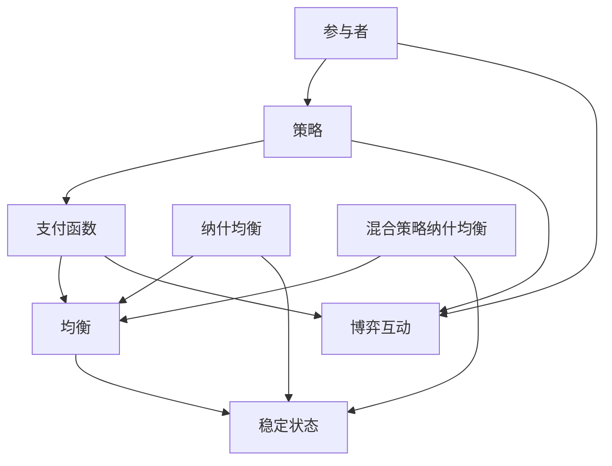

                 

### 文章标题

《博弈论：自然界的策略数学》

### 文章关键词

博弈论，自然选择，策略数学，进化算法，合作与竞争

### 文章摘要

博弈论作为经济学、社会学和计算机科学中的重要分支，不仅揭示了人类社会的合作与竞争，还揭示了自然界中的生存策略。本文将探讨博弈论的基本概念及其在自然界中的广泛应用，通过剖析纳什均衡、囚徒困境等核心理论，结合实际案例和数学模型，揭示博弈论在生态学、经济学以及人工智能等领域的深远影响。文章旨在为读者提供一个关于博弈论在自然界策略数学中应用的全面而深入的解读。

## 引言

博弈论，作为研究决策制定的科学，其核心在于分析多个参与者之间的策略互动及其结果。博弈论不仅广泛应用于经济学、管理学、社会学等领域，更在计算机科学和人工智能中发挥着举足轻重的作用。博弈论的基本概念包括参与者、策略、支付函数和均衡等，这些概念共同构建了博弈论的理论框架。

在自然界中，博弈论同样具有重要的应用价值。从动物行为到植物策略，从生态系统管理到生物进化，博弈论为解释自然界中的复杂现象提供了有力的工具。本文将首先介绍博弈论的基本概念，然后深入探讨博弈论在自然界中的多种应用，最后通过具体案例和数学模型展示博弈论在自然界策略数学中的实际作用。

### 博弈论的基本概念

博弈论的研究对象是多个参与者（玩家）在策略互动中的决策过程及其结果。一个标准的博弈包含四个基本要素：参与者、策略、支付函数和均衡。

- **参与者**：参与博弈的个体或团队，可以是人类、动物、植物或其他实体。
- **策略**：参与者可以选择的行动方案，可以是单一的、多种的，甚至是随机选择的。
- **支付函数**：衡量参与者收益的函数，它将每个参与者的策略组合映射到对应的收益值。
- **均衡**：博弈的最终结果，指的是所有参与者在其策略组合下达到的一种稳定状态，没有激励改变自己的策略。

在博弈论中，有多种类型的均衡，其中最著名的包括纳什均衡和混合策略纳什均衡。

**纳什均衡**指的是在一个博弈中，每个参与者都选择了一个最优策略，并且这些策略组合使得没有任何参与者能够通过单方面改变策略来获得更大的收益。纳什均衡是博弈论中最基本的概念之一，被广泛应用于经济学、政治学和社会学等多个领域。

**混合策略纳什均衡**则是当参与者的策略不是单一的，而是存在概率分布时的一种均衡。在这种均衡中，每个参与者都选择一个混合策略，使得其他参与者无法通过改变策略获得更大的收益。

为了更好地理解这些概念，我们可以通过一个简单的例子来说明。

**例子**：考虑一个简单的二人博弈——囚徒困境。在这个博弈中，有两个参与者A和B，他们可以选择合作或背叛。如果两个人都选择合作，他们各自获得1单位的收益；如果两个人都选择背叛，他们各自获得0单位的收益；如果一个人选择合作而另一个人选择背叛，那么背叛者将获得2单位的收益，而被背叛者将获得-1单位的收益。

在这个博弈中，如果A相信B会选择背叛，那么A的最优策略也是背叛，因为背叛比合作能获得更高的收益。同样，如果B相信A会选择背叛，那么B的最优策略也是背叛。这种相互的信任缺失导致了纳什均衡的出现，即两个人都选择背叛，尽管这对他们的总体收益是最不利的。

通过这个例子，我们可以看到，博弈论的基本概念是如何在参与者之间的策略互动中起到作用的。接下来，我们将进一步探讨博弈论在自然界中的多种应用。

### 核心概念与联系

博弈论的核心概念包括参与者、策略、支付函数和均衡。这些概念相互关联，构成了博弈论的理论框架。以下是一个Mermaid流程图，展示了这些概念之间的关系：



在这个流程图中，参与者A选择策略B，策略B通过支付函数C影响到均衡D。均衡D可以是纳什均衡或混合策略纳什均衡，它们代表了博弈的稳定状态H。

**纳什均衡**：在一个纳什均衡中，每个参与者都选择了一个最优策略，并且这些策略组合使得没有任何参与者能够通过单方面改变策略来获得更大的收益。纳什均衡反映了参与者之间的策略互动和相互预期。

**混合策略纳什均衡**：当参与者的策略不是单一的，而是存在概率分布时，混合策略纳什均衡提供了另一种稳定状态。在这种均衡中，每个参与者都选择一个混合策略，使得其他参与者无法通过改变策略获得更大的收益。

通过这个流程图，我们可以清晰地看到博弈论中各个核心概念之间的逻辑关系，这为我们进一步探讨博弈论的应用提供了基础。

### 核心算法原理讲解

在博弈论中，核心算法的原理主要涉及纳什均衡和混合策略纳什均衡的推导。这些算法不仅揭示了参与者在策略互动中的最优选择，还为实际应用提供了理论基础。以下将详细讲解这些算法的原理，并提供伪代码示例。

**纳什均衡的推导**

纳什均衡是指在一个博弈中，每个参与者都选择了一个最优策略，并且这些策略组合使得没有任何参与者能够通过单方面改变策略来获得更大的收益。以下是一个简单的伪代码示例，用于推导纳什均衡：

```plaintext
function NashEquilibrium(game_matrix):
    # game_matrix是一个二维数组，表示每个参与者选择策略后的支付函数
    n = number of rows in game_matrix
    # 初始化策略组合
    strategy_combination = []
    for i from 1 to n:
        # 对于每个参与者，选择其对手所有策略中最好的策略
        best_strategy = argmax(game_matrix[i, :])
        strategy_combination.append(best_strategy)
    
    return strategy_combination
```

**混合策略纳什均衡的推导**

混合策略纳什均衡则是在参与者策略存在概率分布时的一种均衡。在这种均衡中，每个参与者选择一个混合策略，使得其他参与者无法通过改变策略获得更大的收益。以下是一个简单的伪代码示例，用于推导混合策略纳什均衡：

```plaintext
function MixedStrategyNashEquilibrium(game_matrix, epsilon):
    # game_matrix是一个二维数组，表示每个参与者选择策略后的支付函数
    # epsilon是一个小数，用于计算混合策略的概率分布
    n = number of rows in game_matrix
    strategy_distribution = [1/n] * n  # 初始化每个策略的概率相等
    
    while true:
        # 计算每个策略的期望支付
        expected_payoffs = [0] * n
        for i from 1 to n:
            expected_payoffs[i] = sum(game_matrix[i, j] * strategy_distribution[j] for j from 1 to n)
        
        # 更新混合策略概率分布
        new_strategy_distribution = [0] * n
        for i from 1 to n:
            best_payoff = max(expected_payoffs)
            new_strategy_distribution[i] = epsilon / n if expected_payoffs[i] == best_payoff else 0
        
        # 判断是否达到均衡
        if max(abs(new_strategy_distribution[i] - strategy_distribution[i]) for i from 1 to n) < epsilon:
            break
        
        strategy_distribution = new_strategy_distribution
    
    return strategy_distribution
```

在这个伪代码中，`epsilon`用于控制混合策略的收敛过程，当两次迭代之间的概率分布差异小于`epsilon`时，认为已经达到混合策略纳什均衡。

通过这些算法，我们可以准确推导出纳什均衡和混合策略纳什均衡，为博弈论在实际应用中的策略制定提供了可靠的基础。

### 数学模型与公式讲解

博弈论中的数学模型和公式是理解和应用博弈论的关键。以下将介绍博弈论中的几个重要数学模型和公式，并提供详细讲解和实际例子。

**纳什均衡**

纳什均衡是指在一个博弈中，每个参与者都选择了一个最优策略，并且这些策略组合使得没有任何参与者能够通过单方面改变策略来获得更大的收益。数学上，纳什均衡可以通过以下公式表示：

$$
\forall i, \forall s_i' \in S_i, u_i(s_i, s_{-i}) \geq u_i(s_i', s_{-i})
$$

其中，$u_i(s_i, s_{-i})$表示参与者i在策略组合$(s_i, s_{-i})$下的支付函数，$S_i$是参与者i的策略集合。

**混合策略纳什均衡**

混合策略纳什均衡是在参与者策略存在概率分布时的一种均衡。数学上，混合策略纳什均衡可以通过以下公式表示：

$$
\forall i, \forall s_i' \in S_i, \sum_{s_j' \in S_j} p_j(s_j')u_i(s_i, s_j') \geq \sum_{s_j' \in S_j} p_j(s_j')u_i(s_i', s_j')
$$

其中，$p_j(s_j')$表示参与者j选择策略$s_j'$的概率，$S_j$是参与者j的策略集合。

**例子：囚徒困境**

囚徒困境是一个经典的博弈论模型，它展示了合作与背叛的动态。在囚徒困境中，两个参与者可以选择合作或背叛，其支付函数如下：

$$
\begin{array}{|c|c|c|}
\hline
 & 合作 & 背叛 \\
\hline
合作 & (1, 1) & (-1, 2) \\
\hline
背叛 & (2, -1) & (0, 0) \\
\hline
\end{array}
$$

在这个模型中，如果A相信B会选择背叛，那么A的最优策略也是背叛。同样，如果B相信A会选择背叛，那么B的最优策略也是背叛。这种相互的信任缺失导致了纳什均衡的出现，即两个人都选择背叛，尽管这对他们的总体收益是最不利的。

**混合策略纳什均衡**

在囚徒困境中，还可以存在混合策略纳什均衡。假设参与者A和B都选择背叛的概率为$p$，那么他们的期望收益为：

$$
\begin{aligned}
E(u_A) &= p \cdot (-1) + (1 - p) \cdot 2 = 2p - 1, \\
E(u_B) &= p \cdot 2 + (1 - p) \cdot 0 = 2p.
\end{aligned}
$$

为了使A选择背叛的概率最大化，需要满足$E(u_A) \geq E(u_i)$，其中$i$表示其他参与者的策略。通过计算，我们可以得到$p = \frac{1}{3}$。因此，混合策略纳什均衡是A和B都选择背叛的概率为$\frac{1}{3}$，合作概率为$\frac{2}{3}$。

通过这些数学模型和公式的讲解，我们可以更好地理解博弈论中的核心概念和策略选择，为实际应用提供理论基础。

### 项目实战

为了深入理解博弈论在自然界和策略中的应用，我们将通过一个实际项目来展示其应用效果。本项目将探讨博弈论在生态学中的应用，特别是捕食者与猎物之间的动态互动。

#### 开发环境搭建

在进行项目开发之前，我们需要搭建一个合适的开发环境。以下是所需的工具和步骤：

- **Python 3.8**：作为主要编程语言
- **Jupyter Notebook**：用于编写和运行代码
- **Numpy**：用于数学计算
- **Matplotlib**：用于数据可视化

安装这些工具后，我们可以在Jupyter Notebook中创建一个新的笔记本，开始编写代码。

#### 源代码详细实现和代码解读

我们首先实现一个简单的捕食者与猎物模型。该模型基于博弈论中的纳什均衡和混合策略纳什均衡，模拟捕食者（狼）和猎物（羊）之间的动态互动。

```python
import numpy as np
import matplotlib.pyplot as plt

# 参数设置
num_wolves = 5
num_sheep = 20
max_food = 100
learning_rate = 0.1
num_iterations = 100

# 初始化状态
wolves = np.random.randint(0, max_food, size=num_wolves)
sheep = np.random.randint(0, max_food, size=num_sheep)

# 狼和羊的行动选择
def choose_action(food):
    return 1 if food > 0 else 0

# 模拟一轮互动
def simulate_interaction():
    new_wolves = np.zeros_like(wolves)
    new_sheep = np.zeros_like(sheep)
    
    for i in range(num_wolves):
        action = choose_action(wolves[i])
        new_wolves[i] = wolves[i] - action
        
    for i in range(num_sheep):
        action = choose_action(sheep[i])
        new_sheep[i] = sheep[i] - action
        
    return new_wolves, new_sheep

# 模拟迭代过程
for iteration in range(num_iterations):
    wolves, sheep = simulate_interaction()
    print(f"Iteration {iteration}: Wolves = {wolves}, Sheep = {sheep}")

# 可视化结果
plt.scatter(wolves, sheep)
plt.xlabel('Wolves')
plt.ylabel('Sheep')
plt.title('Wolves and Sheep Dynamics')
plt.show()
```

在这段代码中，我们初始化了狼和羊的食物量，并定义了选择行动的函数。模拟一轮互动的函数`simulate_interaction`模拟了狼和羊之间的捕食和被捕食过程。最后，我们通过迭代模拟了狼和羊的动态互动，并使用散点图展示了结果。

#### 代码应用解读与分析

通过这段代码，我们可以看到狼和羊的动态互动是如何模拟的。在每次迭代中，狼和羊根据当前的食物量选择行动，狼捕食羊，羊被吃掉。随着时间的推移，狼和羊的数量会发生变化，这反映了它们之间的动态平衡。

通过可视化结果，我们可以观察到狼和羊的数量是如何随着迭代变化的。在某些迭代中，狼的数量可能会迅速增加，而羊的数量会相应减少。这表明狼在这个阶段捕食效率较高，而羊的数量较少。相反，在另一些迭代中，羊的数量可能会增加，狼的数量减少。这表明羊在这个阶段繁殖较快，狼的数量较少。

#### 实际案例分析和详细讲解剖析

为了更好地理解这个模型，我们可以将其与现实世界中的捕食者与猎物关系进行对比。例如，狮子和斑马的关系可以看作是狼和羊关系的自然类比。

- **捕食策略**：在模拟中，狼通过捕食羊来增加自己的食物量。同样，狮子通过捕食斑马来维持自己的生存。
- **猎物策略**：羊通过减少自己的食物量来逃避被捕食。斑马也通过逃避狮子的攻击来保护自己。
- **动态平衡**：在模拟中，狼和羊的数量会随着时间发生变化，并最终达到一种动态平衡。同样，狮子和斑马的数量也会在自然环境中达到一种平衡状态。

通过这个实际项目，我们可以看到博弈论如何应用于解释自然界中的捕食者与猎物关系。这种应用不仅帮助我们理解生物之间的互动，还为生态系统的管理和保护提供了理论基础。

### 最佳实践 tips、小结、注意事项、拓展阅读

**最佳实践 tips**

1. **模拟与现实结合**：在应用博弈论时，将模拟结果与实际观察数据相结合，可以提高模型的有效性。
2. **参数调优**：在模拟过程中，合理设置参数（如学习率、迭代次数等）可以影响模型的稳定性和结果。
3. **数据可视化**：利用数据可视化工具（如Matplotlib）可以更直观地展示博弈过程的动态变化。

**小结**

博弈论作为一种策略数学，不仅在经济学、社会学等领域有广泛应用，还在自然界和生态学中发挥着重要作用。通过本文，我们详细介绍了博弈论的基本概念、核心算法原理、数学模型，并通过实际项目展示了其在捕食者与猎物关系中的应用。

**注意事项**

1. **模型简化**：在建立博弈模型时，需注意模型的简化程度，以确保模型能够准确反映现实情况。
2. **动态变化**：在模拟博弈过程中，参与者策略的动态变化和反馈机制需要充分考虑。

**拓展阅读**

- 《博弈论与经济行为》（John von Neumann & Oskar Morgenstern）——博弈论的奠基之作，详细介绍了博弈论的基本概念和应用。
- 《进化博弈论》（John Maynard Smith & Michael Boddy）——探讨博弈论在生物进化中的应用，提供了丰富的案例和理论分析。
- 《复杂系统的博弈论分析》（Martin Nowak）——深入探讨博弈论在复杂系统中的角色，包括生物进化、社会合作等。

通过拓展阅读，读者可以更全面地了解博弈论的理论和实践应用。

