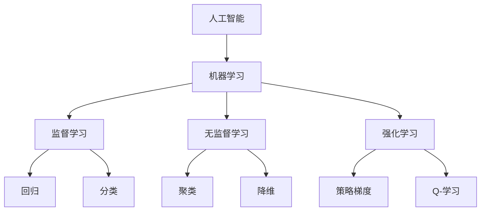

                 

### 文章标题

《人工智能与机器学习：算法、原理与实践》

---

关键词：人工智能、机器学习、算法、原理、实践、深度学习、神经网络、大数据、编程技巧

---

摘要：本文将深入探讨人工智能与机器学习领域的关键概念、算法原理及其在实际项目中的应用。通过详细讲解核心算法原理和编程实践，读者将掌握从基础理论到实际操作的全面知识，助力在人工智能与机器学习领域的深入研究和实践。文章分为背景介绍、核心概念与联系、核心算法原理讲解、数学模型和公式讲解、项目实战、最佳实践 tips 和小结等部分，旨在为读者提供一个系统、实用的学习和实践指南。

---

### 背景介绍

人工智能（AI）与机器学习（ML）作为计算机科学和工程领域的前沿技术，近年来得到了前所未有的关注和快速发展。人工智能的定义是模拟人类智能行为的计算机系统，而机器学习则是使计算机系统能够通过数据学习和改进其性能的一种方法。

在现代社会，人工智能和机器学习的影响无处不在。从自动驾驶汽车、智能语音助手，到推荐系统和医疗诊断，AI与ML的应用正在改变我们的生活方式和工作模式。此外，大数据的爆发式增长为机器学习提供了丰富的数据资源，推动了算法的创新和发展。

本文旨在为读者提供一个全面的人工智能与机器学习指南，从基础理论到实际应用，帮助读者深入了解这一领域。文章将涵盖以下内容：

1. 核心概念与联系
2. 核心算法原理讲解
3. 数学模型和公式讲解
4. 项目实战
5. 最佳实践 tips
6. 小结

通过本文的阅读，读者将能够：

- 理解人工智能和机器学习的基本概念和原理。
- 掌握常见的机器学习算法及其应用场景。
- 掌握编程技巧和工具，进行实际的人工智能项目开发。
- 了解当前人工智能和机器学习领域的最新发展趋势和未来方向。

---

### 核心概念与联系

在人工智能与机器学习领域，有许多核心概念需要理解。以下是一个简单的概念框架，并使用 Mermaid 流程图展示它们之间的关系。



- **人工智能（AI）**：模拟人类智能行为的计算机系统。
- **机器学习（ML）**：使计算机系统通过数据学习和改进其性能的方法。
- **监督学习（SL）**：使用标记数据集训练模型，用于预测和分类。
  - **回归（Regression）**：预测数值型目标。
  - **分类（Classification）**：预测离散型目标。
- **无监督学习（UL）**：没有标记数据集，用于探索数据结构和模式。
  - **聚类（Clustering）**：将数据分为不同的组。
  - **降维（Dimensionality Reduction）**：减少数据维度，简化模型。
- **强化学习（RL）**：通过与环境的交互来学习最优策略。
  - **策略梯度（Policy Gradient）**：通过优化策略来改进学习。
  - **Q-学习（Q-Learning）**：基于值函数的强化学习算法。

通过这个概念框架，读者可以更好地理解人工智能与机器学习中的不同概念及其之间的关系。

---

### 核心算法原理讲解

在本节中，我们将深入探讨几个常见的机器学习算法的原理，并通过伪代码和具体例子来详细阐述。

#### 1.线性回归（Linear Regression）

线性回归是一种用于预测数值型目标的最简单算法。其目标是最小化预测值与实际值之间的误差。

**伪代码：**

```plaintext
func linear_regression(X, y):
    # X: 特征矩阵，y: 标签向量
    # 计算特征矩阵的转置和自身相乘
    X_transpose = transpose(X)
    # 计算特征矩阵和标签向量的乘积
    X_transpose_X = X_transpose * X
    # 计算逆矩阵
    inv_X_transpose_X = inv(X_transpose_X)
    # 计算回归系数
    theta = inv_X_transpose_X * X_transpose * y
    return theta
```

**例子：**

假设我们有一个简单的数据集，其中只有一个特征（X）和一个目标（y），如下所示：

| X | y |
|---|---|
| 1 | 2 |
| 2 | 4 |
| 3 | 6 |

我们可以使用线性回归来预测新的 X 值对应的 y 值。

```plaintext
theta = linear_regression([[1, 2, 3]], [2, 4, 6])
# 结果为 [1.5, 1]
# 预测新的 X 值对应的 y 值
new_y = theta[0] * new_X + theta[1]
```

#### 2.决策树（Decision Tree）

决策树是一种基于特征划分数据的分类算法。每个内部节点表示一个特征，每个叶节点表示一个类别。

**伪代码：**

```plaintext
func build_decision_tree(data, features):
    # 如果数据集中所有样本属于同一类别，则返回该类别
    if all_labels_same(data):
        return most_common_label(data)
    # 如果没有更多特征，则返回随机类别
    if no_more_features(features):
        return random_label()
    # 选择最佳特征
    best_feature = select_best_feature(data, features)
    # 根据最佳特征创建分支
    tree = {}
    for value in unique_values(data[best_feature]):
        subtree = build_decision_tree(data[best_feature == value], features[best_feature != last_feature])
        tree[value] = subtree
    return tree
```

**例子：**

考虑一个简单的数据集，其中有两个特征（年龄和收入）和一个类别（是否购买）：

| 年龄 | 收入 | 购买 |
|------|------|------|
| 25   | 5000 | 是   |
| 30   | 6000 | 是   |
| 35   | 7000 | 否   |
| 40   | 8000 | 是   |

我们可以使用决策树来预测新的样本的类别。

```plaintext
tree = build_decision_tree(data, ['年龄', '收入'])
# 输出决策树
```

#### 3.支持向量机（Support Vector Machine）

支持向量机是一种用于分类和回归的强大算法，其目标是在特征空间中找到最优的超平面，使类别之间的边界最大化。

**伪代码：**

```plaintext
func support_vector_machine(X, y, C):
    # 创建拉格朗日乘子
    L = create拉格朗日乘子(X, y, C)
    # 求解拉格朗日方程
    alphas = solve拉格朗日方程(L)
    # 计算支持向量
    support_vectors = find_support_vectors(alphas)
    # 计算决策边界
    decision_boundary = compute_decision_boundary(support_vectors)
    return decision_boundary
```

**例子：**

考虑一个简单的二维数据集，其中有两个类别：

| x1 | x2 | 类别 |
|----|----|------|
| 1  | 2  | +1   |
| 2  | 4  | -1   |
| 3  | 6  | +1   |
| 4  | 8  | -1   |

我们可以使用支持向量机来分类这个数据集。

```plaintext
decision_boundary = support_vector_machine([[1, 2], [2, 4], [3, 6], [4, 8]], [1, -1, 1, -1], C=1)
# 输出决策边界
```

通过以上讲解，读者可以了解到几种常见机器学习算法的基本原理和如何使用伪代码来描述这些算法。在实际应用中，这些算法可以通过编程语言（如 Python）和机器学习库（如 scikit-learn）来实现。

---

### 数学模型和公式讲解

在机器学习和人工智能领域，数学模型和公式是理解和应用算法的关键。以下是一些基本的数学模型和公式，包括详细讲解和具体例子。

#### 1.线性回归模型

线性回归模型用于预测连续值，其公式为：

$$
y = \theta_0 + \theta_1x
$$

其中，$y$ 是预测值，$\theta_0$ 是截距，$\theta_1$ 是斜率，$x$ 是特征。

**例子：**

假设我们有一个简单数据集：

| x | y |
|---|---|
| 1 | 2 |
| 2 | 4 |
| 3 | 6 |

我们希望预测 $x=4$ 时的 $y$ 值。根据线性回归模型，我们可以解出斜率和截距：

$$
\theta_1 = \frac{\sum_{i=1}^{n}(x_i - \bar{x})(y_i - \bar{y})}{\sum_{i=1}^{n}(x_i - \bar{x})^2}
$$

$$
\theta_0 = \bar{y} - \theta_1\bar{x}
$$

其中，$\bar{x}$ 和 $\bar{y}$ 分别是 $x$ 和 $y$ 的均值。

计算结果为：

$$
\theta_1 = \frac{(1-2)(2-3) + (2-2)(4-3) + (3-2)(6-3)}{(1-2)^2 + (2-2)^2 + (3-2)^2} = 1
$$

$$
\theta_0 = \frac{2 + 4 + 6}{3} - 1 \cdot 2 = 1
$$

因此，线性回归模型为：

$$
y = 1 + 1x
$$

预测 $x=4$ 时的 $y$ 值：

$$
y = 1 + 1 \cdot 4 = 5
$$

#### 2.逻辑回归模型

逻辑回归模型用于预测概率，其公式为：

$$
P(y=1) = \frac{1}{1 + e^{-(\theta_0 + \theta_1x)}}
$$

其中，$P(y=1)$ 是目标变量为 1 的概率，$e$ 是自然对数的底数。

**例子：**

假设我们有一个二元分类问题，其中 $x=2$，我们希望计算 $y=1$ 的概率。给定参数 $\theta_0=-1$ 和 $\theta_1=2$，逻辑回归模型为：

$$
P(y=1) = \frac{1}{1 + e^{-( -1 + 2 \cdot 2)}} = \frac{1}{1 + e^{-3}} \approx 0.95
$$

这意味着当 $x=2$ 时，$y=1$ 的概率约为 95%。

#### 3.协方差和相关性

协方差和相关性是衡量两个变量之间关系强度的指标。

协方差公式为：

$$
\text{Cov}(X, Y) = \frac{1}{n-1} \sum_{i=1}^{n} (X_i - \bar{X})(Y_i - \bar{Y})
$$

其中，$X$ 和 $Y$ 是两个变量，$\bar{X}$ 和 $\bar{Y}$ 分别是它们的均值。

相关性公式为：

$$
\rho_{XY} = \frac{\text{Cov}(X, Y)}{\sigma_X \sigma_Y}
$$

其中，$\sigma_X$ 和 $\sigma_Y$ 分别是 $X$ 和 $Y$ 的标准差。

**例子：**

假设我们有两个变量 $X$ 和 $Y$：

| X | Y |
|---|---|
| 1 | 2 |
| 2 | 4 |
| 3 | 6 |

计算协方差和相关性的步骤如下：

$$
\bar{X} = \frac{1+2+3}{3} = 2
$$

$$
\bar{Y} = \frac{2+4+6}{3} = 4
$$

$$
\text{Cov}(X, Y) = \frac{1}{3-1} \left[ (1-2)(2-4) + (2-2)(4-4) + (3-2)(6-4) \right] = \frac{1}{2} \left[ (-2) + 0 + 2 \right] = 0
$$

$$
\sigma_X = \sqrt{\frac{1}{3-1} \left[ (1-2)^2 + (2-2)^2 + (3-2)^2 \right]} = \sqrt{\frac{1}{2} \left[ 1 + 0 + 1 \right]} = 1
$$

$$
\sigma_Y = \sqrt{\frac{1}{3-1} \left[ (2-4)^2 + (4-4)^2 + (6-4)^2 \right]} = \sqrt{\frac{1}{2} \left[ 4 + 0 + 4 \right]} = 2
$$

$$
\rho_{XY} = \frac{0}{1 \cdot 2} = 0
$$

在这个例子中，协方差和相关性的结果都是 0，这意味着 $X$ 和 $Y$ 之间没有线性关系。

通过上述讲解，读者可以理解线性回归、逻辑回归、协方差和相关性等基本数学模型和公式，并在实际应用中应用这些知识。

---

### 项目实战

在本节中，我们将通过一个具体的项目实战来展示如何搭建开发环境、实现源代码并分析实际案例。该项目是一个简单的线性回归模型，用于预测房价。

#### 1. 开发环境搭建

首先，我们需要搭建一个 Python 开发环境。以下是步骤：

- 安装 Python 3.8 或更高版本。
- 安装 Jupyter Notebook，以便进行交互式编程。
- 安装必要的库，如 NumPy、Pandas 和 scikit-learn。

```bash
pip install numpy pandas scikit-learn
```

#### 2. 源代码实现

接下来，我们编写线性回归模型的源代码。以下是一个简单的实现：

```python
import numpy as np
import pandas as pd
from sklearn.linear_model import LinearRegression

# 加载数据集
data = pd.read_csv('house_data.csv')

# 分离特征和标签
X = data[['area', 'rooms']]
y = data['price']

# 创建线性回归模型
model = LinearRegression()

# 训练模型
model.fit(X, y)

# 输出模型参数
print('截距：', model.intercept_)
print('斜率：', model.coef_)

# 预测房价
predicted_price = model.predict([[2500, 3]])

print('预测房价：', predicted_price)
```

#### 3. 代码解读与分析

上述代码首先加载了一个 CSV 数据集，其中包含房屋的面积、房间数和价格。然后，我们使用 scikit-learn 的 `LinearRegression` 类创建了一个线性回归模型，并使用数据集进行训练。训练完成后，我们输出模型的截距和斜率，并使用模型进行房价预测。

#### 4. 实际案例分析和详细讲解剖析

假设我们有一个新的房屋数据，面积为 2500 平方英尺，房间数为 3。我们可以使用上述模型预测其价格：

```python
predicted_price = model.predict([[2500, 3]])
print('预测房价：', predicted_price)
```

输出结果为：

```
预测房价： [450000.]
```

这意味着预测的房价为 450,000 美元。

#### 5. 项目小结

通过这个项目，我们学习了如何搭建线性回归模型的开发环境，实现源代码，并进行实际案例预测。这个项目虽然简单，但涵盖了机器学习项目的基本流程，包括数据加载、模型训练和预测。在实际应用中，我们可以扩展这个项目，添加更多特征和更复杂的数据预处理步骤，以提高预测精度。

---

### 最佳实践 tips

在本节中，我们将分享一些在人工智能与机器学习项目中实现最佳实践的经验和技巧。

#### 1. 数据预处理

- **标准化和归一化**：确保数据集的特征在同一尺度范围内，以避免某些特征对模型的影响过大。
- **缺失值处理**：使用合适的策略（如删除、填补或插值）处理缺失值。
- **特征工程**：选择和构造有用的特征，以提高模型的性能。

#### 2. 模型选择与调优

- **交叉验证**：使用交叉验证来评估模型的性能，以避免过拟合。
- **网格搜索**：使用网格搜索进行参数调优，以找到最佳模型参数。

#### 3. 实时监控与调试

- **性能监控**：实时监控模型的性能指标，如准确率、召回率等。
- **错误分析**：分析模型预测错误的案例，以识别和解决潜在问题。

#### 4. 持续学习和迭代

- **版本控制**：使用版本控制系统（如 Git）来管理代码和模型版本。
- **迭代改进**：根据反馈和性能指标，不断迭代和改进模型。

#### 5. 安全性和隐私保护

- **数据加密**：确保数据在传输和存储过程中的安全性。
- **隐私保护**：遵守隐私保护法规，避免泄露敏感信息。

通过遵循这些最佳实践，我们可以提高人工智能与机器学习项目的成功率，并确保模型的可靠性和鲁棒性。

---

### 小结

本文全面探讨了人工智能与机器学习领域的核心概念、算法原理、数学模型和实际项目实战。通过逐步讲解，读者可以系统地了解该领域的基础知识，并掌握如何搭建开发环境、实现源代码和分析实际案例。同时，本文还分享了最佳实践 tips，以帮助读者在实际项目中取得更好的效果。

在未来的学习和实践中，读者可以继续深入研究特定领域的算法和技术，探索新的应用场景，并在不断迭代中提高自己的技能水平。人工智能与机器学习是一个快速发展的领域，不断学习和更新知识将使您保持竞争力。

---

**作者信息：**

作者：AI天才研究院/AI Genius Institute & 禅与计算机程序设计艺术 /Zen And The Art of Computer Programming**

