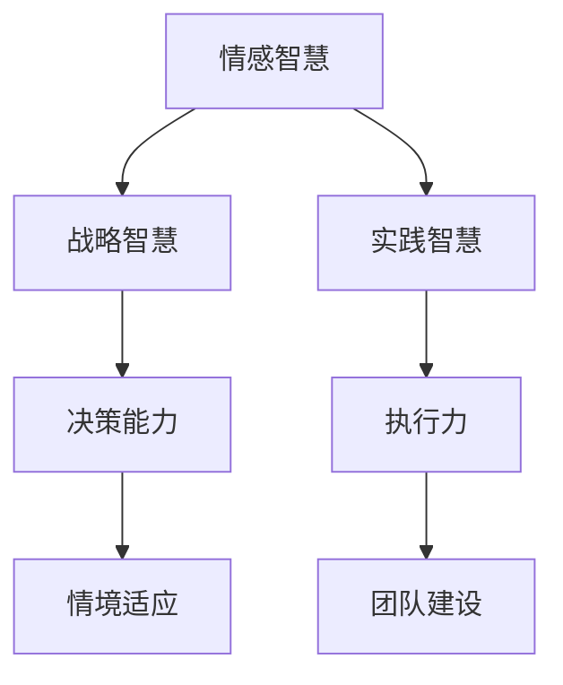
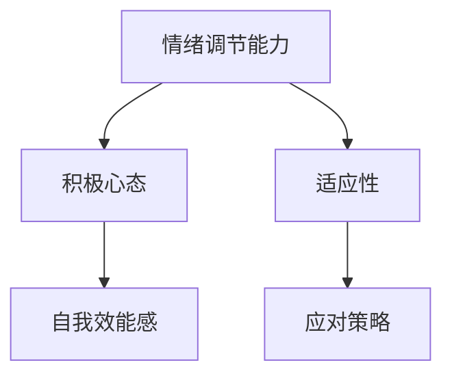
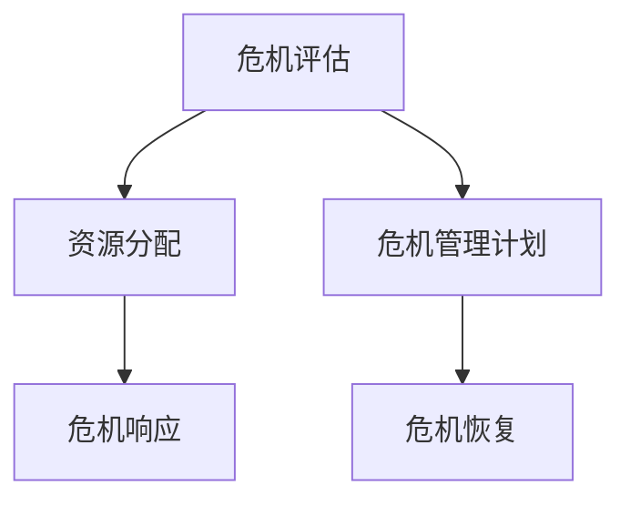
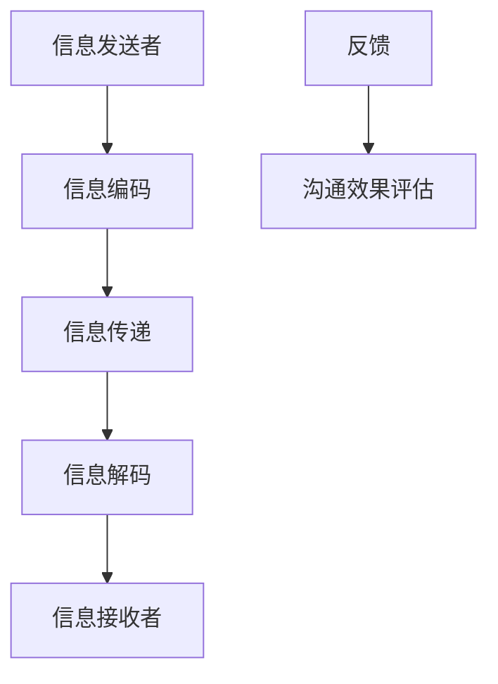
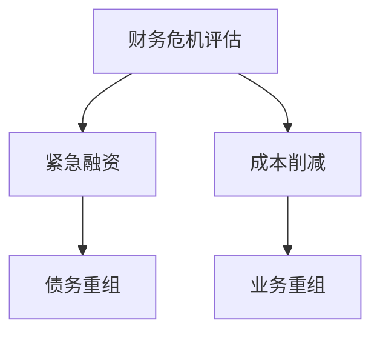
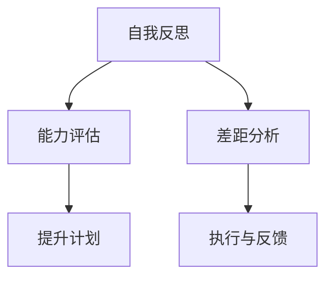

                 

### 文章标题：危机领导力：在逆境中凝聚团队

**关键词：**危机领导力，逆境管理，团队凝聚，领导艺术

**摘要：**本文旨在探讨危机领导力的重要性及其在逆境中凝聚团队的关键作用。通过对危机领导力的定义、理论基础和实践案例分析，帮助读者理解如何在危机情境下提升领导力和团队协作，实现逆境中的成功转型。

---

## 引言

在现代社会，危机无处不在，无论是自然灾害、经济危机还是企业内部的管理挑战，危机时刻都在考验着领导者的智慧和决策能力。危机领导力，作为一种特殊的领导能力，是指在面对突发事件和压力时，领导者通过有效的策略和行动，引导团队应对危机、化解风险，并在逆境中实现组织目标的能力。本文将深入探讨危机领导力的核心概念、理论基础和实践方法，以帮助读者在逆境中提升领导力和团队凝聚力。

## 第1章：危机领导力概述

**1.1. 危机领导力的定义与重要性**

危机领导力是指在面对突发危机事件时，领导者通过有效的决策和行动来保护组织、减少损失、恢复秩序并重建信心的一种能力。这一章将探讨危机领导力的定义、重要性以及在各种危机情境下的应用。

**核心概念原理：**

- **领导力三角模型**：危机领导力由情感智慧、战略智慧和实践智慧三个核心要素构成。通过Mermaid流程图展示危机领导力的核心要素和它们之间的关系。



**核心算法原理讲解：**

- **危机识别算法**：危机识别是危机管理的重要一环。以下是一个简单的危机识别算法伪代码，用于识别潜在的危机事件。

```python
# 危机识别算法伪代码
function CrisisIdentification(data):
    # 数据采集
    data = CollectCrisisData()
    # 特征提取
    features = ExtractFeatures(data)
    # 模型训练
    model = TrainModel(features)
    # 预测与评估
    predictions = model.predict(data)
    evaluate_predictions(predictions)
    return predictions
```

**数学模型和数学公式：**

- **危机影响评估模型**：以下是一个简单的危机影响评估模型，用于评估危机事件的可能影响。

$$
\text{Impact} = \alpha \cdot \text{Risk} + \beta \cdot \text{Response Time} + \gamma \cdot \text{Preparedness}
$$

其中，$\alpha$，$\beta$，$\gamma$是权重系数，Risk、Response Time、Preparedness分别表示风险水平、响应时间和准备情况。

**项目实战：**

为了更好地理解危机领导力的实际应用，我们可以通过一个简单的案例来进行实践。假设某公司面临一次突发财务危机，我们需要制定一个危机应对策略。

1. **背景介绍**：公司财务状况恶化，面临破产风险。
2. **核心概念与联系**：运用领导力三角模型，分析公司当前状况，确定情感智慧、战略智慧和实践智慧的具体应用。
3. **核心算法原理讲解**：通过数据分析和危机识别算法，找出导致财务危机的主要原因。
4. **数学模型和公式**：使用危机影响评估模型，对危机的影响进行量化评估。
5. **代码实现**：编写Python代码，实现危机识别和影响评估。
6. **代码解读与分析**：对代码进行解读，分析算法的具体实现过程。
7. **实际案例分析和详细讲解剖析**：结合实际案例，讲解危机应对策略的具体实施。
8. **项目小结**：总结危机应对的经验教训，为未来的危机管理提供参考。

**最佳实践 tips**：

- **持续学习**：领导者需要不断学习新的管理知识和技能，以应对不断变化的危机情境。
- **团队建设**：建立高效的团队，提高团队协作能力和执行力。
- **应急预案**：制定详细的应急预案，为危机应对提供有力保障。

**小结**：

危机领导力是领导者应对突发事件和压力的关键能力。通过理解危机领导力的核心概念、理论基础和实践方法，领导者可以更好地应对危机，保护组织的稳定和发展。

---

## 第2章：危机情境下的心理状态管理

**2.1. 应对危机的心理挑战**

危机情境下，领导者往往面临巨大的心理压力。这一节将探讨危机情境下领导者可能遇到的心理挑战，以及如何通过心理韧性管理来应对这些挑战。

**核心概念原理：**

- **心理韧性模型**：通过Mermaid流程图展示心理韧性的关键要素和它们之间的关系。



**核心算法原理讲解：**

- **心理韧性评估算法**：以下是一个简单的心理韧性评估算法伪代码，用于评估领导者的心理韧性水平。

```python
# 心理韧性评估算法伪代码
function PsychologicalResilienceEvaluation(leader_data):
    # 数据采集
    leader_data = CollectLeaderData()
    # 特征提取
    features = ExtractFeatures(leader_data)
    # 模型训练
    model = TrainModel(features)
    # 评估
    resilience_score = model.evaluate(leader_data)
    return resilience_score
```

**数学模型和数学公式：**

- **心理韧性评估模型**：以下是一个简单的心理韧性评估模型，用于量化领导者的心理韧性水平。

$$
\text{Resilience} = \alpha \cdot \text{Emotional Regulation} + \beta \cdot \text{Positive Attitude} + \gamma \cdot \text{Adaptability} + \delta \cdot \text{Self-Efficacy}
$$

其中，$\alpha$，$\beta$，$\gamma$，$\delta$是权重系数，Emotional Regulation、Positive Attitude、Adaptability、Self-Efficacy分别表示情绪调节能力、积极心态、适应性和自我效能感。

**项目实战：**

为了提升领导者的心理韧性，我们可以通过一个简单的案例来进行实践。假设某公司领导者面临一次突如其来的财务危机，我们需要评估其心理韧性水平。

1. **背景介绍**：公司财务状况恶化，领导者面临巨大压力。
2. **核心概念与联系**：运用心理韧性模型，分析领导者的心理韧性水平。
3. **核心算法原理讲解**：通过数据分析和心理韧性评估算法，评估领导者的心理韧性水平。
4. **数学模型和公式**：使用心理韧性评估模型，对领导者的心理韧性水平进行量化评估。
5. **代码实现**：编写Python代码，实现心理韧性评估。
6. **代码解读与分析**：对代码进行解读，分析算法的具体实现过程。
7. **实际案例分析和详细讲解剖析**：结合实际案例，分析领导者如何通过心理韧性管理来应对危机。
8. **项目小结**：总结心理韧性管理的经验教训，为未来的危机管理提供参考。

**最佳实践 tips**：

- **自我反思**：领导者需要定期进行自我反思，了解自己的情绪和心理状态。
- **寻求支持**：在危机情境下，领导者需要积极寻求外部支持，如心理咨询、团队支持等。
- **培养积极心态**：领导者需要培养积极的心态，以应对危机带来的挑战。

**小结**：

危机情境下的心理状态管理是危机领导力的重要组成部分。通过理解心理韧性的核心概念、理论基础和实践方法，领导者可以更好地应对危机，保持冷静和理智，从而更好地带领团队走出困境。

---

## 第3章：危机领导力的战略规划

**3.1. 制定危机应对策略**

危机应对策略是危机领导力的核心内容之一。这一节将探讨如何制定有效的危机应对策略，包括危机评估、资源分配和危机管理计划的制定。

**核心概念原理：**

- **危机管理框架**：通过Mermaid流程图展示危机管理的关键环节和它们之间的关系。



**核心算法原理讲解：**

- **危机评估算法**：以下是一个简单的危机评估算法伪代码，用于评估危机的严重程度和影响范围。

```python
# 危机评估算法伪代码
function CrisisAssessment(crisis_data):
    # 数据采集
    crisis_data = CollectCrisisData()
    # 特征提取
    features = ExtractFeatures(crisis_data)
    # 模型训练
    model = TrainModel(features)
    # 评估
    severity = model.estimateSeverity(crisis_data)
    impact = model.estimateImpact(crisis_data)
    return severity, impact
```

**数学模型和数学公式：**

- **危机影响评估模型**：以下是一个简单的危机影响评估模型，用于量化危机的影响程度。

$$
\text{Impact} = \alpha \cdot \text{Severity} + \beta \cdot \text{Affected Areas} + \gamma \cdot \text{Response Time}
$$

其中，$\alpha$，$\beta$，$\gamma$是权重系数，Severity、Affected Areas、Response Time分别表示危机的严重程度、受影响范围和响应时间。

**项目实战：**

为了更好地理解危机应对策略的制定，我们可以通过一个简单的案例来进行实践。假设某公司面临一次突发的网络安全危机，我们需要制定一个危机应对策略。

1. **背景介绍**：公司网络系统遭受黑客攻击，导致数据泄露和系统瘫痪。
2. **核心概念与联系**：运用危机管理框架，分析危机应对策略的关键环节。
3. **核心算法原理讲解**：通过数据分析和危机评估算法，评估危机的严重程度和影响范围。
4. **数学模型和公式**：使用危机影响评估模型，量化危机的影响程度。
5. **代码实现**：编写Python代码，实现危机评估和影响评估。
6. **代码解读与分析**：对代码进行解读，分析算法的具体实现过程。
7. **实际案例分析和详细讲解剖析**：结合实际案例，讲解危机应对策略的具体实施。
8. **项目小结**：总结危机应对策略的经验教训，为未来的危机管理提供参考。

**最佳实践 tips**：

- **全面评估**：在制定危机应对策略时，需要对危机进行全面评估，包括严重程度、受影响范围和可能的影响等。
- **资源优化**：在资源分配时，需要优先考虑关键资源和重要环节。
- **预案演练**：定期进行危机管理预案演练，提高危机应对的效率和效果。

**小结**：

危机领导力的战略规划是领导者应对危机的关键能力。通过理解危机管理框架、危机评估算法和危机影响评估模型，领导者可以更好地制定危机应对策略，提高危机应对的能力和效果。

---

## 第4章：沟通与团队协作

**4.1. 有效沟通的关键要素**

沟通是危机领导力的核心要素之一。在这一节中，我们将探讨有效沟通的关键要素，包括沟通技巧、沟通渠道和沟通障碍的克服。

**核心概念原理：**

- **沟通模型**：通过Mermaid流程图展示沟通的基本模型和关键环节。



**核心算法原理讲解：**

- **沟通效率优化算法**：以下是一个简单的沟通效率优化算法伪代码，用于优化沟通流程和提高沟通效率。

```python
# 沟通效率优化算法伪代码
function CommunicationEfficiencyOptimization(message, receiver):
    # 信息编码
    encoded_message = EncodeMessage(message)
    # 信息传递
    transmitted_message = SendMessage(encoded_message, receiver)
    # 信息解码
    decoded_message = DecodeMessage(transmitted_message)
    # 反馈与评估
    feedback = GetFeedback(decoded_message)
    evaluate_communication(feedback)
    return feedback
```

**数学模型和数学公式：**

- **沟通效果评估模型**：以下是一个简单的沟通效果评估模型，用于评估沟通的效果。

$$
\text{Communication Effectiveness} = \alpha \cdot \text{Accuracy} + \beta \cdot \text{Speed} + \gamma \cdot \text{Clarity} + \delta \cdot \text{Feedback}
$$

其中，$\alpha$，$\beta$，$\gamma$，$\delta$是权重系数，Accuracy、Speed、Clarity、Feedback分别表示沟通的准确性、速度、清晰度和反馈。

**项目实战：**

为了提高团队的有效沟通，我们可以通过一个简单的案例来进行实践。假设某团队在项目实施过程中遇到沟通障碍，我们需要优化沟通流程。

1. **背景介绍**：团队在项目实施过程中，出现沟通不畅的问题。
2. **核心概念与联系**：运用沟通模型，分析沟通流程中的关键环节。
3. **核心算法原理讲解**：通过数据分析和沟通效率优化算法，优化沟通流程。
4. **数学模型和公式**：使用沟通效果评估模型，评估沟通效果。
5. **代码实现**：编写Python代码，实现沟通效率优化。
6. **代码解读与分析**：对代码进行解读，分析算法的具体实现过程。
7. **实际案例分析和详细讲解剖析**：结合实际案例，讲解如何优化沟通流程。
8. **项目小结**：总结沟通优化的经验教训，为未来的沟通提供参考。

**最佳实践 tips**：

- **明确沟通目标**：在沟通前，需要明确沟通的目标和内容，以确保沟通的有效性。
- **建立沟通渠道**：建立多种沟通渠道，如面对面沟通、邮件、即时通讯工具等，以满足不同情境下的沟通需求。
- **积极反馈**：鼓励团队成员积极提供反馈，以改进沟通效果。

**小结**：

沟通与团队协作是危机领导力的重要组成部分。通过理解沟通模型、沟通效率优化算法和沟通效果评估模型，领导者可以更好地优化沟通流程，提高团队协作效率，从而在危机中实现逆境中的成功。

---

## 第5章：领导力的具体应用场景

**5.1. 财务危机中的领导力**

财务危机是企业面临的一种常见危机，对企业的生存和发展构成严重威胁。在这一节中，我们将探讨在财务危机中领导力的具体应用。

**核心概念原理：**

- **财务危机应对策略**：通过Mermaid流程图展示财务危机应对策略的关键环节。



**核心算法原理讲解：**

- **财务危机评估算法**：以下是一个简单的财务危机评估算法伪代码，用于评估企业的财务危机程度。

```python
# 财务危机评估算法伪代码
function FinancialCrisisAssessment(financial_data):
    # 数据采集
    financial_data = CollectFinancialData()
    # 特征提取
    features = ExtractFeatures(financial_data)
    # 模型训练
    model = TrainModel(features)
    # 评估
    crisis_level = model.estimateCrisisLevel(financial_data)
    return crisis_level
```

**数学模型和数学公式：**

- **财务危机评估模型**：以下是一个简单的财务危机评估模型，用于量化企业的财务危机程度。

$$
\text{Crisis Level} = \alpha \cdot \text{Current Ratio} + \beta \cdot \text{Quick Ratio} + \gamma \cdot \text{Debt Ratio}
$$

其中，$\alpha$，$\beta$，$\gamma$是权重系数，Current Ratio、Quick Ratio、Debt Ratio分别表示流动比率、速动比率和负债比率。

**项目实战：**

为了更好地理解财务危机中的领导力应用，我们可以通过一个简单的案例来进行实践。假设某企业面临财务危机，我们需要制定一个应对策略。

1. **背景介绍**：企业面临财务危机，债务负担沉重。
2. **核心概念与联系**：运用财务危机应对策略，分析财务危机的具体应对措施。
3. **核心算法原理讲解**：通过数据分析和财务危机评估算法，评估企业的财务危机程度。
4. **数学模型和公式**：使用财务危机评估模型，量化企业的财务危机程度。
5. **代码实现**：编写Python代码，实现财务危机评估。
6. **代码解读与分析**：对代码进行解读，分析算法的具体实现过程。
7. **实际案例分析和详细讲解剖析**：结合实际案例，讲解财务危机应对策略的具体实施。
8. **项目小结**：总结财务危机应对的经验教训，为未来的财务危机管理提供参考。

**最佳实践 tips**：

- **及时预警**：企业需要建立财务预警系统，及时发现财务危机的迹象。
- **积极应对**：在财务危机发生时，领导者需要积极应对，采取有效的措施来缓解危机。
- **优化管理**：通过优化内部管理和成本控制，提高企业的财务状况。

**小结**：

财务危机中的领导力是领导者应对企业财务危机的关键能力。通过理解财务危机应对策略、财务危机评估算法和财务危机评估模型，领导者可以更好地应对财务危机，保护企业的稳定和发展。

---

## 第6章：危机领导力案例分析

**6.1. 案例一：某公司财务危机的应对**

本节通过分析某公司财务危机的应对过程，探讨危机领导力在实际中的应用。

**案例背景：**某公司因市场变化和内部管理问题，面临严重的财务危机。

**分析过程：**

1. **危机评估**：公司通过财务危机评估模型，量化财务危机程度。
2. **应对策略**：制定包括紧急融资、成本削减和债务重组的应对策略。
3. **实施过程**：公司领导层积极落实应对策略，通过优化管理、提高效率和寻求外部支持，逐步缓解财务危机。

**经验总结：**

- **及时预警**：公司及时采取财务预警措施，避免危机进一步恶化。
- **有效沟通**：公司与利益相关者保持有效沟通，增强信任和理解。
- **战略调整**：公司根据市场变化调整业务方向，提高竞争力。

---

## 第7章：危机领导力的自我提升

**7.1. 自我评估与提升路径**

领导者需要通过自我评估，识别自身的优势和不足，并制定提升路径。

**核心概念原理：**

- **自我评估模型**：通过Mermaid流程图展示自我评估的关键环节。



**核心算法原理讲解：**

- **自我评估算法**：以下是一个简单的自我评估算法伪代码，用于评估领导者的能力。

```python
# 自我评估算法伪代码
function SelfAssessment(leader_data):
    # 数据采集
    leader_data = CollectLeaderData()
    # 特征提取
    features = ExtractFeatures(leader_data)
    # 模型训练
    model = TrainModel(features)
    # 评估
    assessment_results = model.evaluate(leader_data)
    return assessment_results
```

**数学模型和数学公式：**

- **自我提升模型**：以下是一个简单的自我提升模型，用于指导领导者的提升路径。

$$
\text{Self-Improvement Path} = \alpha \cdot \text{Self-Reflection} + \beta \cdot \text{Competence Assessment} + \gamma \cdot \text{Gap Analysis}
$$

其中，$\alpha$，$\beta$，$\gamma$是权重系数，Self-Reflection、Competence Assessment、Gap Analysis分别表示自我反思、能力评估和差距分析。

**项目实战：**

为了提升领导者的自我评估和提升能力，我们可以通过一个简单的案例来进行实践。

1. **背景介绍**：某公司领导者希望通过自我评估来提升自身能力。
2. **核心概念与联系**：运用自我评估模型，分析领导者的能力提升路径。
3. **核心算法原理讲解**：通过数据分析和自我评估算法，评估领导者的能力水平。
4. **数学模型和公式**：使用自我提升模型，制定领导者的提升计划。
5. **代码实现**：编写Python代码，实现自我评估和提升计划的制定。
6. **代码解读与分析**：对代码进行解读，分析算法的具体实现过程。
7. **实际案例分析和详细讲解剖析**：结合实际案例，讲解如何通过自我评估提升领导能力。
8. **项目小结**：总结自我评估和提升的经验教训，为未来的领导力提升提供参考。

**最佳实践 tips**：

- **定期评估**：领导者需要定期进行自我评估，以了解自身的能力和发展方向。
- **持续学习**：领导者需要不断学习新的知识和技能，以适应不断变化的环境。
- **积极反馈**：领导者需要积极寻求反馈，以改进自身的领导能力。

**小结**：

危机领导力的自我提升是领导者持续发展的重要途径。通过理解自我评估模型、自我提升模型和自我评估算法，领导者可以更好地评估自身能力，制定提升计划，从而实现领导力的持续提升。

---

## 附录：危机领导力资源与工具

**8.1. 相关书籍推荐**

- 《危机管理：如何应对和处理危机》
- 《领导力与危机：如何成为出色的危机领导者》
- 《逆境领导力：在不确定的环境中引领团队》

**8.2. 危机领导力培训课程**

- 网易云课堂：《危机管理专业培训》
- 慕课网：《危机应对与领导力提升》
- 阿里云课堂：《云计算与危机管理》

**8.3. 危机管理工具与软件**

- Reduct: 用于危机识别和风险评估的在线工具。
- CrisisBox: 用于制定危机管理计划和模拟危机情景的软件。
- EmergencyManager: 用于应急响应和资源管理的软件。

**8.4. 网络资源与在线学习平台**

- 危机领导力论坛：提供危机领导力相关的讨论和资源。
- 危机管理智库：提供危机管理的最新研究成果和实践案例。
- 网易云课堂、慕课网、阿里云课堂：提供丰富的危机领导力培训课程。

**总结**

通过本文的详细探讨，我们可以看到危机领导力在逆境中的关键作用。领导者需要通过自我评估、战略规划、沟通协作和持续学习，不断提升自身的危机领导力。在实际应用中，领导者需要结合具体情境，灵活运用各种资源和工具，实现团队凝聚和危机应对。危机领导力不仅是一种能力，更是一种艺术，需要领导者在实践中不断探索和提升。

---

**作者：AI天才研究院/AI Genius Institute & 禅与计算机程序设计艺术 /Zen And The Art of Computer Programming**

