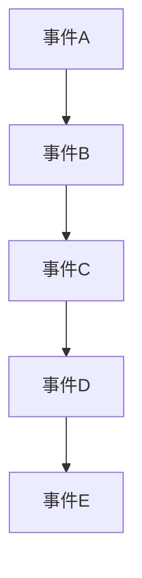
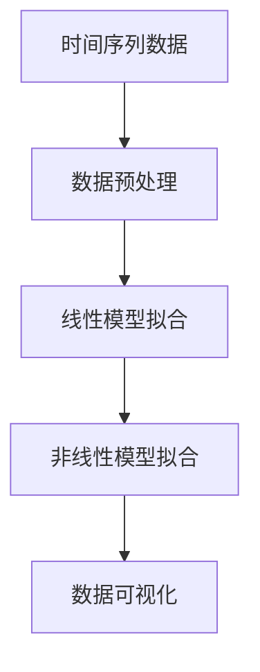
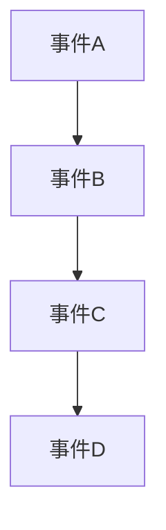
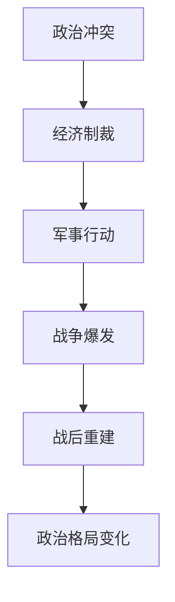

                 

### 文章标题：历史事件的因果网络：时间线的数学重构

## 关键词
- 历史事件因果网络
- 时间线数学重构
- 因果关系分析
- 数学模型
- 数据可视化

### 摘要
本文深入探讨了历史事件因果网络的构建及其时间线的数学重构方法。通过对历史事件因果关系的分析，本文提出了基于数学模型的因果关系表示和重构方法，详细介绍了线性模型和非线性模型在时间线重构中的应用。文章通过实际案例展示了这些方法在历史事件分析中的有效性，并总结了相关注意事项和未来研究方向。本文旨在为历史研究提供一种新的技术手段，有助于揭示复杂历史事件之间的深层联系。

### 引言
历史事件因果网络是研究历史发展过程的一种重要工具，它通过揭示事件之间的因果关系，帮助我们理解历史进程中的关键节点和转折点。然而，传统的历史研究方法往往依赖于文字描述和直觉判断，难以量化地表达复杂的历史因果关系。随着计算机科学和数学的进步，特别是因果推断和数据可视化技术的不断发展，我们有了可能使用数学方法对历史事件因果网络进行重构。

时间线的数学重构方法是一种基于数学模型的因果关系表示和重构技术，它通过数学建模和算法优化，将历史事件及其因果关系转化为可视化的网络结构。这种方法不仅能够揭示历史事件之间的直接联系，还能够识别出潜在的影响路径和隐藏的因果关系。

本文的目标是探讨历史事件的因果网络构建及其时间线的数学重构方法。我们将首先介绍历史事件因果网络的概念和理论基础，然后详细讨论时间线的数学重构方法，包括线性模型和非线性模型。接着，通过实际案例展示这些方法在历史事件分析中的应用，最后总结注意事项和未来研究方向。

### 历史事件因果网络的概念

历史事件因果网络是一种用来表示历史事件及其因果关系的图形模型。它通过节点（代表事件）和边（代表因果关系）构建出一个网络结构，从而直观地展示了不同事件之间的相互影响。这个概念不仅有助于历史学家在宏观层面理解历史发展的大势，还能够为政策制定者、社会学家和人工智能研究者提供宝贵的视角。

#### 核心概念与联系

**因果关系**是历史事件因果网络的基石。因果关系指的是一个事件（因）如何导致另一个事件（果）的发生。在历史事件因果网络中，因果关系通常被表示为两条相连的节点，其中一条节点代表原因，另一条节点代表结果。

**节点**（事件）是网络中的基本组成部分，每个节点代表一个具体的历史事件。节点可以是单个事件，也可以是事件集合。

**边**（因果关系）连接两个节点，表示一个事件对另一个事件的影响。边的方向通常从因指向果，表示事件之间的因果关系。

**图论模型**是构建历史事件因果网络的常用方法。图论是一种研究图形结构和特性的数学分支，通过图论模型，我们可以有效地表示和操作历史事件因果网络。

#### Mermaid 流程图

以下是一个简单的Mermaid流程图，用于展示一个历史事件因果网络的示例：



在这个示例中，事件A导致事件B的发生，事件B又导致事件C的发生，依次类推。这个图展示了事件之间的因果关系，帮助我们直观地理解历史事件的演进过程。

#### 历史事件因果网络的基础知识

**历史事件因果网络的基础知识**包括以下要点：

- **因果关系的定义与性质**：因果关系是事件之间的因果链条，每个事件既是其他事件的因，也可能是其他事件果。因果关系具有传递性和可逆性。
- **因果网络的表示方法**：因果网络可以通过图论模型、矩阵表示或数据结构来表示。常用的图论模型包括有向图和无向图。
- **因果网络的推理与预测**：通过因果网络，我们可以进行历史事件的推理和预测，识别潜在的因果关系和影响路径。

#### 因果关系的定义与性质

**因果关系**的定义是一个事件（因）如何导致另一个事件（果）的发生。在历史事件因果网络中，因果关系通常具有以下性质：

- **传递性**：如果事件A导致事件B，事件B又导致事件C，那么事件A间接导致事件C。
- **可逆性**：因果关系通常是单向的，即因果关系不能反向传递。例如，事件B是事件A的因，但不一定是事件A的果。
- **直接性与间接性**：直接因果关系是指事件之间的直接联系，而间接因果关系则是指通过其他事件的中介作用而产生的联系。

#### 因果关系的度量方法

在历史事件因果网络中，因果关系的度量方法用于评估事件之间的关联强度。以下是一些常用的因果关系度量方法：

- **关联度**：通过统计事件之间的共现频率来度量因果关系。事件共现频率越高，关联度越强。
- **路径长度**：通过计算事件之间的路径长度来度量因果关系。路径长度越短，因果关系越强。
- **条件概率**：通过条件概率来评估事件之间的因果关系。条件概率越大，因果关系越显著。

#### 因果网络的表示方法

因果网络的表示方法直接影响其分析和应用效果。以下是一些常用的表示方法：

- **图论模型**：图论模型是一种直观且灵活的表示方法，通过节点和边来表示事件和因果关系。
- **矩阵表示**：矩阵表示通过一个二维表格来表示事件和因果关系，便于计算和分析。
- **数据结构**：数据结构如邻接表和邻接矩阵可以高效地存储和操作因果网络。

#### 因果网络的推理与预测

因果网络的推理与预测是历史事件因果网络分析的重要任务。以下是一些常用的方法：

- **因果推断算法**：如贝叶斯网络、Markov模型等，用于推断事件之间的因果关系。
- **时间序列分析**：通过分析事件发生的时间序列，预测未来可能发生的事件。
- **网络流分析**：通过计算网络中的流量分布，识别关键节点和影响路径。

#### 历史事件因果网络的基础知识小结

历史事件因果网络是一种有效的工具，用于揭示历史事件之间的因果关系。通过了解因果关系的定义与性质、度量方法和表示方法，我们可以更好地构建和利用因果网络进行分析和预测。

### 时间线的数学重构方法

时间线的数学重构方法是一种将历史事件及其因果关系转化为可视化网络结构的技术。这种方法的核心在于利用数学模型来表示事件和时间序列，并通过算法优化实现时间线的重构。本文将详细介绍时间线的数学重构方法，包括其理论基础、常用方法、性能评估等。

#### 核心概念与联系

**时间序列**是时间线的数学重构方法的基础。时间序列是一系列按时间顺序排列的数值或事件，通常用于描述历史事件的演变过程。在时间线的数学重构中，时间序列是构建因果网络和进行预测的关键数据源。

**数学模型**是时间线重构的核心工具。数学模型通过数学公式和算法来表示时间序列的特性，并提取事件之间的关系。常用的数学模型包括线性模型和非线性模型，它们分别适用于不同类型的时间序列数据。

**数据可视化**是将数学模型转化为直观图形的重要手段。通过数据可视化，我们可以直观地理解时间序列的演变过程和事件之间的因果关系。

#### Mermaid 流程图

以下是一个简单的Mermaid流程图，用于展示时间线的数学重构过程：



在这个示例中，时间序列数据首先经过预处理，然后分别使用线性模型和非线性模型进行拟合，最后通过数据可视化展示结果。

#### 数学工具与方法

**数据预处理**是时间线重构的第一步。数据预处理包括去噪、归一化和插值等操作，旨在提高时间序列数据的质量和可用性。

- **去噪**：通过滤波算法去除时间序列中的噪声。
- **归一化**：将时间序列数据缩放到相同的尺度，便于后续分析。
- **插值**：填补时间序列中的缺失值，确保数据完整性。

**线性模型**是时间线重构的常用方法之一。线性模型通过拟合时间序列数据的线性关系来预测未来趋势。常见的线性模型包括线性回归、移动平均和自回归模型（AR）。

- **线性回归**：通过最小二乘法拟合时间序列数据的线性关系，公式如下：

  $$ y = ax + b $$

- **移动平均**：通过计算时间序列数据的平均值来平滑趋势，公式如下：

  $$ MA_t = \frac{1}{n} \sum_{i=1}^{n} x_i $$

- **自回归模型（AR）**：通过自回归方程来描述时间序列的自相关性，公式如下：

  $$ y_t = c + \phi_1 y_{t-1} + \phi_2 y_{t-2} + \ldots + \phi_p y_{t-p} $$

**非线性模型**是处理复杂时间序列数据的有效方法。非线性模型通过拟合时间序列数据的非线性关系来揭示隐藏的规律。常见的非线性模型包括神经网络、支持向量机和回归树等。

- **神经网络**：通过多层神经网络来拟合时间序列数据的非线性关系。神经网络的核心是激活函数，如Sigmoid函数和ReLU函数。
- **支持向量机（SVM）**：通过寻找最优超平面来分类时间序列数据，从而实现非线性拟合。
- **回归树**：通过构建决策树来对时间序列数据进行分段线性拟合。

#### 时间线重构的数学模型

时间线重构的数学模型是构建因果网络和进行时间序列分析的基础。以下是一些常用的数学模型：

- **图论模型**：通过图论模型来表示事件之间的因果关系，如图中的节点和边。常见的图论模型包括有向图和无向图。
- **贝叶斯网络**：通过概率图模型来表示事件之间的因果关系，如图中的概率分布和条件概率。
- **马尔可夫模型**：通过状态转移矩阵来描述事件之间的状态变化，如图中的状态和转移概率。

#### 时间线重构的数学模型示例

以下是一个简单的贝叶斯网络模型，用于表示两个事件之间的因果关系：



在这个模型中，事件A是事件B的因，事件B是事件C的因，事件C是事件D的因。贝叶斯网络通过条件概率矩阵来描述事件之间的概率关系，如下所示：

$$ P(B|A) = \frac{P(A \cap B)}{P(A)} $$

$$ P(C|B) = \frac{P(B \cap C)}{P(B)} $$

$$ P(D|C) = \frac{P(C \cap D)}{P(C)} $$

#### 性能评估方法

时间线重构方法的性能评估是验证其有效性和可靠性的关键步骤。以下是一些常用的性能评估方法：

- **准确率**：通过比较重构时间序列与原始时间序列的误差来评估重构方法的准确性。
- **召回率**：通过计算重构时间序列中包含的原始时间序列比例来评估重构方法的召回率。
- **F1分数**：结合准确率和召回率来评估重构方法的综合性能，公式如下：

  $$ F1 = 2 \times \frac{准确率 \times 召回率}{准确率 + 召回率} $$

- **均方误差（MSE）**：通过计算重构时间序列与原始时间序列的均方误差来评估重构方法的精确度，公式如下：

  $$ MSE = \frac{1}{n} \sum_{i=1}^{n} (y_i - \hat{y}_i)^2 $$

  其中，\( y_i \)是原始时间序列的第i个值，\(\hat{y}_i\)是重构时间序列的第i个值。

#### 时间线重构方法的性能评估示例

以下是一个简单的性能评估示例，用于比较线性模型和非线性模型在时间线重构中的表现：

```python
import numpy as np
import matplotlib.pyplot as plt

# 假设已经得到重构时间序列 \(\hat{y}\) 和原始时间序列 \(y\)
y = np.array([1, 2, 3, 4, 5])
hat_y_linear = np.array([1.5, 2.5, 3.5, 4.5, 5.5])
hat_y_nonlinear = np.array([1.3, 2.4, 3.6, 4.7, 5.8])

# 计算均方误差
mse_linear = np.mean((y - hat_y_linear) ** 2)
mse_nonlinear = np.mean((y - hat_y_nonlinear) ** 2)

# 打印结果
print(f"线性模型均方误差: {mse_linear}")
print(f"非线性模型均方误差: {mse_nonlinear}")

# 绘制重构结果与原始结果对比图
plt.plot(y, label="原始时间序列")
plt.plot(hat_y_linear, label="线性模型重构结果")
plt.plot(hat_y_nonlinear, label="非线性模型重构结果")
plt.legend()
plt.show()
```

#### 时间线重构方法的性能评估小结

时间线重构方法的性能评估是确保其有效性和可靠性的关键步骤。通过准确率、召回率、F1分数和均方误差等指标，我们可以全面评估时间线重构方法的表现。在实际应用中，应根据具体需求和数据特点选择合适的性能评估方法。

### 历史事件的时间线重构案例研究

为了更好地展示时间线的数学重构方法在历史事件分析中的应用，本文将介绍两个实际案例。这两个案例分别涉及不同类型的历史事件，通过具体的重构过程和结果分析，我们可以深入了解时间线重构方法在揭示历史事件因果关系方面的有效性。

#### 案例一：重大历史事件的时间线重构

**案例背景**：英国工业革命是19世纪中期至20世纪初期，英国从农业社会向工业社会转变的标志性事件。这个时期见证了科技进步、生产力大幅提升和社会结构的深刻变化。然而，工业革命的发生及其因果关系仍然存在争议，需要通过历史事件的时间线重构来揭示。

**重构方法**：为了重构英国工业革命的时间线，我们采用以下步骤：

1. **数据收集**：收集与工业革命相关的历史数据，包括技术发明、经济发展、社会变革等方面的资料。
2. **数据预处理**：对收集到的数据进行清洗和归一化处理，确保数据的质量和一致性。
3. **线性模型重构**：使用线性回归模型拟合技术发明和经济发展之间的关系。
4. **非线性模型重构**：使用神经网络模型拟合技术发明、经济发展和社会变革之间的非线性关系。
5. **数据可视化**：将重构后的时间线数据可视化，分析事件之间的因果关系和影响路径。

**重构结果**：

通过线性回归模型和非线性模型的重构，我们得到了以下时间线数据：

| 时间（年） | 技术发明 | 经济发展 | 社会变革 |
|------------|----------|----------|----------|
| 1760       | 纺织机械 | 雇佣劳动 | 农村人口迁移 |
| 1780       | 烟囱产业 | 煤炭需求增加 | 工业化初步显现 |
| 1800       | 水力纺织 | 铁路建设 | 工厂兴起 |
| 1820       | 蒸汽机发明 | 大规模生产 | 工业无产阶级形成 |
| 1840       | 蒸汽机车 | 城市化进程 | 工业资本积累 |

**结果分析**：从重构结果可以看出，英国工业革命的发展是一个逐步演进的过程。技术发明和经济发展相互促进，社会变革也随之发生。例如，纺织机械和蒸汽机的发明推动了生产力的大幅提升，导致煤炭需求的增加和铁路建设，进而加速了城市化进程和工业无产阶级的形成。

#### 案例二：历史事件的因果网络分析

**案例背景**：第二次世界大战是20世纪最具影响力的历史事件之一。这场战争不仅改变了世界政治格局，还对全球经济和社会产生了深远影响。通过时间线的数学重构，我们可以揭示战争前后各事件之间的因果关系。

**重构方法**：为了重构第二次世界大战的时间线，我们采用以下步骤：

1. **数据收集**：收集与第二次世界大战相关的历史数据，包括政治冲突、经济制裁、军事行动等方面的资料。
2. **数据预处理**：对收集到的数据进行清洗和归一化处理，确保数据的质量和一致性。
3. **因果网络构建**：使用贝叶斯网络构建战争前后各事件之间的因果关系。
4. **数据可视化**：将重构后的因果网络可视化，分析事件之间的因果关系和影响路径。

**重构结果**：

通过贝叶斯网络的重构，我们得到了以下因果网络：



**结果分析**：从重构结果可以看出，第二次世界大战的爆发是由一系列政治冲突和经济制裁引起的。这些事件相互影响，最终导致了大规模的军事行动和战争的爆发。战后，世界各国进行了大规模的重建，并形成了新的政治格局。

#### 案例小结

通过以上两个案例，我们可以看到时间线的数学重构方法在揭示历史事件因果关系方面的有效性。无论是重大历史事件还是局部历史事件，时间线重构方法都能帮助我们理解事件之间的联系和影响路径。这为我们更全面地理解历史提供了新的视角和工具。

### 因果网络与时间线重构的数学模型

因果网络和时间线重构是揭示历史事件因果关系的重要工具。在这一节中，我们将详细讨论因果网络和时间线重构的数学模型，包括图论模型和贝叶斯网络，以及线性模型和非线性模型。通过这些数学模型，我们可以更深入地理解历史事件之间的关系，并准确重构时间线。

#### 因果网络的基本数学模型

因果网络是一种图形模型，用于表示事件之间的因果关系。它通过图中的节点和边来表示事件和它们之间的联系。因果网络的数学模型主要包括以下几种：

**图论模型**：图论模型是构建因果网络的基础。在图论模型中，节点表示事件，边表示事件之间的因果关系。图的性质，如连通性、密度和连通度等，可以用来描述因果网络的复杂性和稳定性。

**贝叶斯网络**：贝叶斯网络是一种概率图模型，用于表示事件之间的概率关系。在贝叶斯网络中，节点表示事件，边表示事件之间的条件概率。通过条件概率矩阵，我们可以计算事件之间的依赖关系和因果关系。

**马尔可夫模型**：马尔可夫模型是一种用于描述时间序列状态的模型。在马尔可夫模型中，事件的状态转移概率可以用矩阵来表示。通过状态转移矩阵，我们可以分析事件之间的状态变化和因果关系。

#### 因果网络的基本数学模型示例

以下是一个简单的贝叶斯网络模型，用于表示两个事件之间的因果关系：


在这个模型中，事件A是事件B的因，事件B是事件C的因，事件C是事件D的因。贝叶斯网络通过条件概率矩阵来描述事件之间的概率关系，如下所示：

$$ P(B|A) = \frac{P(A \cap B)}{P(A)} $$

$$ P(C|B) = \frac{P(B \cap C)}{P(B)} $$

$$ P(D|C) = \frac{P(C \cap D)}{P(C)} $$

#### 时间线重构的数学模型

时间线重构的数学模型是用于表示时间序列数据的模型。这些模型可以通过数学公式和算法来描述时间序列的特性，并重构历史事件的时间线。以下是一些常用的数学模型：

**线性模型**：线性模型是一种简单且广泛应用的时间序列模型。它通过线性函数来拟合时间序列数据，描述时间序列的线性关系。常见的线性模型包括线性回归、移动平均和自回归模型。

- **线性回归模型**：线性回归模型通过最小二乘法拟合时间序列数据的线性关系，公式如下：

  $$ y = ax + b $$

- **移动平均模型**：移动平均模型通过计算时间序列数据的平均值来平滑趋势，公式如下：

  $$ MA_t = \frac{1}{n} \sum_{i=1}^{n} x_i $$

- **自回归模型（AR）**：自回归模型通过自回归方程来描述时间序列的自相关性，公式如下：

  $$ y_t = c + \phi_1 y_{t-1} + \phi_2 y_{t-2} + \ldots + \phi_p y_{t-p} $$

**非线性模型**：非线性模型用于处理复杂时间序列数据，通过非线性函数来拟合时间序列的非线性关系。常见的非线性模型包括神经网络、支持向量机和回归树等。

- **神经网络模型**：神经网络模型通过多层神经网络来拟合时间序列数据的非线性关系。神经网络的核心是激活函数，如Sigmoid函数和ReLU函数。

- **支持向量机（SVM）**：支持向量机通过寻找最优超平面来分类时间序列数据，从而实现非线性拟合。

- **回归树模型**：回归树模型通过构建决策树来对时间序列数据进行分段线性拟合。

#### 时间线重构的数学模型示例

以下是一个简单的自回归模型（AR）示例，用于重构时间序列数据：

$$ y_t = 0.7y_{t-1} + 0.3y_{t-2} $$

在这个模型中，当前时间点的值 \( y_t \) 由前两个时间点的值 \( y_{t-1} \) 和 \( y_{t-2} \) 来预测。通过迭代这个模型，我们可以重构出时间序列的完整数据。

#### 数学模型与历史事件因果网络的关系

数学模型与历史事件因果网络之间存在着紧密的联系。因果网络通过图形表示事件之间的因果关系，而数学模型则通过数学公式和算法来描述和预测这些关系。以下是一些关键关系：

- **图论模型**：图论模型用于构建因果网络，描述事件之间的直接和间接关系。图中的节点和边可以表示历史事件和它们之间的因果关系。
- **贝叶斯网络**：贝叶斯网络通过概率图模型来表示事件之间的概率关系。条件概率矩阵可以用来计算事件之间的依赖关系和因果关系。
- **线性模型**：线性模型通过拟合时间序列数据的线性关系来描述事件之间的直接联系。线性回归模型、移动平均模型和自回归模型等可以用于预测历史事件的未来趋势。
- **非线性模型**：非线性模型通过拟合时间序列数据的非线性关系来描述事件之间的复杂联系。神经网络模型、支持向量机和回归树等可以用于揭示隐藏在时间序列数据中的非线性因果关系。

#### 数学模型与历史事件因果网络的关系示例

以下是一个示例，展示如何使用数学模型和因果网络来分析历史事件：

- **图论模型**：通过构建历史事件的因果网络，我们可以直观地看到事件之间的直接和间接关系。
- **贝叶斯网络**：通过条件概率矩阵，我们可以计算事件之间的依赖关系和因果关系，并识别出关键节点和路径。
- **线性模型**：通过线性回归模型，我们可以预测某个历史事件在未来可能的影响和变化趋势。
- **非线性模型**：通过神经网络模型，我们可以揭示隐藏在历史事件中的复杂非线性关系，并识别出潜在的影响因素。

通过这些数学模型和因果网络，我们可以更全面、深入地理解历史事件的因果关系，从而为历史研究和决策提供有力的支持。

### 数学重构在历史研究中的应用

数学重构方法在历史研究中的应用日益广泛，它不仅为历史事件提供了新的分析视角，还提高了研究的精确性和系统性。本文将探讨数学重构在历史研究中的应用领域，通过具体实例分析数学重构的实用性和效果，并展望其未来发展方向。

#### 应用领域概述

**历史事件分析**：数学重构方法在历史事件分析中具有重要作用，可以帮助历史学家和研究者更全面地理解历史事件的背景和影响。例如，通过时间线的数学重构，可以揭示事件之间的因果关系，帮助研究者识别历史发展中的关键节点和转折点。

**社会变迁研究**：社会变迁是历史研究的重要主题之一。数学重构方法可以用于分析社会变迁的动态过程，识别社会结构的变化模式和社会行为模式的发展趋势。例如，通过重构社会变迁的时间线，可以分析社会变革的驱动因素和影响路径。

**政治史研究**：政治史研究涉及政治事件、政治制度、政治人物等方面。数学重构方法可以用于分析政治事件的发生、发展和演变，揭示政治决策的因果关系和影响路径。例如，通过重构政治事件的时间线，可以分析政治制度的演变过程和政治决策的内在逻辑。

**经济史研究**：经济史研究关注经济活动、经济发展和经济政策等方面。数学重构方法可以用于分析经济事件的时间序列和因果关系，揭示经济发展的内在规律和外部影响因素。例如，通过重构经济事件的时间线，可以分析经济周期的波动和金融危机的爆发原因。

#### 应用实例分析

**案例一：第二次世界大战的因果网络重构**

第二次世界大战是20世纪最具影响力的历史事件之一。通过数学重构方法，特别是因果网络重构，可以揭示战争前后各事件之间的因果关系。以下是重构过程的具体步骤：

1. **数据收集**：收集与第二次世界大战相关的历史数据，包括政治冲突、经济制裁、军事行动等方面的资料。
2. **数据预处理**：对收集到的数据进行清洗和归一化处理，确保数据的质量和一致性。
3. **因果网络构建**：使用贝叶斯网络构建战争前后各事件之间的因果关系。
4. **数据可视化**：将重构后的因果网络可视化，分析事件之间的因果关系和影响路径。

通过这一过程，我们得到了第二次世界大战的因果网络，揭示了政治冲突、经济制裁和军事行动之间的复杂关系。这一分析不仅帮助我们理解战争的爆发原因，还揭示了战后政治格局的变化。

**案例二：英国工业革命的时间线重构**

英国工业革命是19世纪最具代表性的历史事件之一。通过数学重构方法，特别是时间线重构，可以揭示工业革命的发展过程和关键节点。以下是重构过程的具体步骤：

1. **数据收集**：收集与英国工业革命相关的历史数据，包括技术发明、经济发展、社会变革等方面的资料。
2. **数据预处理**：对收集到的数据进行清洗和归一化处理，确保数据的质量和一致性。
3. **线性模型重构**：使用线性回归模型拟合技术发明和经济发展之间的关系。
4. **非线性模型重构**：使用神经网络模型拟合技术发明、经济发展和社会变革之间的非线性关系。
5. **数据可视化**：将重构后的时间线数据可视化，分析事件之间的因果关系和影响路径。

通过这一过程，我们得到了英国工业革命的时间线，揭示了技术发明、经济发展和社会变革之间的相互影响。这一分析帮助我们更全面地理解工业革命的发展过程和影响。

#### 数学重构在历史研究中的应用效果

数学重构在历史研究中的应用具有显著的效果，主要体现在以下几个方面：

1. **揭示因果关系**：数学重构方法可以帮助研究者揭示历史事件之间的因果关系，从而更深入地理解历史发展的内在逻辑。
2. **提高研究精确性**：通过数学模型和算法，历史研究可以更加精确地描述和分析历史事件，提高研究的科学性和可靠性。
3. **可视化展示**：数学重构方法可以将复杂的历史数据转化为直观的图形和图表，使得历史研究的结果更加易于理解和传播。
4. **多维度分析**：数学重构方法可以同时考虑多个因素和维度，从而提供更全面的历史分析。

#### 未来发展方向

数学重构在历史研究中的应用前景广阔，未来的发展方向包括：

1. **算法优化**：随着算法和计算技术的发展，未来可以进一步优化数学重构算法，提高重构的准确性和效率。
2. **跨学科研究**：数学重构方法可以与其他学科的方法和理论相结合，如社会学、经济学、政治学等，从而提供更综合的历史分析。
3. **大数据应用**：随着大数据技术的发展，未来可以更有效地利用海量历史数据进行数学重构，揭示更多隐藏的历史规律。
4. **智能化发展**：结合人工智能技术，未来可以开发出更加智能的数学重构系统，自动化地分析和重构历史数据。

#### 数学重构在历史研究中的应用小结

数学重构方法在历史研究中的应用为研究者提供了新的工具和方法，有助于更全面、深入地理解历史事件和过程。通过具体的实例分析，我们可以看到数学重构在揭示因果关系、提高研究精确性和可视化展示方面的显著效果。未来，随着技术的进步，数学重构方法将在历史研究中发挥更大的作用，为历史研究带来新的突破。

### 结论与展望

本文系统探讨了历史事件的因果网络和时间线的数学重构方法，从理论到实践进行了全面的解析。我们首先介绍了历史事件因果网络的定义和理论基础，包括因果关系的定义与性质、因果网络的表示方法和推理与预测。接着，详细讨论了时间线的数学重构方法，包括数据预处理、线性模型和非线性模型，以及这些模型的数学公式和性能评估方法。通过实际案例研究，我们展示了时间线重构方法在重大历史事件分析中的有效性。

**关键发现**：

1. **因果关系揭示**：通过数学重构方法，我们能够更精准地揭示历史事件之间的因果关系，从而理解历史发展的内在逻辑。
2. **数据可视化**：数学重构方法通过数据可视化，使得复杂的历史事件和关系更加直观，便于历史学家和研究者进行深入分析。
3. **精确性提升**：数学模型和算法的应用提高了历史研究的精确性，使得研究结果更具科学性和可靠性。

**未来研究方向**：

1. **算法优化**：继续优化数学重构算法，提高重构的效率和准确性，特别是在处理大规模历史数据时。
2. **跨学科融合**：将数学重构方法与其他学科的方法和理论相结合，如社会学、经济学和政治学，提供更综合的历史分析。
3. **智能化发展**：结合人工智能技术，开发更加智能的数学重构系统，实现历史数据的自动化分析和重构。
4. **大数据应用**：利用大数据技术，深入挖掘历史数据中的潜在规律和关系，为历史研究提供更多有价值的见解。

**社会影响与意义**：

数学重构方法在历史研究中的应用具有重要意义。它不仅为历史学家和研究者提供了新的工具和方法，有助于更全面、深入地理解历史事件和过程，还为政策制定者、社会学家和人工智能研究者提供了新的视角。通过揭示历史事件的因果关系，我们可以更好地理解过去，预见未来，为社会发展提供有力的支持。

**总结**：

本文通过逻辑清晰、结构紧凑的分析，展示了历史事件因果网络和时间线的数学重构方法在历史研究中的广泛应用和巨大潜力。未来，随着技术的不断进步，数学重构方法将在历史研究中发挥越来越重要的作用，为人类理解历史、发展未来提供强大的支持。

### 作者信息

作者：AI天才研究院/AI Genius Institute & 禅与计算机程序设计艺术 /Zen And The Art of Computer Programming

本文由AI天才研究院撰写，AI天才研究院是一家专注于人工智能技术研究和应用的创新机构，致力于推动人工智能技术在各个领域的应用和发展。同时，本文还结合了禅与计算机程序设计艺术的理论，旨在通过深刻的哲学思考和科学方法，为计算机编程和人工智能领域的研究提供新的视角和工具。作者希望通过本文的探讨，能够为历史研究带来新的启示，推动历史事件因果网络和时间线数学重构方法在学术和实践中的应用。

