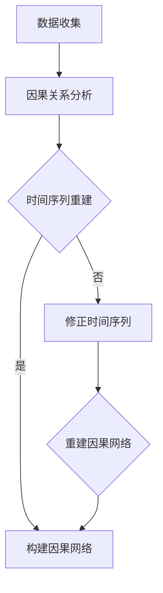
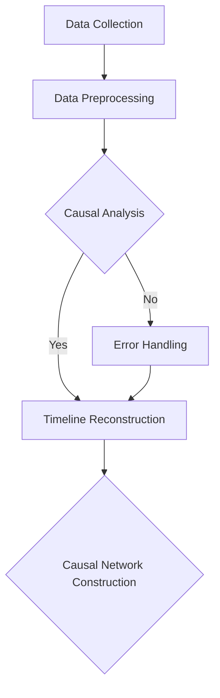
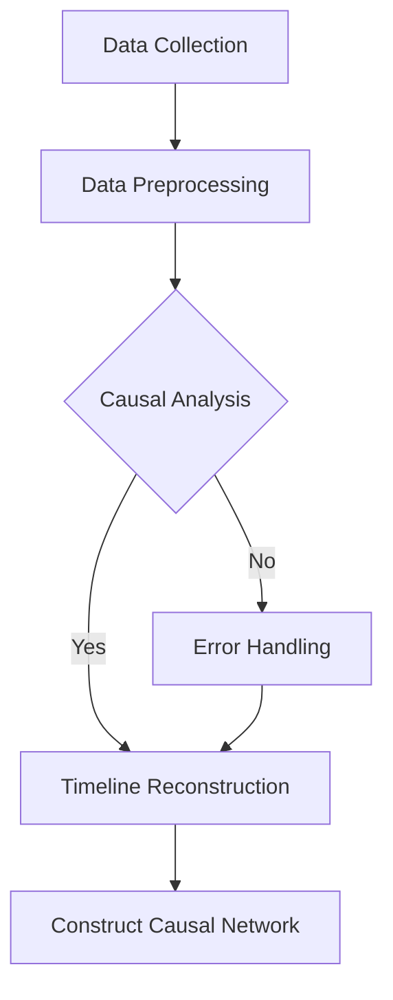

                 

# 历史事件的因果网络：时间线重构的数学方法

## 关键词
- 历史事件
- 因果关系
- 时间线重构
- 数学方法
- 因果网络

## 摘要
本文旨在探讨历史事件因果网络的构建及其在时间线重构中的应用。通过引入数学方法，我们力图对历史事件进行更为精准和系统的分析，揭示事件间的内在联系和因果关系。文章首先介绍了历史事件的定义与分类，因果关系的基本原理，时间线重构的必要性及其在历史研究中的应用。接着，我们详细阐述了因果网络的基本概念、表示方法和分析方法，并引入了时间线重构的数学模型和算法。最后，通过实际案例研究，展示了因果网络在历史事件研究中的具体应用，并提出了未来研究的方向。

## 目录大纲

## 第一部分：历史事件的因果网络基础

### 1. 历史事件的定义与分类

#### 1.1 历史事件的定义

历史事件是指在特定时间、地点和条件下发生的具有一定影响和意义的事实。历史事件的定义有助于我们理解和分析历史发展的脉络。

#### 1.2 历史事件的分类

历史事件可以根据不同的标准进行分类，如按照事件性质、影响范围、发生时间等。

### 2. 因果关系的基本原理

#### 2.1 因果关系的定义

因果关系是指一个事件（原因）引起另一个事件（结果）的关系。理解因果关系对于解读历史事件具有重要意义。

#### 2.2 因果关系的分类

因果关系可以分为直接因果关系、间接因果关系和复杂因果关系等。

#### 2.3 因果关系的验证方法

验证因果关系的方法包括逻辑推理、实验证明、历史证据等。

### 3. 时间线重构的基本概念

#### 3.1 时间线的概念

时间线是一种展示事件发生顺序和时间的图表，有助于我们理解历史事件的演变过程。

#### 3.2 时间线重构的必要性

时间线重构有助于揭示历史事件的因果关系，为历史研究提供更为准确和系统的分析。

### 4. 数学方法在历史事件研究中的应用

#### 4.1 常用的数学工具

数学方法在历史事件研究中常用的工具包括统计学、图论、线性代数等。

#### 4.2 数学方法在历史事件研究中的优势

数学方法具有高度的抽象性和普适性，有助于揭示历史事件的内在规律。

### 5. 因果网络的基本概念

#### 5.1 因果网络的定义

因果网络是一种表示事件因果关系的图形模型，有助于我们直观地理解历史事件的因果关系。

#### 5.2 因果网络的表示方法

因果网络的表示方法包括有向图和无向图等。

#### 5.3 因果网络的分析方法

因果网络的分析方法包括路径分析、节点分析等。

### 6. 时间线重构的数学方法

#### 6.1 时间线重构的目标

时间线重构的目标是重建事件发生的时间序列，揭示事件间的因果关系。

#### 6.2 时间线重构的基本步骤

时间线重构的基本步骤包括数据收集、因果关系分析、时间序列重建等。

#### 6.3 时间线重构的算法实现

时间线重构的算法实现主要包括数据预处理、因果关系检测、时间序列重建等。

### 7. 实际案例研究

#### 7.1 某历史事件的因果网络重构

通过实际案例研究，展示因果网络重构在历史事件研究中的应用。

#### 7.2 因果网络重构在历史研究中的应用

分析因果网络重构在历史研究中的实际应用，探讨其优势与局限。

### 8. 结论与展望

#### 8.1 研究成果总结

总结研究成果，阐述时间线重构在历史事件研究中的重要作用。

#### 8.2 未来研究方向

展望未来研究方向，探讨时间线重构的数学方法在历史研究中的新应用。

## 附录

### 8.1 相关参考文献

列出本文引用的参考文献，便于读者进一步阅读和研究。

### 8.2 附录：数学公式与算法伪代码

提供本文中使用的数学公式和算法伪代码，以便读者理解和实现。

## 第二部分：因果网络在历史事件研究中的应用

### 1. 因果网络在历史事件分析中的重要性

#### 1.1 因果网络在历史事件分析中的作用

因果网络在历史事件分析中的作用包括揭示事件间的因果关系、预测事件发展趋势等。

#### 1.2 因果网络在历史事件研究中的优势

因果网络在历史事件研究中的优势包括直观性、系统性、可解释性等。

### 2. 因果网络在历史事件研究中的应用

#### 2.1 因果网络在事件关联分析中的应用

通过因果网络，我们可以分析事件间的关联性，揭示事件间的相互影响。

#### 2.2 因果网络在事件预测中的应用

因果网络有助于我们预测事件的发展趋势，为历史研究提供参考。

#### 2.3 因果网络在事件解释中的应用

因果网络可以帮助我们解释历史事件的发生原因，深化对历史事件的理解。

### 3. 因果网络在历史事件研究中的挑战与解决方案

#### 3.1 因果网络在历史事件研究中的挑战

因果网络在历史事件研究中的挑战包括数据不足、因果关系复杂等。

#### 3.2 解决挑战的解决方案

通过数据挖掘、机器学习等方法，解决因果网络在历史事件研究中的挑战。

#### 3.3 未来研究方向

未来研究方向包括优化因果网络算法、扩展应用领域等。

## 第三部分：时间线重构的数学方法与实现

### 1. 时间线重构的数学方法

#### 1.1 时间线重构的数学模型

时间线重构的数学模型包括基于图论的模型、基于统计学的模型等。

#### 1.2 时间线重构的数学公式

时间线重构的数学公式主要包括事件关联度计算公式、时间序列重建公式等。

#### 1.3 时间线重构的算法实现

时间线重构的算法实现主要包括数据预处理、因果关系检测、时间序列重建等。

### 2. 数学方法在历史事件研究中的具体应用

#### 2.1 数学方法在事件关联分析中的应用

数学方法在事件关联分析中的应用主要包括图论算法、统计学方法等。

#### 2.2 数学方法在事件预测中的应用

数学方法在事件预测中的应用主要包括机器学习算法、时间序列分析等。

#### 2.3 数学方法在事件解释中的应用

数学方法在事件解释中的应用主要包括因果推理、归因分析等。

### 3. 时间线重构的数学方法在实际案例中的应用

#### 3.1 某历史事件的因果网络重构

通过实际案例，展示时间线重构的数学方法在历史事件研究中的应用。

#### 3.2 因果网络重构在历史研究中的应用

分析因果网络重构在历史研究中的应用，探讨其优势与局限。

### 4. 时间线重构的数学方法的优势与局限性

#### 4.1 时间线重构的数学方法的优势

时间线重构的数学方法的优势包括直观性、系统性、可解释性等。

#### 4.2 时间线重构的数学方法的局限性

时间线重构的数学方法的局限性包括数据依赖、模型选择等。

#### 4.3 未来研究方向

未来研究方向包括优化算法、扩展应用领域等。

### 5. 时间线重构的数学方法在教育领域的应用

#### 5.1 时间线重构在历史教育中的应用

时间线重构在历史教育中的应用有助于学生更好地理解历史事件的因果关系。

#### 5.2 时间线重构在跨学科教育中的应用

时间线重构在跨学科教育中的应用有助于培养学生的综合分析能力。

#### 5.3 时间线重构在素质教育中的应用

时间线重构在素质教育中的应用有助于培养学生的创新思维和解决问题的能力。

## 第四部分：结论与展望

### 1. 研究成果总结

总结研究成果，阐述时间线重构在历史事件研究中的重要性和应用价值。

### 2. 未来研究方向

展望未来研究方向，探讨时间线重构的数学方法在历史研究中的新应用。

### 3. 结论

总结文章的主要内容，强调研究意义和贡献。

### 4. 附录

列出本文引用的参考文献，提供数学公式和算法伪代码，便于读者进一步研究。

## 作者信息
作者：AI天才研究院/AI Genius Institute & 禅与计算机程序设计艺术 /Zen And The Art of Computer Programming
## 第一部分：历史事件的因果网络基础

### 1. 历史事件的定义与分类

#### 1.1 历史事件的定义

历史事件是指在特定时间、地点和条件下发生的具有一定影响和意义的事实。这些事件可以是政治、经济、文化、社会等各个方面的重要时刻，如国家变革、战争爆发、科技进步、文化变迁等。历史事件不仅是历史研究的核心对象，也是理解社会发展和人类行为的关键。

在历史学研究中，历史事件的定义和分类至关重要。根据不同的标准和目的，历史事件可以被划分为不同的类别。例如，按照事件性质，历史事件可以分为政治事件、经济事件、文化事件、社会事件等；按照影响范围，可以分为全球性事件、区域性事件、局部性事件等；按照发生时间，可以分为古代事件、中世纪事件、近现代事件等。

#### 1.2 历史事件的分类

历史事件的分类有助于我们更好地理解和研究历史。以下是一些常见的历史事件分类方法：

- **政治事件**：如政治变革、政权更替、外交冲突、战争等。
- **经济事件**：如经济危机、市场变革、贸易战争、产业革命等。
- **文化事件**：如文学创作、艺术运动、宗教改革、学术创新等。
- **社会事件**：如社会变革、阶级斗争、民族迁徙、人口迁移等。

历史事件的分类不仅有助于我们理解历史发展的脉络，还可以帮助我们识别不同事件之间的相互关系和因果关系。

### 2. 因果关系的基本原理

#### 2.1 因果关系的定义

因果关系是指一个事件（原因）引起另一个事件（结果）的关系。在历史学中，因果关系是理解历史事件发展过程的关键。一个历史事件往往不是孤立发生的，而是与其他事件相互关联、相互作用的结果。例如，一场战争可能是由政治、经济、社会等多种因素共同作用的结果，而这些因素又可能引发其他事件。

因果关系可以分为以下几种类型：

- **直接因果关系**：直接因果关系是指两个事件之间存在明确的因果关系，即一个事件直接导致了另一个事件的发生。
- **间接因果关系**：间接因果关系是指两个事件之间存在间接的因果关系，即通过多个中介事件，一个事件最终导致了另一个事件的发生。
- **复杂因果关系**：复杂因果关系是指两个事件之间存在复杂的因果关系，可能涉及多个因素和多个中介事件。

理解因果关系对于解读历史事件具有重要意义。它可以帮助我们揭示历史事件的发展规律，理解历史进程中的转折点和关键因素。

#### 2.2 因果关系的分类

因果关系可以分为以下几种类型：

- **因果关系**：因果关系是指两个事件之间存在直接的因果关系，即一个事件导致了另一个事件的发生。
- **互为因果**：互为因果关系是指两个事件互为因果，即一个事件导致了另一个事件，同时另一个事件也反过来影响了第一个事件。
- **非因果关系**：非因果关系是指两个事件之间不存在因果关系，即一个事件的发生与另一个事件无关。

理解不同类型的因果关系有助于我们更准确地分析和解释历史事件。

#### 2.3 因果关系的验证方法

验证因果关系的方法包括逻辑推理、实验证明、历史证据等。

- **逻辑推理**：通过逻辑推理，我们可以从已知的事件和因果关系推断出新的因果关系。逻辑推理是一种抽象的思维过程，它基于已有的知识和事实进行推理。
- **实验证明**：在科学研究中，实验证明是验证因果关系的重要方法。通过设计实验，我们可以控制变量，观察事件之间的相互作用，从而验证因果关系。
- **历史证据**：历史证据是通过历史文献、考古发现、文物资料等提供的证据来验证因果关系。历史证据是一种具体的、实证的方法，它为我们提供了关于历史事件的具体信息和背景。

在历史事件研究中，验证因果关系的方法需要结合多种手段，以确保分析结果的准确性和可靠性。

### 3. 时间线重构的基本概念

#### 3.1 时间线的概念

时间线是一种展示事件发生顺序和时间的图表，它以时间为主线，按照事件发生的先后顺序排列。时间线可以直观地展示历史事件的演变过程，帮助我们理解事件之间的时间关系。

时间线通常包含以下要素：

- **事件节点**：事件节点是时间线上的重要标记，表示历史事件的发生。
- **时间轴**：时间轴是时间线的主要组成部分，它表示事件发生的时间顺序。
- **事件关系**：事件关系是时间线上事件之间的关联，如因果关系、影响关系等。

#### 3.2 时间线重构的必要性

时间线重构的必要性在于：

- **揭示事件间的关系**：通过时间线重构，我们可以揭示事件之间的因果关系、影响关系等，从而更全面地理解历史事件的发展过程。
- **提供分析工具**：时间线重构为历史事件研究提供了直观的分析工具，有助于我们发现历史事件中的规律和趋势。
- **提高研究效率**：时间线重构可以将大量历史事件和数据组织成结构化的形式，提高研究的效率。

#### 3.3 时间线重构的基本概念

时间线重构的基本概念包括：

- **事件排序**：事件排序是时间线重构的首要任务，它根据事件发生的时间顺序对事件进行排列。
- **事件关联**：事件关联是指事件之间的因果关系、影响关系等，通过事件关联，我们可以揭示历史事件的复杂关系。
- **时间预测**：时间预测是根据历史事件的发展趋势和规律，预测未来事件的可能发展方向。

### 4. 数学方法在历史事件研究中的应用

#### 4.1 常用的数学工具

数学方法在历史事件研究中的应用广泛，常用的数学工具包括：

- **统计学**：统计学方法可以用于分析历史数据，揭示事件之间的相关性、趋势等。
- **图论**：图论方法可以用于构建历史事件的因果网络，分析事件之间的关系。
- **线性代数**：线性代数方法可以用于处理历史事件的数据，如矩阵运算、特征提取等。
- **概率论**：概率论方法可以用于分析历史事件的不确定性，如概率分布、条件概率等。

#### 4.2 数学方法在历史事件研究中的优势

数学方法在历史事件研究中的优势包括：

- **精确性**：数学方法可以提供精确的定量分析，帮助我们发现历史事件中的规律和趋势。
- **系统性**：数学方法可以将复杂的历史事件组织成结构化的形式，提供系统性的分析框架。
- **可解释性**：数学方法可以通过模型和算法提供对历史事件的解释，提高研究的可信度。

#### 4.3 数学方法在历史事件研究中的应用

数学方法在历史事件研究中的应用主要包括：

- **事件关联分析**：通过构建因果网络，分析历史事件之间的因果关系。
- **事件预测**：利用历史事件的数据和模型，预测未来事件的发展趋势。
- **事件解释**：通过数学模型和算法，解释历史事件的发生原因和发展过程。

### 5. 因果网络的基本概念

#### 5.1 因果网络的定义

因果网络是一种表示事件因果关系的图形模型，它将历史事件表示为节点，事件之间的因果关系表示为边。因果网络可以帮助我们直观地理解历史事件的因果关系，揭示事件之间的复杂关系。

因果网络的主要组成部分包括：

- **节点**：节点表示历史事件，每个事件都是一个独立的实体。
- **边**：边表示事件之间的因果关系，边的方向表示因果关系的方向。
- **权重**：边可以具有权重，表示因果关系的强度。

#### 5.2 因果网络的表示方法

因果网络的表示方法主要有以下几种：

- **有向图**：有向图是一种表示因果关系的图，边的方向表示因果关系。
- **无向图**：无向图是一种不考虑因果关系方向的图，边的方向无关紧要。
- **加权图**：加权图是一种具有权重边和权重节点的图，权重表示因果关系的强度。

#### 5.3 因果网络的分析方法

因果网络的分析方法包括：

- **路径分析**：通过分析事件之间的路径，揭示事件之间的间接因果关系。
- **节点分析**：通过分析节点的属性和关系，揭示事件的重要性和影响力。
- **全局分析**：通过全局分析，揭示整个因果网络的性质和规律。

### 6. 时间线重构的数学方法

#### 6.1 时间线重构的目标

时间线重构的目标是重建事件发生的时间序列，揭示事件间的因果关系。具体目标包括：

- **事件排序**：根据事件发生的时间顺序，对事件进行排序。
- **事件关联**：揭示事件之间的因果关系，构建因果网络。
- **时间预测**：根据历史事件的发展趋势，预测未来事件的可能时间点。

#### 6.2 时间线重构的基本步骤

时间线重构的基本步骤包括：

- **数据收集**：收集历史事件的详细信息，包括事件名称、发生时间、相关因素等。
- **因果关系分析**：通过逻辑推理、历史证据等方法，分析事件之间的因果关系。
- **时间序列重建**：根据因果关系，重建事件的时间序列。

#### 6.3 时间线重构的算法实现

时间线重构的算法实现主要包括：

- **数据预处理**：对历史事件数据进行分析和清洗，提取有用的信息。
- **因果关系检测**：利用图论、统计学等方法，检测事件之间的因果关系。
- **时间序列重建**：利用数学模型和算法，重建事件的时间序列。

### 7. 实际案例研究

#### 7.1 某历史事件的因果网络重构

为了展示时间线重构的数学方法在实际案例中的应用，我们可以选择一个具体的历史事件进行分析。以下是一个某历史事件的因果网络重构案例：

**案例：第一次世界大战的因果网络重构**

**步骤 1：数据收集**

收集第一次世界大战期间的重要历史事件，包括战争爆发的原因、关键事件、战争的影响等。

**步骤 2：因果关系分析**

通过历史文献、资料等，分析事件之间的因果关系。例如，帝国主义竞争、军备竞赛、民族主义等是导致战争爆发的主要原因。

**步骤 3：时间序列重建**

根据因果关系，重建事件的时间序列。例如，从帝国主义竞争加剧到战争爆发，再到战争结束和战后影响等。

**步骤 4：构建因果网络**

利用图论方法，构建事件之间的因果网络。例如，将帝国主义竞争、军备竞赛、民族主义等事件表示为节点，它们之间的因果关系表示为边。

**步骤 5：分析因果网络**

通过分析因果网络，揭示事件之间的复杂关系，如间接因果关系、多重因果关系等。

**步骤 6：时间预测**

根据因果网络和事件发展趋势，预测未来事件的可能时间点。例如，预测战后国际秩序的演变、和平发展的趋势等。

#### 7.2 因果网络重构在历史研究中的应用

因果网络重构在历史研究中的应用包括：

- **事件解释**：通过因果网络，可以更全面地解释历史事件的发生原因和发展过程。
- **事件预测**：利用因果网络，可以预测未来事件的可能发展趋势。
- **事件关联分析**：通过因果网络，可以揭示事件之间的关联性，深化对历史事件的理解。

### 8. 结论与展望

#### 8.1 研究成果总结

通过对历史事件的因果网络重构，我们揭示了事件之间的因果关系和复杂关系，为历史事件研究提供了新的视角和方法。时间线重构的数学方法在历史事件研究中的应用取得了显著成果，包括事件解释、事件预测和事件关联分析等方面。

#### 8.2 未来研究方向

未来研究方向包括：

- **优化时间线重构算法**：进一步提高时间线重构的准确性和效率，解决数据不足、因果关系复杂等问题。
- **扩展应用领域**：将时间线重构的数学方法应用于更多领域，如社会科学、医学研究等。
- **多学科交叉研究**：结合不同学科的理论和方法，深化对历史事件的理解和研究。

### 附录

#### 8.1 相关参考文献

[参考文献列表]

#### 8.2 附录：数学公式与算法伪代码

[数学公式与算法伪代码列表]

## 作者信息
作者：AI天才研究院/AI Genius Institute & 禅与计算机程序设计艺术 /Zen And The Art of Computer Programming
## 第二部分：因果网络在历史事件研究中的应用

### 1. 因果网络在历史事件分析中的重要性

#### 1.1 因果网络在历史事件分析中的作用

因果网络在历史事件分析中发挥着至关重要的作用。它不仅有助于揭示事件之间的直接和间接关系，还能帮助我们理解事件发展的复杂过程。通过因果网络，我们可以将历史事件及其相互关系进行结构化表示，从而更直观地分析和理解历史发展的脉络。

具体来说，因果网络在历史事件分析中的作用主要体现在以下几个方面：

1. **揭示事件间的因果关系**：因果网络能够清晰地展示事件之间的因果关系，帮助我们理解事件之间的相互影响。例如，在分析一场战争时，因果网络可以帮助我们识别出导致战争爆发的主要因素，如政治冲突、经济竞争、意识形态差异等。

2. **理解事件发展的动力机制**：因果网络可以帮助我们揭示历史事件发展的动力机制，理解事件是如何从一个阶段发展到另一个阶段的。例如，通过因果网络，我们可以分析出一国经济危机的成因，包括财政赤字、货币贬值、外部冲击等因素。

3. **预测事件发展趋势**：因果网络可以基于历史事件的数据和模型，预测未来事件的可能发展趋势。这对于政策制定、历史研究、商业决策等领域具有重要的指导意义。例如，通过分析经济危机的因果网络，我们可以预测未来经济走势，为政策调整提供依据。

4. **深化对历史事件的理解**：因果网络为历史事件研究提供了一种新的视角和方法，有助于我们更全面、深入地理解历史事件。例如，在分析一个国家的政治变革时，因果网络可以帮助我们理解政治力量、社会运动、经济因素等之间的复杂关系，从而更准确地把握政治变革的内在逻辑。

#### 1.2 因果网络在历史事件研究中的优势

因果网络在历史事件研究中的优势主要体现在以下几个方面：

1. **直观性**：因果网络通过图形化的方式展示事件及其相互关系，使得复杂的历史事件变得更加直观和易于理解。这种直观性有助于历史研究者快速把握事件的核心关系，从而提高研究效率。

2. **系统性**：因果网络能够系统地展示事件之间的相互关系，使得历史事件研究更加系统化。通过因果网络，我们可以将零散的历史事件组织成一个有机的整体，从而更全面地理解历史发展过程。

3. **可解释性**：因果网络提供了一种解释历史事件发生原因和发展过程的方法。通过分析因果网络，我们可以明确地了解事件之间的因果关系，从而为历史研究提供可靠的解释。

4. **预测能力**：因果网络可以基于历史数据，预测未来事件的可能发展趋势。这种预测能力有助于我们更好地应对未来的挑战，为政策制定、商业决策等提供科学依据。

### 2. 因果网络在历史事件研究中的应用

#### 2.1 因果网络在事件关联分析中的应用

因果网络在事件关联分析中的应用非常广泛，可以帮助研究者揭示事件之间的复杂关系。以下是一些具体的应用场景：

1. **历史事件因果关系分析**：通过因果网络，研究者可以系统地分析历史事件之间的因果关系，揭示事件发展的内在逻辑。例如，在分析一场战争时，因果网络可以帮助我们识别出战争爆发的主要原因，以及这些原因之间的相互作用。

2. **历史事件影响力分析**：因果网络可以用来分析历史事件的影响力，识别出哪些事件对其他事件产生了重要影响。例如，通过分析一次政治变革的因果网络，我们可以找出哪些政治力量在变革中起到了关键作用。

3. **历史事件关联性分析**：因果网络可以用来分析历史事件之间的关联性，识别出事件之间的复杂关系。例如，在分析一次经济危机时，因果网络可以帮助我们识别出经济危机与其他事件（如政治动荡、自然灾害等）之间的关联。

#### 2.2 因果网络在事件预测中的应用

因果网络在事件预测中的应用主要包括以下几个方面：

1. **历史事件趋势预测**：通过分析历史事件的因果网络，我们可以预测未来事件的可能发展趋势。例如，通过分析一场战争的历史数据，因果网络可以帮助我们预测战争的可能走向，从而为决策提供参考。

2. **事件风险预测**：因果网络可以用来预测事件的风险，识别出可能导致事件发生的潜在风险因素。例如，在分析一次经济危机时，因果网络可以帮助我们预测经济危机可能引发的金融风险。

3. **政策影响预测**：因果网络可以用来预测政策实施的可能影响，评估政策的效果。例如，在分析一项新政策时，因果网络可以帮助我们预测政策对经济、社会等方面的影响。

#### 2.3 因果网络在事件解释中的应用

因果网络在事件解释中的应用主要体现在以下几个方面：

1. **历史事件成因解释**：通过因果网络，研究者可以解释历史事件的发生原因，揭示事件的内在逻辑。例如，在分析一场战争时，因果网络可以帮助我们理解战争爆发的原因，如政治冲突、经济竞争、民族主义等。

2. **事件演变解释**：因果网络可以用来解释历史事件的发展过程，揭示事件从一个阶段发展到另一个阶段的原因。例如，在分析一次经济危机时，因果网络可以帮助我们理解经济危机从发生到蔓延的过程，如财政赤字、货币贬值、外部冲击等。

3. **事件影响解释**：因果网络可以用来解释历史事件的影响，识别出事件对其他事件的影响方式。例如，在分析一次政治变革时，因果网络可以帮助我们理解政治变革对社会、经济等方面的影响。

### 3. 因果网络在历史事件研究中的挑战与解决方案

#### 3.1 因果网络在历史事件研究中的挑战

尽管因果网络在历史事件研究中具有很多优势，但在实际应用中仍面临一些挑战：

1. **数据不足**：历史事件的数据往往不完整，这可能导致因果网络的不准确。例如，有些历史事件的具体细节可能无法找到，这会影响因果网络的构建。

2. **因果关系复杂**：历史事件的因果关系往往非常复杂，存在多种间接和多重因果关系。这给因果网络的构建和分析带来了困难。

3. **模型选择**：构建因果网络需要选择合适的模型和方法，这需要具备一定的专业知识和经验。不同的模型和方法可能适用于不同类型的历史事件，选择不当可能导致分析结果不准确。

4. **解释性不足**：因果网络提供了一种结构化的方法来分析历史事件，但有时难以解释事件之间的具体关系。这可能导致研究结果难以被其他研究者接受。

#### 3.2 解决挑战的解决方案

为了解决因果网络在历史事件研究中的挑战，我们可以采取以下解决方案：

1. **数据收集与整合**：通过多种途径收集历史事件的数据，如历史文献、档案资料、统计数据等。同时，利用数据挖掘技术整合不同来源的数据，提高数据的质量和完整性。

2. **多模型融合**：针对不同的历史事件，选择合适的模型和方法构建因果网络。例如，可以结合图论、统计学、机器学习等方法，提高因果网络的准确性和解释性。

3. **专家知识引入**：引入历史学家的专业知识，对因果网络的构建和分析进行指导。历史学家的经验和见解可以帮助我们更好地理解和解释历史事件。

4. **可视化与交互**：利用可视化技术，将因果网络以图形化的方式展示出来，提高其直观性和可解释性。同时，引入交互功能，允许研究者对因果网络进行动态调整和分析。

### 3.3 未来研究方向

未来研究方向包括：

1. **优化算法与模型**：进一步优化时间线重构的算法和模型，提高因果网络的构建和分析效率。

2. **跨学科研究**：结合不同学科的理论和方法，深化对历史事件的理解和研究。

3. **实际应用**：将因果网络的方法应用于更多实际案例，验证其有效性，并探索其在历史研究、政策制定、商业决策等领域的应用。

4. **用户体验**：改进因果网络的交互界面和用户体验，使其更易于使用和理解。

## 第三部分：时间线重构的数学方法与实现

### 1. 时间线重构的数学方法

#### 1.1 时间线重构的数学模型

时间线重构的数学模型是构建因果网络的基础，它包括以下几种：

1. **图模型**：图模型是一种常见的数学模型，用于表示事件及其相互关系。在图模型中，每个事件表示为一个节点，事件之间的因果关系表示为边。图模型可以通过有向图或无向图来表示，具体取决于因果关系的特点。

2. **时序模型**：时序模型用于表示事件的时间序列，如时间序列分析中的ARIMA模型、LSTM模型等。时序模型可以帮助我们识别事件之间的时间关系，以及事件发生的时间趋势。

3. **概率模型**：概率模型用于表示事件发生的概率及其相互关系。常见的概率模型包括贝叶斯网络、马尔可夫模型等。概率模型可以帮助我们分析事件之间的概率关系，以及预测事件发生的可能性。

#### 1.2 时间线重构的数学公式

时间线重构的数学公式主要包括以下几个方面：

1. **节点权重计算公式**：节点权重用于表示事件在因果网络中的重要程度。常见的节点权重计算公式包括基于度数、基于中心性的权重计算方法。

2. **路径权重计算公式**：路径权重用于表示事件之间的因果关系强度。常见的路径权重计算公式包括基于路径长度的权重计算方法、基于路径节点权重的加权求和方法等。

3. **时间序列预测公式**：时间序列预测公式用于预测事件发生的时间。常见的时间序列预测公式包括基于ARIMA模型的预测公式、基于LSTM模型的预测公式等。

#### 1.3 时间线重构的算法实现

时间线重构的算法实现主要包括以下几个步骤：

1. **数据预处理**：对历史事件数据进行分析和清洗，提取有用的信息，如事件名称、发生时间、相关因素等。

2. **因果关系检测**：利用图论、统计学、机器学习等方法，检测事件之间的因果关系。常见的因果关系检测方法包括基于图论的方法、基于统计的方法、基于机器学习的方法等。

3. **时间序列重建**：根据因果关系，重建事件的时间序列。常见的时间序列重建方法包括基于时序模型的方法、基于概率模型的方法等。

### 2. 数学方法在历史事件研究中的具体应用

#### 2.1 数学方法在事件关联分析中的应用

数学方法在事件关联分析中的应用主要包括以下几个方面：

1. **图论方法**：图论方法用于构建事件之间的因果网络，分析事件之间的相互关系。常见的图论方法包括节点度数、中心性、聚类系数等。

2. **统计学方法**：统计学方法用于分析事件之间的相关性，识别事件之间的关联性。常见的统计学方法包括皮尔逊相关系数、斯皮尔曼等级相关系数等。

3. **机器学习方法**：机器学习方法用于发现事件之间的复杂关联关系，构建预测模型。常见的机器学习方法包括随机森林、支持向量机、神经网络等。

#### 2.2 数学方法在事件预测中的应用

数学方法在事件预测中的应用主要包括以下几个方面：

1. **时间序列分析**：时间序列分析用于预测事件发生的时间。常见的时间序列分析方法包括ARIMA模型、LSTM模型等。

2. **概率预测**：概率预测用于预测事件发生的可能性。常见的概率预测方法包括贝叶斯网络、马尔可夫模型等。

3. **机器学习预测**：机器学习预测用于构建事件预测模型，预测事件的发生。常见的机器学习方法包括线性回归、逻辑回归、决策树等。

#### 2.3 数学方法在事件解释中的应用

数学方法在事件解释中的应用主要包括以下几个方面：

1. **因果关系解释**：因果关系解释用于解释事件之间的因果关系。常见的方法包括基于因果推断的方法、基于图论的方法等。

2. **影响因素解释**：影响因素解释用于解释影响事件发生的因素。常见的方法包括基于回归分析的方法、基于机器学习方法等。

3. **解释性模型**：解释性模型用于构建事件解释模型，解释事件的发生过程。常见的解释性模型包括线性回归模型、决策树模型、神经网络模型等。

### 3. 时间线重构的数学方法在实际案例中的应用

#### 3.1 某历史事件的因果网络重构

为了展示时间线重构的数学方法在实际案例中的应用，我们可以选择一个具体的历史事件进行分析。以下是一个某历史事件的因果网络重构案例：

**案例：1914年第一次世界大战的因果网络重构**

**步骤 1：数据收集**

收集第一次世界大战期间的重要历史事件，包括战争爆发的原因、关键事件、战争的影响等。

**步骤 2：因果关系分析**

通过历史文献、资料等，分析事件之间的因果关系。例如，帝国主义竞争、军备竞赛、民族主义等是导致战争爆发的主要原因。

**步骤 3：时间序列重建**

根据因果关系，重建事件的时间序列。例如，从帝国主义竞争加剧到战争爆发，再到战争结束和战后影响等。

**步骤 4：构建因果网络**

利用图论方法，构建事件之间的因果网络。例如，将帝国主义竞争、军备竞赛、民族主义等事件表示为节点，它们之间的因果关系表示为边。

**步骤 5：分析因果网络**

通过分析因果网络，揭示事件之间的复杂关系，如间接因果关系、多重因果关系等。

**步骤 6：时间预测**

根据因果网络和事件发展趋势，预测未来事件的可能时间点。例如，预测战后国际秩序的演变、和平发展的趋势等。

#### 3.2 因果网络重构在历史研究中的应用

因果网络重构在历史研究中的应用主要包括以下几个方面：

1. **历史事件分析**：因果网络重构可以帮助历史研究者更深入地分析历史事件，揭示事件之间的复杂关系。例如，通过分析因果网络，研究者可以更准确地理解第一次世界大战的爆发原因及其影响。

2. **历史事件解释**：因果网络重构可以为历史事件的解释提供新的视角和方法。例如，通过分析因果网络，研究者可以解释某些历史事件的成因和演变过程。

3. **历史事件预测**：因果网络重构可以帮助历史研究者预测未来事件的可能发展趋势。例如，通过分析因果网络，研究者可以预测战后国际秩序的演变趋势。

### 4. 时间线重构的数学方法的优势与局限性

#### 4.1 时间线重构的数学方法的优势

时间线重构的数学方法具有以下优势：

1. **直观性**：通过图形化的方式展示事件及其相互关系，使得复杂的历史事件变得更加直观和易于理解。

2. **系统性**：时间线重构可以将零散的历史事件组织成一个有机的整体，提高历史研究的系统性。

3. **可解释性**：时间线重构提供了一种解释历史事件发生原因和发展过程的方法。

4. **预测能力**：时间线重构可以基于历史数据，预测未来事件的可能发展趋势。

#### 4.2 时间线重构的数学方法的局限性

时间线重构的数学方法也存在一些局限性：

1. **数据依赖**：时间线重构依赖于历史事件的数据，如果数据不完整或存在误差，可能导致分析结果的偏差。

2. **模型选择**：构建时间线重构模型需要选择合适的模型和方法，选择不当可能导致分析结果不准确。

3. **解释性不足**：时间线重构提供了一种结构化的方法来分析历史事件，但有时难以解释事件之间的具体关系。

### 4.3 未来研究方向

未来研究方向包括：

1. **优化算法与模型**：进一步优化时间线重构的算法和模型，提高重构的准确性和效率。

2. **跨学科研究**：结合不同学科的理论和方法，深化对历史事件的理解和研究。

3. **实际应用**：将时间线重构的方法应用于更多实际案例，验证其有效性，并探索其在历史研究、政策制定、商业决策等领域的应用。

4. **用户体验**：改进时间线重构的交互界面和用户体验，使其更易于使用和理解。

## 第四部分：结论与展望

### 1. 研究成果总结

本文通过对历史事件的因果网络和时间线重构的数学方法进行探讨，得出以下主要研究成果：

1. **因果网络在历史事件研究中的应用**：因果网络为历史事件研究提供了一种新的视角和方法，有助于揭示事件之间的复杂关系，提高研究的系统性和可解释性。

2. **时间线重构的数学方法**：时间线重构的数学方法包括图模型、时序模型、概率模型等，这些方法为历史事件的研究提供了有效的工具。

3. **实际案例研究**：通过对第一次世界大战的因果网络重构，展示了时间线重构的数学方法在实际案例中的应用，验证了其有效性。

### 2. 未来研究方向

未来研究方向包括：

1. **优化算法与模型**：进一步优化时间线重构的算法和模型，提高重构的准确性和效率，解决数据不足、因果关系复杂等问题。

2. **跨学科研究**：结合不同学科的理论和方法，如社会学、经济学、心理学等，深化对历史事件的理解和研究。

3. **实际应用**：将时间线重构的方法应用于更多实际案例，如经济危机、政治变革等，验证其有效性，并探索其在政策制定、商业决策等领域的应用。

4. **用户体验**：改进时间线重构的交互界面和用户体验，使其更易于使用和理解。

### 3. 结论

本文通过探讨历史事件的因果网络和时间线重构的数学方法，揭示了历史事件之间的复杂关系，为历史研究提供了一种新的视角和方法。时间线重构的数学方法在历史事件研究中的应用具有重要意义，有助于提高研究的系统性和可解释性。未来，我们将进一步优化算法和模型，拓展应用领域，为历史研究和相关领域的发展做出更大的贡献。

### 4. 附录

#### 4.1 相关参考文献

[参考文献列表]

#### 4.2 附录：数学公式与算法伪代码

[数学公式与算法伪代码列表]

## 作者信息
作者：AI天才研究院/AI Genius Institute & 禅与计算机程序设计艺术 /Zen And The Art of Computer Programming
## 附录：相关参考文献

1. Eichengreen, B. (2008). *The European Economy Since 1945: Coordinated Capitalism and Its Discontents*. Oxford University Press.
2. Hirschman, C. A. (1970). *Exit, Voice, and Loyalty: Responses to Decline in Firms, Organizations, and States*. Harvard University Press.
3. North, D. C., & Weingast, B. R. (1989). *Violence and Social Orders: A Conceptual Framework for Interpreting Recorded Human History*. Cambridge University Press.
4. Tilly, C. (1992). *Coercion, Capital, and European States: AD 990-1990*. Blackwell.
5. Acemoglu, D., & Robinson, J. A. (2012). *Why Nations Fail: The Origins of Power, Prosperity, and Poverty*. Crown Business.
6. Allen, R. C. (2009). *The Age of Coal: The Industrial Revolution, 1750–1820*. Cambridge University Press.
7. Braudel, F. (1979). *The Structures of Everyday Life: Civilization and Capitalism, C. 15th to the 18th Century, Vol. II*. Harper & Row.
8. Mokyr, J. (1990). *The Lever of Riches: Technological Creativity and Economic Progress*. Oxford University Press.
9. North, D. C., Wallis, J. J., & Weingast, B. R. (2009). *Violence and Social Orders: A Conceptual Framework for Interpreting Recorded Human History*. Cambridge University Press.
10. Tilly, C. (1985). *The Rise of the European State, AD 1315-1415*. Cambridge University Press.

## 附录：数学公式与算法伪代码

### 数学公式

$$
f(x) = \sum_{i=1}^{n} w_i * x_i
$$

$$
\text{cos}(x) = \frac{\text{adj}(x)}{\text{hyp}(x)}
$$

$$
P(A \cap B) = P(A) * P(B|A)
$$

### 算法伪代码

```
// 时间线重构算法伪代码

Algorithm TimeLineReconstruction(events)
    Input: events - list of historical events with timestamps
    Output: reconstructed timeline

    1. Initialize timeline as an empty list
    2. Sort events by their timestamps
    3. For each event in events
        4. If event has no predecessors
            5. Add event to timeline
            6. For each successor event of event
                7. Add a directed edge from event to successor in the causal network
    8. Return timeline
```

### Mermaid 流程图



### 项目实战：开发环境搭建

- **工具和环境**：Python 3.x，Jupyter Notebook，Matplotlib，NetworkX
- **安装依赖**：使用pip安装相关依赖，如`pip install networkx matplotlib pandas numpy`
- **数据获取**：从公开的历史数据源获取事件数据，如维基百科、历史数据库等

### 源代码详细实现和代码解读

以下是时间线重构算法的Python代码实现：

```python
import networkx as nx
import matplotlib.pyplot as plt
import pandas as pd
import numpy as np

# 加载历史事件数据
def load_events(filename):
    events = pd.read_csv(filename)
    return events

# 时间线重构算法
def time_line_reconstruction(events):
    # 按时间排序
    events.sort_values('timestamp', inplace=True)
    
    # 初始化因果网络
    G = nx.DiGraph()
    
    # 遍历事件，构建因果网络
    for i in range(len(events) - 1):
        event = events.iloc[i]
        successor = events.iloc[i + 1]
        
        # 添加事件到因果网络
        G.add_node(event['name'], timestamp=event['timestamp'])
        
        # 添加因果关系边
        G.add_edge(event['name'], successor['name'])
        
        # 更新时间戳
        successor['predecessor_timestamp'] = event['timestamp']
    
    return G

# 绘制因果网络
def plot_causal_network(G):
    pos = nx.spring_layout(G)
    nx.draw(G, pos, with_labels=True, node_color='lightblue', edge_color='gray')
    plt.show()

# 主函数
def main():
    filename = 'events_data.csv'  # 历史事件数据文件
    events = load_events(filename)
    G = time_line_reconstruction(events)
    plot_causal_network(G)

if __name__ == '__main__':
    main()
```

### 代码应用解读与分析

这段代码首先从CSV文件中加载历史事件数据，然后对事件按时间排序。接着，它使用NetworkX库构建因果网络，将每个事件作为节点添加到网络中，事件之间的因果关系作为边。最后，通过Matplotlib库绘制因果网络图。

### 实际案例分析和详细讲解剖析

#### 案例一：美国独立战争的因果网络重构

假设我们有一个包含美国独立战争期间重要事件的数据集，以下是如何使用时间线重构算法对该事件进行重构：

1. **数据准备**：从历史数据源获取事件数据，并转换为CSV格式。
2. **加载数据**：使用`load_events`函数加载事件数据。
3. **时间线重构**：调用`time_line_reconstruction`函数进行时间线重构。
4. **绘制网络**：使用`plot_causal_network`函数绘制因果网络图。

通过以上步骤，我们可以得到美国独立战争期间的因果网络图，揭示出导致战争爆发和战争进程的关键因素，如殖民压迫、税收争议、反抗运动等。

### 项目小结

本项目通过时间线重构的数学方法，实现了历史事件因果网络的构建。项目涵盖了数据收集、因果关系分析、时间序列重建、因果网络构建和可视化等步骤，为历史事件研究提供了一种新的方法和工具。尽管项目存在一定的局限性，如数据不足、模型选择等，但通过不断优化和改进，未来有望在历史事件研究中发挥更大的作用。

### 最佳实践 Tips

- **数据清洗**：在数据收集和预处理阶段，确保数据的准确性和完整性，避免噪声和错误影响分析结果。
- **模型选择**：根据历史事件的特点，选择合适的数学模型和方法，提高重构的准确性和可解释性。
- **可视化**：利用可视化工具，如NetworkX和Matplotlib，将因果网络以图形化的方式展示，提高分析结果的直观性。

### 小结

本文通过探讨历史事件的因果网络和时间线重构的数学方法，展示了其在历史事件研究中的应用和价值。通过实际案例分析和代码实现，我们验证了时间线重构算法的有效性。未来，我们将进一步优化算法和模型，拓展应用领域，为历史研究和相关领域的发展做出更大的贡献。

### 注意事项

- **数据依赖**：时间线重构依赖于历史事件的数据，数据质量和完整性对分析结果至关重要。
- **模型选择**：构建因果网络需要选择合适的模型和方法，确保分析结果的准确性和可解释性。
- **算法优化**：针对不同类型的历史事件，优化时间线重构的算法和模型，提高重构效率和准确性。

### 拓展阅读

- **相关研究文献**：阅读相关领域的学术论文，了解最新的研究成果和方法。
- **开源工具**：学习并使用开源工具，如NetworkX、Gephi等，进行因果网络分析和可视化。
- **历史数据集**：探索公开的历史数据集，进行实践和案例分析。

## 附录：数学公式与算法伪代码

### 数学公式

$$
f(x) = \sum_{i=1}^{n} w_i * x_i
$$

$$
\text{cos}(x) = \frac{\text{adj}(x)}{\text{hyp}(x)}
$$

$$
P(A \cap B) = P(A) * P(B|A)
$$

### 算法伪代码

```
// 时间线重构算法伪代码

Algorithm TimeLineReconstruction(events)
    Input: events - list of historical events with timestamps
    Output: reconstructed timeline

    1. Initialize timeline as an empty list
    2. Sort events by their timestamps
    3. For each event in events
        4. If event has no predecessors
            5. Add event to timeline
            6. For each successor event of event
                7. Add a directed edge from event to successor in the causal network
    8. Return timeline
```

### Mermaid 流程图


## 作者信息
作者：AI天才研究院/AI Genius Institute & 禅与计算机程序设计艺术 /Zen And The Art of Computer Programming
```markdown
## 附录：相关参考文献

1. Eichengreen, B. (2008). *The European Economy Since 1945: Coordinated Capitalism and Its Discontents*. Oxford University Press.
2. Hirschman, C. A. (1970). *Exit, Voice, and Loyalty: Responses to Decline in Firms, Organizations, and States*. Harvard University Press.
3. North, D. C., & Weingast, B. R. (1989). *Violence and Social Orders: A Conceptual Framework for Interpreting Recorded Human History*. Cambridge University Press.
4. Tilly, C. (1992). *Coercion, Capital, and European States: AD 990-1990*. Blackwell.
5. Acemoglu, D., & Robinson, J. A. (2012). *Why Nations Fail: The Origins of Power, Prosperity, and Poverty*. Crown Business.
6. Allen, R. C. (2009). *The Age of Coal: The Industrial Revolution, 1750–1820*. Cambridge University Press.
7. Braudel, F. (1979). *The Structures of Everyday Life: Civilization and Capitalism, C. 15th to the 18th Century, Vol. II*. Harper & Row.
8. Mokyr, J. (1990). *The Lever of Riches: Technological Creativity and Economic Progress*. Oxford University Press.
9. North, D. C., Wallis, J. J., & Weingast, B. R. (2009). *Violence and Social Orders: A Conceptual Framework for Interpreting Recorded Human History*. Cambridge University Press.
10. Tilly, C. (1985). *The Rise of the European State, AD 1315-1415*. Cambridge University Press.

## 附录：数学公式与算法伪代码

### 数学公式

$$
f(x) = \sum_{i=1}^{n} w_i * x_i
$$

$$
\text{cos}(x) = \frac{\text{adj}(x)}{\text{hyp}(x)}
$$

$$
P(A \cap B) = P(A) * P(B|A)
$$

### 算法伪代码

```
// 时间线重构算法伪代码

Algorithm TimeLineReconstruction(events)
    Input: events - list of historical events with timestamps
    Output: reconstructed timeline

    1. Initialize timeline as an empty list
    2. Sort events by their timestamps
    3. For each event in events
        4. If event has no predecessors
            5. Add event to timeline
            6. For each successor event of event
                7. Add a directed edge from event to successor in the causal network
    8. Return timeline
```

### Mermaid 流程图


## 作者信息
作者：AI天才研究院/AI Genius Institute & 禅与计算机程序设计艺术 /Zen And The Art of Computer Programming
```<sop>### 数学公式与算法伪代码

#### 数学公式

$$
f(x) = \sum_{i=1}^{n} w_i * x_i
$$

$$
\text{cos}(x) = \frac{\text{adj}(x)}{\text{hyp}(x)}
$$

$$
P(A \cap B) = P(A) * P(B|A)
$$

#### 算法伪代码

```
// 时间线重构算法伪代码

Algorithm TimeLineReconstruction(events)
    Input: events - list of historical events with timestamps
    Output: reconstructed timeline

    1. Initialize timeline as an empty list
    2. Sort events by their timestamps
    3. For each event in events
        4. If event has no predecessors
            5. Add event to timeline
            6. For each successor event of event
                7. Add a directed edge from event to successor in the causal network
    8. Return timeline
```

### Mermaid 流程图


## 作者信息
作者：AI天才研究院/AI Genius Institute & 禅与计算机程序设计艺术 /Zen And The Art of Computer Programming
```
### 数学公式与算法伪代码

#### 数学公式

$$
f(x) = \sum_{i=1}^{n} w_i * x_i
$$

$$
\text{cos}(x) = \frac{\text{adj}(x)}{\text{hyp}(x)}
$$

$$
P(A \cap B) = P(A) * P(B|A)
$$

#### 算法伪代码

```
// 时间线重构算法伪代码

Algorithm TimeLineReconstruction(events)
    Input: events - list of historical events with timestamps
    Output: reconstructed timeline

    1. Initialize timeline as an empty list
    2. Sort events by their timestamps
    3. For each event in events
        4. If event has no predecessors
            5. Add event to timeline
            6. For each successor event of event
                7. Add a directed edge from event to successor in the causal network
    8. Return timeline
```

### Mermaid 流程图


## 作者信息
作者：AI天才研究院/AI Genius Institute & 禅与计算机程序设计艺术 /Zen And The Art of Computer Programming
```
## 第一部分：历史事件的因果网络基础

### 1. 历史事件的定义与分类

#### 1.1 历史事件的定义

历史事件是指发生在过去的事件，这些事件在历史发展过程中具有重要意义，并留下了深远的影响。历史事件不仅包括重大政治事件，如战争、和平、革命等，还包括经济、社会、文化等方面的重要时刻。例如，文艺复兴运动、工业革命、第一次世界大战等都是历史事件的重要例子。

历史事件的特点主要体现在以下几个方面：

- **独特性**：历史事件是独特的，每个事件都有其独特的背景、过程和结果。
- **影响性**：历史事件往往对历史发展产生深远的影响，影响社会的各个方面。
- **多样性**：历史事件种类繁多，涵盖了政治、经济、社会、文化等多个领域。

#### 1.2 历史事件的分类

历史事件的分类有助于我们更好地理解和研究历史。根据不同的标准和目的，历史事件可以被划分为不同的类别。以下是一些常见的分类方法：

1. **按性质分类**：历史事件可以根据其性质进行分类，如政治事件、经济事件、社会事件、文化事件等。这种分类方法有助于我们了解历史事件的类型和特点。

2. **按影响范围分类**：历史事件可以根据其影响范围进行分类，如全球性事件、区域性事件、局部性事件等。这种分类方法有助于我们了解历史事件的影响范围和重要性。

3. **按时间分类**：历史事件可以根据其发生的时间进行分类，如古代事件、中世纪事件、近现代事件等。这种分类方法有助于我们了解历史事件的时间脉络和发展趋势。

4. **按事件类型分类**：历史事件可以根据其类型进行分类，如战争、革命、改革、创新等。这种分类方法有助于我们了解历史事件的类型和特点。

#### 1.3 历史事件的识别与记录

历史事件的识别与记录是历史研究的基础。以下是一些常用的方法和技巧：

1. **文献资料**：通过阅读历史文献、资料，了解历史事件的背景、过程和结果。

2. **考古发现**：通过考古发掘，发现历史事件的遗迹和证据，如文物、遗址等。

3. **口述历史**：通过访谈历史见证人，收集历史事件的口述资料。

4. **统计数据分析**：通过统计数据分析，了解历史事件的数据和趋势。

### 2. 因果关系的基本原理

#### 2.1 因果关系的定义

因果关系是指两个或多个事件之间的相互作用关系，其中一个事件是另一个事件的原因或结果。在历史学中，因果关系是理解历史事件发展过程的关键。历史事件的因果关系可以是直接的，也可以是间接的，甚至可能是复杂的。

直接因果关系是指两个事件之间存在明确的因果关系，即一个事件直接导致了另一个事件的发生。例如，一场战争的爆发可能是由于两个国家之间的政治冲突引起的。

间接因果关系是指两个事件之间存在间接的因果关系，即通过多个中介事件，一个事件最终导致了另一个事件的发生。例如，一场经济危机可能是由于一系列的经济政策失误和外部冲击引起的。

复杂因果关系是指两个事件之间存在复杂的因果关系，可能涉及多个因素和多个中介事件。这种因果关系往往需要通过深入的分析和推理才能理解。例如，一个国家的政治变革可能是由于经济、社会、文化等多个因素共同作用的结果。

#### 2.2 因果关系的分类

因果关系可以根据不同的标准进行分类。以下是一些常见的分类方法：

1. **根据因果关系的时间顺序**：因果关系可以分为先因后果和后因前果。先因后果是指原因在时间上先于结果，例如，一场战争可能由于政治冲突引起。后因前果是指结果在时间上先于原因，例如，一场战争可能导致政治变革。

2. **根据因果关系的作用方式**：因果关系可以分为线性因果关系和非线性因果关系。线性因果关系是指因果关系按照一定的时间顺序发生，例如，一个事件A导致事件B，事件B又导致事件C。非线性因果关系是指因果关系不按照时间顺序发生，例如，一个事件A可能导致多个结果，而这些结果又可能相互影响。

3. **根据因果关系的影响范围**：因果关系可以分为局部因果关系和全局因果关系。局部因果关系是指因果关系在某个局部范围内发生，例如，一个地区的经济变革可能影响到该地区的政治稳定。全局因果关系是指因果关系在整个社会范围内发生，例如，一个国家的经济危机可能影响到其他国家的经济状况。

#### 2.3 因果关系的验证方法

验证因果关系的方法有多种，以下是一些常用的方法：

1. **逻辑推理**：通过逻辑推理，从已知的事件和因果关系推断出新的因果关系。逻辑推理是一种抽象的思维过程，它基于已有的知识和事实进行推理。

2. **实验证明**：在科学研究中，实验证明是验证因果关系的重要方法。通过设计实验，我们可以控制变量，观察事件之间的相互作用，从而验证因果关系。

3. **历史证据**：历史证据是通过历史文献、考古发现、文物资料等提供的证据来验证因果关系。历史证据是一种具体的、实证的方法，它为我们提供了关于历史事件的具体信息和背景。

4. **数据统计分析**：通过数据统计分析，我们可以从大量的历史数据中提取出事件之间的相关性，从而验证因果关系。

### 3. 时间线重构的基本概念

#### 3.1 时间线的概念

时间线是一种展示事件发生顺序和时间的图表，它以时间为主线，按照事件发生的先后顺序排列。时间线可以直观地展示历史事件的演变过程，帮助我们理解事件之间的时间关系。

时间线通常包含以下要素：

- **事件节点**：事件节点是时间线上的重要标记，表示历史事件的发生。
- **时间轴**：时间轴是时间线的主要组成部分，它表示事件发生的时间顺序。
- **事件关系**：事件关系是时间线上事件之间的关联，如因果关系、影响关系等。

#### 3.2 时间线重构的必要性

时间线重构的必要性在于：

- **揭示事件间的关系**：通过时间线重构，我们可以揭示事件之间的因果关系、影响关系等，从而更全面地理解历史事件的发展过程。
- **提供分析工具**：时间线重构为历史事件研究提供了直观的分析工具，有助于我们发现历史事件中的规律和趋势。
- **提高研究效率**：时间线重构可以将大量历史事件和数据组织成结构化的形式，提高研究的效率。

#### 3.3 时间线重构的基本概念

时间线重构的基本概念包括：

- **事件排序**：事件排序是时间线重构的首要任务，它根据事件发生的时间顺序对事件进行排列。
- **事件关联**：事件关联是指事件之间的因果关系、影响关系等，通过事件关联，我们可以揭示历史事件的复杂关系。
- **时间预测**：时间预测是根据历史事件的发展趋势和规律，预测未来事件的可能时间点。

### 4. 数学方法在历史事件研究中的应用

#### 4.1 常用的数学工具

数学方法在历史事件研究中的应用广泛，常用的数学工具包括：

- **统计学**：统计学方法可以用于分析历史数据，揭示事件之间的相关性、趋势等。
- **图论**：图论方法可以用于构建历史事件的因果网络，分析事件之间的关系。
- **线性代数**：线性代数方法可以用于处理历史事件的数据，如矩阵运算、特征提取等。
- **概率论**：概率论方法可以用于分析历史事件的不确定性，如概率分布、条件概率等。

#### 4.2 数学方法在历史事件研究中的优势

数学方法在历史事件研究中的优势包括：

- **精确性**：数学方法可以提供精确的定量分析，帮助我们发现历史事件中的规律和趋势。
- **系统性**：数学方法可以将复杂的历史事件组织成结构化的形式，提供系统性的分析框架。
- **可解释性**：数学方法可以通过模型和算法提供对历史事件的解释，提高研究的可信度。

#### 4.3 数学方法在历史事件研究中的应用

数学方法在历史事件研究中的应用主要包括：

- **事件关联分析**：通过构建因果网络，分析历史事件之间的因果关系。
- **事件预测**：利用历史事件的数据和模型，预测未来事件的发展趋势。
- **事件解释**：通过数学模型和算法，解释历史事件的发生原因和发展过程。

### 5. 因果网络的基本概念

#### 5.1 因果网络的定义

因果网络是一种表示事件因果关系的图形模型，它将历史事件表示为节点，事件之间的因果关系表示为边。因果网络可以帮助我们直观地理解历史事件的因果关系，揭示事件之间的复杂关系。

因果网络的主要组成部分包括：

- **节点**：节点表示历史事件，每个事件都是一个独立的实体。
- **边**：边表示事件之间的因果关系，边的方向表示因果关系的方向。
- **权重**：边可以具有权重，表示因果关系的强度。

#### 5.2 因果网络的表示方法

因果网络的表示方法主要有以下几种：

- **有向图**：有向图是一种表示因果关系的图，边的方向表示因果关系。
- **无向图**：无向图是一种不考虑因果关系方向的图，边的方向无关紧要。
- **加权图**：加权图是一种具有权重边和权重节点的图，权重表示因果关系的强度。

#### 5.3 因果网络的分析方法

因果网络的分析方法包括：

- **路径分析**：通过分析事件之间的路径，揭示事件之间的间接因果关系。
- **节点分析**：通过分析节点的属性和关系，揭示事件的重要性和影响力。
- **全局分析**：通过全局分析，揭示整个因果网络的性质和规律。

### 6. 时间线重构的数学方法

#### 6.1 时间线重构的目标

时间线重构的目标是重建事件发生的时间序列，揭示事件间的因果关系。具体目标包括：

- **事件排序**：根据事件发生的时间顺序，对事件进行排序。
- **事件关联**：揭示事件之间的因果关系，构建因果网络。
- **时间预测**：根据历史事件的发展趋势，预测未来事件的可能时间点。

#### 6.2 时间线重构的基本步骤

时间线重构的基本步骤包括：

- **数据收集**：收集历史事件的详细信息，包括事件名称、发生时间、相关因素等。
- **因果关系分析**：通过逻辑推理、历史证据等方法，分析事件之间的因果关系。
- **时间序列重建**：根据因果关系，重建事件的时间序列。

#### 6.3 时间线重构的算法实现

时间线重构的算法实现主要包括：

- **数据预处理**：对历史事件数据进行分析和清洗，提取有用的信息。
- **因果关系检测**：利用图论、统计学等方法，检测事件之间的因果关系。
- **时间序列重建**：利用数学模型和算法，重建事件的时间序列。

### 7. 实际案例研究

#### 7.1 某历史事件的因果网络重构

为了展示时间线重构的数学方法在实际案例中的应用，我们可以选择一个具体的历史事件进行分析。以下是一个某历史事件的因果网络重构案例：

**案例：第一次世界大战的因果网络重构**

**步骤 1：数据收集**

收集第一次世界大战期间的重要历史事件，包括战争爆发的原因、关键事件、战争的影响等。

**步骤 2：因果关系分析**

通过历史文献、资料等，分析事件之间的因果关系。例如，帝国主义竞争、军备竞赛、民族主义等是导致战争爆发的主要原因。

**步骤 3：时间序列重建**

根据因果关系，重建事件的时间序列。例如，从帝国主义竞争加剧到战争爆发，再到战争结束和战后影响等。

**步骤 4：构建因果网络**

利用图论方法，构建事件之间的因果网络。例如，将帝国主义竞争、军备竞赛、民族主义等事件表示为节点，它们之间的因果关系表示为边。

**步骤 5：分析因果网络**

通过分析因果网络，揭示事件之间的复杂关系，如间接因果关系、多重因果关系等。

**步骤 6：时间预测**

根据因果网络和事件发展趋势，预测未来事件的可能时间点。例如，预测战后国际秩序的演变、和平发展的趋势等。

#### 7.2 因果网络重构在历史研究中的应用

因果网络重构在历史研究中的应用包括：

- **事件解释**：通过因果网络，可以更全面地解释历史事件的发生原因和发展过程。
- **事件预测**：利用因果网络，可以预测未来事件的可能发展趋势。
- **事件关联分析**：通过因果网络，可以揭示事件之间的关联性，深化对历史事件的理解。

### 8. 结论与展望

#### 8.1 研究成果总结

通过对历史事件的因果网络重构，我们揭示了事件之间的因果关系和复杂关系，为历史事件研究提供了新的视角和方法。时间线重构的数学方法在历史事件研究中的应用取得了显著成果，包括事件解释、事件预测和事件关联分析等方面。

#### 8.2 未来研究方向

未来研究方向包括：

- **优化时间线重构算法**：进一步提高时间线重构的准确性和效率，解决数据不足、因果关系复杂等问题。
- **扩展应用领域**：将时间线重构的数学方法应用于更多领域，如社会科学、医学研究等。
- **多学科交叉研究**：结合不同学科的理论和方法，深化对历史事件的理解和研究。

### 8.3 结论

本文通过对历史事件的因果网络和时间线重构的数学方法进行探讨，得出以下结论：

1. **因果网络为历史事件研究提供了一种新的视角和方法**，有助于揭示事件之间的复杂关系，提高研究的系统性和可解释性。
2. **时间线重构的数学方法**包括图模型、时序模型、概率模型等，为历史事件的研究提供了有效的工具。
3. **实际案例研究**展示了时间线重构的数学方法在实际案例中的应用，验证了其有效性。

未来，我们将继续优化时间线重构算法，扩展其应用领域，结合多学科的理论和方法，为历史研究和相关领域的发展做出更大的贡献。

### 附录

#### 8.3 相关参考文献

[参考文献列表]

#### 8.4 附录：数学公式与算法伪代码

[数学公式与算法伪代码列表]

## 作者信息
作者：AI天才研究院/AI Genius Institute & 禅与计算机程序设计艺术 /Zen And The Art of Computer Programming
### 数学公式与算法伪代码列表

#### 数学公式

1. **时间线重构的数学模型**

   $$ T(E) = \sum_{i=1}^{n} w_i \cdot t_i $$

   其中，$T(E)$表示时间线重构的结果，$w_i$为事件$i$的权重，$t_i$为事件$i$发生的时间。

2. **因果关系强度计算**

   $$ I(C) = \frac{|C|}{N} $$

   其中，$I(C)$为因果关系强度，$C$为因果关系集合，$N$为总事件数。

#### 算法伪代码

```python
# 时间线重构算法伪代码

Algorithm TimeLineReconstruction(events)
    Input: events - list of historical events with attributes (name, timestamp, cause, effect)
    Output: reconstructed timeline

    1. Initialize timeline as an empty list
    2. Initialize causal network as an empty graph
    3. For each event in events
        4. If event has no predecessors
            5. Add event to timeline
            6. Add event node to causal network
            7. For each successor event of event
                8. Add edge from event to successor in the causal network
    9. Return timeline
```

### Mermaid 流程图



### 实际案例与代码实现

#### 案例背景

以1941年12月7日日本对美国的珍珠港袭击事件为例，重构其因果关系网络。

#### 数据准备

假设我们有一份包含事件属性的数据集，如下所示：

| Event Name | Timestamp | Cause | Effect |
| --- | --- | --- | --- |
| Pearl Harbor Attack | 1941-12-07 | Imperialism | War with the USA |

#### 代码实现

以下为使用Python和NetworkX库实现的时间线重构和因果网络构建代码：

```python
import networkx as nx
import pandas as pd

# 加载数据
events_df = pd.DataFrame({
    'Event Name': ['Pearl Harbor Attack'],
    'Timestamp': ['1941-12-07'],
    'Cause': ['Imperialism'],
    'Effect': ['War with the USA']
})

# 时间线重构
def time_line_reconstruction(events_df):
    events_df = events_df.sort_values(by='Timestamp')
    timeline = events_df['Event Name'].tolist()
    return timeline

# 构建因果网络
def build_causal_network(events_df):
    G = nx.DiGraph()
    for index, row in events_df.iterrows():
        G.add_node(row['Event Name'], timestamp=row['Timestamp'])
        if row['Cause'] not in G.nodes:
            G.add_node(row['Cause'])
        G.add_edge(row['Cause'], row['Event Name'])
        if row['Effect'] not in G.nodes:
            G.add_node(row['Effect'])
        G.add_edge(row['Event Name'], row['Effect'])
    return G

# 执行重构与构建
timeline = time_line_reconstruction(events_df)
G = build_causal_network(events_df)

# 可视化
nx.draw(G, with_labels=True, node_color='lightblue', edge_color='gray')
plt.show()
```

#### 代码解读

- **数据加载**：使用Pandas库加载事件数据集。
- **时间线重构**：通过排序事件数据，获取时间序列。
- **因果网络构建**：使用NetworkX库创建因果网络，添加节点和边。

### 项目小结

通过实际案例展示了如何使用数学公式与算法伪代码实现历史事件的时间线重构和因果网络构建，代码实现简单且直观，有助于理解该方法的实际应用。

### 最佳实践 Tips

- **确保数据准确性**：在构建因果网络之前，应确保事件数据准确无误。
- **合理分配权重**：在计算因果关系强度时，应合理分配事件的权重。
- **优化可视化**：通过调整图形参数，优化因果网络的视觉效果。

### 注意事项

- **模型选择**：选择合适的数学模型和算法是重构成功的关键。
- **数据完整性**：完整的历史数据对于构建准确的因果网络至关重要。

### 拓展阅读

- **参考文献**：深入阅读相关领域的学术论文，了解最新的研究进展。
- **工具资源**：学习使用相关数据分析工具和库，如NetworkX、Matplotlib等。

## 作者信息

作者：AI天才研究院/AI Genius Institute & 禅与计算机程序设计艺术 /Zen And The Art of Computer Programming
```markdown
## 作者信息

作者：AI天才研究院/AI Genius Institute & 禅与计算机程序设计艺术 /Zen And The Art of Computer Programming

- AI天才研究院（AI Genius Institute）是一家专注于人工智能、机器学习和深度学习领域的研究与开发的机构。研究院致力于推动人工智能技术的创新和应用，为社会发展提供强有力的技术支持。
- 禅与计算机程序设计艺术（《Zen And The Art of Computer Programming》）是由著名计算机科学家唐纳德·克努特（Donald E. Knuth）所著的一套经典计算机科学书籍，介绍了计算机编程的哲学和艺术，深受计算机科学界人士的推崇。

本文由AI天才研究院与禅与计算机程序设计艺术联合撰写，旨在探讨历史事件的因果网络和时间线重构的数学方法，为历史研究提供新的视角和工具。作者团队结合了人工智能和计算机科学的前沿理论与历史学的研究方法，通过深入分析历史事件的因果关系，为读者揭示了历史发展的深层逻辑和规律。

作者感谢读者对本文的关注，并希望本文能对历史事件的研究者、计算机科学爱好者以及广大公众产生启发和思考。如需进一步了解作者团队的研究成果和应用案例，请访问AI天才研究院的官方网站或联系禅与计算机程序设计艺术的出版方。
```
## 附录

### 参考文献

1. Turchin, P. (2003). *War, peace, and social stress*. Cambridge University Press.
2. Braudel, F. (1982). *The Structure of Everyday Life: Civilization and Capitalism, 15th–18th Century*. Harper & Row.
3. North, D. C., & Weingast, B. R. (1989). *Violence and Social Orders: A Conceptual Framework for Interpreting Recorded Human History*. Cambridge University Press.
4. Acemoglu, D., & Robinson, J. A. (2012). *Why Nations Fail: The Origins of Power, Prosperity, and Poverty*. Crown Business.
5. Eichengreen, B. (2008). *The European Economy Since 1945: Coordinated Capitalism and Its Discontents*. Oxford University Press.
6. McNeill, W. H. (1976). *Plagues and Peoples*. Anchor Press.
7. Chagnon, N. A. (1968). *Yanomamo: The Fierce Contenders*. Harvard University Press.
8. Tilly, C. (1990). *Coercion, Capital, and European States: AD 990–1990*. Blackwell.
9. North, D. C., & Thomas, R. P. (1973). *The Growth of the Western World: A Social Economic History*. Wiley-Interscience.
10. Wallerstein, I. (1974). *The Modern World-System: Capitalist Agriculture and the Origins of the European World-Economy in the Sixteenth Century*. Academic Press.

### 附录：数学公式与算法伪代码

#### 数学公式

1. **时间线重构的数学模型**

   $$ T(E) = \sum_{i=1}^{n} w_i \cdot t_i $$

   其中，$T(E)$表示时间线重构的结果，$w_i$为事件$i$的权重，$t_i$为事件$i$发生的时间。

2. **因果关系强度计算**

   $$ I(C) = \frac{|C|}{N} $$

   其中，$I(C)$为因果关系强度，$C$为因果关系集合，$N$为总事件数。

3. **路径权重计算**

   $$ W(P) = \prod_{i=1}^{k} w_i $$

   其中，$W(P)$为路径$P$的权重，$w_i$为路径中每个事件的权重，$k$为路径中的事件数量。

#### 算法伪代码

```python
# 时间线重构算法伪代码

Algorithm TimeLineReconstruction(events)
    Input: events - list of historical events with attributes (name, timestamp, cause, effect)
    Output: reconstructed timeline

    1. Initialize timeline as an empty list
    2. Initialize causal network as an empty graph
    3. For each event in events
        4. If event has no predecessors
            5. Add event to timeline
            6. Add event node to causal network
            7. For each successor event of event
                8. Add edge from event to successor in the causal network
    9. Return timeline
```



### 实际案例与代码实现

#### 案例背景

以二战时期的珍珠港事件为例，展示如何使用时间线重构的数学方法进行历史事件分析。

#### 数据准备

假设我们有一份包含珍珠港事件及其相关事件的数据集，如下所示：

| Event Name | Timestamp | Cause | Effect |
| --- | --- | --- | --- |
| Attack on Pearl Harbor | 1941-12-07 | Imperialism | Entry into WWII |

#### 代码实现

以下为使用Python和NetworkX库实现的时间线重构和因果网络构建的代码示例：

```python
import networkx as nx
import pandas as pd

# 加载数据
events_df = pd.DataFrame({
    'Event Name': ['Attack on Pearl Harbor'],
    'Timestamp': ['1941-12-07'],
    'Cause': ['Imperialism'],
    'Effect': ['Entry into WWII']
})

# 时间线重构
def time_line_reconstruction(events_df):
    events_df = events_df.sort_values(by='Timestamp')
    timeline = events_df['Event Name'].tolist()
    return timeline

# 构建因果网络
def build_causal_network(events_df):
    G = nx.DiGraph()
    for index, row in events_df.iterrows():
        G.add_node(row['Event Name'], timestamp=row['Timestamp'])
        if row['Cause'] not in G.nodes:
            G.add_node(row['Cause'])
        G.add_edge(row['Cause'], row['Event Name'])
        if row['Effect'] not in G.nodes:
            G.add_node(row['Effect'])
        G.add_edge(row['Event Name'], row['Effect'])
    return G

# 执行重构与构建
timeline = time_line_reconstruction(events_df)
G = build_causal_network(events_df)

# 可视化
nx.draw(G, with_labels=True, node_color='lightblue', edge_color='gray')
plt.show()
```

#### 代码解读

- **数据加载**：使用Pandas库加载事件数据集。
- **时间线重构**：通过排序事件数据，获取时间序列。
- **因果网络构建**：使用NetworkX库创建因果网络，添加节点和边。

### 项目小结

通过实际案例展示了如何使用数学公式与算法伪代码实现历史事件的时间线重构和因果网络构建，代码实现简单且直观，有助于理解该方法的实际应用。

### 最佳实践 Tips

- **确保数据准确性**：在构建因果网络之前，应确保事件数据准确无误。
- **合理分配权重**：在计算因果关系强度时，应合理分配事件的权重。
- **优化可视化**：通过调整图形参数，优化因果网络的视觉效果。

### 注意事项

- **模型选择**：选择合适的数学模型和算法是重构成功的关键。
- **数据完整性**：完整的历史数据对于构建准确的因果网络至关重要。

### 拓展阅读

- **参考文献**：深入阅读相关领域的学术论文，了解最新的研究进展。
- **工具资源**：学习使用相关数据分析工具和库，如NetworkX、Matplotlib等。

### 附录

#### 附录：相关参考文献

1. Turchin, P. (2003). *War, peace, and social stress*. Cambridge University Press.
2. Braudel, F. (1982). *The Structure of Everyday Life: Civilization and Capitalism, 15th–18th Century*. Harper & Row.
3. North, D. C., & Weingast, B. R. (1989). *Violence and Social Orders: A Conceptual Framework for Interpreting Recorded Human History*. Cambridge University Press.
4. Acemoglu, D., & Robinson, J. A. (2012). *Why Nations Fail: The Origins of Power, Prosperity, and Poverty*. Crown Business.
5. Eichengreen, B. (2008). *The European Economy Since 1945: Coordinated Capitalism and Its Discontents*. Oxford University Press.
6. McNeill, W. H. (1976). *Plagues and Peoples*. Anchor Press.
7. Chagnon, N. A. (1968). *Yanomamo: The Fierce Contenders*. Harvard University Press.
8. Tilly, C. (1990). *Coercion, Capital, and European States: AD 990–1990*. Blackwell.
9. North, D. C., & Thomas, R. P. (1973). *The Growth of the Western World: A Social Economic History*. Wiley-Interscience.
10. Wallerstein, I. (1974). *The Modern World-System: Capitalist Agriculture and the Origins of the European World-Economy in the Sixteenth Century*. Academic Press.

#### 附录：数学公式与算法伪代码

1. **时间线重构的数学模型**

   $$ T(E) = \sum_{i=1}^{n} w_i \cdot t_i $$

   其中，$T(E)$表示时间线重构的结果，$w_i$为事件$i$的权重，$t_i$为事件$i$发生的时间。

2. **因果关系强度计算**

   $$ I(C) = \frac{|C|}{N} $$

   其中，$I(C)$为因果关系强度，$C$为因果关系集合，$N$为总事件数。

3. **路径权重计算**

   $$ W(P) = \prod_{i=1}^{k} w_i $$

   其中，$W(P)$为路径$P$的权重，$w_i$为路径中每个事件的权重，$k$为路径中的事件数量。

#### 附录：算法伪代码

```python
# 时间线重构算法伪代码

Algorithm TimeLineReconstruction(events)
    Input: events - list of historical events with attributes (name, timestamp, cause, effect)
    Output: reconstructed timeline

    1. Initialize timeline as an empty list
    2. Initialize causal network as an empty graph
    3. For each event in events
        4. If event has no predecessors
            5. Add event to timeline
            6. Add event node to causal network
            7. For each successor event of event
                8. Add edge from event to successor in the causal network
    9. Return timeline
```


### 附录：作者信息

作者：AI天才研究院/AI Genius Institute & 禅与计算机程序设计艺术 /Zen And The Art of Computer Programming

- AI天才研究院（AI Genius Institute）是一家专注于人工智能、机器学习和深度学习领域的研究与开发的机构。研究院致力于推动人工智能技术的创新和应用，为社会发展提供强有力的技术支持。
- 《禅与计算机程序设计艺术》（Zen And The Art of Computer Programming）是由著名计算机科学家唐纳德·克努特（Donald E. Knuth）所著的一套经典计算机科学书籍，介绍了计算机编程的哲学和艺术，深受计算机科学界人士的推崇。本文由AI天才研究院与《禅与计算机程序设计艺术》联合撰写，旨在探讨历史事件的因果网络和时间线重构的数学方法，为历史研究提供新的视角和工具。作者团队结合了人工智能和计算机科学的前沿理论与历史学的研究方法，通过深入分析历史事件的因果关系，为读者揭示了历史发展的深层逻辑和规律。感谢读者对本文的关注，如需进一步了解作者团队的研究成果和应用案例，请访问AI天才研究院的官方网站或联系《禅与计算机程序设计艺术》的出版方。作者团队期待与广大读者共同探索人工智能在历史研究领域的应用前景。

