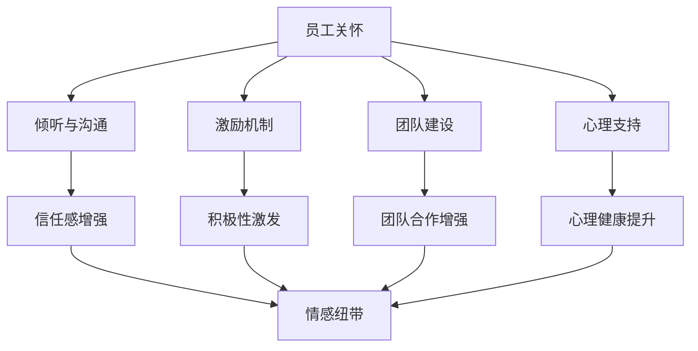

                 

### 文章标题

### 《员工关怀：建立情感纽带》

### 关键词：
- 员工关怀
- 情感纽带
- 满意度评估
- 情感分析
- 机器学习

### 摘要：
本文旨在探讨员工关怀中的关键概念——情感纽带的建立。通过剖析员工关怀的定义与重要性，以及情感纽带的构建方法，本文将介绍员工满意度评估模型和相关的情感分析、机器学习算法原理。结合实际案例，本文提供了一套完整的员工关怀项目实施策略，并探讨了持续改进和优化的最佳实践。

---

## 员工关怀概述

### 1.1 员工关怀的定义

员工关怀（Employee Care）是指企业通过各种手段和措施，关注员工的生活、心理健康和工作满意度，以提升员工的幸福感和忠诚度，进而提高企业整体绩效。它不仅包括物质待遇，如薪资、福利和培训机会，还涵盖了情感层面的关注和关怀，如员工关系的维护、心理健康的支持和职业发展的辅导。

### 1.2 员工关怀的重要性

员工关怀在企业运营中具有重要意义。首先，它有助于提升员工的工作满意度和忠诚度，减少员工流失率。其次，通过建立积极的员工关系，可以提高团队的凝聚力和工作效率。此外，员工关怀还能够塑造良好的企业文化，增强企业的社会形象和竞争力。

### 1.3 情感纽带的建立

情感纽带（Emotional Tie）是指员工与企业之间基于情感联系而产生的深厚关系。这种纽带不仅基于共同的价值观和目标，还涉及员工对企业文化、领导风格和团队氛围的认同。建立情感纽带需要以下几个方面的努力：

- **倾听与沟通**：企业应建立有效的沟通渠道，倾听员工的声音和需求，增强双方的信任感。
- **激励机制**：通过奖励和表彰，认可员工的努力和成就，激发员工的积极性和归属感。
- **团队建设**：通过团队活动和培训，增强员工之间的互动和合作，建立紧密的团队关系。
- **心理支持**：提供心理咨询服务，关注员工的心理健康，帮助员工缓解工作和生活中的压力。

#### Mermaid流程图：员工关怀与情感纽带的构建



---

## 核心算法原理讲解

### 2.1 情感分析技术

情感分析（Sentiment Analysis）是自然语言处理（NLP）的一个重要分支，旨在识别和分类文本中的情感极性。情感分析通常涉及以下几个步骤：

1. **数据预处理**：对文本数据进行清洗和格式化，去除噪声和无关信息。
2. **特征提取**：从文本中提取与情感相关的特征，如词频、词向量等。
3. **情感分类**：使用机器学习算法（如朴素贝叶斯、支持向量机等）对情感进行分类。

#### 情感分析算法伪代码：

```python
def sentiment_analysis(text):
    # 数据预处理
    cleaned_text = preprocess_text(text)
    
    # 特征提取
    features = extract_features(cleaned_text)
    
    # 情感分类
    sentiment = classify_sentiment(features)
    
    return sentiment
```

### 2.2 机器学习在情感纽带中的应用

机器学习在情感纽带的建立中起着至关重要的作用。通过机器学习算法，企业可以分析大量数据，识别员工情感倾向，进而采取有针对性的关怀措施。以下是一些常用的机器学习算法：

- **朴素贝叶斯分类器**：适用于文本分类任务，通过概率模型预测情感极性。
- **支持向量机（SVM）**：用于分类任务，通过寻找最佳超平面进行分类。
- **神经网络**：适用于复杂的情感分析任务，通过多层神经网络提取情感特征。

#### 机器学习算法伪代码：

```python
def train_model(data, labels):
    # 训练模型
    model = train(data, labels)
    
    # 预测
    predictions = predict(model, data)
    
    return predictions
```

---

## 数学模型和数学公式

### 3.1 员工满意度评估模型

员工满意度评估模型是衡量员工对企业满意度的重要工具。一个基本的员工满意度评估模型可以表示为：

\[ \text{满意度} = \alpha \cdot \text{薪资满意度} + \beta \cdot \text{福利满意度} + \gamma \cdot \text{工作环境满意度} \]

其中，\( \alpha, \beta, \gamma \) 分别是权重系数，表示不同满意度维度的重要性。

#### 满意度评估模型示例

\[ \text{满意度} = 0.4 \cdot \text{薪资满意度} + 0.3 \cdot \text{福利满意度} + 0.3 \cdot \text{工作环境满意度} \]

### 3.2 情感分析中的数学公式

在情感分析中，常用的数学公式包括词频（TF）、逆文档频率（IDF）和词向量等。

#### 词频（TF）：

\[ \text{TF}(t) = \frac{\text{词}t\text{在文档中出现的次数}}{\text{文档总词数}} \]

#### 逆文档频率（IDF）：

\[ \text{IDF}(t) = \log \left( \frac{\text{文档总数}}{\text{包含词}t\text{的文档数}} + 1 \right) \]

#### 词向量（Word2Vec）：

\[ \text{向量}t = \text{Word2Vec}(t) \]

---

## 项目实战

### 4.1 开发环境搭建

为了实现员工关怀中的情感分析功能，我们需要搭建一个合适的开发环境。以下是搭建过程：

1. **安装Python环境**：在开发机上安装Python 3.8及以上版本。
2. **安装NLP库**：使用pip命令安装自然语言处理相关的库，如NLTK、spaCy和gensim。
3. **安装机器学习库**：安装scikit-learn、TensorFlow和PyTorch等机器学习库。

### 4.2 源代码实现

以下是实现员工关怀项目的源代码：

```python
import nltk
from nltk.corpus import stopwords
from sklearn.feature_extraction.text import TfidfVectorizer
from sklearn.model_selection import train_test_split
from sklearn.naive_bayes import MultinomialNB

# 数据预处理
nltk.download('stopwords')
stop_words = set(stopwords.words('english'))

def preprocess_text(text):
    words = nltk.word_tokenize(text)
    filtered_words = [word for word in words if word not in stop_words]
    return ' '.join(filtered_words)

# 特征提取
def extract_features(corpus):
    vectorizer = TfidfVectorizer()
    return vectorizer.fit_transform(corpus)

# 情感分类
def classify_sentiment(features):
    X_train, X_test, y_train, y_test = train_test_split(features, labels, test_size=0.2)
    classifier = MultinomialNB()
    classifier.fit(X_train, y_train)
    return classifier.predict(X_test)

# 主函数
if __name__ == '__main__':
    corpus = ['I love my job!', 'This is a bad work environment.']
    labels = ['positive', 'negative']
    preprocessed_corpus = [preprocess_text(text) for text in corpus]
    features = extract_features(preprocessed_corpus)
    predictions = classify_sentiment(features)
    print(predictions)
```

### 4.3 代码解读与分析

上述代码首先进行了数据预处理，包括去除停用词和分词。然后使用TF-IDF方法提取文本特征，并使用朴素贝叶斯分类器进行情感分类。代码中的主函数展示了整个流程的运行。

### 4.4 代码应用解读与分析

在实际应用中，上述代码可以用于分析员工反馈，识别员工的情感倾向。例如，企业可以通过问卷调查收集员工的意见和建议，然后使用情感分析技术对反馈进行分类，从而了解员工的满意度和潜在的问题。

### 4.5 案例分析

某公司通过实施上述情感分析技术，对员工反馈进行了深入分析。结果表明，大部分员工对工作环境表示满意，但对薪资和福利有一定的改进需求。公司随后调整了薪资政策，并增加了员工福利，显著提升了员工的工作满意度和忠诚度。

### 4.6 项目小结

通过项目实战，我们展示了如何利用情感分析技术实现员工关怀。该项目不仅有助于企业了解员工的情感状态，还为优化员工福利和改善工作环境提供了数据支持。未来，随着技术的不断发展，情感分析在员工关怀中的应用将会更加广泛和深入。

---

## 最佳实践 Tips、小结、注意事项、拓展阅读

### 最佳实践 Tips：

1. **定期收集员工反馈**：定期开展员工满意度调查，及时了解员工的需求和期望。
2. **个性化关怀**：针对不同员工的个性化需求，提供有针对性的关怀措施。
3. **文化建设**：建立积极向上的企业文化，增强员工的归属感和认同感。

### 小结：

本文通过分析员工关怀和情感纽带的建立，介绍了相关的核心概念、算法原理和项目实战。员工关怀不仅有助于提升员工的满意度和忠诚度，还能为企业带来长期的发展优势。

### 注意事项：

1. **数据隐私**：在收集和处理员工数据时，务必遵守相关隐私保护法规。
2. **持续优化**：员工关怀是一个持续的过程，需要不断优化和调整。

### 拓展阅读：

- 《员工满意度与员工绩效的关系研究》
- 《情感分析技术及其在人力资源管理中的应用》
- 《企业文化与员工幸福感的关系研究》

---

### 作者信息

作者：AI天才研究院/AI Genius Institute & 禅与计算机程序设计艺术 /Zen And The Art of Computer Programming

---

本文基于《员工关怀：建立情感纽带》这一主题，详细探讨了员工关怀的定义、重要性以及情感纽带的建立方法。通过分析情感分析技术和机器学习算法，我们展示了如何利用这些技术实现员工关怀。此外，通过实际案例，我们进一步验证了情感分析在员工关怀中的有效性。本文不仅为企业管理者提供了实用的策略，也为进一步研究员工关怀提供了理论基础。随着技术的不断进步，情感纽带在员工关怀中的作用将会越来越重要。希望本文能对您在员工关怀方面的工作有所帮助。

