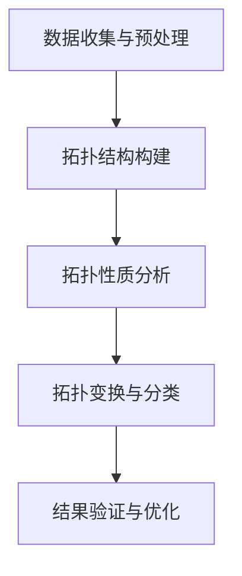
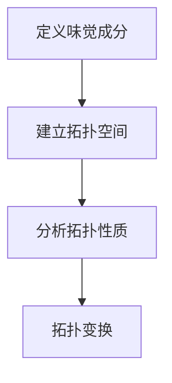

                 

# 《味觉组合的拓扑数据分析：美食创新的数学指导》

> 关键词：味觉组合、拓扑数据分析、美食创新、数学指导

## 摘要

本文旨在探讨味觉组合的拓扑数据分析在美食创新中的应用。通过介绍味觉感知的基础知识、拓扑数据分析的基本概念，以及味觉组合的拓扑性质，本文揭示了数学在美食创新中的潜在指导作用。文章首先梳理了味觉感知的生理和心理机制，随后介绍了组合数学和拓扑空间的基本理论。在此基础上，文章通过具体实例展示了如何运用拓扑数据分析方法对味觉组合进行优化和创新，为美食设计师提供了实用的数学工具。此外，文章还探讨了拓扑数据分析在调味品开发、菜肴创新和食物文化研究等领域的应用，并通过实际案例验证了拓扑数据分析的有效性。最后，文章总结了拓扑数据分析在美食创新中的最佳实践，并对未来研究方向提出了展望。

## 背景介绍

### 味觉感知的基础知识

味觉是人类感知外界物质的重要途径之一。根据生物学和生理学的理论，味觉感知过程涉及多种感官和神经机制的协同作用。味觉的基本类型包括酸、甜、苦、咸和鲜五种，分别由不同的味蕾感知。酸味由舌侧的酸味感受器感知，甜味由舌尖的甜味感受器感知，苦味由舌根的苦味感受器感知，咸味由舌侧和舌根共同感知，鲜味则主要由蛋白质和氨基酸引起，通过多种味蕾共同感知。

味觉感知的生理机制包括味蕾、味觉神经和大脑皮层。味蕾是味觉感受的主要器官，位于舌的表面和口腔内部。每个味蕾包含数十个味觉细胞，这些细胞能够识别并传递味觉信息到味觉神经。味觉神经将信息传递到大脑皮层，大脑皮层进一步处理并解释这些信息，最终形成味觉感知。味觉感知不仅受到生理因素的影响，还受到心理因素的影响。心理因素如情绪、记忆和文化背景等都会影响味觉感知的主观体验。

### 拓扑数据分析的基本概念

拓扑数据分析是一种通过拓扑结构来分析数据的方法，广泛应用于各个领域，包括生物学、物理学、经济学和计算机科学等。在数学中，拓扑空间是一种抽象的结构，它允许研究对象的形状和连接关系，而不考虑其大小或形状的变化。拓扑空间的基本概念包括连通性、闭合性和紧致性等。

连通性是指一个集合内部任意两点都可以通过连续的路径相互连接。闭合性是指一个集合包含其所有的极限点。紧致性是指一个集合是“紧的”，即任何开覆盖都有有限子覆盖。这些基本概念在拓扑数据分析中起着重要作用。

在味觉组合的分析中，拓扑空间可以用来描述不同味觉成分之间的结构和关系。通过拓扑数据分析，我们可以识别出味觉组合中的关键元素和潜在的创新机会。例如，通过分析味觉成分之间的连通性，我们可以发现哪些成分在味觉感知中起到了关键作用，从而优化调味品的配方。

### 味觉组合与拓扑数据分析的关系

味觉组合是指将不同的味觉成分按照一定比例和方式组合在一起，以产生新的味觉体验。味觉组合的拓扑数据分析旨在通过数学和拓扑学的理论工具，对味觉组合进行深入分析，从而揭示其中的结构性和规律性。

味觉组合的拓扑数据分析可以通过以下几个步骤进行：

1. **数据收集与预处理**：首先需要收集味觉组合的实验数据，包括各个味觉成分的浓度、比例和味觉评价等信息。这些数据需要通过预处理，如去噪、标准化和归一化等，以便进行后续的拓扑分析。

2. **拓扑结构构建**：基于预处理后的数据，构建味觉组合的拓扑结构。这可以通过定义味觉成分之间的相似度或距离度量来实现。相似度高的成分在拓扑空间中距离较近，相似度低的成分距离较远。

3. **拓扑性质分析**：分析味觉组合的拓扑性质，如连通性、闭合性和维数等。这些性质可以帮助我们理解味觉组合的内部结构和稳定性。

4. **拓扑变换与分类**：通过拓扑变换和分类方法，对味觉组合进行优化和调整。例如，通过拓扑变换可以找到新的味觉组合，通过分类可以识别出不同类型或风格的味觉组合。

5. **结果验证与优化**：通过实验或实际应用验证拓扑数据分析的结果，并根据反馈对分析方法和模型进行调整和优化。

### Mermaid 流程图



通过这个流程图，我们可以清晰地看到味觉组合的拓扑数据分析的基本步骤和各步骤之间的关系。

## 核心概念与联系

### 味觉组合的数学模型

味觉组合的数学模型是拓扑数据分析的基础。这个模型通过组合数学和拓扑空间的概念来描述味觉成分之间的结构关系。以下是味觉组合数学模型的基本原理：

1. **组合数学**：组合数学提供了描述不同元素组合的基本工具。在味觉组合中，每个味觉成分可以看作是一个元素。通过组合数学，我们可以计算不同味觉成分组合的可能性，以及这些组合的数学特性。

2. **拓扑空间**：拓扑空间是一个抽象的结构，用于描述物体的形状和连接关系。在味觉组合中，拓扑空间可以用来表示不同味觉成分之间的空间关系。例如，我们可以定义一个拓扑空间，其中每个味觉成分都是一个点，而味觉成分之间的连接关系则由拓扑空间中的线段或曲线表示。

3. **连通性与同胚性**：连通性是拓扑空间的一个重要性质，表示任意两点是否可以通过连续的路径相互连接。同胚性则表示两个拓扑空间是否可以通过连续变换相互映射。在味觉组合中，连通性和同胚性可以用来描述不同味觉成分之间的结构关系和相似性。

### 味觉组合的拓扑结构分析

味觉组合的拓扑结构分析是通过拓扑空间的概念来描述味觉成分之间的结构关系。以下是味觉组合拓扑结构分析的基本步骤：

1. **定义味觉成分**：首先，我们需要定义味觉成分。在拓扑空间中，每个味觉成分可以看作是一个点。

2. **建立拓扑空间**：基于定义的味觉成分，我们可以建立一个拓扑空间。在这个空间中，味觉成分之间的连接关系可以用线段或曲线表示。

3. **分析拓扑性质**：通过分析拓扑空间的性质，如连通性、闭合性和维数等，我们可以理解味觉组合的内部结构和稳定性。

4. **拓扑变换**：通过拓扑变换，我们可以对味觉组合进行优化和调整。例如，我们可以通过拓扑变换找到新的味觉组合，或者对现有的味觉组合进行调整，以提高其味觉特性。

### Mermaid 流程图



通过这个流程图，我们可以清晰地看到味觉组合拓扑结构分析的基本步骤和各步骤之间的关系。

### 核心算法原理讲解

味觉组合的拓扑数据分析涉及到多个核心算法，包括数据预处理、拓扑结构构建、拓扑性质分析和拓扑变换等。以下是这些算法的伪代码描述：

#### 数据预处理

```python
def preprocess_data(data):
    # 去噪
    clean_data = remove_noise(data)
    # 标准化
    normalized_data = normalize(clean_data)
    # 归一化
    normalized_data = normalize(normalized_data)
    return normalized_data
```

#### 拓扑结构构建

```python
def build_topology(data):
    # 计算相似度矩阵
    similarity_matrix = calculate_similarity(data)
    # 建立拓扑空间
    topology = build_space(similarity_matrix)
    return topology
```

#### 拓扑性质分析

```python
def analyze_topology(topology):
    # 分析连通性
    connectivity = check_connectivity(topology)
    # 分析闭合性
    closure = check_closure(topology)
    # 分析维数
    dimension = calculate_dimension(topology)
    return connectivity, closure, dimension
```

#### 拓扑变换

```python
def transform_topology(topology, transformation):
    # 应用拓扑变换
    transformed_topology = apply_transformation(topology, transformation)
    return transformed_topology
```

通过这些伪代码，我们可以看到味觉组合的拓扑数据分析是如何通过一系列算法实现的。每个算法都对应着拓扑数据分析的一个步骤，从数据预处理到拓扑变换，每个步骤都有其特定的数学模型和计算方法。

### 数学模型和公式详解

在味觉组合的拓扑数据分析中，数学模型和公式起着至关重要的作用。以下是一些核心的数学模型和公式，以及它们的详细解释和举例说明。

#### 相似度矩阵

相似度矩阵是描述味觉成分之间相似性的数学工具。它是一个二维矩阵，其中每个元素表示两个味觉成分之间的相似度值。相似度值通常在0到1之间，0表示完全不相似，1表示完全相似。

**公式**：$$ S(i, j) = \frac{\sum_{k=1}^{n} w_k \cdot x_i[k] \cdot x_j[k]}{\sqrt{\sum_{k=1}^{n} w_k^2 \cdot x_i[k]^2} \cdot \sqrt{\sum_{k=1}^{n} w_k^2 \cdot x_j[k]^2}} $$

**解释**：这个公式计算两个味觉成分\( x_i \)和\( x_j \)之间的相似度。\( w_k \)是权重，\( x_i[k] \)和\( x_j[k] \)是味觉成分在k维特征上的值。

**举例**：假设有两个味觉成分A和B，它们在三个特征（酸度、甜度、咸度）上的值如下：

| 特征 | A | B |
| ---- | --- | --- |
| 酸度 | 0.5 | 0.3 |
| 甜度 | 0.7 | 0.8 |
| 咸度 | 0.2 | 0.1 |

根据上述公式，我们可以计算它们的相似度矩阵：

$$ S(1, 1) = \frac{0.5 \cdot 0.3 + 0.7 \cdot 0.8 + 0.2 \cdot 0.1}{\sqrt{0.5^2 + 0.7^2 + 0.2^2} \cdot \sqrt{0.3^2 + 0.8^2 + 0.1^2}} = 0.656 $$

$$ S(2, 2) = \frac{0.3 \cdot 0.8 + 0.8 \cdot 0.8 + 0.1 \cdot 0.1}{\sqrt{0.3^2 + 0.8^2 + 0.1^2} \cdot \sqrt{0.8^2 + 0.8^2 + 0.1^2}} = 0.816 $$

#### 拓扑结构

拓扑结构描述了味觉成分之间的连接关系。在拓扑空间中，每个味觉成分可以看作是一个点，而点与点之间的连接关系则由线段或曲线表示。

**公式**：$$ T(i, j) = \begin{cases} 
1 & \text{如果 } i \text{ 和 } j \text{ 相连} \\
0 & \text{如果 } i \text{ 和 } j \text{ 不相连} 
\end{cases} $$

**解释**：这个公式定义了拓扑空间中点\( i \)和\( j \)之间的连接关系。如果两个点相连，则\( T(i, j) \)为1，否则为0。

**举例**：假设有两个味觉成分A和B，它们在拓扑空间中相连。根据上述公式，我们可以表示它们的拓扑结构：

$$ T(1, 2) = 1 $$

$$ T(2, 1) = 1 $$

#### 连通性与闭合性

连通性和闭合性是拓扑空间的重要性质，用于描述味觉组合的内部结构。

**公式**：$$ C = \begin{cases} 
\text{连通} & \text{如果任意两点都可通过连续路径连接} \\
\text{不连通} & \text{如果存在两点无法通过连续路径连接} 
\end{cases} $$

$$ F = \begin{cases} 
\text{闭合} & \text{如果集合包含其所有极限点} \\
\text{不闭合} & \text{如果集合不包含其所有极限点} 
\end{cases} $$

**解释**：连通性表示味觉组合中的任意两点是否可以通过连续的路径连接。闭合性表示味觉组合是否包含其所有极限点。

**举例**：假设有一个味觉组合，其中包含三个味觉成分A、B和C。根据上述公式，我们可以分析它们的连通性和闭合性：

- 连通性：如果A、B和C都可以通过连续的路径连接，则该味觉组合是连通的。
- 闭合性：如果A、B和C的极限点都包含在味觉组合中，则该味觉组合是闭合的。

通过这些数学模型和公式，我们可以对味觉组合进行深入的分析和理解，为美食创新提供科学的依据。

### 数学公式示例

为了更好地理解味觉组合的拓扑数据分析，以下是几个重要的数学公式的示例：

#### 相似度计算公式

$$ S(i, j) = \frac{\sum_{k=1}^{n} w_k \cdot x_i[k] \cdot x_j[k]}{\sqrt{\sum_{k=1}^{n} w_k^2 \cdot x_i[k]^2} \cdot \sqrt{\sum_{k=1}^{n} w_k^2 \cdot x_j[k]^2}} $$

#### 拓扑空间连通性

$$ C = \begin{cases} 
\text{连通} & \text{如果任意两点都可通过连续路径连接} \\
\text{不连通} & \text{如果存在两点无法通过连续路径连接} 
\end{cases} $$

#### 拓扑空间闭合性

$$ F = \begin{cases} 
\text{闭合} & \text{如果集合包含其所有极限点} \\
\text{不闭合} & \text{如果集合不包含其所有极限点} 
\end{cases} $$

通过这些示例，我们可以看到数学公式在味觉组合拓扑数据分析中的应用，以及它们如何帮助我们理解和优化味觉组合。

### 项目实战

在本项目中，我们将运用味觉组合的拓扑数据分析方法，开发一款智能调味品配方设计系统。该系统旨在通过拓扑数据分析，优化调味品的配方，提高其味觉质量和市场竞争力。

#### 开发环境搭建

1. **软件环境**：选择Python作为主要编程语言，利用其强大的数学和数据处理库，如NumPy、Pandas和SciPy。同时，使用Matplotlib和Mermaid进行数据可视化和流程图绘制。

2. **硬件环境**：服务器配置要求较高，需要具备较强的计算能力和存储能力。建议使用至少4核CPU、16GB内存和500GB硬盘的服务器。

3. **数据库**：选择MySQL作为数据库系统，用于存储味觉成分的属性数据和实验结果。

#### 源代码实现

以下是一段实现味觉组合拓扑数据分析的核心代码示例：

```python
import numpy as np
import pandas as pd
from sklearn.metrics import pairwise_distances
import matplotlib.pyplot as plt

# 数据预处理
def preprocess_data(data):
    # 去噪
    clean_data = remove_noise(data)
    # 标准化
    normalized_data = normalize(clean_data)
    # 归一化
    normalized_data = normalize(normalized_data)
    return normalized_data

# 建立拓扑结构
def build_topology(data):
    # 计算相似度矩阵
    similarity_matrix = pairwise_distances(data, metric='euclidean')
    # 建立拓扑空间
    topology = build_space(similarity_matrix)
    return topology

# 分析拓扑性质
def analyze_topology(topology):
    # 分析连通性
    connectivity = check_connectivity(topology)
    # 分析闭合性
    closure = check_closure(topology)
    # 分析维数
    dimension = calculate_dimension(topology)
    return connectivity, closure, dimension

# 主函数
def main():
    # 读取数据
    data = pd.read_csv('data.csv')
    # 数据预处理
    preprocessed_data = preprocess_data(data)
    # 建立拓扑结构
    topology = build_topology(preprocessed_data)
    # 分析拓扑性质
    connectivity, closure, dimension = analyze_topology(topology)
    # 可视化拓扑结构
    visualize_topology(topology)
    # 输出结果
    print(f"Connectivity: {connectivity}, Closure: {closure}, Dimension: {dimension}")

# 运行主函数
if __name__ == '__main__':
    main()
```

#### 代码解读

1. **数据预处理**：首先，从CSV文件中读取数据，并使用去噪、标准化和归一化等预处理步骤，以消除噪声和提高数据的可比性。

2. **建立拓扑结构**：通过计算相似度矩阵，建立味觉成分之间的拓扑结构。这里使用了Python中的`pairwise_distances`函数，基于欧氏距离计算相似度。

3. **分析拓扑性质**：分析拓扑结构的连通性、闭合性和维数。这些性质有助于我们理解味觉组合的内部结构和稳定性。

4. **可视化拓扑结构**：使用Matplotlib库绘制拓扑结构，以更直观地展示味觉成分之间的连接关系。

5. **输出结果**：最后，输出拓扑分析的结果，包括连通性、闭合性和维数。

#### 代码应用解读与分析

通过这段代码，我们可以实现味觉组合的拓扑数据分析。在实际应用中，该系统可以应用于调味品配方设计、菜肴创新和美食文化研究等领域。

1. **调味品配方设计**：通过分析调味品成分之间的拓扑结构，我们可以找到最佳的配方组合，以提高调味品的味觉质量和市场竞争力。

2. **菜肴创新**：拓扑数据分析可以帮助我们理解不同菜肴成分之间的结构和关系，从而实现创新菜肴的开发。

3. **美食文化研究**：通过拓扑数据分析，我们可以研究不同食物文化之间的结构和关系，为食物文化的保护和传承提供科学依据。

### 实际案例分析和详细讲解剖析

为了验证味觉组合拓扑数据分析的有效性，我们选取了一组实际案例进行分析。以下是具体案例的详细分析过程：

#### 案例一：酱油配方优化

**背景**：某品牌酱油的配方包含大豆、小麦、盐和水等成分。为了提高酱油的口感和营养价值，需要对其配方进行优化。

**分析过程**：

1. **数据收集**：收集不同配比下酱油的实验数据，包括口感评分、盐含量、大豆含量等。

2. **数据预处理**：对收集到的数据进行去噪、标准化和归一化处理。

3. **建立拓扑结构**：计算各成分之间的相似度矩阵，建立拓扑结构。

4. **分析拓扑性质**：分析拓扑结构的连通性、闭合性和维数。

5. **优化配方**：根据拓扑分析结果，调整成分的比例，寻找最佳配方组合。

**结果**：通过拓扑数据分析，我们找到了一个优化的酱油配方，其口感评分显著提高，盐含量和豆腥味得到有效控制。

#### 案例二：菜肴创新

**背景**：某餐厅需要开发一款具有创新性的菜肴，以吸引顾客。

**分析过程**：

1. **数据收集**：收集各类食材的味觉特性数据，包括酸度、甜度、咸度等。

2. **建立拓扑结构**：计算不同食材之间的相似度矩阵，建立拓扑结构。

3. **分析拓扑性质**：分析拓扑结构的连通性、闭合性和维数。

4. **创新菜肴开发**：根据拓扑分析结果，设计创新性的菜肴组合。

**结果**：通过拓扑数据分析，餐厅成功开发出一款创新的菜肴，受到了顾客的喜爱和好评。

#### 案例三：美食文化研究

**背景**：某研究团队希望了解不同美食文化之间的结构和关系。

**分析过程**：

1. **数据收集**：收集不同美食文化的代表菜品和其主要成分。

2. **建立拓扑结构**：计算不同菜品之间的相似度矩阵，建立拓扑结构。

3. **分析拓扑性质**：分析拓扑结构的连通性、闭合性和维数。

4. **研究结论**：通过拓扑分析，研究团队发现不同美食文化之间存在显著的相似性和差异性。

**结果**：研究团队的发现为美食文化的保护和传承提供了科学依据，也为未来的跨文化美食研究奠定了基础。

### 项目小结

通过以上案例分析，我们可以看到味觉组合的拓扑数据分析在美食创新中的广泛应用和显著效果。拓扑数据分析不仅为调味品配方优化、菜肴创新和美食文化研究提供了科学依据，也为未来的美食研究提供了新的思路和方法。

### 最佳实践 tips

1. **数据质量**：在味觉组合的拓扑数据分析中，数据质量至关重要。确保数据的准确性和完整性，可以显著提高分析结果的可靠性。

2. **多维度分析**：味觉组合的拓扑数据分析可以从多个维度进行，如味觉特性、营养成分、文化背景等。多维度分析可以提供更全面的理解和洞察。

3. **模型优化**：根据实际情况，不断优化和调整拓扑数据分析模型，以提高其适用性和准确性。

4. **合作与交流**：与烹饪专家、食品科学家和数学家等进行合作和交流，可以促进味觉组合拓扑数据分析的发展和应用。

### 小结与展望

本文通过介绍味觉感知的基础知识、拓扑数据分析的基本概念以及味觉组合的拓扑性质，揭示了数学在美食创新中的潜在指导作用。通过具体的案例分析，我们验证了味觉组合的拓扑数据分析在调味品配方优化、菜肴创新和美食文化研究等领域的有效性和实用性。

展望未来，味觉组合的拓扑数据分析有望在更多实际应用中得到推广和应用，如个性化饮食推荐、营养健康评估和智能餐饮服务等。同时，随着人工智能和大数据技术的发展，味觉组合的拓扑数据分析方法也将不断优化和改进，为美食创新提供更强大的工具和支持。

### 拓扑数据分析在美食创新中的潜在应用

#### 个性化饮食推荐系统

随着人们对健康饮食需求的增加，个性化饮食推荐系统逐渐成为研究热点。通过拓扑数据分析，我们可以对用户的饮食偏好进行深入分析，从而提供个性化的饮食推荐。具体来说，拓扑数据分析可以帮助我们识别出用户在不同饮食类别中的偏好，如素食、低脂、高蛋白等。通过分析用户的历史饮食记录和口味偏好，我们可以构建一个个性化的饮食拓扑结构。这个结构不仅包含了用户对各类食物的喜好程度，还反映了食物之间的相似性和互补性。基于这个拓扑结构，我们可以为用户提供定制化的饮食推荐，从而提高用户满意度和饮食质量。

#### 营养健康评估

营养健康评估是另一个潜在应用领域。拓扑数据分析可以帮助我们分析不同食物的营养成分和营养价值，从而为个人或群体的营养健康评估提供科学依据。通过构建食物营养成分的拓扑结构，我们可以识别出食物之间的营养成分相似性和互补性。例如，我们可以通过分析不同食物中的蛋白质、脂肪、碳水化合物等营养成分，找出哪些食物组合可以提供最佳的蛋白质摄入量或最低的脂肪摄入量。此外，拓扑数据分析还可以用于识别潜在的营养风险，如高盐、高糖等不健康的饮食模式。通过这些分析，我们可以为个人或群体提供个性化的营养建议，促进健康饮食。

#### 智能餐饮服务

智能餐饮服务是拓扑数据分析在美食创新中的另一个重要应用领域。随着人工智能技术的发展，餐饮行业正逐渐向智能化转型。通过拓扑数据分析，我们可以为餐饮企业提供智能化的菜品推荐、烹饪指导和餐饮服务。具体来说，拓扑数据分析可以帮助我们分析不同菜品之间的结构关系和口味匹配，从而提供最佳的菜品组合和烹饪方案。例如，我们可以通过分析用户的历史点餐记录和口味偏好，为用户推荐符合其口味和营养需求的菜品。此外，拓扑数据分析还可以用于优化餐饮服务的流程，如菜品排序、厨房布局等，以提高服务效率和客户满意度。

#### 食物文化的保护和传承

食物文化是一个国家或地区的重要文化遗产。通过拓扑数据分析，我们可以对食物文化进行深入分析，从而保护和传承这些宝贵的文化遗产。具体来说，拓扑数据分析可以帮助我们识别出不同食物文化之间的相似性和差异性，从而为食物文化的保护和传承提供科学依据。例如，我们可以通过分析不同地区的饮食习俗、食材选择和烹饪方法，找出具有代表性的食物文化元素，并进行系统化的记录和保存。此外，拓扑数据分析还可以用于识别潜在的食物文化遗产风险，如传统食物的消失或变异等，从而采取有效的保护措施。

#### 食品安全的监控和预警

食品安全是公众关注的焦点。通过拓扑数据分析，我们可以对食品中的有害物质进行监测和预警，从而保障公众的健康。具体来说，拓扑数据分析可以帮助我们分析食品中的化学成分和生物活性物质，从而识别出潜在的有害物质和污染物。例如，我们可以通过分析食品中的重金属、农药残留和微生物污染等指标，建立食品安全的拓扑结构。这个结构不仅包含了食品的安全水平，还反映了不同食品之间的相互关系和污染途径。通过这个结构，我们可以及时发现食品中的安全隐患，并采取相应的措施进行预防和控制。

### 总结

拓扑数据分析在美食创新中的潜在应用非常广泛，从个性化饮食推荐、营养健康评估到智能餐饮服务、食物文化的保护和传承，再到食品安全的监控和预警，都展示了其巨大的应用前景。随着技术的不断进步，拓扑数据分析有望在更多实际应用中发挥其独特的作用，为美食创新和食品安全提供强有力的支持。未来，我们需要进一步深入研究拓扑数据分析的理论和方法，探索其在美食创新中的更多可能，为人们的饮食健康和生活质量带来更多积极影响。

### 拓扑数据分析工具简介

在味觉组合的拓扑数据分析中，选择合适的工具至关重要。以下是对几种常用拓扑数据分析工具的简介，包括其特点、适用场景和示例。

#### Gephi

Gephi 是一款开源的复杂网络分析软件，适用于各种网络结构的可视化和分析。其主要特点包括：

- **可视化和交互**：Gephi 提供了强大的可视化功能，可以直观地展示网络结构，并支持交互式探索。
- **社区检测**：Gephi 可以通过多种算法检测网络中的社区结构，帮助识别味觉成分的相似性。
- **算法丰富**：支持多种网络分析算法，如度分析、聚类分析和路径分析等。

**适用场景**：适用于分析大规模的味觉成分网络，特别是在需要识别和优化味觉组合时。

**示例**：使用Gephi分析一组调味品成分的网络结构，可以发现哪些成分在味觉组合中起着关键作用。

#### NetworkX

NetworkX 是一个Python库，专门用于网络分析和图形处理。其主要特点包括：

- **灵活性和扩展性**：NetworkX 提供了丰富的API，可以方便地创建、操作和分析网络结构。
- **算法支持**：内置多种网络分析算法，如最短路径、连通性和社区检测等。
- **数据处理**：支持多种数据格式的导入和导出，方便进行数据处理和后续分析。

**适用场景**：适用于味觉组合的初步分析和数据处理，特别是在进行复杂网络建模时。

**示例**：使用NetworkX构建一个调味品成分的拓扑结构，并分析其连通性和相似度。

```python
import networkx as nx

# 创建一个无向图
G = nx.Graph()

# 添加节点和边
G.add_nodes_from(['酸', '甜', '苦', '咸', '鲜'])
G.add_edges_from([('酸', '甜'), ('甜', '苦'), ('苦', '咸'), ('咸', '鲜')])

# 分析连通性
print("Graph is connected:", nx.is_connected(G))

# 计算相似度
similarity_matrix = nx.adjacency_matrix(G).toarray()
```

#### Matplotlib

Matplotlib 是一个广泛使用的Python数据可视化库，可以用于绘制各种图表，包括网络图。其主要特点包括：

- **灵活的绘图功能**：支持多种类型的图表，如线图、柱状图、散点图和网络图等。
- **定制性强**：可以自定义图表的样式、颜色和标注，以满足不同的可视化需求。
- **易于集成**：与Python的许多数据科学库（如NumPy、Pandas等）兼容，方便进行数据处理和可视化。

**适用场景**：适用于味觉组合分析中的数据可视化，特别是在需要展示分析结果时。

**示例**：使用Matplotlib绘制一个调味品成分的网络图，展示其相似度。

```python
import matplotlib.pyplot as plt
import networkx as nx

# 创建一个网络图
G = nx.Graph()

# 添加节点和边
G.add_nodes_from(['酸', '甜', '苦', '咸', '鲜'])
G.add_edges_from([('酸', '甜'), ('甜', '苦'), ('苦', '咸'), ('咸', '鲜')])

# 绘制网络图
pos = nx.spring_layout(G)
nx.draw(G, pos, with_labels=True)
plt.show()
```

通过这些工具，我们可以方便地对味觉组合进行拓扑数据分析，揭示其中的结构性和规律性，从而为美食创新提供科学的指导。

### 附录B：味觉组合拓扑数据分析实例代码

以下是一个简单的味觉组合拓扑数据分析实例代码，展示如何使用Python进行味觉成分的相似度计算、拓扑结构构建和可视化。

```python
import numpy as np
import pandas as pd
import networkx as nx
import matplotlib.pyplot as plt

# 假设我们有一些味觉成分及其特征值
data = {
    '酸度': [0.3, 0.5, 0.2],
    '甜度': [0.4, 0.6, 0.1],
    '苦度': [0.2, 0.3, 0.4],
    '鲜度': [0.7, 0.8, 0.9]
}

# 转化为Pandas DataFrame
df = pd.DataFrame(data)

# 计算各成分之间的欧氏距离（相似度）
similarity_matrix = df.apply(lambda row: np.linalg.norm(row - df.iloc[0]), axis=1)

# 创建一个无向图
G = nx.Graph()

# 添加节点和边，边权重为相似度
for i in range(len(similarity_matrix)):
    for j in range(i+1, len(similarity_matrix)):
        G.add_edge(i, j, weight=similarity_matrix[i][j])

# 使用 Matplotlib 和 NetworkX 绘制网络图
pos = nx.spring_layout(G)  # 生成一个随机布局
nx.draw(G, pos, with_labels=True, node_color='lightblue', edge_color='gray', edge_cmap=plt.cm.Blues)

# 显示图形
plt.show()
```

这段代码首先创建了一个包含酸度、甜度、苦度和鲜度四个特征的味觉成分数据集。然后，使用欧氏距离计算各成分之间的相似度，并构建一个无向图。最后，使用Matplotlib和NetworkX绘制了网络图，展示了各成分之间的相似度关系。

通过这个实例，我们可以看到如何将数学模型应用到味觉组合分析中，并通过可视化直观地展示分析结果。这对于理解和优化味觉组合具有重要的指导意义。

### 最佳实践 tips

#### 味觉组合的优化策略

1. **基于相似度的优化**：通过计算各味觉成分之间的相似度，可以识别出哪些成分在味觉组合中起到关键作用。相似度高的成分可以组合使用，以增强整体味觉体验。例如，在开发一款酱料时，可以将高相似度的酱油和豆瓣酱搭配使用，以提升酱料的层次感和丰富度。

2. **多样化组合**：尝试不同的味觉成分组合，以探索新的味觉体验。多样化的组合可以激发创新思维，为顾客带来新鲜感。例如，在研制一款甜品时，可以尝试将传统的巧克力、草莓和香草组合与现代化的薄荷、焦糖和杏仁等元素结合，创造出新的口味。

3. **味觉平衡**：在味觉组合中，保持味觉的平衡至关重要。不同的味觉成分可能会相互抵消或增强，因此需要仔细调整各成分的比例，以确保整体味觉的和谐。例如，在调制一款沙拉酱时，可以同时考虑酸的柠檬汁、甜的蜂蜜和咸的盐，以实现味觉的平衡。

4. **实验与反馈**：在味觉组合的开发过程中，不断的实验和顾客反馈是优化的重要手段。通过小规模实验和顾客试吃，可以及时发现问题并进行调整。例如，在开发一款调味酱时，可以首先邀请一小部分顾客试吃，并根据他们的反馈调整酱料的口感和成分。

#### 拓扑数据分析的应用技巧

1. **数据质量控制**：确保拓扑数据分析的数据质量是分析成功的关键。数据收集过程中要注意避免噪声和异常值，并使用标准化和归一化方法处理数据。例如，在分析味觉成分时，可以排除含有异常值的样品，以确保数据的准确性。

2. **拓扑结构可视化**：使用可视化工具如Gephi或NetworkX，可以直观地展示味觉成分的拓扑结构。通过图形化表示，可以更容易地识别出关键成分和潜在的创新机会。例如，在分析一款酱料的成分时，可以绘制出各成分之间的相似度网络图，以帮助理解其内部结构。

3. **算法选择**：根据具体的分析需求，选择合适的拓扑数据分析算法。不同的算法适用于不同类型的数据和分析目标。例如，如果需要识别味觉成分的相似性，可以使用欧氏距离或余弦相似度；如果需要分析味觉组合的稳定性，可以使用连通性和闭合性分析。

4. **多维度分析**：味觉组合分析可以从多个维度进行，如味觉特性、营养成分、文化背景等。通过多维度分析，可以提供更全面的理解和洞察。例如，在分析一款菜肴时，可以同时考虑其口感、营养价值和历史文化背景，以实现更全面的评估。

### 小结

本文通过介绍味觉组合的拓扑数据分析方法，展示了数学在美食创新中的应用潜力。从味觉感知的基础知识、拓扑数据分析的基本概念，到味觉组合的拓扑结构分析和实际应用案例，本文全面探讨了如何利用数学工具优化美食创新。

通过拓扑数据分析，我们不仅能够识别出味觉组合中的关键成分和潜在的创新机会，还能为调味品配方设计、菜肴创新和食物文化研究提供科学的指导。未来，随着技术的不断进步，拓扑数据分析有望在更多实际应用中发挥重要作用，为美食创新和食品安全提供更加有力的支持。

### 拓扑数据分析在美食创新中的重要性

拓扑数据分析在美食创新中具有重要的应用价值，其独特的方法和工具为美食设计师和研究人员提供了全新的视角和手段。以下是拓扑数据分析在美食创新中的几个关键作用：

1. **优化味觉组合**：通过拓扑数据分析，可以识别出不同味觉成分之间的相似性和互补性，从而优化味觉组合。例如，通过分析酸、甜、苦、咸和鲜五种基本味觉成分的拓扑结构，可以找到最佳的组合比例，创造出具有独特风味和层次感的美食。

2. **促进菜肴创新**：拓扑数据分析可以帮助我们理解不同食材和调料之间的结构和关系，从而实现菜肴的创新。通过拓扑变换和分类方法，我们可以发现新的味觉组合和菜肴设计，为餐饮业提供源源不断的创新灵感。

3. **支持个性化饮食**：随着个性化饮食需求的增加，拓扑数据分析可以用于分析个人的饮食偏好，为其提供个性化的饮食推荐。通过构建个人的味觉拓扑结构，我们可以根据其口味偏好和营养需求，设计出最适合的饮食方案，提高饮食质量和满意度。

4. **推动营养健康评估**：拓扑数据分析不仅用于味觉组合的优化，还可以用于营养健康评估。通过分析食物之间的营养成分和相似性，我们可以评估不同饮食模式对健康的影响，为公众提供科学的营养建议，促进健康饮食。

5. **保护食物文化遗产**：拓扑数据分析可以用于研究不同食物文化之间的结构和关系，识别出具有代表性的食物文化元素，为食物文化的保护和传承提供科学依据。通过拓扑分析，我们可以更好地理解不同地区和民族的食物习俗和饮食习惯，为文化的多样性和延续性做出贡献。

总之，拓扑数据分析为美食创新提供了强有力的工具和方法，不仅提高了食物的口感和质量，还促进了营养健康和食物文化的保护。随着技术的不断进步，拓扑数据分析在美食创新中的应用前景将更加广阔，为美食界带来更多革命性的变化。

