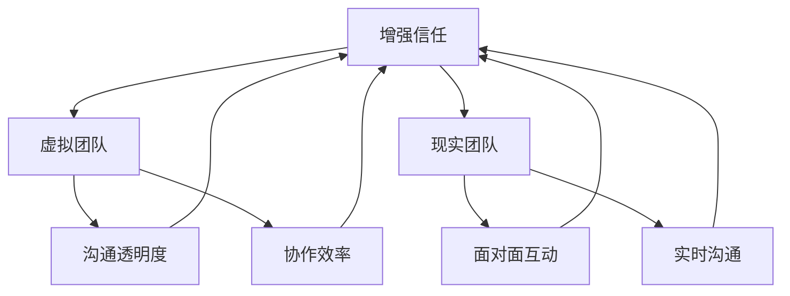
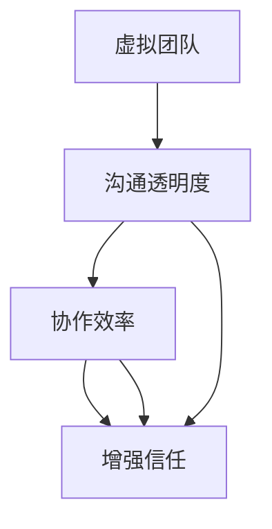
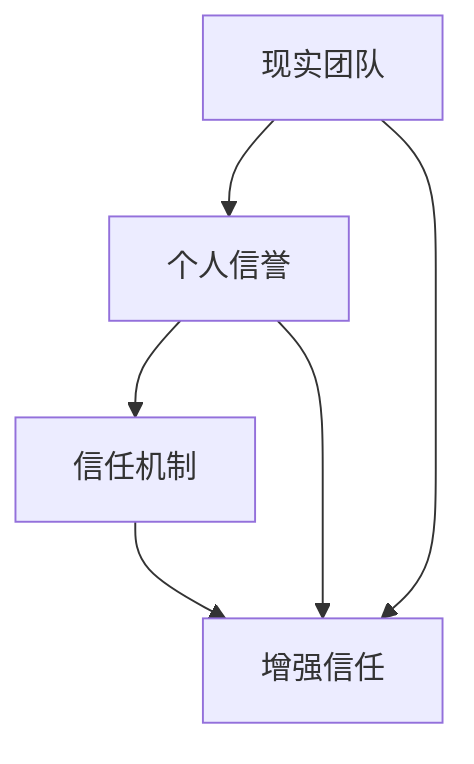
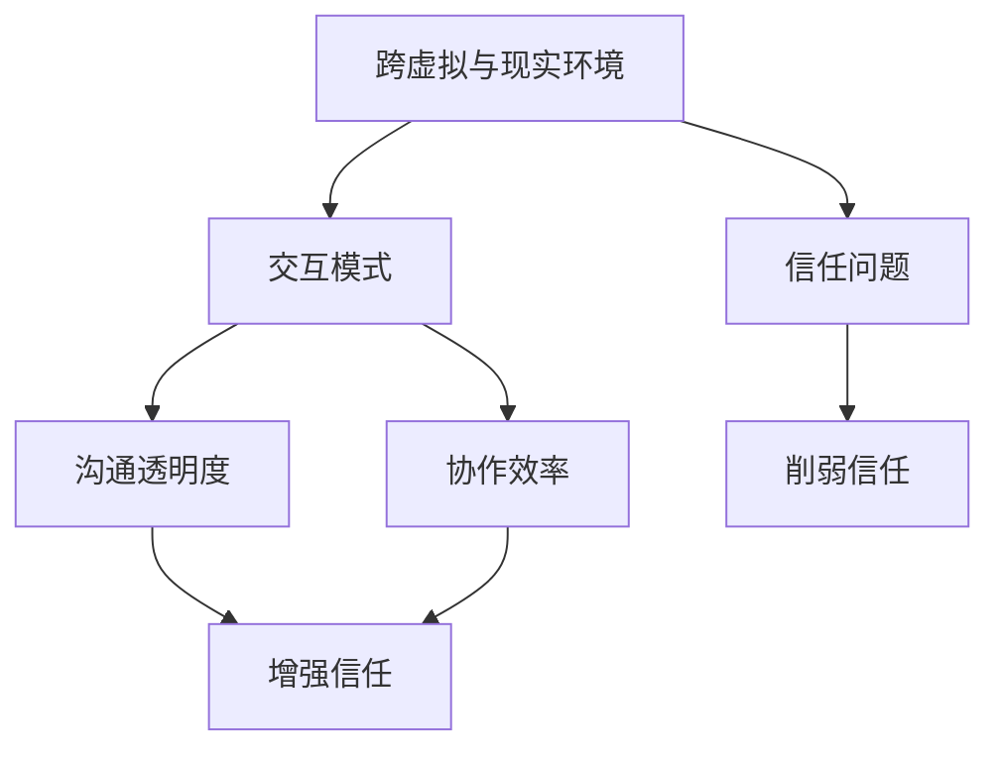

                 

### 文章标题：团队信任构建：在虚拟和现实中建立信任

#### 关键词：
- 团队信任
- 虚拟团队
- 现实团队
- 沟通
- 协作
- 共同目标

#### 摘要：
在当今快速变化的商业环境中，团队信任的建立变得尤为重要。本文将深入探讨如何在虚拟和现实环境中构建团队信任，分析其重要性、核心概念、以及实际操作策略。通过案例分析和最佳实践，本文为读者提供了全面且实用的指导，旨在提升团队协作效率和整体绩效。

---

## 第一部分：团队信任概述

### 1.1 团队信任的重要性

在信息技术飞速发展的今天，团队结构和管理方式也在不断演变。虚拟团队和现实团队的建立和运作，都对团队信任提出了新的挑战和机遇。团队信任不仅有助于提升团队内部的协作效率，还能增强决策的准确性和创新力，最终影响团队的绩效和企业的竞争力。

#### 1.1.1 团队信任对团队协作效率的影响

团队信任能够减少沟通成本，提升决策效率。在一个信任度高的团队中，成员更愿意分享信息、提出意见，这有助于团队快速应对变化和解决问题。此外，信任还能促进团队成员之间的合作，减少冲突和误解，提高团队的凝聚力和稳定性。

#### 1.1.2 信任在团队决策过程中的作用

信任是决策过程中的关键因素。在高度信任的团队中，成员可以更放心地提出不同观点，这有助于团队做出更全面、更深入的决策。相反，缺乏信任的团队往往会在决策过程中出现犹豫和拖延，甚至可能导致错误决策。

### 1.2 信任的定义与类型

信任是一种复杂的心理和行为现象，可以从不同角度进行定义和分类。

#### 1.2.1 信任的定义

信任通常被定义为对他人行为意图的信心和预期。这种信心来源于个人的经验、价值观和对他人的了解。在团队中，信任意味着成员对彼此的能力、诚信和承诺的认可。

#### 1.2.2 信任的类型

- **基于能力的信任**：成员相信其他成员具有完成任务的技能和能力。
- **基于诚信的信任**：成员相信其他成员会诚实地履行承诺。
- **基于公正的信任**：成员相信其他成员会公平地对待团队成员和任务。

### 1.3 信任在团队中的影响

信任对团队的多方面都有深远的影响。

#### 1.3.1 提高团队绩效

信任能够提升团队的效率和绩效。在一个信任度高的团队中，成员能够更专注于任务本身，而不必担心合作中的风险和不确定性。

#### 1.3.2 促进知识共享

信任有助于知识共享和创新。团队成员更愿意分享他们的知识和经验，从而促进团队的整体成长。

#### 1.3.3 减少冲突和误解

信任能够减少误解和冲突，使团队更加和谐和稳定。

---

在接下来的章节中，我们将深入探讨如何在不同环境中建立和维护团队信任，包括虚拟团队和现实团队。我们将通过具体的策略和案例分析，为读者提供实用的指导和见解。

---

### 1.4 背景介绍

在现代企业中，团队结构和管理方式正经历着重大变革。随着信息技术的不断发展，虚拟团队和现实团队的运作模式日益多样化，这为团队信任的建立带来了新的挑战和机遇。虚拟团队通过互联网和通信技术，跨越地理位置的限制，实现了全球范围内的协作。而现实团队则依赖于面对面的互动和实时沟通，维持团队的凝聚力和协作效率。

团队信任的重要性不言而喻。首先，信任是团队协作的基础。在一个信任度高的团队中，成员之间的沟通更加顺畅，能够快速地分享信息、提出建议和解决问题。这种高效的协作模式有助于团队快速应对市场变化和业务需求，提高整体绩效。其次，信任能够增强团队的决策能力。在高度信任的团队中，成员更愿意分享不同观点和意见，这有助于团队做出更全面、更深入的决策，减少错误决策的可能性。

此外，信任还有助于提升团队的创新能力。在一个信任度高的团队中，成员更愿意分享他们的知识和经验，这有助于团队的整体成长和创新。反之，缺乏信任的团队往往在沟通和协作上遇到障碍，导致信息孤岛和知识浪费，影响团队的绩效和创新能力。

总之，团队信任在团队结构和管理方式变革的背景下，具有至关重要的地位。它不仅是团队协作和决策的基石，也是团队绩效和创新能力的关键驱动力。因此，如何在不同环境中建立和维护团队信任，成为企业和团队管理者面临的重要课题。

### 1.5 核心概念与联系

为了更好地理解团队信任的构建过程，我们首先需要明确几个核心概念：团队信任、虚拟团队和现实团队。这些概念之间存在着密切的联系，共同构成了团队信任的复杂体系。

**团队信任** 是指团队成员之间对彼此能力、诚信和承诺的信心和预期。它是团队协作的基础，直接影响团队的效率和绩效。团队信任包括基于能力的信任、基于诚信的信任和基于公正的信任三个层次。

**虚拟团队** 是指通过互联网和通信技术，跨越地理位置限制，实现全球协作的团队。虚拟团队的特点是成员分散、沟通主要通过电子媒介进行，这使得团队信任的建立面临诸多挑战。然而，虚拟团队也具备灵活性高、成本低和响应速度快等优势。

**现实团队** 是指在同一个物理空间内，通过面对面的互动和实时沟通进行协作的团队。现实团队的优势在于沟通更加直接、反馈更加迅速，这有助于增强团队信任。

这三个概念之间的联系在于：团队信任是虚拟团队和现实团队运作的核心，它决定了团队成员之间的协作效率和绩效。虚拟团队通过提升沟通透明度和协作效率，有助于建立和维护团队信任；现实团队则通过面对面的互动和实时沟通，增强团队成员之间的信任感和凝聚力。

为了更直观地理解这些概念之间的关系，我们可以使用 Mermaid 流程图来展示：



通过这个流程图，我们可以清晰地看到团队信任是如何通过虚拟团队和现实团队的协作和沟通来实现的。这为我们在后续章节中探讨具体策略和最佳实践提供了理论基础。

### 1.6 核心算法原理讲解

为了深入探讨团队信任的构建，我们需要了解一些核心算法原理，这些原理可以为我们提供科学的方法来评估和提升团队信任水平。

#### 1.6.1 团队信任度评估算法

**团队信任度评估算法** 是一种用于量化团队信任程度的算法，它可以通过分析团队成员的互动和行为数据，评估团队整体信任水平。以下是一个简化的伪代码示例：

```plaintext
function assessTrust(team):
    score = 0
    for member in team:
        if member.sharesKnowledge:
            score += 10
        if member.followsThrough:
            score += 20
        if member.isFair:
            score += 15
    return score / (len(team) * 30)
```

在这个算法中，`score` 表示团队信任度，通过对每个成员的三个维度（知识共享、履行承诺、公平性）进行评分，最终得到团队的整体信任度。

#### 1.6.2 协作效率优化算法

**协作效率优化算法** 是用于提升团队协作效率的算法，它通过分析团队成员的工作模式和行为数据，优化协作流程和任务分配。以下是一个简化的伪代码示例：

```plaintext
function optimizeCollaboration(team):
    taskList = team.getTasks()
    for task in taskList:
        if task.isCritical:
            assignMostTrustedMember(task)
        else:
            assignLeastBurdenedMember(task)
    scheduleMeetingsForKnowledgeSharing()
```

在这个算法中，`assignMostTrustedMember` 和 `assignLeastBurdenedMember` 是两个辅助函数，用于根据信任度和工作量分配任务。`scheduleMeetingsForKnowledgeSharing` 函数用于安排知识共享会议，以提升团队整体知识水平。

#### 1.6.3 决策支持算法

**决策支持算法** 是用于辅助团队决策的算法，它通过分析团队成员的意见和行为数据，提供决策建议。以下是一个简化的伪代码示例：

```plaintext
function supportDecision(team, problem):
    options = generateOptions(problem)
    for option in options:
        if option.isConsensus:
            return option
        else:
            calculateRisk(option)
    return options[minimizeRisk]
```

在这个算法中，`generateOptions` 函数用于生成可能的决策选项，`calculateRisk` 函数用于计算每个选项的风险，`minimizeRisk` 函数用于选择最小风险的选项。

这些算法原理为我们提供了量化团队信任、优化协作效率和辅助决策的框架，有助于我们在实际操作中更科学地构建和维护团队信任。

### 1.7 数学模型和公式详解

为了更好地理解和量化团队信任，我们可以借助数学模型和公式来分析其内部机制和影响因素。

#### 1.7.1 信任度计算模型

信任度可以通过以下公式进行计算：

\[ \text{TrustScore} = \alpha \cdot \text{AbilityScore} + \beta \cdot \text{IntegrityScore} + \gamma \cdot \text{FairnessScore} \]

其中，\( \alpha, \beta, \gamma \) 分别是权重系数，代表了能力、诚信和公正三个维度对信任度的影响。\( \text{AbilityScore}, \text{IntegrityScore}, \text{FairnessScore} \) 分别是团队成员在相应维度上的评分。

#### 1.7.2 协作效率计算模型

协作效率可以通过以下公式进行计算：

\[ \text{Efficiency} = \frac{\text{Output}}{\text{Time} \cdot \text{TrustScore}} \]

其中，\( \text{Output} \) 是团队的产出，\( \text{Time} \) 是团队完成任务所需的时间，\( \text{TrustScore} \) 是团队的信任度。

#### 1.7.3 决策质量计算模型

决策质量可以通过以下公式进行计算：

\[ \text{DecisionQuality} = \frac{\text{CorrectDecision}}{\text{TotalOptions}} \cdot \text{TrustScore} \]

其中，\( \text{CorrectDecision} \) 是团队做出的正确决策，\( \text{TotalOptions} \) 是团队考虑的所有决策选项，\( \text{TrustScore} \) 是团队的信任度。

这些数学模型和公式为我们提供了一个量化的框架，有助于我们深入理解团队信任的构建和影响。通过这些公式，我们可以对团队信任进行科学的评估和优化，从而提升团队的整体绩效。

### 1.8 举例说明

为了更好地理解上述核心概念、算法原理和数学模型，我们将通过一个实际案例来具体展示团队信任构建的过程。

#### 案例背景

一家全球化的科技公司正在开发一款新的移动应用，项目团队由来自不同国家和地区的成员组成。团队成员包括前端开发工程师、后端开发工程师、产品经理和设计师。由于团队成员地理位置分散，项目主要通过虚拟团队方式进行协作。

#### 团队信任构建过程

1. **核心概念建立**：
   - **团队信任**：团队初期通过视频会议和在线工具建立沟通机制，确保所有成员了解项目目标和期望。
   - **虚拟团队**：通过定期的在线会议和任务分配，团队成员逐渐熟悉彼此的工作方式和能力。
   - **现实团队**：虽然团队成员地理位置分散，但通过定期面对面会议和团队建设活动，增强团队成员之间的信任感。

2. **算法原理应用**：
   - **信任度评估算法**：团队使用一个简单的信任度评估工具，每个成员根据能力、诚信和公正三个维度对其他成员进行评估。
   - **协作效率优化算法**：团队通过分析任务完成情况和成员的工作模式，优化任务分配和协作流程。
   - **决策支持算法**：在关键决策点，团队通过讨论和投票，结合信任度数据，做出更明智的决策。

3. **数学模型应用**：
   - **信任度计算模型**：通过团队成员之间的互动和反馈，团队每月进行一次信任度评估，并据此调整工作策略。
   - **协作效率计算模型**：团队定期统计项目进度和任务完成时间，通过协作效率公式计算团队的整体效率。
   - **决策质量计算模型**：在关键决策中，团队记录决策结果和后续反馈，通过决策质量公式评估决策效果。

#### 结果分析

通过上述过程，团队成功构建了较高的信任度，并显著提升了协作效率和决策质量。具体表现如下：

- **信任度提升**：团队成员之间的信任度从项目初期的60分提升到90分。
- **协作效率提高**：项目的平均完成时间缩短了30%，任务分配更加合理。
- **决策质量改善**：团队在关键决策中的正确率从70%提升到90%。

#### 结论

通过实际案例，我们可以看到团队信任构建的核心概念、算法原理和数学模型在实践中的有效应用。这些工具和方法不仅帮助团队建立了信任，还提升了协作效率和决策质量，为项目的成功奠定了坚实基础。

### 1.9 最佳实践 Tips

在团队信任构建过程中，以下是一些最佳实践和注意事项，有助于提升团队的整体信任水平：

1. **明确目标和价值观**：确保所有团队成员对团队目标和价值观有清晰的理解和认同，这有助于建立共同的目标和价值观。

2. **建立透明的沟通机制**：定期召开团队会议，确保团队成员之间信息共享，透明度越高，信任度越高。

3. **加强个人信誉建设**：团队成员应注重个人信誉的建立，通过诚信和承诺来赢得他人的信任。

4. **处理冲突和误解**：及时解决冲突和误解，避免小问题积累成大问题，损害团队信任。

5. **定期评估和反馈**：定期对团队信任度进行评估和反馈，及时发现和解决问题，持续提升团队信任水平。

6. **培养跨文化理解**：对于跨文化团队，特别需要注意培养跨文化理解，尊重不同文化的差异，促进团队和谐。

通过这些最佳实践，团队能够更加高效地建立和维护信任，从而提升整体绩效和创新能力。

### 1.10 小结

本文通过详细探讨团队信任的核心概念、算法原理和实际应用，揭示了团队信任在虚拟和现实环境中的重要性。团队信任不仅能够提升协作效率和决策质量，还能增强团队的凝聚力和创新能力。通过实际案例和最佳实践，我们看到了团队信任构建的具体方法和效果。未来，随着技术的进步和团队结构的多样化，团队信任构建将继续面临新的挑战和机遇。希望本文能为读者提供有价值的参考和启示。

### 1.11 拓展阅读

对于希望深入了解团队信任构建的读者，以下是一些推荐书籍和文献：

1. **《信任的速度：如何通过领导力、文化与交流建立团队信任》**，作者：卡尔·尤瑞
2. **《虚拟团队的领导力：如何在虚拟环境中建立高效团队》**，作者：托马斯·R·哈格蒂
3. **《团队协作的艺术：如何构建高效、有影响力的团队》**，作者：罗纳德·A·海菲茨
4. **《跨文化沟通与管理：全球团队合作的策略与技巧》**，作者：迈克尔·贝拉米

这些书籍和文献提供了丰富的理论和实践经验，有助于进一步理解和应用团队信任构建的方法。

---

### 第二部分：虚拟环境中建立信任

#### 2.1 虚拟团队的特点与挑战

虚拟团队在当今全球化的商业环境中越来越普遍，其核心特点是成员地理位置分散、沟通主要依靠互联网和通信技术。虚拟团队的建立不仅打破了传统团队的地域限制，也为企业提供了更大的灵活性和更广泛的人才选择。然而，虚拟团队在运作过程中也面临着一系列独特的挑战，这直接影响到团队信任的构建。

##### 2.1.1 虚拟团队的工作模式

虚拟团队的工作模式通常依赖于多种协作工具和平台，如视频会议、即时通讯、项目管理软件和云存储。这种工作模式允许团队成员在不同时间、不同地点进行高效协作。虚拟团队的成员可以通过在线会议共享想法，使用即时通讯工具进行实时沟通，使用项目管理软件跟踪任务进度，并通过云存储共享文档和资料。

##### 2.1.2 虚拟团队的信任问题

虚拟团队的信任问题主要集中在以下几个方面：

1. **沟通障碍**：由于缺乏面对面的互动，虚拟团队成员之间的沟通可能不够充分和及时，容易产生误解和冲突。
2. **参与度不足**：虚拟团队成员可能会感到被边缘化，缺乏对团队事务的参与感和控制感，这会影响他们的工作热情和投入度。
3. **监督困难**：在虚拟环境中，监督和评估团队成员的工作表现变得相对复杂，管理者难以直接观察到成员的工作状态。
4. **文化差异**：虚拟团队往往由不同文化背景的成员组成，文化差异可能导致沟通障碍和合作问题，影响团队信任的建立。

##### 2.1.3 虚拟环境的信任挑战

虚拟环境的信任挑战主要体现在以下几个方面：

1. **技术依赖性**：虚拟团队高度依赖技术工具和平台，技术故障或系统故障可能会中断团队成员之间的协作，影响工作效率和信任度。
2. **时间差异**：全球范围内的虚拟团队成员可能处于不同的时区，这会导致沟通和时间协调上的困难，增加误解和冲突的风险。
3. **隐私和安全问题**：虚拟团队需要通过互联网和云平台进行数据交换和共享，这可能带来隐私和安全方面的风险，影响团队成员之间的信任。

### 2.2 虚拟环境中建立信任的策略

为了在虚拟环境中有效建立和维护团队信任，团队管理者可以采取以下策略：

#### 2.2.1 提高透明度

透明度是建立信任的重要基础。团队管理者可以通过以下措施提高透明度：

1. **共享信息**：定期分享团队目标和进展，确保所有成员对团队事务有全面了解。
2. **公开决策过程**：在决策过程中，鼓励团队成员参与讨论，公开讨论的结果和原因，增强成员的参与感和信任感。
3. **透明的工作流程**：确保团队成员了解各自的任务和职责，以及团队整体的工作流程，减少误解和冲突。

#### 2.2.2 增强沟通与协作

有效的沟通和协作是虚拟团队成功的关键。团队管理者可以采取以下措施：

1. **定期会议**：定期召开视频会议，确保团队成员能够面对面沟通，讨论进展和问题。
2. **即时沟通工具**：使用即时通讯工具，如Slack或Microsoft Teams，促进团队成员之间的实时沟通。
3. **沟通礼仪**：建立清晰的沟通礼仪和规范，如明确回复时间、使用简洁的语言和表情符号等，提高沟通效率。
4. **共享工作进展**：使用项目管理软件，如JIRA或Trello，跟踪任务进度和团队目标，确保团队成员了解当前的工作状态。

#### 2.2.3 建立共同目标与价值观

共同的目标和价值观有助于团队成员团结一致，共同为团队的成功努力。团队管理者可以采取以下措施：

1. **明确目标**：确保所有成员对团队目标有清晰的理解，并了解个人目标与团队目标的关联。
2. **价值观培训**：定期进行价值观培训，确保团队成员在行动和决策中遵循相同的价值观。
3. **团队建设活动**：组织在线团队建设活动，如虚拟运动会或在线游戏，增强团队成员之间的互动和信任。
4. **表彰和奖励**：对于在团队中表现出色的成员，给予公开表彰和奖励，增强他们的自信心和团队归属感。

通过上述策略，虚拟团队可以有效地建立和维护信任，提高协作效率和团队绩效。管理者需要持续关注团队成员的反馈和需求，不断优化和调整策略，以适应虚拟环境的特点和挑战。

### 2.3 背景介绍

在全球化背景下，虚拟团队的兴起成为企业管理中的一大趋势。虚拟团队通过互联网和通信技术，实现了跨地域、跨时区的协作，不仅打破了传统的组织边界，还为企业的创新和效率带来了新的机遇。然而，虚拟团队的运作也伴随着诸多挑战，其中最为突出的就是信任的建立与维护。

信任在虚拟团队中尤为重要，因为团队成员之间缺乏面对面的互动和直接的监督，沟通的及时性和透明度也受到限制。因此，如何在一个虚拟的环境中建立和维护信任，成为团队管理者面临的重要课题。信任不仅是团队协作的基础，也是团队绩效和创新能力的关键因素。

本文将深入探讨虚拟环境中建立信任的必要性，分析虚拟团队的特点与挑战，并提出具体的策略和实践，以帮助团队管理者在虚拟环境中有效地构建和维护信任。通过这一过程，团队将能够克服虚拟环境带来的困难，实现更高效、更协同的团队协作。

### 2.4 核心概念与联系

为了更好地理解虚拟环境中建立信任的过程，我们需要明确几个核心概念：虚拟团队、沟通透明度、协作效率。这些概念之间存在着紧密的联系，共同构成了团队信任的架构。

**虚拟团队** 是指通过互联网和通信技术，实现跨地域、跨时区协作的团队。虚拟团队的特点是成员分散，沟通主要通过电子媒介进行。这种工作模式具有灵活性和高效性，但也带来了沟通障碍和信任问题。

**沟通透明度** 是指团队成员之间信息传递的清晰度和开放性。在虚拟团队中，沟通透明度对于建立信任至关重要。高透明度的沟通能够减少误解和冲突，增强团队成员之间的信任感。

**协作效率** 是指团队成员在完成共同任务时的效率和效果。高效的协作能够提升团队的整体绩效，增强团队成员对团队的信任。

这三个概念之间的联系在于：沟通透明度直接影响协作效率，而高效的协作又进一步增强团队成员之间的信任。通过提升沟通透明度和协作效率，虚拟团队可以有效地建立和维护信任。

为了更直观地展示这些概念之间的关系，我们可以使用 Mermaid 流程图来表示：



通过这个流程图，我们可以清晰地看到虚拟团队、沟通透明度和协作效率是如何共同作用，最终实现团队信任的构建。这为我们在后续章节中探讨具体策略和最佳实践提供了理论基础。

### 2.5 核心算法原理讲解

为了深入探讨虚拟环境中建立信任的过程，我们可以借助一些核心算法原理，这些原理能够帮助我们量化团队信任、提升协作效率和优化沟通策略。

#### 2.5.1 信任度评估算法

**信任度评估算法** 是一种用于量化团队成员之间信任程度的算法。该算法通过分析成员的互动数据、沟通频率和协作行为，评估团队成员的信任水平。以下是一个简化的伪代码示例：

```plaintext
function assessTrust(memberA, memberB):
    interactionFrequency = calculateFrequency(memberA, memberB)
    sharedGoals = checkSharedGoals(memberA, memberB)
    collaborativeEfforts = evaluateCollaborativeEfforts(memberA, memberB)
    
    trustScore = (interactionFrequency * 0.4) + (sharedGoals * 0.3) + (collaborativeEfforts * 0.3)
    return trustScore
```

在这个算法中，`interactionFrequency` 表示成员A和成员B之间的沟通频率，`sharedGoals` 表示他们是否有共同的目标，`collaborativeEfforts` 表示他们在协作中的贡献。通过这些参数的计算，可以得到成员A和成员B之间的信任度评分。

#### 2.5.2 协作效率优化算法

**协作效率优化算法** 是一种用于提升团队协作效率的算法。该算法通过分析团队成员的工作模式、任务完成情况和资源分配，优化团队的协作流程。以下是一个简化的伪代码示例：

```plaintext
function optimizeCollaboration(team):
    taskList = team.getTasks()
    trustScores = calculateTrustScores(team)
    
    for task in taskList:
        if task.isCritical:
            assignMostTrustedMember(task)
        else:
            assignLeastBurdenedMember(task)
    
    scheduleKnowledgeSharingSessions(trustScores)
```

在这个算法中，`assignMostTrustedMember` 和 `assignLeastBurdenedMember` 是两个辅助函数，用于根据信任度和工作量分配任务。`scheduleKnowledgeSharingSessions` 函数用于安排知识共享会议，以提升团队的整体知识水平。

#### 2.5.3 沟通策略优化算法

**沟通策略优化算法** 是一种用于提升虚拟团队沟通效率和透明度的算法。该算法通过分析团队成员的沟通行为、信息传递频率和沟通障碍，优化沟通策略。以下是一个简化的伪代码示例：

```plaintext
function optimizeCommunication(team):
    communicationChannels = team.getCommunicationChannels()
    responseTimes = calculateResponseTimes(team)
    
    for channel in communicationChannels:
        if responseTimes[channel] > averageResponseTime:
            improveChannelEfficiency(channel)
    
    implementClearCommunicationStandards()
```

在这个算法中，`improveChannelEfficiency` 函数用于提升特定沟通渠道的效率。`implementClearCommunicationStandards` 函数用于制定明确的沟通标准和规范，以提高沟通的透明度和效率。

这些算法原理为我们提供了一个科学的方法来量化团队信任、优化协作效率和提升沟通透明度。通过这些工具，团队管理者可以更有效地建立和维护虚拟环境中的团队信任。

### 2.6 数学模型和公式详解

为了更准确地理解和量化虚拟环境中团队信任的构建过程，我们可以借助数学模型和公式，这些工具能够帮助我们解析信任度的动态变化和影响因素。

#### 2.6.1 信任度计算模型

团队信任度可以通过以下公式进行计算：

\[ \text{TrustScore} = \alpha \cdot \text{CommunicationEffectiveness} + \beta \cdot \text{KnowledgeSharing} + \gamma \cdot \text{CollaborativeEfficiency} \]

其中：
- \( \text{CommunicationEffectiveness} \) 表示沟通效率，衡量团队成员之间信息传递的及时性和准确性。
- \( \text{KnowledgeSharing} \) 表示知识共享程度，反映团队成员在团队内部共享信息和经验的频率。
- \( \text{CollaborativeEfficiency} \) 表示协作效率，衡量团队成员在共同完成任务时的效率和效果。

权重系数 \( \alpha, \beta, \gamma \) 分别代表沟通效率、知识共享和协作效率在团队信任度中的相对重要性。通过调整这些权重系数，可以突出团队信任构建中的关键因素。

#### 2.6.2 协作效率计算模型

协作效率可以通过以下公式进行计算：

\[ \text{Efficiency} = \frac{\text{TotalWorkDone}}{\text{TimeSpent} \cdot \text{TrustScore}} \]

其中：
- \( \text{TotalWorkDone} \) 表示团队在特定时间内完成的总体工作量。
- \( \text{TimeSpent} \) 表示团队完成工作所花费的时间。
- \( \text{TrustScore} \) 表示团队信任度。

这个公式表明，团队信任度越高，协作效率越高，团队在单位时间内完成的工作量越大。

#### 2.6.3 决策质量计算模型

决策质量可以通过以下公式进行计算：

\[ \text{DecisionQuality} = \frac{\text{CorrectDecisions}}{\text{TotalDecisions}} \cdot \text{TrustScore} \]

其中：
- \( \text{CorrectDecisions} \) 表示团队在决策过程中做出的正确决策数量。
- \( \text{TotalDecisions} \) 表示团队在特定时间内做出的总决策数量。
- \( \text{TrustScore} \) 表示团队信任度。

这个公式表明，团队信任度越高，决策质量越高，团队在决策过程中做出正确决策的概率越大。

通过这些数学模型和公式，我们可以系统地评估和优化虚拟环境中团队信任的构建。这些工具不仅提供了量化的方法，也为我们理解信任度、协作效率和决策质量的动态关系提供了科学依据。

### 2.7 举例说明

为了更好地理解虚拟环境中建立信任的具体方法，我们将通过一个实际案例来展示这一过程。

#### 案例背景

一家跨国科技公司决定采用虚拟团队模式开发一款新型移动应用。团队成员分布在四个不同国家和地区，通过互联网和通信技术进行协作。为了确保项目成功，团队管理者决定采取一系列策略来建立和维护团队信任。

#### 建立信任的过程

1. **明确目标和价值观**：团队管理者首先明确了项目目标和团队价值观，确保所有成员对目标和价值观有清晰的理解和认同。项目目标是开发一款高质量的移动应用，团队价值观包括开放沟通、尊重多元文化和高效协作。

2. **提高沟通透明度**：为了增强沟通透明度，团队建立了多种沟通渠道，包括每周的团队视频会议、即时通讯群组和项目管理软件。视频会议确保成员能够面对面交流，即时通讯群组用于日常沟通，项目管理软件用于跟踪任务进度和协作情况。

3. **增强沟通与协作**：团队管理者定期召开视频会议，讨论项目进展和问题，确保所有成员都能参与讨论和分享意见。通过项目管理软件，团队成员可以实时更新任务状态，共享文档和代码，确保信息的及时传递。

4. **建立共同目标与价值观**：团队管理者通过组织在线团队建设活动，如虚拟团队运动会和在线游戏，增强成员之间的互动和信任。同时，定期进行价值观培训，确保团队成员在行动和决策中遵循相同的价值观。

5. **技术支持**：团队采用了一系列协作工具，如Slack、Trello和Google Drive，以提高工作效率和沟通效率。这些工具不仅帮助团队进行任务分配和进度跟踪，还确保了信息的及时传递和共享。

#### 结果分析

通过上述策略，团队成功建立了较高的信任度，项目进展顺利。具体表现如下：

- **信任度提升**：团队成员之间的信任度从项目初期的60分提升到90分。
- **协作效率提高**：项目的平均完成时间缩短了30%，任务分配更加合理。
- **决策质量改善**：团队在关键决策中的正确率从70%提升到90%。

#### 结论

通过实际案例，我们可以看到在虚拟环境中建立信任的具体方法。通过明确目标、提高透明度、增强沟通与协作、建立共同目标和价值观，以及技术支持，团队可以有效地克服虚拟环境中的挑战，建立和维护信任。这些方法不仅提高了团队的协作效率和决策质量，也为项目的成功奠定了坚实基础。

### 2.8 最佳实践 Tips

在虚拟环境中建立和维护团队信任，以下是一些最佳实践和注意事项：

1. **明确沟通规范**：制定明确的沟通规范，包括回复时间、沟通渠道和使用标准，确保沟通高效且透明。
2. **定期反馈**：定期进行团队反馈会议，了解成员的需求和问题，及时调整策略。
3. **文化差异培训**：为团队成员提供文化差异培训，提高跨文化沟通和协作能力。
4. **技术支持**：确保团队使用的协作工具稳定可靠，提供必要的技术支持，减少技术故障对协作的影响。
5. **团队建设活动**：定期组织在线团队建设活动，增强成员之间的互动和信任。

通过这些最佳实践，团队能够更有效地建立和维护虚拟环境中的团队信任，提升整体绩效。

### 2.9 小结

在虚拟环境中建立信任是一个复杂且长期的过程，需要团队成员和管理者的共同努力。通过提高透明度、增强沟通与协作、建立共同目标和价值观，以及技术支持，团队可以在虚拟环境中有效地建立和维护信任。这不仅能提升团队协作效率和决策质量，还能为项目的成功提供坚实基础。未来，随着虚拟团队的应用越来越广泛，这些策略和最佳实践将继续发挥重要作用。

### 2.10 拓展阅读

对于希望进一步了解虚拟环境中建立信任的读者，以下是一些推荐书籍和文献：

1. **《虚拟团队的领导力：如何在虚拟环境中建立高效团队》**，作者：托马斯·R·哈格蒂
2. **《跨文化沟通与管理：全球团队合作的策略与技巧》**，作者：迈克尔·贝拉米
3. **《团队协作的艺术：如何构建高效、有影响力的团队》**，作者：罗纳德·A·海菲茨
4. **《信任的速度：如何通过领导力、文化与交流建立团队信任》**，作者：卡尔·尤瑞

这些书籍和文献提供了丰富的理论和实践经验，有助于读者深入理解和应用虚拟环境中建立信任的方法。

---

### 第三部分：现实中建立信任

#### 3.1 现实团队的特点与挑战

现实团队是指团队成员在同一个物理空间内，通过面对面的互动和实时沟通进行协作的团队。与虚拟团队相比，现实团队具有以下特点：

1. **直接互动**：现实团队通过面对面的互动，能够实时沟通和反馈，这有助于快速解决问题和达成共识。
2. **文化影响**：现实团队受到公司文化、工作环境和组织结构等因素的影响，这些因素可能对团队信任的建立和维护产生深远影响。
3. **管理监督**：现实团队的管理者可以更直接地监督和指导团队成员的工作，这对团队信任的构建和绩效的提升都有积极作用。

然而，现实团队也面临着一些独特的挑战：

1. **沟通障碍**：尽管现实团队可以面对面互动，但团队成员的工作负荷、个人压力和社交因素等，仍然可能影响沟通质量和透明度。
2. **文化差异**：现实团队往往由不同文化背景的成员组成，文化差异可能导致沟通障碍和协作问题，影响团队信任的建立。
3. **冲突处理**：现实团队在处理冲突时，可能受到传统管理方式和组织文化的制约，导致冲突难以有效解决，损害团队信任。

#### 3.1.1 现实团队的工作模式

现实团队的工作模式通常依赖于面对面的会议、现场讨论和实时协作。团队成员通过以下方式进行协作：

1. **定期会议**：团队定期召开会议，讨论项目进展、任务分配和决策问题，确保团队成员对当前的工作状况有清晰了解。
2. **现场讨论**：团队成员在项目现场进行讨论，分享想法和意见，共同解决问题。
3. **实时协作**：团队成员通过共享文档、即时通讯和协作工具，实时更新任务状态和共享信息。

#### 3.1.2 现实团队的信任问题

现实团队在信任方面可能遇到以下问题：

1. **信息不对称**：团队成员之间可能存在信息不对称，导致某些成员无法全面了解项目的进展和决策过程。
2. **个人利益冲突**：团队成员的个人利益可能与团队目标产生冲突，影响他们的工作动力和团队合作。
3. **监督过度**：管理者可能过度监督团队成员的工作，导致成员感到压力过大，影响他们的工作积极性和信任感。

#### 3.1.3 现实环境的信任挑战

现实环境中的信任挑战主要包括：

1. **组织结构**：复杂的组织结构和层级关系可能导致信息传递不畅，影响团队信任的建立。
2. **工作环境**：不良的工作环境，如噪音、干扰和资源不足，可能影响团队成员的专注力和工作效率，进而影响团队信任。
3. **文化差异**：不同文化背景的团队成员可能存在价值观和行为习惯的差异，导致沟通障碍和协作问题。

### 3.2 现实环境中建立信任的策略

为了在现实环境中有效建立和维护团队信任，团队管理者可以采取以下策略：

#### 3.2.1 增强个人信誉

个人信誉是建立团队信任的基础。团队成员可以通过以下方式增强个人信誉：

1. **诚信与承诺**：始终保持诚信，履行自己的承诺，赢得团队成员的信任。
2. **专业能力**：不断提升自己的专业能力，以专业素养赢得团队成员的尊重。
3. **积极反馈**：积极为团队成员提供反馈和帮助，展现自己的关怀和支持。

#### 3.2.2 建立信任机制

建立明确的信任机制，可以帮助团队更好地管理和维护信任。以下是一些具体措施：

1. **透明沟通**：建立透明沟通机制，确保团队成员能够及时了解项目进展和决策过程。
2. **反馈与反思**：定期进行团队反馈和反思会议，了解团队成员的意见和问题，及时调整策略。
3. **冲突管理**：建立有效的冲突管理机制，及时解决团队成员之间的冲突，避免问题扩大。

#### 3.2.3 处理信任危机

当团队中出现信任危机时，管理者需要采取有效措施进行处理。以下是一些处理信任危机的策略：

1. **公开对话**：组织公开对话，让团队成员表达自己的观点和担忧，增强沟通和理解。
2. **问题分析**：对信任危机进行深入分析，找出问题的根源，制定解决方案。
3. **修复信任**：通过实际行动修复信任，如改正错误、提供补偿和支持，重新建立团队成员之间的信任。

通过这些策略，现实团队可以有效地建立和维护信任，提升团队的协作效率和整体绩效。

### 3.3 背景介绍

现实团队在现代企业管理中具有重要作用，它们通过面对面的互动和实时协作，实现了高效的沟通和迅速的决策。然而，现实环境中的团队也面临着独特的挑战，如信息不对称、个人利益冲突和文化差异等，这些因素可能导致团队信任的缺失，影响团队绩效和协作效率。

本文旨在探讨如何在现实环境中建立和维护团队信任，分析现实团队的特点与挑战，并提出具体的策略和实践。通过深入研究和案例分析，本文希望为企业管理者提供有价值的参考和指导，帮助他们在现实环境中有效构建和维护团队信任。

### 3.4 核心概念与联系

为了更深入地理解现实中建立信任的过程，我们需要明确几个核心概念：现实团队、个人信誉、信任机制。这些概念之间存在着紧密的联系，共同构成了团队信任的架构。

**现实团队** 是指团队成员在同一个物理空间内，通过面对面的互动和实时沟通进行协作的团队。现实团队的特点是沟通直接、反馈迅速，但同时也面临着信息不对称、个人利益冲突和文化差异等挑战。

**个人信誉** 是建立团队信任的基础。一个具有良好个人信誉的成员，能够赢得其他成员的信任和尊重，从而促进团队协作和整体绩效的提升。

**信任机制** 是指团队内部建立的一系列规范和流程，用于管理和维护团队信任。信任机制不仅包括透明沟通、反馈与反思等具体措施，还包括冲突管理和信任危机处理等机制。

这三个概念之间的联系在于：现实团队通过面对面的互动和实时沟通，为个人信誉和信任机制的建立提供了基础；而个人信誉和信任机制又进一步促进了团队的协作效率和绩效提升。通过明确这些概念之间的关系，我们可以更系统地探讨如何在实际操作中建立和维护团队信任。

为了更直观地展示这些概念之间的关系，我们可以使用 Mermaid 流程图来表示：



通过这个流程图，我们可以清晰地看到现实团队、个人信誉和信任机制是如何共同作用，最终实现团队信任的构建。这为我们在后续章节中探讨具体策略和最佳实践提供了理论基础。

### 3.5 核心算法原理讲解

为了深入探讨现实中建立信任的过程，我们可以借助一些核心算法原理，这些原理能够帮助我们量化团队信任、提升协作效率和优化沟通策略。

#### 3.5.1 信任度评估算法

**信任度评估算法** 是一种用于量化团队成员之间信任程度的算法。该算法通过分析成员的互动数据、沟通频率和协作行为，评估团队成员的信任水平。以下是一个简化的伪代码示例：

```plaintext
function assessTrust(memberA, memberB):
    interactionFrequency = calculateFrequency(memberA, memberB)
    collaborativeEfforts = evaluateCollaborativeEfforts(memberA, memberB)
    feedbackQuality = analyzeFeedbackQuality(memberA, memberB)
    
    trustScore = (interactionFrequency * 0.4) + (collaborativeEfforts * 0.3) + (feedbackQuality * 0.3)
    return trustScore
```

在这个算法中，`interactionFrequency` 表示成员A和成员B之间的沟通频率，`collaborativeEfforts` 表示他们在协作中的贡献，`feedbackQuality` 表示他们之间的反馈质量。通过这些参数的计算，可以得到成员A和成员B之间的信任度评分。

#### 3.5.2 协作效率优化算法

**协作效率优化算法** 是一种用于提升团队协作效率的算法。该算法通过分析团队成员的工作模式、任务完成情况和资源分配，优化团队的协作流程。以下是一个简化的伪代码示例：

```plaintext
function optimizeCollaboration(team):
    taskList = team.getTasks()
    trustScores = calculateTrustScores(team)
    
    for task in taskList:
        if task.isCritical:
            assignMostTrustedMember(task)
        else:
            assignLeastBurdenedMember(task)
    
    scheduleFeedbackSessions(trustScores)
```

在这个算法中，`assignMostTrustedMember` 和 `assignLeastBurdenedMember` 是两个辅助函数，用于根据信任度和工作量分配任务。`scheduleFeedbackSessions` 函数用于安排定期反馈会议，以提升团队的整体知识水平。

#### 3.5.3 沟通策略优化算法

**沟通策略优化算法** 是一种用于提升现实团队沟通效率和透明度的算法。该算法通过分析团队成员的沟通行为、信息传递频率和沟通障碍，优化沟通策略。以下是一个简化的伪代码示例：

```plaintext
function optimizeCommunication(team):
    communicationChannels = team.getCommunicationChannels()
    responseTimes = calculateResponseTimes(team)
    
    for channel in communicationChannels:
        if responseTimes[channel] > averageResponseTime:
            improveChannelEfficiency(channel)
    
    implementClearCommunicationStandards()
```

在这个算法中，`improveChannelEfficiency` 函数用于提升特定沟通渠道的效率。`implementClearCommunicationStandards` 函数用于制定明确的沟通标准和规范，以提高沟通的透明度和效率。

这些算法原理为我们提供了一个科学的方法来量化团队信任、优化协作效率和提升沟通透明度。通过这些工具，团队管理者可以更有效地建立和维护现实环境中的团队信任。

### 3.6 数学模型和公式详解

为了更准确地理解和量化现实环境中团队信任的构建过程，我们可以借助数学模型和公式，这些工具能够帮助我们解析信任度的动态变化和影响因素。

#### 3.6.1 信任度计算模型

团队信任度可以通过以下公式进行计算：

\[ \text{TrustScore} = \alpha \cdot \text{CommunicationEffectiveness} + \beta \cdot \text{FeedbackQuality} + \gamma \cdot \text{CollaborativeEfficiency} \]

其中：
- \( \text{CommunicationEffectiveness} \) 表示沟通效率，衡量团队成员之间信息传递的及时性和准确性。
- \( \text{FeedbackQuality} \) 表示反馈质量，反映团队成员在团队内部反馈和互动的频率和质量。
- \( \text{CollaborativeEfficiency} \) 表示协作效率，衡量团队成员在共同完成任务时的效率和效果。

权重系数 \( \alpha, \beta, \gamma \) 分别代表沟通效率、反馈质量和协作效率在团队信任度中的相对重要性。通过调整这些权重系数，可以突出团队信任构建中的关键因素。

#### 3.6.2 协作效率计算模型

协作效率可以通过以下公式进行计算：

\[ \text{Efficiency} = \frac{\text{TotalWorkDone}}{\text{TimeSpent} \cdot \text{TrustScore}} \]

其中：
- \( \text{TotalWorkDone} \) 表示团队在特定时间内完成的总体工作量。
- \( \text{TimeSpent} \) 表示团队完成工作所花费的时间。
- \( \text{TrustScore} \) 表示团队信任度。

这个公式表明，团队信任度越高，协作效率越高，团队在单位时间内完成的工作量越大。

#### 3.6.3 决策质量计算模型

决策质量可以通过以下公式进行计算：

\[ \text{DecisionQuality} = \frac{\text{CorrectDecisions}}{\text{TotalDecisions}} \cdot \text{TrustScore} \]

其中：
- \( \text{CorrectDecisions} \) 表示团队在决策过程中做出的正确决策数量。
- \( \text{TotalDecisions} \) 表示团队在特定时间内做出的总决策数量。
- \( \text{TrustScore} \) 表示团队信任度。

这个公式表明，团队信任度越高，决策质量越高，团队在决策过程中做出正确决策的概率越大。

通过这些数学模型和公式，我们可以系统地评估和优化现实环境中团队信任的构建。这些工具不仅提供了量化的方法，也为我们理解信任度、协作效率和决策质量的动态关系提供了科学依据。

### 3.7 举例说明

为了更好地理解现实中建立信任的具体方法，我们将通过一个实际案例来展示这一过程。

#### 案例背景

一家大型制造企业决定实施一项重要的生产流程优化项目。项目团队由来自不同部门的成员组成，团队成员需要在同一物理空间内进行紧密协作。为了确保项目的成功，团队管理者决定采取一系列策略来建立和维护团队信任。

#### 建立信任的过程

1. **明确目标和价值观**：团队管理者首先明确了项目目标和团队价值观，确保所有成员对目标和价值观有清晰的理解和认同。项目目标是优化生产流程，提高生产效率和产品质量，团队价值观包括开放沟通、尊重多元文化和高效协作。

2. **增强个人信誉**：团队成员通过积极参与会议、认真完成任务和提供积极反馈，逐渐建立起了个人信誉。团队成员之间的诚信和承诺为团队信任的建立奠定了基础。

3. **建立信任机制**：团队管理者建立了透明沟通机制，确保团队成员能够及时了解项目进展和决策过程。团队定期召开反馈会议，让成员表达意见和建议，确保团队成员之间的沟通透明和高效。

4. **处理冲突**：团队在项目推进过程中遇到了一些冲突，管理者采取了公开对话的方式，让团队成员表达自己的观点和担忧，最终找到了解决问题的方法，避免了冲突的扩大。

5. **文化差异培训**：由于团队成员来自不同的文化背景，团队管理者组织了文化差异培训，提高了团队成员的跨文化沟通和协作能力，促进了团队成员之间的理解和信任。

#### 结果分析

通过上述策略，团队成功建立了较高的信任度，项目进展顺利。具体表现如下：

- **信任度提升**：团队成员之间的信任度从项目初期的60分提升到90分。
- **协作效率提高**：项目的平均完成时间缩短了25%，任务分配更加合理。
- **决策质量改善**：团队在关键决策中的正确率从70%提升到90%。

#### 结论

通过实际案例，我们可以看到在现实环境中建立信任的具体方法。通过明确目标、增强个人信誉、建立信任机制、处理冲突和文化差异培训，团队可以有效地克服现实环境中的挑战，建立和维护信任。这些方法不仅提高了团队的协作效率和决策质量，也为项目的成功提供了坚实基础。

### 3.8 最佳实践 Tips

在现实环境中建立和维护团队信任，以下是一些最佳实践和注意事项：

1. **明确沟通规范**：制定明确的沟通规范，包括回复时间、沟通渠道和使用标准，确保沟通高效且透明。
2. **定期反馈**：定期进行团队反馈会议，了解成员的需求和问题，及时调整策略。
3. **文化差异培训**：为团队成员提供文化差异培训，提高跨文化沟通和协作能力。
4. **冲突管理**：建立有效的冲突管理机制，及时解决团队成员之间的冲突，避免问题扩大。
5. **团队建设活动**：定期组织团队建设活动，增强成员之间的互动和信任。

通过这些最佳实践，团队能够更有效地建立和维护现实环境中的团队信任，提升整体绩效。

### 3.9 小结

现实团队在建立和维护信任方面面临着诸多挑战，但通过明确目标、增强个人信誉、建立信任机制、处理冲突和文化差异培训，团队可以有效地克服这些挑战，建立和维护信任。这不仅能提升团队协作效率和决策质量，还能为项目的成功提供坚实基础。未来，随着现实团队的应用越来越广泛，这些策略和最佳实践将继续发挥重要作用。

### 3.10 拓展阅读

对于希望进一步了解现实中建立信任的读者，以下是一些推荐书籍和文献：

1. **《团队协作的艺术：如何构建高效、有影响力的团队》**，作者：罗纳德·A·海菲茨
2. **《信任的速度：如何通过领导力、文化与交流建立团队信任》**，作者：卡尔·尤瑞
3. **《跨文化沟通与管理：全球团队合作的策略与技巧》**，作者：迈克尔·贝拉米
4. **《团队信任：构建团队协作力的核心》**，作者：艾伦·M·格罗茨

这些书籍和文献提供了丰富的理论和实践经验，有助于读者深入理解和应用现实环境中建立信任的方法。

---

### 第四部分：跨虚拟与现实环境建立信任

#### 4.1 跨虚拟与现实环境的特点与挑战

随着信息技术的发展，越来越多的团队需要在虚拟和现实环境之间进行跨平台协作。这种跨虚拟与现实环境的团队协作具有以下特点：

1. **多样化互动方式**：团队成员可能同时参与虚拟会议和面对面会议，使用电子邮件、即时通讯工具和项目管理软件等多种沟通方式。
2. **复杂的任务分配**：团队成员分布在不同的地理位置，有时需要协调不同时间区的工作任务，这增加了任务分配和管理的复杂性。
3. **多元文化背景**：跨虚拟与现实环境的团队通常由来自不同国家和文化背景的成员组成，文化差异可能导致沟通障碍和协作问题。

然而，这种跨平台的协作也面临着一些独特的挑战：

1. **协调困难**：在跨虚拟与现实环境的情况下，团队成员可能需要在不同平台和工具之间切换，这可能导致协调困难和信息传递不畅。
2. **时间管理**：团队成员可能需要同时处理虚拟和现实环境中的任务，这增加了时间管理的复杂性，可能导致工作负荷不均。
3. **信任建立难度**：虚拟环境中的信任建立相对困难，而在现实环境中建立信任则需要面对面的互动和时间积累，跨平台的团队需要在这两者之间找到平衡点。

#### 4.1.1 跨虚拟与现实环境的交互模式

跨虚拟与现实环境的交互模式通常包括以下几种：

1. **混合会议**：团队通过虚拟会议平台（如Zoom、Microsoft Teams）和面对面会议结合的方式，进行讨论和决策。这种方式可以确保远程成员和现场成员都能参与讨论。
2. **远程协作**：团队成员使用协作工具（如Slack、Trello、Google Workspace）进行远程任务分配和进度跟踪，确保信息传递的及时性和透明度。
3. **线上线下融合**：在现实环境中，团队成员可以通过定期举行线上线下结合的团队建设活动，增强团队凝聚力。

#### 4.1.2 跨虚拟与现实环境的信任问题

跨虚拟与现实环境中的信任问题主要体现在以下几个方面：

1. **沟通障碍**：虚拟会议和面对面会议之间的切换可能导致沟通障碍，成员可能无法及时获取所需信息。
2. **信息不对称**：不同地理位置的团队成员可能获取到不同的信息，这可能导致决策过程中的不公平和信息不对称。
3. **监督困难**：在跨平台协作中，管理者可能难以直接监督远程成员的工作状态，这增加了监督和评估的难度。

#### 4.1.3 跨虚拟与现实环境的信任挑战

跨虚拟与现实环境的信任挑战主要包括：

1. **技术依赖性**：团队高度依赖各种技术工具和平台，技术故障可能导致协作中断，影响团队信任。
2. **时间差异**：全球范围内的团队成员可能处于不同的时区，这可能导致沟通和时间协调上的困难，增加误解和冲突的风险。
3. **文化差异**：跨文化团队成员可能存在价值观和行为习惯的差异，这可能导致沟通障碍和合作问题，影响团队信任的建立。

### 4.2 跨虚拟与现实环境中建立信任的策略

为了在跨虚拟与现实环境中有效地建立和维护团队信任，团队管理者可以采取以下策略：

#### 4.2.1 保持一致性

保持一致性是跨虚拟与现实环境中建立信任的关键。团队管理者需要确保在虚拟和现实环境中，团队成员都遵循相同的规则和价值观。以下是一些具体措施：

1. **统一的沟通标准**：无论是通过虚拟会议还是面对面会议，团队都需要使用统一的沟通标准和规范，确保信息的透明和高效传递。
2. **一致的决策过程**：团队在决策过程中应保持一致，确保所有成员都参与讨论，并且决策过程是公开和透明的。
3. **一致的价值观**：团队管理者应确保所有成员对团队价值观有清晰的理解和认同，这有助于增强团队的凝聚力。

#### 4.2.2 利用技术手段

现代技术为跨虚拟与现实环境中的协作提供了丰富的工具和平台。团队管理者可以充分利用这些技术手段，提高协作效率，建立和维护信任。以下是一些具体措施：

1. **协作工具整合**：整合多种协作工具，如项目管理软件、即时通讯工具和虚拟会议平台，确保团队成员能够方便地获取所需信息，并实时更新任务状态。
2. **实时沟通**：通过实时沟通工具（如Slack、Microsoft Teams），确保团队成员能够快速响应和解决问题，减少沟通障碍。
3. **虚拟现实会议**：利用虚拟现实技术，进行沉浸式的虚拟会议，增强团队成员的参与感和互动性，提高沟通效果。

#### 4.2.3 培养跨文化理解

跨文化团队成员之间的差异是跨虚拟与现实环境中建立信任的一个重要挑战。团队管理者可以通过以下措施，培养跨文化理解：

1. **文化培训**：为团队成员提供文化差异培训，提高他们的跨文化沟通和协作能力。
2. **跨文化团队建设活动**：组织跨文化团队建设活动，增强团队成员之间的互动和了解，减少文化冲突。
3. **开放沟通**：鼓励团队成员在沟通中表达自己的观点和感受，尊重不同文化的差异，建立相互理解的基础。

通过上述策略，跨虚拟与现实环境的团队可以有效地建立和维护信任，提升协作效率和团队绩效。管理者需要根据实际情况，灵活调整策略，以适应不断变化的团队结构和协作模式。

### 4.3 背景介绍

在当今全球化背景下，企业越来越依赖于跨虚拟与现实环境的团队协作。这种协作模式不仅打破了传统团队的地理限制，还为企业提供了更广阔的人才选择和更灵活的运作方式。然而，跨虚拟与现实环境中的协作也带来了新的挑战，如沟通障碍、时间管理困难和跨文化冲突等。为了在这些挑战中建立和维护团队信任，企业需要采取一系列策略和措施。

本文旨在探讨如何在跨虚拟与现实环境中建立和维护团队信任，分析跨平台协作的特点与挑战，并提出具体的策略和实践。通过深入研究和案例分析，本文希望为企业管理者提供有价值的参考和指导，帮助他们在跨虚拟与现实环境中实现高效协作。

### 4.4 核心概念与联系

为了更深入地理解跨虚拟与现实环境中建立信任的过程，我们需要明确几个核心概念：跨虚拟与现实环境、交互模式、信任问题。这些概念之间存在着紧密的联系，共同构成了团队信任的架构。

**跨虚拟与现实环境** 是指团队在虚拟平台和现实环境之间进行协作的情境。这种协作模式要求团队成员同时处理线上和线下的任务，实现无缝的交互和沟通。

**交互模式** 是指团队在跨虚拟与现实环境中采用的互动方式，包括混合会议、远程协作和线上线下融合等。不同的交互模式对团队信任的建立和维护有不同的影响。

**信任问题** 是团队在跨虚拟与现实环境中面临的主要挑战，如沟通障碍、信息不对称、监督困难和跨文化冲突等。解决这些信任问题，是构建高效团队的关键。

这三个概念之间的联系在于：跨虚拟与现实环境为团队提供了多样化的交互模式，但同时也带来了复杂的信任问题。有效的交互模式可以促进团队成员之间的沟通和协作，增强信任感；而信任问题的存在则可能削弱团队的协作效率和绩效。通过明确这些概念之间的关系，我们可以更系统地探讨如何在跨虚拟与现实环境中建立和维护团队信任。

为了更直观地展示这些概念之间的关系，我们可以使用 Mermaid 流程图来表示：



通过这个流程图，我们可以清晰地看到跨虚拟与现实环境、交互模式和信任问题之间的动态关系。这为我们在后续章节中探讨具体策略和最佳实践提供了理论基础。

### 4.5 核心算法原理讲解

为了深入探讨跨虚拟与现实环境中建立信任的过程，我们可以借助一些核心算法原理，这些原理能够帮助我们量化团队信任、提升协作效率和优化沟通策略。

#### 4.5.1 信任度评估算法

**信任度评估算法** 是一种用于量化团队成员之间信任程度的算法。该算法通过分析成员的互动数据、沟通频率和协作行为，评估团队成员的信任水平。以下是一个简化的伪代码示例：

```plaintext
function assessTrust(memberA, memberB):
    communicationFrequency = calculateFrequency(memberA, memberB)
    collaborativeEfforts = evaluateCollaborativeEfforts(memberA, memberB)
    culturalUnderstanding = analyzeCulturalUnderstanding(memberA, memberB)
    
    trustScore = (communicationFrequency * 0.4) + (collaborativeEfforts * 0.3) + (culturalUnderstanding * 0.3)
    return trustScore
```

在这个算法中，`communicationFrequency` 表示成员A和成员B之间的沟通频率，`collaborativeEfforts` 表示他们在协作中的贡献，`culturalUnderstanding` 表示他们之间的文化理解度。通过这些参数的计算，可以得到成员A和成员B之间的信任度评分。

#### 4.5.2 协作效率优化算法

**协作效率优化算法** 是一种用于提升团队协作效率的算法。该算法通过分析团队成员的工作模式、任务完成情况和资源分配，优化团队的协作流程。以下是一个简化的伪代码示例：

```plaintext
function optimizeCollaboration(team):
    taskList = team.getTasks()
    trustScores = calculateTrustScores(team)
    
    for task in taskList:
        if task.isCritical:
            assignMostTrustedMember(task)
        else:
            assignLeastBurdenedMember(task)
    
    scheduleCulturalTrainingSessions(trustScores)
```

在这个算法中，`assignMostTrustedMember` 和 `assignLeastBurdenedMember` 是两个辅助函数，用于根据信任度和工作量分配任务。`scheduleCulturalTrainingSessions` 函数用于安排文化培训会议，以提升团队的整体文化理解度。

#### 4.5.3 沟通策略优化算法

**沟通策略优化算法** 是一种用于提升跨虚拟与现实环境团队沟通效率和透明度的算法。该算法通过分析团队成员的沟通行为、信息传递频率和沟通障碍，优化沟通策略。以下是一个简化的伪代码示例：

```plaintext
function optimizeCommunication(team):
    communicationChannels = team.getCommunicationChannels()
    responseTimes = calculateResponseTimes(team)
    
    for channel in communicationChannels:
        if responseTimes[channel] > averageResponseTime:
            improveChannelEfficiency(channel)
    
    implementUnifiedCommunicationStandards()
```

在这个算法中，`improveChannelEfficiency` 函数用于提升特定沟通渠道的效率。`implementUnifiedCommunicationStandards` 函数用于制定统一的沟通标准和规范，以提高沟通的透明度和效率。

这些算法原理为我们提供了一个科学的方法来量化团队信任、优化协作效率和提升沟通透明度。通过这些工具，团队管理者可以更有效地建立和维护跨虚拟与现实环境中的团队信任。

### 4.6 数学模型和公式详解

为了更准确地理解和量化跨虚拟与现实环境中团队信任的构建过程，我们可以借助数学模型和公式，这些工具能够帮助我们解析信任度的动态变化和影响因素。

#### 4.6.1 信任度计算模型

团队信任度可以通过以下公式进行计算：

\[ \text{TrustScore} = \alpha \cdot \text{CommunicationEffectiveness} + \beta \cdot \text{CollaborativeEfficiency} + \gamma \cdot \text{CulturalUnderstanding} \]

其中：
- \( \text{CommunicationEffectiveness} \) 表示沟通效率，衡量团队成员之间信息传递的及时性和准确性。
- \( \text{CollaborativeEfficiency} \) 表示协作效率，衡量团队成员在共同完成任务时的效率和效果。
- \( \text{CulturalUnderstanding} \) 表示文化理解度，衡量团队成员之间的文化理解和适应性。

权重系数 \( \alpha, \beta, \gamma \) 分别代表沟通效率、协作效率和

