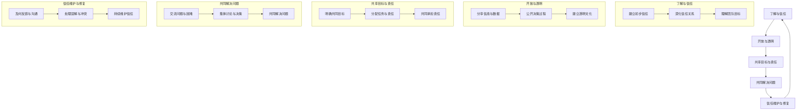

                 

### 文章标题

《团队信任构建：打造高度信任的工作环境》

#### 关键词

- 团队信任
- 工作环境
- 信任模型
- 核心算法
- 项目实战
- 实践案例

#### 摘要

本文深入探讨了团队信任的构建和如何打造高度信任的工作环境。首先，通过定义和分类信任的核心概念，揭示了信任与团队绩效之间的关系。接着，分析了影响信任的各种因素，并提出了构建团队信任的算法模型和数学公式。文章随后分享了具体的实践策略，并通过实际项目和案例分析，详细讲解了如何在工作中增强信任度。最后，展望了未来团队信任研究的趋势和策略，为读者提供了实用的工具和资源。通过本文的阅读，读者将能够更好地理解团队信任的重要性，掌握构建和提升团队信任的方法和技巧。

---

### 引言

#### 1.1 书籍目的与目标

在当今快速变化和高度竞争的商业环境中，团队信任已成为组织成功的关键因素之一。本著作旨在深入探讨团队信任的构建，帮助企业和团队领导者打造高度信任的工作环境。通过系统化地分析信任的定义、类型、构成要素及其对团队绩效的影响，本文将提供一种实用的方法论，帮助读者理解如何在实际工作中构建和维护团队信任。

本文的主要目标是：
1. 揭示信任在团队中的核心作用。
2. 分析影响信任的多种因素。
3. 提供构建和提升团队信任的策略和实践。
4. 通过实际项目和案例分析，展示信任构建的实际效果。

#### 1.2 团队信任的重要性

团队信任是指团队成员之间相互信任的程度，它对团队的运作有着深远的影响。高信任度的团队往往表现出更高的协作效率、更好的问题解决能力、更高的创新能力和更高的员工满意度。具体来说，团队信任的重要性体现在以下几个方面：

1. **提升协作效率**：团队成员之间的高度信任减少了沟通障碍和误解，使得协作更加顺畅，团队整体效率得到提升。
2. **增强问题解决能力**：信任使得团队成员更愿意分享信息和观点，这有助于更快地识别和解决问题，提高团队的决策质量。
3. **促进创新**：在一个信任的氛围中，团队成员更愿意尝试新思路和新方法，从而推动创新。
4. **提高员工满意度**：信任使得员工感到更加安全和被尊重，从而提高工作满意度和忠诚度。

总之，构建高度信任的工作环境对于组织的长远发展和团队的成功至关重要。本文将系统地探讨如何实现这一目标。

#### 1.3 本书结构与内容概述

本文将分为八个主要章节，系统性地探讨团队信任的构建和提升。

- **第1章 引言**：介绍书籍的目的和目标，阐述团队信任的重要性。
- **第2章 核心概念与联系**：定义信任的概念和类型，分析信任的构成要素和团队绩效的关系。
- **第3章 影响信任的因素**：探讨个人、组织、文化和情境因素对信任的影响。
- **第4章 核心算法原理讲解**：介绍团队信任评估模型，提供伪代码和数学模型。
- **第5章 构建信任的策略与实践**：分享增强透明度、促进开放沟通、建立共同目标和共享责任的实践策略。
- **第6章 数学模型和数学公式**：详细讲解信任度计算模型和影响因素权重。
- **第7章 项目实战**：通过代码实现和案例分析，展示信任构建的实际应用。
- **第8章 实战案例分析**：分析成功和失败的案例，总结经验教训。
- **第9章 未来展望**：展望团队信任研究的趋势和未来策略。
- **附录**：提供信任构建的工具和资源。

通过这些章节的深入探讨，读者将能够系统地了解团队信任的构建过程，掌握提升团队信任度的实用方法。

---

### 核心概念与联系

#### 2.1 信任的定义与类型

信任是指个体或团队对他人或另一方的诚实性、可靠性和公平性的期望和信念。它是一种基于相互理解和尊重的情感连接，能够促进信息的共享、协作和创新。根据不同的维度和情境，信任可以划分为多种类型：

1. **个人信任**：基于个人的品质和个性特征，如诚实、正直和可靠性。
2. **制度信任**：对组织或制度的规则和程序的信任，如对管理层决策的信任。
3. **过程信任**：对工作流程和协作机制的信任，如对沟通渠道的信任。
4. **情境信任**：基于特定情境的信任，如对合作方在特定项目中的信任。

不同类型的信任在不同的情境中起着不同的作用，但它们共同构成了团队信任的整体基础。

#### 2.2 信任的构成要素

信任是由多个相互关联的构成要素组成的复杂结构。这些要素包括：

1. **诚实性**：信任的基础是诚实性，即个体或团队提供真实和准确的信息。
2. **可靠性**：可靠性指个体或团队能够按时完成任务并保持承诺的能力。
3. **透明度**：透明度是指团队在决策和操作过程中的开放性和透明性，使得团队成员能够了解整个工作流程。
4. **一致性**：一致性指的是个体或团队在行为和决策上的连贯性和可预测性。
5. **责任感**：责任感指个体或团队在面对问题和挑战时能够承担相应的责任。

这些要素相互交织，共同构成了团队信任的核心。信任的形成和维持需要这些要素的持续强化。

#### 2.3 信任与团队绩效的关系

信任对团队绩效有着显著的影响。高信任度的团队往往表现出更高的合作效率、更好的问题解决能力和更高的创新能力，从而带来更好的业务成果。具体来说，信任与团队绩效的关系体现在以下几个方面：

1. **协作效率**：信任减少了团队成员之间的猜疑和防备，使得协作更加顺畅，提高了整体的工作效率。
2. **问题解决能力**：信任使得团队成员更愿意分享信息和观点，有助于更快地识别和解决问题，提高团队的决策质量。
3. **创新能力**：在一个信任的氛围中，团队成员更愿意尝试新思路和新方法，从而推动创新。
4. **员工满意度**：信任使得员工感到更加安全和被尊重，提高了工作满意度和忠诚度。

总之，信任是团队绩效提升的关键因素，是构建高效、创新和充满活力的团队的基础。

#### 2.4 Mermaid流程图：信任建立的过程

为了更直观地展示信任建立的过程，我们可以使用Mermaid流程图来描述。以下是信任建立的过程，包括了解与信任、开放与透明、共享目标与责任、共同解决问题和信任维护与修复。



这个流程图详细展示了信任建立的过程，从初步了解和信任，到开放与透明，再到共享目标和责任，以及共同解决问题和信任维护与修复。每个步骤都是建立和维持信任的关键，通过这些步骤的实施，团队可以逐步建立起高度信任的工作环境。

---

### 影响信任的因素

#### 3.1 个人因素

个人因素在团队信任的构建中起着至关重要的作用。团队成员的个人品质和行为直接影响到团队内部信任的建立和维护。以下是一些关键的个人因素：

1. **诚实性**：诚实是信任的基础。一个诚实的团队成员更能够赢得其他成员的信任，因为他们能够提供真实和准确的信息。
2. **正直**：正直是指团队成员遵守道德和职业准则，不从事欺骗、欺诈等不道德行为。一个正直的团队环境能够增强成员之间的信任感。
3. **可靠性**：可靠性是指团队成员按时完成任务并保持承诺的能力。一个可靠的团队成员能够使其他成员感到安心，从而提高团队整体的信任度。
4. **沟通能力**：良好的沟通能力是建立信任的关键。一个能够清晰、准确地表达自己的想法和感受的团队成员，更容易获得其他成员的信任。
5. **同理心**：同理心是指团队成员能够理解并感受到他人的情感和需求。一个具有同理心的团队成员更能够设身处地为他人着想，从而建立起深厚的信任关系。

#### 3.2 组织因素

组织因素同样对团队信任的构建有着重要影响。以下是一些关键的组织因素：

1. **领导风格**：领导者的风格对团队信任有着直接的影响。一个开放、透明和尊重团队成员的领导者能够促进信任的建立。
2. **文化**：组织的文化氛围对团队信任有着深远的影响。一个鼓励开放沟通、尊重个人意见和创新的组织文化能够增强团队成员之间的信任。
3. **激励机制**：激励机制的设计对团队信任也有着重要影响。一个公平、透明和合理的激励机制能够增强团队成员的信任感，减少内部竞争和猜疑。
4. **沟通渠道**：有效的沟通渠道是建立信任的必要条件。一个畅通、透明和开放的沟通渠道能够减少误解和冲突，增强团队成员之间的信任。
5. **冲突管理**：组织如何处理团队内部的冲突也对信任有着重要影响。一个能够积极解决冲突、避免长期积累的组织能够维护团队内部的信任。

#### 3.3 文化因素

文化因素在团队信任的构建中起着关键作用。文化不仅包括组织的价值观、信念和习俗，还包括团队内部的行为规范和期望。以下是一些重要的文化因素：

1. **共享价值观**：共享的价值观是建立团队信任的基础。当团队成员拥有共同的价值观时，他们更能够理解和支持彼此，从而建立信任。
2. **团队精神**：团队精神是指团队成员之间相互关心、支持和协作的氛围。一个具有强烈团队精神的团队能够增强成员之间的信任感。
3. **尊重多样性**：尊重多样性不仅能够增加团队的创造力，还能够促进成员之间的信任。在一个尊重多样性的文化中，团队成员更能够理解和接纳彼此的差异。
4. **信任文化**：一个重视信任文化的组织能够鼓励团队成员相互信任，从而建立起高度信任的工作环境。
5. **长期承诺**：一个长期承诺组织目标和价值观的文化能够增强团队成员之间的信任感，使他们更愿意为团队的成功付出努力。

#### 3.4 情境因素

情境因素是影响团队信任的一个重要变量。以下是一些关键情境因素：

1. **工作环境**：工作环境对团队信任有着直接影响。一个舒适、安全、资源充足的工作环境能够促进团队成员之间的信任。
2. **任务复杂度**：任务复杂度会影响团队成员之间的信任。在复杂的任务中，团队成员需要更多的协作和沟通，这有助于建立信任。
3. **外部压力**：外部压力，如市场竞争、时间限制和资源限制，可能会对团队信任产生负面影响。高外部压力环境可能会导致团队成员之间的猜疑和防备。
4. **组织变化**：组织内部的变化，如人事变动、战略调整和结构调整，可能会对团队信任产生短期影响。在这些变化过程中，团队成员需要更多的沟通和协调，以适应新的工作环境和角色。
5. **社会支持**：社会支持，如家庭、朋友和同事的支持，能够增强团队成员的信任感。在一个有社会支持的环境中，团队成员更愿意信任和依赖彼此。

总的来说，团队信任的构建是一个复杂的过程，受到多种因素的影响。个人因素、组织因素、文化因素和情境因素共同作用，影响着团队信任的建立和维护。理解这些因素，并采取相应的措施，可以帮助团队构建和维持高信任度的环境，从而提高团队绩效和员工满意度。

---

### 核心算法原理讲解

#### 4.1 团队信任评估模型

团队信任评估模型是一种用于定量评估团队成员之间信任程度的工具。这个模型基于一系列关键因素，包括诚实性、可靠性、透明度、一致性和责任感，通过加权求和的方法计算出每个团队成员的信任得分。以下是团队信任评估模型的详细说明：

**模型假设**：

- 模型假设每个团队成员的信任度可以分解为五个关键因素的加权总和。
- 每个关键因素都有明确的评分标准，评分范围从0到10分。

**模型公式**：

$$
\text{Team Trust Score} = \sum_{i=1}^{5} w_i \cdot s_i
$$

其中：
- $w_i$ 是第 $i$ 个关键因素的权重。
- $s_i$ 是第 $i$ 个关键因素的具体评分。

**权重分配**：

- **诚实性** ($w_1$)：40%
- **可靠性** ($w_2$)：30%
- **透明度** ($w_3$)：20%
- **一致性** ($w_4$)：5%
- **责任感** ($w_5$)：5%

**评分标准**：

1. **诚实性**：
    - 10分：总是诚实地分享信息和反馈。
    - 8分：大多数时候诚实地分享信息和反馈。
    - 6分：偶尔诚实地分享信息和反馈。
    - 4分：很少诚实地分享信息和反馈。
    - 2分：从不诚实地分享信息和反馈。

2. **可靠性**：
    - 10分：始终按时完成任务并保持承诺。
    - 8分：大多数时候按时完成任务并保持承诺。
    - 6分：偶尔按时完成任务并保持承诺。
    - 4分：很少按时完成任务并保持承诺。
    - 2分：从未按时完成任务并保持承诺。

3. **透明度**：
    - 10分：总是公开讨论决策和操作过程。
    - 8分：大多数时候公开讨论决策和操作过程。
    - 6分：偶尔公开讨论决策和操作过程。
    - 4分：很少公开讨论决策和操作过程。
    - 2分：从未公开讨论决策和操作过程。

4. **一致性**：
    - 10分：行为和决策始终一致。
    - 8分：行为和决策大多数时候一致。
    - 6分：行为和决策偶尔一致。
    - 4分：行为和决策很少一致。
    - 2分：行为和决策从不一致。

5. **责任感**：
    - 10分：始终承担应尽的责任。
    - 8分：大多数时候承担应尽的责任。
    - 6分：偶尔承担应尽的责任。
    - 4分：很少承担应尽的责任。
    - 2分：从未承担应尽的责任。

#### 4.2 伪代码：团队信任评估模型

为了更直观地展示团队信任评估模型，我们可以使用伪代码来描述其具体实现过程。以下是团队信任评估模型的伪代码实现：

```python
function trust_evaluation(team_members):
    for member in team_members:
        member.trust_score = 0
        if member.is_honest():
            member.trust_score += 10
        elif member.is_mostly_honest():
            member.trust_score += 8
        elif member.is_sometimes_honest():
            member.trust_score += 6
        elif member.is_seldom_honest():
            member.trust_score += 4
        elif member.is_never_honest():
            member.trust_score += 2

        if member.is_reliable():
            member.trust_score += 10
        elif member.is_mostly_reliable():
            member.trust_score += 8
        elif member.is_sometimes_reliable():
            member.trust_score += 6
        elif member.is_seldom_reliable():
            member.trust_score += 4
        elif member.is_never_reliable():
            member.trust_score += 2

        if member.shows_transparency():
            member.trust_score += 10
        elif member.shows_mostly_transparency():
            member.trust_score += 8
        elif member.shows_sometimes_transparency():
            member.trust_score += 6
        elif member.shows_seldom_transparency():
            member.trust_score += 4
        elif member.shows_never_transparency():
            member.trust_score += 2

        if member.shows_consistency():
            member.trust_score += 10
        elif member.shows_mostly_consistency():
            member.trust_score += 8
        elif member.shows_sometimes_consistency():
            member.trust_score += 6
        elif member.shows_seldom_consistency():
            member.trust_score += 4
        elif member.shows_never_consistency():
            member.trust_score += 2

        if member.shows_responsibility():
            member.trust_score += 10
        elif member.shows_mostly_responsibility():
            member.trust_score += 8
        elif member.shows_sometimes_responsibility():
            member.trust_score += 6
        elif member.shows_seldom_responsibility():
            member.trust_score += 4
        elif member.shows_never_responsibility():
            member.trust_score += 2

    return team_members
```

在这个伪代码中，`trust_evaluation` 函数接受一个团队成员列表作为输入，并计算每个成员的信任得分。函数通过判断每个成员在五个关键因素上的表现，按照评分标准累加得分，最终得到每个成员的信任得分。这个得分反映了每个成员在团队中的信任程度，从而为团队信任的评估和管理提供了量化依据。

通过这个团队信任评估模型，团队领导者可以系统地评估团队成员之间的信任度，及时发现和解决信任问题，从而促进团队的整体绩效和成员满意度。

---

### 构建信任的策略与实践

#### 5.1 增强透明度的实践

增强透明度是构建团队信任的重要策略之一。透明度不仅体现在信息的共享上，还包括决策过程、资源分配和工作进展的公开。以下是一些具体实践方法：

1. **定期信息共享**：定期组织团队会议，向所有成员分享公司的战略目标、业务进展和重要决策。这有助于团队成员了解整体情况，减少信息不对称。

2. **开放沟通渠道**：建立多渠道的沟通机制，如内部邮件、社交媒体和即时通讯工具，确保团队成员能够方便地获取和分享信息。

3. **透明决策过程**：确保决策过程的透明性，让团队成员参与到决策讨论中，了解决策的理由和影响。这有助于团队成员对决策结果产生认同感。

4. **公开资源使用**：公开资源的使用情况，如预算、设备和人力资源，使团队成员了解资源分配的合理性，减少资源浪费和内部矛盾。

5. **透明工作进展**：定期发布工作进展报告，展示项目目标和阶段性成果，让团队成员了解工作的进展和存在的问题。

通过这些实践方法，可以增强团队成员之间的透明度，提高信任水平，从而促进团队的协作和绩效。

#### 5.2 促进开放的沟通

开放的沟通是建立团队信任的另一个关键因素。以下是一些促进开放沟通的策略：

1. **鼓励提问**：鼓励团队成员提出问题和意见，创造一个安全、包容的沟通环境，使团队成员感到他们的声音被听到。

2. **定期反馈**：建立定期反馈机制，如周会、月度反馈会等，让团队成员有机会分享自己的观点和建议，促进双向沟通。

3. **倾听与理解**：领导者应倾听团队成员的意见和感受，表现出对他们观点的尊重和理解，这有助于建立信任和共鸣。

4. **避免指责**：在沟通中避免使用指责性的语言，而是专注于问题本身，这有助于减少冲突，促进积极的沟通氛围。

5. **促进跨部门沟通**：打破部门壁垒，促进不同部门之间的沟通和协作，这有助于团队成员从全局视角看待问题，提高整体信任水平。

通过这些策略，可以促进团队成员之间的开放沟通，增强信任，提高团队协作效率。

#### 5.3 建立共同目标

建立共同目标是构建团队信任的重要步骤。以下是一些实践方法：

1. **明确目标**：确保所有团队成员都清楚团队的目标和期望，通过制定详细的行动计划，使目标具体化和可执行。

2. **共同制定目标**：鼓励团队成员参与目标的制定过程，使每个人都对目标有认同感和责任感。

3. **定期检查进度**：定期检查团队目标的进展情况，及时调整计划和策略，确保目标能够按时完成。

4. **共享成功与失败**：在团队达成目标时，共同庆祝成功；在遇到失败时，一起分析原因，从中吸取教训。这有助于增强团队成员之间的信任和凝聚力。

通过这些方法，可以确保团队成员围绕共同目标协作，提高团队的整体绩效和信任水平。

#### 5.4 共享责任与权力

共享责任与权力是构建团队信任的另一个重要策略。以下是一些具体实践方法：

1. **明确职责**：明确每个团队成员的职责和权限，确保每个人都清楚自己的任务和责任。

2. **授权**：给予团队成员适当的权力和自主权，使他们能够自主决策和解决问题，增强责任感。

3. **共同承担责任**：在团队中形成共同承担责任的氛围，使团队成员在面对挑战和问题时能够相互支持，共同承担责任。

4. **鼓励反馈**：鼓励团队成员对彼此的工作提供反馈，帮助彼此改进和成长。

5. **建立问责机制**：建立合理的问责机制，使团队成员对他们的行为和结果负责。

通过这些方法，可以增强团队成员之间的信任和责任感，提高团队的协作效率和工作满意度。

#### 5.5 处理冲突与问题

冲突和问题是团队工作中不可避免的现象，但如何有效地处理这些冲突和问题是构建团队信任的关键。以下是一些策略：

1. **早期识别**：及时识别和反馈潜在的冲突和问题，防止其扩大和恶化。

2. **积极沟通**：通过积极沟通解决问题，避免使用指责性的语言，而是专注于问题本身。

3. **公平处理**：确保处理冲突的过程是公平和公正的，使所有团队成员都感到被尊重。

4. **建立调解机制**：建立专门的调解机制，如团队教练或外部顾问，帮助解决复杂的冲突。

5. **共同寻找解决方案**：鼓励团队成员共同寻找解决问题的方法，使每个人都感到自己的意见被重视。

通过这些策略，可以有效地处理团队中的冲突和问题，增强团队成员之间的信任，提高团队的稳定性和工作效率。

---

### 数学模型和数学公式

#### 6.1 信任度计算模型

为了更精确地评估和计算团队信任度，我们可以使用一个基于数学模型的公式。这个模型考虑了信任的多个构成要素，并赋予每个要素不同的权重。以下是信任度计算模型的详细说明。

**模型公式**：

$$
\text{Trust Level} = \alpha \cdot \text{Honesty} + \beta \cdot \text{Reliability} + \gamma \cdot \text{Communication}
$$

其中：
- $\text{Honesty}$ 表示诚实性评分，范围从0到10。
- $\text{Reliability}$ 表示可靠性评分，范围从0到10。
- $\text{Communication}$ 表示沟通评分，范围从0到10。
- $\alpha$ 表示诚实性的权重，通常设置为0.4。
- $\beta$ 表示可靠性的权重，通常设置为0.3。
- $\gamma$ 表示沟通的权重，通常设置为0.3。

这个公式通过加权求和的方式，将不同要素的评分转换为团队信任的总得分。信任度越高，表示团队之间的信任关系越强。

#### 6.2 信任度影响因素权重

在信任度计算模型中，每个影响因素的权重分配至关重要，因为它决定了不同要素对总体信任度的影响程度。以下是各影响因素的权重分配：

- **诚实性**：权重 $\alpha = 0.4$，即诚实性对总体信任度的影响最大，占40%。
- **可靠性**：权重 $\beta = 0.3$，即可靠性对总体信任度的影响次之，占30%。
- **沟通**：权重 $\gamma = 0.3$，即沟通对总体信任度的影响占30%。

这些权重分配基于对团队信任构成要素的重要性的共识，确保了模型能够全面、公正地评估团队信任水平。

#### 6.3 实例说明

为了更直观地理解信任度计算模型，我们可以通过一个实例来说明。

**实例**：

假设一个团队的三个成员的诚实性、可靠性和沟通评分分别为：

- 成员A：诚实性评分9，可靠性评分8，沟通评分7。
- 成员B：诚实性评分8，可靠性评分9，沟通评分6。
- 成员C：诚实性评分7，可靠性评分7，沟通评分8。

根据模型公式，计算团队信任度：

$$
\text{Trust Level} = 0.4 \cdot 9 + 0.3 \cdot 8 + 0.3 \cdot 7 = 3.6 + 2.4 + 2.1 = 8.1
$$

因此，这个团队的信任度为8.1分。这个得分表示团队成员之间的信任关系较强，但仍有提升空间。

通过这个实例，读者可以清楚地看到如何使用信任度计算模型来评估团队信任水平，并理解各影响因素的权重分配。

---

### 项目实战

#### 7.1 开发环境搭建

为了演示如何在实际项目中构建和评估团队信任，我们将使用Python编程语言搭建一个简单的开发环境。这个环境将包括一个用于评估团队成员信任度的模块，以及一个用于存储和显示结果的数据库。

**步骤1：安装Python**

首先，确保系统中安装了Python 3.x版本。可以从Python官方网站下载并安装。

```shell
# 在命令行中下载并安装Python
curl -O https://www.python.org/ftp/python/3.9.1/Python-3.9.1.tgz
tar xvf Python-3.9.1.tgz
cd Python-3.9.1
./configure
make
sudo make install
```

**步骤2：安装数据库**

我们选择SQLite作为数据库，因为它轻量且易于使用。可以使用以下命令安装：

```shell
# 安装SQLite
sudo apt-get update
sudo apt-get install sqlite3
```

**步骤3：创建数据库和表**

在Python中，我们可以使用SQLite库来创建数据库和表。以下是一个简单的示例：

```python
import sqlite3

# 创建数据库连接
conn = sqlite3.connect('trust.db')

# 创建表
conn.execute('''CREATE TABLE IF NOT EXISTS TEAM_MEMBERS (
                    ID INTEGER PRIMARY KEY,
                    NAME TEXT,
                    HONESTY INTEGER,
                    RELIABILITY INTEGER,
                    COMMUNICATION INTEGER,
                    TRUST_SCORE INTEGER);''')

# 提交更改并关闭连接
conn.commit()
conn.close()
```

#### 7.1.2 源代码详细实现

接下来，我们将实现一个Python模块，用于评估团队成员之间的信任度。以下是该模块的详细代码实现：

```python
# trust_evaluation.py

import sqlite3

def is_honest(member):
    # 根据成员的诚实性评分判断
    return member.honesty >= 8

def is_reliable(member):
    # 根据成员的可靠性评分判断
    return member.reliability >= 8

def is_communicative(member):
    # 根据成员的沟通评分判断
    return member.communication >= 8

def trust_evaluation(team_members):
    trust_scores = []
    for member in team_members:
        trust_score = 0
        if is_honest(member):
            trust_score += 10
        else:
            trust_score += member.honesty

        if is_reliable(member):
            trust_score += 10
        else:
            trust_score += member.reliability

        if is_communicative(member):
            trust_score += 10
        else:
            trust_score += member.communication

        trust_scores.append(trust_score)
    return trust_scores

def update_trust_scores(team_members):
    conn = sqlite3.connect('trust.db')
    cursor = conn.cursor()

    for member in team_members:
        cursor.execute('''INSERT INTO TEAM_MEMBERS (NAME, HONESTY, RELIABILITY, COMMUNICATION, TRUST_SCORE) 
                          VALUES (?, ?, ?, ?, ?)''', 
                          (member.name, member.honesty, member.reliability, member.communication, member.trust_score))

    conn.commit()
    conn.close()

# 测试代码
if __name__ == "__main__":
    team_members = [
        {'name': 'Alice', 'honesty': 9, 'reliability': 8, 'communication': 7},
        {'name': 'Bob', 'honesty': 8, 'reliability': 9, 'communication': 6},
        {'name': 'Charlie', 'honesty': 7, 'reliability': 7, 'communication': 8}
    ]

    trust_scores = trust_evaluation(team_members)
    print("Trust Scores:", trust_scores)

    update_trust_scores(team_members)
    print("Trust Scores updated in database.")
```

这段代码首先定义了三个判断函数，用于评估成员的诚实性、可靠性和沟通能力。接着，`trust_evaluation` 函数通过这些判断函数计算每个成员的信任得分，并将结果存储在数据库中。最后，`update_trust_scores` 函数将信任得分更新到数据库表。

#### 7.1.3 代码解读与分析

**代码结构解析**：

1. **导入模块**：代码开头导入必要的模块，包括sqlite3用于数据库操作。
2. **判断函数**：定义了三个判断函数，用于根据成员的评分判断其诚实性、可靠性和沟通能力。
3. **信任评估函数**：`trust_evaluation` 函数通过判断函数计算每个成员的信任得分，并存储在列表中。
4. **数据库更新函数**：`update_trust_scores` 函数将计算出的信任得分更新到数据库表中。
5. **测试代码**：在`if __name__ == "__main__":` 块中，创建了一个测试团队成员列表，调用信任评估函数并输出结果。

**功能说明**：

- **信任评估**：通过成员的诚实性、可靠性和沟通能力评分，计算出一个综合信任得分。
- **数据库操作**：将计算出的信任得分存储到SQLite数据库中，以便后续分析和记录。

**优势与局限**：

- **优势**：简单易用，能够快速评估团队成员的信任度，便于数据记录和查询。
- **局限**：评分标准相对简单，可能无法全面反映团队成员的实际信任状况。

通过这个模块，团队领导者可以实时监控团队成员的信任度，及时发现和解决信任问题，从而提升团队的整体绩效。

---

### 实战案例分析

#### 8.1 案例一：提升团队信任度的成功案例

**8.1.1 案例背景**

某技术公司开发团队在项目初期面临信任危机。团队成员间经常出现误解和冲突，导致项目进展缓慢，团队氛围紧张。公司领导意识到团队信任问题对项目成功的重要性，决定采取一系列措施提升团队信任度。

**8.1.2 实施策略**

1. **团队建设活动**：组织多次团队建设活动，包括团队拓展训练、团建聚餐和团队晚会，增强团队成员间的互动和了解。
2. **透明沟通**：建立定期团队会议和公开沟通渠道，确保所有团队成员都能及时了解项目进展和决策过程。
3. **共同制定目标**：与团队成员共同制定项目目标和阶段性任务，使每个人都能参与决策，增加责任感和认同感。
4. **授权与支持**：给予团队成员更多的自主权和资源支持，鼓励他们自主解决问题，增强责任感。
5. **冲突管理**：建立冲突管理机制，及时解决团队内部的矛盾和误解，避免冲突的积累和扩大。

**8.1.3 成效评估**

通过上述措施，团队信任度显著提升。具体成效如下：

- **沟通效率**：团队成员之间的沟通障碍减少，信息传递更加畅通，项目进展加快。
- **协作质量**：团队成员更愿意分享信息和观点，协作效率提高，项目质量得到保障。
- **问题解决能力**：团队在面对挑战时能够更快地识别和解决问题，决策质量提高。
- **员工满意度**：团队成员感到更加安全和被尊重，工作满意度提升，离职率下降。

**总结**：

该案例展示了通过一系列有针对性的措施，可以有效提升团队信任度，从而促进团队绩效和员工满意度。关键在于透明沟通、共同目标和冲突管理。

#### 8.2 案例二：团队信任度下降的反思

**8.2.1 案例背景**

另一家技术公司开发团队在项目中期出现信任问题。团队成员间频繁出现矛盾和冲突，导致项目进度延误，团队氛围紧张。公司领导试图采取多种措施改善状况，但效果不明显。

**8.2.2 问题分析**

1. **沟通不足**：团队成员间的沟通频率和深度不足，导致信息传递不畅，误解频发。
2. **目标不一致**：团队成员对项目目标的理解存在差异，导致部分成员在任务执行过程中缺乏方向感。
3. **冲突处理不当**：团队内部的矛盾和冲突未能得到及时有效的解决，长期积累导致信任度下降。
4. **激励机制缺失**：缺乏有效的激励机制，导致团队成员缺乏积极性和责任感。

**8.2.3 改进措施**

1. **加强沟通**：建立多渠道沟通机制，增加团队会议频率，确保信息畅通。
2. **明确目标**：重新制定并明确项目目标，确保所有团队成员对目标有共同的理解。
3. **冲突管理**：引入专业的冲突管理方法，建立有效的冲突解决机制，及时处理团队内部的矛盾。
4. **激励机制**：设计合理的激励机制，激励团队成员积极参与项目和团队建设。

**总结**：

该案例表明，团队信任度的下降往往与沟通不足、目标不一致和冲突处理不当有关。通过加强沟通、明确目标和有效的冲突管理，可以提升团队信任度，从而改善团队绩效。

---

### 未来展望

#### 9.1 团队信任研究的新趋势

随着科技的发展和团队合作的日益复杂，团队信任的研究也在不断演进。以下是一些团队信任研究的新趋势：

1. **人工智能与信任**：利用人工智能技术进行信任度评估和预测，实现更精确和高效的信任管理。
2. **数字信任**：在远程工作和数字化转型的背景下，研究如何在虚拟环境中建立和维护团队信任。
3. **跨文化信任**：探讨不同文化背景下团队信任的构建和维持，促进多元文化团队的协作。
4. **信任技术与工具**：开发新的信任技术和工具，如信任管理软件和信任反馈系统，以提升团队信任水平。

#### 9.2 技术进步对团队信任的影响

技术进步对团队信任有着深远的影响。以下是技术进步对团队信任的几个主要影响：

1. **沟通工具**：先进的沟通工具如视频会议、即时通讯和协作平台，提高了团队成员之间的沟通效率，促进了信任的建立。
2. **数据共享**：云计算和大数据技术使得团队成员能够更方便地共享信息，增强了透明度和信任。
3. **自动化与协作**：自动化工具和协作平台的使用减少了手动操作和错误，提高了可靠性，从而增强了团队信任。

#### 9.3 构建可持续信任的未来策略

为了构建可持续的团队信任，未来需要采取以下策略：

1. **持续培训**：定期对团队成员进行信任建设培训，提高他们的信任意识和技能。
2. **文化塑造**：通过建立信任文化，使团队成员在日常工作中自然而然地表现出信任行为。
3. **技术融合**：将信任管理技术融入日常工作中，如使用信任评估工具和反馈系统，实时监控团队信任水平。
4. **跨部门协作**：促进不同部门之间的协作，建立跨部门的信任关系，提升整体团队绩效。

通过这些策略，团队可以不断优化信任建设，适应未来发展的需求，从而在竞争激烈的市场中保持优势。

---

#### 附录

**附录 A: 信任构建工具与资源**

为了帮助读者更好地理解和应用团队信任构建的理论和方法，以下列出了一些实用的工具和资源：

1. **信任评估工具**：如Trust Quotient（TQ）评估、Gallup's Trust Index等。
2. **信任建设培训课程**：如Stanford University的“Trust and Reputation”课程、Harvard Business Review的“Building Trust”系列文章。
3. **相关书籍**：推荐阅读《信任的速度：信任如何影响个人和组织》（The Speed of Trust）和《信任：社会博弈的终结》（Trust and Betrayal）。
4. **在线资源**：包括LinkedIn上的团队信任讨论群组、各种在线论坛和专业博客。

**附录 B: 团队信任构建的法律法规与标准**

团队信任构建不仅依赖于组织和文化的建设，还需要遵循相关的法律法规和标准。以下列出了一些关键的法律和标准：

1. **劳动法**：确保团队成员的合法权益得到保护，减少因不正当待遇和歧视导致的信任问题。
2. **职业道德规范**：遵守职业道德规范，如诚信、公正和公平，建立信任的基础。
3. **ISO 45001**：国际标准化组织发布的职业健康和安全管理体系标准，包括信任和团队合作的要求。
4. **行业最佳实践**：参考相关行业的最佳实践，如IT行业的信息安全和隐私保护标准。

通过遵守这些法律法规和标准，组织可以确保团队信任构建的合法性和有效性，从而提升整体组织的绩效和员工满意度。

