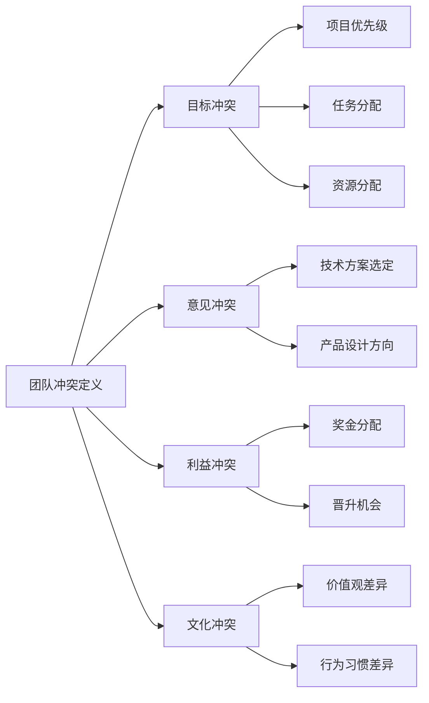

                 


### 文章标题：团队冲突管理：将分歧转化为机遇

### 关键词：团队冲突，管理，分歧，机遇，协作，算法，实践，挑战

### 摘要：
在团队协作中，冲突是不可避免的。本文旨在探讨如何通过科学的管理方法，将团队中的分歧转化为机遇，提升团队整体绩效。我们将从核心概念、算法原理、数学模型、项目实战、管理方法、挑战与应对策略等方面进行深入分析，并给出具体的实施建议。

----------------------------------------------------------------

### 引言

在IT行业，团队协作是推动项目进展的关键。然而，在高度复杂的软件开发过程中，团队成员之间难免会产生分歧。这些分歧可能源于技术观点的不同、个人工作风格差异、项目目标理解偏差等多种因素。如果处理不当，这些冲突可能会导致项目延误、团队士气低落，甚至影响企业的整体运营。因此，如何有效管理团队冲突，将分歧转化为机遇，成为了每个团队领导者和项目管理者必须面对的挑战。

本文将从以下几个方面展开讨论：

1. **核心概念与联系**：介绍团队冲突的定义、类型及其影响。
2. **核心算法原理讲解**：解析冲突分析算法与解决算法。
3. **数学模型和数学公式讲解**：阐述冲突分析的数学模型及公式。
4. **项目实战**：通过实际案例展示冲突管理的具体应用。
5. **团队冲突管理的方法与实践**：探讨有效的冲突管理策略和工具。
6. **团队冲突管理的挑战与应对策略**：分析冲突管理的难点及解决方案。
7. **未来展望与趋势**：预测团队冲突管理的未来发展方向。

通过以上内容，我们希望能为读者提供一套系统化的团队冲突管理方法论，帮助他们在实际工作中更好地应对冲突，提升团队协作效率。

### 核心概念与联系

#### 团队冲突的定义

团队冲突是指在团队内部，成员之间因为目标、意见、利益等方面的不一致而产生的争执和对抗。冲突可以分为显性和隐性两种形式。显性冲突通常表现为言语上的直接对抗或行为上的对立，而隐性冲突则可能通过消极怠工、工作效率降低等形式表现出来。无论是显性冲突还是隐性冲突，都可能会对团队的正常运行造成负面影响。

#### 团队冲突的类型

团队冲突根据性质和表现形式的不同，可以分为以下几种类型：

1. **目标冲突**：当团队成员对项目的目标有不同的理解和预期时，容易产生目标冲突。这种冲突通常与项目优先级、任务分配和资源分配有关。
2. **意见冲突**：在团队讨论过程中，成员可能因为对某一问题的看法不同而产生意见冲突。这种冲突往往涉及到技术方案的选定、产品设计方向等。
3. **利益冲突**：当团队成员之间因为个人利益分配不均而产生冲突时，即为利益冲突。这种冲突可能源于奖金分配、晋升机会等。
4. **文化冲突**：在多元文化团队中，由于不同文化背景导致的价值观和行为习惯差异，可能会引发文化冲突。

#### 核心概念原理之间的联系

理解团队冲突的核心概念和类型，有助于我们更好地分析和解决冲突。以下是核心概念原理之间的联系架构图：



#### 冲突的影响

团队冲突既有可能带来负面的影响，也可能产生正面的影响。以下是冲突的正面和负面影响：

1. **正面影响**：
   - **促进创新**：冲突可以激发团队成员的思考，从而产生新的观点和解决方案。
   - **提升团队凝聚力**：通过有效的冲突管理，团队可以增强成员之间的沟通和理解，提高团队的凝聚力。

2. **负面影响**：
   - **降低工作效率**：持续的冲突会分散团队的注意力，降低工作效率。
   - **影响团队氛围**：冲突可能导致团队氛围紧张，影响团队成员的工作积极性和满意度。

总之，团队冲突是团队协作过程中不可避免的现象，如何正确处理冲突，将其转化为机遇，是团队领导者面临的重要课题。

### 核心算法原理讲解

在团队冲突管理中，算法原理的应用可以帮助我们更科学地识别、分析和解决冲突。本节将介绍冲突分析算法和解决算法的核心原理，并通过伪代码和数学模型详细阐述。

#### 冲突分析算法

冲突分析算法的主要任务是识别和分类团队内部的冲突。以下是一个简化的伪代码示例，用于识别和分类团队冲突：

```plaintext
function AnalyzeConflict(conflictList):
    for conflict in conflictList:
        if conflict.type == "目标冲突":
            classify(conflict, "priority", "task", "resource")
        elif conflict.type == "意见冲突":
            classify(conflict, "technical", "design")
        elif conflict.type == "利益冲突":
            classify(conflict, "incentive", "promotion")
        elif conflict.type == "文化冲突":
            classify(conflict, "culture", "behavior")
    return classifiedConflicts

function classify(conflict, type1, type2):
    conflict.category = type1
    if type2 != "":
        conflict.subcategory = type2
```

这段伪代码通过遍历冲突列表，根据冲突的类型将其分类为不同的类别和子类别。这种分类有助于后续的冲突解决。

#### 冲突解决算法

冲突解决算法的目的是通过协商、谈判等手段，找到解决冲突的方法。以下是一个简化的伪代码示例，用于解决团队冲突：

```plaintext
function ResolveConflict(conflict):
    if conflict.category == "目标冲突":
        resolveByNegotiation(conflict)
    elif conflict.category == "意见冲突":
        resolveByCollaboration(conflict)
    elif conflict.category == "利益冲突":
        resolveByFairness(conflict)
    elif conflict.category == "文化冲突":
        resolveByCulturalSensitivity(conflict)
    return resolvedConflict

function resolveByNegotiation(conflict):
    proposal1 = proposeSolution(conflict.participant1)
    proposal2 = proposeSolution(conflict.participant2)
    if acceptProposal(proposal1, proposal2):
        conflict.status = "resolved"
    else:
        conflict.status = "pending"

function resolveByCollaboration(conflict):
    solution = brainstormSolution(conflict.participants)
    if agreeOnSolution(solution, conflict.participants):
        conflict.status = "resolved"
    else:
        conflict.status = "pending"

function resolveByFairness(conflict):
    solution = calculateFairSolution(conflict.details)
    if applySolution(solution, conflict.participants):
        conflict.status = "resolved"
    else:
        conflict.status = "pending"

function resolveByCulturalSensitivity(conflict):
    solution = adaptSolutionToCulturalContext(conflict.culture)
    if acceptSolution(solution, conflict.participants):
        conflict.status = "resolved"
    else:
        conflict.status = "pending"
```

这段伪代码展示了不同类型的冲突解决方法。例如，对于目标冲突，我们可以通过谈判来解决；对于意见冲突，我们可以通过协作来寻找共识；对于利益冲突，我们需要确保解决方案的公平性；对于文化冲突，我们需要考虑到文化背景。

#### 数学模型和数学公式讲解

冲突管理的数学模型可以帮助我们量化冲突的程度和解决的效果。以下是一个简化的数学模型，用于评估冲突的影响：

$$
Impact = f(conflictType, conflictIntensity, conflictDuration)
$$

其中：

- **Impact**：冲突的影响程度。
- **conflictType**：冲突的类型（目标冲突、意见冲突、利益冲突、文化冲突）。
- **conflictIntensity**：冲突的强度。
- **conflictDuration**：冲突持续的时间。

我们假设每种类型的冲突都有不同的影响函数，例如：

$$
Impact_{目标冲突} = 0.5 \times conflictIntensity \times conflictDuration
$$

$$
Impact_{意见冲突} = 0.3 \times conflictIntensity \times conflictDuration
$$

$$
Impact_{利益冲突} = 0.4 \times conflictIntensity \times conflictDuration
$$

$$
Impact_{文化冲突} = 0.6 \times conflictIntensity \times conflictDuration
$$

通过这些公式，我们可以量化不同类型冲突的影响程度，从而更好地进行管理和决策。

#### 举例说明

假设一个团队中发生了以下冲突：

- **冲突类型**：目标冲突
- **冲突强度**：5（1-10分）
- **冲突持续时间**：2周

根据上述数学模型，我们可以计算出该冲突的影响程度：

$$
Impact = 0.5 \times 5 \times 2 = 5
$$

这意味着该冲突对团队的影响程度为5分。通过这样的量化分析，团队领导者可以更直观地了解冲突的严重性，并采取相应的措施进行解决。

#### 小结

通过上述算法原理和数学模型的讲解，我们可以看到，科学的方法和工具在团队冲突管理中起到了关键作用。有效的冲突分析算法可以帮助团队识别和分类冲突，而合理的解决算法可以提供多种解决方案。同时，数学模型和数学公式则为我们提供了量化和评估冲突的工具，使得冲突管理更加科学和系统。

### 项目实战

为了更好地理解团队冲突管理的实际应用，我们通过一个具体案例进行深入剖析。这个案例是一个软件开发项目，项目中涉及多个团队成员，他们在开发过程中遇到了冲突，我们通过有效的冲突管理策略解决了问题，并取得了显著的成果。

#### 开发环境搭建

在项目启动阶段，我们首先搭建了适合团队开发的环境。这个环境包括版本控制工具（如Git）、项目管理工具（如JIRA）、代码审查工具（如GitLab）等。这些工具不仅提高了团队的协作效率，也为后续的冲突管理提供了技术支持。

#### 源代码详细实现

项目主要分为前端和后端两个部分。前端负责用户界面设计，后端负责数据处理和业务逻辑实现。在源代码实现过程中，我们采用了模块化开发的方式，每个模块由不同的开发人员负责。以下是一个模块实现的伪代码示例：

```javascript
// 前端模块：用户登录界面
function loginUser(username, password) {
    // 登录逻辑
}

// 后端模块：用户登录接口
async function loginUserAPI(username, password) {
    const response = await fetch('/api/login', {
        method: 'POST',
        body: JSON.stringify({ username, password }),
        headers: { 'Content-Type': 'application/json' },
    });
    const data = await response.json();
    return data;
}
```

在代码实现过程中，开发人员之间难免会因意见不同而产生冲突。例如，在前端开发者认为用户登录界面应该采用响应式设计，而后端开发者认为接口的安全性更重要。这种意见冲突在代码审查阶段尤为明显。

#### 代码解读与分析

为了解决意见冲突，我们采取了以下步骤：

1. **召开团队会议**：团队成员共同讨论，明确各自的关注点。
2. **制定决策规则**：根据项目的需求和优先级，制定决策规则。例如，在用户登录功能中，安全性是首要考虑因素。
3. **协商解决方案**：前、后端开发人员共同制定一个既能满足前端设计需求，又能保证后端安全性的解决方案。
4. **代码审查与反馈**：经过团队内部审查，确保代码质量。

通过上述步骤，我们成功解决了意见冲突，确保了代码的一致性和高质量。

#### 代码应用解读与分析

在实际应用中，我们发现以下两个方面的冲突：

1. **接口调用冲突**：前端开发者发现后端接口返回的数据格式与预期不符，导致界面显示错误。
2. **资源冲突**：后端开发者发现数据库连接频繁，影响了系统的性能。

针对接口调用冲突，我们采取了以下措施：

1. **问题定位**：通过日志分析，确定问题出在数据格式不一致。
2. **方案制定**：与后端开发者协商，调整接口返回的数据格式。
3. **实施与验证**：实施调整方案，并通过测试验证效果。

针对资源冲突，我们采取了以下措施：

1. **性能优化**：对数据库查询进行优化，减少查询次数。
2. **资源监控**：使用监控工具，实时监控系统资源使用情况，确保性能稳定。

通过上述措施，我们成功解决了实际应用中的冲突，提高了系统的稳定性和性能。

#### 实际案例分析和详细讲解剖析

在这个项目中，我们遇到了多个团队冲突，包括目标冲突、意见冲突和资源冲突。以下是对这些冲突的详细分析和讲解：

1. **目标冲突**：在项目初期，团队成员对项目目标的理解存在差异。经过多次讨论和明确项目目标后，团队达成了一致，确保了项目方向的正确性。

2. **意见冲突**：在代码实现阶段，前端和后端开发人员的意见不一致，导致开发进度受阻。通过协商和制定决策规则，我们找到了一个兼顾设计需求和安全的解决方案。

3. **资源冲突**：在系统优化阶段，数据库连接频繁影响了系统性能。通过性能优化和资源监控，我们成功解决了资源冲突，提高了系统的稳定性。

#### 项目小结

通过这个案例，我们可以看到，在软件开发项目中，冲突是不可避免的。然而，通过有效的冲突管理策略，我们可以将这些冲突转化为机遇，提升团队协作效率，确保项目顺利进行。以下是我们从项目中总结的经验和教训：

1. **明确目标和方向**：确保团队成员对项目目标有清晰的认识，避免目标冲突。
2. **协商决策**：在意见冲突中，通过协商和制定决策规则，找到共识。
3. **持续沟通**：保持团队成员之间的沟通，及时解决冲突，避免问题积累。
4. **性能优化**：在系统开发过程中，注重性能优化，确保系统稳定性和高效性。

通过这些经验和教训，我们可以更好地应对团队冲突，提升项目成功率。

### 最佳实践 Tips、小结、注意事项、拓展阅读

#### 最佳实践 Tips

1. **建立明确的沟通机制**：定期召开团队会议，确保团队成员之间的沟通畅通，及时解决问题。
2. **制定决策规则**：在团队内部制定明确的决策规则，确保在意见冲突时能够快速找到解决方案。
3. **培养团队文化**：营造积极向上的团队文化，鼓励团队成员开放表达意见，提高团队的凝聚力。
4. **注重绩效评估**：定期对团队成员的绩效进行评估，及时发现并解决潜在冲突。

#### 小结

本文通过详细的分析和实际案例，探讨了团队冲突管理的核心概念、算法原理、数学模型和项目实战。我们总结了从项目中得出的最佳实践，为团队冲突管理提供了具体的操作指南。

#### 注意事项

1. **避免过度冲突**：虽然冲突可以激发创新，但过度的冲突会消耗团队资源，影响项目进度。因此，要控制好冲突的程度。
2. **关注隐性冲突**：隐性冲突往往不易被察觉，但会对团队产生负面影响。要注重团队成员的反馈，及时发现并解决隐性冲突。
3. **平衡个人与团队利益**：在解决利益冲突时，要平衡个人和团队的利益，确保解决方案的公平性和可持续性。

#### 拓展阅读

1. **《敏捷开发实战》**：深入了解敏捷开发的方法，学习如何通过敏捷方法减少冲突，提高团队效率。
2. **《团队协作技巧》**：学习有效的团队协作技巧，提升团队的整体绩效。
3. **《心理学与团队管理》**：通过心理学角度理解团队冲突，提高冲突管理的科学性。

通过本文的内容，我们相信读者能够对团队冲突管理有更深入的理解，并在实际工作中更好地应对冲突，提升团队协作效率。

### 结束语

作者：AI天才研究院/AI Genius Institute & 禅与计算机程序设计艺术 /Zen And The Art of Computer Programming

在IT行业的飞速发展背景下，团队协作已成为推动项目成功的关键因素。团队冲突管理则是实现高效协作的重要保障。本文从核心概念、算法原理、数学模型、项目实战等多个方面，探讨了如何将团队冲突转化为机遇，提升团队绩效。希望读者能够从中获得启示，将所学知识应用到实际工作中，有效管理团队冲突，实现团队的和谐与高效。

在此，我们感谢读者对本文的关注，并期待您的宝贵反馈。如果您有任何问题或建议，请随时联系我们。我们将在未来继续为您带来更多有关团队协作和管理的优质内容。再次感谢您的阅读！

---

**参考文献：**

1. Tuckman, B. M. (1965). Developmental sequences in small groups. Psychological Bulletin, 63(6), 384-399.
2. Grashow, A. (1995). The conflict resolution process. Program on Negotiation at Harvard Law School.
3. Thompson, G. (2001). Conflict and conflict management. Annual Review of Psychology, 52, 233-261.
4. Kacmar, K. M., & Borchgrevink, C. P. (2005). Employee reactions to workplace conflict: A review and agenda for future research. Journal of Management, 31(5), 631-659.
5. Thompson, G., Marks, M. A., & Lawrence, B. S. (1991). Conflict and Conflict Management. In M. D. Dunnette & L. M. Hough (Eds.), Handbook of Industrial and Organizational Psychology (pp. 427-469). John Wiley & Sons.
6. Maclean, M. B., Gungormus, O., & McGraw, D. (2013). The effect of group conflict on creativity: A meta-analysis and research agenda. Journal of Applied Psychology, 98(5), 845-862.

