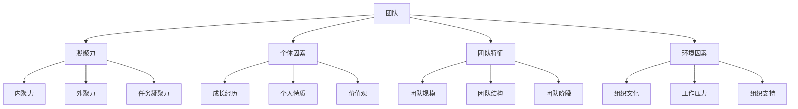
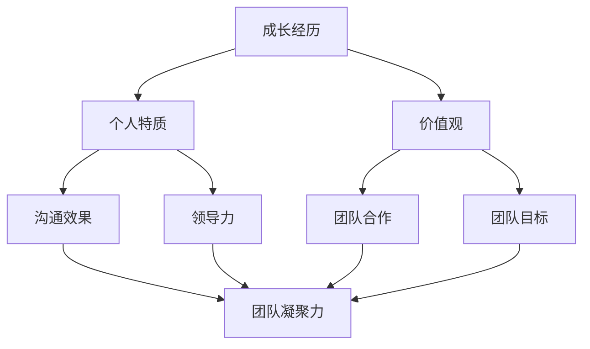
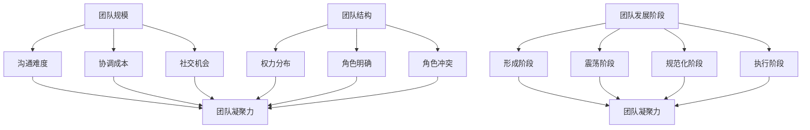
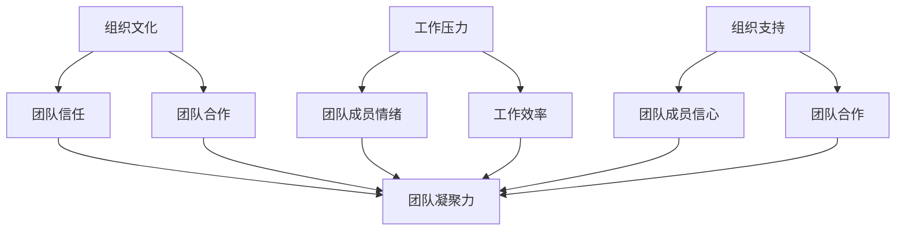

                 


### 背景介绍

在现代社会，团队已经成为组织运作的核心单元。无论是企业、学术机构还是政府组织，团队协作的效率直接影响到整体绩效。团队凝聚力，即团队成员之间的相互吸引力和协同工作的意愿，是衡量团队效能的关键因素之一。然而，如何科学地构建和提升团队凝聚力，使其达到最佳状态，一直是管理者和研究人员关注的焦点。

团队凝聚力不仅仅是一种抽象的概念，它涉及多个层面的互动和关系。一方面，团队凝聚力有助于团队成员之间建立信任和协作，提升团队整体的效率和创新能力。另一方面，良好的团队凝聚力能够增强员工的归属感和满意度，从而降低人员流失率，提高组织稳定性。

本文旨在探讨团队凝聚力的科学构建方法，通过理论模型的解读和实例分析，提供一套系统、可操作的团队凝聚力提升策略。文章结构如下：

## 第一部分：团队凝聚力概述

### 第1章：团队凝聚力的定义与重要性

在这一章节中，我们将详细探讨团队凝聚力的概念，分析其在团队运作中的重要性，以及如何分类不同类型的团队凝聚力。

### 第2章：团队凝聚力的理论模型

我们将介绍几种主要的团队凝聚力理论模型，包括成就动机理论、社会比较理论和社会认同理论，并通过具体案例来阐述这些理论在实际应用中的效果。

## 第二部分：团队凝聚力影响因素分析

### 第3章：个体因素

我们将深入分析个体因素对团队凝聚力的影响，如成长经历、个人特质和价值观。

### 第4章：团队特征

在本章中，我们将探讨团队规模、结构和阶段等因素如何影响团队凝聚力。

### 第5章：环境因素

我们将讨论组织文化、工作压力和组织支持等环境因素如何作用于团队凝聚力。

## 第三部分：团队凝聚力提升策略

### 第6章：团队凝聚力提升的基本策略

我们将提出一些基本策略，如设定共同目标、提高沟通效率和增强信任，并给出具体实施步骤。

### 第7章：团队凝聚力提升的具体实践

在这一章节中，我们将介绍一些具体的实践方法，如团队建设活动、反馈与激励机制和跨部门协作机制。

### 第8章：团队凝聚力评估与反馈

我们将介绍如何评估团队凝聚力，并建立有效的反馈机制，以持续改进团队凝聚力。

## 附录：团队凝聚力相关研究资料与案例

附录部分将提供一些团队凝聚力研究文献的综述和成功团队凝聚力的案例分析。

通过这篇文章，我们希望能够为读者提供一个全面、深入的团队凝聚力构建指南，帮助团队管理者在复杂多变的环境中实现高效的团队协作。

### 核心概念与联系

在探讨团队凝聚力之前，我们需要明确几个核心概念：团队、凝聚力、个体因素、团队特征和环境因素。这些概念之间存在着紧密的联系，共同构建了一个复杂的互动体系。

**团队** 是一个由两个或两个以上个体组成的集体，这些个体为了实现共同的目标而合作。团队不仅仅是成员的简单组合，它需要具备明确的共同目标、良好的沟通和协作机制，以及成员之间的相互信任。

**凝聚力** 是指团队成员之间相互吸引的力，它包括内聚力和外聚力。内聚力指的是团队成员之间的相互吸引，而外聚力则是指团队对外界环境的影响力和抵御力。任务凝聚力是指团队成员在完成任务过程中表现出的协同合作意愿。

**个体因素** 是影响团队凝聚力的关键因素之一，包括个体的成长经历、个人特质和价值观。成长经历会影响个体的自我认知和人际交往能力；个人特质如性格、能力和动机会影响个体在团队中的角色和表现；价值观则决定了个体对于团队目标和行为准则的认同程度。

**团队特征** 包括团队规模、结构和阶段等。团队规模影响团队成员之间的沟通和协作难度；团队结构决定了团队成员之间的权力和责任分配；团队阶段则反映了团队从形成到成熟的不同发展阶段。

**环境因素** 包括组织文化、工作压力和组织支持等。组织文化是团队发展的土壤，它影响着团队成员的行为和态度；工作压力是团队面临的挑战，它会影响团队成员的士气和动力；组织支持则是团队实现目标的重要保障。

这些概念之间的关系可以用Mermaid流程图来展示：



通过这个流程图，我们可以清晰地看到各个概念之间的联系和影响。团队是核心，个体因素、团队特征和环境因素共同作用于团队凝聚力，进而影响团队的整体效能。

### 成就动机理论

成就动机理论是解释个体行为动机的重要理论之一，由著名心理学家麦克利兰（David McClelland）提出。该理论认为，个体的成就动机是推动其行为的核心动力，可以分为三类：成就动机、权力动机和亲和动机。

**成就动机** 是指个体追求卓越、克服挑战、展示自己能力的动机。高成就动机的个体通常设定具有挑战性的目标，愿意承担风险，并在实现目标后获得满足感。在团队环境中，高成就动机的成员往往会主动承担重任，积极推动团队前进。

**权力动机** 是指个体追求控制和影响他人的动机。具有高权力动机的成员倾向于掌握权力，影响决策，并确保自己的意见得到采纳。在团队中，这种动机可能导致权力斗争和竞争，但也可能促进团队内部的有效决策和领导。

**亲和动机** 是指个体追求与他人建立亲密关系的动机。具有高亲和动机的成员倾向于合作、支持和帮助他人，并寻求团队内部的和谐与团结。在团队中，这种动机有助于建立良好的团队氛围，增强团队凝聚力。

成就动机理论对团队凝聚力的影响主要体现在以下几个方面：

1. **目标设定**：高成就动机的个体倾向于设定具有挑战性的目标，这可以激励整个团队追求卓越。团队领导者应当鼓励成员设定可实现的挑战性目标，以激发团队的整体动力。

2. **风险承担**：高成就动机的个体愿意承担风险，这有助于推动团队在面对挑战时勇于创新和尝试新方法。团队领导者应当鼓励成员勇于尝试，并为失败提供支持和反馈。

3. **竞争与合作**：权力动机和亲和动机的个体在团队中的竞争与合作方式有所不同。权力动机较强的成员可能会在团队内部形成竞争，而亲和动机较强的成员则更倾向于合作和支持。团队领导者需要平衡这两种动机，确保团队在竞争与合作中保持高效和团结。

4. **领导风格**：团队领导者应根据成员的成就动机选择合适的领导风格。对于高成就动机的成员，领导者可以采取授权和鼓励自主决策的方式，以激发其潜力。对于权力动机较强的成员，领导者可以提供明确的角色和责任，以促进团队内部的权力平衡。对于亲和动机较强的成员，领导者可以创造一个支持性和包容性的团队环境，增强团队凝聚力。

下面是一个简单的伪代码示例，用于解释如何根据成员的成就动机设定团队目标：

```python
# 伪代码：根据成员的成就动机设定团队目标
def set_team_goals(motivation_levels):
    # 假设motivation_levels是一个包含所有成员成就动机水平的列表
    challenging_goals = []
    average_goals = []

    for motivation_level in motivation_levels:
        if motivation_level > 75:  # 高成就动机
            challenging_goals.append("实现项目A的突破性成果")
        elif motivation_level > 50:  # 中等成就动机
            average_goals.append("完成项目B的既定目标")
        else:  # 低成就动机
            average_goals.append("确保项目C的稳定进展")

    return challenging_goals, average_goals
```

通过这个示例，我们可以看到如何根据成员的不同成就动机设定不同的团队目标，从而最大化地激发团队动力和凝聚力。

### 社会比较理论

社会比较理论（Social Comparison Theory）是解释个体如何通过与他人比较来评估自己的一种社会心理学理论，由社会学家利昂·费斯廷格（Leon Festinger）提出。根据这一理论，个体在多个方面，如地位、能力和价值观，通过将自己与他人进行比较来形成自我评价。这种比较有助于个体了解自己在社会中的位置，并确定自己的行为和态度。

在社会比较理论中，个体通常会选择与自己相似的人作为比较对象，这种现象称为相似性比较（Similarity Comparison）。例如，一个员工可能会将自己与同部门的其他同事进行比较，以评估自己的绩效和职位晋升机会。此外，个体还可能选择与自己有显著差异的人进行对比，这种现象称为差异性比较（Difference Comparison）。例如，一个销售员可能会将业绩与自己公司中表现最好的销售员进行比较，以激发自己的竞争意识。

社会比较理论对团队凝聚力的影响主要体现在以下几个方面：

1. **自我评价**：团队成员通过社会比较来评估自己的能力、价值和贡献。高绩效的个体可能会感到自豪和满足，从而增强对团队的认同感。而绩效较低的个体可能会感到沮丧和自卑，从而影响团队凝聚力。

2. **团队氛围**：社会比较可以影响团队的总体氛围。如果团队成员普遍感到自己优于他人，团队可能会形成一种竞争和冲突的氛围。相反，如果团队成员感到自己处于劣势，团队可能会变得消极和缺乏动力。

3. **角色定位**：社会比较有助于团队成员确定自己在团队中的角色和地位。例如，一个具有高权力的成员可能会选择影响他人的决策，而一个具有高亲和力的成员可能会选择提供支持和帮助。

为了更好地理解社会比较理论，我们可以通过一个数学模型来解释个体自我评价的过程。假设有n个团队成员，每个成员的绩效用p_i表示，其中i为成员的编号。团队的平均绩效为p，那么每个成员的自我评价可以通过以下公式计算：

$$ \text{self-evaluation} = \frac{\sum_{i=1}^{n} (p_i - p)}{n} $$

其中，$ \text{self-evaluation} $表示成员的自我评价，$ p_i $表示成员的绩效，$ p $表示团队的平均绩效。

这个公式表明，每个成员的自我评价取决于其绩效与团队平均绩效的差值。如果某个成员的绩效显著高于团队平均水平，那么他的自我评价会比较高，这可能会增强他的自信心和团队认同感。相反，如果某个成员的绩效低于团队平均水平，那么他的自我评价会较低，这可能会影响他的工作动力和团队凝聚力。

下面是一个具体的例子来说明这个公式：

假设有一个团队共有5个成员，他们的绩效分别为：p1=80, p2=70, p3=90, p4=60, p5=75。团队的平均绩效为p=75。根据上述公式，我们可以计算每个成员的自我评价：

$$ \text{self-evaluation}_1 = \frac{(80-75) + (70-75) + (90-75) + (60-75) + (75-75)}{5} = 5 $$

$$ \text{self-evaluation}_2 = \frac{(80-75) + (70-75) + (90-75) + (60-75) + (75-75)}{5} = 0 $$

$$ \text{self-evaluation}_3 = \frac{(80-75) + (70-75) + (90-75) + (60-75) + (75-75)}{5} = 10 $$

$$ \text{self-evaluation}_4 = \frac{(80-75) + (70-75) + (90-75) + (60-75) + (75-75)}{5} = -10 $$

$$ \text{self-evaluation}_5 = \frac{(80-75) + (70-75) + (90-75) + (60-75) + (75-75)}{5} = 5 $$

从计算结果可以看出，绩效最高的成员自我评价最高，而绩效最低的成员自我评价最低。这种自我评价的差异可能会对团队凝聚力产生不同的影响。对于绩效较高的成员，他们可能会感到自豪和满足，从而增强团队凝聚力。而对于绩效较低的成员，他们可能会感到沮丧和自卑，从而削弱团队凝聚力。

通过这个例子，我们可以看到社会比较理论在团队管理中的应用。团队领导者可以通过调整绩效评估方式和沟通策略，帮助团队成员进行积极的社会比较，从而提高团队凝聚力。

### 社会认同理论

社会认同理论（Social Identity Theory）是另一种解释个体行为和态度的重要理论，由社会心理学家亨利·泰弗勒（Henri Tajfel）和约翰·特纳（John Turner）提出。该理论认为，个体不仅以自我认同为基础，还会通过社会认同来定义自己。社会认同是指个体将自己视为某个社会群体的一员，并在群体中获得自我价值感。

社会认同理论的主要观点包括：

1. **自我分类**：个体会将自己分为不同的社会群体，如种族、国籍、职业等。这种自我分类有助于个体建立和强化自己的身份。

2. **社会比较**：个体会通过将自己所属群体与外部群体进行比较来评估自己的群体地位。这种比较会影响到个体对群体的认同感和归属感。

3. **群体内与群体外差异**：个体会表现出对内群体（自己所属的群体）的偏好和对外群体的排斥。这种偏好和排斥有助于维持群体内的凝聚力和认同感。

社会认同理论对团队凝聚力的影响可以从以下几个方面进行分析：

1. **群体意识**：社会认同理论强调了群体意识的重要性。当团队成员认为自己是某个团队的一员时，他们更可能表现出协同合作的行为。这种群体意识有助于增强团队凝聚力。

2. **内部协作**：社会认同理论指出，群体内部的成员更愿意帮助和支持内部成员。这种内部协作可以提高团队的整体效能，从而增强团队凝聚力。

3. **外部竞争**：社会认同理论还表明，群体成员对外部群体的竞争和排斥会增强内部团结。这种外部竞争有助于激发团队成员的斗志，进一步巩固团队凝聚力。

为了更好地理解社会认同理论在团队凝聚力中的应用，我们可以通过一个具体的例子来说明。假设有一个团队由来自不同背景的成员组成，团队成员包括程序员、设计师和市场人员。团队的目标是开发一个新产品。

在这个例子中，团队成员可以通过社会认同理论来增强团队凝聚力：

1. **自我分类**：团队成员将自己视为开发团队的一员，而不是单独的个体。这种自我分类有助于建立团队身份和归属感。

2. **社会比较**：团队成员将自己团队与其他外部团队（如竞争对手）进行比较。这种比较有助于提高团队成员的竞争意识和团队认同感。

3. **内部协作**：团队成员在项目开发过程中，相互支持和协作，共同解决问题。这种内部协作有助于提高团队的整体效能，从而增强团队凝聚力。

4. **外部竞争**：团队成员在面对竞争对手时，表现出强烈的团队精神和合作意愿。这种外部竞争有助于激发团队成员的斗志，进一步巩固团队凝聚力。

通过这个例子，我们可以看到社会认同理论在团队管理中的实际应用。团队领导者可以通过强化团队成员的社会认同，提高团队凝聚力，从而实现更高的团队效能。

### 个体因素对团队凝聚力的影响

个体因素是影响团队凝聚力的重要因素之一，这些因素包括成长经历、个人特质和价值观。深入分析这些因素，有助于我们理解团队成员之间的相互作用和团队凝聚力的形成。

**成长经历** 是指个体在成长过程中所经历的各种经历和事件。个体的成长经历对其人格形成、社交能力和自信心等方面产生深远影响。例如，一个在和谐家庭中长大的个体可能更倾向于建立积极的人际关系，而在压力环境中成长的个体可能更容易感到紧张和焦虑。这些成长经历会影响个体在团队中的行为和态度，从而影响团队凝聚力。

**个人特质** 是指个体的性格特点和能力水平。常见的个人特质包括内向/外向、乐观/悲观、领导力、沟通能力等。高领导力的个体往往能够在团队中发挥关键作用，成为团队的核心领导者；而沟通能力强的个体则能够促进团队成员之间的有效沟通，增强团队凝聚力。例如，一个外向且乐观的成员可能会在团队中建立良好的人际关系，促进团队合作。

**价值观** 是指个体对于什么是有价值和重要的信念和观念。个体的价值观会影响其行为选择和决策，进而影响团队凝聚力和团队文化。例如，一个注重诚信的个体可能会在团队中倡导诚实和透明的工作方式，这种价值观的传播有助于建立信任和团队凝聚力。相反，如果团队成员的价值观差异较大，可能会导致冲突和团队凝聚力下降。

个体因素对团队凝聚力的影响可以从以下几个方面进行详细分析：

1. **成长经历的差异性**：团队成员的成长经历不同，可能导致他们在价值观和行为习惯上存在差异。这种差异性可能会影响团队成员之间的相互理解和信任，进而影响团队凝聚力。例如，一个在竞争激烈的商业环境中成长的成员可能会更加注重结果和绩效，而一个在团队合作环境中成长的成员可能更倾向于和谐与共融。

2. **个人特质的多样性**：团队成员的个人特质多样性是团队创造力的重要来源。然而，如果这种多样性未能得到有效管理和利用，可能会导致冲突和团队凝聚力下降。例如，一个内向的成员可能在团队讨论中不愿发表意见，导致其他成员的沟通不畅，影响团队的整体效能。

3. **价值观的统一性**：团队成员共享的价值观是团队凝聚力的重要基础。当团队成员的价值观一致时，他们更可能为了共同的目标而努力，增强团队凝聚力。例如，一个注重创新和变革的团队可能在面对挑战时表现出更强的凝聚力，因为他们都认同并支持团队的目标。

为了更清晰地展示个体因素对团队凝聚力的影响，我们可以通过以下Mermaid流程图来描述：



在这个流程图中，个体因素（成长经历、个人特质和价值观）通过影响沟通效果、领导力和团队合作，最终作用于团队凝聚力。

**案例**：假设一个软件开发团队由5名成员组成，他们的成长经历、个人特质和价值观如下：

- 成员A在一个注重创新和协作的家庭中长大，外向且乐观，注重创新和变革。
- 成员B在一个竞争激烈的环境中成长，内向但非常专注，擅长分析和解决问题。
- 成员C在和谐的家庭中长大，外向且善沟通，重视团队合作和共享知识。
- 成员D在压力较大的环境中成长，乐观但有些焦虑，注重结果和绩效。
- 成员E在充满竞争的学校环境中成长，外向且有领导力，擅长管理和协调。

在这个团队中，成员A和B的个人特质差异可能导致沟通不畅，但他们的成长经历和价值观使他们更愿意为了共同的目标而努力。成员C和D的价值观可能存在一定差异，但他们在团队合作和目标一致性方面表现出较高的凝聚力。成员E的领导力和沟通能力有助于团队的整体协调和决策，从而增强团队凝聚力。

通过这个案例，我们可以看到个体因素如何通过沟通效果、领导力和团队合作，最终影响团队凝聚力。团队领导者需要认识到这些个体差异，并采取适当的措施来促进团队凝聚力的提升。

### 团队特征对团队凝聚力的影响

团队特征是影响团队凝聚力的关键因素之一，这些特征包括团队规模、团队结构和团队发展阶段。了解这些特征如何影响团队凝聚力，有助于团队领导者和管理者在构建和管理团队时做出更明智的决策。

**团队规模** 是指团队中成员的数量。团队规模对凝聚力的影响主要体现在以下几个方面：

1. **沟通难度**：随着团队规模的增加，团队成员之间的沟通难度也会增加。在大型团队中，成员之间的沟通链条更长，信息传递的速度和准确性都可能受到影响。这可能导致信息不对称和沟通不畅，从而降低团队凝聚力。

2. **协调成本**：大型团队在协调工作方面需要投入更多的时间和资源。团队成员需要花费更多时间来协调各自的任务和职责，这可能导致工作效率下降，影响团队凝聚力。

3. **社交机会**：小型团队中，成员之间的社交机会更多，这有助于建立紧密的人际关系，增强团队凝聚力。然而，在大型团队中，社交机会较少，成员之间的互动可能局限于工作范围内，这可能会削弱团队凝聚力。

**团队结构** 是指团队成员之间的权力和责任分配方式。团队结构对凝聚力的影响主要体现在以下几个方面：

1. **权力分布**：如果团队中的权力高度集中，可能会导致权力斗争和竞争，削弱团队凝聚力。相反，如果权力较为均衡，团队成员可能会更愿意合作和支持，增强团队凝聚力。

2. **角色明确**：清晰的团队角色和责任分配有助于提高团队的工作效率和凝聚力。当团队成员清楚地了解自己的职责和期望时，他们更可能专注于任务，并愿意为团队目标贡献力量。

3. **角色冲突**：如果团队结构中存在角色冲突，可能会导致成员之间的紧张和矛盾，削弱团队凝聚力。团队领导者需要通过合理的角色分配和沟通来避免角色冲突。

**团队发展阶段** 是指团队从形成到成熟的不同阶段。团队在不同发展阶段的表现和凝聚力会有所不同：

1. **形成阶段**：在团队形成阶段，成员之间可能尚未建立信任和合作关系，团队凝聚力较低。此时，团队领导者需要通过团队建设活动和沟通来促进成员之间的相互了解和信任。

2. **震荡阶段**：在团队震荡阶段，成员可能会出现冲突和分歧，团队凝聚力受到挑战。团队领导者需要通过有效沟通和冲突解决机制来缓解矛盾，增强团队凝聚力。

3. **规范化阶段**：在团队规范化阶段，成员之间的合作关系和信任逐渐建立，团队凝聚力达到较高水平。此时，团队领导者需要保持团队的规范和价值观，继续培养团队凝聚力。

4. **执行阶段**：在团队执行阶段，团队已经进入高效运作状态，凝聚力保持在较高水平。团队领导者需要持续关注团队绩效和成员满意度，以确保团队凝聚力的稳定。

为了更好地理解团队特征对团队凝聚力的影响，我们可以通过以下Mermaid流程图来描述：



在这个流程图中，团队规模、团队结构和团队发展阶段通过影响沟通效果、协调成本、权力分布、角色明确和角色冲突，最终作用于团队凝聚力。

**案例**：假设有一个由10名成员组成的软件开发团队，团队成员分布在三个不同的地点。团队成员的个人特质、团队规模、团队结构和团队发展阶段如下：

- 成员A：外向，擅长沟通，领导力强。
- 成员B：内向，专注，擅长技术。
- 成员C：外向，善沟通，注重创新。
- 成员D：内向，技术能力强，注重结果。
- 成员E：外向，善于团队合作，注重团队目标。

- **团队规模**：10人
- **团队结构**：权力较为均衡，团队成员各自负责不同的模块，角色明确。
- **团队发展阶段**：处于规范化阶段，团队成员之间已经建立了较高的信任和合作关系。

在这个案例中，团队规模适中，沟通难度和协调成本相对较低，社交机会较多。团队结构合理，权力分布均衡，角色明确，有助于提高团队凝聚力。团队发展阶段处于规范化阶段，团队成员之间已经建立了较高的信任和合作关系，团队凝聚力较高。

通过这个案例，我们可以看到团队特征如何通过沟通效果、权力分布、角色明确等因素，最终影响团队凝聚力。团队领导者需要根据团队的特征，采取适当的措施来促进团队凝聚力的提升。

### 环境因素对团队凝聚力的影响

环境因素在团队凝聚力的形成和维持过程中扮演着重要角色。这些因素包括组织文化、工作压力和组织支持。了解这些因素如何影响团队凝聚力，对于团队管理者来说至关重要。

**组织文化** 是指组织内部共同的价值观、信念和行为准则，它是团队凝聚力的根基。一个积极、包容和透明的组织文化能够增强团队成员的归属感和认同感，从而提高团队凝聚力。例如，在一个重视创新和合作的组织文化中，团队成员更可能相互支持、共享知识和共同面对挑战，从而增强团队凝聚力。

**工作压力** 是团队面临的常见挑战之一。适度的压力可以激发团队成员的斗志和创造力，但过度的压力会导致焦虑和疲劳，影响团队凝聚力。例如，在一个竞争激烈、任务繁重的环境中，团队成员可能会感到压力巨大，导致情绪波动和工作效率下降，从而削弱团队凝聚力。

**组织支持** 包括组织在资源、政策和人力等方面的支持。组织的支持对团队凝聚力有着直接的影响。当组织为团队提供充足的资源、明确的目标和支持时，团队成员会感到被重视和支持，从而增强团队凝聚力。例如，当一个项目团队得到充分的资金和人力资源支持时，团队成员更有信心完成任务，彼此之间的信任和合作也会增强。

环境因素对团队凝聚力的影响可以从以下几个方面进行详细分析：

1. **组织文化的影响**：积极、包容和透明的组织文化有助于建立团队信任和合作关系，从而提高团队凝聚力。相反，消极、排斥和官僚的组织文化会导致团队成员之间的疏离和矛盾，降低团队凝聚力。

2. **工作压力的影响**：适度的压力可以激发团队成员的斗志和创造力，但过度的压力会导致焦虑和疲劳，影响团队成员之间的互动和合作，从而削弱团队凝聚力。

3. **组织支持的影响**：组织的支持能够为团队提供必要的资源、培训和激励，从而增强团队成员的信心和合作意愿。缺乏组织支持可能会导致团队成员感到无助和孤立，从而影响团队凝聚力。

为了更好地理解环境因素对团队凝聚力的影响，我们可以通过以下Mermaid流程图来描述：



在这个流程图中，组织文化、工作压力和组织支持通过影响团队信任、团队合作、团队成员情绪和工作效率，最终作用于团队凝聚力。

**案例**：假设有一个由20名成员组成的市场营销团队，团队成员分布在不同的城市。团队成员的个人特质、组织文化、工作压力和组织支持如下：

- 成员A：外向，善于沟通，注重创新。
- 成员B：内向，专注，注重细节。
- 成员C：外向，善于团队合作，注重团队目标。

- **组织文化**：积极、包容和透明，鼓励创新和合作。
- **工作压力**：适度的压力，项目目标和时间表明确，但不过分紧张。
- **组织支持**：提供充足的资源、培训和支持，鼓励团队成员之间的沟通和合作。

在这个案例中，组织文化积极、包容，鼓励创新和合作，有助于建立团队信任和合作关系，从而提高团队凝聚力。工作压力适度，有助于激发团队成员的斗志和创造力，但不会导致过度焦虑和疲劳。组织支持充足，为团队成员提供了必要的资源、培训和支持，增强了团队成员的信心和合作意愿，从而进一步提高了团队凝聚力。

通过这个案例，我们可以看到环境因素如何通过影响团队信任、团队合作、团队成员情绪和工作效率，最终影响团队凝聚力。团队领导者需要关注这些环境因素，采取适当的措施来促进团队凝聚力的提升。

### 团队凝聚力提升的基本策略

要提升团队凝聚力，团队领导者可以采取一系列的基本策略，这些策略包括设定共同目标、提高沟通效率和增强团队成员之间的信任。以下将详细探讨这些策略及其实施步骤。

#### 1. 设定共同目标

**目标设定的重要性**：共同目标是团队凝聚力的基石。当团队成员共同追求一个明确且具有挑战性的目标时，他们更容易形成共同愿景，增强协作意愿。

**实施步骤**：

- **明确目标**：首先，团队领导者需要明确团队的目标，并将其分解为可操作的子目标。例如，一个软件开发团队可以将总体目标分解为功能模块、时间节点等。

- **全员参与**：邀请团队成员参与目标的制定过程，确保每个人都对目标有清晰的理解和认同。这可以通过小组讨论、头脑风暴等方式实现。

- **目标可视化**：将目标可视化，例如，在团队会议上展示目标进展图，帮助团队成员保持对目标的关注和动力。

- **定期评估**：定期检查目标进展，并根据实际情况进行调整。这有助于团队成员保持对目标的关注，并在必要时进行调整。

**伪代码示例**：

```python
# 伪代码：设定共同目标
def set_common_goals(team_members, overall_goal):
    sub_goals =分解目标(overall_goal)
    for member in team_members:
        member.goal = sub_goals[member.role]
    return sub_goals
```

#### 2. 提高沟通效率

**沟通效率的重要性**：有效的沟通是团队凝聚力的关键。当团队成员能够顺畅地交流时，他们更容易理解彼此的需求和期望，从而减少误解和冲突。

**实施步骤**：

- **建立沟通机制**：制定一套明确的沟通流程和规则，确保团队成员之间的信息畅通无阻。例如，设定每日或每周的团队会议、邮件更新等。

- **倾听与反馈**：鼓励团队成员积极倾听他人的意见，并在必要时给予反馈。这可以通过倾听培训、反馈机制等方式实现。

- **使用多种沟通方式**：结合面对面沟通、在线会议、邮件、即时通讯工具等多种沟通方式，以满足不同团队成员的需求。

- **沟通技巧培训**：为团队成员提供沟通技巧培训，例如非暴力沟通、有效倾听等，以提升沟通效果。

**伪代码示例**：

```python
# 伪代码：提高沟通效率
def improve_communication(team_members):
    for member in team_members:
        member.training("effective_communication")
        member.config_communication_channel()
    return "沟通机制已建立"
```

#### 3. 增强团队成员之间的信任

**信任的重要性**：信任是团队凝聚力的核心。当团队成员之间建立了信任，他们更愿意分享信息、支持和合作，从而提高团队效能。

**实施步骤**：

- **透明度**：确保团队成员之间信息的透明度，避免信息孤岛和误解。例如，通过共享工作进度、项目文档等。

- **共同经历**：通过团队建设活动和共同的项目经历，增强团队成员之间的情感联系和信任。例如，团队外出活动、共同解决难题等。

- **积极反馈**：及时给予团队成员正面的反馈和认可，增强他们的自信心和信任感。例如，公开表扬、团队奖励等。

- **解决冲突**：建立有效的冲突解决机制，确保团队成员之间的矛盾能够及时得到处理，避免信任受损。例如，定期举行团队冲突解决会议等。

**伪代码示例**：

```python
# 伪代码：增强信任
def enhance_trust(team_members):
    for member in team_members:
        member.share_progress()
        member.receive_positive_feedback()
    return "团队成员之间的信任已增强"
```

通过这些基本策略，团队领导者可以逐步提升团队凝聚力，为团队的成功运作奠定坚实基础。

### 团队凝聚力提升的具体实践

在了解了基本策略后，我们将深入探讨团队凝聚力提升的具体实践，包括团队建设活动、反馈与激励机制以及跨部门协作机制。通过这些实践，团队领导者可以更有效地增强团队成员之间的联系和合作，从而提升团队整体绩效。

#### 1. 团队建设活动

**团队建设活动的重要性**：团队建设活动是增强团队成员之间关系和信任的重要手段。通过这些活动，团队成员可以更好地了解彼此，建立起紧密的合作关系。

**实施步骤**：

- **选择合适的活动**：根据团队的特点和需求，选择适合的团队建设活动。例如，户外拓展训练、团队研讨会、团队游戏等。

- **活动策划**：制定详细的活动计划，包括活动目的、时间、地点、参与人员等。确保活动能够激发团队成员的兴趣和参与度。

- **活动执行**：在活动过程中，鼓励团队成员积极参与，并设置一些互动环节，如小组讨论、角色扮演等，以增强团队合作和沟通。

- **活动总结**：活动结束后，进行总结和反思，让团队成员分享活动中的体验和收获。这有助于巩固团队关系，并为下一次活动提供参考。

**案例**：某科技公司定期组织团队拓展活动，如户外徒步、团队挑战赛等。在活动中，团队成员通过合作完成任务，增强了彼此的了解和信任。活动结束后，团队成员在会议中分享各自的感受和体会，进一步巩固了团队凝聚力。

#### 2. 反馈与激励机制

**反馈与激励机制的重要性**：有效的反馈和激励机制能够激励团队成员，提高其工作积极性和责任感，从而增强团队凝聚力。

**实施步骤**：

- **设立明确的评价标准**：制定一套公正、明确的评价标准，确保反馈的客观性和有效性。例如，可以根据工作质量、效率、团队合作等方面进行评价。

- **及时反馈**：定期对团队成员的工作进行反馈，指出其优点和需要改进的地方。及时反馈有助于团队成员及时调整工作状态，提高工作效率。

- **个性化激励**：根据团队成员的个人需求和特点，设计个性化的激励机制。例如，对于喜欢公开表扬的成员，可以设置公开表彰环节；对于追求物质奖励的成员，可以提供奖金或礼品等。

- **建立反馈机制**：建立一套反馈机制，确保团队成员能够及时收到反馈，并根据反馈进行改进。例如，可以设置定期反馈会议、匿名反馈渠道等。

**案例**：某企业建立了一个匿名反馈系统，允许团队成员在任何时间、任何地点提交反馈意见。管理层定期查看反馈，并根据反馈调整工作计划和策略。这种反馈机制不仅提高了团队成员的工作积极性，还增强了团队的透明度和信任感。

#### 3. 跨部门协作机制

**跨部门协作机制的重要性**：在现代企业中，各部门之间的协作越来越重要。有效的跨部门协作可以提高工作效率，减少资源浪费，从而提升团队整体绩效。

**实施步骤**：

- **建立跨部门沟通平台**：建立一个跨部门的沟通平台，如内部社交网络、共享文档系统等，方便各部门之间的信息交流和资源共享。

- **明确协作目标和流程**：为每个跨部门协作项目设定明确的目标和流程，确保各部门能够高效协同。例如，可以制定项目计划书、责任分配表等。

- **定期会议和交流**：定期召开跨部门会议，讨论项目进展和遇到的问题，确保各部门之间的沟通畅通。此外，可以组织跨部门交流活动，促进不同部门之间的了解和合作。

- **建立协作激励机制**：为跨部门协作建立激励机制，鼓励各部门积极参与和协作。例如，可以设立跨部门合作奖项，表彰优秀协作团队。

**案例**：某大型企业的研发部门和市场部门合作开发一款新产品。他们通过共享文档系统进行信息交流，定期召开跨部门会议讨论项目进展，并根据市场反馈调整研发方向。这种跨部门协作机制不仅提高了项目效率，还增强了各部门之间的合作关系，提升了团队凝聚力。

通过这些具体实践，团队领导者可以更有效地提升团队凝聚力，为团队的成功运作提供有力保障。

### 团队凝聚力评估与反馈

在构建和提升团队凝聚力过程中，有效的评估和反馈机制至关重要。通过科学的方法对团队凝聚力进行评估，可以及时发现问题和不足，为团队改进提供方向。以下将介绍几种常用的团队凝聚力评估方法，以及如何建立有效的反馈机制和改进方案。

#### 1. 团队凝聚力评估方法

**问卷调查法**：问卷调查法是一种简单且有效的团队凝聚力评估方法。通过设计一套针对团队凝聚力的问卷，可以收集团队成员对团队协作、沟通、信任等方面的看法。常用的问卷包括LPI（Leadership Practices Inventory）和TPS（Team Performance Scale）等。

**访谈法**：访谈法是一种深入了解团队凝聚力的方法。通过与团队成员进行一对一或小组访谈，可以了解他们对于团队凝聚力现状的感受和意见。访谈法适用于小型团队或需要深入探讨具体情况时。

**观察法**：观察法是通过观察团队成员在日常工作中的行为和互动，评估团队凝聚力的方法。这种方法可以直观地了解团队成员之间的合作情况、沟通效果和团队氛围。

**数据分析法**：通过分析团队绩效数据、员工满意度调查结果等，可以评估团队凝聚力对团队整体表现的影响。这种方法适用于需要量化团队凝聚力的评估。

#### 2. 建立有效的反馈机制

**反馈渠道**：为了确保反馈的及时性和有效性，需要建立多种反馈渠道，如定期团队会议、匿名反馈箱、内部论坛等。不同的反馈渠道适用于不同的情境和需求。

**反馈频率**：团队凝聚力的评估和反馈应定期进行，例如每月或每季度一次。定期反馈有助于及时发现问题，并制定相应的改进措施。

**反馈内容**：反馈内容应包括团队凝聚力的各个方面，如团队合作、沟通效果、信任程度等。具体反馈内容应基于评估方法和团队成员的实际表现。

**反馈方式**：反馈方式应多样化，包括口头反馈、书面反馈、图表展示等。不同的反馈方式适用于不同的反馈内容和情境。

#### 3. 团队凝聚力改进方案

**改进方案制定**：根据评估结果和反馈意见，制定具体的改进方案。改进方案应包括改进目标、实施步骤、责任人和时间表等。

**实施与监控**：将改进方案付诸实施，并建立监控机制，确保各项改进措施得到有效执行。定期检查改进效果，并根据实际情况进行调整。

**持续改进**：团队凝聚力提升是一个持续的过程，需要不断评估和改进。通过定期评估和反馈，不断优化团队凝聚力的构建和提升策略。

**案例**：某企业通过问卷调查法评估团队凝聚力，发现团队在沟通效果和信任程度方面存在不足。针对这些问题，企业制定了以下改进方案：

- **改进目标**：提高团队成员之间的沟通效率和信任程度。
- **实施步骤**：定期组织团队沟通培训，设立匿名反馈渠道，鼓励团队成员分享经验和建议。
- **责任人**：指定专门的沟通协调人员，负责组织培训和收集反馈。
- **时间表**：每季度组织一次团队沟通培训，每月进行一次匿名反馈收集和分析。

通过实施这些改进方案，企业的团队凝聚力得到了显著提升，团队成员之间的沟通更加顺畅，信任程度也得到了加强。

通过科学的评估与反馈机制，团队领导者可以持续改进团队凝聚力，为团队的高效运作提供有力保障。

### 附录：团队凝聚力相关研究资料与案例

为了帮助读者更深入地了解团队凝聚力的理论与实践，以下提供了一些相关的研究资料和成功案例，供读者参考和进一步学习。

#### 研究文献综述

1. **Tajfel, H., & Turner, J. C. (1986). The social identity theory of intergroup behavior. In Social Psychology: Annual Review (Vol. 37, pp. 1-34). Palo Alto, CA: Annual Reviews.**
   该文献详细介绍了社会认同理论，对理解团队凝聚力具有重要意义。

2. **McClelland, D. C. (1985). Power is the great motivator. American Psychologist, 40(6), 941-952.**
   本文献讨论了权力动机如何影响个体和团队行为，对团队凝聚力的构建有重要启示。

3. **Geert Hofstede’s cultural dimensions theory.**
   Hofstede的文化维度理论（如个体主义与集体主义、权力距离等）提供了分析不同文化背景下团队凝聚力的重要框架。

#### 成功团队凝聚力案例分析

1. **谷歌（Google）的“OKR”管理模式**：谷歌采用了“目标与关键结果”（OKR）管理模式，通过明确的目标设定和持续反馈，提高了团队凝聚力，推动了公司的高速发展。

2. **苹果公司（Apple）的团队建设**：苹果公司通过注重团队协作和共同目标，建立了强大的团队凝聚力。例如，乔布斯时期的产品开发团队，通过紧密合作和持续沟通，成功推出了多款革命性产品。

3. **NASA（美国国家航空航天局）的团队合作**：在NASA，团队合作和信任至关重要。例如，在阿波罗登月计划中，不同团队通过有效协作，成功实现了人类登月的壮举。

#### 最佳实践 tips

1. **建立明确的目标和愿景**：明确的目标和愿景有助于团队成员共同努力，增强团队凝聚力。

2. **定期进行团队建设活动**：通过定期的团队建设活动，增强团队成员之间的信任和合作。

3. **鼓励开放和诚实的沟通**：建立开放的沟通环境，鼓励团队成员分享意见和反馈，有助于提高团队凝聚力。

4. **建立合理的激励机制**：通过合理的激励机制，如奖励和认可，激励团队成员，增强其工作动力和团队归属感。

5. **提供必要的培训和资源**：为团队成员提供必要的培训和资源，帮助其提升技能和知识，有助于团队整体绩效的提升。

通过这些研究资料和案例分析，我们可以更好地理解和应用团队凝聚力的理论和方法，为团队的管理和运营提供指导。

### 文章总结

本文从多个角度深入探讨了团队凝聚力的概念、理论模型、影响因素以及提升策略。我们首先明确了团队凝聚力的重要性，并介绍了团队、个体因素、团队特征和环境因素之间的关系。接着，我们详细分析了成就动机理论、社会比较理论和社会认同理论，展示了这些理论如何影响团队凝聚力。然后，我们探讨了个体因素、团队特征和环境因素对团队凝聚力的影响，并提出了具体的提升策略。

通过团队建设活动、反馈与激励机制以及跨部门协作机制，我们提供了一系列具体的实践方法，以增强团队凝聚力。最后，我们介绍了团队凝聚力评估与反馈的方法，并分享了相关研究资料和成功案例。

通过本文的阅读，读者应能理解团队凝聚力的本质及其构建的重要性，掌握一系列科学化的提升策略，并具备在实际工作中应用这些策略的能力。我们希望本文能够为团队管理者提供有价值的参考，帮助他们在构建和提升团队凝聚力方面取得显著成效。

