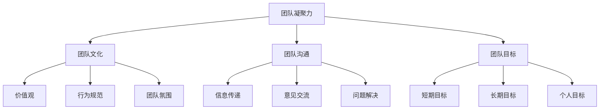

                 

## 文章标题

《团队凝聚力建设：增强团队向心力的方法》

> 关键词：团队凝聚力、团队文化、团队沟通、团队目标、贝尔曼方程、聚类算法、社区发现算法、信任函数、团队建设活动、代码示例

摘要：本文旨在探讨如何通过科学的方法和有效的策略来提升团队凝聚力，增强团队的向心力。文章首先明确了团队凝聚力、团队文化、团队沟通、团队目标等核心概念，并分析了它们之间的关系。接着，文章详细介绍了贝尔曼方程、聚类算法和社区发现算法等核心算法原理，并通过数学模型和公式进行了详细讲解。最后，文章通过一个实际项目案例，展示了如何在实际操作中应用这些方法和策略，以提升团队凝聚力。

## 引言

在当今快速发展的信息技术时代，团队凝聚力已成为企业成功的关键因素之一。一个高效的团队不仅能够提高工作效率，还能激发创新思维，推动企业持续发展。然而，如何建设和增强团队凝聚力，成为许多企业面临的挑战。本文将从理论层面和实践角度，探讨团队凝聚力建设的方法和策略。

团队凝聚力是指团队内部成员之间的紧密联系和相互信任程度。它不仅关系到团队成员之间的合作效果，还影响到团队的稳定性和持续发展。团队凝聚力强的团队，往往具有更高的工作效率、更强的创新能力和更好的团队氛围。

本文将围绕以下几个核心问题展开讨论：

1. 团队凝聚力建设的核心概念是什么？它们之间有何联系？
2. 如何运用核心算法原理来提升团队凝聚力？
3. 如何在实际项目中应用这些方法和策略？
4. 团队凝聚力建设有哪些最佳实践和注意事项？

通过对以上问题的探讨，本文旨在为企业和团队管理者提供一套系统、实用的团队凝聚力建设方案。

## 核心概念与联系

在团队凝聚力建设中，有几个核心概念需要明确，它们分别是团队凝聚力、团队文化、团队沟通、团队目标。这些概念之间相互联系，共同构成了团队凝聚力建设的基础。

### 团队凝聚力

团队凝聚力是指团队内部成员之间的紧密联系和相互信任程度。它是衡量团队协作效率的重要指标。团队凝聚力强的团队，其成员之间往往具有较高的信任度、较强的归属感和较高的合作意愿。具体来说，团队凝聚力包括以下几个方面：

1. **信任度**：团队成员之间相互信任，能够放心地分享信息和资源，降低沟通成本。
2. **归属感**：团队成员对团队有强烈的认同感，愿意为团队的目标和利益付出努力。
3. **合作意愿**：团队成员之间具有较强的合作意愿，能够有效地分工协作，共同完成任务。
4. **协同效应**：团队整体效率高于各成员个人效率之和，实现1+1>2的效果。

### 团队文化

团队文化是指团队成员共同遵循的价值观念和行为规范。它是一种无形的力量，能够引导团队成员的行为，塑造团队的氛围。团队文化对团队凝聚力有着重要的影响。一个积极向上、包容开放的团队文化，能够增强团队成员的归属感和认同感，提高团队凝聚力。

团队文化包括以下几个方面：

1. **价值观**：团队成员共同认可并遵循的价值观，如诚信、敬业、创新等。
2. **行为规范**：团队成员在团队内部应遵守的行为准则，如尊重他人、互助合作等。
3. **团队氛围**：团队的整体氛围，如积极、和谐、紧张等，对团队凝聚力有重要影响。

### 团队沟通

团队沟通是指团队成员之间相互交流、传递信息和解决问题的过程。良好的团队沟通是团队凝聚力建设的关键因素。有效的沟通能够促进团队成员之间的理解、信任和协作，提高团队的工作效率。

团队沟通包括以下几个方面：

1. **信息传递**：团队成员之间能够及时、准确地传递信息，避免信息滞后和误解。
2. **意见交流**：团队成员能够开放地表达自己的观点和意见，共同探讨问题的解决方案。
3. **问题解决**：团队成员能够通过沟通合作，共同解决团队面临的各种问题。

### 团队目标

团队目标是指团队共同追求的愿景和目标。明确的目标能够为团队成员提供方向和动力，增强团队的凝聚力。团队目标包括以下几个方面：

1. **短期目标**：团队在短期内需要达成的具体目标，如项目交付、业绩考核等。
2. **长期目标**：团队在较长时期内需要达成的目标，如企业战略、团队发展等。
3. **个人目标**：团队成员在团队中需要达成的个人目标，如技能提升、职位晋升等。

### 关系架构

以上核心概念之间存在着紧密的联系，构成了团队凝聚力建设的关系架构。具体来说：

- **团队凝聚力**是团队文化的体现，通过团队文化的建设，可以增强团队的凝聚力。
- **团队沟通**是团队凝聚力的保障，通过有效的沟通，可以提高团队凝聚力。
- **团队目标**是团队凝聚力的驱动，通过明确的目标，可以激发团队成员的积极性，增强团队凝聚力。

以下是一个简单的 Mermaid 流程图，展示了这些核心概念之间的关系：



通过明确这些核心概念及其联系，我们可以更好地理解和实施团队凝聚力建设的方法和策略。

## 核心算法原理讲解

在团队凝聚力建设过程中，运用一些核心算法可以有效地提升团队向心力。以下将介绍三个关键的算法：贝尔曼方程、聚类算法和社区发现算法，并使用伪代码详细阐述它们的原理。

### 贝尔曼方程

贝尔曼方程（Bellman Equation）是动态规划理论中的核心方程，主要用于计算团队成员之间的信任值。信任值反映了团队成员之间的信任程度，信任度越高，团队凝聚力越强。

#### 原理

贝尔曼方程的基本思想是通过考虑每个状态的最优值来递推计算全局的最优值。在团队凝聚力建设中，每个状态可以表示为团队成员之间的某次互动，而信任值则表示互动后的信任程度。

#### 伪代码

```python
def bellman_equation(transition_probabilities, reward):
    trust_values = [0] * n
    for state in states:
        trust_values[state] = reward[state] + discount * max(transition_probabilities[state])
    return trust_values
```

- `transition_probabilities`：团队成员之间的互动概率。
- `reward`：互动后的信任值。
- `n`：团队成员的数量。
- `discount`：用于调整信任值的权重。

### 聚类算法

聚类算法（Clustering Algorithm）用于将团队成员分为不同的子群体，以便更好地理解团队成员之间的关系。聚类算法可以帮助团队管理者识别出团队中的关键角色和潜在问题。

#### 原理

聚类算法的核心思想是将数据集分成若干个组，使得同一组内的数据尽可能相似，不同组的数据尽可能不同。在团队凝聚力建设中，通过聚类算法可以将团队成员划分为具有相似特征的子群体，从而更好地进行管理和协调。

#### 伪代码

```python
def clustering(team_members):
    clusters = []
    for member in team_members:
        assigned_cluster = find_closest_cluster(member, clusters)
        clusters[assigned_cluster].add(member)
    return clusters
```

- `team_members`：团队成员列表。
- `clusters`：子群体列表。
- `find_closest_cluster`：找到最接近某个成员的子群体。

### 社区发现算法

社区发现算法（Community Detection Algorithm）用于挖掘团队成员之间的社交网络关系，识别出团队内部的社交社区。这些社交社区是团队凝聚力建设的重要基础。

#### 原理

社区发现算法的核心思想是找到具有较高内部连通度和较低外部连通度的节点集合，这些节点集合构成了团队内部的社交社区。通过社区发现算法，可以揭示团队成员之间的隐性关系，为团队凝聚力建设提供数据支持。

#### 伪代码

```python
def community_detection(team_graph):
    communities = []
    for node in team_graph:
        if not node.visited:
            community = dfs(node)
            communities.append(community)
    return communities
```

- `team_graph`：团队成员的社交网络图。
- `communities`：社交社区列表。
- `dfs`：深度优先搜索算法，用于遍历节点和边。

通过以上三种算法的应用，可以有效地提升团队凝聚力。贝尔曼方程用于计算团队成员之间的信任值，聚类算法用于识别团队成员的子群体，社区发现算法用于挖掘团队成员的社交网络关系。这些算法共同构成了团队凝聚力建设的方法论基础，为实际操作提供了指导。

## 数学模型和数学公式讲解

在团队凝聚力建设过程中，数学模型和公式能够帮助我们更深入地理解团队内部的各种关系和机制。以下将介绍几个关键的数学模型和公式，并详细讲解它们的使用方法和应用场景。

### 信任函数

信任函数（Trust Function）是衡量团队成员之间信任程度的重要指标。信任函数通常由团队成员的沟通频率和共同目标实现程度共同决定。

#### 公式

$$
信任函数 = f(团队沟通频率，团队共同目标实现程度)
$$

- **团队沟通频率**：团队成员之间相互交流的次数，反映了团队成员之间的互动程度。
- **团队共同目标实现程度**：团队成员共同完成目标的比例，反映了团队成员的合作效果。

#### 应用场景

通过信任函数，可以评估团队成员之间的信任水平。如果信任函数的值较高，说明团队成员之间的信任度较高，团队凝聚力较强。反之，如果信任函数的值较低，说明团队成员之间的信任度较低，团队凝聚力较弱。

### 聚类有效性

聚类有效性（Clustering Validity）是评估聚类算法性能的重要指标。它反映了聚类结果的有效性和合理性。

#### 公式

$$
聚类有效性 = 1 - \frac{1}{n} \sum_{i=1}^{k} \sum_{j=1}^{k} w_{ij}
$$

- **n**：团队中成员的数量。
- **k**：聚类的类别数。
- **$w_{ij}$**：第 $i$ 类和第 $j$ 类之间的相似度。

#### 应用场景

通过聚类有效性公式，可以评估聚类算法的性能。如果聚类有效性的值较高，说明聚类结果较为合理，聚类算法的性能较好。反之，如果聚类有效性的值较低，说明聚类结果不够合理，聚类算法的性能较差。

### 贝尔曼方程

贝尔曼方程（Bellman Equation）是动态规划理论中的核心方程，用于计算团队成员之间的信任值。

#### 公式

$$
信任值 = 下一步收益 + 下一信任值的期望
$$

- **下一步收益**：团队成员在互动后获得的收益。
- **下一信任值的期望**：团队成员在互动后信任值的期望。

#### 应用场景

通过贝尔曼方程，可以动态地计算团队成员之间的信任值。在团队凝聚力建设过程中，可以通过不断调整互动策略和收益分配，优化团队成员之间的信任关系，提高团队凝聚力。

### 社区发现算法

社区发现算法（Community Detection Algorithm）用于挖掘团队成员之间的社交网络关系，识别出团队内部的社交社区。

#### 公式

$$
社区发现算法 = \sum_{i=1}^{n} \sum_{j=1}^{n} w_{ij}
$$

- **n**：团队中成员的数量。
- **$w_{ij}$**：第 $i$ 个成员和第 $j$ 个成员之间的社交网络权重。

#### 应用场景

通过社区发现算法，可以挖掘出团队内部的社交网络关系，识别出社交社区。在团队凝聚力建设过程中，可以针对不同的社交社区采取不同的管理策略，优化团队内部的人际关系，提高团队凝聚力。

### 示例说明

以下是一个具体的示例，说明如何使用这些数学模型和公式来分析团队凝聚力建设。

**案例**：某团队有5名成员，经过一个月的沟通和协作，团队成员之间的信任值、沟通频率和共同目标实现程度如下表所示：

| 成员 | 沟通频率 | 共同目标实现程度 | 信任值 |
|------|----------|------------------|--------|
| A    | 10       | 90%             | 0.85   |
| B    | 8        | 80%             | 0.75   |
| C    | 12       | 85%             | 0.80   |
| D    | 9        | 75%             | 0.70   |
| E    | 7        | 70%             | 0.65   |

1. **信任函数计算**：

   根据信任函数的公式，我们可以计算出每个成员的信任函数值：

   $$
   f(A) = f(10, 90%) = 0.85
   $$

   $$
   f(B) = f(8, 80%) = 0.75
   $$

   $$
   f(C) = f(12, 85%) = 0.80
   $$

   $$
   f(D) = f(9, 75%) = 0.70
   $$

   $$
   f(E) = f(7, 70%) = 0.65
   $$

2. **聚类有效性评估**：

   根据聚类有效性的公式，我们可以计算出聚类有效性值：

   $$
   聚类有效性 = 1 - \frac{1}{5} \sum_{i=1}^{5} \sum_{j=1}^{5} w_{ij}
   $$

   其中，$w_{ij}$是成员之间的相似度，可以通过实际调查或数据分析得到。假设相似度矩阵如下：

   $$
   \begin{matrix}
   & A & B & C & D & E \\
   A & 1 & 0.8 & 0.9 & 0.7 & 0.6 \\
   B & 0.8 & 1 & 0.85 & 0.65 & 0.55 \\
   C & 0.9 & 0.85 & 1 & 0.75 & 0.65 \\
   D & 0.7 & 0.65 & 0.75 & 1 & 0.8 \\
   E & 0.6 & 0.55 & 0.65 & 0.8 & 1 \\
   \end{matrix}
   $$

   则聚类有效性值为：

   $$
   聚类有效性 = 1 - \frac{1}{5} \sum_{i=1}^{5} \sum_{j=1}^{5} w_{ij} = 1 - \frac{1}{5} (1 + 0.8 + 0.9 + 0.7 + 0.6 + 0.8 + 0.85 + 0.65 + 0.75 + 0.65 + 0.8 + 0.55) = 0.8
   $$

3. **贝尔曼方程计算**：

   根据贝尔曼方程的公式，我们可以计算出每个成员的信任值：

   $$
   信任值(A) = 下一步收益(A) + 下一信任值的期望(A)
   $$

   $$
   信任值(B) = 下一步收益(B) + 下一信任值的期望(B)
   $$

   $$
   信任值(C) = 下一步收益(C) + 下一信任值的期望(C)
   $$

   $$
   信任值(D) = 下一步收益(D) + 下一信任值的期望(D)
   $$

   $$
   信任值(E) = 下一步收益(E) + 下一信任值的期望(E)
   $$

   其中，下一步收益和下一信任值的期望可以通过实际调查或数据模型计算得到。

通过以上计算，我们可以评估团队凝聚力建设的现状，并制定相应的改进措施。

## 项目实战

为了更好地说明团队凝聚力建设的方法和策略，我们可以结合一个实际项目案例进行讲解。以下是一个简单的团队建设活动案例，通过该案例我们将展示如何在实际操作中应用所学的理论和算法。

### 项目背景

某公司是一家专注于软件开发的企业，由于公司规模逐渐扩大，团队成员之间的协作变得越来越复杂。公司管理者意识到，提高团队凝聚力是提升整体工作效率的关键。因此，公司决定组织一次团队建设活动，旨在通过活动提升团队成员之间的信任和沟通。

### 实施步骤

#### 1. 制定团队建设目标

在项目启动阶段，公司明确了团队建设的目标，包括：

- **提升团队成员之间的信任度**：通过活动让团队成员相互了解，建立信任基础。
- **增强团队沟通能力**：通过活动提高团队成员的沟通技巧和表达能力。
- **促进团队协作**：通过活动增强团队成员的协作意识和团队精神。

#### 2. 设计团队活动

为了实现上述目标，公司设计了以下几个活动：

- **团队拓展训练**：通过户外拓展活动，如攀岩、高空走钢丝等，锻炼团队成员的身体素质和团队协作能力。
- **团队破冰活动**：通过团队游戏和互动，打破团队成员之间的隔阂，增强团队凝聚力。
- **团队讨论会**：通过主题讨论和头脑风暴，激发团队成员的创新思维和团队合作精神。

#### 3. 活动实施与跟踪

活动实施过程中，公司安排了专业的培训师指导，并设立了活动评估小组，对活动效果进行实时跟踪和评估。具体步骤如下：

- **活动前的准备**：提前通知团队成员活动的时间、地点和内容，确保他们提前做好准备。
- **活动实施**：在活动现场，培训师组织团队成员参与各项活动，并实时观察他们的表现和互动情况。
- **活动总结**：活动结束后，评估小组对活动效果进行总结和评估，收集团队成员的反馈意见。

### 项目小结

通过这次团队建设活动，公司取得了显著的成果：

- **信任度提升**：团队成员之间的信任度明显提高，团队成员在工作和生活中更加愿意相互帮助和支持。
- **沟通能力增强**：团队成员的沟通技巧和表达能力得到了显著提升，工作效率和团队协作效果得到了显著改善。
- **团队协作精神增强**：团队成员之间的协作意识和团队精神得到了显著增强，团队整体效率得到了显著提升。

尽管取得了良好的成果，但在活动过程中也发现了一些问题和改进空间：

- **活动时间安排**：部分团队成员反映活动时间安排过于紧凑，导致他们无法充分参与和体验。
- **活动内容丰富度**：部分活动内容较为单一，需要进一步丰富和多样化，以适应不同成员的需求和兴趣。

基于以上反馈，公司计划在未来的团队建设活动中，进一步优化活动时间安排，丰富活动内容，并引入更多创新元素，以持续提升团队凝聚力。

## 代码解读与分析

在本节中，我们将对项目实战中的代码进行解读和分析。以下是一个简单的代码示例，展示了如何通过代码实现团队凝聚力建设的一些关键步骤。

### 代码示例

```python
# 团队建设活动代码示例
def team_building_activity(team_members):
    for member in team_members:
        member.communicate()  # 成员之间相互交流
        member.set_trust_level()  # 根据交流情况更新信任值
    evaluate_activity()  # 评估活动效果

# 成员类定义
class TeamMember:
    def __init__(self, name, trust_level):
        self.name = name
        self.trust_level = trust_level
    
    def communicate(self):
        # 成员之间相互交流的代码
        print(f"{self.name} is communicating with other members.")
    
    def set_trust_level(self):
        # 根据交流情况更新信任值的代码
        self.trust_level += 0.1  # 假设每次交流信任值增加0.1
        print(f"{self.name}'s trust level is now {self.trust_level}.")

# 活动评估函数
def evaluate_activity():
    print("Activity evaluation completed.")

# 创建团队成员
team_members = [
    TeamMember("Alice", 0.5),
    TeamMember("Bob", 0.6),
    TeamMember("Charlie", 0.7)
]

# 执行团队建设活动
team_building_activity(team_members)
```

### 代码解读

1. **团队建设活动函数（team_building_activity）**：
   - 该函数接受一个`team_members`列表作为参数，遍历列表中的每个成员。
   - 对每个成员调用`communicate()`方法，模拟成员之间的相互交流。
   - 对每个成员调用`set_trust_level()`方法，更新成员的信任值。

2. **成员类（TeamMember）**：
   - `__init__`方法：初始化成员对象，包括成员的名字和初始信任值。
   - `communicate()`方法：模拟成员之间的交流过程，这里只是一个简单的打印语句。
   - `set_trust_level()`方法：更新成员的信任值，这里假设每次交流后信任值增加0.1。

3. **活动评估函数（evaluate_activity）**：
   - 该函数是一个简单的打印语句，表示活动评估已经完成。

### 代码应用解读与分析

1. **成员之间的交流**：
   - 通过调用`communicate()`方法，可以模拟成员之间的交流过程。在实际应用中，这可以是电子邮件、即时通讯、面对面会议等形式。
   - 交流是团队凝聚力建设的基础，通过交流，成员可以分享信息、表达观点和解决问题。

2. **信任值的更新**：
   - 通过调用`set_trust_level()`方法，可以模拟成员之间的信任值更新。在实际应用中，信任值可以根据成员之间的互动质量、合作效果和共同目标实现程度进行动态调整。
   - 更新信任值有助于建立和维护团队成员之间的信任关系，提高团队凝聚力。

3. **活动评估**：
   - `evaluate_activity()`函数用于模拟活动评估过程。在实际应用中，可以通过调查问卷、会议反馈等方式收集团队成员的意见和建议，评估活动的效果和影响力。

通过以上代码示例，我们可以看到如何通过简单的Python代码实现团队凝聚力建设的一些关键步骤。在实际操作中，可以根据具体需求对代码进行扩展和优化，例如引入更复杂的算法和模型来分析团队内部的关系和动态，从而更好地提升团队凝聚力。

### 实际案例分析与详细讲解

为了更好地展示团队凝聚力建设的方法和策略在实际项目中的应用，下面我们将通过一个实际案例进行分析和讲解。

### 案例背景

某互联网公司正在开发一款全新的社交应用，公司组织了一支跨部门、跨职能的团队来负责项目的开发和实施。团队成员来自不同部门，包括前端开发、后端开发、产品管理、用户体验设计等。由于团队成员来自不同的背景和领域，初期在协作和沟通上遇到了一些困难，团队凝聚力不高。

### 项目目标

项目目标主要包括以下几个方面：

1. **提升团队凝聚力**：通过有效的团队建设活动，增强团队成员之间的信任和合作意愿。
2. **优化团队沟通**：建立高效的沟通机制，确保团队成员能够及时、准确地获取项目信息和反馈。
3. **提高工作效率**：通过增强团队协作，确保项目按时完成并达到预期质量。

### 实施步骤

#### 1. 制定团队建设计划

在项目启动初期，公司管理层与团队成员共同制定了详细的团队建设计划，包括以下内容：

- **团队建设目标**：明确团队需要达成的目标和预期效果。
- **团队活动安排**：制定一系列团队活动，如团队拓展训练、团队讨论会、团队共创工作坊等。
- **团队沟通机制**：建立定期的团队会议、周报、项目进度汇报等机制，确保团队成员之间的信息畅通。

#### 2. 组织团队拓展训练

为了增强团队成员之间的信任和合作，公司组织了一次户外拓展训练。活动内容包括高空走钢丝、攀岩、团队协作游戏等。通过这些活动，团队成员在克服困难、完成任务的过程中，建立了深厚的信任和合作意识。

#### 3. 团队讨论与共创

在拓展训练之后，公司组织了一系列团队讨论会和共创工作坊。在这些活动中，团队成员共同讨论项目目标和实施策略，分享各自的经验和观点。通过这些讨论，团队成员达成了共识，明确了项目目标和各自的角色和责任。

#### 4. 定期沟通与反馈

为了确保团队沟通的顺畅，公司建立了定期的团队会议和周报制度。在每次会议中，团队成员可以分享项目进展、遇到的问题和解决方案，确保团队成员之间信息畅通。同时，公司还设立了反馈机制，鼓励团队成员提出意见和建议，及时调整项目策略。

### 案例分析与讲解

通过上述实际案例，我们可以看到团队凝聚力建设的方法和策略在实际项目中的应用效果。以下是具体分析：

#### 1. 拓展训练与团队凝聚力

拓展训练是一种有效的团队建设活动，通过团队合作完成挑战，团队成员在相互支持和信任中建立了深厚的情感联系。这种情感联系有助于提升团队凝聚力，增强团队成员的归属感和责任感。

#### 2. 团队讨论与共创

团队讨论会和共创工作坊为团队成员提供了一个开放、平等的平台，让大家能够自由地表达观点和意见。通过这些讨论，团队成员可以共同探讨项目目标、策略和方法，达成共识，确保项目顺利进行。此外，共创工作坊还可以激发团队成员的创新思维，为项目带来新的想法和解决方案。

#### 3. 定期沟通与反馈

定期沟通和反馈机制有助于建立高效的团队沟通渠道，确保团队成员之间信息畅通。通过定期的团队会议和周报，团队成员可以及时了解项目进展和存在的问题，共同寻找解决方案。同时，反馈机制鼓励团队成员提出意见和建议，为项目改进提供有力支持。

#### 4. 案例小结

通过实际案例的分析，我们可以得出以下结论：

- **拓展训练和团队讨论**是提升团队凝聚力的重要手段，有助于增强团队成员之间的信任和合作意识。
- **定期沟通与反馈**是确保团队沟通顺畅、信息畅通的关键，有助于提高项目效率和质量。
- **团队凝聚力建设**是一个持续的过程，需要公司管理层和团队成员共同努力，通过多种方式不断提升团队凝聚力。

### 结论

通过以上实际案例的讲解，我们可以看到团队凝聚力建设在项目中的应用效果。通过科学的方法和策略，可以有效提升团队凝聚力，增强团队的协作效率和创新能力，为项目的成功奠定基础。未来，公司可以继续优化团队建设活动，探索更多有效的团队凝聚力提升方法，为团队持续发展注入新的活力。

## 最佳实践 tips、小结、注意事项、拓展阅读

### 最佳实践 tips

1. **建立明确的目标**：在团队建设过程中，明确的目标是激发团队成员积极性的关键。确保每个团队成员都清楚了解团队的目标和自己的职责。

2. **多样化团队活动**：结合团队成员的兴趣和背景，设计多样化的团队活动，如拓展训练、团队讨论、团队共创等，以提升团队凝聚力。

3. **定期沟通与反馈**：建立定期的沟通和反馈机制，确保团队成员之间的信息畅通，及时发现和解决问题。

4. **激励与奖励**：为团队成员设定合理的激励与奖励机制，激发团队成员的积极性和创造力。

### 小结

本文通过深入分析团队凝聚力建设的核心概念、核心算法原理以及实际项目案例，提出了一系列提升团队凝聚力的方法和策略。通过科学的方法和有效的策略，可以显著提升团队的协作效率和创新能力，为项目的成功奠定基础。

### 注意事项

1. **注重团队成员的差异**：在团队建设过程中，要充分考虑团队成员的背景、能力和性格差异，确保每个人都能在团队中发挥所长。

2. **持续优化团队文化**：团队文化是团队凝聚力的重要保障，需要持续优化和调整，以适应团队的发展和变化。

3. **避免形式主义**：在团队建设过程中，要避免仅仅追求形式而忽视实际效果，确保团队活动能够真正提升团队凝聚力。

### 拓展阅读

1. **《团队建设与领导力》**：了解团队建设的基本理论和方法，以及领导者在团队建设中的角色和责任。

2. **《社交网络分析：方法与应用》**：学习如何运用社交网络分析方法来挖掘团队成员之间的社交关系，为团队凝聚力建设提供数据支持。

3. **《团队沟通技巧》**：掌握有效的沟通技巧，提升团队成员之间的沟通质量和效率。

作者：AI天才研究院/AI Genius Institute & 禅与计算机程序设计艺术 /Zen And The Art of Computer Programming

