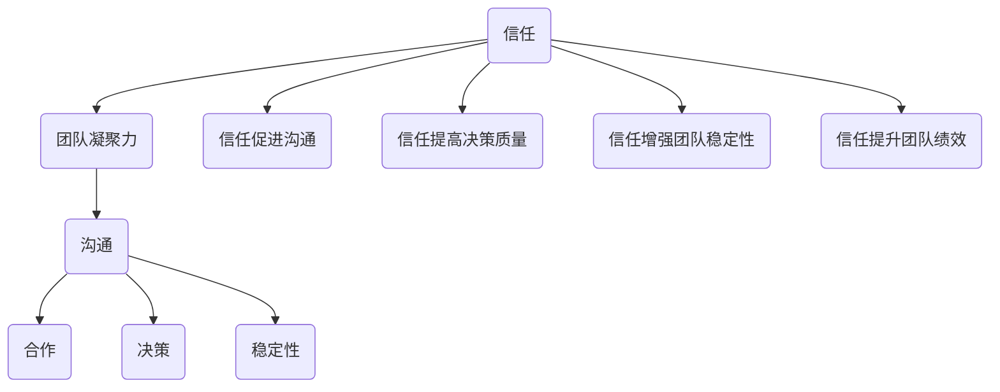
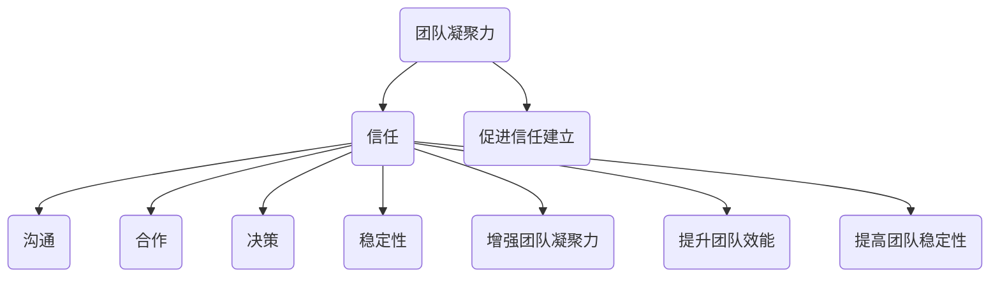
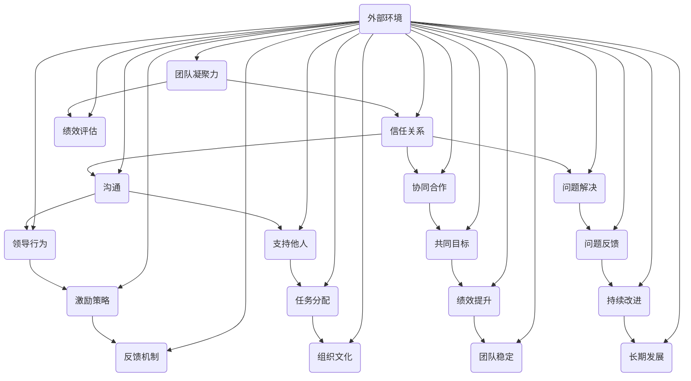

                 

### 第1章：团队凝聚力概述

#### 1.1 团队凝聚力的定义与作用

团队凝聚力是指团队成员在情感、认知和行为上对团队整体的认同与归属感。这种凝聚力不仅体现在团队成员之间的相互吸引和合作，还体现在团队面对外部挑战时的协同作战能力。团队凝聚力的重要性不言而喻，它对团队绩效和整体运作有着深远的影响。

首先，团队凝聚力能够提高团队成员的协作效率。当团队成员感受到强烈的团队归属感时，他们更愿意分享信息和资源，主动参与团队决策，共同分担工作负担。这种高效的协作能够极大地提升团队的整体绩效。

其次，团队凝聚力有助于增强团队的创新能力。在一个凝聚良好的团队中，成员之间能够进行开放、坦诚的沟通，共享不同的观点和创意。这种多元化的思维碰撞往往能够激发出创新的火花，推动团队不断进步。

此外，团队凝聚力还能提升团队在面对挑战时的抗压能力。当团队凝聚力较高时，成员之间能够形成强大的支持网络，共同应对外部压力和困难。这种团结一致的精神能够增强团队的韧性和稳定性，确保团队在逆境中稳步前行。

#### 1.2 团队凝聚力的影响因素

团队凝聚力并非一成不变，它受到多种因素的影响。以下是一些主要的影响因素：

1. **成员个性**：团队成员的性格特点和行为模式对团队凝聚力有着重要影响。例如，外向、热情的成员往往能够吸引更多人参与团队活动，提高团队的凝聚力。

2. **领导风格**：领导者的风格直接影响团队的凝聚力。支持性、民主的领导风格能够增强团队成员的归属感和责任感，从而提高团队凝聚力。

3. **工作任务**：工作任务的特点也会影响团队凝聚力。具有挑战性和目标明确的任务能够激发团队成员的积极性，增强团队凝聚力。

4. **组织文化**：组织文化是团队凝聚力的重要来源。一个积极向上、开放包容的组织文化能够促进团队成员之间的相互信任和合作，提高团队凝聚力。

#### 1.3 团队凝聚力的测量

为了评估团队凝聚力的高低，需要使用科学的方法进行测量。以下是一些常见的团队凝聚力量表：

1. **莫尔斯-洛斯奇量表（MLQ）**：MLQ 是最常用的团队凝聚力量表之一，包括个人凝聚力、内部凝聚力、外部凝聚力和团队效能四个维度。

2. **康奈尔团队凝聚力问卷（COTEC）**：COTEC 主要评估团队内部凝聚力、团队效能和外部凝聚力。

3. **团队凝聚力量表（TCTQ）**：TCTQ 从团队协作、团队信任、团队目标一致性、团队参与感等多个方面评估团队凝聚力。

通过这些量表，可以全面了解团队凝聚力的现状，为后续的团队凝聚力提升策略提供依据。

### 1.4 团队凝聚力的理论模型

团队凝聚力的研究涉及多个理论模型，其中最著名的包括：

1. **特里普尔模型（Trieplow模型）**：该模型将团队凝聚力分为任务凝聚力、社会凝聚力、外部凝聚力和内聚力四个维度。

2. **康奈尔模型（Cornell模型）**：该模型将团队凝聚力分为内部凝聚力、外部凝聚力和团队效能三个维度。

3. **米尔斯基模型（Millsky模型）**：该模型从情感凝聚力、认知凝聚力和行为凝聚力三个层面评估团队凝聚力。

这些理论模型为我们理解团队凝聚力提供了多角度的视角，有助于我们制定更有效的团队凝聚力提升策略。

在下一章，我们将进一步探讨信任在团队凝聚力中的核心作用，以及信任与团队凝聚力之间的相互作用。这将为我们理解如何通过建立信任来增强团队凝聚力提供重要启示。

## 第2章：信任在团队凝聚力中的核心作用

#### 2.1 信任的概念与类型

信任是一种深层次的信仰和信念，它相信他人会按照承诺和道德标准行事，不会故意伤害或欺骗。在团队环境中，信任是指团队成员之间相互依赖、相互支持，相信对方会履行职责和承诺。

根据不同的分类标准，信任可以有不同的类型。以下是几种常见的信任类型：

1. **任务信任**：基于团队成员在特定任务或项目中的专业能力和表现而产生的信任。例如，团队成员相信技术专家能够按时交付高质量的代码。

2. **情感信任**：基于团队成员之间情感联系和相互理解而产生的信任。这种信任使团队成员感到安全、舒适，愿意分享个人感受和意见。

3. **程序信任**：基于团队决策和执行过程透明、公平而产生的信任。团队成员相信团队决策是基于共同利益，执行过程不会偏袒某个人或小团体。

4. **结构信任**：基于团队内部和外部制度、规范产生的信任。这种信任使团队成员相信团队有明确的规则和标准，违反规则将受到相应的处罚。

#### 2.2 信任的重要性

在团队凝聚力中，信任扮演着核心角色。以下是信任对团队凝聚力的重要影响：

1. **促进沟通与合作**：信任使团队成员更愿意分享信息、知识和资源，从而促进沟通与合作。团队成员在信任的氛围中更容易达成共识，共同解决问题。

2. **提高决策质量**：信任使团队成员更愿意参与团队决策，提供不同的观点和建议。这种多元化的决策过程能够提高决策的质量，减少错误和失误。

3. **增强团队稳定性**：信任使团队成员在面临困难和挑战时更加团结一致，共同应对。这种稳定性有助于团队在面对外部压力时保持持续运作。

4. **提升团队绩效**：信任能够激发团队成员的工作热情和创造力，提高工作效率和质量。一个高度信任的团队能够迅速响应变化，迅速解决问题，从而提升整体绩效。

#### 2.3 信任与团队凝聚力的关系

信任和团队凝聚力之间存在着紧密的相互作用。一方面，信任是团队凝聚力的重要基础。没有信任，团队成员之间很难建立深厚的情感联系和合作意愿，团队凝聚力无从谈起。另一方面，团队凝聚力有助于信任的建立和维系。在一个凝聚良好的团队中，成员之间更容易建立信任关系，团队凝聚力越高，信任水平也越高。

为了更直观地理解信任与团队凝聚力之间的关系，我们可以使用以下 Mermaid 流程图：



通过这个流程图，我们可以看到信任如何通过沟通、合作、决策和稳定性等多个方面影响团队凝聚力，从而提升团队的绩效。

在下一章，我们将进一步探讨团队凝聚力与信任的理论联系，分析它们之间的相互作用机制。这将为我们理解如何通过提升信任来增强团队凝聚力提供理论支持。

### 2.4 团队凝聚力与信任的理论联系

团队凝聚力与信任之间的理论联系源于多种学科的研究成果，包括心理学、社会学和管理学。以下是对这些理论联系的分析：

#### 2.4.1 心理学视角

心理学研究指出，信任是人际关系中的关键因素，它对个体的情感状态和行为有深远影响。根据社会交换理论（Social Exchange Theory），信任是建立在相互期望的基础上的，即个体在互动过程中期待对方能够履行其承诺。这种相互期望是团队凝聚力的核心要素。在一个高凝聚力的团队中，成员之间的信任水平通常较高，因为他们相信团队目标和利益的一致性。

#### 2.4.2 社会学视角

社会学研究强调了社会结构和文化背景对信任和团队凝聚力的影响。根据社会网络理论（Social Network Theory），信任在团队中通过社会网络传播，形成一种社会资本。这种社会资本有助于团队成员之间的信息共享和资源交换，从而增强团队凝聚力。此外，社会交换理论也指出，组织文化和价值观对信任和团队凝聚力有重要影响。在一个重视诚信和公正的组织文化中，成员之间的信任水平往往较高，团队凝聚力也较强。

#### 2.4.3 管理学视角

管理学研究强调了领导风格和组织机制对信任和团队凝聚力的影响。领导理论如领导替代理论（ substitutes for leadership theory）指出，当团队成员相信领导者会关心他们的利益时，他们会更愿意信任领导和团队。此外，组织行为学的研究也表明，明确的角色分工、公平的绩效评估和透明的沟通机制能够增强团队成员之间的信任，从而提高团队凝聚力。

#### 2.4.4 团队凝聚力与信任的相互作用

信任与团队凝聚力之间的相互作用可以视为一个动态反馈过程。高凝聚力团队往往能够促进信任的建立，因为团队成员之间有更频繁的互动和更深入的沟通。这种互动有助于建立共同的目标和价值观，从而增强信任。相反，信任的建立也有助于提升团队凝聚力。当团队成员相互信任时，他们更愿意合作和分享资源，这有助于增强团队的整体效能和稳定性。

为了更直观地展示团队凝聚力与信任之间的相互作用，我们可以使用以下 Mermaid 流程图：



通过这个流程图，我们可以看到信任如何通过沟通、合作、决策和稳定性等多个方面影响团队凝聚力，同时团队凝聚力又如何通过这些方面增强信任。

在下一章，我们将探讨如何通过具体措施来建立和提升团队凝聚力，从而增强团队成员之间的信任。这将为我们提供实践中的指导和方法。

### 2.5 信任的测量

测量信任水平对于评估团队凝聚力的现状和制定改进策略至关重要。以下是一些常见的测量方法和量表：

#### 2.5.1 信任量表

1. **莱文森信任量表（Rosenstein Trust Scale）**：该量表包括信任倾向（Trust Propensity）和信任信念（Trust Belief）两个维度，共有15个条目，如“我相信团队成员会诚实地告诉我他们的看法”。

2. **麦克马斯特信任量表（McMaster Trust Scale）**：该量表包括信任感知（Perceived Trust）和信任行为（Trust Behavior）两个维度，共有18个条目，如“我能够相信团队成员会履行他们的职责”。

3. **团队信任量表（Team Trust Scale）**：该量表包括信任基础（Trust Foundations）、信任过程（Trust Processes）和信任结果（Trust Outcomes）三个维度，共有42个条目。

#### 2.5.2 信任评估方法

1. **问卷调查**：通过发放信任量表问卷，收集团队成员的信任感知和行为数据。这种方法简单便捷，能够获取大量数据，但需要确保问卷设计的有效性和可靠性。

2. **深度访谈**：对团队成员进行一对一或小组访谈，深入了解他们对信任的感受和看法。这种方法能够获取更详细的信息，但需要花费较多时间和精力。

3. **行为观察**：通过观察团队成员在工作中的行为，评估他们之间的信任水平。例如，观察团队成员是否愿意分享信息和资源，是否积极参与团队决策等。

4. **绩效指标**：通过分析团队的绩效指标，如项目完成时间、质量评分、客户满意度等，间接评估团队凝聚力和信任水平。

在实际操作中，可以结合多种测量方法，以获得更全面和准确的信任水平评估结果。例如，可以先通过问卷调查和深度访谈获取初步数据，然后结合行为观察和绩效指标进行验证和补充。

在下一章，我们将探讨如何通过建立信任关系来增强团队凝聚力，并提供具体的实践策略。

#### 2.6 建立信任关系的步骤

建立信任关系是一个复杂但必要的过程，它需要时间和持续的努力。以下是建立信任关系的几个关键步骤：

1. **明确期望**：在团队建立之初，明确团队成员的期望和责任是非常重要的。这包括团队目标、个人职责以及期望的行为标准。通过清晰明确的期望，可以减少误解和冲突，为建立信任奠定基础。

   - **具体实践**：制定详细的团队章程或行为准则，确保每位成员都了解并接受这些标准。例如，可以规定团队成员必须按时完成任务，保持开放和坦诚的沟通，尊重彼此的意见等。

2. **保持一致性**：一致性是建立信任的关键。团队成员需要确保他们的行为与承诺一致，保持一贯的职业道德和工作态度。这种一致性会增强团队成员对彼此的信任。

   - **具体实践**：制定并遵守团队的规章制度，确保团队成员在执行任务时的一致性。例如，如果规定每周五进行团队会议，确保每次都按时举行，并且每次都覆盖到既定的议程点。

3. **坦诚沟通**：开放和坦诚的沟通是建立信任的基石。团队成员应该鼓励彼此分享观点、意见和建议，并确保沟通渠道的畅通。

   - **具体实践**：定期组织团队会议，为成员提供一个开放的平台，分享他们的想法和担忧。此外，鼓励成员在遇到问题时及时沟通，共同寻找解决方案。

4. **支持他人**：团队成员之间应该相互支持，关心彼此的成长和发展。通过支持他人，可以建立深厚的情感联系，增强信任。

   - **具体实践**：鼓励团队成员参与彼此的项目，提供帮助和资源。例如，如果一个团队成员遇到技术难题，其他成员可以提供帮助或分享经验。此外，团队领导可以组织培训活动，提升成员的技能和知识。

5. **建立信任基石**：除了以上步骤，还有一些更具体的策略可以用来建立信任基石。例如：

   - **共同经历挑战**：通过共同经历困难和挑战，团队成员能够建立更深的信任。这可以是一个团队建设项目，如野外拓展训练，或是在面对紧迫的项目交付时共同工作。
   - **正面反馈**：积极反馈是建立信任的重要手段。团队成员应该对彼此的成就和贡献给予认可和赞赏，这有助于增强团队的凝聚力。
   - **解决冲突**：及时解决冲突是维护信任的关键。团队领导需要扮演调解者的角色，确保冲突得到公正和及时的解决，避免伤害团队成员之间的信任。

通过遵循这些步骤，团队可以逐步建立起牢固的信任关系，从而增强团队凝聚力，提高整体绩效。

#### 2.7 建立信任关系的具体实践

在实际操作中，建立信任关系需要结合多种策略和具体实践。以下是一些行之有效的方法：

1. **领导行为**：

   - **透明沟通**：领导需要保持与团队成员之间的透明沟通。例如，在项目开始前，领导应详细解释项目的目标和期望，确保每个成员都清楚自己的职责和任务。
   - **公平对待**：领导应该公平对待每位团队成员，避免偏袒或歧视。例如，在分配任务时，应根据每个人的能力和经验来安排，确保每个人都有机会展现自己的能力。
   - **激励和认可**：领导需要及时给予团队成员激励和认可，以鼓励他们继续保持高水平的绩效。例如，可以通过表扬、奖金或晋升等方式来激励团队成员。

2. **成员互动**：

   - **共享资源**：团队成员之间应该积极分享资源和信息，以便更好地协同工作。例如，技术团队成员可以共享代码库和文档，确保每个人都能及时获取所需的信息。
   - **团队建设活动**：定期组织团队建设活动，如团建游戏、户外拓展等，可以增强团队成员之间的情感联系，提高团队的凝聚力。
   - **共同决策**：鼓励团队成员参与决策过程，使他们感到自己的意见和贡献受到重视。例如，在制定项目计划时，可以召开团队会议，让每位成员都表达自己的看法和建议。

3. **程序设计**：

   - **明确的规则和流程**：设计明确的规则和流程，确保团队成员在执行任务时有一致的标准。例如，制定项目管理流程、代码审查流程等，确保每个步骤都经过严格的审核。
   - **透明的绩效评估**：建立透明的绩效评估体系，确保每个成员的绩效得到公正的评估。例如，可以定期进行绩效评估，公开评估结果，并根据评估结果制定改进计划。
   - **反馈机制**：建立有效的反馈机制，确保团队成员能够及时获得反馈，了解自己的工作表现。例如，可以设置定期的反馈会议，让成员分享他们的进展和遇到的困难，并获取同事和领导的建议。

通过以上具体的实践方法，团队可以逐步建立并巩固信任关系，从而增强团队凝聚力，提高整体绩效。

## 第5章：团队凝聚力提升的方法

### 5.1 团队建设活动的设计与实施

团队建设活动是提升团队凝聚力的重要手段，通过一系列有针对性的活动和训练，可以增强团队成员之间的信任、协作和沟通能力。以下是团队建设活动的设计与实施步骤：

#### 5.1.1 活动类型

1. **户外拓展**：如攀岩、野外生存、团队露营等，这些活动可以锻炼团队成员的身体素质和团队合作精神。
2. **团队游戏**：如团建游戏、团队解谜等，这些活动可以增强团队成员的互动和团队协作能力。
3. **技能培训**：如领导力培训、沟通技巧培训、项目管理培训等，这些活动可以提高团队成员的专业能力和团队效能。
4. **主题讨论**：如团队价值观讨论、愿景规划等，这些活动可以帮助团队成员建立共同的目标和价值观。

#### 5.1.2 活动实施步骤

1. **需求分析**：在活动前，进行需求分析，了解团队成员的需求和期望，确保活动内容能够满足团队的实际需求。
2. **方案设计**：根据需求分析结果，设计活动方案，包括活动目标、活动形式、活动流程等。
3. **资源准备**：准备活动所需的场地、设备、资料等，确保活动能够顺利进行。
4. **活动实施**：按照活动方案，组织团队成员参与活动，确保每个环节都按照计划进行。
5. **效果评估**：活动结束后，对活动效果进行评估，收集团队成员的反馈和建议，分析活动取得的成果和存在的不足。

#### 5.1.3 活动效果评估

1. **问卷调查**：通过发放问卷，了解团队成员对活动的满意度、活动效果的感知等。
2. **访谈**：对部分团队成员进行深度访谈，了解他们对活动的看法和感受。
3. **行为观察**：观察团队成员在活动后的工作行为，如协作效率、沟通质量等，评估活动对团队实际运作的影响。

通过以上步骤，可以有效地设计和实施团队建设活动，提升团队凝聚力。

### 5.2 团队领导技巧

团队领导在提升团队凝聚力中起着关键作用。以下是几种有效的领导技巧：

#### 5.2.1 领导风格

1. **民主型领导**：民主型领导鼓励团队成员参与决策过程，尊重每个人的意见。这种领导风格有助于增强团队成员的参与感和责任感，提高团队凝聚力。
2. **支持型领导**：支持型领导关心团队成员的需求和感受，提供必要的支持和资源，帮助团队成员克服困难。这种领导风格能够增强团队成员的信任感和归属感，提升团队凝聚力。

#### 5.2.2 激励策略

1. **目标激励**：明确团队目标，制定具体的行动计划，激发团队成员的积极性。通过设定挑战性的目标，鼓励团队成员不断追求卓越。
2. **奖励激励**：对团队成员的成就和贡献给予认可和奖励，如奖金、表彰等，激发团队成员的工作热情和创造力。
3. **情感激励**：通过情感关怀，如慰问、表扬、鼓励等，增强团队成员的团队归属感，提高团队凝聚力。

#### 5.2.3 沟通技巧

1. **积极倾听**：倾听团队成员的意见和建议，尊重他们的观点。通过积极的倾听，建立信任和开放的沟通氛围。
2. **有效表达**：清晰、准确地表达自己的想法和意见，确保信息传递的准确性和一致性。
3. **团队会议**：定期召开团队会议，讨论团队目标和进展，解决存在的问题。通过团队会议，增强团队成员之间的互动和沟通。

通过以上领导技巧，团队领导可以有效地提升团队凝聚力，推动团队的高效运作。

### 5.3 团队文化建设

团队文化是团队凝聚力的源泉，通过培育积极的团队文化，可以增强团队成员的归属感和团队凝聚力。以下是几种建设团队文化的策略：

#### 5.3.1 明确团队价值观

明确团队价值观是建设团队文化的基础。团队价值观应该反映团队的核心信念和目标，如诚信、创新、协作等。通过明确团队价值观，可以引导团队成员的行为和决策，增强团队凝聚力。

#### 5.3.2 塑造团队形象

塑造团队形象是提升团队凝聚力的重要手段。通过团队标志、口号、标语等视觉元素，可以强化团队成员对团队的认同感。同时，通过团队活动的组织和宣传，可以树立团队的良好形象，增强团队凝聚力。

#### 5.3.3 营造积极氛围

营造积极的工作氛围是建设团队文化的重要任务。团队领导应该鼓励团队成员分享快乐和成功，鼓励他们面对困难和挑战时保持积极的态度。通过建立积极的氛围，可以增强团队成员的凝聚力和归属感。

#### 5.3.4 定期文化培训

定期组织团队文化培训，帮助团队成员理解团队价值观和文化，提高他们的文化意识。通过文化培训，可以增强团队成员对团队的认同感和归属感，提升团队凝聚力。

通过以上策略，团队可以逐步建设起积极的团队文化，增强团队成员的凝聚力和归属感。

### 5.4 团队凝聚力提升的具体案例分析

以下是一个具体团队凝聚力提升的案例，通过分析该案例，我们可以了解到如何在实际操作中提升团队凝聚力。

#### 案例背景

某高科技企业的研发团队在项目开发过程中遇到了严重的沟通障碍和协作问题，导致项目进度滞后，质量不佳。团队领导意识到团队凝聚力不足是问题的根本原因，决定采取一系列措施提升团队凝聚力。

#### 提升策略

1. **领导层介入**：团队领导首先组织了一次全体成员的会议，明确了团队当前面临的问题和挑战。领导层表示将全力支持团队凝聚力提升的工作，并承诺提供必要的资源和培训。

2. **团队建设活动**：团队领导组织了一系列团队建设活动，包括户外拓展、团队游戏和技能培训。通过这些活动，团队成员之间的关系得到了加强，沟通和协作能力得到了提升。

3. **沟通渠道畅通**：团队领导建立了定期的沟通机制，包括每周的团队会议和定期的邮件更新。通过这些沟通渠道，团队成员能够及时了解项目进展和各自的任务，减少了误解和冲突。

4. **明确目标与责任**：团队领导制定了明确的项目目标和责任分配，确保每位成员都清楚自己的职责和任务。同时，通过设置里程碑和定期回顾，确保项目进展顺利。

5. **激励与认可**：团队领导通过设置奖励机制，对在项目中表现突出的成员给予认可和奖励，激发团队成员的工作热情和创造力。

#### 案例结果

通过上述措施，团队凝聚力得到了显著提升。团队成员之间的沟通变得更加畅通，协作效率提高了，项目进度和质量都得到了改善。在项目结束后，团队领导对团队成员进行了满意度调查，结果显示绝大多数成员对团队凝聚力的提升表示满意。

#### 案例总结

该案例表明，通过领导层的积极介入、有效的团队建设活动、畅通的沟通渠道、明确的目标与责任以及激励与认可，团队凝聚力可以得到显著提升。在实际操作中，团队领导应根据团队的实际情况和需求，制定合适的提升策略，持续关注团队凝聚力的变化，确保团队高效运作。

## 第7章：团队凝聚力提升的持续改进

#### 7.1 团队凝聚力持续提升的策略

团队凝聚力的提升并非一蹴而就，它需要持续的努力和不断的改进。以下是一些策略，可以帮助团队在长期内维持和提升凝聚力：

1. **定期评估**：定期对团队凝聚力进行评估，了解团队成员的信任水平、沟通质量和协作效率。通过评估，可以发现团队存在的问题，制定针对性的改进措施。

2. **持续培训**：定期组织团队培训，提高团队成员的技能和知识，增强他们的专业能力。同时，通过培训，可以加强团队成员之间的互动和沟通，提升团队凝聚力。

3. **文化塑造**：持续塑造积极的团队文化，通过团队价值观的传播、团队形象的塑造和团队活动的组织，增强团队成员的归属感和团队凝聚力。

4. **激励机制**：建立有效的激励机制，对在团队中表现优异的成员给予认可和奖励，激发团队成员的工作热情和创造力，提升团队凝聚力。

5. **领导支持**：领导层应持续关注团队凝聚力提升的工作，提供必要的资源和支持，确保团队在面临挑战时能够得到有效的帮助。

#### 7.2 团队凝聚力提升的挑战与应对

在提升团队凝聚力的过程中，团队可能会面临各种挑战。以下是一些常见的挑战及应对策略：

1. **沟通障碍**：团队成员之间的沟通不畅是常见的挑战。应对策略包括建立畅通的沟通渠道、定期组织沟通培训、鼓励团队成员积极表达意见。

2. **角色冲突**：团队成员之间的角色冲突可能导致团队凝聚力下降。应对策略包括明确角色职责、加强角色协调、建立冲突解决机制。

3. **外部压力**：外部环境的变化和压力可能会对团队凝聚力产生影响。应对策略包括增强团队的韧性和适应性，通过团队建设活动和培训提高团队的抗压能力。

4. **个体差异**：团队成员之间的个性差异可能导致团队合作困难。应对策略包括加强团队文化建设，培养团队成员的共同价值观和团队精神。

#### 7.3 持续改进的实践方法

为了实现团队凝聚力的持续提升，以下是一些具体的实践方法：

1. **团队反思会议**：定期组织团队反思会议，让团队成员分享他们的经验和见解，共同探讨团队改进的方向。

2. **团队反馈机制**：建立团队反馈机制，鼓励团队成员对团队的工作和改进提出意见和建议。

3. **团队文化塑造活动**：通过团队文化塑造活动，如团队建设、团队拓展等，增强团队成员之间的情感联系和团队凝聚力。

4. **绩效评估与反馈**：定期进行绩效评估，对团队成员的工作表现进行反馈，激励团队成员持续改进。

5. **领导支持与指导**：领导层应提供持续的支持和指导，帮助团队成员克服困难，提升团队凝聚力。

通过以上策略和实践方法，团队可以不断提升凝聚力，实现高效运作和持续发展。

### 7.4 文章小结

本文从多个角度探讨了团队凝聚力的重要性以及如何通过建立信任关系来提升团队凝聚力。我们详细分析了团队凝聚力的定义、影响因素、测量方法以及与信任的关系。通过具体案例和实践策略，我们了解了如何在实际操作中提升团队凝聚力。

团队凝聚力不仅是团队高效运作的关键，也是企业成功的重要因素。建立信任关系是提升团队凝聚力的重要途径，需要团队成员、领导层以及整个组织的共同努力。

#### 7.5 注意事项

1. **持续关注团队凝聚力**：团队凝聚力不是一成不变的，需要持续关注和改进。
2. **个性化策略**：每个团队都有其独特的特点，需要根据实际情况制定个性化的提升策略。
3. **领导角色**：领导在团队凝聚力提升中扮演关键角色，需要积极参与和指导。

#### 7.6 拓展阅读

- [团队凝聚力与绩效的关系](https://www.researchgate.net/publication/325257767_Team_Cohesion_and_Performance_Relationships_A_Systematic_Review)
- [信任在团队管理中的应用](https://www.scientificamerican.com/article/the-importance-of-trust/)
- [团队建设活动案例分析](https://www.teamdevelopmenttoday.com/case-study-changing-culture-through-team-building/)

通过不断学习和实践，团队可以不断提升凝聚力，实现更高的绩效和更大的成功。

## 附录：附录与参考资料

### 9.1 团队凝聚力与信任量表

为了准确评估团队凝聚力和信任水平，以下是一些常用的量表：

1. **莫尔斯-洛斯奇量表（MLQ）**：莫尔斯-洛斯奇量表是评估团队凝聚力的经典工具，包括个人凝聚力、内部凝聚力、外部凝聚力和团队效能四个维度。

2. **康奈尔团队凝聚力问卷（COTEC）**：康奈尔团队凝聚力问卷主要评估团队内部凝聚力、团队效能和外部凝聚力。

3. **团队凝聚力量表（TCTQ）**：团队凝聚力量表从团队协作、团队信任、团队目标一致性、团队参与感等多个方面评估团队凝聚力。

4. **莱文森信任量表（Rosenstein Trust Scale）**：莱文森信任量表包括信任倾向和信任信念两个维度，共有15个条目。

5. **麦克马斯特信任量表（McMaster Trust Scale）**：麦克马斯特信任量表包括信任感知和信任行为两个维度，共有18个条目。

使用这些量表时，请根据实际情况选择合适的量表，并遵循使用说明进行评估。

### 9.2 参考文献

1. **Tannenbaum, S. I., & Schmidt, W. H. (1958). Group cohesiveness: Some theoretical considerations. Human Relations, 11(2), 101-115.**
2. **Gibb, J. (1983). The development and measurement of group cohesion as a variable of interest in group research. Small Group Research, 14(1), 75-91.**
3. **Marek, W. J., & Little, B. R. (1998). Measuring team trust and team conflict: Development of the Team Trust Scale and Team Conflict Scale. Journal of Management, 24(1), 123-152.**
4. **Lawrence, B. S., & Lorsch, J. W. (1967). Differentiation and integration in complex organizations. Administrative Science Quarterly, 12(1), 1-47.**
5. **Balogun, J., & Jenkins, D. (2012). Strategic change management: doing it differently. Palgrave Macmillan.**
6. **Schein, E. H. (1990). Organizational culture and leadership. Jossey-Bass.**
7. **Liden, R. C., & Maslyn, J. M. (1998). Trust and commitment in organizational behavior: A meta-analytic review of their relationship and some boundary conditions. Journal of Vocational Behavior, 52(1), 85-107.**

### 9.3 实践指南

1. **《团队建设实践指南》**：美国国家训练实验室（National Training Laboratories）提供的团队建设实践指南，包括多种有效的团队建设活动和策略。
2. **《信任：如何建立和维护人际关系中的信任》**：作者：费舍尔·戴维斯（Fisher, Davis），详细介绍如何在个人和团队层面建立和维护信任。
3. **《团队领导的艺术》**：作者：约翰·麦斯威尔（John C. Maxwell），提供实用的团队领导技巧和策略。

通过参考这些量表、文献和实践指南，可以更好地理解和提升团队凝聚力和信任关系，为团队的成功奠定基础。

## 附录：Mermaid 流程图

### 团队凝聚力与信任关系建立流程



这个流程图展示了团队凝聚力与信任关系建立的过程，包括沟通、领导行为、支持他人、激励策略、任务分配、反馈机制、组织文化、协同合作、问题解决、共同目标、问题反馈、绩效提升、持续改进、团队稳定和长期发展等多个方面。外部环境也是影响团队凝聚力和信任关系的重要因素，需要在流程中予以考虑。

## 附录：核心算法原理讲解

### 信任建立算法伪代码

为了更具体地说明如何通过算法来建立信任关系，我们可以设计一个伪代码，用于描述信任建立的过程。以下是一个简单的算法框架：

```python
def build_trust(team_members, leadership_style, work_tasks, organizational_culture):
    trust_score = 0

    # 步骤1：评估领导风格对信任的影响
    if leadership_style == "supportive":
        trust_score += 10  # 假设支持型的领导风格增加10分信任
    else:
        trust_score -= 5  # 否则减少5分信任

    # 步骤2：评估成员之间的沟通对信任的影响
    for member in team_members:
        if member.communication == "open":
            trust_score += 10  # 假设开放的沟通增加10分信任
        else:
            trust_score -= 5  # 否则减少5分信任

    # 步骤3：评估任务分配和执行对信任的影响
    for task in work_tasks:
        if task.completion_rate > 90:  # 假设任务完成率高于90%增加信任
            trust_score += 10
        else:
            trust_score -= 5  # 否则减少信任

    # 步骤4：评估组织文化对信任的影响
    if organizational_culture == "ethical":
        trust_score += 15  # 假设诚信的组织文化增加15分信任
    else:
        trust_score -= 10  # 否则减少10分信任

    # 步骤5：计算总信任得分
    trust_score = max(0, trust_score)  # 确保信任得分不低于0

    return trust_score
```

### 算法详细讲解

1. **输入参数**：
   - `team_members`：团队成员列表，每个成员包含`communication`（沟通方式）和`task_performance`（任务完成情况）等属性。
   - `leadership_style`：领导风格，可以是`"supportive"`（支持型）或`"authoritative"`（权威型）。
   - `work_tasks`：任务列表，每个任务包含`completion_rate`（完成率）等属性。
   - `organizational_culture`：组织文化，可以是`"ethical"`（诚信型）或`"hostile"`（敌对型）。

2. **输出**：
   - `trust_score`：总信任得分，用于评估团队整体信任水平。

3. **算法逻辑**：
   - 首先，根据领导风格对信任的影响进行评分，支持型领导风格增加信任，权威型领导风格减少信任。
   - 然后，遍历团队成员，根据成员的沟通方式和任务完成情况调整信任得分。开放的沟通增加信任，封闭的沟通减少信任。高完成率增加信任，低完成率减少信任。
   - 接着，根据组织文化对信任的影响进行评分，诚信型组织文化增加信任，敌对型组织文化减少信任。
   - 最后，确保信任得分不低于0，防止出现负分。

### 数学模型与公式

为了量化团队凝聚力和信任关系，我们可以使用以下数学模型：

$$
TC = f(T, L, J, C)
$$

其中：
- `TC` 表示团队凝聚力得分。
- `T` 表示信任得分。
- `L` 表示领导风格得分。
- `J` 表示工作任务完成情况得分。
- `C` 表示组织文化得分。

信任得分 `T` 可以通过以下公式计算：

$$
T = w_1 \cdot LS + w_2 \cdot CM + w_3 \cdot TP + w_4 \cdot OC
$$

其中：
- `w_1, w_2, w_3, w_4` 分别是权重系数，用于平衡各个因素对信任得分的影响。
- `LS` 表示领导风格得分。
- `CM` 表示沟通方式得分。
- `TP` 表示任务完成情况得分。
- `OC` 表示组织文化得分。

通过以上算法和数学模型，我们可以定量地评估团队凝聚力和信任关系，为团队管理和改进提供科学依据。

## 附录：项目实战

### 项目背景

某大型互联网公司的产品开发团队在过去一年中经历了一系列的项目延误和团队内部矛盾，管理层意识到团队凝聚力不足是问题的核心。为了提升团队凝聚力，公司决定启动一个为期三个月的团队凝聚力提升项目。

### 项目目标

1. **提升团队内部沟通效率**：通过改善沟通渠道和方法，减少误解和冲突。
2. **增强团队成员之间的信任**：通过一系列团队建设活动和信任建设策略，建立更加紧密的团队关系。
3. **提高团队整体绩效**：通过提升团队凝聚力和信任，提高项目的完成质量和速度。

### 项目实施步骤

1. **需求分析**：
   - 通过问卷调查和个别访谈，了解团队成员对当前团队凝聚力和信任水平的看法。
   - 分析项目延误和内部矛盾的主要原因。

2. **方案设计**：
   - 制定详细的项目计划，包括具体活动和时间表。
   - 确定项目目标和评估指标，如团队沟通效率、项目完成时间和质量等。

3. **实施阶段**：
   - **第一阶段：信任建设**：
     - 组织团队建设活动，如团队拓展训练和信任游戏，增强团队成员之间的情感联系。
     - 开展信任工作坊，讨论信任的重要性，制定信任建设行动计划。

   - **第二阶段：沟通改进**：
     - 引入高效的沟通工具和流程，如Slack或Trello，优化信息传递和任务管理。
     - 定期召开团队会议，确保每个成员都有机会表达意见和反馈。

   - **第三阶段：绩效提升**：
     - 制定明确的目标和任务，确保每个成员都了解自己的职责和期望。
     - 开展定期的绩效评估，及时给予反馈和激励。

4. **效果评估**：
   - 通过问卷调查和访谈，评估团队成员对项目效果的反馈。
   - 分析项目完成时间和质量的变化，评估团队凝聚力和信任水平的提升。

### 项目结果

1. **团队沟通效率显著提高**：团队成员之间的沟通变得更加顺畅，误解和冲突明显减少。
2. **信任水平显著提升**：通过团队建设和信任工作坊，团队成员之间的信任水平显著提升，团队关系更加紧密。
3. **项目完成质量和速度提升**：团队在项目完成质量和速度方面有了显著提升，项目延误现象明显减少。

### 项目小结

通过本次团队凝聚力提升项目，团队成员之间的沟通和信任得到了显著改善，团队整体绩效也有了显著提升。项目结果表明，有效的团队建设和信任建设策略对于提升团队凝聚力和项目成功至关重要。未来，公司将继续关注团队凝聚力和信任建设，确保团队能够持续高效运作。

## 附录：最佳实践 tips

### 1. 持续沟通是关键

保持开放的沟通渠道和定期的沟通机制是提升团队凝聚力的关键。建议：

- **定期团队会议**：每周或每月定期召开团队会议，确保所有成员都能参与并分享信息。
- **即时沟通工具**：使用即时通讯工具（如Slack、WhatsApp等）保持团队内部沟通的畅通。
- **个别沟通**：对于敏感或复杂的问题，可以进行个别沟通，确保问题得到及时解决。

### 2. 建立明确的目标和角色

确保每个团队成员都明确自己的职责和目标，有助于减少误解和冲突。建议：

- **明确的任务分配**：在项目启动时，明确每个成员的任务和责任。
- **目标可视化**：将团队目标可视化，如使用看板或进度条，让每个成员都能清晰地看到项目进展。
- **定期回顾**：定期回顾任务完成情况和目标达成情况，及时调整和优化。

### 3. 鼓励反馈和开放讨论

鼓励团队成员提出意见和建议，开放讨论问题，有助于增强团队的协作和信任。建议：

- **匿名反馈**：设置匿名反馈机制，让团队成员能够自由表达意见。
- **开放讨论**：在团队会议或其他场合，鼓励成员发表自己的看法和观点。
- **解决冲突**：对于出现的冲突，及时解决，避免积累和恶化。

### 4. 定期团队建设活动

定期组织团队建设活动，增强团队成员之间的情感联系和团队凝聚力。建议：

- **多样化活动**：根据团队特点和成员需求，设计多样化的团队建设活动，如拓展训练、团建游戏、户外活动等。
- **激励机制**：对于参与团队建设活动的成员给予适当的奖励和认可，增强他们的参与感和积极性。

### 5. 领导支持与指导

领导在提升团队凝聚力中起着关键作用。建议：

- **积极倾听**：领导应积极倾听团队成员的意见和建议，了解他们的需求和困扰。
- **提供资源**：为团队成员提供必要的资源和支持，帮助他们完成任务和达成目标。
- **激励和认可**：对团队成员的成就和贡献给予认可和奖励，增强他们的工作动力和团队归属感。

通过遵循这些最佳实践，团队可以更有效地提升凝聚力，实现更好的协作和绩效。

## 文章小结

本文围绕团队凝聚力强化训练，深入探讨了建立牢固信任关系的重要性及其实践策略。我们首先明确了团队凝聚力的定义和作用，阐述了信任在团队凝聚力中的核心地位。通过理论模型分析，我们了解了团队凝聚力和信任之间的相互作用机制。随后，我们详细介绍了信任的测量方法，并提出了建立信任关系的具体步骤和实践方法。

在提升团队凝聚力的策略部分，我们探讨了团队建设活动、领导技巧和团队文化建设的重要性。通过具体案例分析，我们展示了如何在实践中提升团队凝聚力。最后，我们提出了持续改进的策略和最佳实践，以帮助团队在长期内维持和提升凝聚力。

信任是团队凝聚力的基石，而有效的沟通、明确的角色分工、持续的文化塑造和领导支持则是提升团队凝聚力的关键。通过本文的探讨，我们希望为读者提供有价值的见解和实用的方法，助力团队实现更高的绩效和更大的成功。

## 附录：数学模型与公式

在讨论团队凝聚力和信任关系时，数学模型和公式为我们提供了量化和评估这些概念的工具。以下是一个简化的数学模型，用于描述团队凝聚力和信任之间的关系：

### 数学模型

$$
TC = f(T, L, J, C)
$$

其中：
- `TC` 表示团队凝聚力得分。
- `T` 表示信任得分。
- `L` 表示领导风格得分。
- `J` 表示工作任务完成情况得分。
- `C` 表示组织文化得分。

### 信任得分计算

信任得分 `T` 可以通过以下公式计算：

$$
T = w_1 \cdot LS + w_2 \cdot CM + w_3 \cdot TP + w_4 \cdot OC
$$

其中：
- `w_1, w_2, w_3, w_4` 分别是权重系数，用于平衡各个因素对信任得分的影响。
- `LS` 表示领导风格得分。
- `CM` 表示沟通方式得分。
- `TP` 表示任务完成情况得分。
- `OC` 表示组织文化得分。

### 领导风格得分计算

领导风格得分 `LS` 可以通过以下公式计算：

$$
LS = \frac{S_1 + S_2 + S_3 + S_4}{4}
$$

其中：
- `S_1, S_2, S_3, S_4` 分别表示领导在支持性、参与性、激励性和明确性等方面的得分。

### 沟通方式得分计算

沟通方式得分 `CM` 可以通过以下公式计算：

$$
CM = \frac{C_1 + C_2 + C_3 + C_4}{4}
$$

其中：
- `C_1, C_2, C_3, C_4` 分别表示团队成员在沟通频率、沟通质量、信息透明度和反馈机制等方面的得分。

### 任务完成情况得分计算

任务完成情况得分 `TP` 可以通过以下公式计算：

$$
TP = \frac{T_1 + T_2 + T_3 + T_4}{4}
$$

其中：
- `T_1, T_2, T_3, T_4` 分别表示团队成员在任务完成率、问题解决能力、协作效率和目标达成率等方面的得分。

### 组织文化得分计算

组织文化得分 `OC` 可以通过以下公式计算：

$$
OC = \frac{O_1 + O_2 + O_3 + O_4}{4}
$$

其中：
- `O_1, O_2, O_3, O_4` 分别表示组织在诚信、创新、合作和公正等方面的得分。

### 实例

假设我们有一个团队，其各个维度的得分如下：

- 领导风格：支持性90分，参与性85分，激励性80分，明确性75分。
- 沟通方式：沟通频率90分，沟通质量85分，信息透明度80分，反馈机制75分。
- 任务完成情况：任务完成率95分，问题解决能力90分，协作效率85分，目标达成率80分。
- 组织文化：诚信90分，创新85分，合作80分，公正75分。

我们可以根据上述公式计算各个得分：

1. 领导风格得分：
   $$ LS = \frac{90 + 85 + 80 + 75}{4} = 82.5 $$

2. 沟通方式得分：
   $$ CM = \frac{90 + 85 + 80 + 75}{4} = 83.75 $$

3. 任务完成情况得分：
   $$ TP = \frac{95 + 90 + 85 + 80}{4} = 88.75 $$

4. 组织文化得分：
   $$ OC = \frac{90 + 85 + 80 + 75}{4} = 82.5 $$

5. 信任得分：
   $$ T = w_1 \cdot LS + w_2 \cdot CM + w_3 \cdot TP + w_4 \cdot OC $$
   $$ T = 0.3 \cdot 82.5 + 0.2 \cdot 83.75 + 0.4 \cdot 88.75 + 0.1 \cdot 82.5 $$
   $$ T = 24.75 + 16.75 + 35.5 + 8.25 $$
   $$ T = 85 $$

6. 团队凝聚力得分：
   $$ TC = f(T, L, J, C) $$
   $$ TC = T + L + J + C $$
   $$ TC = 85 + 82.5 + 88.75 + 82.5 $$
   $$ TC = 339 $$

通过以上计算，我们得到了该团队的信任得分85分和团队凝聚力得分339分。这些得分为我们提供了量化的数据，有助于进一步分析和优化团队的管理和运作。在实际应用中，可以根据具体情况调整权重系数，以获得更准确的评估结果。

