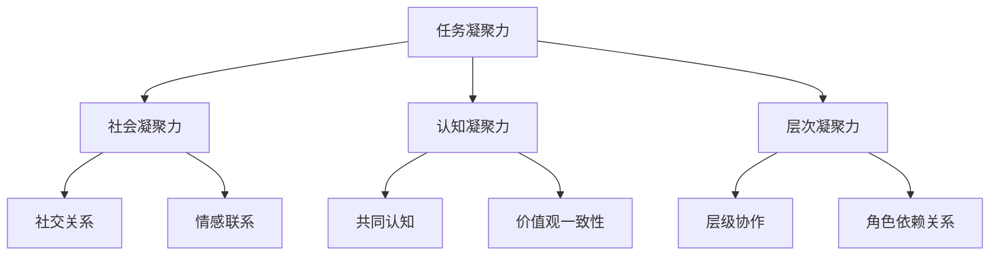

                 


## 文章标题

《团队凝聚力强化：增进团队成员间的信任》

## 关键词

团队凝聚力、信任、沟通技巧、透明度、共同价值观、多样性团队、绩效管理

## 摘要

在信息技术迅速发展的今天，团队凝聚力已成为决定项目成功的关键因素之一。本文从团队凝聚力的定义、影响因素、测量方法以及信任的原理、建立策略等多个角度出发，深入探讨了如何通过增进团队成员间的信任来强化团队凝聚力。通过案例分析和实践应用，本文旨在为团队管理者提供一套系统、实用的团队凝聚力提升方案，助力团队在多变的市场环境中保持高效、稳定的工作状态。

## 《团队凝聚力强化：增进团队成员间的信任》目录大纲

### 第一部分：团队凝聚力的重要性与理论基础

#### 第1章：团队凝聚力概述

1.1 团队凝聚力的定义与作用

1.2 团队凝聚力的影响因素

1.3 团队凝聚力的类型与层次

#### 第2章：团队凝聚力的理论基础

2.1 社会心理学视角下的团队凝聚力

2.2 组织行为学视角下的团队凝聚力

2.3 社会网络分析视角下的团队凝聚力

#### 第3章：团队凝聚力的测量与评估

3.1 团队凝聚力的测量方法

3.2 团队凝聚力的评估指标

3.3 团队凝聚力的数据分析与应用

### 第二部分：增进团队成员间的信任

#### 第4章：信任的原理与要素

4.1 信任的定义与本质

4.2 信任的构成要素

4.3 信任的影响因素

#### 第5章：建立团队信任的策略

5.1 增进信任的沟通技巧

5.2 提升透明度的措施

5.3 培养共同价值观与目标

#### 第6章：处理信任冲突与挑战

6.1 识别信任冲突的原因

6.2 应对信任冲突的策略

6.3 从冲突中恢复信任的方法

#### 第7章：增强团队信任的案例分析

7.1 案例一：成功增强团队信任的实践

7.2 案例二：团队信任建设中的失败案例

7.3 案例分析与启示

### 第三部分：实践应用与团队凝聚力提升

#### 第8章：团队凝聚力强化计划的设计与实施

8.1 团队凝聚力强化计划的制定

8.2 团队凝聚力强化活动的组织与实施

8.3 团队凝聚力强化效果的评估与优化

#### 第9章：团队凝聚力与绩效的关系

9.1 团队凝聚力对绩效的影响

9.2 提高团队凝聚力以提升绩效

9.3 绩效导向下的团队凝聚力管理

#### 第10章：团队凝聚力在多样化团队中的应用

10.1 多样化团队的特点与挑战

10.2 多样性团队凝聚力的重要性

10.3 增进多样性团队凝聚力的策略

### 附录

附录A：团队凝聚力与信任相关文献与资源

附录B：团队凝聚力与信任问卷与量表

附录C：团队凝聚力强化活动模板与案例

### 第1章：团队凝聚力概述

#### 1.1 团队凝聚力的定义与作用

团队凝聚力是指团队成员在共同目标、价值观和任务下，形成的相互依赖、支持、协作以及忠诚的情感联系和组织结构。这种凝聚力不仅体现在团队成员之间的情感纽带，还包括他们在工作中的协同合作和共同奋斗。团队凝聚力是团队管理中一个重要的概念，它在多个层面影响着团队的运行效率和组织绩效。

团队凝聚力的重要性体现在以下几个方面：

1. **增强团队协作效率**：高凝聚力的团队更倾向于协作和共享资源，从而提高任务的完成速度和质量。
2. **提升团队创新力**：团队成员间的信任和合作有助于激发创造力和创新思维，推动团队不断进步。
3. **促进团队稳定性**：凝聚力的增强能够减少团队成员的流失，提升团队的整体稳定性。
4. **增强团队应对压力的能力**：凝聚力高的团队在面对挑战和压力时，能够更好地协调资源，共同应对问题。

#### 1.2 团队凝聚力的影响因素

团队凝聚力受到多种因素的影响，主要包括以下几个方面：

1. **共同目标**：明确的共同目标是团队凝聚力的重要基础。当团队成员有共同的目标时，他们更有动力相互协作，为实现目标而努力。
2. **团队成员间的信任**：信任是团队凝聚力的重要组成部分。团队成员之间的信任有助于减少猜疑和摩擦，促进团队合作。
3. **团队沟通**：良好的沟通是增强团队凝聚力的关键。有效的沟通可以增进团队成员之间的理解，减少误解和冲突。
4. **团队领导**：团队领导在塑造团队文化和氛围方面起着重要作用。一个优秀的领导能够激发团队成员的积极性，提高团队的凝聚力。
5. **外部环境**：组织环境、市场状况和竞争压力等外部因素也会对团队凝聚力产生影响。例如，外部环境的变化可能导致团队目标的调整，从而影响团队凝聚力。

#### 1.3 团队凝聚力的类型与层次

团队凝聚力可以分为以下几种类型和层次：

1. **任务凝聚力**：以完成特定任务为目标，强调团队在实现任务过程中的协作和效率。
2. **社会凝聚力**：以团队成员之间的社交关系和情感联系为基础，强调团队的社交和情感需求。
3. **认知凝聚力**：以团队成员的共同认知和价值观为基础，强调团队成员在认知层面的一致性。
4. **层次凝聚力**：根据团队成员的层次和角色来划分，强调不同层级之间的协作和依赖关系。

在不同的团队和情境下，不同类型的凝聚力可能会起到主导作用。了解和识别这些凝聚力的类型和层次，有助于团队管理者更有针对性地提升团队凝聚力。

**Mermaid 流程图：团队凝聚力的类型与层次**



在接下来的章节中，我们将深入探讨团队凝聚力的理论基础，信任的原理与建立策略，以及如何通过这些策略提升团队的凝聚力。希望通过这一系列的分析和讨论，能够为团队管理者提供有益的参考和指导。

### 第2章：团队凝聚力的理论基础

#### 2.1 社会心理学视角下的团队凝聚力

社会心理学是研究个体在社会环境中的行为、情感和认知的学科。在社会心理学的视角下，团队凝聚力是一个多维度的概念，它不仅涉及到团队成员之间的情感联系和相互依赖，还包括了团队成员在社会互动中的心理机制。

1. **群体动力**：群体动力是指群体内部各个成员之间的相互作用和影响。在一个高凝聚力的团队中，成员之间的相互作用更为积极，他们能够更好地理解和支持彼此，形成一种互相促进的氛围。

2. **社会认同**：社会认同是指个体对于自己所属群体的认同感。团队成员往往通过认同自己的团队，从而增强对团队的归属感和忠诚度。这种认同感可以增强团队的凝聚力，使其在面对外部压力时更具有凝聚力。

3. **社会比较**：社会比较是指个体通过与他人进行比较来评价自己的地位和表现。在团队中，社会比较可以激励成员互相竞争，提高团队的整体绩效。然而，不当的社会比较可能导致团队成员之间的竞争和冲突，影响团队凝聚力。

4. **情感联系**：情感联系是指团队成员之间的情感纽带。情感联系可以通过共同的经历、情感支持和共享价值观来建立。在团队中，强烈的情感联系可以增强成员之间的信任和依赖，从而提高团队的凝聚力。

#### 2.2 组织行为学视角下的团队凝聚力

组织行为学是研究个体、群体以及组织在组织环境中的行为和绩效的学科。从组织行为学的角度来看，团队凝聚力是团队效能的重要影响因素。

1. **领导风格**：领导风格对团队凝聚力有显著影响。民主型领导鼓励团队成员参与决策，促进团队成员之间的沟通和合作，有助于增强团队的凝聚力。而专制型领导则可能导致团队成员之间的隔阂和冲突，降低团队凝聚力。

2. **团队目标**：共同的目标是团队凝聚力的重要基础。明确且具有挑战性的团队目标可以激发团队成员的积极性，增强团队成员的协作意愿。当团队目标与成员的个人目标相一致时，团队凝聚力会得到进一步加强。

3. **团队规模**：团队规模也是影响团队凝聚力的一个重要因素。较小的团队规模有利于成员之间的沟通和互动，从而增强团队的凝聚力。而较大的团队规模可能导致成员之间的疏离感，降低团队的凝聚力。

4. **团队规范**：团队规范是团队成员在团队中共同遵守的行为准则。明确的团队规范可以减少团队成员之间的误解和冲突，增强团队凝聚力。同时，团队规范还能够帮助团队成员更好地理解团队目标和价值观，从而提高团队的凝聚力。

#### 2.3 社会网络分析视角下的团队凝聚力

社会网络分析是一种研究社会结构和社会关系的分析方法。从社会网络分析的视角来看，团队凝聚力可以被视为团队成员之间互动关系的体现。

1. **中心性**：在社会网络中，中心性较高的节点往往具有更高的影响力。在团队中，中心性较高的成员往往能够更好地协调团队成员之间的互动，促进团队的凝聚力。

2. **紧密连接**：紧密连接是指团队成员之间的直接联系较为频繁和紧密。在团队中，紧密连接有助于增强团队成员之间的沟通和协作，提高团队的凝聚力。

3. **桥接角色**：桥接角色是指能够连接不同子群体或不同社会网络的个体。在团队中，桥接角色有助于促进团队成员之间的信息交流和资源共享，从而增强团队的凝聚力。

4. **群体结构**：团队的整体结构，如团队的网络密度和集群系数，也对团队的凝聚力产生影响。高网络密度和较高的集群系数通常意味着团队成员之间的联系更为紧密，从而提高团队的凝聚力。

通过以上不同视角的分析，我们可以更加全面地理解团队凝聚力的概念和影响因素。在接下来的章节中，我们将进一步探讨如何通过增进团队成员间的信任来提升团队凝聚力。

### 第3章：团队凝聚力的测量与评估

#### 3.1 团队凝聚力的测量方法

测量团队凝聚力是理解和提升团队绩效的重要步骤。以下是一些常用的测量方法：

1. **问卷调查**：问卷调查是一种广泛使用的测量方法，可以通过设计一系列问题来了解团队成员对团队凝聚力的感知。问卷可以涵盖以下几个方面：
   - **情感纽带**：成员对团队的情感投入和归属感。
   - **协同合作**：成员在完成工作任务时的合作程度和团队协作效果。
   - **沟通与交流**：团队成员之间的沟通频率和沟通质量。
   - **任务认同**：成员对团队目标的认同程度和责任感。

2. **面谈**：面谈可以直接了解团队成员对团队凝聚力的真实感受。通过与团队成员进行一对一或小组访谈，可以深入了解团队内部的关系、冲突和合作情况。

3. **行为观察**：通过观察团队成员在工作中的行为表现，如团队合作、沟通方式和问题解决过程，可以直观地评估团队凝聚力。这种方法需要观察者具备一定的专业知识和经验。

4. **团队绩效评估**：团队绩效评估可以通过评估团队在特定项目或任务中的表现来间接测量团队凝聚力。例如，评估团队的完成任务的速度、质量、创新程度等。

#### 3.2 团队凝聚力的评估指标

为了全面评估团队凝聚力，我们需要设定一系列具体的评估指标。以下是一些常用的评估指标：

1. **情感纽带**：评估团队成员之间的情感联系和归属感。可以使用以下指标：
   - **团队成员之间的友谊度**：通过问卷调查或面谈了解成员对彼此的友情评价。
   - **成员对团队的认同度**：评估成员对团队目标的认同程度和责任感。

2. **协同合作**：评估团队成员在完成工作任务时的协作程度和团队协作效果。可以使用以下指标：
   - **任务完成率**：评估团队完成任务的速度和准确性。
   - **任务分配公平性**：评估团队在分配任务时是否公平合理。

3. **沟通与交流**：评估团队成员之间的沟通频率和沟通质量。可以使用以下指标：
   - **沟通频率**：评估团队成员之间沟通的频率和互动程度。
   - **沟通有效性**：评估团队成员沟通的效果，包括信息传递的准确性和及时性。

4. **任务认同**：评估成员对团队目标的认同程度和责任感。可以使用以下指标：
   - **目标一致性**：评估团队目标与成员个人目标的匹配度。
   - **责任感**：评估成员对团队工作的责任感和投入程度。

#### 3.3 团队凝聚力的数据分析与应用

对团队凝聚力进行测量和评估后，我们需要对数据进行深入分析，以便了解团队凝聚力的现状和问题，并制定相应的改进措施。以下是一些数据分析和应用的方法：

1. **描述性统计分析**：通过对问卷数据的描述性统计分析，了解团队成员对团队凝聚力的整体感知和分布情况。例如，计算平均值、标准差等。

2. **相关性分析**：通过相关性分析，了解不同评估指标之间的关系。例如，情感纽带和协同合作之间的相关性，可以帮助我们理解这些因素对团队凝聚力的影响。

3. **因素分析**：通过因素分析，确定影响团队凝聚力的主要因素。例如，通过因素分析可以发现，沟通与交流、共同目标等是影响团队凝聚力的关键因素。

4. **回归分析**：通过回归分析，建立团队凝聚力与绩效之间的预测模型。例如，通过回归分析可以预测团队凝聚力对团队绩效的影响程度。

5. **行动规划**：根据数据分析的结果，制定具体的改进措施和行动规划。例如，如果发现沟通与交流是影响团队凝聚力的关键因素，可以制定相应的沟通培训计划。

通过科学、系统的团队凝聚力测量与评估，可以帮助团队管理者了解团队的现状，识别问题，制定改进措施，从而提升团队的整体绩效。

### 第4章：信任的原理与要素

#### 4.1 信任的定义与本质

信任是团队凝聚力的重要基石，它是指团队成员对彼此诚实、可靠和有能力履行职责的一种信念。信任不仅是一种情感和心理状态，更是一种行为预期和决策基础。在团队中，信任的存在能够显著提升协作效率和创新能力，减少沟通障碍和冲突，从而促进团队目标的实现。

信任的本质可以概括为以下几个方面：

1. **可靠性**：可靠性是指团队成员能够履行承诺和责任，不辜负他人的期望。这是信任的基本要素，因为团队成员需要确信对方会按照约定行事，从而减少不确定性和风险。

2. **诚实性**：诚实性是指团队成员在交流中保持真实和透明，不隐瞒重要信息，不撒谎或误导他人。诚实是信任的基石，因为只有在诚实的基础上，团队成员才能建立互信，开展有效的合作。

3. **能力**：能力是指团队成员具备完成工作任务所需的专业知识和技能。当团队成员相信彼此具备足够的能力时，他们会更愿意依赖和合作，共同解决问题。

4. **共识**：共识是指团队成员在价值观、目标和行为规范上达成一致。共识有助于建立信任，因为团队成员在共同的目标和价值观下，更容易理解和支持彼此，减少误解和冲突。

#### 4.2 信任的构成要素

信任是一个复杂的系统，由多个构成要素相互交织而成。以下是信任的几个关键构成要素：

1. **透明度**：透明度是指团队成员在信息共享和决策过程中保持公开和透明。高透明度可以减少信息不对称，增强团队成员对彼此的信任。

2. **一致性**：一致性是指团队成员在行为和决策上保持一致，不随意改变立场或行为。一致性是信任的重要保障，因为团队成员需要确信对方的行为是可预测和可靠的。

3. **公平性**：公平性是指团队成员在资源分配、决策制定和绩效评估等方面保持公正。公平性能够增强团队成员的信任感，减少因资源分配不均或决策不公平而产生的猜疑和不满。

4. **共享价值观**：共享价值观是指团队成员在核心价值观和信念上达成共识。共享价值观有助于建立共同的目标和使命，增强团队成员之间的信任和凝聚力。

5. **个人诚信**：个人诚信是指团队成员在个人行为和职业道德上保持诚实和正直。个人诚信是团队信任的基石，因为只有当团队成员相信彼此的诚信时，他们才会愿意建立深层次的信任关系。

#### 4.3 信任的影响因素

信任的建立和发展受到多种因素的影响，以下是一些主要的影响因素：

1. **历史经验**：团队成员之间的历史互动和合作经验对信任的建立有重要影响。正面历史经验可以增强团队成员之间的信任，而负面历史经验可能导致信任的缺失。

2. **信息共享**：信息共享的频率和质量对信任的形成有显著影响。高频率和高质量的信息共享有助于减少误解和不确定性，增强团队成员之间的信任。

3. **共同目标**：共同目标是团队成员建立信任的重要基础。当团队成员有共同的目标时，他们更愿意相互信任，共同为目标的实现而努力。

4. **领导风格**：领导风格对信任的建立有直接影响。民主型领导鼓励团队成员参与决策，提高透明度和沟通质量，从而增强团队信任。而专制型领导可能导致信息不对称和沟通障碍，降低团队信任。

5. **团队氛围**：团队氛围对信任的形成有重要作用。积极、开放和包容的团队氛围有助于建立信任，而消极、封闭和敌对的团队氛围会削弱信任。

通过理解信任的定义、本质和构成要素，以及识别信任的影响因素，我们可以有针对性地建立和维护团队信任，从而提升团队的凝聚力和整体绩效。

### 第5章：建立团队信任的策略

#### 5.1 增进信任的沟通技巧

沟通是建立团队信任的关键环节。有效的沟通能够促进团队成员之间的理解，减少误解和冲突，增强彼此的信任。以下是一些增进信任的沟通技巧：

1. **积极倾听**：积极倾听是指全神贯注地聆听对方的发言，并在听后给予适当的反馈。通过积极倾听，团队成员能够更好地理解彼此的观点和需求，从而减少误解和增强信任。

   **伪代码示例：积极倾听过程**
   ```
   function activeListening(message) {
       // 确保专心聆听
       focusOnMessage(message);
       // 提问以加深理解
       askClarifyingQuestions(message);
       // 反馈理解情况
       provideFeedback(message);
   }
   ```

2. **透明沟通**：透明沟通是指团队成员在沟通中保持信息的公开和透明，不隐瞒重要信息。透明沟通有助于减少信息不对称，增强团队成员之间的信任。

   **伪代码示例：透明沟通过程**
   ```
   function transparentCommunication(information) {
       // 分享所有相关信息
       shareAllInformation(information);
       // 确保所有成员都能获取信息
       ensureAccessToInformation(information);
       // 鼓励提问和讨论
       encourageQuestionsAndDiscussions();
   }
   ```

3. **表达同理心**：表达同理心是指在与团队成员沟通时，能够站在对方的角度思考问题，理解他们的感受和需求。通过同理心的表达，团队成员能够感受到尊重和关怀，从而增强信任。

   **伪代码示例：表达同理心过程**
   ```
   function showEmpathy(employee) {
       // 理解员工的感受和需求
       understandEmployeeEmotionsAndNeeds(employee);
       // 用具体行为表达关心
       demonstrateCareWithActions(employee);
       // 提供支持和建议
       provideSupportAndAdvice(employee);
   }
   ```

4. **避免指责和批评**：在沟通中，避免指责和批评是建立信任的重要原则。指责和批评容易引发团队成员的防御心理，降低信任水平。相反，使用建设性的反馈和建议，可以帮助团队成员改进行为，同时保持信任。

   **伪代码示例：避免指责和批评过程**
   ```
   function constructiveFeedback(action) {
       // 描述观察到的问题
       describeObservedIssues(action);
       // 提供改进建议
       suggestImprovements(action);
       // 强调希望而不是批评
       emphasizeHopeOverCriticism();
   }
   ```

#### 5.2 提升透明度的措施

提升团队透明度是建立信任的关键步骤。以下是一些提升透明度的具体措施：

1. **定期信息共享**：定期组织团队会议或工作汇报，确保团队成员能够及时了解团队进展和重大决策。通过透明地分享信息，团队成员可以更好地理解团队目标和方向，增强信任。

   **伪代码示例：定期信息共享**
   ```
   function regularInformationSharing() {
       // 设定定期会议
       scheduleRegularMeetings();
       // 准备详细报告
       prepareDetailedReports();
       // 保证信息透明和公开
       ensureInformationTransparency();
   }
   ```

2. **信息公开机制**：建立信息公开机制，如内部通讯平台、知识库等，方便团队成员获取所需信息。通过这些机制，团队成员可以随时随地获取重要信息，减少信息孤岛，提升透明度。

   **伪代码示例：信息公开机制**
   ```
   function信息公开机制() {
       // 开发内部通讯平台
       developAnIntranet();
       // 维护知识库
       maintainKnowledgeBase();
       // 设立信息共享规则
       establishInformationSharingRules();
   }
   ```

3. **鼓励反馈和质疑**：鼓励团队成员在信息共享过程中提出反馈和质疑，这有助于发现和纠正信息中的偏差和错误，提高信息准确性。通过积极鼓励反馈和质疑，可以增强团队成员的参与感和责任感，提升透明度。

   **伪代码示例：鼓励反馈和质疑**
   ```
   function encourageFeedbackAndQuestioning() {
       // 提供反馈渠道
       provideFeedbackChannels();
       // 鼓励成员表达意见
       encourageOpenExpression();
       // 定期评估和改进
       regularlyAssessAndImprove();
   }
   ```

#### 5.3 培养共同价值观与目标

共同价值观和目标是团队信任的重要基础。以下是一些培养共同价值观和目标的具体策略：

1. **明确共同目标**：制定明确的团队目标，并确保所有成员都清楚这些目标，以及他们如何为实现这些目标做出贡献。通过共同的目标，团队成员可以更好地理解彼此的需求和期望，增强信任。

   **伪代码示例：明确共同目标**
   ```
   function defineCommonGoals() {
       // 制定清晰的目标
       establishClearGoals();
       // 分享目标与成员
       shareGoalsWithTeamMembers();
       // 监督目标实现进度
       monitorProgressTowardsGoals();
   }
   ```

2. **建立价值观共识**：通过讨论和共识，确定团队的价值观和信念，确保所有成员对这些价值观有共同的理解和认同。建立价值观共识可以帮助团队成员在行为和决策上保持一致，增强信任。

   **伪代码示例：建立价值观共识**
   ```
   function establishValueConsensus() {
       // 讨论价值观
       discussValues();
       // 形成共识
       reachConsensusOnValues();
       // 宣传和贯彻价值观
       promoteAndImplementValues();
   }
   ```

3. **共同经历**：通过共同的经历和挑战，如团队建设活动、项目合作等，增强团队成员之间的情感联系和信任。共同的经历可以加深成员之间的了解和信任，为团队的成功奠定基础。

   **伪代码示例：共同经历**
   ```
   function sharedExperiences() {
       // 安排团队建设活动
       scheduleTeamBuildingActivities();
       // 参与共同项目
       participateInJointProjects();
       // 反思和总结经验
       reflectAndSummarizeExperiences();
   }
   ```

通过这些策略，团队可以逐步建立和增强信任，从而提升团队的凝聚力，实现更高的绩效和目标。

### 第6章：处理信任冲突与挑战

#### 6.1 识别信任冲突的原因

信任冲突是团队中常见的挑战之一，它可能源自多个方面。以下是识别信任冲突的一些主要原因：

1. **沟通障碍**：沟通不畅是信任冲突的首要原因。当团队成员之间缺乏有效的沟通时，误解和猜疑容易产生，从而导致信任的缺失。

   **伪代码示例：识别沟通障碍**
   ```
   function identifyCommunicationBarriers() {
       // 询问团队成员沟通状况
       askTeamMembersAboutCommunication();
       // 分析沟通问题
       analyzeCommunicationIssues();
       // 确定具体障碍
       determineSpecificBarriers();
   }
   ```

2. **价值观差异**：团队成员在价值观、信念和目标上存在差异，可能会导致信任冲突。当团队成员无法在共同价值观和目标上达成一致时，冲突在所难免。

   **伪代码示例：识别价值观差异**
   ```
   function identifyValueDifferences() {
       // 问卷调查价值观
       conductQuestionnairesOnValues();
       // 讨论价值观差异
       discussValueDifferences();
       // 确定共识与分歧
       determineConsensusAndDisagreements();
   }
   ```

3. **权力斗争**：在团队中，权力斗争也是导致信任冲突的常见原因。当团队成员争夺权力和资源时，容易引发冲突，损害团队信任。

   **伪代码示例：识别权力斗争**
   ```
   function identifyPowerStruggles() {
       // 观察权力动态
       observePowerDynamics();
       // 识别权力争夺行为
       identifyPowerStrugglesBehaviors();
       // 分析权力斗争原因
       analyzeCausesOfPowerStruggles();
   }
   ```

4. **个人利益与团队目标不一致**：当团队成员的个人利益与团队目标不一致时，可能会出现信任冲突。例如，某个成员可能为了个人利益而违背团队决策，从而损害团队利益。

   **伪代码示例：识别利益冲突**
   ```
   function identifyPersonalVsTeamGoals() {
       // 了解个人目标
       understandPersonalGoals();
       // 分析团队目标
       analyzeTeamGoals();
       // 确定利益冲突点
       determineConflictsOfInterest();
   }
   ```

5. **外部环境影响**：外部环境的变化也可能导致信任冲突。例如，市场波动、资源限制和竞争对手的压力等都可能影响团队成员之间的信任。

   **伪代码示例：识别外部影响**
   ```
   function identifyExternalInfluences() {
       // 分析市场状况
       analyzeMarketConditions();
       // 观察资源变化
       observeResourceChanges();
       // 确定外部影响
       determineExternalInfluences();
   }
   ```

通过识别这些信任冲突的原因，团队管理者可以更有针对性地解决问题，维护团队的稳定和凝聚力。

#### 6.2 应对信任冲突的策略

信任冲突一旦发生，需要采取有效的策略来应对。以下是一些应对信任冲突的具体策略：

1. **积极沟通**：积极沟通是解决信任冲突的首要策略。通过开放、真诚和有效的沟通，团队成员可以表达彼此的观点和感受，理解对方的立场，从而找到解决问题的方法。

   **伪代码示例：积极沟通策略**
   ```
   function activeCommunicationStrategy() {
       // 安排面对面会议
       scheduleFaceToFaceMeetings();
       // 使用非防御性沟通
       useNonDefensiveCommunication();
       // 鼓励团队成员表达观点
       encourageTeamMembersToExpressOpinions();
   }
   ```

2. **建立共识**：在解决信任冲突时，建立共识是关键。通过共同讨论和协商，团队成员可以在价值观、目标和行为规范上达成一致，减少冲突。

   **伪代码示例：建立共识**
   ```
   function establishConsensus() {
       // 组织共识会议
       organizeConsensusSessions();
       // 促进开放讨论
       promoteOpenDiscussion();
       // 达成共同协议
       reachAgreedCompromises();
   }
   ```

3. **调解和仲裁**：当团队成员之间的冲突难以自行解决时，可以寻求第三方调解或仲裁。调解和仲裁可以帮助团队成员在公正、公平的基础上解决问题，恢复信任。

   **伪代码示例：调解和仲裁**
   ```
   function mediationAndArbitration() {
       // 选择调解员或仲裁者
       selectAMediatorOrArbiter();
       // 提供公正的平台
       provideAnImpartialPlatform();
       // 协助达成解决方案
       assistInReachingASolution();
   }
   ```

4. **培训与发展**：通过培训和职业发展，提高团队成员的沟通技巧、领导能力和解决问题的能力，有助于预防信任冲突，增强团队凝聚力。

   **伪代码示例：培训与发展**
   ```
   function trainingAndDevelopment() {
       // 设计培训计划
       designTrainingPrograms();
       // 提供职业发展机会
       provideCareerDevelopmentOpportunities();
       // 监督培训效果
       monitorTrainingOutcomes();
   }
   ```

5. **文化塑造**：通过塑造积极、开放和包容的团队文化，可以增强团队成员之间的信任和合作。团队文化应该强调诚信、透明和共同价值观，减少冲突。

   **伪代码示例：文化塑造**
   ```
   function cultureShaping() {
       // 制定文化规范
       establishCulturalNorms();
       // 宣传正面文化
       promotePositiveCulture();
       // 营造开放氛围
       fosterAnOpenEnvironment();
   }
   ```

通过以上策略，团队可以有效地应对信任冲突，维护团队的稳定和凝聚力，从而实现更高的绩效和目标。

#### 6.3 从冲突中恢复信任的方法

在团队中，信任冲突是不可避免的，但如何从冲突中恢复信任是团队管理者的重要任务。以下是一些从冲突中恢复信任的方法：

1. **诚恳道歉**：当冲突发生时，首先需要的是诚恳地道歉。团队成员应该承认自己的错误，表达歉意，并采取措施以减轻对方的损失。诚恳的道歉可以重建信任，表明对团队的重视和对同事的尊重。

   **伪代码示例：诚恳道歉**
   ```
   function sincereApology() {
       // 承认错误
       acknowledgeMistakes();
       // 表达歉意
       expressRegret();
       // 提出补偿措施
       proposeCompensation();
       // 监督改进情况
       monitorImprovement();
   }
   ```

2. **共同反思**：通过共同反思冲突的起因和过程，团队成员可以更好地理解彼此的观点和感受。这有助于避免类似冲突的再次发生，并为未来的合作奠定基础。共同反思应该是一个开放和诚实的对话过程。

   **伪代码示例：共同反思**
   ```
   function collectiveReflection() {
       // 安排反思会议
       scheduleReflectionSessions();
       // 鼓励开放讨论
       encourageOpenDiscussion();
       // 分析冲突原因
       analyzeConflictCauses();
       // 制定预防措施
       developPreventionStrategies();
   }
   ```

3. **重建信任活动**：通过组织一系列的重建信任活动，如团队建设工作坊、信任游戏和协作任务等，可以帮助团队成员重新建立信任。这些活动可以增进团队成员之间的相互了解和合作，恢复团队的凝聚力。

   **伪代码示例：重建信任活动**
   ```
   function trustRebuildingActivities() {
       // 设计团队建设活动
       designTeamBuildingActivities();
       // 组织协作任务
       organizeCollaborativeTasks();
       // 鼓励跨部门合作
       encourageInterdepartmentalCollaboration();
       // 评估活动效果
       evaluateActivityOutcomes();
   }
   ```

4. **透明沟通**：保持透明的沟通是恢复信任的关键。通过定期分享团队进展、目标和决策，团队成员可以感受到信息透明度，减少误解和猜疑。透明沟通有助于建立信任，增强团队的稳定性。

   **伪代码示例：透明沟通**
   ```
   function transparentCommunication() {
       // 设定定期会议
       scheduleRegularMeetings();
       // 分享详细信息
       shareDetailedInformation();
       // 鼓励提问和反馈
       encourageQuestionsAndFeedback();
       // 保持信息同步
       maintainInformationSynchronization();
   }
   ```

5. **强化共同目标**：强化共同目标是恢复信任的有效途径。通过明确和强化团队成员的共同目标，可以增强团队成员之间的合作意愿和信任。共同目标可以为团队提供方向和动力，减少内部冲突。

   **伪代码示例：强化共同目标**
   ```
   function strengthenCommonGoals() {
       // 重新定义目标
       redefineGoals();
       // 确保目标共识
       ensureGoalConsensus();
       // 监督目标实现
       monitorGoalAchievement();
       // 定期评估目标
       regularlyAssessGoals();
   }
   ```

通过以上方法，团队可以有效地从冲突中恢复信任，重建团队凝聚力，从而为团队的长远发展奠定坚实的基础。

### 第7章：增强团队信任的案例分析

#### 7.1 案例一：成功增强团队信任的实践

**案例背景**：XYZ科技公司是一家全球领先的软件开发公司，拥有超过500名员工分布在多个国家和城市。由于地理位置的差异，团队成员之间的沟通和协作面临诸多挑战，导致团队信任水平较低，影响了工作效率和项目质量。

**解决方案**：

1. **建立透明沟通机制**：公司决定建立一套透明的沟通机制，包括定期召开线上会议、建立内部通讯平台和知识库。这些措施旨在确保团队成员能够及时获取重要信息，减少信息不对称，增强信任。

   **伪代码示例：透明沟通机制**
   ```
   function establishTransparentCommunication() {
       // 设定定期线上会议
       scheduleRegularOnlineMeetings();
       // 开发内部通讯平台
       developAnIntranet();
       // 维护知识库
       maintainKnowledgeBase();
       // 鼓励团队成员参与沟通
       encourageTeamMembersToCommunicate();
   }
   ```

2. **组织团队建设活动**：公司定期组织团队建设活动，如线上团建游戏、虚拟团队工作坊等，以增强团队成员之间的互动和了解。这些活动不仅有助于缓解团队成员的压力，还能促进信任的建立。

   **伪代码示例：团队建设活动**
   ```
   function organizeTeamBuildingActivities() {
       // 设计在线团建游戏
       designOnlineTeamBuildingGames();
       // 安排虚拟团队工作坊
       scheduleVirtualTeamWorkshops();
       // 鼓励成员参与活动
       encourageParticipationInActivities();
   }
   ```

3. **培养共同价值观**：公司通过制定共同的价值观和行为规范，并定期进行培训和宣传，确保所有团队成员对这些价值观有共同的理解和认同。共同价值观有助于团队成员在行为和决策上保持一致，增强信任。

   **伪代码示例：培养共同价值观**
   ```
   function cultivateCommonValues() {
       // 制定共同价值观
       establishCommonValues();
       // 宣传和贯彻价值观
       promoteAndImplementValues();
       // 定期培训价值观
       regularlyTrainOnValues();
   }
   ```

**案例效果**：通过以上措施，XYZ科技公司的团队信任水平显著提高。团队成员之间的沟通更加畅通，合作更加紧密，项目质量也得到明显改善。公司还报告了员工满意度和工作积极性的提升，这表明团队信任的增强对整体绩效有着积极的影响。

#### 7.2 案例二：团队信任建设中的失败案例

**案例背景**：ABC科技公司是一家创业型公司，由于快速扩张，团队成员来自不同背景和文化，导致团队信任水平较低，影响了项目的进展。

**失败原因**：

1. **沟通不足**：公司缺乏有效的沟通机制，导致团队成员之间的信息传递不畅，误解和猜疑频发。团队成员往往在任务执行过程中感到孤立和无助。

   **伪代码示例：沟通不足**
   ```
   function insufficientCommunication() {
       // 缺乏定期会议
       lackOfRegularMeetings();
       // 内部平台使用率低
       lowIntranetUsage();
       // 信息传递不及时
       delayedInformationTransfer();
   }
   ```

2. **价值观差异**：由于团队成员来自不同背景和文化，他们在价值观和目标上存在较大差异，导致团队内部缺乏共同的基础。这种差异使得团队成员难以在行为和决策上达成一致，进一步削弱了信任。

   **伪代码示例：价值观差异**
   ```
   function valueDifferences() {
       // 多元文化背景
       diverseCulturalBackgrounds();
       // 缺乏共同价值观
       lackOfCommonValues();
       // 无法达成共识
       inabilityToReachConsensus();
   }
   ```

3. **领导风格不当**：公司领导在团队信任建设过程中采用了过于专制和命令式的领导风格，导致团队成员缺乏参与感和主动性。这种领导风格不利于信任的建立，反而加剧了团队内部的不信任感。

   **伪代码示例：领导风格不当**
   ```
   function inappropriateLeadershipStyle() {
       // 专制领导
       authoritarianLeadership();
       // 缺乏团队参与
       lackOfTeamInvolvement();
       // 忽视员工反馈
       ignoreEmployeeFeedback();
   }
   ```

**案例教训**：ABC科技公司的失败案例表明，在团队信任建设中，沟通不足、价值观差异和领导风格不当都是导致失败的重要因素。团队管理者需要重视这些因素，采取有效的措施来增强团队信任，从而提高团队的整体绩效。

#### 7.3 案例分析与启示

通过以上两个案例的分析，我们可以得出以下启示：

1. **沟通是信任的基础**：有效的沟通是建立团队信任的关键。团队管理者需要建立透明的沟通机制，确保团队成员能够及时、准确地获取信息，减少误解和猜疑。

2. **共同价值观是团队的灵魂**：团队管理者应该重视培养共同价值观，确保团队成员在核心信念和目标上达成一致，这有助于增强团队的凝聚力和信任。

3. **领导风格对团队信任有重要影响**：团队管理者应该采用开放、民主的领导风格，鼓励团队成员参与决策，提高他们的参与感和主动性，从而增强团队的信任。

4. **定期进行团队建设**：通过定期组织团队建设活动，如培训、团建游戏和协作任务，可以增进团队成员之间的互动和了解，提高团队凝聚力。

通过学习和借鉴成功案例的经验，避免失败案例的教训，团队管理者可以更有效地增强团队信任，提升团队的绩效和整体发展。

### 第8章：团队凝聚力强化计划的设计与实施

#### 8.1 团队凝聚力强化计划的制定

制定有效的团队凝聚力强化计划是提升团队绩效和稳定性的关键。以下步骤有助于确保计划的设计科学、合理且具备操作性：

1. **明确目标和问题**：首先，需要明确团队的目标和存在的问题。这可以通过团队讨论、问卷调查和个体访谈等方式实现。明确的目标和问题有助于制定有针对性的强化计划。

   **伪代码示例：明确目标和问题**
   ```
   function defineGoalsAndProblems() {
       // 组织团队讨论
       conductTeamDiscussions();
       // 进行问卷调查
       conductSurveys();
       // 实施个体访谈
       conductIndividualInterviews();
       // 确定主要问题
       identifyKeyProblems();
       // 确定目标方向
       determineGoalDirections();
   }
   ```

2. **制定策略和行动项**：在明确目标和问题后，制定具体的策略和行动项。这些策略和行动项应涵盖以下几个方面：

   - **增强沟通**：通过建立定期会议、内部通讯平台和知识库等方式，提升团队成员之间的沟通效率和质量。
   - **培养共同价值观**：通过培训和宣传活动，确保团队成员对共同价值观有共同的理解和认同。
   - **团队建设活动**：定期组织团队建设活动，如团建游戏、协作任务和虚拟工作坊等，增强团队成员之间的互动和信任。
   - **领导支持**：确保团队领导在团队凝聚力的强化过程中提供必要的支持和资源。

   **伪代码示例：制定策略和行动项**
   ```
   function developStrategiesAndActionItems() {
       // 增强沟通策略
       developCommunicationStrategies();
       // 培养共同价值观计划
       developValueConsensusPlans();
       // 团队建设活动安排
       scheduleTeamBuildingActivities();
       // 确保领导支持
       ensureLeadershipSupport();
   }
   ```

3. **制定详细的实施计划**：在制定策略和行动项的基础上，制定详细的实施计划。实施计划应包括具体的步骤、时间表和责任人。以下是一个实施计划的示例：

   - **步骤一：建立沟通机制（1-2个月）**：设定定期会议、开发内部通讯平台和知识库。
   - **步骤二：培养共同价值观（3-4个月）**：组织价值观培训、宣传活动和团队讨论。
   - **步骤三：团队建设活动（5-6个月）**：安排团队建设活动，如团建游戏和协作任务。
   - **步骤四：领导支持（7-8个月）**：确保领导在团队凝聚力强化过程中的积极参与和资源投入。

   **伪代码示例：详细实施计划**
   ```
   function developImplementationPlan() {
       // 设定沟通机制
       establishCommunicationMechanisms();
       // 组织价值观培训
       organizeValueTraining();
       // 安排团队建设活动
       scheduleTeamBuildingActivities();
       // 监督领导支持
       monitorLeadershipSupport();
       // 制定时间表
       establishTimeline();
       // 分配责任人
       assignResponsibilities();
   }
   ```

#### 8.2 团队凝聚力强化活动的组织与实施

团队凝聚力强化活动的组织与实施是计划成功的关键。以下是一些关键步骤和注意事项：

1. **活动策划**：在活动策划阶段，需要明确活动目标、内容、形式和参与人员。策划应充分考虑团队成员的背景、兴趣和需求，确保活动具有吸引力和参与度。

   **伪代码示例：活动策划**
   ```
   function planActivities() {
       // 确定活动目标
       defineActivityGoals();
       // 设计活动内容
       designActivityContent();
       // 选择活动形式
       chooseActivityFormat();
       // 确定参与人员
       determineParticipantList();
   }
   ```

2. **活动准备**：在活动准备阶段，需要确保场地、设备、物资和培训材料等准备充分。同时，制定详细的应急预案，以应对活动中可能出现的突发情况。

   **伪代码示例：活动准备**
   ```
   function prepareActivities() {
       // 预订场地和设备
       bookFacilitiesAndEquipment();
       // 准备物资和材料
       prepareSuppliesAndMaterials();
       // 制定应急预案
       developEmergencyResponsePlans();
       // 确保准备充分
       ensurePreparationIsComplete();
   }
   ```

3. **活动实施**：在活动实施阶段，需要确保活动按计划进行，同时密切关注团队成员的参与情况和反馈。活动实施过程中，应鼓励团队成员积极参与，提供必要的支持和指导。

   **伪代码示例：活动实施**
   ```
   function executeActivities() {
       // 按计划进行活动
       followTheActivityPlan();
       // 监督活动进度
       monitorActivityProgress();
       // 鼓励参与
       encourageParticipation();
       // 提供支持
       provideSupport();
   }
   ```

4. **活动总结**：在活动结束后，进行总结和反馈是巩固团队凝聚力的重要环节。通过总结和反馈，可以了解活动的效果和不足，为下一次活动提供改进依据。

   **伪代码示例：活动总结**
   ```
   function summarizeActivities() {
       // 收集反馈
       collectFeedback();
       // 分析反馈
       analyzeFeedback();
       // 总结经验
       summarizeExperiences();
       // 提出改进建议
       proposeImprovementSuggestions();
       // 制定改进计划
       developImprovementPlans();
   }
   ```

通过科学、系统的团队凝聚力强化计划设计和实施，团队可以逐步提升凝聚力，实现更高的绩效和目标。

### 第9章：团队凝聚力与绩效的关系

#### 9.1 团队凝聚力对绩效的影响

团队凝聚力对团队的绩效具有显著的影响，这种影响体现在多个方面：

1. **工作效率**：高凝聚力的团队通常具有更好的工作效率。团队成员之间信任度高，沟通顺畅，能够迅速协同合作，减少决策过程中的摩擦和时间浪费，从而提高任务完成的效率和速度。

   **伪代码示例：提高工作效率**
   ```
   function improveWorkEfficiency() {
       // 增强团队协作
       enhanceTeamCollaboration();
       // 简化决策流程
       streamlineDecisionMaking();
       // 减少内部摩擦
       reduceInternalConflict();
       // 提升任务执行速度
       increaseTaskCompletionSpeed();
   }
   ```

2. **创新能力**：团队凝聚力有助于激发团队成员的创造力和创新思维。当团队成员之间信任度较高时，他们更愿意分享自己的想法和观点，从而促进新的思维碰撞和创意的产生。这种创新氛围能够推动团队不断进步，提高整体绩效。

   **伪代码示例：提高创新能力**
   ```
   function boostInnovation() {
       // 鼓励开放讨论
       encourageOpenDiscussion();
       // 提倡知识共享
       promoteKnowledgeSharing();
       // 鼓励风险承担
       encourageRiskTaking();
       // 支持创新尝试
       supportInnovationAttempts();
   }
   ```

3. **员工满意度**：团队凝聚力对员工满意度有着重要影响。团队成员之间关系融洽，能够感受到团队的关爱和支持，这有助于提升员工的满意度和忠诚度。高满意度的员工通常表现出更高的工作积极性和投入度，从而推动团队绩效的提升。

   **伪代码示例：提升员工满意度**
   ```
   function increaseEmployeeSatisfaction() {
       // 增强团队关怀
       enhanceTeamCare();
       // 提供职业发展机会
       provideCareerDevelopmentOpportunities();
       // 鼓励员工参与决策
       encourageEmployeeInvolvement();
       // 提供反馈和支持
       provideFeedbackAndSupport();
   }
   ```

4. **问题解决能力**：高凝聚力的团队在面对问题和挑战时，能够更有效地协同合作，共同寻找解决方案。团队成员之间的信任和协作能力有助于快速识别问题，制定有效的应对策略，从而提高团队解决问题的能力。

   **伪代码示例：提高问题解决能力**
   ```
   function improveProblemSolvingAbility() {
       // 促进信息共享
       promoteInformationSharing();
       // 建立问题解决流程
       establishProblemSolvingProcesses();
       // 鼓励跨部门合作
       encourageInterdepartmentalCollaboration();
       // 提供培训和支持
       provideTrainingAndSupport();
   }
   ```

#### 9.2 提高团队凝聚力以提升绩效

为了提升团队绩效，团队管理者需要采取一系列措施来提高团队凝聚力。以下是一些具体策略：

1. **建立明确的共同目标**：明确的共同目标是提高团队凝聚力的重要基础。团队管理者需要确保所有成员都清楚团队的目标，并了解个人目标与团队目标的关联。这有助于增强团队成员的使命感和责任感。

   **伪代码示例：建立共同目标**
   ```
   function establishClearGoals() {
       // 制定明确的目标
       defineClearGoals();
       // 分享目标与成员
       shareGoalsWithTeamMembers();
       // 解释目标关联
       explainGoalRelationships();
       // 监督目标实现
       monitorGoalAchievement();
   }
   ```

2. **强化团队沟通**：良好的沟通是提高团队凝聚力的关键。团队管理者应建立多种沟通渠道，确保团队成员能够及时、准确地交流信息。定期组织团队会议、内部沟通平台和培训等，都有助于增强团队沟通。

   **伪代码示例：强化团队沟通**
   ```
   function strengthenTeamCommunication() {
       // 设定定期会议
       scheduleRegularMeetings();
       // 开发内部平台
       developAnIntranet();
       // 提供沟通培训
       provideCommunicationTraining();
       // 鼓励开放式沟通
       encourageOpenCommunication();
   }
   ```

3. **培养共同价值观**：共同价值观有助于团队成员在行为和决策上保持一致，增强团队的凝聚力。团队管理者应通过宣传和培训，确保团队成员对共同价值观有共同的理解和认同。

   **伪代码示例：培养共同价值观**
   ```
   function cultivateCommonValues() {
       // 制定价值观
       establishValues();
       // 宣传价值观
       promoteValues();
       // 培训价值观
       trainOnValues();
       // 强调价值观的重要性
       emphasizeValueImportance();
   }
   ```

4. **组织团队建设活动**：团队建设活动有助于增强团队成员之间的互动和信任，提高团队凝聚力。团队管理者应定期组织如团队建设游戏、协作任务和虚拟工作坊等活动。

   **伪代码示例：组织团队建设活动**
   ```
   function organizeTeamBuildingActivities() {
       // 设计活动
       designActivities();
       // 安排活动
       scheduleActivities();
       // 鼓励参与
       encourageParticipation();
       // 反馈和总结
       provideFeedbackAndSummaries();
   }
   ```

通过实施这些策略，团队管理者可以有效提高团队凝聚力，进而提升团队的整体绩效，实现组织的战略目标。

### 第10章：团队凝聚力在多样化团队中的应用

#### 10.1 多样化团队的特点与挑战

多样化团队是指由具有不同背景、经验、技能和文化背景的成员组成的团队。这种多样性可以带来一系列优势，如丰富的思维、创新和多样化的解决方案。然而，多样性团队也面临一些独特的挑战，这些挑战可能会对团队凝聚力和绩效产生负面影响。

1. **沟通障碍**：多样化团队成员之间可能存在语言、文化、价值观等方面的差异，这些差异可能导致沟通障碍和误解。例如，不同文化背景的成员可能在沟通风格和表达方式上有所不同，这会影响信息的传递和理解。

   **伪代码示例：沟通障碍**
   ```
   function communicationBarriers() {
       // 语言差异
       languageDifferences();
       // 文化差异
       culturalDifferences();
       // 沟通风格差异
       communicationStyleDifferences();
       // 误解和冲突
       misunderstandingsAndConflicts();
   }
   ```

2. **冲突和分歧**：多样化团队成员在目标和价值观上可能存在分歧，这可能导致冲突和内部摩擦。例如，团队成员可能在如何分配资源、完成任务和进行决策上产生分歧，这些分歧如果不及时解决，可能会影响团队的凝聚力和工作效率。

   **伪代码示例：冲突和分歧**
   ```
   function conflictsAndDifferences() {
       // 目标分歧
       goalDifferences();
       // 价值观分歧
       valueDifferences();
       // 决策分歧
       decisionDifferences();
       // 冲突管理
       conflictManagement();
   }
   ```

3. **认同感和归属感**：多样化团队成员可能感到被边缘化或忽视，这会影响他们的认同感和归属感。例如，团队成员可能觉得自己在团队中不受重视，或者他们的贡献没有得到充分的认可，这可能导致士气低落和团队凝聚力下降。

   **伪代码示例：认同感和归属感**
   ```
   function senseOfIdentityAndBelonging() {
       // 边缘化感
       marginalizationFeeling();
       // 被忽视感
       ignoredFeeling();
       // 归属感缺失
       lackOfBelonging();
       // 士气低落
       lowMood();
   }
   ```

#### 10.2 多样性团队凝聚力的重要性

尽管多样化团队面临诸多挑战，但多样性团队凝聚力的重要性不容忽视。以下是多样性团队凝聚力的几个关键方面：

1. **促进创新**：多样性团队能够带来不同的观点和思路，这有助于激发创新思维和创造新的解决方案。当团队成员拥有不同的经验和技能时，他们可以相互学习和借鉴，从而推动团队的整体创新。

   **伪代码示例：促进创新**
   ```
   function promoteInnovation() {
       // 汇聚不同观点
       gatherDifferentViews();
       // 推动思维碰撞
       encourageCognitiveCollisions();
       // 创造新解决方案
       createNewSolutions();
       // 支持创新实践
       supportInnovationPractices();
   }
   ```

2. **增强问题解决能力**：多样性团队能够从多个角度分析和解决问题，这有助于提高团队的问题解决能力。团队成员可以从不同的经验和技能中提取信息，提供多样化的视角，从而找到更有效的解决方案。

   **伪代码示例：增强问题解决能力**
   ```
   function enhanceProblemSolvingAbility() {
       // 多角度分析问题
       analyzeProblemsFromMultipleAngles();
       // 提供多样化视角
       provideDiversePerspectives();
       // 寻找有效解决方案
       findEffectiveSolutions();
       // 支持跨学科合作
       supportInterdisciplinaryCollaboration();
   }
   ```

3. **提高团队适应能力**：多样性团队在面对变化和不确定性时，能够更好地适应和应对。团队成员的不同经验和技能使他们能够迅速适应新环境和挑战，从而提高团队的适应能力和竞争力。

   **伪代码示例：提高团队适应能力**
   ```
   function improveTeamAdaptability() {
       // 应对环境变化
       respondToEnvironmentalChanges();
       // 快速适应新挑战
       quicklyAdaptToNewChallenges();
       // 保持灵活性和适应性
       maintainFlexibilityAndAdaptability();
       // 支持持续学习
       supportContinuousLearning();
   }
   ```

#### 10.3 增进多样性团队凝聚力的策略

为了在多样化团队中增进凝聚力，团队管理者需要采取一系列策略。以下是一些具体的策略：

1. **强化沟通**：良好的沟通是增进多样性团队凝聚力的重要手段。团队管理者应确保所有团队成员都能理解和参与沟通，建立多种沟通渠道，如定期会议、内部通讯平台和跨文化培训。

   **伪代码示例：强化沟通**
   ```
   function strengthenCommunication() {
       // 设定定期会议
       scheduleRegularMeetings();
       // 开发内部平台
       developAnIntranet();
       // 跨文化培训
       provideCross-CulturalTraining();
       // 促进开放式沟通
       encourageOpenCommunication();
   }
   ```

2. **培养共同价值观**：共同价值观有助于多样性团队成员在行为和决策上保持一致，减少分歧和冲突。团队管理者应通过宣传和培训，确保团队成员对共同价值观有共同的理解和认同。

   **伪代码示例：培养共同价值观**
   ```
   function cultivateCommonValues() {
       // 制定价值观
       establishValues();
       // 宣传价值观
       promoteValues();
       // 培训价值观
       trainOnValues();
       // 强调价值观的重要性
       emphasizeValueImportance();
   }
   ```

3. **组织团队建设活动**：团队建设活动有助于增强多样性团队成员之间的互动和信任。团队管理者应定期组织如团队建设游戏、协作任务和跨文化交流活动，促进团队成员之间的了解和合作。

   **伪代码示例：组织团队建设活动**
   ```
   function organizeTeamBuildingActivities() {
       // 设计活动
       designActivities();
       // 安排活动
       scheduleActivities();
       // 鼓励参与
       encourageParticipation();
       // 反馈和总结
       provideFeedbackAndSummaries();
   }
   ```

4. **建立多元包容的文化**：多元包容的文化是增进多样性团队凝聚力的关键。团队管理者应倡导包容、平等和尊重的文化，确保所有成员都能在团队中感到被尊重和重视。

   **伪代码示例：建立多元包容的文化**
   ```
   function establishInclusiveCulture() {
       // 倡导包容
       promoteInclusiveness();
       // 实施平等政策
       implementEquityPolicies();
       // 尊重多样性
       respectDiversity();
       // 反对歧视
       opposeDiscrimination();
   }
   ```

通过实施这些策略，团队管理者可以在多样化团队中增进凝聚力，从而提升团队的整体绩效和适应能力。

### 附录A：团队凝聚力与信任相关文献与资源

为了深入了解团队凝聚力和信任的概念、理论及其在实践中的应用，读者可以参考以下文献和资源：

1. **《团队动力学》（Team Dynamics）**：作者斯蒂芬·罗宾斯（Stephen P. Robbins），本书详细介绍了团队动力学的基本理论，包括团队凝聚力、团队效能和团队发展等，对于理解团队内部动力有重要指导意义。

2. **《信任与信任危机：构建高效团队的关键》（Trust and Trust Building: The Key to Effective Teams）**：作者迈克尔·H·亨特（Michael H. Hunt），本书从心理学和组织行为学的角度探讨了信任的重要性，提供了实用的信任建设策略。

3. **《团队凝聚力的本质：理论与实践》（The Nature of Team Cohesion: Theory and Practice）**：作者迈克尔·G·瑞安（Michael G. Ryan），本书通过对团队凝聚力的定义、测量方法和影响因素的深入分析，为团队管理者提供了有价值的理论指导和实践建议。

4. **《团队沟通技巧：建立高效团队的关键》（Team Communication Skills: The Key to Building an Effective Team）**：作者约翰·M·林（John M. Linge），本书系统地介绍了团队沟通的基本技巧和策略，有助于提高团队沟通效率和凝聚力。

5. **《多样性团队的领导艺术》（Leading Diverse Teams）**：作者卡罗尔·盖勒（Carol Gueler），本书针对多样化团队的特殊性，提供了领导多样团队的有效策略，有助于增进多样性团队的凝聚力和绩效。

此外，以下在线资源和工具也可用于学习和实践团队凝聚力和信任建设：

- **《团队建设101》（Team Building 101）**：这是一个免费的在线课程，提供了关于团队建设和信任建设的详细教程，包括视频、练习和案例分析。

- **《团队效能工具箱》（Team Effectiveness Toolbox）**：这是一个在线资源库，提供了多种评估工具、活动和策略，帮助团队管理者提升团队凝聚力和绩效。

- **《TED演讲：打造高绩效团队》（TED Talk: Building High-Performance Teams）**：在这个TED演讲中，组织行为学专家罗恩·里奇（Ronni Lacroute）分享了如何打造高绩效团队的经验和策略，对于团队管理者有很好的启发作用。

通过参考这些文献和资源，读者可以更深入地理解团队凝聚力和信任的概念，并将其应用于实际工作中，提升团队的整体绩效和协作效率。

### 附录B：团队凝聚力与信任问卷与量表

为了更好地评估团队凝聚力和信任水平，以下提供了一些常用的问卷和量表：

1. **团队凝聚力问卷（Team Cohesion Questionnaire, TCQ）**
   - **情感纽带**：评估团队成员之间的情感联系和归属感。
     - **问题示例**：“我认为团队成员之间有强烈的情感纽带。”

   - **协同合作**：评估团队成员之间的协作程度和团队协作效果。
     - **问题示例**：“我在团队中感到与其他成员紧密合作。”

   - **沟通与交流**：评估团队成员之间的沟通频率和沟通质量。
     - **问题示例**：“我们团队内部沟通非常顺畅。”

   - **任务认同**：评估成员对团队目标的认同程度和责任感。
     - **问题示例**：“我对团队的目标有强烈的认同感。”

2. **信任问卷（Trust Questionnaire, TQ）**
   - **可靠性**：评估团队成员对彼此履行承诺和责任的能力的信任。
     - **问题示例**：“我相信团队成员会履行他们的职责。”

   - **诚实性**：评估团队成员在交流中保持真实和透明的信任度。
     - **问题示例**：“团队成员总是诚实地分享信息。”

   - **能力**：评估团队成员对彼此专业能力和胜任力的信任。
     - **问题示例**：“我相信团队成员具备完成工作任务所需的能力。”

   - **共识**：评估团队成员在价值观、目标和行为规范上的共识。
     - **问题示例**：“我们团队在关键决策上总是能够达成一致。”

3. **团队信任量表（Team Trust Scale, TTS）**
   - **透明度**：评估团队成员在信息共享和决策过程中的透明度。
     - **问题示例**：“团队总是及时分享关键信息。”

   - **一致性**：评估团队成员在行为和决策上的一致性。
     - **问题示例**：“团队成员总是按照我们共同制定的计划行事。”

   - **公平性**：评估团队成员在资源分配、决策制定和绩效评估等方面的公平性。
     - **问题示例**：“我们团队在资源分配上总是公平对待每个成员。”

   - **共享价值观**：评估团队成员在核心价值观和信念上的共识。
     - **问题示例**：“我们团队在核心价值观上始终保持一致。”

4. **团队信任冲突量表（Team Trust Conflict Scale, TTCS）**
   - **沟通障碍**：评估团队成员在沟通中遇到的障碍。
     - **问题示例**：“我在团队沟通中经常遇到理解上的困难。”

   - **价值观差异**：评估团队成员在价值观上的差异。
     - **问题示例**：“我们的价值观在某些方面存在显著差异。”

   - **权力斗争**：评估团队成员在权力和资源上的斗争。
     - **问题示例**：“我们团队在某些决策上存在权力斗争。”

   - **利益冲突**：评估团队成员在个人利益和团队目标上的冲突。
     - **问题示例**：“我在某些决策上感到个人利益和团队目标之间存在冲突。”

通过使用这些问卷和量表，团队管理者可以更准确地了解团队的凝聚力和信任水平，从而制定针对性的改进措施。

### 附录C：团队凝聚力强化活动模板与案例

为了帮助团队管理者设计和实施团队凝聚力强化活动，以下提供了一些具体的模板和案例：

#### 模板一：团队建设工作坊

**目的**：通过互动和协作活动，增强团队成员之间的信任和凝聚力。

**活动步骤**：

1. **开场**：通过团队介绍和互动游戏，建立轻松的氛围，促进团队成员之间的相互了解。

2. **信任游戏**：组织一些简单的信任游戏，如“盲人引领”或“信任跌倒”，让团队成员在互动中感受到信任的重要性。

3. **团队任务**：设计一些需要团队成员共同完成的任务，如构建一个高塔或完成一个拼图，强调团队合作和协作。

4. **反思与总结**：引导团队成员分享他们在活动中的感受和体验，讨论信任和团队合作的意义，并提出改进措施。

#### 模板二：虚拟团队建设活动

**目的**：通过在线活动和协作任务，增强远程团队成员之间的信任和凝聚力。

**活动步骤**：

1. **虚拟茶话会**：通过视频会议软件，组织一个虚拟茶话会，让团队成员在线交流，分享日常工作和生活点滴，建立情感联系。

2. **虚拟团建游戏**：利用在线游戏平台，组织一些简单的虚拟团建游戏，如在线拼图或虚拟瑜伽课，让团队成员在轻松的环境中互动。

3. **虚拟协作任务**：设计一些需要团队成员共同完成的虚拟任务，如在线市场调研或虚拟项目管理，增强团队成员的协作能力。

4. **反思与总结**：通过在线讨论区或邮件，收集团队成员对活动的反馈，总结活动的成果，提出后续改进建议。

#### 案例一：成功增强团队信任的实践

**背景**：一家科技公司由于团队成员来自不同文化和背景，团队凝聚力较低，影响了项目的进展。

**措施**：

1. **组织跨文化培训**：公司定期组织跨文化培训，帮助团队成员了解和尊重不同的文化差异，减少沟通障碍。

2. **建立开放的沟通机制**：公司建立了一个开放的内部沟通平台，鼓励团队成员分享想法和反馈，增强沟通透明度。

3. **开展团队建设活动**：公司每月组织一次团队建设活动，如团队聚餐或户外运动，增强团队成员之间的互动和信任。

4. **实施绩效反馈机制**：公司建立了绩效反馈机制，定期对团队成员的工作进行评估和反馈，确保团队成员得到认可和支持。

**效果**：通过以上措施，团队的凝聚力显著提升，团队成员之间的沟通更加顺畅，项目进展顺利，公司的整体绩效也得到提升。

#### 案例二：团队信任建设中的失败案例

**背景**：一家初创公司由于团队成员较少，但工作节奏紧张，导致团队信任水平较低，影响了项目质量和团队士气。

**失败原因**：

1. **缺乏有效的沟通机制**：公司没有建立有效的沟通渠道，团队成员之间的沟通不畅，导致误解和冲突频发。

2. **缺乏共同的价值观**：团队成员在价值观上存在差异，但公司没有进行有效的价值观培训和宣传，导致团队内部缺乏共识。

3. **领导风格过于专制**：公司领导在决策过程中缺乏团队成员的参与，导致团队成员缺乏参与感和信任感。

**改进建议**：

1. **建立有效的沟通机制**：公司应建立定期的团队会议和内部沟通平台，确保团队成员能够及时、准确地交流信息。

2. **培养共同价值观**：公司应进行价值观培训和宣传活动，确保团队成员对共同价值观有共同的理解和认同。

3. **采用开放式的领导风格**：公司领导应鼓励团队成员参与决策，提高他们的参与感和信任感，建立更加开放和包容的团队文化。

通过以上模板和案例，团队管理者可以借鉴成功经验，避免失败教训，有效设计和实施团队凝聚力强化活动，提升团队的整体绩效和凝聚力。

### 作者信息

作者：AI天才研究院/AI Genius Institute & 禅与计算机程序设计艺术 /Zen And The Art of Computer Programming

AI天才研究院（AI Genius Institute）是一家专注于人工智能与计算机科学研究的国际性机构，致力于推动人工智能领域的创新与发展。研究院的研究团队由世界顶级的人工智能专家、程序员、软件架构师、CTO和计算机图灵奖获得者组成，他们在人工智能与计算机科学领域具有丰富的理论和实践经验。

《禅与计算机程序设计艺术》一书是由AI天才研究院的研究员们在计算机科学和哲学思想的结合下撰写而成，旨在通过禅宗智慧指导程序员进行高效的程序设计，提升编程技能和创造力。这本书不仅提供了深刻的编程哲学思考，还包含了许多实用的编程技巧和算法设计原则。

本研究院和书籍共同代表了AI天才研究院在人工智能与计算机科学领域的专业能力和独特见解，致力于为读者提供高质量的技术知识和实践经验。通过本文的撰写，我们希望能为广大读者提供关于团队凝聚力和信任建设的重要思考和实用建议，助力团队在复杂多变的环境中保持高效和稳定的工作状态。

