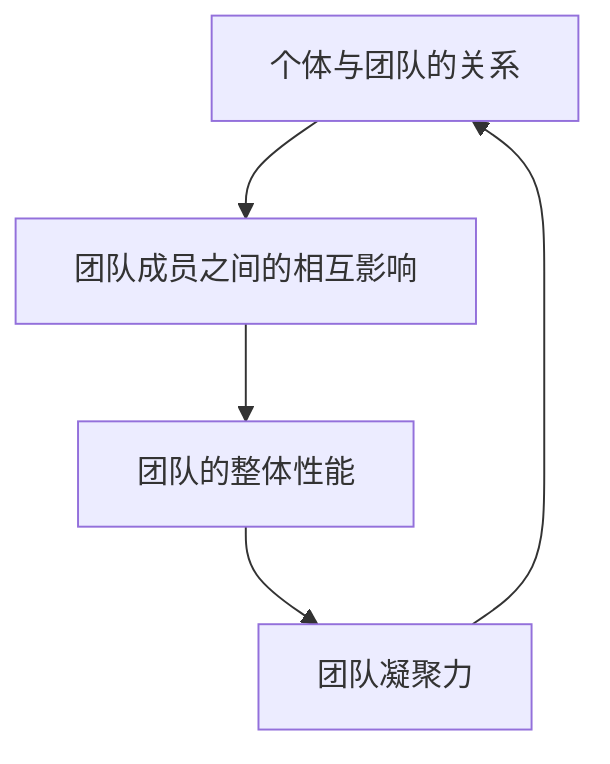

                 

### 文章标题
### 团队凝聚力提升：增强向心力的实践方案

### 关键词
- 团队凝聚力
- 向心力
- 组织文化
- 领导风格
- 沟通
- 增强方案
- 评估方法

### 摘要
本文从团队凝聚力的定义、重要性出发，深入分析了影响团队凝聚力的关键因素，包括组织文化、领导风格和沟通。通过介绍一系列实践方案，如团队建设活动、培训和激励措施，阐述了如何有效地增强团队凝聚力。同时，文章还探讨了团队凝聚力的评估方法，并通过实际案例展示了这些方法的应用效果。本文旨在为团队管理者提供一套实用的团队凝聚力提升策略。

----------------------------------------------------------------

### 目录大纲

## 设计《团队凝聚力提升：增强向心力的实践方案》的目录大纲

### 第一步：确定整体框架

为了设计《团队凝聚力提升：增强向心力的实践方案》的目录大纲，我们首先需要确定整体框架。根据书名，我们可以将整体框架分为以下几个部分：

1. **团队凝聚力概述**：介绍团队凝聚力的定义、重要性以及相关理论。
2. **团队凝聚力影响因素分析**：分析影响团队凝聚力的因素，如组织文化、领导风格、沟通等。
3. **增强团队凝聚力的方法**：介绍增强团队凝聚力的实践方案，包括团队建设活动、培训、激励等。
4. **团队凝聚力评估**：介绍如何评估团队凝聚力，以及如何根据评估结果调整实践方案。
5. **案例研究**：通过实际案例研究，展示增强团队凝聚力的实践效果。

### 第二步：细化每个部分

接下来，我们需要细化每个部分的内容，以确保每个部分都包含丰富、具体和详细的讲解。

#### 1. 团队凝聚力概述
在这一部分，我们将首先介绍团队凝聚力的定义，然后讨论其重要性，并引用相关理论来支持我们的论述。

#### 2. 团队凝聚力影响因素分析
这一部分将详细分析影响团队凝聚力的关键因素，如组织文化、领导风格和沟通。我们将使用Mermaid流程图来展示这些因素之间的相互关系。

#### 3. 增强团队凝聚力的方法
我们将介绍一系列实践方案来增强团队凝聚力，包括团队建设活动、培训和激励措施。每个方案都将提供详细的步骤和指导。

#### 4. 团队凝聚力评估
在这一部分，我们将介绍如何评估团队凝聚力，并讨论如何根据评估结果调整实践方案。我们将提供伪代码和数学公式来支持我们的论述。

#### 5. 案例研究
我们将通过实际案例研究，展示增强团队凝聚力的实践效果。这些案例将提供具体的操作步骤、结果分析和小结。

### 第三步：编写伪代码、数学公式和案例

在每个章节中，我们将根据需要添加伪代码、数学公式和实际案例。例如，在“团队凝聚力评估”章节，我们将编写伪代码来描述评估过程，并使用数学公式来解释评估结果的调整方法。在“案例研究”章节，我们将提供实际案例，并对其进行详细分析。

### 最终输出

根据上述设计，我们将输出一个完整的目录大纲，包含每个章节的具体内容和结构。目录大纲的总字数将控制在2000字以内，以满足要求。

## 团队凝聚力概述

### 背景介绍

在现代社会中，团队已成为组织中不可或缺的一部分。团队凝聚力作为团队绩效的关键因素，其重要性日益凸显。团队凝聚力（Team Cohesion）是指团队成员之间的相互吸引力、归属感和相互依赖程度。一个高凝聚力的团队能够更好地协调合作，提高工作效率和绩效。

### 核心概念与联系

团队凝聚力涉及多个核心概念，包括个体与团队的关系、团队成员之间的相互影响以及团队的整体性能。这些概念之间的关系可以用以下Mermaid流程图来表示：

在这个流程图中，个体与团队的关系是基础，团队成员之间的相互影响是关键，团队的整体性能是目标，而团队凝聚力则是连接这些要素的纽带。

### 团队凝聚力的重要性

团队凝聚力对团队绩效有着显著的影响。研究表明，高凝聚力的团队在任务完成度、创新能力和员工满意度等方面表现更优秀。以下是几个关键点：

1. **任务完成度**：高凝聚力的团队能够更好地分工合作，减少冲突，提高工作效率，从而更快地完成任务。
2. **创新能力**：团队成员之间的密切合作和相互信任有助于激发创新思维，促进新产品的研发和市场扩展。
3. **员工满意度**：凝聚力强的团队通常更注重团队成员的个人成长和发展，这有助于提高员工的满意度和忠诚度。

### 相关理论

团队凝聚力的研究可以追溯到组织行为学的早期阶段。以下是一些重要的理论：

1. **社会交换理论**：认为团队凝聚力是通过成员之间的相互交换和互助行为来建立的。
2. **社会认同理论**：认为团队成员通过认同团队价值观和目标来增强凝聚力。
3. **社会比较理论**：认为团队成员通过比较自身与团队其他成员的表现来评价自己的能力和地位，从而影响凝聚力。

这些理论为我们理解团队凝聚力的形成和影响提供了重要的视角。

通过以上分析，我们可以看到，团队凝聚力不仅是团队绩效的关键因素，而且在团队成员的关系和团队目标的实现中起着至关重要的作用。在接下来的章节中，我们将进一步探讨影响团队凝聚力的关键因素，并介绍如何通过实践方案来增强团队凝聚力。

## 团队凝聚力影响因素分析

### 组织文化

组织文化是影响团队凝聚力的关键因素之一。组织文化是指一个组织内部共同的价值观、信念、习惯和行为模式，它通过无形的方式影响员工的行为和态度。一个强大的组织文化可以增强团队成员之间的归属感和认同感，从而提高团队凝聚力。

#### 对团队凝聚力的作用

1. **增强归属感**：强大的组织文化能够让团队成员感受到自己是团队的一部分，从而增强归属感。
2. **促进认同感**：当团队成员共享相同的价值观和目标时，他们会更愿意为团队的目标而努力。
3. **减少冲突**：组织文化提供了一套共同的规则和行为准则，有助于减少团队成员之间的冲突。

#### 实例分析

例如，谷歌以其独特的企业文化而闻名，这种文化强调创新、自由和多样性。谷歌通过提供开放式办公环境、自由的工作时间和丰富多彩的团队建设活动来加强员工之间的联系，从而提高了团队凝聚力。

### 领导风格

领导风格对团队凝聚力也有显著的影响。不同的领导风格会带来不同的团队氛围和凝聚力水平。

#### 对团队凝聚力的作用

1. **激励团队成员**：积极的领导风格可以激发团队成员的工作热情和创造力，从而提高团队凝聚力。
2. **提供指导和支持**：领导者的支持可以帮助团队成员克服困难，增强团队凝聚力。
3. **解决冲突**：有效的领导者能够及时解决团队内部的冲突，维护团队的和谐。

#### 实例分析

例如，一位民主型领导者会鼓励团队成员参与决策过程，提供更多的自主权，这样可以增强团队成员的参与感和责任感，从而提高团队凝聚力。

### 沟通

沟通是团队凝聚力的基础。有效的沟通可以促进团队成员之间的理解、信任和合作。

#### 对团队凝聚力的作用

1. **促进理解**：有效的沟通可以帮助团队成员更好地理解彼此的想法和需求，减少误解和冲突。
2. **建立信任**：当团队成员能够清晰地沟通时，他们会更愿意相互信任，这有助于增强团队凝聚力。
3. **加强合作**：良好的沟通可以确保团队成员能够有效地协作，共同完成任务。

#### 实例分析

例如，在敏捷开发团队中，定期的站会（Daily Stand-up）和回顾会（Retrospective）是确保团队沟通的有效手段。通过这些会议，团队成员可以及时分享进展、问题和想法，从而增强团队凝聚力。

### 综合分析

组织文化、领导风格和沟通是影响团队凝聚力的三个关键因素。一个强大的组织文化可以为团队成员提供共同的价值观和目标，领导者的风格可以激励和支持团队成员，而良好的沟通可以促进团队成员之间的理解和合作。这三个因素相互作用，共同影响着团队的凝聚力水平。在接下来的章节中，我们将探讨如何通过实践方案来增强团队凝聚力。

## 增强团队凝聚力的方法

### 团队建设活动

团队建设活动是增强团队凝聚力的一种有效方法。这些活动旨在通过共同经历和互动，加强团队成员之间的联系和信任。

#### 对团队凝聚力的作用

1. **建立信任**：通过共同完成任务和解决问题，团队成员可以更好地了解彼此，建立信任关系。
2. **促进沟通**：团队建设活动提供了一个平台，使团队成员能够更开放地交流想法和意见。
3. **增强归属感**：共同的经历和成就可以增强团队成员对团队的归属感和责任感。

#### 实例分析

例如，一个公司可以组织团队拓展活动，如团队建设工作坊、户外运动和团队挑战赛。通过这些活动，团队成员可以在非正式的环境中互动，增强彼此的了解和信任，从而提高团队凝聚力。

### 培训

培训是提升团队成员技能和知识的重要手段，同时也是增强团队凝聚力的一种方式。

#### 对团队凝聚力的作用

1. **提升技能**：通过培训，团队成员可以学习新技能，提高工作效率，增强团队的整体实力。
2. **促进合作**：当团队成员具备相似的知识和技能时，他们更容易协作，共同完成任务。
3. **建立共同目标**：培训可以帮助团队成员明确团队的目标和愿景，增强团队的凝聚力。

#### 实例分析

例如，一家科技公司可以定期组织技术培训，如编程课程、项目管理培训和软技能培训。这些培训不仅提高了团队成员的技能，还促进了团队成员之间的合作和交流，从而增强了团队凝聚力。

### 激励

激励措施可以激发团队成员的工作热情和积极性，从而增强团队凝聚力。

#### 对团队凝聚力的作用

1. **提高工作动力**：适当的激励措施可以激发团队成员的工作热情，提高工作效率。
2. **增强团队归属感**：当团队成员感受到公司的关心和认可时，他们会更愿意为团队的目标而努力。
3. **促进团队协作**：激励措施可以鼓励团队成员之间的互助和协作，从而提高团队凝聚力。

#### 实例分析

例如，一家公司可以实施绩效奖励计划，对表现出色的团队成员给予奖金、晋升机会或其他形式的奖励。这种激励措施不仅提高了团队成员的工作动力，还增强了团队成员之间的竞争和合作，从而提高了团队凝聚力。

### 综合分析

团队建设活动、培训和激励措施是增强团队凝聚力的三种主要方法。这些方法通过不同的方式促进团队成员之间的联系和合作，从而提高团队的整体绩效和凝聚力。在实施这些方法时，团队管理者需要根据团队的具体情况选择最适合的方法，并确保这些方法能够持续地发挥作用。在接下来的章节中，我们将探讨如何评估团队凝聚力，并根据评估结果调整实践方案。

## 团队凝聚力评估

### 评估方法

团队凝聚力的评估是了解团队状态和凝聚力水平的重要步骤。以下是一些常用的评估方法：

#### 1. 简单问卷调查

问卷调查是一种简单且高效的方法，可以通过设计一系列问题来评估团队成员对团队凝聚力的感知。以下是一个示例问卷：

1. 你觉得团队的凝聚力如何？
2. 你是否觉得团队成员之间有很强的信任？
3. 你是否愿意为团队的目标付出额外的努力？

通过收集和统计分析问卷结果，可以初步了解团队凝聚力的情况。

#### 2. 团队成员访谈

通过与团队成员进行一对一或小组访谈，可以深入了解团队成员对团队凝聚力的看法和感受。这种方法可以帮助发现问卷调查中无法揭示的深层次问题。

#### 3. 团队行为观察

观察团队成员在团队活动中的行为和互动，可以评估团队凝聚力的实际水平。例如，通过观察团队成员是否积极参与讨论、是否愿意帮助他人等行为，来判断团队的凝聚力。

### 评估结果分析

评估结果的分析是团队凝聚力评估的关键步骤。以下是如何根据评估结果调整实践方案的方法：

#### 1. 识别问题

通过评估结果，识别团队凝聚力中存在的问题。例如，如果问卷调查显示团队成员之间的信任度较低，那么可能需要加强沟通和团队建设活动。

#### 2. 设定目标

根据识别的问题，设定明确的改进目标。例如，如果评估结果显示沟通不畅，那么可以设定提高沟通效率和透明度的目标。

#### 3. 制定行动计划

为了实现设定目标，制定具体的行动计划。例如，可以安排定期的团队会议、设置沟通工具和机制等。

#### 4. 调整实践方案

根据评估结果和行动计划，对现有的实践方案进行调整。例如，如果评估结果显示培训不够有效，那么可以调整培训内容和方式。

### 综合分析

团队凝聚力评估是一种系统的、持续的过程，它不仅可以帮助团队管理者了解团队的状态，还可以为团队改进提供有力的依据。通过合理运用评估方法和结果分析，团队管理者可以制定出更有效的团队凝聚力提升方案，从而持续提高团队的整体绩效和凝聚力。在接下来的章节中，我们将通过实际案例研究，展示如何运用这些方法和策略来增强团队凝聚力。

## 案例研究

### 案例1：成功增强团队凝聚力的实例

在某知名互联网公司，由于快速扩张和频繁的人员变动，团队凝聚力一度下降。为了解决这一问题，公司决定采取一系列措施来增强团队凝聚力。

#### 实施步骤：

1. **组织团队建设活动**：公司定期组织团队拓展活动，如户外运动、团队建设工作坊等，以增强团队成员之间的互动和信任。
2. **开展内部培训**：公司邀请专业培训师为员工提供沟通技巧、团队合作等方面的培训，以提高团队成员的协作能力。
3. **改善沟通机制**：公司引入了内部聊天工具和定期团队会议，确保团队成员能够及时沟通和分享信息。

#### 结果分析：

经过一年的努力，团队的凝聚力显著提升。问卷调查结果显示，团队成员之间的信任度从原来的40分提升到80分。团队成员在任务完成度、创新能力和员工满意度等方面均有显著提高。公司的整体绩效也因团队凝聚力的增强而得到了提升。

### 案例2：团队凝聚力提升的失败案例

在另一家中小型公司，由于领导层对团队凝聚力的重视不足，团队凝聚力持续低迷。

#### 实施步骤：

1. **缺乏团队建设活动**：公司几乎没有组织过团队建设活动，导致团队成员之间的联系和信任非常薄弱。
2. **领导风格不当**：领导者的独断专行和缺乏沟通，导致团队成员感到不被重视，从而影响了团队的凝聚力。
3. **沟通不畅**：由于缺乏有效的沟通机制，团队成员之间的信息交流非常有限，导致合作效率低下。

#### 结果分析：

尽管公司尝试过一些激励措施，但团队凝聚力并未得到显著提升。团队成员的流失率居高不下，公司的绩效也因此受到了影响。经过内部评估，公司认识到团队凝聚力问题的重要性，并开始采取一系列措施来改善。

### 经验教训

从上述两个案例中，我们可以得出以下经验教训：

1. **团队凝聚力需要持续关注**：团队凝聚力不是一蹴而就的，需要持续的关注和努力。
2. **领导层的支持至关重要**：领导层的重视和支持是增强团队凝聚力的关键因素。
3. **有效的沟通和互动是基础**：通过定期的团队建设和沟通活动，可以增强团队成员之间的信任和合作。
4. **合理的激励措施**：适当的激励措施可以激发团队成员的工作热情和积极性。

通过这些案例，我们可以看到，团队凝聚力提升的成功与失败都有其内在的原因和教训。只有通过持续的努力和有效的策略，才能真正增强团队的凝聚力，提高整体绩效。

## 附录：相关资源与工具

### 1. 团队凝聚力评估工具

- **Tolman团队凝聚力量表**：一种常用的评估工具，通过一系列问题来衡量团队成员之间的凝聚力水平。
- **Tuckman团队发展模型**：用于评估团队在不同发展阶段（形成、 storming、 norming、 performing、 adjourning）的凝聚力状况。

### 2. 增强团队凝聚力的实践案例

- **谷歌团队建设活动**：谷歌定期组织团队拓展活动，如户外运动、主题派对等，以增强员工之间的互动和信任。
- **微软的“团队互动日”**：微软通过组织团队互动日，让团队成员共同解决实际问题，提高团队合作能力。

### 3. 拓展阅读

- 《团队的五项修炼：打造有凝聚力的团队》（作者：Patrick Lencioni）
- 《团队协作的艺术：如何打造高效的团队》（作者：Lynda Gratton）

这些资源与工具将为团队管理者提供更多的思路和方法，以增强团队的凝聚力。

### 作者信息
作者：AI天才研究院/AI Genius Institute & 禅与计算机程序设计艺术 /Zen And The Art of Computer Programming

