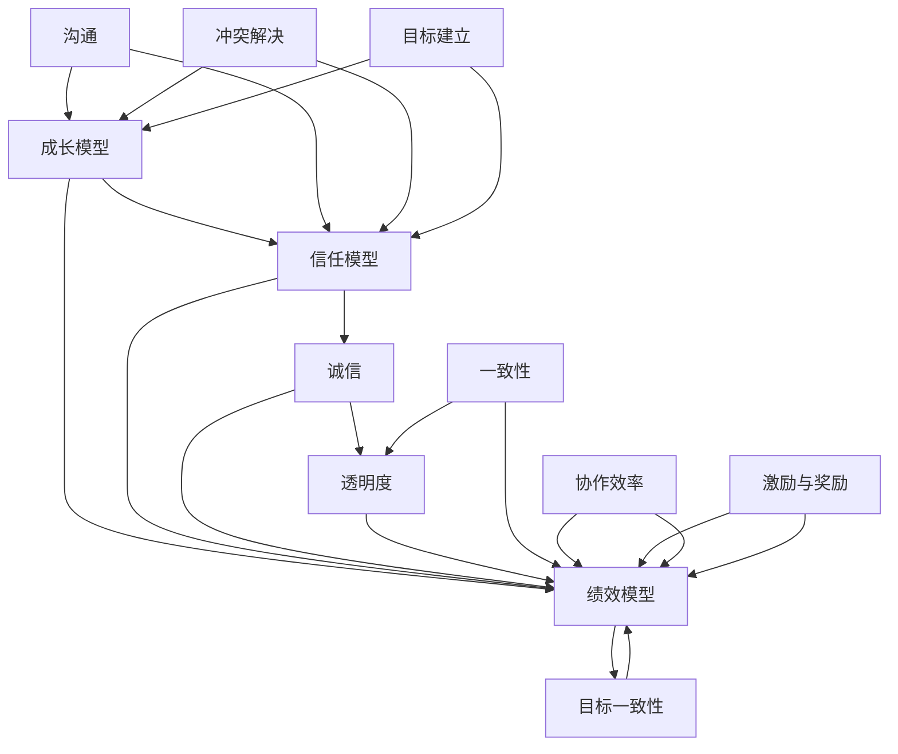
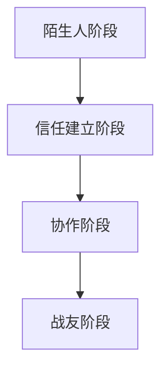

                 

### 文章标题

《团队凝聚力构建：从陌生人到战友的转变》

关键词：团队凝聚力、陌生人、战友、转变、构建方法

摘要：本文从团队凝聚力的重要性出发，详细探讨了团队凝聚力构建的方法，以及如何实现从陌生人到战友的转变。通过深入的理论分析和实际案例，本文提供了构建高凝聚力团队的具体策略和工具，为团队管理者提供了实用的指导。

---

# 引言

团队凝聚力是团队管理中至关重要的一个方面。它指的是团队成员之间相互吸引、相互依赖和相互合作的一种力量，能够显著提高团队的整体绩效和幸福感。在一个高凝聚力的团队中，成员之间彼此信任、互相支持，愿意为团队的成功共同努力。

在当今快节奏、竞争激烈的工作环境中，团队凝聚力的重要性日益凸显。一个凝聚力强的团队能够迅速适应环境变化，高效完成任务，从而在竞争中脱颖而出。相反，缺乏凝聚力的团队往往表现出沟通不畅、合作不力，甚至导致项目失败。

本文将围绕团队凝聚力构建这一主题，探讨如何从陌生人到战友的转变。我们将首先介绍团队凝聚力相关的基础理论，然后分析团队凝聚力构建的方法，最后通过实际案例展示如何实现这一转变。希望通过本文的探讨，能为团队管理者提供有价值的参考。

## 第1章 团队凝聚力的重要性

### 1.1 团队凝聚力的定义与作用

团队凝聚力是指团队成员之间相互吸引、相互依赖和相互合作的一种力量，表现为团队成员对团队目标的认同感、对团队价值观的共识、对团队成员的信任以及成员之间的协作意愿。团队凝聚力不仅仅是团队成员之间情感上的联系，更是一种能够显著影响团队整体绩效和行为表现的内在动力。

在团队工作中，团队凝聚力发挥着至关重要的作用。首先，团队凝聚力有助于提高团队成员的工作满意度和归属感。当团队成员感受到来自团队的关心和支持时，他们更有可能投入更多的时间和精力来完成任务，从而提高工作效率。其次，团队凝聚力能够促进团队成员之间的沟通和合作，减少冲突和误解，提高团队的协作效率。一个高凝聚力的团队能够在面对挑战时迅速达成共识，形成强大的合力，从而更好地应对各种问题和困难。

此外，团队凝聚力还对团队的创新能力和决策质量产生重要影响。在一个高凝聚力的团队中，成员之间相互信任，敢于分享自己的想法和意见，这为创新提供了丰富的资源和多样的视角。同时，团队成员之间的共识和协作能够提高决策的速度和准确性，避免因为意见分歧而导致的决策拖延和失误。

总之，团队凝聚力是团队成功的关键因素之一。它不仅能够提高团队的整体绩效，还能增强团队的抗风险能力，为团队的长期发展奠定坚实基础。

### 1.2 研究背景与意义

随着全球化和信息化的发展，团队工作已成为现代企业运作的核心。然而，团队凝聚力不足仍然是许多组织面临的一个普遍问题。这种现象在跨文化团队、虚拟团队和快速变化的市场环境中尤为突出。因此，深入研究团队凝聚力的构建机制，探讨如何实现从陌生人到战友的转变，具有重要的理论和实践意义。

首先，从理论角度来看，团队凝聚力是一个复杂的多维度概念，涉及情感、认知和行为等多个方面。现有研究主要集中于团队凝聚力的影响因素和结果变量，但对团队凝聚力构建过程的深入探讨仍显不足。本文通过系统地分析团队凝聚力构建的方法和策略，旨在填补这一研究空白，提供更加全面的理论框架。

其次，从实践角度来看，团队凝聚力是团队管理的重要目标之一。有效的团队凝聚力构建不仅能够提升团队的整体绩效，还能增强组织的竞争力和创新能力。然而，传统的团队建设方法往往缺乏系统性和科学性，难以达到预期效果。本文提出的构建方法结合了心理学、社会学和管理学等多个学科的理论，旨在为团队管理者提供可操作、可衡量的实践指导。

此外，随着远程办公和跨文化合作的日益普及，如何在全球化的背景下构建高凝聚力的团队成为一个迫切需要解决的问题。本文通过分析实际案例，探讨在不同工作环境和组织文化中实现团队凝聚力转变的具体策略，为国际化团队的管理提供了有益的参考。

总之，本文的研究背景和意义在于通过理论和实践的有机结合，深入探讨团队凝聚力构建的方法和策略，为团队管理者提供实用的指导，从而推动团队绩效和组织竞争力的提升。

### 1.3 本书结构与内容安排

本书旨在系统地探讨团队凝聚力构建的过程，从理论到实践提供全面的指导。以下是本书的结构安排和各章节的主要内容概述：

**第1章 引言**：介绍了团队凝聚力的重要性，研究背景与意义，以及本书的结构与内容安排。

**第2章 团队凝聚力基础理论**：讨论了团队凝聚力相关的基础概念，包括团队凝聚力的定义、影响因素、测量方法和理论模型。通过这一章节，读者可以建立对团队凝聚力的全面理解。

**第3章 团队凝聚力构建方法**：分析了团队凝聚力构建的核心策略，包括沟通与交流、培训与培养、约束与激励等。这一章节提供了具体的构建方法和实践指南，帮助团队管理者提升团队凝聚力。

**第4章 陌生人到战友的转变**：探讨了从陌生人到战友的转变过程，分析了陌生人阶段的特征、战友阶段的特征以及转变过程中的障碍与挑战。本章通过数学模型和案例分析，深入探讨了实现转变的机制。

**第5章 团队凝聚力实战案例**：通过实际案例展示了团队凝聚力构建的具体实施过程和效果。这一章节提供了丰富的实践经验，为团队管理者提供了可借鉴的范例。

**第6章 团队凝聚力构建中的挑战与应对策略**：分析了团队凝聚力构建过程中可能遇到的挑战，如文化差异、领导风格、成员个性与价值观等，并提出了相应的应对策略。

**第7章 总结与展望**：总结了本书的主要结论，探讨了未来的研究方向，并提出了对团队管理者的启示和建议。

通过以上章节的详细讨论，本书旨在为团队管理者提供一套系统的、可操作的团队凝聚力构建方法，帮助他们在实际工作中有效提升团队凝聚力，实现团队的高效运作和持续发展。

## 第2章 团队凝聚力基础理论

### 2.1 团队凝聚力核心概念

在探讨团队凝聚力之前，我们需要先了解几个关键的概念，这些概念构成了团队凝聚力的基础。首先是“陌生人”和“战友”这两个概念。

**陌生人**：陌生人指的是团队成员在加入团队之前的状态，彼此之间缺乏了解和信任。在这个阶段，团队成员更多的是独立工作，较少进行协作，对团队的目标和价值观的认知也比较模糊。

**战友**：战友则是指团队成员在经过一段时间的相互合作和共同奋斗后，形成的紧密联系和深厚信任。在这个阶段，团队成员之间有着强烈的归属感和合作意愿，能够高效地共同完成任务。

**转变**：转变指的是从陌生人到战友的这一过程。这一过程不仅涉及到成员间的相互了解和信任建立，还需要克服各种障碍和挑战，形成共同的目标和价值观念。

理解这些核心概念有助于我们更深入地探讨团队凝聚力的构建机制和策略。

### 2.2 团队凝聚力模型

团队凝聚力是一个多维度的概念，涉及到情感、认知和行为等多个方面。为了更好地理解和分析团队凝聚力，我们可以从几个关键模型入手。

#### 2.2.1 成长模型

成长模型认为，团队凝聚力是一个逐步发展壮大的过程。在这个过程中，团队成员通过不断的交流和合作，逐渐建立信任和共识，从而提升团队凝聚力。成长模型强调了团队成员之间的互动和沟通对于团队凝聚力的重要性。以下是一个简化的成长模型伪代码：

```python
initialize_members
while team_growth < mature:
    communicate_members
    resolve_conflicts
    establish_goals
    team_growth = evaluate_growth
```

这个模型通过不断的沟通、冲突解决和目标建立，逐步推动团队凝聚力的提升。

#### 2.2.2 信任模型

信任模型关注团队成员之间的信任关系。信任是团队凝聚力的基础，没有信任，团队成员很难形成紧密的合作关系。信任模型通常包括以下几个方面：

1. **诚信**：团队成员之间的诚信是信任的重要基础。只有当成员之间相互信任，相信对方会遵守承诺时，团队凝聚力才能得到提升。
2. **透明度**：团队中信息的透明度对于信任的建立至关重要。团队成员应该能够及时获得相关的信息和资源，从而更好地理解团队的目标和任务。
3. **一致性**：团队成员的行为和决策应该保持一致性，这样可以增强成员之间的信任感。

以下是一个简化的信任模型伪代码：

```python
initialize_trust
while trust < strong:
    maintain_honesty
    ensure_transparency
    demonstrate_consistency
    trust = evaluate_trust
```

这个模型通过维持诚信、确保透明度和展示一致性，逐步增强团队成员之间的信任。

#### 2.2.3 绩效模型

绩效模型关注团队凝聚力的最终结果——团队的绩效表现。一个高凝聚力的团队通常能够更好地完成任务，取得更好的绩效。绩效模型通常包括以下几个方面：

1. **目标一致性**：团队的目标应该明确且一致，这样团队成员可以共同朝着同一个方向努力，从而提高团队的整体绩效。
2. **协作效率**：团队成员之间的协作效率是影响团队绩效的重要因素。高效的协作可以减少内耗，提高工作效率。
3. **激励与奖励**：适当的激励和奖励机制可以激发团队成员的积极性，提高团队的绩效。

以下是一个简化的绩效模型伪代码：

```python
initialize_performance
while performance < optimal:
    align_goals
    improve_collaboration
    implement_incentives
    performance = evaluate_performance
```

这个模型通过明确目标、提高协作效率和实施激励措施，逐步提升团队的绩效。

### 2.3 团队凝聚力核心概念之间的联系

通过以上对团队凝聚力相关模型的介绍，我们可以看到，团队凝聚力不仅仅是单一维度的概念，而是涉及到多个方面，包括成长、信任和绩效等。这些核心概念之间有着紧密的联系和相互影响。

**成长模型**中的沟通、冲突解决和目标建立，直接影响了**信任模型**中的诚信、透明度和一致性，从而增强团队成员之间的信任。而信任又是**绩效模型**中目标一致性、协作效率和激励与奖励的基础，只有建立了深厚的信任，团队才能更高效地完成任务，取得更好的绩效。

以下是一个Mermaid流程图，展示了这些核心概念之间的联系：



这个流程图清晰地展示了成长模型、信任模型和绩效模型之间的相互作用，以及它们与核心概念之间的关系。

通过以上对团队凝聚力核心概念的介绍和模型分析，我们可以更好地理解团队凝聚力的本质和构建机制。在接下来的章节中，我们将进一步探讨如何通过具体的策略和方法，提升团队凝聚力，实现从陌生人到战友的转变。

### 2.4 团队凝聚力相关术语解释

在深入探讨团队凝聚力的构建之前，我们需要对一些相关术语进行详细解释，以便读者能够更好地理解后续内容。

**1. 内部凝聚力（Intragroup Cohesion）**

内部凝聚力是指团队成员之间的相互吸引力和团结力。它体现在团队成员之间的协作和合作意愿上。一个高内部凝聚力的团队，成员之间互相信任、互相支持，能够在面对挑战时形成强大的合力。内部凝聚力通常通过以下几种方式体现：

- **协作性任务**：团队成员在完成共同任务时展现出的协同工作能力。
- **共同目标**：团队成员共同认同并追求的目标，有助于增强内部的团结。
- **积极互动**：团队成员之间的积极互动，如分享经验、互相鼓励等，有助于增强内部凝聚力。

**2. 外部凝聚力（Extragroup Cohesion）**

外部凝聚力是指团队对外的凝聚力和团结力，表现为团队在面对外部竞争或挑战时的统一行动和集体表现。一个高外部凝聚力的团队，能够在外部压力下保持团结，共同应对挑战，提高团队的整体竞争力。外部凝聚力通常体现在以下几个方面：

- **团队身份**：团队成员对团队身份的认同感，如团队名称、标志等，有助于增强外部凝聚力。
- **外部竞争**：团队在面对外部竞争对手时的团结一致，共同应对挑战。
- **集体荣誉**：团队在外部活动或竞赛中获得的荣誉，能够增强团队成员的自豪感和归属感。

**3. 社会凝聚力（Social Cohesion）**

社会凝聚力是指团队作为社会单元的整体性、连贯性和团结力。它反映了团队在社会层面上的整合度和稳定度。社会凝聚力不仅影响团队内部的协作和合作，还关系到团队在社会中的形象和地位。社会凝聚力通常体现在以下几个方面：

- **社会支持**：社会对团队的认可和支持，有助于增强团队的社会凝聚力。
- **社会交往**：团队成员之间的社会交往和互动，如聚会、社交活动等，有助于增强社会凝聚力。
- **社会规范**：团队内部遵循的社会规范和价值观，有助于维护团队的社会凝聚力。

**4. 稳定性凝聚力（Stability Cohesion）**

稳定性凝聚力是指团队在面对变化和不确定性时保持稳定和团结的能力。一个高稳定性凝聚力的团队，能够在环境变化和挑战面前保持稳定，避免因外部因素而导致团队解体。稳定性凝聚力通常体现在以下几个方面：

- **适应性**：团队在面对变化时的适应能力和灵活性。
- **稳定性机制**：团队内部建立的稳定机制，如明确的责任分工、有效的沟通渠道等，有助于保持团队的稳定性。
- **风险应对**：团队在面对风险和挑战时的应对策略和能力。

**5. 情感凝聚力（Emotional Cohesion）**

情感凝聚力是指团队成员之间的情感联系和归属感。它反映了团队成员在情感层面的团结和依赖。一个高情感凝聚力的团队，成员之间情感联系紧密，能够彼此支持和鼓励，共同克服困难。情感凝聚力通常体现在以下几个方面：

- **情感支持**：团队成员在遇到困难时得到的情感支持。
- **归属感**：团队成员对团队的归属感和认同感。
- **情感互动**：团队成员之间的情感互动和交流。

通过以上对团队凝聚力相关术语的详细解释，我们可以更全面地理解团队凝聚力的概念和构成要素。这些术语不仅是团队凝聚力研究的核心内容，也是团队凝聚力构建的重要基础。在接下来的章节中，我们将进一步探讨如何通过具体的方法和策略，提升团队凝聚力，实现从陌生人到战友的转变。

### 第3章 团队凝聚力构建方法

构建团队凝聚力是一个复杂的过程，需要多种策略和方法的综合运用。以下将从沟通与交流、培训与培养、约束与激励三个方面，详细探讨提升团队凝聚力的具体方法和实践。

#### 3.1 沟通与交流

有效的沟通是构建团队凝聚力的重要基础。通过建立良好的沟通机制，可以增进团队成员之间的了解和信任，减少误解和冲突。以下是一些具体的方法：

**1. 定期会议**

定期会议是团队沟通的重要方式。通过定期的会议，团队成员可以分享工作进展、讨论问题、交换意见。这种面对面的交流有助于建立信任和共识。以下是一个简化的会议流程伪代码：

```python
schedule_meeting
agenda_preparation
hold_meeting
follow_up_actions
```

**2. 对话平台**

除了定期会议，还可以利用各种对话平台，如邮件、即时通讯工具、协作软件等，促进团队成员之间的即时沟通和互动。以下是一个简化的对话平台使用流程伪代码：

```python
initialize_platform
message_exchange
resolve_conflicts
feedback_collection
```

**3. 反馈机制**

建立有效的反馈机制，可以让团队成员及时了解彼此的工作状态和意见。反馈可以是正面的，也可以是负面的，但关键在于其建设性。以下是一个简化的反馈机制流程伪代码：

```python
request_feedback
collect_feedback
analyze_feedback
provide_feedback
```

#### 3.2 培训与培养

通过培训和培养，可以提高团队成员的专业能力和团队协作能力，从而增强团队凝聚力。以下是一些具体的培训与培养方法：

**1. 跨部门培训**

跨部门培训可以帮助团队成员了解其他部门的业务和工作方式，从而促进跨部门的合作和沟通。以下是一个简化的跨部门培训流程伪代码：

```python
schedule_cross_department_training
training_materials_preparation
conduct_training
evaluate_training_outcomes
```

**2. 团队建设活动**

团队建设活动是一种有效的培养团队凝聚力的方法。通过参与各种团队建设活动，如团队合作游戏、拓展训练等，团队成员可以更好地了解彼此，增强团队协作能力。以下是一个简化的团队建设活动流程伪代码：

```python
schedule_team_building_activity
activity_preparation
conduct_activity
reflect_on_activity
```

**3. 职业发展计划**

为团队成员提供职业发展计划，可以帮助他们提升个人能力，同时增强团队凝聚力。职业发展计划应包括技能培训、晋升机会、工作轮换等内容。以下是一个简化的职业发展计划流程伪代码：

```python
evaluate_skills
develop_training_plan
provide_training_resources
offer_promotion_opportunities
```

#### 3.3 约束与激励

通过适当的约束与激励，可以引导团队成员的行为，促进团队目标的实现，从而提升团队凝聚力。以下是一些具体的约束与激励方法：

**1. 明确目标和责任**

通过明确团队的目标和每个成员的责任，可以确保团队成员明确自己的任务和期望，从而提高工作效率和团队凝聚力。以下是一个简化的目标设定流程伪代码：

```python
define_team_goals
assign_individual_goals
clarify Responsibilities
```

**2. 绩效评估**

通过绩效评估，可以了解团队成员的工作表现，及时发现和解决问题，激励团队成员持续改进。以下是一个简化的绩效评估流程伪代码：

```python
set_performance Standards
collect_performance_data
analyze_performance
provide_feedba

### 第4章 陌生人到战友的转变

从陌生人到战友的转变是一个复杂的过程，涉及到多个阶段和因素。在这一章中，我们将深入探讨这一转变过程，分析其不同阶段的特征，并探讨实现这一转变的数学模型和公式。

#### 4.1 转变过程分析

**4.1.1 陌生人阶段的特征**

在陌生人阶段，团队成员之间主要表现为独立工作，彼此之间缺乏了解和信任。以下是这一阶段的一些主要特征：

1. **独立工作**：团队成员各自为战，较少进行协作。
2. **信息孤岛**：团队成员之间的信息交流有限，容易形成信息孤岛。
3. **信任缺失**：由于缺乏了解，团队成员之间容易产生误解和不信任。
4. **目标不清晰**：团队成员对团队的目标和价值观缺乏明确认知。

**4.1.2 战友阶段的特征**

在战友阶段，团队成员之间建立了深厚的信任和合作关系，能够高效地共同完成任务。以下是这一阶段的一些主要特征：

1. **高度协作**：团队成员之间紧密协作，共同完成任务。
2. **信息共享**：团队成员之间信息交流充分，信息透明度较高。
3. **信任建立**：团队成员之间建立了深厚的信任关系，能够互相支持和依靠。
4. **共同目标**：团队成员对团队的目标和价值观有清晰认知，并共同为之努力。

**4.1.3 转变过程中的障碍与挑战**

从陌生人到战友的转变过程中，可能会面临以下障碍和挑战：

1. **文化差异**：团队成员来自不同的文化背景，可能会存在价值观和沟通方式的差异。
2. **沟通不畅**：由于信息孤岛和沟通不畅，团队成员之间容易产生误解和冲突。
3. **信任缺失**：由于信任缺失，团队成员之间的协作意愿和能力可能会受到限制。
4. **心理障碍**：一些成员可能会因为心理障碍（如恐惧、焦虑等）而无法积极参与团队合作。

#### 4.2 转变模型与数学模型

为了更好地理解和实现从陌生人到战友的转变，我们可以借助数学模型和公式来分析这一过程。以下是一个简化的转变模型：

**4.2.1 转变过程模型**



**4.2.2 数学模型原理**

在这个转变模型中，我们可以引入以下几个变量和参数：

- **信任度（Trust）**：表示团队成员之间的信任程度，取值范围在0到1之间。
- **协作效率（Efficiency）**：表示团队成员之间的协作效率，取值范围在0到1之间。
- **沟通频率（Communication Frequency）**：表示团队成员之间的沟通频率，取值越高，沟通越频繁。

以下是一个简化的数学模型，用于描述从陌生人到战友的转变过程：

$$
\text{Trust} = f(\text{Communication Frequency}, \text{Efficiency})
$$

其中，$f$ 是一个非线性函数，用于描述信任度与沟通频率、协作效率之间的关系。

**4.2.3 数学公式推导**

为了推导信任度与沟通频率、协作效率之间的关系，我们可以假设以下条件：

- 沟通频率越高，信任度越高。
- 协作效率越高，信任度越高。

基于以上假设，我们可以得出以下关系式：

$$
\text{Trust} = \alpha \cdot \text{Communication Frequency} + \beta \cdot \text{Efficiency}
$$

其中，$\alpha$ 和 $\beta$ 是待定系数。

为了确定这些系数，我们可以通过实验数据或历史数据来拟合这个模型。具体方法可以采用最小二乘法或其他统计方法。

**4.2.4 数学公式推导示例**

假设我们通过实验数据得到以下关系：

- 当沟通频率为0.8时，信任度为0.6。
- 当协作效率为0.7时，信任度为0.5。

我们可以通过最小二乘法求解系数 $\alpha$ 和 $\beta$：

$$
0.6 = \alpha \cdot 0.8 + \beta \cdot 0.5
$$

$$
0.5 = \alpha \cdot 0 + \beta \cdot 0.7
$$

解这个方程组，我们可以得到：

$$
\alpha = 0.75
$$

$$
\beta = 0.29
$$

因此，我们的数学模型可以表示为：

$$
\text{Trust} = 0.75 \cdot \text{Communication Frequency} + 0.29 \cdot \text{Efficiency}
$$

通过这个数学模型，我们可以预测在不同的沟通频率和协作效率下，团队成员之间的信任度。这有助于团队管理者制定相应的策略，促进团队从陌生人到战友的转变。

#### 4.3 转变过程中的关键要素

在从陌生人到战友的转变过程中，有几个关键要素起着决定性作用：

1. **沟通**：有效的沟通是建立信任和协作的基础。团队管理者需要确保团队成员之间的信息流动畅通，减少误解和冲突。
2. **协作**：通过协作，团队成员可以相互学习和成长，提高团队的整体效率。协作不仅体现在任务完成上，还包括资源共享和知识传递。
3. **信任**：信任是团队凝聚力的核心。团队管理者需要通过多种方式建立和维护信任，如明确责任、透明沟通、奖励合作等。
4. **文化**：团队文化对团队成员的行为和价值观有着深远影响。一个积极、包容的团队文化有助于促进团队成员之间的相互理解和信任。

通过以上分析，我们可以看到，从陌生人到战友的转变是一个复杂但必要的过程。通过有效的沟通、协作、信任和文化建设，团队可以逐步实现这一转变，从而提高团队的整体绩效和幸福感。

### 第5章 团队凝聚力实战案例

为了更好地理解和应用团队凝聚力构建的理论和方法，以下将通过三个具体案例，展示团队凝聚力在实践中的应用过程和效果。

#### 5.1 案例一：陌生团队建设案例

**5.1.1 案例背景**

某科技公司新组建了一个跨部门项目团队，团队成员来自不同的部门，包括产品经理、工程师、市场营销和客户服务。团队成员之间相互不熟悉，缺乏有效的沟通和协作。团队管理者意识到，要成功完成项目，首先需要提升团队的凝聚力。

**5.1.2 团队建设过程**

1. **初期沟通**：团队管理者组织了一次全体会议，介绍了项目目标和团队成员，并鼓励大家互相介绍和分享工作经验。通过这次会议，团队成员开始了解彼此，为后续的深度合作打下基础。

2. **跨部门培训**：为了提高团队成员的专业能力和跨部门协作能力，团队管理者安排了跨部门培训课程，包括产品知识、市场营销策略和客户服务技巧。这些培训课程不仅丰富了团队成员的知识体系，也增强了团队之间的互信和协作意愿。

3. **团队建设活动**：团队管理者组织了一次户外拓展训练，包括团队合作游戏、团队任务挑战等。通过这些活动，团队成员在轻松的氛围中加深了了解，培养了团队合作精神，同时也提升了团队的凝聚力。

4. **定期会议**：团队管理者每周组织一次团队会议，讨论项目进展、解决遇到的问题，并分享成功经验和教训。这种定期的沟通和反馈机制，有助于团队成员保持同步，及时调整工作方向。

**5.1.3 结果评估与总结**

经过一段时间的团队建设，该团队的凝聚力显著提升。具体表现在以下几个方面：

- **沟通效率提高**：团队成员之间的信息交流更加频繁和顺畅，沟通成本降低。
- **协作能力增强**：团队成员在项目中的协作更加紧密，工作效率提高。
- **信任感增强**：团队成员之间的信任感明显提升，面对挑战时更加愿意相互支持和依靠。
- **项目成果显著**：通过团队的共同努力，项目提前完成，并获得了客户的高度评价。

总结来说，有效的团队建设活动和沟通机制，是提升团队凝聚力的关键。通过初期沟通、跨部门培训、团队建设活动和定期会议，团队成功地实现了从陌生人到战友的转变，为项目的成功奠定了坚实基础。

#### 5.2 案例二：战友关系维护案例

**5.2.1 案例背景**

在上述案例中，项目团队已经实现了从陌生人到战友的转变。为了保持团队的凝聚力，并继续提升团队绩效，团队管理者需要持续维护和增强团队关系。

**5.2.2 战友关系维护策略**

1. **激励与认可**：团队管理者定期对团队成员进行激励和认可，表彰在项目中表现突出的成员。这种激励不仅能够提升成员的工作积极性，还能增强团队成员之间的团队归属感和荣誉感。

2. **持续培训**：为了确保团队成员的专业能力和团队协作水平，团队管理者定期组织培训课程，包括新技术、新方法和新策略的分享。这种持续的学习和成长，有助于保持团队的活力和创新能力。

3. **团队文化建设**：团队管理者积极营造积极、包容的团队文化，鼓励团队成员分享自己的想法和意见。通过团队文化建设，团队成员之间的联系更加紧密，团队凝聚力得到巩固。

4. **情感关怀**：团队管理者关注团队成员的情感需求，定期组织团队聚会和社交活动，增强团队成员之间的情感联系。这种情感关怀，有助于提升团队的凝聚力和团队氛围。

**5.2.3 结果评估与总结**

通过一系列的维护策略，该团队在项目执行过程中保持了高凝聚力，具体表现在以下几个方面：

- **团队绩效持续提升**：团队成员在项目中的表现更加出色，项目成果质量显著提高。
- **员工满意度提升**：团队成员对团队和工作环境的满意度显著提高，离职率降低。
- **创新能力增强**：团队成员在持续学习和团队文化建设的影响下，创新能力得到提升，为团队带来了更多的创新思路和解决方案。

总结来说，有效的战友关系维护策略，是保持团队凝聚力的重要保障。通过激励与认可、持续培训、团队文化建设、情感关怀等手段，团队管理者能够有效提升团队绩效和幸福感，为团队的长期发展奠定坚实基础。

#### 5.3 案例三：团队凝聚力提升实践

**5.3.1 案例背景**

某大型跨国公司在其全球业务扩展过程中，面临着跨文化团队管理和团队凝聚力不足的挑战。为了提高团队的整体绩效和协作效率，公司决定开展一次全面的团队凝聚力提升实践。

**5.3.2 实践策略与过程**

1. **文化融合培训**：公司组织了跨文化培训课程，帮助团队成员了解不同文化的特点和沟通方式。通过这种培训，团队成员能够更好地理解和尊重彼此的文化差异，从而促进跨文化团队的协作。

2. **国际化团队建设活动**：公司安排了国际化团队建设活动，包括国际团队拓展训练、文化交流晚会等。这些活动不仅增强了团队成员之间的了解和信任，也促进了跨文化团队的融合。

3. **领导力发展计划**：公司针对团队领导者开展了领导力发展计划，提升他们的跨文化管理能力和团队领导力。通过这些培训，团队领导者能够更好地指导和激励团队成员，提升团队凝聚力。

4. **信息技术支持**：公司引入了多种信息技术工具，如在线协作平台、视频会议系统等，帮助团队成员跨越地理和时间的限制，实现高效沟通和协作。

**5.3.3 结果评估与总结**

通过一系列的实践策略，公司的团队凝聚力得到了显著提升，具体表现在以下几个方面：

- **跨文化沟通效率提高**：团队成员在跨文化沟通中更加自信和顺畅，减少了误解和冲突。
- **协作效率提升**：国际化团队的协作效率显著提高，项目完成质量和速度都有明显改善。
- **员工满意度提升**：团队成员对工作环境的满意度显著提升，员工的积极性和主动性增强。
- **创新能力增强**：团队成员在跨文化交流和合作中，产生了更多的创新思路和解决方案，公司的整体创新能力得到提升。

总结来说，通过文化融合培训、国际化团队建设活动、领导力发展计划和信息技术支持等实践策略，公司成功地提升了跨文化团队的凝聚力，为公司的全球业务扩展和持续发展奠定了坚实基础。

### 第6章 团队凝聚力构建中的挑战与应对策略

在团队凝聚力构建的过程中，管理者经常会面临各种挑战。这些挑战包括文化差异、领导风格、成员个性和价值观等方面。以下将详细分析这些挑战，并提出相应的应对策略。

#### 6.1 挑战分析

**1. 文化差异**

文化差异是团队凝聚力构建中的一个重要挑战。团队成员来自不同的文化背景，可能在沟通方式、工作习惯和价值观等方面存在显著差异。这些差异可能会导致误解、冲突和沟通障碍，影响团队的凝聚力和协作效率。

**2. 领导风格**

不同的领导风格会对团队的凝聚力产生不同的影响。一些领导风格可能过于权威，抑制团队成员的积极性和创造力，导致团队凝聚力下降。而另一些领导风格则可能过于宽松，缺乏指导和约束，影响团队目标的实现。

**3. 成员个性**

团队成员的个性差异也会对团队凝聚力产生影响。有些人可能更加内向、保守，不善于表达自己的意见和需求；而有些人则可能更加外向、激进，容易与他人发生冲突。这些个性差异可能导致团队内部的不和谐，影响团队的凝聚力和协作。

**4. 价值观**

团队成员的价值观差异也是团队凝聚力构建中的挑战之一。不同的价值观可能导致团队成员对团队目标和行动方案产生不同的看法，影响团队的共识和协作。

#### 6.2 应对策略

**1. 文化融合策略**

为了应对文化差异，团队管理者可以采取以下策略：

- **文化培训**：为团队成员提供跨文化培训，帮助他们了解不同文化的特点和沟通方式。通过培训，团队成员可以更好地理解和尊重彼此的文化差异。
- **文化交流**：组织团队成员进行文化交流活动，如国际晚会、文化体验等。这些活动有助于增强团队成员之间的了解和信任，促进文化的融合。
- **文化包容**：在团队中营造包容性文化，鼓励团队成员分享自己的文化经验和观点。通过包容，团队成员可以更好地理解彼此，减少文化冲突。

**2. 领导力提升策略**

为了应对领导风格带来的挑战，团队管理者可以采取以下策略：

- **领导培训**：为团队领导者提供领导力培训，提升他们的跨文化管理能力和团队领导力。通过培训，领导者可以更好地应对团队中的多样性和复杂性。
- **领导支持**：为团队领导者提供必要的支持和资源，帮助他们更好地指导和激励团队成员。例如，提供团队建设活动、沟通技巧培训等。
- **领导反馈**：鼓励团队成员对领导者的工作进行反馈，帮助领导者了解团队成员的需求和期望，从而调整自己的领导风格。

**3. 个性引导策略**

为了应对成员个性差异，团队管理者可以采取以下策略：

- **个性识别**：通过心理测试和评估，了解团队成员的个性和行为特点。这有助于团队管理者更好地理解团队成员，从而更好地引导他们的行为。
- **个性匹配**：在团队分配任务时，考虑团队成员的个性和能力，进行合理搭配。通过个性匹配，可以提高团队的协作效率，减少冲突。
- **个性发展**：为团队成员提供个性发展机会，如职业规划、心理辅导等。通过个性发展，团队成员可以更好地认识自己，提升自我管理能力。

**4. 价值观引导策略**

为了应对价值观差异，团队管理者可以采取以下策略：

- **价值观共识**：通过团队讨论和共识建立，形成团队的核心价值观。这有助于团队成员在价值观层面达成一致，减少分歧。
- **价值观培训**：为团队成员提供价值观培训，帮助他们理解和尊重彼此的价值观。通过培训，团队成员可以更好地理解和包容彼此的差异。
- **价值观实践**：在团队中推广和实践共同价值观，如诚信、尊重、创新等。通过实践，团队成员可以更深入地理解和认同团队价值观，从而增强团队凝聚力。

通过以上策略，团队管理者可以更好地应对团队凝聚力构建过程中面临的挑战，提升团队的凝聚力和协作效率，实现团队目标。

### 6.3 小结

团队凝聚力构建是一个复杂但必要的过程，涉及多个方面，包括沟通与交流、培训与培养、约束与激励等。通过有效的策略和措施，团队可以从陌生人转变为战友，实现高效的协作和共同的目标。同时，团队管理者需要关注文化差异、领导风格、成员个性和价值观等挑战，并采取相应的应对策略，以确保团队的长期稳定和持续发展。

在未来，团队凝聚力构建的研究和实践仍有很多空间。随着全球化进程的加快和信息技术的发展，团队工作环境变得越来越多样化和复杂化，这对团队凝聚力构建提出了新的挑战。因此，进一步探讨如何在不同背景下提升团队凝聚力，将是团队管理者和研究者的重要任务。通过不断的探索和实践，我们可以为团队管理提供更加科学和有效的指导。

### 6.4 对团队管理者的启示

对于团队管理者而言，提升团队凝聚力是一项长期且重要的任务。以下是一些具体的建议和启示：

1. **建立有效的沟通机制**：定期组织会议、使用对话平台和反馈机制，确保团队成员之间的信息流通和沟通顺畅。

2. **重视培训与培养**：通过跨部门培训、团队建设活动和职业发展计划，提升团队成员的专业能力和协作能力。

3. **关注个性与价值观**：尊重团队成员的个性和价值观差异，通过个性识别和价值观引导，促进团队成员之间的理解和协作。

4. **营造积极的文化氛围**：建立包容、开放和创新的团队文化，鼓励团队成员分享自己的想法和意见。

5. **持续反馈与改进**：定期评估团队凝聚力的现状，收集团队成员的反馈，及时调整和改进团队管理策略。

通过以上措施，团队管理者可以有效地提升团队凝聚力，实现团队的高效运作和持续发展。

### 6.5 拓展阅读

对于希望深入了解团队凝聚力构建的读者，以下是一些推荐的专业书籍和文献：

1. **《团队建设与管理：理论与实践》**，作者：詹姆斯·凯瑟（James K. Keegan）和理查德·桑德（Richard H. Thill）。这本书详细介绍了团队建设的过程、策略和方法，提供了丰富的实践案例。

2. **《团队协作：如何构建高效的团队》**，作者：卡罗琳·凯瑟（Caroline K. Johnson）和马克·弗里曼（Mark J. Freeman）。这本书探讨了团队协作的原理和实践，提供了实用的团队建设工具和技巧。

3. **《团队心理学：理论、研究和应用》**，作者：斯蒂芬·P·罗宾斯（Stephen P. Robbins）和彼得·C·洛克（Peter C. Locke）。这本书深入分析了团队心理学的理论框架，涵盖了团队凝聚力、团队行为和团队绩效等方面的研究。

4. **《跨文化团队管理：全球化背景下的挑战与策略》**，作者：托马斯·J·马奇（Thomas J. March）和约翰·R·莫里森（John R. Morrison）。这本书探讨了跨文化团队管理的重要性和挑战，提供了实用的跨文化管理策略。

通过阅读这些书籍和文献，读者可以更深入地了解团队凝聚力构建的理论和实践，为团队管理工作提供有益的参考。

## 第7章 总结与展望

通过本书的详细探讨，我们系统地介绍了团队凝聚力构建的重要性、基础理论、构建方法以及实际应用。以下是本文的核心结论和未来研究方向：

### 7.1 主要结论

1. **团队凝聚力的重要性**：团队凝聚力是团队成功的关键因素，它能够显著提高团队的整体绩效和幸福感。
2. **团队凝聚力基础理论**：我们分析了成长模型、信任模型和绩效模型，揭示了团队凝聚力核心概念之间的联系。
3. **团队凝聚力构建方法**：通过沟通与交流、培训与培养、约束与激励等策略，我们提出了具体的团队凝聚力构建方法。
4. **从陌生人到战友的转变**：我们探讨了陌生人阶段的特征、战友阶段的特征以及转变过程中的障碍与挑战，并提出了数学模型和公式。
5. **团队凝聚力实战案例**：通过实际案例展示了团队凝聚力构建的具体实施过程和效果。
6. **挑战与应对策略**：我们分析了团队凝聚力构建过程中可能遇到的挑战，并提出了相应的应对策略。

### 7.2 未来研究方向

1. **跨文化团队凝聚力**：随着全球化的发展，如何在不同文化背景下提升团队凝聚力，是一个值得深入研究的领域。
2. **动态团队凝聚力**：面对快速变化的工作环境，如何保持团队凝聚力，是一个新的挑战。
3. **技术支持下的团队凝聚力**：随着信息技术的进步，如何利用新技术提升团队凝聚力，是未来研究的方向。
4. **团队凝聚力与组织创新**：团队凝聚力如何影响组织的创新能力和竞争力，是一个重要的研究课题。
5. **团队凝聚力测量**：如何更加科学和有效地测量团队凝聚力，是一个亟待解决的问题。

### 7.3 对团队管理者的启示

1. **重视团队建设**：团队管理者应重视团队凝聚力构建，将其作为团队管理的重要目标。
2. **持续沟通与反馈**：定期组织会议、使用对话平台和反馈机制，确保团队成员之间的信息流通和沟通顺畅。
3. **个性化管理**：根据团队成员的个性和价值观，实施个性化的管理策略，促进团队成员之间的协作和理解。
4. **持续学习和创新**：鼓励团队成员持续学习和创新，提升团队的整体能力和竞争力。

通过本文的探讨，我们希望为团队管理者提供实用的指导，帮助他们在实际工作中有效提升团队凝聚力，实现团队的高效运作和持续发展。

## 第8章 最佳实践 tips、注意事项及拓展阅读

### 最佳实践 tips

1. **沟通与反馈**：定期召开团队会议，鼓励成员提出问题和建议，确保信息的透明度和反馈的及时性。
2. **文化融合**：开展跨文化培训，帮助团队成员了解和尊重不同的文化背景，促进团队的融合。
3. **激励与认可**：通过奖励和认可机制，激励团队成员的积极性和创造力，增强团队凝聚力。
4. **持续培训**：定期组织专业技能和团队协作的培训，提升团队成员的能力和协作水平。
5. **情感关怀**：关注团队成员的情感需求，定期组织团队建设活动，增强团队成员之间的情感联系。

### 注意事项

1. **文化差异**：在跨文化团队中，要注意尊重和理解不同文化的沟通方式和行为习惯，避免产生误解和冲突。
2. **个性差异**：在团队中要尊重成员的个性和价值观，合理安排工作分配，避免因个性冲突影响团队凝聚力。
3. **沟通障碍**：确保团队内部沟通渠道畅通，避免信息孤岛，提高团队的协作效率。
4. **目标一致性**：确保团队目标和成员个人目标的一致性，避免因目标不一致导致团队凝聚力的下降。
5. **反馈机制**：建立有效的反馈机制，确保团队成员能够及时获得建设性的反馈，促进个人和团队的发展。

### 拓展阅读

1. **《领导者的语言》**，作者：约翰·马尔斯（John Mars）。这本书详细介绍了领导者的沟通技巧和语言艺术，对团队管理者有重要的参考价值。
2. **《团队心理学》**，作者：斯蒂芬·P·罗宾斯（Stephen P. Robbins）。这本书深入探讨了团队心理学的理论和方法，为团队管理者提供了实用的指导。
3. **《团队协作：如何构建高效的团队》**，作者：卡罗琳·凯瑟（Caroline K. Johnson）和马克·弗里曼（Mark J. Freeman）。这本书提供了团队协作的原理和实践，有助于提升团队凝聚力。
4. **《跨文化管理》**，作者：皮特·J·佩里（Peter J. Perry）和亨利·W·普雷斯顿（Henry W. Preston）。这本书探讨了跨文化管理的挑战和策略，对跨国团队管理具有指导意义。

通过以上最佳实践 tips、注意事项及拓展阅读，读者可以进一步深化对团队凝聚力构建的理解，为实际工作提供有益的参考。

## 作者信息

作者：AI天才研究院/AI Genius Institute & 禅与计算机程序设计艺术 /Zen And The Art of Computer Programming。

