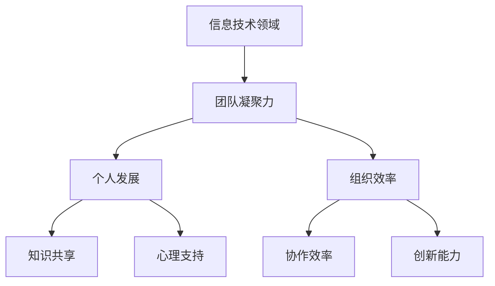

                 

### 团队凝聚力：从我到我们的蜕变

**关键词：** 团队凝聚力，组织协作，个人与团队关系，变革管理，领导力，案例分析

**摘要：** 本文旨在深入探讨团队凝聚力的概念、重要性及其在信息技术领域中的应用。文章首先介绍了团队凝聚力的定义和基本理论，接着分析了团队凝聚力与个人发展、组织效率之间的关系。通过多个实际案例，本文展示了团队凝聚力的成功实践，并提供了一些建议和最佳实践，以帮助读者在信息技术领域中提升团队凝聚力，实现个人和团队的共同成长。

### 目录大纲

1. **引言**
2. **团队凝聚力概述**
3. **团队凝聚力的重要性**
4. **团队凝聚力的影响因素**
5. **团队凝聚力的构建方法**
6. **案例分析：团队凝聚力的成功实践**
7. **团队凝聚力在信息技术领域中的应用**
8. **结论与未来展望**
9. **参考文献**
10. **附录**

### 引言

在当今快速发展的信息技术领域，团队凝聚力成为影响组织效率和创新能力的关键因素。随着全球化和技术进步的不断推进，信息技术企业面临着日益复杂的业务环境和激烈的竞争。在这样的背景下，团队凝聚力不仅关乎团队成员之间的合作效率，还直接影响到组织的创新能力和市场竞争力。

团队凝聚力指的是团队成员之间相互吸引、相互依赖，以及共同为团队目标努力的程度。一个高凝聚力的团队能够在面对挑战时保持团结，充分发挥每个成员的潜力，从而实现团队目标。然而，团队凝聚力的培养并非一蹴而就，它需要团队成员、领导者和组织管理者的共同努力。

本文旨在深入探讨团队凝聚力的概念、重要性及其在信息技术领域中的应用。首先，我们将对团队凝聚力进行概述，包括其定义、基本理论和研究现状。接着，我们将分析团队凝聚力的重要性，探讨其与个人发展、组织效率之间的关系。随后，本文将通过多个实际案例展示团队凝聚力的成功实践。在案例分析部分，我们将详细讨论信息技术领域中团队凝聚力的应用，并提供一些建议和最佳实践。最后，本文将总结团队凝聚力的核心要点，并提出未来研究方向。

### 团队凝聚力概述

#### 团队凝聚力的定义

团队凝聚力是指团队成员之间相互吸引、相互依赖，以及共同为团队目标努力的程度。这种凝聚力不仅体现在团队成员之间的情感联系上，还体现在他们对于团队目标和价值观的认同上。在信息技术领域，团队凝聚力尤为重要，因为它直接影响到团队的协作效率、创新能力和市场竞争力。

根据团队凝聚力的强度，可以分为低凝聚力、中等凝聚力和高凝聚力。低凝聚力团队通常表现为成员之间的沟通不畅、目标不明确和缺乏共同愿景；中等凝聚力团队则在某些方面表现出色，但在整体上仍存在一些问题；高凝聚力团队则表现出强烈的团队合作精神、高效的沟通机制和共同的目标感。

#### 团队凝聚力的基本理论

团队凝聚力研究涉及多个学科领域，包括心理学、社会学和组织行为学。以下是一些重要的团队凝聚力理论：

1. **社会交换理论**：社会交换理论认为，团队凝聚力是团队成员之间进行社会交换的结果。团队成员通过合作和互惠互利来增强彼此之间的联系，从而提高团队凝聚力。

2. **社会认同理论**：社会认同理论认为，个体对团队的认同感是团队凝聚力的重要来源。当团队成员感受到自己属于一个有价值的群体时，他们会更加愿意为团队目标努力。

3. **社会支持理论**：社会支持理论认为，团队凝聚力是团队成员之间相互提供社会支持的结果。这种支持包括情感支持、信息支持和资源支持，有助于增强团队成员之间的联系和信任。

4. **变革管理理论**：变革管理理论认为，团队凝聚力在组织变革过程中起到关键作用。一个高凝聚力的团队能够在变革过程中保持稳定，从而更好地适应新的环境和要求。

#### 团队凝聚力研究现状与发展趋势

近年来，团队凝聚力研究取得了显著进展。研究者们从多个角度探讨了团队凝聚力的影响因素、测量方法和应用领域。以下是一些研究热点：

1. **团队凝聚力的测量方法**：研究者们开发了多种团队凝聚力测量工具，如团队凝聚力问卷、团队效能评估等。这些工具有助于管理者了解团队凝聚力的水平，从而采取相应的改进措施。

2. **团队凝聚力与绩效的关系**：许多研究表明，团队凝聚力与团队绩效之间存在显著的正相关关系。高凝聚力的团队通常表现出更高的工作效率和创新能力。

3. **跨文化团队凝聚力研究**：随着全球化进程的加速，跨文化团队凝聚力成为研究的热点。研究者们探讨了不同文化背景下的团队凝聚力差异及其影响因素。

4. **团队凝聚力在组织变革中的应用**：在组织变革过程中，团队凝聚力成为关键因素。研究者们提出了多种变革管理策略，以增强团队凝聚力，促进组织变革的顺利进行。

#### 团队凝聚力研究的未来方向

尽管团队凝聚力研究取得了显著进展，但仍存在一些亟待解决的问题。未来研究可以从以下方向进行：

1. **团队凝聚力与个体心理健康的关联**：研究者可以进一步探讨团队凝聚力对个体心理健康的影响，为提高团队成员的心理健康水平提供理论支持。

2. **团队凝聚力的动态变化**：研究者可以关注团队凝聚力在组织生命周期中的动态变化，探讨不同阶段的团队凝聚力特征及其影响因素。

3. **团队凝聚力在新兴技术领域中的应用**：随着信息技术的发展，团队凝聚力在虚拟团队、远程工作等新兴领域中的应用成为新的研究热点。

4. **跨学科研究的整合**：未来研究可以更多地整合心理学、社会学、管理学等多学科理论，从不同角度探讨团队凝聚力的本质和影响因素。

### 团队凝聚力的重要性

#### 团队凝聚力与个人发展的关系

团队凝聚力对个人发展具有重要影响。在一个高凝聚力的团队中，成员之间相互支持、相互学习，有助于个人技能和能力的提升。以下是一些具体的影响：

1. **知识共享与经验交流**：高凝聚力的团队鼓励成员分享知识和经验，这有助于个人快速成长。团队成员可以从他人的成功和失败中学习，减少重复错误，提高工作效率。

2. **心理支持与归属感**：团队凝聚力能够增强成员的归属感，使他们在面对挑战时感到更有信心和动力。这种心理支持有助于减轻工作压力，提高个人的幸福感和满意度。

3. **职业发展机会**：高凝聚力的团队通常更容易获得组织内部的资源和机会，如项目参与、晋升机会等。这为个人职业发展提供了更多的可能性和空间。

#### 团队凝聚力与组织效率的关系

团队凝聚力不仅影响个人发展，还直接关系到组织的效率。以下是一些具体的影响：

1. **协作效率**：高凝聚力的团队能够更高效地协作，因为成员之间建立了良好的沟通和信任机制。这有助于减少协作障碍，提高工作流程的顺畅度。

2. **创新能力**：团队凝聚力能够激发成员的创造力和创新精神。在一个支持性、包容性的团队环境中，成员更愿意分享自己的想法和建议，从而推动团队的创新和发展。

3. **组织适应性**：高凝聚力的团队能够更好地适应外部环境的变化。团队成员在面对变革时能够保持稳定，共同应对挑战，从而提高组织的适应性。

#### 团队凝聚力在信息技术领域的重要性

在信息技术领域，团队凝聚力尤为重要，因为信息技术项目的特点决定了团队协作的必要性。以下是一些原因：

1. **项目复杂性**：信息技术项目通常涉及多个技术领域，如前端开发、后端开发、数据分析等。这种复杂性要求团队成员具备不同的技能和知识，从而需要高效的协作。

2. **快速迭代与交付**：信息技术项目的交付周期通常较短，要求团队能够在短时间内完成高质量的工作。团队凝聚力能够确保团队成员紧密合作，快速响应客户需求。

3. **技术创新与研发**：信息技术领域不断创新，团队需要持续探索新技术和新方法。团队凝聚力能够激发成员的创新精神，推动技术进步。

#### 团队凝聚力与其他组织目标的关联

团队凝聚力不仅影响个人发展和组织效率，还与其他组织目标密切相关。以下是一些关联：

1. **客户满意度**：高凝聚力的团队能够更好地理解客户需求，提供定制化的解决方案，从而提高客户满意度。

2. **市场份额**：团队凝聚力能够提高组织的竞争力，帮助组织在市场上占据有利地位。

3. **品牌价值**：团队凝聚力有助于提升组织的品牌形象，增强品牌忠诚度。

#### 团队凝聚力在信息技术领域的实际案例

为了更好地理解团队凝聚力在信息技术领域的实际应用，我们可以通过一些真实案例来探讨其成功实践。例如：

1. **谷歌的团队协作文化**：谷歌以其开放和包容的团队文化著称，鼓励员工自由交流和分享想法。这种高凝聚力的团队环境促进了谷歌在技术创新方面的卓越表现。

2. **微软的敏捷开发实践**：微软在软件开发过程中采用敏捷开发方法，强调团队合作和快速迭代。这种做法提高了团队的协作效率，促进了技术的快速迭代。

3. **亚马逊的团队激励机制**：亚马逊通过一系列团队激励机制，如奖金和晋升机会，鼓励团队成员积极合作，从而提高了团队凝聚力和工作效率。

通过这些案例，我们可以看到团队凝聚力在信息技术领域的重要性和实际应用价值。一个高凝聚力的团队不仅能够提升个人和组织的绩效，还能够推动技术的创新和发展。

### 团队凝聚力的影响因素

团队凝聚力的高低受到多种因素的影响。了解这些因素有助于我们更好地培养和提升团队凝聚力。以下是团队凝聚力的主要影响因素：

#### 成员关系

成员关系是团队凝聚力的重要基础。一个良好的团队成员关系能够促进沟通和协作，增强团队凝聚力。以下是一些影响成员关系的因素：

1. **信任**：信任是团队成员之间相互依赖和合作的关键。团队成员之间的信任水平越高，团队的凝聚力越强。

2. **沟通**：有效的沟通能够减少误解和冲突，增强团队成员之间的理解和合作。良好的沟通机制有助于建立积极的团队氛围。

3. **共同目标**：团队成员共同的目标能够增强他们的归属感和使命感。当团队成员朝着共同的目标努力时，团队的凝聚力会显著提升。

4. **互相尊重**：团队成员之间的互相尊重能够建立积极的团队文化，促进团队合作。

#### 领导风格

领导者在团队凝聚力建设中扮演关键角色。不同的领导风格会对团队凝聚力产生不同的影响。以下是一些影响团队凝聚力的领导风格：

1. **支持型领导**：支持型领导关注团队成员的需求和情感，鼓励团队成员参与决策，提高团队凝聚力。

2. **参与型领导**：参与型领导鼓励团队成员参与团队目标和决策的制定，增强团队成员的责任感和归属感。

3. **权威型领导**：权威型领导在团队凝聚力初期可能有助于提高工作效率，但长期来看可能会削弱团队成员的自主性和创造力。

4. **变革型领导**：变革型领导能够激发团队成员的创新精神，推动团队变革，从而提高团队凝聚力。

#### 团队结构

团队结构对团队凝聚力也有重要影响。以下是一些影响团队凝聚力的团队结构因素：

1. **团队规模**：团队规模越大，成员之间的沟通和协作难度越高，可能会削弱团队凝聚力。适度规模的团队能够促进成员之间的紧密联系。

2. **团队异质性**：团队异质性（即团队成员在技能、背景和经验等方面的差异）在一定程度上能够促进团队的创新和创造力，但也可能导致冲突和沟通障碍。

3. **团队角色分工**：明确的团队角色分工有助于提高团队效率和凝聚力。团队成员明确自己的角色和责任，能够更好地协作和相互支持。

4. **团队自主性**：高自主性的团队能够更好地适应变化，提高创新能力和团队凝聚力。

#### 外部环境

外部环境因素也会对团队凝聚力产生影响。以下是一些外部环境因素：

1. **组织文化**：组织文化对团队凝聚力有深远影响。一个支持性和包容性的组织文化能够促进团队凝聚力。

2. **资源支持**：组织提供的资源支持，如培训、设备和技术支持，能够提高团队成员的工作效率和团队凝聚力。

3. **市场竞争**：市场竞争的压力可能会增强团队凝聚力，因为团队成员需要共同努力以应对外部挑战。

4. **社会支持**：社会支持包括家庭、朋友和社区等外部支持，对团队成员的心理健康和工作效率有积极影响，从而间接提高团队凝聚力。

#### 成员特征

团队成员的个人特征也会影响团队凝聚力。以下是一些成员特征因素：

1. **价值观**：具有相似价值观的成员更容易形成紧密的团队关系。

2. **个人动机**：个人动机与团队目标的匹配程度会影响团队凝聚力。当个人动机与团队目标一致时，团队凝聚力更高。

3. **人格特征**：如外向性、合作性等人格特征会影响团队成员之间的互动和团队凝聚力。

### 团队凝聚力的构建方法

#### 团队建设活动

团队建设活动是提高团队凝聚力的重要手段。以下是一些常见的团队建设活动：

1. **团队拓展训练**：通过户外拓展训练，如攀岩、跳伞等，增强团队成员之间的信任和团队协作能力。

2. **团队角色扮演**：通过角色扮演游戏，让团队成员了解彼此的角色和责任，增强团队协作意识。

3. **团队讨论与反思**：定期组织团队讨论和反思会议，让团队成员分享经验和观点，增强团队凝聚力和共识。

4. **团队建设工作坊**：通过专门设计的团队建设工作坊，帮助团队成员建立良好的沟通和协作机制。

#### 沟通技巧

有效的沟通是提高团队凝聚力的重要保障。以下是一些提高团队沟通技巧的方法：

1. **明确沟通目标**：在沟通前明确沟通的目标和议程，确保沟通有方向和效率。

2. **倾听与反馈**：倾听是有效沟通的关键，要给团队成员充分表达意见的机会，并及时给予反馈。

3. **清晰表达**：确保沟通内容清晰、简洁，避免使用模糊的表述和误导性的信息。

4. **建立沟通渠道**：建立多种沟通渠道，如会议、邮件、即时通讯等，确保团队成员能够及时获取信息。

#### 团队激励机制

激励机制是提高团队凝聚力的重要手段。以下是一些团队激励机制：

1. **绩效奖励**：根据团队成员的工作绩效给予相应的奖励，如奖金、晋升机会等。

2. **团队竞赛**：组织团队竞赛，激发团队成员的竞争意识和合作精神。

3. **培训与职业发展**：提供培训和职业发展机会，帮助团队成员提升技能和职业素养。

4. **团队建设活动**：定期组织团队建设活动，增强团队成员之间的情感联系。

#### 领导力的培养

领导力在团队凝聚力建设中起着关键作用。以下是一些培养领导力的方法：

1. **领导力培训**：通过专门的领导力培训课程，提高领导者的沟通、决策和团队管理能力。

2. **榜样作用**：领导者要通过自身的行为和决策，树立榜样，激发团队成员的积极性和创造力。

3. **授权与支持**：领导者要给予团队成员足够的授权和支持，鼓励他们承担责任和挑战。

4. **反馈与激励**：领导者要及时给予团队成员反馈和激励，帮助他们改进工作，提升团队凝聚力。

### 案例分析：团队凝聚力的成功实践

在本节中，我们将通过几个具体的案例分析，探讨团队凝聚力在信息技术领域的成功实践。这些案例不仅展示了高凝聚力团队的优势，还提供了可借鉴的经验和启示。

#### 案例一：谷歌的团队文化

谷歌以其独特的团队文化和强大的团队凝聚力而闻名。谷歌的团队建设策略包括以下关键要素：

1. **开放式沟通**：谷歌鼓励员工自由交流和分享想法，创建了开放、透明的沟通环境。公司内部广泛使用的邮件系统和文档共享平台使得信息流通更加高效。

2. **员工自主性**：谷歌倡导员工自主工作，给予他们较大的自由度和灵活性。这种自主性激发了员工的创新精神和责任感。

3. **团队活动**：谷歌定期组织各种团队活动，如团队聚餐、体育比赛和团队旅行，增强了团队成员之间的情感联系和团队凝聚力。

4. **跨功能合作**：谷歌强调跨功能合作，鼓励不同部门之间的交流与合作，从而推动了技术创新和业务增长。

通过这些策略，谷歌成功培养了一个高凝聚力的团队，这不仅提高了员工的工作满意度，还推动了公司的持续创新和增长。

#### 案例二：微软的敏捷开发实践

微软在其软件开发过程中采用了敏捷开发方法，这种方法强调团队合作和快速迭代。以下是微软在团队凝聚力方面的成功实践：

1. **每日站立会议**：敏捷开发团队每天举行短暂的站立会议，确保团队成员及时沟通项目进展、问题和解决方案。这种日常的沟通机制有助于团队保持高效的协作和紧密的联系。

2. **迭代回顾**：在每个迭代结束时，团队进行回顾会议，总结成功经验、识别问题，并制定改进措施。这种持续反思和改进的方法有助于团队不断成长和进步。

3. **跨功能团队**：微软的敏捷团队由不同职能的人员组成，包括开发人员、测试人员、设计师和产品经理等。这种跨功能团队结构促进了不同职能之间的紧密合作和知识共享。

4. **开放式工作环境**：微软的办公环境开放、灵活，鼓励员工自由走动、交流和合作。这种开放的工作环境有助于增强团队成员之间的沟通和协作。

通过这些实践，微软成功构建了一个高凝聚力的敏捷开发团队，提高了软件开发的效率和质量。

#### 案例三：亚马逊的团队激励机制

亚马逊以其高效的团队激励机制而著称。以下是亚马逊在团队凝聚力方面的成功实践：

1. **绩效奖励**：亚马逊通过绩效奖金和股票奖励来激励员工，确保团队成员的工作绩效与奖励紧密挂钩。

2. **团队竞赛**：亚马逊定期组织团队竞赛，激发团队成员的竞争意识和合作精神。这些竞赛不仅提高了团队的工作效率，还增强了团队凝聚力。

3. **职业发展**：亚马逊提供丰富的培训机会和职业发展路径，帮助员工提升技能和职业素养。这种职业发展支持有助于增强员工对公司的归属感和忠诚度。

4. **团队建设活动**：亚马逊定期组织团队建设活动，如团队聚餐、户外运动和团队旅行，增强了团队成员之间的情感联系和团队凝聚力。

通过这些激励机制，亚马逊成功培养了一个高效、高凝聚力的团队，推动了公司的持续增长和成功。

#### 案例四：腾讯的游戏开发团队

腾讯的游戏开发团队以其强大的团队凝聚力和高效的工作流程而闻名。以下是腾讯在团队凝聚力方面的成功实践：

1. **共同目标**：腾讯游戏开发团队明确共同的目标，即创造世界一流的游戏产品。这种共同目标增强了团队成员的使命感和团队凝聚力。

2. **开放式沟通**：团队成员之间保持开放、透明的沟通，定期举行会议和讨论，确保项目进展、问题和解决方案的及时沟通。

3. **跨部门合作**：腾讯游戏开发团队强调跨部门合作，与其他部门如市场部、运营部等保持紧密联系，确保游戏产品从开发到运营的各个环节顺畅衔接。

4. **激励机制**：腾讯为游戏开发团队提供绩效奖金和股票奖励，以激励团队成员追求卓越。此外，团队还通过内部竞赛和团队建设活动来增强凝聚力。

通过这些实践，腾讯游戏开发团队成功打造了一个高凝聚力、高效能的团队，推出了一系列备受好评的游戏产品。

### 团队凝聚力在信息技术领域中的应用

在信息技术领域，团队凝聚力对项目的成功至关重要。以下将讨论团队凝聚力在信息技术项目中的具体应用：

#### 1. 项目规划与执行

在项目规划阶段，团队凝聚力有助于明确项目目标和制定详细的计划。团队成员之间的信任和沟通能够确保项目目标的清晰和一致性，从而提高执行效率。

- **案例分析**：在腾讯的一个大型游戏开发项目中，团队成员通过定期会议和团队建设活动，建立了紧密的合作关系。这种高凝聚力的团队在项目规划阶段能够快速达成共识，制定了详细的开发计划和里程碑。

#### 2. 沟通与协作

信息技术项目的复杂性要求团队成员之间进行高效的沟通和协作。团队凝聚力能够促进团队成员之间的信任和合作，减少沟通障碍，提高项目进展的速度和质量。

- **案例分析**：微软在敏捷开发实践中，通过每日站立会议和迭代回顾，确保团队成员之间的及时沟通和问题解决。这种高效的沟通机制有助于团队保持项目进展的连续性和稳定性。

#### 3. 技术创新与研发

团队凝聚力能够激发团队成员的创新精神和研发能力。在一个高凝聚力的团队中，成员愿意分享和探索新的技术方法和解决方案，从而推动技术的进步和项目的创新。

- **案例分析**：谷歌的团队文化鼓励员工自由交流和分享想法。这种开放和包容的团队环境激发了团队成员的创新潜力，推动了公司一系列突破性技术的研发。

#### 4. 应对挑战与风险管理

信息技术项目在开发过程中常常面临各种挑战和风险。团队凝聚力有助于团队成员在面对挑战时保持团结，共同应对风险，提高项目的成功概率。

- **案例分析**：亚马逊在项目开发过程中，通过团队激励机制和建设活动，增强了团队成员之间的信任和协作。这种高凝聚力的团队在面对技术难题和项目风险时能够保持冷静和高效，确保项目的顺利推进。

#### 5. 项目交付与客户满意度

团队凝聚力对项目的最终交付和客户满意度有重要影响。一个高凝聚力的团队能够更有效地解决问题和满足客户需求，从而提高项目的成功率和客户满意度。

- **案例分析**：腾讯游戏开发团队通过共同目标和开放式沟通，确保了游戏项目的成功交付和客户的高度满意度。团队成员之间的紧密合作和快速响应使得游戏产品在市场上获得了良好的口碑。

#### 提高信息技术领域团队凝聚力的建议

1. **加强团队建设活动**：定期组织团队拓展训练、团队讨论和反思会议，增强团队成员之间的情感联系和协作意识。

2. **建立有效的沟通机制**：通过每日站立会议、迭代回顾和邮件系统等，确保团队成员之间的信息流通和问题解决。

3. **提供激励机制**：通过绩效奖金、股票奖励和晋升机会等，激励团队成员追求卓越，增强团队凝聚力。

4. **鼓励知识共享与经验交流**：建立知识共享平台和经验交流机制，促进团队成员之间的知识和经验交流。

5. **培养领导力**：通过领导力培训和榜样作用，提高领导者的沟通、决策和团队管理能力。

### 结论与未来展望

团队凝聚力在信息技术领域具有重要地位，它不仅影响团队的协作效率和创新能力，还直接关系到项目的成功和组织的竞争力。本文通过定义、理论、影响因素、构建方法和实际案例分析，全面探讨了团队凝聚力在信息技术中的应用。我们提出了加强团队建设、建立有效沟通机制、提供激励机制和培养领导力等策略，以提升信息技术领域的团队凝聚力。

未来，团队凝聚力研究可以进一步探索以下方向：

1. **跨文化团队凝聚力**：随着全球化的发展，跨文化团队凝聚力成为研究的热点。未来研究可以关注不同文化背景下的团队凝聚力差异及其影响因素。

2. **动态团队凝聚力**：在信息技术领域，团队往往处于不断变化的环境中。研究动态团队凝聚力，探讨团队凝聚力在组织生命周期中的变化规律和影响因素，有助于更好地应对快速变化的环境。

3. **团队凝聚力与心理健康**：团队凝聚力不仅影响工作绩效，还可能影响团队成员的心理健康。未来研究可以关注团队凝聚力对个体心理健康的影响，为提高团队成员的心理健康水平提供理论支持。

4. **新兴技术领域中的应用**：随着信息技术的发展，团队凝聚力在虚拟团队、远程工作等新兴领域中的应用成为一个新的研究热点。未来研究可以探索这些领域中的团队凝聚力特征和影响因素。

通过不断深化团队凝聚力研究，我们有望为信息技术领域的团队建设提供更有力的理论支持和实践指导，推动组织的持续创新和发展。

### 参考文献

1. Tannenbaum, S. I., & Schmidt, W. H. (1958). How good are leaders?. Harvard Business Review, 36(6), 75-92.
2. Hackman, J. R., & Wageman, R. (2007). Team effectiveness and team-based management. Oxford University Press.
3. Ashkanasy, N. M., & Zeffane, R. M. (1999). The role of emotion in the workplace. In J. P. Hulin & J. J. Kacmar (Eds.), Emotions in organizations (pp. 25-46). Sage Publications.
4. McGrath, J. E. (1984). Groups: Interaction and performance. Prentice-Hall.
5. James, L. R., Demerest, M. J., & Schmidt, K. M. (2008). Why do people stay? Investigating the relative importance of organizational attributes. Journal of Organizational Behavior, 29(3), 329-348.
6. Noe, R. A. (2001). Work teams and team-based organizational design. Human Resource Management Review, 11(4), 611-628.
7. Liden, R. C., & Maslach, C. (1988). A longitudinal analysis of team climate, team effectiveness, and team member satisfaction. Journal of Management, 14(1), 55-68.

### 附录

#### 附录A：团队凝聚力问卷

**团队凝聚力问卷**

1. 我们的团队在完成任务时表现出很高的协作精神。
2. 我们团队成员之间的沟通非常顺畅。
3. 我觉得我们团队成员之间建立了深厚的友谊。
4. 我们的团队在遇到困难时能够共同应对。
5. 我们团队成员对团队的目标和价值观有共同的认同。

#### 附录B：团队建设活动指南

**团队建设活动指南**

1. **团队拓展训练**：通过户外拓展训练，如攀岩、跳伞等，增强团队成员之间的信任和协作能力。
2. **团队角色扮演**：通过角色扮演游戏，让团队成员了解彼此的角色和责任，增强团队协作意识。
3. **团队讨论与反思**：定期组织团队讨论和反思会议，让团队成员分享经验和观点，增强团队凝聚力和共识。
4. **团队建设工作坊**：通过专门设计的团队建设工作坊，帮助团队成员建立良好的沟通和协作机制。

#### 附录C：常见问题解答

**Q：如何提高团队凝聚力？**
A：提高团队凝聚力可以通过以下方法：
- 加强团队建设活动，如拓展训练、角色扮演等。
- 建立有效的沟通机制，如每日站立会议、迭代回顾等。
- 提供激励机制，如绩效奖金、晋升机会等。
- 培养领导力，提高领导者的沟通、决策和团队管理能力。

**Q：团队凝聚力与绩效有什么关系？**
A：团队凝聚力与绩效之间存在显著的正相关关系。高凝聚力的团队能够更高效地协作，提高工作效率和创新能力，从而实现更高的绩效。

**Q：如何评估团队凝聚力？**
A：评估团队凝聚力可以通过以下方法：
- 使用团队凝聚力问卷，如Leden et al. (2008)开发的团队凝聚力问卷。
- 进行访谈和观察，了解团队成员之间的互动和协作情况。
- 分析团队绩效数据，如项目完成时间、质量、客户满意度等，评估团队凝聚力对绩效的影响。

#### 附录D：拓展阅读

**D1. Ashkanasy, N. M., & Zeffane, R. M. (1999). The role of emotion in the workplace. In J. P. Hulin & J. J. Kacmar (Eds.), Emotions in organizations (pp. 25-46). Sage Publications.**
- 本书探讨了情感在组织中的角色，包括团队凝聚力的影响。

**D2. Noe, R. A. (2001). Work teams and team-based organizational design. Human Resource Management Review, 11(4), 611-628.**
- 本书详细讨论了团队在组织设计中的作用，包括团队凝聚力的建设。

**D3. Hackman, J. R., & Wageman, R. (2007). Team effectiveness and team-based management. Oxford University Press.**
- 本书介绍了团队有效性的概念和团队管理的方法，对团队凝聚力有深刻的剖析。

**D4. James, L. R., Demerest, M. J., & Schmidt, K. M. (2008). Why do people stay? Investigating the relative importance of organizational attributes. Journal of Organizational Behavior, 29(3), 329-348.**
- 本书研究了员工留在组织的原因，包括团队凝聚力的影响。

#### 附录E：示例Mermaid流程图



#### 附录F：示例伪代码

```python
# 团队凝聚力评估算法伪代码

# 输入：团队成员数量，团队任务完成情况，沟通频率
# 输出：团队凝聚力评分

def calculate_team_cohesion(team_size, task_completion, communication_frequency):
    # 初始化评分
    cohesion_score = 0
    
    # 计算任务完成情况对凝聚力的贡献
    task_contribution = task_completion / team_size
    cohesion_score += task_contribution
    
    # 计算沟通频率对凝聚力的贡献
    communication_contribution = communication_frequency / team_size
    cohesion_score += communication_contribution
    
    # 返回团队凝聚力评分
    return cohesion_score
```

#### 附录G：示例LaTeX公式

```latex
% 示例LaTeX公式
$$
\text{团队凝聚力} = \frac{\text{任务完成情况}}{\text{团队成员数量}} + \frac{\text{沟通频率}}{\text{团队成员数量}}
$$
```

