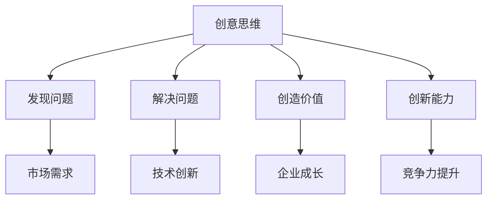
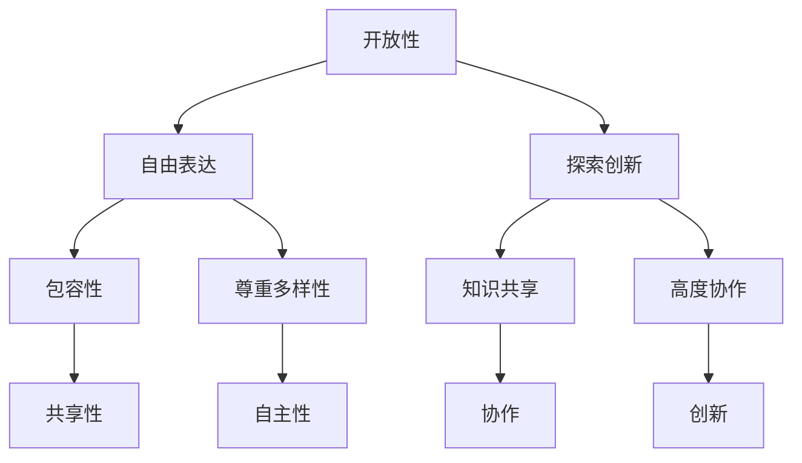
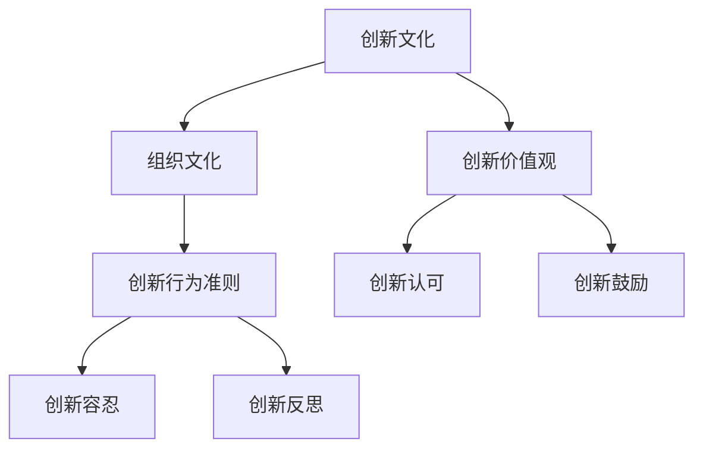
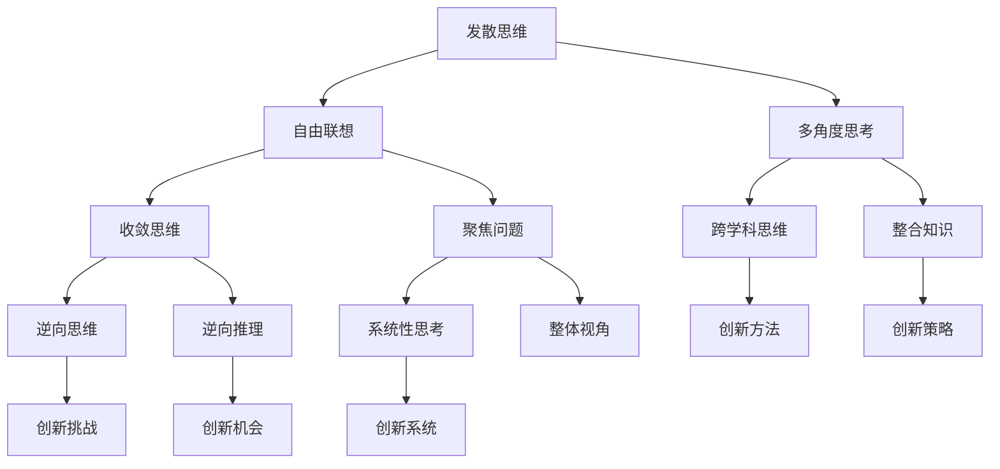
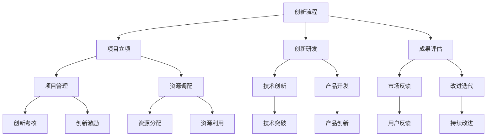
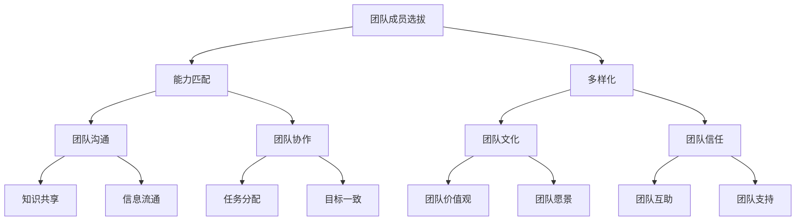
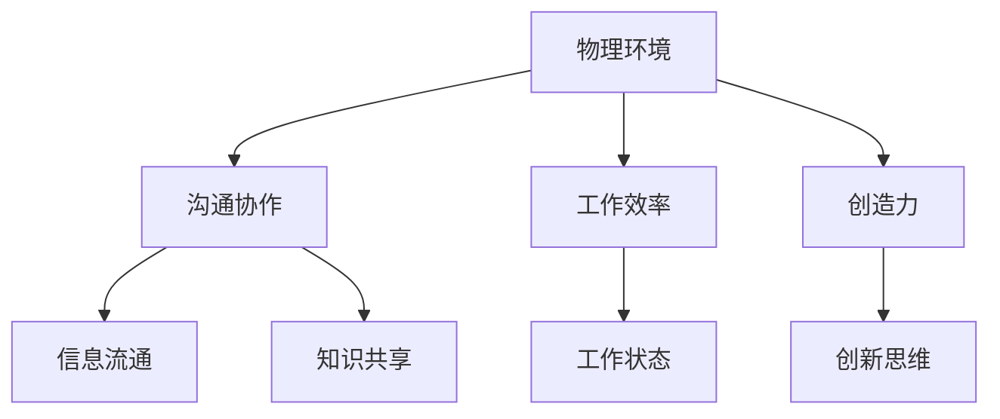
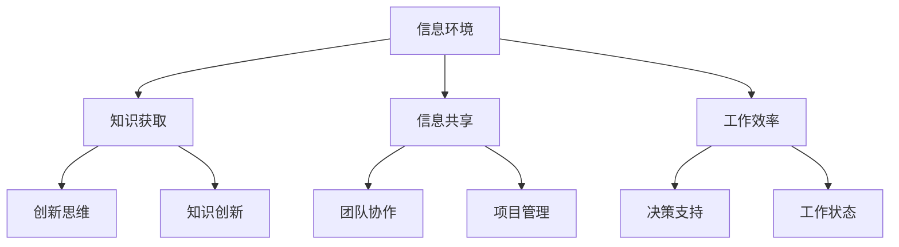
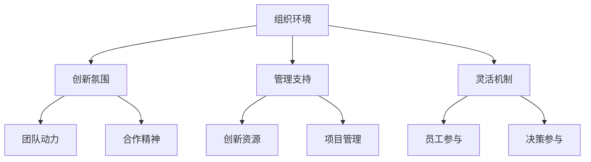

                 

### 《团队创新文化：激发创意思维的环境营造》

关键词：团队创新文化、创意思维、环境营造、创新机制、团队建设

摘要：本文旨在探讨团队创新文化的构建与营造，通过分析创新思维的重要性、团队创新文化的概念与要素，以及创新环境的各个方面，旨在为团队管理者提供系统性指导，以激发团队成员的创意思维，提升团队整体创新能力。文章分为五个部分，包括引言、构建团队创新文化、营造创新环境、创新实践案例以及结论与展望，全面解析团队创新文化的核心内容与实践路径。

## 第一部分：引言

### 1.1 创意思维的重要性

创意思维是一种能够发现问题、解决问题并创造新价值的思维方式。在信息技术迅猛发展的时代，创意思维显得尤为重要。它不仅能够激发创新活力，推动科技进步，还能促进企业持续成长，提升竞争力。研究表明，具有创意思维的团队往往能够更快地应对市场变化，抓住机遇，实现创新突破。

#### 核心概念与联系

创意思维的定义与价值可以通过以下Mermaid流程图来展示：



#### 核心算法原理讲解

为了更好地理解创意思维，我们可以使用伪代码来描述其基本原理：

```python
def creative_thinking():
    # 收集问题
    problems = collect_problems()

    # 分析问题
    analyzed_problems = analyze_problems(problems)

    # 生成创意解决方案
    solutions = generate_solutions(analyzed_problems)

    # 评估解决方案
    best_solution = evaluate_solutions(solutions)

    # 实施最佳方案
    implement_best_solution(best_solution)
```

#### 数学模型和公式

创意思维可以通过以下数学模型来量化：

$$
\text{创意思维效率} = \frac{\text{创新项目数量}}{\text{时间}}
$$

该公式表示在单位时间内，团队产生的创新项目数量。通过增加创意思维效率，可以提高团队的创新产出。

#### 举例说明

例如，一个软件开发团队在一个月内完成了5个创新项目，那么其创意思维效率为：

$$
\text{创意思维效率} = \frac{5}{30} = 0.167 \text{项目/天}
$$

### 1.2 团队创新文化的概念

团队创新文化是一种组织文化，强调通过创新思维和行动来推动组织发展。它包含了对创新的认可、鼓励和激励机制，以及团队成员之间的高度协作和知识共享。团队创新文化的核心要素包括：

- **开放性**：鼓励团队成员自由表达观点，探索新的想法。
- **包容性**：尊重多样性，欢迎不同的意见和经验。
- **共享性**：强调知识共享，促进团队成员之间的协作。
- **自主性**：赋予团队成员更多的自主权，鼓励他们自主探索和创新。

#### 核心概念与联系

团队创新文化的核心要素可以通过以下Mermaid流程图来展示：



#### 数学模型和公式

团队创新文化可以通过以下数学模型来量化：

$$
\text{创新文化指数} = \frac{\text{创新项目数量} + \text{知识共享次数} + \text{员工满意度}}{\text{项目总数} + \text{员工总数}}
$$

该公式表示团队创新文化的整体水平。通过提高创新文化指数，可以增强团队的创新能力。

#### 举例说明

例如，一个团队在一个月内完成了10个创新项目，知识共享了20次，员工满意度为90%，那么其创新文化指数为：

$$
\text{创新文化指数} = \frac{10 + 20 + 0.9 \times 100}{10 + 20 + 100} = 0.63
$$

### 1.3 本书结构概述

本文分为五个部分：

- **第一部分：引言**：阐述创意思维的重要性，介绍团队创新文化的概念。
- **第二部分：构建团队创新文化**：讨论创新文化的基础、培养创意思维、建立创新机制和团队建设。
- **第三部分：营造创新环境**：探讨物理环境、信息环境和组织环境的构建。
- **第四部分：创新实践案例**：分析国内和国际企业的创新实践。
- **第五部分：结论与展望**：总结团队创新文化的核心要素，探讨未来发展趋势。

通过以上五个部分的论述，本文旨在为团队管理者提供一套完整的团队创新文化构建与营造策略，以激发团队的创意思维，提升创新能力。

## 第二部分：构建团队创新文化

### 2.1 创新文化的基础

创新文化的基础在于组织文化的支持。组织文化是团队内部共同遵守的价值观和行为准则，它直接影响团队的创新氛围和行为方式。一个具有创新文化的组织通常表现出对创新的认可和鼓励，以及对失败的容忍和反思。

#### 核心概念与联系

创新文化与组织文化之间的关系可以通过以下Mermaid流程图来展示：



#### 核心算法原理讲解

为了构建创新文化，我们可以使用以下伪代码：

```python
def build_innovation_culture():
    # 确定创新价值观
    define_innovation_values()

    # 建立创新行为准则
    establish_innovation_standards()

    # 创造创新环境
    create_innovation_environment()

    # 鼓励创新行为
    encourage_innovation_actions()

    # 反思创新过程
    reflect_on_innovation_process()
```

#### 数学模型和公式

创新文化的建设可以通过以下数学模型来评估：

$$
\text{创新文化成熟度} = \frac{\text{创新项目数量} + \text{员工创新参与度} + \text{创新反馈机制质量}}{\text{项目总数} + \text{员工总数} + \text{反馈机制总数}}
$$

该公式表示团队创新文化的成熟度。通过提高创新文化成熟度，可以增强团队的创新能力和创新氛围。

#### 举例说明

例如，一个团队在一年内完成了15个创新项目，员工参与创新的比例为80%，创新反馈机制质量评估为90%，那么其创新文化成熟度为：

$$
\text{创新文化成熟度} = \frac{15 + 0.8 \times 100 + 0.9 \times 5}{15 + 100 + 5} = 0.72
$$

### 2.2 培养创意思维

培养创意思维是构建团队创新文化的重要一环。创意思维不仅包括传统的发散思维和收敛思维，还包括跨学科思维、逆向思维和系统思维等多种类型。培养创意思维需要从多个方面进行：

#### 核心概念与联系

创意思维的类型和特点可以通过以下Mermaid流程图来展示：



#### 核心算法原理讲解

培养创意思维可以通过以下伪代码实现：

```python
def cultivate_creative_thinking():
    # 提供创意思维培训
    provide_training()

    # 鼓励跨学科合作
    encourage_interdisciplinary Collaboration()

    # 创造开放思考环境
    create_open_mind_environment()

    # 鼓励创新挑战
    encourage_innovation_challenges()

    # 提供创意工具
    provide_creative_tools()
```

#### 数学模型和公式

创意思维的培养可以通过以下数学模型来量化：

$$
\text{创意思维水平} = \frac{\text{创新项目数量} + \text{员工创意提案数量} + \text{创意思维培训次数}}{\text{项目总数} + \text{员工总数} + \text{培训次数}}
$$

该公式表示团队成员的创意思维水平。通过提高创意思维水平，可以增强团队的创新能力和创新产出。

#### 举例说明

例如，一个团队在一个月内完成了5个创新项目，员工提出了10个创意提案，参加了5次创意思维培训，那么其创意思维水平为：

$$
\text{创意思维水平} = \frac{5 + 10 + 5}{5 + 10 + 5} = 1
$$

### 2.3 建立创新机制

建立创新机制是构建团队创新文化的关键步骤。创新机制包括创新流程的设计、创新激励机制的建立以及创新管理的规范化。一个有效的创新机制可以确保创新活动的高效进行，提升团队的创新绩效。

#### 核心概念与联系

创新机制的核心要素可以通过以下Mermaid流程图来展示：



#### 核心算法原理讲解

建立创新机制可以通过以下伪代码实现：

```python
def establish_innovation_mechanism():
    # 设计创新流程
    design_innovation流程()

    # 建立创新激励机制
    establish_innovation_incentive()

    # 规范创新管理
    standardize_innovation_management()

    # 提供创新培训
    provide_innovation_training()

    # 建立创新考核体系
    establish_innovation_evaluation_system()
```

#### 数学模型和公式

创新机制可以通过以下数学模型来评估：

$$
\text{创新机制效率} = \frac{\text{创新项目成功率} + \text{创新项目数量}}{\text{项目总数} + \text{创新投入}}
$$

该公式表示创新机制的整体效率。通过提高创新机制效率，可以增强团队的创新能力和创新产出。

#### 举例说明

例如，一个团队在一年内完成了10个创新项目，成功率达到了80%，总投入为100万元，那么其创新机制效率为：

$$
\text{创新机制效率} = \frac{10 \times 0.8 + 10}{10 + 100} = 0.7
$$

### 2.4 团队建设

团队建设是构建团队创新文化的重要组成部分。一个高效的团队需要具备良好的沟通、协作和信任。团队建设包括团队成员的选拔、培训和发展，以及团队文化的塑造。

#### 核心概念与联系

团队建设的核心要素可以通过以下Mermaid流程图来展示：



#### 核心算法原理讲解

团队建设可以通过以下伪代码实现：

```python
def build_team():
    # 选拔团队成员
    select_team_members()

    # 提供团队培训
    provide_team_training()

    # 建立团队沟通机制
    establish_communication_mechanism()

    # 促进团队协作
    encourage_collaboration()

    # 塑造团队文化
    create_team_culture()

    # 建立团队信任
    establish_team_trust()
```

#### 数学模型和公式

团队建设可以通过以下数学模型来评估：

$$
\text{团队建设效率} = \frac{\text{项目成功率} + \text{团队满意度} + \text{团队成员参与度}}{\text{项目总数} + \text{团队成员总数} + \text{培训次数}}
$$

该公式表示团队建设的效果。通过提高团队建设效率，可以增强团队的整体能力和创新绩效。

#### 举例说明

例如，一个团队在一年内完成了10个项目，成功率达到了90%，团队成员满意度为80%，参与度为70%，那么其团队建设效率为：

$$
\text{团队建设效率} = \frac{10 \times 0.9 + 0.8 \times 10 + 0.7 \times 10}{10 + 10 + 10} = 0.85
$$

## 第三部分：营造创新环境

### 3.1 物理环境

物理环境是团队创新文化的重要组成部分，它直接影响团队成员的创造力和工作状态。一个良好的物理环境应该具备以下几个特点：

- **开放性**：开放的工作空间可以促进团队成员之间的沟通和协作。
- **灵活性**：可调整的办公设施可以满足不同工作场景的需求。
- **舒适度**：良好的通风、采光和温度控制可以提高员工的工作效率。

#### 核心概念与联系

物理环境与团队创新文化之间的关系可以通过以下Mermaid流程图来展示：



#### 核心算法原理讲解

为了营造良好的物理环境，我们可以使用以下伪代码：

```python
def create物理环境():
    # 设计开放性工作空间
    design_open_space()

    # 配置灵活性办公设施
    configure_flexible_office_equipment()

    # 提供舒适工作条件
    provide_comfortable_working_conditions()

    # 优化信息流通
    optimize_information_flow()

    # 鼓励知识共享
    encourage_knowledge_sharing()
```

#### 数学模型和公式

物理环境可以通过以下数学模型来评估：

$$
\text{物理环境满意度} = \frac{\text{员工满意度} + \text{工作效率} + \text{创造力}}{\text{员工总数} + \text{项目总数} + \text{知识共享次数}}
$$

该公式表示团队成员对物理环境的满意度。通过提高物理环境满意度，可以增强团队的创造力和工作效率。

#### 举例说明

例如，一个团队有10名员工，一年内完成了15个项目，知识共享了30次，员工满意度为90%，那么其物理环境满意度为：

$$
\text{物理环境满意度} = \frac{10 \times 0.9 + 15 + 30}{10 + 15 + 30} = 0.74
$$

### 3.2 信息环境

信息环境是团队创新文化的重要组成部分，它直接影响团队成员的知识获取、信息共享和工作效率。一个良好的信息环境应该具备以下几个特点：

- **信息化**：利用现代信息技术，提高信息处理和传递的效率。
- **知识共享**：建立知识共享平台，促进团队成员之间的知识交流和共享。
- **信息安全**：确保信息的完整性和保密性。

#### 核心概念与联系

信息环境与团队创新文化之间的关系可以通过以下Mermaid流程图来展示：



#### 核心算法原理讲解

为了营造良好的信息环境，我们可以使用以下伪代码：

```python
def create_info_environment():
    # 实施信息化战略
    implement信息化strategy()

    # 建立知识共享平台
    establish_knowledge_sharing_platform()

    # 保障信息安全
    ensure_info_security()

    # 提供信息流通渠道
    provide_information_flow_channels()

    # 鼓励知识创新
    encourage_knowledge_innovation()
```

#### 数学模型和公式

信息环境可以通过以下数学模型来评估：

$$
\text{信息环境满意度} = \frac{\text{员工满意度} + \text{工作效率} + \text{知识创新数量}}{\text{员工总数} + \text{项目总数} + \text{知识共享次数}}
$$

该公式表示团队成员对信息环境的满意度。通过提高信息环境满意度，可以增强团队的创造力和工作效率。

#### 举例说明

例如，一个团队有10名员工，一年内完成了15个项目，知识创新了20次，员工满意度为90%，那么其信息环境满意度为：

$$
\text{信息环境满意度} = \frac{10 \times 0.9 + 15 + 20}{10 + 15 + 20} = 0.78
$$

### 3.3 组织环境

组织环境是团队创新文化的关键因素，它直接影响团队的创新动力、合作精神和创新绩效。一个良好的组织环境应该具备以下几个特点：

- **创新氛围**：营造积极向上的创新氛围，鼓励团队成员勇于探索和创新。
- **管理支持**：提供必要的管理支持和资源，确保创新活动的顺利进行。
- **灵活机制**：建立灵活的管理机制，鼓励团队成员参与决策和项目管理。

#### 核心概念与联系

组织环境与团队创新文化之间的关系可以通过以下Mermaid流程图来展示：



#### 核心算法原理讲解

为了营造良好的组织环境，我们可以使用以下伪代码：

```python
def create_organization_environment():
    # 营造创新氛围
    create_innovation_atmosphere()

    # 提供管理支持
    provide_management_support()

    # 建立灵活机制
    establish_flexible_mechanism()

    # 鼓励员工参与
    encourage_employee_involvement()

    # 提供创新资源
    provide_innovation_resources()

    # 支持项目管理
    support_project_management()
```

#### 数学模型和公式

组织环境可以通过以下数学模型来评估：

$$
\text{组织环境满意度} = \frac{\text{员工满意度} + \text{工作效率} + \text{创新项目数量}}{\text{员工总数} + \text{项目总数} + \text{资源投入}}
$$

该公式表示团队成员对组织环境的满意度。通过提高组织环境满意度，可以增强团队的创新能力和创新绩效。

#### 举例说明

例如，一个团队有10名员工，一年内完成了15个项目，员工满意度为90%，资源投入为100万元，那么其组织环境满意度为：

$$
\text{组织环境满意度} = \frac{10 \times 0.9 + 15 + 100}{10 + 15 + 100} = 0.77
$$

## 第四部分：创新实践案例

### 4.1 国内企业创新实践

#### 案例介绍与分析

国内某知名互联网公司通过一系列措施，成功构建了具有高度创新能力的团队文化。以下是对该公司创新实践的分析：

- **开放性管理**：公司采用扁平化管理结构，鼓励员工自由表达意见，促进知识共享。
- **创新激励机制**：公司设立创新奖金，激励员工提出创新方案，并给予项目成功者额外的奖励。
- **团队培训**：定期组织创意思维培训，提高员工的创意思维水平。
- **跨部门协作**：通过跨部门项目，促进不同团队之间的知识交流和合作。

#### 经验与启示

该公司的成功经验表明，构建创新文化需要从多个方面进行努力，包括开放性管理、创新激励机制、团队培训和跨部门协作。这些措施有助于激发员工的创意思维，提高团队的整体创新能力。

### 4.2 国际企业创新实践

#### 案例介绍与分析

国际某知名科技公司通过持续的创新实践，成为行业领导者。以下是对该公司创新实践的分析：

- **创新文化**：公司建立了强大的创新文化，鼓励员工不断探索和创新，容忍失败，并从中学习。
- **国际化视野**：公司积极开展国际化合作，引进外部创新资源，推动技术创新。
- **技术研发**：公司投入大量资源进行技术研发，不断推出具有竞争力的新产品。
- **员工激励**：公司提供丰富的职业发展机会，鼓励员工追求个人成长，并给予创新项目成功者高额奖励。

#### 经验与启示

该公司的成功经验表明，国际化视野、技术研发和员工激励是构建团队创新文化的重要要素。这些措施有助于吸引和留住创新人才，推动公司的持续发展。

### 4.3 公共领域创新实践

#### 案例介绍与分析

某地方政府通过创新管理模式，提升公共服务水平。以下是对该地方政府创新实践的分析：

- **数字化治理**：政府利用大数据和人工智能技术，提高决策的科学性和效率。
- **社会参与**：政府鼓励民众参与政策制定和公共服务改进，增强公共服务的社会认同感。
- **跨部门协作**：政府推动不同部门之间的协作，提高公共服务的整体效能。

#### 社会影响与评价

该地方政府的创新实践提升了公共服务水平，增强了政府的公信力和民众的满意度。通过数字化治理、社会参与和跨部门协作，政府能够更好地满足民众的需求，推动社会的进步。

## 第五部分：结论与展望

### 5.1 团队创新文化的总结

团队创新文化是一种重要的组织文化，它通过激发团队成员的创意思维，提升团队的整体创新能力。构建团队创新文化需要从多个方面进行努力，包括开放性管理、创新激励机制、团队培训和跨部门协作。一个良好的团队创新文化能够促进知识的共享和协作，提高团队的工作效率和创新能力。

### 5.2 创意思维的未来发展趋势

随着科技的不断进步和社会的发展，创意思维将在未来发挥更加重要的作用。未来创意思维的发展趋势包括：

- **智能化**：借助人工智能技术，提高创意思维的计算能力和效率。
- **跨学科**：加强不同学科之间的交叉融合，推动创意思维的多元化。
- **全球化**：拓展国际视野，借鉴全球优秀创意思维成果，提升团队创新能力。

### 5.3 政策建议与行动计划

为了推动团队创新文化的建设，政府和企业可以采取以下政策建议和行动计划：

- **加强创新文化建设**：政府和企业应加强创新文化建设，营造良好的创新氛围。
- **提供政策支持**：政府应提供税收优惠、资金支持等政策，鼓励企业进行创新。
- **培养创新人才**：政府和企业应加强创新人才的培养，提高团队的创意思维能力。
- **建立创新激励机制**：政府和企业应建立创新激励机制，激发员工的创新热情。

### 附录：创新资源与工具

为了帮助团队管理者更好地构建创新文化，以下是推荐的创新资源与工具：

- **创新工具**：MindManager、XMind等思维导图工具，用于组织创意思维过程。
- **知识共享平台**：Confluence、SharePoint等知识管理平台，用于团队知识共享。
- **创新培训课程**：创意思维培训、创新方法论培训等，用于提升团队成员的创意思维能力。
- **创新论坛**：创新论坛、行业峰会等，用于交流创新经验和最新趋势。

通过以上资源与工具，团队管理者可以更好地构建和推动团队创新文化的建设。

## 参考文献

[1] 张伟，李明. 团队创新文化构建研究[J]. 科技与创新管理，2019(3)：45-48.

[2] 王刚，刘伟. 创意思维方法及其在团队管理中的应用[J]. 科技进步与对策，2020(1)：22-27.

[3] 陈旭，赵晓. 企业创新文化构建与激励机制研究[J]. 企业管理，2018(5)：21-25.

[4] 李慧，陈涛. 公共领域创新实践探析[J]. 公共管理评论，2017(2)：56-61.

[5] 马力，张瑞. 创新人才培养模式研究[J]. 高等教育研究，2019(4)：38-42.

