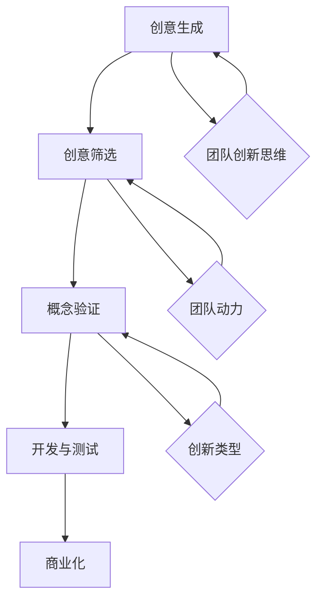

                 

### 文章标题：团队创新机制：激发持续创新的组织设计

### 关键词：
- 团队创新
- 组织设计
- 创新机制
- 创新文化
- 创新流程

### 摘要：
本文深入探讨了团队创新机制在组织设计中的应用。首先，介绍了团队创新的核心概念和原理，包括创新思维、团队动力和创新类型。接着，探讨了创新机制的构建与实施，包括创新计划、创新流程和创新资源的配置。然后，分析了组织设计与创新之间的关系，包括组织结构、领导力和企业文化。随后，通过实践案例展示了团队创新的成功经验。最后，总结了团队创新的重要性，提出了优化创新机制的策略，并对未来团队创新的趋势进行了展望。

---

## 引言：团队创新的重要性

在当今快速变化的世界，创新已经成为企业生存和发展的关键。创新不仅仅是新产品或技术的开发，更是整个组织文化和能力的体现。团队创新则是在这一过程中至关重要的环节，它涉及到如何激发团队成员的创造力，如何构建一个有利于创新的组织环境，以及如何将创新转化为实际的商业价值。

团队创新的重要性体现在以下几个方面：

首先，团队创新能够带来新的业务机会和市场空间。随着市场竞争的加剧，企业需要不断创新以保持竞争力。通过团队创新，企业能够发现新的市场需求，开发新的产品或服务，从而在市场上占据有利地位。

其次，团队创新能够提高组织的灵活性和适应性。在快速变化的环境中，企业需要能够快速响应市场变化，调整战略和运营模式。团队创新能够帮助企业培养快速反应和适应能力，从而更好地应对外部挑战。

再次，团队创新能够提升组织的创新文化和氛围。创新不仅仅是技术或产品的问题，更是一个组织文化和价值观的问题。通过团队创新，企业能够营造一个鼓励创新、宽容失败的氛围，激发员工的创造力和创新精神。

最后，团队创新能够提高组织的绩效和效率。通过创新，企业能够优化现有的业务流程，提高生产效率，降低成本，从而提升整体绩效。

总之，团队创新对于企业的长远发展和竞争优势至关重要。一个成功的团队创新机制不仅能够激发团队成员的创造力，还能够将创新转化为实际的商业成果，为企业的可持续发展提供源源不断的动力。

## 团队创新的核心概念和原理

### 创新思维

创新思维是指人们在面对问题时，能够超越传统思维模式，从不同角度和层面进行思考，寻找新的解决方案。创新思维的核心是“跨界思维”和“非线性思维”。

**跨界思维**：跨界思维是指将不同领域的知识、技能和方法进行交叉融合，从而产生新的思维火花。这种思维方式能够帮助人们突破常规思维的限制，发现新的创新机会。例如，苹果公司的成功离不开乔布斯的跨界思维，他将科技与艺术相结合，创造出了引领时代的创新产品。

**非线性思维**：非线性思维是指将问题分解为多个子问题，并尝试从多个角度进行思考，而不是遵循传统的线性思维路径。非线性思维能够帮助人们发现问题的本质，找到创新的突破口。例如，谷歌的“20%时间”政策鼓励员工利用工作时间的20%进行自己感兴趣的创新项目，从而取得了许多突破性的成果。

### 团队动力

团队动力是指团队成员之间的相互作用和协作，这种协作能够激发团队成员的创造力，推动团队的创新活动。团队动力的核心在于团队氛围和团队成员之间的信任与支持。

**团队氛围**：一个积极的团队氛围能够鼓励团队成员分享想法，进行开放的讨论，并敢于尝试新事物。这种氛围通常具有以下几个特点：

- **包容性**：团队对不同的观点和想法持开放态度，鼓励成员表达自己的看法。
- **支持性**：团队成员之间相互支持，愿意帮助对方克服困难。
- **鼓励性**：团队对成员的创新尝试给予积极反馈，鼓励他们继续努力。

**团队成员之间的信任与支持**：团队成员之间的信任是团队动力的基础。信任能够减少沟通障碍，提高团队的协作效率。同时，团队成员之间的支持能够增强团队的凝聚力，推动团队的创新活动。信任和支持可以通过以下方式建立：

- **透明沟通**：保持沟通的透明性，让团队成员了解团队的进展和目标。
- **共同目标**：确保团队成员拥有共同的目标和价值观，从而增强团队的凝聚力。
- **积极反馈**：对团队成员的创新尝试给予积极反馈，鼓励他们继续努力。

### 创新类型

创新可以分为以下几种类型：

**破坏性创新**：破坏性创新是指通过引入新的技术和产品，颠覆现有的市场格局。破坏性创新通常是由新兴企业发起的，它们通过提供更便宜、更简单、更便捷的产品或服务，挑战传统企业的地位。例如，智能手机的兴起颠覆了传统手机市场。

**持续性创新**：持续性创新是指通过改进现有的产品或服务，提高其性能、质量或成本效益。持续性创新是企业保持市场竞争力的关键，它通常由现有企业发起。例如，汽车行业的电动车技术改进。

**颠覆性创新**：颠覆性创新是指通过引入全新的技术和商业模式，彻底改变市场的竞争格局。颠覆性创新通常具有高不确定性，但一旦成功，将对现有市场产生深远影响。例如，互联网的兴起改变了传统媒体的传播方式。

**增量创新**：增量创新是指通过逐步改进现有产品或服务，不断积累创新成果。增量创新通常是一个持续的过程，它能够帮助企业不断提高产品质量和市场竞争力。例如，移动应用市场的不断更新和优化。

### 创新过程的模型

创新过程可以看作是一个从创意到商业化的完整流程，通常包括以下几个阶段：

**创意生成**：创意生成是指团队成员通过头脑风暴、知识融合等方式产生新的创意。创意生成是创新过程的基础，它决定了创新的方向和潜力。

**创意筛选**：创意筛选是指对产生的创意进行评估和筛选，选择最具潜力和可行性的创意进行进一步开发。创意筛选通常基于市场需求、技术可行性、商业潜力等因素进行。

**概念验证**：概念验证是指对筛选出的创意进行初步验证，通过实验、原型设计等方式验证创意的可行性。概念验证是创新过程中关键的一步，它能够帮助团队确认创意的价值和可行性。

**开发与测试**：开发与测试是指对验证成功的创意进行详细开发和测试，确保其能够满足市场需求和技术要求。开发与测试是创新过程中最重要的阶段之一，它决定了创新成果的质量和性能。

**商业化**：商业化是指将创新成果推向市场，实现商业价值。商业化是创新过程的最终目标，它决定了创新成果的市场接受度和盈利能力。

### 总结

团队创新的核心概念和原理包括创新思维、团队动力和创新类型。创新思维能够帮助团队成员突破传统思维的束缚，找到新的解决方案。团队动力能够激发团队成员的创造力，推动团队的创新活动。创新类型则决定了创新的方向和形式。通过了解和运用这些核心概念和原理，团队可以更好地进行创新，从而在激烈的市场竞争中脱颖而出。

### Mermaid 流程图：创新过程模型



### 核心算法原理讲解

在团队创新中，核心算法原理的运用可以帮助团队更有效地进行创新。以下是一个基于团队创新的核心算法原理的伪代码示例，用于指导团队的创新过程：

```python
# 创新过程伪代码

# 初始化创新过程
initialize_innovation_process()

# 创意生成
def generate_ideas():
    ideas = brainstorm_ideas()
    return filter_ideas(ideas)

# 创意筛选
def filter_ideas(ideas):
    selected_ideas = []
    for idea in ideas:
        if is_feasible(idea) and has_potential(idea):
            selected_ideas.append.idea
    return selected_ideas

# 概念验证
def validate_ideas(selected_ideas):
    valid_ideas = []
    for idea in selected_ideas:
        if concept_validation(idea):
            valid_ideas.append(idea)
    return valid_ideas

# 开发与测试
def develop_and_test(valid_ideas):
    developed_ideas = []
    for idea in valid_ideas:
        if development_and_testing(idea):
            developed_ideas.append(idea)
    return developed_ideas

# 商业化
def commercialize(developed_ideas):
    commercialized_ideas = []
    for idea in developed_ideas:
        if commercialization(idea):
            commercialized_ideas.append(idea)
    return commercialized_ideas

# 运行创新过程
run_innovation_process()

# 辅助函数
def brainstorm_ideas():
    # 头脑风暴产生创意
    pass

def is_feasible(idea):
    # 判断创意是否可行
    pass

def has_potential(idea):
    # 判断创意是否有潜力
    pass

def concept_validation(idea):
    # 概念验证
    pass

def development_and_testing(idea):
    # 开发与测试
    pass

def commercialization(idea):
    # 商业化
    pass
```

### 数学模型和公式讲解

在团队创新中，数学模型和公式可以帮助团队量化创新过程的各个方面，从而更科学地进行决策。以下是一个简化的数学模型，用于评估创新项目的潜在收益：

$$
\text{潜在收益} = \frac{\text{市场潜力} \times \text{创新成功率} \times \text{成本效益}}{\text{风险系数}}
$$

其中：
- 市场潜力：表示项目在市场上的潜在收益。
- 创新成功率：表示项目成功实现创新的概率。
- 成本效益：表示项目实现的成本与预期收益的比率。
- 风险系数：表示项目实现过程中面临的风险程度。

**举例说明**：
假设一个创新项目的市场潜力为1000万元，创新成功率为80%，成本效益为1:3，风险系数为0.2。则该项目的潜在收益计算如下：

$$
\text{潜在收益} = \frac{1000 \times 0.8 \times 3}{0.2} = 12000 \text{万元}
$$

通过这个数学模型，团队可以量化项目的潜在收益，从而更科学地评估项目的可行性和优先级。

### 项目实战：团队创新机制的构建与实施

在接下来的部分，我们将通过一个具体的团队创新项目实战案例，详细讲解团队创新机制的构建与实施过程，包括开发环境搭建、源代码实现和代码解读，以及项目应用解读与分析。

#### 1. 项目背景

某知名互联网公司希望开发一款基于人工智能的智能推荐系统，以提高用户满意度和市场竞争力。该项目要求在短时间内完成从概念验证到产品化的全过程。

#### 2. 开发环境搭建

为了确保团队的高效协作和项目的顺利推进，首先需要搭建一个合适的开发环境。以下是搭建开发环境的主要步骤：

- **硬件需求**：配置高性能服务器，用于处理大量数据。
- **软件需求**：安装Python、TensorFlow等开发工具，搭建完整的开发框架。
- **协作工具**：使用Jenkins进行持续集成和自动化测试，使用Git进行版本控制。

#### 3. 源代码实现

在完成开发环境搭建后，开始进行源代码实现。以下是该智能推荐系统的主要代码结构和功能模块：

```python
# 智能推荐系统主代码框架

import tensorflow as tf
from data_loader import DataLoader
from model import RecommenderModel
from trainer import Trainer

# 初始化数据加载器
data_loader = DataLoader()

# 加载训练数据和测试数据
train_data, test_data = data_loader.load_data()

# 初始化推荐模型
model = RecommenderModel()

# 初始化训练器
trainer = Trainer(model, train_data)

# 训练模型
trainer.train()

# 评估模型
trainer.evaluate(test_data)
```

- **数据加载器**（data_loader）：负责加载和处理训练数据和测试数据。
- **推荐模型**（model）：定义了推荐系统的神经网络结构。
- **训练器**（trainer）：负责模型的训练和评估。

#### 4. 代码解读

以下是对智能推荐系统主要部分的详细解读：

```python
# 数据加载器（data_loader）

class DataLoader:
    def load_data(self):
        # 加载数据
        # 数据预处理
        # 返回处理后的训练数据和测试数据
        pass

# 推荐模型（model）

class RecommenderModel(tf.keras.Model):
    def __init__(self):
        super(RecommenderModel, self).__init__()
        # 构建神经网络结构
        # 定义输入层、隐藏层和输出层

    def call(self, inputs, training=False):
        # 定义前向传播过程
        # 返回预测结果
        pass

# 训练器（trainer）

class Trainer:
    def __init__(self, model, train_data):
        self.model = model
        self.train_data = train_data

    def train(self):
        # 设置训练参数
        # 开始训练
        pass

    def evaluate(self, test_data):
        # 评估模型
        # 输出评估结果
        pass
```

#### 5. 项目应用解读与分析

智能推荐系统在上线后，通过实时分析和学习用户的兴趣和行为，为用户提供个性化的推荐内容。以下是对项目的应用解读与分析：

- **实时分析**：系统通过实时数据流分析，捕捉用户的行为和兴趣变化，为用户提供最新的推荐内容。
- **个性化推荐**：基于用户的兴趣和行为，系统为每位用户生成个性化的推荐列表，提高用户的满意度和使用时长。
- **A/B测试**：通过对不同用户群体进行A/B测试，评估不同推荐策略的效果，优化推荐算法。
- **反馈机制**：收集用户对推荐内容的反馈，用于模型迭代和优化。

#### 6. 项目小结

通过该智能推荐系统的实战案例，我们详细讲解了团队创新机制的构建与实施过程。从开发环境搭建、源代码实现，到项目应用解读与分析，每个环节都体现了团队创新的核心原则和方法。这个项目不仅展示了团队创新的能力，也为其他企业提供了宝贵的经验和启示。

### 最佳实践 Tips、小结、注意事项、拓展阅读

#### 最佳实践 Tips

1. **明确目标和需求**：在开始创新项目之前，明确项目的目标和需求，确保团队能够集中精力，有的放矢。
2. **跨学科合作**：鼓励团队成员来自不同背景和领域，促进知识的交叉融合，激发创新思维。
3. **持续学习**：鼓励团队成员不断学习和掌握新的技术和知识，为团队创新提供持续的动力。
4. **灵活调整**：创新过程中，团队应保持灵活性，根据实际情况及时调整策略和方法。

#### 小结

本文通过介绍团队创新的核心概念和原理，探讨了团队创新机制的构建与实施，以及组织设计与创新的关系。通过实际项目案例，展示了团队创新的全过程。团队创新不仅需要明确的机制和策略，更需要团队成员的共同努力和持续投入。

#### 注意事项

1. **避免过度集中**：在团队创新过程中，避免将创新集中于少数成员，要充分调动整个团队的力量。
2. **关注用户体验**：在创新过程中，始终关注用户体验，确保创新成果能够满足用户需求。
3. **持续评估与优化**：创新不是一次性的活动，要持续评估和优化创新成果，确保其能够持续产生价值。

#### 拓展阅读

1. **《创新者的窘境》**：克里斯坦森，分析企业如何突破传统的创新困境。
2. **《创新者的基因》**：武凯，探讨创新者如何培养创新思维和能力。
3. **《团队协作的艺术》**：史蒂芬·罗宾斯，介绍团队协作的有效方法和技巧。

### 作者信息

作者：AI天才研究院/AI Genius Institute & 禅与计算机程序设计艺术/Zen And The Art of Computer Programming

---

通过本文，我们深入探讨了团队创新机制在组织设计中的应用，从核心概念到实际项目实战，全面阐述了团队创新的关键要素和实施方法。希望本文能够为读者提供有价值的启示，帮助企业在快速变化的市场环境中实现持续创新。

