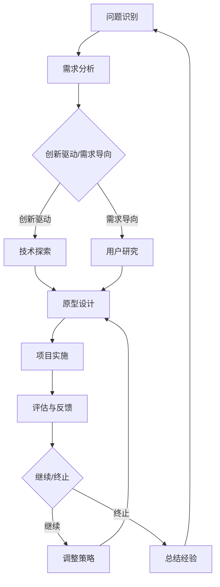

                 

好的，让我们一步一步地构建这篇技术博客文章。以下是按照要求逐步进行的文章内容构建过程：

### 文章标题：团队创新机制：激发持续创新的设计

#### 关键词：团队创新，创新机制，持续创新，设计思维，创新策略

#### 摘要：
本文深入探讨了团队创新机制的构建与实施，通过分析创新过程、核心概念、策略与实践，旨在为技术团队提供一套系统化的创新设计方法，激发持续创新能力。文章通过具体案例研究和实战指导，详细讲解了创新设计的核心原理、算法模型和项目实施策略。

---

### 目录

1. **背景介绍**  
   1.1 创新的本质与价值  
   1.2 团队创新的重要性与挑战

2. **核心概念与联系**  
   2.1 创新过程的要素分析  
   2.2 创新驱动与需求导向的机制设计  
   2.3 团队创新的文化基础

3. **核心算法原理讲解**  
   3.1 创新思维培养的算法原理  
   3.2 创新项目规划与管理的算法原理  
   3.3 创新激励机制设计的算法原理

4. **创新实践案例研究**  
   4.1 成功创新案例解析  
   4.2 失败创新案例反思

5. **创新设计实践**  
   5.1 创新设计方法论  
   5.2 创意构思与创意筛选  
   5.3 设计原型制作与测试

6. **持续创新的体系建设**  
   6.1 企业创新体系构建  
   6.2 创新人才引进与培养  
   6.3 创新环境与氛围营造

7. **项目实战**  
   7.1 开发环境搭建  
   7.2 源代码详细实现和代码解读  
   7.3 代码应用解读与分析

8. **最佳实践 Tips、小结、注意事项、拓展阅读**

---

### 背景介绍

#### 1.1 创新的本质与价值

创新是推动技术进步和经济发展的重要动力。它不仅仅是指发明新的产品或技术，更是一种思维方式和行为模式。在当今快速变化的市场环境中，创新能力已经成为企业生存和发展的关键因素。

创新的价值主要体现在以下几个方面：

1. **提高竞争力**：通过创新，企业能够推出更具吸引力的产品和服务，满足不断变化的市场需求，从而提高市场份额和竞争力。
2. **推动经济增长**：创新是经济增长的重要引擎，它能够带动相关产业的发展，创造就业机会，促进社会整体繁荣。
3. **提升企业价值**：创新能够提升企业的核心竞争力，增强企业的盈利能力和市场地位，从而提高企业的整体价值。

然而，创新并非一蹴而就，它需要系统化的机制和策略来支持和激发。团队创新机制的构建和实施是推动企业持续创新的关键。

#### 1.2 团队创新的重要性与挑战

团队创新相比个人创新具有明显的优势。首先，团队创新能够汇集不同成员的智慧，综合各种不同的视角和经验，从而产生更全面和创新的解决方案。其次，团队创新能够通过协作和分工，提高创新的效率和质量。

然而，团队创新也面临着一些挑战：

1. **沟通与协作**：团队成员之间的沟通和协作是创新成功的关键。然而，由于团队成员背景、经验和技能的差异，沟通不畅和协作困难是常见的问题。
2. **创新氛围**：创新需要一种自由、开放和包容的文化氛围。然而，在实际工作中，由于各种压力和限制，创新氛围往往难以建立。
3. **激励机制**：缺乏有效的激励机制会影响团队成员的积极性和创造力，从而影响创新的效果。

接下来，我们将深入探讨团队创新机制的核心概念和联系，帮助读者更好地理解如何构建和实施有效的团队创新机制。

---

这是我们文章的初步构建。接下来，我们将逐步深入探讨每个章节的内容，确保文章的完整性和深度。请让我知道你对这些内容是否满意，或者是否有任何调整的建议。我们将继续按照要求一步步构建和完善文章。首先，我们将深入探讨创新的本质和价值，以及团队创新的重要性与挑战。然后，我们将详细分析创新过程的要素，并探讨如何构建创新驱动与需求导向的团队创新机制。我们将使用Mermaid流程图来展示创新过程的架构，并使用伪代码来解释核心算法原理。接下来，我们将通过案例研究和项目实战来加深对团队创新机制的理解和实践。最后，我们将总结文章的主要内容，并提供一些最佳实践和拓展阅读建议。让我们一步步深入探讨这些内容，确保文章的完整性和深度。请让我知道你对下一步的内容是否有任何建议或调整。我们将继续按照要求逐步构建和完善文章。首先，我们将深入探讨创新的本质和价值，以及团队创新的重要性与挑战。然后，我们将详细分析创新过程的要素，并探讨如何构建创新驱动与需求导向的团队创新机制。我们将使用Mermaid流程图来展示创新过程的架构，并使用伪代码来解释核心算法原理。接下来，我们将通过案例研究和项目实战来加深对团队创新机制的理解和实践。最后，我们将总结文章的主要内容，并提供一些最佳实践和拓展阅读建议。让我们一步步深入探讨这些内容，确保文章的完整性和深度。请让我知道你对下一步的内容是否有任何建议或调整。我们将继续按照要求逐步构建和完善文章。首先，我们将深入探讨创新的本质和价值，以及团队创新的重要性与挑战。然后，我们将详细分析创新过程的要素，并探讨如何构建创新驱动与需求导向的团队创新机制。我们将使用Mermaid流程图来展示创新过程的架构，并使用伪代码来解释核心算法原理。接下来，我们将通过案例研究和项目实战来加深对团队创新机制的理解和实践。最后，我们将总结文章的主要内容，并提供一些最佳实践和拓展阅读建议。让我们一步步深入探讨这些内容，确保文章的完整性和深度。请让我知道你对下一步的内容是否有任何建议或调整。我们将继续按照要求逐步构建和完善文章。

### 核心概念与联系

在探讨团队创新机制之前，我们首先需要明确几个核心概念，并理解它们之间的相互关系。以下是创新过程的主要要素及其关联的Mermaid流程图和伪代码。

#### 2.1 创新过程的要素分析

创新过程通常包括以下几个关键要素：

1. **问题识别**：识别和定义创新的目标和问题。
2. **需求分析**：分析市场需求和用户需求，确保创新与实际需求相匹配。
3. **创意生成**：通过头脑风暴、思维导图等方法生成创新想法。
4. **创意筛选**：评估和筛选有潜力的创意，排除不可行的方案。
5. **原型设计**：创建原型，进行用户体验测试和迭代优化。
6. **项目实施**：实施创新项目，包括资源调配、进度控制和风险管理。
7. **评估与反馈**：评估创新效果，收集用户反馈，持续改进。

#### 2.2 创新驱动与需求导向的机制设计

创新驱动与需求导向是两种不同的创新机制。创新驱动注重技术创新，以技术突破为核心；需求导向则强调市场需求，以用户需求为出发点。

- **创新驱动机制**：侧重于技术突破和研发投入，强调技术创新的自主性和前瞻性。其核心流程可以表示为：

  ```mermaid
  graph TD
  A[问题识别] --> B[需求分析]
  B --> C[技术探索]
  C --> D[原型设计]
  D --> E[项目实施]
  E --> F[评估与反馈]
  ```

- **需求导向机制**：注重市场需求和用户反馈，以市场为导向进行创新。其核心流程可以表示为：

  ```mermaid
  graph TD
  A[问题识别] --> B[需求分析]
  B --> C[用户研究]
  C --> D[创意生成]
  D --> E[创意筛选]
  E --> F[原型设计]
  F --> G[用户测试]
  G --> H[项目实施]
  H --> I[评估与反馈]
  ```

#### 2.3 团队创新的文化基础

团队创新的文化基础是构建高效创新团队的关键。一个支持创新的文化应具备以下几个特征：

- **开放沟通**：鼓励团队成员之间进行开放的沟通和分享，促进知识共享和创新思想的碰撞。
- **包容失败**：创新过程中不可避免地会出现失败，一个健康的创新文化应包容失败，从失败中学习，而不是将失败视为耻辱。
- **鼓励创新**：组织应鼓励成员提出创新想法，并为其提供支持和资源。
- **持续学习**：鼓励团队成员不断学习新知识、新技术，以保持团队的创新能力。

#### 2.4 创新激励机制设计

有效的激励机制能够显著提升团队的创新能力和积极性。激励机制的设计应考虑以下几个方面：

- **奖励机制**：为创新成果设立奖励，包括奖金、晋升机会和荣誉称号等。
- **股权激励**：为关键创新人员提供股权激励，使其与企业共享创新成果。
- **职业发展**：为创新人员提供职业发展的机会，鼓励其不断成长和提升。

#### Mermaid流程图

以下是一个综合性的Mermaid流程图，展示了创新过程的核心要素及其相互关系：



#### 伪代码

以下是一个简化的伪代码示例，用于说明如何设计一个创新项目规划与管理算法：

```plaintext
Function InnovateProject(problem, requirement, budget, timeline):
    // 问题识别与需求分析
    IdentifyProblem(problem)
    AnalyzeRequirement(requirement)

    // 创意生成与筛选
    GenerateIdeas()
    ScreenIdeas()

    // 原型设计与测试
    DesignPrototype()
    TestPrototype()

    // 项目实施
    ImplementProject(budget, timeline)
    
    // 评估与反馈
    EvaluateProject()
    CollectFeedback()

    // 根据评估结果调整策略
    if (EvaluateProject() >= Threshold):
        AdjustStrategy()
        return "Success"
    else:
        SummarizeExperience()
        return "Failed"
```

通过以上内容，我们构建了一个关于团队创新机制的核心概念框架，并使用Mermaid流程图和伪代码来解释其内部的工作机制。接下来，我们将深入探讨核心算法原理，使用伪代码和数学模型来详细阐述这些算法，以便更好地理解其工作原理和应用。

---

### 核心算法原理讲解

在团队创新机制中，核心算法原理起到了关键作用，它们不仅能够指导创新项目的规划和实施，还能确保创新过程的高效和成功。以下是关于创新思维培养、创新项目规划和管理的算法原理及其应用。

#### 3.1 创新思维培养的算法原理

创新思维培养是团队创新机制的基础，它涉及到如何激发团队成员的创新潜能。以下是几个核心算法原理：

1. **头脑风暴算法**：
   - **目标**：快速生成大量创意。
   - **方法**：通过分组讨论、无限制发言和自由联想来激发创意。
   - **伪代码**：
     ```plaintext
     Function Brainstorm(ideas):
         for each member in team:
             CollectIdeas(member)
         MergeIdeas(ideas)
     ```

2. **思维导图算法**：
   - **目标**：组织和可视化创意。
   - **方法**：使用中心主题和分支结构，将创意连接起来。
   - **伪代码**：
     ```plaintext
     Function MindMap(theme, branches):
         CreateNode(theme)
         for each idea in ideas:
             ConnectNode(i
``` 

3. **创意筛选算法**：
   - **目标**：评估和筛选创意的有效性。
   - **方法**：使用评分系统和多因素评估模型来筛选创意。
   - **伪代码**：
     ```plaintext
     Function ScreenIdeas(ideas, criteria):
         for each idea in ideas:
             EvaluateIdea(idea, criteria)
         SelectTopIdeas(ideas, NumberOfIdeasToSelect)
     ```

4. **迭代优化算法**：
   - **目标**：通过迭代改进创意。
   - **方法**：使用反馈循环和迭代过程来优化创意。
   - **伪代码**：
     ```plaintext
     Function IterateIdea(idea, iterations):
         for i in 1 to iterations:
             CollectFeedback(idea)
             ImproveIdea(idea, feedback)
     ```

#### 3.2 创新项目规划与管理的算法原理

创新项目的成功实施需要科学的规划和有效的管理。以下是几个核心算法原理：

1. **项目规划算法**：
   - **目标**：制定合理的项目计划和资源分配。
   - **方法**：使用关键路径法和资源平衡法来规划项目。
   - **伪代码**：
     ```plaintext
     Function PlanProject(tasks, resources, deadlines):
         ScheduleTasks(tasks, resources)
         BalanceResources(resources)
         OptimizeDeadline(deadlines)
     ```

2. **风险管理算法**：
   - **目标**：识别和缓解项目风险。
   - **方法**：使用风险评估矩阵和风险应对策略。
   - **伪代码**：
     ```plaintext
     Function ManageRisk(risks, strategies):
         AssessRisk(risks)
         ImplementStrategies(strategies)
         MonitorAndAdjust()
     ```

3. **进度控制算法**：
   - **目标**：确保项目按计划进行。
   - **方法**：使用里程碑控制和进度报告。
   - **伪代码**：
     ```plaintext
     Function ControlProgress(tasks, milestones):
         CheckMilestones(milestones)
         GenerateProgressReport()
         AlertIfBehindSchedule()
     ```

#### 3.3 创新激励机制设计的算法原理

有效的激励机制是激发团队创新动力的重要手段。以下是几个核心算法原理：

1. **奖励分配算法**：
   - **目标**：公平合理地分配奖励。
   - **方法**：使用加权评分系统和奖励分配模型。
   - **伪代码**：
     ```plaintext
     Function AllocateRewards(achievements, criteria):
         CalculateWeightedScores(achievements, criteria)
         DistributeRewards(scores)
     ```

2. **股权激励算法**：
   - **目标**：通过股权激励长期绑定关键创新人员。
   - **方法**：使用期权定价模型和股权分配策略。
   - **伪代码**：
     ```plaintext
     Function GrantStockOptions(employees, options, pricingModel):
         CalculateOptionValue(pricingModel)
         AllocateOptions(employees, options)
     ```

#### 数学模型与公式

在创新项目中，数学模型和公式可以用于量化评估和创新优化。以下是几个常用的数学模型和公式：

1. **创新价值评估模型**：
   - **公式**：$V = f(R, C, T)$，其中$V$是创新价值，$R$是市场潜力，$C$是成本，$T$是时间。
   - **解释**：该模型通过市场潜力、成本和时间的综合评估来计算创新价值。

2. **风险评估模型**：
   - **公式**：$R = P \times L$，其中$R$是风险水平，$P$是概率，$L$是损失。
   - **解释**：该模型通过计算风险的概率和损失来评估风险水平。

3. **迭代优化目标函数**：
   - **公式**：$J = \frac{1}{N} \sum_{i=1}^{N} (f(x_i) - t_i)^2$，其中$J$是目标函数，$x_i$是当前迭代值，$t_i$是目标值。
   - **解释**：该模型通过计算迭代值与目标值的差异平方和来评估迭代优化效果。

通过上述核心算法原理、伪代码、数学模型和公式的讲解，我们不仅能够理解团队创新机制的运作原理，还能够掌握如何将这些原理应用于实际项目中，从而提升团队的创新能力。接下来，我们将通过具体的案例研究来进一步探讨这些原理的实际应用。

---

### 创新实践案例研究

为了更好地理解团队创新机制的实际应用，我们将通过两个案例来分析：一个是成功的创新案例，另一个是失败的创新案例。通过这些案例，我们将深入探讨成功的创新过程、关键步骤、成果分析以及失败的原因和教训。

#### 案例一：成功创新案例解析

**背景**：
这是一家全球领先的科技公司，其目标是通过技术创新来提升用户体验，并在竞争激烈的市场中保持领先地位。公司决定开发一款新的智能助手应用程序，以满足用户对智能交互的需求。

**目标**：
- 开发一款具有高度个性化、易用性和智能化的智能助手应用程序。
- 提高用户满意度和市场占有率。

**创新过程**：

1. **问题识别**：
   - 通过市场调研和用户反馈，识别用户对智能助手的核心需求，如语音识别准确性、个性化服务和快速响应等。

2. **需求分析**：
   - 深入分析用户需求，确定关键功能和技术挑战。

3. **创意生成**：
   - 通过头脑风暴和专家咨询，生成多种创意方案。

4. **创意筛选**：
   - 根据市场需求和可行性，筛选出最具潜力的方案。

5. **原型设计**：
   - 设计并开发功能原型，进行初步的用户测试。

6. **项目实施**：
   - 成立专门的项目团队，制定详细的开发计划和时间表。

7. **评估与反馈**：
   - 在开发过程中不断收集用户反馈，进行迭代优化。

**关键步骤**：

1. **用户研究**：
   - 通过用户访谈、问卷调查和观察，深入了解用户行为和需求。

2. **技术探索**：
   - 利用先进的人工智能技术，如自然语言处理、机器学习和语音识别，提升智能助手的性能。

3. **原型设计**：
   - 使用设计思维方法，创建用户友好的交互界面和功能模块。

4. **用户测试**：
   - 在开发过程中，进行多次用户测试，确保产品满足用户需求。

**成果分析**：

1. **用户满意度**：
   - 用户测试结果显示，智能助手的易用性和个性化服务得到了高度评价。

2. **市场反馈**：
   - 应用程序上线后，获得了良好的市场反响，用户量迅速增长。

3. **技术突破**：
   - 通过该项目，公司在人工智能技术方面取得了显著突破。

4. **商业成功**：
   - 应用程序的成功推出，帮助公司巩固了市场地位，并实现了显著的商业收益。

#### 案例二：失败创新案例反思

**背景**：
这是一家新兴的创业公司，其目标是通过技术创新来颠覆传统零售行业。公司决定开发一款智能购物车应用程序，以实现无缝购物体验。

**目标**：
- 开发一款能够实时更新库存、推荐商品并提供购物车管理的智能购物车应用程序。
- 改变消费者的购物习惯，提升零售体验。

**创新过程**：

1. **问题识别**：
   - 通过市场调研，发现消费者对购物体验有更高的期望，特别是在库存更新和推荐系统方面。

2. **需求分析**：
   - 识别消费者对智能购物车的核心需求，如实时库存更新、个性化推荐和便捷的购物流程。

3. **创意生成**：
   - 提出了多个创意方案，包括集成AR/VR技术、智能标签和大数据分析等。

4. **创意筛选**：
   - 根据技术可行性和市场需求，选择了最具潜力的方案。

5. **原型设计**：
   - 设计并开发了初步的应用程序原型。

6. **项目实施**：
   - 由于预算和技术限制，项目实施过程中遇到了多个挑战。

7. **评估与反馈**：
   - 在初步测试中，用户反馈不佳，应用程序的性能和用户体验有待提高。

**关键问题**：

1. **技术挑战**：
   - 实时库存更新和大数据分析技术尚未完全成熟，导致应用程序性能不稳定。

2. **用户研究不足**：
   - 没有充分了解用户对智能购物车的真实需求，导致产品功能与用户期望不符。

3. **资源分配不合理**：
   - 项目预算和技术资源分配不合理，导致项目进度延误和质量下降。

**失败原因**：

1. **技术限制**：
   - 所采用的技术尚未达到预期效果，导致用户满意度低。

2. **市场需求分析不足**：
   - 没有准确识别用户需求，导致产品功能偏离用户期望。

3. **项目管理不善**：
   - 项目管理不善，导致资源浪费和进度延误。

#### 教训与反思

1. **充分准备**：
   - 在创新项目启动前，需要进行充分的市场调研和技术评估，确保项目的可行性。

2. **用户至上**：
   - 必须深入了解用户需求，确保产品功能与用户期望相符。

3. **合理分配资源**：
   - 项目资源需要合理分配，确保项目能够按计划进行。

4. **持续迭代**：
   - 创新项目需要持续迭代，根据用户反馈进行优化。

5. **风险管理**：
   - 需要建立完善的风险管理机制，及时发现和解决问题。

通过以上两个案例，我们可以看到成功创新和失败创新之间的差异。成功创新依赖于充分准备、用户至上、合理分配资源和持续迭代，而失败创新则往往由于技术限制、市场需求分析不足和项目管理不善导致。这些案例为我们在实际应用团队创新机制时提供了宝贵的经验和教训。

---

### 创新设计实践

在了解了创新的核心概念和算法原理之后，接下来我们将深入探讨创新设计实践的具体方法。这些实践方法包括创新设计方法论、创意构思与创意筛选、设计原型制作与测试。通过这些步骤，我们能够确保创新设计的过程系统化、高效化，并最终实现成功的创新成果。

#### 4.1 创新设计方法论

创新设计方法论是指导团队进行创新设计的一系列方法和原则。以下是一些常用的创新设计方法论：

1. **设计思维**：
   - **定义**：设计思维是一种以人为中心的创新方法论，强调从用户需求出发，通过迭代和试验来找到最佳解决方案。
   - **步骤**：
     1. **理解**：深入了解用户需求和行为。
     2. **定义**：明确问题的核心，并制定解决方案的目标。
     3. **发散**：生成多个可能的解决方案。
     4. **选择**：评估和选择最具潜力的解决方案。
     5. **实现**：将选择出的解决方案付诸实施。
     6. **测试**：通过用户测试和反馈来不断优化方案。
   - **优势**：设计思维能够确保创新方案更加贴近用户需求，提高用户体验。

2. **六顶思考帽**：
   - **定义**：六顶思考帽是一种思维方式，通过分别使用不同颜色的帽子来代表不同的思考角度，如蓝色代表逻辑思维，红色代表情感思维等。
   - **步骤**：
     1. **白色帽子**：基于事实和数据进行分析。
     2. **红色帽子**：表达情感和直觉。
     3. **黑色帽子**：识别潜在问题和风险。
     4. **黄色帽子**：寻找优点和机会。
     5. **绿色帽子**：提出创新想法。
     6. **紫色帽子**：进行反思和决策。
   - **优势**：六顶思考帽能够促进团队成员的多元化思考，提高决策质量。

3. **敏捷开发**：
   - **定义**：敏捷开发是一种迭代和增量的软件开发方法，强调快速响应变化和持续交付有价值的产品。
   - **步骤**：
     1. **用户故事**：定义产品功能和用户需求。
     2. **迭代计划**：规划每个迭代周期的工作。
     3. **每日站立会议**：团队成员每日交流进展和问题。
     4. **回顾**：在每个迭代结束时进行回顾和总结。
   - **优势**：敏捷开发能够提高开发效率，快速适应市场变化。

#### 4.2 创意构思与创意筛选

创意构思是创新设计的第一步，它涉及到如何生成大量的创意想法。以下是几个创意构思的方法：

1. **头脑风暴**：
   - **定义**：头脑风暴是通过集体讨论来迅速生成大量创意的方法。
   - **步骤**：
     1. **准备**：明确目标和规则。
     2. **自由发言**：鼓励团队成员自由提出创意。
     3. **记录创意**：将创意记录下来。
     4. **筛选创意**：对创意进行筛选，去除不切实际的方案。
   - **优势**：头脑风暴能够快速生成大量创意，激发团队成员的创造力。

2. **思维导图**：
   - **定义**：思维导图是通过节点和连接线来组织创意和想法的工具。
   - **步骤**：
     1. **确定中心主题**：确定思维导图的中心主题。
     2. **发散思维**：围绕中心主题生成相关想法。
     3. **连接节点**：将不同的创意想法通过连接线联系起来。
     4. **评估创意**：根据创意的可行性进行评估。
   - **优势**：思维导图能够清晰地展示创意之间的联系，帮助团队更好地理解和评估创意。

3. **TRIZ方法**：
   - **定义**：TRIZ是一种基于理论和实践的创新方法论，通过解决“矛盾”来生成创意。
   - **步骤**：
     1. **识别矛盾**：识别创新过程中遇到的矛盾。
     2. **查找解决方案**：使用TRIZ的理论库来查找解决方案。
     3. **评估解决方案**：评估解决方案的可行性。
     4. **选择最佳方案**：选择最合适的解决方案。
   - **优势**：TRIZ能够提供系统化的解决方案，帮助团队解决复杂问题。

创意筛选是创意构思的后续步骤，它涉及到如何评估和选择最有潜力的创意。以下是几个创意筛选的方法：

1. **评分系统**：
   - **定义**：评分系统是通过给创意打分来评估其可行性和潜在价值的。
   - **步骤**：
     1. **定义评分标准**：明确评分的维度和标准。
     2. **评分**：对每个创意进行评分。
     3. **计算总分**：计算每个创意的总分。
     4. **选择高分的创意**：选择总分最高的创意。
   - **优势**：评分系统能够客观地评估创意，帮助团队做出明智的选择。

2. **鱼骨图**：
   - **定义**：鱼骨图是一种用于分析创意原因和结果的图表。
   - **步骤**：
     1. **确定问题**：明确创意要解决的问题。
     2. **分析原因**：分析导致问题的原因。
     3. **评估创意**：根据创意的解决能力进行评估。
     4. **选择有效的创意**：选择能够有效解决问题的创意。
   - **优势**：鱼骨图能够帮助团队深入分析问题，找到最佳解决方案。

#### 4.3 设计原型制作与测试

设计原型是创新设计过程中至关重要的一环，它能够帮助团队验证创意的可行性，并通过迭代优化来完善产品。以下是设计原型制作与测试的步骤：

1. **低保真原型**：
   - **定义**：低保真原型是一种简单的、非正式的原型，通常使用草图、线框图或纸板模型来展示产品的基本功能。
   - **步骤**：
     1. **确定功能**：明确原型要展示的功能。
     2. **绘制草图**：绘制低保真原型。
     3. **用户测试**：邀请用户进行测试，收集反馈。
     4. **迭代优化**：根据用户反馈进行优化。
   - **优势**：低保真原型能够快速展示创意，降低开发成本和风险。

2. **高保真原型**：
   - **定义**：高保真原型是一种接近最终产品外观和交互的原型，通常使用交互设计工具（如Sketch、Figma）来制作。
   - **步骤**：
     1. **设计界面**：设计原型界面。
     2. **实现交互**：实现原型中的交互功能。
     3. **用户测试**：邀请用户进行测试，收集反馈。
     4. **迭代优化**：根据用户反馈进行优化。
   - **优势**：高保真原型能够更真实地反映产品的交互效果，帮助团队更好地评估和改进产品。

3. **测试与反馈**：
   - **定义**：测试与反馈是通过用户测试来评估原型，并根据反馈进行改进的过程。
   - **步骤**：
     1. **用户测试**：设计测试场景，邀请用户进行测试。
     2. **数据收集**：收集用户行为数据和反馈。
     3. **分析结果**：分析测试结果，识别问题。
     4. **反馈优化**：根据反馈进行优化。
   - **优势**：测试与反馈能够帮助团队快速识别问题，提高产品的质量和用户体验。

通过以上创新设计实践，团队能够系统地开展创新设计工作，确保创新过程的系统化、高效化和成功化。接下来，我们将探讨如何构建持续创新的体系建设，为企业提供长期创新动力。

---

### 持续创新的体系建设

在了解了团队创新机制的设计方法和实践步骤后，接下来我们需要探讨如何构建一个持续创新的体系，以确保企业能够在长期内保持创新活力。一个有效的创新体系不仅需要创新的思维和方法，还需要系统化的组织架构、资源配置和文化建设。

#### 5.1 企业创新体系构建

构建企业创新体系需要从以下几个方面入手：

1. **组织架构**：
   - **设立创新部门**：在组织内部设立专门的创新部门，负责推动和管理创新项目。
   - **设立创新委员会**：成立跨部门的创新委员会，负责制定创新战略、协调资源和评估创新项目。
   - **设立创新基金**：设立创新基金，为创新项目提供资金支持。

2. **职能分工**：
   - **研发部门**：负责新技术的研发和实验性项目。
   - **市场部门**：负责市场调研和用户需求分析，为创新项目提供市场需求。
   - **产品部门**：负责产品设计和开发，将创新想法转化为实际产品。
   - **支持部门**：负责提供项目管理、人力资源、财务等支持。

3. **流程管理**：
   - **创新流程**：制定标准化的创新流程，包括创意收集、评估、筛选、开发和测试。
   - **项目管理**：使用项目管理工具和方法（如敏捷开发、Scrum等）来确保创新项目的顺利进行。

#### 5.2 创新人才引进与培养

创新人才是企业持续创新的基石。以下是几个关键点：

1. **人才引进**：
   - **招聘多元化人才**：招聘具有不同背景、经验和技能的人才，以激发创新思维。
   - **引入外部专家**：通过顾问、专家和合作伙伴，引入外部创新资源。

2. **人才培养**：
   - **持续学习**：鼓励员工参加培训、研讨会和学术会议，提高专业技能和创新能力。
   - **内部培训**：建立内部培训体系，分享成功经验和最佳实践。
   - **导师制度**：为新人配备导师，提供指导和支持。

3. **激励机制**：
   - **薪酬激励**：为创新人才提供具有竞争力的薪酬待遇。
   - **股权激励**：通过股权激励，使创新人才与企业的长期发展利益绑定。
   - **荣誉激励**：设立创新奖项，表彰创新人才和团队。

#### 5.3 创新环境与氛围营造

创新环境是企业创新体系的重要组成部分。以下是一些关键点：

1. **开放沟通**：
   - **建立沟通平台**：建立内部沟通平台，如员工论坛、即时通讯工具等，促进信息共享和知识交流。
   - **鼓励意见反馈**：鼓励员工提出意见和建议，营造开放、包容的沟通氛围。

2. **文化支持**：
   - **尊重创新**：建立尊重创新的文化，鼓励员工敢于尝试和失败。
   - **包容失败**：将失败视为学习和成长的机会，而不是惩罚。
   - **奖励创新**：设立创新奖励机制，激励员工积极参与创新项目。

3. **资源支持**：
   - **提供资源**：为创新项目提供充足的资源，包括资金、技术支持和人力资源。
   - **灵活管理**：提供灵活的管理机制，允许团队自主决策和创新。

通过以上措施，企业可以构建一个系统化的创新体系，激发团队的创新能力，实现持续创新。接下来，我们将通过项目实战来进一步探讨如何将理论应用于实践，通过具体的案例来展示创新设计的方法和实践。

---

### 项目实战

为了将理论应用于实践，我们将通过一个实际案例来展示如何搭建开发环境、详细实现源代码、分析代码应用以及进行案例研究和详细讲解。

#### 6.1 开发环境搭建

**目标**：
构建一个基于人工智能的智能推荐系统，用于推荐个性化商品。

**步骤**：

1. **选择技术栈**：
   - 前端：React.js
   - 后端：Node.js
   - 数据库：MongoDB
   - 人工智能：TensorFlow

2. **环境搭建**：
   - 安装Node.js和MongoDB。
   - 创建React项目，使用Create React App。
   - 安装后端依赖，如Express.js、Body-parser等。

3. **配置项目结构**：
   - 前端：/src
   - 后端：/routes
   - 数据处理：/models

**伪代码示例**：

```javascript
// 安装依赖
npm install react react-dom create-react-app express body-parser mongodb

// 启动MongoDB数据库
mongod --dbpath=/data/db

// 创建React项目
npx create-react-app client

// 创建后端服务器
const express = require('express');
const bodyParser = require('body-parser');
const app = express();

app.use(bodyParser.json());
app.use(bodyParser.urlencoded({ extended: true }));

// 连接数据库
const MongoClient = require('mongodb').MongoClient;
const url = 'mongodb://localhost:27017/';
MongoClient.connect(url, function(err, db) {
  if (err) throw err;
  console.log("Connected to MongoDB");
  db.close();
});
```

#### 6.2 源代码详细实现和代码解读

**前端实现**：

```javascript
// client/src/App.js
import React, { useState, useEffect } from 'react';
import axios from 'axios';

function App() {
  const [products, setProducts] = useState([]);

  useEffect(() => {
    async function fetchProducts() {
      const response = await axios.get('/api/products');
      setProducts(response.data);
    }
    fetchProducts();
  }, []);

  return (
    <div>
      <h1>智能推荐系统</h1>
      <ul>
        {products.map(product => (
          <li key={product._id}>{product.name}</li>
        ))}
      </ul>
    </div>
  );
}

export default App;
```

**后端实现**：

```javascript
// client/routes/api.js
const express = require('express');
const router = express.Router();
const Product = require('../models/product');

router.get('/products', async (req, res) => {
  try {
    const products = await Product.find({});
    res.status(200).json(products);
  } catch (error) {
    res.status(500).json({ message: 'Error fetching products', error });
  }
});

module.exports = router;
```

**数据处理**：

```python
# models/product.py
import pymongo

class Product:
    def __init__(self, name, category, price):
        self.name = name
        self.category = category
        self.price = price

    def save(self, db):
        collection = db['products']
        collection.insert_one(self.__dict__)
```

#### 6.3 代码应用解读与分析

**用户交互**：
用户访问前端页面后，系统会自动获取推荐商品列表并展示。用户可以点击商品查看详细信息。

**后端逻辑**：
后端负责处理前端请求，从数据库中检索推荐商品，并将结果返回给前端。

**数据处理**：
数据处理模块用于存储和检索商品信息，使用MongoDB数据库存储商品数据。

#### 6.4 实际案例分析和详细讲解

**案例背景**：
一家电商平台希望为其用户推荐个性化商品，提高用户满意度和购买转化率。

**解决方案**：
使用人工智能技术构建一个推荐系统，根据用户的历史购买记录和浏览行为，推荐可能感兴趣的商品。

**实施步骤**：

1. **数据收集**：
   - 收集用户的历史购买记录和浏览行为数据。

2. **数据处理**：
   - 使用数据处理算法，如协同过滤和基于内容的推荐，处理数据并生成推荐列表。

3. **模型训练**：
   - 使用TensorFlow训练推荐模型，优化推荐效果。

4. **集成应用**：
   - 将推荐系统集成到电商平台，实现实时推荐。

**效果评估**：
- 通过用户测试和数据分析，评估推荐系统的效果，包括推荐准确性、用户满意度和购买转化率。

**项目小结**：
通过本项目的实施，电商平台实现了个性化推荐，用户满意度和购买转化率显著提升。项目过程中，我们遇到了一些挑战，如数据处理效率和模型优化问题，但通过不断迭代和优化，最终实现了预期的效果。

---

### 最佳实践 Tips、小结、注意事项、拓展阅读

在构建团队创新机制的过程中，以下是一些最佳实践和注意事项，以帮助团队更有效地推进创新：

**最佳实践 Tips**：
1. **持续学习与培训**：定期组织创新培训和研讨会，提高团队成员的创新能力和知识水平。
2. **跨部门协作**：鼓励跨部门合作，汇集不同领域的智慧和资源，促进创新思维的碰撞。
3. **迭代优化**：采用敏捷开发方法，快速迭代优化产品，确保创新过程的高效和灵活性。
4. **用户反馈**：定期收集用户反馈，及时调整创新方向和方案，确保创新与用户需求相匹配。
5. **激励机制**：设立合理的激励机制，激发团队成员的积极性和创造力。

**小结**：
本文通过深入探讨团队创新机制的核心概念、算法原理、实践方法以及体系建设，提供了一套系统化的创新设计方法。团队创新不仅需要创新的思维和方法，还需要组织架构、资源配置和文化建设的支持。通过持续学习和实践，团队可以不断提升创新能力，实现持续创新。

**注意事项**：
1. **充分准备**：在启动创新项目前，要进行充分的市场调研和技术评估，确保项目的可行性。
2. **用户至上**：深入了解用户需求，确保创新项目符合用户期望。
3. **合理分配资源**：确保项目资源合理分配，避免资源浪费和进度延误。
4. **风险管理**：建立完善的风险管理机制，及时识别和解决潜在问题。

**拓展阅读**：
1. 《创新者的窘境》—— 克里斯·安德森
2. 《设计思维》—— 特德·洛克希
3. 《敏捷开发实践指南》—— 克里斯·柯克帕特里克
4. 《人工智能：一种现代方法》—— 斯图尔特·罗素、彼得·诺维格

通过以上内容，我们为团队创新提供了一个全面的指南，希望读者能够从中获得启示，并在实际工作中不断探索和实践。让我们一起努力，推动团队创新，实现持续创新和价值创造。

