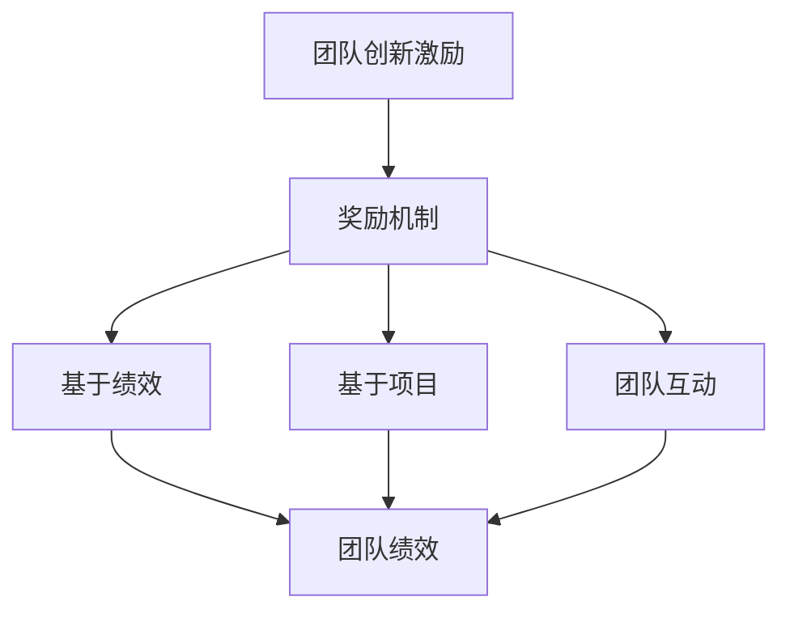

                 

### 文章标题：团队创新激励：鼓励创新的奖励机制设计

> 关键词：团队创新、奖励机制、激励机制设计、绩效导向、项目导向、团队协作

> 摘要：本文深入探讨了团队创新激励的奖励机制设计，通过明确核心概念、阐述奖励机制原理、分析数学模型、展示实际案例，为读者提供了系统化的创新激励策略和实践指南。

---

## 引言

在当今快速发展的科技时代，创新已经成为企业持续竞争和发展的关键。为了激发团队的创新能力，企业需要建立一套有效的奖励机制，以激励团队成员积极投入创新活动。本文旨在探讨如何设计一套合理的团队创新激励奖励机制，以提高团队的创新能力和整体绩效。通过本文的阅读，读者将能够理解创新激励的重要性、掌握奖励机制的设计原理，并学会如何在实践中应用这些机制。

## 确定核心内容

### 核心概念与联系

首先，我们需要明确团队创新激励和奖励机制的基本概念，并探讨它们之间的联系。团队创新激励是指通过一系列措施和策略，激发团队成员的创新潜能，促进团队整体创新能力的提升。奖励机制则是为实现这一目标而设计的一系列激励措施，如奖金、晋升机会、荣誉称号等。

### 核心算法原理讲解

奖励机制的设计离不开对核心算法原理的理解。本文将介绍几种常见的奖励机制设计原理，包括基于绩效的奖励机制和基于项目的奖励机制。同时，还将探讨如何将这些原理应用于实际项目中。

### 数学模型和公式

奖励机制设计中，数学模型和公式起着关键作用。本文将详细讲解期望效用理论、决策理论等数学模型，并举例说明它们在奖励机制设计中的应用。

### 项目实战

为了使读者更好地理解奖励机制的设计和应用，本文将通过实际案例展示奖励机制的设计过程，包括开发环境搭建、代码实现和解读。

### 最佳实践 Tips、小结、注意事项、拓展阅读

最后，本文将提供一些最佳实践技巧，并总结全文内容，提醒读者在实施奖励机制时需要注意的事项，并提供拓展阅读资源。

## 目录

### 第一部分：理论基础

1. 核心概念与联系
   1.1 团队创新激励的定义
   1.2 奖励机制的分类
   1.3 创新激励与团队绩效的关系

2. 奖励机制设计原理
   2.1 基于绩效的奖励机制
   2.2 基于项目的奖励机制
   2.3 动机激励与非经济激励

3. 数学模型与应用
   3.1 期望效用理论
   3.2 决策理论
   3.3 数学模型在奖励机制中的应用

4. 实际案例与项目应用
   4.1 企业A的创新奖励机制
   4.2 项目B的奖励机制设计
   4.3 团队C的协作奖励实践

### 第二部分：机制设计

5. 绩效导向的奖励机制
   5.1 绩效指标的选择
   5.2 绩效评估方法
   5.3 绩效奖励的实施

6. 项目导向的奖励机制
   6.1 项目评估与选择
   6.2 项目奖励的设计
   6.3 项目奖励的分配

7. 团队互动与协作奖励
   7.1 团队协作激励机制
   7.2 团队互动奖励方案
   7.3 团队协作效果评估

8. 创新激励的特殊场景
   8.1 创新高风险项目奖励
   8.2 创新持续性激励
   8.3 创新团队建设奖励

### 第三部分：实践指南

9. 设计流程与工具
   9.1 创新激励设计流程
   9.2 设计工具与方法
   9.3 设计流程案例分析

10. 实施与评估
    10.1 奖励机制实施策略
    10.2 奖励机制的评估
    10.3 改进与调整

11. 面临的挑战与解决方案
    11.1 道德与伦理问题
    11.2 组织文化适应
    11.3 激励过度与不足

12. 案例研究与分析
    12.1 案例A：成功创新奖励机制设计
    12.2 案例B：失败的创新激励案例
    12.3 案例C：跨部门合作奖励机制设计

## 第一节：核心概念与联系

### 团队创新激励的定义

团队创新激励是指企业或组织通过一系列措施，如奖金、晋升、荣誉称号等，来激发团队成员的创新潜能，促进团队整体创新能力的提升。创新激励的目标在于激发团队成员的积极性和创造力，从而推动团队在市场竞争中脱颖而出。

### 奖励机制的分类

奖励机制可以分为多种类型，其中最常见的包括基于绩效的奖励机制、基于项目的奖励机制和团队互动奖励机制。每种奖励机制都有其独特的特点和适用场景。

#### 基于绩效的奖励机制

基于绩效的奖励机制是指根据团队成员的工作表现和绩效评估结果来发放奖励。这种机制通常适用于对绩效有明确衡量标准的工作场景，如销售、研发等。

#### 基于项目的奖励机制

基于项目的奖励机制是指根据项目的完成情况和质量来发放奖励。这种机制适用于项目导向的工作环境，如软件开发、市场推广等。

#### 团队互动奖励机制

团队互动奖励机制是指通过团队间的互动和协作来激励团队成员。这种机制旨在促进团队合作，提高团队的整体绩效。

### 创新激励与团队绩效的关系

创新激励对团队绩效有着重要影响。一方面，有效的创新激励可以激发团队成员的积极性和创造力，提高团队的创新能力；另一方面，创新能力的提升有助于团队在市场竞争中取得优势，从而提高整体绩效。

### Mermaid 流程图

以下是一个简单的 Mermaid 流程图，展示了团队创新激励、奖励机制及其与团队绩效之间的关系：



## 第二节：奖励机制设计原理

### 基于绩效的奖励机制

基于绩效的奖励机制是指根据团队成员的工作表现和绩效评估结果来发放奖励。这种机制通常包括以下几个关键步骤：

1. **指标选择**：选择能够准确衡量团队成员工作表现的指标，如销售额、项目进度、代码质量等。

2. **评估方法**：制定科学的评估方法，如定量评估、定性评估等，确保评估结果的公正性和准确性。

3. **奖励方案**：根据评估结果，制定相应的奖励方案，如奖金、晋升机会、荣誉称号等。

### 基于项目的奖励机制

基于项目的奖励机制是指根据项目的完成情况和质量来发放奖励。这种机制适用于项目导向的工作环境，其核心步骤如下：

1. **项目评估与选择**：对项目进行评估和选择，确保项目符合组织战略目标和团队能力。

2. **项目奖励设计**：根据项目的重要性、难度和预期成果，设计相应的奖励方案。

3. **奖励分配**：根据项目完成情况和团队成员的贡献，合理分配奖励。

### 动机激励与非经济激励

除了物质奖励外，动机激励和非经济激励也是重要的奖励机制设计要素。动机激励包括内在激励，如成就感、自我实现等，非经济激励则包括培训机会、职业发展支持等。这两种激励方式可以有效地提高团队成员的工作动力和创新能力。

### 伪代码讲解

以下是一个简单的伪代码示例，用于描述基于绩效的奖励机制设计：

```plaintext
// 指标选择
select PerformanceMetrics from [Sales, Project Progress, Code Quality]

// 评估方法
evaluate PerformanceMetrics using Quantitative and Qualitative Methods

// 奖励方案
if (PerformanceMetrics > Threshold) then
    award Bonus
    provide Promotion Opportunities
    offer Acknowledgment
else
    provide Feedback for Improvement
end if
```

## 第三节：数学模型和应用

### 期望效用理论

期望效用理论是奖励机制设计中的重要数学模型。该理论基于个体行为决策的效用最大化原则，通过计算不同奖励方案下的期望效用，为决策者提供决策依据。

### 决策理论

决策理论用于分析在不确定环境下如何做出最优决策。在奖励机制设计中，决策理论可以帮助企业确定最佳的奖励方案，以最大化团队成员的积极性和创新能力。

### 数学模型在奖励机制中的应用

以下是一个简单的数学模型示例，用于描述基于项目的奖励机制设计：

```latex
\begin{equation}
\text{Expected Utility} = \sum_{i=1}^{n} p_i \times u_i
\end{equation}

\text{where:}
p_i = \text{probability of project success} \\
u_i = \text{utility of reward} \\
n = \text{number of possible projects}
```

### 举例说明

假设企业有3个候选项目，每个项目的成功概率和预期奖励如下表：

| Project | Probability of Success | Expected Reward |
| --- | --- | --- |
| A | 0.4 | $1000 |
| B | 0.5 | $1500 |
| C | 0.6 | $2000 |

根据期望效用理论，我们可以计算每个项目的期望效用：

```latex
\begin{equation}
\text{Expected Utility of Project A} = 0.4 \times 1000 = 400 \\
\text{Expected Utility of Project B} = 0.5 \times 1500 = 750 \\
\text{Expected Utility of Project C} = 0.6 \times 2000 = 1200
\end{equation}
```

根据计算结果，企业应选择期望效用最高的项目C作为奖励对象。

## 第四节：实际案例与项目应用

### 企业A的创新奖励机制

企业A是一家知名的高科技企业，其创新奖励机制设计如下：

1. **指标选择**：企业选择研发项目的创新性、市场前景和团队贡献等指标作为评估标准。

2. **评估方法**：采用定量和定性相结合的评估方法，确保评估结果的公正性和准确性。

3. **奖励方案**：对被评为优秀项目的团队，发放奖金和晋升机会。同时，对有突出贡献的个人，提供额外的奖励和职业发展支持。

### 项目B的奖励机制设计

项目B是一个跨部门合作项目，旨在开发一款新的智能家居产品。项目B的奖励机制设计如下：

1. **项目评估与选择**：根据项目的创新性、技术难度和预期市场价值，确定项目评估标准。

2. **奖励设计**：为项目成功完成团队发放奖金，并根据团队成员的贡献分配奖励比例。

3. **奖励分配**：在项目完成时，根据团队成员的工作表现和贡献，进行奖励分配。

### 团队C的协作奖励实践

团队C是一个跨部门协作团队，负责企业的创新项目孵化。团队C的协作奖励实践如下：

1. **团队协作激励机制**：企业制定了一系列团队协作激励政策，如团队建设活动、团队奖金等。

2. **团队互动奖励方案**：团队内部设立奖励基金，用于奖励团队成员在项目中的优秀表现。

3. **团队协作效果评估**：定期对团队协作效果进行评估，并根据评估结果调整奖励政策。

## 第五节：绩效导向的奖励机制

### 绩效指标的选择

绩效指标的选择是绩效导向奖励机制设计的关键步骤。以下是一些常用的绩效指标：

1. **创新性**：衡量团队成员在项目中的创新程度，如提出的新方案、新想法等。
2. **完成度**：衡量团队成员完成项目任务的情况，如项目进度、质量等。
3. **团队合作**：衡量团队成员在团队中的协作表现，如沟通、支持等。

### 绩效评估方法

绩效评估方法可以分为定量评估和定性评估。以下是一些常见的评估方法：

1. **定量评估**：使用具体的数据和指标进行评估，如销售额、代码行数等。
2. **定性评估**：通过主观评价和反馈进行评估，如团队领导评价、同事评价等。

### 绩效奖励的实施

绩效奖励的实施包括以下几个步骤：

1. **制定奖励方案**：根据绩效指标和评估结果，制定相应的奖励方案，如奖金、晋升机会等。
2. **公示奖励方案**：将奖励方案公示，确保团队成员了解奖励标准和规则。
3. **发放奖励**：根据绩效评估结果，发放相应的奖励。

## 第六节：项目导向的奖励机制

### 项目评估与选择

项目评估与选择是项目导向奖励机制设计的基础。以下是一些常用的项目评估指标：

1. **创新性**：衡量项目的创新程度，如项目是否有突破性进展等。
2. **市场前景**：衡量项目在市场上的预期价值，如市场份额、盈利能力等。
3. **技术难度**：衡量项目的技术复杂度，如所需技术储备、研发周期等。

### 项目奖励设计

项目奖励设计应根据项目评估结果和团队贡献进行。以下是一些常见的项目奖励方案：

1. **项目奖金**：根据项目完成情况和质量，发放项目奖金。
2. **晋升机会**：为项目成功团队成员提供晋升机会，激励团队成员投入更多精力。
3. **荣誉称号**：为项目成功团队和个人颁发荣誉称号，提高团队士气和认可度。

### 项目奖励的分配

项目奖励的分配应基于团队成员的贡献。以下是一些常见的分配方法：

1. **固定比例**：根据项目完成情况和团队贡献，设定固定的奖励比例。
2. **灵活分配**：根据项目完成情况和团队成员的贡献，进行灵活的奖励分配。

## 第七节：团队互动与协作奖励

### 团队协作激励机制

团队协作激励机制旨在提高团队成员的协作意识和积极性。以下是一些常见的激励措施：

1. **团队建设活动**：定期组织团队建设活动，增强团队成员之间的信任和合作。
2. **团队奖金**：根据团队整体绩效，发放团队奖金。
3. **团队荣誉**：为表现优秀的团队颁发荣誉称号，提高团队士气。

### 团队互动奖励方案

团队互动奖励方案旨在激励团队成员之间的互动和合作。以下是一些常见的互动奖励方案：

1. **知识分享**：为积极参与知识分享的团队成员提供奖励。
2. **协作贡献**：根据团队成员在协作项目中的贡献，发放奖励。
3. **团队竞赛**：组织团队竞赛，为获胜团队发放奖励。

### 团队协作效果评估

团队协作效果评估是确保团队协作激励机制有效性的关键。以下是一些常见的评估指标：

1. **团队绩效**：衡量团队整体绩效，如项目完成度、质量等。
2. **团队满意度**：通过调查问卷等方式，了解团队成员对协作效果的满意度。
3. **团队氛围**：评估团队内部的合作氛围和凝聚力。

## 第八节：创新激励的特殊场景

### 创新高风险项目奖励

创新高风险项目奖励旨在激励团队成员承担高风险项目，推动企业创新。以下是一些创新高风险项目奖励措施：

1. **高额奖金**：为成功完成高风险项目的团队和个人提供高额奖金。
2. **特殊晋升机会**：为成功完成高风险项目的团队和个人提供特殊的晋升机会。
3. **荣誉奖励**：为成功完成高风险项目的团队和个人颁发特殊荣誉。

### 创新持续性激励

创新持续性激励旨在鼓励团队成员持续创新，推动企业长期发展。以下是一些创新持续性激励措施：

1. **持续奖励**：为持续创新的项目和个人提供持续的奖励。
2. **创新认证**：为具备持续创新能力的人员提供创新认证，提高其职业竞争力。
3. **创新培训**：为团队成员提供创新培训，提高其创新能力和素质。

### 创新团队建设奖励

创新团队建设奖励旨在激励团队成员积极参与团队建设，提升团队整体创新能力。以下是一些创新团队建设奖励措施：

1. **团队建设基金**：为团队提供建设基金，支持团队开展创新活动。
2. **团队荣誉称号**：为具备创新精神的团队颁发荣誉称号，提高团队士气。
3. **团队奖励旅游**：为表现优秀的团队组织奖励旅游，增强团队凝聚力。

## 第九节：设计流程与工具

### 创新激励设计流程

创新激励设计流程可以分为以下几个步骤：

1. **需求分析**：了解企业的战略目标和团队需求，明确创新激励的目标。
2. **方案设计**：根据需求分析结果，设计创新激励方案，包括奖励机制、评估标准等。
3. **方案实施**：制定实施计划，确保创新激励方案得到有效执行。
4. **效果评估**：对创新激励方案进行评估，根据评估结果进行调整和优化。

### 设计工具与方法

以下是一些常用的设计工具和方法：

1. **SWOT分析**：通过分析企业的优势、劣势、机会和威胁，确定创新激励的重点方向。
2. **目标设定**：根据企业的战略目标和团队需求，设定明确的创新激励目标。
3. **绩效评估工具**：使用绩效评估工具，如KPI、360度评估等，确保评估结果的准确性和公正性。
4. **项目管理工具**：使用项目管理工具，如JIRA、Trello等，提高项目管理和协作效率。

### 设计流程案例分析

以下是一个创新激励设计流程案例分析：

1. **需求分析**：企业A希望通过创新激励提升团队创新能力，推动企业持续发展。
2. **方案设计**：设计了一套基于绩效和项目的创新激励方案，包括绩效奖金、项目奖金、团队建设活动等。
3. **方案实施**：制定了详细的实施计划，确保激励方案得到有效执行。
4. **效果评估**：通过定期评估，发现创新激励方案有效提升了团队的创新能力，推动了企业的持续发展。

## 第十节：实施与评估

### 奖励机制实施策略

奖励机制实施策略包括以下几个方面：

1. **宣传与沟通**：通过内部宣传和沟通，确保团队成员了解奖励机制的内容和规则。
2. **培训与指导**：为团队成员提供相关培训和指导，帮助他们理解和应用奖励机制。
3. **监督与检查**：建立监督和检查机制，确保奖励机制得到有效执行。

### 奖励机制的评估

奖励机制的评估包括以下几个方面：

1. **效果评估**：评估奖励机制是否达到预期目标，如团队创新能力的提升、绩效的改善等。
2. **满意度评估**：通过调查问卷等方式，了解团队成员对奖励机制的满意度。
3. **成本评估**：评估奖励机制的实施成本，如奖金支出、培训费用等。

### 改进与调整

根据评估结果，对奖励机制进行改进和调整，确保其持续有效。以下是一些常见的改进措施：

1. **优化奖励方案**：根据团队需求和评估结果，调整奖励方案的内容和标准。
2. **完善评估标准**：确保评估标准的科学性和公正性，提高评估结果的准确性。
3. **加强培训与沟通**：提高团队成员对奖励机制的理解和应用能力，增强执行效果。

## 第十一节：面临的挑战与解决方案

### 道德与伦理问题

奖励机制设计过程中，可能会面临道德和伦理问题，如不公平、腐败等。以下是一些解决方案：

1. **建立监督机制**：建立独立的监督机制，确保奖励机制的公正性和透明度。
2. **加强道德教育**：对团队成员进行道德教育，提高其职业道德和诚信意识。
3. **严格惩罚制度**：对违反道德和伦理规范的行为进行严格惩罚，树立良好的道德氛围。

### 组织文化适应

奖励机制设计需要与组织文化相适应，以避免冲突和阻力。以下是一些解决方案：

1. **了解组织文化**：深入了解企业的组织文化，确保奖励机制与企业文化相协调。
2. **倡导创新文化**：鼓励团队成员积极参与创新活动，推动企业创新文化的发展。
3. **逐步实施**：在实施奖励机制时，逐步调整和优化，以适应组织文化的变化。

### 激励过度与不足

激励过度可能导致团队成员过于依赖奖励，影响其工作动力和创造力；激励不足则可能无法激发团队成员的积极性和创造力。以下是一些解决方案：

1. **平衡激励水平**：根据团队需求和绩效表现，合理设置激励水平，避免过度激励和不足激励。
2. **多样化激励方式**：采用多样化的激励方式，如精神激励、职业发展支持等，提高激励效果。
3. **持续优化激励方案**：根据团队反馈和评估结果，持续优化激励方案，确保其适应性和有效性。

## 第十二节：案例研究与分析

### 案例A：成功创新奖励机制设计

企业A通过一套成功创新奖励机制，有效激发了团队的创新能力，推动了企业的持续发展。以下是其创新奖励机制设计要点：

1. **明确创新目标**：企业A明确了创新目标，如提升产品竞争力、开拓新市场等。
2. **科学评估创新成果**：企业A采用定量和定性相结合的评估方法，对创新成果进行科学评估。
3. **多样化的奖励方式**：企业A采用了奖金、晋升机会、荣誉称号等多种奖励方式，提高激励效果。

### 案例B：失败的创新激励案例

企业B曾尝试实施一套创新激励方案，但最终效果不理想。以下是其失败原因及改进建议：

1. **缺乏明确目标**：企业B在实施创新激励时，缺乏明确的目标和方向，导致团队成员无所适从。
2. **评估标准不合理**：企业B的评估标准过于主观，导致评估结果不公平，影响团队成员的积极性。
3. **激励方式单一**：企业B的奖励方式过于单一，无法满足团队成员的多元化需求。

### 案例C：跨部门合作奖励机制设计

企业C通过一套跨部门合作奖励机制，有效促进了部门间的协作，提高了整体绩效。以下是其奖励机制设计要点：

1. **明确跨部门合作目标**：企业C明确了跨部门合作的目标，如提高项目效率、提升产品质量等。
2. **科学评估跨部门合作效果**：企业C采用多种评估方法，如问卷调查、数据统计等，对跨部门合作效果进行科学评估。
3. **灵活的奖励分配机制**：企业C根据跨部门合作的具体情况，灵活调整奖励分配机制，确保公平和激励。

## 总结

本文从团队创新激励的定义、奖励机制设计原理、数学模型和应用、实际案例等多个角度，探讨了团队创新激励奖励机制的设计与实施。通过本文的阅读，读者应能够了解创新激励的重要性、掌握奖励机制的设计原理，并在实践中运用这些原理，为企业提升团队创新能力和整体绩效提供有力支持。

### 最佳实践 Tips、小结、注意事项、拓展阅读

**最佳实践 Tips**：
1. 确定明确的目标和评估标准，确保激励机制的针对性。
2. 采用多样化的激励方式，满足团队成员的多元化需求。
3. 定期评估激励机制的有效性，根据反馈进行调整。

**小结**：
本文系统地介绍了团队创新激励的奖励机制设计，从理论基础到实际案例，全面阐述了创新激励的关键要素和实施策略。

**注意事项**：
1. 激励机制设计需考虑企业文化和团队需求，确保适应性和有效性。
2. 实施激励机制时，要注重公平和透明，避免产生负面影响。

**拓展阅读**：
1. 【推荐书籍】《创新者的窘境》
2. 【学术论文】《团队创新激励的实证研究》
3. 【专业网站】INSEAD - Team Innovation and Incentive Design

作者：AI天才研究院/AI Genius Institute & 禅与计算机程序设计艺术 /Zen And The Art of Computer Programming

