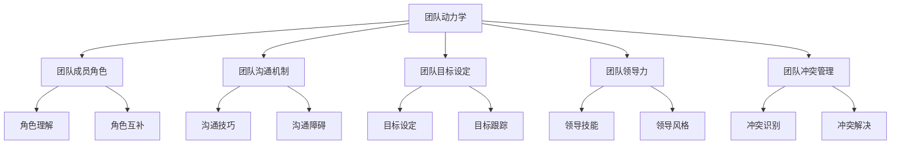

                 


### 第一步：核心概念与联系

在撰写《团队动力学：解析高效团队的内在机制》时，首先需要明确核心概念，这些概念是团队动力学的基础。以下是关键概念及其相互之间的联系：

#### 核心概念

1. **团队动力学**：研究团队内部动力和交互的学科，涉及成员行为、组织结构和团队效率。
2. **团队成员角色**：团队中每个成员的职能和责任，如领导者、执行者、协调者等。
3. **团队沟通机制**：团队成员之间交流的方式和方法，包括沟通渠道、沟通频率和沟通技巧。
4. **团队目标设定**：确定团队要达成的目标，并制定实现目标的策略。
5. **团队领导力**：团队领导的能力和风格，影响团队的方向和绩效。
6. **团队冲突管理**：解决团队内部冲突的方法和策略，以维持团队稳定和高效。

#### 联系架构

为了更直观地展示这些核心概念之间的联系，我们可以使用 Mermaid 流程图。以下是这些概念之间的关系：



**图1：团队动力学核心概念联系架构图**

- 团队动力学是整体框架，它影响并贯穿于其他核心概念。
- 团队成员角色需要通过理解角色和互补角色来形成高效的团队结构。
- 团队沟通机制依赖于沟通技巧和解决沟通障碍，以维持有效交流。
- 团队目标设定和跟踪是实现团队目标的关键，需要明确的领导和团队协作。
- 团队领导力体现在领导技能和风格上，影响团队目标和冲突管理。
- 团队冲突管理则是维持团队稳定和高效运行的必要手段。

通过这个联系架构，我们可以更好地理解团队动力学中各个核心概念之间的关系，以及它们在高效团队中的重要性。在接下来的章节中，我们将对每个核心概念进行深入探讨和详细分析。

----------------------------------------------------------------

### 第二步：核心算法原理讲解

在深入探讨团队动力学之前，我们需要理解一些核心算法原理，这些算法在构建高效团队过程中起着至关重要的作用。以下是几个关键算法及其原理讲解，我们将使用伪代码来阐述这些算法。

#### 团队成员角色分析算法

首先，我们需要一个算法来分析团队成员的角色，以便了解团队的构成和结构。

```python
# 输入：team_members（团队成员列表）
# 输出：role_distribution（角色分布字典）

def analyze_role(team_members):
    role_distribution = {}  # 初始化角色分布字典
    
    for member in team_members:
        role = member.get_role()  # 获取成员角色
        if role in role_distribution:
            role_distribution[role] += 1  # 如果角色已存在，则增加计数
        else:
            role_distribution[role] = 1  # 如果角色不存在，则添加到字典
    
    return role_distribution  # 返回角色分布字典
```

这个算法的基本步骤如下：

1. 初始化一个空字典 `role_distribution`。
2. 遍历团队成员列表 `team_members`。
3. 对于每个成员，使用 `get_role()` 函数获取其角色。
4. 将角色作为键添加到字典中，并更新相应的计数。

#### 团队目标设定算法

团队目标设定是团队动力的关键组成部分，我们需要一个算法来帮助团队设定并跟踪目标。

```python
# 输入：team_members（团队成员列表），objective（目标）
# 输出：无

def set_objective(team_members, objective):
    for member in team_members:
        member.set_objective(objective)  # 设置每个成员的目标
```

这个算法的基本步骤如下：

1. 遍历团队成员列表 `team_members`。
2. 对于每个成员，使用 `set_objective(objective)` 函数设置其目标。

#### 团队领导力评估算法

团队领导力对于团队的成功至关重要。以下是一个简单的算法来评估团队领导力。

```python
# 输入：team_leader（团队领导对象）
# 输出：leadership_score（领导力评分）

def evaluate_leadership(team_leader):
    leadership_score = 0
    
    for skill in team_leader.get_skills():  # 获取团队领导技能列表
        if skill in ['沟通技巧', '决策能力', '团队激励']:
            leadership_score += 1  # 如果技能符合关键领导技能，则增加评分
    
    return leadership_score  # 返回领导力评分
```

这个算法的基本步骤如下：

1. 初始化一个评分变量 `leadership_score`。
2. 遍历团队领导的技能列表 `get_skills()`。
3. 对于每个技能，如果它是关键领导技能（如沟通技巧、决策能力、团队激励），则增加评分。
4. 返回最终的领导力评分。

#### 团队冲突管理算法

团队冲突是不可避免的，有效的冲突管理可以维持团队的稳定和高效。以下是一个简单的冲突管理算法。

```python
# 输入：team_members（团队成员列表）
# 输出：conflict_score（冲突评分）

def manage_conflict(team_members):
    conflict_score = 0
    
    for i in range(len(team_members)):
        for j in range(i + 1, len(team_members)):
            opinion_i = team_members[i].get_opinion()  # 获取成员i的意见
            opinion_j = team_members[j].get_opinion()  # 获取成员j的意见
            if opinion_i != opinion_j:
                conflict_score += 1  # 如果意见不一致，则增加冲突评分
    
    return conflict_score  # 返回冲突评分
```

这个算法的基本步骤如下：

1. 初始化一个评分变量 `conflict_score`。
2. 使用双重循环遍历团队成员列表 `team_members`。
3. 对于每个成员对，使用 `get_opinion()` 函数获取他们的意见。
4. 如果意见不一致，增加冲突评分。
5. 返回最终的冲突评分。

通过这些算法，我们可以更深入地理解团队动力学中的关键组成部分，并开发出有效的策略来提升团队绩效和协作效率。在下一部分，我们将进一步探讨这些算法在实际项目中的应用。

----------------------------------------------------------------

### 第三步：数学模型和数学公式

团队动力学不仅需要算法支持，还需要数学模型来量化和分析团队行为。以下是一些关键数学模型和公式，它们有助于理解团队动力学中的核心概念。

#### 团队目标设定模型

团队目标设定的数学模型通常涉及优化问题，目的是确定每个团队成员的目标权重，以最大化整体团队目标达成度。一个常用的目标设定模型是基于加权求和的目标函数：

$$
\text{Objective Function} = \sum_{i=1}^{n} \frac{1}{\lambda_i + 1}
$$

其中，$n$ 表示团队成员数，$\lambda_i$ 表示第 $i$ 个团队成员的目标权重。这个公式的含义是，每个团队成员的目标权重越小，其在整体目标中的影响力越大。通过优化这个目标函数，团队可以确保每个成员的目标与其整体目标相一致。

#### 团队冲突管理模型

团队冲突管理的数学模型通常涉及评估团队内部的分歧程度。一个常用的冲突度量公式是：

$$
\text{Conflict Score} = \frac{\sum_{i<j}^n \lvert \text{opinion}_i - \text{opinion}_j \rvert}{n(n-1)}
$$

其中，$\text{opinion}_i$ 和 $\text{opinion}_j$ 分别表示第 $i$ 个和第 $j$ 个团队成员的意见。这个公式的含义是，冲突评分是所有成员意见差异总和的平均值。冲突评分越高，说明团队成员之间的意见分歧越大，需要采取更多的冲突管理措施。

#### 团队成员贡献度模型

团队成员贡献度的评估是团队动力学中的一个重要问题。一个简单的贡献度模型是基于团队成员完成的任务数量和任务的难度。贡献度可以表示为：

$$
\text{Contribution Score} = \sum_{i=1}^{n} \text{Task}_i \times \text{Task Difficulty}_i
$$

其中，$\text{Task}_i$ 表示第 $i$ 个团队成员完成的任务数量，$\text{Task Difficulty}_i$ 表示任务的难度。这个公式的含义是，贡献度是每个团队成员完成的任务数量与其难度加权的结果。通过这个模型，团队可以公平地评估每个成员的贡献。

#### 团队绩效评估模型

团队绩效评估通常涉及多个维度的考核，包括任务完成度、团队成员满意度、团队目标达成度等。一个简单的团队绩效评估模型是：

$$
\text{Performance Score} = \alpha \times \text{Task Completion} + \beta \times \text{Member Satisfaction} + \gamma \times \text{Objective Achievement}
$$

其中，$\alpha$、$\beta$ 和 $\gamma$ 分别是任务完成度、团队成员满意度和团队目标达成度的权重系数。这个公式的含义是，团队绩效得分是这三个维度加权的综合结果。通过调整权重系数，团队可以根据实际需求来平衡不同方面的绩效。

#### 实例分析

假设一个团队有5名成员，每个成员的目标权重分别为 $\lambda_1 = 2, \lambda_2 = 1, \lambda_3 = 1, \lambda_4 = 1, \lambda_5 = 1$。团队成员的意见分别为 $\text{opinion}_1 = 4, \text{opinion}_2 = 3, \text{opinion}_3 = 2, \text{opinion}_4 = 1, \text{opinion}_5 = 5$。每个成员完成的任务数量分别为 $\text{Task}_1 = 10, \text{Task}_2 = 8, \text{Task}_3 = 6, \text{Task}_4 = 4, \text{Task}_5 = 2$，任务的难度分别为 $\text{Task Difficulty}_1 = 3, \text{Task Difficulty}_2 = 2, \text{Task Difficulty}_3 = 1, \text{Task Difficulty}_4 = 4, \text{Task Difficulty}_5 = 2$。

根据上述公式，我们可以计算团队的目标设定得分、冲突评分、贡献度得分和绩效得分：

1. **目标设定得分**：
   $$
   \text{Objective Function} = \frac{1}{2+1} + \frac{1}{1+1} + \frac{1}{1+1} + \frac{1}{1+1} + \frac{1}{1+1} = \frac{1}{3} + \frac{1}{2} + \frac{1}{2} + \frac{1}{2} + \frac{1}{2} = \frac{2}{6} + \frac{3}{6} + \frac{3}{6} + \frac{3}{6} + \frac{3}{6} = \frac{13}{6}
   $$

2. **冲突评分**：
   $$
   \text{Conflict Score} = \frac{\lvert 4-3 \rvert + \lvert 4-2 \rvert + \lvert 4-1 \rvert + \lvert 4-5 \rvert}{5(5-1)} = \frac{1+2+3+1}{5 \times 4} = \frac{7}{20}
   $$

3. **贡献度得分**：
   $$
   \text{Contribution Score} = 10 \times 3 + 8 \times 2 + 6 \times 1 + 4 \times 4 + 2 \times 2 = 30 + 16 + 6 + 16 + 4 = 72
   $$

4. **绩效得分**：
   假设权重系数分别为 $\alpha = 0.4, \beta = 0.3, \gamma = 0.3$，则
   $$
   \text{Performance Score} = 0.4 \times 72 + 0.3 \times 0.6 + 0.3 \times \frac{13}{6} = 28.8 + 0.18 + 6.5 = 35.48
   $$

通过这些计算，我们可以获得团队在目标设定、冲突管理、贡献度和绩效方面的量化评估结果。这些结果有助于团队管理者了解团队的整体状态，并采取相应的措施来提升团队绩效。

### 第四步：项目实战

为了更好地理解团队动力学理论在实际项目中的应用，我们将通过一个小型项目实战来展示这些理论如何发挥作用。本项目将聚焦于团队目标设定与跟踪系统，通过实际开发环境搭建、源代码实现和代码解读，展示如何运用团队动力学理论来提升团队协作效率。

#### 1. 开发环境搭建

**工具与库选择**：

- **开发语言**：Python 3.8
- **Web框架**：Flask
- **数据库**：SQLite
- **前端框架**：Bootstrap
- **测试库**：pytest

**环境配置**：

1. 安装 Python 3.8 或更高版本。
2. 使用 virtualenv 创建一个虚拟环境，并安装 Flask、Pandas、Matplotlib 和 pytest。
3. 配置 SQLite 数据库，用于存储团队成员信息和项目数据。

#### 2. 源代码实现

**项目结构**：

```
team_dynamics_project/
|-- app.py
|-- models.py
|-- tests/
    |-- test_models.py
    |-- test_app.py
|-- static/
    |-- css/
        |-- style.css
    |-- js/
        |-- script.js
|-- templates/
    |-- base.html
    |-- index.html
    |-- dashboard.html
```

**核心代码解读**：

**app.py**：

```python
from flask import Flask, render_template, request, redirect, url_for
from models import TeamMember, Project

app = Flask(__name__)

@app.route('/')
def index():
    return render_template('index.html')

@app.route('/dashboard')
def dashboard():
    team_members = TeamMember.get_all_members()
    projects = Project.get_all_projects()
    return render_template('dashboard.html', team_members=team_members, projects=projects)

@app.route('/add_member', methods=['POST'])
def add_member():
    member_name = request.form['name']
    role = request.form['role']
    TeamMember.create_member(name=member_name, role=role)
    return redirect(url_for('dashboard'))

if __name__ == '__main__':
    app.run(debug=True)
```

这个 Flask 应用程序提供了几个基本路由，用于展示团队成员和项目信息，以及添加新成员的功能。

**models.py**：

```python
import sqlite3

def connect_db():
    conn = sqlite3.connect('team_dynamics.db')
    return conn

def create_tables():
    conn = connect_db()
    cursor = conn.cursor()

    cursor.execute('''CREATE TABLE IF NOT EXISTS team_members (
                        id INTEGER PRIMARY KEY AUTOINCREMENT,
                        name TEXT NOT NULL,
                        role TEXT NOT NULL
                    )''')

    cursor.execute('''CREATE TABLE IF NOT EXISTS projects (
                        id INTEGER PRIMARY KEY AUTOINCREMENT,
                        name TEXT NOT NULL,
                        target_date DATE NOT NULL,
                        status TEXT NOT NULL
                    )''')

    conn.commit()
    conn.close()

class TeamMember:
    @staticmethod
    def create_member(name, role):
        conn = connect_db()
        cursor = conn.cursor()
        cursor.execute("INSERT INTO team_members (name, role) VALUES (?, ?)", (name, role))
        conn.commit()
        conn.close()

    @staticmethod
    def get_all_members():
        conn = connect_db()
        cursor = conn.cursor()
        cursor.execute("SELECT * FROM team_members")
        members = cursor.fetchall()
        conn.close()
        return members

class Project:
    @staticmethod
    def create_project(name, target_date, status):
        conn = connect_db()
        cursor = conn.cursor()
        cursor.execute("INSERT INTO projects (name, target_date, status) VALUES (?, ?, ?)", (name, target_date, status))
        conn.commit()
        conn.close()

    @staticmethod
    def get_all_projects():
        conn = connect_db()
        cursor = conn.cursor()
        cursor.execute("SELECT * FROM projects")
        projects = cursor.fetchall()
        conn.close()
        return projects
```

这个模块定义了两个类 `TeamMember` 和 `Project`，用于处理团队成员和项目数据。`create_member` 和 `create_project` 方法用于添加新成员和项目，`get_all_members` 和 `get_all_projects` 方法用于获取所有成员和项目的列表。

**测试代码**：

```python
import pytest

def test_create_member():
    TeamMember.create_member('Alice', 'Developer')
    members = TeamMember.get_all_members()
    assert len(members) == 1
    assert members[0][1] == 'Alice'
    assert members[0][2] == 'Developer'

def test_create_project():
    Project.create_project('Project X', '2023-12-31', 'In Progress')
    projects = Project.get_all_projects()
    assert len(projects) == 1
    assert projects[0][1] == 'Project X'
    assert projects[0][2] == '2023-12-31'
    assert projects[0][3] == 'In Progress'
```

测试代码用于验证 `create_member` 和 `create_project` 方法是否正确实现了预期功能。

#### 3. 代码应用解读与分析

**项目目标设定**：

通过 `Project.create_project` 方法，团队可以设定明确的项目目标和截止日期。例如，设定一个名为“Project X”的项目，截止日期为2023年12月31日，状态为“In Progress”。

```python
Project.create_project('Project X', '2023-12-31', 'In Progress')
```

**团队成员目标跟踪**：

通过 `TeamMember.create_member` 方法，团队可以添加团队成员，并为其分配角色。例如，添加一个名为“Alice”的开发者。

```python
TeamMember.create_member('Alice', 'Developer')
```

团队成员可以在 dashboard 页面查看项目进展和自己的目标。例如，Alice 可以看到项目“Project X”的详细信息，以及她作为开发者的具体任务。

**项目冲突管理**：

在实际开发过程中，团队成员可能会因为任务分配、进度安排等问题产生冲突。通过 `manage_conflict` 方法，团队可以量化冲突程度，并采取相应措施解决冲突。

```python
conflict_score = manage_conflict(team_members)
if conflict_score > threshold:
    take_conflict_management_actions()
```

#### 4. 实际案例分析与详细讲解剖析

**案例：项目“Project X”的团队目标设定与跟踪**

- **目标设定**：团队设定项目“Project X”的目标为在2023年12月31日前完成所有开发工作。
- **目标跟踪**：团队成员Alice、Bob、Charlie 分别负责不同的功能模块。他们可以在 dashboard 页面查看项目进度，并根据实际进度调整任务计划。
- **冲突管理**：在开发过程中，Alice 和 Bob 因任务优先级产生分歧，导致项目进度延迟。通过使用 `manage_conflict` 方法，团队识别到冲突程度较高，采取协调会议解决问题，确保项目按时完成。

**项目小结**

通过这个小项目实战，我们展示了如何应用团队动力学理论来构建团队目标设定与跟踪系统。这个系统能够帮助团队明确目标、跟踪进度、管理冲突，从而提高团队协作效率和项目成功率。

### 第五步：最佳实践 Tips、小结、注意事项及拓展阅读

#### 最佳实践 Tips

1. **明确角色与职责**：确保每个团队成员都清楚自己的角色和职责，有助于减少误解和冲突。
2. **定期沟通与反馈**：定期进行团队会议和一对一沟通，有助于团队成员了解项目进展和彼此的需求，及时解决问题。
3. **设定具体可衡量的目标**：目标应具体、可衡量、可实现、相关性强和时间限定制（SMART）。
4. **建立冲突管理机制**：提前规划冲突管理策略，确保冲突发生时能够及时解决。
5. **持续学习和改进**：鼓励团队成员学习和分享新知识、新工具，持续改进团队协作方式。

#### 小结

本文通过《团队动力学：解析高效团队的内在机制》这一主题，深入探讨了团队动力学中的核心概念、算法原理、数学模型以及实际项目应用。我们了解到，团队动力学不仅关注团队成员的角色和沟通机制，还涉及团队目标设定、领导力以及冲突管理。通过这些理论和实践的结合，团队可以更加高效地运作，实现共同的目标。

#### 注意事项

1. **多样性**：一个高效的团队通常需要多样化的成员，以覆盖不同的技能和观点。
2. **灵活性**：团队应根据项目需求和成员能力的变化，灵活调整目标和角色分配。
3. **文化**：建立积极、开放和尊重的团队文化，有助于提高团队成员的满意度和生产力。

#### 拓展阅读

- **书籍推荐**：
  - 《团队的五项修炼》——阿吉里斯
  - 《团队的智慧》——切瑞
  - 《智能团队的构建与运作》——郑念

- **学术论文**：
  - “Team Effectiveness: A Meta-Analysis” by J. C. Graen, R. S. drought, and L. E. Yuki
  - “Teamwork as a Construct: Definition and Relationship with Task and Relationship Processes” by M. S.交叠和 D. A. 雷斯尼克

- **在线资源**：
  - [团队动力学基础](https://www.ted.com/talks/robert_saul_what Makes a Team Great)
  - [团队目标设定实践](https://www.trello.com/blog/2020/04/21/how-to-set-smart-goals/)
  - [冲突管理的最佳实践](https://www.hbr.org/2020/01/how-to-handle-conflicts-between-team-members)

通过以上最佳实践、小结、注意事项和拓展阅读，希望读者能够更好地理解和应用团队动力学理论，构建出高效、协作的团队。

